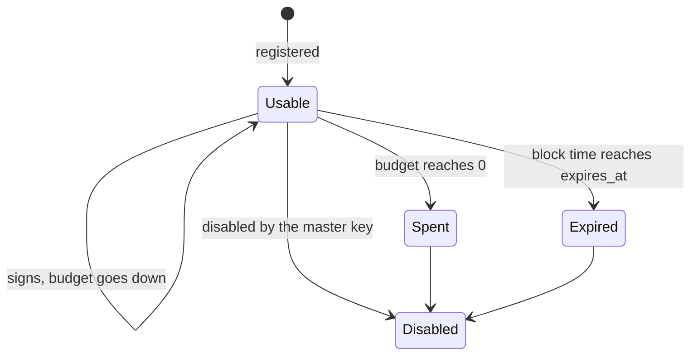
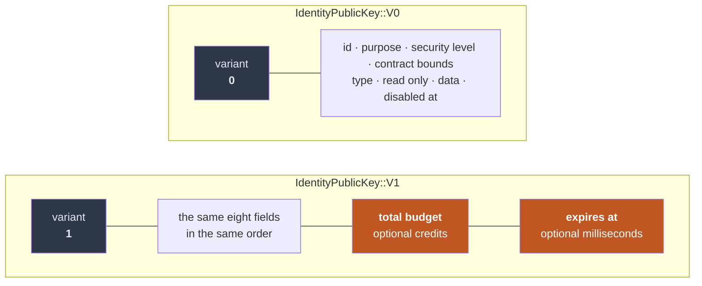
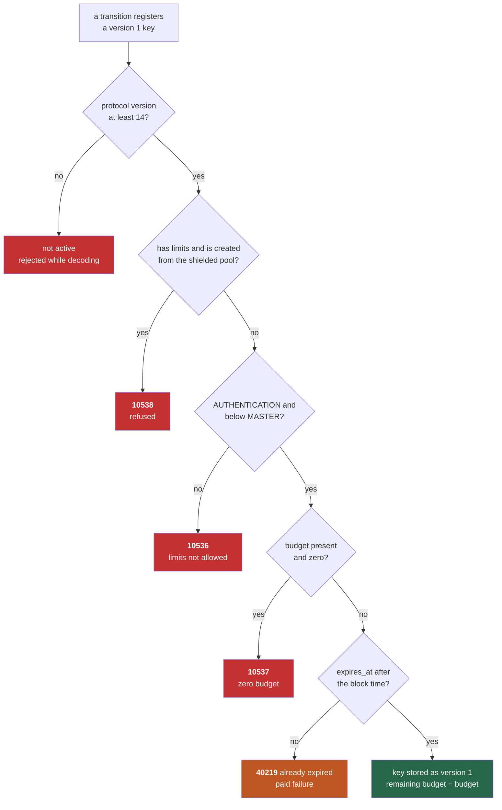
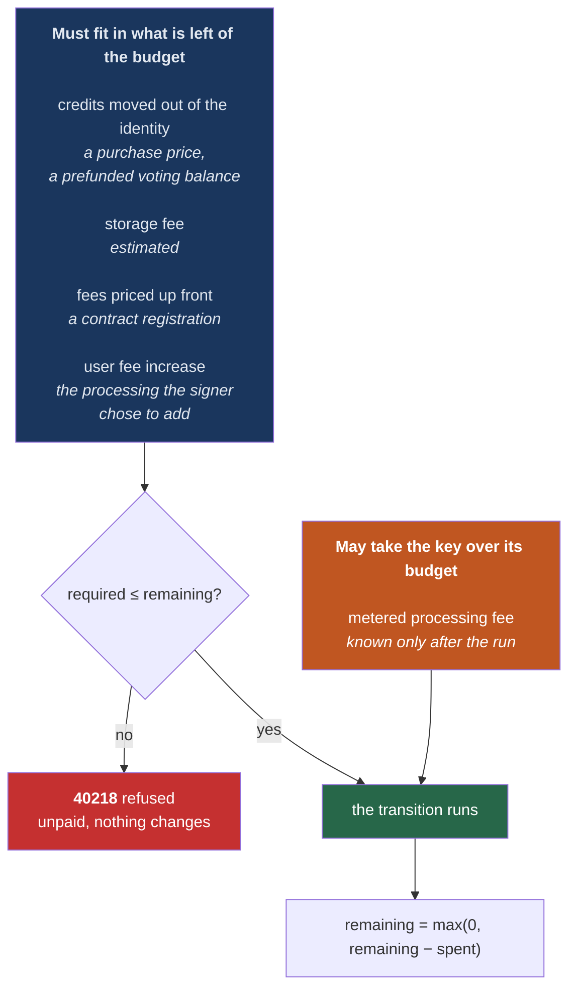
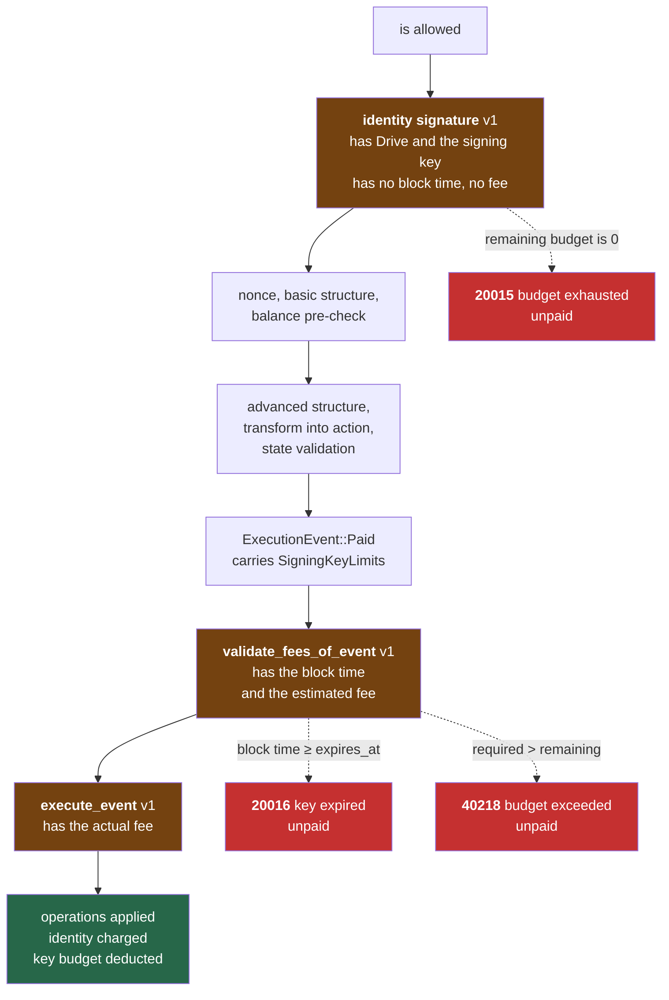
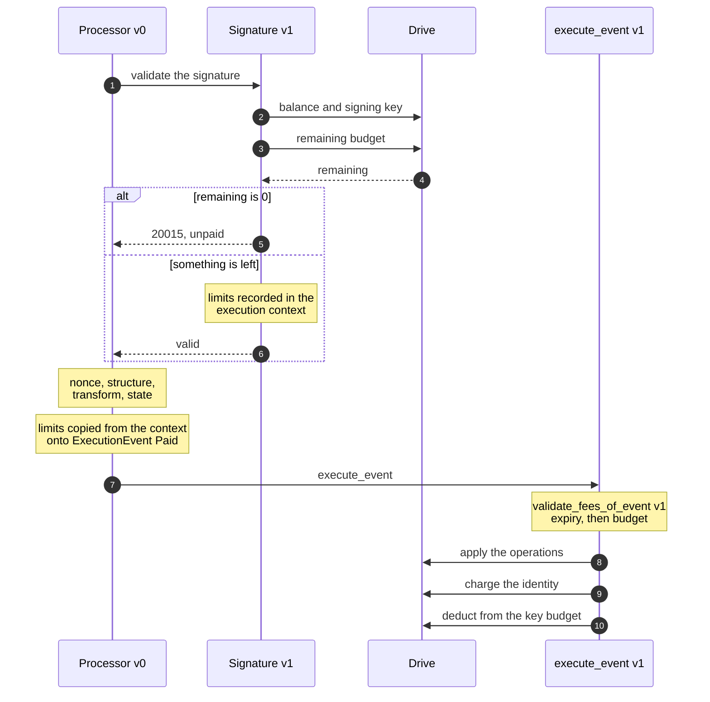
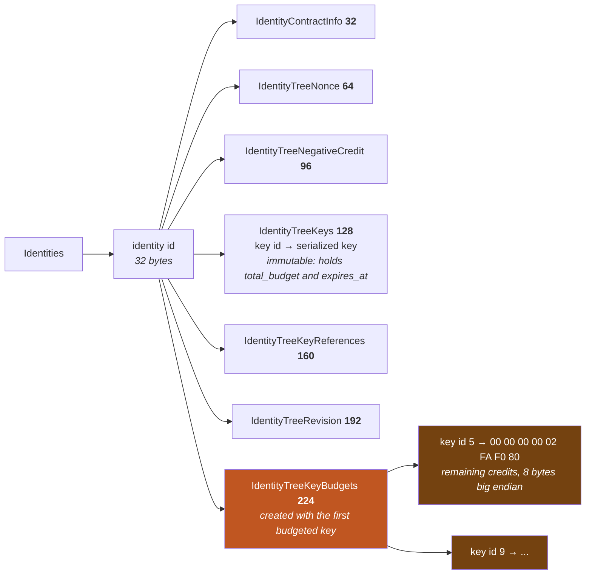
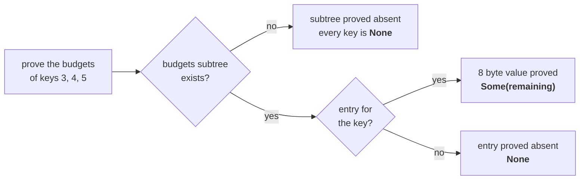

# Key Budgets and Expiry

An identity rarely signs everything itself. A wallet hands a key to a game, a social client, a bot, and from then on that application signs state transitions on the identity's behalf and the identity's balance pays for them. [Contract bounds](../sdk/identity-keys.md#contract-bounds) already limit *where* such a key may act: one contract, one document type, or one [contract group](contract-groups.md). Until protocol version 14 nothing limited *how much* it could spend or *for how long*. A key bound to one contract could still burn the whole identity balance on that contract, and it kept working until somebody remembered to disable it.

A **budget** and an **expiry** close that gap. They are two optional properties of an AUTHENTICATION key. A budgeted key can take at most so many credits from its identity; an expiring key stops signing at a given block time. Either one, or both, and both combine freely with contract bounds: bounds say where, limits say how much and for how long. When a limit is reached nothing has to be revoked. The key simply stops being accepted.

This chapter calls the two properties together **limits**. It covers the key format that carries them, the rule that decides what counts against a budget, where in the validation pipeline each check runs and why it runs there, and how Drive keeps the running total.

## The Model

Five facts define a limited key:

1. **Limits are opt-in per key and live on a new key version.** `IdentityPublicKey::V1` is the version 0 key followed by `total_budget` and `expires_at`. Every key that existed before, and every key without limits registered after, is still a version 0 key with the same bytes as ever.
2. **Only AUTHENTICATION keys below MASTER may carry them.** The master key is what registers a replacement when a key runs out, so it must never run out itself. TRANSFER, ENCRYPTION and DECRYPTION keys cannot be limited.
3. **Limits are signed and immutable.** They are part of the signable bytes of the transition that registers the key, and there is no transition that changes them. To give an application more, register another key.
4. **A budget caps what leaves the identity, and only goes down.** Fees, and credits the transition moves out (a document purchase, a prefunded voting balance), count against it. Storage refunds do not top it up. What is left is tracked by Drive next to the key, because the key itself never changes.
5. **An expiry is a block time.** `expires_at` is an absolute timestamp in milliseconds, the same unit and clock as `disabled_at`. The key signs at `expires_at - 1` and not at `expires_at`.

A limited key moves through a small set of states, and only the first one can sign:



Spent and Expired are not written anywhere as a flag. Spent is the remaining budget in Drive being zero, and a spent key is refused at signature validation with `PublicKeyBudgetExhaustedError` (20015). Expired is a comparison against the block time, and an expired key is refused at fee validation with `PublicKeyExpiredError` (20016). Disabling works exactly as before and is independent of the limits: a master key can disable a limited key in any state.

## The Version 1 Key

`IdentityPublicKeyV1` lives in `packages/rs-dpp/src/identity/identity_public_key/v1/mod.rs`:

```rust
pub struct IdentityPublicKeyV1 {
    pub id: KeyID,
    pub purpose: Purpose,
    pub security_level: SecurityLevel,
    pub contract_bounds: Option<ContractBounds>,
    #[serde(rename = "type")]
    pub key_type: KeyType,
    pub read_only: bool,
    pub data: BinaryData,
    pub disabled_at: Option<TimestampMillis>,
    /// The total credits that state transitions signed with this key may take from the identity.
    pub total_budget: Option<Credits>,
    /// The block time, in milliseconds, from which the key can no longer sign.
    pub expires_at: Option<TimestampMillis>,
}
```

The field is called `total_budget`, not `budget`, because it is the fixed amount the identity granted and never changes. What is left of it is a different number, kept by Drive, and the code calls that one the remaining budget throughout.

The first eight fields are the version 0 fields in the same order, so the two encodings differ only by the variant byte and the two trailing options. Version 0 is every key from before protocol version 14 and every key without limits; version 1 is a key that may carry them:



`IdentityPublicKeyInCreationV1` mirrors it in `public_key_in_creation/v1/mod.rs`, with `total_budget` and `expires_at` placed before the `signature`. Only the signature is excluded from the signable bytes, so the identity signs the limits it grants and a test pins it: changing a budget changes the signable bytes, changing the key's own signature does not.

In JSON the key is tagged `"$formatVersion": "1"` and the two fields appear as `totalBudget` and `expiresAt`. Like `disabledAt`, they are left out when absent.

### Reading and Building

Call sites never match on the variant. `IdentityPublicKeyGettersV1` (`accessors/v1/mod.rs`) is implemented on the enum and on both structs, and a version 0 key answers `None`:

```rust
pub trait IdentityPublicKeyGettersV1 {
    fn total_budget(&self) -> Option<Credits>;
    fn expires_at(&self) -> Option<TimestampMillis>;

    /// The expiry instant itself is already expired.
    fn is_expired_at(&self, time_ms: TimestampMillis) -> bool { /* ... */ }
    fn has_limits(&self) -> bool { /* ... */ }
}
```

To build one, take any key and call `with_limits`. A version 0 key becomes a version 1 key and every other field is kept:

```rust
let app_key = key.with_limits(
    Some(dash_to_credits!(0.1)),          // total budget
    Some(now_ms + 30 * 24 * 3_600_000),   // expires in 30 days
);
```

The conversions between `IdentityPublicKey` and `IdentityPublicKeyInCreation` carry the limits in both directions, so the existing identity update builders register a limited key without knowing about limits. The one conversion that would lose them is building an `IdentityPublicKeyInCreationV0` directly from a key; go through the enum instead.

### The Protocol Version Gate

A binary from before this change cannot decode a version 1 key, so it rejects a transition carrying one while decoding. A new binary running protocol version 13 has to do the same, or the two would disagree during an upgrade window. `StateTransition::active_version_range` is where that is enforced: a transition carrying a version 1 key in creation is active from 14.

```rust
fn active_version_range_for_keys_in_creation(
    keys: &[IdentityPublicKeyInCreation],
    otherwise: RangeInclusive<ProtocolVersion>,
) -> RangeInclusive<ProtocolVersion> {
    if IdentityPublicKeyInCreation::first_bound_to_a_contract_group(keys).is_some()
        || IdentityPublicKeyInCreation::first_in_version_1_format(keys).is_some()
    {
        14..=LATEST_VERSION
    } else {
        otherwise
    }
}
```

The same function gates keys bound to a contract group. The predicates live on the key type (`public_key_in_creation/mod.rs`) so that every place that asks the question asks it the same way: `first_in_version_1_format` here, and `first_with_limits` for the shielded pool rule below, next to `first_bound_to_a_contract_group`. The gate is on the *variant*, not on whether limits are present: an old binary fails on the variant either way. It must also be this gate and not a structure rule, because identity create validates key structure in a paid stage. Refusing there would charge the asset lock on a new binary while an old one fails to decode, which is a state divergence.

## Registering a Limited Key

A version 1 key arrives the way any key does, in the key list of a transition that registers keys: `IdentityCreate`, `IdentityUpdate`, `IdentityCreateFromAddresses` or `IdentityCreateFromShieldedPool`. Five things can stop it, in this order:



The checks sit in the tier their inputs dictate (see [Where a check belongs](../contributing/coding-conventions.md#where-a-check-belongs)):

| Rule | Needs | Where | Error |
|---|---|---|---|
| Only AUTHENTICATION below MASTER | the key | `rs-dpp` `validate_identity_public_keys_structure` v1 | `IdentityPublicKeyLimitsNotAllowedError` 10536 |
| Budget is not zero | the key | same | `InvalidIdentityPublicKeyBudgetError` 10537 |
| Expiry is after the block time | the block time | `drive-abci` `validate_identity_public_keys_limits`, called from the four identity create and update `state/v1` validators | `IdentityPublicKeyAlreadyExpiredError` 40219 |
| No limits in a shielded identity creation | the transition | `drive-abci` `validate_shielded_proof` v1, and the transition builder | `IdentityPublicKeyLimitsNotAllowedInShieldedIdentityCreationError` 10538 |

The expiry rule exists because a key that is dead on arrival is not harmless. It still uses up its key id and, for a unique key type, registers its public key hash, which can then never be used on any identity again. The usual way to get there is passing seconds where milliseconds are expected, and the check turns that mistake into an error instead of a burnt key.

### The Shielded Pool Exception

`IdentityCreateFromShieldedPool` has no identity signature. Its authorization is the Orchard proof, the spend authorization signatures, and a binding signature over a sighash. The new identity's keys are committed into that sighash by a hand-written preimage, `identity_create_from_shielded_extra_sighash_data_v0`, which lists the key fields it binds one by one: id, purpose, security level, type, data, `read_only`, contract bounds. That layout is frozen, and it predates the version 1 key. A budget or an expiry would simply not be in it.

How exposed would the limits be? Each ECDSA or BLS key carries a proof of possession, and that signature is over the signable bytes of the whole transition, which include every key with its variant and its limits. One such key is therefore enough to pin the limits of all of them. Hash based key types must carry an empty signature, so a transition whose keys are *all* hash based has nothing signing the limits. That is not an exotic case: hash based keys are the privacy-minded choice, and privacy is why one creates an identity from the shielded pool. For such a transition a relay or a proposer could strip a budget, or move an expiry, and everything would still verify. A test pins the cause: the preimage of a key with limits and of the same key without is byte for byte identical.

The preimage stays frozen and the key is refused instead, the same decision taken for keys bound to a contract group. `validate_shielded_proof` v1 refuses a key that carries a budget or an expiry before the preimage is built, and the transition builder refuses it before a proof is generated. Add the key with an identity update once the identity exists.

The refusal is about the limits, not about the format. A version 1 key *without* limits is accepted, because everything it holds is in the layout: it binds the same preimage bytes as the version 0 key with the same fields, and a second test pins that too. This keeps shielded identity creation working if version 1 ever becomes the default key format. What it leaves possible, and only when every key is hash based, is a relay re-encoding a limit-less key from one version to the other. The two are the same key, so nothing the identity granted changes; the visible effects are two more stored bytes and a different transition hash.

> **The general lesson.** `PlatformSignable` covers a new key field automatically. The shielded preimage does not. Any future field on the key must be checked against `packages/rs-dpp/src/shielded/sighash.rs` as well.

## The Budget Rule

A budget has one subtlety, and it is the same one identity balances have. Most of what a transition costs is known before it runs, but the metered processing fee is only known afterwards. A rule that demanded the whole fee fit up front would have to use the worst-case estimate, which can be fifty times the real processing cost, and would strand the tail of every budget. A rule that checked nothing up front would let a key spend without limit.

So the cost is split. Everything that is known, chosen or priced before the transition runs must fit in what is left. Only the metered processing fee may take the key over:



In code this is `required_from_key_budget` in `validate_fees_of_event/v1/mod.rs`:

```rust
removed_balance.unwrap_or_default()
    .saturating_add(storage_fee)
    .saturating_add(additional_fixed_fee_cost.unwrap_or_default())
    .saturating_add(user_fee_increase_amount)
```

Each term is there for a reason:

- **`removed_balance`**: without it a budgeted key could drain the identity through document purchases, where the credits go to the seller and never show up as a fee.
- **Storage fee**: the part of a fee that pays for permanent state. It is the part identity balances also treat as mandatory.
- **`additional_fixed_fee_cost`**: technically a processing fee, but priced up front and large. A contract registration costs a tenth of a Dash. Letting it overshoot would make a budget of a thousand credits meaningless.
- **User fee increase**: also processing, but it is the signer's choice, up to 65,535 percent. A key that is about to run out must not be able to burn several hundred times a processing fee on its way out.

What remains, the metered base processing fee, is bounded by what one transition can do. That is the "slightly over".

### A Worked Example

Take a transition whose storage fee is 50,000,000 credits and whose metered processing fee turns out to be 2,000,000, with no user fee increase and nothing moved out of the identity. Required is 50,000,000.

| Remaining before | Outcome | Identity pays | Remaining after |
|---|---|---|---|
| 60,000,000 | runs | 52,000,000 | 8,000,000 |
| 50,000,001 | runs, processing overshoots | 52,000,000 | 0 |
| 49,999,999 | refused with 40218, unpaid | 0 | 49,999,999 |
| 0 | refused with 20015 at signature validation | 0 | 0 |

The second row is the rule in one line. The storage fits with a credit to spare, so the transition runs. The identity pays the full 52,000,000, which is 1,999,999 more than the key had left, and the remaining budget stops at zero. The key is now spent, and the fourth row is what happens to its next transition, whatever that transition costs. `should_let_only_metered_processing_take_a_key_over_its_budget` pins rows two to four against real fees.

### What Counts as Spent

After the transition runs, `execute_event` v1 deducts:

```
spent = removed_balance + the fee the identity owes, net of its own storage refunds
```

The second term is `desired_removed_balance` from `FeeResult::into_balance_change`, the same number the identity balance is charged. Three consequences:

- A deletion whose refund exceeds its fee costs the budget nothing, and a refund never adds to it. A budget only goes down.
- A failed transition that is still paid for (a penalty and a nonce bump) spends from the budget like a successful one. It goes through the same event.
- The deduction saturates at zero. It never fails and never goes negative.

This mirrors the identity balance so closely on purpose. `BalanceChange::RemoveFromBalance` already carries a `required_removed_balance` (storage) and a `desired_removed_balance` (storage plus processing), and an identity that can cover the first but not the second goes into processing debt. A key budget is the same rule with the debt replaced by "and then the key is done".

## Where the Checks Run

Three stages enforce limits at signing time. Which check goes where follows from what each stage knows:



The diagram shows the order in which the checks happen. In code the last two boxes are nested: during block execution `execute_event` calls `validate_fees_of_event` and then applies, while check tx calls `validate_fees_of_event` on its own and never executes.

**A spent key is refused first, with the signature.** Signature validation already reads the identity from Drive, so reading what is left of the budget there costs one more lookup, and an application that keeps trying with a spent key is turned away before any real work is done. This is the role the minimum balance pre-check plays for an empty identity. The read is billed as one extra key retrieval.

**Expiry waits for fee validation.** The natural place for it would be next to the `disabled_at` check, but signature validation is not given the block time, and the processor that calls it is a shipped `v0`. Threading a parameter through a shipped generation is exactly what the [versioning rules](../contributing/coding-conventions.md#shipped-generations-are-frozen) forbid, and a new generation of the processor and of check tx would copy some fourteen hundred lines to pass one integer. `validate_fees_of_event` is the first stage that has the block time, runs for every paid transition, and runs in check tx as well as in block execution. The cost of checking late is that an expired key's transition is fully validated before it is refused. An insufficient balance has always had that same profile.

**The budget comparison needs the estimated fee,** so it can only be in fee validation. **The deduction needs the actual fee,** so it can only be in execution.

### Carrying the Limits

The processor, check tx and the unversioned `create_from_state_transition_action` are all untouched. What connects the signature stage to the fee stage is the `StateTransitionExecutionContext` that already travels with every transition:



`SigningKeyLimits` (`execution/types/signing_key_limits.rs`) is three fields: the key id, `expires_at`, and the remaining budget as read at signature validation. It is `None` on the event for every transition signed by an ordinary key, and both v1 methods start by checking for it and handing everything else to their v0:

```rust
let ExecutionEvent::Paid { signing_key_limits: Some(signing_key_limits), .. } = event else {
    return self.validate_fees_of_event_v0(event, block_info, transaction, platform_version, previous_fee_versions);
};
```

An ordinary key therefore costs nothing new: no read, no write, no branch past that first line. `execute_event` v1 is narrower still. It only takes over for a *budgeted* signing key; a key that merely expires is executed by v0, which calls the fee validation dispatcher and so still reaches the expiry check.

The remaining budget read at signature time is safe to reuse at fee time because nothing can change it in between. State transitions in a block are processed one after another, each with its own signature validation, and the deduction itself re-reads the value inside the block transaction.

### Check Tx

| | First time check | Recheck | Block execution |
|---|---|---|---|
| Signature validation, spent key refused | yes | skipped | yes |
| Expiry | against the last committed block time | not checked | against the block's own time |
| Budget against the estimated fee | yes | not checked | yes |
| Deduction | never, check tx does not write | never | yes |

Recheck skips signature validation for every transition, so no key is loaded and no limits reach the event. A transition whose key expires while it waits in the mempool is therefore not evicted by a recheck. The proposer drops it at `prepare_proposal`, which is what happens to any transition that turned unpayable while it waited.

### Refusals Are Not Charged

All three signing-time refusals return an unpaid result, like `IdentityInsufficientBalanceError`. Check tx rejects the transition, a proposer removes it from the block, and a block that contains one is rejected by validators. Nothing about the identity changes: not the balance, not the budget, not the nonce.

One case deserves a sentence. An *invalid* transition is normally a paid failure: the identity is charged a penalty and its nonce is bumped. If the key that signed it has expired or cannot cover the penalty, there is nobody to charge through that key, and the transition takes the path that already exists for an invalid transition from an identity that cannot afford the penalty. It is reported as an internal error and dropped from the block. A key that may not spend is never used to charge a penalty either.

## Storage

The key is immutable, so the running total cannot live in it. It lives in a new subtree of the identity:



Three properties of this layout matter.

**It is created lazily.** New identities do not get the subtree, and identities from before protocol version 14 do not have it. `insert_identity_key_budget_operations` creates it with `batch_insert_empty_tree_if_not_exists_check_existing_operations` when the first budgeted key arrives, checking the pending operations as well as the state, because two budgeted keys can arrive in one transition. A key that only expires has no entry: there is nothing to count.

**The value is fixed width.** Eight big endian bytes, never a varint. Deducting from a budget then replaces the value without changing what is stored, so it produces no storage fee and no refund. That is what allows the deduction to be applied outside of the transition's fee, exactly like the balance write it follows. The identity's negative credit item uses the same trick for the same reason.

**It is written once with the fee and then maintained without one.** Whoever registers the key pays for the entry, and for the subtree the first time. `insert_new_unique_key` and `insert_new_non_unique_key` v1 add that write next to the key; keys cannot carry a budget before protocol version 14, so both v0s never do. From then on each deduction is an unbilled replace.

The methods live in `packages/rs-drive/src/drive/identity/key/budget/`:

| Method | Does |
|---|---|
| `insert_identity_key_budget_operations` | writes the full budget as the remaining budget of a new key, creating the subtree if needed |
| `fetch_identity_key_remaining_budget` | reads what is left; `None` for a key without a budget, including when the subtree does not exist |
| `deduct_from_identity_key_budget` | subtracts, stopping at zero, and applies; errors if the key has no entry |
| `add_estimation_costs_for_key_budgets` | the layer information for the subtree in estimation mode |

## Reading What Is Left

A spent key is refused, so a client wants to know where a budget stands before it signs. The `getIdentityKeysRemainingBudgets` query answers for several keys of one identity at once:

```text
request:  identity_id, key_ids [3, 4, 5], prove
response: 3 -> 250000000    a budgeted key
          4 -> 0            a budgeted key that is spent
          5 -> (nothing)    no budget, or no such key
```

Every requested key id is answered. A key without a budget and a key that does not exist look the same here, because the query reads the budgets subtree and nothing else; `getIdentityKeys` tells them apart. The request names at least one key, none twice, and at most `max_returned_elements` of them.

With `prove`, the answer is a GroveDB proof of the path query `[Identities, identity_id, IdentityTreeKeyBudgets]` with one query item per key id, limited to their count. The interesting part is that "no budget" is provable in all three shapes state can have:



The verifier, `Drive::verify_identity_keys_remaining_budgets`, rebuilds the same path query from the request and uses `verify_query_with_absence_proof`, so it returns one entry per requested key and never an entry that was not asked for. `packages/rs-drive/src/drive/identity/key/budget/mod.rs` pins this with a test that forges a value inside a proof and expects it to no longer verify against the state root.

The same call is available at every layer:

| Layer | Call |
|---|---|
| Drive | `fetch_identity_keys_remaining_budgets`, `prove_identity_keys_remaining_budgets`, `verify_identity_keys_remaining_budgets` |
| Rust SDK | `IdentityKeysRemainingBudgets::fetch(&sdk, IdentityKeysRemainingBudgetsQuery { identity_id, key_ids })`, also `fetch_unproved` |
| wasm-sdk | `getIdentityKeysRemainingBudgets(identityId, keyIds)`, `...WithProofInfo`, returning `Map<number, bigint \| null>` |
| js-evo-sdk | `sdk.identities.keysRemainingBudgets(identityId, keyIds)`, `keysRemainingBudgetsWithProof` |

What the query returns is the state as of the last committed block. A transition already in the mempool may spend from the budget before yours runs, so treat the number as an upper bound, not a reservation.

## Versioning Touchpoints

Everything is gated to protocol version 14. Tables that protocol version 14 already owned (it was unreleased at the time) were amended in place; one new table was needed.

| Table | Slot | Change |
|---|---|---|
| `STATE_TRANSITION_METHOD_VERSIONS_V2` (new) | `validate_identity_public_keys_structure` | 0 → 1 |
| `DRIVE_ABCI_VALIDATION_VERSIONS_V10` | `validate_identity_public_keys_limits` | new, `None` → `Some(0)` |
| | `validate_state_transition_identity_signed` | stays 1, extended in place |
| | `validate_shielded_proof` | stays 1, extended in place |
| `DRIVE_ABCI_METHOD_VERSIONS_V10` | `validate_fees_of_event` | 0 → 1 |
| | `execute_event` | 0 → 1 |
| `DRIVE_IDENTITY_METHOD_VERSIONS_V2` | `keys.insert.insert_new_unique_key`, `insert_new_non_unique_key` | 0 → 1 |
| | `keys.budget.*` (six slots, two of them for the query) | new, `None` → `Some(0)` |
| `DRIVE_ABCI_QUERY_VERSIONS_V0` and `_V1` | `identity_based_queries.keys_remaining_budgets` | new slot at 0; the Drive methods behind it are `None` before 14, which is what refuses the query there |
| `DRIVE_VERIFY_METHOD_VERSIONS_V1` | `identity.verify_identity_keys_remaining_budgets` | new, 0 (verification is client side and not gated) |

Two of these are worth a second look. Identity signature validation v1 and shielded proof validation v1 were introduced for protocol version 14 by the contract bounds work and had not shipped yet, so they were [extended in place](../contributing/coding-conventions.md#shipped-generations-are-frozen) rather than given a v2. `validate_fees_of_event` and `execute_event` had shipped, so they got new generations, and those generations delegate to v0 for every event they do not handle instead of copying it.

## Fees

Registering a budgeted key costs slightly more than registering an ordinary one: the eight byte entry, and the empty subtree the first time. Both are ordinary metered storage charged to the transition that adds the key. A key that only expires costs what a version 0 key costs plus the few bytes the two fields add to the stored key.

Signing with a budgeted key adds one fixed charge, the key retrieval that reads what is left (`fetch_single_identity_key_processing_cost`). The deduction write is not billed, like the balance write. Signing with a key that only expires adds nothing.

## What Is Not There Yet

This change is the consensus core. Known gaps, all deliberate:

- **SDK surfaces.** Rust callers can use `with_limits` today. The wasm, JavaScript, Swift and Kotlin bindings do not expose the two fields for creation, and SDK key selection does not skip an expired or spent key before signing, although the [query above](#reading-what-is-left) gives it what it needs. Swift and Kotlin do not expose that query yet.
- **Changing limits.** There is no top-up and no extension. Register a new key.
- **Limits on other purposes.** A TRANSFER key with a budget would cap transfers and withdrawals. The rule for it would differ (the amount moved is the point, not a side effect), so it was left out rather than half done.
- **Limits in a shielded identity creation.** A key with a budget or an expiry is refused there, as explained above. Lifting that means a new generation of the sighash preimage.

## Tests

- **dpp** (`identity_public_key/v1`, `public_key_in_creation/v1`, `validate_identity_public_keys_structure/v1`, `state_transition/mod.rs`): the version 1 round trip; the version 0 encoding unchanged byte for byte; the JSON shape; the expiry boundary; limits surviving the conversions and being signed over; the structure rules; the protocol version 13 and 14 sides of the decode gate; frozen error discriminants.
- **drive** (`drive/identity/key/budget`): the budget written on key add and on identity create; two budgeted keys in one batch; the deduction stopping at zero and never changing storage; estimated at least actual; protocol version 13 untouched.
- **drive-abci** (`batch/tests/key_limits.rs`), end to end through `process_raw_state_transitions` and `check_tx`: the exact deduction; the rule pinned one credit either side of the storage fee; the user fee increase counted up front; the expiry boundary; both limits on one key; a paid failure spending from the budget; an invalid transition through an unusable key not being charged; mempool admission.
- **drive-abci** (`identity_update` `key_limits`, `identity_create_from_shielded_pool/tests.rs`): registration storing a version 1 key with its whole budget left; an already expired key as a paid failure; limits on TRANSFER and MASTER keys and a zero budget as unpaid; the shielded creation refusing a key with either limit and accepting a version 1 key without any. The builder has the same pair of cases in `rs-dpp` (`shielded/builder/identity_create_from_shielded_pool.rs`).

```bash
cargo test -p dpp --all-features --lib -- identity_public_key public_key_in_creation should_only_admit
cargo test -p drive --lib -- identity::key::budget
cargo test -p drive-abci --lib -- key_limits validate_identity_public_keys_limits validate_fees_of_event
cargo test -p drive-abci --lib -- should_refuse_a_key_with_limits
```

## Rules and Guidelines

**Do:**
- Read limits through `IdentityPublicKeyGettersV1` and treat `None` as the normal case. Never match on `V0` versus `V1` to find out.
- Build limited keys with `with_limits`, and convert between a key and a key in creation through the enums so the limits follow.
- Give `expires_at` in milliseconds of block time. If an SDK offers a relative TTL, resolve it to an absolute time before signing, since the absolute time is what gets signed.
- Keep every new cost term on the correct side of the budget rule. If a transition gains a cost that is chosen by the signer or priced up front, it belongs in `required_from_key_budget`.
- Check any new field on the public key against the shielded sighash preimage, not only against `PlatformSignable`.

**Do not:**
- Add a field to `IdentityPublicKeyV0` or `IdentityPublicKeyInCreationV0`. Every key in state is one, and there is no version byte to tell old bytes from new.
- Store the remaining budget in the key, or as a varint. The key is immutable, and a value that changes width changes storage, which would make the deduction a billed operation with a refund.
- Credit a budget. Refunds go to the identity balance; a budget only goes down.
- Move the expiry check into signature validation by threading the block time through the shipped processor. If that stage ever needs the time, it needs a new generation of what calls it.
- Charge a penalty through a key that failed its limits. A refusal for a spent, exceeded or expired key is unpaid, whatever else is wrong with the transition.
