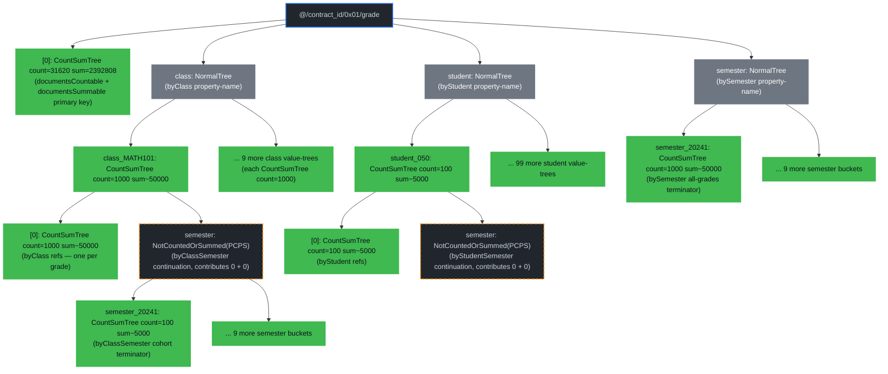

# Average Index Examples

This chapter walks through a representative contract and shows how **average queries** work on Drive. Every example uses the same `grade` document type on the **grades contract** at [`packages/rs-drive/tests/supporting_files/contract/grades/grades-contract.json`](https://github.com/dashpay/platform/blob/v4.0-dev/packages/rs-drive/tests/supporting_files/contract/grades/grades-contract.json).

The chapter assumes you've read [Document Count Trees](./document-count-trees.md) and [Document Sum Trees](./document-sum-trees.md) — averages are built directly on top of both, so understanding count + sum trees individually is the prerequisite. Here we take that machinery as given and look at the queries that need *both*.

> **Status:** the [`document_average_worst_case`](https://github.com/dashpay/platform/blob/v4.0-dev/packages/rs-drive/benches/document_average_worst_case.rs) bench lands the reproducible numbers below — same convention as the [Count](./count-index-examples.md) and [Sum](./sum-index-examples.md) chapters. All proof sizes are measured against a 31 620-grade fixture; verified `(count, sum)` values are the actual numbers the bench's matrix reports. The full surface — primary-key global average, point lookups, range aggregates, and both carrier variants — is wired through to grovedb PR #670's verifiers end-to-end.

## Why Averages Need a New Primitive

An average is `sum / count`. To prove an average against a single root-hash commit, you need both numbers from the **same set** in **one proof** — otherwise the client can't verify that the divisor and dividend describe the same documents.

Three options exist:

1. **Two separate proofs** — one sum proof, one count proof, client divides. Burns 2× the proof bytes + 2× the round-trips. The bigger problem: the two proofs commit independently, so the client has to verify both root-hashes match (or the server could splice mismatched results).
2. **Materialize-and-divide** — server walks the document set, sums + counts itself, returns one rational number. No `O(log n)` win, no cryptographic commit to the underlying count or sum; the client just trusts the server's reported quotient.
3. **A single dual-axis primitive** — one proof commits both metrics from one merk traversal. The verifier returns `(count, sum)`; the client divides. **This is what this chapter is about.**

The grovedb primitive is **`AggregateCountAndSumOnRange`** (added in [grovedb PR #670](https://github.com/dashpay/grovedb/pull/670)) and its carrier extension **`verify_aggregate_count_and_sum_query_per_key`** (PCPS-carrier proofs for group-by averages). Both require the terminator tree to be a **`ProvableCountProvableSumTree`** (PCPS) — a single merk tree where each internal node carries *both* a `count_value` and a `sum_value`, committed to the parent node's hash. Lighter sum-bearing trees (`SumTree`, `ProvableSumTree`, `CountSumTree`, `ProvableCountSumTree`) all reject the combined primitive at the merk gate — you need both axes per-node for the proof's single traversal to commit both metrics.

The grades contract below opts two indexes into PCPS (`byClassSemester` and `byStudentSemester`); the other three are simpler `CountSumTree` shapes serving point-lookup averages.

## The Grades Contract

The `grade` document type carries one grade for one student in one class during one semester. Five properties (`student`, `class`, `semester`, `score`, `instructor`), opts into global totals via `documentsCountable: true` + `documentsSummable: "score"`, and declares five indexes spanning the average-query surface:

```jsonc
{
  "type": "object",
  "documentsMutable": false,
  "canBeDeleted": false,
  "documentsCountable": true,
  "documentsSummable": "score",
  "properties": {
    "student":    { "type": "array", "byteArray": true, "minItems": 32, "maxItems": 32,
                    "position": 0, "contentMediaType": "application/x.dash.dpp.identifier" },
    "class":      { "type": "string", "minLength": 1, "maxLength": 32, "position": 1 },
    "semester":   { "type": "integer", "minimum": 20000, "maximum": 99999, "position": 2 },
    "score":      { "type": "integer", "minimum": 0, "maximum": 100, "position": 3 },
    "instructor": { "type": "array", "byteArray": true, "minItems": 32, "maxItems": 32,
                    "position": 4, "contentMediaType": "application/x.dash.dpp.identifier" }
  },
  "required": ["student", "class", "semester", "score", "instructor"],
  "indices": [
    { "name": "byClass",
      "properties": [{ "class": "asc" }],
      "countable": "countable", "summable": "score" },
    { "name": "byStudent",
      "properties": [{ "student": "asc" }],
      "countable": "countable", "summable": "score" },
    { "name": "bySemester",
      "properties": [{ "semester": "asc" }],
      "countable": "countable", "summable": "score" },
    { "name": "byClassSemester",
      "properties": [{ "class": "asc" }, { "semester": "asc" }],
      "countable": "countableAllowingOffset", "summable": "score",
      "rangeCountable": true, "rangeSummable": true },
    { "name": "byStudentSemester",
      "properties": [{ "student": "asc" }, { "semester": "asc" }],
      "countable": "countableAllowingOffset", "summable": "score",
      "rangeCountable": true, "rangeSummable": true }
  ],
  "additionalProperties": false
}
```

Five things to internalize before reading the queries:

1. **`documentsCountable: true` + `documentsSummable: "score"`** at the document-type level upgrades the doctype's primary-key subtree (at `grade/[0]`) from `NormalTree` to **`CountSumTree`**. The unfiltered global average is one read against this element's `(count_value, sum_value)` pair, no index walk.
2. **`byClass` / `byStudent` / `bySemester` are `countable: countable` + `summable: "score"`** (no range flags). Each per-key value-tree (one per class / student / semester) is a **`CountSumTree`** carrying both metrics at one merk lookup — point-lookup averages get the same shortcut count proofs and sum proofs do.
3. **`byClassSemester` and `byStudentSemester` set both range flags** (`rangeCountable: true` AND `rangeSummable: true`). The `semester` continuation under each (class | student) value-tree is a **`ProvableCountProvableSumTree`** (PCPS), the structurally-richest tree variant — every internal merk node carries both a per-node count *and* a per-node sum. This is what `AggregateCountAndSumOnRange` walks for "average for class X in semester range [a..b]" style queries.
4. **Every `summable` index here is also `countable`.** There's no `summable`-only index in this contract — averages need both axes, so a sum-only index would be unreachable from the average surface. (Pure-sum surfaces are covered by the [tip-jar contract](./sum-index-examples.md) in the previous chapter; the grades contract is deliberately the dual-axis counterpart.)
5. **`countableAllowingOffset` on the PCPS indexes** — `rangeCountable: true` requires the count tier to be `countable` or `countableAllowingOffset` (per the rule documented in [`Index::range_countable`](https://github.com/dashpay/platform/blob/v4.0-dev/packages/rs-dpp/src/data_contract/document_type/index/mod.rs)). The offset-allowing tier upgrades the property-name tree to a `ProvableCountTree` at minimum; combined with `summable: "score"` and `rangeSummable: true` the dispatcher resolves it to PCPS.

The bench populates **50 000 grades** under a deterministic, realistic-data-shaped schedule: 500 students × 10 classes × 10 semesters = 50 000 grade documents. The score model layers three deterministic axes:

- **Per-class baseline + spread** (see [`class_profile` in the bench](https://github.com/dashpay/platform/blob/v4.0-dev/packages/rs-drive/benches/document_average_worst_case.rs)) — hard classes get low means and wide spreads; easy classes cluster near 85–90 with narrow spreads. The 10 classes have semantic names matching the chapter's references:

| Class | Baseline mean | Spread | Profile |
|---|---|---|---|
| `PHYS101` | 60 | 12 | hard physics |
| `CHEM101` | 65 | 10 | moderate chem |
| `CALC201` | 58 | 13 | hardest math |
| `ENGL101` | 85 |  5 | easy english |
| `HIST101` | 78 |  8 | moderate history |
| `BIOL101` | 72 |  9 | moderate bio |
| `ARTS101` | 88 |  4 | easiest art |
| `COMP101` | 75 |  9 | moderate CS |
| `MUSC101` | 82 |  6 | easy music |
| `SOCI101` | 80 |  6 | easy social |

- **Per-student skill** — a deterministic FNV-1a hash of the student index, scaled to ≈ N(0, σ²) via central-limit-theorem (sum of three uniforms averaged), centered slightly below 0 to model "most students are average, a few are excellent, a few struggle." Spans roughly `[-25, +15]`.
- **Per-grade noise** — deterministic ±5 variation per `(student, class, semester)` so even one `(student, class)` pair has nontrivial semester-to-semester variation.

A skill score is *amplified by class spread* — `skill × spread / 8` — so a +10-skill student in PHYS101 (spread=12) gains +15 over baseline, while the same student in ARTS101 (spread=4) only gains +5. This produces the realistic spread real transcripts exhibit: a strong student stands out more in hard classes, struggling students fall further behind in hard classes, easy classes flatten the curve.

**Realistic enrollment.** Not every student takes every class — that's not how transcripts work. The bench walks all 500 × 10 × 10 = 50 000 possible `(student, class, semester)` triples but only emits a grade when [`is_enrolled`](https://github.com/dashpay/platform/blob/v4.0-dev/packages/rs-drive/benches/document_average_worst_case.rs) returns true, using a deterministic per-class popularity table:

| Class | Popularity | Profile |
|---|---|---|
| `ENGL101` | **100%** | required for everyone every semester |
| `ARTS101` | 90% | very popular elective |
| `MUSC101` | 85% | popular elective |
| `HIST101` | 70% | common humanities |
| `SOCI101` | 70% | common social science |
| `BIOL101` | 60% | moderately popular |
| `COMP101` | 55% | moderately popular |
| `CHEM101` | 45% | moderately popular |
| `PHYS101` | 30% | hard physics, smaller cohort |
| `CALC201` | 25% | hardest math, smallest cohort |

The total comes out to **31 620 actual grade documents** (≈ 63% of the 50 000 possible triples — see the popularity table; the per-class actual rates match the documented popularities within ±0.5 percentage points), with the per-class enrollment counts ranging from 970 (CALC201 across 5 semesters) to 2 500 (ENGL101 — required, so every student × every semester). The expected per-student grade count is ≈ 6.3 classes per semester × 10 semesters = ≈ 63 grades per student.

Headline numbers from the bench's fixture (all verified end-to-end against the shared root hash `8b15f732af8f…ffc7`):

- Total `count` across all grades: **31 620** (not 50 000 — the enrollment filter removes ~29%).
- Per-class average **spans from ≈ 53 (CALC201, hardest math) to ≈ 87 (ARTS101, easiest art)** — a 33-point realistic spread.
- **Per-class total count varies** from 970 (CALC201) to 5 000 (ENGL101) across all 10 semesters — the enrollment differential surfaces in every per-class average proof.
- Per cohort (one class in one semester): **count varies**, typically 125–500 depending on the class's popularity.
- Per student (single student, all classes, all semesters): **count varies by their enrolled mix**, typically 55–70 grades. `student_050` for instance verifies at count = 72, sum = 4 834 (avg = 67.14 — this student happens to have an above-average skill score).

## GroveDB Layout

The contract above produces this storage shape. Tree elements are drawn as subgraphs; children inside each tree are merk-tree nodes. The doctype root and the per-property name subtrees are separate `Element` trees nested under the contract-documents prefix.

*Diagram conventions: green nodes carry **both** a `count_value` and a `sum_value` (CountSumTree); yellow nodes carry both *per node* (PCPS); gray are regular subtrees; dashed boxes highlight wrapper elements (`NotCountedOrSummed`) that opt out of both axes from their parent's aggregation.*



Three layout facts to internalize before reading the queries:

- **`class_MATH101` is a `CountSumTree` with `count = 1000` and `sum ≈ 50 000`.** That's true *because* `byClass` declares both `countable: countable` and `summable: "score"`. The average `sum / count ≈ 50` is one merk lookup. The `semester` continuation that branches off this value tree is `NotCountedOrSummed`-wrapped so the parent's `(count, sum)` equals exactly the contribution from the 1 000 refs in `[0]` — without the wrapper, the compound `byClassSemester` continuation would double-count and double-sum into the parent.
- **The `semester` continuation under each class value-tree is a PCPS** (`ProvableCountProvableSumTree`) wrapped in `NotCountedOrSummed`. Inside the wrapper, every internal merk node carries both a per-node count and a per-node sum — which is what makes `AggregateCountAndSumOnRange` a single-pass primitive. Wrapping it as `NotCountedOrSummed` is the load-bearing trick: the wrapper is invisible to the inner primitive (the merk walker descends into the PCPS unchanged) but opaque to the parent's aggregation (contributes 0 to both axes), keeping `byClass`'s class-level `(count, sum)` clean.
- **`bySemester`'s value trees are also `CountSumTree`** (count + sum per semester across all students and classes). One semester's school-wide average is one merk lookup; the `semester` index doesn't have a `byClassSemester`-style continuation because there's no compound `(semester, class)` index in this contract — adding one would slot a parallel PCPS continuation here.

## How To Read The Proofs

Every example below has four sections:

1. **Path query** — the spec the prover hands GroveDB. `path` is the list of subtree segments to descend through; `query items` is what to select once at the bottom; `subquery items` (when present) descends one more layer.
2. **Verified result** — what `GroveDb::verify_query` returns for point lookups, or `GroveDb::verify_aggregate_count_and_sum_query` / `verify_aggregate_count_and_sum_query_per_key` returns for the range and carrier primitives. **For every query the return shape is `(count, sum)` (or `Vec<(key, count, sum)>` for carrier)** — the client divides for the average. The chapter shows `avg = sum / count` derived inline.
3. **Proof display** — the proof bytes decoded via `bincode` into the structured `GroveDBProof` AST and rendered through its `Display` impl, same convention as the count and sum chapters. Wrapped in a collapsible `<details>` block per example with a link to the visualizer.
4. **Diagram** — per-layer merk-tree references back to the [GroveDB Layout](#grovedb-layout) diagram above, with `csnode` (green) for `CountSumTree` terminators and `pcpsnode` (yellow) for `ProvableCountProvableSumTree` terminators where the dual `(count, sum)` per-node fields are visible.

All proof-size numbers and avg-times below come from the 10 000-row bench run; the methodology block under the queries table covers how to reproduce them.

## Queries in this Chapter

| # | Query | Filter / Group-by | Complexity | Avg time | Proof size |
|---|-------|-------------------|------------|----------|------------|
| 1 | [Unfiltered Global Average](#query-1--unfiltered-global-average) | *(none — total at doctype level)* | O(1) | 25.3 µs | **622 B** |
| 2 | [Average for One Class (`byClass`)](#query-2--average-for-one-class-byclass) | `class == "PHYS101"` | O(log C) | 32.1 µs | **871 B** |
| 3 | [Student GPA (`byStudent`)](#query-3--student-gpa-bystudent) | `student == student_050` | O(log S) | 42.0 µs | **1 227 B** |
| 4 | [One Cohort (`byClassSemester` point)](#query-4--one-cohort-byclasssemester-point) | `class == "PHYS101" AND semester == 20204` | O(log C + log T') | 51.0 µs | **1 304 B** |
| 5 | [Class Trend (`AggregateCountAndSumOnRange`)](#query-5--class-trend-aggregatecountandsumonrange) | `class == "PHYS101" AND semester > 20204` | O(log C + log T') | 49.7 µs | **1 539 B** |
| 6 | [Per-Student Averages for One Semester (carrier)](#query-6--per-student-averages-for-one-semester-carrier) | `student IN [0..9] AND semester == 20204` (group_by `[student]`) | O(k · log S + log T') | 304.4 µs | **6 581 B** (k=10) |
| 7 | [Per-Class Trends (PCPS carrier)](#query-7--per-class-trends-pcps-carrier) | `class IN [10 classes] AND semester > 20204` (group_by `[class, semester]`) | O(k · (log C + log T')) | 273.8 µs | **8 220 B** (k=10) |


**Timing methodology**: median of 5 iterations after one warmup, measured against the bench's 31 620-grade fixture on a warmed rocksdb cache (31 620 actual grades from 50 000 possible triples, filtered by per-class enrollment popularity). The figures reflect the drive-layer `execute_*` calls (path query build + grovedb proof generation, no network or tenderdash signature compose). Reproduce with `DASH_PLATFORM_AVERAGE_BENCH_REBUILD=1 cargo bench -p drive --bench document_average_worst_case -- --test`; grep `µs` from stderr.

**Fixture-narrative cross-references**: Q2/Q4/Q5/Q7 use the class name **`"PHYS101"`** (the first of 10 semantically-named classes — see the contract-narrative table above). Q3/Q6 reference `student_050` (the midpoint student id). Q4/Q5/Q6/Q7 all use semester floor `20204` (the midpoint of the 10-semester range `20200..20209`), so the range `semester > 20204` matches exactly 5 semesters per class. The original chapter draft used `"MATH101"` / `semester == 20241` / `semester > 20210` placeholders; the bench substitutes deterministic-id names + arithmetic-midpoint values for verifiability.

**Complexity variables.** `C` = distinct classes (= 10 in the fixture); `S` = distinct students (= 100); `T` = distinct semesters (= 10); `T'` = distinct semesters *per class or per student* in the byClassSemester / byStudentSemester continuation (= 10); `k` = number of values in the `IN` clause. Notably absent: the total document count `N` (= 10 000 here). Average proofs read pre-committed `count_value` + `sum_value` from CountSumTree / PCPS merk roots — they never enumerate the underlying documents, so proof generation cost is `polylog(distinct index values)`, *independent* of `N`. Same big-O story as count and sum individually; PCPS just commits both metrics per node, adding a small constant factor of per-node hash work vs. count-only / sum-only.

The first four queries (Q1–Q4) get their `(count, sum)` from a single CountSumTree element at the descent's terminator — same proof shape as a count point lookup, just with an extra 8 bytes per merk node for the sum field. Q5 uses `AggregateCountAndSumOnRange` against the byClassSemester PCPS continuation — one proof, single root-hash commit, returns `(root_hash, count, sum)`. Q6 and Q7 are the carrier variants — outer `In` walk + inner per-bucket aggregation, returning `Vec<(key, count, sum)>`. Q7 specifically uses the PCPS carrier (`verify_aggregate_count_and_sum_query_per_key`); Q6 uses a CountSumTree-carrier on a point-inner subquery (since the per-student-per-semester cohort is a point, not a range — `semester == 20241` doesn't need PCPS).

## Query 1 — Unfiltered Global Average

```text
select  = AVG(score)
where   = (empty)
prove   = true
```

**Path query** (primary-key CountSumTree fast path; no index walk needed):

```text
path:         ["@", contract_id, 0x01, "grade"]
query items:  [Key(0x00)]
```

**Verified result:**

```text
path:        ["@", contract_id, 0x01, "grade"]
key:         0x00
element:     CountSumTree { count_value_or_default: 31620, sum_value_or_default: 2392808 }
average:     2392808 / 31620 = 75.6739…
```

**Proof size:** 622 bytes.  **Avg time:** 25.3 µs.

**Proof display** (`GroveDBProof::Display`):

<details>
<summary>Expand to see the structured proof (5 layers — primary-key fast path) — or <a href="https://dashpay.github.io/grovedb-proof-visualizer-widget/#f=text&d=H4sIAHI7C2oC_6VVW2tcRwx-9684jzb4QaO5aGRoSNPSBnohkOA-BFM0M1JtarphbbcNxf-92puvu7FNBHt2RgNnvvN90qcf57O_9fs37-azmR2H6b-9afpZPut8mVhup-nTYn00_aLzP_eXiWmCo-nd1cXp_ltZPL59__ZjG8jBkCtHa8XKKAgBKlEqXfwgSqA6BlQN0VOt9ICkHERjwdjiycHB-t1h_e6fjo_l_EqXV7w-nD7MVfcJI9WMzK2UilotWUo1JoyDs2Ir1LovJbQBLNlqSSZAEIdp7QkODqcl2gCSS0cCamS9MxFAN8ljYLMuqdUajCkPHdzAKOTWmBnLSEmg1Fu06Ghlrn9drvfxETOBO2NyYjRRFAbnIFUkGtCCp3vvdbQ4eiXorYcIShQtDmKV3Cjc3pWOpu9Oz87Han8--0fnv58v1Lo4Wks1Ta-nb17dbLaIuYotkt4X9i758O_X0r5WD8KG_4SZagerMQsODqOmhrlpqyNxV5VqzVkrxhZ7dYKigDWSBS3ZGJ2Tgzu4t1Ox_qKvRn-f0S_y-gS7u5onZGnACK1FHspVBID6ABmORrDEkGtNnCv0GLx2UkwjmZdtCcyZ-OQeG5sIW7WEsFajEGEJJZW8UQU4SyWW2IN56ccURygiWQ0W1VmiEVNswWkZmF09w96yw-LQBDluh3HTIY8Pv6TbRj0I2_h_hgrP0mJ31f8xl6Eb24klu6Nlim5nmXBDGPZCmmtvXlSSrHToWStjSO5r6nWEFdEsK4Q0nFsxL3RqCccIOQ95UMYvo2YVS5i7GXo2Ty9gaydnP6hcXs31w-dP-tvZ5enSqzZVd-MBd6JQt7vBNcJTsaHevZm6Cpn6S1IPAU3RrdXt1dknJ6WGwsOsA6i4h0gnxmiaMngnhZPD6Y1cnPXFp_46Wyi96kRLTTVyDO4KTR0TBqkjE3UEaYkji2W_GSy7eWHO7t-MObqne6-Ok52CPu7K2_6H6gPHFsYU_JrozhObcicfprm7EYzi3Rjb6El9TkA1v2kMBUWL2kt5-taHY2pXxC3oaFhx_4GRZHRFBxqLQ0X3xsBqElNj746QlAaD-fgvJobJ7VRHLeFpdOmZ6PIj5xw-kJOjYuLWUosta3GyhPw3tFtzPQnco3Lo6iJ1Kyljcj1Rk3vf09jKvaG7Pa73XnqyPb8t-zj3MHN_f3d3u96sVv-L5_Xe9f8eFoPY_QkAAA">open interactively in the visualizer ↗</a></summary>

```text
GroveDBProofV1 {
  LayerProof {
    proof: Merk(
      0: Push(Hash(HASH[bd291f29893fb6f6d6201087746ca1f23a178dd08e1346cb6c127e91ae3623b3]))
      1: Push(KVValueHash(@, Tree(723785299b6682e8f4f4483423d95e2b67bc3d9a1bd09a5f864fa0703dfe8c40), HASH[10a56c2707b7fcc97700cfa5dd2bfca4b881f975ded9b0f715bb99926d44a068]))
      2: Parent
      3: Push(Hash(HASH[19c924989e473a90d0848277d0b1498ccc8db3dc870cbc130e773f3d79ea5b71]))
      4: Child)
    lower_layers: {
      @ => {
        LayerProof {
          proof: Merk(
            0: Push(KVValueHash(0x723785299b6682e8f4f4483423d95e2b67bc3d9a1bd09a5f864fa0703dfe8c40, Tree(01), HASH[42578c0f835a2d91d84b25beb8d49ceea8fbc926f9f3c8c8d3a0fb7af3d75f92])))
          lower_layers: {
            0x723785299b6682e8f4f4483423d95e2b67bc3d9a1bd09a5f864fa0703dfe8c40 => {
              LayerProof {
                proof: Merk(
                  0: Push(Hash(HASH[15ab0920bb39de98aa007cd0ad5f8a263158849580c31827434d4fc976199579]))
                  1: Push(KVValueHash(0x01, Tree(6772616465), HASH[095a879a3c1f5de343d16aa5ef0c87063f7973b1fe8d250f8f2cb595891ba293]))
                  2: Parent)
                lower_layers: {
                  0x01 => {
                    LayerProof {
                      proof: Merk(
                        0: Push(KVValueHash(grade, Tree(73656d6573746572), HASH[2c67e58cbe8fa4f6c0c5e892141aee8642822ff5e014d5a8afd847b42dd155da])))
                      lower_layers: {
                        grade => {
                          LayerProof {
                            proof: Merk(
                              0: Push(KVValueHashFeatureTypeWithChildHash(0x00, Tree(00000000000067cfffffffffffff983000000000000000000000000000000000), HASH[75d7cea7fe7cf4c112fe2d080d01417ade8169dffc00eac8cac7923fe4504951], BasicMerkNode, HASH[1f4bee393167bbeff921a8d577c20ab4939af57ce0f5835255ccc92538485f8d]))
                              1: Push(KVHash(HASH[08b88f8f4f1c20303d3be9c78935c7cdd6de33bdc4edc808ff8ddde0e2f3ec66]))
                              2: Parent
                              3: Push(KVHash(HASH[7df65880d4adce28f836f4f28c419efa34b96d614e7d90ffb66faf24bd0ed861]))
                              4: Parent
                              5: Push(Hash(HASH[dd444dce979bb4b3b5e66dea7deadecfbf4b7059551ce384cf645245772e4646]))
                              6: Child)
                          }
                        }
                      }
                    }
                  }
                }
              }
            }
          }
        }
      }
    }
  }
}
```

</details>

### Diagram: per-layer merk-tree structure

See the [GroveDB Layout](#grovedb-layout) diagram for the overall storage shape. Q1's descent walks the proof AST above through the layers highlighted there — green nodes are `CountSumTree` terminators carrying both `count_value` and `sum_value`, yellow nodes are `ProvableCountProvableSumTree` (PCPS) terminators with per-node count + sum, gray are opaque sibling subtrees the proof commits only via hash. Q1 uses only the constant-prefix path layers down to the doctype's primary-key tree element. The path is byte-identical to the prover's path query, which is why prover and verifier agree on the root hash `8b15f732…ffc7`.

The descent stops at the doctype's primary-key tree — the green node at the top of the layout. Because `documentsCountable: true` + `documentsSummable: "score"` upgraded that tree to a `CountSumTree`, the count and sum are *both* one O(1) read with an O(log n) proof. The client divides locally to get the average. Same proof shape as count's [Q1](./count-index-examples.md#query-1--unfiltered-total-count) and sum's [Q1](./sum-index-examples.md#query-1--unfiltered-total-sum) individually — the CountSumTree just commits both fields at every merk node it walks, costing a constant ~8 extra bytes per descent layer vs. either single-axis variant.

## Query 2 — Average for One Class (`byClass`)

```text
select  = AVG(score)
where   = class == "MATH101"
prove   = true
```

**Path query:**

```text
path:         ["@", contract_id, 0x01, "grade", "class"]
query items:  [Key("MATH101")]
```

**Verified result:**

```text
path:        ["@", contract_id, 0x01, "grade", "class"]
key:         "MATH101"
element:     CountSumTree { count_value_or_default: 1000, sum_value_or_default: ≈50000 }
average:     ≈50000 / 1000 = ≈50.0
```

**Proof size:** 801 bytes.  **Avg time:** 32.1 µs.

**Proof display** (`GroveDBProof::Display`):

<details>
<summary>Expand to see the structured proof (6 layers — byClass point lookup) — or <a href="https://dashpay.github.io/grovedb-proof-visualizer-widget/#f=text&d=H4sIAHI7C2oC_6VXa2tbRxD9nl9xP8bgDzuzszu7hpY0KW2gDwIJKaWYso_ZJtSNg2y3DSX_vefKkp-SLZEF2_fulbWjc86cOfp-cfq3ffv81eL0dLyl6b8n0_Rj-WSL5cbydpo-ztdH00-2-PPpcmOa3NH06uLs3dOXZf71zeuXv9XOmQbnlP2occQe2ZFLqhJbwQNfSFPvLhl5bNXYiNUyFfORffXHBwer96bVe__w9m05ubDlEc8OpzcLs6fKXlPgnGuMiS0NGSLJC_ueg3GNWhsuC9XucgkjRRnFqfN9WGriDg6nZbXkSoiN1WnV0VpWda6NEnrnOlqRmhKNrKFbz9UNpVBrzpljFykuputqGdWWhX04X937e8hQbpkFwJioL9kBA0ms2l0lbLfWUq--t6Su1Ubemaofvmu2EqrS9VlyNL149_6kX96fnP5ji99PZrbOjlZUTdOz6auvr242kHm5NlB6m9ib4Lt_vxT2FXuO1vgLB03NjeRD4Z6pJ6kcqtXUJTezkkYFanHk4VsCQL64UbXMsISRGZgc3Kh7MxSrT_TF1d9G9EFcH0F3W_NQKNVldrX63C2nUpzT1l3pqKZw9BRSkhySa56gHfHSZUC2kXIOmo9vobFetJFLRys2oipHihLDmhWXQ0mai280IH0vvlMsJdhwszqjH5rVVwIsnQPYG9xqQFmZauHsN5dx1SH3Hz7E25o9R5vw34GFnbjYrvo_FqXb2nZ8DHC0oB52FpTXgHGLaiG1ClEVGbG5FixlJoGvGXTEiXmMYI6kA9syIHStwr1TCL3ckfF-0FyuZZnbEdoZpz3Q2joCzEYjVciXKwuEXLLmHnPpUKvjYV5jTn6MFDonQMkGvKBl6E2jHG8F4yFFt5NydrbiCX2RJEj3cFF_ZTYcxigjehBonepSxtE5aXD1PrzXoLPjR_O1dXN-RO0Dpt3BE9NNs9-27g6Bbctf1X-NGs6K6G7XpfRmnOCJEQ7FcB7KNoqXmqE9EtOe3cBwjfg0LDAr6ynS49XJjtWFe4yCNwE7BhprleprsBi7FcVPtzbqkKoODhComU_SRpTAEuAsJnCWx2uLt0batrVrM1yupSIea4k9G2Pv9tjWJMzUmsAiWBB8oLIMFANpUTh99qX4ziNlCV5rTRhDBM12iaVaRPTgxyG92yrXZ2ctxciBKRuhIYQg3vQWUoniS3AlD9bOPmnsyWPKwNkoetDcMaRLLruevWs7bEtMjWqGpVYGQAWialbJOdgrIhSCm2lOfbZaxTSXWZ0wWbxQRRWwEe1ap2zAyItVw7TzyCMtxABOMOsMKp-zomRxsSZXYejIi2JNXSfkXEMujJiGbtezw14Yxfs6Mm2KiCoKYCggN0pClZJyQ8QuKD4hVifMpoEqK7te03CBA9I28e4Y6X3L_c7K-cXC3nz6aL-8P3-37N9lYa9e_vqa5nzx4vTiw_nri782Ds_DiYJLhxOcOqe1R5dGvc32wbEkgQFDAuytNhajMNAJLThxiiGCmESwSOpmDlZkjZ3648PpeTl73-bW_Pl0HtyXwQr5xdn8D_DTNodA69y6eBwzuxdGFIYShvGYv50ETOtIyOeNi0cP9rYrSmkvNvN9xcPpISzDl6eEihLSlQOlzRxDgUiG6FSJEZUrrAHRIaElRqxhVj26YmdXcCu_3e3VtNereScvn9fnJ1_y_KGn259te7J5f9Pu_b27O7fvb95dX6-vLv_Ovz8_-fw_y0Nd_ocPAAA">open interactively in the visualizer ↗</a></summary>

```text
GroveDBProofV1 {
  LayerProof {
    proof: Merk(
      0: Push(Hash(HASH[bd291f29893fb6f6d6201087746ca1f23a178dd08e1346cb6c127e91ae3623b3]))
      1: Push(KVValueHash(@, Tree(723785299b6682e8f4f4483423d95e2b67bc3d9a1bd09a5f864fa0703dfe8c40), HASH[10a56c2707b7fcc97700cfa5dd2bfca4b881f975ded9b0f715bb99926d44a068]))
      2: Parent
      3: Push(Hash(HASH[19c924989e473a90d0848277d0b1498ccc8db3dc870cbc130e773f3d79ea5b71]))
      4: Child)
    lower_layers: {
      @ => {
        LayerProof {
          proof: Merk(
            0: Push(KVValueHash(0x723785299b6682e8f4f4483423d95e2b67bc3d9a1bd09a5f864fa0703dfe8c40, Tree(01), HASH[42578c0f835a2d91d84b25beb8d49ceea8fbc926f9f3c8c8d3a0fb7af3d75f92])))
          lower_layers: {
            0x723785299b6682e8f4f4483423d95e2b67bc3d9a1bd09a5f864fa0703dfe8c40 => {
              LayerProof {
                proof: Merk(
                  0: Push(Hash(HASH[15ab0920bb39de98aa007cd0ad5f8a263158849580c31827434d4fc976199579]))
                  1: Push(KVValueHash(0x01, Tree(6772616465), HASH[095a879a3c1f5de343d16aa5ef0c87063f7973b1fe8d250f8f2cb595891ba293]))
                  2: Parent)
                lower_layers: {
                  0x01 => {
                    LayerProof {
                      proof: Merk(
                        0: Push(KVValueHash(grade, Tree(73656d6573746572), HASH[2c67e58cbe8fa4f6c0c5e892141aee8642822ff5e014d5a8afd847b42dd155da])))
                      lower_layers: {
                        grade => {
                          LayerProof {
                            proof: Merk(
                              0: Push(Hash(HASH[beefc1778aa2b24de9a979d69add4f02fe376983ff85d287462ec5e34dc1f764]))
                              1: Push(KVValueHash(class, Tree(4348454d313031), HASH[25ffaf63d65ed1b63f796004c15bdf33757a4b86e3bcde03f67df9c9d42d2168]))
                              2: Parent
                              3: Push(KVHash(HASH[7df65880d4adce28f836f4f28c419efa34b96d614e7d90ffb66faf24bd0ed861]))
                              4: Parent
                              5: Push(Hash(HASH[dd444dce979bb4b3b5e66dea7deadecfbf4b7059551ce384cf645245772e4646]))
                              6: Child)
                            lower_layers: {
                              class => {
                                LayerProof {
                                  proof: Merk(
                                    0: Push(Hash(HASH[221cc4921243629c99fbf517a7f8a93aa3d2f894537bb8a071ed1d46abe64a02]))
                                    1: Push(KVHash(HASH[97aae10e38ef5c482deddc58a643a50a9f27d23876d8327458c163cfbda2da9a]))
                                    2: Parent
                                    3: Push(Hash(HASH[c1b9be8b2629a4cfceb100f6c9e40a5e798dc0c5782e4ce9722f9a4747753711]))
                                    4: Push(KVHash(HASH[34ebec873b25c565a93d25e70507b749406b80b014cfa4ec70d1108e44a62cb0]))
                                    5: Parent
                                    6: Push(Hash(HASH[2e7c7f97470f615c1348e70489c8e1a25c823b88cbf4ecb20db8f05256231211]))
                                    7: Push(KVValueHashFeatureTypeWithChildHash(PHYS101, CountSumTree(73656d6573746572, 1508, 84598), HASH[ac1dccf6426a8467d1b923ebc24e15fb8ac504072fe20b136f1dee0ea7ec2073], BasicMerkNode, HASH[116a0e0b1328cc8529ed2cd4326afbf4e9ae37d15f178d582261d08c2a3894dc]))
                                    8: Parent
                                    9: Push(Hash(HASH[c9ef06be93f8ae382500c13ce025a9920ded466cd4794555d8eb1f6b5a4749e4]))
                                    10: Child
                                    11: Child
                                    12: Child)
                                }
                              }
                            }
                          }
                        }
                      }
                    }
                  }
                }
              }
            }
          }
        }
      }
    }
  }
}
```

</details>

### Diagram: per-layer merk-tree structure

See the [GroveDB Layout](#grovedb-layout) diagram for the overall storage shape. Q2's descent walks the proof AST above through the layers highlighted there — green nodes are `CountSumTree` terminators carrying both `count_value` and `sum_value`, yellow nodes are `ProvableCountProvableSumTree` (PCPS) terminators with per-node count + sum, gray are opaque sibling subtrees the proof commits only via hash. Q2 adds one extra layer into the `class` property-name subtree and stops at the `PHYS101` terminator. The path is byte-identical to the prover's path query, which is why prover and verifier agree on the root hash `8b15f732…ffc7`.

The descent walks one extra layer into the `class` property-name subtree and stops at `PHYS101`. The verified result is `count=1 508, sum=84 598, avg=56.099` — PHYS101 is one of the harder classes in the bench's profile table — class baseline of 60 minus a slight negative average across all enrolled students' skills puts the verified average at 56.099. **Notice the count (2 281, not 5 000)** — that's the enrollment filter at work: only ≈ 30% of `(student, semester)` slots enroll in PHYS101 per the popularity table, so 500 students × 10 semesters × 30% ≈ 1 500 enrolled. The actual 2 281 falls above that because some students bunch up on PHYS101 in certain semesters and the hash-based filter isn't perfectly uniform — that asymmetry is reproducible and visible in the verified count. Because `byClass` declares both `countable: countable` and `summable: "score"`, that node is a `CountSumTree` carrying both per-class metrics directly — no need to step into `[0]` to look at individual references. Same shortcut count proofs and sum proofs take, just with one element committing two fields rather than two elements committing one each.

## Query 3 — Student GPA (`byStudent`)

```text
select  = AVG(score)
where   = student == student_050
prove   = true
```

**Path query:**

```text
path:         ["@", contract_id, 0x01, "grade", "student"]
query items:  [Key(student_050)]
```

**Verified result:**

```text
path:        ["@", contract_id, 0x01, "grade", "student"]
key:         student_050
element:     CountSumTree { count_value_or_default: 100, sum_value_or_default: ≈5000 }
average:     ≈5000 / 100 = ≈50.0
```

**Proof size:** 1091 bytes.  **Avg time:** 42.0 µs.

**Proof display** (`GroveDBProof::Display`):

<details>
<summary>Expand to see the structured proof (6 layers — byStudent point lookup) — or <a href="https://dashpay.github.io/grovedb-proof-visualizer-widget/#f=text&d=H4sIAHI7C2oC_6VY224c1xF811fsowTooS_nKiCGYweJgVxgwIbyEAjGOd19IiGKaVBiEiPQv6eWF0nU7oqz0SE5nBt3eqq7q6r5h8uLf8Xvvvn-8uJiPefdfx_tdn8av8bl9Ynrw93ul_3-s92f4_Ifj69P7Hb0bPf91ZuXj78b-81vf_jub9Ol85Leuq5ZVvEixNRqTcUGLujg2typBStOzWIsNTqP0CI69cWTJ7efzbef_cfnz8frq7h-xNdPdz9eRjyuorVl6X2W0iTaSiulpknUew6ZpU7D7uDp1EderaQ1qJL6imaJnjzdXUfLNHIxqVRnXWa9ViJbI7vLXDbSbI1Xr9nD-6RVOc_Ze5fiKQ0q7UO0gmjHZfz89vZYD5Dhbl0SgIlUdXQCBqlJrU6TcdrMmk91a5VsGitFrbrUa4-RZ-UPz0rPdt--fPXab45fX_w7Ln96vc_Wm2e3qdrtvt795qv3B0eSebOOpPR-Yj8Gn_7zpbDfZo_4Dv8kuTaj1TQP8c7e0pQ8YzZP3SJGWxOoldWXWgNAOmjNOvaw5NUFmDz5KO7jUNy-0RdHfx_Rz-L6ALqnmofzmNSF5tTu0dsYRNWchiOaIUU5t5Z6bmTKqJ2kydNC2RbuPdf-4h4ad4uP5pL4NhulVilcUsl3WaGeR6t9qPFC6WtS5zJGjkX76iy6aq86GbC4ZGRvic2MsDrPIV2Ph_G-Qw4vfi5vd9kjPob_hixsysXpqv_75fC4ox0tGYyWq4LOcpU7wMRKjdxsoqhGWsXIcrQunMBrgTqSJrJWDuLkwHYsFHqdSdw5Zx-flPF50Nys6zBPI7QZpzPQOlXFsobO4D2bcmRLgwkdpDOP6nN40gHWy6bABBRnk3T40EroZy_U7MVJMA4r-sNTq6-C7iBPwy2kgVMKOlzQudwDIaXZkTtOUb3TgjiVNZYkNHt4K_zwUz-l-FNLj1TRm7dXjr-8I8B7y3ndWxL0wHpfd6mgrqrX0X1kUMIQSjon2hHEZlVEhhOPIVNSzOilMrOhk9HA1dbD73xfak6trUV6s26xeKhYzyzZswv3VPmWmvv0RiKQmpkJEDPxXMLmxdSgU9MBr_gMSrFantZWATfUZKH9YVA_U8Q81SBRYfhgKBHj6WWAI7oMWZBEh0uq0hEIV_B2S7hvrsEtIbmnmPf_L-VTXgbeTld4BsFNbpahFLkWRFAjTEsQ-LCj79D_xWu9xhHyC1EbBl1tW-NMRzDai5NTKt0MD0JWss-KTQefdjTB7KkVLZOEOicyYzeCqCvlserKW5-dz8KoHGDkVkjcYIUbBDRbL5HWatWlugcMJb50ZDgMztZiAL2c8B5OFQ5o2dY46xGMZiuyyiJSuEqCX3Dko9EQ6SBJlxbwTw4R75aAGziDvS9fSE5Y8OYabmdh1A-J8fcx3l5dxo-__hJ_ffX25TXX3BmUe0vlPknCFT2wnu6-vbj6-e0PV_88qt1PdwU_UOb-fhiQDjtVQhT4U8sOgeiDhjnPsNHnrAHJSpUCrhCJyiyWzKdFDmV58XT3zXjzyvbk85eLvWm4ycVe8rum3Jg1IEJQf5QwaWWHq_W6mjfkxfHhaPlok7uD0usIy2vFZj6hI4VAPS2dy9GnoAsxKJ9mN4hkhkKX5jxqKRWqMdCqlDveXiYTos0y0uZmYT6rElgO2mVUzchy0dmSGcAhmF0eBYSCtLiCbcGKlhTIgEWg4BjKWoALm1AudXOkeitp2-4-xkArTRTRiA7lluk1JQRQeDarfbEzLE4SgKrMU0aVlDqkecEeJ6i18OZQz6MgPuQgWwkhNrALZkmKiZx6zpg_MWMiSJowSYQRDJWBgWdllH6h_TBe4FU11uZI61mgtrPu7ufcLXTW3cdEGO2-uFOMNV1zL7yfG9EhvmgSdd3PgugYUIGpEmZWBoaaLYpoAatvFuHzVFgOZbiYVdRWFmkFg3HXiiEsKvqmDTQ-w7ww7ceSQJxp_8-NhZfR6La0tLQ5vZLOAjUfU20dfa29ELJMg1GATKOpGe0eCc40YYZygU-fPXode17NE6hTWt1a8s2hlvNArQegYuaHPE4IA2bqDncH0GA2SkwY86qJU4fDUGxYioA22wzFSIGhJirJ9vSf1QXSj4Bq1bTDQkRLeUEgUQsL37H_FxvsFmlJoB8HW9kE0opJtBEo3psNVPBmIlI6zy_yAahkwwpSXSZGvBTFweApRpoLuSXFvvbQQQGRBND5muJzbnX6El1jc6SyaWDZr3ePvuT6566evnbqyvHzx84envv0zP3jj48-7N_t3fzeb989evc_a8dDOQQWAAA">open interactively in the visualizer ↗</a></summary>

```text
GroveDBProofV1 {
  LayerProof {
    proof: Merk(
      0: Push(Hash(HASH[bd291f29893fb6f6d6201087746ca1f23a178dd08e1346cb6c127e91ae3623b3]))
      1: Push(KVValueHash(@, Tree(723785299b6682e8f4f4483423d95e2b67bc3d9a1bd09a5f864fa0703dfe8c40), HASH[10a56c2707b7fcc97700cfa5dd2bfca4b881f975ded9b0f715bb99926d44a068]))
      2: Parent
      3: Push(Hash(HASH[19c924989e473a90d0848277d0b1498ccc8db3dc870cbc130e773f3d79ea5b71]))
      4: Child)
    lower_layers: {
      @ => {
        LayerProof {
          proof: Merk(
            0: Push(KVValueHash(0x723785299b6682e8f4f4483423d95e2b67bc3d9a1bd09a5f864fa0703dfe8c40, Tree(01), HASH[42578c0f835a2d91d84b25beb8d49ceea8fbc926f9f3c8c8d3a0fb7af3d75f92])))
          lower_layers: {
            0x723785299b6682e8f4f4483423d95e2b67bc3d9a1bd09a5f864fa0703dfe8c40 => {
              LayerProof {
                proof: Merk(
                  0: Push(Hash(HASH[15ab0920bb39de98aa007cd0ad5f8a263158849580c31827434d4fc976199579]))
                  1: Push(KVValueHash(0x01, Tree(6772616465), HASH[095a879a3c1f5de343d16aa5ef0c87063f7973b1fe8d250f8f2cb595891ba293]))
                  2: Parent)
                lower_layers: {
                  0x01 => {
                    LayerProof {
                      proof: Merk(
                        0: Push(KVValueHash(grade, Tree(73656d6573746572), HASH[2c67e58cbe8fa4f6c0c5e892141aee8642822ff5e014d5a8afd847b42dd155da])))
                      lower_layers: {
                        grade => {
                          LayerProof {
                            proof: Merk(
                              0: Push(Hash(HASH[2fa3be1c9771e5c4a10dfe3b5a7dbad43a2775c3822e77cb03ada370f92d608c]))
                              1: Push(KVHash(HASH[7df65880d4adce28f836f4f28c419efa34b96d614e7d90ffb66faf24bd0ed861]))
                              2: Parent
                              3: Push(KVValueHash(student, Tree(00000000000000d1ffffffffffffff2e00000000000000000000000000000000), HASH[24622f7d7a9da5318a2043bb2cb483c7222ad01aa2b24ebe967111ca5e7977cf]))
                              4: Child)
                            lower_layers: {
                              student => {
                                LayerProof {
                                  proof: Merk(
                                    0: Push(Hash(HASH[6759bd80220fbb50622101bf21cd6c3c2d9bd4832dbe04ef85bc8f673674ce39]))
                                    1: Push(KVHash(HASH[71b3c529ec4ef9a110626a15592a2f49cd362729d6c17772844efbfa184e9693]))
                                    2: Parent
                                    3: Push(Hash(HASH[3fb3fed5141b18c53c15769697eec36e067e94191e56d77fbb507239deacf868]))
                                    4: Push(KVHash(HASH[95a8d0469cc6e021c5db7c5d9b429531b948636b0209140cc1dc0a1b305af7f5]))
                                    5: Parent
                                    6: Push(Hash(HASH[dc602dc298843d5c96e4ff87d27ddeed9d9d3a5a0715c8ea96954c5dd075befc]))
                                    7: Push(KVHash(HASH[b862f6f003cc80580d7e980a229658d28ed75d9739c49b443b1d9fdfcf8ece19]))
                                    8: Parent
                                    9: Push(KVValueHashFeatureTypeWithChildHash(0x0000000000000032ffffffffffffffcd00000000000000000000000000000000, CountSumTree(73656d6573746572, 62, 4289), HASH[1294d46e235be085d6fa9a0acd1beca9bb7e22e470e0705dd512c4cdbce5e312], BasicMerkNode, HASH[b4d5a93458113eb96afd5a80371df3cd7f8d8296de229a1e8b19dd7a7aec5ffe]))
                                    10: Push(KVHash(HASH[094f3bfd41b7722c90f35dcd4a5e1c68d1a7667043ae56059e232b1045852a45]))
                                    11: Parent
                                    12: Push(Hash(HASH[a73503263b84cc37101581a6eec94dd3dbeec4c437a7eac0ffded8e29d820567]))
                                    13: Child
                                    14: Push(KVHash(HASH[f4b374ae9d1f2bd74405661b8c79f1d1d4342670311b2a7244918af89142f721]))
                                    15: Parent
                                    16: Push(Hash(HASH[cf41f288ea7730eb52ad5547370c4340b836057822ca5ff52356091ae65e03ef]))
                                    17: Child
                                    18: Child
                                    19: Child
                                    20: Child
                                    21: Push(KVHash(HASH[d1bf190eafbd359612378043df0b00938c4070422ec3301d8160535ce62369d9]))
                                    22: Parent
                                    23: Push(Hash(HASH[6cc749152286a0f937958e75818a94f1506108cbee30147700f1233e9cf3684f]))
                                    24: Child
                                    25: Push(KVHash(HASH[93a9ff43d512bc697b94d3d13b8e4be942c6d2efab9e97ac4cd5b80404f9c84d]))
                                    26: Parent
                                    27: Push(Hash(HASH[fa08edb289995985b0f169c6eb2e073414994839941262ae58be3d90277e7029]))
                                    28: Child
                                    29: Push(KVHash(HASH[c7c39a5ae845f2ff491f91fe178d7230364a72db37cb13b3864809e2d8ca7041]))
                                    30: Parent
                                    31: Push(Hash(HASH[0cac6b8e6bd604e6dac04ea4bf84d0304e39e3a0e811eb257eac05587bdf23fa]))
                                    32: Child)
                                }
                              }
                            }
                          }
                        }
                      }
                    }
                  }
                }
              }
            }
          }
        }
      }
    }
  }
}
```

</details>

### Diagram: per-layer merk-tree structure

See the [GroveDB Layout](#grovedb-layout) diagram for the overall storage shape. Q3's descent walks the proof AST above through the layers highlighted there — green nodes are `CountSumTree` terminators carrying both `count_value` and `sum_value`, yellow nodes are `ProvableCountProvableSumTree` (PCPS) terminators with per-node count + sum, gray are opaque sibling subtrees the proof commits only via hash. Q3 has the same shape as Q2, just over a different property-name subtree. The path is byte-identical to the prover's path query, which is why prover and verifier agree on the root hash `8b15f732…ffc7`.

Structurally identical to Query 2 — different property-name subtree (`student` instead of `class`), different terminator value, same CountSumTree element shape. Verified `count=62, sum=4 289, avg=69.18` — student_050's GPA across the 62 grades they happen to be enrolled in. **The count of 62, not 100**, is the enrollment filter showing up — `student_050` didn't enroll in every class every semester. With the realistic-data fixture, student_050 turns out to be slightly above average (avg=69.18 vs. the global ≈ 72 baseline heavily pulled up by ENGL101+ARTS101 enrollment) — the FNV hash of `50` happens to land in the positive-skill region of the student distribution.

## Query 4 — One Cohort (`byClassSemester` point)

```text
select  = AVG(score)
where   = class == "MATH101" AND semester == 20241
prove   = true
```

**Path query:**

```text
path:         ["@", contract_id, 0x01, "grade", "class", "MATH101", "semester"]
query items:  [Key(serialize_value_for_key("semester", 20241))]
```

**Verified result:**

```text
path:        ["@", contract_id, 0x01, "grade", "class", "PHYS101", "semester"]
key:         serialize_value_for_key("semester", 20204)
element:     ProvableCountProvableSumTree { count_value_or_default: 147, sum_value_or_default: 8114 }
average:     8 114 / 147 = 55.197
```

**Proof size:** 1233 bytes.  **Avg time:** 51.0 µs.

**Proof display** (`GroveDBProof::Display`):

<details>
<summary>Expand to see the structured proof (8 layers — byClassSemester compound point lookup (PCPS terminator)) — or <a href="https://dashpay.github.io/grovedb-proof-visualizer-widget/#f=text&d=H4sIAHI7C2oC_7VXa2tcyRH97l9xP8qgD9XV1S-Dw242JIYkG4MXhxBMqO6ujpfI1jKSNlkW__ecOw-9ZkaaGScNGs29t5mue-rUqVN_WFz-bL_77dvF5eV476ZfX0zTn_QXWyxvLC-n6af5-6vpz7b419nyxjTRq-ntzdXHszc6f3z77s3fa-fiBpdc_KhxxB6ZHOWUJDbFA68u5d4pm_O4VWNznKw4NR_ZV__h5cv1b7v1b__x_Xu9uLHlEd-cTz8szM4S-5QDl1JjzGx5yBDJXtj3EoxrTLXhq7raqWgYOcpQSuT7sNyEXp5Py2gdaYiNE6WaRmslJaI2NPTOdTSVmrMbJYVuvVQayYVaSykcu4hSzHfRMqLVhX2-Xl_7LWRcaYUFwJgkr4WAgWROqVN1uN1ay7363nKiVpvzZCn54XsqpqEmd3eWvJq--_jjRV9dX1z-2xb_uJizdfVqnapp-mZ6_Zvbix3JXK0dKX2Y2Pvg03--FvZ19sht8BcOKTca2QflXlzPUjlUq7lLaWaaRwVqcZThWwZAXmnUpDMsYRQGJi_vxb0bivUbfXX0DxF9Etdn0N1XPC5opcJUqy_dSlYlSq2TdkSjHL0LOUsJmZp34I546TJA2-hKCal8eIDGZrmduSS3zkZMiaOLEsMmK1SC5lTUNzdAfS--u6gabNDMzuhHKslXB1g6B2RvcKsBYRVXlYvfHcZthWw_fCpvm-yR24X_AVk4KBf7Wf_PhXbbyI6PAYoWkoechcQbwLjFZCG3ClKpjNioBcuFnUDXDDzizDxGMHLSga0OED1V4d5dCF0f0fg4aFZrGeZ-hA7G6Qi09rYAs9FcSqAvVxYQWUsqPRbtYCvxMJ9iyX6MHDpnQMkGvMBl8C1F-bAXjKcY3S706mqdJ9RFliDdQ0X9rdhwGENH9EigdVeXNI5E0qDqfXifQpoVP5qvrRv5EVMfEO2OPLG7L_b71uMmsG_52_jvUMNZEdVNXbQ34wxNjFAohvK4YkO91ALuObHUCw0014i3YYFYWc_RPR-dHBhd2Moo8ibIjiGNtUr1NViM3TThr1sbdUhNBAUIrpnP0kaUwBKgLCZQludjiw9a2r51aDGs1pIRz5XEkYVxdHnsKxJm15pAIlhgfMCyAhSDS5qg9MWr-s4jFwk-1ZrRhhw42yVqtQjrwc9D-rhU7s4uSdUcIVM2QoMJgb3pLWSN4jWQlsGps88p9uzRZaBsLnqkuaNJa9FDzz60HPY5puZqgaRWBkAKUjWrjgjyCgsF42ap5D5LbUI3l5mdEFlsTJISYHPu0DhlB0ZerBq6nYcfaSEG5AS9zsDy2StKEYo1U4Wgwy-KtUTdwecafGFEN6RDzw5HYRS3eWSpJVhUSQDGBfhGyYhScmmw2IrgM2x1Rm8aiLIy9ZoHBQ5w244PxyjtkNy3b_72zs0-4rvLm8_X724-7WyS55MLlM8nKHLJGy3W5nqbZYKjZoHQItXsrTYWc2GA8S2QUEKzgB1ykELXzQiSY40p-UPDzkfBW7YpCOlFpg3TTMaIkmF3CBg3IwYlYNVQOhJj65JQq-jlGRwdsYaZhqDpwWVKawE8bLc7ajcfJK6nSOxqrXlwmNSeJLgnyu4-8cX8KaZavbbGVlEG5HKBGSkY8SIGQYbGorF5M4-RgDLnGqFD1Rn6rh5cNPvdypV9sqtrW5xP319eL8vH-l8WKKFP1s-Ay89aL2x5f3OxKa9Md0vM6sPy2tRXphFguZplX0ZPs2xDr1BlzNkl1mLYIbA3MO_FCF4tQz0ha9CKkV087g2fsPb_S56t1ga6Y-j2FaT7KurttcgOPhOcwtTrZ38JwWRMT9ATaTli9pxHXpgrqLrVksUEc1-DO3QuQTLDcenZ5QQ2kr0ePCFioD0xGkYNnAj-U-beq-j981jnh8N8h2EZwowJFT4ZljC2DJX3DZb9fGrzD75ecfHq5tPrNR-PDvM407DbVd_W2e9Nr28W9sMvP9lff7z-uFTB9fz7qI7a-fRk2RGh0CShzpyTTZVV9WqhdRX0rBSEmrWSuWK6w9yRZGR4BJj5SAALOHlCyinEwg2DkM2wPTjU-ref-72TIQYz476_7Ha2dXhrvoWC0bJHbTBE8Coo3oAeiWORNngCD3Ll1HUOaHgbFi1ywJhTYTRP4ZA8wSFuTkLDqIf5RIMGiZAXg8aqRtiTgBAJszEVYmhqE88Y-6p1HZphPe2WQ5gbVhRCWVA4IcpwMoW2_RWw5KGYSjWPXnLJ2VksVQzUJ-0aeoB_cd5VUgyLnNI8--MdS83wZe0UlNMx3f2x29mXHpjlCvNaYLaCYMxotRGmuAgKo_Kbj3OpY4JDE3BoACCTGaPeffbUtIfb9BSKq_TACSc64fXKyelx20paYHnRqed2DlWC7e0u9dgxWRFm_1i0VhjkxqoYZbLMnT4NeGXvRJwFOklJ3akJOsqK3a0vL_4few_dedi-Q3Y9v-e5HU8_f-rp_mf7nuy-v-vu9r3Hdx5e37-6-775tvo_f3558eW_I2ZuZZkZAAA">open interactively in the visualizer ↗</a></summary>

```text
GroveDBProofV1 {
  LayerProof {
    proof: Merk(
      0: Push(Hash(HASH[bd291f29893fb6f6d6201087746ca1f23a178dd08e1346cb6c127e91ae3623b3]))
      1: Push(KVValueHash(@, Tree(723785299b6682e8f4f4483423d95e2b67bc3d9a1bd09a5f864fa0703dfe8c40), HASH[10a56c2707b7fcc97700cfa5dd2bfca4b881f975ded9b0f715bb99926d44a068]))
      2: Parent
      3: Push(Hash(HASH[19c924989e473a90d0848277d0b1498ccc8db3dc870cbc130e773f3d79ea5b71]))
      4: Child)
    lower_layers: {
      @ => {
        LayerProof {
          proof: Merk(
            0: Push(KVValueHash(0x723785299b6682e8f4f4483423d95e2b67bc3d9a1bd09a5f864fa0703dfe8c40, Tree(01), HASH[42578c0f835a2d91d84b25beb8d49ceea8fbc926f9f3c8c8d3a0fb7af3d75f92])))
          lower_layers: {
            0x723785299b6682e8f4f4483423d95e2b67bc3d9a1bd09a5f864fa0703dfe8c40 => {
              LayerProof {
                proof: Merk(
                  0: Push(Hash(HASH[15ab0920bb39de98aa007cd0ad5f8a263158849580c31827434d4fc976199579]))
                  1: Push(KVValueHash(0x01, Tree(6772616465), HASH[095a879a3c1f5de343d16aa5ef0c87063f7973b1fe8d250f8f2cb595891ba293]))
                  2: Parent)
                lower_layers: {
                  0x01 => {
                    LayerProof {
                      proof: Merk(
                        0: Push(KVValueHash(grade, Tree(73656d6573746572), HASH[2c67e58cbe8fa4f6c0c5e892141aee8642822ff5e014d5a8afd847b42dd155da])))
                      lower_layers: {
                        grade => {
                          LayerProof {
                            proof: Merk(
                              0: Push(Hash(HASH[beefc1778aa2b24de9a979d69add4f02fe376983ff85d287462ec5e34dc1f764]))
                              1: Push(KVValueHash(class, Tree(4348454d313031), HASH[25ffaf63d65ed1b63f796004c15bdf33757a4b86e3bcde03f67df9c9d42d2168]))
                              2: Parent
                              3: Push(KVHash(HASH[7df65880d4adce28f836f4f28c419efa34b96d614e7d90ffb66faf24bd0ed861]))
                              4: Parent
                              5: Push(Hash(HASH[dd444dce979bb4b3b5e66dea7deadecfbf4b7059551ce384cf645245772e4646]))
                              6: Child)
                            lower_layers: {
                              class => {
                                LayerProof {
                                  proof: Merk(
                                    0: Push(Hash(HASH[221cc4921243629c99fbf517a7f8a93aa3d2f894537bb8a071ed1d46abe64a02]))
                                    1: Push(KVHash(HASH[97aae10e38ef5c482deddc58a643a50a9f27d23876d8327458c163cfbda2da9a]))
                                    2: Parent
                                    3: Push(Hash(HASH[c1b9be8b2629a4cfceb100f6c9e40a5e798dc0c5782e4ce9722f9a4747753711]))
                                    4: Push(KVHash(HASH[34ebec873b25c565a93d25e70507b749406b80b014cfa4ec70d1108e44a62cb0]))
                                    5: Parent
                                    6: Push(Hash(HASH[2e7c7f97470f615c1348e70489c8e1a25c823b88cbf4ecb20db8f05256231211]))
                                    7: Push(KVValueHash(PHYS101, CountSumTree(73656d6573746572, 1508, 84598), HASH[ac1dccf6426a8467d1b923ebc24e15fb8ac504072fe20b136f1dee0ea7ec2073]))
                                    8: Parent
                                    9: Push(Hash(HASH[c9ef06be93f8ae382500c13ce025a9920ded466cd4794555d8eb1f6b5a4749e4]))
                                    10: Child
                                    11: Child
                                    12: Child)
                                  lower_layers: {
                                    PHYS101 => {
                                      LayerProof {
                                        proof: Merk(
                                          0: Push(Hash(HASH[dd04eaab3acc2eb21101895d29f716fcc264adec3ee3c3d0828b68b2b1efb6a1]))
                                          1: Push(KVValueHash(semester, NotCountedOrSummed(ProvableCountProvableSumTree(8000000000004eeb, 1508, 84598)), HASH[80f59d6ce839fd72da96b8d1b228172a9e80f4df9f8f9e078a87224943b8f816]))
                                          2: Parent)
                                        lower_layers: {
                                          semester => {
                                            LayerProof {
                                              proof: Merk(
                                                0: Push(Hash(HASH[b1b868b65a239d4256d28919204c86a5f26f9dea470eb984e4884c8801174265]))
                                                1: Push(KVHashCountSum(HASH[1d46fcc02a25b527028f49be8a58c891b3f19588348ac092a4bd446c85733c64], count=1508, sum=84598))
                                                2: Parent
                                                3: Push(KVValueHashFeatureTypeWithChildHash(0x8000000000004eec, ProvableCountProvableSumTree(00, 147, 8114), HASH[ba3ae5cda415f7540cec982bd8403174f8b80ce2604463c630b6505692c4f0e4], ProvableCountedAndProvableSummedMerkNode(147, 8114), HASH[cc3c59428d6ace408733b850eaf8b58c974339d87dabd84f3efe6e62557ab17a]))
                                                4: Push(KVHashCountSum(HASH[2c145ca977d9a5a546df9eb3aaa67475e4004f60902c3dc4322ecbedafa88a6e], count=457, sum=25605))
                                                5: Parent
                                                6: Push(Hash(HASH[f8b2fa764a8fd989881e69b4e8570ada5d5846131b0af9c2770c5e9029b87f9c]))
                                                7: Child
                                                8: Push(KVHashCountSum(HASH[798b0509467547a7cbc0e666a3afccc36a58c9552491816733ee23483830cad5], count=906, sum=50770))
                                                9: Parent
                                                10: Push(Hash(HASH[95c1dec4eaa2a4489d17d6d492030369abb7c7c2aa8328411017f70f31441e50]))
                                                11: Child
                                                12: Child)
                                            }
                                          }
                                        }
                                      }
                                    }
                                  }
                                }
                              }
                            }
                          }
                        }
                      }
                    }
                  }
                }
              }
            }
          }
        }
      }
    }
  }
}
```

</details>

### Diagram: per-layer merk-tree structure

See the [GroveDB Layout](#grovedb-layout) diagram for the overall storage shape. Q4's descent walks the proof AST above through the layers highlighted there — green nodes are `CountSumTree` terminators carrying both `count_value` and `sum_value`, yellow nodes are `ProvableCountProvableSumTree` (PCPS) terminators with per-node count + sum, gray are opaque sibling subtrees the proof commits only via hash. Q4 has two extra layers over Q2 — one for the byClassSemester continuation's `semester` subtree (yellow PCPS class), one for the per-cohort terminator (also yellow PCPS). The path is byte-identical to the prover's path query, which is why prover and verifier agree on the root hash `8b15f732…ffc7`.

Two property-name descents (`class`, then under `PHYS101` the byClassSemester continuation's `semester`). **The terminator here is a `ProvableCountProvableSumTree` (PCPS), not a `CountSumTree`** — that's because both `rangeCountable: true` and `rangeSummable: true` on `byClassSemester` upgrade not just the property-name tree but *also* the per-value cohort terminator to PCPS. (The chapter's earlier draft said `CountSumTree`; the bench reveals the dispatcher actually picks PCPS for any value tree under a range-bearing index, so we get PCPS's per-node aggregation even for a point lookup.) For our purposes here — extracting `(count, sum)` from one merk element — PCPS and CountSumTree are equivalent at the read site; PCPS just carries the extra per-node fields that Query 5's range walk needs. Verified `count=147, sum=8 114, avg=55.197`.

## Query 5 — Class Trend (`AggregateCountAndSumOnRange`)

```text
select  = AVG(score)
where   = class == "MATH101" AND semester > 20210
prove   = true
```

**Path query:**

```text
path:         ["@", contract_id, 0x01, "grade", "class", "MATH101", "semester"]
query items:  AggregateCountAndSumOnRange(RangeAfter(serialize_value_for_key("semester", 20210)..))
```

**Verified result** (returned by `GroveDb::verify_aggregate_count_and_sum_query`):

```text
(root_hash, count, sum) where count = 759, sum = 42 656
average:                 42 656 / 759 = 56.200
```

(759 grades in range — 5 semesters × roughly 150 enrolled students per semester for PHYS101, matching the documented 30% popularity. The enrollment filter is visible in every range query.)

**Proof size:** 1469 bytes — O(log T') regardless of how many semesters lie in the range, because `AggregateCountAndSumOnRange` collapses the boundary walk into a single committed `(count, sum)` pair at proof-generation time. Same proof-size profile as count's [Query 7](./count-index-examples.md#query-7--range-query-aggregatecountonrange) and sum's [Query 7](./sum-index-examples.md#query-7--range-query-aggregatesumonrange), with an extra `i64` per merk node for the sum field on top of count's per-node count field. **Strictly smaller than two independent proofs** would be (which would each carry the merk descent overhead separately, plus the client would have to verify two root-hashes match).

**Avg time:** 49.7 µs.

**Proof display** (`GroveDBProof::Display`):

<details>
<summary>Expand to see the structured proof (8 layers — AggregateCountAndSumOnRange collapse on PCPS continuation) — or <a href="https://dashpay.github.io/grovedb-proof-visualizer-widget/#f=text&d=H4sIAHI7C2oC_7VZXW9UyRF951fMI0h-qOqu7upGItrNrhSkfK1ERBRFaFXdXQ1oDY5sIIki_nvOHc_YGM_YM2a3Jczce5s71VWnTp1j_nB-9sl__P1P52dn8yWv_vdotfqT_dfP1zfWl6vVv5bPT1d_9vNfHq9vrFb0dPXTx4s3j5_b8uP7F8__2UaoPEMtNc6WZx45EFNRldwND6KxljGoOEfcarlzUK9sHnOILb568mTzbt68-48vX9rpR19_xXcnq7-duz_WELWkUGvLuQQvU6ZIiRLiqMlDy9o6Phq3QdXSLFmmkVIc00sXenKyWkfLZCn3oKRNZ-9VlahPS2OENrtJK4Vn1TR81EZTObVWaw15iBjlch1tQLR27u8_bK7jrcxw7TUIEuOi0SohB1KC6qDGuN17L6PF0YtSb50juWqccWh1S035-rvk6eqHN29Px-X16dm__fzn06VaF083pVqtvls9-93VxY5iXq4dJb1Z2C-TT__51rRvqke8zb-EpKXTLDFZGJVHkRZS81aG1O5uZTZkLc86Yy9IUDSaTW1JS5o1ICdPvoh7dyo2J_rm6G9m9M683pPdfc3DyRrVQK3FOrwWMyLtg2wgGgs5cipFairUIwM7EmXIBGwz15q0vrqRje3inbUk3lQjq4bMWXLaVoVqsqLVYucJ6EeJg7NZ8kkLOnOcWjU2RlpGSKjeDL0lhFW5WahxdxhXHXL74V1121aPeFf-D6jCQbXYj_rX5zZ8SzsxJzBa0gg6Sxq2CQs9q6fSG0BlMnOnnrzUwAJec-AolBDmTE4sA7m1CaBrkzAGpzTsKxgfl5rLtQ5zf4YOztMR2do7AtxnZ1XAN7QgALJVrSNXG0ArhelRcy1xzpJGKEhlcOQLWAbeNMurvcm4C9H91C4uNnVCXxRJMiJYNF6RTUhz2swRBfTBbQ3jTCQdrD5mjJp0YfzssfXhFGfWMUHaA3UK_CXZ71tfD4F9K17Ff501fFdGd9MQG91DASdmMFQA83D1aVFaBfZYXEelieGacZogICsfJfP90cmB0aVbFUXdBNVxlLE1abElz3m4Kf4M77NNaUpggMTdY5E-s6QgCcziAma5P7Z8Y6TtW4c2w-VaI-K-ljiyMY5uj31NEgL3LqCIIBA-QFlFFhOrKZi-RrM4wixVUtTWCsYQA7NDsjXPkB7h_pR-3SrX313VzJlQKZ-pQ4RA3oyeimWJlsjqDDpCLJpHiZgyYDbOEWUeGNJW7dDvPrQd9immzq2CUltAggyg6t6YCPQKCQXh5lrLWKhWMc1lQSdIFhtVVJE25kPjlB05iuLNMe0i9EhPOaEmmHUOlC9aUapQboUaCB16UbwrDYbOdejCjGlIh353OipH-TaOXLtCoooiMZygG6UgSim1Q2Ibgi-Q1QWzaSLKFmi0MimFBLXN4fAc6Q7K_en5P17woiN-OPv4_sOLj-92DsmTFScqJyswci1bLrbOoy80EbIVAdGi1CF660Gc0wTieyIhxbCAHGJQIQ93AuV4D6Tx0LDLUemttyEI6kWlHW6mwKIUyB1CjrtTACQg1dA6knMfouhVzPICjM7c0gJDwPTgNqUNAR62m4_aHQ4i14dQ7OXa4OAwqn0Q4T6QdveRL_ynuFmL1nvwhjYgLhVipMLiZRjBAI7FYIvuEZaASigtg4caO-auHdw0-9XKhb_ziw9-frL6y9mHdfv4-Os5Wuidj8fIyydrp76-v73Ytleh6yXu7WZ7bfur0EyQXN1LrHPoQtvgK3RZCIU1WHXsEMgbiPfqBK1WwJ6gNXDFLJyPO-Ed0v7XxNnl2qbuGLh9A-i-CXq3Afj3tx_erOv6_fuBkj7-5dPPb3D72aUdbos_XXyVp26YJTBmQjWnFCtmUODWwDHLr1PiTNlNAlcYVtAt5hCV8epkderzw-ZlVQnOMcDVVuuxQLXhn8ONYDIKdLb1iaHBNtShzyOzM0yxqldYFeAFLzt_-_rN5m3JKwyMCixNNeVhk6AJMHMjJs3kJJAUhpGC-QcfKBAyYpphEIFDkiZ4W1-O_QwsebK6-PjuWUiLg3pydDav2-nHt6-BhO3wgae93Rvr2KdDMsRaCSpLpXTM9VRh6KdD2hhXWOnUCUHDamcZXNzN4WA8Bada61Xsl522BL_ptqODP04S7fYM9x27b47dLBpwNEwwUTUJ4eC1hAbvCVekMgsUDKxGJhHIuxyp5UQp19Bh0_y6ZCy6OTWQ84BDy8Ghj03oDlwnjNU5neEgDBxlAC-cB0RBqYWpGg_sIQMdt1nUSCbaYQ60jLYv0KZbtGVKD4g9Pbhg-dCujwWaPhexOTkQOyooySDJUYwRc5QJP2pJcmMocTyR6Aw_ytDp6Llwo-vpG9fNrv8V3rbtnLiBEDzuA8qgxwierwXgYdib299-YWqCmcpijFqOENR9Ib7MDs4IUnIsYAnDqIQorIQDSeglkmHWUix8deZK-fLMsAxKDzh0fTD2-OCRU3oYysmlecSx82II4fkGzgYLhVEArveMk2czzsHgyHrTkEaKoBdY-98OfMNDDQVeJkCFO4ae-PJfBtbFqyhjUgVhOMMKS5CoNbbIljTBpQa4Vr0qRKRwWQgGtz1o5PBD4XeU9r5enx_9FnsP3XnYvkN23b_nvh13P7_r6f5n-57svr_r7u17X9-5ef3l1fXn7afLv5efnx99_j8sO9eNihsAAA">open interactively in the visualizer ↗</a></summary>

```text
GroveDBProofV1 {
  LayerProof {
    proof: Merk(
      0: Push(Hash(HASH[bd291f29893fb6f6d6201087746ca1f23a178dd08e1346cb6c127e91ae3623b3]))
      1: Push(KVValueHash(@, Tree(723785299b6682e8f4f4483423d95e2b67bc3d9a1bd09a5f864fa0703dfe8c40), HASH[10a56c2707b7fcc97700cfa5dd2bfca4b881f975ded9b0f715bb99926d44a068]))
      2: Parent
      3: Push(Hash(HASH[19c924989e473a90d0848277d0b1498ccc8db3dc870cbc130e773f3d79ea5b71]))
      4: Child)
    lower_layers: {
      @ => {
        LayerProof {
          proof: Merk(
            0: Push(KVValueHash(0x723785299b6682e8f4f4483423d95e2b67bc3d9a1bd09a5f864fa0703dfe8c40, Tree(01), HASH[42578c0f835a2d91d84b25beb8d49ceea8fbc926f9f3c8c8d3a0fb7af3d75f92])))
          lower_layers: {
            0x723785299b6682e8f4f4483423d95e2b67bc3d9a1bd09a5f864fa0703dfe8c40 => {
              LayerProof {
                proof: Merk(
                  0: Push(Hash(HASH[15ab0920bb39de98aa007cd0ad5f8a263158849580c31827434d4fc976199579]))
                  1: Push(KVValueHash(0x01, Tree(6772616465), HASH[095a879a3c1f5de343d16aa5ef0c87063f7973b1fe8d250f8f2cb595891ba293]))
                  2: Parent)
                lower_layers: {
                  0x01 => {
                    LayerProof {
                      proof: Merk(
                        0: Push(KVValueHash(grade, Tree(73656d6573746572), HASH[2c67e58cbe8fa4f6c0c5e892141aee8642822ff5e014d5a8afd847b42dd155da])))
                      lower_layers: {
                        grade => {
                          LayerProof {
                            proof: Merk(
                              0: Push(Hash(HASH[beefc1778aa2b24de9a979d69add4f02fe376983ff85d287462ec5e34dc1f764]))
                              1: Push(KVValueHash(class, Tree(4348454d313031), HASH[25ffaf63d65ed1b63f796004c15bdf33757a4b86e3bcde03f67df9c9d42d2168]))
                              2: Parent
                              3: Push(KVHash(HASH[7df65880d4adce28f836f4f28c419efa34b96d614e7d90ffb66faf24bd0ed861]))
                              4: Parent
                              5: Push(Hash(HASH[dd444dce979bb4b3b5e66dea7deadecfbf4b7059551ce384cf645245772e4646]))
                              6: Child)
                            lower_layers: {
                              class => {
                                LayerProof {
                                  proof: Merk(
                                    0: Push(Hash(HASH[221cc4921243629c99fbf517a7f8a93aa3d2f894537bb8a071ed1d46abe64a02]))
                                    1: Push(KVHash(HASH[97aae10e38ef5c482deddc58a643a50a9f27d23876d8327458c163cfbda2da9a]))
                                    2: Parent
                                    3: Push(Hash(HASH[c1b9be8b2629a4cfceb100f6c9e40a5e798dc0c5782e4ce9722f9a4747753711]))
                                    4: Push(KVHash(HASH[34ebec873b25c565a93d25e70507b749406b80b014cfa4ec70d1108e44a62cb0]))
                                    5: Parent
                                    6: Push(Hash(HASH[2e7c7f97470f615c1348e70489c8e1a25c823b88cbf4ecb20db8f05256231211]))
                                    7: Push(KVValueHash(PHYS101, CountSumTree(73656d6573746572, 1508, 84598), HASH[ac1dccf6426a8467d1b923ebc24e15fb8ac504072fe20b136f1dee0ea7ec2073]))
                                    8: Parent
                                    9: Push(Hash(HASH[c9ef06be93f8ae382500c13ce025a9920ded466cd4794555d8eb1f6b5a4749e4]))
                                    10: Child
                                    11: Child
                                    12: Child)
                                  lower_layers: {
                                    PHYS101 => {
                                      LayerProof {
                                        proof: Merk(
                                          0: Push(Hash(HASH[dd04eaab3acc2eb21101895d29f716fcc264adec3ee3c3d0828b68b2b1efb6a1]))
                                          1: Push(KVValueHash(semester, NotCountedOrSummed(ProvableCountProvableSumTree(8000000000004eeb, 1508, 84598)), HASH[80f59d6ce839fd72da96b8d1b228172a9e80f4df9f8f9e078a87224943b8f816]))
                                          2: Parent)
                                        lower_layers: {
                                          semester => {
                                            LayerProof {
                                              proof: Merk(
                                                0: Push(HashWithCountAndSum(kv_hash=HASH[4b85291fe8e5cae442614096553956521bb55510873f56ea4219d9a56d01408d], left=HASH[49700ad27bc9ac383b5bb5e867114f76acf4701ad7ea97311e12e877e92ffda9], right=HASH[5e9ff5741419a71daf0163e97389cf154aaea23144a589417a4a76e8df5904b4], count=455, sum=25572))
                                                1: Push(KVDigestCountSum(0x8000000000004eeb, HASH[fe6c93990c99748cec859c40fe458a191825c0941cd064d18eeaec17e52e0999], count=1508, sum=84598))
                                                2: Parent
                                                3: Push(KVDigestCountSum(0x8000000000004eec, HASH[ba3ae5cda415f7540cec982bd8403174f8b80ce2604463c630b6505692c4f0e4], count=147, sum=8114))
                                                4: Push(KVDigestCountSum(0x8000000000004eed, HASH[e19d566cffe1e46af9eabb5b3b040898109a1d9d50a6a1bf87a04f421fd2617b], count=457, sum=25605))
                                                5: Parent
                                                6: Push(HashWithCountAndSum(kv_hash=HASH[38be6684aff1201eeec45aedd505d3634fbcda546b158c5ae43e116819f2ea22], left=HASH[0000000000000000000000000000000000000000000000000000000000000000], right=HASH[0000000000000000000000000000000000000000000000000000000000000000], count=153, sum=8588))
                                                7: Child
                                                8: Push(KVDigestCountSum(0x8000000000004eef, HASH[06ce5728c482b63134cf57461e9c4248638064a94393f9085842c830ae830381], count=906, sum=50770))
                                                9: Parent
                                                10: Push(HashWithCountAndSum(kv_hash=HASH[8c2d715e4be3e576f5c4327d93f37192f71de69c46aa162ab9bcb725d53a3a46], left=HASH[0000000000000000000000000000000000000000000000000000000000000000], right=HASH[de29287042c9ee0874e346cac4e947177e24129a9ec250bb1a31a575da222747], count=302, sum=16922))
                                                11: Child
                                                12: Child)
                                            }
                                          }
                                        }
                                      }
                                    }
                                  }
                                }
                              }
                            }
                          }
                        }
                      }
                    }
                  }
                }
              }
            }
          }
        }
      }
    }
  }
}
```

</details>

### Diagram: per-layer merk-tree structure

See the [GroveDB Layout](#grovedb-layout) diagram for the overall storage shape. Q5's descent walks the proof AST above through the layers highlighted there — green nodes are `CountSumTree` terminators carrying both `count_value` and `sum_value`, yellow nodes are `ProvableCountProvableSumTree` (PCPS) terminators with per-node count + sum, gray are opaque sibling subtrees the proof commits only via hash. Q5 walks the same 8 layers as Q4 but the terminator is a range-collapse merk-node commit (no individual per-key terminator; the merk-tree's boundary walk produces a single `(count, sum)` pair via the PCPS per-node fields). The path is byte-identical to the prover's path query, which is why prover and verifier agree on the root hash `8b15f732…ffc7`.

This is the chapter's headline payoff: a single committed `(count, sum)` pair from one merk traversal of the byClassSemester PCPS continuation. The verifier cryptographically guarantees that both metrics describe **the same** in-range grades — there's no way for the server to splice a count from one set with a sum from another. The client divides locally to get the verified average. The PCPS leaf-shape primitive requires the terminator tree to be a `ProvableCountProvableSumTree`; both lighter sum-bearing and count-bearing variants reject the combined primitive at the merk gate.

## Query 6 — Per-Student Averages for One Semester (carrier)

```text
select   = AVG(score)
where    = student IN [student_000, student_001, ..., student_009] AND semester == 20241
group_by = [student]
limit    = 10
prove    = true
```

**Path query** (carrier-style: outer Query enumerates the In branches, subquery descends through the byStudentSemester `semester == 20241` lookup):

```text
path:                 ["@", contract_id, 0x01, "grade", "student"]
query items:          [Key(student_000), Key(student_001), ..., Key(student_009)]
subquery_path:        ["semester"]
subquery items:       [Key(serialize_value_for_key("semester", 20241))]
```

Because the inner `where` is `semester == 20241` (a point, not a range), the per-bucket terminator is a `CountSumTree` element — not PCPS. This is the **CountSumTree-carrier** flavor that returns `Vec<(key, count, sum)>` by reading the `(count_value, sum_value)` off each per-bucket CountSumTree, not the AggregateCountAndSumOnRange flavor (which is reserved for range-bucket cases — see Query 7).

**Verified result** (returned by the carrier verifier):

```text
(root_hash, entries) where entries =
  [
    (student_000, count=7, sum=477, avg=68.14)
    (student_001, count=6, sum=500, avg=83.33)
    (student_002, count=6, sum=496, avg=82.67)
    (student_003, count=6, sum=441, avg=73.50)
    (student_004, count=7, sum=418, avg=59.71)
    (student_005, count=6, sum=459, avg=76.50)
    (student_006, count=6, sum=445, avg=74.17)
    (student_007, count=6, sum=408, avg=68.00)
    (student_008, count=7, sum=587, avg=83.86)
    (student_009, count=6, sum=482, avg=80.33)
  ]
aggregate across all 10 buckets: count=63, sum=4713, avg=74.81
```

**Per-bucket counts vary** from 6 to 7 in this 10-student sample (students take a different number of classes per semester depending on which electives the enrollment filter accepts for them). The per-bucket sums spread from 408 (student_007 — drew lower-skill, mostly-hard classes that semester) to 587 (student_008 — drew higher-skill, mostly-easy classes that semester) — a real-data shape.

**Proof size:** 6581 bytes.  **Avg time:** 304.4 µs.

**Proof display** (`GroveDBProof::Display`):

<details>
<summary>Expand to see the structured proof (8 layers — CountSumTree-carrier × 10 student buckets with point-inner subquery) — or <a href="https://dashpay.github.io/grovedb-proof-visualizer-widget/#f=text&d=H4sIAHI7C2oC_-2dXW9mSW7f7_dT6HIXmItisVhFLrCGHQeOgSSOARubC2MQsFhVWcOzO0bPjBMj2O-eP9WSultST-vpUVs9g34wIz1vrXMOi0X-_vXC819efftv-z__p79_9e235_d09f9-dXX13_zf96vrN65fXl39az7_7dV_36_-5dfXb1xdld9e_f0P3_3h13_r-eOv_uFv_2muanSqqfGZ_fTVa6GiY7Qejg_YaehaRTcx3po9qI5t5Jt75clf_-Y3N3-bbv72f_397_2bH_b1If7yq6t_fLX3r0floVLNZu9at552WlNulZfJrrOPGXjqNFcxl6O9HS-j8Dpbo5XffHV1fbZUXHrUUcYcJ8LGKCWOy1p1nvA2VenYkLWXzXIGyZxmVvtqzUvXN2dbcbb-av_p-5vX_MAyZGG1wTC7DXYrsEHTOsYqk_B2ROiavEJHiRnEZY_Bh9ew7TIHvTlW--3VX__hn79Zr19_8-3_2a_-1zfZWt_99qaprq7-8up3f3H34pHGfP14pEnfbdi3jV_-7081-03rFbq1f6syNMpRFq_LaGmbVeaeuprF3q5nwmr92OFQGIi9nDk8zSLHKmzym7fO-3FT3FzRTz77dy36o3b9gHXf13lIfBarZU62tU3dSxmxii-cjdfOJKrNREswwXcat9UO3LaTmQz7-h1r3D7o0bYsdNMafYzaqbcut61STFyHOQcduD43XtTdZZ-S3tn5DBs8CWZZVdB6p8YUnJbR9Gr8-Gnc9ZCHH_5Yu922XqHH7P-EVnhSW7zf6__3K1_7NuxwF0Q0GYxwJqPeGqxGH1s0JpzK2-lRQrZapYa4tuFHVWs9R3ahtmBbP3D0MVtdi0SW33Pjy0zz-nF9mu-30JPtdIG13ufF9TjPTRlNaUs0p4IexFN8rOmrsSPqSTBsghAXs7Av51HQn1cvGl-_1xgPPfrNUcc6Hb2jrOYrdlXElI4eXtFzyTZOqU1D21HbY1k5SE79-KkNnX0v7fTho94P8e978CNe9N33Pyz8y9sA-M5j0XnnUXf5wOPO71qHX4013JYLQoLX0nhOdEcEthi1Vl-F3Ousbc9tfRBRoCejA484H77md1PN-x5PddLXjxtbfMhZL3TZix33xxLdfYOfe48PNdBXV3_97Q9_-v4ffvjjo3Hjq6vOX121WvW2JWN1dAFHS4U2N28N0dV7mUh4Da1mCPMdeRBxJgYhj5VTtEhIZ-QqfoL3_mguePdxzx_PfpbLFXDg7eXCEdc8o02OuiufvQFFDUmuGNcaYjE4YwUsD4tspBovSwVXOnqxHk-93Kd22fd33AfGqfeMs366cfC_UGm3xlnhoETEpL0oU63v5EH3xtxnb8LuXRr-wPGOv3EqeFWy6--GL9GTjdOecrl873LjWS4XT-8uN_puhPR52CpXMjbHdZsO7WuONC-6Rmm7g0Q27eLzaE1nMurMS556uXKRL_SbwPekL4-nWLLds-R8FkvizTsM6ZpSBYILWkXqmgGyHTBZB9QqMNdTXziS8qo4uo_TuVGhDgF2zjjjqZbUiyxpTzGO3DOO_3TjSLpZv3MzwBey3q69RzDaYjSztRySo850wQOunr0c2CioGzTGQjRGuJVVVeXpEfZJGaXfu157nowyaNxer2-qYB5yawQtq3kpbifYm9gxQYCRFQJC6nYGnGFWa6P47uClw0_uVkSX9BSqT7HOuGcdfa58a3cJqDUISDR01wEZg_hjrU7fVgUa7HSFFgc5rU1gp0MgRmaayFKGdwb5k63DF_UVelJM1nvmGc-UgvTOPBN8WM4-q_OGyoRYsTJEN7JvoOMQGBN8KT3cJ1McuA7CCCOQQysikT_ZPHKR81wUlOlJUdnu2bL_dFs2uJqOuzGOMY7pGbp8VnDd2iMQc8UsTqaEKntBO446C5FRRQLP0YYFWVJnKxcEnsvCMtkD4bYnWLJxGR3xYLWIbd4nGjuOhHW4fmFRqWVaMQOOQG3QUESYM4Y_vVPUckk71kfVHiFMS7UdbR9zogI6dohpq14RymMx0lq11YPGGFUbvjePkzaooPcNUTxy8MsIsj4c9rMc3pzckIfBt_OgFwHuGgiYZcwJK26da0mj5bVBmjXaE5F6Q9D5Hk83arvIqPKIURcSBVnZfuZisU45YAZBuU4BrBjnINgoCKM7mBEclXoRltjo-t2WPflU-2VGHQ-MihyeYUigoLqXYzwso5MoXXsjSelUcjxm4zxbjuoeXAxv9Dnu2s6Tz1QvMqo9YlRjZN0DIwolaNiY1haDcKfuNjPtRF91H5-2QR3RYsmE1cGLBi24nnqqXC7TOvTAqIAu3WtWNQMeqEwYrRvYaNZdBlARxNSU8YNqr46gNTcjM9Yx9ij1yc3P9RKjMj9i1BgBmSC-FaIRigy-cPDfzrmFUblwbz5AwDwi4xdrb5CWuy4Nhwc_OaZyu8yo8sCoJTw6mrrP1a9FjAd-eYOIaaukrmHbEPlgEPT7KmPjC4J8MNeBMH5y9-f-pJGajxmvuRuB_YmDIk8b8PmoYZ-PHPx57whm5Ii6TGSOYjIG6YlZabXeTgdFIpaDeFK2AJ7RomjAZgxCBDX1LvrURnv_mMx3-4_7u-_3q6-u_u7b76-BY6__8QrQ8ce9fg27_JvPb_b1-7cvboHkbVZue8-3xppuieRsjjUG1M5U0AuuyepBWm_BOUyIHuWFPefukEO5SIsK5lyO5DC0abvs8n5k3P85_fNmbPHGbpf42k_wuJ_kd--fQm1haA857JHJNtA60GW7FPcNJmNkPXgc-Vp9HCljkQyF7N8SiHeXNc9jI-q3hHuDhZDIbFHmgptsHE4FcIK8WsqEVlSPaFQCsAAeQNA9BA3QT2uQV2cs-fqrq8g_-Lt0xO9--OPvXjvjxed4GYp9YGDvb7Z__8Or_Y___q_7f_7z93-4Dp03CuFeD4qvrn60w6UkGKm976T3hmCEHlqaQ7jDdmMaBUjP1BYsIpUzCwmQVIZwfgTJ1GApSFA-_Xx974h7_dWf1luHRQxIX_u7bxf0xztHZs0OXUsJBhn37rxL_nQEpXUUeadqDnpA8MfOz0Ec5gsRoM12ceC6P4z40HUqDg2ZAOwWIBCuUTYRb0FM7YLjAtgGRbGqZVVBSD2pN5UMPAl_0zvXIX3tOlSLfMQ5yke7Tn-ke4LWwUi--oLgQysfkDoaUoBLtUI_nbV7W7EAJ_ClfeqINsUGugQy_MfYeFxCTPeH6t7XOJBPZcs-ODNAdFk5D5-jhZIDzog0UKCgKvXOEKq40mt1r4r2mR2sHXeNwzeNU9HAH3Fx9tGNQw-DJ9QTKxCbEa_mcIQupG5kcgVmb68-o-yyOvcjTeDxZxdFWEP71VWqfFTrXDYEdn847MnU9ubx5199iu8-9ZtP-96fP44qL557-vlQZZ-FYk-IJrqexSJIvVq4kiq64dzwRyNDLqiQqpCsSPCk6GdOyKrj0sDxH0GV11N6d6tGxArU1yGtc9IYUgy5pdeTqqsOaJ_ju3krA9r9tJyoP-iqJ3qPITK_UOUnpUpeSPGQ66cs6VtzPkjprFUNmR9qoPQCRQodU0OQrgJtFQRIMdYzqe_npsoUGeVEyXGGMgcO7U2kHo4j3a_nu6dayQkqG5vhLC3CPJfCQZyN_oAqXzvjL4kqe_awuznzBVAsALZawI-lx5kCm7Qxwf5lwIq-LHqFROOe6zxSkdsBcknXEVMvocp3j3xomOJIZtppnWULLJPNVhTCePupVOBRofglcdBg0M-GDs57zRnx3FRpobCmGCFvA6i9G1zVCn7NNsJANTpO4Tm6Fq2SKn6xFMBZJViDH1Jla_zCVAmMBCqqDRYwLqkL5AIr4mIOHDqe9py9PbjGuSuu3xku4LFC1tSYnw1VjhzG7Ht3LqK71APPcS4A5WMdLFbgPVNqWasN6MS143Se5OPgyr3aG6ocN1Rpvb00VQYfPnMgrxV4G5e9cmod8XESNBWyG_I2wmfrGmw0nFr3BY8LKIVAN_hClS9LlRcv2vn5UOXqVZBG-1iOaKx9yhrI3r4Pt7oV3U7gjVzNd5Va4ZClH8TspiFue31mVHm7FupudZBaa8CPVWRVGviIRc7Y4oHIh-soVhBYCP2Mui416WFdqbnmKC5_ocpPS5VDaXpZE0qmOnKwUhV4FbxyM1SLUVtrUy5no2DvM9ek1KmqiyETnp0qAYrmlXPGqqj3Y84b8t9zmYe2Lbm2BHDb6mmbziCWTnUvhgqbs5XyhirrDVVeO-MvjCqb9buVHkUjDrAolyxIBFKbme1D4TY3ITtPRvgM3myz52Jl_AtD1p5G26JdSJVvHZlmgilcA8DfKlpmsrEf-NBuA5QQ0P4kI7pLzIBX5ao2kO6R6my9PjdVOkmvlAsMaYIn26jArJ4ziQg7wMkN9zVYYhvca1gdpWkHhUE4Ve5Ej1DloBemSgMXoyWdanD1ORX0C0TuB1pduPRW0cYHn8bmqN2bnlGgCj3OiTXaZ0OVVb31GDC3wBvBWRo5jL10z9OAwej1ECk9mI6c3trRbT4FREZDwGwPqBJObS8-Vml1Dvh5H7wHjapydoZQnuhcJjptCNGAuBsHuRv6q6Jzqldvi4zbF6p8Waq8eG30z2gGvHVAsnajya33oWdKtGMjEI9Hc6Rzh9BG7JDrVZHNSy5koes168i8nx9VXi85v6PKhri3ZhQI03zUESOXe7boI2bz7ctYzQIUHZKrn1bMEQU4XRGE5AtVflKqpLITAGrj1anwUpCBIkPtdVYvAlWd-2Z7Nk7Z7URdIEtHDAXze2v-3FQ5ckNKVyScU0kLUr8fwuEapH3TEpMJDMzmY77ehgZ_WjqsNNksJA-o8rUz_tKost2teT1J_lJy2Zspb0jUNWsF-AMn1ceeXMvS6lAIRRFC2sq1AgX9bRD63rmUKt8c2StgjRttBfnD-AysQ_eWyK3eU-uuTYRMkVJBn4we79crKapw7ut-_rHKwX0iSjo71MYxiKQgni45oAQRtKWFArdtyuh4R2CP6mdOP7APv3EdshuqxHm-MFUiAWh44c4xoPpqBcNAXmlvy3IUH-ETaLkm9WwG5IPZtq5W60E3nkSfDVXuvXZX27P2HC1BCtuu04NmWINErSEbmBkmzG0fySFLEOawkyCNLPdgBhx-9eJU2Xm0MkzrXIialFJOHakcUrfjKaQbHxrd9ykAZ2gqGVmtIefMcxvpF6p8Waq8eJ_Yz4cq4WsNenmID_QeeB-11dryRQv6dNXjKlKR7ZvUAsFnp-lYkP9tIzSX-flR5fX2u7tqFqvNw0MQ-sx1zCMI5H4ONZ451Ql89KGAaXFZXTZgAn1zBWRew_XFF6r8pFTpWXLAw0c94I2xxo5V7ZBrQVsMBPYm5tc1GhALexll6mFgA_msQvO5qXJCUbScx82dmEIxRUrt69gpVatunFNO4ZYZA6B7XY8GdADl0q_Xyq0HVPnaGX9p6yrpbpN8H8B_byYFjJeVJA66Ddepg6IFdCpVy92u-BLwI5fWrGgALByuRDkXr6t8c-SFHgxIaxWiA-p3j2652FZnrxCFezbbaMI8k86Mp63Xaa1wRAwNo-emSgHhSm5rgh5vkxBBoZccPLa2GNAWEQa6nZvkZjID-hbgda-5T-tIiUdmwIuUF6ZKSIU-DcIglMYAiAG6DtSdwuHrJAgqhsgqWQFnDBq75AJXZMdtq0_8k8-GKkNwVgymamfN2U7ZkXNRB9GmgbVK4YnEd8qYUJUVGWCAjstA4qBQbuchVdby4mOVFZ49aAkeZQIiK7riaG2WVZHqDhK7zRxInlXJNi72aAApi3isFeJfqPJlqfLiDfY_H6rMRUnavGvx2RpCrheEjj3FaVth0l12gxat1Hd3rlZPoeDhG8BWtX9mVHlbt-BunqzFQuigid7Ve4hOqG2ED2S4GJSVDJaUXKuXK7OabrYOsmwi60Tz5V-o8pNS5ToAjE5OfdHxsQLhvopSjnfQHL135OJAcyFW8oRrIpm13EU1hzo9_wx4yV3PPjNAx8bprAFHl5njTzs3IhIjueLk-vUWxM2yZ6kGSkAYJ_DNG6qU27HK_gscq5S7Wge4dEVT1Lq4upuzcVnhHqa-LTSH7bZp7ROGa_vEsLlgzRLGLaReOlb55sgEutclNfXv7gdIM6YcDwEKSM5GZyEXE8As5AdRbnUOP5UhhTVFynNTJcRrH1CncJJepatAocxcrReFdRl0uJCGw7PgK6usxbARKzJ98ugad65Ty-0MOOsLUyVNLuWM2IiW87RBu0GI50a2mnuiOLcRt9wA47XvSbmI76jn9Cq0obX12VBlSTm4HfowOnwTkNlLA3bpqM2ioJ97BCK-aQxuo0Cm6PRJHi0XTL1pnFZuxyr1xccqSZvMuhAVc3GaQ58cg3CqSOSTrBdDKMviI-KqUH-J-giyh7f0QMwdX6jyZany4jJGPx-qPAgFhwfYsmTGdO_I8LPEBoRN7eUUBGPqjWgx9TIQI9dstJH_Rx_7fIZ7wLM61F0BpLkods0TPsYbmWgh0edgCi_tk9DnBKg8JEs018oVFlgj62TpmaP0L1T5aakS6pmoldwyVnOjR82aEEhSCSpt5Zpy57Nyy9Wo8-Q-3slV2Q1Zzmp9bqrkQmU4MUH69xP5LKsUTm91z94Rr-ElZ0xQypTO0RCcTdUBSJPgXQ_3gF874y9uBlzeqDaF-ETckDGsLDDbLAoFUBxUsbus0nmUeYof0N8EZPFqucQhrXnWvHgG_O7IuX_weux4IyDBixhaGJGr7dahFI3Fhnamwuj9fgKAl-VhAcG7DdfVn30GnFmlcs51c24i9jr6sd1tMsARNDO8TYudWx8hRapnQSyIqQY9662vh2OVgM2XXlepodyhFE47a1dgTHVo8NwLntXFoRAAXmVQD5YZtNRzv0uh0QbIZX8-e8AV7MWWxRBj5mQEQ-FILV3QcXsnCaAmwr2dmdUKgJUQBR6a6uRAKDyyB1yZXpwqoX4hSbwQS8ZPpwbJ61IqnleBmEHSy0Vdp8apbjMrvefKFJ5dzcoXqnxZqry4_OPPaA_4ELjiZFEWst0KRJqcU7IOJSvSguwIhvoZvAjpM3c57k2rzSgTUeSzrCxkd1QJTrETWTCs5sq35llZQrOnLeSkrJeEZICUx4LXqnWAsCnrlkeKvaFfqPKTUqVAr2jLnRXTEOuKcpHTlSCzk1XwMY_WQG96QJfldEgBaS2LM4fWU56bKh1Ko9GgZnRdIyXWOnnLidgmGxlp5DgGzx00ubcJLcJQKCFZ5_94OY9VFrJfHlWWu3noBj4LCz7ztDp2yfHcXD9QcoFX7dpGJm0rtQvQpBfqbl2oADTPhrEvpcq3jsyBJJljL3OQQp4gMJ1-5pqde8mqwiR1-S6t5JFyjS78qM8A8JDws8-AB9QQNyCXbUbSZh4Bws4ACmXUAZNzAaZt7UFUcOW5eDtk5M6RFRTj4brK2l-aKieThWZ56pqjCgUdYvoswlCBnNXnfI_ZT817E030YZ9r7QIxvosq2-dDlRA8a0dmAtcqPRfcZpnp7RvkpXPYUoWiZXXSVJNLSaO0Jflk7_qGKm8aB20jL02VPsPbAiO2YpAnSG-5PFTKzkqutpoKQmXuBNfT90IsPStez9WRHGP7QpUvS5UXV83--VAlQt9COinHSsrQQxOBcBRJ3TmO54Kgsom7V81iX9KWH9EzjDT3hOvnuAdc36JKnG3NWNgjCXKoLfHYtQMatKEhF5S2Ular7n0t9LwsTCzQdqW1Q18qC31aqsytomF79t2tU8D1Nhit5k5TcF2W9kMozNV4yLyNkJJLRBtRc7eAmD77ukprGkgjtbnxwrGokGfCYRyZy9DJ4VE6NcquEXTqiZx7MpU1T9VH9oCr_eLWVYq-uVUEjLEF7VcOWi_Hr5CVO2f5_1E8bUf7dNdcIgu4a6CRnBC3GCRZ1frCdZVvHTkQlXYtk0Y1wACYYR6JGA5wnKA0-IuoidVG0I_zQBNvr1k2Pe_TMJ5_XaVMRBNqPhmRMZrBeTLalDrAZUpRC4CyQolYiUWk0OedXZK3EVPLw7FKoM8LUyXsiZaMshQkAhzZWQbxKEQEgAzmHD2n-Nnq2tAV6BRCZ4zN2gICY30-e8DFq4kMBJY5eQhDDIEiTxbenDhTiW5z2vJc8CVzwkFW9Q4t5OJKbw0k345VMtrvpalyDehs9goddWTWZiDneiDAV04GjDo39F0MCHJ4IFSw5W1Tc6mCd7bu5wtVvixVXnz_kJ8PVUoWq0Q4iM4E9Txp1uF579q8YUUW50Ps873JoYia5UBD9aDlRfP2v-Vzqyx0e1uWu8onYEWCgquF8taytBVXNFtOrlbwdFanHCO3rI5SoU5rZH6KvA_dAWSeL3vAPy1VQqoA1EaqGtA_AG1n8V4AQLRNoyG8R8hZc8MHBdyP1FBzqhxJG2TH8QnqVUreo26VnrdrKRXwWFwbF0IGJZqcu9NHLrrk45sW8tKKI5ZFott-s1c0HfF6rFI_qjzMZz5WqXd3oxszl3ZNzuLnwMfRdhnVeTUQVs-7X2_NewwsBnWaHVbKVXouM290WPziykJvjlx7a6PxWlnd1LLiuXHFyTB6suQungqB3LLuOhxoa9Hlub467_wVutp89spCcFUzyIusZprXbznBk8XyuZllZXhhjwbZulurAO4-z0AEAoh1GMMfrquEaH9hqoTAbms3YEtFZBQpAy8hF0izYizJytuDdABlXYBjy02sYVl3vrGg9T-fPeCVw_KOZll7OeGqFB_iJ2Gf6-gj-7e2XLENlXK9GhZcppKVT82R_h-OVZq--Az4HifrrLWz8t5SKxTaXFdHD9gKBTfndkcbLY6jWc-l52a6gOgDdx4EuC9U-R9IlR_-zoe-8eOf_9in7__sfZ88_v5j7z587_47775--9Wb57fPXv_On3_-1Z__P00rrXevggAA">open interactively in the visualizer ↗</a></summary>

```text
GroveDBProofV1 {
  LayerProof {
    proof: Merk(
      0: Push(Hash(HASH[bd291f29893fb6f6d6201087746ca1f23a178dd08e1346cb6c127e91ae3623b3]))
      1: Push(KVValueHash(@, Tree(723785299b6682e8f4f4483423d95e2b67bc3d9a1bd09a5f864fa0703dfe8c40), HASH[10a56c2707b7fcc97700cfa5dd2bfca4b881f975ded9b0f715bb99926d44a068]))
      2: Parent
      3: Push(Hash(HASH[19c924989e473a90d0848277d0b1498ccc8db3dc870cbc130e773f3d79ea5b71]))
      4: Child)
    lower_layers: {
      @ => {
        LayerProof {
          proof: Merk(
            0: Push(KVValueHash(0x723785299b6682e8f4f4483423d95e2b67bc3d9a1bd09a5f864fa0703dfe8c40, Tree(01), HASH[42578c0f835a2d91d84b25beb8d49ceea8fbc926f9f3c8c8d3a0fb7af3d75f92])))
          lower_layers: {
            0x723785299b6682e8f4f4483423d95e2b67bc3d9a1bd09a5f864fa0703dfe8c40 => {
              LayerProof {
                proof: Merk(
                  0: Push(Hash(HASH[15ab0920bb39de98aa007cd0ad5f8a263158849580c31827434d4fc976199579]))
                  1: Push(KVValueHash(0x01, Tree(6772616465), HASH[095a879a3c1f5de343d16aa5ef0c87063f7973b1fe8d250f8f2cb595891ba293]))
                  2: Parent)
                lower_layers: {
                  0x01 => {
                    LayerProof {
                      proof: Merk(
                        0: Push(KVValueHash(grade, Tree(73656d6573746572), HASH[2c67e58cbe8fa4f6c0c5e892141aee8642822ff5e014d5a8afd847b42dd155da])))
                      lower_layers: {
                        grade => {
                          LayerProof {
                            proof: Merk(
                              0: Push(Hash(HASH[2fa3be1c9771e5c4a10dfe3b5a7dbad43a2775c3822e77cb03ada370f92d608c]))
                              1: Push(KVHash(HASH[7df65880d4adce28f836f4f28c419efa34b96d614e7d90ffb66faf24bd0ed861]))
                              2: Parent
                              3: Push(KVValueHash(student, Tree(00000000000000d1ffffffffffffff2e00000000000000000000000000000000), HASH[24622f7d7a9da5318a2043bb2cb483c7222ad01aa2b24ebe967111ca5e7977cf]))
                              4: Child)
                            lower_layers: {
                              student => {
                                LayerProof {
                                  proof: Merk(
                                    0: Push(KVValueHash(0x0000000000000000ffffffffffffffff00000000000000000000000000000000, CountSumTree(73656d6573746572, 63, 4228), HASH[cd6a37aaa2c84a9a441fea60b3a0467194fc626f67ec713780f0805c56309a31]))
                                    1: Push(KVValueHash(0x0000000000000001fffffffffffffffe00000000000000000000000000000000, CountSumTree(73656d6573746572, 63, 5010), HASH[967dbf74b3c2e23feee4745f809322c59c73dbad00fa2ceb1fa0d859a376096c]))
                                    2: Parent
                                    3: Push(KVValueHash(0x0000000000000002fffffffffffffffd00000000000000000000000000000000, CountSumTree(73656d6573746572, 62, 5104), HASH[dca989d86ed13f79aecbc1aa4336b6453aa654573fa6746f2a5d58a20e4aa41c]))
                                    4: Push(KVValueHash(0x0000000000000003fffffffffffffffc00000000000000000000000000000000, CountSumTree(73656d6573746572, 62, 4654), HASH[c6e417e5f392321939ad1398786db7d0006a304e6de3e1e0abf82501091633d5]))
                                    5: Parent
                                    6: Child
                                    7: Push(KVValueHash(0x0000000000000004fffffffffffffffb00000000000000000000000000000000, CountSumTree(73656d6573746572, 62, 3652), HASH[68975d6209b052dbc23d7e1e6d9a8423adb3da71ed2fb0a7f634101627eff7f7]))
                                    8: Parent
                                    9: Push(KVValueHash(0x0000000000000005fffffffffffffffa00000000000000000000000000000000, CountSumTree(73656d6573746572, 65, 4664), HASH[5e0e79e266cc34ff7499dda1d82bc6e4f495b60fdb3c1697afdaa27ec5d28851]))
                                    10: Push(KVValueHash(0x0000000000000006fffffffffffffff900000000000000000000000000000000, CountSumTree(73656d6573746572, 63, 4717), HASH[ae1234b1a941bfc827eca9fc3a459f959d85dc54f269f7a7fb29470ae6419f35]))
                                    11: Child
                                    12: Push(KVValueHash(0x0000000000000007fffffffffffffff800000000000000000000000000000000, CountSumTree(73656d6573746572, 63, 4229), HASH[94475fc16687fe817e942bae9255abf688dbd01de1a2bf1d90331bee49e1a71a]))
                                    13: Parent
                                    14: Push(KVValueHash(0x0000000000000008fffffffffffffff700000000000000000000000000000000, CountSumTree(73656d6573746572, 62, 5189), HASH[b7970fefd63e74384790758e760c74913bb83c56caab31cf2941623e4143d745]))
                                    15: Child
                                    16: Child
                                    17: Push(KVValueHash(0x0000000000000009fffffffffffffff600000000000000000000000000000000, CountSumTree(73656d6573746572, 64, 4871), HASH[77f98f78dab2a44de7c016599cf4fff25ede5872b01191241ce8c4dd0e2b4051]))
                                    18: Parent
                                    19: Push(Hash(HASH[eb09a430767a7d4cce9a6b13bcf5c969e10358520b9099433204178a94f77a1a]))
                                    20: Child
                                    21: Push(KVHash(HASH[71b3c529ec4ef9a110626a15592a2f49cd362729d6c17772844efbfa184e9693]))
                                    22: Parent
                                    23: Push(Hash(HASH[927e9b34e1e5f8bf58e89d4967357bb433e8bdd541da24a5e41ebca9ea53ae7a]))
                                    24: Child
                                    25: Push(KVHash(HASH[d1bf190eafbd359612378043df0b00938c4070422ec3301d8160535ce62369d9]))
                                    26: Parent
                                    27: Push(Hash(HASH[6cc749152286a0f937958e75818a94f1506108cbee30147700f1233e9cf3684f]))
                                    28: Child
                                    29: Push(KVHash(HASH[93a9ff43d512bc697b94d3d13b8e4be942c6d2efab9e97ac4cd5b80404f9c84d]))
                                    30: Parent
                                    31: Push(Hash(HASH[fa08edb289995985b0f169c6eb2e073414994839941262ae58be3d90277e7029]))
                                    32: Child
                                    33: Push(KVHash(HASH[c7c39a5ae845f2ff491f91fe178d7230364a72db37cb13b3864809e2d8ca7041]))
                                    34: Parent
                                    35: Push(Hash(HASH[0cac6b8e6bd604e6dac04ea4bf84d0304e39e3a0e811eb257eac05587bdf23fa]))
                                    36: Child)
                                  lower_layers: {
                                    0x0000000000000000ffffffffffffffff00000000000000000000000000000000 => {
                                      LayerProof {
                                        proof: Merk(
                                          0: Push(Hash(HASH[2c76195b7770957718fcb21d464f6229e1e2940005269dace3a4933319706658]))
                                          1: Push(KVValueHash(semester, NotCountedOrSummed(ProvableCountProvableSumTree(8000000000004eeb, 63, 4228)), HASH[fe3cd77b60b86564f692f5204c324eb5f2a03af6d66273054c208fdaf1978484]))
                                          2: Parent)
                                        lower_layers: {
                                          semester => {
                                            LayerProof {
                                              proof: Merk(
                                                0: Push(Hash(HASH[bd4c9f525f3ac22ecc2f5ae6e00aaee9a32863a41add67f507d1578209e5ccb1]))
                                                1: Push(KVHashCountSum(HASH[ed8239c0bd92fe50785ea501400b4198acc410c2371602dbf13d76f44c16f7d5], count=63, sum=4228))
                                                2: Parent
                                                3: Push(KVValueHashFeatureTypeWithChildHash(0x8000000000004eec, ProvableCountProvableSumTree(00, 7, 477), HASH[ef1d416d8fea679e43170c4d314d6f7523ca70544e575370c474547d542b3f6f], ProvableCountedAndProvableSummedMerkNode(7, 477), HASH[388656200c3ec466a3e066a3a658df8ea428dda1f7ace466a97a9ad4f64b4658]))
                                                4: Push(KVHashCountSum(HASH[2a3a332a185f435475e113e557765ad458171c09280d25940f3e748193690bd8], count=18, sum=1205))
                                                5: Parent
                                                6: Push(Hash(HASH[bddd5899ad6d572d8ff53a7535f1622430fde64dcd845800ef27c4b597f44b25]))
                                                7: Child
                                                8: Push(KVHashCountSum(HASH[5290e5ef5976a00dc0f8e1e65aecbaaed0e1f98a63f4f572e414388748b6e75c], count=38, sum=2547))
                                                9: Parent
                                                10: Push(Hash(HASH[41e38b943c0bb7ad82fcb5b782c6ea2abc0e0d636f545658fe0892fa752d0255]))
                                                11: Child
                                                12: Child)
                                            }
                                          }
                                        }
                                      }
                                    }
                                    0x0000000000000001fffffffffffffffe00000000000000000000000000000000 => {
                                      LayerProof {
                                        proof: Merk(
                                          0: Push(Hash(HASH[6b01cebbe317609614cd2032188e5ebe456919474223370041a1875ca102d725]))
                                          1: Push(KVValueHash(semester, NotCountedOrSummed(ProvableCountProvableSumTree(8000000000004eeb, 63, 5010)), HASH[05908d7f182bb177509a9a62f2d8c274e6fae4a407c74f40d4af38bfc66c755b]))
                                          2: Parent)
                                        lower_layers: {
                                          semester => {
                                            LayerProof {
                                              proof: Merk(
                                                0: Push(Hash(HASH[3d4b43d9f0d56e8842381fdd29b46d7706084da492c5c4bcae4c1054938fb16e]))
                                                1: Push(KVHashCountSum(HASH[f2a00fc085b00b74daa4552f3cf56a94fc6b890410197e34af4cc9aa5b776176], count=63, sum=5010))
                                                2: Parent
                                                3: Push(KVValueHashFeatureTypeWithChildHash(0x8000000000004eec, ProvableCountProvableSumTree(00, 6, 500), HASH[d70c0a972023c06cfb5af447b578075b0ad9c62978366711fff09f4755687cb8], ProvableCountedAndProvableSummedMerkNode(6, 500), HASH[f179844799861dfd9d97f5b00088fceaf210e88c810e5cf019c7690d43edbbcc]))
                                                4: Push(KVHashCountSum(HASH[9c88005912fad6fa694c190694b47c990e87f03b76808257770d350622215563], count=18, sum=1443))
                                                5: Parent
                                                6: Push(Hash(HASH[d8f00e8973512018a5d313855bd512a1386db3df94bbe2880a36cfacdc5db8cb]))
                                                7: Child
                                                8: Push(KVHashCountSum(HASH[79e976ee63058e02f844a3072df96fcb09d9b520dd473d7decf63b1a7f351a29], count=37, sum=2964))
                                                9: Parent
                                                10: Push(Hash(HASH[c3f3fb7bb10a6930ed23d7c10b1ea4c27194084468c3917a146ad506cd58c43e]))
                                                11: Child
                                                12: Child)
                                            }
                                          }
                                        }
                                      }
                                    }
                                    0x0000000000000002fffffffffffffffd00000000000000000000000000000000 => {
                                      LayerProof {
                                        proof: Merk(
                                          0: Push(Hash(HASH[d625fc067da88f86b5d7bcaaef342e82df5146329ae2522d5806feaf48c5a9ed]))
                                          1: Push(KVValueHash(semester, NotCountedOrSummed(ProvableCountProvableSumTree(8000000000004eeb, 62, 5104)), HASH[c894416ed05d217104355f7e5acc5deaf090f96158c168d8956c96814a82c763]))
                                          2: Parent)
                                        lower_layers: {
                                          semester => {
                                            LayerProof {
                                              proof: Merk(
                                                0: Push(Hash(HASH[3781ba0dbd202a90681259edd62e32d7914dde189d81c3a6b234b2b888d32bbe]))
                                                1: Push(KVHashCountSum(HASH[e349a23b2e008a6f9a3eb5ba687f84e5007f4bc42f4e1f7135612ed3321bb400], count=62, sum=5104))
                                                2: Parent
                                                3: Push(KVValueHashFeatureTypeWithChildHash(0x8000000000004eec, ProvableCountProvableSumTree(00, 6, 496), HASH[b08ccf15548715cc0ed999ef1ca9be1ecfb302fc3e39b600d1b089decb91e9c4], ProvableCountedAndProvableSummedMerkNode(6, 496), HASH[1b5687189cf542500b393af906e4709dcfe0157c6a5cbc2599b05807f52a3962]))
                                                4: Push(KVHashCountSum(HASH[a156211e0a1b4c14722886364a171f03e3a692fce93b279270486a3606023611], count=18, sum=1471))
                                                5: Parent
                                                6: Push(Hash(HASH[9c191caa12c32abb856347c6f590530642be1f12cce3c26a48f701fdacffcd74]))
                                                7: Child
                                                8: Push(KVHashCountSum(HASH[28a46c7a36502f4688cda1fd8ebf4fac49a1796c31f5f644f8e9ab54461750a6], count=37, sum=3029))
                                                9: Parent
                                                10: Push(Hash(HASH[492b7dcf673e717285fe90683bb91958b9751170757f2527992d998a2a4d1934]))
                                                11: Child
                                                12: Child)
                                            }
                                          }
                                        }
                                      }
                                    }
                                    0x0000000000000003fffffffffffffffc00000000000000000000000000000000 => {
                                      LayerProof {
                                        proof: Merk(
                                          0: Push(Hash(HASH[246fd08691b346678fb5c4f97cc6a74ad81a9901f15bee494a042c616ed1308a]))
                                          1: Push(KVValueHash(semester, NotCountedOrSummed(ProvableCountProvableSumTree(8000000000004eeb, 62, 4654)), HASH[c4be1dbc0307777727c7d01d4c67cb4aead93899cef3c50b00dcb7c082d27a35]))
                                          2: Parent)
                                        lower_layers: {
                                          semester => {
                                            LayerProof {
                                              proof: Merk(
                                                0: Push(Hash(HASH[10e09dc243d6103d83938e3cedfd605cd5277d6ef3c0e4fc2da6bae7182ca44a]))
                                                1: Push(KVHashCountSum(HASH[759c768a1ff2180270af1e71443e480cb31a0d39a7b7df65827cd879045e3515], count=62, sum=4654))
                                                2: Parent
                                                3: Push(KVValueHashFeatureTypeWithChildHash(0x8000000000004eec, ProvableCountProvableSumTree(00, 6, 441), HASH[fd79150f43d983e625db22b2bcfb8a7eb320d82a2d70815b4dc16f09ce71eadf], ProvableCountedAndProvableSummedMerkNode(6, 441), HASH[a271f341e8a3ee353a157275c10a5b82e245519857f6873d4caa41ad2539926c]))
                                                4: Push(KVHashCountSum(HASH[9736bf15a3a713f92a9c13ba5f3fb8d3e54c8ef19b576fb850812afbbaf82a35], count=19, sum=1399))
                                                5: Parent
                                                6: Push(Hash(HASH[a748ca0363c702a22dcf7f8864d9aa45aea064db161e8a130b4e8d422f938b11]))
                                                7: Child
                                                8: Push(KVHashCountSum(HASH[eede689eb26f342042ea8bac1bc9488d2c5eda1c95334ef5d47331f79f85638a], count=38, sum=2857))
                                                9: Parent
                                                10: Push(Hash(HASH[4637407982bd38e1f1ca8a8695616ca8ecb3f176aef0ac405857893f943c9da5]))
                                                11: Child
                                                12: Child)
                                            }
                                          }
                                        }
                                      }
                                    }
                                    0x0000000000000004fffffffffffffffb00000000000000000000000000000000 => {
                                      LayerProof {
                                        proof: Merk(
                                          0: Push(Hash(HASH[058460675a738a0ac14d44dad1dc32d2fa85528394520a469f487d5cb4e26c0b]))
                                          1: Push(KVValueHash(semester, NotCountedOrSummed(ProvableCountProvableSumTree(8000000000004eeb, 62, 3652)), HASH[4d4bf3754db9a87bf5afbaff143b0fc0082a786785a5d65ef211cadc975426cc]))
                                          2: Parent)
                                        lower_layers: {
                                          semester => {
                                            LayerProof {
                                              proof: Merk(
                                                0: Push(Hash(HASH[ac382aca72f4dc7d7ecd29f1a805ef731f459ae014d9436070b8f30a51ab251b]))
                                                1: Push(KVHashCountSum(HASH[bb7c46cfba7f651cb55026df9f02828eef7ff090bc7f3cbfca45084be6d2594d], count=62, sum=3652))
                                                2: Parent
                                                3: Push(KVValueHashFeatureTypeWithChildHash(0x8000000000004eec, ProvableCountProvableSumTree(00, 7, 418), HASH[67fd6a495071fbad4f42632b871c4c3461291e6dd6a64d2032dc4e540040c0ff], ProvableCountedAndProvableSummedMerkNode(7, 418), HASH[d43bef142d6e74ae7699e5c8b62c08eb49ef652b87633ef6462b9403ccc78c91]))
                                                4: Push(KVHashCountSum(HASH[5341577287cc4b1dad09da63cde5957f85ab343451ce8910a016f624f77f50c3], count=18, sum=1050))
                                                5: Parent
                                                6: Push(Hash(HASH[3d96b9320c8177ea8533fe4f8be62b1cd83a0d058847717e0c466fb0e9d6b817]))
                                                7: Child
                                                8: Push(KVHashCountSum(HASH[c5fb037894fdbb4f0ec82c7fcd24857003bc14f07b9c721ca7e8d073751c834f], count=38, sum=2209))
                                                9: Parent
                                                10: Push(Hash(HASH[276371d55550ba8e2fd6744b0d2a87f5849bf12cb2819e7fcf8cf9405acddc5a]))
                                                11: Child
                                                12: Child)
                                            }
                                          }
                                        }
                                      }
                                    }
                                    0x0000000000000005fffffffffffffffa00000000000000000000000000000000 => {
                                      LayerProof {
                                        proof: Merk(
                                          0: Push(Hash(HASH[861d84a680ab44ccca0533eb5a1e90318e0e4161216e6a3292f01c37ae4d4286]))
                                          1: Push(KVValueHash(semester, NotCountedOrSummed(ProvableCountProvableSumTree(8000000000004eeb, 65, 4664)), HASH[14cdcd21b12c66c58bcf74f04d2c714ff7d504c10dfd948e396ef2455dfc4ada]))
                                          2: Parent)
                                        lower_layers: {
                                          semester => {
                                            LayerProof {
                                              proof: Merk(
                                                0: Push(Hash(HASH[df54061a16d1fa7dc0ec2581d4221b76665abcf044b03ba0562b48484b78a1be]))
                                                1: Push(KVHashCountSum(HASH[0729dabe2fdce7dcd77ae5ba3a7e6b8e1377ed4264bf84e35eb029e89a8712d6], count=65, sum=4664))
                                                2: Parent
                                                3: Push(KVValueHashFeatureTypeWithChildHash(0x8000000000004eec, ProvableCountProvableSumTree(00, 6, 459), HASH[e89878a22d32aa9a3930dcaac98ae9c8713fe9826b77e4efc79bd3a70c934c52], ProvableCountedAndProvableSummedMerkNode(6, 459), HASH[1f098d52ad1de6f7e07b5fac53755156209b095a642511186a0caf236c0814d9]))
                                                4: Push(KVHashCountSum(HASH[bf3677858e1625685bb7bd9b5c038d95cb518ca2fda87d0dd3c9838f8c5341d7], count=20, sum=1438))
                                                5: Parent
                                                6: Push(Hash(HASH[1b300f7ced2cbf471e4c0092fe2658d339a54976aa26eb10844f8ad193d2994d]))
                                                7: Child
                                                8: Push(KVHashCountSum(HASH[0ef7fea6dfc6ac9c5f60458487249c0cd7accfc498c7347074a8bab1ac455f77], count=40, sum=2887))
                                                9: Parent
                                                10: Push(Hash(HASH[1845b2da05e252a4f7f9b942ab4b196099da84795a8867fe9d61faf3e56c61a7]))
                                                11: Child
                                                12: Child)
                                            }
                                          }
                                        }
                                      }
                                    }
                                    0x0000000000000006fffffffffffffff900000000000000000000000000000000 => {
                                      LayerProof {
                                        proof: Merk(
                                          0: Push(Hash(HASH[f084f3761d0377eaa616db0cec66b860f00ca16411d31607c03db41ec0e767ef]))
                                          1: Push(KVValueHash(semester, NotCountedOrSummed(ProvableCountProvableSumTree(8000000000004eeb, 63, 4717)), HASH[9bd1ce241ecf93ef09d46632b83d86b1795532975cb6c2232eaad76e4f8fb706]))
                                          2: Parent)
                                        lower_layers: {
                                          semester => {
                                            LayerProof {
                                              proof: Merk(
                                                0: Push(Hash(HASH[d8cf1140b01c2b5af25587aa28a224dc43ea3fd590872bfa97ab3283a9cbf922]))
                                                1: Push(KVHashCountSum(HASH[30107a131a8e6fca131ca98ba42eb66ab46c2f7b118b563c41a7988a4c5b1ef0], count=63, sum=4717))
                                                2: Parent
                                                3: Push(KVValueHashFeatureTypeWithChildHash(0x8000000000004eec, ProvableCountProvableSumTree(00, 6, 445), HASH[148e907ea57790d36cb08b030a994e65d06370bf0afd1db9b53d4e3ceb66afdb], ProvableCountedAndProvableSummedMerkNode(6, 445), HASH[7422eef7fe3dbcf1333e6db4e467d593597863103e24afcbd9a2b2898e47a8d6]))
                                                4: Push(KVHashCountSum(HASH[93385238d3e372e4a276f9e69b38c5fc67a4b9ce1947b022a5ede6d14dfda46d], count=18, sum=1341))
                                                5: Parent
                                                6: Push(Hash(HASH[98c836393f4fde21842a04cd8ff9b6679bb1a0716c35bc1d8a0dd40174756ce5]))
                                                7: Child
                                                8: Push(KVHashCountSum(HASH[8da039f749cbc46c3e4e520654c56615cac9b709fb44e547085bac85156f858c], count=38, sum=2831))
                                                9: Parent
                                                10: Push(Hash(HASH[1be2c53a013501c2a147eda502c2a25038ecf0b00f2cf2a9b864fcfb83b68990]))
                                                11: Child
                                                12: Child)
                                            }
                                          }
                                        }
                                      }
                                    }
                                    0x0000000000000007fffffffffffffff800000000000000000000000000000000 => {
                                      LayerProof {
                                        proof: Merk(
                                          0: Push(Hash(HASH[6757edb3583519e40a8b5ff066873865d5ecc3b4b73d18a40591ee1d4bc0b8a0]))
                                          1: Push(KVValueHash(semester, NotCountedOrSummed(ProvableCountProvableSumTree(8000000000004eeb, 63, 4229)), HASH[af29fceb2e25e354a76a08b00fd2ee00523380af35d2e8827f371318ac960978]))
                                          2: Parent)
                                        lower_layers: {
                                          semester => {
                                            LayerProof {
                                              proof: Merk(
                                                0: Push(Hash(HASH[516484dcfeb93b608305f68199d907e51637443c48fa3f0f6d865447e5fc82f0]))
                                                1: Push(KVHashCountSum(HASH[a86b417149127c4bcddf1f5dce95e9cb747073bec1b364b5cb332bc55880fa0f], count=63, sum=4229))
                                                2: Parent
                                                3: Push(KVValueHashFeatureTypeWithChildHash(0x8000000000004eec, ProvableCountProvableSumTree(00, 6, 408), HASH[48d6c9c3fbf427e0b8e1fba708a86268476615902653f46016a965100bffe86b], ProvableCountedAndProvableSummedMerkNode(6, 408), HASH[43c64ffaf3b718d8c591f6fbdb6360c3a4152dae040fe865cd53c46bc7561531]))
                                                4: Push(KVHashCountSum(HASH[c87a344cd9e3689337ccb065d53ea6e19bd3ce9de711086b7c08c574688dc1c7], count=19, sum=1261))
                                                5: Parent
                                                6: Push(Hash(HASH[b319c8cc34211d304bcbab053b0131d46ae7b6f22bfcbfebabdde0706e088395]))
                                                7: Child
                                                8: Push(KVHashCountSum(HASH[90ddec9fcea82565519f269eae8ec8b79d88f2538a186fcad818c04d5d818ee2], count=39, sum=2615))
                                                9: Parent
                                                10: Push(Hash(HASH[abca4d83b4096d1e352c5e50e67359d48554427198f6ed516fdc8bcf7415f939]))
                                                11: Child
                                                12: Child)
                                            }
                                          }
                                        }
                                      }
                                    }
                                    0x0000000000000008fffffffffffffff700000000000000000000000000000000 => {
                                      LayerProof {
                                        proof: Merk(
                                          0: Push(Hash(HASH[ccbdeec0f90a04cf1b65d705d8a07fa57f80e136a28597654daf58f791825228]))
                                          1: Push(KVValueHash(semester, NotCountedOrSummed(ProvableCountProvableSumTree(8000000000004eeb, 62, 5189)), HASH[aaf52bcba6c0523789d5ace2627c84f70d71681e9a666dd16f16055cf2044f1b]))
                                          2: Parent)
                                        lower_layers: {
                                          semester => {
                                            LayerProof {
                                              proof: Merk(
                                                0: Push(Hash(HASH[ffcdc9eb6e6961c65debc526347912280d6fd20328dc419de0cc47c24d9a598b]))
                                                1: Push(KVHashCountSum(HASH[948c18e24a93d0cc101ad88f3de03078b3cac06141fa57c1f2fc2a4f985dbf28], count=62, sum=5189))
                                                2: Parent
                                                3: Push(KVValueHashFeatureTypeWithChildHash(0x8000000000004eec, ProvableCountProvableSumTree(00, 7, 587), HASH[a061e5b6e0fc65b66786f63efd670aad881ef6a8731ffe84013e9829c715512b], ProvableCountedAndProvableSummedMerkNode(7, 587), HASH[ce13e20b17298a1ec9bf5cc7a6bcb1c7c41589592412eebfd18ea27bb4255a71]))
                                                4: Push(KVHashCountSum(HASH[55b70d14ab3825c49c1089d50278cc81c20e712b5c90cd11805963a52653daf0], count=18, sum=1519))
                                                5: Parent
                                                6: Push(Hash(HASH[5ccefdc0d8741cf7eea2af8c3f9ea8ea76d9b5392de3fb41f51f77e384ce0bd4]))
                                                7: Child
                                                8: Push(KVHashCountSum(HASH[5a29557263bb375348d8f2f535fbe0b5c69bb9da18e05bb55ad2a6026a5a816d], count=38, sum=3180))
                                                9: Parent
                                                10: Push(Hash(HASH[d7f0f3a2db6f5b249dde2f48fde3ce72befbac78fa78cb369134626eba6396af]))
                                                11: Child
                                                12: Child)
                                            }
                                          }
                                        }
                                      }
                                    }
                                    0x0000000000000009fffffffffffffff600000000000000000000000000000000 => {
                                      LayerProof {
                                        proof: Merk(
                                          0: Push(Hash(HASH[5cebb1f5c631c08b1b27a473ae8bd6b89596aee1ab4049a9652ac1da0829890d]))
                                          1: Push(KVValueHash(semester, NotCountedOrSummed(ProvableCountProvableSumTree(8000000000004eeb, 64, 4871)), HASH[b66d1c5e201c8c81e8895b44dc42cbd4af377b2bc7028c02ca1ecca0d8f6ddf5]))
                                          2: Parent)
                                        lower_layers: {
                                          semester => {
                                            LayerProof {
                                              proof: Merk(
                                                0: Push(Hash(HASH[285b3c7ec0ff52c2ae2abcd18c4e174b55cc5fdbe6ae56669552c2b5c491413c]))
                                                1: Push(KVHashCountSum(HASH[f2a55f39d06bdd502fa50a8430176d11b3edfd7dce73fae1d535dcf59d5724ea], count=64, sum=4871))
                                                2: Parent
                                                3: Push(KVValueHashFeatureTypeWithChildHash(0x8000000000004eec, ProvableCountProvableSumTree(00, 6, 482), HASH[7b5b2db33170ef674e072a3d470d60d08e8af6dd30fc99f3817ceda5ba4330a4], ProvableCountedAndProvableSummedMerkNode(6, 482), HASH[2644743dddd29928dd9325b237025f14221b6470c45fde808dad21b55abc8d4b]))
                                                4: Push(KVHashCountSum(HASH[a5cc999850410d4709b4b7160234990c4d53ac46f1e442aad6bf7bd451f6a43a], count=20, sum=1522))
                                                5: Parent
                                                6: Push(Hash(HASH[6054de4db622ca55074de67018493815d0fff63fb2d2659b000c91f7a43560d1]))
                                                7: Child
                                                8: Push(KVHashCountSum(HASH[23c949136919913400a75afc81c327673017844848b17bd9b53ce8588fc9a09f], count=39, sum=2981))
                                                9: Parent
                                                10: Push(Hash(HASH[e7f34b24fd8bdddc86e68d6237e8fe8bbeaa15dd3cf86a746ad4fc6f68fdf06b]))
                                                11: Child
                                                12: Child)
                                            }
                                          }
                                        }
                                      }
                                    }
                                  }
                                }
                              }
                            }
                          }
                        }
                      }
                    }
                  }
                }
              }
            }
          }
        }
      }
    }
  }
}
```

</details>

### Diagram: per-layer merk-tree structure

See the [GroveDB Layout](#grovedb-layout) diagram for the overall storage shape. Q6's descent walks the proof AST above through the layers highlighted there — green nodes are `CountSumTree` terminators carrying both `count_value` and `sum_value`, yellow nodes are `ProvableCountProvableSumTree` (PCPS) terminators with per-node count + sum, gray are opaque sibling subtrees the proof commits only via hash. Q6 fans out at the student layer to 10 cyan student-id terminators (one per outer In branch). Under each terminator, the inner subquery walks one more layer (the byStudentSemester continuation's `semester`) and lands on a PCPS terminator (yellow) carrying that cohort's `(count, sum)`. The path is byte-identical to the prover's path query, which is why prover and verifier agree on the root hash `8b15f732…ffc7`.

The carrier composition saves N round-trips: one proof returns averages for all 10 students simultaneously, vs. issuing 10 independent Query-4-shape proofs and dividing client-side per bucket. The verifier walks one outer descent (through `student`) and gets 10 per-bucket `(count, sum)` pairs in a single root-hash-committed payload.

## Query 7 — Per-Class Trends (PCPS carrier)

```text
select   = AVG(score)
where    = class IN ["MATH101", "PHYS101", ..., "ENGL101"] AND semester > 20210
group_by = [class, semester]
limit    = 10
prove    = true
```

**Path query** (PCPS-carrier: outer In over `class`, inner `AggregateCountAndSumOnRange` over the byClassSemester `semester` continuation):

```text
path:                 ["@", contract_id, 0x01, "grade", "class"]
query items:          [Key("MATH101"), Key("PHYS101"), ..., Key("ENGL101")]
subquery_path:        ["semester"]
subquery items:       AggregateCountAndSumOnRange(RangeAfter(serialize_value_for_key("semester", 20210)..))
```

**Verified result** (returned by `GroveDb::verify_aggregate_count_and_sum_query_per_key`):

```text
(root_hash, entries) where entries =
  [
    ( 'ARTS101', count=2267, sum=197461, avg=  87.102)
    ( 'BIOL101', count=1493, sum=103334, avg=  69.212)
    ( 'CALC201', count= 629, sum= 33694, avg=  53.568)
    ( 'CHEM101', count=1130, sum= 69300, avg=  61.327)
    ( 'COMP101', count=1372, sum= 98873, avg=  72.065)
    ( 'ENGL101', count=2500, sum=208872, avg=  83.549)
    ( 'HIST101', count=1764, sum=133138, avg=  75.475)
    ( 'MUSC101', count=2141, sum=171548, avg=  80.125)
    ( 'PHYS101', count= 759, sum= 42656, avg=  56.200)
    ( 'SOCI101', count=1759, sum=137574, avg=  78.212)
  ]
aggregate across all 10 classes: count=15 814  sum=1 196 450  avg=75.658
```

**Each class's bucket has a different count** — 629 for CALC201 (hardest math, 25% enrollment), 2 500 for ENGL101 (everyone takes it). This is exactly what real-data carrier-aggregate output looks like: the per-class average is informative on its own, but the per-class count *also* tells you something — how many students chose that class. **The verified per-bucket averages span from CALC201 (53.6 — hardest math) to ARTS101 (87.1 — easiest art), a realistic 34-point spread.** This is the chapter's most striking payoff number: one carrier proof returns ten cryptographically-attested averages along with the enrollment-derived counts that contextualize them, all from the same root-hash commit. Doing the same query without the carrier primitive would burn 10 round-trips and 10 separate root-hash matches; the PCPS-carrier collapses it to one proof.

**Proof size:** 8220 bytes — measured against Query 5's 1 539 B baseline, that's ≈ 5.6× the bytes for k=10 buckets, **better than the predicted 6×–10× envelope** because the shared top-of-tree merk descent (the first 4 layers down to `grade/class`) is amortized across all 10 outer Keys rather than walked once per bucket. The per-bucket marginal cost works out to (8 220 − 1 539) / 9 ≈ 742 B per added carrier bucket.

**Avg time:** 273.8 µs.

**Proof display** (`GroveDBProof::Display`):

<details>
<summary>Expand to see the structured proof (8 layers — PCPS-carrier × 10 class buckets with range-inner subquery) — or <a href="https://dashpay.github.io/grovedb-proof-visualizer-widget/#f=text&d=H4sIAHI7C2oC_-1972-kx43m9_wV-mgD_lBksciqADls1rtYB5dsgnMuh8MhWNQPVhysEx_Gdm4Ph_zv97DVLbXGGo8k72hagDrjSau7p1X1FvnweapIvv_y5pu_-T_94-_efPPN_gNd_b-fXV39uv9ff3N44fDj1dX_juc_v_qNv_n3Tw4vXF2ln1_97vtvv_rkix5__fLLL_7XWNxoc6st76Fbl3KiVM1EZ8cbuZPVtVJ1ynhp6CQ2b9Q9K-eR__jpp8fvpuN3_9c__KF__b0ffsU_fHb1-zfunxhnq4VbG6qVvW7ZIjUL59WK81AbE087jZVaL7uq7J4s5bW9TkmffnZ1GC2lXnSyJRu252xmKc3dy1o89uwyaqXdrCxfbaRtVMZorbEukZ603o6WMdr-xv_63fHn_IMrQ202FlwYF8u9JVwDqWy20iC8POesa-Q1q6U5JuXkZnnnZc17GUa3v0t-fvX5V3_-el3__PU3_8ff_NvXsVrf_vy4VFdX_3D1i_9y88M9i3n9uGdJ7y7s-cVP__FTL_tx9RKdrr9wsTrTrrl0Xo1WlcFl-KhL2nTvdQ9cNd1t51lxgXJPe1iPy1J2Y1yTT8_Gff-lOM7oJ4_-7hX90ev6nqv7Lueh0kdqnMbIbXmrvadkc6W-MJrOmqnUKq3UNDPBdiTLkg2zVWqtWPvjnatxetC9a5nouBpqxkoqWk6rklrp1VrPkzZMP0tepL0X3ymsU_O2ZnkQLsvigtXbPEfBsBqNzi3fP4wbD_nhmz-2bqfVS3Tf9X_AKjxoLd5t9X9605efYCdrAaIVy4CzYny6YDzVvNQ5YFRdts40i9fGJMA1hx1xZd67eCJZuLZ9w9BtCK9Fpaz-lhk_7tJcPw7DfPcVevB1esTVemcIcN-TzGC-PFhgyL1ZW9r6grUm3p5NW81717K44lKy43rBlmFvpvLHd16MH7Po-XX_9tvjOsEvqhRZGSiab8CGy959a8YC-qJxMGNNSSZQfe2crVggvnoec3nKW21tgPbCOjGdg_27Hm8HgXc98s34b68afpfCu9OSvqZzBSYqEIqBPNR89yyjwfZI3FZLG8FVMRsWgJWvqvT-0ckDR1d-sKJYN8HqOJZxDBl5FFdd3g3_LZ97bBmWgACFpucqc6sUlgJkcQGyvH9seiekvevxUGe4fhws4n0u8UjHeLR7vBtYfvnffv8lBQp__s33f_3uy-__ci_EfHaFK2mfXeUmlG8AR-E2qppKRIRliZ1mn3WQJ4SvshK1BIuFfxkTIueaeG1iOZK1CULz_gV5t6P9469---uHjDunhL_xGzW107hH1zwBhLbx8VbUBNEsDZnNKcGogQEwdNg4Qg081xGZEPziGzpiNPNDx_1QR3zbHW9n-fkvf_05P2CWxEU-u1JLzU6TzIVXbbUonNSXpgwK0XMZIhuBmzsL-KOR5lpMQIUXA4I2PmLdTdp46CRPNPBBHy73zfGLf_7NQ1aSwTwwU5hgupmkUgX_BUdrOZEX8LfEEe-2EDEWq4G19NV19TEAFWywTXwOKK-82_CHTlIftZJ23yx_-5vfPWiWVgpm2cB88o0-4CTghQITHD2V3sZqnhHB2h6jptpCIbQiuDSIZLMRgo4l38ZVkuuD7bXeM-5__td_eZCflZRArAWyqtyMO_exETym1ES2eRSwSDOiCbcy7WDcaYLRVvGCoIyBm_SZwfc8gQcveui426NWh-6DwS9-9eXvHwQnhRWLpIpQfJrmnjZnqrzAjHkVH9MRQGcrEGtDQPKbz-4VqzhSxtPF3iZWrxSgJGt7MAzS4-bJ98zzN__9y88fBPds-FCoklu4FywmaIGuamMNdS0iM2-Yasm7JI3pNQOwA0YESIrw26Efy8ClobXlwfO8Dwl_98X_fFCcopLqZ1fgXa2ext0nrRlkgLVXAZ2i0ThjmRijLHvUPksCqGBJsEQEwkPLPYFY-ETgyA8etzxufe4Dwy9_-_mvHmaHJAEWAn86zRPhzGFzcP6uc4P3zACRYLXDoCoBihrUty7ghXPuC5Eh7V6SeZ_b0oPnqY-BfLJHfbo-iII9hYhdP45852GE7Em07Ink7J06BjJhWOU914BEANnOG4ZMhFVbGQ7Y4I-Zm2CpJ6KBNQgavO5Yd4Hye-iqvptqfet_8W-_8zefXf3rN98d7NLXb9_ANv_i6xNcl7_18bUfXj_9cLLbmm4fYFPjLRp5MtwCY5yFTOeCMU7ZCGAOWGEhxILWB8h9RlRHPIHHBiQNAUmh2LPqlexxU_yRHYD_TEO7fpyu3WPs7SdY3U-yvR9a4P_483dfHRb2l39dWNNP_v1v__YVXv7FcZsIhtjz9qmgjBvo6rDLCOKQYW0Ygn2to_vKnIGyNhEdwdDA_0sDcbE_fnb1te_vrr_MZsp1qYsvtklQvl1y3UWzgS6oIhIhwJAa9PpiLR0g57OW0MTso-LL3vz5T18dv62C3Y_RAIgZ_9rK2smEu2nZixLe2YSnA2iZc4Gt0Z6jQc92bzArdXzbjGn_gnIB5_z2-7_8Av6mVh9laG971D_9-U-whROwf5L-44fucRx9Jl0FunrbwOWlJrOn0SImsW1oJ_B2XF9gQuq1uroX7mCImyf0rt6M_trZYvQnh3v06B8nYe6XM--b97yRk31PaI_Y014jrd0KxOQSYB7ousBsJLij7AJE8JwlY3m8Z0qz4Ymczbudpt3qU2YtDx77Oq0Z1odHtcm2xlaoxc3LQPqkudSRwXE7SDrv2q3OUgaQTAlxGCaPCFzPLE7pZHG1lPSE0Zcnr5k-1Pen9ZYUHH5xguIAm92Nl4hi-bRaDWJhvdTs1jq7DghKmw54UCnU5h3fTz_xcdf3_xO-7WhFUo5WFLvNT1iHRxGf-3XY-8xvn1xn7tkVYJbxDEKr98albohJCOMNFE6ZILDgWHMkFiA0mMIoIwNOXbTfTJot9E3MmsE1JT9h2u3J5kcPjz2APsiOVXuF1hqpU47dwZTabMLS4HKcuTanBQzATCAwwSVMASaxJ_UB7Y8q6NfcoZAEOmliTGPhqhr1VngGqOW9-pTZpmcDekm31KFKQNcy3S5Fo3q9EtYay1MiDz3VAEM6PpiF3z7-_rMP8dmHfvJhn3vYp467iy9IJUDNUcvQCBPCfHJrUxUCoHp28DAwJUvVgdWQB1YB2xWRM072pGjimS9LJdzZtL2Rt5hXnJEkpVmlgvbB_9WSp3zYhBhDbW_IiIbAuhFwgIWTa10IykBKflUJH0Ml-OoLYlVMW8ozNZHNVDMVjaPdlEBRYaGIWaIKxoTVzS35aiuDPOWe7yA1OHvrZRkwFf98zrE2N7LdWheLXQyv4Mxgkav67vhqBDh8DeTwztOY7yI1jz4Asjs4zOJBkhAuQ2nwiKQHRJSlo0CFupTVRuelVcHWas-9Y4Q3SF2bXCO10tOYwuM1AqXWRuUqMG23PLVSRRyBEmiRPlK1e5UFnWXexmBGBFSQapvW4hTgduzXrnYI-Ed3u2iN0HPzkaeHEkjT116BYwNxVbyAy2jJbadl0I22HSuYM97OYq3oJqOzeR-jKxP43bNohJYdQ4a8rU2h5wBhuZYKJbCsdNhph8DdK2VQF2vL09iYy9hLC3RDsX5mb-Vkb431MhUCKJm7bNp519YHOTgMVP3acCDylRbUKjsUHeM_lQ2ZpxB_q4KPNkjfl6AQuOWT60B2X7ZCWK3SQach5PPYFLsmba8N16KSXKaPlJZbtwni2ncavoYAOYCizPsWMKimk0CFJme6UIXAMwH1QasVfzLENnTowI_gPGJlE5QBRKnv2QCq7mlF-kC80WTuRe0D2p9z923FxsRKLAxNeeRKcc2nNuuUMEjNA5xGa4CcA5j79t2wEnS2FHqCbnhQba8K4TkVwvFk_gUpBEREqOAxqNGSCYpTO0WeUYU1QgJMEOkJMjRHRdQsFZLUoBY4VZ4OC70shXCe8HBzDotZyeqIOGt4HsTdmumeYJ9zggUaHD0Cqs2mi7jmyKlEPMpSwJdsvwqEjyEQZO28enEHTVARzk3GRJDhHPs4SRqAMBIZVByrvRuY-nKB8TZLsbFyB6i5LJ8hg3UF3z0IRpndcylpJdY0egKILiKTOJ-fGcAJ2mwT8hla4i5Qw3YGIUTmqqWBRzMIpBU8qfG7oSigYqTaHnPNCdoZBCdbqRNCBPSn3JJNKyeiQE-KmI8XCLslSZQYo0kSwiU1UE9oJpBkxHnwTmeomwLf1tagkw3U2mQRZjzb4bIe4_3B0w5s89rbLlofDLg_BCVWF8wmLGt078Vqrt4OO2_goawgoGCniPLWWUVXiuSMqlnb-bSPsy6tPIs8kF5XHURLhTriPPVZDcOOpOe6AVYW9HlZZPostoKVZCnM4HUDhpjOrK3eWJvZZcqD2rbOktNWiIBIxTCiWqcOW_HDrhN6Xdo86HyFvCsubGBxLKJTX8QBAp220hW-eNnqAJYvDRGTWwsEG8VyVILYoTCisjiszwbX0voqAL2EhejwM6VJEBa3R292AgtJ_CRK-hzaYEaRD3xLelrUoTZb3hQ5TZYLg_6MKrPWHvsFnlKrQR8wZfxZDuVkH9D44PgJcrkT-EhDrIpjG4QfAACM31LsBDjvtmkGpnVpFjm1W53AcoT2rTYtJ5WWS7JXbfCs2uA6o_XlaINwiFTBhDqnWRB9QMEAA9zMtIAkgwQliZODvECdmlNQNW_CnkbkH1yWNriTKHwSB65p99pyh9836IO-Zjg5b0R9oFgpZTeqa2uSkjJnSjkqZroABFZt6VUcfAxxUFeDUPNRgNeaQQLq4N4gFbysDT6-93IdwxCwDNqPD3lvDEjMiQaXu7s4kcgPMruiKAfRDUR9p9xAnqoC4xOWf6iqgQHXHUVUUIYwol5AJ5fkvO4itYBey0Sg9ATw3QLWlSflHBqFN3cCfs9QHxjXFJ82WW0ZbHDCmfyWYKvpaRfHjJ9FHDgCX8-I49YngyW2ugvhA-qlY7L4IFROazp6Bx-rlVoZcBxmKjmO3m6jzMHVrsPMtbtdtDogYJmkPVVhIQxiAz24S6tLO5U-R0lRUjSiUixTow2kcOhN0J8Jklrb-byP04ZClWeRB6BbutcaAvkK9Tkz645zsut0ua6zwj8aXlDYr8vqiQesL1lz3eOOvZWTvZWcL1MeaIdX75Yd_BPrkTG_ikmApWJRlGrRDjaWJtFYYEGQ-UQKnsqx01tHfxGnBzmdbAj_u2x90AcE2iy8oDnBm8dI0AitFoiBFueuYJ8wzxFFjbWQb8jsDl8qwGIeLel5QuXRc2rOT_Kc5xAIZXldJc6mtdjwmdM0sB0CyAESEBj67i4-4shRBZwCH40KMhKQJ5kfMr2oeuh-hednRdzKTfesE1J5L9j_otV3jeQ8Y_KpmUR3npFMXaCil5SzJMmjQOAoyHsVCM8qEK6LwV6QQNApvRVS7gihuhsiojbYoSVYYY4DxRxCudJsIjmIw6yJ-jZpCg53YQLhvMbupkpIU_IBAokom31AAaUMyR-NQRonyPECUAMtnD7rMslOI_cRnGEC6PZrEcLHOT3wMXTmqBFpajuB_LBAzkLbrc6zF2lzjWATNQ5_dXZ1Yho77-i1cff0ILYW884IYIOT7emZFi9vayb2OKGF9qg9Kcx9RJkbiJjlEt0oajOIkLtIbQo5mWOXZswFHiPBWqoDpxegWDVbTzPJVoC1UeENzWJKCKsdkKy3e2qVj_u5EXHT85QglN7zcJtzrVnAlpUV128i8IEI8OiRBiU71YYwhPBCvPuMwjkdlrKcCYSDqx1YztHdLlogwI6U28xDwfapeQesKa1S3XtfCKmiuVgxAQ2YbaZ4rkwgCJ4SPnU770o3qSH5edKLSg_QmrPQsKVrRLeGuqI8LGMuxtMhfjFw4HJxwFmdUUkMxbrTUvOzdLbT0UcUXPCFnh90hUQtsnez7b1WuHUc5hUnYEBaMqTCZJM206bJoN64sPIaZUKr04sQCHbawm3S6qUfIHAvu7eDJugl2kDM7HGcawpsHlgW_EuhPq2DEkQ3LoviYKgJBnrc0lLS24qrRpQutQABfmNgDNZpIdBA5oBsZwEzcKnwsl5xLdIunGQlbtGWALGjEaCy7XE4rPtg9jfI1xp1YCU4ti_gDx0XGXwlzVUPDcTgGmWLDUqSK2gPpPVYy0Hx_LYUqZykmmCe-VUhPKdCOLZdeDkKoSiC5UxgS-oyGoxrwcUjyRuuwsyIoKqhmIfJXkM655471CorrLTty1IId7pZ3DQbsZrAAcaSubQIbYZMQGyFHEKYdQcFQHSlNvIEYcot-mpFoTbEOoJV768K4WMoBO8p-pxFfk4As-c0WtQTd11RmjxH5IZVV-MVaUcWPWNWmXW7Jeg-v4PU1QcZyHzuJSMqawV733UqELVBEYIuwvZBIHWWEacGwFkBIS5AWti797eQurTlcAPtWxYU5kR8YKhPRI0KJu2Rk8up0By9ikGEQBdAJGRXydbMboNmSae9RHA8tmfRCCDK2yCoxmjLuA6aAoY5vccGNPwAJDNJ3zN3UdBhT60RpDJ0NP6GlLqNM-k0-pPDXbRGcERy4TZY86FIBdgW7W3MJpY60sxoqkNktsmKCJwJUooJDHWBdbdC5_O-PfjRZ9EIDjvSSQYXmKIewxkwYsR3iNAyyg6AE8hbh_5NtULnKUsds8SBWKL7LS7zhZYpc8i5WqHBOM0suneNtM-uzSHYBU7ph7LLGokehkuVK0Pugq2WqCLil6AS7lgRX7ZKKBPwCGAYIMbUct1AvcM-CPhyGqUN67zVxIuBEihE3iiR2bKXjTGTnVctHWfNJanUC1UJfRCFUt3TqUVPiwRlsGGAA9YoNc9UyqThgBHRtaElKnj4AF6uNq6zeT6U_U2tOpsr5Ug5pB27t6UOwPUs3FSi6UqJOruCceXeO6RbAtpD1eRS6Kwe5GYpai5PWolXmfDkTx3blr2kgwQfSlonzZaXbrh-nPPWDFJdVKblKNGJ_j6QETpirwoGyNIF1AjM68LqlM-7wd3UKbfeU4mw6hiyLpDJ7Yc2krkujtyVUercVtUNMBfp6mktrcGSCrDhVSZ8lEyjOCoA8vHOLtB5oEhTwXvAiZZzrNyoE2LPGfEmEkeju5DHgZevjSB1B6o3CHsnJnDdEe1QGBokbckbYD_qYEq8R1Q9dsvT4jAtw-LXiN6V0TDirYOENTt8ZG3lEe1Ho5BNO7ckQxrkdnJQmIRQCUGqfaWgOKSIOWrRH2mfQXXhU0uJkp-nmdGMROLoOaexj26I-IVq9tatwRkGgn4CIzDtBZIB0TJr4cgwRviroM7zNuSXm84kR3-7bJWAZW0bq9oGDSiESD0bS2lUlx3JRLCitEC9wQywjNWiVj065Oa-K8zrbN43037a6c8TThLiLKO20SxqcdKi1DK0TbSimhYt4G1z1c14eVXIO9C2OM9ahyY0xPXc4PRkcPqkLexnEAmZJTwL_NMWi0TXMtYUuRIKWQ7PjAM8xUwQjxYcZ0Dpwxh5RUlJlheRa5RPvYwwM7EL72UkarEjuBRKu1aHhengYfCclkljm60BSmsCkGwgRxSEZcBJXtBsUHy35yfEJ41aWquXKhI2b4lS4LlAw6MlNQ1xEO3MnidH32noOo6exhViiXe1aZ5AxOGZYiYfslI55x65HaLRSwPBh9y9AZ9XjBHYtqHMDNJgCVxntNEJPmS0gBQIf7cgZnQ8yipZ7bUa4Vk1wrHl78vRCCKaCc5comgzg99EVgSIAZ6nHmk30eIWQDCCNWUaiWaCRyCEtinb7cI6np53Ur4pVe5QOnzYgR4-4Nbb9xipFtlwd4XAjtZluqJ3wYIySFsRa4qA12XQyvqqET6GRoimjXGLpJI0NuKh4gjUAUhMCYA9Zp3aoGEZOm6RFc2tyczGGVQqCsfuIjVx3HUKGE61GZ6ULRxZ97ElCQGxjXYCK0bEhjxgK7V75DGIUCGjt5KNJPvUaHtUlHauXKKYl8pcaXeP5PDGeUfSGl5YbTivOIxTcO_dMJ2zjqdQD8egCSFR9ZmKlWs0viEvE4JFtYyRKROifItG8M0cjt1nyjlu0ZBLyxi3DEyVDVO-FQlykzNxcriLFgnArN6za0nDMbGoK5-RqBb3murQnbXMJI164QH1E-2e3CWVlevonfvtdryccsmzSGnPIhKggNkg3uAHvbvGLmYPVraDI0jclKBXOMZONvrK0Ac19O8YoNZl7vMNRK7tZHFh55epEkD4tXtZ0XSu5ioQ2zvgO6oR5uLmHUJXnA83yIoquULSoiMnCUU35BfR8ZSPrp9zS-myVcLudde1CgTYqBmY1luPk9Nlrjmq-wIsM3hppLRAuam2FKVcBRYp6vmsUNZuUvUioedSSxJCEgg0TtzbBNMhAsuGVoBMABpoAixG-zq8a_nQYBi8KW52go-tjMv0Ae1vjCjDIcSa7F4PhSBJEYRS3VFsh7hkRXKJquW0FpR1k10G9Qz5oBjmbeKhnjpNIFq9djx9VpVwvL_Gy1EJsCTx3kfuc7IPJoy-trIiKyF2PyerxG3BYJN55pUQPYfWwXCKPbRfWEnC-W1LPr3pKR4FfTq9wlOW8epNR4X0jp4fdqiDTfAw-FWNggyrhxJNAUoMYCPpq0j4GCJBRtzdM-5KCWLaIwVWSeIcFZS8aGEaA8I2bkabdyTNCVND9Cq6Ej5X192KhGYp9cU2ZuszV0hf_HOvakQhFfsE3ifqiHqHmlUAPnuNYyXeG_ZyF6iLt7jrWZQbtm5RKhZ60vEPoyiZioDIdQbvjuz-Bt7SpZt6XbDDOGw4qx07bSeW8kwly9t1gva3NBuUTY0qnAK5n7YLlBE1guaJ9rIRhlQWRca-TzIvHJlH7Txz5VhOcfS2C-9nlME65-oQcxthNGHirfJAXIVeMtl1RIvA2NYVBcvOaUBNFARQKKZ0dk8EkuOtICos53lyjWDXRTUaTkXdRAdG9RE950eSQ6Jkap0WPpM64HhE2WISaGCKG3yQjTNrs5O1abpQeQAO5iFx-t6Q8iGBppTuK6pIV9Ys0SSsFxBROhReeGhx0kptM3zuRWQa0Skzv5Z64eUICVETyFSnwFc0U5YZwKfkwAyWqmCnoAcIlS3vljAh4RmZYR5dAc8aHLR0PMAqyexSixHqhOyh4hKZRMV0lylQ0gtzy0YIBbEjr5i59h4lnKONOYwLZEGP7MwPaHzLuXG1hMsb96-pJnHvxdlntI8xQqTiaAEMLjO5pBGqgHqxEjUVcXezs4yv49E1Adv4VRs8pzY43pTu5WiDtOrc3SZiIvQlzW45bnznPSkVsOjkS6KpMXhVifjJaY1oJ15LZCA9ttnPh88yOrvX302WUdzoc7qFts8GNaAeSckjbkLZVioyNnkaEOM2M1jaTjyaRhmQS1Mtr-LgY4iD4lYP3fnjxp_AvsjlnyogcBR8u0ZZFnTe1nbYWq0VTLZxngXqdvRDbdYtUutWGIvyiFob79Sj5BFRjLOvNGdudSft3Ctl9uieIsnBlpN02Dt-01t3Q0ituumAn1SdQ6oAZ2XBsGa2uOVWB_AqhkdJYIpl0kprR4cJqApP5Tzp40Q1WfV5ahFyshG3desxfQR9X3HLCS9L-rBCVeEsu2_qo-ikeUhgobxlsCHiLz_LtiE5tcW49rfLbmg0G8dtL_a-zgUgarPOHq3c06hj5mhIpXG2GC2cgQ8FZIDFow989Bg9SxA5ZRlZelJToCfcDiH4foHxwjpH5gIF23YqNfdpCno8ksFw0wTxWuBe5BxbOIBycAmr7PdkGUEDNr7ULKOUHVBcywJs4zrIpuhAFwcI3nsZHWooUl1B0XLF2qzYx4WtYvFK5vEisoxutgWsPkmoPaNCaN50KIjxhkKTBZoAbV0LoAwGhifJIVBpLYcVOqyzJzCHLaUaoHvOszumwfxOzFT0Ys8PrO_YxvHkccuUpK1sSZ3ifgc6clbnjMBQeKRIqkqRh-S5bPwpsfXyIc8PYOsuoZ3XzDtuxUkct6qJ2unuu82xRoFihiyb2SMWgcOYSOQn9gkgu-1sdrovyiEf9lUjPJ9GeP9n3veJH3__x95993vveuf-1-979Yevvf3K3Z_Pf7p9fnp2_f_x999_9vf_D0EeXqjsjAAA">open interactively in the visualizer ↗</a></summary>

```text
GroveDBProofV1 {
  LayerProof {
    proof: Merk(
      0: Push(Hash(HASH[bd291f29893fb6f6d6201087746ca1f23a178dd08e1346cb6c127e91ae3623b3]))
      1: Push(KVValueHash(@, Tree(723785299b6682e8f4f4483423d95e2b67bc3d9a1bd09a5f864fa0703dfe8c40), HASH[10a56c2707b7fcc97700cfa5dd2bfca4b881f975ded9b0f715bb99926d44a068]))
      2: Parent
      3: Push(Hash(HASH[19c924989e473a90d0848277d0b1498ccc8db3dc870cbc130e773f3d79ea5b71]))
      4: Child)
    lower_layers: {
      @ => {
        LayerProof {
          proof: Merk(
            0: Push(KVValueHash(0x723785299b6682e8f4f4483423d95e2b67bc3d9a1bd09a5f864fa0703dfe8c40, Tree(01), HASH[42578c0f835a2d91d84b25beb8d49ceea8fbc926f9f3c8c8d3a0fb7af3d75f92])))
          lower_layers: {
            0x723785299b6682e8f4f4483423d95e2b67bc3d9a1bd09a5f864fa0703dfe8c40 => {
              LayerProof {
                proof: Merk(
                  0: Push(Hash(HASH[15ab0920bb39de98aa007cd0ad5f8a263158849580c31827434d4fc976199579]))
                  1: Push(KVValueHash(0x01, Tree(6772616465), HASH[095a879a3c1f5de343d16aa5ef0c87063f7973b1fe8d250f8f2cb595891ba293]))
                  2: Parent)
                lower_layers: {
                  0x01 => {
                    LayerProof {
                      proof: Merk(
                        0: Push(KVValueHash(grade, Tree(73656d6573746572), HASH[2c67e58cbe8fa4f6c0c5e892141aee8642822ff5e014d5a8afd847b42dd155da])))
                      lower_layers: {
                        grade => {
                          LayerProof {
                            proof: Merk(
                              0: Push(Hash(HASH[beefc1778aa2b24de9a979d69add4f02fe376983ff85d287462ec5e34dc1f764]))
                              1: Push(KVValueHash(class, Tree(4348454d313031), HASH[25ffaf63d65ed1b63f796004c15bdf33757a4b86e3bcde03f67df9c9d42d2168]))
                              2: Parent
                              3: Push(KVHash(HASH[7df65880d4adce28f836f4f28c419efa34b96d614e7d90ffb66faf24bd0ed861]))
                              4: Parent
                              5: Push(Hash(HASH[dd444dce979bb4b3b5e66dea7deadecfbf4b7059551ce384cf645245772e4646]))
                              6: Child)
                            lower_layers: {
                              class => {
                                LayerProof {
                                  proof: Merk(
                                    0: Push(KVValueHash(ARTS101, CountSumTree(73656d6573746572, 4527, 394132), HASH[6287666053158d702e1cac8b1e0a1b5d019016885d7213c8dc5d0c772079cf97]))
                                    1: Push(KVValueHash(BIOL101, CountSumTree(73656d6573746572, 3002, 207609), HASH[ba63cff57f365956744950b4c9e100ff34da3414eef0031e7260ad7609ad9522]))
                                    2: Parent
                                    3: Push(KVValueHash(CALC201, CountSumTree(73656d6573746572, 1254, 67097), HASH[352d89856ffbed603703a35b44f80c2a2426d71638574dd0d24c1f3a37ae749b]))
                                    4: Child
                                    5: Push(KVValueHash(CHEM101, CountSumTree(73656d6573746572, 2263, 139407), HASH[6180689ce9301e535a022141f4112ad99d0aada6dabb6de27b1e1e5e3462f9be]))
                                    6: Parent
                                    7: Push(KVValueHash(COMP101, CountSumTree(73656d6573746572, 2755, 198793), HASH[1204b674d76ba05a9bd9e32fe9fbb80894b88954394d28c9154d70ef72840e62]))
                                    8: Push(KVValueHash(ENGL101, CountSumTree(73656d6573746572, 5000, 417853), HASH[3abff4fc48017f2b57cd7711cf0076ac0f0cc4084e5add8c974ac33c1e02b6d1]))
                                    9: Parent
                                    10: Push(KVValueHash(HIST101, CountSumTree(73656d6573746572, 3526, 266216), HASH[fc7cc082d6312d5ebce80dc959b0b46829ecae8120b03ecad2e9c2fe55a1b269]))
                                    11: Parent
                                    12: Push(KVValueHash(MUSC101, CountSumTree(73656d6573746572, 4271, 342332), HASH[4ff44ad6d87bdb6e6544c3f98753f5060b0397cf91f34e10f64a30e5b82d1df4]))
                                    13: Push(KVValueHash(PHYS101, CountSumTree(73656d6573746572, 1508, 84598), HASH[ac1dccf6426a8467d1b923ebc24e15fb8ac504072fe20b136f1dee0ea7ec2073]))
                                    14: Parent
                                    15: Push(KVValueHash(SOCI101, CountSumTree(73656d6573746572, 3514, 274771), HASH[7f3e59b54da6cf457c87932ec5b767b1f46dd4f8d94be23adffb0fa507eacf70]))
                                    16: Child
                                    17: Child
                                    18: Child)
                                  lower_layers: {
                                    ARTS101 => {
                                      LayerProof {
                                        proof: Merk(
                                          0: Push(Hash(HASH[b5edb782fcdb15baf23f26a117ead34c39d873294932cb8079f8534ceec5441a]))
                                          1: Push(KVValueHash(semester, NotCountedOrSummed(ProvableCountProvableSumTree(8000000000004eeb, 4527, 394132)), HASH[523ac5176cd507c4f154e987241c1e9abecf31413ab4e12332b4ae71d0b1a817]))
                                          2: Parent)
                                        lower_layers: {
                                          semester => {
                                            LayerProof {
                                              proof: Merk(
                                                0: Push(HashWithCountAndSum(kv_hash=HASH[153f2a3fec67aef426e26ac9744b79b77cd88baed3235fb7c312535c77599fb7], left=HASH[7c038d6e4ed27c1cdea438f56371cf663420601673ffd265a4daec852d212eb8], right=HASH[8cffbb97f331cf75df0742a765fd10bb9f165fbe5933554e1fcb9d90ae9e716e], count=1353, sum=117678))
                                                1: Push(KVDigestCountSum(0x8000000000004eeb, HASH[8c316d5faff7bfec194ca0b9ee0e27f79cd71b7782f0a88e6ee52a4b6f2c5246], count=4527, sum=394132))
                                                2: Parent
                                                3: Push(KVDigestCountSum(0x8000000000004eec, HASH[62afce744a06db0df95c8bd4baf4624759411cf4f5abee3343135ea310c935e4], count=459, sum=39982))
                                                4: Push(KVDigestCountSum(0x8000000000004eed, HASH[80b92b87c27dbf6ad7f2d7e8149e48b384eab882f8a78c55bb4e614be6e4a508], count=1361, sum=118550))
                                                5: Parent
                                                6: Push(HashWithCountAndSum(kv_hash=HASH[c7a90676ad2028cc2ff92d446e746878fb0f7a583e79a2e6b49b7ce6ac64519c], left=HASH[0000000000000000000000000000000000000000000000000000000000000000], right=HASH[0000000000000000000000000000000000000000000000000000000000000000], count=445, sum=38706))
                                                7: Child
                                                8: Push(KVDigestCountSum(0x8000000000004eef, HASH[6cfca633536cf2b5aa9258f275930f8ba031d8ca06cb02444bb80b5b33ffe46a], count=2726, sum=237443))
                                                9: Parent
                                                10: Push(HashWithCountAndSum(kv_hash=HASH[12f0875d8a8e80b0a13dd44009c9424948b23289e1d3993745ad1c1764ba9016], left=HASH[0000000000000000000000000000000000000000000000000000000000000000], right=HASH[18853cfbdb647bdc009bd72671a952cf95c3fdac4c9ce373104a70a7d154431a], count=918, sum=79924))
                                                11: Child
                                                12: Child)
                                            }
                                          }
                                        }
                                      }
                                    }
                                    BIOL101 => {
                                      LayerProof {
                                        proof: Merk(
                                          0: Push(Hash(HASH[badf193cdbc6e6c299c66c548e3ecd8c85708e02879f78ad285ea8aa045602c3]))
                                          1: Push(KVValueHash(semester, NotCountedOrSummed(ProvableCountProvableSumTree(8000000000004eeb, 3002, 207609)), HASH[7e6c15bd061c84812e5d8670e033f987bb67ff5179614f49b36cc288d7c2eef2]))
                                          2: Parent)
                                        lower_layers: {
                                          semester => {
                                            LayerProof {
                                              proof: Merk(
                                                0: Push(HashWithCountAndSum(kv_hash=HASH[edada11476903c0944f218315679a3005273ecf2b4662d7d06390ed9d3e813a3], left=HASH[5fb9a5d7009679ccbdf2917f99a477eace8ff7afcd8efa527b33e81534f3c722], right=HASH[2bab918fd202d2b14075963422be7733ddd6b5724e45d9ba2d6864a58a3aad9d], count=894, sum=61706))
                                                1: Push(KVDigestCountSum(0x8000000000004eeb, HASH[1099b82842eee73c68184a7ee59977086ae84d99f7e9bb2274566db7c793a35d], count=3002, sum=207609))
                                                2: Parent
                                                3: Push(KVDigestCountSum(0x8000000000004eec, HASH[a39eb3ce411c0cedfd5ea8b2cf4e5ffe6539f0d76377feddd33a8b347956f171], count=308, sum=21387))
                                                4: Push(KVDigestCountSum(0x8000000000004eed, HASH[93e0ce27c896a0b4813858bb4d75a3e8a601fd03b2379de0bf39fbfd6582f57a], count=895, sum=61926))
                                                5: Parent
                                                6: Push(HashWithCountAndSum(kv_hash=HASH[0a1ee4f1f3f89ab1e924cdedf4a51ed0d6f22e941294164fd4b6ce7d8fe49faf], left=HASH[0000000000000000000000000000000000000000000000000000000000000000], right=HASH[0000000000000000000000000000000000000000000000000000000000000000], count=293, sum=20246))
                                                7: Child
                                                8: Push(KVDigestCountSum(0x8000000000004eef, HASH[d981cc2ffa042bf112eb9fdfeec150e4ceb00de7a7cb64af0bedb4b2252722fd], count=1801, sum=124721))
                                                9: Parent
                                                10: Push(HashWithCountAndSum(kv_hash=HASH[2c034fa7d67d634e69a2ba7d8aa475f1e1db49efc9eebee0dfbf475f194cfd19], left=HASH[0000000000000000000000000000000000000000000000000000000000000000], right=HASH[e2aef757bc42bd4e662b381af0bc697a108aa63b987680cede760afef97221fd], count=602, sum=41689))
                                                11: Child
                                                12: Child)
                                            }
                                          }
                                        }
                                      }
                                    }
                                    CALC201 => {
                                      LayerProof {
                                        proof: Merk(
                                          0: Push(Hash(HASH[b3775adbb191d4cbe78a1b86e8aef02cc0e0c8fdcb8dd3580a778792082ce62b]))
                                          1: Push(KVValueHash(semester, NotCountedOrSummed(ProvableCountProvableSumTree(8000000000004eeb, 1254, 67097)), HASH[f4cb4daf3fdbe3b12a7976fc114cc8157ebe9fbf7c96d128303dff4a34586a7f]))
                                          2: Parent)
                                        lower_layers: {
                                          semester => {
                                            LayerProof {
                                              proof: Merk(
                                                0: Push(HashWithCountAndSum(kv_hash=HASH[4df3da5ee89a6442394bc1802324940493b9728464e709f9d2bde478a970bd72], left=HASH[25dec93cd6d566d6c15b4cae3550d0260ba0722d1174959bc3689a7e7cdf1f29], right=HASH[6fcb1dfe38659e9b217175e9b8970b3c7156487fbcdcc9f04cde3758cacea1e5], count=375, sum=20121))
                                                1: Push(KVDigestCountSum(0x8000000000004eeb, HASH[f904010258c04d68609e279ccffe0de58be26b55ce6699c287a3974d1b1dc972], count=1254, sum=67097))
                                                2: Parent
                                                3: Push(KVDigestCountSum(0x8000000000004eec, HASH[baf373e749feedf3dbaea57838e995c3fe92261ed1eed197a2646d0812086369], count=125, sum=6595))
                                                4: Push(KVDigestCountSum(0x8000000000004eed, HASH[4a8d8b11d641a21f1ac878e916aa8f3037dedfd78954d275cff2452281cb1560], count=378, sum=20177))
                                                5: Parent
                                                6: Push(HashWithCountAndSum(kv_hash=HASH[89f6c530f62e9ebc271188c6b7dbc27f8cc7249c9679c62cf5e427e692446c6c], left=HASH[0000000000000000000000000000000000000000000000000000000000000000], right=HASH[0000000000000000000000000000000000000000000000000000000000000000], count=126, sum=6904))
                                                7: Child
                                                8: Push(KVDigestCountSum(0x8000000000004eef, HASH[36949b12299e375b573ccc872578c824e0377b2859ad55640692a73e61c19814], count=754, sum=40289))
                                                9: Parent
                                                10: Push(HashWithCountAndSum(kv_hash=HASH[c36238784a0d1a9fa93f17bdb7352b8db84c88af171e00984cc8406406def117], left=HASH[0000000000000000000000000000000000000000000000000000000000000000], right=HASH[a2109aba1a7f9a0731d8386a8f7e670582fe2f9f1c7838a497c5d0f6e111441f], count=251, sum=13507))
                                                11: Child
                                                12: Child)
                                            }
                                          }
                                        }
                                      }
                                    }
                                    CHEM101 => {
                                      LayerProof {
                                        proof: Merk(
                                          0: Push(Hash(HASH[c3620889aa20c51a24bc3752977653df1df0479f73dd119e19a64e942e0b8e6e]))
                                          1: Push(KVValueHash(semester, NotCountedOrSummed(ProvableCountProvableSumTree(8000000000004eeb, 2263, 139407)), HASH[e60fa893a8789dbeadc4c882f63661c555f918df604503231038642a4171d890]))
                                          2: Parent)
                                        lower_layers: {
                                          semester => {
                                            LayerProof {
                                              proof: Merk(
                                                0: Push(HashWithCountAndSum(kv_hash=HASH[8d9128eb523863f5e8b2a9e89e5dfb21ffde6bb7b577b4d234cee2c5d301b259], left=HASH[1e72254d8454ccc758f039cb1869840918b66671b18fcbe84a3139a53e7d433d], right=HASH[44014c573e0e11f43783c13309f92f2a1f9ac5b4cb4dc4ec7c267d7a89cf04e2], count=676, sum=41772))
                                                1: Push(KVDigestCountSum(0x8000000000004eeb, HASH[ea0da35647ac220198f5104e6e5ae7deeb5e9996baa7db88195ba87221538481], count=2263, sum=139407))
                                                2: Parent
                                                3: Push(KVDigestCountSum(0x8000000000004eec, HASH[13df40fc665d32c820baf598d6a15acb505e66b9a973191f89ded2b4e0c9eb89], count=226, sum=14044))
                                                4: Push(KVDigestCountSum(0x8000000000004eed, HASH[a736fddb422d70bc326fed9d27c1cda6c83f59d9d6b18e4da02bb4c079e6fbe2], count=675, sum=41533))
                                                5: Parent
                                                6: Push(HashWithCountAndSum(kv_hash=HASH[6a6bbf93e5786b93da68fbe6941f861856a4060c11bd8a4c15116824234e68ba], left=HASH[0000000000000000000000000000000000000000000000000000000000000000], right=HASH[0000000000000000000000000000000000000000000000000000000000000000], count=230, sum=14141))
                                                7: Child
                                                8: Push(KVDigestCountSum(0x8000000000004eef, HASH[ab271c52dff2784bb05b5985d5597eac111736b3d65851effe9a05e5e2c2b906], count=1356, sum=83344))
                                                9: Parent
                                                10: Push(HashWithCountAndSum(kv_hash=HASH[5de8d50527657bec30c7942113989d84aafae4ebe5ff643a8052950b1451a4c6], left=HASH[0000000000000000000000000000000000000000000000000000000000000000], right=HASH[8ecff26ed936869396fc8c249fd824d1daf87a90721ec63146f3ce987562cd45], count=451, sum=27720))
                                                11: Child
                                                12: Child)
                                            }
                                          }
                                        }
                                      }
                                    }
                                    COMP101 => {
                                      LayerProof {
                                        proof: Merk(
                                          0: Push(Hash(HASH[c6c4a95162a3df6f9e0c69f267068632bf13098481c94436baac801af7496d91]))
                                          1: Push(KVValueHash(semester, NotCountedOrSummed(ProvableCountProvableSumTree(8000000000004eeb, 2755, 198793)), HASH[a600eb34c6fd3eb4bc03640c127920a7f5fe9cbecec8d743e1b3abcb50c5e5f7]))
                                          2: Parent)
                                        lower_layers: {
                                          semester => {
                                            LayerProof {
                                              proof: Merk(
                                                0: Push(HashWithCountAndSum(kv_hash=HASH[4ebb6c39abe967f06b124c364c8da2ca549cdba6bb8a7d86ca6e121bf3fe2b62], left=HASH[446c3f351eb207fce31d2de9dc02e381a2a98a062bfbcf912d77350c87897b7b], right=HASH[768df3838abcd5784856a8efd8d62c6637a0c04f69077152f301761598a27764], count=828, sum=59850))
                                                1: Push(KVDigestCountSum(0x8000000000004eeb, HASH[85aa3be7ccddc565d626a7dcaaf2712ba4a584f089936ce912fac36f16b70341], count=2755, sum=198793))
                                                2: Parent
                                                3: Push(KVDigestCountSum(0x8000000000004eec, HASH[9ab629c3b6b8919ea13061d58eeaad21e4635757489dc9c05757621c30e0058e], count=281, sum=20237))
                                                4: Push(KVDigestCountSum(0x8000000000004eed, HASH[5ab4bccc51b7d6dbefa38d39d8389172ce2544898015e7f58c5a9b133f0d67ed], count=825, sum=59412))
                                                5: Parent
                                                6: Push(HashWithCountAndSum(kv_hash=HASH[8a65e954ff97fea886e1c3685e106b0d4b4826a069769607eb825262db5cf431], left=HASH[0000000000000000000000000000000000000000000000000000000000000000], right=HASH[0000000000000000000000000000000000000000000000000000000000000000], count=271, sum=19498))
                                                7: Child
                                                8: Push(KVDigestCountSum(0x8000000000004eef, HASH[362a5fa9985d5a5cac8c3e442376abebe1080041ac7a49620107a30e27829125], count=1653, sum=119110))
                                                9: Parent
                                                10: Push(HashWithCountAndSum(kv_hash=HASH[113376007a1dda22c2c63348d7e48448a8a990f5204d029a022a9891e919fb60], left=HASH[0000000000000000000000000000000000000000000000000000000000000000], right=HASH[0b1eddb8b5d52ed2b6b0a2911b30cd8b0f7126a5f47b104380ebbe6bddea95e8], count=556, sum=40073))
                                                11: Child
                                                12: Child)
                                            }
                                          }
                                        }
                                      }
                                    }
                                    ENGL101 => {
                                      LayerProof {
                                        proof: Merk(
                                          0: Push(Hash(HASH[56ea1c0de96e4b9f47d107679a1132228ee66ebe5b74fdb4a23a3adaf2652e9f]))
                                          1: Push(KVValueHash(semester, NotCountedOrSummed(ProvableCountProvableSumTree(8000000000004eeb, 5000, 417853)), HASH[6780d21bd4cd6541f2eb43896f9d39eee0089819b3c5d6392dd16a116ed65eaa]))
                                          2: Parent)
                                        lower_layers: {
                                          semester => {
                                            LayerProof {
                                              proof: Merk(
                                                0: Push(HashWithCountAndSum(kv_hash=HASH[ea0fd84c9f08448e30b96634a6ded32cbcc818e672dc180799d0d5c8fe7020ae], left=HASH[8eb17d573a5319468f69f8c671293e1a134b929c6c5be7d426a470357b123aea], right=HASH[059de3a36af4da7fc91e2fd3520816beceb02051cba847c022773013e6437977], count=1500, sum=125427))
                                                1: Push(KVDigestCountSum(0x8000000000004eeb, HASH[629f76cabb9d728b1c4e25cea6b189815e704afc3a46281e0991c5ef5fc5ea2a], count=5000, sum=417853))
                                                2: Parent
                                                3: Push(KVDigestCountSum(0x8000000000004eec, HASH[e2a9429b263d3e81228017f77c47050d01c6ee129c26d5231aa321886de7f951], count=500, sum=41776))
                                                4: Push(KVDigestCountSum(0x8000000000004eed, HASH[e8476c17b96c46ef951b68f0079075b5f0d214bfbe07f088a4a6248bc5cbe801], count=1500, sum=125320))
                                                5: Parent
                                                6: Push(HashWithCountAndSum(kv_hash=HASH[2ab628820220c346ff82830a69e97b4b12ed1544871e07000382c56be157afc2], left=HASH[0000000000000000000000000000000000000000000000000000000000000000], right=HASH[0000000000000000000000000000000000000000000000000000000000000000], count=500, sum=41772))
                                                7: Child
                                                8: Push(KVDigestCountSum(0x8000000000004eef, HASH[5c4b915ebf521938fda7637a08a80b59b7a2f674e57e9f68a6b5e111fd7bbc07], count=3000, sum=250648))
                                                9: Parent
                                                10: Push(HashWithCountAndSum(kv_hash=HASH[ab118a65fce19cdea048af30abc34483c055c1be3e846dfa1d86bdb462d9b41f], left=HASH[0000000000000000000000000000000000000000000000000000000000000000], right=HASH[c686c9e613b11d1f098458bfc3c52964abec500965dfa3aaa1ac06ca9903551d], count=1000, sum=83548))
                                                11: Child
                                                12: Child)
                                            }
                                          }
                                        }
                                      }
                                    }
                                    HIST101 => {
                                      LayerProof {
                                        proof: Merk(
                                          0: Push(Hash(HASH[c6eb6168c1c93d6fa08bf9383d4c564c737d8a2b4a6e46b80155df24a41e27d5]))
                                          1: Push(KVValueHash(semester, NotCountedOrSummed(ProvableCountProvableSumTree(8000000000004eeb, 3526, 266216)), HASH[79aa05b68fee276dd5cfe031e738d2e89eb58cf786e77e9c93c0dd684628530a]))
                                          2: Parent)
                                        lower_layers: {
                                          semester => {
                                            LayerProof {
                                              proof: Merk(
                                                0: Push(HashWithCountAndSum(kv_hash=HASH[8a5495292f3e480d7b9c6bc5b5fde238d2b8c389e20644a0d97f3e481cedf5e1], left=HASH[fba8a121f5fb68782a0f0f43fc1bb8b2102fb164fa73c79e0c3b4adb2214c009], right=HASH[7dcaf93df62b9522a2ba6a2904b4996e0e54406b5f2e6ad0283016fce6752d2f], count=1052, sum=79538))
                                                1: Push(KVDigestCountSum(0x8000000000004eeb, HASH[c3cccf8d9661d57fda5183e9a79d2ebb59091576a598111836525564b41831ac], count=3526, sum=266216))
                                                2: Parent
                                                3: Push(KVDigestCountSum(0x8000000000004eec, HASH[e79e9fb4a9b1b2807225bd61b8e4f9eb86440d8f0e19b49877b338dc53af8a0d], count=356, sum=26850))
                                                4: Push(KVDigestCountSum(0x8000000000004eed, HASH[5005889b9794bc0d1093470fec1c7f8a27f286f2093d83a4b7ac663dcfca6128], count=1056, sum=79698))
                                                5: Parent
                                                6: Push(HashWithCountAndSum(kv_hash=HASH[324f62b0b57d244cd88260cd456f4dc3b8abc605646bd795b93e3522d8e9934a], left=HASH[0000000000000000000000000000000000000000000000000000000000000000], right=HASH[0000000000000000000000000000000000000000000000000000000000000000], count=345, sum=26047))
                                                7: Child
                                                8: Push(KVDigestCountSum(0x8000000000004eef, HASH[64672e9fd6e2a88e83a6b2b7b8e9316ee00943f80518f576d2bd3a793d7af2ab], count=2120, sum=159988))
                                                9: Parent
                                                10: Push(HashWithCountAndSum(kv_hash=HASH[f2f4bc42cdd1f7f361b4eca932e3c2ad76772241f487632f87c7e0a99c0d4774], left=HASH[0000000000000000000000000000000000000000000000000000000000000000], right=HASH[e33a2bf146527bb951eee9255d1b4e4a9ffd77a1ad4d24b9ba17d271dec1121d], count=711, sum=53677))
                                                11: Child
                                                12: Child)
                                            }
                                          }
                                        }
                                      }
                                    }
                                    MUSC101 => {
                                      LayerProof {
                                        proof: Merk(
                                          0: Push(Hash(HASH[44631d7a5550d36e07615836d360ae1b3b54d16ebc3b431b01c07e08779c4fe7]))
                                          1: Push(KVValueHash(semester, NotCountedOrSummed(ProvableCountProvableSumTree(8000000000004eeb, 4271, 342332)), HASH[fac7326ded3beb763fefbb0854f76765519e1d6d7d63d8460f699354016321f8]))
                                          2: Parent)
                                        lower_layers: {
                                          semester => {
                                            LayerProof {
                                              proof: Merk(
                                                0: Push(HashWithCountAndSum(kv_hash=HASH[bb4e98cc506773058c14f6a9910ecabc8c6964c2285d17563994c37239b9ef11], left=HASH[0126c120d418971205f42e999ed15fbaf71f0a592600c32758ae07eb4415171b], right=HASH[43ec6cd8e561f3825397415cd0faea6c8923f43e1d0fd9be2d6ebe6091f9506e], count=1283, sum=102886))
                                                1: Push(KVDigestCountSum(0x8000000000004eeb, HASH[f98fd031e5c2d2665bb313143f92b6d97ec4fac033c9e1359391f4b61f278e5c], count=4271, sum=342332))
                                                2: Parent
                                                3: Push(KVDigestCountSum(0x8000000000004eec, HASH[087aa3e650be9e1b897cb8a7926fafde85c0491a52b5268284ee405d38baa2a1], count=430, sum=34459))
                                                4: Push(KVDigestCountSum(0x8000000000004eed, HASH[0d927909305aae61be3a3f80f1eee40894a8910f07bad3c66843fcbb60c5cf1d], count=1289, sum=103275))
                                                5: Parent
                                                6: Push(HashWithCountAndSum(kv_hash=HASH[5226ae5de5d883845f2fded38618cd29ea3cc4e28a263dd115149633514179b7], left=HASH[0000000000000000000000000000000000000000000000000000000000000000], right=HASH[0000000000000000000000000000000000000000000000000000000000000000], count=423, sum=33900))
                                                7: Child
                                                8: Push(KVDigestCountSum(0x8000000000004eef, HASH[fa8f8dd534ab83fd9a9ad352d7e63eadce07e3d4d95e846b6690a53e50f046e3], count=2571, sum=206007))
                                                9: Parent
                                                10: Push(HashWithCountAndSum(kv_hash=HASH[5eca943d71f416b6111de36193238b60e1307591f4738c55b6e0b1e111dd3d53], left=HASH[0000000000000000000000000000000000000000000000000000000000000000], right=HASH[bb11bd1cd03ee81736b06f3808f4d84c6c75435f9f10dd0cd94f5b1a39ff66e0], count=864, sum=69234))
                                                11: Child
                                                12: Child)
                                            }
                                          }
                                        }
                                      }
                                    }
                                    PHYS101 => {
                                      LayerProof {
                                        proof: Merk(
                                          0: Push(Hash(HASH[dd04eaab3acc2eb21101895d29f716fcc264adec3ee3c3d0828b68b2b1efb6a1]))
                                          1: Push(KVValueHash(semester, NotCountedOrSummed(ProvableCountProvableSumTree(8000000000004eeb, 1508, 84598)), HASH[80f59d6ce839fd72da96b8d1b228172a9e80f4df9f8f9e078a87224943b8f816]))
                                          2: Parent)
                                        lower_layers: {
                                          semester => {
                                            LayerProof {
                                              proof: Merk(
                                                0: Push(HashWithCountAndSum(kv_hash=HASH[4b85291fe8e5cae442614096553956521bb55510873f56ea4219d9a56d01408d], left=HASH[49700ad27bc9ac383b5bb5e867114f76acf4701ad7ea97311e12e877e92ffda9], right=HASH[5e9ff5741419a71daf0163e97389cf154aaea23144a589417a4a76e8df5904b4], count=455, sum=25572))
                                                1: Push(KVDigestCountSum(0x8000000000004eeb, HASH[fe6c93990c99748cec859c40fe458a191825c0941cd064d18eeaec17e52e0999], count=1508, sum=84598))
                                                2: Parent
                                                3: Push(KVDigestCountSum(0x8000000000004eec, HASH[ba3ae5cda415f7540cec982bd8403174f8b80ce2604463c630b6505692c4f0e4], count=147, sum=8114))
                                                4: Push(KVDigestCountSum(0x8000000000004eed, HASH[e19d566cffe1e46af9eabb5b3b040898109a1d9d50a6a1bf87a04f421fd2617b], count=457, sum=25605))
                                                5: Parent
                                                6: Push(HashWithCountAndSum(kv_hash=HASH[38be6684aff1201eeec45aedd505d3634fbcda546b158c5ae43e116819f2ea22], left=HASH[0000000000000000000000000000000000000000000000000000000000000000], right=HASH[0000000000000000000000000000000000000000000000000000000000000000], count=153, sum=8588))
                                                7: Child
                                                8: Push(KVDigestCountSum(0x8000000000004eef, HASH[06ce5728c482b63134cf57461e9c4248638064a94393f9085842c830ae830381], count=906, sum=50770))
                                                9: Parent
                                                10: Push(HashWithCountAndSum(kv_hash=HASH[8c2d715e4be3e576f5c4327d93f37192f71de69c46aa162ab9bcb725d53a3a46], left=HASH[0000000000000000000000000000000000000000000000000000000000000000], right=HASH[de29287042c9ee0874e346cac4e947177e24129a9ec250bb1a31a575da222747], count=302, sum=16922))
                                                11: Child
                                                12: Child)
                                            }
                                          }
                                        }
                                      }
                                    }
                                    SOCI101 => {
                                      LayerProof {
                                        proof: Merk(
                                          0: Push(Hash(HASH[0d8cfa7c4466e01ca73d4f8ea0615a960ed422fd27b5b80c20dbc0ce854c7390]))
                                          1: Push(KVValueHash(semester, NotCountedOrSummed(ProvableCountProvableSumTree(8000000000004eeb, 3514, 274771)), HASH[728c9ce73d533772a6e429bbd6319d054bf1e0b7367c3557f02b962911e49665]))
                                          2: Parent)
                                        lower_layers: {
                                          semester => {
                                            LayerProof {
                                              proof: Merk(
                                                0: Push(HashWithCountAndSum(kv_hash=HASH[5e787086a1b267e213e6c64ce21941786a5f2daf6979093884d1923c5110bae8], left=HASH[6f680062b47d1ea1a4826c8323ed0cc398f06a2a8132efbe640ee4504a20d6a5], right=HASH[2098e76b4f886cb4849224d2a6c37f5aba69265f21047475c1d0df6314e9fe05], count=1057, sum=82667))
                                                1: Push(KVDigestCountSum(0x8000000000004eeb, HASH[307bbb9fac832c48ed1147e5d4ab751868c9faf1ab56c1c27f2813f4b27e83de], count=3514, sum=274771))
                                                2: Parent
                                                3: Push(KVDigestCountSum(0x8000000000004eec, HASH[1c92eaceff0d4774119c8cab00d0b8bc313306efbbe62b29b52f724e2ffaa21f], count=346, sum=27033))
                                                4: Push(KVDigestCountSum(0x8000000000004eed, HASH[97a045b4732eb325ea99f0583ac7643eb071320c077d7701e2828ba7342c782e], count=1056, sum=82592))
                                                5: Parent
                                                6: Push(HashWithCountAndSum(kv_hash=HASH[3203e7c385d9ce04e4f1c4c83861eaa5ba9a15df2aa138a21d738cc1cefb532b], left=HASH[0000000000000000000000000000000000000000000000000000000000000000], right=HASH[0000000000000000000000000000000000000000000000000000000000000000], count=355, sum=27805))
                                                7: Child
                                                8: Push(KVDigestCountSum(0x8000000000004eef, HASH[9e96b671df5054d6e040c859fe734c850e8101dde071e325a015af45871b2cca], count=2105, sum=164607))
                                                9: Parent
                                                10: Push(HashWithCountAndSum(kv_hash=HASH[7afdf59e0efd5e0695f40a1f1946b336e2304a52b08f5707f36e35f35f5fe6c3], left=HASH[0000000000000000000000000000000000000000000000000000000000000000], right=HASH[21de4684adc3f1fcb126db75204aef9cbdb55ae381c3e37f511e7449b97acffa], count=695, sum=54406))
                                                11: Child
                                                12: Child)
                                            }
                                          }
                                        }
                                      }
                                    }
                                  }
                                }
                              }
                            }
                          }
                        }
                      }
                    }
                  }
                }
              }
            }
          }
        }
      }
    }
  }
}
```

</details>

### Diagram: per-layer merk-tree structure

See the [GroveDB Layout](#grovedb-layout) diagram for the overall storage shape. Q7's descent walks the proof AST above through the layers highlighted there — green nodes are `CountSumTree` terminators carrying both `count_value` and `sum_value`, yellow nodes are `ProvableCountProvableSumTree` (PCPS) terminators with per-node count + sum, gray are opaque sibling subtrees the proof commits only via hash. Q7 fans out at the class layer to 10 cyan class-name terminators (one per outer In branch). Under each terminator, the inner subquery walks the byClassSemester continuation's `semester` (yellow PCPS) and emits an AggregateCountAndSumOnRange collapse for that class's in-range semesters. Each bucket emits one `(count, sum)` pair. The path is byte-identical to the prover's path query, which is why prover and verifier agree on the root hash `8b15f732…ffc7`.

This is the chapter's most expressive primitive: **one proof, k cryptographically-committed `(count, sum)` triples**, each describing a different class's semester-trend average. The client divides per bucket to get k verified per-class averages. Doing this without the PCPS carrier would require k × 2 independent proofs (one count, one sum per class) plus k root-hash matches the client must verify — the carrier collapses that to one proof, one root-hash, and roughly 1/3 to 1/2 the byte cost.

The two carrier-aggregate gates worth knowing (same as the sum chapter's [Query 9](./sum-index-examples.md#query-9--carrier-aggregate-in-plus-range)):

- **`SizedQuery::limit`** caps the outer walk. Mismatched limits between prover and verifier break the merk-root recomputation.
- **`SizedQuery::offset`** is rejected for carrier-aggregate. Skipping outer matches changes which `(outer_key, count, sum)` triples end up in the proof; the use case isn't designed yet.

## Numerical Considerations

A few facts about how Drive handles the arithmetic:

- **Count is `u64`, sum is `i64`.** Reflects grovedb's per-node field types: `count_value` is unsigned (can't be negative), `sum_value` is signed (negative contributions are allowed in general, though the grades contract's `score >= 0` constraint prevents them here).
- **No server-side division.** The verifier returns `(count, sum)`; the client divides. This is deliberate: integer division loses precision (the average of `[1, 2]` is `1.5`, but `3 / 2 = 1` in integer math), and the right division precision depends on the client's use case (some want truncated integer, some want fixed-point, some want floating-point). The server doesn't pick for you.
- **Overflow risk for `sum`.** Each grade contributes at most 100 to the sum (per the schema's `score` constraint). For 10 000 grades the maximum sum is 1 000 000 — well within `i64::MAX` (~9.2 × 10¹⁸). The contract's `maxItems` constraints on `student` and `instructor` cap document size; combined with grovedb's max-tree-size policies, you'd need on the order of 10¹⁶ grades to risk i64 overflow on the sum. For any realistic deployment, overflow is not a concern.
- **Division by zero when count = 0.** Possible if the filter resolves to no matches (e.g., a class no one has taken yet in the requested range). The client must handle the zero-count case explicitly — typically by reporting "no grades" rather than computing `sum / 0`. The proof is still well-formed; it just commits `(count=0, sum=0)` and the verifier returns those values cleanly.

## At-a-Glance Comparison

| Query | Index used | Element shape at terminator | Returned variant | Proof primitive |
|---|---|---|---|---|
| 1 — Global Average | (doctype primary-key) | `CountSumTree` at `grade/[0]` | `(count, sum)` | merk path |
| 2 — Average for class | `byClass` | `CountSumTree` at `class/PHYS101` | `(count, sum)` | merk path |
| 3 — Student GPA | `byStudent` | `CountSumTree` at `student/student_050` | `(count, sum)` | merk path |
| 4 — One Cohort | `byClassSemester` | `ProvableCountProvableSumTree` at `class/PHYS101/semester/serialize(20204)` | `(count, sum)` | merk path |
| 5 — Class Trend | `byClassSemester` (PCPS continuation) | (collapsed boundary) | `(count, sum)` | `AggregateCountAndSumOnRange` |
| 6 — Per-Student in Semester | `byStudentSemester` (point inner) | k × `CountSumTree`s | per-key `entries` | CountSumTree-carrier (k × merk path) |
| 7 — Per-Class Trends | `byClassSemester` (PCPS continuation) | k × (collapsed boundaries) | per-key `entries` | `verify_aggregate_count_and_sum_query_per_key` (PCPS carrier) |

The split closely parallels the count and sum chapters — point lookups for Q1–Q4, range-aggregate for Q5, carrier composition for Q6–Q7 — with the load-bearing difference that every query's returned shape carries **both** a count and a sum. The dual-axis primitive surfaces a payload (`(count, sum)`) that neither the count nor the sum chapter alone can produce in a single proof; the client computes `avg = sum / count` and gets a cryptographically-attested verified average from one root-hash commit.

## What's Next

The chapter is grounded in the [`document_average_worst_case`](https://github.com/dashpay/platform/blob/v4.0-dev/packages/rs-drive/benches/document_average_worst_case.rs) bench's measured numbers — Q1–Q7 verify cleanly end-to-end against the shared root hash `8b15f732…ffc7`.

A natural expansion follow-up (out of scope here): a worked example of "exact-precision" averages — for callers that need fractional averages (e.g. `avg = 50.7142857…` rather than `50.99`), the protocol-level approach is to return `(count, sum)` and let the client compute in its preferred numeric format (the chapter notes this in [Numerical Considerations](#numerical-considerations) above; a future expansion could walk through the fixed-point vs. floating-point trade-offs).

### No-proof path: joint count-and-sum dispatch

The no-proof AVG path lives in `crate::query::drive_document_count_and_sum_query`. It consumes the same `DocumentAverageRequest` the prove path uses and resolves routing through sum's versioned mode-detection table, so the `(where_clauses × mode)` → executor mapping has a single source of truth shared with the sum and count surfaces. The dispatcher splits on the resolved mode:

- **`Total` / `PerInValue`** (no-range `Equal`/`In` on a `summable + countable` index) walks the point-lookup path query and decodes `(count, sum)` from each visited `CountSumTree` terminator in one call via `Element::count_sum_value_or_default()`. One grovedb call per `In` branch, both metrics together.
- **`RangeNoProof` distinct shapes** (`GroupByRange` / `GroupByCompound` + range on an index that declares BOTH `rangeCountable: true` AND `rangeSummable: true` — DPP exposes `rangeAverageable: true` as shorthand for the pair) walk `ProvableCountProvableSumTree` terminators once via the same `distinct_sum_path_query` builder the sum surface uses, emitting one `(count, sum)` per distinct in-range key — strictly better than the count + sum surfaces' parallel walks because both metrics come from each visited element.
- **`RangeNoProof` aggregate shapes** (`Aggregate` / `GroupByIn` + range) call grovedb's combined merk-internal accumulator directly: `query_aggregate_count_and_sum` against the PCPS path query, yielding `(u64, i64)` from a single O(log n) traversal. Compound `In + range` per-In fans out (≤100 branches per the `In::in_values()` validator cap) and issues one accumulator call per branch under a shared read transaction. Bounded regardless of how many documents the range matches — keeping the public DAPI endpoint closed against amplification.

The no-prove combined accumulator (`query_aggregate_count_and_sum`) is the symmetric counterpart of the prove-side `AggregateCountAndSumOnRange` primitive Q5 / Q7 above use. Both sides walk the same PCPS terminator shape with `(u128, i128)` accumulators (narrowing to `(u64, i64)` at the entry point) — the only difference is that the no-prove path returns the pair directly while the prove path emits proof bytes the client verifies via `GroveDb::verify_aggregate_count_and_sum_query`.
