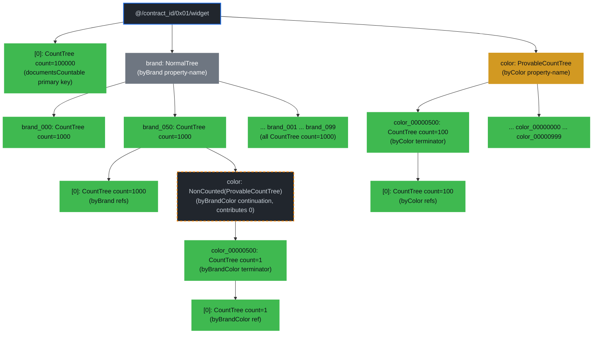
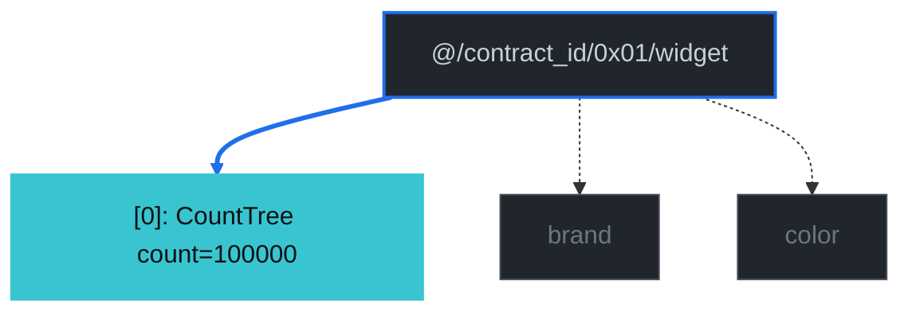
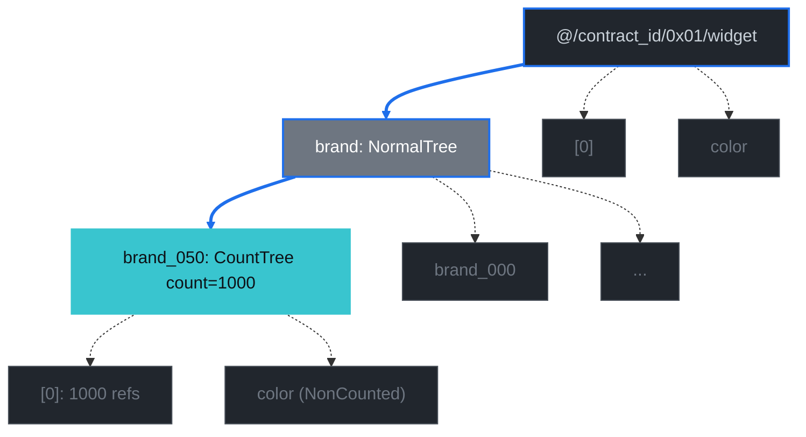
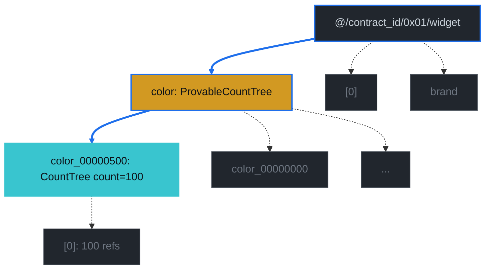
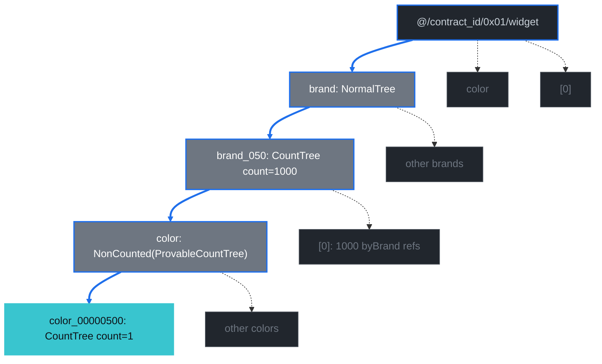
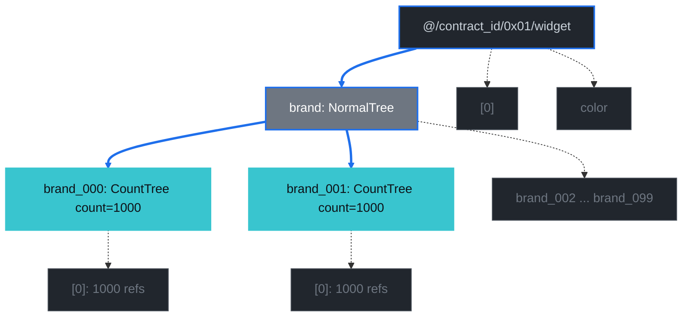
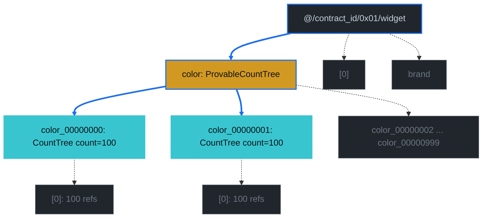
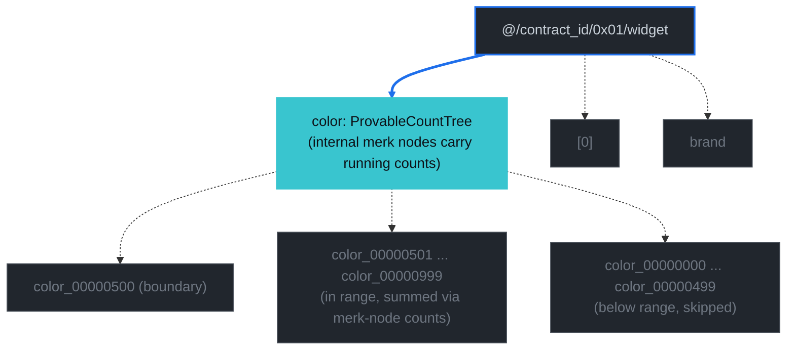

# Count Index Examples

This chapter walks through a representative contract and shows what a count-query proof actually proves — both the path query the prover signs and the verified element the verifier extracts. Every example uses the same `widget` contract (the same one the count-query bench at [`packages/rs-drive/benches/document_count_worst_case.rs`](https://github.com/dashpay/platform/blob/v3.1-dev/packages/rs-drive/benches/document_count_worst_case.rs) populates) so the proof bytes, verified elements, and diagrams can all be cross-referenced against the same data.

The chapter assumes you've read [Document Count Trees](./document-count-trees.md) — that chapter explains the three tree variants (`NormalTree` / `CountTree` / `ProvableCountTree`), what `Element::NonCounted` does, and how the schema's `documentsCountable` / `rangeCountable` flags select between them. Here we take that machinery as given and trace what each query *sees*.

## The Widget Contract

The widget document type carries three properties (`brand`, `color`, `serial`), opts into total counts at the doctype level via `documentsCountable: true`, and declares three indexes covering the count-query surface:

```jsonc
{
  "type": "object",
  "documentsCountable": true,
  "properties": {
    "brand":  { "type": "string", "position": 0, "maxLength": 32 },
    "color":  { "type": "string", "position": 1, "maxLength": 32 },
    "serial": { "type": "integer", "position": 2 }
  },
  "required": ["brand", "color", "serial"],
  "indices": [
    {
      "name": "byBrand",
      "properties": [{ "brand": "asc" }],
      "countable": "countable"
    },
    {
      "name": "byColor",
      "properties": [{ "color": "asc" }],
      "countable": "countable",
      "rangeCountable": true
    },
    {
      "name": "byBrandColor",
      "properties": [{ "brand": "asc" }, { "color": "asc" }],
      "countable": "countable",
      "rangeCountable": true
    }
  ],
  "additionalProperties": false
}
```

Three things to notice:

1. **`documentsCountable: true`** at the document-type level upgrades the doctype's primary-key subtree (at `widget/[0]`) from `NormalTree` to `CountTree`. The unfiltered total count is one read against this element's `count_value`.
2. **`byBrand` is `countable: "countable"` only.** It doesn't opt into `rangeCountable`, so `brand > X` range counts aren't supported. But **every countable terminator's value tree is stored as a `CountTree`** regardless of `rangeCountable` (see [`add_indices_for_index_level_for_contract_operations/v0/mod.rs`](https://github.com/dashpay/platform/blob/v3.1-dev/packages/rs-drive/src/drive/document/insert/add_indices_for_index_level_for_contract_operations/v0/mod.rs)), so point-lookup count proofs (e.g. `brand == "X"` or `brand IN [...]`) get the same compact value-tree-direct shape on byBrand that they do on rangeCountable indexes. `rangeCountable` is strictly an opt-in for `AggregateCountOnRange` support — orthogonal to proof-size shape.
3. **`byColor` and `byBrandColor` are `rangeCountable: true`.** Their property-name subtrees (e.g. `widget/color`) are stored as `ProvableCountTree` rather than `NormalTree`, which is what `AggregateCountOnRange` walks for `color > floor` style queries.

The bench populates 100 000 documents under a deterministic schedule — `row → (brand_(row % 100), color_(row / 100), serial=row)`. That gives exactly 1 000 docs per brand, exactly 100 docs per color, and exactly 1 doc per `(brand, color)` pair. Those numbers show up in every verified count below.

## GroveDB Layout

The contract above produces this storage shape. Tree elements (the wrapping `Element` GroveDB stores under each key) are drawn as subgraphs; children inside each tree are merk-tree nodes. The doctype root and the per-property name subtrees are separate `Element` trees nested under the contract-documents prefix, just like every other index in Drive.

*Diagram conventions: green nodes carry a `count_value` committed to the merk root; gray are regular subtrees; dashed boxes highlight `Element::NonCounted` wrappers (children that store data but contribute `0` to their parent CountTree's count).*



Three layout facts to internalize before reading the queries:

- **`brand_050` is a `CountTree` with `count_value = 1000`.** That's true *because* `byBrand` is countable; the rule applies uniformly to every countability tier (see [`add_indices_for_index_level_for_contract_operations/v0/mod.rs`](https://github.com/dashpay/platform/blob/v3.1-dev/packages/rs-drive/src/drive/document/insert/add_indices_for_index_level_for_contract_operations/v0/mod.rs)). The `color` continuation that branches off this value tree is `NonCounted`-wrapped so the parent's count equals exactly the 1 000 refs in `[0]`.
- **`widget/color` is a `ProvableCountTree`**, not a regular `NormalTree`. The yellow class above marks that — each internal merk node carries its subtree's count, which is what makes `AggregateCountOnRange` a single-pass primitive.
- **`color_00000500` is a `CountTree` with `count_value = 100`** under either parent. The same element layout would result from a query against `byColor` or against `byBrandColor`'s second level; the path that gets there differs, but the destination is structurally the same.

## How To Read The Proofs

Every example below has four sections:

1. **Path query** — the spec the prover hands GroveDB. `path` is the list of subtree segments to descend through (the proof carries merk-path bytes for each of these); `query items` is what to select once at the bottom; `subquery items` (when present) descends one more layer.
2. **Verified element** — what `GroveDB::verify_query` (or `verify_aggregate_count_query` for the range primitive) returns after walking the proof bytes. The `count_value_or_default` field on a `CountTree` element is what the count surface ultimately surfaces to the caller.
3. **Proof display** — the proof bytes, decoded via `bincode` into the structured `GroveDBProof` AST and rendered through its `Display` impl. This is the same view [dash-evo-tool's Proof Log screen](https://github.com/dashpay/dash-evo-tool/blob/master/src/ui/tools/proof_log_screen.rs) shows when its display mode is set to "JSON" — each layer is a separate `LayerProof` carrying its merk-tree operations (`Push` / `Parent` / `Child` over `Hash` / `KVValueHash` / `KVHash`) plus a `lower_layers` map naming the children to descend into. Wrapped in a collapsible block per example because the merk path through 4-5 grovedb layers makes for long output.
4. **Diagram** — the path the proof walks through the layout. Blue arrows trace the descent; the cyan node is the verified element; faded gray nodes show context.

All proof-size numbers come from running the bench against a 100 000-row fixture; see [`document_count_worst_case.rs`](https://github.com/dashpay/platform/blob/v3.1-dev/packages/rs-drive/benches/document_count_worst_case.rs)'s `report_proof_sizes` / `display_proofs` / `report_group_by_matrix` helpers. The proof bytes are reproducible — run the bench, grep `[proof]` from stderr, and you'll get the same hashes shown here.

## Query 1 — Unfiltered Total Count

```text
select  = COUNT
where   = (empty)
prove   = true
```

**Path query** (primary-key CountTree fast path; no index walk needed):

```text
path:         ["@", contract_id, 0x01, "widget"]
query items:  [Key(0x00)]
```

**Verified element:**

```text
path:        ["@", contract_id, 0x01, "widget"]
key:         0x00
element:     CountTree { count_value_or_default: 100000 }
```

**Proof size:** 585 B.

**Proof display** (`GroveDBProof::Display`):

<details>
<summary>Expand to see the structured proof (4 layers)</summary>

```text
GroveDBProofV1 {
  LayerProof {
    proof: Merk(
      0: Push(Hash(HASH[bd291f29893fb6f6d6201087746ca1f23a178dd08e1346cb6c127e91ae3623b3]))
      1: Push(KVValueHash(@, Tree(4ed22624752972af97fb71abf4067b23e6d296a61a02f35b2098819fde39d289), HASH[4a5a28cb1b40226aa35b2f0d502767df13268bdf4678627dbfde26a557acdf73]))
      2: Parent
      3: Push(Hash(HASH[19c924989e473a90d0848277d0b1498ccc8db3dc870cbc130e773f3d79ea5b71]))
      4: Child)
    lower_layers: {
      @ => {
        LayerProof {
          proof: Merk(
            0: Push(KVValueHash(0x4ed22624752972af97fb71abf4067b23e6d296a61a02f35b2098819fde39d289, Tree(01), HASH[5b90e1e952b7eef903cc9db2d9098e334a37f7e08cade52c6b2ea3bf4b56b645])))
          lower_layers: {
            0x4ed22624752972af97fb71abf4067b23e6d296a61a02f35b2098819fde39d289 => {
              LayerProof {
                proof: Merk(
                  0: Push(Hash(HASH[49e7191075272395ed72cf03e973987ede6e4945e08574fe77d725f4ce7ecdf8]))
                  1: Push(KVValueHash(0x01, Tree(776964676574), HASH[5d9a0fad8a3f32560f8e8950c1e84a7feabaab21b79bc72fec4482442844e2ef]))
                  2: Parent)
                lower_layers: {
                  0x01 => {
                    LayerProof {
                      proof: Merk(
                        0: Push(KVValueHash(widget, Tree(6272616e64), HASH[6c505f53f2ebf3de030cc2aca463d4b429aeb320a9fadb8ae68bb7903a22bb68])))
                      lower_layers: {
                        widget => {
                          LayerProof {
                            proof: Merk(
                              0: Push(KVValueHashFeatureTypeWithChildHash(0x00, CountTree(0000000000010000fffffffffffeffff00000000000000000000000000000000, 100000), HASH[85843d8e6353dd6caf52f659c454b4a1352f510daa965df594b27319abf1d8a1], BasicMerkNode, HASH[0e6a5047f0600cafc385ed52b516c1fbbaf4994aa50dfcbd1e824b4ad9f55fa1]))
                              1: Push(KVHash(HASH[a29ee8f206a253362b6da4fcacf8643ee8e5925cd979fcd449e5906f0f9f8be3]))
                              2: Parent
                              3: Push(Hash(HASH[6c36729e93b1a316cbf60fe282eb630c0ed6e45db088e365110302b6c9caba86]))
                              4: Child)
                          }
                        }
                      }
                    }
                  }
                }
              }
            }
          }
        }
      }
    }
  }
}
```

Each `LayerProof` is one GroveDB tree's merk proof. The descent goes: top-level GroveDB root → `@` (`DataContractDocuments` root tree) → contract id → `0x01` (documents storage prefix) → `widget` doctype → finally the `Key(0x00)` payload at the bottom, where `CountTree(…, 100000)` is the verified element with its `count_value` of 100 000 visible inside.

</details>

The descent stops at the doctype's primary-key tree — the green node at the top of the layout. Because `documentsCountable: true` upgraded that tree to a `CountTree`, the count is one O(1) read.



## Query 2 — Equal on a Single Property (`byBrand`)

```text
select  = COUNT
where   = brand == "brand_050"
prove   = true
```

**Path query:**

```text
path:         ["@", contract_id, 0x01, "widget", "brand"]
query items:  [Key("brand_050")]
```

**Verified element:**

```text
path:        ["@", contract_id, 0x01, "widget", "brand"]
key:         "brand_050"
element:     CountTree { count_value_or_default: 1000 }
```

**Proof size:** 1 041 B.

**Proof display:**

<details>
<summary>Expand to see the structured proof (5 layers)</summary>

```text
GroveDBProofV1 {
  LayerProof {
    proof: Merk(
      0: Push(Hash(HASH[bd291f29893fb6f6d6201087746ca1f23a178dd08e1346cb6c127e91ae3623b3]))
      1: Push(KVValueHash(@, Tree(4ed22624752972af97fb71abf4067b23e6d296a61a02f35b2098819fde39d289), HASH[4a5a28cb1b40226aa35b2f0d502767df13268bdf4678627dbfde26a557acdf73]))
      2: Parent
      3: Push(Hash(HASH[19c924989e473a90d0848277d0b1498ccc8db3dc870cbc130e773f3d79ea5b71]))
      4: Child)
    lower_layers: {
      @ => {
        LayerProof {
          proof: Merk(
            0: Push(KVValueHash(0x4ed22624752972af97fb71abf4067b23e6d296a61a02f35b2098819fde39d289, Tree(01), HASH[5b90e1e952b7eef903cc9db2d9098e334a37f7e08cade52c6b2ea3bf4b56b645])))
          lower_layers: {
            0x4ed22624752972af97fb71abf4067b23e6d296a61a02f35b2098819fde39d289 => {
              LayerProof {
                proof: Merk(
                  0: Push(Hash(HASH[49e7191075272395ed72cf03e973987ede6e4945e08574fe77d725f4ce7ecdf8]))
                  1: Push(KVValueHash(0x01, Tree(776964676574), HASH[5d9a0fad8a3f32560f8e8950c1e84a7feabaab21b79bc72fec4482442844e2ef]))
                  2: Parent)
                lower_layers: {
                  0x01 => {
                    LayerProof {
                      proof: Merk(
                        0: Push(KVValueHash(widget, Tree(6272616e64), HASH[6c505f53f2ebf3de030cc2aca463d4b429aeb320a9fadb8ae68bb7903a22bb68])))
                      lower_layers: {
                        widget => {
                          LayerProof {
                            proof: Merk(
                              0: Push(Hash(HASH[9862894b16a0792688fdcf64edcb2ceade5c8b234649bfc6cfc6426869b0e9d9]))
                              1: Push(KVValueHash(brand, Tree(6272616e645f303633), HASH[68b697da99d6ea70a83eb41794dca7ba3938d0ba98fbfaeb3cd0c19b3b5d0ff2]))
                              2: Parent
                              3: Push(Hash(HASH[6c36729e93b1a316cbf60fe282eb630c0ed6e45db088e365110302b6c9caba86]))
                              4: Child)
                            lower_layers: {
                              brand => {
                                LayerProof {
                                  proof: Merk(
                                    0..8: <merk-path hashes covering siblings of brand_050>
                                    9: Push(KVValueHashFeatureTypeWithChildHash(brand_050, CountTree(636f6c6f72, 1000, flags: [0, 0, 0]), HASH[53dbd6216cccdddf16f3eb0f849aed0c0cea987a718f5b43493abf0a14e83eb9], BasicMerkNode, HASH[4947457e230f87ce0f75a7f1502f64f24ee4d3e27eb5d2210680822a3b17afa4]))
                                    10..24: <merk-path hashes finishing the boundary proof>)
                                }
                              }
                            }
                          }
                        }
                      }
                    }
                  }
                }
              }
            }
          }
        }
      }
    }
  }
}
```

The bottom layer is the byBrand property-name tree; it has 100 distinct `brand_NNN` keys, so the merk path proves `brand_050`'s position with 24 ops total. The verified payload is the inline `CountTree(636f6c6f72, 1000, flags: [0, 0, 0])` — the `636f6c6f72` value slot is the ASCII bytes for `"color"` (the continuation pointer; `NonCounted`-wrapped at the storage layer so it contributes 0 to the parent count), and the `1000` is the doc count.

</details>

`brand_050` is itself a `CountTree` — every countable terminator's value tree carries the doc count directly, with sibling continuations wrapped `NonCounted` so they don't pollute the parent. The proof shape is the same as the rangeCountable case below, even though `byBrand` doesn't opt into `rangeCountable: true`. `rangeCountable` is the orthogonal opt-in for `AggregateCountOnRange` (Query 7), not for proof-size shape.



## Query 3 — Equal on a RangeCountable Property (`byColor`)

```text
select  = COUNT
where   = color == "color_00000500"
prove   = true
```

**Path query:**

```text
path:         ["@", contract_id, 0x01, "widget", "color"]
query items:  [Key("color_00000500")]
```

**Verified element:**

```text
path:        ["@", contract_id, 0x01, "widget", "color"]
key:         "color_00000500"
element:     CountTree { count_value_or_default: 100 }
```

**Proof size:** 1 327 B.

**Proof display:**

<details>
<summary>Expand to see the structured proof (5 layers; note `KVHashCount` ops in the byColor `ProvableCountTree` layer)</summary>

```text
GroveDBProofV1 {
  LayerProof {
    proof: Merk(... root-level descent, identical to Query 1 ...)
    lower_layers: {
      @ => { LayerProof { ... contract id ... lower_layers: { 0x4ed2... => {
        LayerProof { ... 0x01 prefix ... lower_layers: { 0x01 => {
          LayerProof { ... widget doctype ... lower_layers: { widget => {
            LayerProof {
              proof: Merk(
                0: Push(Hash(HASH[9862894b16a0792688fdcf64edcb2ceade5c8b234649bfc6cfc6426869b0e9d9]))
                1: Push(KVHash(HASH[a29ee8f206a253362b6da4fcacf8643ee8e5925cd979fcd449e5906f0f9f8be3]))
                2: Parent
                3: Push(KVValueHash(color, ProvableCountTree(636f6c6f725f3030303030353131, 100000), HASH[79569d595db75bbf...]))
                4: Child)
              lower_layers: {
                color => {
                  LayerProof {
                    proof: Merk(
                      0: Push(Hash(HASH[864c8a53cdfc17560ea304fe40ae87570699a6920eae3dcb6075f71ca2d79b02]))
                      1: Push(KVHashCount(HASH[3684347a67ceedad...], 51100))
                      2: Parent
                      3: Push(Hash(HASH[56422e033fcffda5...]))
                      4: Push(KVHashCount(HASH[aa27604017cfc457...], 25500))
                      5: Parent
                      6: Push(Hash(HASH[09bcdaa37a5ae46f...]))
                      7: Push(KVHashCount(HASH[525df42449bd5e88...], 12700))
                      8: Parent
                      9: Push(Hash(HASH[ffe58ba46b2d1f91...]))
                      10: Push(KVHashCount(HASH[abbcbcef405f19e0...], 6300))
                      11: Parent
                      12: Push(Hash(HASH[472879d66cf8e01e...]))
                      13: Push(KVHashCount(HASH[3ac3896404268efc...], 3100))
                      14: Parent
                      15: Push(Hash(HASH[1c40306956f164e4...]))
                      16: Push(KVHashCount(HASH[494935a3d102495b...], 700))
                      17: Parent
                      18: Push(KVValueHashFeatureTypeWithChildHash(color_00000500, CountTree(00, 100, flags: [0, 0, 0]), HASH[47b0ade593a2e4e9...], ProvableCountedMerkNode(100), HASH[4f7f13f56e087e7b...]))
                      19: Push(KVHashCount(HASH[4866192fb6beda08...], 300))
                      20: Parent
                      21: Push(Hash(HASH[f56dd41a87f9b487...]))
                      22: Child
                      23: Child
                      24: Push(KVHashCount(HASH[a646e152e4bfb609...], 1500))
                      25: Parent
                      26: Push(Hash(HASH[f434d46bb16f8413...]))
                      27..32: <Child ops binding the boundary path>
                      33: Push(KVHashCount(HASH[c32ae0189f148c23...], 100000))
                      34: Parent
                      35: Push(Hash(HASH[1a1c99166d7b1e1e...]))
                      36: Child)
                  }
                }
              }
            }
          } } }
        } } }
      } } }
    }
  }
}
```

This is the most interesting layer in the chapter. The byColor property-name tree (`widget/color`) is a `ProvableCountTree`, so every internal merk node carries its subtree's running count — visible here as `KVHashCount(HASH[…], N)` ops where `N` is the count contribution of that subtree (51 100 + 25 500 + 12 700 + 6 300 + 3 100 + 700 + 300 + ... = 100 000 total docs across the tree). The verified element (`color_00000500`) lands in the middle of these `KVHashCount` ops, and the surrounding ops walk the binary boundary path so the prover can recompute the parent merk hash. For a point-lookup query like this, the `ProvableCountTree` machinery is overkill — it carries running counts the verifier doesn't need. Query 7 is where this pays off.

</details>

Structurally identical to Query 2 — only the property name and the count-tree depth differ. The intermediate `widget/color` tree is a `ProvableCountTree` here (vs `NormalTree` for `byBrand`), but the *proof* doesn't care about that: it descends through the property-name tree and surfaces the value-tree CountTree at the bottom. The `ProvableCountTree` upgrade matters for Query 7 (range aggregate), not for point lookup.



## Query 4 — Compound Equal-only (`byBrandColor`)

```text
select  = COUNT
where   = brand == "brand_050" AND color == "color_00000500"
prove   = true
```

**Path query:**

```text
path:         ["@", contract_id, 0x01, "widget", "brand", "brand_050", "color"]
query items:  [Key("color_00000500")]
```

**Verified element:**

```text
path:        ["@", contract_id, 0x01, "widget", "brand", "brand_050", "color"]
key:         "color_00000500"
element:     CountTree { count_value_or_default: 1 }
```

**Proof size:** 1 911 B.

**Proof display:**

<details>
<summary>Expand to see the structured proof (6 layers — the deepest descent in the chapter)</summary>

```text
GroveDBProofV1 {
  LayerProof {
    proof: Merk(... root-level descent, identical to Query 1 ...)
    lower_layers: {
      @ => { LayerProof { ... contract id ... lower_layers: { 0x4ed2... => {
        LayerProof { ... 0x01 prefix ... lower_layers: { 0x01 => {
          LayerProof { ... widget doctype ... lower_layers: { widget => {
            LayerProof {
              proof: Merk(... 0..4: walk the doctype's brand prefix ...)
              lower_layers: {
                brand => {
                  LayerProof {
                    proof: Merk(
                      0..8: <merk-path boundary ops covering siblings of brand_050>
                      9: Push(KVValueHash(brand_050, CountTree(636f6c6f72, 1000, flags: [0, 0, 0]), HASH[53dbd6216cccdddf...]))
                      10..18: <Child/Parent ops descending past brand_050 to its continuation>)
                    lower_layers: {
                      brand_050 => {
                        LayerProof {
                          proof: Merk(
                            0: Push(KVValueHash(color, ProvableCountTree(636f6c6f725f3030303030353131, 1000), HASH[af50325b2d3ca227...])))
                          lower_layers: {
                            color => {
                              LayerProof {
                                proof: Merk(
                                  0: Push(Hash(HASH[7e2704a94ce3e08e...]))
                                  1: Push(KVHashCount(HASH[ccfe3e95a84b2230...], 511))
                                  2: Parent
                                  3: Push(Hash(HASH[3dac20af894289bb...]))
                                  4: Push(KVHashCount(HASH[1a3db8540380b26e...], 255))
                                  5: Parent
                                  6: Push(Hash(HASH[61f333ba1ad78624...]))
                                  7: Push(KVHashCount(HASH[94e2ea0c17ffbf05...], 127))
                                  8: Parent
                                  9: Push(Hash(HASH[a8571229cee7010a...]))
                                  10: Push(KVHashCount(HASH[6b04a6eb8e698272...], 63))
                                  11: Parent
                                  12: Push(Hash(HASH[8c12a68cebf211bb...]))
                                  13: Push(KVHashCount(HASH[9533ef417b8eed11...], 31))
                                  14: Parent
                                  15: Push(Hash(HASH[2f385d9fd5157a78...]))
                                  16: Push(KVHashCount(HASH[74ad467d4132703a...], 7))
                                  17: Parent
                                  18: Push(KVValueHashFeatureTypeWithChildHash(color_00000500, CountTree(00, 1, flags: [0, 0, 0]), HASH[7f1d988845d9c82b...], ProvableCountedMerkNode(1), HASH[078e3476060013c4...]))
                                  19..36: <merk-path hashes finishing the boundary proof>)
                              }
                            }
                          }
                        }
                      }
                    }
                  }
                }
              }
            }
          } } }
        } } }
      } } }
    }
  }
}
```

This is the deepest descent in the chapter. The path threads:
1. The two intermediate GroveDB-wrapper layers (`@` and `0x01`).
2. The widget doctype.
3. The byBrand property-name tree.
4. The byBrand value tree for `brand_050` (visible in Query 2 already, here it's an intermediate stop with `CountTree(636f6c6f72, 1000, …)` — same element, same count).
5. The byBrandColor continuation (`color` — `ProvableCountTree`).
6. The byBrandColor terminator value tree, finally arriving at `color_00000500` with `CountTree(00, 1, …)` — the bench's deterministic schedule gives exactly 1 doc per `(brand, color)` pair.

</details>

The proof descends through `byBrandColor`'s prefix value tree (`brand_050`) into its continuation (`color`, the `NonCounted`-wrapped subtree shown earlier) and resolves at the terminator value tree `color_00000500`. The count is `1` because the bench's fixture has exactly one document per `(brand, color)` pair.



## Query 5 — `In` on `byBrand`

```text
select  = COUNT
where   = brand IN ["brand_000", "brand_001"]
prove   = true
```

**Path query:**

```text
path:         ["@", contract_id, 0x01, "widget", "brand"]
query items:  [Key("brand_000"), Key("brand_001")]
```

**Verified elements** (one per In value, returned in lex-asc order):

```text
path:        ["@", contract_id, 0x01, "widget", "brand"]
key:         "brand_000"
element:     CountTree { count_value_or_default: 1000 }

path:        ["@", contract_id, 0x01, "widget", "brand"]
key:         "brand_001"
element:     CountTree { count_value_or_default: 1000 }
```

**Proof size:** 1 102 B.

**Proof display:**

<details>
<summary>Expand to see the structured proof (5 layers, two `KVValueHash` items at the byBrand level)</summary>

```text
GroveDBProofV1 {
  LayerProof {
    proof: Merk(... root-level descent, identical to Query 1 ...)
    lower_layers: {
      @ => { LayerProof { ... contract id ... lower_layers: { 0x4ed2... => {
        LayerProof { ... 0x01 prefix ... lower_layers: { 0x01 => {
          LayerProof { ... widget doctype ... lower_layers: { widget => {
            LayerProof {
              proof: Merk(... 0..4: walk the doctype's brand prefix ...)
              lower_layers: {
                brand => {
                  LayerProof {
                    proof: Merk(
                      0: Push(KVValueHashFeatureTypeWithChildHash(brand_000, CountTree(636f6c6f72, 1000, flags: [0, 0, 0]), HASH[90ff6f6d9a3d9011...], BasicMerkNode, HASH[19b58883c492e746...]))
                      1: Push(KVValueHashFeatureTypeWithChildHash(brand_001, CountTree(636f6c6f72, 1000, flags: [0, 0, 0]), HASH[484ca11fb4ec8f47...], BasicMerkNode, HASH[0bf12023f8e067c1...]))
                      2: Parent
                      3..24: <merk-path boundary ops covering siblings of brand_000 / brand_001 in the binary merk tree>)
                  }
                }
              }
            }
          } } }
        } } }
      } } }
    }
  }
}
```

The two `Push(KVValueHashFeatureTypeWithChildHash(brand_NNN, CountTree(…, 1000, …), …))` ops are the actual verified elements — both inlined in the byBrand layer's merk proof. They share the same parent path (`@/.../widget/brand`); the verifier-side `verify_query` returns both as siblings rather than descending one more layer per value (which is what the legacy `Key([0])` shape would have forced for a normal-countable index, but no longer does — every countable terminator's value tree is a CountTree). The remaining 22 ops are the boundary-path hashes that prove `brand_000` and `brand_001` actually occupy the merk-tree positions claimed.

</details>

The outer query enumerates `Key(in_value)` items at the property-name subtree; each resolved element is itself a value-tree `CountTree`. No subquery is set — the In values' value trees *are* the count-bearing elements. The verifier reads the per-In value from `grove_key` (rather than from `path[base_path_len]`, which is how it would for a trailing-Equal compound). The caller sums the two `count_value_or_default` reads (or surfaces them as per-group entries if `group_by = ["brand"]`).



## Query 6 — `In` on `byColor` (RangeCountable)

```text
select  = COUNT
where   = color IN ["color_00000000", "color_00000001"]
prove   = true
```

**Path query:**

```text
path:         ["@", contract_id, 0x01, "widget", "color"]
query items:  [Key("color_00000000"), Key("color_00000001")]
```

**Verified elements:**

```text
path:        ["@", contract_id, 0x01, "widget", "color"]
key:         "color_00000000"
element:     CountTree { count_value_or_default: 100 }

path:        ["@", contract_id, 0x01, "widget", "color"]
key:         "color_00000001"
element:     CountTree { count_value_or_default: 100 }
```

**Proof size:** 1 381 B.

**Proof display:**

<details>
<summary>Expand to see the structured proof (5 layers; bottom layer carries `KVHashCount` running totals from the `ProvableCountTree`)</summary>

```text
GroveDBProofV1 {
  LayerProof {
    proof: Merk(... root-level descent, identical to Query 1 ...)
    lower_layers: {
      @ => { LayerProof { ... contract id ... lower_layers: { 0x4ed2... => {
        LayerProof { ... 0x01 prefix ... lower_layers: { 0x01 => {
          LayerProof { ... widget doctype ... lower_layers: { widget => {
            LayerProof {
              proof: Merk(
                0: Push(Hash(HASH[9862894b16a0792688fdcf64edcb2ceade5c8b234649bfc6cfc6426869b0e9d9]))
                1: Push(KVHash(HASH[a29ee8f206a253362b6da4fcacf8643ee8e5925cd979fcd449e5906f0f9f8be3]))
                2: Parent
                3: Push(KVValueHash(color, ProvableCountTree(636f6c6f725f3030303030353131, 100000), HASH[79569d595db75bbf...]))
                4: Child)
              lower_layers: {
                color => {
                  LayerProof {
                    proof: Merk(
                      0: Push(KVValueHashFeatureTypeWithChildHash(color_00000000, CountTree(00, 100, flags: [0, 0, 0]), HASH[ce582ad80dab7f82...], ProvableCountedMerkNode(100), HASH[ad2891a5a377d25e...]))
                      1: Push(KVValueHashFeatureTypeWithChildHash(color_00000001, CountTree(00, 100, flags: [0, 0, 0]), HASH[c4024227f61350e1...], ProvableCountedMerkNode(300), HASH[45e2452816d75b27...]))
                      2: Parent
                      3..36: <merk-path boundary ops, including KVHashCount(HASH[...], N) summary nodes for the rest of the byColor tree's per-subtree counts (700, 1500, 3100, 6300, 12700, 25500, 51100, 100000) so the prover can rebuild the parent merk hash>)
                  }
                }
              }
            }
          } } }
        } } }
      } } }
    }
  }
}
```

Same layer count as Query 5 (5 layers) and same inline-two-elements pattern at the bottom. The difference is in the merk-tree node *type* surrounding the verified elements: byColor's bottom layer is a `ProvableCountTree`, so each sibling's merk-path operation is a `KVHashCount(HASH[...], N)` (carrying the sibling's running count) rather than the plain `KVHash(HASH[...])` you see in Query 5's byBrand layer. The boundary-proof ops here read like a histogram of the byColor tree's per-subtree counts (700, 1500, 3100, 6300, 12700, 25500, 51100, 100000) — that's the same information Query 7 will sum over directly without descending to any specific value tree.

</details>

Same query shape as Query 5 — outer `Key`-per-In-value, no subquery, per-In `CountTree`s resolved at the bottom. The difference vs Query 5 is the *property-name* tree above is a `ProvableCountTree` instead of `NormalTree`. That doesn't change the proof's structural shape, but it does mean a future `color > X` range query against this property has a fast path Query 5's `brand` doesn't.



## Query 7 — Range Query (`AggregateCountOnRange`)

```text
select  = COUNT
where   = color > "color_00000500"
prove   = true
```

**Path query** (different primitive — note the `AggregateCountOnRange` query item):

```text
path:         ["@", contract_id, 0x01, "widget", "color"]
query items:  [AggregateCountOnRange([RangeAfter("color_00000500"..)])]
```

**Verified payload** (different verifier — `GroveDb::verify_aggregate_count_query` returns a single `u64`, not an element list):

```text
root_hash:   0x62ee7348f4d28dd9d7cf86a6c725fa8276cfd446f6007a6000fb0e1dfefa6468
count:       49900
```

**Proof size:** 2 072 B.

**Proof display:**

<details>
<summary>Expand to see the structured proof (5 layers; bottom layer uses `HashWithCount` + `KVDigestCount` ops instead of `KVValueHash` — the AggregateCountOnRange-specific merk primitive)</summary>

```text
GroveDBProofV1 {
  LayerProof {
    proof: Merk(... root-level descent, identical to Query 1 ...)
    lower_layers: {
      @ => { LayerProof { ... contract id ... lower_layers: { 0x4ed2... => {
        LayerProof { ... 0x01 prefix ... lower_layers: { 0x01 => {
          LayerProof { ... widget doctype ... lower_layers: { widget => {
            LayerProof {
              proof: Merk(... 0..4: descent into the `color` ProvableCountTree, identical to Query 6's penultimate layer ...)
              lower_layers: {
                color => {
                  LayerProof {
                    proof: Merk(
                      0: Push(HashWithCount(kv_hash=HASH[b2fa1534...], left=HASH[e8368be0...], right=HASH[db461b2f...], count=25500))
                      1: Push(KVDigestCount(color_00000255, HASH[adfb1581...], 51100))
                      2: Parent
                      3: Push(HashWithCount(..., count=12700))
                      4: Push(KVDigestCount(color_00000383, HASH[14f48ee2...], 25500))
                      5: Parent
                      6: Push(HashWithCount(..., count=6300))
                      7: Push(KVDigestCount(color_00000447, HASH[dcbfdf89...], 12700))
                      8: Parent
                      9: Push(HashWithCount(..., count=3100))
                      10: Push(KVDigestCount(color_00000479, HASH[1e6eb9e9...], 6300))
                      11: Parent
                      12: Push(HashWithCount(..., count=1500))
                      13: Push(KVDigestCount(color_00000495, HASH[cca12136...], 3100))
                      14: Parent
                      15: Push(HashWithCount(..., count=300))
                      16: Push(KVDigestCount(color_00000499, HASH[66e2d072...], 700))
                      17: Parent
                      18: Push(KVDigestCount(color_00000500, HASH[47b0ade5...], 100))
                      19: Push(KVDigestCount(color_00000501, HASH[9146433e...], 300))
                      20: Parent
                      21: Push(HashWithCount(..., count=100))
                      22..27: <Child/Parent ops binding the boundary>
                      28..32: <more Child ops>
                      33: Push(KVDigestCount(color_00000511, HASH[c7fdd609...], 100000))
                      34: Parent
                      35: Push(HashWithCount(kv_hash=HASH[6abc8197...], left=HASH[99323fb7...], right=HASH[33b9e5cb...], count=48800))
                      36: Child)
                  }
                }
              }
            }
          } } }
        } } }
      } } }
    }
  }
}
```

This is the only query in the chapter whose bottom layer uses different merk-proof operations than the others. `AggregateCountOnRange` doesn't return individual elements; it walks the boundary of the requested range (`color > "color_00000500"`) over the `ProvableCountTree`'s internal nodes and uses two specialized operations:

- **`HashWithCount(kv_hash, left, right, count)`** — a boundary node that hides its full subtree behind a single hash + count. The `count` field is the load-bearing piece: the verifier just sums these without descending. In this proof you can see `count=48800` at the bottom-right boundary node (everything to the right of the range cut, plus another `count=100000` showing somewhere in the in-range path), and the prover walks the cut so each `HashWithCount` covers a different chunk of the range.
- **`KVDigestCount(key, kv_hash, count)`** — a *boundary* key inside the in-range region; the prover names the key so the verifier knows exactly where the cut is, but only commits the hash + count, not the value. Note the keys here climb monotonically (`color_00000255 → 383 → 447 → 479 → 495 → 499 → 500 → 501 → 511`); each one names a binary-tree boundary node on the path from the range start (`color_00000500`) to the right edge of the tree.

The final summed `count: 49900` is what the verifier returns. There's no `CountTree(…)` element in this proof — the running totals inside `HashWithCount` / `KVDigestCount` *are* the proof's count surface, committed into the `ProvableCountTree`'s merk root at insertion time.

</details>

This is the only query of the seven that uses a different GroveDB primitive. Instead of resolving N specific keys, `AggregateCountOnRange` walks the boundary of the requested range over `widget/color`'s `ProvableCountTree` and sums the per-node counts already committed inside that tree. The proof carries the boundary merk path and the running total; the verifier returns just the count.

The reason this works *only* with `rangeCountable: true` (Query 5's `byBrand` couldn't do the equivalent) is that `widget/color` is a `ProvableCountTree` — its internal merk nodes carry running counts. `widget/brand` is a plain `NormalTree`; it would have to enumerate every brand and sum their counts (which is what `brand IN [...]` does, but for an unbounded range that's not a feasible proof shape).



The `ProvableCountTree`'s value isn't to expose individual elements — it's to make the summation itself O(log n) instead of O(distinct values in range). The proof bytes are larger than Query 6's two-element point lookup (~2 KB vs ~1.4 KB) because the AggregateCountOnRange primitive has more structural overhead per result, but it scales to any size range in fixed proof bytes, where the point-lookup shape grows linearly with the number of resolved keys.

## At-a-Glance Comparison

| # | Query                                | Primitive                 | Verified shape           | Proof size |
|---|--------------------------------------|---------------------------|--------------------------|------------|
| 1 | `(empty)`                            | primary-key CountTree     | 1 CountTree, count=100000| 585 B      |
| 2 | `brand == X`                         | PointLookupProof / byBrand| 1 CountTree, count=1000  | 1 041 B    |
| 3 | `color == X`                         | PointLookupProof / byColor| 1 CountTree, count=100   | 1 327 B    |
| 4 | `brand == X AND color == Y`          | PointLookupProof / byBrandColor | 1 CountTree, count=1 | 1 911 B    |
| 5 | `brand IN [b0, b1]`                  | PointLookupProof / byBrand| 2 CountTrees, sum=2000   | 1 102 B    |
| 6 | `color IN [c0, c1]`                  | PointLookupProof / byColor| 2 CountTrees, sum=200    | 1 381 B    |
| 7 | `color > floor`                      | AggregateCountOnRange / byColor | u64=49900           | 2 072 B    |

Three takeaways:

- **Query 1 is the cheapest.** A doctype-level total count is one merk read; everything else descends through an index tree.
- **Query 2 and Query 6 are structurally identical** despite covering different indexes (`byBrand` countable-only, `byColor` rangeCountable). The value-tree-direct shape is uniform across countability tiers — `rangeCountable: true` only matters for Query 7.
- **Query 7 is the only one that uses a fundamentally different verifier** (`verify_aggregate_count_query` vs `verify_query`). Everything else returns an element list and reads `count_value_or_default` per branch; Query 7 returns a pre-summed `u64`.

The path-query builder these examples decode lives at [`packages/rs-drive/src/query/drive_document_count_query/path_query.rs`](https://github.com/dashpay/platform/blob/v3.1-dev/packages/rs-drive/src/query/drive_document_count_query/path_query.rs); the verifier mirror sits in [`packages/rs-drive/src/verify/document_count/`](https://github.com/dashpay/platform/blob/v3.1-dev/packages/rs-drive/src/verify/document_count/). Both the prover and the verifier reconstruct the exact same `PathQuery` via the shared builder — touching one without the other is a Merkle-root mismatch waiting to happen, and the byte-identical contract is what makes the proof bytes here reproducible against the bench fixture.
