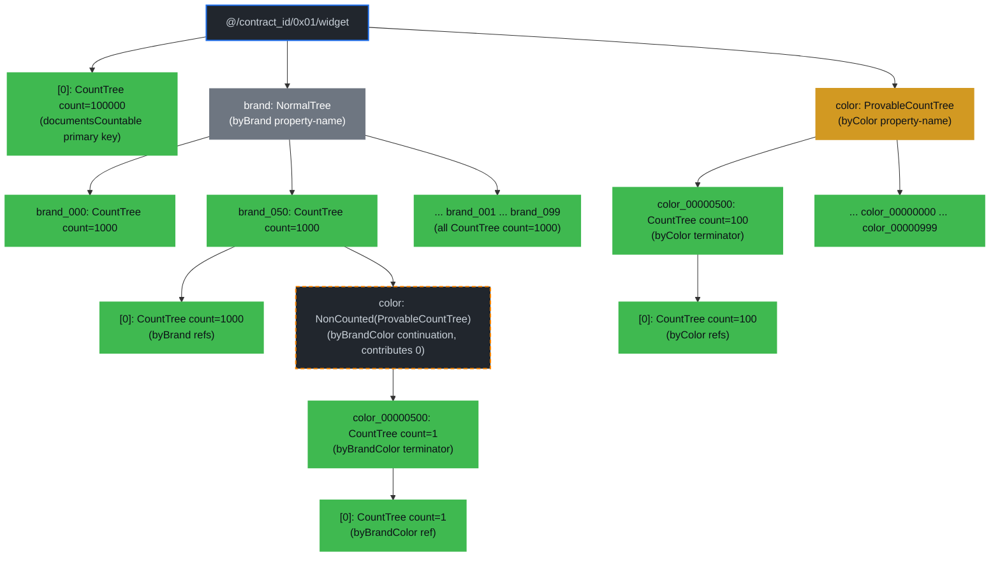
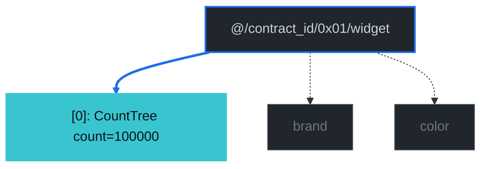
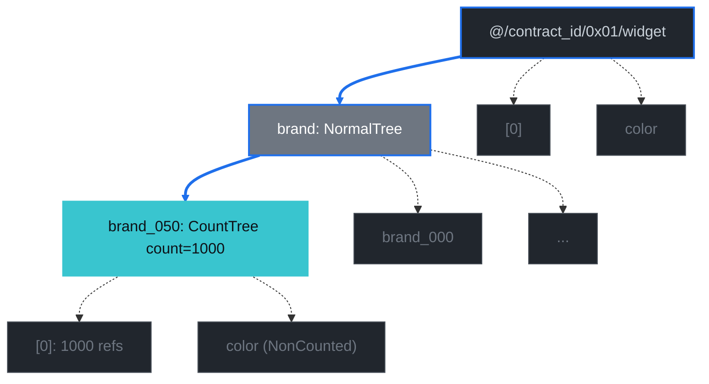
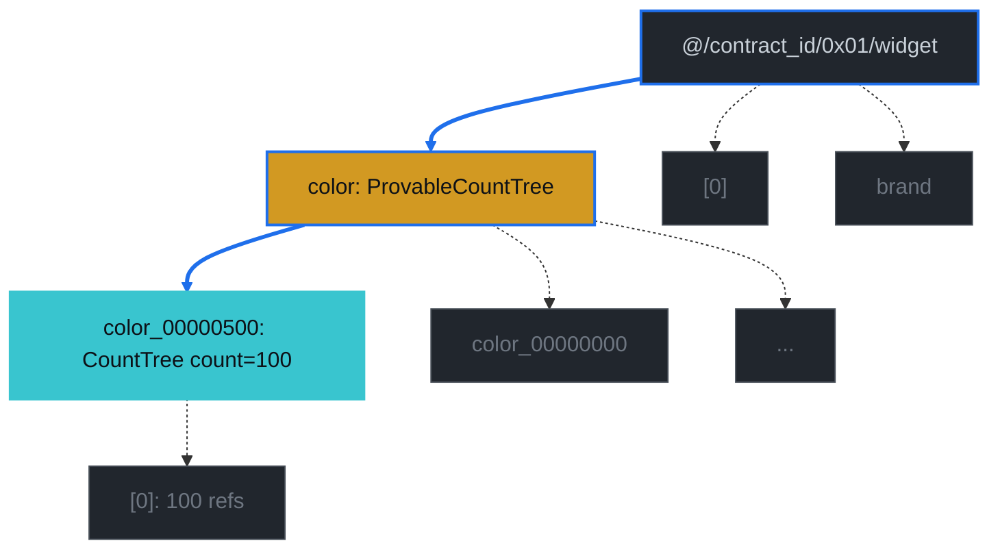
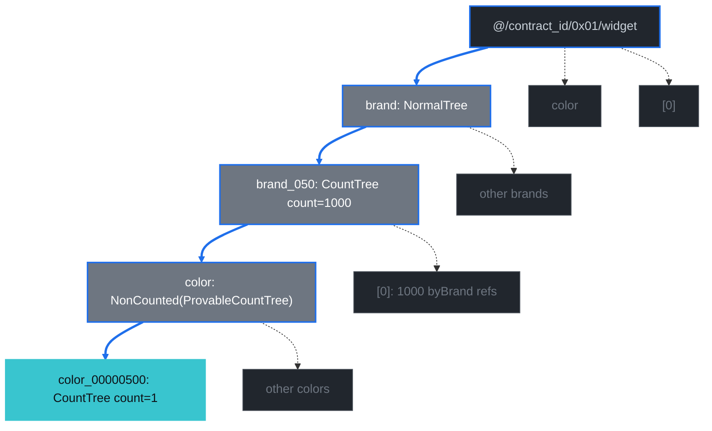
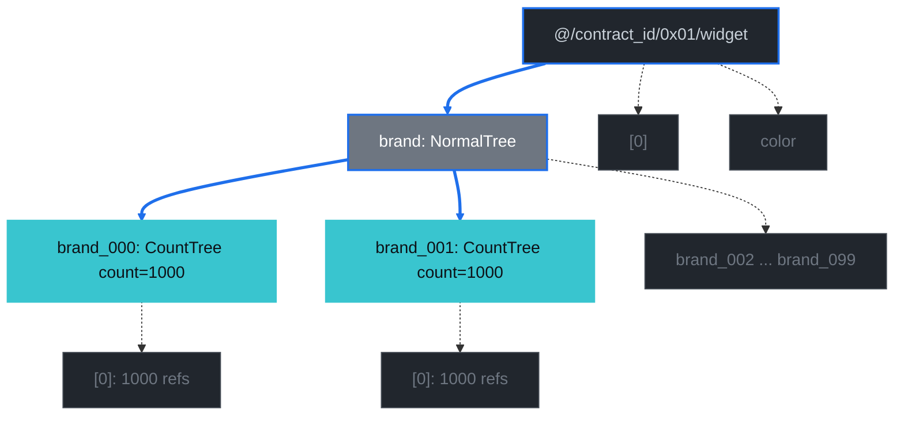
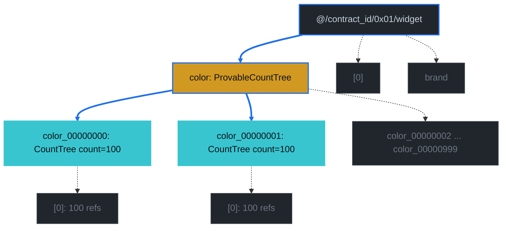
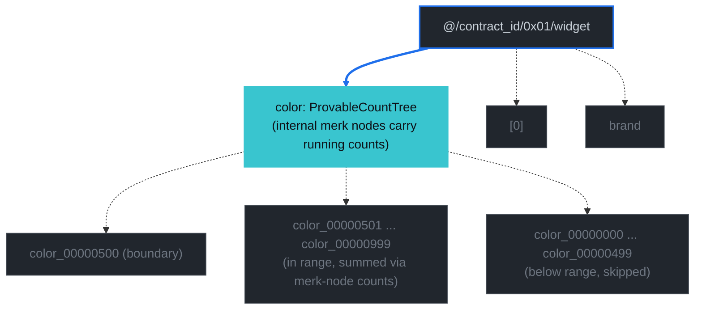

# Count Index Examples

This chapter walks through a representative contract and shows what a count-query proof actually proves — both the path query the prover signs and the verified element the verifier extracts. Every example uses the same `widget` contract (the same one the count-query bench at [`packages/rs-drive/benches/document_count_worst_case.rs`](https://github.com/dashpay/platform/blob/v3.1-dev/packages/rs-drive/benches/document_count_worst_case.rs) populates) so the proof bytes, verified elements, and diagrams can all be cross-referenced against the same data.

The chapter assumes you've read [Document Count Trees](./document-count-trees.md) — that chapter explains the three tree variants (`NormalTree` / `CountTree` / `ProvableCountTree`), what `Element::NonCounted` does, and how the schema's `documentsCountable` / `rangeCountable` flags select between them. Here we take that machinery as given and trace what each query *sees*.

## The Widget Contract

The widget document type carries three properties (`brand`, `color`, `serial`), opts into total counts at the doctype level via `documentsCountable: true`, and declares three indexes covering the count-query surface:

```jsonc
{
  "type": "object",
  "documentsCountable": true,
  "properties": {
    "brand":  { "type": "string", "position": 0, "maxLength": 32 },
    "color":  { "type": "string", "position": 1, "maxLength": 32 },
    "serial": { "type": "integer", "position": 2 }
  },
  "required": ["brand", "color", "serial"],
  "indices": [
    {
      "name": "byBrand",
      "properties": [{ "brand": "asc" }],
      "countable": "countable"
    },
    {
      "name": "byColor",
      "properties": [{ "color": "asc" }],
      "countable": "countable",
      "rangeCountable": true
    },
    {
      "name": "byBrandColor",
      "properties": [{ "brand": "asc" }, { "color": "asc" }],
      "countable": "countable",
      "rangeCountable": true
    }
  ],
  "additionalProperties": false
}
```

Three things to notice:

1. **`documentsCountable: true`** at the document-type level upgrades the doctype's primary-key subtree (at `widget/[0]`) from `NormalTree` to `CountTree`. The unfiltered total count is one read against this element's `count_value`.
2. **`byBrand` is `countable: "countable"` only.** It doesn't opt into `rangeCountable`, so `brand > X` range counts aren't supported. But **every countable terminator's value tree is stored as a `CountTree`** regardless of `rangeCountable` (see [`add_indices_for_index_level_for_contract_operations/v0/mod.rs`](https://github.com/dashpay/platform/blob/v3.1-dev/packages/rs-drive/src/drive/document/insert/add_indices_for_index_level_for_contract_operations/v0/mod.rs)), so point-lookup count proofs (e.g. `brand == "X"` or `brand IN [...]`) get the same compact value-tree-direct shape on byBrand that they do on rangeCountable indexes. `rangeCountable` is strictly an opt-in for `AggregateCountOnRange` support — orthogonal to proof-size shape.
3. **`byColor` and `byBrandColor` are `rangeCountable: true`.** Their property-name subtrees (e.g. `widget/color`) are stored as `ProvableCountTree` rather than `NormalTree`, which is what `AggregateCountOnRange` walks for `color > floor` style queries.

The bench populates 100 000 documents under a deterministic schedule — `row → (brand_(row % 100), color_(row / 100), serial=row)`. That gives exactly 1 000 docs per brand, exactly 100 docs per color, and exactly 1 doc per `(brand, color)` pair. Those numbers show up in every verified count below.

## GroveDB Layout

The contract above produces this storage shape. Tree elements (the wrapping `Element` GroveDB stores under each key) are drawn as subgraphs; children inside each tree are merk-tree nodes. The doctype root and the per-property name subtrees are separate `Element` trees nested under the contract-documents prefix, just like every other index in Drive.

*Diagram conventions: green nodes carry a `count_value` committed to the merk root; gray are regular subtrees; dashed boxes highlight `Element::NonCounted` wrappers (children that store data but contribute `0` to their parent CountTree's count).*



Three layout facts to internalize before reading the queries:

- **`brand_050` is a `CountTree` with `count_value = 1000`.** That's true *because* `byBrand` is countable; the rule applies uniformly to every countability tier (see [`add_indices_for_index_level_for_contract_operations/v0/mod.rs`](https://github.com/dashpay/platform/blob/v3.1-dev/packages/rs-drive/src/drive/document/insert/add_indices_for_index_level_for_contract_operations/v0/mod.rs)). The `color` continuation that branches off this value tree is `NonCounted`-wrapped so the parent's count equals exactly the 1 000 refs in `[0]`.
- **`widget/color` is a `ProvableCountTree`**, not a regular `NormalTree`. The yellow class above marks that — each internal merk node carries its subtree's count, which is what makes `AggregateCountOnRange` a single-pass primitive.
- **`color_00000500` is a `CountTree` with `count_value = 100`** under either parent. The same element layout would result from a query against `byColor` or against `byBrandColor`'s second level; the path that gets there differs, but the destination is structurally the same.

## How To Read The Proofs

Every example below has two sections:

1. **Verbatim `display_proofs` output** — the bench harness in [`document_count_worst_case.rs`](https://github.com/dashpay/platform/blob/v3.1-dev/packages/rs-drive/benches/document_count_worst_case.rs)'s `display_proofs` helper runs each query through the dispatcher, reconstructs the same `PathQuery` the prover used, feeds the proof bytes through `GroveDb::verify_query` (or `verify_aggregate_count_query` for the range primitive), and prints both the prover-side spec (`path` + `query items` + optional `subquery items`) and the verified payload (`root_hash` + element list or aggregate count). The blocks below are that output with the `[proof]` prefix stripped. Re-run the bench to reproduce the bytes exactly.
2. **Diagram** — the path the proof walks through the layout. Blue arrows trace the descent; the cyan node is the verified element; faded gray nodes show context.

A few decoding conventions to keep in mind when reading the displayed proofs:

- **`"@"`** in the path is the printable rendering of byte `0x40`, the `RootTree::DataContractDocuments` prefix. The bench's `display_segment` helper renders single printable ASCII bytes as quoted strings and falls back to hex otherwise.
- **`0x4ed22624…(32 bytes)`** is the truncated rendering of the bench's 32-byte contract id; the trailing `…(N bytes)` always means "this segment has N bytes total, here are the first eight".
- **`debug: …`** on each `CountTree` element is grovedb's `Element::Debug` output. The leading `count_tree:` / `provable_count_tree:` confirms the variant; `[hex: …, str: …]` is the stored value slot (a continuation pointer for byBrand's `brand_*` value trees, or the `[0]` lowest-key marker for byColor's leaf trees); the bare integer after that is the committed `count_value`.

All proof-size numbers come from running the bench against a 100 000-row fixture.

## Query 1 — Unfiltered Total Count

```text
select  = COUNT
where   = (empty)
prove   = true
```

Verbatim output from the bench's `display_proofs` helper (primary-key CountTree fast path; no index walk needed):

```text
[] / where=(empty) (585 bytes)
  path:
    "@"
    0x4ed22624752972af...(32 bytes)
    0x01
    "widget"
  query items: [Key(0x00)]
  verified:
    root_hash: 0x62ee7348f4d28dd9d7cf86a6c725fa8276cfd446f6007a6000fb0e1dfefa6468
    elements (1):
      path: ["@", 0x4ed22624752972af...(32 bytes), 0x01, "widget"]
      key:  0x00
      element: CountTree { count_value_or_default: 100000, debug: count_tree: [hex: 00000000..00000000] 100000 }
```

The descent stops at the doctype's primary-key tree — the green node at the top of the layout. Because `documentsCountable: true` upgraded that tree to a `CountTree`, the count is one O(1) read.



## Query 2 — Equal on a Single Property (`byBrand`)

```text
select  = COUNT
where   = brand == "brand_050"
prove   = true
```

```text
[] / where=brand==X (1041 bytes)
  path:
    "@"
    0x4ed22624752972af...(32 bytes)
    0x01
    "widget"
    "brand"
  query items: [Key("brand_050")]
  verified:
    root_hash: 0x62ee7348f4d28dd9d7cf86a6c725fa8276cfd446f6007a6000fb0e1dfefa6468
    elements (1):
      path: ["@", 0x4ed22624752972af...(32 bytes), 0x01, "widget", "brand"]
      key:  "brand_050"
      element: CountTree { count_value_or_default: 1000, debug: count_tree: [hex: 636f6c6f72, str: color] 1000[hex: 000000, str:    ] }
```

`brand_050` is itself a `CountTree` — every countable terminator's value tree carries the doc count directly, with sibling continuations wrapped `NonCounted` so they don't pollute the parent. The proof shape is the same as the rangeCountable case below, even though `byBrand` doesn't opt into `rangeCountable: true`. `rangeCountable` is the orthogonal opt-in for `AggregateCountOnRange` (Query 7), not for proof-size shape.

The `debug:` field's `[hex: 636f6c6f72, str: color]` is the CountTree's stored value-slot: it points at the `color` continuation child (`byBrandColor`'s prefix-extension). That child is `NonCounted`-wrapped at the storage layer so it contributes `0` to this CountTree's `count_value` — leaving the count equal to the byBrand `[0]`-bucket's 1 000 refs exactly.



## Query 3 — Equal on a RangeCountable Property (`byColor`)

```text
select  = COUNT
where   = color == "color_00000500"
prove   = true
```

```text
[] / where=color==X (1327 bytes)
  path:
    "@"
    0x4ed22624752972af...(32 bytes)
    0x01
    "widget"
    "color"
  query items: [Key("color_00000500")]
  verified:
    root_hash: 0x62ee7348f4d28dd9d7cf86a6c725fa8276cfd446f6007a6000fb0e1dfefa6468
    elements (1):
      path: ["@", 0x4ed22624752972af...(32 bytes), 0x01, "widget", "color"]
      key:  "color_00000500"
      element: CountTree { count_value_or_default: 100, debug: count_tree: [hex: 00, str:  ] 100[hex: 000000, str:    ] }
```

Structurally identical to Query 2 — only the property name and the count differ. The intermediate `widget/color` tree is a `ProvableCountTree` here (vs `NormalTree` for `byBrand`), but the *proof* doesn't care about that: it descends through the property-name tree and surfaces the value-tree CountTree at the bottom. The `ProvableCountTree` upgrade matters for Query 7 (range aggregate), not for point lookup.

Note the `debug:` field on this CountTree differs from Query 2's: here it's `[hex: 00, str:  ]` — the value slot points at the `[0]` ref-bucket child, and there's no continuation (byColor is single-property, so nothing branches off this value tree).



## Query 4 — Compound Equal-only (`byBrandColor`)

```text
select  = COUNT
where   = brand == "brand_050" AND color == "color_00000500"
prove   = true
```

```text
[] / where=brand==X AND color==Y (1911 bytes)
  path:
    "@"
    0x4ed22624752972af...(32 bytes)
    0x01
    "widget"
    "brand"
    "brand_050"
    "color"
  query items: [Key("color_00000500")]
  verified:
    root_hash: 0x62ee7348f4d28dd9d7cf86a6c725fa8276cfd446f6007a6000fb0e1dfefa6468
    elements (1):
      path: ["@", 0x4ed22624752972af...(32 bytes), 0x01, "widget", "brand", "brand_050", "color"]
      key:  "color_00000500"
      element: CountTree { count_value_or_default: 1, debug: count_tree: [hex: 00, str:  ] 1[hex: 000000, str:    ] }
```

The proof descends through `byBrandColor`'s prefix value tree (`brand_050`) into its continuation (`color`, the `NonCounted`-wrapped subtree shown in the layout diagram) and resolves at the terminator value tree `color_00000500`. The count is `1` because the bench's fixture has exactly one document per `(brand, color)` pair.



## Query 5 — `In` on `byBrand`

```text
select  = COUNT
where   = brand IN ["brand_000", "brand_001"]
prove   = true
```

```text
[] / where=brand IN[2] (1102 bytes)
  path:
    "@"
    0x4ed22624752972af...(32 bytes)
    0x01
    "widget"
    "brand"
  query items: [Key("brand_000"), Key("brand_001")]
  verified:
    root_hash: 0x62ee7348f4d28dd9d7cf86a6c725fa8276cfd446f6007a6000fb0e1dfefa6468
    elements (2):
      path: ["@", 0x4ed22624752972af...(32 bytes), 0x01, "widget", "brand"]
      key:  "brand_000"
      element: CountTree { count_value_or_default: 1000, debug: count_tree: [hex: 636f6c6f72, str: color] 1000[hex: 000000, str:    ] }
      path: ["@", 0x4ed22624752972af...(32 bytes), 0x01, "widget", "brand"]
      key:  "brand_001"
      element: CountTree { count_value_or_default: 1000, debug: count_tree: [hex: 636f6c6f72, str: color] 1000[hex: 000000, str:    ] }
```

The outer query enumerates `Key(in_value)` items at the property-name subtree; each resolved element is itself a value-tree `CountTree`. No subquery is set — the In values' value trees *are* the count-bearing elements. Both verified elements share the same parent `path` (the byBrand property-name subtree) and are distinguished by their `key` (the serialized In value); the verifier reads the per-In value from `grove_key` rather than from `path[base_path_len]` (which is how it would for a trailing-Equal compound shape). The caller sums the two `count_value_or_default` reads, or surfaces them as per-group entries when `group_by = ["brand"]`.



## Query 6 — `In` on `byColor` (RangeCountable)

```text
select  = COUNT
where   = color IN ["color_00000000", "color_00000001"]
prove   = true
```

```text
[] / where=color IN[2] (1381 bytes)
  path:
    "@"
    0x4ed22624752972af...(32 bytes)
    0x01
    "widget"
    "color"
  query items: [Key("color_00000000"), Key("color_00000001")]
  verified:
    root_hash: 0x62ee7348f4d28dd9d7cf86a6c725fa8276cfd446f6007a6000fb0e1dfefa6468
    elements (2):
      path: ["@", 0x4ed22624752972af...(32 bytes), 0x01, "widget", "color"]
      key:  "color_00000000"
      element: CountTree { count_value_or_default: 100, debug: count_tree: [hex: 00, str:  ] 100[hex: 000000, str:    ] }
      path: ["@", 0x4ed22624752972af...(32 bytes), 0x01, "widget", "color"]
      key:  "color_00000001"
      element: CountTree { count_value_or_default: 100, debug: count_tree: [hex: 00, str:  ] 100[hex: 000000, str:    ] }
```

Same query shape as Query 5 — outer `Key`-per-In-value, no subquery, per-In `CountTree`s resolved at the bottom. The differences vs Query 5 are mechanical: the property-name tree above is a `ProvableCountTree` instead of `NormalTree` (no impact on the point-lookup proof shape — visible at the storage layer, not in the verified payload), and each value-tree CountTree's `debug:` shows `[hex: 00, str:  ]` (no continuation child — byColor is single-property) instead of byBrand's `[hex: 636f6c6f72, str: color]` continuation pointer. The `ProvableCountTree` upgrade matters for Query 7, not here.



## Query 7 — Range Query (`AggregateCountOnRange`)

```text
select  = COUNT
where   = color > "color_00000500"
prove   = true
```

```text
[] / where=color > floor (2072 bytes)
  path:
    "@"
    0x4ed22624752972af...(32 bytes)
    0x01
    "widget"
    "color"
  query items: [AggregateCountOnRange([RangeAfter("color_00000500"..)])]
  verified:
    root_hash: 0x62ee7348f4d28dd9d7cf86a6c725fa8276cfd446f6007a6000fb0e1dfefa6468
    count: 49900
```

This is the only query of the seven that uses a different GroveDB primitive — note the `verified:` block has `count: 49900` instead of an `elements (...)` list. `GroveDb::verify_aggregate_count_query` (the verifier dispatched for this primitive) returns a single `u64` plus the root hash; there's no per-element output to walk.

Mechanically, `AggregateCountOnRange` walks the boundary of the requested range over `widget/color`'s `ProvableCountTree` and sums the per-node counts already committed inside that tree. The proof bytes carry the boundary merk path and the running total; everything in between is folded into the pre-committed sub-counts.

The reason this works *only* with `rangeCountable: true` (Query 5's `byBrand` couldn't do the equivalent) is that `widget/color` is a `ProvableCountTree` — its internal merk nodes carry running counts. `widget/brand` is a plain `NormalTree`; it would have to enumerate every brand and sum their counts (which is what `brand IN [...]` does in Query 5, but for an unbounded range that's not a feasible proof shape).



The `ProvableCountTree`'s value isn't to expose individual elements — it's to make the summation itself O(log n) instead of O(distinct values in range). The proof bytes are larger than Query 6's two-element point lookup (~2 KB vs ~1.4 KB) because the AggregateCountOnRange primitive has more structural overhead per result, but it scales to any size range in fixed proof bytes, where the point-lookup shape grows linearly with the number of resolved keys.

## At-a-Glance Comparison

| # | Query                                | Primitive                 | Verified shape           | Proof size |
|---|--------------------------------------|---------------------------|--------------------------|------------|
| 1 | `(empty)`                            | primary-key CountTree     | 1 CountTree, count=100000| 585 B      |
| 2 | `brand == X`                         | PointLookupProof / byBrand| 1 CountTree, count=1000  | 1 041 B    |
| 3 | `color == X`                         | PointLookupProof / byColor| 1 CountTree, count=100   | 1 327 B    |
| 4 | `brand == X AND color == Y`          | PointLookupProof / byBrandColor | 1 CountTree, count=1 | 1 911 B    |
| 5 | `brand IN [b0, b1]`                  | PointLookupProof / byBrand| 2 CountTrees, sum=2000   | 1 102 B    |
| 6 | `color IN [c0, c1]`                  | PointLookupProof / byColor| 2 CountTrees, sum=200    | 1 381 B    |
| 7 | `color > floor`                      | AggregateCountOnRange / byColor | u64=49900           | 2 072 B    |

Three takeaways:

- **Query 1 is the cheapest.** A doctype-level total count is one merk read; everything else descends through an index tree.
- **Query 2 and Query 6 are structurally identical** despite covering different indexes (`byBrand` countable-only, `byColor` rangeCountable). The value-tree-direct shape is uniform across countability tiers — `rangeCountable: true` only matters for Query 7.
- **Query 7 is the only one that uses a fundamentally different verifier** (`verify_aggregate_count_query` vs `verify_query`). Everything else returns an element list and reads `count_value_or_default` per branch; Query 7 returns a pre-summed `u64`.

The path-query builder these examples decode lives at [`packages/rs-drive/src/query/drive_document_count_query/path_query.rs`](https://github.com/dashpay/platform/blob/v3.1-dev/packages/rs-drive/src/query/drive_document_count_query/path_query.rs); the verifier mirror sits in [`packages/rs-drive/src/verify/document_count/`](https://github.com/dashpay/platform/blob/v3.1-dev/packages/rs-drive/src/verify/document_count/). Both the prover and the verifier reconstruct the exact same `PathQuery` via the shared builder — touching one without the other is a Merkle-root mismatch waiting to happen, and the byte-identical contract is what makes the proof bytes here reproducible against the bench fixture.
