# Count Index Examples

This chapter walks through a representative contract and shows what a count-query proof actually proves — both the path query the prover signs and the verified element the verifier extracts. Every example uses the same `widget` contract (the same one the count-query bench at [`packages/rs-drive/benches/document_count_worst_case.rs`](https://github.com/dashpay/platform/blob/v4.0-dev/packages/rs-drive/benches/document_count_worst_case.rs) populates) so the proof bytes, verified elements, and diagrams can all be cross-referenced against the same data.

The chapter assumes you've read [Document Count Trees](./document-count-trees.md) — that chapter explains the three tree variants (`NormalTree` / `CountTree` / `ProvableCountTree`), what `Element::NonCounted` does, and how the schema's `documentsCountable` / `rangeCountable` flags select between them. Here we take that machinery as given and trace what each query *sees*.

## The Widget Contract

The widget document type carries three properties (`brand`, `color`, `serial`), opts into total counts at the doctype level via `documentsCountable: true`, and declares three indexes covering the count-query surface:

```jsonc
{
  "type": "object",
  "documentsCountable": true,
  "properties": {
    "brand":  { "type": "string", "position": 0, "maxLength": 32 },
    "color":  { "type": "string", "position": 1, "maxLength": 32 },
    "serial": { "type": "integer", "position": 2 }
  },
  "required": ["brand", "color", "serial"],
  "indices": [
    {
      "name": "byBrand",
      "properties": [{ "brand": "asc" }],
      "countable": "countable"
    },
    {
      "name": "byColor",
      "properties": [{ "color": "asc" }],
      "countable": "countable",
      "rangeCountable": true
    },
    {
      "name": "byBrandColor",
      "properties": [{ "brand": "asc" }, { "color": "asc" }],
      "countable": "countable",
      "rangeCountable": true
    }
  ],
  "additionalProperties": false
}
```

Three things to notice:

1. **`documentsCountable: true`** at the document-type level upgrades the doctype's primary-key subtree (at `widget/[0]`) from `NormalTree` to `CountTree`. The unfiltered total count is one read against this element's `count_value`.
2. **`byBrand` is `countable: "countable"` only.** It doesn't opt into `rangeCountable`, so `brand > X` range counts aren't supported. But **every countable terminator's value tree is stored as a `CountTree`** regardless of `rangeCountable` (see [`add_indices_for_index_level_for_contract_operations/v0/mod.rs`](https://github.com/dashpay/platform/blob/v4.0-dev/packages/rs-drive/src/drive/document/insert/add_indices_for_index_level_for_contract_operations/v0/mod.rs)), so point-lookup count proofs (e.g. `brand == "X"` or `brand IN [...]`) get the same compact value-tree-direct shape on byBrand that they do on rangeCountable indexes. `rangeCountable` is strictly an opt-in for `AggregateCountOnRange` support — orthogonal to proof-size shape.
3. **`byColor` and `byBrandColor` are `rangeCountable: true`.** Their property-name subtrees (e.g. `widget/color`) are stored as `ProvableCountTree` rather than `NormalTree`, which is what `AggregateCountOnRange` walks for `color > floor` style queries.

The bench populates 100 000 documents under a deterministic schedule — `row → (brand_(row % 100), color_(row / 100), serial=row)`. That gives exactly 1 000 docs per brand, exactly 100 docs per color, and exactly 1 doc per `(brand, color)` pair. Those numbers show up in every verified count below.

## GroveDB Layout

The contract above produces this storage shape. Tree elements (the wrapping `Element` GroveDB stores under each key) are drawn as subgraphs; children inside each tree are merk-tree nodes. The doctype root and the per-property name subtrees are separate `Element` trees nested under the contract-documents prefix, just like every other index in Drive.

*Diagram conventions: green nodes carry a `count_value` committed to the merk root; gray are regular subtrees; dashed boxes highlight `Element::NonCounted` wrappers (children that store data but contribute `0` to their parent CountTree's count).*

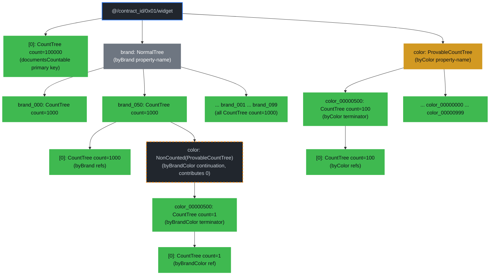
```mermaid
flowchart TB
  WD["@/contract_id/0x01/widget"]:::tree

  WD --> PK["[0]: CountTree count=100000<br/>(documentsCountable primary key)"]:::countnode
  WD --> BR["brand: NormalTree<br/>(byBrand property-name)"]:::node
  WD --> CO["color: ProvableCountTree<br/>(byColor property-name)"]:::pctnode

  BR --> B000["brand_000: CountTree count=1000"]:::countnode
  BR --> B050["brand_050: CountTree count=1000"]:::countnode
  BR --> BMore["... brand_001 ... brand_099<br/>(all CountTree count=1000)"]:::countnode

  B050 --> B050_0["[0]: CountTree count=1000<br/>(byBrand refs)"]:::countnode
  B050 --> B050_C["color: NonCounted(ProvableCountTree)<br/>(byBrandColor continuation, contributes 0)"]:::noncounted

  B050_C --> B050_C_500["color_00000500: CountTree count=1<br/>(byBrandColor terminator)"]:::countnode
  B050_C_500 --> B050_C_500_0["[0]: CountTree count=1<br/>(byBrandColor ref)"]:::countnode

  CO --> C500["color_00000500: CountTree count=100<br/>(byColor terminator)"]:::countnode
  CO --> CMore["... color_00000000 ... color_00000999"]:::countnode
  C500 --> C500_0["[0]: CountTree count=100<br/>(byColor refs)"]:::countnode

  classDef tree fill:#21262d,color:#c9d1d9,stroke:#1f6feb,stroke-width:2px;
  classDef node fill:#6e7681,color:#fff,stroke:#6e7681;
  classDef countnode fill:#3fb950,color:#0d1117,stroke:#3fb950,stroke-width:2px;
  classDef pctnode fill:#d29922,color:#0d1117,stroke:#d29922,stroke-width:2px;
  classDef noncounted fill:#21262d,color:#c9d1d9,stroke:#fb8500,stroke-width:2px,stroke-dasharray: 6 4;
```

Three layout facts to internalize before reading the queries:

- **`brand_050` is a `CountTree` with `count_value = 1000`.** That's true *because* `byBrand` is countable; the rule applies uniformly to every countability tier (see [`add_indices_for_index_level_for_contract_operations/v0/mod.rs`](https://github.com/dashpay/platform/blob/v4.0-dev/packages/rs-drive/src/drive/document/insert/add_indices_for_index_level_for_contract_operations/v0/mod.rs)). The `color` continuation that branches off this value tree is `NonCounted`-wrapped so the parent's count equals exactly the 1 000 refs in `[0]`.
- **`widget/color` is a `ProvableCountTree`**, not a regular `NormalTree`. The yellow class above marks that — each internal merk node carries its subtree's count, which is what makes `AggregateCountOnRange` a single-pass primitive.
- **`color_00000500` is a `CountTree` with `count_value = 100`** under either parent. The same element layout would result from a query against `byColor` or against `byBrandColor`'s second level; the path that gets there differs, but the destination is structurally the same.

## How To Read The Proofs

Every example below has four sections:

1. **Path query** — the spec the prover hands GroveDB. `path` is the list of subtree segments to descend through (the proof carries merk-path bytes for each of these); `query items` is what to select once at the bottom; `subquery items` (when present) descends one more layer.
2. **Verified element** — what `GroveDB::verify_query` (or `verify_aggregate_count_query` for the range primitive) returns after walking the proof bytes. The `count_value_or_default` field on a `CountTree` element is what the count surface ultimately surfaces to the caller.
3. **Proof display** — the proof bytes, decoded via `bincode` into the structured `GroveDBProof` AST and rendered through its `Display` impl. This is the same view [dash-evo-tool's Proof Log screen](https://github.com/dashpay/dash-evo-tool/blob/master/src/ui/tools/proof_log_screen.rs) shows when its display mode is set to "JSON" — each layer is a separate `LayerProof` carrying its merk-tree operations (`Push` / `Parent` / `Child` over `Hash` / `KVValueHash` / `KVHash`) plus a `lower_layers` map naming the children to descend into. Wrapped in a collapsible block per example because the merk path through 4-5 grovedb layers makes for long output.
4. **Diagram** — the path the proof walks through the layout. Blue arrows trace the descent; the cyan node is the verified element; faded gray nodes show context.

All proof-size numbers come from running the bench against a 100 000-row fixture; see [`document_count_worst_case.rs`](https://github.com/dashpay/platform/blob/v4.0-dev/packages/rs-drive/benches/document_count_worst_case.rs)'s `report_proof_sizes` / `display_proofs` / `report_group_by_matrix` helpers. The proof bytes are reproducible — run the bench, grep `[proof]` from stderr, and you'll get the same hashes shown here.

## Queries in this Chapter

| # | Query | Filter | Complexity | Avg time | Proof size |
|---|-------|--------|------------|----------|------------|
| 1 | [Unfiltered Total Count](#query-1--unfiltered-total-count) | *(none — total at doctype level)* | O(1) | 22.5 µs | 585 B |
| 2 | [Equal on a Single Property (`byBrand`)](#query-2--equal-on-a-single-property-bybrand) | `brand == "brand_050"` | O(log B) | 35.7 µs | 1 041 B |
| 3 | [Equal on a RangeCountable Property (`byColor`)](#query-3--equal-on-a-rangecountable-property-bycolor) | `color == "color_00000500"` | O(log C) | 54.0 µs | 1 327 B |
| 4 | [Compound Equal-only (`byBrandColor`)](#query-4--compound-equal-only-bybrandcolor) | `brand == "brand_050" AND color == "color_00000500"` | O(log B + log C') | 71.4 µs | 1 911 B |
| 5 | [`In` on `byBrand`](#query-5--in-on-bybrand) | `brand IN ["brand_000", "brand_001"]` | O(k · log B) | 40.0 µs | 1 102 B |
| 6 | [`In` on `byColor` (RangeCountable)](#query-6--in-on-bycolor-rangecountable) | `color IN ["color_00000000", "color_00000001"]` | O(k · log C) | 61.9 µs | 1 381 B |
| 7 | [Range Query (`AggregateCountOnRange`)](#query-7--range-query-aggregatecountonrange) | `color > "color_00000500"` | O(log C) | 69.2 µs | 2 072 B |
| 8 | [Compound `==` + Range (`byBrandColor`)](#query-8--compound-equal-plus-range-bybrandcolor) | `brand == "brand_050" AND color > "color_00000500"` | O(log B + log C') | 84.9 µs | 2 656 B |

**Complexity variables.** `B` = distinct brands in the byBrand merk-tree (≈ 100 in the fixture); `C` = distinct colors in the byColor merk-tree (≈ 1 000); `C'` = distinct colors *per brand* in byBrandColor's continuation (≈ 1 000 — every brand carries the full color namespace in this fixture); `k` = number of values in the `IN` clause (2 here). Notably absent: the total document count `N` (100 000 here). Count proofs read pre-committed `count_value`s from CountTree merk roots — they never enumerate the underlying documents, so proof generation cost is `polylog(distinct index values)`, *independent* of `N`. The grove-descent overhead (5–8 layers) is treated as a constant. The `O()` column captures shape only, not constants — for instance Q3's `O(log C)` is ~50% slower than Q2's `O(log B)` because in this fixture `C ≈ 10 × B`, and byColor's `ProvableCountTree` carries extra running-count metadata per merk node on top of that (37 merk ops in L6 vs 25 for byBrand — see [Query 2](#query-2--equal-on-a-single-property-bybrand) and [Query 3](#query-3--equal-on-a-rangecountable-property-bycolor)'s proof displays).

**Avg time** is the criterion-reported median of `cargo bench --bench document_count_worst_case -- 'document_count_worst_case/query_'` on a 100 000-row warmed fixture (no group_by — single-query latency on the prover side, including merk-proof construction and serialization). Each row reflects **10 samples × 67k–220k iterations per sample** with 2 s warm-up and 5 s measurement; the median sits within ±2 % of the mean across reruns. For `GROUP BY` variants of these queries, see [Count Index Group By Examples](./count-index-group-by-examples.md).

Each query has the same four sections (Path query, Verified element, Proof display, Diagram) plus a per-layer merk-tree diagram starting at Layer 5 (Layers 1–4 are byte-for-byte identical across every query — they're the root → `@` → contract_id → `0x01` descent shown in full only on Query 1). The bottom of the chapter has an [at-a-glance comparison](#at-a-glance-comparison) summarizing the structural differences.

## Query 1 — Unfiltered Total Count

```text
select  = COUNT
where   = (empty)
prove   = true
```

**Path query** (primary-key CountTree fast path; no index walk needed):

```text
path:         ["@", contract_id, 0x01, "widget"]
query items:  [Key(0x00)]
```

**Verified element:**

```text
path:        ["@", contract_id, 0x01, "widget"]
key:         0x00
element:     CountTree { count_value_or_default: 100000 }
```

**Proof size:** 585 B.

**Proof display** (`GroveDBProof::Display`):

<details>
<summary>Expand to see the structured proof (4 layers) — or <a href="https://dashpay.github.io/grovedb-proof-visualizer-widget/#f=text&d=H4sIAAdCBmoC_6VVXWudNwy-z694LxPIhSzbshXY6NqxFfZBYSW7GGHItrSEhZ5ykqwrI_99Ol_5PKdJqC78WrJfWX4eSf5xPvtHv3_9bj6b2XGY_tubpp_ls86XhqU6TR8X86PpF53_vb80TBMcTe-uLk7338pi-O63t3-0gRwMuXK0RkaDEALUUhJ18YUoodQxoGqIbmrUAxblIBoJY4snBwdr32Ht-6fjYzm_0uURrw6n93PV_aQDkTCVjFxQjIu1EqRZAioNo5KHQUJBAC3mhsC1BrahkQdWPjicltEmyYK1t9ASuEORxV6DkQELlWEhItU2LFGphGU09-Dbci7Sh5U70aJHK3P9cLnW4yNkAnfG5MBoKlEYHINUsZQBLbi5915Hi6PXAr31EEFLiRZHYZXst7s9Kx1Nb07PzsdKP5990vmf5wu2Lo7WVE3Tq-mbb2-ULWSuZAul94m9Cz78-7Wwr9mDsME_NwYNyhlbUTWG2DuPhoP9T40xSSxWFGqXoRk7NVSJfl7L1Chlx-TgTtzboVjf6Kujv4_oF3F9At1dxZNYS-AAHmHByFlHwW4QlUvkWnQoaeKUHZBcknmC-IZsqWtRz8d6cg-NjYStXEJYs1EKMXmCk7u84WWwgMmo4hmImcCqVs7Qg9YkxVSaSMPQCrde0LQnz-WUsKakqLY9kJsaebz4JeY2_EHYxsAzeHgWG7vz_tPZ-Esv12h5F0AKpHSDFfUM2XI01OblqhChd5QuieJILSGLtogg7IC2KuodxXGDKIitUX2Qwy9DZSWrCHej82yMXoDUTrx-ULm8muv7zx_197PL02Wn2uQcHE5vZlcfLldt4FbCYrBb0cUAT8jhtPwNNkTUXFMcVSnmOIY_N5bRKHNP2WmQEF3NAYYIUx6WOTUsMbB3gOCZHk4Op9dycdYX9_51NnTtFtQbPqRiQADutMfqhekdKwd_vKw1scScxDcN6214ieDivMGWs0k42Unv4wK9bQWCrFoNgQRz9Lex0ZBkXbpVStHXNDPmPriw9ZG8dWQGMjC22jQ-ferDF2uXPH7JqEcqHh_HFiQ6Cs28QyhWrwDy7Acd3qfyaFC9iVMOwWvCL9C5e9-o9HRs91-47XK999KV7fZt1se2h5b7-l3tdr6Zrb6L8Xrveu9_dHlpLWsJAAA">open interactively in the visualizer ↗</a></summary>

```text
GroveDBProofV1 {
  LayerProof {
    proof: Merk(
      0: Push(Hash(HASH[bd291f29893fb6f6d6201087746ca1f23a178dd08e1346cb6c127e91ae3623b3]))
      1: Push(KVValueHash(@, Tree(4ed22624752972af97fb71abf4067b23e6d296a61a02f35b2098819fde39d289), HASH[4a5a28cb1b40226aa35b2f0d502767df13268bdf4678627dbfde26a557acdf73]))
      2: Parent
      3: Push(Hash(HASH[19c924989e473a90d0848277d0b1498ccc8db3dc870cbc130e773f3d79ea5b71]))
      4: Child)
    lower_layers: {
      @ => {
        LayerProof {
          proof: Merk(
            0: Push(KVValueHash(0x4ed22624752972af97fb71abf4067b23e6d296a61a02f35b2098819fde39d289, Tree(01), HASH[5b90e1e952b7eef903cc9db2d9098e334a37f7e08cade52c6b2ea3bf4b56b645])))
          lower_layers: {
            0x4ed22624752972af97fb71abf4067b23e6d296a61a02f35b2098819fde39d289 => {
              LayerProof {
                proof: Merk(
                  0: Push(Hash(HASH[49e7191075272395ed72cf03e973987ede6e4945e08574fe77d725f4ce7ecdf8]))
                  1: Push(KVValueHash(0x01, Tree(776964676574), HASH[5d9a0fad8a3f32560f8e8950c1e84a7feabaab21b79bc72fec4482442844e2ef]))
                  2: Parent)
                lower_layers: {
                  0x01 => {
                    LayerProof {
                      proof: Merk(
                        0: Push(KVValueHash(widget, Tree(6272616e64), HASH[6c505f53f2ebf3de030cc2aca463d4b429aeb320a9fadb8ae68bb7903a22bb68])))
                      lower_layers: {
                        widget => {
                          LayerProof {
                            proof: Merk(
                              0: Push(KVValueHashFeatureTypeWithChildHash(0x00, CountTree(0000000000010000fffffffffffeffff00000000000000000000000000000000, 100000), HASH[85843d8e6353dd6caf52f659c454b4a1352f510daa965df594b27319abf1d8a1], BasicMerkNode, HASH[0e6a5047f0600cafc385ed52b516c1fbbaf4994aa50dfcbd1e824b4ad9f55fa1]))
                              1: Push(KVHash(HASH[a29ee8f206a253362b6da4fcacf8643ee8e5925cd979fcd449e5906f0f9f8be3]))
                              2: Parent
                              3: Push(Hash(HASH[6c36729e93b1a316cbf60fe282eb630c0ed6e45db088e365110302b6c9caba86]))
                              4: Child)
                          }
                        }
                      }
                    }
                  }
                }
              }
            }
          }
        }
      }
    }
  }
}
```

Each `LayerProof` is one GroveDB tree's merk proof. The descent goes: top-level GroveDB root → `@` (`DataContractDocuments` root tree) → contract id → `0x01` (documents storage prefix) → `widget` doctype → finally the `Key(0x00)` payload at the bottom, where `CountTree(…, 100000)` is the verified element with its `count_value` of 100 000 visible inside.

</details>

The descent stops at the doctype's primary-key tree — the green node at the top of the layout. Because `documentsCountable: true` upgraded that tree to a `CountTree`, the count is one O(1) read.

### Diagram: per-layer merk-tree structure

Each LayerProof above is its own GroveDB sub-tree whose contents form a merk binary tree. The merk-proof operations (`Push` / `Parent` / `Child` over `KVValueHash` / `KVHash` / `Hash` nodes) describe exactly which nodes of each layer's binary tree the proof reveals — the queried key gets its full kv-hash exposed; *opaque* siblings only commit their subtree-hash so the verifier can re-hash up to the merk root.

Cyan = the verified target. Blue = a kv-hash that's also a queried-key on the descent path (its `value = Tree(...)` is the merk-root pointer for the next layer). Gray = opaque sibling subtrees committed by hash only.

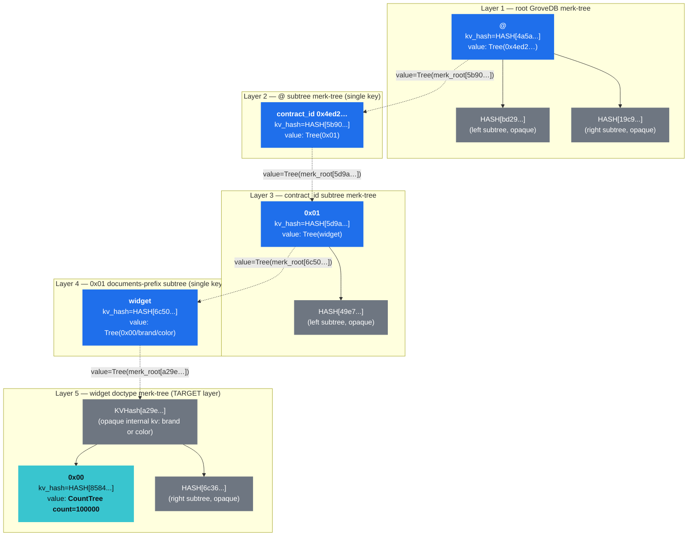
```mermaid
flowchart TB
  subgraph L1["Layer 1 — root GroveDB merk-tree"]
    direction TB
    L1_root["<b>@</b><br/>kv_hash=HASH[4a5a...]<br/>value: Tree(0x4ed2…)"]:::queried
    L1_left["HASH[bd29...]<br/>(left subtree, opaque)"]:::sibling
    L1_right["HASH[19c9...]<br/>(right subtree, opaque)"]:::sibling
    L1_root --> L1_left
    L1_root --> L1_right
  end

  subgraph L2["Layer 2 — @ subtree merk-tree (single key)"]
    direction TB
    L2_q["<b>contract_id 0x4ed2…</b><br/>kv_hash=HASH[5b90...]<br/>value: Tree(0x01)"]:::queried
  end

  subgraph L3["Layer 3 — contract_id subtree merk-tree"]
    direction TB
    L3_q["<b>0x01</b><br/>kv_hash=HASH[5d9a...]<br/>value: Tree(widget)"]:::queried
    L3_left["HASH[49e7...]<br/>(left subtree, opaque)"]:::sibling
    L3_q --> L3_left
  end

  subgraph L4["Layer 4 — 0x01 documents-prefix subtree (single key)"]
    direction TB
    L4_q["<b>widget</b><br/>kv_hash=HASH[6c50...]<br/>value: Tree(0x00/brand/color)"]:::queried
  end

  subgraph L5["Layer 5 — widget doctype merk-tree (TARGET layer)"]
    direction TB
    L5_root["KVHash[a29e...]<br/>(opaque internal kv: brand or color)"]:::sibling
    L5_target["<b>0x00</b><br/>kv_hash=HASH[8584...]<br/>value: <b>CountTree count=100000</b>"]:::target
    L5_right["HASH[6c36...]<br/>(right subtree, opaque)"]:::sibling
    L5_root --> L5_target
    L5_root --> L5_right
  end

  L1_root -. "value=Tree(merk_root[5b90…])" .-> L2_q
  L2_q -. "value=Tree(merk_root[5d9a…])" .-> L3_q
  L3_q -. "value=Tree(merk_root[6c50…])" .-> L4_q
  L4_q -. "value=Tree(merk_root[a29e…])" .-> L5_root

  classDef queried fill:#1f6feb,color:#fff,stroke:#1f6feb,stroke-width:2px;
  classDef sibling fill:#6e7681,color:#fff,stroke:#6e7681;
  classDef target fill:#39c5cf,color:#0d1117,stroke:#39c5cf,stroke-width:3px;
```

A few things this diagram makes explicit that the prose can't:

- **Each layer is its own merk binary tree, not a single graph.** The 5 `LayerProof` blocks in the structured proof above each describe one of these binary trees. The hashes named in each block's `Push(Hash(HASH[…]))` ops are this diagram's opaque siblings; the `Push(KVValueHash(K, …))` ops are this diagram's blue / cyan nodes.
- **The "descent" between layers is via a `value: Tree(…)`.** When a queried key's value is `Tree(merk_root_hash)`, that hash IS the merk root of the next layer's binary tree. So Layer 1's `@` doesn't descend to Layer 2's `contract_id` directly — it descends to Layer 2's merk root, which in this case happens to be the only node in Layer 2.
- **Single-key layers have a 1-node merk tree.** Layers 2 and 4 contain exactly one entry (`@` contains exactly one contract id; `0x01` contains exactly one doctype here), so their merk trees have no siblings to commit.
- **The merk root of a layer can be an opaque sibling, not the queried key.** Layer 5's merk root is `KVHash[a29e...]` — a key (`brand` or `color`, we can't tell from the proof) whose kv_hash is committed but whose value isn't revealed. The queried `0x00` is reached as a child of that opaque root. This is why the merk-tree structure matters: the prover sometimes has to commit one merk-tree-depth's worth of hashes to prove the queried key's position, even if the verifier only cares about the target's value.

## Query 2 — Equal on a Single Property (`byBrand`)

```text
select  = COUNT
where   = brand == "brand_050"
prove   = true
```

**Path query:**

```text
path:         ["@", contract_id, 0x01, "widget", "brand"]
query items:  [Key("brand_050")]
```

**Verified element:**

```text
path:        ["@", contract_id, 0x01, "widget", "brand"]
key:         "brand_050"
element:     CountTree { count_value_or_default: 1000 }
```

**Proof size:** 1 041 B.

**Proof display:**

<details>
<summary>Expand to see the structured proof (verbatim, 5 layers) — or <a href="https://dashpay.github.io/grovedb-proof-visualizer-widget/#f=text&d=H4sIAAdCBmoC_6VX224cRw5991f0ow3ooYp1YdHABrksdgPsBQESeB8CISCrWLGxghWM5c0GC__7npZGsuWZsXvghjTqqm51cw4PDw__urv-j__52x9219fzRVz-92RZ_q5_-O5243a5LL-t58-Xf_ju309vN5YlPF9-ePvm5dPvdf345sfvf7ZBEidJkzStzjoqhRgac65dcSFp5DZGaB4Ttqz2SOwS1VOlZOny2bP9s-P-2X978UKv3vrtK76-WH7auT_NPogqZS4kTDqFp3FUmzlUNkpeEUbVGjXQTMUoSGtR5vAkg5o8u1huo81alFq3aDnggarrvTOMEogrjxkT1WZj5sqtEg_DE3BbKax9TP4gWkK0uvPXN_t1OkAmShfKAMYzJ5UADHIj5hEsYrv33oal0RuHbj2m4MxppsHiWvDt3r8rP1--e_nqatytr65_990vV2u23jzfp2pZvl7-9NXD4kgy744jKX2c2A_BD__9Utj32QvxHv9iEjy6FDJ2nxJS7zKMhuA_PaWsiSd7aF2HF-rVyDXhfVaq1VyAybMP4j4Oxf4bfXH0jxH9JK6fQfdU8WRxjhIDImRKUnww9RmSCydp7MOrZ8kFgBTOEwTBDWXm7uzgY7t8hMb9EY_mMsR9NpirVBC84pEPeRmiYepoCgZSqWE2b1JCj96y8nQ1VaNoLNaZpvcMLudMLWcnn8cDeaiRw4ufytx9_kI8loENediUjdO8__3V-NVv9mhBBajG6vUBq9pLKLOkSW4oVw8p9E7aNdc0smUSdUsUVACoNXUoCnALSYnMavuIw-ehcnfcRXganc0YnYHUKQ4LhLJJtlg1sEA-2xx9VhRfN-q-1nFvqLZcs9jsteM347YqFlyGXJ5E41N8tp2-HgcpKjOFVFN6SFWzKjxUZFRXDtqSW44seXRl0ySpQY5V2rS5Zq0PUF4sWRlhTvp8bB-3gVPHYXuoPVUmcUkWNUW0xomyc2qgVQWlgiPmXIaFBmWsJUYQjdA_paMYW_18bI_bxqljK-fujlvcP0e8M-l3NglPUXFacVtNRUwQtA7x9xpnCHlOywmoeQyZkPKmEXSwXoM3R5NR4lhkA6QfE_L9u5OP3LR4Kt245DoSSW4MjqPjNG1xcC_mPZXWE2coPzI-pFRPZqHK1ndvJdxpV-K9cAoKr5NdtEsLZq5CHV2yUaTeHJ2mBOgZq5U8A8OqVQ9daZatceYjGLUVcrSu6LkWa6MPNGUwXAT-KpcyqgElLsJ1WCQ05eRFaI1m4n9067vLWRjVA4w0wBfmCbUuYi1WoZKgDoo1bETvqRfpGewZSnAwrTUAZZVlcOZY29Y4-QhGUEeLIxB8UJuziZVSkKaIfhvAX3Cowa7S2q5l5XttK5XhBmLhkcZmjNpZGMmhBP_F9ebtzn_64zf_16ubl7dK816afwklXCzfXb99fXOn0QmzQa-T6WKJIeDavNJfITg_43T9uXywImkYhggIYu9jwJLXCdGGIcnoq5DngJ4Cb6Qc2ywo6yyo7BmAkK_qLpcXy7f65lVfheSf18Pvnb9kzoWdEh7F3cPkAmMT4fzRrCZl9zySYzaB9hPFUFtoRDCfkXVq3qwNYa-62-4-JiWYRRQtM1pHQbYY0T0Z8wEaVerJRqo1-qzaRBnfAb7YJjcFCSpcGziwOdTztCQeiglrGT2FQH472Ql5yaOU7EVnA207mcIJ4KTMFtCgm8DrdqzSOnRtFpOYzwK1HNNn-AK01cwyIcjw1SEgtR4x-hl6a_NSdMDJGsMCZziAOjCeEJQRo0OXzXUV63mg8gGoCV4fZmSWgd5fHeM0xK-WPjOBrgMwWxi9smNSAuFjI8gSBgSoOUQob1af2M4CVc65m86qAjpWBRNzCqwaZiBe2zjKF2DklrTHrMaYnA3ze8goBuz4AMMclRsCRyRa5-aGel4V0GEVWEJPMGVBHDgD73miPlczWdDF0OcYGl6Hx8yGypXVcUK3qWYjk-2RbjN06_HuyZdc_9TV09dOXTm-f2z3cO_jncfrD1fvz-_P7v6un--evHvyf-xvTe3xEgAA">open interactively in the visualizer ↗</a></summary>

```text
GroveDBProofV1 {
  LayerProof {
    proof: Merk(
      0: Push(Hash(HASH[bd291f29893fb6f6d6201087746ca1f23a178dd08e1346cb6c127e91ae3623b3]))
      1: Push(KVValueHash(@, Tree(4ed22624752972af97fb71abf4067b23e6d296a61a02f35b2098819fde39d289), HASH[4a5a28cb1b40226aa35b2f0d502767df13268bdf4678627dbfde26a557acdf73]))
      2: Parent
      3: Push(Hash(HASH[19c924989e473a90d0848277d0b1498ccc8db3dc870cbc130e773f3d79ea5b71]))
      4: Child)
    lower_layers: {
      @ => {
        LayerProof {
          proof: Merk(
            0: Push(KVValueHash(0x4ed22624752972af97fb71abf4067b23e6d296a61a02f35b2098819fde39d289, Tree(01), HASH[5b90e1e952b7eef903cc9db2d9098e334a37f7e08cade52c6b2ea3bf4b56b645])))
          lower_layers: {
            0x4ed22624752972af97fb71abf4067b23e6d296a61a02f35b2098819fde39d289 => {
              LayerProof {
                proof: Merk(
                  0: Push(Hash(HASH[49e7191075272395ed72cf03e973987ede6e4945e08574fe77d725f4ce7ecdf8]))
                  1: Push(KVValueHash(0x01, Tree(776964676574), HASH[5d9a0fad8a3f32560f8e8950c1e84a7feabaab21b79bc72fec4482442844e2ef]))
                  2: Parent)
                lower_layers: {
                  0x01 => {
                    LayerProof {
                      proof: Merk(
                        0: Push(KVValueHash(widget, Tree(6272616e64), HASH[6c505f53f2ebf3de030cc2aca463d4b429aeb320a9fadb8ae68bb7903a22bb68])))
                      lower_layers: {
                        widget => {
                          LayerProof {
                            proof: Merk(
                              0: Push(Hash(HASH[9862894b16a0792688fdcf64edcb2ceade5c8b234649bfc6cfc6426869b0e9d9]))
                              1: Push(KVValueHash(brand, Tree(6272616e645f303633), HASH[68b697da99d6ea70a83eb41794dca7ba3938d0ba98fbfaeb3cd0c19b3b5d0ff2]))
                              2: Parent
                              3: Push(Hash(HASH[6c36729e93b1a316cbf60fe282eb630c0ed6e45db088e365110302b6c9caba86]))
                              4: Child)
                            lower_layers: {
                              brand => {
                                LayerProof {
                                  proof: Merk(
                                    0: Push(Hash(HASH[fb5eb23b3135d9c226e61f004ffb43abae104238d8a1ea7bc60e8ec6ba271596]))
                                    1: Push(KVHash(HASH[3ed48a5e35cb7546d329487b0e1ab8a81d7c5bec358c37449e6cbd956e3bb069]))
                                    2: Parent
                                    3: Push(Hash(HASH[19ec5730af134e9ac980bbea92c2978212c8efe750a467ab54f073626e0ca2f5]))
                                    4: Push(KVHash(HASH[87bc6e7e1e465b8dcdaf95db9957a455d6bd7c75976db122f33e592fe75f1e4a]))
                                    5: Parent
                                    6: Push(Hash(HASH[a0a354f2bb59b8169253aebabb52afcc3c59c4c60da203c8887abb679d747168]))
                                    7: Push(KVHash(HASH[fc6b1d0237f8ff89b555e9a14480ae1c5b80d529a0f9fb5e681ea7ecd157d3da]))
                                    8: Parent
                                    9: Push(KVValueHashFeatureTypeWithChildHash(brand_050, CountTree(636f6c6f72, 1000, flags: [0, 0, 0]), HASH[53dbd6216cccdddf16f3eb0f849aed0c0cea987a718f5b43493abf0a14e83eb9], BasicMerkNode, HASH[4947457e230f87ce0f75a7f1502f64f24ee4d3e27eb5d2210680822a3b17afa4]))
                                    10: Child
                                    11: Push(KVHash(HASH[027ac8b1bc9788118b27c13d0b3c3bd3661ef6a89a775a6b6bf78aa7e6f8ed3d]))
                                    12: Parent
                                    13: Push(Hash(HASH[7a5dc3002e6cb6c92e54d554e5af85e9c2ba64ee9c5f80e6489075cc5f3f0d55]))
                                    14: Child
                                    15: Push(KVHash(HASH[3363630479f1abe6e003b1e1d50b5118e55ad2efb7a3f4b3b6df902bea72ac9a]))
                                    16: Parent
                                    17: Push(Hash(HASH[3857faef5ddb06e201f1e65cf42f15d6c9b0dc67e7f73eb182b520854e9bb648]))
                                    18: Child
                                    19: Child
                                    20: Child
                                    21: Push(KVHash(HASH[f776417ede76e6194706e483ac14ab7b3db6aa0461ec14ed5f8e5d20071363af]))
                                    22: Parent
                                    23: Push(Hash(HASH[b3fccba79c14fcc5e97ff6a3cd051228dc755e6de147bef690ba9681264b2b9f]))
                                    24: Child)
                                }
                              }
                            }
                          }
                        }
                      }
                    }
                  }
                }
              }
            }
          }
        }
      }
    }
  }
}
```

The bottom layer is the byBrand property-name tree; it has 100 distinct `brand_NNN` keys, so the merk path proves `brand_050`'s position with 25 ops total (0–24). The verified payload is the inline `KVValueHashFeatureTypeWithChildHash(brand_050, CountTree(636f6c6f72, 1000, flags: [0, 0, 0]), …)` on op 9 — the `636f6c6f72` value slot is the ASCII bytes for `"color"` (the byBrandColor continuation pointer; `NonCounted`-wrapped at the storage layer so it contributes 0 to the parent count), and the `1000` is the doc count. The remaining 24 ops are the merk-binary boundary walk: each `Push(Hash(…))` is an opaque subtree the proof commits but doesn't descend into, each `Push(KVHash(…))` is an opaque internal sibling kv whose hash is committed, and each `Parent` / `Child` re-attaches them so the verifier can recompute the byBrand merk root.

</details>

`brand_050` is itself a `CountTree` — every countable terminator's value tree carries the doc count directly, with sibling continuations wrapped `NonCounted` so they don't pollute the parent. The proof shape is the same as the rangeCountable case below, even though `byBrand` doesn't opt into `rangeCountable: true`. `rangeCountable` is the orthogonal opt-in for `AggregateCountOnRange` (Query 7), not for proof-size shape.

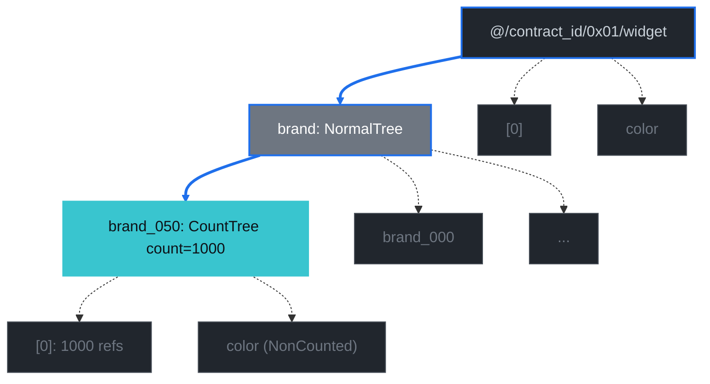
```mermaid
flowchart TB
  WD["@/contract_id/0x01/widget"]:::tree
  WD ==> BR["brand: NormalTree"]:::path
  BR ==> B050["brand_050: CountTree count=1000"]:::target
  BR -.-> B000["brand_000"]:::faded
  BR -.-> BMore["..."]:::faded
  WD -.-> PK["[0]"]:::faded
  WD -.-> CO["color"]:::faded
  B050 -.-> B050_0["[0]: 1000 refs"]:::faded
  B050 -.-> B050_C["color (NonCounted)"]:::faded

  classDef tree fill:#21262d,color:#c9d1d9,stroke:#1f6feb,stroke-width:2px;
  classDef path fill:#6e7681,color:#fff,stroke:#1f6feb,stroke-width:2px;
  classDef faded fill:#21262d,color:#6e7681,stroke:#484f58;
  classDef target fill:#39c5cf,color:#0d1117,stroke:#39c5cf,stroke-width:3px;

  linkStyle 0 stroke:#1f6feb,stroke-width:3px;
  linkStyle 1 stroke:#1f6feb,stroke-width:3px;
```

### Diagram: per-layer merk-tree structure (Layer 5+)

Layers 1–4 are byte-for-byte identical to Query 1's diagram (root → `@` → contract_id → `0x01`). The descent diverges at Layer 5, where this query takes the `brand` branch (rather than `0x00`) and descends one extra grove layer to land on the verified target.

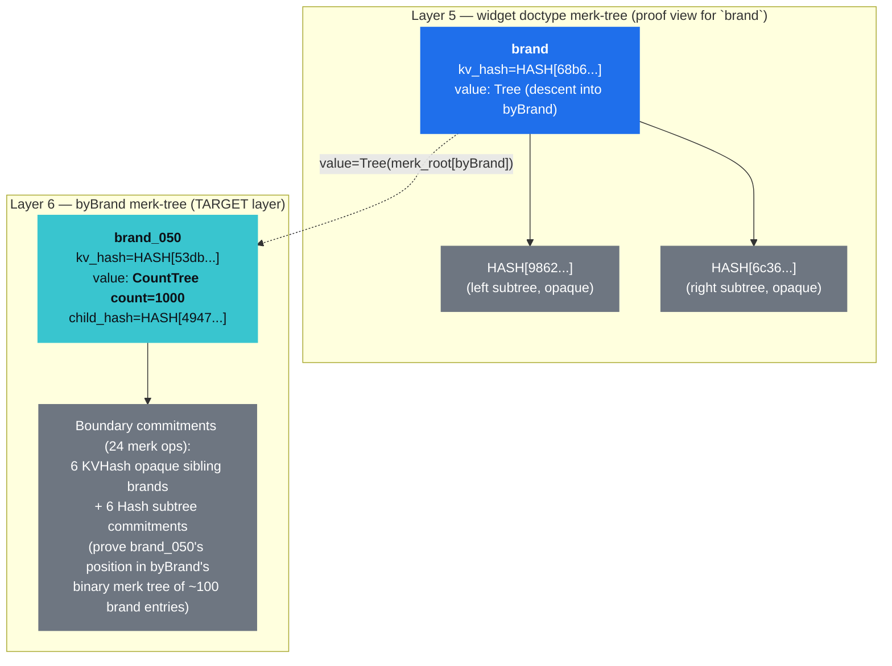
```mermaid
flowchart TB
  subgraph L5["Layer 5 — widget doctype merk-tree (proof view for `brand`)"]
    direction TB
    L5_q["<b>brand</b><br/>kv_hash=HASH[68b6...]<br/>value: Tree (descent into byBrand)"]:::queried
    L5_left["HASH[9862...]<br/>(left subtree, opaque)"]:::sibling
    L5_right["HASH[6c36...]<br/>(right subtree, opaque)"]:::sibling
    L5_q --> L5_left
    L5_q --> L5_right
  end

  subgraph L6["Layer 6 — byBrand merk-tree (TARGET layer)"]
    direction TB
    L6_target["<b>brand_050</b><br/>kv_hash=HASH[53db...]<br/>value: <b>CountTree count=1000</b><br/>child_hash=HASH[4947...]"]:::target
    L6_boundary["Boundary commitments (24 merk ops):<br/>6 KVHash opaque sibling brands<br/>+ 6 Hash subtree commitments<br/>(prove brand_050's position in byBrand's<br/>binary merk tree of ~100 brand entries)"]:::sibling
    L6_target --> L6_boundary
  end

  L5_q -. "value=Tree(merk_root[byBrand])" .-> L6_target

  classDef queried fill:#1f6feb,color:#fff,stroke:#1f6feb,stroke-width:2px;
  classDef sibling fill:#6e7681,color:#fff,stroke:#6e7681;
  classDef target fill:#39c5cf,color:#0d1117,stroke:#39c5cf,stroke-width:3px;
```

The boundary commitments at L6 are what scale linearly with the byBrand tree's depth — they bind `brand_050` to its claimed position so the verifier can recompute byBrand's merk root. The verified target itself is just one `KVValueHashFeatureTypeWithChildHash` op whose `count_value_or_default = 1000` is the answer.

## Query 3 — Equal on a RangeCountable Property (`byColor`)

```text
select  = COUNT
where   = color == "color_00000500"
prove   = true
```

**Path query:**

```text
path:         ["@", contract_id, 0x01, "widget", "color"]
query items:  [Key("color_00000500")]
```

**Verified element:**

```text
path:        ["@", contract_id, 0x01, "widget", "color"]
key:         "color_00000500"
element:     CountTree { count_value_or_default: 100 }
```

**Proof size:** 1 327 B.

**Proof display:**

<details>
<summary>Expand to see the structured proof (verbatim, 5 layers; note `KVHashCount` ops in the byColor `ProvableCountTree` layer) — or <a href="https://dashpay.github.io/grovedb-proof-visualizer-widget/#f=text&d=H4sIAAdCBmoC_6VY224dxxF811ecRwnQQ3fPpacFJHDiIDGQCwzYUB4Mwpjp6bGEEKZBS3aMwP-eWpIiRZFH2gOtpMOzF-7OVldXVetvlxe_xF_-_PXlxcV6yYf_PTkc_tF_i8urA1e7h8NP2_cXh3_G5X-eXh04HOjF4eu3P796-lXfPv70zVffjSnGS6xZWqOuOqsQU1PN1TtOpM7a5qQWnHBoVGfRMO6RqqSRzp49u7k339z77y9f9vO3cfWIL54fvr2MeJpjilTJWsRU-jJdQ7mPlanqkBQVy6i9cidZqQwha41tzUg2pdmz54er1eZeujQfPDLhhr1v1y6ahUSrzsVJahtz5aqtis6BO-CyUrT7XPreagWr7Zfx45ub_fQAGTY3yQAmsqZuBAxyE9VJg3HY3dscaXpT8uGcKFTTSlMtesHb3T0rvzh8-er1-bzeP7_4NS6_P9-q9fOLm1IdDl8c_vDH251Hinm9PVLS-4V9H3z67-fCflM94nf4l2EUHFZkaMQySu42h0zDb0ZKuSddGtS8zyjidUj0hOeNUkfNBZg8e2_dj0Nx80afvfr7iH4U10-ge6x5soWyMWGFKslKTBVflMI0WdOYUSNbLgCkaF4gCC4oK3togI_t7B4a7zZ-tJbEN9VQrVZB8Ipb3tZlWqfVZ-tgoJRKq0WzQs7RctcVffQ-hIfacJUVnsHlnKXlHBLr8YXc9sjDkx-r3Lv6ET9WgR112FWN47z_9fX8Id7coAUVkMo16i1W1QuVVdKSGGjXoETu0r3nmmYeWazHSELdAOhoPaAowI1SFxmjtg84fBoq19v1Co-jsxujE5A6xmGDUDbLg2snNchnW9NXRfP5EI-tj72h23LNNpZXx7-My6oNCpt2dhSNh3y-e2oXi2hLqHYpCVYy6ux5effVak44F8Wk-DS15TOj04pRXbRstRHp00_9UOCPbekRBvnF-cXl8wOw_6WP8_jy4u2Pb67ZlGCRXtfWxYlu_5TECe3JtG3veKZWqs1iZQ4tY4BuNr0bDLW40aafviBjZhWmVRtakimEFKoGDWX_9Cve95Vj215SXm9Xr_4pZp7Iz5NZeoyroIa3XhK001khczAXgq5m6tG0KFWzXk1wPODMo0KZNyi7wJUHyachfYyxV-W_XkCqLaesvapHzD5lrU1ePSoeCCa0WnJyXpzrKtiZ6CVJlQWnnMo4e34oDJrsXMdeDh-LMAWdKhC4tHytiRjEGcis1sjQbgaCZsQ9XWmVSBnQtQwCp00DdTP0vXjlY3j1jlxGmVghG7mo-yxIbSNGhoJ0-PWgQZomOzsUNi-ktMYoc2Jv0YGXlLIbr3ISXvUBXgR3nAiVipgZKKFRsa5OUscykI5dJs-JxnWYuayOTxguIZPIQCDci5cew6sIKJNhzDZmCaSZWcqy7MwjZLAbFJFZwCe0wnLE00AgV_Ada1xlwwvxfDde7SS87AFea0VpA8aJBMjLeFAOcxSwlZEVCaOt1icjqRRtWadhliB0Zyl9Vpe6ux_pKMHGQPgORMKy2II6mI2sDlXFbOJaXdVRw7EZORQBAKZq0YAZJgh2BWA17caL-STAWB4mRpWmNitstAUxEiHiLHCayLHIJFg_45SiN6eyzBhE3laHF9Jo2cpuxNJRCeueGgIkbSYe0FFYk1uX3uC3fYMoFvwtt-XqPfUe8LsqpSlaAyoCxNJ-BeN8GmLl4RjmGcJaoVULuhAZWU4zRN6D1lptWyRjQKDcZ9aVs1fOAg6KzAR9HrsRq8cQQ4K3VEAfJjRcgXgVwk-4PsYMMB6aNor3hv6DhHXMQI7BE3kqIU6lVIDY_pZkPQ2w9jC-_DX6m7eX8e1vP8W_X795dRUR7mLN91chBZr6_HCXa7Y93j7Wef8BKeE7fN3-nt0O3jpoi4KILxJocgw-U1OFcaDx4bitCUHHMaKRFExtaMZJhtoIWlPXJkz30lTMLQf862LGU76LTHkpRvhVKgYmDR1sWuALmHUUowu0r7fEpQrMYSZuyGEITSpzm8Uxc-2vtR2tdauVDbSpA_5ODWl4605FkxChERH8OnNmxwvC8gdm4Sm5IBYPBut864799k4n1Vr4oQCXOmfm3nTZyMAstv_IgXlSb2OC_gFvGEUThrwtCeQGrVRko_CC1p97ARO5iZr7rk4nXX08PSCeBJo78kBByCCQkE-kmTKQpohHjiLb25a8KmbcjHrgK17T8XtCmxvuDw9yWnqQh_FhIRtOmCFmqdUyRgKasq0DI47BBvuWQyvmmZkg9E5rMjQF5GHudWxCsXelehK-7aSr7ZSrE510NZ909UmcS0cNz5N0WG0zpPKGNG4Yc7mkjOg-XJAbkCFKQszTyQgRZOBRgawQ5bLF9rPbwW5fddJplpcesbyOpGdcK3SHg2MY5BCGvdJYGHQwzCCrY8Vda5odIwcihBcoYg5BpNgdq1LdNUBu2-9PPuf8x84eP3fszOPHHzv68NiHR-7vv7939_3dt-uf2-fvT35_8n_MKniIghcAAA">open interactively in the visualizer ↗</a></summary>

```text
GroveDBProofV1 {
  LayerProof {
    proof: Merk(
      0: Push(Hash(HASH[bd291f29893fb6f6d6201087746ca1f23a178dd08e1346cb6c127e91ae3623b3]))
      1: Push(KVValueHash(@, Tree(4ed22624752972af97fb71abf4067b23e6d296a61a02f35b2098819fde39d289), HASH[4a5a28cb1b40226aa35b2f0d502767df13268bdf4678627dbfde26a557acdf73]))
      2: Parent
      3: Push(Hash(HASH[19c924989e473a90d0848277d0b1498ccc8db3dc870cbc130e773f3d79ea5b71]))
      4: Child)
    lower_layers: {
      @ => {
        LayerProof {
          proof: Merk(
            0: Push(KVValueHash(0x4ed22624752972af97fb71abf4067b23e6d296a61a02f35b2098819fde39d289, Tree(01), HASH[5b90e1e952b7eef903cc9db2d9098e334a37f7e08cade52c6b2ea3bf4b56b645])))
          lower_layers: {
            0x4ed22624752972af97fb71abf4067b23e6d296a61a02f35b2098819fde39d289 => {
              LayerProof {
                proof: Merk(
                  0: Push(Hash(HASH[49e7191075272395ed72cf03e973987ede6e4945e08574fe77d725f4ce7ecdf8]))
                  1: Push(KVValueHash(0x01, Tree(776964676574), HASH[5d9a0fad8a3f32560f8e8950c1e84a7feabaab21b79bc72fec4482442844e2ef]))
                  2: Parent)
                lower_layers: {
                  0x01 => {
                    LayerProof {
                      proof: Merk(
                        0: Push(KVValueHash(widget, Tree(6272616e64), HASH[6c505f53f2ebf3de030cc2aca463d4b429aeb320a9fadb8ae68bb7903a22bb68])))
                      lower_layers: {
                        widget => {
                          LayerProof {
                            proof: Merk(
                              0: Push(Hash(HASH[9862894b16a0792688fdcf64edcb2ceade5c8b234649bfc6cfc6426869b0e9d9]))
                              1: Push(KVHash(HASH[a29ee8f206a253362b6da4fcacf8643ee8e5925cd979fcd449e5906f0f9f8be3]))
                              2: Parent
                              3: Push(KVValueHash(color, ProvableCountTree(636f6c6f725f3030303030353131, 100000), HASH[79569d595db75bbf2e9dca93a15c90b7eecf7b299632668ec410e2076d27f71c]))
                              4: Child)
                            lower_layers: {
                              color => {
                                LayerProof {
                                  proof: Merk(
                                    0: Push(Hash(HASH[864c8a53cdfc17560ea304fe40ae87570699a6920eae3dcb6075f71ca2d79b02]))
                                    1: Push(KVHashCount(HASH[3684347a67ceedad2ff4a7fce6ae303086543c1f146f5865dfdc23612308c05b], 51100))
                                    2: Parent
                                    3: Push(Hash(HASH[56422e033fcffda5514eaef88096da995646207f3f5e349a6840003b4297098e]))
                                    4: Push(KVHashCount(HASH[aa27604017cfc457ccd56aabeb4686a988b0b073d1c1c03a4fdf78164c31c8ea], 25500))
                                    5: Parent
                                    6: Push(Hash(HASH[09bcdaa37a5ae46f9059a7c026bf9cdf1c2d1ddecfcfe72fafe73f30abf2bccc]))
                                    7: Push(KVHashCount(HASH[525df42449bd5e881d55f94c11be2b1c95cd112123864fc249e6c170ea026f5a], 12700))
                                    8: Parent
                                    9: Push(Hash(HASH[ffe58ba46b2d1f91b04e9c78185b474828f8ad165757847d9178020e55ad6c26]))
                                    10: Push(KVHashCount(HASH[abbcbcef405f19e0a096a902993b3c76c77c59abdb8a3dcc95369e8c17b401c7], 6300))
                                    11: Parent
                                    12: Push(Hash(HASH[472879d66cf8e01e77bf4828d6a6f530a016cf7a99d712deb00c8fa5920b8495]))
                                    13: Push(KVHashCount(HASH[3ac3896404268efc1bbfc9a2a8925adcc9eff7248fc7ca3aaec6f62587cdaffd], 3100))
                                    14: Parent
                                    15: Push(Hash(HASH[1c40306956f164e416e74a69ce0fff8c7ca152904ad47f44c6142c7822d3d2fb]))
                                    16: Push(KVHashCount(HASH[494935a3d102495beb504953539d204ecd5b5ca8f5a03aa4a3cdbf16a3926335], 700))
                                    17: Parent
                                    18: Push(KVValueHashFeatureTypeWithChildHash(color_00000500, CountTree(00, 100, flags: [0, 0, 0]), HASH[47b0ade593a2e4e99e7d7363f5d1f692882007397f025226f19d097ca2f407fa], ProvableCountedMerkNode(100), HASH[4f7f13f56e087e7b19751c067671b75cda83156231cd3186f7c4172dccc8e97b]))
                                    19: Push(KVHashCount(HASH[4866192fb6beda0888f828d7bbf008fa725a1141cf19ae3b1e9d245c6cb12c7c], 300))
                                    20: Parent
                                    21: Push(Hash(HASH[f56dd41a87f9b487ee9893c310a8bdd2fe70eb573e2e22e048cef7e3dec5fc1d]))
                                    22: Child
                                    23: Child
                                    24: Push(KVHashCount(HASH[a646e152e4bfb609f5372833f5b8c001b4e523c3154f6fea43b154fe04c6e120], 1500))
                                    25: Parent
                                    26: Push(Hash(HASH[f434d46bb16f841310d2e120a259ad1aca2d679fd330ac0fd13d145c11a6b335]))
                                    27: Child
                                    28: Child
                                    29: Child
                                    30: Child
                                    31: Child
                                    32: Child
                                    33: Push(KVHashCount(HASH[c32ae0189f148c2390791534ff4bc205fabb53a7c7d15f109a4354170045308c], 100000))
                                    34: Parent
                                    35: Push(Hash(HASH[1a1c99166d7b1e1eb9087404f3bfae82d749a3a7a763da654f48c5d314e21e76]))
                                    36: Child)
                                }
                              }
                            }
                          }
                        }
                      }
                    }
                  }
                }
              }
            }
          }
        }
      }
    }
  }
}
```

This is the most interesting layer in the chapter. The byColor property-name tree (`widget/color`) is a `ProvableCountTree`, so every internal merk node carries its subtree's running count — visible here as `KVHashCount(HASH[…], N)` ops where `N` is the count contribution of that subtree (the values `51100, 25500, 12700, 6300, 3100, 700, 300, 1500, 100000` show up in the literal output above). The verified element (`color_00000500`) lands on op 18 in the middle of these `KVHashCount` ops, and the surrounding ops walk the binary boundary path so the prover can recompute the parent merk hash. For a point-lookup query like this, the `ProvableCountTree` machinery is overkill — it carries running counts the verifier doesn't need. Query 7 is where this pays off.

</details>

Structurally identical to Query 2 — only the property name and the count-tree depth differ. The intermediate `widget/color` tree is a `ProvableCountTree` here (vs `NormalTree` for `byBrand`), but the *proof* doesn't care about that: it descends through the property-name tree and surfaces the value-tree CountTree at the bottom. The `ProvableCountTree` upgrade matters for Query 7 (range aggregate), not for point lookup.

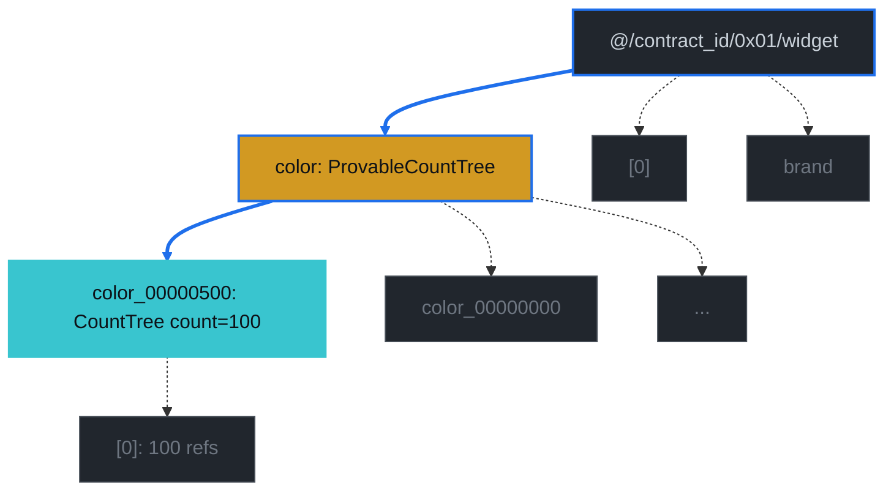
```mermaid
flowchart TB
  WD["@/contract_id/0x01/widget"]:::tree
  WD ==> CO["color: ProvableCountTree"]:::path
  CO ==> C500["color_00000500: CountTree count=100"]:::target
  CO -.-> C000["color_00000000"]:::faded
  CO -.-> CMore["..."]:::faded
  WD -.-> PK["[0]"]:::faded
  WD -.-> BR["brand"]:::faded
  C500 -.-> C500_0["[0]: 100 refs"]:::faded

  classDef tree fill:#21262d,color:#c9d1d9,stroke:#1f6feb,stroke-width:2px;
  classDef path fill:#d29922,color:#0d1117,stroke:#1f6feb,stroke-width:2px;
  classDef faded fill:#21262d,color:#6e7681,stroke:#484f58;
  classDef target fill:#39c5cf,color:#0d1117,stroke:#39c5cf,stroke-width:3px;

  linkStyle 0 stroke:#1f6feb,stroke-width:3px;
  linkStyle 1 stroke:#1f6feb,stroke-width:3px;
```

### Diagram: per-layer merk-tree structure (Layer 5+)

Layers 1–4 are byte-for-byte identical to Query 1. The L5 widget doctype merk-tree proof differs from Query 2: here `color` is the queried key (under an opaque `KVHash[a29e...]` root in the proof view), and the descent into Layer 6 enters a `ProvableCountTree` rather than a `NormalTree`.

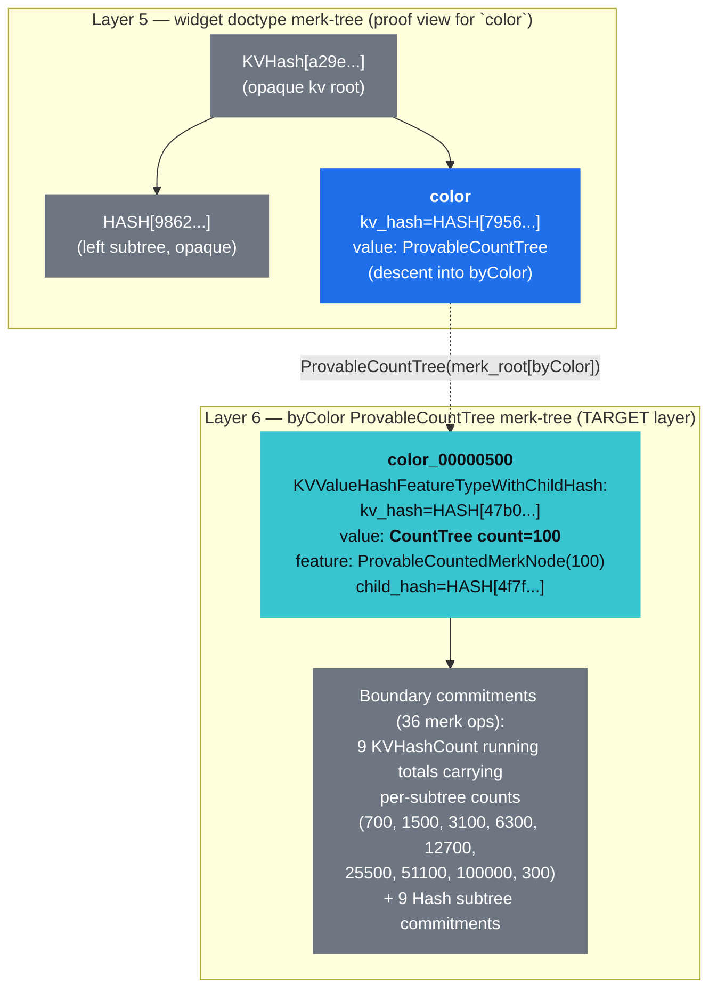
```mermaid
flowchart TB
  subgraph L5["Layer 5 — widget doctype merk-tree (proof view for `color`)"]
    direction TB
    L5_root["KVHash[a29e...]<br/>(opaque kv root)"]:::sibling
    L5_left["HASH[9862...]<br/>(left subtree, opaque)"]:::sibling
    L5_q["<b>color</b><br/>kv_hash=HASH[7956...]<br/>value: ProvableCountTree<br/>(descent into byColor)"]:::queried
    L5_root --> L5_left
    L5_root --> L5_q
  end

  subgraph L6["Layer 6 — byColor ProvableCountTree merk-tree (TARGET layer)"]
    direction TB
    L6_target["<b>color_00000500</b><br/>KVValueHashFeatureTypeWithChildHash:<br/>kv_hash=HASH[47b0...]<br/>value: <b>CountTree count=100</b><br/>feature: ProvableCountedMerkNode(100)<br/>child_hash=HASH[4f7f...]"]:::target
    L6_boundary["Boundary commitments (36 merk ops):<br/>9 KVHashCount running totals carrying<br/>per-subtree counts<br/>(700, 1500, 3100, 6300, 12700,<br/>25500, 51100, 100000, 300)<br/>+ 9 Hash subtree commitments"]:::sibling
    L6_target --> L6_boundary
  end

  L5_q -. "ProvableCountTree(merk_root[byColor])" .-> L6_target

  classDef queried fill:#1f6feb,color:#fff,stroke:#1f6feb,stroke-width:2px;
  classDef sibling fill:#6e7681,color:#fff,stroke:#6e7681;
  classDef target fill:#39c5cf,color:#0d1117,stroke:#39c5cf,stroke-width:3px;
```

Same structural shape as Query 2 (point lookup → CountTree), but the boundary commitments carry `KVHashCount(HASH, N)` ops instead of plain `KVHash(HASH)`. The running totals are dead weight for this point lookup — the verifier never reads them — but they're the same commitments Query 7 will integrate over.

## Query 4 — Compound Equal-only (`byBrandColor`)

```text
select  = COUNT
where   = brand == "brand_050" AND color == "color_00000500"
prove   = true
```

**Path query:**

```text
path:         ["@", contract_id, 0x01, "widget", "brand", "brand_050", "color"]
query items:  [Key("color_00000500")]
```

**Verified element:**

```text
path:        ["@", contract_id, 0x01, "widget", "brand", "brand_050", "color"]
key:         "color_00000500"
element:     CountTree { count_value_or_default: 1 }
```

**Proof size:** 1 911 B.

**Proof display:**

<details>
<summary>Expand to see the structured proof (6 layers — the deepest descent in the chapter) — or <a href="https://dashpay.github.io/grovedb-proof-visualizer-widget/#f=text&d=H4sIAAdCBmoC_7VZXY9btxF996_Qow34geSQMxwDLdKmaAO0DQI0cB8CIyCHwySo4Q02dtKgyH_voXa99lrSWrpubxxb90MS75mZ83H1l-urn_1Pf_zq-upqPo-7_zza7f7WfvXr_YH97m7343r9bPd3v_7X4_2B3S4823315qfvH3_R1l9_-McX3_SRNM6kVWl2njw4hRiqSGZrOEEtSh0jVI-EQ50tJnGNzYkTdXrx5MntZ8fbz_7r8-ft5Rvff8VnT3dfX7s_zj5S4pSlJJXUpsrsElufObD0RM5YBjeOLaRJpaegtUadw0lHqvrk6W6_2txKS9V67DngA1tb184wSkjCMmakxLWPmVkqJxkdn4DLSpFmY8p7q01Ybbv2V69v9-kAmaimKQMYz0JNAzDINYmM0CMOm1kdnYZVCdYtUnARmjREvRXc3bvvys92n3__w8txs__y6he__vblqtZPz25Ltdt9tvvd7-92jhTzZjtS0vuFfR_88O9Phf22eiG-xb90DR5dS-riPjWQmY6ehuKdTpQbyRQP1drwkox78kb4vl64cy7A5Ml76z4Oxe0dffLq7yP6IK4fQffU8GR1iRoDViiJtPiQZDOQq5BW8eHsWXMBIEXyRIPggjKzuTj6sb64h8bbLR6tZYi31RBhZTQ44yPv6jK0hdlGbejAVDjM6lVLsOg1N5neems9xS7aTdJ0y-jlnFPN2ZPP4wu5m5HDkw9V7m39QjxWgTPqcFY1Tvf9Lz-M7_z1LVpggcSRne-wYiuhzEIzece4eqBglpq1zDRyz0mbd0qhKQDttTkYBbgFain1zvWDHr4MlZvtZoWn0TkbowuQOtXDCqKsmnvkFkRBn3UOm4zhs57M1xxbxbRlztqnseH_jMtYe3Ad-uIkGg_1c79ur8ZBicqkQEx0V6raWWU01cHeJLRK3nMUzcOa9EZKFXTctM4-V9VsoOW1Uy8jzJk-vrYPZeDUdigPbMSS1JV6bBQhjRNj56mirRgtFRxrzmX0UMGMXGJEoyXopxqGsfLH13ZfNk5t5_bczbbH_WONd2H7XdyEp1px9uJ9mYpIIDQD-TvHGUKes2cCah5DTih5bRHt0I2DV4fItCSx6BmQftiQ776bfOTailOxLiXzoKS5CnocilNbjUOsdDcq1UgymB8VH1rYqffAeu53n9twp12JWxEKDV4nuzbTGnr3psmgkjXFZNWhNCWAz6T1kmcQWDX2YC3Ncu468xGM6oIc0hU9c-l12IAoo8NV4a9yKYM7UJKiwqPHBFEmL5rWaibe08797nIRRnyAUQvwhXmCrYv2GllTIbBDwz5shBlZUcvontESHEytFUB1Fh2SJXI9d51yBCOwY48jJPigOmfVXkpBmSL0NqB_0UMVdjUtudbV71xXK8MNxCKDxtkY1Ysw0lMU_G0o4enu86s3r17fcDEhAxhPSU93MQScmy_bdyCWb_By_XlxZzlodIQFEJ_ZGLDePEHOMB4Z-gkaDtAOeKAmsc6C8c2KCZ4BSPhi8bMHJoZbGjzv6mOzjXDQoGGxGyakxgg5Exh2KAcZ9UHM0Se3qk2kNBjVPqU2VIVho1CUs5d62XDHw-mWVoZRCMn3UUuTlzxKyV7arOgjS71BmvGizBqgmFVhPg17tFLQ2dMd80WglmOECaGGzmXRCYaE0Q0BSugRWaxD7KqX0gasZRd40gxJ5oG8kEBV8PKmZzd65MtAlQNQCeYb7mCWATFmR74FG3GxmdOMIC2DkxnG4ogu6MxYE3gCjh30ClbIZ9NBrBeBqpdcnS6agnRsCiaCA7wTQoksXdUsACNXahZz64Io2xGoQ8Yw4IgPdJiXkUKQiEK3ebbCXTYF6XAKOoGkexPFOvAKfS8T87ncXYGsQHgEpMrDY5aOydVlAUGkiXNPXc9f6XkOa4vPes9tLYo9z3Ft8l0b3dcpD5aiBvA_9CivODBHxMgy22CKSOAI410bCoT-idISD_SRglOLwxREDudifzoa2NXLq-unuy-vXu1lycdjgPFz6y_9mEztI8Pb_wqcYzwpXG-Vq0dDuAF1ZkRmjENDysgdYm24D6Kcm8G-zAEfNQmujyWoIh9hRKxUjpfd4gMh-n_ZajfbHrtLmu0TWu6TGu9U-4knCblpNicP1eE1a4KjEGREj5VDKnEyd7Qcl4qX6_FLDN3CovLpl9XmWBzYN9nNYswmVqGlVfBKolDW15bAeciAJGfwZYerRp-0nthaDpXWw9QJ4eswOS-e7qCEG1Z0GYM-HBjgKS0hLqDdkfN7RxaIUDeZudocI1koIHiQLPJEBftTxXUNsRqWyTSULYjmU4giKY8OZQ2E1IJM0kbuCMdgdiotN1gIdngDhJlJpmU9wcXFE8utrS9n_nSXStmworIZ0cN4gUxKRL3FNtZT5mwh6GwFKmoMThFYXKpIkTgbxHUUCNWQgg6KJIk2ISqnENX1_K4Fi5BI2OsCJ9MRY0NWVBGnDDHDUyx7e9MQP2DDBxxmDmPWNTCgyyQbVlQ3I6qHgQ0ODcKu5i6Y5lZyc4W1bTkGR49mNoiRUhgsafZsiJ65oWtTN8skm6Y-nIKUOxiIvVdnrYt3QC5w29EQa00HlxZHFvhJ5LmOJANRDKUiBLVQPA0GpExbVhQ3Q7pPHvcxrRZT42reZ4qxd-QcJSlRmVMTIxi8br4mLbpqZS0ghMCtMCkadlOX3iWawzYtRD5hGYCqD8gscnnvaYgXhuyGmHCwEihd23p-gCVg4RYRwoK3OYApbWHSFXS2YloOzdFElhg6R0Fab-CkaD3mwmvsaHaQag3qFNaQAWjcToLTQAdT7HOEberEpzCVDPpkSFEkiCY1rxkkhCGqsMZiEocuJ4f2TMvyg_vjQt0QcBDYCgHTLYO_T1gbIa2Hfu_P3l6_ufavf_3R__nD6-_3fvydD_w2rK2Eew8p1l48_WRCJu68VqABABDmFK2VGVNQaw-KbB8yCsIYYU9wsAFBj9VHVRmOCQnA5Z7j9LHczZdXwx_f_RAWpDpl4cAhgIdyRbOKEBgK2WTkibIX6BzrREs3BnHwilhp8siDQ9vUCXqqE3KdVozMWkpcvHkvvfL6mYNTZQZ9gU8xUa4w8q0abDs0X2dKBqWI6463ENYKpRs74S6hvhsuYyfAyNknjAkoFlCZDQFr1VLXr6ySA8_1FImiNeKYKwwhAgqw1RK2QLqy6vmx-sPYuvGdJ93Rel5LdUpGjupiyFSgapLpTvvfNQgyHpb76Oi5ldPQvxHdi-uzSV9ljFvMUdrujhIf-1E0w3bU4LB3VEoyJRjOTmp5NtB7o5W3xJhwtwVE5Fmss0sfVYpuqqNsrkbd_E7d-k4Km98ZN79zc6fTSVF3Wa495wrnjiJOeMyJRlSk5uCpJ8sdUlgHkgeMZxzWCkK64uJISE9LgFZU31Bv2i7rdCjrHcbEYDIpaaUO3l4_bSAzhQzzEQa8oFgzGL7KoksrQEiK5DmGD9z-JlknvuDZ07vtt0f_j2vPvfK868656uPXfOyKh88_dPb0uVNnjh8_dvTw2IdH7u-_v_fu9dtXN_-uv3979Nuj_wI8qw079CUAAA">open interactively in the visualizer ↗</a></summary>

```text
GroveDBProofV1 {
  LayerProof {
    proof: Merk(
      0: Push(Hash(HASH[bd291f29893fb6f6d6201087746ca1f23a178dd08e1346cb6c127e91ae3623b3]))
      1: Push(KVValueHash(@, Tree(4ed22624752972af97fb71abf4067b23e6d296a61a02f35b2098819fde39d289), HASH[4a5a28cb1b40226aa35b2f0d502767df13268bdf4678627dbfde26a557acdf73]))
      2: Parent
      3: Push(Hash(HASH[19c924989e473a90d0848277d0b1498ccc8db3dc870cbc130e773f3d79ea5b71]))
      4: Child)
    lower_layers: {
      @ => {
        LayerProof {
          proof: Merk(
            0: Push(KVValueHash(0x4ed22624752972af97fb71abf4067b23e6d296a61a02f35b2098819fde39d289, Tree(01), HASH[5b90e1e952b7eef903cc9db2d9098e334a37f7e08cade52c6b2ea3bf4b56b645])))
          lower_layers: {
            0x4ed22624752972af97fb71abf4067b23e6d296a61a02f35b2098819fde39d289 => {
              LayerProof {
                proof: Merk(
                  0: Push(Hash(HASH[49e7191075272395ed72cf03e973987ede6e4945e08574fe77d725f4ce7ecdf8]))
                  1: Push(KVValueHash(0x01, Tree(776964676574), HASH[5d9a0fad8a3f32560f8e8950c1e84a7feabaab21b79bc72fec4482442844e2ef]))
                  2: Parent)
                lower_layers: {
                  0x01 => {
                    LayerProof {
                      proof: Merk(
                        0: Push(KVValueHash(widget, Tree(6272616e64), HASH[6c505f53f2ebf3de030cc2aca463d4b429aeb320a9fadb8ae68bb7903a22bb68])))
                      lower_layers: {
                        widget => {
                          LayerProof {
                            proof: Merk(
                              0: Push(Hash(HASH[9862894b16a0792688fdcf64edcb2ceade5c8b234649bfc6cfc6426869b0e9d9]))
                              1: Push(KVValueHash(brand, Tree(6272616e645f303633), HASH[68b697da99d6ea70a83eb41794dca7ba3938d0ba98fbfaeb3cd0c19b3b5d0ff2]))
                              2: Parent
                              3: Push(Hash(HASH[6c36729e93b1a316cbf60fe282eb630c0ed6e45db088e365110302b6c9caba86]))
                              4: Child)
                            lower_layers: {
                              brand => {
                                LayerProof {
                                  proof: Merk(
                                    0: Push(Hash(HASH[fb5eb23b3135d9c226e61f004ffb43abae104238d8a1ea7bc60e8ec6ba271596]))
                                    1: Push(KVHash(HASH[3ed48a5e35cb7546d329487b0e1ab8a81d7c5bec358c37449e6cbd956e3bb069]))
                                    2: Parent
                                    3: Push(Hash(HASH[19ec5730af134e9ac980bbea92c2978212c8efe750a467ab54f073626e0ca2f5]))
                                    4: Push(KVHash(HASH[87bc6e7e1e465b8dcdaf95db9957a455d6bd7c75976db122f33e592fe75f1e4a]))
                                    5: Parent
                                    6: Push(Hash(HASH[a0a354f2bb59b8169253aebabb52afcc3c59c4c60da203c8887abb679d747168]))
                                    7: Push(KVHash(HASH[fc6b1d0237f8ff89b555e9a14480ae1c5b80d529a0f9fb5e681ea7ecd157d3da]))
                                    8: Parent
                                    9: Push(KVValueHash(brand_050, CountTree(636f6c6f72, 1000, flags: [0, 0, 0]), HASH[53dbd6216cccdddf16f3eb0f849aed0c0cea987a718f5b43493abf0a14e83eb9]))
                                    10: Child
                                    11: Push(KVHash(HASH[027ac8b1bc9788118b27c13d0b3c3bd3661ef6a89a775a6b6bf78aa7e6f8ed3d]))
                                    12: Parent
                                    13: Push(Hash(HASH[7a5dc3002e6cb6c92e54d554e5af85e9c2ba64ee9c5f80e6489075cc5f3f0d55]))
                                    14: Child
                                    15: Push(KVHash(HASH[3363630479f1abe6e003b1e1d50b5118e55ad2efb7a3f4b3b6df902bea72ac9a]))
                                    16: Parent
                                    17: Push(Hash(HASH[3857faef5ddb06e201f1e65cf42f15d6c9b0dc67e7f73eb182b520854e9bb648]))
                                    18: Child
                                    19: Child
                                    20: Child
                                    21: Push(KVHash(HASH[f776417ede76e6194706e483ac14ab7b3db6aa0461ec14ed5f8e5d20071363af]))
                                    22: Parent
                                    23: Push(Hash(HASH[b3fccba79c14fcc5e97ff6a3cd051228dc755e6de147bef690ba9681264b2b9f]))
                                    24: Child)
                                  lower_layers: {
                                    brand_050 => {
                                      LayerProof {
                                        proof: Merk(
                                          0: Push(Hash(HASH[2190c6fcd140792fd12be66cd631f97475b9ab3f19417a26d94798115ee46160]))
                                          1: Push(KVValueHash(color, NonCounted(ProvableCountTree(636f6c6f725f3030303030353131, 1000, flags: [0, 0, 0])), HASH[b1cedc48940faedea8b64bff8c8113344acdb1fd8eff37c567099b167b3c5861]))
                                          2: Parent)
                                        lower_layers: {
                                          color => {
                                            LayerProof {
                                              proof: Merk(
                                                0: Push(Hash(HASH[7e2704a94ce3e08ee1e8249a7272e1860251f66b9816581f6191010bc0f15dfe]))
                                                1: Push(KVHashCount(HASH[ccfe3e95a84b22305b9815064d7d4e54b6ab0ca8efab26ca408391f2fad2b83e], 511))
                                                2: Parent
                                                3: Push(Hash(HASH[3dac20af894289bb36212087f48cfdd2c05713c5e134804638428a8d0ac8c905]))
                                                4: Push(KVHashCount(HASH[1a3db8540380b26ead4be363cd35a4a0036ec9a92cf3c9527db540f0878ab168], 255))
                                                5: Parent
                                                6: Push(Hash(HASH[61f333ba1ad78624c009fa514ac69407a1438cb7d7807e9d5de1d75223137235]))
                                                7: Push(KVHashCount(HASH[94e2ea0c17ffbf050dcba5e04928ae2ecf9fe21567e7fac5b93ad30040df8dfe], 127))
                                                8: Parent
                                                9: Push(Hash(HASH[a8571229cee7010a54ae9890a410edd246c079930d672fb4cdcd4a13c2bcc437]))
                                                10: Push(KVHashCount(HASH[6b04a6eb8e698272ec0ff801c76dc9d65a1d47ef5ae1beb9747058cdda05e2d6], 63))
                                                11: Parent
                                                12: Push(Hash(HASH[8c12a68cebf211bbbd3937519662a7c3ed5bce92cf1e99869548c06a5639de15]))
                                                13: Push(KVHashCount(HASH[9533ef417b8eed113b81bb2d7e56c81012d11835819a59769deebfc1a7e0eafd], 31))
                                                14: Parent
                                                15: Push(Hash(HASH[2f385d9fd5157a78a1cb1456050d3fb87f809e30b93a1963582edcedd31bfd0e]))
                                                16: Push(KVHashCount(HASH[74ad467d4132703ae845149ce86de7c71d9c6fc7472e76e9bb1b81bc182abe53], 7))
                                                17: Parent
                                                18: Push(KVValueHashFeatureTypeWithChildHash(color_00000500, CountTree(00, 1, flags: [0, 0, 0]), HASH[7f1d988845d9c82b9d1146f2188b09bf704d31647ee2a26054e69ed897de3750], ProvableCountedMerkNode(1), HASH[078e3476060013c48bfc77330dc75d4fedc585469f581a66dc6b7b32f6d4d60a]))
                                                19: Push(KVHashCount(HASH[48fc5c3cca2265eaeb5b86505f628660ffae9deee96cda8c26d7139f22ce0410], 3))
                                                20: Parent
                                                21: Push(Hash(HASH[c6e38bf64efcfd1d46d4ccd7937858870c7406f3abf31ca36148860d12c6b950]))
                                                22: Child
                                                23: Child
                                                24: Push(KVHashCount(HASH[67ab38f74160b7c15e62a37fee3d0c193156061f3b013190ce2a154e4164c7b0], 15))
                                                25: Parent
                                                26: Push(Hash(HASH[49e4ecf80eead3552c93208b39c4fa9a5a3b64b7c63b385e53e47cb6e7bd8759]))
                                                27: Child
                                                28: Child
                                                29: Child
                                                30: Child
                                                31: Child
                                                32: Child
                                                33: Push(KVHashCount(HASH[e735a44484a03e4f67ef4c79f370e2b2c4b0b98d942c5b1dca53039a031354b3], 1000))
                                                34: Parent
                                                35: Push(Hash(HASH[bf41c24632983b5858dcd20a04e0e0da6e7cacef58679e69e7859619dded444e]))
                                                36: Child)
                                            }
                                          }
                                        }
                                      }
                                    }
                                  }
                                }
                              }
                            }
                          }
                        }
                      }
                    }
                  }
                }
              }
            }
          }
        }
      }
    }
  }
}
```

This is the deepest descent in the chapter. The path threads:
1. The two intermediate GroveDB-wrapper layers (`@` and `0x01`).
2. The widget doctype.
3. The byBrand property-name tree.
4. The byBrand value tree for `brand_050` (visible in Query 2 already, here it's an intermediate stop with `CountTree(636f6c6f72, 1000, …)` — same element, same count).
5. The byBrandColor continuation (`color` — `NonCounted(ProvableCountTree)`).
6. The byBrandColor terminator value tree, finally arriving at `color_00000500` with `CountTree(00, 1, …)` — the bench's deterministic schedule gives exactly 1 doc per `(brand, color)` pair.

</details>

The proof descends through `byBrandColor`'s prefix value tree (`brand_050`) into its continuation (`color`, the `NonCounted`-wrapped subtree shown earlier) and resolves at the terminator value tree `color_00000500`. The count is `1` because the bench's fixture has exactly one document per `(brand, color)` pair.

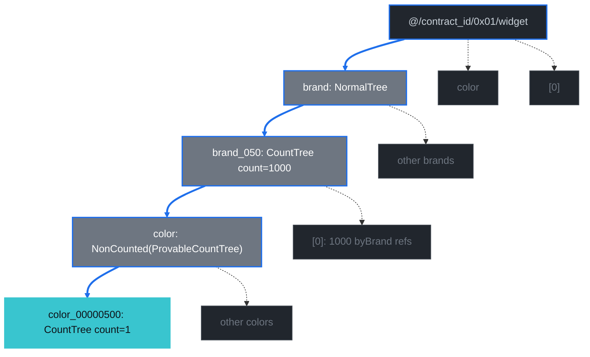
```mermaid
flowchart TB
  WD["@/contract_id/0x01/widget"]:::tree
  WD ==> BR["brand: NormalTree"]:::path
  BR ==> B050["brand_050: CountTree count=1000"]:::path
  B050 ==> B050_C["color: NonCounted(ProvableCountTree)"]:::path
  B050_C ==> B050_C_500["color_00000500: CountTree count=1"]:::target
  B050_C -.-> Other["other colors"]:::faded
  B050 -.-> B050_0["[0]: 1000 byBrand refs"]:::faded
  BR -.-> Brands["other brands"]:::faded
  WD -.-> CO["color"]:::faded
  WD -.-> PK["[0]"]:::faded

  classDef tree fill:#21262d,color:#c9d1d9,stroke:#1f6feb,stroke-width:2px;
  classDef path fill:#6e7681,color:#fff,stroke:#1f6feb,stroke-width:2px;
  classDef faded fill:#21262d,color:#6e7681,stroke:#484f58;
  classDef target fill:#39c5cf,color:#0d1117,stroke:#39c5cf,stroke-width:3px;

  linkStyle 0 stroke:#1f6feb,stroke-width:3px;
  linkStyle 1 stroke:#1f6feb,stroke-width:3px;
  linkStyle 2 stroke:#1f6feb,stroke-width:3px;
  linkStyle 3 stroke:#1f6feb,stroke-width:3px;
```

### Diagram: per-layer merk-tree structure (Layer 5+)

This is the deepest descent in the chapter — four extra grove layers below the common Layers 1–4. Layer 5 enters `brand` (same as Query 2); Layer 6 lands on `brand_050` but doesn't terminate (its CountTree has a continuation child); Layer 7 is `brand_050`'s single-key sub-merk-tree carrying the byBrandColor continuation; Layer 8 is the byBrandColor terminator value tree where `color_00000500` is the actual target.

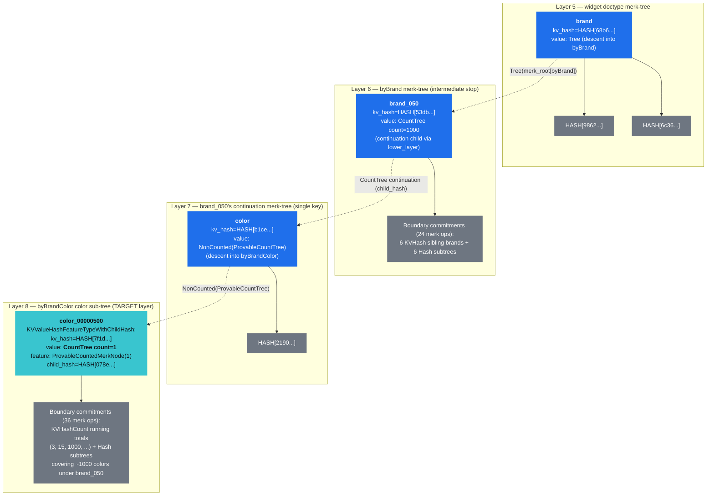
```mermaid
flowchart TB
  subgraph L5["Layer 5 — widget doctype merk-tree"]
    direction TB
    L5_q["<b>brand</b><br/>kv_hash=HASH[68b6...]<br/>value: Tree (descent into byBrand)"]:::queried
    L5_left["HASH[9862...]"]:::sibling
    L5_right["HASH[6c36...]"]:::sibling
    L5_q --> L5_left
    L5_q --> L5_right
  end

  subgraph L6["Layer 6 — byBrand merk-tree (intermediate stop)"]
    direction TB
    L6_q["<b>brand_050</b><br/>kv_hash=HASH[53db...]<br/>value: CountTree count=1000<br/>(continuation child via lower_layer)"]:::queried
    L6_boundary["Boundary commitments (24 merk ops):<br/>6 KVHash sibling brands + 6 Hash subtrees"]:::sibling
    L6_q --> L6_boundary
  end

  subgraph L7["Layer 7 — brand_050's continuation merk-tree (single key)"]
    direction TB
    L7_q["<b>color</b><br/>kv_hash=HASH[b1ce...]<br/>value: NonCounted(ProvableCountTree)<br/>(descent into byBrandColor)"]:::queried
    L7_left["HASH[2190...]"]:::sibling
    L7_q --> L7_left
  end

  subgraph L8["Layer 8 — byBrandColor color sub-tree (TARGET layer)"]
    direction TB
    L8_target["<b>color_00000500</b><br/>KVValueHashFeatureTypeWithChildHash:<br/>kv_hash=HASH[7f1d...]<br/>value: <b>CountTree count=1</b><br/>feature: ProvableCountedMerkNode(1)<br/>child_hash=HASH[078e...]"]:::target
    L8_boundary["Boundary commitments (36 merk ops):<br/>KVHashCount running totals<br/>(3, 15, 1000, ...) + Hash subtrees<br/>covering ~1000 colors under brand_050"]:::sibling
    L8_target --> L8_boundary
  end

  L5_q -. "Tree(merk_root[byBrand])" .-> L6_q
  L6_q -. "CountTree continuation (child_hash)" .-> L7_q
  L7_q -. "NonCounted(ProvableCountTree)" .-> L8_target

  classDef queried fill:#1f6feb,color:#fff,stroke:#1f6feb,stroke-width:2px;
  classDef sibling fill:#6e7681,color:#fff,stroke:#6e7681;
  classDef target fill:#39c5cf,color:#0d1117,stroke:#39c5cf,stroke-width:3px;
```

The two extra grove layers (L7 + L8) over Query 2's two-layer descent are what makes this the chapter's heaviest proof (1 911 B). The L7 layer is structurally trivial (one key) — its cost is the descent overhead, not the merk-tree boundary. L8 carries the same `ProvableCountTree` shape as Query 3's L6, but the contained key namespace is restricted to colors that co-occur with `brand_050`.

## Query 5 — `In` on `byBrand`

```text
select  = COUNT
where   = brand IN ["brand_000", "brand_001"]
prove   = true
```

**Path query:**

```text
path:         ["@", contract_id, 0x01, "widget", "brand"]
query items:  [Key("brand_000"), Key("brand_001")]
```

**Verified elements** (one per In value, returned in lex-asc order):

```text
path:        ["@", contract_id, 0x01, "widget", "brand"]
key:         "brand_000"
element:     CountTree { count_value_or_default: 1000 }

path:        ["@", contract_id, 0x01, "widget", "brand"]
key:         "brand_001"
element:     CountTree { count_value_or_default: 1000 }
```

**Proof size:** 1 102 B.

**Proof display:**

<details>
<summary>Expand to see the structured proof (5 layers, two `KVValueHash` items at the byBrand level) — or <a href="https://dashpay.github.io/grovedb-proof-visualizer-widget/#f=text&d=H4sIAAdCBmoC_6VXXW9ctxF996_YRxvQA2f4MRwDLfJRtAGSFgEauA-BEHDIYWxUsIK1nA8U_u89d7WSLe-udTcmpNW95NXd4Zkzcw7_sb3-1f_21ffb6-v5gjb_e7LZfNf-8O1uYne72fyyXD_f_NO3_326m9hswvPN92_fvHz6TVs-vvz3Nz_aYKXJWjVOK7OMwoFCFUmlNyzERlLHCNUpYspKJxZXah4LR4uXz57t3037d3_74kW7euu7r_jiYvPD1v1p8sFcOElmFW5TZZpQs5lCEePoBWGUVqgFnjEbB62VdA6POrjqs4vNLtrUcuPajSwFvLC15dkZRg4sRcakyKXamKlILSzD8AY8lrO0PqZ8EC0j2rb11zf7-3iADGlXTgDGk8SmARikyiIjGGG6916HxdGrhG6dYnCROOMQ9Zaxu_fflZ5vvn756mrc3l9d_-bbn66WbL15vk_VZvPF5i9_vb85kszbcSSlDxP7Ifjh98-FfZ-9QHf4Z9Pg5JrZxH1qiL3rMB6K__QYU4syxUPtbXjmXoy9RXyf5WIlZWDy7IO4j0Ox39FnR_8Q0U_i-gi6p4onqQspBUQoHDX7EO4zRFeJWsWHF0-aMgDJkiYIggfyTN3Fwcd6-QCNu0FHcxlonw2RogUEL3jlfV6GtjDbqA0M5FzCrF41h05eU5PpzVozJhO1Ljy9J3A5Ja4pOfs8Hsh9jRwufipzd_kLdCwDK_KwKhunef_bq_Gz3-zRQhfgQsXLPVal55BnjpPdUK4eYuidW2-pxJEssTa3yKEpALXaHB0FuIXYmM1K_YjD56FyO24jPI3OaozOQOoUhxWNsmoyKi2Ion3WOfosKL5u3H2p415RbakktdlLx2_CY0UtuA69PInGp_hs2_Z6HKQozxhiifE-VdWKymiqo3iT0Gp0SySaRm9iLWqsaMdN67S5ZK0PUF4tWh5hTn48to9l4NQ4lIfSYxFW12jUIkEaJ8rOuYJWBZQKjphTHhYqOmPJRCAaQz-1oxhreTy2h7Jxaqzl3O3Y4f4Y8c6k39kkPFm6f_d283brP_zxi__n1c3L3e7f0-WnEMLF5uvrt69vbnkT4Vd6mcIXG9qtzav2M0D4EZfLz-UdjxRkWLyNtgilItKslYkrRLuIcIJCDRaTLDA1oczYawpBS3F4iyh2ebH5qr151ZfN_et6-P61YFqutcaelB2GqRYaRl7aWBRB4VWU4BJiDG1mSBk6bi3DFLU0SpX8OAVOFtCjSNGfQyrVBNtH05L3OhPkwmlKbTup9wCxh4yB3pkAlk4LBMXjLNiQacl8AqlgkzhwhCwBcVjIYRDBTrlGOAfod40VNrMsPqJLIS1LJlQlB0AsuhapteV8qqjhW4KOBlMXuIlPiEOOiDS1oUqwmlD7GdEjBelbzI5ltMcAVsERjmZr47wr7VUP5_v0vw_UF09k6IZeCf045s46BRhLGi1P6Rq4ZCf2AVGbuU1a-B-CwxTopLWBlrMAlQNAc5gRrngEGt4qHLXCQauUNOas3OFFQjCUD_Yxc8ezTItvzxFnC3TUuTbOeg6gegTQDpYvwKCZA8VkMK4pSkUzgI1lgrelqAxrmSBQFXaObdBsybpTH11W13I4C1GiQ9PZ6uhUS1MIc08IN_O0jNbTU0A3k4mm5JYNLEbQXbEFsKPiILNsoayOlM_BlOIRUAf45jCqEbDhFDVSCQHJViP4rhEjSBCK-lB0yRoT7AZccYGlz3OgA69mKaXzQM0HoMqkQYIWFnGctJFSGK3PDPdMgTO8Mk54oxL0HOWfoeQE-FvG7qh77XV1pOUsUOUIqNFHqvhq1DwUC1ISWVMVuDGcjWqrNKRn8x5z7VESzijwJkNz8WgGuFeHWs8DVQ9A9YYj4uw5hhTQ6FHRkSkFTZQApTE0Bc0fqgmhSU0ZesnMQJelTdjM1V0_nAMq0xFQJ05VMJY4sQmMKGmSAPdWY-uUmqHTDiuthVQIqgVvnKFkeaB5CaEftNV9is9TKD6UKIuzd2uiiANXGWdNmJu2WN9MzOgNkjOOxk5JzGfRxR-XSlyAuOn6SNfZz2W8e_I5659aPb12auX4_LHZw7mPZx7ef3j3_vru6vbv8vnuybsn_wczPWgtnxMAAA">open interactively in the visualizer ↗</a></summary>

```text
GroveDBProofV1 {
  LayerProof {
    proof: Merk(
      0: Push(Hash(HASH[bd291f29893fb6f6d6201087746ca1f23a178dd08e1346cb6c127e91ae3623b3]))
      1: Push(KVValueHash(@, Tree(4ed22624752972af97fb71abf4067b23e6d296a61a02f35b2098819fde39d289), HASH[4a5a28cb1b40226aa35b2f0d502767df13268bdf4678627dbfde26a557acdf73]))
      2: Parent
      3: Push(Hash(HASH[19c924989e473a90d0848277d0b1498ccc8db3dc870cbc130e773f3d79ea5b71]))
      4: Child)
    lower_layers: {
      @ => {
        LayerProof {
          proof: Merk(
            0: Push(KVValueHash(0x4ed22624752972af97fb71abf4067b23e6d296a61a02f35b2098819fde39d289, Tree(01), HASH[5b90e1e952b7eef903cc9db2d9098e334a37f7e08cade52c6b2ea3bf4b56b645])))
          lower_layers: {
            0x4ed22624752972af97fb71abf4067b23e6d296a61a02f35b2098819fde39d289 => {
              LayerProof {
                proof: Merk(
                  0: Push(Hash(HASH[49e7191075272395ed72cf03e973987ede6e4945e08574fe77d725f4ce7ecdf8]))
                  1: Push(KVValueHash(0x01, Tree(776964676574), HASH[5d9a0fad8a3f32560f8e8950c1e84a7feabaab21b79bc72fec4482442844e2ef]))
                  2: Parent)
                lower_layers: {
                  0x01 => {
                    LayerProof {
                      proof: Merk(
                        0: Push(KVValueHash(widget, Tree(6272616e64), HASH[6c505f53f2ebf3de030cc2aca463d4b429aeb320a9fadb8ae68bb7903a22bb68])))
                      lower_layers: {
                        widget => {
                          LayerProof {
                            proof: Merk(
                              0: Push(Hash(HASH[9862894b16a0792688fdcf64edcb2ceade5c8b234649bfc6cfc6426869b0e9d9]))
                              1: Push(KVValueHash(brand, Tree(6272616e645f303633), HASH[68b697da99d6ea70a83eb41794dca7ba3938d0ba98fbfaeb3cd0c19b3b5d0ff2]))
                              2: Parent
                              3: Push(Hash(HASH[6c36729e93b1a316cbf60fe282eb630c0ed6e45db088e365110302b6c9caba86]))
                              4: Child)
                            lower_layers: {
                              brand => {
                                LayerProof {
                                  proof: Merk(
                                    0: Push(KVValueHashFeatureTypeWithChildHash(brand_000, CountTree(636f6c6f72, 1000, flags: [0, 0, 0]), HASH[90ff6f6d9a3d901195982128130677243bfd27b75736206f3c8400966ef0d37b], BasicMerkNode, HASH[19b58883c492e746861db1e6ad07529a5a91cc8330af522682486db9346d6875]))
                                    1: Push(KVValueHashFeatureTypeWithChildHash(brand_001, CountTree(636f6c6f72, 1000, flags: [0, 0, 0]), HASH[484ca11fb4ec8f479be1f78af903ce0c9d4fe630517579fb0172c2576d6b9652], BasicMerkNode, HASH[0bf12023f8e067c12db4cec1583909a0283878d6d909c76196736299750b5879]))
                                    2: Parent
                                    3: Push(Hash(HASH[8ca09dadc802a7efe03534ce4ad991b2f191f368878754a37b5e5c03d9498dab]))
                                    4: Child
                                    5: Push(KVHash(HASH[e5297b3ebe81c6435c29f712074da5f7c90265e12ed3d4f5af1f6d900e50c9f1]))
                                    6: Parent
                                    7: Push(Hash(HASH[50f373fd01dea89c992779764dff82cc7200b492be8f5cf3721627d5323bcbff]))
                                    8: Child
                                    9: Push(KVHash(HASH[cf78c9f1b1a1204bb2e437806f52c21e331392de3436388572bd1fa4bce1cdc7]))
                                    10: Parent
                                    11: Push(Hash(HASH[4a8dc186a95c8c4a1252fb51dbc407727f588eb5bdc8313c96f5c29889e13926]))
                                    12: Child
                                    13: Push(KVHash(HASH[d00ee7653e34e47d46004929b13ded33dff069ed9cc88342cecdf66a65fd8401]))
                                    14: Parent
                                    15: Push(Hash(HASH[7f1d17b9632f0bd440dacf5e841025482bc1d8145df3650301a95a5ee71ce8c8]))
                                    16: Child
                                    17: Push(KVHash(HASH[3ed48a5e35cb7546d329487b0e1ab8a81d7c5bec358c37449e6cbd956e3bb069]))
                                    18: Parent
                                    19: Push(Hash(HASH[eaef9fc530408393bc321409414814b290309a861f474a925a922250327affc6]))
                                    20: Child
                                    21: Push(KVHash(HASH[f776417ede76e6194706e483ac14ab7b3db6aa0461ec14ed5f8e5d20071363af]))
                                    22: Parent
                                    23: Push(Hash(HASH[b3fccba79c14fcc5e97ff6a3cd051228dc755e6de147bef690ba9681264b2b9f]))
                                    24: Child)
                                }
                              }
                            }
                          }
                        }
                      }
                    }
                  }
                }
              }
            }
          }
        }
      }
    }
  }
}
```

The two `Push(KVValueHashFeatureTypeWithChildHash(brand_NNN, CountTree(…, 1000, …), …))` ops are the actual verified elements — both inlined in the byBrand layer's merk proof. They share the same parent path (`@/.../widget/brand`); the verifier-side `verify_query` returns both as siblings rather than descending one more layer per value (which is what the legacy `Key([0])` shape would have forced for a normal-countable index, but no longer does — every countable terminator's value tree is a CountTree). The remaining 22 ops are the boundary-path hashes that prove `brand_000` and `brand_001` actually occupy the merk-tree positions claimed.

</details>

The outer query enumerates `Key(in_value)` items at the property-name subtree; each resolved element is itself a value-tree `CountTree`. No subquery is set — the In values' value trees *are* the count-bearing elements. The verifier reads the per-In value from `grove_key` (rather than from `path[base_path_len]`, which is how it would for a trailing-Equal compound). The caller sums the two `count_value_or_default` reads (or surfaces them as per-group entries if `group_by = ["brand"]`).

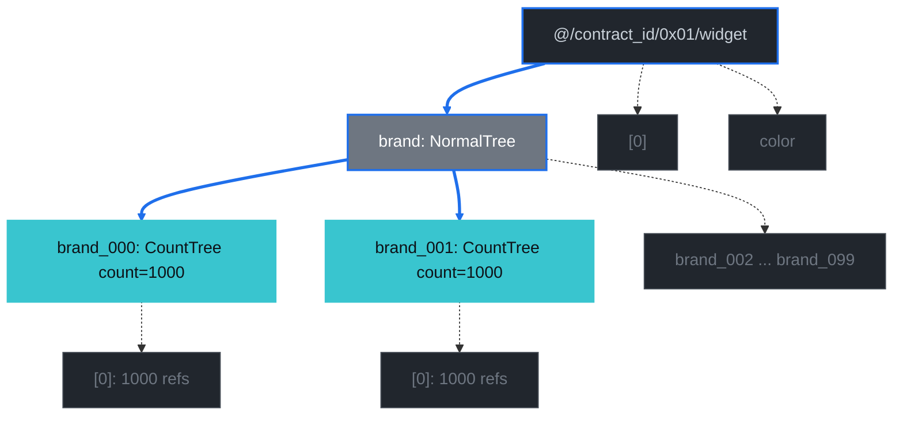
```mermaid
flowchart TB
  WD["@/contract_id/0x01/widget"]:::tree
  WD ==> BR["brand: NormalTree"]:::path
  BR ==> B000["brand_000: CountTree count=1000"]:::target
  BR ==> B001["brand_001: CountTree count=1000"]:::target
  BR -.-> BMore["brand_002 ... brand_099"]:::faded
  B000 -.-> B000_0["[0]: 1000 refs"]:::faded
  B001 -.-> B001_0["[0]: 1000 refs"]:::faded
  WD -.-> PK["[0]"]:::faded
  WD -.-> CO["color"]:::faded

  classDef tree fill:#21262d,color:#c9d1d9,stroke:#1f6feb,stroke-width:2px;
  classDef path fill:#6e7681,color:#fff,stroke:#1f6feb,stroke-width:2px;
  classDef faded fill:#21262d,color:#6e7681,stroke:#484f58;
  classDef target fill:#39c5cf,color:#0d1117,stroke:#39c5cf,stroke-width:3px;

  linkStyle 0 stroke:#1f6feb,stroke-width:3px;
  linkStyle 1 stroke:#1f6feb,stroke-width:3px;
  linkStyle 2 stroke:#1f6feb,stroke-width:3px;
```

### Diagram: per-layer merk-tree structure (Layer 5+)

Same L5 shape as Query 2 (brand queried, two opaque sibling subtrees). At Layer 6 the proof inlines two `KVValueHashFeatureTypeWithChildHash(brand_NNN, ...)` ops at the byBrand layer — both verified elements share the same parent path, so no extra grove descent is needed.

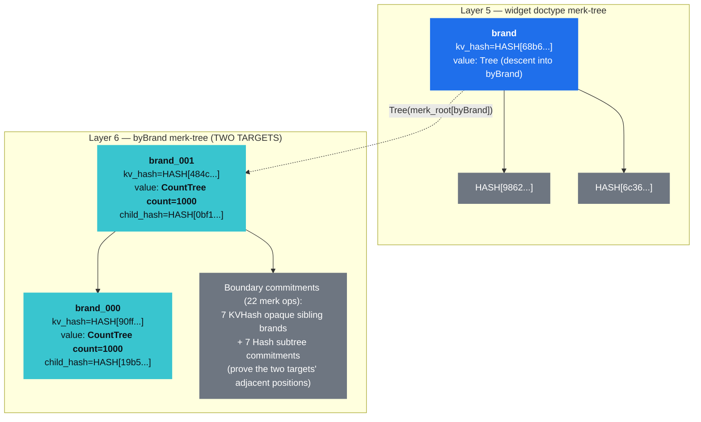
```mermaid
flowchart TB
  subgraph L5["Layer 5 — widget doctype merk-tree"]
    direction TB
    L5_q["<b>brand</b><br/>kv_hash=HASH[68b6...]<br/>value: Tree (descent into byBrand)"]:::queried
    L5_left["HASH[9862...]"]:::sibling
    L5_right["HASH[6c36...]"]:::sibling
    L5_q --> L5_left
    L5_q --> L5_right
  end

  subgraph L6["Layer 6 — byBrand merk-tree (TWO TARGETS)"]
    direction TB
    L6_t1["<b>brand_001</b><br/>kv_hash=HASH[484c...]<br/>value: <b>CountTree count=1000</b><br/>child_hash=HASH[0bf1...]"]:::target
    L6_t0["<b>brand_000</b><br/>kv_hash=HASH[90ff...]<br/>value: <b>CountTree count=1000</b><br/>child_hash=HASH[19b5...]"]:::target
    L6_boundary["Boundary commitments (22 merk ops):<br/>7 KVHash opaque sibling brands<br/>+ 7 Hash subtree commitments<br/>(prove the two targets' adjacent positions)"]:::sibling
    L6_t1 --> L6_t0
    L6_t1 --> L6_boundary
  end

  L5_q -. "Tree(merk_root[byBrand])" .-> L6_t1

  classDef queried fill:#1f6feb,color:#fff,stroke:#1f6feb,stroke-width:2px;
  classDef sibling fill:#6e7681,color:#fff,stroke:#6e7681;
  classDef target fill:#39c5cf,color:#0d1117,stroke:#39c5cf,stroke-width:3px;
```

Marginally larger than Query 2 (1 102 B vs 1 041 B) — the extra cost is one extra `KVValueHashFeatureTypeWithChildHash` op plus one merge op. The boundary commitments shrink slightly because the two adjacent targets share part of the merk-tree path.

## Query 6 — `In` on `byColor` (RangeCountable)

```text
select  = COUNT
where   = color IN ["color_00000000", "color_00000001"]
prove   = true
```

**Path query:**

```text
path:         ["@", contract_id, 0x01, "widget", "color"]
query items:  [Key("color_00000000"), Key("color_00000001")]
```

**Verified elements:**

```text
path:        ["@", contract_id, 0x01, "widget", "color"]
key:         "color_00000000"
element:     CountTree { count_value_or_default: 100 }

path:        ["@", contract_id, 0x01, "widget", "color"]
key:         "color_00000001"
element:     CountTree { count_value_or_default: 100 }
```

**Proof size:** 1 381 B.

**Proof display:**

<details>
<summary>Expand to see the structured proof (5 layers; bottom layer carries `KVHashCount` running totals from the `ProvableCountTree`) — or <a href="https://dashpay.github.io/grovedb-proof-visualizer-widget/#f=text&d=H4sIAAdCBmoC_6VY244dxw1811ecRwnQQ5PsGwUkcOIgMZALDNhQHoyF0d0kLSELr7GW7BiB_z01e5W0e6Q50Eh7dOaimZ5isaq4f7u8-MX_8uevLy8u4iUd_vfkcPjH-M0vrw5c7R4OP23fXxz-6Zf_eXp14HBILw5fv_351dOvxvbxp2---m4aKwVrV4lZo1rlRKm3lusaOCGDWjdL3UlwaNZF3FxpuFSWKWfPnt3cm27u_feXL8f5W796xBfPD99euj_NbsyVcyusjUdoi9lozMiptsniFcuoo9JIHFImJ-2dNMxFjbs-e364Wm0eZXBfk2ZOuOEY27WRrCRutVmQcO3TItfWKzebuAMuK6WNZdHeWS1jtePSf3xzsy8PkCFdyhnAeG4yNAGD3Lk1S5NweK3VbYqt3tKaiyR5axJiTX0UvN39s_KLw5evXp_b9f75xa9--f35Vq2fX9yU6nD44vCHP97tPFLM6-2Rkr5f2HfBT__9XNhvqpfoFv8yNTm5Fp7NPTTJWmqTTfE_XSQPadE89TXMC6862YfgebPUWXMBJs_eWffjUNy80Wev_n1EP4rrJ9A91jxZvZFSwgobixa3xiuSuDbR3ty8etZcAEhpOUAQXFAiL28OPvaz99C43ejRWia6qUZrVSsIXnHLu7qYjhTD-gADudQU3buWtMh7Hi18zDEm02w6V-PwlcHlnLnn7Ozx-ELueuThyY9V7rZ-iR6rwI467KrGcd7_-tp-8Dc3aEEFuFL1eodVXSWVKBLsE-3qSdJaPNbIVSzPzDp8CqehAHT24VAU4JZkMM9Z-wccPg2V6-16hcfR2Y3RCUgd47BCKLvmSXWkppDPHraiovnW5OVbH6-Obss164xVF34yLqs6k6vp2VE0HvL5_qmD1b0Hpzq4CKxkVhs51ljRaxac86JclmnTWJbRaUVTjRQafbp8-qkfCvyxTR5h0Lo4v7h8fgD2v4x57l9evP3xzTWbBBa5amxdLOnuTxEStCelbbvlWdNS1YoWm63MCbqpraEw1LI0bfq5AjKmWmFataMlKTmnBlWDhtL69Cu-7yvHtr2kvN6uXv1TzDyRnyez9Ghv_9XHm7eX_u1vP_m_X795dfX29xX7Pt1szw_3Jdv2aPuI8_EDAPgOX7e_Z7d1Wl46QzqTjdmiMzeY-zSQbjRnyyWLqEexUdII9IcLjTWhFogbc9WzD4jitr3ivy7Mn9I9G8bmSIT4IjABLg76pJJrjDGgPR6U15QsSBZp9OpGRtVKWFVf6hKfZsNR89gHGp0GGvJXBlRRSQoiAXfqCpLbVLyHwXxkeCStG7XTEGM0eajSIpvITx8BTe5Bg3NyLrh3NbQQN5iYGkGTUTAutJypm2a1lFAJR9hgSBYhBgjxyrYXtL1acSwqbqVDeB5pmtQZtS2VVnvItDlstQXPR4WFqTBzQMEgqTPAKWRXXLt3nbcNv-vi8p7sXqF8vVr2BGAhqcMqQgkj6hN1BslEyqbKsxbqsmhLEyaeI6hBsxwRe6Y8UbuGGu1bcj0J2vYA2m4NKxGMHQgrXtcaZSH5wJt9EoNtK3tL8C_bsJYuSdFflkoSHhlE27nOfgq0egxaZIZm1TEO6JKcyoDqI5CtbSSJ7CtBVLTC2eYsJl1DBxDFINUVrjILoKWyG1tKJ4FL9ABdDHWEfAQFhDMRkpHxQs0jUp2OmWq2CcBR9lwG9ZKnbJMhvGuLSTO33arEp8BLcgzfpR01Z7gkRLg1HRFzCcIsXBYc1Yz3qLmBFoR0nBYmsxQVsr5FcUsGfIX245tPw7c8FIYehMeW3jGubI2VQNMuiFiGUarnVTVDPS1b1oaF46KGtqvS4T81r9341pPwbcfwxUQ7McCYTKhroP07hH51KrMrOr-WFFbIBfQtw3OKlgljdSbOfSzpwLfKfnz7afjqA3wZ-MI_Z0IYVU5eoMABNBPGRqjDAA8MwyB0ranlXqRiSh-QC6qtjLxbeDmdgi_TMXxhDi0VKANoGeglSFRU5ViU5vBkpo5YMbaZZU40IuazQOhmECM4j9j0gfeLL59mbPzQ2bpPbwJmOrLJln7hsAU8BXU3pwOXrQFQp6QGq5AoA4mlwuc7hlD13QCfZG181NsmB_K1ZKguAhrw3cwgSsXIi-kiq_RpqW0z8MBS6ep3C7n1Eb11bbwJBJf9Csyn2Rs_9DdDkCSsWpsQEToMC49tnJC1EBCKpMkZ77St2bc5w3LbVizIUwZO7Ab4JIPjow4ntWfJbSDjuBtSbcT2C4bldfg2C_WKvLwIaadGwQ7acbFUYpxaqWzhodB-CZbTLE4esbi-tDTIcAHIWKMKB0XfyGqYsyphSpuFMYhFWDPYX4ZtbGqM1crcDbCcZHFy3OKQWzwhTQPCDugUU_nGaOA8F6cSA-Iro61mVAJ9BxkrmSAKuWwYn93NoTvXfZrJyUOTo0ELyb4ipE9y8qmpw3xB44mU1tkaoiZWPFoVG-BH4MUQfygjvyNU7ka47pp3t-33J59z_mNnj587dubx448dfXjswyPv77-7d__99tv1v9vn709-f_J_sY4oiTEYAAA">open interactively in the visualizer ↗</a></summary>

```text
GroveDBProofV1 {
  LayerProof {
    proof: Merk(
      0: Push(Hash(HASH[bd291f29893fb6f6d6201087746ca1f23a178dd08e1346cb6c127e91ae3623b3]))
      1: Push(KVValueHash(@, Tree(4ed22624752972af97fb71abf4067b23e6d296a61a02f35b2098819fde39d289), HASH[4a5a28cb1b40226aa35b2f0d502767df13268bdf4678627dbfde26a557acdf73]))
      2: Parent
      3: Push(Hash(HASH[19c924989e473a90d0848277d0b1498ccc8db3dc870cbc130e773f3d79ea5b71]))
      4: Child)
    lower_layers: {
      @ => {
        LayerProof {
          proof: Merk(
            0: Push(KVValueHash(0x4ed22624752972af97fb71abf4067b23e6d296a61a02f35b2098819fde39d289, Tree(01), HASH[5b90e1e952b7eef903cc9db2d9098e334a37f7e08cade52c6b2ea3bf4b56b645])))
          lower_layers: {
            0x4ed22624752972af97fb71abf4067b23e6d296a61a02f35b2098819fde39d289 => {
              LayerProof {
                proof: Merk(
                  0: Push(Hash(HASH[49e7191075272395ed72cf03e973987ede6e4945e08574fe77d725f4ce7ecdf8]))
                  1: Push(KVValueHash(0x01, Tree(776964676574), HASH[5d9a0fad8a3f32560f8e8950c1e84a7feabaab21b79bc72fec4482442844e2ef]))
                  2: Parent)
                lower_layers: {
                  0x01 => {
                    LayerProof {
                      proof: Merk(
                        0: Push(KVValueHash(widget, Tree(6272616e64), HASH[6c505f53f2ebf3de030cc2aca463d4b429aeb320a9fadb8ae68bb7903a22bb68])))
                      lower_layers: {
                        widget => {
                          LayerProof {
                            proof: Merk(
                              0: Push(Hash(HASH[9862894b16a0792688fdcf64edcb2ceade5c8b234649bfc6cfc6426869b0e9d9]))
                              1: Push(KVHash(HASH[a29ee8f206a253362b6da4fcacf8643ee8e5925cd979fcd449e5906f0f9f8be3]))
                              2: Parent
                              3: Push(KVValueHash(color, ProvableCountTree(636f6c6f725f3030303030353131, 100000), HASH[79569d595db75bbf2e9dca93a15c90b7eecf7b299632668ec410e2076d27f71c]))
                              4: Child)
                            lower_layers: {
                              color => {
                                LayerProof {
                                  proof: Merk(
                                    0: Push(KVValueHashFeatureTypeWithChildHash(color_00000000, CountTree(00, 100, flags: [0, 0, 0]), HASH[ce582ad80dab7f822798cbdcd4a7e2d454339ef5da50af688e31acb463f13bc6], ProvableCountedMerkNode(100), HASH[ad2891a5a377d25ef300546faaa2acef14cb3431490a86ed1d16d5fd69ec9e3f]))
                                    1: Push(KVValueHashFeatureTypeWithChildHash(color_00000001, CountTree(00, 100, flags: [0, 0, 0]), HASH[c4024227f61350e128189bbfdb9cb3de893aef09626680a3d2336f991c1dbb14], ProvableCountedMerkNode(300), HASH[45e2452816d75b27baa9d1b8a82a251ce218d949d003bceb2e22ce1988312c4d]))
                                    2: Parent
                                    3: Push(Hash(HASH[cb34b6fa0bd36bf67c93768f3bdbadc7c5f4f143215222ff8bc8bbff5df0dc93]))
                                    4: Child
                                    5: Push(KVHashCount(HASH[2e045e449ad64fe27461182e3f335ee8fb65183c18a3fd3e4ff175c9e767b04b], 700))
                                    6: Parent
                                    7: Push(Hash(HASH[8d73c136c1428e6cca5c6579faeb12b9cc4e7094bdbdba383097d2d05032a414]))
                                    8: Child
                                    9: Push(KVHashCount(HASH[a9f7d6ebc19c3405af2ef32cbdf4f4ec0d4a96592bb5d389f9ab0462389c6fb5], 1500))
                                    10: Parent
                                    11: Push(Hash(HASH[e131726e58ca916c5d2c3fdff06be027b7bca567b45a1854b38774b7eb429b47]))
                                    12: Child
                                    13: Push(KVHashCount(HASH[c982b92207e31779affbc3c4495d175948ca647b9c15740c0cb0f6b7fede6d0d], 3100))
                                    14: Parent
                                    15: Push(Hash(HASH[c8f1d0d58823e8fb60dbd838fdd5b984c6940e1d4d4976473e8718a638dcd64c]))
                                    16: Child
                                    17: Push(KVHashCount(HASH[8dbbcf0d3b51cfa3f8c40c815b8904b650fd51e3bb55ae40f741f7341248ac38], 6300))
                                    18: Parent
                                    19: Push(Hash(HASH[28f1a2ab09b0920e50bdfd4d062412ba9c1d39d33579d485360e7a0941675a43]))
                                    20: Child
                                    21: Push(KVHashCount(HASH[6bf705340b0ff3872a4f692fc10bae0dd9e63fa2726bb3fd284fbfc273ef24af], 12700))
                                    22: Parent
                                    23: Push(Hash(HASH[8ebe73647e431636fe22547384c36bfd83d77a0e109dd3e3f5a69e691c860f9e]))
                                    24: Child
                                    25: Push(KVHashCount(HASH[b2fa1534ef346372a7d2df562fe4fc4938bd07bc72af5a147529478af878972d], 25500))
                                    26: Parent
                                    27: Push(Hash(HASH[db461b2f973111b65f34f31313ccff5530b24fa17bc7e5313d4794783336df24]))
                                    28: Child
                                    29: Push(KVHashCount(HASH[3684347a67ceedad2ff4a7fce6ae303086543c1f146f5865dfdc23612308c05b], 51100))
                                    30: Parent
                                    31: Push(Hash(HASH[e8c957f1d52f9ae3932f1f8d3e3d7f761569b52b29ffd7dc3f4c0c976405b3b4]))
                                    32: Child
                                    33: Push(KVHashCount(HASH[c32ae0189f148c2390791534ff4bc205fabb53a7c7d15f109a4354170045308c], 100000))
                                    34: Parent
                                    35: Push(Hash(HASH[1a1c99166d7b1e1eb9087404f3bfae82d749a3a7a763da654f48c5d314e21e76]))
                                    36: Child)
                                }
                              }
                            }
                          }
                        }
                      }
                    }
                  }
                }
              }
            }
          }
        }
      }
    }
  }
}
```

Same layer count as Query 5 (5 layers) and same inline-two-elements pattern at the bottom. The difference is in the merk-tree node *type* surrounding the verified elements: byColor's bottom layer is a `ProvableCountTree`, so each sibling's merk-path operation is a `KVHashCount(HASH[...], N)` (carrying the sibling's running count) rather than the plain `KVHash(HASH[...])` you see in Query 5's byBrand layer. The boundary-proof ops here read like a histogram of the byColor tree's per-subtree counts (700, 1500, 3100, 6300, 12700, 25500, 51100, 100000) — that's the same information Query 7 will sum over directly without descending to any specific value tree.

</details>

Same query shape as Query 5 — outer `Key`-per-In-value, no subquery, per-In `CountTree`s resolved at the bottom. The difference vs Query 5 is the *property-name* tree above is a `ProvableCountTree` instead of `NormalTree`. That doesn't change the proof's structural shape, but it does mean a future `color > X` range query against this property has a fast path Query 5's `brand` doesn't.

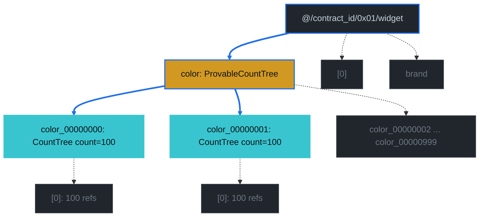
```mermaid
flowchart TB
  WD["@/contract_id/0x01/widget"]:::tree
  WD ==> CO["color: ProvableCountTree"]:::path
  CO ==> C000["color_00000000: CountTree count=100"]:::target
  CO ==> C001["color_00000001: CountTree count=100"]:::target
  CO -.-> CMore["color_00000002 ... color_00000999"]:::faded
  C000 -.-> C000_0["[0]: 100 refs"]:::faded
  C001 -.-> C001_0["[0]: 100 refs"]:::faded
  WD -.-> PK["[0]"]:::faded
  WD -.-> BR["brand"]:::faded

  classDef tree fill:#21262d,color:#c9d1d9,stroke:#1f6feb,stroke-width:2px;
  classDef path fill:#d29922,color:#0d1117,stroke:#1f6feb,stroke-width:2px;
  classDef faded fill:#21262d,color:#6e7681,stroke:#484f58;
  classDef target fill:#39c5cf,color:#0d1117,stroke:#39c5cf,stroke-width:3px;

  linkStyle 0 stroke:#1f6feb,stroke-width:3px;
  linkStyle 1 stroke:#1f6feb,stroke-width:3px;
  linkStyle 2 stroke:#1f6feb,stroke-width:3px;
```

### Diagram: per-layer merk-tree structure (Layer 5+)

Same L5 shape as Query 3 (color queried under an opaque kv root). L6 inlines two `KVValueHashFeatureTypeWithChildHash` targets in the byColor `ProvableCountTree` — the difference from Query 5's L6 is the surrounding boundary ops carry `KVHashCount` running totals instead of plain `KVHash`.

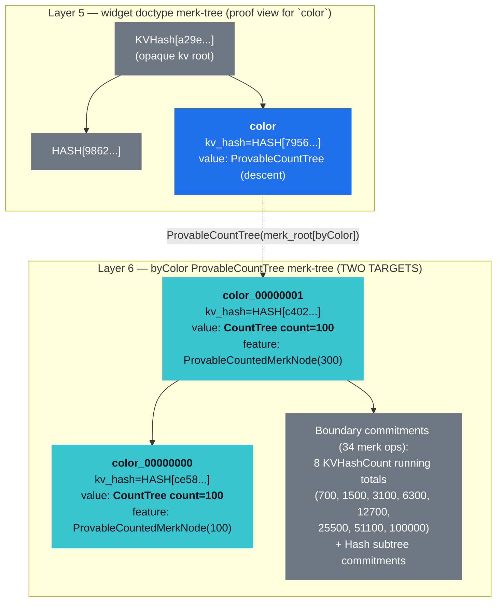
```mermaid
flowchart TB
  subgraph L5["Layer 5 — widget doctype merk-tree (proof view for `color`)"]
    direction TB
    L5_root["KVHash[a29e...]<br/>(opaque kv root)"]:::sibling
    L5_left["HASH[9862...]"]:::sibling
    L5_q["<b>color</b><br/>kv_hash=HASH[7956...]<br/>value: ProvableCountTree (descent)"]:::queried
    L5_root --> L5_left
    L5_root --> L5_q
  end

  subgraph L6["Layer 6 — byColor ProvableCountTree merk-tree (TWO TARGETS)"]
    direction TB
    L6_t1["<b>color_00000001</b><br/>kv_hash=HASH[c402...]<br/>value: <b>CountTree count=100</b><br/>feature: ProvableCountedMerkNode(300)"]:::target
    L6_t0["<b>color_00000000</b><br/>kv_hash=HASH[ce58...]<br/>value: <b>CountTree count=100</b><br/>feature: ProvableCountedMerkNode(100)"]:::target
    L6_boundary["Boundary commitments (34 merk ops):<br/>8 KVHashCount running totals<br/>(700, 1500, 3100, 6300, 12700,<br/>25500, 51100, 100000)<br/>+ Hash subtree commitments"]:::sibling
    L6_t1 --> L6_t0
    L6_t1 --> L6_boundary
  end

  L5_q -. "ProvableCountTree(merk_root[byColor])" .-> L6_t1

  classDef queried fill:#1f6feb,color:#fff,stroke:#1f6feb,stroke-width:2px;
  classDef sibling fill:#6e7681,color:#fff,stroke:#6e7681;
  classDef target fill:#39c5cf,color:#0d1117,stroke:#39c5cf,stroke-width:3px;
```

The two-In-values pattern carries over from Query 5; the per-subtree counts on the boundary `KVHashCount` ops are the same data Query 7 uses as the integrand for its range aggregate.

## Query 7 — Range Query (`AggregateCountOnRange`)

```text
select  = COUNT
where   = color > "color_00000500"
prove   = true
```

**Path query** (different primitive — note the `AggregateCountOnRange` query item):

```text
path:         ["@", contract_id, 0x01, "widget", "color"]
query items:  [AggregateCountOnRange([RangeAfter("color_00000500"..)])]
```

**Verified payload** (different verifier — `GroveDb::verify_aggregate_count_query` returns a single `u64`, not an element list):

```text
root_hash:   0x62ee7348f4d28dd9d7cf86a6c725fa8276cfd446f6007a6000fb0e1dfefa6468
count:       49900
```

**Proof size:** 2 072 B.

**Proof display:**

<details>
<summary>Expand to see the structured proof (5 layers; bottom layer uses `HashWithCount` + `KVDigestCount` ops instead of `KVValueHash` — the AggregateCountOnRange-specific merk primitive) — or <a href="https://dashpay.github.io/grovedb-proof-visualizer-widget/#f=text&d=H4sIAAdCBmoC_62ZXYsc1xGG7_0r5lICXZw6dT4FDk5siCEJGBLkiyDM-ahjCS_esJbthOD_nqdnZ1ca7a5nBqW1EjvdPd2nq956P1p_vrn-xb760zc319frlez--9lu99f2H7vZ79h_3O3-tf3-cvc3u_nh2X7Hbude7r75-ac3z75u2z9__PvX_-zTV1m-lqqrp5Vm8k5cyTmk0TigTXKZ0xUTZVdPQ3y2Ks00ee36-vnzw7XlcO2_vHrVrn62_S2-eLH7x43Zs2DT--RDjr5m31bNq2dpfQWXcvdqiWWklqQ5vzR272opUtc0rdOX-vzFbr_a0GLzZXTpwXHB1rZzl5vR-ZzyXKI-lT5XSLkkn2fnCpwWY25jrvzBaj2rbTf247vDZ31QGamj-kBhLGRt1VGDUHzO03Vh9xijzK5zlOxGH6LOctalM1drkad7f6_wcvflm7dX8_bz1fWvdvPd1datn14eWrXbfbH7_A_3Hx5p5u32SEuPG_th8d2_P7Xsh-45uat_7NWZWI2-Z7NVnY5RZ_ez8k1TDU3zyubKaNOiH6l7a8r9ekw9hUhNnn-w7sdLcXiiT179cUV_t64nqvvU8IRqWao4Vpi91mgz-7GcWs1aS7ZpyUINkYLEHBYA4YS4wrBs4LG8PqrG3SaP9tLJoRs5p5oAeOKS932ZtbnVZmkg0MfkVrFSoxtiJbS8rPXWupeeax_ZLxsBLIfgSwjmbT2-kPsZeXjw9zp31z8nj3XgjD6c1Y2ncf_r2_m9vTtUCxbwSZKl-1qlEV1cUZe3zriaUzeGb6OFpDP04Guzrt61SkF7aQajUDenzfveU_kIw5dV5Xa7XeHT1Tm7RhdU6ikMV4iy1NAlNZcr9FnWHCsxfKP7Ydscj8K0hRRqXyMN_gZOS7U7q7O-frIaD_H8_q7NV7OyvEvNR0VKepotrNHGKikoxyxWH8esua4xA5MWq0vLrbpKNz19148J_qlNH0HQuL66vnmxo_a_tH5lX17__OO7WzQpEjnS2qZY3f2fqKKMp7htu8NZrjHVGWucPcfegVudo1UENY7qNv4cCxqrNSFaqTCS4sy7DKvBoTJOP-Kxrjy1nQvK223_6KeQeSE-L0bpQ6x--_bdm30bnv3wy3dv2PH5rXvxi3JqsAU-FZHI088VEwwHmEJVzIDLG-W1FZvspSTk0lbJBU2Zr1_srmy9u72YFWXUzS3aywnN4yaWq7PMxA-9k-D60BG7C2VC4yutUVqvnTvEGLjYzdvv3xyuNntIwvqQAhHpCcCEteEEyVwrRnXdB1a_rc42AM2Qt7Up0zCX3642tgf-3McIqJ6fVbL3o_bV2-_tp3e3Jdv39Ls9OLnYAZ5tri6xiKTCjX3ubQ5KhXQFPJZ0JApYulZA70JXxKEhlQss_CLYZX1R5OyVnTuOD93YE62nwdqYpIXry2PjqhxdKVqpOQQ2w5g02aYwgj67Cq2PVG0lFers_FHry9bQklGDEDPuElEYZaDWWD_t1RfUm9EU52FHsIDZw-IIZri0mrM7bj3avFyYmpxWEZRezIFLJ8OnKl24z0rZ42EnSGzYRoc3RZamVnPZ7luP1T67wOFU67XoofUSVigG1zgJrH-EkbKWrUQZ74zHMkjXKs3ue1tbgl99dinDm4AE1ncJKONFrU-nWx88opEnVibhNFOXFrB9BZcl3ZWJLY2pKIDwhJQeN1yP0DPj1jXHXI5an2JXF2l2D9sVF9q3RYsQV0q9N5v4Wx4-cwHihOI8u3kPgHALndBx3HqVDW2UugeYv7bG-bBI96lD-YO5aiu11bugasNFq-AsaNNBsVGW-9YnPbu--VTnQ8iHzqPpzAvUZ8BwFgYoCkBMazM_gXw38aqSVFknrjYEgLnEVZnOYzk7y7sEk-WiztfTnW-zFZVZh5aoyGtQr1v28LDwCLS71kBsm545Tnm1tYW27lbkWbrDrHzYeb4G4kudgZqEDr1lfPXUPsVb6jn3osNAFiUY1KD05LoOwRH1Wawdd35Y9XAEcMQpTV24_ApxLjEiAIGxtcGEE7QNTJGMyLEBe1BQqNDSHke3ndfzSVXcydbnejf0ZJFeWSTJoHeeXJG2ri00PxxmJshIBBdn5LTkksCvcRYYYCaUs218fwEmRS5qvfgzem8phlotNRniMKWZyaEpDoVF9P2E0SqWaptVxh27BXMDdXEd-zjdUe9rsDZcAeM1zRyBuKfryxPn4AvCHGTBBNe6Nh-xGYONKHFu6Dy-TY97v7bUUMZM3jjNNRQJlVTdVEhcMjDTNocNc9TIBSMMBg1Mt5Ip4eQ94V8g9Xqy9_VO6wdahZtJCzbTXqB6FlHcsB4zoQZXVNItWkpwqIFf2-sTkBA9JqAs1ncJKsNlvY-nez-3Vy66Oa4CUmNjUrd1NpfgzeLIs11D1-ijU05lxqi2eTqoTJlfR72PbrnEzI_JFAN9E-slgZU5Cs-8ckNDcGfIdwZXELOHJLkZ-d5Igh_5vGQ1DcwBxIQfxDJYQj_gVR3kxehbDW3iUPGOxBtIK8aM_GMAkYbi38_9-QVOp1t_N_aJMmCBfbcYssuOeQ6qA04kBDv8EKaJ6AEHctBjWtf-pUapwBOvso39-Xwv-bLOl1PPwTjcvfnL3W1ZlPwEuWNODHemSSEpWQlWK9iZrDUvLCr1X8LI1zyaX8GhBK_38ezc56inFyaHhcHtBFYFOBR2Yj7hkhVXzhI4knzoE0LtPg-CAGgbfrSZJUagNHLYzNT5nffuogJ7OSNCdUC5xl76qCEMJX4Iy9ftoQZORpz4JFVDbo2pG6YDRJNj8LZ7FfxAUj9xOx6t_8PVDrR6foH9IVOfd7ZedHY4jSp9P7ZQNhRNbOFXjc6wFnBH68UF8kLEp6BUCB-_tzDxag2LMuvqje9scD9fS_xlFt2f49Fn7mg0C07kTOyYDCuxMZrIp5C3IGB2OzxcHNM2106AMxxy9Hh0O_boWyqvBPzRWsQmu9pmR7lJX5veBtScMcfNwgskuYEfSIR8kqwv-P0HTk2YzGn8FNgZD29zaSFMguiOxygW4UI0P7RBICYoEfvFAXqrYax7WJ1PjD5fBJRy0dn1krPVXXS2XHT2RcOjJw1MlDuSHXmL3Ztc4epBD00jpc-FoyXWRfw7BkAtYrvpmmz_S2OrlBVjHwQDeX3_cu68fullFkbPsDCpQaaCV222Fk-muTkEV30b5DPyRsWGoMbZNGDKRY0cI90mo5Om12P7Wgk-W1JPgqaEiEFVJZMyQLIZTGwGhL0naEIxlZolKeHErSLbq92PQitG2eKgnj4XbAwxJXkR31jqbJnwQ3hmdsvQtb1Hmcyy4J745Ig1834gAtby7BKns95ebttvn33K8d87-vSxp448vv-xvQ_3_fbZ_wA0RSeWtx0AAA">open interactively in the visualizer ↗</a></summary>

```text
GroveDBProofV1 {
  LayerProof {
    proof: Merk(
      0: Push(Hash(HASH[bd291f29893fb6f6d6201087746ca1f23a178dd08e1346cb6c127e91ae3623b3]))
      1: Push(KVValueHash(@, Tree(4ed22624752972af97fb71abf4067b23e6d296a61a02f35b2098819fde39d289), HASH[4a5a28cb1b40226aa35b2f0d502767df13268bdf4678627dbfde26a557acdf73]))
      2: Parent
      3: Push(Hash(HASH[19c924989e473a90d0848277d0b1498ccc8db3dc870cbc130e773f3d79ea5b71]))
      4: Child)
    lower_layers: {
      @ => {
        LayerProof {
          proof: Merk(
            0: Push(KVValueHash(0x4ed22624752972af97fb71abf4067b23e6d296a61a02f35b2098819fde39d289, Tree(01), HASH[5b90e1e952b7eef903cc9db2d9098e334a37f7e08cade52c6b2ea3bf4b56b645])))
          lower_layers: {
            0x4ed22624752972af97fb71abf4067b23e6d296a61a02f35b2098819fde39d289 => {
              LayerProof {
                proof: Merk(
                  0: Push(Hash(HASH[49e7191075272395ed72cf03e973987ede6e4945e08574fe77d725f4ce7ecdf8]))
                  1: Push(KVValueHash(0x01, Tree(776964676574), HASH[5d9a0fad8a3f32560f8e8950c1e84a7feabaab21b79bc72fec4482442844e2ef]))
                  2: Parent)
                lower_layers: {
                  0x01 => {
                    LayerProof {
                      proof: Merk(
                        0: Push(KVValueHash(widget, Tree(6272616e64), HASH[6c505f53f2ebf3de030cc2aca463d4b429aeb320a9fadb8ae68bb7903a22bb68])))
                      lower_layers: {
                        widget => {
                          LayerProof {
                            proof: Merk(
                              0: Push(Hash(HASH[9862894b16a0792688fdcf64edcb2ceade5c8b234649bfc6cfc6426869b0e9d9]))
                              1: Push(KVHash(HASH[a29ee8f206a253362b6da4fcacf8643ee8e5925cd979fcd449e5906f0f9f8be3]))
                              2: Parent
                              3: Push(KVValueHash(color, ProvableCountTree(636f6c6f725f3030303030353131, 100000), HASH[79569d595db75bbf2e9dca93a15c90b7eecf7b299632668ec410e2076d27f71c]))
                              4: Child)
                            lower_layers: {
                              color => {
                                LayerProof {
                                  proof: Merk(
                                    0: Push(HashWithCount(kv_hash=HASH[b2fa1534ef346372a7d2df562fe4fc4938bd07bc72af5a147529478af878972d], left=HASH[e8368be0ff72f87a2132f09d8d68d6dca140bc3c5b048d5f4f6fc8ab9b7bc554], right=HASH[db461b2f973111b65f34f31313ccff5530b24fa17bc7e5313d4794783336df24], count=25500))
                                    1: Push(KVDigestCount(color_00000255, HASH[adfb158116847927badc07be9745a21be7e2660a8b75f8a310aba9025f91feec], 51100))
                                    2: Parent
                                    3: Push(HashWithCount(kv_hash=HASH[e4f3a5c9fdf17ccb2c7508839b2fdcfd4cd878ed1d59270929ac69ef63179402], left=HASH[848d5873de457b1be03c8c7d74733b92874f2071028fdd6d30e8ca16c18a9770], right=HASH[676f04d3603911ecd1e0d2d01c2691b173df672b40daf8a7730f73c50d39e07e], count=12700))
                                    4: Push(KVDigestCount(color_00000383, HASH[14f48ee200148a9c4c673809297bdfb71e79fe9902b130e7842fbdb18c2e1a31], 25500))
                                    5: Parent
                                    6: Push(HashWithCount(kv_hash=HASH[42a257d9bc608c6b1a419f8e081b08df9056832c72e36b5dc07c4b724fb37578], left=HASH[65b3058c7b4d9bcfcf6022645f66bbaed9dbbdb74b7dbf367bbe2240263db767], right=HASH[315927383b45959aa67b32fb26b0b7c21baf6afbb1fcdc05e9c8c43a3c02b6c6], count=6300))
                                    7: Push(KVDigestCount(color_00000447, HASH[dcbfdf897e1b1d83a55172b6fa463446cd5e016331ba075440f7f1091d02467b], 12700))
                                    8: Parent
                                    9: Push(HashWithCount(kv_hash=HASH[ada831d9c38535694323d9092ab9c42e39949c9d2e4567fafd084b0f5754b0d9], left=HASH[09229789d4fdf4baba7646d3bd12e6b77b83ce19f7f1c0918b60b3c1de5bd8ea], right=HASH[ce92f20c6b464d3ff4c95f8f1ee49149aacc50298eaed2c6a2849d588bd4a667], count=3100))
                                    10: Push(KVDigestCount(color_00000479, HASH[1e6eb9e928e8bb229309db3a4a2c0f3041c63e90eb646061e4f5d82b1d65a1ac], 6300))
                                    11: Parent
                                    12: Push(HashWithCount(kv_hash=HASH[ae65499e6a1c105c878c418b09732df2dee29cf7db74c4b2e93b989710b449d0], left=HASH[94eac0807596d751092d12f27195dc72324f45999f4fc483688a9c15c554ecf3], right=HASH[fb4298cd62e8a90af17f9133fd4c106ec1da4b16be2954fc542af6ad0f6e316e], count=1500))
                                    13: Push(KVDigestCount(color_00000495, HASH[cca12136fed93b88094fc80ceb5722b752860000478404c62f7862eb652e268f], 3100))
                                    14: Parent
                                    15: Push(HashWithCount(kv_hash=HASH[db1493f4f683045aa7604c6a06c0280fecb34b352503b148eab16e245938492f], left=HASH[50f064fdcdd8e0f3e1eb86b98dc8eb6f7a8df0b26037df202b21726a05edeb79], right=HASH[d6e96c2078316fcd74e62265173c2bb52a94ad4ef0bccac569557f675307b382], count=300))
                                    16: Push(KVDigestCount(color_00000499, HASH[66e2d072be547070b1d433cb0f05f09ef508ec4d4f0702db4f49e71896ad91bc], 700))
                                    17: Parent
                                    18: Push(KVDigestCount(color_00000500, HASH[47b0ade593a2e4e99e7d7363f5d1f692882007397f025226f19d097ca2f407fa], 100))
                                    19: Push(KVDigestCount(color_00000501, HASH[9146433eb6d43db2f109f5f7714146624bd646b27c7310f3c2cad7155eb7c741], 300))
                                    20: Parent
                                    21: Push(HashWithCount(kv_hash=HASH[bbac5fc7646d820e2912c1771333ebc83b1012619347aa04cce3c4ad13c11eea], left=HASH[0000000000000000000000000000000000000000000000000000000000000000], right=HASH[0000000000000000000000000000000000000000000000000000000000000000], count=100))
                                    22: Child
                                    23: Child
                                    24: Push(KVDigestCount(color_00000503, HASH[66ea1280c29a6ea350e0c6695ab80430f5d3b5dc2df0f5a4d544a918d9fba29a], 1500))
                                    25: Parent
                                    26: Push(HashWithCount(kv_hash=HASH[4d7b5c895a6fb1e451ce85a522ecf18484fd1e406945cde8df9c75ec2152757e], left=HASH[6be0f9637caa5b6c09adb59618a8a90494e2f43a5e9948dc32d68af74528578a], right=HASH[ce1146de6de82a9767edf38a5cc11b5498e57023684acbe9e20bc3104ade94cf], count=700))
                                    27: Child
                                    28: Child
                                    29: Child
                                    30: Child
                                    31: Child
                                    32: Child
                                    33: Push(KVDigestCount(color_00000511, HASH[c7fdd609ef67f184976b1bdfeb97245fdfcb33e53ff6841277def88f55bc9c41], 100000))
                                    34: Parent
                                    35: Push(HashWithCount(kv_hash=HASH[6abc81973aeff51137a002d32ac447e6b91ebf507e34a4a13ec9d1bed4516d23], left=HASH[99323fb716110f45836334025ec154fcc56193c11ee0811bdd86320c0f8164ed], right=HASH[33b9e5cbdf27883150262112aaefda71c0b725a58c3f929ad1ce1cdd3f90aacd], count=48800))
                                    36: Child)
                                }
                              }
                            }
                          }
                        }
                      }
                    }
                  }
                }
              }
            }
          }
        }
      }
    }
  }
}
```

The bottom layer uses different merk-proof operations than every other query so far ([Query 8](#query-8--compound-equal-plus-range-bybrandcolor) shares this shape one level deeper). `AggregateCountOnRange` doesn't return individual elements; it walks the boundary of the requested range (`color > "color_00000500"`) over the `ProvableCountTree`'s internal nodes and uses two specialized operations:

- **`HashWithCount(kv_hash, left, right, count)`** — a boundary node that hides its full subtree behind a single hash + count. The `count` field is the load-bearing piece: the verifier just sums these without descending. In this proof you can see `count=48800` at the bottom-right boundary node (everything to the right of the range cut, plus another `count=100000` showing somewhere in the in-range path), and the prover walks the cut so each `HashWithCount` covers a different chunk of the range.
- **`KVDigestCount(key, kv_hash, count)`** — a *boundary* key inside the in-range region; the prover names the key so the verifier knows exactly where the cut is, but only commits the hash + count, not the value. Note the keys here climb monotonically (`color_00000255 → 383 → 447 → 479 → 495 → 499 → 500 → 501 → 511`); each one names a binary-tree boundary node on the path from the range start (`color_00000500`) to the right edge of the tree.

The final summed `count: 49900` is what the verifier returns. There's no `CountTree(…)` element in this proof — the running totals inside `HashWithCount` / `KVDigestCount` *are* the proof's count surface, committed into the `ProvableCountTree`'s merk root at insertion time.

</details>

Together with [Query 8](#query-8--compound-equal-plus-range-bybrandcolor) (the compound `brand == X AND color > Y` variant), this is one of two queries in the chapter that use a different GroveDB primitive. Instead of resolving N specific keys, `AggregateCountOnRange` walks the boundary of the requested range over `widget/color`'s `ProvableCountTree` and sums the per-node counts already committed inside that tree. The proof carries the boundary merk path and the running total; the verifier returns just the count.

The reason this works *only* with `rangeCountable: true` (Query 5's `byBrand` couldn't do the equivalent) is that `widget/color` is a `ProvableCountTree` — its internal merk nodes carry running counts. `widget/brand` is a plain `NormalTree`; it would have to enumerate every brand and sum their counts (which is what `brand IN [...]` does, but for an unbounded range that's not a feasible proof shape).

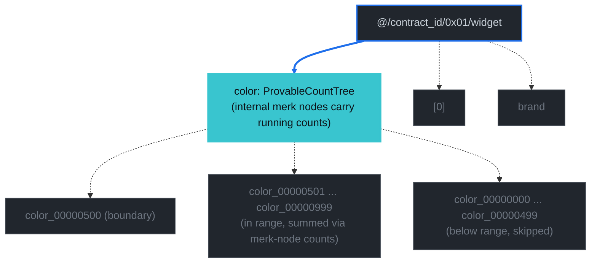
```mermaid
flowchart TB
  WD["@/contract_id/0x01/widget"]:::tree
  WD ==> CO["color: ProvableCountTree<br/>(internal merk nodes carry running counts)"]:::target
  CO -.-> C500["color_00000500 (boundary)"]:::faded
  CO -.-> CMore["color_00000501 ... color_00000999<br/>(in range, summed via merk-node counts)"]:::faded
  CO -.-> CBelow["color_00000000 ... color_00000499<br/>(below range, skipped)"]:::faded
  WD -.-> PK["[0]"]:::faded
  WD -.-> BR["brand"]:::faded

  classDef tree fill:#21262d,color:#c9d1d9,stroke:#1f6feb,stroke-width:2px;
  classDef faded fill:#21262d,color:#6e7681,stroke:#484f58;
  classDef target fill:#39c5cf,color:#0d1117,stroke:#39c5cf,stroke-width:3px;

  linkStyle 0 stroke:#1f6feb,stroke-width:3px;
```

### Diagram: per-layer merk-tree structure (Layer 5+)

Same L5 shape as Query 3 / Query 6 (color queried under an opaque kv root). L6 is fundamentally different from every other query: no individual elements are returned — the proof walks the boundary of the range `color > "color_00000500"` over the `ProvableCountTree` and sums per-node counts directly. The merk ops at L6 are `HashWithCount` (boundary subtree hashes carrying their full subtree count) and `KVDigestCount` (named boundary keys with hash + count, no value).

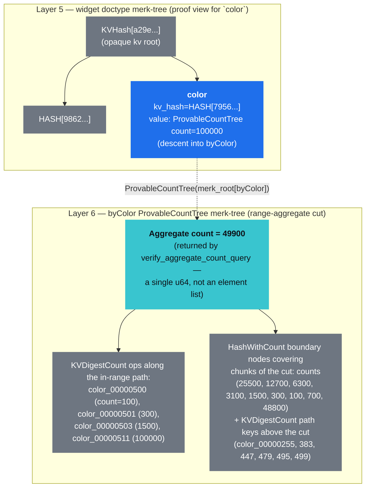
```mermaid
flowchart TB
  subgraph L5["Layer 5 — widget doctype merk-tree (proof view for `color`)"]
    direction TB
    L5_root["KVHash[a29e...]<br/>(opaque kv root)"]:::sibling
    L5_left["HASH[9862...]"]:::sibling
    L5_q["<b>color</b><br/>kv_hash=HASH[7956...]<br/>value: ProvableCountTree count=100000<br/>(descent into byColor)"]:::queried
    L5_root --> L5_left
    L5_root --> L5_q
  end

  subgraph L6["Layer 6 — byColor ProvableCountTree merk-tree (range-aggregate cut)"]
    direction TB
    L6_result["<b>Aggregate count = 49900</b><br/>(returned by verify_aggregate_count_query —<br/>a single u64, not an element list)"]:::target
    L6_inrange["KVDigestCount ops along the in-range path:<br/>color_00000500 (count=100), color_00000501 (300),<br/>color_00000503 (1500), color_00000511 (100000)"]:::sibling
    L6_boundary["HashWithCount boundary nodes covering<br/>chunks of the cut: counts<br/>(25500, 12700, 6300, 3100, 1500, 300, 100, 700, 48800)<br/>+ KVDigestCount path keys above the cut<br/>(color_00000255, 383, 447, 479, 495, 499)"]:::sibling
    L6_result --> L6_inrange
    L6_result --> L6_boundary
  end

  L5_q -. "ProvableCountTree(merk_root[byColor])" .-> L6_result

  classDef queried fill:#1f6feb,color:#fff,stroke:#1f6feb,stroke-width:2px;
  classDef sibling fill:#6e7681,color:#fff,stroke:#6e7681;
  classDef target fill:#39c5cf,color:#0d1117,stroke:#39c5cf,stroke-width:3px;
```

The `ProvableCountTree`'s value isn't to expose individual elements — it's to make the summation itself O(log n) instead of O(distinct values in range). The proof bytes are larger than Query 6's two-element point lookup (~2 KB vs ~1.4 KB) because the AggregateCountOnRange primitive has more structural overhead per result, but it scales to any size range in fixed proof bytes, where the point-lookup shape grows linearly with the number of resolved keys.

## Query 8 — Compound Equal-plus-Range (`byBrandColor`)

```text
select  = COUNT
where   = brand == "brand_050" AND color > "color_00000500"
prove   = true
```

**Path query** (the prefix `brand == X` fixes one byBrandColor leg; the range walks the terminator's `ProvableCountTree`):

```text
path:         ["@", contract_id, 0x01, "widget", "brand", "brand_050", "color"]
query items:  [AggregateCountOnRange([RangeAfter("color_00000500"..)])]
```

**Verified payload** (same primitive as Query 7 — `GroveDb::verify_aggregate_count_query` returns a single `u64`):

```text
root_hash:   0x62ee7348f4d28dd9d7cf86a6c725fa8276cfd446f6007a6000fb0e1dfefa6468
count:       499
```

The bench's deterministic schedule gives every brand all 1 000 colors; the strict `>` cut at `color_00000500` leaves `color_00000501..color_00000999` = **499** colors paired with `brand_050`, each contributing exactly 1 document.

**Proof size:** 2 656 B.

**Proof display:**

<details>
<summary>Expand to see the structured proof (8 layers — same descent as Query 4 down to `brand_050`'s color subtree, then `HashWithCount` / `KVDigestCount` ops over the byBrandColor terminator) — or <a href="https://dashpay.github.io/grovedb-proof-visualizer-widget/#f=text&d=H4sIAAdCBmoC_7VaW49bR3J-96_gow3oobq6uqvLgIPd7AJZIBcskMB5WAhGdXe1JaxgBWPZmyDwf8_XnIs0Nw1JZSlpRB4eHjarvvouzfmnq_e_xh__8c9X79-v79Phf786HP7F_yeujgeODw-H_9r3vz38a1z99evjgcOBvj38-Zef33z9J98_fv_vf_pLn2xpsTXLq9dVZ2VK1FSlDscT2ZO2OalFyjjU60isYckjV849v_7mm5trp5tr__P33_u7X-L4Fr97dfiPq4ivJSZzZdHCpuzLdHVN3pdQ1c45KpZRvSYnXrl0Jmst2ZqRbXKzb14djqsVL85t9NSFcEH3fe6iWYi16lwpc219LqnaKuvsuAJOK0V9zKWfrJaxWr-Knz7cPM6PKpNsGAsKE6LZjVADaaw6qSccHmO02fMcTWn0kTKFal55qoUXfLqP7yXfHv7w5u27ef343fu_xdUP73a3fv72plWHw-8O3_3D3YMnmnl9e6Kl9xv7afHpv7-07Dfdo3Rb_9KNIoUV7hqxjPIYNjtPwysjZ_GsS4Pa8BmFR-0cnvF-vdRepaAm33yy7qdLcfOJvnj19yv62bq-UN3nhkcsNFkirFA5W4mpPBblMM3WNGbUEJOCghSVBYDghLJkhAbw2F7fq8btLT3ZS0o33VCtVgHwikve9WWa0_LZHAjkUmm1aFZopGjiusK7e-fU1fpQXjEEWBbhJhIc6-mF3M3I4yc_17nb_lF6qgMn9OGkbjyP-7-9nT_Gh5tqgQW4phr1rlZ1FCqr5MXRMa5BmcZgHy41T-nC5tEzkxsK2psHGAV1o-zMvdf2AMPnVeX6dr3C56tzco3OqNRzGDYQZTPpqTqpgT7bmmNVDN_oPGLP8WiYNqlifY068E9wWrVOYdNeP1uNz-G5X_lP81GLysqUa853rWq9mk43mzVcyVuOLklN5nDtni030LFbW33tro0JyFvPvUxai19e20MZeO72WB7qyFXZwnJPnhOkcWHsghtgVQEpCqxZyuzUwIy1pASgMfTTBoax1ZfXdl82nrudirnr27HuLwHvTPidDcLnoLh6ib5NRcogtAHyj5oWkazVJaNqkUgYLW-eAIc-KkULiIyzpmInlPQhID--d44pzUvkMroWqTOzSVNgHIrTvKWpo_QYubSRVcD86Pi0UiP3TtVOfe9TAfe8K4lRNJPD60iYD2vUe7jxgEo2TjxaQGkKgc_Ue5FFCqtWg4bzKqeuU56oUdslh3SlkFp6m2NClIFwM_grKWXWjippMa2zJ4Yo5yjGezULr_FT37ucVaP6qEZO8IWywNbFekvVuGSwg-MxbMQYeRQbAvRMZziY1hoK1avaVNFU26nr1CdqBHbsaRLDB7W1mvVSCtqUoLcE_AJDDXaVt1zbxnttG8pwA6nozPPkGrWzamTPUfAPVOjV4Q_vf_npwzUXZ2SAUZfyq0MiwnPrnf8IYvkL7u6_r-8sR54dYQHEN8acsN51gZxhPAT6CRomaAc8kGtqq2B8xTDBi1CJ2Cx-8sAkuqHB085-arYRDhwalvrAhLSUIGcKww7lyCP3mWtNsao3c9XiMKp9aXN0pcJGoSknL_W84U6Pp1u9zJGJOI5RyziKzFIkiq8GHA3uDmnGnbIaQTGbwXwOPMo7BZ083UnOKmp5ijAh1NA5UVtgSBhdIihhJGSxDrFrUYpPWMuu8KQCSa4TeYFBVfDyw04GeqrnFVUfFTXDfMMdrDIhxjWQb8FGtYwlvBJIa8DJzFE1EF2AzNQYPAHHDnoFK8jJdJDaWUW1c87ms6aAn5qCheAA74RQoltXTRTFkJZ9JPGuiLIdgZoEw4AjMYGwKJOJNKHRvk5WuPOmgB9PQc8g6e5qWAfuAfe6MJ_b3RXICoRHQap1RhLtmFzbFhBEylU6dzt9pac5rEt81idua1PsaY7rIt91oft6zoNxMgL_Q49kx4E1E0a21jFrTkjgCOPdHA0CfpI61wkcGTi1BExBqnRq7Z-PBuP9u_dXrw7_9v6noyzF_BrF-NX7u3hKpo6R4fZPgXNMzwrXrXL1NBBuQJ2CyIxxcKQM6RDrgc-Rs4gP2Jc14aNWhuurSmbIRxiRUVpN533Ez4To_0-oXd-OtTsHbF8AuS8C3mP4_efbD2-ODf76r7_-8AYHvrveYlltsq2SFjxs5rq8OGK6OydCYA04D3SdE0yce4G8Vy4eqtLB3nDqr18d3sX6cH2xgKIC10W2Is1SU2IECF8yuqnBuCEM43AnGABOs6U1dFavyJ-Ix4Vwsau3P765uVpCWDHI8FrugJM2YQrEY8sZ1iG1NBASFuS8UlujYHTGItg_-KGdGCeuNvYH_o5LOQtSD2fnj29_jJ8_XBfviIAfaN9w2RvEM8LN1uWMxA4FgDMbPWdkl94aFQ0xuNFpLZBhE-eJV-ayViGeDI_csVJI-gVrPE8Knks-z0ADRjrIBkL2SqMyxCFzyojXyD2WJwDBlkc0HEMcCAp0IOW297H3_sZ9aGQGDQA02oAyFt4b4LWtKejw7MqQQ65pWpWdapBOSRsSlZlSQ_58AA1flbx0l8i2_IjbqToXTFrAMw2kj-5QMVyFGBLrphMkg0vXpIIkewuNxHpB2eUlaOSWb6CxgpHquCCFtFRWnw0VkkrWEO6oVqQ3jIxgqJB-QZejybCdnGY_xhus9DL4louhUU-ABvpnmD-i1CecM2wDmF7FAf9UKps5wmrCSMO6sgYBIobgLwXFmcvvQUN6gQGCg50EmoHIUK4Ui7Ybr1K2DIlYa8EyMF2SGQUdGWCckoqk-9AYIgIeAsiadGQSj9z3xtcCRCcQYMjNs4HD9phSmjNRloRBRWSFPOkdNGq-oOr6EjJE9AYZoXP73-pLq2MBdcMUkXUaCRbbuPSadoRteBUUc3WBo8Z0SSmGwI2FXobedjEy7GVkJFAvcDDRMwQmsAYGkjPvSex7H9RgZijnmRMhqqyBkactOLKgCtCCe8ho8D-OtDMzWpaTwEhHQQGQcDULLiGLGBqD2D8gTpTESurRvWTMznxAGrQ3pCdLb0Phuwhw7NNbKxWXHAIG4aYjMnRnzhpWFdHFk9coJnmMO2TkS6g60YvQULvdl03QY3SbkiICQl2qM8ITVl2bdkCaUnHMhzdyaPWqO6zqYIvmGeDASi9C7zHdXwaNYzZ_ARsdU7k3r-AHywZ716IDnAHVhBWgyN68yd49KBgH3lsepUMr0Gik9XIfG3CQyhJIJHs3ETBiKobsS7g-sgps9Z4flKtORvG8ZQGMVi4I1AoI3McG8KB7Dxn9Z-RpZJ_hyGXgLbgUZVgWGPDhHRRhwZy15BlRFkTdZk30UVAushr5RWzYrdcAW4GsvIFFFz54b3tjbWN3ZkFAyxNeuxp8tQjS-LKWkTIxE7OujCe2oFyGX7kcG-UEbMzS9mTT6h2yj-JSg_iL5FII7jAD6aNYxVQSWBFZyUZxDeSIDv25jw3mWDrBMiEBZGRMD9E-P3vs_bPR0Fso7YRJQCCfYw-ckqPN0czbA2z0YYIYHAlK3NuCIcWbwkVwgaOj7NSLYPigLqQI_BhOm4oW1SAwYPrIG5eUvb4MjVvaQEAHDCYmKbW5UbuhDs5DfC9I8VphShWeA3KsGIWJOkBQ4b8dwXIeCe4SPTluCV2IjPbSpys7al7v3S20EjFE9ncXjTsyA4zU2tGkkyFREAY8VdHACHNFColqMRusX2Be94hehHt7eYnp1uyRNwATXmMTCRSE9qa9hWBaAxZQacGeYk4FqoOEP3PX_Q03g8MLJHPP5iUpgC5uwN1O1mdGE4sElTIsHPJgciIYPqu5VbiRwPH97RtUaGKgINUQJx0j97FKs1igoXujSV94eyDpX361G9q-pOx8zp7hwz25C18pL6PxNnp49wwyRbLev9UjCSaqEkLWKLFCpvAwBZlBTniN0QK2DZ2tPAYc8oqdny9SM748evAJ2aPKNBFYAnP4BiZLSEppIkjRWIiOHoppki55sSBvZ9j8BqksgajItu47zMm-AsmUcyakBRg_5EgHOYZybmNBPAoCWg1EEjiABlnqMpCLiyPjPMgeFTFmJSoD4my4RoFHhX8wGlCops0wHjQgPSrRN-sKiIkrHs7YAeQOjpfQMOvFoGoXv9IufWWmi1-ZLn7lxQObXzRo8I63ItBl7u9wIQvZ4TJICCFWuW-LikyfrMFLGtwB0gaMGtBACKBABzwlwszr6w3WCxCQL7do-QSLJt05OyA7LHnKBd6nKRhl9v2NWuq9B6KXSqo7k1iGBnJPrlrZO_l9HRgTXg6SXqxjMgomNbFhUvCq2mjCvC2r0BAkGgT6_UsdvmBvVyBA7t-dfGDRcAZKKnD5--tFFNV20M_WZf_GAcPnoLizbEffHKGysMnePWJFMB0fdQDCfEnh6xlfdHy8_fbV3-PcU8887bxTznr5nJfO-Pzzn3v2-eeee-bp408dfXzs4ZH7jz999PH-7b3r__fP37767av_A1ytqxNhLAAA">open interactively in the visualizer ↗</a></summary>

```text
GroveDBProofV1 {
  LayerProof {
    proof: Merk(
      0: Push(Hash(HASH[bd291f29893fb6f6d6201087746ca1f23a178dd08e1346cb6c127e91ae3623b3]))
      1: Push(KVValueHash(@, Tree(4ed22624752972af97fb71abf4067b23e6d296a61a02f35b2098819fde39d289), HASH[4a5a28cb1b40226aa35b2f0d502767df13268bdf4678627dbfde26a557acdf73]))
      2: Parent
      3: Push(Hash(HASH[19c924989e473a90d0848277d0b1498ccc8db3dc870cbc130e773f3d79ea5b71]))
      4: Child)
    lower_layers: {
      @ => {
        LayerProof {
          proof: Merk(
            0: Push(KVValueHash(0x4ed22624752972af97fb71abf4067b23e6d296a61a02f35b2098819fde39d289, Tree(01), HASH[5b90e1e952b7eef903cc9db2d9098e334a37f7e08cade52c6b2ea3bf4b56b645])))
          lower_layers: {
            0x4ed22624752972af97fb71abf4067b23e6d296a61a02f35b2098819fde39d289 => {
              LayerProof {
                proof: Merk(
                  0: Push(Hash(HASH[49e7191075272395ed72cf03e973987ede6e4945e08574fe77d725f4ce7ecdf8]))
                  1: Push(KVValueHash(0x01, Tree(776964676574), HASH[5d9a0fad8a3f32560f8e8950c1e84a7feabaab21b79bc72fec4482442844e2ef]))
                  2: Parent)
                lower_layers: {
                  0x01 => {
                    LayerProof {
                      proof: Merk(
                        0: Push(KVValueHash(widget, Tree(6272616e64), HASH[6c505f53f2ebf3de030cc2aca463d4b429aeb320a9fadb8ae68bb7903a22bb68])))
                      lower_layers: {
                        widget => {
                          LayerProof {
                            proof: Merk(
                              0: Push(Hash(HASH[9862894b16a0792688fdcf64edcb2ceade5c8b234649bfc6cfc6426869b0e9d9]))
                              1: Push(KVValueHash(brand, Tree(6272616e645f303633), HASH[68b697da99d6ea70a83eb41794dca7ba3938d0ba98fbfaeb3cd0c19b3b5d0ff2]))
                              2: Parent
                              3: Push(Hash(HASH[6c36729e93b1a316cbf60fe282eb630c0ed6e45db088e365110302b6c9caba86]))
                              4: Child)
                            lower_layers: {
                              brand => {
                                LayerProof {
                                  proof: Merk(
                                    0: Push(Hash(HASH[fb5eb23b3135d9c226e61f004ffb43abae104238d8a1ea7bc60e8ec6ba271596]))
                                    1: Push(KVHash(HASH[3ed48a5e35cb7546d329487b0e1ab8a81d7c5bec358c37449e6cbd956e3bb069]))
                                    2: Parent
                                    3: Push(Hash(HASH[19ec5730af134e9ac980bbea92c2978212c8efe750a467ab54f073626e0ca2f5]))
                                    4: Push(KVHash(HASH[87bc6e7e1e465b8dcdaf95db9957a455d6bd7c75976db122f33e592fe75f1e4a]))
                                    5: Parent
                                    6: Push(Hash(HASH[a0a354f2bb59b8169253aebabb52afcc3c59c4c60da203c8887abb679d747168]))
                                    7: Push(KVHash(HASH[fc6b1d0237f8ff89b555e9a14480ae1c5b80d529a0f9fb5e681ea7ecd157d3da]))
                                    8: Parent
                                    9: Push(KVValueHash(brand_050, CountTree(636f6c6f72, 1000, flags: [0, 0, 0]), HASH[53dbd6216cccdddf16f3eb0f849aed0c0cea987a718f5b43493abf0a14e83eb9]))
                                    10: Child
                                    11: Push(KVHash(HASH[027ac8b1bc9788118b27c13d0b3c3bd3661ef6a89a775a6b6bf78aa7e6f8ed3d]))
                                    12: Parent
                                    13: Push(Hash(HASH[7a5dc3002e6cb6c92e54d554e5af85e9c2ba64ee9c5f80e6489075cc5f3f0d55]))
                                    14: Child
                                    15: Push(KVHash(HASH[3363630479f1abe6e003b1e1d50b5118e55ad2efb7a3f4b3b6df902bea72ac9a]))
                                    16: Parent
                                    17: Push(Hash(HASH[3857faef5ddb06e201f1e65cf42f15d6c9b0dc67e7f73eb182b520854e9bb648]))
                                    18: Child
                                    19: Child
                                    20: Child
                                    21: Push(KVHash(HASH[f776417ede76e6194706e483ac14ab7b3db6aa0461ec14ed5f8e5d20071363af]))
                                    22: Parent
                                    23: Push(Hash(HASH[b3fccba79c14fcc5e97ff6a3cd051228dc755e6de147bef690ba9681264b2b9f]))
                                    24: Child)
                                  lower_layers: {
                                    brand_050 => {
                                      LayerProof {
                                        proof: Merk(
                                          0: Push(Hash(HASH[2190c6fcd140792fd12be66cd631f97475b9ab3f19417a26d94798115ee46160]))
                                          1: Push(KVValueHash(color, NonCounted(ProvableCountTree(636f6c6f725f3030303030353131, 1000, flags: [0, 0, 0])), HASH[b1cedc48940faedea8b64bff8c8113344acdb1fd8eff37c567099b167b3c5861]))
                                          2: Parent)
                                        lower_layers: {
                                          color => {
                                            LayerProof {
                                              proof: Merk(
                                                0: Push(HashWithCount(kv_hash=HASH[4f8d29f51f626326fa5a3d4aa210a07eddf53121888aa5788625ae774be9bc37], left=HASH[ec92140543f4bd56112e8eaf4cb9796b1986d56b0bf721d81fc7d6a699d16a50], right=HASH[1eb29f80ffaac4878420ecfc9337e6181c9e6fc30608fc5475cf0b808f51a31d], count=255))
                                                1: Push(KVDigestCount(color_00000255, HASH[2ed4d50b30e917eceacb3356eb88057e490f9d98ebf6123d25535ff502d2da2b], 511))
                                                2: Parent
                                                3: Push(HashWithCount(kv_hash=HASH[80de09ce45f1c62d0532139ca67a93d88a293ce8139354e0e4751381346f64e7], left=HASH[32a8b4be78632242774668fd49f8db72d5f261d964f33ed9c0780ca99708ba20], right=HASH[af60a5ba4e39fa6326fd77dff0de304cc4cbac75c0702200a97d099f33617496], count=127))
                                                4: Push(KVDigestCount(color_00000383, HASH[fe27bc251ea815fbd838146098daf0662fe214425a5befaec84c960dadbff89b], 255))
                                                5: Parent
                                                6: Push(HashWithCount(kv_hash=HASH[827791c9001bdf85512aed74a917156299ad6b1a50abe27e03939cb745000dfa], left=HASH[4b5363b3bd01883530360ef09c2b645c6f744988e24c17e432bc2c3321d41541], right=HASH[c444ec932284bb1bae3b45f3f54ed9f3922fd85aeecea01dd10341b889c41137], count=63))
                                                7: Push(KVDigestCount(color_00000447, HASH[e7d9bb66af76a1b8600a9fb5d904f54825b61fb5e8004cdbfb4f42134455953a], 127))
                                                8: Parent
                                                9: Push(HashWithCount(kv_hash=HASH[11a374adf740d562dde32325c07b28949981033d310beafc1d90a3d44fb0bd6a], left=HASH[826dab51d3fd831414ae5344e837343104f0212e1c5ca57014951beba53f89d0], right=HASH[02ebfd24b8c7fd10b74bda8856344c4fd7287ce31ebdd6e9676c9a1a6e5943cc], count=31))
                                                10: Push(KVDigestCount(color_00000479, HASH[6151f4f40176302ed6a27f77fd687bbae015a09ca80ad4af6f80e7c29e8a3595], 63))
                                                11: Parent
                                                12: Push(HashWithCount(kv_hash=HASH[b93259768b6500a9b757c4a90e981f0e3a8a848b275b862f16f5b242310cb65a], left=HASH[b1f724e4b2546d1d92059a72076868112b5b6187b6d227fa834d3ff3579f7b8c], right=HASH[fd1765117ce2a3f6deca713039d81726b05eecab4119e223753dee5fd989d610], count=15))
                                                13: Push(KVDigestCount(color_00000495, HASH[034b88a8dfaf46db8b679fd72d342643d64b6937c44b06f983e5dbebd6f3b69b], 31))
                                                14: Parent
                                                15: Push(HashWithCount(kv_hash=HASH[bd58344e0fbbca9dee08997443550d1630adc59696701fb1f99c5a7e1fdb855a], left=HASH[22ef7d33de4e1d93a27009c5a3ae849ac8713c84dbac046dc615170a6b0e89a8], right=HASH[fbc94ef6e1255b8f0fffdb496258eb03a0b54c29d9f074830159d78a86e05621], count=3))
                                                16: Push(KVDigestCount(color_00000499, HASH[12672ddf0e18d172679f7ebf0ba5f6976b337066e0373ffdac8c176a6a160dcc], 7))
                                                17: Parent
                                                18: Push(KVDigestCount(color_00000500, HASH[7f1d988845d9c82b9d1146f2188b09bf704d31647ee2a26054e69ed897de3750], 1))
                                                19: Push(KVDigestCount(color_00000501, HASH[f0a8f993f517cee96055d69e48dfe51e70fe303424885194d3b7e71924af5df7], 3))
                                                20: Parent
                                                21: Push(HashWithCount(kv_hash=HASH[3b75b6239307e1a00f8596386421e623e365d4adc8451dae07cc3bcf589efc44], left=HASH[0000000000000000000000000000000000000000000000000000000000000000], right=HASH[0000000000000000000000000000000000000000000000000000000000000000], count=1))
                                                22: Child
                                                23: Child
                                                24: Push(KVDigestCount(color_00000503, HASH[aba3bbc16aa5a2413fd60261c5efe4d42c97f0f4b82fcc8e74af8562cc2fdfed], 15))
                                                25: Parent
                                                26: Push(HashWithCount(kv_hash=HASH[64d94410c9ae982091bff1d2fe0cf3edae7af54b43f24f613ea08f465e9fa29f], left=HASH[8d2afe8b42330b1bdd677daffde7238cf93a52146e60eeec8e08b4ce095a9ad1], right=HASH[663bf105cdfa9ffd5431d8190c55a87891da0c13c74eb6a16437526c74de889c], count=7))
                                                27: Child
                                                28: Child
                                                29: Child
                                                30: Child
                                                31: Child
                                                32: Child
                                                33: Push(KVDigestCount(color_00000511, HASH[fb4d7e1e5013a3c804045c72bd920ff81985ee986e87c9373c7041b78953d12e], 1000))
                                                34: Parent
                                                35: Push(HashWithCount(kv_hash=HASH[4ba23a437c91a135eb087602db30021bbbeeba7416d4af9317c2b1a7762ab0a4], left=HASH[cd9697f159ba87524f129190317680dd33f96cf5e8a444c9caaf264fe998746c], right=HASH[f4c9e984a836b6b3739392239b4e35c28c153dd513038a6da5294a4e327c07c0], count=488))
                                                36: Child)
                                            }
                                          }
                                        }
                                      }
                                    }
                                  }
                                }
                              }
                            }
                          }
                        }
                      }
                    }
                  }
                }
              }
            }
          }
        }
      }
    }
  }
}
```

The descent is identical to Query 4's first six layers (root → `@` → contract_id → `0x01` → widget → byBrand → `brand_050`'s value tree → `color` continuation), then forks at the deepest layer: where Query 4 read one `KVValueHashFeatureTypeWithChildHash(color_00000500, CountTree count=1)`, Query 8 walks the `ProvableCountTree` boundary using the same `HashWithCount` / `KVDigestCount` ops Query 7 used at the doctype level. The boundary keys (`color_00000255 → 383 → 447 → 479 → 495 → 499 → 500 → 501 → 503 → 511`) name the same binary-merk-tree positions as Query 7's color subtree — predictably, since the bench's deterministic schedule means every brand's color subtree has the same shape.

The final `count=488` at the bottom-right `HashWithCount` covers the upper portion of the in-range subtree (everything to the right of the visible cut); the in-range `KVDigestCount` ops (`color_00000501 count=3`, `color_00000503 count=15`, `color_00000511 count=1000`) cover named boundary positions inside that subtree. The `count` field on each merk node is the *subtree* count (including descendants), not just the named key's contribution — which is why `color_00000511 count=1000` and not `1`. Summing the boundary contributions yields the final `count: 499`.

</details>

Query 8 is the "compound `==` then range" shape — and the most expensive query in the chapter. It threads through the same 4 grove layers above the byBrand tree as every other query, descends through byBrand → `brand_050`'s value tree → byBrandColor's `color` continuation (matching Query 4's path), then runs `AggregateCountOnRange` over `brand_050`'s `ProvableCountTree` (matching Query 7's primitive). The result: 8 grove layers of merk-proof bytes — 2 656 B total, ~28 % larger than Query 7's single-leg range and ~39 % larger than Query 4's point-lookup compound.

The reason this even works is that **byBrandColor's terminator (`brand_X`'s `color` continuation) is itself a `ProvableCountTree`** (see [Document Count Trees](./document-count-trees.md)). The compound index has `rangeCountable: true`, and the `parent_value_tree_is_count_tree` flag propagates through `add_indices_for_index_level_for_contract_operations` so the continuation becomes `NonCounted(ProvableCountTree(...))` rather than `NonCounted(NormalTree(...))`. Without that, the boundary nodes wouldn't carry running counts and the verifier would have to enumerate every `(brand_050, color)` pair.

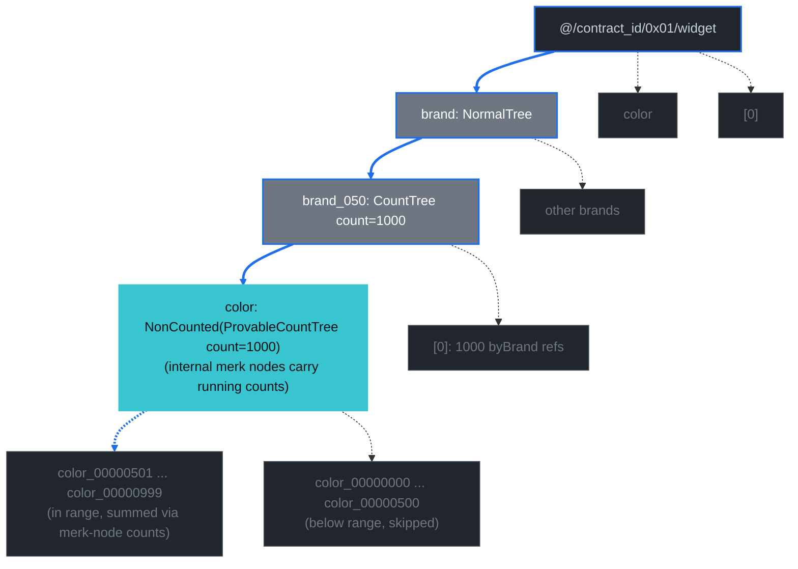
```mermaid
flowchart TB
  WD["@/contract_id/0x01/widget"]:::tree
  WD ==> BR["brand: NormalTree"]:::path
  BR ==> B050["brand_050: CountTree count=1000"]:::path
  B050 ==> B050_C["color: NonCounted(ProvableCountTree count=1000)<br/>(internal merk nodes carry running counts)"]:::target
  B050_C -.-> CGT["color_00000501 ... color_00000999<br/>(in range, summed via merk-node counts)"]:::faded
  B050_C -.-> CBelow["color_00000000 ... color_00000500<br/>(below range, skipped)"]:::faded
  B050 -.-> B050_0["[0]: 1000 byBrand refs"]:::faded
  BR -.-> Brands["other brands"]:::faded
  WD -.-> CO["color"]:::faded
  WD -.-> PK["[0]"]:::faded

  classDef tree fill:#21262d,color:#c9d1d9,stroke:#1f6feb,stroke-width:2px;
  classDef path fill:#6e7681,color:#fff,stroke:#1f6feb,stroke-width:2px;
  classDef faded fill:#21262d,color:#6e7681,stroke:#484f58;
  classDef target fill:#39c5cf,color:#0d1117,stroke:#39c5cf,stroke-width:3px;

  linkStyle 0 stroke:#1f6feb,stroke-width:3px;
  linkStyle 1 stroke:#1f6feb,stroke-width:3px;
  linkStyle 2 stroke:#1f6feb,stroke-width:3px;
  linkStyle 3 stroke:#1f6feb,stroke-width:3px;
```

### Diagram: per-layer merk-tree structure (Layer 5+)

Layers 5–7 are identical to Query 4 (widget → byBrand → `brand_050`'s value tree → `color` continuation). The difference from Query 4 is entirely at Layer 8: Query 4 resolved a single `color_X` element with a `KVValueHashFeatureTypeWithChildHash` op, whereas Query 8 walks the boundary with `HashWithCount` and `KVDigestCount` ops (the same shape as Query 7's L6, just one grove layer deeper).

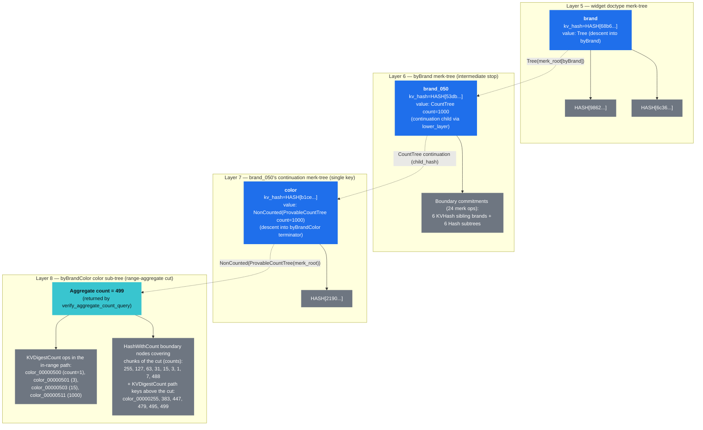
```mermaid
flowchart TB
  subgraph L5["Layer 5 — widget doctype merk-tree"]
    direction TB
    L5_q["<b>brand</b><br/>kv_hash=HASH[68b6...]<br/>value: Tree (descent into byBrand)"]:::queried
    L5_left["HASH[9862...]"]:::sibling
    L5_right["HASH[6c36...]"]:::sibling
    L5_q --> L5_left
    L5_q --> L5_right
  end

  subgraph L6["Layer 6 — byBrand merk-tree (intermediate stop)"]
    direction TB
    L6_q["<b>brand_050</b><br/>kv_hash=HASH[53db...]<br/>value: CountTree count=1000<br/>(continuation child via lower_layer)"]:::queried
    L6_boundary["Boundary commitments (24 merk ops):<br/>6 KVHash sibling brands + 6 Hash subtrees"]:::sibling
    L6_q --> L6_boundary
  end

  subgraph L7["Layer 7 — brand_050's continuation merk-tree (single key)"]
    direction TB
    L7_q["<b>color</b><br/>kv_hash=HASH[b1ce...]<br/>value: NonCounted(ProvableCountTree count=1000)<br/>(descent into byBrandColor terminator)"]:::queried
    L7_left["HASH[2190...]"]:::sibling
    L7_q --> L7_left
  end

  subgraph L8["Layer 8 — byBrandColor color sub-tree (range-aggregate cut)"]
    direction TB
    L8_result["<b>Aggregate count = 499</b><br/>(returned by verify_aggregate_count_query)"]:::target
    L8_inrange["KVDigestCount ops in the in-range path:<br/>color_00000500 (count=1), color_00000501 (3),<br/>color_00000503 (15), color_00000511 (1000)"]:::sibling
    L8_boundary["HashWithCount boundary nodes covering<br/>chunks of the cut (counts):<br/>255, 127, 63, 31, 15, 3, 1, 7, 488<br/>+ KVDigestCount path keys above the cut:<br/>color_00000255, 383, 447, 479, 495, 499"]:::sibling
    L8_result --> L8_inrange
    L8_result --> L8_boundary
  end

  L5_q -. "Tree(merk_root[byBrand])" .-> L6_q
  L6_q -. "CountTree continuation (child_hash)" .-> L7_q
  L7_q -. "NonCounted(ProvableCountTree(merk_root))" .-> L8_result

  classDef queried fill:#1f6feb,color:#fff,stroke:#1f6feb,stroke-width:2px;
  classDef sibling fill:#6e7681,color:#fff,stroke:#6e7681;
  classDef target fill:#39c5cf,color:#0d1117,stroke:#39c5cf,stroke-width:3px;
```

Query 8 sits at the intersection of Query 4 (compound descent) and Query 7 (range-aggregate primitive). Its proof carries the descent overhead of both — the boundary commitments at L6 to position `brand_050`, plus the boundary commitments at L8 to position the color cut — explaining why it's the heaviest proof in the chapter despite verifying a smaller count (499) than Query 7 (49 900).

### Diagram: Layer 8 binary merk-tree (the range-aggregate cut)

The 37 merk ops at Layer 8 reconstruct the entire boundary path through `brand_050`'s color `ProvableCountTree`. Unlike every other query's bottom layer (which abstracts the binary tree into one "target + opaque siblings" box), the AggregateCountOnRange primitive forces the prover to reveal the structural shape of the in-range descent — so we can draw it literally.

Cyan = in-range contributions the verifier adds to the aggregate. Yellow-dashed = the boundary node `color_00000500`, named so the verifier can position the cut but excluded by the strict `>` operator. Gray = nodes/subtrees outside the range (boundary commitments needed to prove the rest of the tree's structure, but not summed).

The `count` field on each node is its **subtree count** (the node itself + all descendants in the binary merk tree), not just the named key's contribution. So `color_00000511` (the root) carries `count=1000` because every key in `brand_050`'s color subtree is a descendant — not because there are 1 000 of that one key.

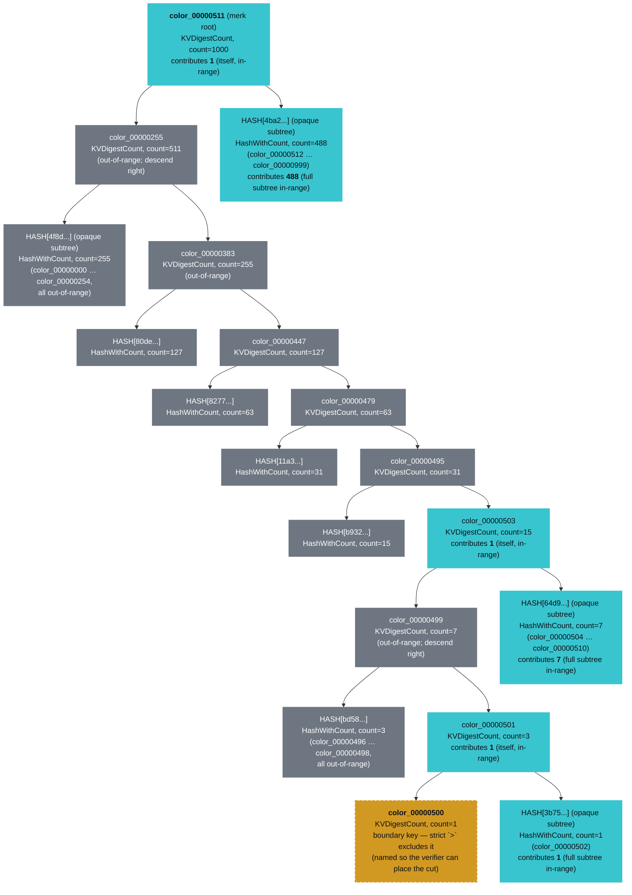
```mermaid
flowchart TB
  R["<b>color_00000511</b> (merk root)<br/>KVDigestCount, count=1000<br/>contributes <b>1</b> (itself, in-range)"]:::inrange
  R --> L1L["color_00000255<br/>KVDigestCount, count=511<br/>(out-of-range; descend right)"]:::outrange
  R --> L1R["HASH[4ba2...] (opaque subtree)<br/>HashWithCount, count=488<br/>(color_00000512 … color_00000999)<br/>contributes <b>488</b> (full subtree in-range)"]:::inrange

  L1L --> L2L["HASH[4f8d...] (opaque subtree)<br/>HashWithCount, count=255<br/>(color_00000000 … color_00000254,<br/>all out-of-range)"]:::outrange
  L1L --> L2R["color_00000383<br/>KVDigestCount, count=255<br/>(out-of-range)"]:::outrange

  L2R --> L3L["HASH[80de...]<br/>HashWithCount, count=127"]:::outrange
  L2R --> L3R["color_00000447<br/>KVDigestCount, count=127"]:::outrange

  L3R --> L4L["HASH[8277...]<br/>HashWithCount, count=63"]:::outrange
  L3R --> L4R["color_00000479<br/>KVDigestCount, count=63"]:::outrange

  L4R --> L5L["HASH[11a3...]<br/>HashWithCount, count=31"]:::outrange
  L4R --> L5R["color_00000495<br/>KVDigestCount, count=31"]:::outrange

  L5R --> L6L["HASH[b932...]<br/>HashWithCount, count=15"]:::outrange
  L5R --> L6R["color_00000503<br/>KVDigestCount, count=15<br/>contributes <b>1</b> (itself, in-range)"]:::inrange

  L6R --> L7L["color_00000499<br/>KVDigestCount, count=7<br/>(out-of-range; descend right)"]:::outrange
  L6R --> L7R["HASH[64d9...] (opaque subtree)<br/>HashWithCount, count=7<br/>(color_00000504 … color_00000510)<br/>contributes <b>7</b> (full subtree in-range)"]:::inrange

  L7L --> L8L["HASH[bd58...]<br/>HashWithCount, count=3<br/>(color_00000496 … color_00000498,<br/>all out-of-range)"]:::outrange
  L7L --> L8R["color_00000501<br/>KVDigestCount, count=3<br/>contributes <b>1</b> (itself, in-range)"]:::inrange

  L8R --> L9L["<b>color_00000500</b><br/>KVDigestCount, count=1<br/>boundary key — strict `&gt;` excludes it<br/>(named so the verifier can place the cut)"]:::boundary
  L8R --> L9R["HASH[3b75...] (opaque subtree)<br/>HashWithCount, count=1<br/>(color_00000502)<br/>contributes <b>1</b> (full subtree in-range)"]:::inrange

  classDef inrange fill:#39c5cf,color:#0d1117,stroke:#39c5cf,stroke-width:2px;
  classDef outrange fill:#6e7681,color:#fff,stroke:#6e7681;
  classDef boundary fill:#d29922,color:#0d1117,stroke:#d29922,stroke-width:2px,stroke-dasharray: 6 3;
```

The verifier's aggregation walks this tree and sums the cyan nodes' contributions: `1 (color_00000511) + 488 (H_4ba2) + 1 (color_00000503) + 7 (H_64d9) + 1 (color_00000501) + 1 (H_3b75) = 499`. Notice the asymmetry — the proof reveals a long boundary-descent path down the *left* of the tree (through KD_255 → KD_383 → KD_447 → KD_479 → KD_495 → KD_499) just to position the cut, even though none of those nodes contribute to the count. That's the structural floor for AggregateCountOnRange: the prover must commit one merk-binary-tree-depth's worth of boundary nodes per side of the range, regardless of how many keys actually fall inside it.

For a worst-case range (`color > color_00000000`, i.e. essentially the full tree), the boundary descent collapses to one node and `H_4ba2`-like fully-in-range subtree commitments dominate. For a narrow range like this one (cutting deep into the tree), the descent path costs more than the in-range commitments. Either way the total is `O(log C')` boundary nodes — Query 8 just happens to land at the unfavourable end of the constant factor.

The same in-order traversal also explains the keys' positions: a balanced merk binary tree over the 1 000 sorted color keys puts `color_00000511` at the root (the ~midpoint by tree-depth, not by sort order — `color_00000511` happens to land here because of grovedb-merk's AVL rotation rules on the insertion order), `color_00000255` and `color_00000383` (along with their descendants `color_00000447 / 479 / 495 / 499`) at progressive left-of-cut descents, and `color_00000503` at the right child of `color_00000495` (which is itself the right child of the descent path). The keys are sorted by in-order traversal, not by tree position, so don't expect them to look orderly in the diagram above.

## Worked Example: How `node_hash_with_count` Rebuilds the Merk Root

This section uses Query 8's Layer 8 to make one thing concrete: **what the verifier actually computes when it folds the proof's `Push` / `Parent` / `Child` ops up to the merk root.** It's the same machinery underpinning every other query in the chapter — Q8 just exposes the most interesting node-hash variant (`node_hash_with_count`, used by `ProvableCountTree`).

All hashes are **Blake3-256**. The hash primitives live at [`merk/src/tree/hash.rs`](https://github.com/dashpay/grovedb/blob/master/merk/src/tree/hash.rs) in grovedb. Six functions compose every node-hash in the chapter:

```text
value_hash(v)                = Blake3( varint_len(v) || v )
kv_hash(k, v)                = Blake3( varint_len(k) || k || value_hash(v) )
kv_digest_to_kv_hash(k, vh)  = Blake3( varint_len(k) || k || vh )
combine_hash(h1, h2)         = Blake3( h1 || h2 )
node_hash(kv_h, l, r)        = Blake3( kv_h || l || r )
node_hash_with_count(kv_h, l, r, c)
                             = Blake3( kv_h || l || r || c.to_be_bytes() )
```

(`varint_len` is `integer_encoding::VarInt::encode_var` — the same unsigned-varint encoding used throughout grovedb. `c.to_be_bytes()` is the 8-byte big-endian encoding of the `u64` count.)

Each proof op carries enough information to compute its subtree's `node_hash`. The reconstruction rule per op variant (from [`merk/src/proofs/tree.rs`'s `compute_hash`](https://github.com/dashpay/grovedb/blob/master/merk/src/proofs/tree.rs)):

| Proof op | What's revealed | Subtree `node_hash` formula |
|----------|------------------|------------------------------|
| `Hash(h)` | the subtree hash directly | `h` (no recompute) |
| `KVHash(kv_h)` | the node's kv-hash only | `node_hash(kv_h, left_node_hash, right_node_hash)` |
| `KVHashCount(kv_h, c)` | kv-hash + node count | `node_hash_with_count(kv_h, left, right, c)` |
| `HashWithCount(kv_h, left, right, c)` | kv-hash + both children's node-hashes + count | `node_hash_with_count(kv_h, left, right, c)` *(no recursion — children are already pre-hashed)* |
| `KVValueHash(k, v, kv_h)` | full key+value + kv-hash | `node_hash(kv_h, left, right)` |
| `KVDigest(k, vh)` | key + value-hash | `node_hash(kv_digest_to_kv_hash(k, vh), left, right)` |
| `KVDigestCount(k, vh, c)` | key + value-hash + count | `node_hash_with_count(kv_digest_to_kv_hash(k, vh), left, right, c)` |
| `KVValueHashFeatureTypeWithChildHash(k, v, kv_h, feature, child_hash)` | key + value + kv-hash + feature type + opaque child-layer hash | combines `kv_h` with `child_hash` (via `combine_hash`), then `node_hash[_with_count]` depending on feature |

The `left` / `right` arguments are the children's reconstructed node-hashes (computed recursively from the stack as `Parent` / `Child` ops glue the subtrees together). For nodes at the leaf level of the proof's revealed structure, both children are `NULL_HASH` (32 zero bytes).

### The example: rebuilding `color_00000511`'s `node_hash` (Q8, Layer 8)

At the top of Layer 8's binary merk-tree, the proof has three ops that together produce the merk root hash for `brand_050`'s color `ProvableCountTree`:

```text
op 33:  Push(KVDigestCount(
            key   = "color_00000511",
            vh    = HASH[fb4d7e1e5013a3c804045c72bd920ff81985ee986e87c9373c7041b78953d12e],
            count = 1000))
op 34:  Parent     (links the running left-side subtree onto color_00000511 as its left child)
op 35:  Push(HashWithCount(
            kv_h  = HASH[4ba23a437c91a135eb087602db30021bbbeeba7416d4af9317c2b1a7762ab0a4],
            left  = HASH[cd9697f159ba87524f129190317680dd33f96cf5e8a444c9caaf264fe998746c],
            right = HASH[f4c9e984a836b6b3739392239b4e35c28c153dd513038a6da5294a4e327c07c0],
            count = 488))
op 36:  Child      (links the just-pushed HashWithCount as color_00000511's right child)
```

Call them `KD_511`, `HWC_4ba2`. By the time we reach op 33 the left-side stack already holds `node_hash_left` — the recursively-computed node-hash of the whole left subtree rooted at `color_00000255` (255 + 1 + 255 = 511 keys, including the boundary-descent path). We'll trust that value here; it's the output of folding ops 0–32 with the same machinery applied recursively.

**Step 1: Compute the right child's `node_hash` directly from `HWC_4ba2`.**

Because `HashWithCount` already carries the children's node-hashes (`cd96...` and `f4c9...`) and the node's own kv-hash (`4ba2...`) and count (`488`), no recursion is needed — the verifier just plugs the four values into `node_hash_with_count`:

```text
node_hash_right
  = node_hash_with_count(kv_h=4ba2..., left=cd96..., right=f4c9..., count=488)
  = Blake3( 4ba23a437c91a135eb087602db30021bbbeeba7416d4af9317c2b1a7762ab0a4
         || cd9697f159ba87524f129190317680dd33f96cf5e8a444c9caaf264fe998746c
         || f4c9e984a836b6b3739392239b4e35c28c153dd513038a6da5294a4e327c07c0
         || 0x00000000000001E0 )                          // 488 as big-endian u64
```

That's a single Blake3 call over `32 + 32 + 32 + 8 = 104 bytes`.

**Step 2: Compute `color_00000511`'s kv-hash from its `KVDigestCount` op.**

The proof reveals the key (`"color_00000511"`, 14 bytes ASCII) and the value-hash (`fb4d...`, 32 bytes). `kv_digest_to_kv_hash` folds them into the node's kv-hash:

```text
kv_h_511
  = kv_digest_to_kv_hash(key="color_00000511", value_hash=fb4d...)
  = Blake3( varint_len(14)                                // = 0x0E (one byte)
         || "color_00000511"                              // 14 ASCII bytes
         || fb4d7e1e5013a3c804045c72bd920ff81985ee986e87c9373c7041b78953d12e )
```

That's one Blake3 call over `1 + 14 + 32 = 47 bytes`.

**Step 3: Compute `color_00000511`'s `node_hash` by folding the kv-hash with both children's node-hashes plus the running count.**

```text
node_hash_511
  = node_hash_with_count(
        kv_h  = kv_h_511,                                  // from Step 2
        left  = node_hash_left,                            // from ops 0..32 (the descent path)
        right = node_hash_right,                           // from Step 1
        count = 1000)
  = Blake3( kv_h_511 || node_hash_left || node_hash_right || 0x00000000000003E8 )
                                                          // 1000 as big-endian u64
```

Another single Blake3 call over `32 + 32 + 32 + 8 = 104 bytes`.

**Step 4: That's it.** `node_hash_511` is the merk root of Layer 8 — the byBrandColor `color` subtree for `brand_050`. The verifier then checks this against what Layer 7 claimed Layer 8's merk root would be (the `NonCounted(ProvableCountTree(...))` value stored against the key `"color"` inside `brand_050`'s value tree), and so on up the GroveDB layer stack until Layer 1 lands the entire chapter's `root_hash = 0x62ee7348f4d28dd9d7cf86a6c725fa8276cfd446f6007a6000fb0e1dfefa6468`.

### Why the count is part of the hash

The crucial structural feature is the `|| count.to_be_bytes()` tail in `node_hash_with_count`. **Without it, the proof's running counts would be unsigned hints the verifier couldn't trust** — a malicious prover could ship a `KVDigestCount(color_00000511, fb4d..., 9_999_999_999)` and there'd be no way to detect the lie without re-counting the documents (which is exactly what count proofs are supposed to avoid).

Binding the count into the merk root via `node_hash_with_count` is what lets `AggregateCountOnRange` skip enumeration: the verifier reads the count off the boundary commitments and trusts it because changing the count would change the merk root, which is consensus-committed.

Concretely, that's why every `ProvableCountTree`-derived op (`KVHashCount`, `KVDigestCount`, `HashWithCount`, `KVValueHashFeatureTypeWithChildHash` with feature `ProvableCountedMerkNode(_)`) routes through `node_hash_with_count` rather than the cheaper `node_hash` — see [`merk/src/proofs/tree.rs`'s `compute_hash`](https://github.com/dashpay/grovedb/blob/master/merk/src/proofs/tree.rs) and the `TreeFeatureType::ProvableCountedMerkNode` branch in particular. `NormalTree` nodes (e.g. byBrand) use plain `node_hash` — their kv-hash + child hashes don't commit a count, which is why `byBrand` can't answer `AggregateCountOnRange` queries even though it's `countable: "countable"`.

### One last simplification

For nodes whose proof op already carries the kv-hash (the kvh-prefixed ops — `KVHashCount`, `HashWithCount`, `KVHash`), the verifier skips Step 2 entirely. For nodes whose proof op carries only the key and value-hash (`KVDigest`, `KVDigestCount`), the verifier folds them via `kv_digest_to_kv_hash` first (one extra Blake3 call). For nodes with `KVValueHash` (full key+value), the verifier recomputes the kv-hash all the way from scratch via `kv_hash`, which means it also re-hashes the value through `value_hash`. The choice is driven by **how much of the node the proof needs to reveal**:

- A node on the descent path that the verifier doesn't need to materialize → emit `Hash(node_hash)` (1 hash, opaque).
- A node whose existence the verifier must prove but whose value can stay opaque → emit `KVHash(kv_h)` or `KVHashCount(kv_h, c)` (kv-hash committed, value hidden).
- A boundary node whose key the verifier needs to compare against the range → emit `KVDigest(k, vh)` or `KVDigestCount(k, vh, c)` (key revealed, value still digested).
- A target whose full value the verifier must read → emit `KVValueHash(k, v, kv_h)` or the feature-typed variant.

The user-facing trade-off is proof bytes vs information revealed. The verifier's reconstruction logic is uniform: every op feeds the same node-hash formula one variant or another.

## At-a-Glance Comparison

| # | Query                                | Primitive                 | Verified shape           | Proof size |
|---|--------------------------------------|---------------------------|--------------------------|------------|
| 1 | `(empty)`                            | primary-key CountTree     | 1 CountTree, count=100000| 585 B      |
| 2 | `brand == X`                         | PointLookupProof / byBrand| 1 CountTree, count=1000  | 1 041 B    |
| 3 | `color == X`                         | PointLookupProof / byColor| 1 CountTree, count=100   | 1 327 B    |
| 4 | `brand == X AND color == Y`          | PointLookupProof / byBrandColor | 1 CountTree, count=1 | 1 911 B    |
| 5 | `brand IN [b0, b1]`                  | PointLookupProof / byBrand| 2 CountTrees, sum=2000   | 1 102 B    |
| 6 | `color IN [c0, c1]`                  | PointLookupProof / byColor| 2 CountTrees, sum=200    | 1 381 B    |
| 7 | `color > floor`                      | AggregateCountOnRange / byColor | u64=49900           | 2 072 B    |
| 8 | `brand == X AND color > floor`       | AggregateCountOnRange / byBrandColor | u64=499         | 2 656 B    |

Four takeaways:

- **Query 1 is the cheapest.** A doctype-level total count is one merk read; everything else descends through an index tree.
- **Query 2 and Query 6 are structurally identical** despite covering different indexes (`byBrand` countable-only, `byColor` rangeCountable). The value-tree-direct shape is uniform across countability tiers — `rangeCountable: true` only matters for Queries 7 and 8.
- **Queries 7 and 8 use a fundamentally different verifier** (`verify_aggregate_count_query` vs `verify_query`). Queries 1–6 return an element list and read `count_value_or_default` per branch; Queries 7 and 8 return a pre-summed `u64`. Query 8 is just Query 7 one grove layer deeper — same primitive, applied to byBrandColor's terminator rather than byColor's.
- **Query 8 is the most expensive.** It pays for both the compound descent (Query 4's 4-extra-layer cost) *and* the range-aggregate boundary (Query 7's primitive). The verified count is far smaller than Query 7 (499 vs 49 900), but the proof bytes are 28 % larger because the merk-tree boundary at L8 has roughly the same shape regardless of how many keys the cut spans.

The path-query builder these examples decode lives at [`packages/rs-drive/src/query/drive_document_count_query/path_query.rs`](https://github.com/dashpay/platform/blob/v4.0-dev/packages/rs-drive/src/query/drive_document_count_query/path_query.rs); the verifier mirror sits in [`packages/rs-drive/src/verify/document_count/`](https://github.com/dashpay/platform/blob/v4.0-dev/packages/rs-drive/src/verify/document_count/). Both the prover and the verifier reconstruct the exact same `PathQuery` via the shared builder — touching one without the other is a Merkle-root mismatch waiting to happen, and the byte-identical contract is what makes the proof bytes here reproducible against the bench fixture.
