# Count Index Group By Examples

This chapter is the `GROUP BY` companion to [Count Index Examples](./count-index-examples.md). It uses the same `widget` contract, the same 100 000-row fixture, and the same bench at [`packages/rs-drive/benches/document_count_worst_case.rs`](https://github.com/dashpay/platform/blob/v3.1-dev/packages/rs-drive/benches/document_count_worst_case.rs). Read chapter 29 first — most of the mechanics (CountTree variants, the merk-proof reconstruction algorithm, `node_hash_with_count` and friends) carry over unchanged.

What's different here:

- Every query in chapter 29 returns either a single `u64` aggregate or a small list of `CountTree`s the caller sums. The verifier-side payload shape is **one count, total**.
- Every query in this chapter returns **one count per group**. The caller gets back a `Vec<(group_key, count)>` and can index it directly — no summation.

The most important thing to understand up front: **`group_by` is two things at once — a *result-shaping directive for the SDK* and (for some queries) a *proof-shaping directive for the prover*.** When you pass `group_by = [...]` in a count request, you're always telling the SDK "don't collapse the result into a single number — give me one count per group key." That result-shaping role is universal: it's what turns `Aggregate(sum)` into `Entries([(key, count), …])`.

Whether `group_by` *also* changes the proof bytes depends on the query shape. For queries where the underlying proof already commits one `CountTree` per matched key (single-property `IN`s, for instance), the per-group breakdown is reconstructible from the existing bytes — the prover ships the same proof, the SDK just zips it with the group keys instead of summing. For range queries and certain compound shapes, the per-group breakdown *can't* be reconstructed from the aggregate-style proof (which commits opaque subtree counts rather than per-key counts), so passing `group_by` forces the prover to emit a structurally different, larger proof.

The interesting question this chapter answers is: **which queries fall into which bucket, and why?**

## When `group_by` Changes the Proof (and When It Doesn't)

| Filter | `group_by` | Aggregate proof (no `group_by`) | Group-By proof | Proof bytes change? |
|---|---|---|---|---|
| `brand IN [b0, b1]` | `[brand]` | [Q5](./count-index-examples.md#query-5--in-on-bybrand) — 1 102 B | 1 102 B (2 entries) | **No** — byte-identical |
| `color IN [c0, c1]` | `[color]` | [Q6](./count-index-examples.md#query-6--in-on-bycolor-rangecountable) — 1 381 B | 1 381 B (2 entries) | **No** — byte-identical |
| `color > floor` | `[color]` | [Q7](./count-index-examples.md#query-7--range-query-aggregatecountonrange) — 2 072 B (1 `u64`) | 10 992 B (100 entries) | **Yes** — different primitive |
| `brand == X AND color > floor` | `[brand, color]` | [Q8](./count-index-examples.md#query-8--compound-equal-plus-range-bybrandcolor) — 2 656 B (1 `u64`) | *not allowed in this form* | — |

The key observation: `IN` clauses produce proofs that already commit one `CountTree` per resolved key, so adding `group_by` on the same property is purely a verifier-side relabel — the prover ships the same bytes, the verifier just returns them as `Entries(...)` instead of `Aggregate(sum)`. This is why **G1 and G2 below are not new proofs** — they're [Q5](./count-index-examples.md#query-5--in-on-bybrand) and [Q6](./count-index-examples.md#query-6--in-on-bycolor-rangecountable) reinterpreted.

So **why pass `group_by` at all if the proof bytes don't change?** Because without it, the SDK has no way to know you want the per-key breakdown. The same `brand IN ["brand_000", "brand_001"]` proof can answer two different questions:

- *"How many widgets total are made by brand_000 or brand_001?"* → caller passes no `group_by`, SDK returns `Aggregate(2 000)`.
- *"How many widgets per brand?"* → caller passes `group_by = [brand]`, SDK returns `Entries([("brand_000", 1 000), ("brand_001", 1 000)])`.

The bytes on the wire and the cryptographic guarantees are identical; the only thing that changes is which result shape the SDK delivers. Think of `group_by` as the count-query equivalent of `SELECT brand, COUNT(*) ... GROUP BY brand` versus `SELECT COUNT(*) ...` in SQL — same scan plan, different projection.

Range queries are different. `AggregateCountOnRange` (chapter 29's Q7) walks the boundary of the range over a `ProvableCountTree` and sums per-subtree counts directly — it never resolves individual keys. `GroupByRange` (this chapter) has to *enumerate* the distinct in-range keys to label each group, so it produces a different proof shape with one `CountTree` (or `CountTree`-feature-typed element) per distinct key in the range. That's where `group_by` genuinely earns its bytes — the prover has to do additional work because the per-group breakdown can't be reconstructed from `AggregateCountOnRange`'s opaque-subtree-count commitments.

## Queries in this Chapter

All proof-size and behaviour numbers below come from the same bench helper (`report_group_by_matrix`) as chapter 29's. The dispatcher's group_by surface validation lives in [`validate_count_query_groupby_against_index`](https://github.com/dashpay/platform/blob/v3.1-dev/packages/rs-drive/src/query/drive_document_count_query/validate.rs); the per-mode path-query builders sit in [`packages/rs-drive/src/query/drive_document_count_query/path_query.rs`](https://github.com/dashpay/platform/blob/v3.1-dev/packages/rs-drive/src/query/drive_document_count_query/path_query.rs)'s `group_by_*` family.

| # | Query | Filter + group_by | Complexity | Avg time | Proof size | Verified shape | Notes |
|---|-------|-------------------|------------|----------|------------|----------------|-------|
| G1 | [`In` on `byBrand`](#g1--in-on-bybrand-grouped-by-brand) | `brand IN ["brand_000", "brand_001"]` <br/> `group_by = [brand]` | O(k · log B) | 38.6 µs | 1 102 B | `Entries(2 groups, sum = 2 000)` | Byte-identical to [Q5](./count-index-examples.md#query-5--in-on-bybrand) |
| G2 | [`In` on `byColor`](#g2--in-on-bycolor-grouped-by-color) | `color IN ["color_00000000", "color_00000001"]` <br/> `group_by = [color]` | O(k · log C) | 62.1 µs | 1 381 B | `Entries(2 groups, sum = 200)` | Byte-identical to [Q6](./count-index-examples.md#query-6--in-on-bycolor-rangecountable) |
| G3 | [Compound `In` + Equal](#g3--compound-in--equal-grouped-by-brand) | `brand IN [...] AND color == Y` <br/> `group_by = [brand]` | O(k · (log B + log C')) | 106.2 µs | 2 842 B | `Entries(2 groups, sum = 2)` | New shape (per-In compound resolution) |
| G4 | [Range on `byColor`](#g4--range-on-bycolor-grouped-by-color) | `color > "color_00000500"` <br/> `group_by = [color]` | O(R · log C) | 762.9 µs | 10 992 B | `Entries(100 groups, sum = 10 000)` | **`GroupByRange` — new primitive** |
| G5 | [Compound `In` + Range](#g5--compound-in--range-grouped-by-brand-color) | `brand IN [...] AND color > floor` <br/> `group_by = [brand, color]` | O(k · R' · log C') | 737.5 µs | 11 554 B | `Entries(100 groups, sum = 100)` | New shape (compound In-fan-out × in-range distinct keys) |
| G6 | [High-fanout `In` on `byBrand`](#g6--high-fanout-in-on-bybrand) | `brand IN [100 values]` <br/> `group_by = [brand]` | O(k · log B) | 1 532 µs | 10 038 B | `Entries(100 groups, sum = 100 000)` | Scales linearly with `\|IN\|` |
| G7 | [Carrier `In` + Range (`byBrandColor`)](#g7--carrier-in--range-grouped-by-brand) | `brand IN [...] AND color > "color_00000500"` <br/> `group_by = [brand]` | O(k · (log B + log C')) | 255.9 µs | 4 332 B | `Entries(2 groups, sum = 998)` | **`RangeAggregateCarrierProof` — new mode (grovedb PR #663)** |

**Complexity variables.** `B` = distinct brands in the byBrand merk-tree (≈ 100); `C` = distinct colors in byColor (≈ 1 000); `C'` = distinct colors per brand in byBrandColor (≈ 1 000); `R` = distinct in-range values returned by `GroupByRange` (capped at 100 in this fixture by an implicit response-size limit); `R'` = distinct in-range values per fan-out branch (similarly capped); `k` = `|IN|`. As in [chapter 29](./count-index-examples.md#queries-in-this-chapter), the total document count `N` doesn't appear — count proofs read pre-committed `count_value`s rather than enumerating docs.

**Avg time** is the criterion-reported median of `cargo bench --bench document_count_worst_case -- 'document_count_worst_case/query_g'` on the same 100 000-row warmed fixture used by chapter 29's `query_N_*` cases. Each row reflects **10 samples × ~3 k–130 k iterations per sample** with 2 s warm-up and 5 s measurement; the median sits within ±2 % of the mean across reruns. G1 and G2 match their [Q5](./count-index-examples.md#query-5--in-on-bybrand) / [Q6](./count-index-examples.md#query-6--in-on-bycolor-rangecountable) counterparts to within ~3 µs — the residual is the SDK-side zip-vs-sum cost. G4 is ~11 × Q7 because `GroupByRange` enumerates 100 distinct in-range CountTrees rather than walking `O(log C)` boundary nodes; the time difference is exactly the complexity difference predicted (`O(R · log C)` vs `O(log C)`).

## Group-By Shapes That Are *Not* Allowed

Several plausible-looking `(where, group_by)` combinations are rejected by the dispatcher before any proof generation. The rejections fall into four buckets — operator/group_by mismatch, missing range window, no covering index, and one currently-deferred aggregate variant. All are surfaced as typed `QuerySyntaxError`s; the precise error strings appear in the bench's `[matrix]` output.

### 1. `group_by` field constrained by `==` instead of `In` or range

```text
where    = brand == "brand_050"
group_by = [brand]
```

> `count query supports only ...` (rejected because `==` produces exactly one entry whose key equals the where-clause's value — grouping by a field that already has a single value contributes no extra information).

**Why.** `GROUP BY [field]` is meaningful only when `field` can take multiple values in the result set. An `==` clause pins the field to exactly one value, so the group_by is structurally redundant — the dispatcher rejects it rather than silently returning a single-entry response that would look like a bug. Use [Q2](./count-index-examples.md#query-2--equal-on-a-single-property-bybrand) / [Q3](./count-index-examples.md#query-3--equal-on-a-rangecountable-property-bycolor) (no `group_by`) for single-value `==` queries.

Applies symmetrically: `where = color == X, group_by = [color]` is rejected for the same reason.

### 2. `group_by` contains a range field but the `where` clause doesn't range over it

```text
where    = brand IN[...] AND color == "color_00000500"
group_by = [brand, color]
```

> `GROUP BY on a range field requires a range where-clause; the range field must appear in `where` for the distinct walk to have a window to iterate over`

**Why.** `group_by = [in_field, range_field]` (`GroupByCompound`) routes through `distinct_count_path_query`, which needs a range window on the second field to know what values to enumerate. With `color == Y` the second dimension collapses to a single value, so the compound walk degenerates to a point lookup — and that's what [Q4](./count-index-examples.md#query-4--compound-equal-only-bybrandcolor) / [G3](#g3--compound-in--equal-grouped-by-brand) are for. For compound *plus* range, the `where` must carry a range on the second field (which is what [G5](#g5--compound-in--range-grouped-by-brand-color) does).

### 3. `group_by` orders fields in a way no covering index can serve

```text
where    = color IN[...] AND brand > "brand_050"
group_by = [color, brand]
```

> `where clause on non indexed property error: range count requires a `range_countable: true` index whose last property matches the range field`

**Why.** The covering index for `(group_by[0] = color, group_by[1] = brand)` would need to be `byColorBrand` with `rangeCountable: true` on the `brand` terminator. The widget contract doesn't have that index — only `byBrand`, `byColor`, and `byBrandColor`. The dispatcher's index picker walks every declared index, finds none whose `(properties, last_property_is_range_countable)` shape matches the request, and rejects with the "non-indexed property" error.

The fix is contract-level: declare a `byColorBrand` index with `rangeCountable: true` if the application needs this group_by order. The dispatcher itself can't infer alternate index orders from the request alone — `rangeCountable: true` is an explicit opt-in on each index because it changes the on-disk tree shape (NormalTree → ProvableCountTree on the property-name subtree).

---

To put these three buckets in one place: every rejected `(where, group_by)` shape on this contract reduces to one of:

- the `group_by` field's `where` operator doesn't admit multiple values (bucket 1),
- the `group_by` has a range slot that the `where` doesn't fill with a range (bucket 2),
- there's no covering `rangeCountable` index in property order (bucket 3).

All three checks happen at request validation, before any GroveDB work. The bench's `report_group_by_matrix` exercises one example of each and prints the exact error string, so adding a new contract or index shape is a quick way to see which checks each new query shape hits.

> **Historical note.** A fourth bucket — `group_by = [in_field]` with `where = in_field IN[...] AND range_field > floor` — was rejected before [grovedb PR #663](https://github.com/dashpay/grovedb/pull/663). That PR added support for `AggregateCountOnRange` as a *carrier* subquery under outer `Keys`, which unblocked the natural single-field-group_by shape (one aggregate count per In branch) at the merk layer. The dispatcher now routes that shape to [`DocumentCountMode::RangeAggregateCarrierProof`]; the worked-out example is [G7](#g7--carrier-in--range-grouped-by-brand) below.

## G1 — `In` on `byBrand`, Grouped By `brand`

```text
select   = COUNT
where    = brand IN ["brand_000", "brand_001"]
group_by = [brand]
prove    = true
```

**Path query** (identical to [Q5](./count-index-examples.md#query-5--in-on-bybrand)):

```text
path:         ["@", contract_id, 0x01, "widget", "brand"]
query items:  [Key("brand_000"), Key("brand_001")]
```

**Verified payload** (the only thing that differs from Q5):

```text
Entries([
  ("brand_000", CountTree { count_value_or_default: 1000 }),
  ("brand_001", CountTree { count_value_or_default: 1000 }),
])
```

The SDK zips the In values with the two resolved `CountTree` elements (in lex-asc order) rather than summing them as Q5's `CountMode::Aggregate` does.

**Proof size:** 1 102 B. **Proof bytes are byte-identical to [Q5](./count-index-examples.md#query-5--in-on-bybrand)** — same path query, same merk ops, same hash composition. The dispatcher recognises that `CountMode::GroupByIn` on a single-property `In` clause resolves through the same `point_lookup_count_path_query` as `CountMode::Aggregate` does; only the response-shaping at the very end differs.

For the **verbatim proof display**, see [Q5 in chapter 29](./count-index-examples.md#query-5--in-on-bybrand) — every byte of the 1 102-byte proof is the same. Or [▶ open the proof interactively in the visualizer ↗](https://dashpay.github.io/grovedb-proof-visualizer-widget/#f=text&d=H4sIAAdCBmoC_6VXXW9ctxF996_YRxvQA2f4MRwDLfJRtAGSFgEauA-BEHDIYWxUsIK1nA8U_u89d7WSLe-udTcmpNW95NXd4Zkzcw7_sb3-1f_21ffb6-v5gjb_e7LZfNf-8O1uYne72fyyXD_f_NO3_326m9hswvPN92_fvHz6TVs-vvz3Nz_aYKXJWjVOK7OMwoFCFUmlNyzERlLHCNUpYspKJxZXah4LR4uXz57t3037d3_74kW7euu7r_jiYvPD1v1p8sFcOElmFW5TZZpQs5lCEePoBWGUVqgFnjEbB62VdA6POrjqs4vNLtrUcuPajSwFvLC15dkZRg4sRcakyKXamKlILSzD8AY8lrO0PqZ8EC0j2rb11zf7-3iADGlXTgDGk8SmARikyiIjGGG6916HxdGrhG6dYnCROOMQ9Zaxu_fflZ5vvn756mrc3l9d_-bbn66WbL15vk_VZvPF5i9_vb85kszbcSSlDxP7Ifjh98-FfZ-9QHf4Z9Pg5JrZxH1qiL3rMB6K__QYU4syxUPtbXjmXoy9RXyf5WIlZWDy7IO4j0Ox39FnR_8Q0U_i-gi6p4onqQspBUQoHDX7EO4zRFeJWsWHF0-aMgDJkiYIggfyTN3Fwcd6-QCNu0FHcxlonw2RogUEL3jlfV6GtjDbqA0M5FzCrF41h05eU5PpzVozJhO1Ljy9J3A5Ja4pOfs8Hsh9jRwufipzd_kLdCwDK_KwKhunef_bq_Gz3-zRQhfgQsXLPVal55BnjpPdUK4eYuidW2-pxJEssTa3yKEpALXaHB0FuIXYmM1K_YjD56FyO24jPI3OaozOQOoUhxWNsmoyKi2Ion3WOfosKL5u3H2p415RbakktdlLx2_CY0UtuA69PInGp_hs2_Z6HKQozxhiifE-VdWKymiqo3iT0Gp0SySaRm9iLWqsaMdN67S5ZK0PUF4tWh5hTn48to9l4NQ4lIfSYxFW12jUIkEaJ8rOuYJWBZQKjphTHhYqOmPJRCAaQz-1oxhreTy2h7Jxaqzl3O3Y4f4Y8c6k39kkPFm6f_d283brP_zxi__n1c3L3e7f0-WnEMLF5uvrt69vbnkT4Vd6mcIXG9qtzav2M0D4EZfLz-UdjxRkWLyNtgilItKslYkrRLuIcIJCDRaTLDA1oczYawpBS3F4iyh2ebH5qr151ZfN_et6-P61YFqutcaelB2GqRYaRl7aWBRB4VWU4BJiDG1mSBk6bi3DFLU0SpX8OAVOFtCjSNGfQyrVBNtH05L3OhPkwmlKbTup9wCxh4yB3pkAlk4LBMXjLNiQacl8AqlgkzhwhCwBcVjIYRDBTrlGOAfod40VNrMsPqJLIS1LJlQlB0AsuhapteV8qqjhW4KOBlMXuIlPiEOOiDS1oUqwmlD7GdEjBelbzI5ltMcAVsERjmZr47wr7VUP5_v0vw_UF09k6IZeCf045s46BRhLGi1P6Rq4ZCf2AVGbuU1a-B-CwxTopLWBlrMAlQNAc5gRrngEGt4qHLXCQauUNOas3OFFQjCUD_Yxc8ezTItvzxFnC3TUuTbOeg6gegTQDpYvwKCZA8VkMK4pSkUzgI1lgrelqAxrmSBQFXaObdBsybpTH11W13I4C1GiQ9PZ6uhUS1MIc08IN_O0jNbTU0A3k4mm5JYNLEbQXbEFsKPiILNsoayOlM_BlOIRUAf45jCqEbDhFDVSCQHJViP4rhEjSBCK-lB0yRoT7AZccYGlz3OgA69mKaXzQM0HoMqkQYIWFnGctJFSGK3PDPdMgTO8Mk54oxL0HOWfoeQE-FvG7qh77XV1pOUsUOUIqNFHqvhq1DwUC1ISWVMVuDGcjWqrNKRn8x5z7VESzijwJkNz8WgGuFeHWs8DVQ9A9YYj4uw5hhTQ6FHRkSkFTZQApTE0Bc0fqgmhSU0ZesnMQJelTdjM1V0_nAMq0xFQJ05VMJY4sQmMKGmSAPdWY-uUmqHTDiuthVQIqgVvnKFkeaB5CaEftNV9is9TKD6UKIuzd2uiiANXGWdNmJu2WN9MzOgNkjOOxk5JzGfRxR-XSlyAuOn6SNfZz2W8e_I5659aPb12auX4_LHZw7mPZx7ef3j3_vru6vbv8vnuybsn_wczPWgtnxMAAA) (same encoded payload). The diagrams below show the result-shaping difference.

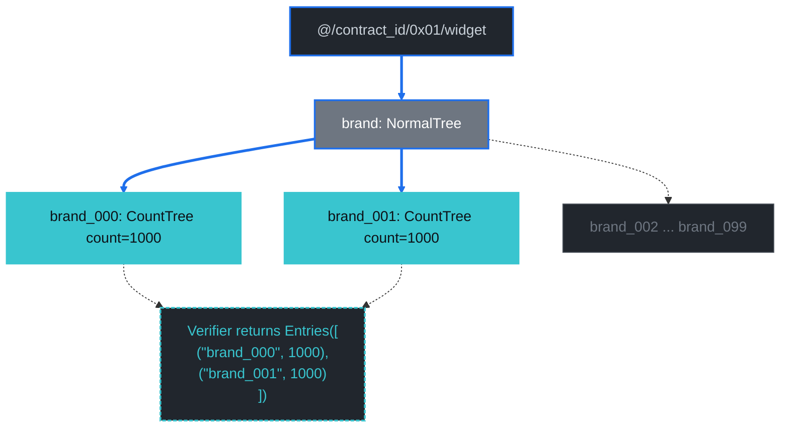

### Diagram: per-layer merk-tree structure (Layer 5+)

Identical to [Q5's Layer-5+ diagram](./count-index-examples.md#query-5--in-on-bybrand) — same merk ops, same byBrand binary tree, same two `KVValueHashFeatureTypeWithChildHash` targets. The only difference is what the verifier returns at the end (`Entries(...)` instead of `Aggregate(2000)`); the per-layer structure is unchanged. See chapter 29 for the diagram.

## G2 — `In` on `byColor`, Grouped By `color`

```text
select   = COUNT
where    = color IN ["color_00000000", "color_00000001"]
group_by = [color]
prove    = true
```

**Path query** (identical to [Q6](./count-index-examples.md#query-6--in-on-bycolor-rangecountable)):

```text
path:         ["@", contract_id, 0x01, "widget", "color"]
query items:  [Key("color_00000000"), Key("color_00000001")]
```

**Verified payload:**

```text
Entries([
  ("color_00000000", CountTree { count_value_or_default: 100 }),
  ("color_00000001", CountTree { count_value_or_default: 100 }),
])
```

**Proof size:** 1 381 B. **Byte-identical to [Q6](./count-index-examples.md#query-6--in-on-bycolor-rangecountable)** — same path query, same `ProvableCountTree`-style boundary commitments (`KVHashCount` ops carry running counts even though the SDK doesn't read them for this point lookup). The single difference from G1 is the underlying property-name tree type (`ProvableCountTree` for byColor vs `NormalTree` for byBrand); that affects the merk-boundary commitments but not the dispatcher's GroupByIn-vs-Aggregate routing.

For the **verbatim proof display**, see [Q6 in chapter 29](./count-index-examples.md#query-6--in-on-bycolor-rangecountable) — or [▶ open it interactively in the visualizer ↗](https://dashpay.github.io/grovedb-proof-visualizer-widget/#f=text&d=H4sIAAdCBmoC_6VY244dxw1811ecRwnQQ5PsGwUkcOIgMZALDNhQHoyF0d0kLSELr7GW7BiB_z01e5W0e6Q50Eh7dOaimZ5isaq4f7u8-MX_8uevLy8u4iUd_vfkcPjH-M0vrw5c7R4OP23fXxz-6Zf_eXp14HBILw5fv_351dOvxvbxp2---m4aKwVrV4lZo1rlRKm3lusaOCGDWjdL3UlwaNZF3FxpuFSWKWfPnt3cm27u_feXL8f5W796xBfPD99euj_NbsyVcyusjUdoi9lozMiptsniFcuoo9JIHFImJ-2dNMxFjbs-e364Wm0eZXBfk2ZOuOEY27WRrCRutVmQcO3TItfWKzebuAMuK6WNZdHeWS1jtePSf3xzsy8PkCFdyhnAeG4yNAGD3Lk1S5NweK3VbYqt3tKaiyR5axJiTX0UvN39s_KLw5evXp_b9f75xa9--f35Vq2fX9yU6nD44vCHP97tPFLM6-2Rkr5f2HfBT__9XNhvqpfoFv8yNTm5Fp7NPTTJWmqTTfE_XSQPadE89TXMC6862YfgebPUWXMBJs_eWffjUNy80Wev_n1EP4rrJ9A91jxZvZFSwgobixa3xiuSuDbR3ty8etZcAEhpOUAQXFAiL28OPvaz99C43ejRWia6qUZrVSsIXnHLu7qYjhTD-gADudQU3buWtMh7Hi18zDEm02w6V-PwlcHlnLnn7Ozx-ELueuThyY9V7rZ-iR6rwI467KrGcd7_-tp-8Dc3aEEFuFL1eodVXSWVKBLsE-3qSdJaPNbIVSzPzDp8CqehAHT24VAU4JZkMM9Z-wccPg2V6-16hcfR2Y3RCUgd47BCKLvmSXWkppDPHraiovnW5OVbH6-Obss164xVF34yLqs6k6vp2VE0HvL5_qmD1b0Hpzq4CKxkVhs51ljRaxac86JclmnTWJbRaUVTjRQafbp8-qkfCvyxTR5h0Lo4v7h8fgD2v4x57l9evP3xzTWbBBa5amxdLOnuTxEStCelbbvlWdNS1YoWm63MCbqpraEw1LI0bfq5AjKmWmFataMlKTmnBlWDhtL69Cu-7yvHtr2kvN6uXv1TzDyRnyez9Ghv_9XHm7eX_u1vP_m_X795dfX29xX7Pt1szw_3Jdv2aPuI8_EDAPgOX7e_Z7d1Wl46QzqTjdmiMzeY-zSQbjRnyyWLqEexUdII9IcLjTWhFogbc9WzD4jitr3ivy7Mn9I9G8bmSIT4IjABLg76pJJrjDGgPR6U15QsSBZp9OpGRtVKWFVf6hKfZsNR89gHGp0GGvJXBlRRSQoiAXfqCpLbVLyHwXxkeCStG7XTEGM0eajSIpvITx8BTe5Bg3NyLrh3NbQQN5iYGkGTUTAutJypm2a1lFAJR9hgSBYhBgjxyrYXtL1acSwqbqVDeB5pmtQZtS2VVnvItDlstQXPR4WFqTBzQMEgqTPAKWRXXLt3nbcNv-vi8p7sXqF8vVr2BGAhqcMqQgkj6hN1BslEyqbKsxbqsmhLEyaeI6hBsxwRe6Y8UbuGGu1bcj0J2vYA2m4NKxGMHQgrXtcaZSH5wJt9EoNtK3tL8C_bsJYuSdFflkoSHhlE27nOfgq0egxaZIZm1TEO6JKcyoDqI5CtbSSJ7CtBVLTC2eYsJl1DBxDFINUVrjILoKWyG1tKJ4FL9ABdDHWEfAQFhDMRkpHxQs0jUp2OmWq2CcBR9lwG9ZKnbJMhvGuLSTO33arEp8BLcgzfpR01Z7gkRLg1HRFzCcIsXBYc1Yz3qLmBFoR0nBYmsxQVsr5FcUsGfIX245tPw7c8FIYehMeW3jGubI2VQNMuiFiGUarnVTVDPS1b1oaF46KGtqvS4T81r9341pPwbcfwxUQ7McCYTKhroP07hH51KrMrOr-WFFbIBfQtw3OKlgljdSbOfSzpwLfKfnz7afjqA3wZ-MI_Z0IYVU5eoMABNBPGRqjDAA8MwyB0ranlXqRiSh-QC6qtjLxbeDmdgi_TMXxhDi0VKANoGeglSFRU5ViU5vBkpo5YMbaZZU40IuazQOhmECM4j9j0gfeLL59mbPzQ2bpPbwJmOrLJln7hsAU8BXU3pwOXrQFQp6QGq5AoA4mlwuc7hlD13QCfZG181NsmB_K1ZKguAhrw3cwgSsXIi-kiq_RpqW0z8MBS6ep3C7n1Eb11bbwJBJf9Csyn2Rs_9DdDkCSsWpsQEToMC49tnJC1EBCKpMkZ77St2bc5w3LbVizIUwZO7Ab4JIPjow4ntWfJbSDjuBtSbcT2C4bldfg2C_WKvLwIaadGwQ7acbFUYpxaqWzhodB-CZbTLE4esbi-tDTIcAHIWKMKB0XfyGqYsyphSpuFMYhFWDPYX4ZtbGqM1crcDbCcZHFy3OKQWzwhTQPCDugUU_nGaOA8F6cSA-Iro61mVAJ9BxkrmSAKuWwYn93NoTvXfZrJyUOTo0ELyb4ipE9y8qmpw3xB44mU1tkaoiZWPFoVG-BH4MUQfygjvyNU7ka47pp3t-33J59z_mNnj587dubx448dfXjswyPv77-7d__99tv1v9vn709-f_J_sY4oiTEYAAA).

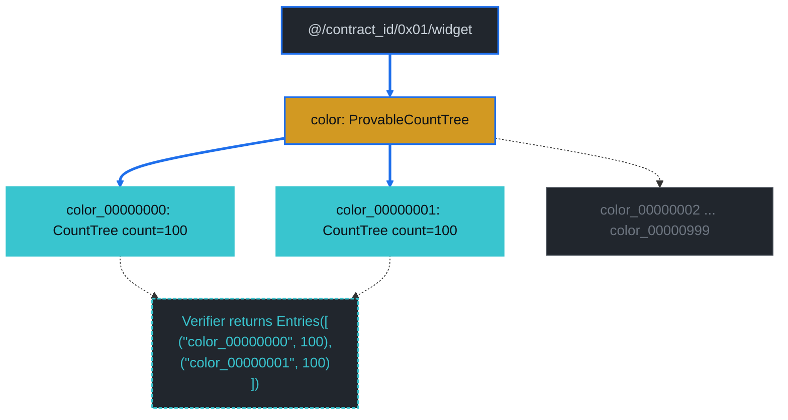

### Diagram: per-layer merk-tree structure (Layer 5+)

Identical to [Q6's Layer-5+ diagram](./count-index-examples.md#query-6--in-on-bycolor-rangecountable). The byColor `ProvableCountTree` at L6 carries the same `KVHashCount` running counts; the SDK ignores them for point-lookup group_by and reads only the two resolved targets' `count_value_or_default`.

## G3 — Compound `In` + Equal, Grouped By `brand`

```text
select   = COUNT
where    = brand IN ["brand_000", "brand_001"] AND color == "color_00000500"
group_by = [brand]
prove    = true
```

**Path query** (per-In compound resolution — outer Query on byBrand, inner subquery on byBrandColor's `color` terminator):

```text
path:               ["@", contract_id, 0x01, "widget", "brand"]
query items:        [Key("brand_000"), Key("brand_001")]
subquery_path:      ["color"]
subquery items:     [Key("color_00000500")]
```

**Verified payload:**

```text
Entries([
  ("brand_000", CountTree { count_value_or_default: 1 }),
  ("brand_001", CountTree { count_value_or_default: 1 }),
])
```

Each `(brand, "color_00000500")` pair has exactly 1 document in the bench's deterministic schedule.

**Proof size:** 2 842 B. **Mode:** `CountMode::GroupByIn` over the `byBrandColor` compound index.

**Proof display:**

<details>
<summary>Expand to see the structured proof (8 layers — two parallel brand-X → color → color_00000500 descents sharing L1–L6) — or <a href="https://dashpay.github.io/grovedb-proof-visualizer-widget/#f=text&d=H4sIAAdCBmoC_-1bW49cx41-96_oRxnQA8m6kQY2yGWRBNjdIEAC70MgBKwqVmys4AkmcrJB4P-er1qj60xrutsKIAduzUh9Od3NwyK_C-voV7c3f43__Plvb29u1pd8-Mdnh8N_-9_j9vjE8eHh8Od9_4vD_8Tt_z05PnE40BeH3377l6-e_Nr3Xz_73a__0KcYLzG1tHpddVYhJm0t1-F4ITk3nZM0OOGpXgdLC2OPVCX19Ozzz-8-m-8--7--_NKffxvHr_jp08PvbyOe5JgiVXIrYk18WVu9sfeVqbYuKSrCqF7ZSVYqXchU2daMZFPUPn96OEabvbjo6Nwz4QPd97GLZiFptc3FSar2uXJtWqXNjk_AYaU0H3O1t6IVROu38c2Lu8fpXmbYhklGYiK35EbIQVZpbVJnPD3G0NnTHNpo9MGJorW00mwWXnB2b74rf3H4xVdfP58vHz-_-Vvc_vH5Xq2_fHG3VIfDTw__8ZPXDx5YzJe3B5b03YV9O_n0_9837XerR_wq_6UbBYcV6S1iGaUxbHaZhndGStlTWy1Ih88oMmqX8ITv66X2mgty8vlbcT-cirsz-t7Rv5vRD-b1keyeap5s0diYEGGTZCVmk7EohbVk2mJGjWy5ICGl5YUCwQFl5REtUI_67J1svLrxg2tJfLcarVWrKPCKj3y9LtOclk91VKCUSktDrdDg0OxthXf3Ltyb9dFkxcio5ZxFcw6J9XAgr3vk_osfWrlX60f80AqcsQ5nrcbpuv_b1_NP8eIuW0ABqVyjvs5VHYXKKmlJdLRrUKIxxIfnmmbuWcyjJyE3JLSrBxAFeaPkIr1Xfa-GL8vKy9vLCE9n5-wcXZCpUzVsAEq13Lk6NQN86ppjVTTf6DJi9_FQdFuu2foadeA347BqncKmPTuZjQ_Vc7_1b-a9JSorUaopvV4q7dXadLNZwxu5puiZm-U5vHVPlhRw7Karr71qY6LkradeJq0lj8f2Pg2cut2nhzpSbWJhqbMnBjUutF2IoqwqSooCMecyOymQsRZmFJqAP22gGbU-Htu7tHHqdm7Nvbwd8_5Y4V1YfhcX4enWPYb3RyJ6evjFzbffvHhZHwm6ZNTV5OmBj6-t5_4nnOwfcHf_PHtVL4ZF3xrGPIGRmK2YCouCnGtrksFEU1pvpUG8UF1paCayWgMaIrX--Jo8UtEIna8LPWuG3uLVcwxdGTgdvJr6kWODwLLgD9RVYURvqxODaqQ0CLZutci5oZ9b8KfKHsxONh2yh8RbLMBnSSC07NOMIcbAhysBRZq2suVALwAQwnpAM00_O8Wviv-sg8vr9XgTaGzV0IEXoQzESmWIrcZCLU8vqw0jqSVYYgL2V_HFu3KIArRpi88NtF6U0HYvoYVWgm6cxDNcoTkNGtNazXMtlQG2JurZBOexysCxwlvZlgT1DcxZ58aplyTUHkjoQDnuxADukMXcIe1yaoo2gtAThvrjZALxlQHhCsEjffLy3EfwmKOd3Vx0UUaZ78sy1zlYqxuoa2SEW2T1wrOPTMCBtgowuZeOKkbQw3AKqA6F1N-nUM-OVC7JKacHkjpRbwEpl5A2-IyZKxEW2zpDmcyUUARULabBbWjKIGToxgrRW9YEdp1dpZwvS2q5l9S2eHID1iQYrj5zpuljFehLJilQk_BAUxmMh_Yv4DpG-r3g7HiEDj070npRUtsDSU0xs-Kr0fPA-lxnEsvaoFfgHtSVZxulx0hFR2oZKh7sPa3USL0j3WeHqpcl1e4lNRwmao2SKJNCzfSRhDNZ5oxUdgH4k0EsMBghu0nBrwiyK80XhNjZqE-XJFX4gaQu-A5IL3iaBqnGlhtB32jywdk7kHZ2-HHKlQPPxCywIGUCvBoDD_xsnJLLGEruU1RPa4zuzRAH7hW4McgC3-KwsAiwoZUC8xicW49VbSvIqiwVGe92fqTnCbRrZNpbYm2rofME21Wy7UrxdspNzEql5940KgzvbC01Dq8wUgnYlaJooMmszpZGngkkB_woUGBcUy56Nkmc1mHj5vnN7dPDb26-OcqwmE-QjL96fx4PybKj43j1p4AM-KRQe6XUUFIDCiHDfy9IICXNYEbre3qmbYAYXQzg41RlJTY47pQW5zmlw4nLZaf4AQ_-MUvt5e2Yu0uK7XuU3PcqvFPlt3JA2W0H5gE6B_ND0k2uDA-51arBtEGqDvKydUAGqSqBYb3CKKAoL1ub94twx3EssjupTAUeGWDN-NpAZSyFt-34Vl5wKI16kT1vWFqkDBjgNfZbtjRZkM_07OkBrvGKiC5D0A_r_Z4IvOkDAqoX0jHxT54xlphvyayzNmYQgo5wGPVaO2UP7hVN1mhek9F8KqMtMqxESM6gSYE1UoFsBn3rUqIJvMFiA1kUMnmVDjVKDWJ5lJJtLU_IqJRyRUTl6ozWexmVvhDmHg3W0bbiBAwmb0MLKN-EoZtoDBDWqL0OByhNLiSh3SYwi67JaDuZ0YnKd9aSx4ztPgIJGlP7HrVo0go_F9towJeusZBqIRzcrUB-WCvIKEu7IiK9OqP3VRQVKGW0GuSnQPDDzC_pCWXQos8GVTp2wdYsXHqpe55fFtoO_iAB9XVd1fV0su3roC3R6vRW4dwc8hPQAlZgJbj6KjVNgFNHs0sx8dzWoFnQ8R4WjpTWdE1EfHVKt5F5L6dDJloNTayoOtCZjkbLRXJKG8_cIQVHc6j7ZqtkgsLL22aj_yq5jqtymk7lNDkTEBrWuAT8sq1u2ldeAMvKfUALIzDYphUd8i7EE6QcVnk4A_S1IqfpGiS90DY9YqFQmyAeoPyekDgzgQtsqLQk2hbgNHiNlms72oBBde9mCLQTLEsr56v99-3UidbvTi6pWbUMUcwqMvNEHAHLAdgXAs5iOcFVQp4VnVT2RC32juEURU6vafyjY7sypXpf7_0y_MW3t_H7v_85_vfrF18d9fgbHbjFM4GC35kn7kd8ehJX4bPRlbDfWaZXkrRqwqfoJB6w3SsWXEMHue1Vayg2CVhgDpbOMXetvaM4Y25185ubGU9e76PBusOEUMrVC2-QpwEzXzxKjOGBRiLbU4lFE-GAF0ABg2GuIaUriOKqSrBTlYDvwfeVmiMcRMn7DGGaJ3xbFuGqQLCy5zg2QF7dx0QBAPxzdjTXGru7rpEpdHUlyP2hT4-kMjgtOlJ_tK1MzOuWAyjagAMxMvRclL2DAN_HcH44yqX1THFNSuWiAdD7tvXKd55URzQguxLkZcIJzaSUiYCHZaJg9tYW9wnpoeCihnqCDIaUUm0gwiRztbW5_BpxJNerI7kvj1YvUDtZCqwhvBNWCkJya4-EcvNVo3fYq5Yhi0DfrtNKAfqzl9550-c1Z9CuXg29-p127TsTXf1OvvqdV1d6OknqIBXgqi-HtfCaouD-jJKaum9CCkhTeKUG0plzLKg21UVSM1ZZ2LZQ2lb9ivVO19N6uk_rEJgdQM1QnDMH8KUwJBLOrABcIEQ6oYIRb4YJlMhQgWarwpTsPUzjfE3FpnrB7OnN7bvP_hXHnnvkecd9d9FsjH84szHI5FatA8JswvgbdF1JcCipDRvRU9bS09g7xXDVAecFrKba6oq8oY5_ALMx-HBN6Nixdy7I4XnKEZltogEKJO5oe1MIAsPAPehqCIhJJnBsXoLtx9nYv2421sDxfcCz5Vl9lhHRYDNShgBSGqOkIm0xJKgb1di-r2PBUl-lQdaaf9TZGKy6AS37HsKD7YGHUwi2xyF1V_E-s4-EIACqe1Q2wP0ZBlPw626zfRKzMYVugg0uiNkRtUASd42RrPWYxfYMZW-C5V5m4uymDtFSOhgsFNpzfNTZGBjTes3ex-yjIW2SSsNP0729mBJV14oEg56Ual9SIflbY0rbyZf8SczGYvnorFPSGKOO3GlmBJ60zUFFWKikXjtcKpwI_BnDNqWirBGxLx36qLOxTt0BUcUHQTdXZCol6FCp0rHOgDVSMD1KYHAg27AadSM3wRdZarN_ErOxyOID9ketlzFnRcomqg_s4s7AZUGkSQYEDCxpXnvzRkcFIiClDXLm487Gyr5kN9UKNgDJRDKFO_NplSWvpAnAlJotlTk1gxA7gS8GcgmsarnopzEba0WiotH3bA-Q5CpOY1dq7pzRdtRpie85ylreewXmjhELzmtfj7L0487GIJMJ6jOrTvUWc3WuQNayr3hGZs32pBlIm0u1GbkwTFWk1ja6Oil_GrOxuvK-YgtGbhi6Cg1FW_8TNecFGBDJ26vCw6LBVCtgzet2ragjuNz8cWdjSWUPj2FGFATVERtb8zU8oZda4aKlGJJaaW902IJ-qzVKDlmtZJN_19mYKk-WlHQJrMxAMtCcBUqRkhgaGs59UgUvJqVQBZhUQyahaIs1Ps4MH52NeRYhZ5ijOWHpF9BqJTNwAJgqz32R6hooDZQxQEy75op1UFq1pmVSPu5sTInV4FM1ZYLtFKiWBDEEei-t7ms8s-wNsASa4Cl1aLPore3ruNoCW30aszHf24_QAD0P6A4TS9Nj76FBdQP3uWLZdP8_CVaol71Rb151OfAiLeEf_mwM8nK7Eo-1BAoJJYyFixizaGtlT7k1-fShph1gvSTWaIoyxmpvvfFpzMb2xcYwTgTiMVirnlYfC3JZgZqQ6IEGTGtOQzmKOIi_aLgLQ0Hnmuv4cTb2Q5mNdagiOO5ZVlkTfG1wQamhOjmDZtTxM-GF8oCCByZ7W8CofTXmjDKhRz-V2RjMD4_huQBpKoO9FRYU0GgJUAndNKYNh0LZO7WLvOXWBR4KJjUgB2z-OBu7-KjHj3nsiA-__qFXT7926pWHn3_o2fvPvf_Mu4_ffvTm_qt7L__df3_32Xef_RM2G-h0TzkAAA">open interactively in the visualizer ↗</a></summary>

```text
GroveDBProofV1 {
  LayerProof {
    proof: Merk(
      0: Push(Hash(HASH[bd291f29893fb6f6d6201087746ca1f23a178dd08e1346cb6c127e91ae3623b3]))
      1: Push(KVValueHash(@, Tree(4ed22624752972af97fb71abf4067b23e6d296a61a02f35b2098819fde39d289), HASH[4a5a28cb1b40226aa35b2f0d502767df13268bdf4678627dbfde26a557acdf73]))
      2: Parent
      3: Push(Hash(HASH[19c924989e473a90d0848277d0b1498ccc8db3dc870cbc130e773f3d79ea5b71]))
      4: Child)
    lower_layers: {
      @ => {
        LayerProof {
          proof: Merk(
            0: Push(KVValueHash(0x4ed22624752972af97fb71abf4067b23e6d296a61a02f35b2098819fde39d289, Tree(01), HASH[5b90e1e952b7eef903cc9db2d9098e334a37f7e08cade52c6b2ea3bf4b56b645])))
          lower_layers: {
            0x4ed22624752972af97fb71abf4067b23e6d296a61a02f35b2098819fde39d289 => {
              LayerProof {
                proof: Merk(
                  0: Push(Hash(HASH[49e7191075272395ed72cf03e973987ede6e4945e08574fe77d725f4ce7ecdf8]))
                  1: Push(KVValueHash(0x01, Tree(776964676574), HASH[5d9a0fad8a3f32560f8e8950c1e84a7feabaab21b79bc72fec4482442844e2ef]))
                  2: Parent)
                lower_layers: {
                  0x01 => {
                    LayerProof {
                      proof: Merk(
                        0: Push(KVValueHash(widget, Tree(6272616e64), HASH[6c505f53f2ebf3de030cc2aca463d4b429aeb320a9fadb8ae68bb7903a22bb68])))
                      lower_layers: {
                        widget => {
                          LayerProof {
                            proof: Merk(
                              0: Push(Hash(HASH[9862894b16a0792688fdcf64edcb2ceade5c8b234649bfc6cfc6426869b0e9d9]))
                              1: Push(KVValueHash(brand, Tree(6272616e645f303633), HASH[68b697da99d6ea70a83eb41794dca7ba3938d0ba98fbfaeb3cd0c19b3b5d0ff2]))
                              2: Parent
                              3: Push(Hash(HASH[6c36729e93b1a316cbf60fe282eb630c0ed6e45db088e365110302b6c9caba86]))
                              4: Child)
                            lower_layers: {
                              brand => {
                                LayerProof {
                                  proof: Merk(
                                    0: Push(KVValueHash(brand_000, CountTree(636f6c6f72, 1000, flags: [0, 0, 0]), HASH[90ff6f6d9a3d901195982128130677243bfd27b75736206f3c8400966ef0d37b]))
                                    1: Push(KVValueHash(brand_001, CountTree(636f6c6f72, 1000, flags: [0, 0, 0]), HASH[484ca11fb4ec8f479be1f78af903ce0c9d4fe630517579fb0172c2576d6b9652]))
                                    2: Parent
                                    3: Push(Hash(HASH[8ca09dadc802a7efe03534ce4ad991b2f191f368878754a37b5e5c03d9498dab]))
                                    4: Child
                                    5: Push(KVHash(HASH[e5297b3ebe81c6435c29f712074da5f7c90265e12ed3d4f5af1f6d900e50c9f1]))
                                    6: Parent
                                    7: Push(Hash(HASH[50f373fd01dea89c992779764dff82cc7200b492be8f5cf3721627d5323bcbff]))
                                    8: Child
                                    9: Push(KVHash(HASH[cf78c9f1b1a1204bb2e437806f52c21e331392de3436388572bd1fa4bce1cdc7]))
                                    10: Parent
                                    11: Push(Hash(HASH[4a8dc186a95c8c4a1252fb51dbc407727f588eb5bdc8313c96f5c29889e13926]))
                                    12: Child
                                    13: Push(KVHash(HASH[d00ee7653e34e47d46004929b13ded33dff069ed9cc88342cecdf66a65fd8401]))
                                    14: Parent
                                    15: Push(Hash(HASH[7f1d17b9632f0bd440dacf5e841025482bc1d8145df3650301a95a5ee71ce8c8]))
                                    16: Child
                                    17: Push(KVHash(HASH[3ed48a5e35cb7546d329487b0e1ab8a81d7c5bec358c37449e6cbd956e3bb069]))
                                    18: Parent
                                    19: Push(Hash(HASH[eaef9fc530408393bc321409414814b290309a861f474a925a922250327affc6]))
                                    20: Child
                                    21: Push(KVHash(HASH[f776417ede76e6194706e483ac14ab7b3db6aa0461ec14ed5f8e5d20071363af]))
                                    22: Parent
                                    23: Push(Hash(HASH[b3fccba79c14fcc5e97ff6a3cd051228dc755e6de147bef690ba9681264b2b9f]))
                                    24: Child)
                                  lower_layers: {
                                    brand_000 => {
                                      LayerProof {
                                        proof: Merk(
                                          0: Push(Hash(HASH[d605b4b78e674fd77371ea6adb32ce3e58ee3b96d73c4d34df84159661634587]))
                                          1: Push(KVValueHash(color, NonCounted(ProvableCountTree(636f6c6f725f3030303030353131, 1000, flags: [0, 0, 0])), HASH[fccc0c94657f2a78084f789bb6f687c4bba295e3a062f3199bc33f14dd2b7fe2]))
                                          2: Parent)
                                        lower_layers: {
                                          color => {
                                            LayerProof {
                                              proof: Merk(
                                                ... 37 ops — same boundary shape as Q4 / Q8's L8,
                                                terminating at op 18 with
                                                Push(KVValueHashFeatureTypeWithChildHash(
                                                  color_00000500, CountTree(00, 1, ...),
                                                  HASH[6834...], ProvableCountedMerkNode(1),
                                                  HASH[840c...]))
                                                — TARGET 1
                                              )
                                            }
                                          }
                                        }
                                      }
                                    }
                                    brand_001 => {
                                      LayerProof {
                                        proof: Merk(
                                          0: Push(Hash(HASH[f54769bf6e9d24b9dba53ebd37c9ceb3485b3c6511f8de6f17860676fe4d9331]))
                                          1: Push(KVValueHash(color, NonCounted(ProvableCountTree(636f6c6f725f3030303030353131, 1000, flags: [0, 0, 0])), HASH[8f883171c33df0aba2541a5b9d6195faac7bd1ffef93e8ddcaf9d092f0fa5e19]))
                                          2: Parent)
                                        lower_layers: {
                                          color => {
                                            LayerProof {
                                              proof: Merk(
                                                ... 37 ops — same boundary shape as brand_000's
                                                color subtree, terminating at op 18 with
                                                Push(KVValueHashFeatureTypeWithChildHash(
                                                  color_00000500, CountTree(00, 1, ...),
                                                  HASH[881d...], ProvableCountedMerkNode(1),
                                                  HASH[a422...]))
                                                — TARGET 2
                                              )
                                            }
                                          }
                                        }
                                      }
                                    }
                                  }
                                }
                              }
                            }
                          }
                        }
                      }
                    }
                  }
                }
              }
            }
          }
        }
      }
    }
  }
}
```

The two parallel descents below `brand` are the structurally novel part — every other layer above `brand` is byte-identical to Q4. The byBrand layer (L6) inlines `brand_000` and `brand_001` as `KVValueHash` siblings (ops 0–2), then descends via the `lower_layers` map into each one's value-tree continuation. Each continuation (L7) carries a single `color` key whose value is `NonCounted(ProvableCountTree(…))` — the byBrandColor terminator. The terminator (L8) walks the boundary path through its in-color binary merk tree to land at `color_00000500` with `CountTree count=1` and a feature-typed child hash.

The bulk of the proof bytes (≈ 2 × 1 100 B = 2 200 B) is the doubled L7+L8 descent. The L1–L6 prefix amortises across both branches (≈ 600 B shared), giving 2 842 B total — significantly less than 2× Q4's 1 911 B because the upper layers aren't repeated.

</details>

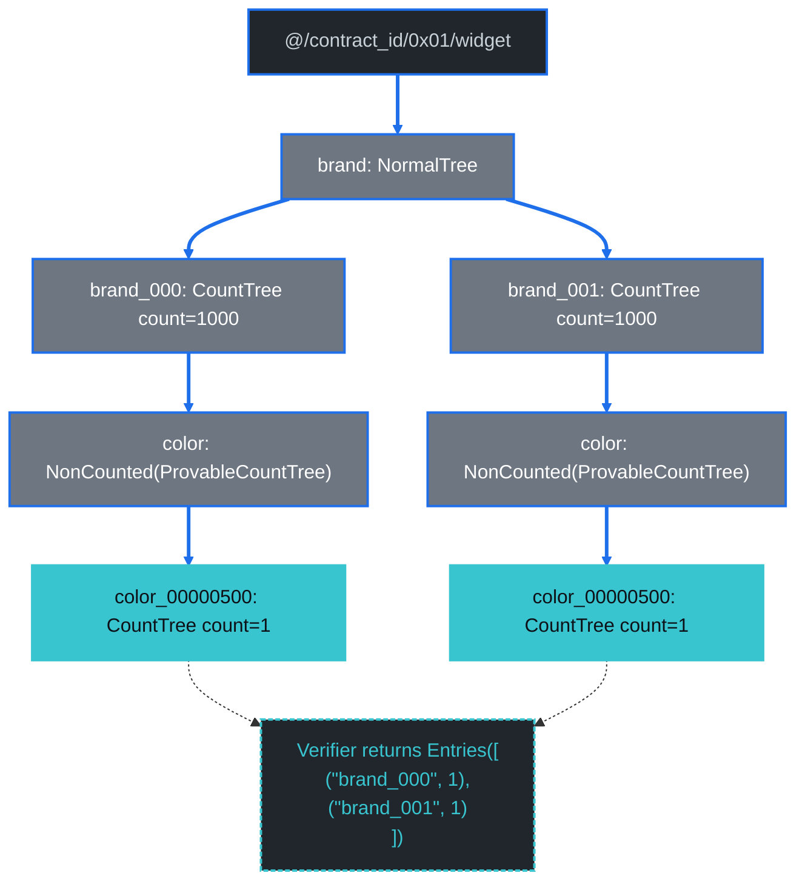

### Diagram: per-layer merk-tree structure (Layer 5+)

Layers 5–6 are like [Q4](./count-index-examples.md#query-4--compound-equal-only-bybrandcolor)'s L5 + Q5's L6 combined (one `KVValueHash` per In brand at byBrand's binary tree); Layers 7–8 fork — one `brand_000`-rooted continuation chain and one `brand_001`-rooted chain — each shaped exactly like Q4's L7 + L8 descent.

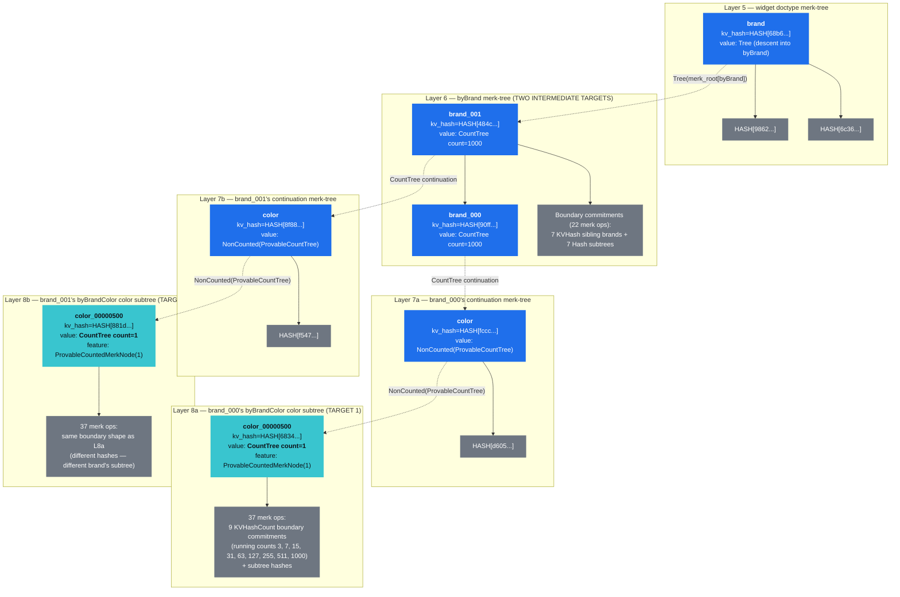

The two parallel byBrandColor descents share their L1–L6 commitments (the doctype prefix + byBrand merk root) but each gets its own L7 + L8 sub-proof. Proof bytes ≈ shared upper layers + 2 × per-brand byBrandColor descent ≈ 2 842 B.

## G4 — Range on `byColor`, Grouped By `color`

This is the **first query in either chapter that genuinely needs `GroupByRange`** — a new proof primitive distinct from chapter 29's `AggregateCountOnRange`.

```text
select   = COUNT
where    = color > "color_00000500"
group_by = [color]
prove    = true
```

**Path query** (uses `distinct_count_path_query` with `limit=100, left_to_right=true`):

```text
path:         ["@", contract_id, 0x01, "widget", "color"]
query items:  [RangeAfter("color_00000500"..)]
limit:        100
```

**Verified payload:**

```text
Entries(100 groups, sum = 10 000)
```

The 100 groups are color_00000501 through color_00000600 (the first 100 in-range colors in lex-asc order, capped by the limit). Each carries `count_value_or_default = 100` since the fixture's deterministic schedule gives each color exactly 100 documents.

Wait — but [Q7](./count-index-examples.md#query-7--range-query-aggregatecountonrange) said there are 499 distinct in-range colors and `sum = 49 900` over the same `color > "color_00000500"` predicate. So why does G4 see only 100 groups summing to 10 000? Because `GroupByRange`'s `distinct_count_path_query` applies the 100-entry response cap (`Some(limit)` in [`execute_distinct_count_with_proof`](https://github.com/dashpay/platform/blob/v3.1-dev/packages/rs-drive/src/query/drive_document_count_query/execute_range_count.rs)). Without that cap the proof would scale linearly with the full in-range distinct count (~5.5 KB for the full 499 colors at ~110 B per resolved CountTree branch). The cap is a response-size safety control — the verifier ceases the walk once it has 100 entries.

**Proof size:** 10 992 B — ~5.3 × [Q7](./count-index-examples.md#query-7--range-query-aggregatecountonrange). The structural reason:

- **Q7 (`AggregateCountOnRange`)** walks the *boundary* of the range and emits one `HashWithCount` or `KVDigestCount` per merk-binary-tree boundary node. Total boundary nodes ≈ `O(log C)` (≈ 36 ops on the 1 000-color tree). The verifier sums subtree counts directly without descending into individual keys.
- **G4 (`GroupByRange`)** walks the *distinct in-range colors themselves* — emitting one `KVValueHashFeatureTypeWithChildHash(color_X, CountTree count=100, ProvableCountedMerkNode(…), …)` per distinct color in the range, not just per merk-tree boundary node. Total ops ≈ `O(R)` where `R` is the distinct in-range colors (capped at 100 here).

The trade-off is exactly what you'd expect: `AggregateCountOnRange` is `O(log C)` in proof bytes but loses per-key resolution (returns one `u64`); `GroupByRange` is `O(R)` in proof bytes but preserves per-key counts.

**Proof display:**

<details>
<summary>Expand to see the structured proof (5 layers; bottom layer enumerates 100 distinct in-range colors as `KVValueHashFeatureTypeWithChildHash` targets, each carrying `CountTree count=100`) — or <a href="https://dashpay.github.io/grovedb-proof-visualizer-widget/#f=text&d=H4sIAAhCBmoC_6WdWc_dyXGf7_UpeCkBuui1qktAAic2EgNZYCCGcmEIRq-2EMFjjCU7RuDvnqcOZ-FohtS_j6kRyfd9D89SXf1buqur_-vXX_3z_ov__Fdff_XV-XX88P9-9uHDf-__ur9-feP15YcP_-h__9WH_7G__j8_f33jw4fwqw9_9Yd_-vuf_2X33_7T__rLvxkrWTzJmuUz5MiSFGJoqkVm5we5R21rhbZj5ltDZky6LfadJeWRf_OLX3zz3PGb5_5vv_51_90f9usl_uyXH_76671_XvZKSVLRmkxTP6ZnaOzjlCA6Ut7C25AusYd0ch0pWGvRztrZVmr2i19-eL3b0mtPbY44SuAJe_fHnrBqSCq6TsxJ2liniDZJugbPwMNq1T7X0U_ebeLd9q_3P_z-m6_zjyITbVoqBGYXzd0CMSgtqa4wIt-ec7Y18ppNwxwz5rBV88lLbffKp_v-tcqvPvz53__2d-vj17_76l_213_7Ox-tf_rVN0P14cOfffgP__G7L35iMD_--okh_eHAfhr88H__vWH_ZvRC_Db-dVjYcVtNQ_c-FvKctkZaxr_cOZee9egObfa1a5oy0u6Z1xtVhpRKTH7xyfv-6VB884n-3e_-hxH9Ylz_RHQ_N3mKbY0WA-9QU7a6l6Z5Qt6m2ZrutWUXK5WAVC2HBOEB9ZS5dZOP7Tc_iMa3v-JPjmWI34yGqpiQ4MJTfjcuy3o4fbVOBqYq4bTdrIYZdytdz-6j95HiUBtT09mzkMulpFbKTvv89Bv5bo78-IdfGrlvxy_EnxqBB-PwaDQ-n_f_8tv1d_v330QLFEgSZct3sZJZQz01n7QH03WHHOZMffYieZVRkvU9cgrdCOhofYMoxC3kntIY0v4oh--i8vHXx3f4-eg8jtFFpD6XwwZQNisjSg9qwGc7ax5h8s2R5vZ5PBuzrUixcaZM_l94mNgI25b95rPR-HE-f_-qPdne7aQgPdUMlQxZvZzZ52lSMj_b1VKdy9TOXIWZVi3ICcdOGzv_6Vf9Y4D_3K_8Exk0v_rdV1__8gOx_-c-frf__Ks__MPvP2ZThiKnHJ_FOXz3v5pjZnrG4L--zTO1Kraq1TW0jkG62ZrdINQ6LTh-zgOMmQmkJY0pGcNOQUE1MDTOP_0Rf8grn_v1NCk__np99D-VmZf5eZ2ln8tVUmO2XjPYOaMCc5BLAFdL6Ltp1SBmXSzx_Q0zDwGZPZQ9wcojpD8d0p_K2Nfwf3wDWVrJRbvo3Hv1lc5xeJ1beEEyoUktecYTi5zKF4u5lLLExI9mqOM3v_xQI2ny8H08zeHPSZjKTE0AXD7znIUMioXInNaCMd2MBC3IPT351J0LoWuFBM6OgeqE_jRe5XPx6h1dFkqICmyUqnOuimobexQQpMPXI4ygecUZJwhbDiqtRYY5x9l2J16p1sfxqlfxkh_FK8COC1GpyMzNEFqo1nWGJOMYSRdnWnEtJu6EzNPp_A7hBjRJGgjCp_HSz8WrJlKmQMw2Vt2omVXrsTJjHDuNOA1EjDGRT0yFM5GnG0Gu5Dvv8VSPF_L8cbzaVbzsR_E6Z9c2IE4UYDwWRyjbJgPY6iiKwmin9RVRKlVb0WV4icDsrLUvmUkez8fw2QQbA_G9kYT1RNuhk9lodVAVbzJVpupkDIcTOYhAALPYbsQMBxGnEjDJj-MV41XAYvqxYtTU1JZAo22HiCJEzhKnhY5Fk_D-Iz9S5ubSmNYeIcx2OlwYRitWH0csfxbC-swNARmcxDc4CjVN66k3-LZ7iPaB30o7U2fPvW_4TlJtytQARYhYfo5gsdxFrP7Yhs0CsApYdcCFXdByWgD5ucM5p_mbjBiEUPoqekqZEksiB1NaGXwejyMmn4sYCt5yJX1iYMJVwKsG_oT1sRlkPJg26uyN-QeEdTzQxHiipzJyKudKxJ5Pyah3AWvfveu_-O3f7X_6_cf3_WLxv33JEdDzW_OsI7icQ4KkzUTFvCzNAvgzeWHN1lIAi7FZIVWcFxNqBSO-ieml5wUuzz-H_VhX_Zfdf_-Hr_df_-s_7v_929___Uu7fK-3vn27CKnvBZe_-ei_nd_1v0O-_A1_9f9-863KMqi25LzRjyXjRE8MdiB9jYWf4B7HEscnnUranjwT1lRjrXvwrRJ_80cyby8XKP_zq7V_nr_XcjO1us9ozIteWlvbmKa75QDkAcCEbErTgT0eLfdQMBYvRObNtBW1P03CFK5GP8V3g5yugowNONCO-BIIBL60A7mBidfwt5lPi3xYgt2FpcioOBxgNyqerMGRly8EOX4fZEtlpYwaWYF_ta203DrhrOTlnPlsnKqm0aPy5O0IL7y0LslREo8qj4OcvtHNzx6drx5d3h2RfDUiIrvH1MLErfLXXMMOU0DJPlooOTCn86iIz4Vlqp1RK6VbbMvOwHv1L41I_X5IeBJgf6h0Jfdh1lP8aYdJjBkMSSdozJ0JB0pozkPAwQxz9R77kPN4SO6UW5J3o1yuotwE3MfDjYh-CCvFWOABK3y2Bg4ULF6yWpAds_czIE6SccYGueOgy3yW90HRnGml1cyCTtilukTJOUF8hSc8shjKsNc6e7YshTk1QSHFNCZ5rNKTvhu1ehU1J5XeZDZB7m2mMBkpo0KjanmRNphgPtwo5cQaO4we40JNB3ktvcgzSA4gOBIZdb5PzjEFjF5s8TQJ8zBGJQ6sV-jHIIbiHmMliQulgwTDij-O2p1ITm_znlwFGc5u0NgWWbth3hYyvCwLpOdoWAV-Dw1rGhtuAZOFp4gzQ_gQVo5mz1ITk7hKZcBGiQEcPmX1grCqLbgcagsnGXFIM9jMIgev2RnpgRLShD1-GuQcbkA2v017epfIAUlprfS5Jh-WONoMqMveAcSNelb3XNhqotFcy_viQEbML9O4U_hCjPX7GGOW8HYEDjViu7SxkeIDmiu7RmxUdPI13kEfjAN2Ct2O0G2CzVqIm8cxvlxNyO8GuV0FOZmbMcCPgJ1dhlpvCbQz9LyvAkz4qFVrWkdIsWJdSPGe2xyokDbSs0RuYE6Do_h9LZ1lxazpZZ-HpR0kbGRKSENkMDsYj67ktiSMI9JRHqNFfpv_7W76F-ZdL7DFTiKwxMomp8ETHVI6fWrFG9WpUEaodQ6rxqxHj-p2ZfwMYytUc-qYmCtTyUkx1gmC2yXlkZybdkKwb0sgLZYbuG0IkQXiBuGFHkftjv7zu_Qfw1WQtWOTPTHMnTnsYr4qjfyZfPiMKWYu-kKNr_ti9NJe4ADE3DqJpGU_S82OkQ0NWueJCCaCSyLouQ0zQ-4Np1BsJR5sGq72kJ19CVZ4b58pjzVW1iuMbVePtptHlyu0L_Hq0VfivlyJ-1KuHl3fzdI7Bzz1QAPB9hGn-8JMHXEw74dhV-tZZw4Mcs2o01ai72D7EvCpTGybX3TAP9zQqLkklxgSUQS6XhxFomMCMdIdpx1qcamayj6uNnyFch8bkrHIvT9e7StyhQblXVkb70ywbykQ4yh5Y4Dm6YjchP8017sp8MGPHkEq4PwxZDtBz31Y6b6clkJ4hga116Rno2MztIhYzlUzQFCyVJMQo3U3GUW6iALI7STQaIPzSGENj9VAae9G7c6oIvorGknGSmXiUSvkIaBjSOSMSfGtE3wrhiceyH5U2NdXcVD2QYrUZ0RFFEhxLwcBfIFfccVa_c22Hs6cr11eVBMIGnoPBUIbvlq9kKsW4_PUtKvUrOHdIN_51GrqqnzCVAN73gszvvXeDXbKK-0S8sQwbHQqT44uGHlsGBwm78tt-qPUREOs7PuTu8wiL9m7sb97lxJ8p7OISCL6G9hJpGNHIK8IHyoyLZ7HuyP1CvBrejfGd642xPMKo3VBhmoZONhIEMm3oi1bQ48aIogYIbm0Fh2WFd9U9xL-2TMz4DVHOIgZAuYWL9tL3mlqT4j_NeqcZiLZzBBfoLEZYFENgG15MCaPDVfNd4n8rqyNd64W4UNI5cy05ZyuMcR8cGEDwXWaZV9qOUhO3E8oEn2hIeG29pYSsZv5aSIvEjmsUMpcuIlaWh97jwNbFc2hbD3jxGKFt2GMIIOKc5g4kjViDI-D_LYCuPOpTDDot5KPNXbBNEJHfUyCaIHJCA3ZAVd1kKYVJD7YytNC8nWCuOZ4hrG8iDAOntLxoPixxfgwL78LmolkDmluxAjKv2AWZtdU9-ynL7cE-TEz1Tv6r2_T_6VP7e6huu939qaRGIS9mfLpbEXv5Dpi2m0EaAtzvibfWHr63qukhkd6lpoQFjqfdDweNIZtA-Vn1eG7WaZRQ965k_GafKOQiKcwy4HxKsKrtsdBvpL39Urey9usd-eBpZaNnS1DiA35XqAzTJihgrMhkqr4snr1KoeNO8bLx5mTLwL0k_sXEfnTNXCgoNpMObrxq_4_HdH3RAegj8s27HFKGx9uy9c1wbwSl2pr24ByfTokcre5LO_yXrozwROGHxEN21Zxg6tY3-zrNWvnFiQQiZgAUIKggEtzQ7AmCO61EiWMh3s_5HlKE5HY0Q8lhY2-tuYlx9BgnBU56GUXExkMREvbzC4IYG--Xac9DvK7q1rpzpTlFKpoYxb3RUYWwuUb7j1MNdJUQel98P1g6Ebfk7vMezJJWo--fPp0DXwVXb1J7r61iXXAoG0wZKOHY0KKJYAh9Q2NzoFXAVmAK6tVNfT0WJHJ3S6-vMt76c6RIeLhnLZ0NyNBgWPEPJ8MmtbVdIwWc1KmJZ--NsO92RZFMmGDgeiHqRkJVNrrHHLa2lwoX809ayMXkQNKgnb-TgL3KPFVL8Tcr0wDzBok-zjIcgWy79JeuvNv_un5xEx8rz6SpqX2ouRQB2RJYGIRmIm41WwR-POtb0ART2XDF8Gfyd4kPEXHvSB4cQwINEiTsepEepfqShreReYS4xHQaTF149nBmBW1PZ_-d5s58u5mTrrzbxkPJRXeinxaw6-htYIRUuAwgBnBHbH2fNAYZGBHyEE7nuIRiRDqw80cVKxiEVeraRVGdTlVNuyJepXCXEiiPELLtQJZi3eUCkBbAf9o4Nbj6rZ3-T_dOTLeurXY-RhFdmJ6znmgh257TRxDG4S1Y_m9Zi9lXXlkcbMqUEnWvJ5hLCTegxeDzwKyrjqBEd8Vyr5tMEh-0Ls1WR3bXQGhWIt1khX6rzPOx8uzekf_-jb93zmyEGJLJu00uINUabWnF7VnPNdgEp4yvKAsnh3Jpl5zObXhBTQefMnDLfCMwPJ9BpSFapJJEp6WN5Aw14C90G12sDVIEd81DnbWyL6WsfZiMjwu8tKr9V69Wu_VevXod_cw0p03JH4Z7yAgiCyvyaiadupl9zhH0-wrFxZ7GI4yyOaU8Ddis-GyW29fWhrKn25iYAgRhNk3f3LHFsIFPe18OuY6OM6EElrxgsKqlZne-4SZmbABh73y4wG8K4_Td1c50505FNDnCDJ4IuGsCS4YktwlT9PZJM0RjMQduG7ROWssqYSESUCngeX6bJYUfMv2c1U7DxcfMgGdOnzFOGG8R-W_Nk4qrvckM6Y9ebU5MLT6bI-LR_Vt2rszcGP17sf54Pgxpvmm7xZhahO4BpwXRUWIr3AdW2gPRC6wM7QUpMWy9nBtGLi3vmLVFbb0vDAV7lxQ47P4IlseTSYq-XiRekq6E2oHexEKwX2-ot7uavfau0UMOVxuW5CHacyTzK1Z93Ki6iuzJeoaIoYjlo56FU0R-RY6QUoI3B63l_c9S80dmNHb155QZbE3dX_TVPJZyMFSiasMfdUxdETMSXFgUnDn08v66uOd4na1vdfedXv5zu3VaijUXII4f5UOmRWvj0HN7ZxaaRVLMHuMfgwknRXOYUzQy-T_jmM8E8k1BKfZFUceXqGN0-ElLMYNKuRurQsCWfeYyct0cCpgOvhScJcTmH8c4zu31951e_nO7aWN9shAZ99-EmzY8ULQqgWdJbWgm4uiVzsyAm_nJSW11dOhthPGGg8rnmKt5RCyELSiK0dZVUHoHPB1XtwNJK2FJwrZOpCuCTO9GPfWIv_lx5a6vcv_OV965O5sE8E3s0TQpOZR0FOoNfETqzP7IjAcYmjmGCBr5EHLmDD83nookr0qkn_ied2DV5qgticCETmx_VD2hhoNWejf2yn7aalFlH213RoG83HU7ui_vUv_-c6_YdfMdw9geJAVderb3zvuiXcryJyaqxHZrIUQjBaDL2ZVVwg9l_hFIvvUvw0yrWOqc-kkph-tDgJLDt8nwZHElcESVEDEFaX2Kkub0U-bHD9X9Hjbol2t9tpVMYe9zXp33hA2AxmgL1lIi9rX8P2JChZsPzw1j-qYbh0HA5GYEzNARS7FEAgnPa2PTgmFh9oqlSdOq4nXW4Los7qJRj1kXGhy0cZUOAIQj-61mcK8i8jup0Nid7V79jbv3ZnDYlEwEV1rWeimKR0UJrHDAlsOYMycr4PApBa8WH_7GT8mRrL9OjL_sD46K1qhtFgI6lx4wN0ZydiXFozKQewqY2CHgOLMYb78qunjZbDm5zHv2bubnPlyuw5lbidsPkPg7Zn17D7okDlgQ9WImWo57rr8kImSleB2SYFcZTL38wySh4bqp6AMqPHFEa0rRT_WOXdAcx_Ys4IdsQ1fDfbys9Tj8S1sgBzV_Thqd7V79jbv3TmyVaotC2AjHz8hPI-fNTWXoiIoVAGKo1uD0TEcBcJH9BUC1roXUz9ct4iK5ls-nPjc7VO--DYdkZ_diGjRg7DOC80A41lMEF8do7cYwZrn2xZ2Vbtnb9PenX-bmawhXxKJhd73M4sAX8RPNGb6rNLJLUNelNJ6qiesnn3dFv2qR09-uDZsDdWC2tWx_PS8hLpxt7pQaQtwtZIZaz8JWMDiklNIZ-D0kBejQpKPY3xX20Nk3oxyuTNwJTB380zSJtE8OSmqrVkPqCey_KAymLFgYNySfOeHUOSC9GC2k-wPayKKn6okom1FT-bm_JQTCg0hs325CJRSokuGJ4116oy5psNLl1DCeH7MMryrAEq8LN6vC5JJqSrcrFgA5uDqvSEDQAZCyjcmdO_VZ0UmkEe-VIyvK_6tz1AWaMnDl7Z8No_ip9_GhhbrEvLUkz5Ppj7I4OMVyFkkIZJk-OHVmMrzsKXL7HxXApQ7V7akiSA5_bwXZAvhi4Xky5TZFQ-GuPiupHUoaBff2hwJESs7jYY3eygBfBtTApP9JCm1afIi03AYLN_ig-GiCXy6SMnl-_6WNz4YK47zzrnm52G-WvKNod49XO4erncPfxf2y52lTGgwLO_0nYHTRtkIWgwO3u_VYcjLKvspewxGRHc-dqoviC6E72JCfKngWD6ZWhld2SbTd0OW3rzIvOeTCqopbRln6EKwnIooOjwv6SBAWN0AFVgY1_MxvwT--Dbw37nKHaX2GaNu8crtGgrwG-IBt2raFbpF3pD7oJe9hExgSBB42qMlWOPZ1CKeOeNeu2pkwupo5XRGzASaHnt58Z1A7AwjWInDtSBj7lnqsgM5PA5zfBv4L48f-ibxNvXF3QTomLc7ORNLfHTzQaBTPyIeG56cNF0tH0gpHYw64HQeAj_P0hkcbMiEdGPf_txJkUPeTu94HcxGZpfQfXucLJaUE1nJo6DO0p6H7RL449vAL7fHDvDY3rKlLGw0Cacj8vH9VJoXsEU5mwwJY--5JqkajtfMwcN-lugp8DNuXoQZQPLVom-zCNm9JXpHwoq9U6bIxEfpXKd475hWZPCioUhZZT4P8x3wx3cXPcudVyxMvRBXicCsb2qTyJaHrwRv1ePVb15GJF4LGPvZvigZESLepNH66uuZxPauesmbXLTdV8Y0BvElwxinAOXGC2OtT3Zv45La2tLohVgzrl6kh-dRlstkfrfKpdy5RXgkk9AmOXt-kq42dWDsFdk5Fo5QgFcLXgoxibcsr-2utabunWziw11uwuetEeFGpGeI_bX4CYTn5isBW7xcMfMmVjgTc54B5ZPRU7isVPp5Hua3lcCdAWQ2DoleMo22FeC1xsS7Rd7lcQxz6N2K-LjgquU4aiOq0yvnmx_I-OIB2U8Xl5UZPnZ7nbL1fpx9B172hBq67eZdENpI3qKgSeppRQCgHkXj7-Clb8_DdikE0rtCoIbL3eXR5WXDXqY2zIHu8raXQw755Iuc0zfsdiqpVi9Sh_ayr-YcL5p_mJ2p8yx-yHu07DRfYUeUxYiNqdFgMVC9O7xP4KLM6XGPaZ--O-mcn-utdHW-I96164jpXf6rl8fu3F06KuNnJontO9YCUALNI8fmK3buz200iy3WVhAiO0VklDIpdnu6wozmKjZ3XXhHr93iCaThMiconWrBAw0_OIX7Qs_ktiSlZmmlPTe8cTEql52a0rsMWO8MJhk5tIkfgB06K3M8dLTnCMS2QIa1wHZe_VleDUp8VRiWVN_FiurH459B8_ReJr35ge-o1UQlgllVsgRwueNmV9cCZrtg5EW314N7oRz4d-bzzoJvty6plw1ifDUnKJTlteveMERVAZLoW3ITOeXHsySA0BYNivNFdtvIC8l9YeOfQXPpfujubNz_GXXmCfwkr4IPda7SGbAdvPDYazU7xiW-ToRWhuVVUf68nVm6bIuV3mXAeuvRahxjHj9_B3GXkrq3ms6pjooNhh9r4y-g5HBkLn6Iq5C-fpbAt2IfHhFHMRsuDMO1hpD2JwclN82bLJWUCwgD7DQsIup44bYTru7UxjD4Ot3zMF9t_cX8NgHeWbrO7ITiS8VwldQQoPxaZr2uqYlE7_B9ysv7rBpSQULZ0EzX6UcyVnyoghmRLX6-rnU_fbZ6RAcf5kz0nZfS4mjYKx3e3KC-evyc0sxPtq4Qsz3vzXfZRjC_W-tZL7fzspdag6YjoLaG6VjeduvVA8btQTuVRyATSN_cRFrrzPSdZSNPssjTKrYQQIvSvKthkun9G_1QbjWDuWY9x1cfdk-OWKmgbMJC5aEo8ZkSnjvntzuY1DuPhtDVIF6YBaqO4GfiYakO0Z06ytkp-5Kv7hnRayd5k9Owqq8LoAiwbw8XHLybXQ65WwpQ3iDiB5tDWjIwHYEMYfWSTgRsIWdvA1R90VTwxTDoc_OQL4VAflsI3Hk00zz7jq0d11ZnVfDNT3bv5Koo2q6hbtm-ugwbTUQZrinKyTi3hFp7lp2-92lJg3WMmp20MHspqHc9md11nq9q911t-TnnrOWIn3_0VytjX3i0fLcWfNe9I96174j53YrPemcYCyKu-XUSimM4vlLkRZ852w5-_sFyGM0rCCsZ7brFm9wvZtAMbVRr8rAaGdja5uUyuRc_9bR3QTjO7T0azrZevAghnIxTXExLX8KIEfEewvZuBc9Fc7mr-Yzl3TVQuXOM5kfG0Vd8QD-ss7tWsAH95x3umRvRT4B0771W0bw1wpNabI-jOZb8xaMRP6jadwoUNYv1RCaKNUYNj4ha6Zt5lxfvwntVeVNHneHo2Fnj2d6z0Z4vzpV3CVDuPN3xPlC7-TJ7aHHvFl7EJ0PLLvtVcxgGWBC909xq2N4-clHpx-ysaQ-RvOfh29MZQZPFV6aB8jBD9TPZK-YFnpXhp06ben9ZP2fM078Oo3sHl-dhy5fZ-W4BjFy2Ex3pZFvR-yTp9GK1mRFuhvOS6SZX4_a-Z8iEgpsbCAJFIAC7pPCsT49SewMMz_cxlo0JTzYYugbftPD9E5HN2KHzukmHN6ORx2p1xLLivAnz3SZgedcByp0DHHiRIKgCfAdCzqJ3At3ZO3HXOrwpx3h1tMKOofvRdHwLCnWjYX5I5GF1htd8QAMd6vXGd32j4HbNDdxJg1fNFUvE8y2_mASc965WrU609TYI9HmULx3g2w1u5M4BTnLTjk3B_i4_47Ek-_bYKsGrkCva0NVhQDD4JohG9AkSw2uNFqF4KJrj9tytBXne_WzNOd5kvZiv2Ks3JQgyrE4CXPxUcT0LzIgaV9rLJ9TzML-rBOTO0vFeK75h7tWhg7F69i25TWaeWbEIzFP1Hmt8E0FNpPogdAWiSjGkL54r_RRq1XyJ2s-i-rJHaCWMws9TsmGtAL4oBD8O1XAxwVuwNpT0iTCmt6h_XJ8Z66UQqG8Lgcvje_5B9zyQGnZ5G8zvtVTSvcdhRvBAaDLRXX490JhuLWyGgJsrU3fpD0_vt4CsStL8GqapWG9vCwAnMpxAEAONfNtAxGxnITg2gNwQIzEqM0Cf7x_Vu7Xgmu8e_jb_6eVuU56jaq5-zOiorAE28idTmKBV30qtZ5zgG51wfg7N7xaz5vseK439cOk4w6VINLDndA3HEN279VP9WjO8d_Az1NMKtgZ7RAbs-GoM5_dHTaTJ8_WMWi-T_20GvKwBhYiWLyak6lv-3pxillyXYiF3l9CQHr7JGV-9wPy6FkZk-q4K2iE-1RkAyfBKR0ygd2PjqxNa7ytrPoZrQcE176PfcBayjx8dHp0Ql412RPI9D_O7m6FyZ9IWhtq8iLMMMi6FjEOA2pnKYHVbsno_uKdOdmkafpmZ3-yR8xbfFsr5GTQvTX3iAskeRHcdYJMvoO6cVgqMARJ8twM-TMUUnrlib60j3NCOu8bnwqG2y-x8lwE1XFYo43ABzVPMWzQfBFPNQRZud8TuBQ9j-qVk6osbIU7Jo3Zv-RVdvObwtHIOy52WrwV64YVP-FEwx68b-cJp05td9Zi9JS4q3DekSylAxukJxni-sSFX50CivEuAenk_BO52Mzn9nLh5D1W_0gw1VRs05IsEvqWPOhVvO-HloEkt-7ZeL33r06N5Y7TUoqgOAk1mxzWlwbdpeBcQ-VgXDcee7QWpyZcjNBN49OFZOT33GnJZDfR2vxu9bMWSCiZtOaShhsNqhh7G0aYdj--Tene6nV8LkyDtKtCMlTUKg-OHIx-qYL_qYOQDynjpXyfMy3jR6MUEki35eoauzkzZifEMr0vBml8PWruu8Rwz5F0loHcerXqXI79gJXmLX3Ej7I3GCVBd8FM_HQW1_fgYsj-0xETlszZVv9BxzYdHQTLpBkq3HREX1TcsZUP-Qfvwaw2bNw7rzYhROugxpn7ZURUUAJdSfL7iLpdCQN4VAnp5Pk9aX96zmcl3XlQvaP2QxvCL-9rYC692QunCZGQk1K_Q8Au1Shlt6cP-KsErqNR6r0XRFIxcRs_lRjqusLG8i0mPVuTXKq_bZKXBnN6xm5lynt-GJXdrwXK3Fix3e4B6h_t6V_zxdpsTvbSjI8_Em2PUkBmrT2YLLtQbRE6XbPH4_Z-GgG45wCUYxdL87LUfxAbUv5Qh6ROiQPgZoByZ8LxJZvuQQE4ucsa7phySbyU3SEPxBVl8YSZL9Cske9SLJVO9XPvTtxHvzpAy-0A43GXSNgXj4ZdN9ZJco4_kp1mCDoKA9KuTMPm9hBgX_gm8LefhhjmTC6szw9IyhnaNfmVkh5YqIeapO54ngHJ-AsTrPvo6zlAjjJhtnecbAPru5pfeWUaEsF99Wby9_hH1i5d8Ke3Vdj8G22Zzxn5O8XKg7itN-JiYQkLDh9Af3qkC5wyT0tXvX9q8SV-gxUMBXSNu0dR6HJpROX5HuC-v8yp-Idbhb1iq52G7rAPVd62P3jlGX7JbaOADFtQCEsSiY1pedrYL4pBx5b70v8LZipb2wo89kolmFyVPl0sk9mjDK5fyOLt3v36Yl0J_-vaDn9cuupIgYGbLWvKJMtClJ_h25vNyDr1D_rf7vuidwYy-utSIcIIbrZgfTkUSe6O55TvW3Q_3oDyaXyCZ_Tpg2HH4qn0vwW_GfVbO0XYwON90ekMHFQAAN3liIdjTb_vIfh2qbm-25mUfBh41hPyZrdxU2142folvd35pdwbzDPMSlrgK_FKsW6vTwFiPK65vnh3K4lPj3cdCqsQ0cfsHNyoh5_y0KwFR0-V3pCa_lh1Fhf7G3vhG_U6-VY6XSOI53TIil6dfvsmI8GKureerTO1dKdDiZXZ2MJWEge41dd62ioMqOYE-SMUPcqiNM6QdZv7ya93zOd6Be3aRh8sfEVsoqXvn4OknPMPA-FcMqncdQnMiPjKOBY8zpfoJEm02_J5L82_151amXQqB9q4QaJebgCjfsF-3es_XkS31UnIcSeeT5tAXljxvcjPlvALxwNsxBNu7rQMFD-s6R9boF78yft6mszEjvBOWRJy_79CAvcpgLizl3L48IsULatB2bS6EyfMw320Ctrvqj_Yu_7U7P7pcbvk5eaByMQlcdjCdMfG75yPeyiUHiCgE37waa_la0hDAJIdlX9yV-XRlerfhB1S8-wbCFmntx6VyJA1MSx19Z7_5MS2ZvouYdoiROVKKFV-xXhfQfLn2195lwHZnSPHhLQaQ5HTfpt3q_ZSDN_ZHqBbcuXcCnUtDmpYGIOqFGb5Pi49FlzxcLmn1-Il49Tu0oDW_ZGMiKaKig8Gv5EcqZEB64lc3oN9yQ814g43ja9bPMcberQNtdy6tbV-q8-Yi6h3cvJBOQ9wQI2jpVyZCMV4mVLwFTvQeZxLgGVmu6iGihw3j4hjYtKXOlpFhEaAXv5d8wZpsNdV9UGXJe8f41SZnHCmhDe8hkZ_fLBjtsg7U3mbAyzpQLMbaErpXwPg-M-m3O1PU8XJp06H4NPEWnd59MyGyRu37ZbTQrA_7KjM6MOk-zSQGwHadUbAaJ0AJ3qK6n3JK217GHrT7LiLWRIAdHKLqhUezu13At9vAtDtLh_hK6XRZvqO9Vqy5klLKvN-t6oqAbbGda2cIvM1TJruxfqgFvxQ-l4cXilTmNajJjM6-2LyqyTk8gTeQLEyW6kd817GBjcQ2-21FkYE8uqqfqn8e5cu1v7cbwbTL1pxivmRMlL36lgnc_ZSot6zeSoK9Tnl0r6Y4m0cOoIK_JxLdIJ1W4uO1v7mWg_ir52Fos9QyiiqofZbXB1sCHHyPEQjbS3hHuNo0GfIozxtBRXtbCVxuAjK3o18qWlf1PWHzU6Z-31XWJUucTY6KL4d1FP_AwgU_9ouPaN5a8mmTohpmkOqX1xTU4Eh9II1Wm2ON152ounwLsglTfhR8CxjkFXFtejFXeL4cZpdCwN4VAnbn0bw5E-TiJ6TnGC5VF2YgDeQVEjjNGryJ0FjetKjDRepnTzHCljF2IT9UwTzcn_NjGcDrCCFGBs0NLGhcs1cDUIhu7rVWPxk0y14Dbecbk5Dr8-vLrxaDU4h3D7-7uPvtFih2aRhHR6Y1P4Vnpn5Is2_za-EmU9yCn06vDJqtHKTnUrxf2vYuiCPuOexpUXP0a_Wy4c1L4i3WGMqr5IBBtZfZ9gbOe-JPRVMxXSDbGeYH5qeXXT8fxLsDACm8uwZqlxfwCSpkto0Nnsk7vyw4LKSB-PMifL_gpffYJn8CxorJmL5aBrDkDPQ_PAAQfB2o8DqTWdb8QqPB4EGGvCDwl3wTPQS_CtULSeESQF56nd6cyk6y52F-lwDtco_RWwhI3L4TNSF-8y3T5idvqrfgPNiBOc-qUT2HBPVRYl6ZD1hnK-3hegbSArxO42RvI86_K6sLqkIZokrKL2RMkwbe-ZnsAtSToDNNNA6esl-ETS-z8906ULuzdH4TSN3BGxDBhMkSAFpnFa2-7ZiHX2Ps3RIyUraMV6My9Q0Qb-pVTn-42nY2NGh-7wF8UQHxnZbhi5tW3yOCL9fEKQPnsfU8Vhve16WhPc6GTfV5mK92AdPbPXHs0gEq-He6X-BEVo8eO8KqnRFeh3WHt7PdTJAk2-srilQs3MTqzrXLyOthUfPI6icbSNNyAsZk9iSe323vgTxJcy_MJbM-gSygUdiCQop-plVAhMclXSneOcAU33WAducA_Wo4x89de9Ju7bWZtP20CKTmW0GhveoJwImMO4xeyQgOdj_MAAw-bD1EYHPTvCQKwcsFViSaqBPgyqkTbtzoIG9IEEroNVbvghA02nztnj4P89tK4HKXzstb0xiGiCurKZEZPv3O9jDuIUOaeFMVX06YH4-yRX-oep_U8VA09579VgcrgLOfPl3SYp9-dnIsZgNWZ3eHnJM02dQcz_BLVV_yAA39HGrjpRB4uymO3Vm64ldZ9VNjr30Ub4dlCy5GIi_8x8oLj6xIBMmt-tUkjsJpSgUEm5RSnh66NsHV7L2rlhyr9QYARJz6EK-vH2WMAL1MjF7y0-xnZ8HNTJ8nVsbzMMsd1Ordw9_mvzvD6LfhSPV1fLSnMTTQnXdC9eagKa3QYyrekeL4-u6rITBgmlFnuMgav6zOPlk6Djv6zDp4oFjG9stQu5_THn4f8vRbzTAtCO62cjnTW30ZfFund3XV9LzjQLpsBpPebQYj4c4x5trbqsuz3Q98pFxzGSt6W1siqaPxhd-76xurq0BGw28j6-mEvGNaD4uaU9ZzsIKj7bJebfdz9pPLNnLoxjcSHKnmt30yCcTa8FtlksvwHkiAx2FO32-GemReb-nn35wSe8n20qsvmqzVQkRbIhhgAlPyGvJoXhRDekhnZoubLyhq59Xzq8GYg-bT95Euh_tbSnmN50fAyHWBub7y4_Q1zE5Jzobm_e_NW9TiSnKeBSexiBxC0VvN82ZnjfMiZle9ytInnVr-KMRWG2_wtNRVSkuvhrqymTwm1dsOWvMbTGM564gPd5zLPxrZh7ofw62BXoRYLkOsPwpxCseviLQO8Ppp-uwdRfC4NSA_LPl91Eiw7ncYTMP4BUwGFsf6wD1DmM9D3O5CfKeW890ySf7sHOmMSi9kHNaDZO8T_J2nB4hvrHOa75VEh8MZkkcln-jnnvdqLWmePoByMUny5STJP54kGR5AWKc9fSdLgnc483vES_V7CxSW7WUHv8aN8eronIqxUohDC1Buj9tNpnw3SXK9e7h8bkiCuZ7LG8GMsgWMvb57NjJ0TIw2qN2zL67hyLHD3m_OC8UXUrsll78MSar1Ykwu_XBuP55V4ntajEWb2Bs_jaHi8Ope1m9VkQhRr_zNHXvqst0_ADozjt73xZjcTZMSPhdk8WbD0fx2SGjKm7JgCJIX785SAC5k9R7n1X629OJV0xOJiD0sNcrHe8JRws-DXC592ncH1j9J_Izp92UiKKI19KRXzMSYCKC3lvJKOk21V-J-LPmFVXNHPyBzLHQmwuMgl3wX5G_nyZ9--n_72b_n51_66ed_9rmf_PT3f-q7P_7eH3_nh19_-tX3f__2bx__9N__7Wf_9rP_D4GnvriHpQAA">open interactively in the visualizer ↗</a></summary>

```text
GroveDBProofV1 {
  LayerProof {
    proof: Merk(
      0: Push(Hash(HASH[bd291f29893fb6f6d6201087746ca1f23a178dd08e1346cb6c127e91ae3623b3]))
      1: Push(KVValueHash(@, Tree(4ed22624752972af97fb71abf4067b23e6d296a61a02f35b2098819fde39d289), HASH[4a5a28cb1b40226aa35b2f0d502767df13268bdf4678627dbfde26a557acdf73]))
      2: Parent
      3: Push(Hash(HASH[19c924989e473a90d0848277d0b1498ccc8db3dc870cbc130e773f3d79ea5b71]))
      4: Child)
    lower_layers: {
      @ => {
        LayerProof {
          proof: Merk(
            0: Push(KVValueHash(0x4ed22624752972af97fb71abf4067b23e6d296a61a02f35b2098819fde39d289, Tree(01), HASH[5b90e1e952b7eef903cc9db2d9098e334a37f7e08cade52c6b2ea3bf4b56b645])))
          lower_layers: {
            0x4ed22624752972af97fb71abf4067b23e6d296a61a02f35b2098819fde39d289 => {
              LayerProof {
                proof: Merk(
                  0: Push(Hash(HASH[49e7191075272395ed72cf03e973987ede6e4945e08574fe77d725f4ce7ecdf8]))
                  1: Push(KVValueHash(0x01, Tree(776964676574), HASH[5d9a0fad8a3f32560f8e8950c1e84a7feabaab21b79bc72fec4482442844e2ef]))
                  2: Parent)
                lower_layers: {
                  0x01 => {
                    LayerProof {
                      proof: Merk(
                        0: Push(KVValueHash(widget, Tree(6272616e64), HASH[6c505f53f2ebf3de030cc2aca463d4b429aeb320a9fadb8ae68bb7903a22bb68])))
                      lower_layers: {
                        widget => {
                          LayerProof {
                            proof: Merk(
                              0: Push(Hash(HASH[9862894b16a0792688fdcf64edcb2ceade5c8b234649bfc6cfc6426869b0e9d9]))
                              1: Push(KVHash(HASH[a29ee8f206a253362b6da4fcacf8643ee8e5925cd979fcd449e5906f0f9f8be3]))
                              2: Parent
                              3: Push(KVValueHash(color, ProvableCountTree(636f6c6f725f3030303030353131, 100000), HASH[79569d595db75bbf2e9dca93a15c90b7eecf7b299632668ec410e2076d27f71c]))
                              4: Child)
                            lower_layers: {
                              color => {
                                LayerProof {
                                  proof: Merk(
                                    ... 18 boundary-descent ops walking the binary tree from
                                    root (color_00000511) leftward to the cut point ...
                                    18: Push(KVDigestCount(color_00000500, HASH[47b0ade5...], 100))
                                       // op 18: BOUNDARY (excluded by strict `>`)
                                    19: Push(KVValueHashFeatureTypeWithChildHash(color_00000501,
                                       CountTree(00, 100, flags: [0, 0, 0]),
                                       HASH[9146433eb6d43db2f109f5f7714146624bd646b27c7310f3c2cad7155eb7c741],
                                       ProvableCountedMerkNode(300),
                                       HASH[c285efb8724a488de916ce8301b06c197fc687b5b9b83a04bf3a026f1098d17a]))
                                       // op 19: TARGET 1
                                    20: Parent
                                    21: Push(KVValueHashFeatureTypeWithChildHash(color_00000502, CountTree(00, 100, ...)))
                                       // op 21: TARGET 2
                                    ... 98 more KVValueHashFeatureTypeWithChildHash targets
                                    (color_00000503 ... color_00000600), each emitting
                                    `CountTree count=100` plus its merk feature/child-hash glue,
                                    interleaved with Parent/Child ops walking the binary tree
                                    in lex-asc order. Every target shares the same shape:
                                    Push(KVValueHashFeatureTypeWithChildHash(
                                      color_XXXXXXXX,
                                      CountTree(00, 100, flags: [0, 0, 0]),
                                      HASH[...],
                                      ProvableCountedMerkNode(running_count_at_this_node),
                                      HASH[...]
                                    )) ...
                                    220: Push(KVValueHashFeatureTypeWithChildHash(color_00000600,
                                       CountTree(00, 100, ...))) // op 220: TARGET 100 (LAST)
                                    221..244: closing boundary ops — KVHashCount running
                                    counts (300, 700, 6300, 25500, 48800) and Hash subtrees
                                    proving the still-out-of-range portion to the right of
                                    color_00000600 covers the remainder of the merk root.)
                                }
                              }
                            }
                          }
                        }
                      }
                    }
                  }
                }
              }
            }
          }
        }
      }
    }
  }
}
```

That schematic gives the shape; the bench's `[gproof]` output (run `cargo bench --bench document_count_worst_case` and grep `[gproof] G4`) has all 245 ops verbatim. The compression in the chapter just elides the 100 `KVValueHashFeatureTypeWithChildHash` targets since they share the same structural template — only the key name, the leaf kv-hash, the running count, and the child-hash differ.

**Why so many targets?** Because `GroupByRange` *must* enumerate every in-range key with its `CountTree` value — the SDK needs each individual key→count pair, which the aggregate-style `HashWithCount` commitment hides. So the prover walks the merk binary tree's in-order traversal across the in-range portion (here, left-to-right starting just past `color_00000500`) and emits one `KVValueHashFeatureTypeWithChildHash` per distinct color it visits, until the response-size limit is reached.

</details>

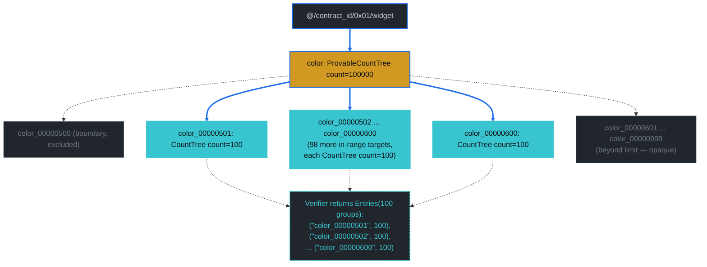

### Diagram: per-layer merk-tree structure (Layer 5+)

L5 is identical to [Q3](./count-index-examples.md#query-3--equal-on-a-rangecountable-property-bycolor)'s / [Q6](./count-index-examples.md#query-6--in-on-bycolor-rangecountable)'s L5 (color queried under an opaque kv root in the widget doctype tree). L6 is the structural novelty: 245 merk ops, of which 100 are full `KVValueHashFeatureTypeWithChildHash` targets and the remaining 145 are boundary-walk glue (KVDigestCount / KVHashCount / HashWithCount / Hash + Parent/Child).

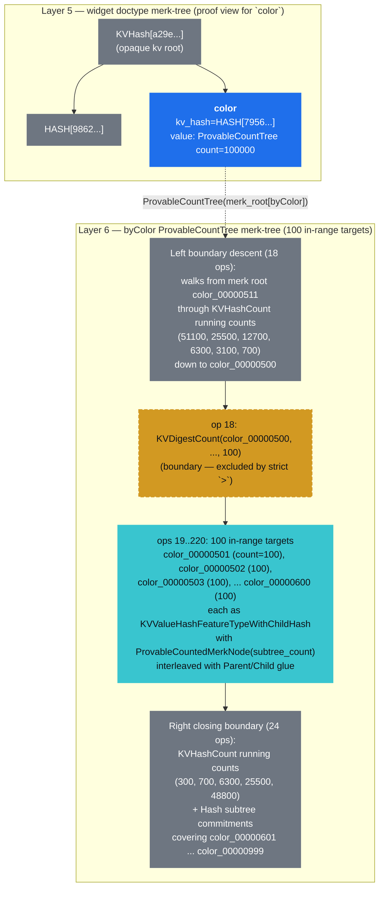

Three things this diagram makes explicit:

1. **The cut is named.** `op 18: KVDigestCount(color_00000500, ..., 100)` exposes the key at the boundary so the verifier knows the cut sits exactly between `color_00000500` (excluded) and `color_00000501` (first in-range). Without that named op, a malicious prover could shift the cut and the verifier wouldn't know.
2. **Targets carry their own count, not a running total.** Unlike Q7's boundary commitments (where `ProvableCountedMerkNode(N)` carried a *subtree* count), G4's targets are individual keys with `CountTree(00, 100, ...)` — the `count_value_or_default = 100` IS the per-key count, not a subtree aggregate. The `ProvableCountedMerkNode(N)` on the merk feature still carries the subtree count (e.g. `300` for `color_00000501`'s subtree), but G4's verifier reads `count_value_or_default` directly from the CountTree element.
3. **The right closing boundary doesn't enumerate the rest.** Once the limit is hit at `color_00000600`, the proof commits the remaining ~399 in-range colors as opaque subtree hashes (`KVHashCount` + `Hash` ops). The SDK returns only the 100 visible groups; the remainder are provably present but not enumerated. This is the limit's whole point — bound response size without sacrificing soundness on the visible groups.

## G5 — Compound `In` + Range, Grouped By `brand, color`

```text
select   = COUNT
where    = brand IN ["brand_000", "brand_001"] AND color > "color_00000500"
group_by = [brand, color]
prove    = true
```

**Path query** (outer In on byBrand fans out to per-brand `distinct_count_path_query` on byBrandColor's color terminator):

```text
outer path:         ["@", contract_id, 0x01, "widget", "brand"]
outer query items:  [Key("brand_000"), Key("brand_001")]
subquery_path:      ["color"]
subquery items:     [RangeAfter("color_00000500"..)]
subquery limit:     100 (shared across both brands)
```

**Verified payload:**

```text
Entries(100 groups, sum = 100)
```

Two brands × 50 in-range colors per brand = 100 distinct `(brand, color)` groups visible in the proof. Each `(brand_X, color_Y)` pair has exactly 1 document by the fixture's deterministic schedule.

**Proof size:** 11 554 B. **Mode:** `CountMode::GroupByCompound`.

This is the most general group-by shape supported on this contract: outer `In` fan-out × inner `GroupByRange` walk. Structurally it combines [G3](#g3--compound-in--equal-grouped-by-brand)'s two-branch descent with [G4](#g4--range-on-bycolor-grouped-by-color)'s in-range enumeration per branch. Proof bytes ≈ shared upper-layer descent + 2 × per-brand byBrandColor distinct-walk. The bench's `group_by_compound_in_range_proof_limit_100` benchmark uses the same shape with `|IN| = 100` brands instead of 2 — yielding 17 256 B at the much higher fan-out.

**Proof display:**

<details>
<summary>Expand to see the structured proof (8 layers — same descent skeleton as G3, but each brand's L8 enumerates 50 in-range colors instead of one point-lookup target) — or <a href="https://dashpay.github.io/grovedb-proof-visualizer-widget/#f=text&d=H4sIAAhCBmoC_7V9W6-lyW3du35FP0qAHqrIYpElIIETG4mBJIYBG8qDIRh1tYUMNMZYsmME_u9Za_dMz6Uvs3edZHSZ7nPOPvvbLHJxLRaL9V-_-fpf9l_857_-5uuvz2_zu__zi3fv_nv_t_3N4wuPv75790_882_e_Y_9zf_65eML796l37z76z_98z_-8i87_-8__c1f_t1Y0vKRFk3PqKeuKimncC91dnxDe_ZYK8XOii-NOrP4brlvraJDf_erX337u_O3v_u__fa3_as_7cdb_Nmv3_3tN3v_suwlUqW4SXPpp_kZnvs4JVUforviMWqvuSc5akNSi8jtrK1tSbRf_frd42lLty4xRx4l4Rf2zp89aVkSr75OVqkx1inVo4qvgd-AHzPzPtfxHzyt4Gn7N_sPf_z27_qRZXKbTQoMs4trbwk2KCHuK42ML885Yw1dMzzNMbOm7a5Hl7fdDZ_u-_cqv3n35__4-6_W-79_9fW_7m_-_iuu1j__5tulevfuz979h__44S-fWMz3_3xiSX-8sD80fvrfbzX7t6uX8nf2t9HSzruZDN_7tKRztjVkNbxyq5aufnynmH1tk1mH7K54v2F11GKwya9-8NyfNsW3n-jNT_9ji37Rrj9j3c8FT2nbc8sJT-iizfZymSfpbq4tfK9dd2nFYBDzcuAg-AE7ZW7f8Mf43Y-s8d0_-ZNrmfK3q-FeW4WDV_zKD-uyWk-nr-jwQLGaTuxolmbeUbqf3UfvQ_LwNqbL2bPAl0uRKGXLPp9-kA8x8vE3v7Ry361fyp9agSfW4anV-Lzf_-vv1z_sP35rLaCA1Fx3_WCrOi3ZMT2yB8J1J01zSp-9VF1lFGl9D5XUGww6om8gCuyWtIuMUeMnPvyaVd7_8_4JP2-dp230gqU-58MNQBmtjFx78gb4jLPmqQi-OWRuxvEMRFuppY0z68T_Cn6stpF2W-13n7XGl_x5fNP_sD5aIjuatKp-WKoYtfnqra26u6ceukfJ3sqa3UfXpgE47i3OOFy1ueDybeiwlc6Rn3-2n6aBz_3zcXqoU6tL201H7pqRGg_CbkvArSpcKm08c7E1UgAZq-UMRxPkzzYRjFF__tl-nDY-98-zPvf-n4fdf87xXnS_l53w86H7eLy_Tyn9-t2ff_2nP_zxvX8oeMmsx-XX7_Lje-er_g_4sH-HP_K_v_vOXxoWnRymdUVGyrlZC8kSSM7VXQoy0RIfbg7ykurRGSWlVusGh1AfP78mP-PRePR89-glCvhWPqPsGacAp3c-Hv2RY3dClkX-gF9ZxtO3M1JGqhFzELbRqsmzj_6sw3_O7ZHZU1sdtCdJ930An6ZIaKWv1jLIGPLhUaCIhxvpwDAASMJ6gDOt_rSJv3P-p37YPqzH9w-6yRoG8GJHBmKpTWnHsyQvq9vx2ZJU21n2Auwf6yfTc1LaSJvt5GcftL5kUP_IoJaOgjeulNfuAc7ZwDGb17LOCZnI1imN0gSf49jEz0omszUF-wbmnGefM14xaPuEQSfckYYB3MGKZYDaFfVAGIHoSQb7y9oE5KsAwgOER8bKp5cxd55r-tPBlV6yaM4f07Iea-aovSF1zYLHNTnD8hqzJOCAHwMmDxvwYjz0bPgI8I4A1edHqE8_qbxi06yfMOqCv21QOYXZoDNWqSlhsdvIYCZLFU6QaturQW2EFiRk8MYK0mtnAbue9tJcXjOqfWRUP3llB9YoBNdYpaTV5zHwy5zEwCahgVZkZDyEvyHXZZi_Gz5dnjtmPP2k9SWj-ieMqnuVwFsj5oH1pS6VVsLBV6AeokdePm3sqRZTvYDFI3uvZnXrGDD3048arxm1fWTU3SGizjRNJQXYzJgquaRWcoEphwD8UwNZyMgIpTcx_E8E1hXvB0TsadRPrxhV8ieMeqA7QL2gaRxULbfiCfwmtM9c-gDSrgE9nkrNG1_ZyyBBbAG8PAMP-tM4Ja9lKPk4RQ09c47uDc-BPxnUGGhBJzm0LAJscDOIx52Lj31qI4OskaXC4qM9_6TPEbQbmvYDskY29Bxhu6Jtl-Ttc2pi1WSjDI9dIXiXu3revUJIKbBLt8VGkLW6XGdZiiQH_DAwsFy1WDydJD7Pw-bXX339za_f_dXXf3jQsL1-CWP8Sx9f7U_Rsofi-O4_hmSQP0vUvmNqcKkJhlCgvw8oUKQoyIxtsHoWPpEYuzSAT09VjuYGxa16cllLBpS4vPYRv6DB_1-62vt_HrZ7xdne4HJvcrzPud8pG8yOCqxvpHNkflC6lWuGhiRbbRBtoKozdSMPKEiqkZBhe4VQgFO-tjY_dUI-x8PJvqXKyaCRAdYZb7vhGSegbQfeNR8oFE_DhPWGEyY2IYDP5EtITQ7oc_rdr99BNV480WsI-mW-PzQhb_YJAjUsxVz4V1l7HmmdlDlW9ZyREGLuDqFe60il7zwqgszTurFo-ZxFfRdIiS2lIE0KpFEIaDPSd5xIaQFvsNhAlgBNPjbARpODLE-z0s7pCouK2cUT2bVF60cWlXHwmCwN1ulknIBB7T7DkPKbZPCmNCcS1qyjzg5QWtmS7BhtAbPSjUX9sxZd8Pyew8pcm-pjw0BzxWCpJTQq9Nym0IAuPfPA1JLww6MZ6Edzg0Wz-MUTxbVFP2ZRycCUEWqgnwLCDzF_ZCjcwPdYDlY66bC1SLZhlfV8Owg76AMF6se5ivr02bCvM5Gi1dW9Qrl10E9AC7JCjgRVX6XqAjgNBLtYk178zLQMEd932x0mrXrzRPnapBQyP7HplIVQQxAHvA7pLKan00WKKvGsd1DB6R3s3tuxksDwCmU24q-mHvPKpvo5m2rPCQgNaWwbermd0WKccgCWNY8JLowHg2w6e4DebekKKodVnj0D9KPCpnqDpC_Kpp-RUPBNJB6gPCskPeeEXNBmiKuEH8Dpzmd6qf6QATNV7mYIuBMki9vzbP-ncuozoT966qLeaisgxTlEVll4jg3JAdiXBJzFciJXSeolEEnGitrmjuGSgE1vAv-h2C5NGh8-y1_8_h_2P__x_ad5sBbS5IRkmz6UjhVg2iGii6xek-ipip-IlfKEeD77gPsPpCja3uEysiFk884y8l70mCuHaR9T0v-y-x__9M3-23_7p_0_f__Hf3xIhu-p6ncP_qO6IT9G_kKxMHNnMuUBBwJzlhGe65gzGzCNOzvcEAOsgH9A2HbI8GLI4LlanjWniQ_3I1K8FwnYX3299i8_1N6njnIK2O2u3FxDcqhrpXG2Q_M5_g3RmqwCwCCnz4kORPWaweG1CkDhxlklXfuG5FvDywuGBzsD3ZE2QczKybE2HAvM0S0gecswndtlNmTu5BOaUw5gdJUCigJcyl8w_Ic91rIH0rzCxEj4thGhsSBStbL6pxM8DFQSrCxk4h0DDGcHcg3oQzqj5CvGJS9Vsn6qvy9fWW5XTF9YsYMk1sRADwBruQagDug2Ee61YhWrbuh_QG_foDZnLtAw2PKAoHVkGfEvrZh92KfCy0YrIJqs5NVGTAUhbRAWeySWHhKJVumAHj8D8XggiLGoYUhP64qAyD0nlXpr-fKC5Tu4-k5D904rIXtN7hK0ZFYXePuUtgJh08wRSWv42nuCZlYA2zZ8356KlQUGlRbzaDoZvxrruqbk5hkCS0ZxTe594budQQMGs8C6WfbPINZ3IOW31rMXrLdP6c3goIBv5CeD4nEonchz-ZrI3GdZUwA0PrueCSMfMN-8Z92uBt31BMQv4tY8W8_CL4OaA3bvDc7RweyQNSWB2dXuZkigeMOeR-ouJeN1yccVH5F74i_XubW-klsn1JAAwYEScJsK6_SeonOrsOFX2ShYlgOFBINAyo3umvECCA6pZ_Sn3DaNNkrqBHCTtUbBgkLr9YiD8ADwT4Gkdm0tgElYpCZVmteDL5S7MoWmW6DW69TqrwD1qTWNCgCFIMrgv71GmlwF8LOhYME2-5zCGrh2i4FVCrUjEbt0q1-wu3_AaQOlnhsqsMGQisUDMB2DCmwpabLO0ovvYmoBgtiX1-Kiaze1ZlKu7P6GaozeGj5eMLxYHhVCmZt7A_81W0m9W1bkqC0JvpiBrQVrAyyKEFh7qnnvrU_IrmccfoCdak-NeNUa2HcZrqtU0ZkRSH2BJ6XeHs03HZnSFLQzQ49UrK7vK5zWa37RXrBecENZqT8BDXlZHXuCEo4kIBqZBMNN4MOpUqXaySztzFKBJXNoeYqKl5Kzr9hmAtMXIPxpSbZBvuTYG4QQAAJeHkdTiT6QSutjB7k1gItf4bTe0wu9pRc5vWD4CScRE0ma2YCIP4NwQ2Dr7DIzZND0keFhSIfh-L6Z4U9rAXMnFuEpepGXegEcI-MmrCvYHBCjTpDGE9yDcyAJaDfiTcHmommDHosKwJBlY8mV4f0ap-P6le32leU6q5R8_cprsVKuxUop16-022h4pSIAWmgAF_EBkS5Q5hsKtI1hR4-N00PWHrETMhyiYyLD9rI2-75XIUv_UjTgYT7g-GQzawerXyA8wh0BpGrPIEkjJd9gRLvvNaBgoWwUP1JYy85zCJvkxtVuQL1GonJL1fMrRYEORQko8LSlI0VW1gIsOtRGDm6Rh9RC4EZ-wN_rIpZjNRbsBHnY4hkkakyYc62qRfCA3FE8E5T96BwWGhO_3tlwlSFfuy6bLU9m9lCoX8tXho9b670i0EUVBPoI7MEGHBBAGAkq7SSCbs4DJJyycPd8tkjNs7Mo6jOvXgTa-YkECo5tLJJ43RsqCS-LhWRRQTGhQ6E4j-yTa4YsT825vxSjOtdSK2TRVTG7tGu3tXRr-Ff0OXTOaaMe3Sa5AgQcX9A2BOwXirOV7FmssH8KdDnYwm6jr8Jmft1fNPwHt405tdWD1yTwuDVHVMljAJSSxJE5_ECVrz0T1qWtBu0OxgLmXUrHN6-Yi10nFpNbu7-i7OFqArM4YvPhyETgAzO1lQUYcSAtYwyeYmEZhDIwHD6a4MGaEA7PCB2s1xwg8xNo0bdskPvsY4D_ZARWrXOJDhDTSM4CSktdp1krxzVJa3Zld713-Fuqnl9R9rXuXLsVKMaVI8aOxBZaSwDkVnvSBhI3HH6auFnYRJ0Fq1LYG6ZfVJgfHD4t6Jq9iwpETM2Iq8kNE2hNqMq0a_Q-AXfICT4nO7wiF52xADMTOXVfGf6aYbyiz9vUwvb7PBPYA2QFNDdct2vArpA33r2Y9bSRk_pMcbyCfyj0XDPolKeEDhTnZpk7G7RT2fjVwY5nMO4WyGiVlZmx4aF7QxwO1sVSQcIF2Y6U9xW9sHt6Ydf04hV9zn1s2fkAKWMBAVKH9EaOnSyYZASwSN4lKXta4L0xY_S-eTxhgqhVf8Zt8TtG8eYJAO0d7puqJIirdfJ-bJgpgmKD3tnuYID4KxZ1s4GrsHk2rgx_LVfsWq7U68z6Sk3gZKSvTBazPC2QMLBfkabckEbk2wZvBvILaFw-Oa3R1ql7tok_YBn6U3sOCL3FnWME4HI5px0Hv1mIhQQ0gdYFciXTsooMUNNA9CgCFJmlZyl3sVLvWwzqbW6VV4oCYzq4d40D_WMm84HrViF1DDEyodtXKnWxRwwxJEsBN1gjQPQ5e_tTxVvFitWN4GNtEEiH9_FUBl9-QFURig6pBeSbgvjklgZCMreUO5ZXz1URsd5WAuUVEclmbUGSzF5GXg5eiATYyzQ8ObzZ1hFjA_BQbqtst4AgmfBfAVUEq3kG4itP5OYKpg8EUVE45eQBM3cH2TltWwH9DOglnvyC82YQfTxYcqwsourKevddHPU2t8orCjJBIcJd4DBlVTlQiL7q2r6h9opMn0fZux7BnWW4K8-UFUh9eNNQAMBTew4NiXPNHgvsmyfS8vBFCCH9h3qkrEwnzTPZEsWWXEDFCXz5NED_1R5lrddAfZta5RXtOTdsykQGh58L3FqoBVsvruxrb5u7x5EQ8aUotE8fsB5A_UCntPnF0vf3ew6N3V-ld2LTHAJzcgui9xwdASV7jIdSl-gIv7lzG1EI1I4lOnLn8PebbPV2k01e0Z6l84ybbaQ-EA_4OPIhHK5B-49jyaMLtwegWgLiCMgDdjPZSF3xyipPOfw4RaByYE7uLUsLPy2yHMjRiUzpBwijW72nnuYEHB1kggCpeRz_bVd9FH7LL-SlveFg51IDvwC1aGwSHWMAJC0DLGuHqtDY0O-rZZ4S2pNmzhvsEYiqNp7BaXjjiTVnr-VU9w2RXlOFEvJQaHMVIENXPHeUFUyJgzwf754H_liuhIzf0wu_phevKEhSiEpVWOQRzuztNIN58mZbaRegc9RzxtxYFah5KHzgeZkJK1TaU1tlAcnUAMkAmg406JMbn5IecyW84rd7PqVCrgOcqqiVWWcemftW0PfWrwx_XRf367q42_Urb_eX5BW9yw2jAkIN1iEQmVYazJuBGjLUZs-95KoC1O4hcoBNIENceWW0aPlStUC_T8p98vxZNlaCAxk91wxCySJuAI_Wysj8hqyNyGJlCJBGFbYAlNZzuUoOft-A6bcVYXlF8LIcJc3BnAcLwUn3fHTyTLZsGkvngqCyjDVYkXtDBi2g2Lb18HTqU1F2kkOELagmhdFJskY_ZLnWgHkxOwCPa86eUHaClTM6lPFsa3fg4Z3hr1PrS-KzK3TPaqBuTBApg22v5NkNAJFYQaACymrdegx4rDr4DAzRuZ_8Zb_9UC4oPAYAaQC7JeZjGCxgnwlV0HPuoDFis8wDWh8AL-F5O6ycsn6AJ7mxXtz3hsZtA4u-oj2Bzym3ZUBrFQdOp1kGaz21NYRzW4-iX2gKw2-ezvZZmN8Z26fs_YzbeitYRC9rbHhtUjm9KtNt4h5QaxINC6-QoOPorHtXbvml2pBE9s53hr_ebo1b1aqvqNaeEat11t4SOHOGLu2qkg-cvYtMMGuLHXMlwZKU3YWg4UBYmD48nqqnL25haFEeF4aQz_BkiH17sEddUKuIt2a1ZDbongrlBunka3BaCiDkqn8l7lVr3KpWfUm1Hqh0wAqLXICSpqDwzQHBJ9uZ9QSkfMK6eK2A18SjTge6Hy8L95GfcngxrWvWmkDZ26MvKCY0APTC4-yxsJKlAO221zSWcJR7HDMbKGpD4rwy_C2_0Fe050gVNpsLbgXRP5HAKgQIj9jhk52lssZxfOZSIEJbcBcC4V7ZgGhtmD1VT-dpVAj9LCDlyKgg59Ctc-SYLPaKnYie8kRKU2Q_-HXNpXNIBpTZvju8F_f0Im7phb6078mWbBFQaE0Hwn-swC8ILAG7_HbhIDmsgYexiwFZbKXIBiDxBNGYntKee_CHvbJdH96bAUmxN4Klsw-9VmSJUSH1K0eWwX2NvRjxSKUVIvSqRhjXVfF23cTTrjOrvdTDbwvpDewBbptzNNbjey8tVAZS4PE6YsTjO5tnTzUtwx8rq2Wt21P1dMYflmCvXRRku2QrqzsWA6nauVfoFALK02aq4N5RBpAPYq-lJGNfbVW3-97Qdp1bXxG8ZL72sESrChMvlra1CdvfWnNABRjjWZY1kij0ymoiCaJldW7UPbX3BDTPCSat7HJH6HmLOlYJWLxwGljDNxGKyDLbpo4zgX9xMnfB3NcdxLfbDWd9SUK2fNIYZ0S1TWW43aDywJln8Q7KwhNCFYStkzemAa8TD_AGspXQp3r4DSYvus_x3UCxR2ulg_Rt5L8DYrQr0qLkrDN4CgWMM5CEkXkK-L83vWolb_e9oe06t76iIGtKOlqZls5s3MKH1-dOlpCA-sASLZ60p-0tuWFVeDS_J2TjWeoY-lxv6DgFPw-iB7metk6kD3DRzcMTGcudBWs8kG1LBz2cCmFfOGKVkyZiXeXWdt0b2q5T6yvac7AmdXYNKBpOlC07QwJxbCoimX2yYhwaoK1XiM-UzmDiQyj7PJBH5RkqnhU6hkPboNrBabBm-I21ad-Lv6lyswJejhUxCNB6kN9BHREfBcpgjjuHv-_lyum2JFxe2_iEA1bhNDb63eEG8IFDIzmGGUC8nNzmmGZpwt0TIMEr8BSvmiv2U0DN8m6qmYNSwLMLMMSnrayrYUnS2HgTqRusn9Vi_GjDm5uO9Zgn4Ofu-HK6ZRjlJQ2pS2aUx1i1vNmzz4m10WeC5nNgh_Nwj57FyVYFBLHIprhPVnuBnHwGqXf2bDwrz3Nwm72NYH6yRHnYCpQbwL_x-xKHV60BHcvzAkrCeHqeSe_MJ2_w3FuKUV5RkQL_7NFy9cnZYjo4yzelOpEnV--5J54d4cl__AicFuLneIC3c9zgOE_RcQ5t1s4JT4a3gKNy6vX23KGGkKSR1bHETTNsXTgQ95DfNeTk7kggK9-Z_ro0jkxx_9J6_1K_f-lteikvtQqXrazQHjB05cgedi8iRBII1T57NPhS4t5Mh4qyecASzziPE-p6kGS-4Cr1B4RqlOYQwyWfKMjmIWzgAw70AA89POozehfOdI3B4eI9rdTL2F3AVe8GX6Q3JJh8nWBeUc2sIINTQQpB-WwO5GU590AXjdhHYXTlSTFuh0QCeEbhKENWg9ves8tTTe5HHsMDsJKmuXTI5oxYHZtnb1bfwu4lMKyRmseZxylEFBwbSQgk4C5M83WCeUXC1r2lg4loPVlm5-HDjQS54kAvAQA5ySHGo3HskLfjZ9mgbqD1a7jvp1preGT30UIPaMzI7LYECHkaT7RWzdOEE6m6rPeD-SChReaUlaWdmved-d6QYPJ1gnlFw_Lj7ZLzQugWJHjLxzmQVvdaW3lcZQJPtic50hpnWiC1c8yt7Qny8pQYYHF5IXFAY6jDmlqS8bT26IcFBIP71nNqRCwoslI4TBGpP_W18pp2N3cs3yeYfFsgLq_o31GbpQW6zgJkhtYFXDSkcu5gsivh7NkyzA_-6VDEDhBXKDfjQVTIsnhGDiByeCYyWlcF6tctXuqxWoaqCsGqCGeTdCDHKJln-KSIuQeeKJ9Lp69vcPrbzqbyigJuATmEz9jYTRYg_yM4KMGQwMB5VpqVZ3uFXSRFlhJ1AUOpwCPttDafqs2HDm_g-2BjiCoe5rVVYPHmxRo3VTuPFQgW3VPvFhsxlXqSEWWcWe5Mf800XhGy0KxJAY5pdMA1Hp_H3TJQVVNtZRRIms5ejBSLe2_A7XR0c1KSKsc4Pzd9oSxuJW_v0X3CRzdSXxt5ZfYDThlYoNVBLaA4Ejv9kPcg4WrirKJ0ab43EA25JRr2ipKNhbQoSJcFaMCj_711mL3XUmzV2lPkOFVDdUxosg5NBo0JGUsI789to8pBYg2AcMkdWitWzAka04BP2cwl67ayQng2bLdaTkPiWGB4YHxplKtzvVmuzyXl-_E8WW5zrL2in3eONtOuebkW0OapMGsFX87lyGO63ToD2KN2CufyH8kGQrnYvcq5PE9V6A9XOW0DwcmsDHP8dGLZp5XJY3qsO8WeBr3IY3zgqnPpAH3frZ_ocbdqb5gAJ7dZ1l4R0NAobTpoRZ8OGgmrB7ifwxaFt9IED2i0VgHEPAjqVdl8AHWbvKZWx1MzqczOzkwoyCgd78VCtY-1C9Bw9VzBYcynIwcg27Qa7ISrEM8dWJ8BXnemv60V2yuiMrFkBbHIQdELWQvOFOYBE80NRlgTTSVRQcxBntlnx8uNIDqCRcv6VOlnskA5x2Z3gAC0oGuMQ7zHoyUhgqP-yE5PPayZDhZMH72v2eqKu-N4Wd4waE9us6y9oikrsiondKeBYHYgLSjbMK1A4hn8s1RLYGocs0M8AZCkAr4MjIHiq0-VfiDJO7tgM8eTp-oQPGAgnRSdJ55iLix4Wytgdjt1L-g6pCCQUN4wZuPO9NdbsVmvk6y9dKZMe61u7J1TNvjD6yYFtiuISM5Dee1Z4rys4gUh3jnjXY9WMh55qmemR1lY4AAhClDy9GhAgOwZ4DcHb783L8mprOJV5QjRAvHP-1hAotKwywmibxiCqrc9xPaKHFUe2OjJ4WgOSOZhFzh4Ko2DtgqoDQj7oplB8SCe2uxIqhmk0yanTz0lRwH-yK7AG06_LYWtoyxWH2RQvlnvi50PyADIvYUzpXxvkPM1FxTT6Zemv2Yar2jKaZytDmYBt8wAU2m8MYfjg5TlDrJvYGrDnzgSusDP8gnQ9ZRnOHToU8ycl64UTmfdG5oUuAOX5Jjrph2agE2PYgcR18DcmTkyeKhudv2BksS6M98biIZeE41XNOVaoM0tZdrVARubB9J5sjxzZ3mPWsuugzeIDWIJcOXk910tY7Ft_alCCi_Lmm1ITF7zN2PNFGy5PduwpGzv3SxEgl_sBoLOWRFYZCQ7ab7mXQlQ72vm99N68v24nqy3ncT2ighW8J_MNpd8bMYuwmnv-Bs3Yjb4iea-Z7Iup0C7Do5R60jRtQPahFc9PdMB70uWudfOCZCrLmRonTXvCG0GoQvkIyVTAXgxFBuiPvN8RJOpxe6kWLnvJc7ltl5cX9rP7UDwMharigu6CVyEBYfAx2_UQXul6XU_zgLWVoH1kMZgUJBZSND61KwCMM5uiKks3RBwmwWJdSisCzjpwNofZ5RBFyPohgj01Eocb167zXlH6sttkq35pd2KVVqeE08O0FrZeCVNDuHk8gHlr9w3kspLSvK202vz7Zx0fng7XHmquVJ4By0yprGhJwveIVIdnNWR9Wy8D4_vgfqAvyM42BzuChCbUwfSh1-aT9_gubdNT_UVOTqsZ6huSB3AxbQ8z6jzcfL64IOXPJA84dtHJovyZQrHVXMmfhkcNfNU_SYBA9jMNOCpDU6JsGjLWuRUVkU2giTuPFSIJIFlIKkCapzoUMHs3L7rRCj3m7LlVsnWV5Tssmqrnbl4nICHG7XF0AEH30jIvXAz4rDzt3doKm_g27zIGXwPX0XCfYbUhxj7kTtii-R0rwcNA1JxdiSWtHUsRlMQsD5H5-jOhiRhuksTNk3cWf4NSvZ6iFV9RcmuDQ4W3HMgq-46nf4J6SOlQEm2Lv645KFMeKzDRuVYzvvRxsRDwc84PbBq8LoTXgumZUteHQlYpgfJkhxEw6REAMkFoPOKQGvg_auzzU_XXb243DKN-ooc7XPDKFId4LnT4EFWh90Arh2-tQWiJYAlq4FpQ7co6_CnF01QjLzt5Rm4htBZWjsnWmVe9WQyUu6P25rSlP64s9tlzTa5XXU2VO8Y4BjQNYW3nl-Zz95ANOyaaLw0FElhc96JpqKcoQnxua1PzsfdnKidMieCcfJ8psAqq6-TsVIHoDqqtadqMMmRC_HbAEZ6asX6Ilf2sXem8m8bMK28VSgm2YZoy6IIF7jDLFAQd6a_r5mb3r_0Ose-IoIR0j20Is55KhiG8zLBOFZPiT1LyHEJ2TQl3mrVgP9A5fS4daY2jp0tT5XbtS7J89EmdTRLE9ZHe2DxwLsbOFNmbXf0wTYs31s1cuM1kOc0AzLdrZq9IWCus-xL45jAmXmZHUeorQJZi7hoLVsY-DNP6Bi72Qen_XdkyAoMKMjEmstKw54LGG6d8sLKDIrTYxgPqoHFzEGzex7akrBVnDcFQ_aCYoZVRCSSMhjnuWsnuJ5mVV8RlbkWW8vVOGCx9srtf_hygsyBe6VR2ZQhJ80OCG7grBAkPFfNfiue63qq0_LklCSlDlRHop3VYCFImiquusMBab4Ha5Jw8KOeOO1eLHU9vIH3Em_iDZ57m2X9FU0pswzQDgG2-zjcaDZNk_enH-i6OSGO2qoJToXcGD2BOcSYdcGd6wClecZzkUY2JBSy7BCOSrbImvF27A3QcQpSS3K21wjUFtuDoxde7Y6VVvznDjTq9fmlXG-TrL8iR49DtNfJOVHz7NMECbFDCvPYTF4DJCQKtKhBHClsXlYzSZBMqmuC1fkzzDxJcO4rgSHYU4vUCqID0RXmCIMRZ0PUs2-7QZ0at2MX3s9Kl96i32101Dd0f13PtPJX5OiE18P16hxAmz7SoUpCRnxcszV4gQDIZU1Ijhmm8zAe3eDeBxLls3I0V4DGrjKJWwJaj_dj82MS8J0BjClrTtE9wGXW4IU9R-o6sZAyRi93cF1vmYa_oik5EjR3DRHfSdvJIAAlIcsFN9WOFY5I4gRflj3KOjyVDlpSenKOqGlPMfMDmBmQrIkXYK8acNwqClXDu4MjvHEMGUvNnG638IOcjqHm-Ch73A0fzPUNRKPeEg1_RVPyIm3ej5Br7AFrerDZqBtvtAPVOsYZCzxLMxOCmqITLGy2ijzqEnk8VUjBa3RAl3akYwfNwO_SAgInPOAOfYm_aQKlA_GTGVBnYTOwNq0mduHfmf6-Zl7va-b1fk_W7_OL3zf9XI80cnsJH3lYi1NbE4h8MvAkSw2eF4UdkyIgJ8VOSqOAnEnd6VjnrbVyort8cVNHvj-0BcIHarAe12GNQkfKPTdtla3QyibCwiNJnCpVd4XYdIOACedsSxl3VX5_Q63Ur9H1FfE9ezcrwhnD3tg5CGPnhM9tO00Ed9QCaoa8XTgC7RhLSrEWT4s6p2Y_dbzWCrSHQ_Z1KO2YC1Ayh62E5HNGTwB2SZxhNFIbwA-boHylmHRFjkl3vSd-uyHp_hJCjtoPPpQ-Bu1PbnLzUtfOuW7pUJUedviB_kCsQWJ33lJsxTlDq0V-qsqfx-Icl2YDPDnL-zvjN9tWZnhl2WoKT5qC-CLJV8hwM6THygH25e6YZ_Y39Bf7rYzzV1Qwr2SyBonlyBVIGFCgrfDkDMecnShpcV6ngvL2BAWcE6gmGAKvRwE_zU8VPI9ZgmibxUGIgUC9tOKVwBM9czh9wrKDHhdQEQfH8sTbaVc6wC9G053p7zPM9Xwnf0VA8zK7tdvi8Fre22wl9Zyc5xcFqBqQUwDaGcjZjW3fSNmwz86P3oQ20zNa4lTOneed6WqcOcL5fj6hGgL8udfaClU0NHyDagQ7Ucho_AUMbWgp9a5_5A0DnvL1hKd4RUBnuGFn7TjpcDYpbBbeeDm3MzUWnZsXoGdOcnZZ4_0IeM4HFJjPnoJrA5ODTF6pSSu58D7JAJpM3piAX7uc-MPxb_jvmUjH1bBMvA9Q9EDi3Zn-lmrES7fWCqcLc7JbyWy3W5SovCV7QFPYyadywqEg5ydYq0TacyUQXp6E4s3vz8B1f1TdQjkifmygjmzjmIoeXBE4Z9659N0QIZNn8q0vEGtOws0WXe4wI95ANOKWaIS8djx8nl6XhCvT1cYn54FxhYZy6b5GOFDcecSvwZ8eJ0EC2pW6b6-nms42BYEz2fIaSicw2OkSR9fEG2AVeZtfns53SdI5cntwTpZ1Hnm-22CJ-03ZuO_6idscG69ob6i-Ja0v-Gg9OnjD5_YBBQzabMK5Bm2ye7LEAlhQI3vy4OR-KJb55Rz7fZXfD9BezuY9TlgS4alL2Sv7gJwvcJv8GKSBJHx4Pwv8oswFJKyDN7XcKcB4Q600brNslJfqHjUFu81s8YROpJUAJvjYG7jSc-VxShBCL-NQPm-JAf7ppxTIIx1PVfmnsaM8QMQHtBeySmwIH1ZOK_s0A8R2ze7B7RRl6RRhheVq0FVYkcsG2XbbXxwv9Rcrd0N4i31M-EsDB1QFcwmW84efuaLvng5HcqQjoz_-bqWy1AD0fqqpPnkqTK7HclHQlRpIvmq7PGZocx5_5_FOPVKysF2xeGZFlEO4-uVB7faG_uJ2nWVfur_WOTAPbI9dNv0sfVhApoMpGG-IHONxe4HxEgMQtrQd2milLKFl-lNN9bMU7i7yAInWxK0_djwUmz2lOVcdpOg8UQH1Ol04s5vDzs6ulTeYtDvT3-_KXo97ipdusI0pQxNv-I4zA9L0VGNzfd8C9hHgbLzVL22QECiilmblZl4DReFt1U811YPzZVaxFTJLK-_v4h0TGx5dtc9HU_nqbNA007Nb5g4CIwMxONj1dmf5N9RKrwc-xWubsqXxUkJIEQ4pB_QU9olLkiG8AA9BUIwHnoCqja3xacdOSLCc9R5ynoPrnXjxdqlgsJl7XLzNCb_CeVWulNaU7SI2IHVPNh9dOWl-bltYq7ib39KumcZLmjLAuEvt4Ie1nrrZrVX1QLGzm0t4d8wq-ODw15049MEbSx9tpMQb4Z6q8sP-Obp3XoyaC3e2c4yZuOvYJ-ACaXbwXubiWBIbxu0Ttu0hOdQjl9MJ2huIRrslGu2l467IjXWujUQ2YITFO2qtBTdMW01dIQAVRHo99vR4Z5BDegqRBp6V5KlrbMH3F09_CEE6Vmze7lc52NJ8AY0462iGcsKejArNf4BKZTUoo72WXXWqSroumkvK9y-V-5fe7ke2lyZNMU9CwHMkXDTNu3DqB9x-JlkHeNQ771ocPG_VEId1shH8IATBM-fUp5rqwaACdGtDMLSMcNamnAKQtxryUAP4FR7lROIfAPcoOxqStpclGYA4_W7B7w-wSLqtF7eXVDAAmee9nbvfCB8fHBucMw-WC693dlJHnv_m3ZgHCnmBQALOl1Q75akGCCblPntHTBeDKlhjj6UVrHOwLeuAmOFr4PnsS8kcYlcXZDiEsrB4tO9Mf5tk2yt61G1C6ECyrH6IVRyl0U8BrbRzkhZwGN7uVConLAoITeX1lqlxkFkHL3mq3C69zwRLIaVONePFJbxDcPmGLTm52HbVya3UXTuE-Gb_E8_JgmV5voQqf4Pn3vYXt5fkaE8a8JcBKQptz7mnoHMNhBu0D7kepH5bgpISzjKGTYbDqXgJY-5V6nMbRakDnE7OfekZrDOCOFY2m8GHmYWqzJ5Pn1AReE9xB8XhjkpDykrp0vTXu7JyPfeqvaJkXQtAMu3sKYHxTO5YntFS4zkHnj4cBSHhdfDwH0imTraNgCKNs2fqT82wYXsVTykkhU8LB41sENh9Oi-3xLe85V7icQVk4sEcyTyimyd-torcbXRIvleykm-VbHtFyTY_vB8R2t7yqchVAEqWDdue7eylg2MY-2YfZgLsKvhQzFQ4KAQRoumpk7IAYyQR5GB494KK3Vl45_MuIKkSiLPONOmp5C6rr7RbaGb_mnSzXe5Mf800XjopCx8Zrkj0xqm0bjySAdiGI80idaW2gBPKmyqR7cZO5XiiZH0_His91brD27Ez78XhZXGT3bAiFbExoIdA4jtvRbc2pblv56KxhxwyChAj4-4SSslvIBrXg6_aK3J0Q6TbgsVtg4ANUIk1grvFyPBFePIaZtDNFlXudSwD6xpE1iENMfKUHK0cXAHhBL3WoBfYnIPf2AxxEMaLzn1AqR44eFrg9tDEBxQNpGNu3k_f70xf7-Ha7196nWNfEcGtsetYtYB3gxgFL02Zi4Mk9TEldCOPHu4ecWM_2FjM-dpgJ3sEhNhzM2x4zmItLlepckDJTwM_igJu05WHLnSPjpAsNSCXN4824636brz8iPT_atXuhz7J7dCnml467trKSeAqrbvqcXaeuBpvJebUuNVAviGQhoOMczs7H-5Np-LO6xTkuemSlScO9-MOO7aU2wDWT3xJFAmd10uxmh-eJTiNV9j6zKvpWxjLOvPq0KDI9xvTtNDj4X75nuk2ELaeEFLqC7AMTtdDDAoMjK6lVFjNa0jxnK-j4jxhPU9KpGNNK91Nr55I3uAM3yWux2q_Z40reH9ZjsV2GAQICBFkzqgFISSOxeJhCZbcR020LotmC8ZPx5AS7hxaricfyg9mMv1kQQYPmLUDssupKAIYHdk5VbbJhFzuCe4wHh_XjvC2CBZuALFZOZWssd_Srz5MfcOC-EcLsiDz2etcGIRg8XmuvWIb8go4C1hU4W30Xs4cGmD7ZrkPkJtdsSpQkncLEvcLcq8A9L7EpJ-NywJeBx6YDm_S7OsxizXNHAMfUqAy6wmgPjh4bwbrLqwBz8dxIxZ6yAlF9Sow9Q2BqR8HZqdEtCrIYGtJOtASDR6MgISu9kYZB4_f3zauJF7MZrw0rgQPYua7GpDeB6ba_Uvr5xbzrKKaCi8lYO-McdhtKSc7Ataqgr5K61vr46wcQn0UkACIr-oD4vpxYaeYXVniDTUFjY9WU3h1X0K05qa5n2mnQiUuXjxZdFORQrszP4QVJkvQb8Bu29GSgprfRbXeh2ZJn4XZEQbC04ITtoUTckF97WRIKohstrhGdO6ILzZSQmwDIHu3iiCEFjTGV4m4-TjlDYr3w9iK75cEyqdB9EPhcKekdvC47nVtqngeq2cYAXY5e0h1w-sGiAYkY4vMGc9X-89S9H5JvovN197233_x_-Nnn_3J537umZ_6-Z_5uZ_48ve_9N3Pf-9z3_n01z_11Y-_9tOv_PjvP_zb93_-7k_v_83___df_Psv_i-_r7THZrwAAA">open interactively in the visualizer ↗</a></summary>

```text
GroveDBProofV1 {
  LayerProof {
    proof: Merk(
      0: Push(Hash(HASH[bd291f29893fb6f6d6201087746ca1f23a178dd08e1346cb6c127e91ae3623b3]))
      1: Push(KVValueHash(@, Tree(4ed22624752972af97fb71abf4067b23e6d296a61a02f35b2098819fde39d289), HASH[4a5a28cb1b40226aa35b2f0d502767df13268bdf4678627dbfde26a557acdf73]))
      2: Parent
      3: Push(Hash(HASH[19c924989e473a90d0848277d0b1498ccc8db3dc870cbc130e773f3d79ea5b71]))
      4: Child)
    lower_layers: {
      @ => { LayerProof { ... contract_id descent ... } }
      // L2..L4 identical to G3 / Q4's first three subgroves
    }
  }
  // L5 widget doctype merk tree: same as G3 — `brand` queried, opaque siblings 9862 / 6c36
  // L6 byBrand merk tree: two KVValueHash targets (brand_000 + brand_001), 25 boundary ops
  // L7a brand_000's value tree: single key `color` with NonCounted(ProvableCountTree(...))
  //   L8a byBrandColor's color subtree (under brand_000):
  //     proof: Merk(
  //       ... 18 boundary-descent ops walking from the merk root down to color_00000500 ...
  //       18: Push(KVDigestCount(color_00000500, HASH[...], 1))     // BOUNDARY, excluded
  //       19: Push(KVValueHashFeatureTypeWithChildHash(color_00000501,
  //              CountTree(00, 1, flags: [0, 0, 0]),
  //              HASH[4192...], ProvableCountedMerkNode(3), HASH[c3b4...])) // TARGET (brand_000, color_00000501)
  //       21: Push(KVValueHashFeatureTypeWithChildHash(color_00000502, CountTree(00, 1, ...))) // TARGET 2
  //       24: Push(KVValueHashFeatureTypeWithChildHash(color_00000503, CountTree(00, 1, ...))) // TARGET 3
  //       ... 47 more KVValueHashFeatureTypeWithChildHash targets, each CountTree(00, 1, ...)
  //           — color_00000504 ... color_00000550 (50 per-brand_000 targets total) ...
  //       ... closing boundary ops covering color_00000551 ... color_00000999 for brand_000
  //     )
  //   end L8a
  // end L7a
  // L7b brand_001's value tree: identical structure to L7a, single key `color`
  //   L8b byBrandColor's color subtree (under brand_001):
  //     proof: Merk(
  //       ... 18 boundary-descent ops (different hashes — different brand's subtree) ...
  //       18: Push(KVDigestCount(color_00000500, HASH[...], 1))
  //       19..220: 50 in-range KVValueHashFeatureTypeWithChildHash(color_X, CountTree(00, 1, ...)) targets
  //                + interleaved Parent/Child glue + closing boundary ops
  //     )
  //   end L8b
  // end L7b
  // end L6
}
```

The 344-line verbatim is available via the bench's `[gproof] G5` output. The schematic compresses the 50 per-brand `KVValueHashFeatureTypeWithChildHash` targets at L8a / L8b — they all share the same template (`CountTree(00, 1, ...)` since each `(brand, color)` pair has count=1), differing only in key, leaf kv-hash, running count, and child-hash. Once you've seen [G3's L8 structure](#g3--compound-in--equal-grouped-by-brand) (single target) and [G4's L6 structure](#g4--range-on-bycolor-grouped-by-color) (100 in-range targets at the doctype level), G5 is precisely the product: two parallel G3-shaped descents that each terminate in a G4-shaped distinct-walk.

</details>

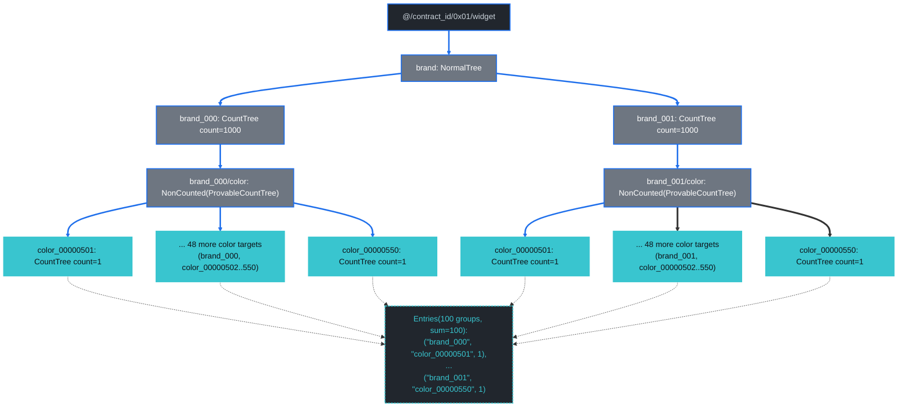

### Diagram: per-layer merk-tree structure (Layer 5+)

Layers 5–7 are exactly [G3's L5–L7](#diagram-per-layer-merk-tree-structure-layer-5-2). The difference shows up at L8 — instead of a single target per brand (G3's compound point lookup), each brand's L8 walks 50 in-range colors via the same `KVValueHashFeatureTypeWithChildHash` enumeration G4 uses, plus the boundary descent / closing boundary glue.

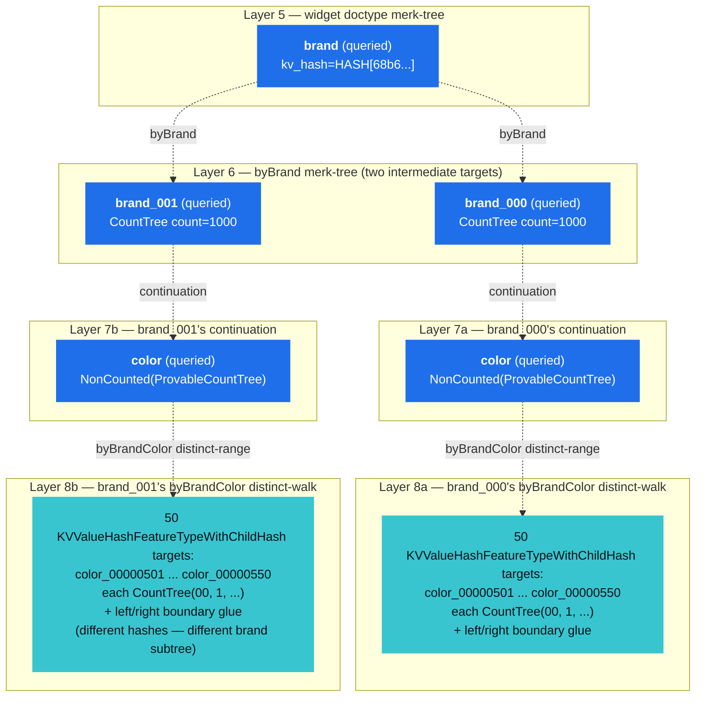

The 50-targets-per-brand limit reflects the shared response-size cap. In the 2-brand case the cap kicks in at 50 colors per brand; if the In set had 1 brand it would be 100 colors; if it had 4 brands it would be 25 each. The dispatcher slices the cap evenly across the In fan-out so the *total* number of returned entries equals the limit, regardless of how many In branches share it. That's why the bench's `[matrix]` row for this case shows `Entries(len=100, sum=100)` rather than `len=200, sum=200`.

## G6 — High-Fanout `In` on `byBrand`

```text
select   = COUNT
where    = brand IN ["brand_000", "brand_001", ..., "brand_099"]
group_by = [brand]
prove    = true
```

**Path query** (same shape as G1, scaled to `|IN| = 100`):

```text
path:         ["@", contract_id, 0x01, "widget", "brand"]
query items:  [Key("brand_000"), Key("brand_001"), ..., Key("brand_099")]
```

**Verified payload:**

```text
Entries(100 groups, sum = 100 000)
```

Every document in the fixture, partitioned by brand. Each `Entries[i]` carries `(brand_NNN, CountTree count=1000)`.

**Proof size:** 10 038 B. **Mode:** `CountMode::GroupByIn`.

Same structural shape as [G1](#g1--in-on-bybrand-grouped-by-brand), scaled from `|IN| = 2` to `|IN| = 100`. The byBrand merk binary tree at L6 emits all 100 brands as `KVValueHashFeatureTypeWithChildHash` targets — each ~100 B (key + leaf kv-hash + `CountTree(00, 1000, ...)` + `BasicMerkNode` feature + child-hash) — plus minimal boundary glue at the binary-tree corners. The proof grows linearly with `|IN|`: G1 (`|IN|=2`) was 1 102 B; G6 (`|IN|=100`) is 10 038 B; the slope is ~99 B per additional In value.

Compare against the `byColor` equivalent (`group_by_color_in_proof_100_rangecountable_branches`, 10 512 B): the `ProvableCountTree` overhead from `byColor`'s `KVHashCount` running counts adds ~5 % to the byBrand baseline, even though those running counts aren't consumed by a point-lookup group_by. This is the same `ProvableCountTree` overhead [G2](#g2--in-on-bycolor-grouped-by-color) carried at the smaller scale (`|IN|=2`).

**Proof display:**

<details>
<summary>Expand to see the structured proof (5 layers; bottom layer enumerates 100 brands as `KVValueHashFeatureTypeWithChildHash` targets — 192 merk ops total at L6 including binary-tree glue) — or <a href="https://dashpay.github.io/grovedb-proof-visualizer-widget/#f=text&d=H4sIAAhCBmoC_6WdWa91uXGe7_UrvksL0AWLrOIgIIFjB4mBDDBgQ7kwBIOjJUSQjLYUxwj83_PU7tbcS73W0lF36wz77LN3sfgOZLH4X7_6xf_Z__mv_varX_zi_Ei-_L_vffny3_u_7a8-3_h8-eXLP_vnP_zyP_ZX__svPt_48iX88Mvf_upffvIXf9P9P__p7_7mH8aKTU5staUz8skrxyChlqJ5dn6QupS6VqhbEt8aeUosu0nfKcc00o-___1vnlu-ee7_9qMf9Z_9an_-xF_-4Mvff7X3X-heMeaoxWIrsZ9WzijSx9GQy4hpZ15G7ll6iCfZiKHVKu2sndqKtX3_B18-r1a79VjnkKGBJ-zdH3vCshBLLutIirmOdTSXmmNZg2fgYWalz3XK77zayKvtX-2f__Kbr9MfRUbabFEJzNaSegvEQGssZYUhfHvOWddIa9YS5piSwi4lnbRK2914d7_9W_rDL3_9k5_-bH399c9-8a_7q3_8mY_Wv_zwm6H68uUvv_yH__ibL75lML_--JYh_f2B_d3gh__754b9m9EL8uv422hhy24WR9n7tJDmbGvE1fjNnZL2VE7Zoc6-tsWZR9w98feG5ZHViMn3f-d1f3sovnlHf_ar__2I_sm4fkd0ryaPtl2kSeAVlpia7VXiPCHtVlKrZa-dtzY1AmJFDwnCA-zo3GWTj_XHvxeNX3_It45lkG9Go5TcMgmeecrfjMtqPZy-aicDo-Vw6q7NwpRdtZez--h9RBmljVni2VPJZdVYVXfc59tfyG_myB__8E-N3K_HL8i3jcCNcbg1Gtd5_68_Xf-0f_lNtECBmCXv_JtY5WnBjqUT92C67pDCnLHPrjktHRpb3yPF0BsBHbVvEIW4hdRjHCPXP8jhZ1H5-uPrV3gdndsxehCpqxxuAGVtOiT3UBrwWc-aJzP55ohz-zyeldmmWds4M0_-VR6W2wi7rfbjy2j8qXweX_Wfrz8aIjsppJzSb4aqjtzK6q2tvHsJvaY9VErTNXsZPbVUgePe6hnHR20uUr6NNGyFc-J3v7Y_pIGrjz-mhzxTLrHtlob0JFDjYdrtWEmrTEqFzWtWWyNUkDGbCIkW4c82mYw1f_dr-33auPq4m3Nff3zi_l2J9zD9Hifh5dT9L7v_8ldf7b__t3_e_-unv_zJ593_Nl3-MYTwgy9__Ytf_fyXX-dNQq_MfEr8wRf5_Oz8rP8TQfgHPvV_fvzrPGokg2ub1hNMJdKs1SixQtq5lKgw1IplFCuImpBPmlVDaDlvtEUq48c_-PJX_V9-Ov3N_c9frP3N05JpVmtNU1vcCKaaZQ3ZuS9nhIZWaYJKSCn0Y1AZiFvzGo25tHIt9t0pcDmBvjNS8i5SWhXZJ2fonvUodLHllNo_VL8DZA-Nkd4mBKudEQTGi1Z4Q6NlixeRCuNIDDFBS0QcCbkGJDjFakI5wN81VWRmdh0xS5aWfSRaKxYIcWl3I3V3Ov_-pH4S1_gyrsDSCVoCSWKKaiD3FjKA998J5F6A7lDNG_0Y9ukyqrU4C2TeVpd8EdddlyVQKOgoR_tsLsGAyLX6IIok_Co9IedT7IqYFwVnJcRQe0A757tx_TUU3XqwvQhrejmxO_RtcPiEG7bUlBtz3Sx1bfz6romJmJjie4lNmIXpyFTvpnUQ3nYR1ujDZVm0aGhxpTS6z1hkKFSUg2ZQIp4aQgmo_lonQmqeVSztlaDJu2HNj9K1vIirvosr8qhVWZqRrjsBi31PBBMWKs8d46qNXJoWa6iCnG1EPKiBg3MhTMe5iCuyAs622HvtceUciLC1M6Ns_m2n6kanFmUOaJEJakKu_Am0rMrJ9W5c64tI2btIBailyyyhkVApVsARiseEHJ_VcZCYvWkmgepKKwYsY5eF0uxjpK16EalcyLVqPZ9ZEDJr7B0P0p38wumsmIdgTEUwoGMXIADraZuY4i5s7tuRao8yUN5wdn4XWCzmHu0guceaKREwRFZRYA57L4hQJ-zYRuXbaEaYArfY2igqrc8arjhbbB8MEtoNskEOlO4DGCODGDRJCWW0Mn25IMiIHduKg3U_K6HrnLc5W55ApsRHj35DXOXdMEDKsRPqEw4pzoBoWWjuELFRKIVKzufgJrc0kAFZzqctkI3gYUWRXwyDJeD6AARb8R3I5hgwWUG6KL_WkvWdwhmtAe5OmSfGFDYqO-SxV4i3h0GfJfgb7qovMbZKnXO5-3QsaD1uDXPxHg3iR5NuPMOZoERJe4KTPZ5zho2KT0MZXES296myRJKudJLsoNBdn6BGWZaNAK565h4R2VsBqAy0NqQCwkNam7e5S_KLULV3oRKLZWER-WcuKGlh9PhvbbI7Zj6ToEZaIKsR8ocRkQK_Z7TTPhVldBEqdZHVdiIChZzbSeMy0tBynni2UwCcjW6YgUGYc8ZFBGP0BZQO2PTboSrPkvAFfclLZxRHs5Dh3JMJQPSA2Ahx74DwX6sZUvWMVc0EuMRyY2PURlsVGNAtVyhrALSYMSp5Hnw5BIiUH7ORfRgm0hqJWsvkW2D4qTW4CggAbdkPdKm0J7gZX9CXvDRSfa1yKjapaw_NAMsY9EhjJmcrpdXe01nbFwiD9npqzK3qwkD6KrPuK12w1-DvT6e_jdQFd3sxRg3nYMtAxuqv0aqvPgQcxR6MKCp51kLqnttGSh6lbIwvIvvSSvlSZrKmoarBGAbgodRPGbYWLnNkcC1kPVA4_p3wt113NAuNAZlyFdltGLCj9SCxdvGh6SMajrWEI3nUXC3XXYxXCG63jBKZOC6EQfWJcd-iviBveWmPCgJ-dCUctqZZQc_s4vSQFoQKk6SlfZxi_WxjBgo8Dy2TsbJbudRQG0OERMrAravyhnSX3pnyU_GaZHgih6Fv8u-I5rLKEECV4eodL3s_CZ-Rd3xB3vLSIKGAeupLiWiog5lVYsjxFGa2I9l2ysW02MikUD8lzL4r3DU0ms5Tr4xnOLFkDT0r1DXKqCJkN__GFmsBrQ_GPjJA6QT1lyjbmhPYMD15345sfoSb5dGj66NHtxeD9tKr-WzOAUFvAV5vtViZpHldZlCRRUUPnbPw-tDhAVk2CYwMyIza6nIlI0KW4yKh7R6nw3MCSWSsjRnJsZ6jLjHQsB2JjFBp0xcRYkuV567n9jJgCs9Wt14sG8pLs9ZOyDnjZ9cZtaDpE1N-x35cVja874HSWqjrnFn5GIDDtBEx-ocIzSstW2sZG7UakMImKDvGi98gxDqsCiQXtmHOZsVV97kPeCdMQOwykkZuR_YNfZW3oUrQMqZp1rinkG-KjU0b7t6kYnB8jmToTn2fFD-CX2o9WQq-Pl0tWQ0QKQ9pLuOQa3JwVRMYJtXPSciMSBLm1nvDdGnq-LleFrw4t2pbt7VsSs-SUF9E9qWhaiirWSr2PkSCoBWOnsFXZNZgwi_3QssQTG3CgwjUriORl8s3AaRdrfLj-tvIQPLRyLOCEkAucxsFZxWMrxolmc1EWk7gnqiD8JPxO7i7dFsYJHuCm-mF_ZKX9msDYbFU24IrWhNnSUBPm7PmlQYZpaGtWSWAbNb4vIxxYHpJZGxccqllfR8aRFDpu-eBV0CEYfEmHIicWMc0lX6ab0VKKmU1Irp9YdYAl3I7sM_sV3phv-JL-zXIUOTTLLiwKhrPhi6Gb77gQK3jwdKWkpJC8zW0pGmhO3T02m310C8XuXBn2VdvefqK-I-NWZUlTjTtWBGUaQFJ6Ow0Eu427OIARJof6w_A4AV5x5eGCpevCMrSEEEl1NpjzjVsqEU_-6voV3wBpA4KJM2CFVJf_4AREoG7ws3SIGaZCV86UyJaBUbZp0pLXmuEbNtu2Do53w5onBocn1OqYGfn79_eQXlG3vqCvONLQ1U7kw6jatHwTeOoJTl7Q7UlB4x_9QVXEmWXEFZYkEdfGZArrndatUvyFqnixl-GZvwEc310pjupLKWlOPhlV7olLt85LY0_UOWMyCvAw92O7KO1U02PHv2CvuJLsybYTPXFOqn4Tj2hIqJKCuBp91K3OGQxg3FvULyaTNQBuhSw7Lj8feVrW56lr1baIeadv8GgkMttBI_ymWnDXHVuEB2dq4D6KIzaOb5ZvvT2grfaswR_wV_xrVmbISnJjAXe2VdOnPM3cWxlj8g_4WjrqAbsa4wj4Nt0LKx91QbKXG1qYxGaodRyBl2zL0qmo9P_EEAU0K2D3CaUKfWJ2D28Ch5VLfs22Jbbul9fbPzFlxYphlpEE5QEcadG0nS0TlVUzTjVSoKcjlfrdKktdywtRrWJkjQg775C2Xl8CQp0BsChublR6qNLCkfGsbwshlWmABkRI7aa7_pn8S1qNP6672u1PkvCN_z10iKdFpH54tvHQCuKZpfuW6ru5mvjGwEtqf30qBDcKvipqaiAZdn10NVGYc1eLbF2aUutWupLBIzYa0Sd0Dn6FvxGw6a4Q0gxx-MLCbiwD4iEu5G18KgE4A19vTRUJrylE3lX6ewSx0kYoeaVN0l6bjY6jltnWRDPDLKSKtnrBX9SBId6hZtYp4CD72Yq2LGAwrc5QkWx5h4cdiNxbsuwVwHOSqs33BRey2tXbtOXPatZsRfLh_GlocIXmRjhOr211g8uignMDC1n-aLr0VVHh4GQX3DSiVu7b2yfsQbAcLXItcwJbkSpwU2w9Ih1RaWJF1OojM2v98TwVSAhuHWTHNueIDZzZd5P2Tfk_dIixdx2Xh4pV9XIzk-ll0pDiVoqQOlwIN0JE7_RmKMeEhIe6qmQPlf1PTl9YktMU4Q_omQcKMEdwwW9Ta-LXL7aXXsYxHIkvD2mFJcUQq-3V1rtGXnbC_JOb2v3sJi-gI_l2YShH9JhB3Qk2blLIczYcKyOWsOB9h0ryHfM6yW8tu_KfFYvXCsGHJ9R5vKaHh_AqqskZOha0FkcumyTeowoWtdgw7xkYw3S7W1Se7R2ao_WTu3R7ld-hOD5BYKnl9ZuojaTnQNpjdEjwjNMACAXoHwA4DnM5gN0atKA1gDbca_N6oyjoGGvRMf2mkuVE07lF_DVoSRJXqs4XVLDiCtDkDKZs0xGS16VmAs8KgdWuV3F9QzB8wsET2_LDtuwgI2VmS3MIYr_Z0JBlWBFUF8bFE_sAsK0NXC_uUxQBoM3W6vz0lOILyr40Y4eli3FRmCUu5vCnENqJqiQqAWg99CC3LJMFwKZF11uw1J-geDppf1a8SCI8AgIh5ahIHR7mKI5lI7TnauYH3ApOS6F_4ocsgrW92L4Pu1qr8wPf5TQNWOBccygdM-EJkxfzOWZyWyMNyDuVW41KCKCcUGoIGGW3S_HyM8QPL9B8Jf2Cy7KOpskwUzgfnYcKyAr9tm4oLIzv33QpaEV3JgMwwKcOBFtCFoCcxHZVGDSOMhF8m1Aoi0FM98rsINaCHtDAmlBC3lU374FOJoXOfBDIq-3I_sIwfOL1cP00qzpwtFrdKsKazXe1dHTa90ZGgTodMe8C-IYhZZQDwaACtNUMjCIwLpauGkjYdhwbGcOktWY07EyZENDmxnjlohit9JHtVGQJshrqDPJCKeH2-uy-VnxYXlRvZHemjUvN0pM3O1VV_hgieLV8KGm44XAu-OJMVTVF1eORv61QXond7bhcqewNSAmnDUlkvoHHlvY3lNPAkYP0poPc0nXsnlN_dpp-OZi7-hg3OHdyJY35P3Sfi0MUcq-37KkewHsORZRTzbqkByY7lLSMB212SkD5TsW6diD7xTOc6XPJhPWhdxZPrld6Aae03cTDxqgGeqt9THVqz-TKVZZTrdVYPneer-9hF2ekXd5Q94v7deco05iN7Vt84pIMqJ8lgID1DrRrTxPaQLIqRXfxG4qOkc5yOCcLkuLCWSbq2njSb0CEHtF1DampMUeGulZscURwM65xIgDxPyFhYbgW-s2eZdHhwbKo92v8oa-Xlo73G6qwWsyc10nbMsindTDwwa0gaCctJKUvutHsNYeeOBzkEhYu5SuVg_9qMJu9VMTl32ZazY8sQ5xn5cwxKQyXmavUBRzCSyI-Wqk1NJt59slcuXZ7ld5wV_60tqZS8i1-q694tR4w02EmCBOMbcg6ujQWg_hU3TZc_TdXaulHjQmqXtp7YLrNzteHrcCY6Npz7xxAAg8-DAcP8s5cZOSxogwZ40Z9gy2T5r3UfbF6qG-tEhbQ2zTprSSTjAZGSnvdW5RmMsKEfVVI6kR5vos-fHuMvrIpldgjMvVQ8DYzCVoEx4eckcr9WyzI4IDrwttWne3yaBsL57pPNIXczM5z5-7fSDj2e5XfcFfGt_WFu-wFCGqR_aA3LvB914VTHpoXcy-MhafwTUaU941-CYhDrJPCPtq28U2HO8-VWIYuZmvveImVjJDQoAjSLbq69syeg5-Alfi_BQf7YTRuB_ZR7tf9QV96UtDhZtZJad6vAA4IQHcTfmMh8eY4uuzenhQD-SY7tQrdsfIX-QTUkrKVaELwSFVxyqrEmMwYTbG5Ow8dpxpSokrA8DReF4BCPqZlhMGNB4__347sM-KD-uL4kPVt4c01zj5YJ98d7VvM965MjVzK4Uwh69Xtqrv6hddQzFIiP5RhOkOJ12lbGZIOlMdliH1Z1I_JTv049RQCchVpFfMzm3aZwKK8PvidV4r9XV7vaS-IG99W_JXO0gFsI-U3QHlkuoMZSs4Zv6pVHj4U4w2S8MtbT_RUubws7stXJauIPilHfPyrRmarE8FN_HFtEpR41dLDd4VBO2QC_gZvOSWHETJyv0l7PqMvOsb8n5pkXo5C1QzJxzzkz7kV3GXeI5v9HWvylvo9yFQTBqNjB34mhRAPJjmqnSlkdGt-FkV5jWoiy7ojJwVmfG4twpeeLxj8HWVExFfra6Gbdql5FPvR_bR2ml7tHbaHp39ai-KD_WlWQMqofgYFYpHTC1JO1uDp87GpjAuTAjMhWSvxfACy5z86PrgoxyvdrlYMVgRbRywJ8Xbn-j8MJm0FbqX0YQQewOLvRxp7yVeXG-V-TIFl5jL7RqD9qz4sL1YPtSXZg3snHVC5rwxjC1KXr1GuyRrR9rY9dP-BQ0VGmJ0pLibjmPFiwUN_r86MRsHgn81Px9TW9mhYYJrO6C4K1uwlwlRJpo4JBkN0eJFjyjkgtCFFW5H9g19vTRU6hpnDt-RdRYzVPqIIaMQYihh-SmCFdzoBy_mBbXjrrCMlw1YB1Kvit6C7mLqedqJGCPgHaxGJQ3RDF6HiBLIuzFGpW8Ev1eHbWRdS75jfltxtWenttuL6g17a6jSQsFGL6Gcy0_D5JO8sKdq6xjJGaYvXJUOUR1DFvDW-zihC46BB15Vb_jpTrWysaWnMoWDnxgpR8jbk9VLDDbCdseyh61IRiI9aow9-ZLYub_S2h7tfrUX9svenuYiU1Q7kFWbVZ24RixoIKLnYP39KCXetSIv3RT47nVETEjkoWpE66r4MLne8or1rNtgOzH-xvAC5QGj6uwYMEt5acLpffwfukJdn50p9-s0eXMPz3m_MGD20oDZUhylmYm3EJkVSEM88LW3IPD1UPVOC2fU6Adjh8bTDAQNfs6rM6evJBrJxyQwfDEpW0at9Yy4rTRvXEI808zTT-_AUxLTQvL6woP3Mmutt3A_ti_42972u0BolTTcoK4A-uMm68TuzJi8SGL5ftWcyc9y5Yk_YgaKr0l5PxfTJJf9LmIFNLKkqA09nNdnC1BTRikPUpnJHyI5XsZce-QPFpCXM0niFen9WKWHefiCwe2lq_I-DbP0EXwhLswcas0L5zjDwK7jULHw3rYtrC2Qu1dr-gmOeWyCddeCNnuHC8UDWCm9nUxCr4y_CKl3ZU7vzORPJfiRoF5rWmjoNTAi5Gx_EttHK6iA9LOHv6Gxl6atxrbTihJLBEF9Z_SM42t0CMyE9kcIfLZfrccwxOuQWmx-ANSL5rVcnvDUHFNHI_QhlpIGuGkm5Kh6HefxtcU294p-KKx_mhMFRPIxzKKvDt4_lBzqwyx_w2QvbVuJfetZzGc_XpD8wHzBlW7-546-FMRS9ZTeE80JJAYvURR0wyZieiW-FKDuy1vpMUtmTqanf5qjKXRpfiBs4IQlHtWln91e7IJo6ZKyaVz322q82AW0l24pYN_RPcrMnLI96bx7opiQNjHglc7yI548QH2XJDoe-J5WrlnXylcrWI3BQx5NP7s8cpAJonpvi4A7WBUF508L9FVDXrXOEB1UcW74KyJXHsTq2SFukTdM9tYvleYKvMWA2GHautuHvjCDa8BmdaWiDofm0hTDEwZzcUsYQ7BElzXZmCTz4wvp08vR25ZsP_LlX9Thy6054rcguTxO7vucXkfCLbktQ07cR1t5dI5A5A2RvfRXuQ9E5e69Ms0BNGKXREr5iAKfnwFSn96T6IRYAhmbhkI2q1aUrF6dg5t-kPP4SmtbK1Y_xjoGz9N3L1p4YSUAqbEPlNrxPhLTV3gXGHBaD_eLfkTsYdq-WE_MLx0Wfj4GyVgrxZBiwZsXPOF-vP9dx3cT-y2bWGbvlpd041i9MJMkziDI1dKrn0YGQSVamnjdUVuL57TMHJhyYgVZQCMkCIYBEcZ73n7QWLwZR9D7nQTlBY3nl6bJ23wJQZJyzvJiB-gWmukadzS01knIrbJW91ai6r0yfJtuRRPs0-mXJ7amE4xXr68KeyzvYDKbN4ix3avXnhVAA_EAsmJqdww95BFsljwy6Xk_Vg9pXF7QeH57Zmt5dxomKwgp1sTyZxFlrc0zEOnqbYM-DbLyap_yoBFIMIIWq2_sX22ueFGkHx72g9X1iCzc7ZnT1qcTo6Y2vd0dKjaixj7706Q8GFP66jzz7djG8Kw91sNuWs_aacVnWB712cNfLK3ll_7QXQvA06WeWvcJqGKvqfXWEAWPPY-7PH7SvRATuNbqrfxa0TS7kSmXS2veZw2DdNrIjLstb2th_azlJ9jT9uZoGaL2YwHDYul9pTlWHbjwfv-krsRna2sS38DZS3-IxGttZz9eDuZ7mzImRsreca-Acudz0v4gqysibWORT0m6_HRvcxFytQbE_N0p2RJtC2vjtUt8Kq3I2p8-1JWnXOnUs8_K-SCfETE5oMfRMF3ux_bF5lB-6eBGNBSziyudYC5-wIygoB02EdEDcBeAWZZ3pykosdL8iBnosjO650qCoNMGaG5-3M78GOScPfuxxi1pBfHdyFmzeaXpGF6H57ug0e8DSMkPnt6P1cO-iOmFK8kvHVzYScIZPbQ1xAuGiWVoMfkBMHzV0DaT8j3cFbqaLPQDuH6LAd_tJ1429fF-SfAIsznu0pjVo07x9NsoGWiD_PTm6JthzF7_WSS1k86CM6as-3mYnmH5m94c-aXhQz6g1rzxqzYi5WfuMSZMct6_uIq2kLQCd22bQ-cuelLXT23YaJfq7iATsZE2mMK-UBxKGwexgquWqsfMb9to-BRvkDK9MqI3EKUY7qXL_TN68rA5h7zpzpHr2w7IB8_r5-xziYOZS-7mJX7sokxNGL3o7STVySQCph7UlHL0EpJu9Sq2qxYp3jnOryrxtsbmZrnvOJeL5J5gqMIQFRnbgnq1LtntTdq7-fnq-7F9Q-NvT5OJgnFM3ekV3itM37JS67nr9IsmsmZUnGGt_FaN7B0RjmDAmpKL4_LM0yjTDzWAGsWLHrCE6G8dOwMLU7191xp-JmE1Etz7nKk368OTe18TzffNcXpI4-kFjZeXDk69EdFYZFRSZ1Hz0iM_gOt9MdFOMW71M44h92QH61BWiCRq936Gc9llw17roManzIMs9zON2iMmse0Na4uXyVcCjTFGeq2DNPAu5wq5h8KD7se2PoPPR3UOoi-IrLz0h4AANC5wN06jxjR8zUJ26TX77gIyALPojY8a7J1Sxez0yJQWENRb8lwRGTiDMU_ezmRHmKwaksCvoJnNm_yBt-Ktwrt5y3RvR4HmAMgRwTjteX-dQh8ur-kLJisv_eEqG7V-eve1tdl0Le_Ud7qSphl-W2PphNyXHzGHekh60vFYWp_d26t6UYGVZj3eYDkySH4LT6kOPXH0480WfWl0b7I68pyrVG-TaqUH76SMALkf2xeFiuVtoWJTBLaXc4V9JB3faV0h-D1GIn6J1KzJ345L7xaaN5myYRvOQbkiOa-WxImm5XlWHJ8VzRnNMGPdu6aAqBJm3dsYgzq3Vl5px5n5YXX1xnMPlnn1YY9jfcFk5aVpClGdaHoLXg6wk6_NAqdngpcL6tmWRoCww0rDRvTN7dB1Wy-b9N2XjeSB12YtkVrJm3SQeCv3Du-XPdZaEcwI05vZkKte4oxxiIC6Ev8z71eJiT7bJXvTqqO89FheLgCP-5VTCBto3_tLbi211ZbdcXWx4-cZBySACKpYruxVtr4DtPu6PJ0fMaJM4EjOduLmDanOp0yha_cDDebLejsjTv3ImdVjJZt5W_8xwv3ltYe9OuRNs47y9vxXmAs427sm0lHi0P7psjNVP83jc_aLDlCe3qez4DQ_p51M5ipZsuU_sQO5QRuvt88TocYzAyoOxOonZUvN3txKAZ_Nj4_gvkTWCq1HLwG7HVt7Q-NvGxpq7U389rssdfqtBY6Ly7VO8gscQMu8vDyoqx97jQBp9P6DvKXmDd4uO8Sf5ccNuy3fAdsDdPArYhJqIGxMAU6sJBwYvqzCb97Jc_g1NNEbcZb7HeLtIY3bGxp_2yM-NQE75Qi84ScEsoy4-vCWZ4eUPGkZ_Grisz2ZH5oFWyXjLKd3RbjaymGiWlhI3oMcCGn7cXdv97SU-a5opZ4cQ4KuYK2pePl8b4jgiTUdD_Lw2cqqPVtZtWcVD2-6VpS3LRMXkiH4wdjpnSZlwmfm7mqO4q2QydPQK8QVsQfVO0VWK2ENhuGgR_vlpOBNe5dmPxc2XBc3nm-2CGZMYxTbBJURvT6i3m1VmYYhBQlW4gn39Zc9bFlvLxYXa3h7Ymf6FQhgQoaBCiGTT9Mk74J2ZvJ2EW6fizfjzBaQtyi30ar6ck4Wuezz6c3pvLe3-h0M01dvVUqoMfh9iqDwxAdOJO3s3Zc3xx75nFWKF1KO--Uh9oLI6tvWGjXWriiuuMkcWCt6J0PkqAbvgIznjX7NRlCgU-dBLnmvWSQr7zy2fbUQO-Y83QtAkxCrU8iudCRio09VnkxQ1GBWBOzjDGd2b6oYa0rGnIj3z5BKfli4-KZtSX3psTChYIpCTd4JyRcIpu3dippXxe6CMCftDmKh4IxO99aJBYk_ySsjY6_aSUP4Ef2PUfC-XcubA9c4SWv10SzB_MwPGYo-0YpJBmhWNtxF5tv5wQUez3bJ3vQtqW_rHH0HEj3hx0Yw-2fN1VfxRgPeKS3XT9_S6FcltEYUOilbwlmddCu-OnB5dgwg3OLbmWMl9av5EoOzELqposwkn7iD-7ZO-Nde0TTvutW71c15v942P7Rk-YUlq2_v9iJMG_t5mK7Fe6bGjDJDWvghr129R0zI3qLAi-5y570Er8LzFX-v3L-ETx-dpJv5v8pB6hWmxTkCv5HBBcU3kLxEPXU_ibaa9_YaAWFddICu92P7gsbr23aI2kovA_3tRSx-hI4MOsGbtPjZguUa1pdZvD9q4gGaEV2nxXmgBPDvaorvjmPy21XHLlGjeD3ZdFknyUtGlud7INZ5-MzuBPMsBK8Gq6PZ_UXr_JDG33QvqW8v-Np-7g6y8C6TTeKyFo9XBHotQ2y-YgpH-V0ohJ3kaU4vLj8_wLAv28IgorSaSyks6hgWgvdMMAyKN_CbyC1LUbMkn_PTL0TCy25vD9Nj3A9i-2xltTyreHjTwqO-dHC-oz_9avVc54DUqsvS6Hwmy0vsEZDF91TJShJQ_UTpZtTSCUfTLJe3KAZQxFDCKNueyjDZwEMuJDq2o2j0i61wM7N6l3q_dIg5lvuMfvhvPDjd8LCHh7xp4lFfOjhZM_VahBcZjy91Myf90EjMw1tNDRBlqR9RRSEcJPFBNPWRkp-1UcJ3tQDmvTsbihYzXHx_4fi9TH7oxBraFzmMrytkdypa-JtpMMUAKG9Rqbym-7F9sUVY317zdcA2v6vU2xd4jcUOZcEVI63j9ynrKXt6eWEFhHvirXlbMcP6nHhOvSxqkpjAVj81s6OfTvXTZQFianNXLANyrXqrCUAG5Z9j3mHXbucQTKTBfdNUHhYuvuli0t5uewkmvsRPi8gD6aoXYJxIZhTvpZ6ae0UMDfRd-w7Rz-I3wdd9jpFfXjsB01n3ixbGMtUZevYe6tnW7nEsX5HpCYQV-L5r8TL7MDLwDcpknfG-WC3lGXy-ILImbzsgYahMU97Lm9S3kMqn2cC0lAbKdAQymK9OEu93wBfTyzvxSTtYuyy6WhL0MDbFJZP5dalAtIqXYAGsCIyyTkvNdxUZQi3JPlvfzPMUe3-wj1UeFrvUF4uL7aXHSmn3z_I-RHFI4bMw8XGjnKLffYxCwreKb-kNPwUbwVe_yjv4jjXmUS6b-26MlZ8pAayary1qd1c2GwgE9vilYtZwB4XEY5qYL6kf3OuCn3K_L1bfdDJp6e0NCWEsFBOsmkqfffmp-zb8lOKoWEiZiMcGmBIjfxd1N79vpjUm_ZqXi4UxbF-ELUG1-x2JGLFWtfmi9fxMecK0P_esrPh1q3kgZfNHUHGdvL8fq4c0_qaZSXtb_FdWsWVJQiZPeh1xIm7mhFf3IQwRyq2ji19VWlT68BMFpXjpUPS-RVcLsb0TfRiN596tYAL8nAnGyDscRWveebJhan3nMOE5ku-3Ig2kyRnhwXGF-mxltT5bWX3T0aO9PRxWwL6EefVrjHJp6yTsnfSzMap5z-Tn6klzYqYM10al7rS8XsbvO92XXdEaGreMOZo3CsnJe4QnxvAQ5er3CgdhpP2CZU0bmbzi13eLB2jU-v0Ll6U-vQz0DZO97unBpEUJNbJxqjfXGJ9LPGfwdeYjQMhx8F1kYMk1Hj8vUoYfJkc3XZZtBr-OZmRvCzgrHsC3hQ5moETxshsv3e-fS5rQvPvwjGQ7A5ard-ut_QGCvFhZbW-3vWJfSMgU55TYYvGtP8AP9rEW8hhnmzN0HIgswBeMtTF0-VEb3r5c5WFSnO72bgfqff6wV3q88gjThXhLq-cpfnuA7-uuhc6aO0Uimo__ablfgd8erqy2N0z29nBY9Y7683jLZ78JPSQ7w69CSJ-LjOzwhvcqa1e_JZ0p-Slg3xr89jRA92qJanqfYu_PYaiH2lCsbej0Oo-jQ3xvMvgN7n6vjzaxudbGkLgRGMHT-3ZsX2wRtpemqR-kCVE4sUvoTQMKf33YYfoNsNCVN4jkjYwKjs2AJPUuRISiKfLpsgwgaDvbwS2MsryRV1e_c8qXCn0hwAuGvAnJanYQEfgEr_1x3ZUgRbtfDtyebRG2Z0TWnhFZe1bu0Z6Zkt_0t_ju0Pz79_6cn_-pn17_7Oon3_79b_vuH3_vD7_z-1__7le__fzXn339__7ff__ev3_v_wPod7yV8pAAAA">open interactively in the visualizer ↗</a></summary>

```text
GroveDBProofV1 {
  LayerProof {
    proof: Merk(
      0: Push(Hash(HASH[bd291f29893fb6f6d6201087746ca1f23a178dd08e1346cb6c127e91ae3623b3]))
      1: Push(KVValueHash(@, Tree(4ed22624752972af97fb71abf4067b23e6d296a61a02f35b2098819fde39d289), HASH[4a5a28cb1b40226aa35b2f0d502767df13268bdf4678627dbfde26a557acdf73]))
      2: Parent
      3: Push(Hash(HASH[19c924989e473a90d0848277d0b1498ccc8db3dc870cbc130e773f3d79ea5b71]))
      4: Child)
    lower_layers: {
      // L2..L4 are byte-identical to every other query in this chapter
      // (the @ / contract_id / 0x01 descent into widget); see chapter 29's
      // Q1 verbatim for the full L1..L4 chain.
      ...
      widget => {
        LayerProof {
          proof: Merk(
            // L5 widget doctype — `brand` queried, opaque siblings 9862 / 6c36
            0: Push(Hash(HASH[9862894b16a0792688fdcf64edcb2ceade5c8b234649bfc6cfc6426869b0e9d9]))
            1: Push(KVValueHash(brand, Tree(6272616e645f303633), HASH[68b697da99d6ea70a83eb41794dca7ba3938d0ba98fbfaeb3cd0c19b3b5d0ff2]))
            2: Parent
            3: Push(Hash(HASH[6c36729e93b1a316cbf60fe282eb630c0ed6e45db088e365110302b6c9caba86]))
            4: Child)
          lower_layers: {
            brand => {
              LayerProof {
                proof: Merk(
                  // L6 byBrand merk-tree — 100 targets + binary-tree glue
                  // (192 merk ops total; structurally a fully-resolved in-order
                  // traversal of all 100 brand entries in the byBrand merk tree)
                  0: Push(KVValueHashFeatureTypeWithChildHash(brand_000, CountTree(636f6c6f72, 1000, flags: [0, 0, 0]), HASH[90ff6f6d9a3d901195982128130677243bfd27b75736206f3c8400966ef0d37b], BasicMerkNode, HASH[19b58883c492e746861db1e6ad07529a5a91cc8330af522682486db9346d6875]))
                  1: Push(KVValueHashFeatureTypeWithChildHash(brand_001, CountTree(636f6c6f72, 1000, flags: [0, 0, 0]), HASH[484ca11fb4ec8f479be1f78af903ce0c9d4fe630517579fb0172c2576d6b9652], BasicMerkNode, HASH[0bf12023f8e067c12db4cec1583909a0283878d6d909c76196736299750b5879]))
                  2: Parent
                  3: Push(KVValueHashFeatureTypeWithChildHash(brand_002, CountTree(636f6c6f72, 1000, flags: [0, 0, 0]), HASH[4c19f047068654e71813dce7839a579edfdcb446e3d70efa1b8592c73259da16], BasicMerkNode, HASH[e8d5372904b7f4ac9334aeb4ddab619d9ad7a308732a4f231416e10208a0a356]))
                  ...
                  // 97 more KVValueHashFeatureTypeWithChildHash targets following
                  // the same template — brand_003 ... brand_099 — interleaved with
                  // Parent/Child ops glueing them into the byBrand merk binary tree.
                  // Every target shares the structure:
                  //   Push(KVValueHashFeatureTypeWithChildHash(
                  //     brand_NNN,
                  //     CountTree(636f6c6f72, 1000, flags: [0, 0, 0]),   // count_value=1000
                  //     HASH[<per-brand leaf kv-hash>],
                  //     BasicMerkNode,                                  // NormalTree (no count on the merk node)
                  //     HASH[<per-brand subtree child hash>]
                  //   ))
                  ...
                  189: Push(KVValueHashFeatureTypeWithChildHash(brand_097, CountTree(636f6c6f72, 1000, flags: [0, 0, 0]), HASH[92adee932cc12927cd76ad9fd25906bbfe547df2bf21e826845bb4d3b47f5314], BasicMerkNode, HASH[34b69e1e424aa023c74f61554db2823da6c19dcbc51bdd5dece32e3f6f9fd219]))
                  190: Parent
                  191: Push(KVValueHashFeatureTypeWithChildHash(brand_098, CountTree(636f6c6f72, 1000, flags: [0, 0, 0]), HASH[68e02fcf66f86797035fbc8d53290185fe3fed7de897a8654743cae4007c47c3], BasicMerkNode, HASH[acfc3a88b852e8895449b4c7e01f4b1cc25028e6a80e4915cdde578ff6eb029b]))
                  192: Push(KVValueHashFeatureTypeWithChildHash(brand_099, CountTree(636f6c6f72, 1000, flags: [0, 0, 0]), HASH[af9667a8f2a10a9402b3d1fb0ac6e0b64d1e3dde5b8829c03b8d2c9cfc94e16d], BasicMerkNode, HASH[d049fe7e250b7dd763a4a5daa4227dcd2e41733dd95fd0758641ac06c63c3b51]))
                  // + closing Parent/Child ops binding the last few entries
                )
              }
            }
          }
        }
      }
    }
  }
}
```

The 254-line full verbatim sits in the bench's `[gproof] G6` output — same template (one `KVValueHashFeatureTypeWithChildHash` per brand, all with `CountTree count=1000` and `BasicMerkNode` feature) repeating 100 times. The schematic above shows the first 3 and last 3 targets so the structural pattern is clear without reproducing 100 near-identical lines.

**Key observation:** `BasicMerkNode` (not `ProvableCountedMerkNode`) is the feature type on each L6 op. byBrand is a `NormalTree`, so its merk binary tree's internal nodes don't carry running counts — only the per-brand `CountTree count=1000` values stored *inside* each brand's element matter. Contrast this with G6's `byColor` cousin (`group_by_color_in_proof_100_rangecountable_branches`, 10 512 B): there the L6 targets would carry `ProvableCountedMerkNode(...)` features because byColor IS a `ProvableCountTree`. The ~5 % size difference is exactly those count fields × 100 nodes.

</details>

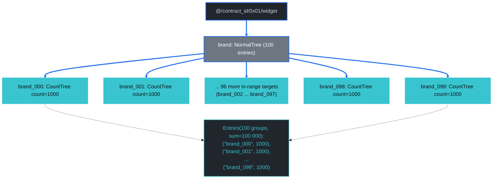

### Diagram: per-layer merk-tree structure (Layer 5+)

Identical to [G1's L5–L6 shape](#g1--in-on-bybrand-grouped-by-brand), just with all 100 entries in the byBrand merk tree resolved as visible targets rather than just two. The byBrand binary tree has all 100 keys exposed — no opaque sibling subtrees (`Hash` ops) at all, only `KVValueHashFeatureTypeWithChildHash` (full reveal) plus `Parent` / `Child` glue.

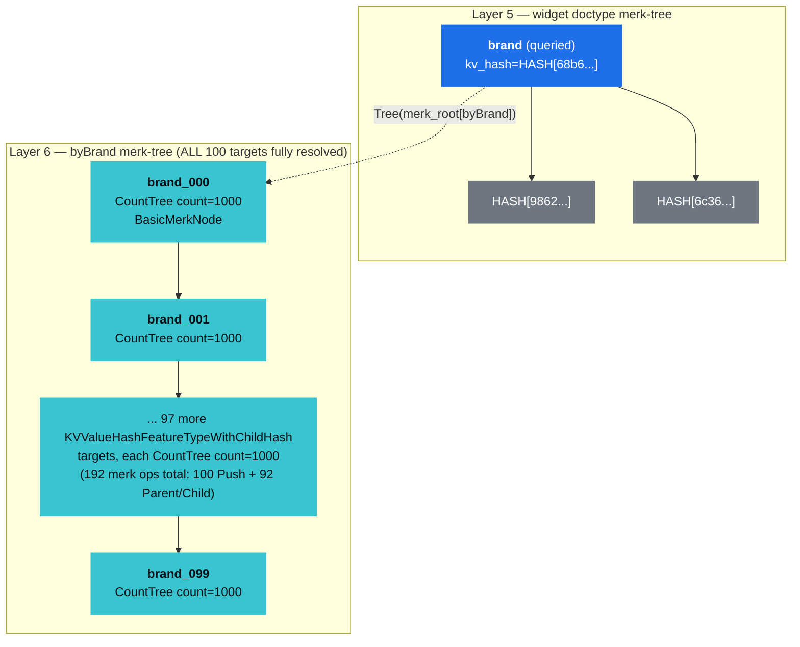

Because the In set covers *every* brand in the fixture, the proof has zero opaque-sibling subtree commitments at L6 — every binary-tree node is revealed as a `KVValueHashFeatureTypeWithChildHash` target. That's the most efficient byte-per-key shape `GroupByIn` can hit: at `|IN| = B` (where `B` is the total entries in the property tree), the proof bytes ≈ `B × (kv-hash + count + child-hash + glue)` ≈ `B × 100 B`. For `B = 100`, that's exactly the 10 038 B we observe.

By contrast, smaller In sets (G1's `|IN| = 2`) pay the boundary-proof tax: the byBrand merk tree has ~98 unresolved entries, each contributing one `KVHash` (opaque-key commitment, ~33 B) or `Hash` (opaque-subtree commitment, ~33 B). The asymptotic crossover at which "reveal everything" becomes cheaper than "reveal-some-and-commit-the-rest" depends on the ratio of `|IN|` to `B` — for byBrand with `B = 100`, the crossover is around `|IN| ≈ 50`.

## G7 — Carrier `In` + Range, Grouped By `brand`

```text
select   = COUNT
where    = brand IN ["brand_000", "brand_001"] AND color > "color_00000500"
group_by = [brand]
prove    = true
```

**Path query** (carrier `AggregateCountOnRange` — outer Keys per In value, ACOR subquery over each brand's color subtree):

```text
path:                  ["@", contract_id, 0x01, "widget", "brand"]
outer query items:     [Key("brand_000"), Key("brand_001")]
subquery_path:         ["color"]
subquery items:        [AggregateCountOnRange([RangeAfter("color_00000500"..)])]
```

**Verified payload** (verifier returns one `(in_key, u64)` per resolved In branch via `GroveDb::verify_aggregate_count_query_per_key`):

```text
[("brand_000", 499), ("brand_001", 499)]
```

Each brand has all 1 000 colors in its byBrandColor terminator; the strict `>` cut at `color_00000500` leaves `color_00000501..color_00000999` = 499 in-range colors per brand. Total `sum = 998` documents.

**Proof size:** 4 332 B. **Mode:** `CountMode::GroupByIn` routed to `DocumentCountMode::RangeAggregateCarrierProof` (the new dispatcher arm wired up against [grovedb PR #663](https://github.com/dashpay/grovedb/pull/663)).

This is the natural answer to "give me a per-brand aggregate count over a colour range" — same per-In-aggregate semantics as the no-proof per-In fan-out, just verifiable in a single proof. Strictly smaller and asymptotically better than the alternative two-field shape [G5](#g5--compound-in--range-grouped-by-brand-color):

- **G5** (compound distinct walk, `group_by = [brand, color]`): `O(k · R' · log C')` bytes; emits one `KVValueHashFeatureTypeWithChildHash` per resolved `(brand, color)` pair → 11 554 B for `k=2, R'≈50`. Carries per-pair granularity the caller may not want.
- **G7** (carrier aggregate, `group_by = [brand]`): `O(k · (log B + log C'))` bytes; emits one `HashWithCount`/`KVDigestCount` ACOR boundary walk per brand → 4 332 B for `k=2, log C'≈10`. **~2.7× smaller** than G5 for the same input data, at the cost of losing per-color resolution (which the `group_by = [brand]` caller didn't ask for anyway).

The win vs Q8 (`brand == X AND color > floor`, the same shape with `k=1` and `group_by = []`) is asymptotic: Q8 is 2 656 B, G7 is 4 332 B for `k=2`. The slope `(G7 − Q8) / 1 = +1 676 B per additional In branch` matches what you'd expect: each brand adds its own L6 commit + its own L7 + L8 ACOR boundary walk (≈ Q8's L7 + L8 ≈ ~1 700 B), with the L1–L5 prefix amortising once across all branches.

**Proof display:**

<details>
<summary>Expand to see the structured proof (8 layers — same skeleton as G5, but each brand's L8 is an ACOR boundary walk instead of a 50-target distinct-walk) — or <a href="https://dashpay.github.io/grovedb-proof-visualizer-widget/#f=text&d=H4sIAC5zBmoC_-2bW4-cx3GG7_Ur9lICdNHVXX0oAQqc2EAM5IAACZwLQzC6-iAJJsSAlu0Egf57nh4uKS3J1e6OHIYONBIl7sw3s93Vb72Hr3v-_sXzP61f_d2_vHj-fP9Gbv77o5ubf-z_tV5cnrj8eHPzH-fvn93803rx-48vT9zchM9u_uWPf_jq41_385-__ddf_9ZnNNnRmqXtZZdZYpDQatUyOi-kLrXNGdqSxFNehsS6TPpKJSZPX3zyye1ny-1n_8NvftOf_XFdfsUvPr35txdrfaxrxlii1hytxr6tbq_SfWso1WNahWGUXqSHuFP2GKw1sT1XshmbffLpzWW02nOPbbi4Bj6w93PtDjOHWEudW1IszefWUluJdTqfwGU51z7mrj8YbWS0_cX65tvbn9NblREbFpXCLK2pW6AG2mKtM7jw9BijTU9ztBqGD0lh1Zp2mtVWz8zu-9-ln9388quvn82XPz97_uf14nfPzmr94bPbpbq5-cXN53_z-od3LObLxzuW9O7C_rD44T9_atlvVy_Iq_pnt7BkWY5e19oW0hg2PU7jnSsl7anuukIbfa4cR_G4euL3eS5eNFOTT34w7neX4nZGP3n0dyv6o3V9oLr3NY_aqmISGGGNyfKaNY4d0rKarNU1V1lqmilIrroBCBfkrWPVBR7bF3eq8eoh71zLILerUWuxAsALH_l6Xab1sPtsHQTGXMJuq1kOQ1bTXvfq3rtH8Wo-atxrKFhWjU11xbXfPZDXPfL2iz-2cq_WL8i7VuAR6_Co1bgf93_-en65vr2tFiwQi5RVXteqjBzyzmnH5bTrCimMEfvoWtJU12h9eYqhGwX11heMQt1C6jG6l_YGhp9WlZePlyO8vzqPrtETKnUfhg2ibKYupYdq0Gfbc-xC8w2PY50-Ho1u06Lme5TBH-WyYh6WTfvi3mr8GJ79Rf9mvrVEeaeQSkqvl6p5sTq72Syr19BbWq5STefo1Xuy1KDjbm37Pqs2JpA3T55n2Ds-PLY3ZeC-x9vyUEYqNdqy5NKTII2btluxAasCpMJizJqnhwYzliwC0CL6aYNmbOXhsd2Vjfsej8Xcy8el7g8B74nwezII72_dy_B-F0L49OaXz__4zbcv8ZHwJaPsGj-9kctr-1n_ksn-lr-ef794hRdj0Y-HsZ5QJBHL1qLEhjiXWqOiRDNWr7liXkLZaTQNwUpZeIhU_eE1eQDRDF2uG7o2xW_Jdl2jbYWnl-za-kVjV0Bl0Q9wlYXR2_YgSE3MFcPmVnJ87NAfC_j7YI-yB5sd2xNir2tDnzkhaNqnmWDG0MOdYJHaaj52wDMEElgPPNPsjy7xK_A_6uL8ej2-H-g6rsHhi9UExkp5RNtVYqg6e951WIglL4lrQvs79y0HOSEsZNO2PHag5UkFrW8VNIed8I0zyFy94TkNj2m16Ny7xYFah-BqkXnsPLg2ynG2OeG-4Zz92HG2pxTU3lHQARxPYaA7qqiOtdNUG22E0YuC-5NkEfOlUHjD8ESfsrv6WDLmqI9urvCkioq8bct6m0Na6YZ0DWW4OW7PMn1ogAfqznCyZwfFDHoYUwAdDat_plAePdL4lJpKekdRJ3hbWLlE2cgZU0sILLa54ExmSoAgFFvTSBstKYKMbyyY3rwn3PVolIo-raj5raLWLVMqXJMIXD5Vw-xjZ_ylhJhxk2Sg2QTFo_0zWieUv2dmJ2O10R490vKkotZ3FDWtqY1fTc_D9Vpmiqat4ldID603mXVkXyPlNlJVXDzqPS2Xldwp96OH2p5WVHurqKsTovbIKWhouBkfKYoGU1FK6RHyD4ZZEBRBu8XMnxipbqx9Y8QezfrhKUWN8o6ibnIH1otMU7FqYloD_qalPkS7w7TTyeNBiyyeWTMTQfKEvKrAB_3RPBWfplDxbYnytMfwXo1x8LdMGsMW9GMOs8QIN9ScCY9LtPraxY6DLE1ioeJujx_p4wzaNTbtB2btuKHHGbarbNuV5u2-NDFLyK5e2yoE3llrqrJ6IUgluCut3BZNZmXWNHQmRA7-yDgwKUlze7RI3O_DxvNnz198evPPz7-52LA1P6YYf-r-bL3Lll0Sx6t_MmIg9xq1V04NSA0cgpK_NxaohaYoo_m5e9bqQBh7NMinhxJ3EiNxp7RF54xOEo9Pm-KPZPC_JNRePi61ewrYfgLkfhLw3obfv3_97VeXBf7493_63Vc88fnLm3hdQeNCtdpeGBU8ya74fpKY7HXulwgOcTkJOExAOOBbQQrAsFhS_-LTm2drf_v5LVu7DaS4Vo1pa04TYkE-CkqY10D6UoegdTl-90RQX6Xx-2KP0aYUPuzF119-dftpDUO1sCCRXJIKaJImOXfyCWKfiShEkoIrDK3snVNCSBmbRn5jdowLnzbOhD-POT8JUm_2zq--_nL94duXxbsg4FBOQNTzLeJrSDKSWiDIzikqmPwQmW5rBHcGVDLEL17xL4wXLkW4itIZ0nAFnZESf68Y49Ok4L7gcg80rLPE0P0mmXQqb7jwFXvvOGsb21o31maMTXKPQ7C6lXiQUd2jJVvvQAPVyxDaIJDtrI6S9Ll5K_ksIe05z6EtY_CpyA7H6Huuc9ZjO6R1vQuN7IZiVsyg1-CY6-O8D9yC1Yn8OwrWQsa1EHBIgrNHEixJotcSEenX0JBYryi7PgSN1NItNHAkIVG-kLxD_doJwH6mi6lKu0D1E5_axoiY3B7DwJHPcxe9SsXkREZ6HXzz1dAoD0ODMJiznJCrumD5VGCEXCLeVpNMyq4jd-lIFoGtnLtAM8dgIGkQLOIdaCBu27KdW1y5pDpCOJLRQ161x5ycLOqj74IFHL4AUBDZrRoeT1VLuwsNyxu7FUkzWmMDi6UorFA7bEF2HIdGGHguWgZEV-yQyBhTYp9Ld3gNjZKuqHp9CBmq9RVpAAMhwQySAcY7n9uJDLuGzagk9VXjjs2SHR6NJknHbllT1w3L9EOW16G3XY0MexgZAUy37kFGM2IZ4baBBBuLFvQZyfBhEzFcIPyzH8IUl4ZN3si9bA13kDHIpnsiPumiOTAoaYqMD_ljRCYhC980K-uGIGC9SYVIBmIydu_F_C4yMN0bSJLBbHob4PVs1Yw4Y10jYL1i2AcWq1ZoYi9TN68QirUVoLTXyEjXULWEB6FR7fVtXZQ45UgwxPaRaPZaDYHThGNczVtRfkZ0TtCgsPjDgHckgILo5AcaV6H3cqvgOmicqP8QNhj9buXMazNI2FpqxAVqwiI4JpcJ7iksNuHNajSTtmo7oeTYwmx3sBHR_wRB1EJPCzRR4AUjYHW8C4QSdwvTcZ5ipV4gkfDcrlDrxi-Mu9jwnjwNIjFj27ougTdbcx7AIzGAFgU1j_1YdCxObBvWNh5ZV_ieNeQqq5EexIa98hpMF6WD4WDJjn5Ox0QF0kI6PIvK0Cobl5HPLl_BXkSN6OfKmSvSOvO-Dr96PTbyI3gjyzgTC5ByxR_0yc-5oAZOLqh27kvu3ImuZIqOQ9BKcxhRujdsgr3hQ6249bbEEc9JFdIAUpqwY_ns5kO3BJQMdeBH8bFxKW84dxVxwLW-wRuJStZIhMGxmDgmF8bC78icoc4QYY_W4TGCDd3IauCSu294PFfa9HveuKbs5WFovKKNrvW49bOnv-ZmvUeFy7LvQsQ_23PTh08HG47tD0NwzUsG9r8WnPahy2v05HKL6UpktIdml0_UvCVFHPYR6akR-Qvx2CeugCBkZKhlbeffUkNsZ4-dULEwprKEKLPmRS-vmZ09PER5tUch50AEBs-xplKityrFx5BcQJ-2ePbhFRzbWYiee0bN4sb3yCgSLr15TQoIVy9AlEfkgHOnQm0T43fcp8wY2lF6FxgRQQ2leFdCASQVdEjL3ltrJQ4aBjzeac3wEx93W_Mv8Gm3tH1N2Z90d_vNe3JXvlMfRuOr6LED7hYDbb7IxaWhA0S6QV-UgmSWtIoFuLSvVeIemPk8e9sEkm7b42HBq9QsXh894iOyB64gMvpOj5GWBDYQR4IhMFz8jNiG45XNGslQshM1cXNjdZ3HVujd7JFJJoYvtDGdOS-IJCIFsjqhPflQxEYSfIMD2zqgUFJpFLFjvVp6w2H6DN0abm0na2kRYwruw1PASaZ27gHjV3DG0kRn7avXc2fbNjF6rbH3azheQ8OxXg2qdvU77dp3pnD1O-Xqd17dsOlBg5bllQjImDlvohnGBZEKYXkJ5sTYtNHi3uJJNCtgT-KQoRUtnuucMJwaVjiQOjdYr0BAut6ipUdYNCew9nYO_HWV2LxvrAYzbQOhrQg1pE8eC0fZ8oZDLgcQc_Ewtmi-23hJ-Syi2sa0koAHQYxYS8v2IaXg3RIpf5zYWIvujphgw0mSrdCafeS7jbdl2LmBUkPCoiG2q_O-c3QJjhMyZMTgZCzwDCdG6ZGwnRdz4UXe_LrxtLVrCl-esNHx_eO7j_43rn3slY-77rsnbcTIX89GzM5KdMQbL5sRfp7eccM-Ux02lifFxqRxjiXtNlchaTWM_bkvoNNSkr-CjZi2WyO6yjjb5KF7j1mlZ-aKLNGhfdRzAgG5IhiSokZH_APJOWySsNjPGzHvcSOmQX5Ym6qj4L-CZBvn-FVte880Ous1VtClmfwjIVseJdZzhoRLHCW5w65NPeQ2Wf_qtRzK2zgleLXxwax-SvjEUpAq2HTK2c4ZpQ3VZKG0nd7YiLG2zyF4bbZ2rhjGPjapOpdZiDzaUw_SiQC9kY3zDKT3tfBn53Q8VvL9bcTkskOB3JMqXWq1o1NKtw4cVus6AtowZt2XAU4CejyHxxJig4LFNT_MjZjZRknQ0YyD8CUYhXM_qmNcc6SxeWHOjcCxuhtvmYpGzOS5K7r2hMzuQKMTC7qec-NN6uXwBCCaDaVeIwQ88jj7EvvE2C7ArZ0jNYh8QlLR7DegEWvYK6xzO6oIOcIusXakcVKE1FAGDrcAq2O0SYgE4QLepqTL7yvvbyOm40KGjtTHUOukcFi8we20GxRYSlDGmTMF3tb7NAz62Y7Cx3uSHMuHuREzY4v9mJ9ehIDnGCQ7ndgCAQgCCT56rZUVaTQp3qwSb8bwrVPOjtjdbA6M6mlv-IXFE8JgDNgo80ZDxZMUC4yRYsOQnePDurlCOzpJvhK7C42FtyIwUelusqSZxBOlstdzs7KPc28X90iUqic0rT7PrcpcyGyMrZX3thGzzj7APN9JKVqr-jlMeE6bpsNtLUHEeTLPwniVnBZyyeccVMnNbIzL_tMHuBGTzjHY6qNQ9pE1-VzMBHnRHLDBe466Mdd52PLFldnjxAt5tNnbbHeRcbbno-xiI9IrtLhDp7WUer56kmpXxAP8FR05T_LsatAH5iIWS3mEfRcZZbgm2KWvqOiO4vpnKuQJVdtK0i7bPJAZgC3tyMq0tqn2qBbyCvb-NmIcDc0WRystZIpQz7e7oC1jUGF2PadQC4G_ZCPkj0hkId5l71itQl0-0I0Y1tCoMZMggzI9iRuldPzBIH3ts7FOLxSfuA3trUYZvSerC-T4bHd39mcLBDeuPcf4Ey3B0qJWewQNsc5zbmnnAcc6usOvQqNrPbrbE6ba4l1sVI27FoFqalp75FAh5nDOIwI_n-RExfoc5hhzd_6Pb4WVAuY8HSZ6fxsxkT7CTYljLWIqGd3UfDyc5FXzeWEdiYWfZ8BxCADJEnAlbeK-Zv1AN2JAcFnhnKSYa2A0Vqarz7YJPlLJSYSDwLQMilitI7C5o_Q4jeOi-kx3sLHzoR8_OyVC97bLnh0FmxWkIcJdCqJaiyc_R2BXa2dLdsIt6oLDfcNsIFAOeCqmdtCaaxiiFlGicYSuXM4FJ3F8bUm9EmZijcDJvGM7ury3jZiYZp6HedVPoup4qnXYFZwWl-FydqJg3QYPMnNPpe4aRBK57JiND3sjpjWZElNCE_HMAwEZdWYCakjRylg5RCJASxEXwoq6erHYKkEaEGHI38NGTMLsK4XEuZ5vrLXZqa8NZEoEJ4JhQUnGORt0vqQV6OGzWYgXPsfL12U38QPciOk9nHMI5ytSVNsKsGpa5Xi-sw0Tt-yUYFSjH8vZDDuJkXaulg9Z7Z83Yv6PNmIw6H5c8tncRg_P-Z7zBWiaJM_lOaMJa_RcNWzi-prZwgSnAbXENacPdCMmpniOdO3gKZAwzsGfWVcR2p-ZAkoLQ5nS-dZfr3LOeAhsp6ukGcK4uy8oco4E-rnV0baFDlPkRAQJzkdEgoeTRBGi8yVdLOXEhodznx0p8ZV3eNNh5rLGZftnHmvru2DbFqIS6oQNesbT3QYOzGWI6EVmLi74GOn-80bM_4ONGJV2vn6FhV8s88RO6uUL3ousaYvEb4uMssmxFTj1oXgJYl8ZPehMOXywGzGp0QqN3OQjGp57Yyk3ikaudh2HayRoKaW38yVEzA8h1i1pPN89SBfn-YPGOzcdK81Et_QNLbWxSs-ppLHOsbLjoqbluW34OayQaFKsl5RzeAs3_8bBXKs7bm_Ba6Klz5HLlBUBXsf-Lpezi3oOoMyAK7B9trwsL7O1YMmaf96I-SlXPXzNQ1f8-Os_9ur9r933yruff9ezbz_35jN3f_7hT9___dXfXv7__Pe7j7776H8AekjPWClGAAA">open interactively in the visualizer ↗</a></summary>

```text
GroveDBProofV1 {
  LayerProof {
    proof: Merk(... root-level descent, identical to every other chapter query ...)
    lower_layers: {
      @ => { ... contract_id descent ... }
      // L2..L4 byte-identical to G3 / G5 (the @/contract_id/0x01/widget chain)
    }
  }
  // L5 widget doctype: brand queried (same as G3 / G5 — opaque siblings 9862 / 6c36)
  // L6 byBrand merk-tree: two KVValueHash targets (brand_000 + brand_001), 25 ops
  //                       — same shape as G5's L6
  // L7a brand_000's value tree: single key `color` with NonCounted(ProvableCountTree)
  //   L8a byBrandColor color subtree under brand_000:
  //     proof: Merk(
  //       ... 36-37 ACOR boundary ops over color > color_00000500 ...
  //       18: Push(KVDigestCount(color_00000500, ..., 1))          // BOUNDARY (excluded)
  //       19..35: HashWithCount / KVDigestCount boundary walk
  //                 — same shape as Q8's L8, summing to count=499 for brand_000)
  //   end L8a
  // end L7a
  // L7b brand_001's value tree: same single-key shape, different hashes
  //   L8b byBrandColor color subtree under brand_001:
  //     proof: Merk(
  //       ... 36-37 ACOR boundary ops over color > color_00000500 ...
  //                 — same shape, different hashes, summing to count=499 for brand_001)
  //   end L8b
  // end L7b
}
```

The 186-line full verbatim is available via the bench's `[gproof] G7` output. The schematic compresses the L1–L4 doctype prefix (byte-identical to every other 8-layer chapter query) and the two parallel L7+L8 descents (structurally identical to Q8's, with different hashes for each brand). Each brand's L8 contributes ~1 700 B of ACOR boundary commitments — exactly the predicted `Q8 - L1..L5` overhead per branch.

**Cryptographic guarantee** (via [grovedb PR #663](https://github.com/dashpay/grovedb/pull/663)): every per-brand count is independently committed to the merk root via `node_hash_with_count`. A malicious prover can't lie about brand_000's count without breaking brand_001's verification (and vice versa) because each carrier ACOR subquery has its own hash chain back to the merk root.

</details>

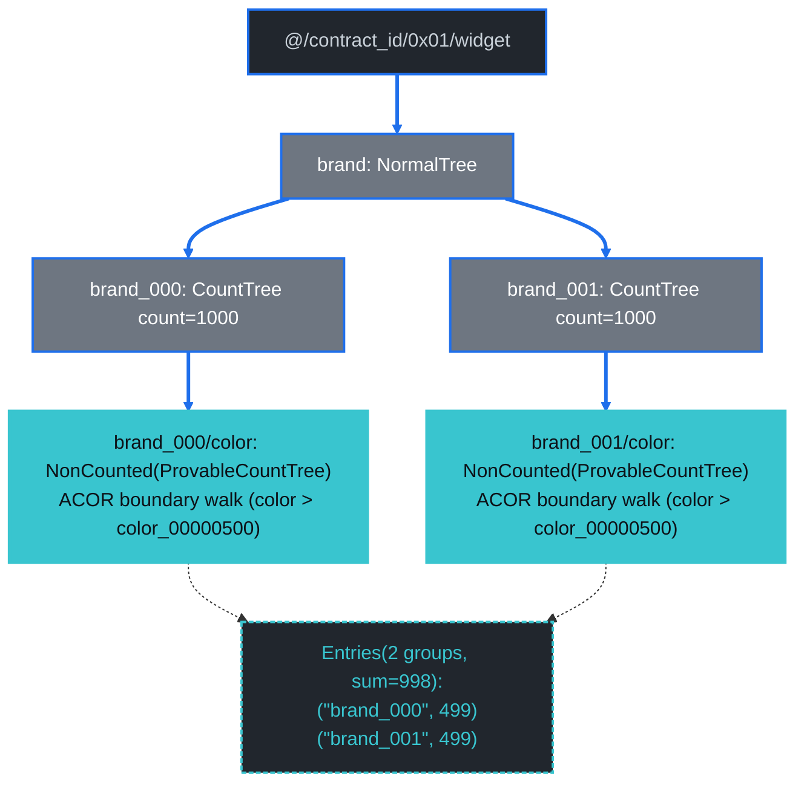

### Diagram: per-layer merk-tree structure (Layer 5+)

L5–L7 are exactly [G5's](#diagram-per-layer-merk-tree-structure-layer-5-4) L5–L7 (widget → byBrand → brand_X's continuation). The difference is at L8: G5 enumerates 50 distinct `(brand_X, color_Y)` pairs as `KVValueHashFeatureTypeWithChildHash` targets per brand; G7 walks the same color subtree as an ACOR boundary cut (like [Q8](./count-index-examples.md#query-8--compound-equal-plus-range-bybrandcolor)'s L8), emitting `HashWithCount` / `KVDigestCount` ops that commit a single aggregate u64 per brand.

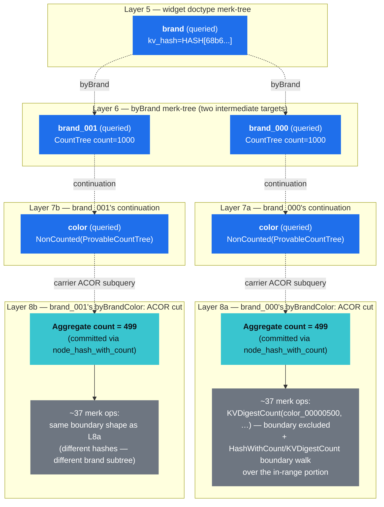

The "carrier" name comes from grovedb's PR #663 terminology: a *carrier* query is the outer multi-key query that carries an ACOR subquery into each branch. The ACOR primitive itself is unchanged — it still walks one range over one subtree per invocation — but it can now appear as a subquery item under outer `Keys`, which is what enables the per-brand aggregate proof shape G7 needs.

## Future Work

This chapter now mirrors chapter 29's per-query structure: every section above carries a path query, verified payload, proof size, verbatim or schematic proof display, narrative, conceptual flowchart, and per-layer merk-tree diagram.

Two pieces of infrastructure made this possible:

- `query_g1_*` … `query_g6_*` criterion `bench_function` calls in [`document_count_worst_case.rs`](https://github.com/dashpay/platform/blob/v3.1-dev/packages/rs-drive/benches/document_count_worst_case.rs) — produce the **Avg time** column in [Queries in this Chapter](#queries-in-this-chapter).
- `display_group_by_proofs` (a sibling of `display_proofs` in the same bench file) — emits each `group_by` shape's verbatim merk-proof structure via bincode decode + `GroveDBProof::Display`. Tagged with `[gproof]` prefix in stderr so reviewers can grep deterministically.

Open follow-ups:

1. **Inline the full G4 / G5 / G6 verbatim** rather than the schematic-with-elision form. The bench captures every byte; the chapter's `<details>` blocks currently summarise the 100-target enumerations because reproducing 100 near-identical `KVValueHashFeatureTypeWithChildHash` lines per case is more noise than signal. If a reader needs byte-exact output, they can run the bench and grep `[gproof]`.
2. **Wire path-query reconstruction + verified-payload printing into `display_group_by_proofs`**. Today it only dumps the proof-display block; chapter 29's `display_proofs` also reconstructs the `PathQuery` and prints the verifier's structured result (the `verified:` block). Adding that to the group_by side would give the chapter parity with chapter 29's `verified:` sections — currently rendered manually from the `[matrix]` output's `Entries(len=N, sum=M)` figures.
3. **A high-fanout byColor variant of G6** (`color IN [100 values]`, `group_by = [color]`) — captured implicitly in the bench's existing `group_by_color_in_proof_100_rangecountable_branches` (10 512 B) but not given its own G* section, since it's structurally G6 with `ProvableCountTree` overhead.

## Cross-Reference to Chapter 29

For background on the building blocks every query in this chapter uses:

- [Document Count Trees](./document-count-trees.md) — `CountTree` / `ProvableCountTree` / `NormalTree` mechanics.
- [Count Index Examples § How To Read The Proofs](./count-index-examples.md#how-to-read-the-proofs) — the four-section per-query template plus the `LayerProof` / `Merk` / `Push` / `Parent` / `Child` op grammar.
- [Count Index Examples § Worked Example: How `node_hash_with_count` Rebuilds the Merk Root](./count-index-examples.md#worked-example-how-node_hash_with_count-rebuilds-the-merk-root) — exact Blake3 formulas underpinning every count proof in either chapter.

The path-query builder (`packages/rs-drive/src/query/drive_document_count_query/path_query.rs`) and verifier mirror (`packages/rs-drive/src/verify/document_count/`) live in the same modules for both chapters' queries — the only difference is which `point_lookup_*` / `aggregate_*` / `group_by_*` function the dispatcher calls based on the `CountMode` carried in the request.
