# Count Index Group By Examples

This chapter is the `GROUP BY` companion to [Count Index Examples](./count-index-examples.md). It uses the same `widget` contract, the same 100 000-row fixture, and the same bench at [`packages/rs-drive/benches/document_count_worst_case.rs`](https://github.com/dashpay/platform/blob/v4.0-dev/packages/rs-drive/benches/document_count_worst_case.rs). Read chapter 29 first — most of the mechanics (CountTree variants, the merk-proof reconstruction algorithm, `node_hash_with_count` and friends) carry over unchanged.

What's different here:

- Every query in chapter 29 returns either a single `u64` aggregate or a small list of `CountTree`s the caller sums. The verifier-side payload shape is **one count, total**.
- Every query in this chapter returns **one count per group**. The caller gets back a `Vec<(group_key, count)>` and can index it directly — no summation.

The most important thing to understand up front: **`group_by` is two things at once — a *result-shaping directive for the SDK* and (for some queries) a *proof-shaping directive for the prover*.** When you pass `group_by = [...]` in a count request, you're always telling the SDK "don't collapse the result into a single number — give me one count per group key." That result-shaping role is universal: it's what turns `Aggregate(sum)` into `Entries([(key, count), …])`.

Whether `group_by` *also* changes the proof bytes depends on the query shape. For queries where the underlying proof already commits one `CountTree` per matched key (single-property `IN`s, for instance), the per-group breakdown is reconstructible from the existing bytes — the prover ships the same proof, the SDK just zips it with the group keys instead of summing. For range queries and certain compound shapes, the per-group breakdown *can't* be reconstructed from the aggregate-style proof (which commits opaque subtree counts rather than per-key counts), so passing `group_by` forces the prover to emit a structurally different, larger proof.

The interesting question this chapter answers is: **which queries fall into which bucket, and why?**

## When `group_by` Changes the Proof (and When It Doesn't)

| Filter | `group_by` | Aggregate proof (no `group_by`) | Group-By proof | Proof bytes change? |
|---|---|---|---|---|
| `brand IN [b0, b1]` | `[brand]` | [Q5](./count-index-examples.md#query-5--in-on-bybrand) — 1 102 B | 1 102 B (2 entries) | **No** — byte-identical |
| `color IN [c0, c1]` | `[color]` | [Q6](./count-index-examples.md#query-6--in-on-bycolor-rangecountable) — 1 381 B | 1 381 B (2 entries) | **No** — byte-identical |
| `color > floor` | `[color]` | [Q7](./count-index-examples.md#query-7--range-query-aggregatecountonrange) — 2 072 B (1 `u64`) | 10 992 B (100 entries) | **Yes** — different primitive |
| `brand == X AND color > floor` | `[brand, color]` | [Q8](./count-index-examples.md#query-8--compound-equal-plus-range-bybrandcolor) — 2 656 B (1 `u64`) | *not allowed in this form* | — |

The key observation: `IN` clauses produce proofs that already commit one `CountTree` per resolved key, so adding `group_by` on the same property is purely a verifier-side relabel — the prover ships the same bytes, the verifier just returns them as `Entries(...)` instead of `Aggregate(sum)`. This is why **G1 and G2 below are not new proofs** — they're [Q5](./count-index-examples.md#query-5--in-on-bybrand) and [Q6](./count-index-examples.md#query-6--in-on-bycolor-rangecountable) reinterpreted.

So **why pass `group_by` at all if the proof bytes don't change?** Because without it, the SDK has no way to know you want the per-key breakdown. The same `brand IN ["brand_000", "brand_001"]` proof can answer two different questions:

- *"How many widgets total are made by brand_000 or brand_001?"* → caller passes no `group_by`, SDK returns `Aggregate(2 000)`.
- *"How many widgets per brand?"* → caller passes `group_by = [brand]`, SDK returns `Entries([("brand_000", 1 000), ("brand_001", 1 000)])`.

The bytes on the wire and the cryptographic guarantees are identical; the only thing that changes is which result shape the SDK delivers. Think of `group_by` as the count-query equivalent of `SELECT brand, COUNT(*) ... GROUP BY brand` versus `SELECT COUNT(*) ...` in SQL — same scan plan, different projection.

Range queries are different. `AggregateCountOnRange` (chapter 29's Q7) walks the boundary of the range over a `ProvableCountTree` and sums per-subtree counts directly — it never resolves individual keys. `GroupByRange` (this chapter) has to *enumerate* the distinct in-range keys to label each group, so it produces a different proof shape with one `CountTree` (or `CountTree`-feature-typed element) per distinct key in the range. That's where `group_by` genuinely earns its bytes — the prover has to do additional work because the per-group breakdown can't be reconstructed from `AggregateCountOnRange`'s opaque-subtree-count commitments.

## Queries in this Chapter

All proof-size and behaviour numbers below come from the same bench helper (`report_group_by_matrix`) as chapter 29's. The dispatcher's group_by surface validation lives in [`DriveDocumentCountQuery::detect_mode`](https://github.com/dashpay/platform/blob/v4.0-dev/packages/rs-drive/src/query/drive_document_count_query/mode_detection.rs); the per-mode path-query builders sit in [`packages/rs-drive/src/query/drive_document_count_query/path_query.rs`](https://github.com/dashpay/platform/blob/v4.0-dev/packages/rs-drive/src/query/drive_document_count_query/path_query.rs) (the group-by modes route to `distinct_count_path_query` and `carrier_aggregate_count_path_query`).

| # | Query | Filter + group_by | Complexity | Avg time | Proof size | Verified shape | Notes |
|---|-------|-------------------|------------|----------|------------|----------------|-------|
| G1 | [`In` on `byBrand`](#g1--in-on-bybrand-grouped-by-brand) | `brand IN ["brand_000", "brand_001"]` <br/> `group_by = [brand]` | O(k · log B) | 38.6 µs | 1 102 B | `Entries(2 groups, sum = 2 000)` | Byte-identical to [Q5](./count-index-examples.md#query-5--in-on-bybrand) |
| G1a | [`In` on `byBrand` with an absent value](#g1a--in-on-bybrand-with-one-absent-value-grouped-by-brand) | `brand IN ["brand_000", "brand_100"]` <br/> `group_by = [brand]` | O(k · log B) | 44.4 µs | 1 357 B | `Entries(1 group, sum = 1 000)` | One In value (`brand_100`) is absent — proof grows by 255 B for the absence subproof; verifier omits the absent branch from entries |
| G1b | [High-fanout `In` on `byBrand` (\|IN\| = B)](#g1b--high-fanout-in-on-bybrand-in--b-grouped-by-brand) | `brand IN [100 values]` <br/> `group_by = [brand]` | O(k · log B) | 1 532 µs | 10 038 B | `Entries(100 groups, sum = 100 000)` | Same shape as G1, scaled from `\|IN\| = 2` → `\|IN\| = 100`; reveals every byBrand entry when `\|IN\| = B` |
| G2 | [`In` on `byColor`](#g2--in-on-bycolor-grouped-by-color) | `color IN ["color_00000000", "color_00000001"]` <br/> `group_by = [color]` | O(k · log C) | 62.1 µs | 1 381 B | `Entries(2 groups, sum = 200)` | Byte-identical to [Q6](./count-index-examples.md#query-6--in-on-bycolor-rangecountable) |
| G3 | [Compound `In` + Equal](#g3--compound-in--equal-grouped-by-brand) | `brand IN [...] AND color == Y` <br/> `group_by = [brand]` | O(k · (log B + log C')) | 106.2 µs | 2 842 B | `Entries(2 groups, sum = 2)` | Per-In compound resolution; two parallel Q4 descents sharing L1–L6 |
| G4 | [Range on `byColor`](#g4--range-on-bycolor-grouped-by-color) | `color > "color_00000500"` <br/> `group_by = [color]` | O(R · log C) | 762.9 µs | 10 992 B | `Entries(100 groups, sum = 10 000)` | `GroupByRange`: enumerates distinct in-range keys instead of Q7's boundary aggregate |
| G5 | [Compound `In` + Range](#g5--compound-in--range-grouped-by-brand-color) | `brand IN [...] AND color > "color_00000500"` <br/> `group_by = [brand, color]` | O(k · R' · log C') | 737.5 µs | 11 554 B | `Entries(100 groups, sum = 100)` | Compound In-fan-out × in-range distinct keys (G3 outer × G4 inner) |
| G7 | [Carrier `In` + Range (`byBrandColor`)](#g7--carrier-in--range-grouped-by-brand) | `brand IN [...] AND color > "color_00000500"` <br/> `group_by = [brand]` | O(k · (log B + log C')) | 255.9 µs | 4 332 B | `Entries(2 groups, sum = 998)` | Per-In aggregate via `AggregateCountOnRange` as a carrier subquery; one `u64` per branch |
| G8 | [Carrier outer Range + Range (`byBrandColor`)](#g8--carrier-outer-range--range-grouped-by-brand) | `brand > "brand_050" AND color > "color_00000500"` <br/> `group_by = [brand]` | O(L · (log B + log C')) | 523 µs | 18 022 B | `Entries(10 groups, sum = 4 990)` | Outer-Range carrier with a platform-max `SizedQuery::limit` of 10; caller may pass smaller, can't pass larger |
| G8a | [Bounded carrier + bounded ACOR, descending](#g8a--bounded-carrier--bounded-acor-grouped-by-brand-descending) | `brand > "brand_050" AND brand < "brand_065" AND color > "color_00000200" AND color < "color_00000400"` <br/> `group_by = [brand]`, `order_by = [(brand, desc)]` | O(L · (log B + log C')) | 807 µs | 29 010 B | `Entries(10 groups, sum = 1 990)` | Bounded ranges on both axes + descending walk; same carrier shape as G8, different op variants on both range commitments |
| G8b | [Same carrier `where` but `group_by = [brand, color]`](#g8b--two-range-carrier-with-group_by--brand-color-rejected) | `brand > "brand_050" AND color > "color_00000500"` <br/> `group_by = [brand, color]` | — | — | **rejected** | `InvalidWhereClauseComponents("count query supports at most one range where-clause; …or use `group_by = [outer_range_field]` with `prove = true`…")` | Two-range carrier is opened only for `GroupByRange + single-field group_by`; the compound shape can't fan over both ranges |
| G8c | [Same carrier `where` but `group_by = []`](#g8c--two-range-carrier-with-group_by---rejected) | `brand > "brand_050" AND color > "color_00000500"` <br/> `group_by = []` | — | — | **rejected** | `InvalidWhereClauseComponents("count query supports at most one range where-clause; …or use `group_by = [outer_range_field]` with `prove = true`…")` | Aggregate (no group_by) can't collapse the carrier's per-branch `u64`s into a single sum at the verifier |

**Complexity variables.** `B` = distinct brands in the byBrand merk-tree (≈ 100); `C` = distinct colors in byColor (≈ 1 000); `C'` = distinct colors per brand in byBrandColor (≈ 1 000); `R` = distinct in-range values returned by `GroupByRange` (capped at 100 in this fixture by an implicit response-size limit); `R'` = distinct in-range values per fan-out branch (similarly capped); `k` = `|IN|` for the In-outer carrier shapes; `L` = the effective outer-walk limit for the Range-outer carrier shape (G8). The platform's `MAX_CARRIER_AGGREGATE_OUTER_RANGE_LIMIT = 10` is both the default (when the caller passes no `limit`) and a hard ceiling; callers may pass a smaller `limit` to truncate further. See [G8](#g8--carrier-outer-range--range-grouped-by-brand) for the rationale. As in [chapter 29](./count-index-examples.md#queries-in-this-chapter), the total document count `N` doesn't appear — count proofs read pre-committed `count_value`s rather than enumerating docs.

**Avg time** is the criterion-reported median of `cargo bench --bench document_count_worst_case -- 'document_count_worst_case/query_g'` on the same 100 000-row warmed fixture used by chapter 29's `query_N_*` cases. Each row reflects **10 samples × ~3 k–130 k iterations per sample** with 2 s warm-up and 5 s measurement; the median sits within ±2 % of the mean across reruns. G1 and G2 match their [Q5](./count-index-examples.md#query-5--in-on-bybrand) / [Q6](./count-index-examples.md#query-6--in-on-bycolor-rangecountable) counterparts to within ~3 µs — the residual is the SDK-side zip-vs-sum cost. G4 is ~11 × Q7 because `GroupByRange` enumerates 100 distinct in-range CountTrees rather than walking `O(log C)` boundary nodes; the time difference is exactly the complexity difference predicted (`O(R · log C)` vs `O(log C)`).

## Group-By Shapes That Are *Not* Allowed

Several plausible-looking `(where, group_by)` combinations are rejected by the dispatcher before any proof generation. The rejections fall into four buckets — operator/group_by mismatch, missing range window, no covering index, and one currently-deferred aggregate variant. All are surfaced as typed `QuerySyntaxError`s; the precise error strings appear in the bench's `[matrix]` output.

### 1. `group_by` field constrained by `==` instead of `In` or range

```text
where    = brand == "brand_050"
group_by = [brand]
```

> `count query supports only ...` (rejected because `==` produces exactly one entry whose key equals the where-clause's value — grouping by a field that already has a single value contributes no extra information).

**Why.** `GROUP BY [field]` is meaningful only when `field` can take multiple values in the result set. An `==` clause pins the field to exactly one value, so the group_by is structurally redundant — the dispatcher rejects it rather than silently returning a single-entry response that would look like a bug. Use [Q2](./count-index-examples.md#query-2--equal-on-a-single-property-bybrand) / [Q3](./count-index-examples.md#query-3--equal-on-a-rangecountable-property-bycolor) (no `group_by`) for single-value `==` queries.

Applies symmetrically: `where = color == X, group_by = [color]` is rejected for the same reason.

### 2. `group_by` contains a range field but the `where` clause doesn't range over it

```text
where    = brand IN[...] AND color == "color_00000500"
group_by = [brand, color]
```

> `GROUP BY on a range field requires a range where-clause; the range field must appear in `where` for the distinct walk to have a window to iterate over`

**Why.** `group_by = [in_field, range_field]` (`GroupByCompound`) routes through `distinct_count_path_query`, which needs a range window on the second field to know what values to enumerate. With `color == Y` the second dimension collapses to a single value, so the compound walk degenerates to a point lookup — and that's what [Q4](./count-index-examples.md#query-4--compound-equal-only-bybrandcolor) / [G3](#g3--compound-in--equal-grouped-by-brand) are for. For compound *plus* range, the `where` must carry a range on the second field (which is what [G5](#g5--compound-in--range-grouped-by-brand-color) does).

### 3. `group_by` orders fields in a way no covering index can serve

```text
where    = color IN[...] AND brand > "brand_050"
group_by = [color, brand]
```

> `where clause on non indexed property error: range count requires a `range_countable: true` index whose last property matches the range field`

**Why.** The covering index for `(group_by[0] = color, group_by[1] = brand)` would need to be `byColorBrand` with `rangeCountable: true` on the `brand` terminator. The widget contract doesn't have that index — only `byBrand`, `byColor`, and `byBrandColor`. The dispatcher's index picker walks every declared index, finds none whose `(properties, last_property_is_range_countable)` shape matches the request, and rejects with the "non-indexed property" error.

The fix is contract-level: declare a `byColorBrand` index with `rangeCountable: true` if the application needs this group_by order. The dispatcher itself can't infer alternate index orders from the request alone — `rangeCountable: true` is an explicit opt-in on each index because it changes the on-disk tree shape (NormalTree → ProvableCountTree on the property-name subtree).

---

To put these three buckets in one place: every rejected `(where, group_by)` shape on this contract reduces to one of:

- the `group_by` field's `where` operator doesn't admit multiple values (bucket 1),
- the `group_by` has a range slot that the `where` doesn't fill with a range (bucket 2),
- there's no covering `rangeCountable` index in property order (bucket 3).

All three checks happen at request validation, before any GroveDB work. The bench's `report_group_by_matrix` exercises one example of each and prints the exact error string, so adding a new contract or index shape is a quick way to see which checks each new query shape hits.

> **Historical note.** A fourth bucket — `group_by = [in_field]` with `where = in_field IN[...] AND range_field > floor` — was rejected before [grovedb PR #663](https://github.com/dashpay/grovedb/pull/663). That PR added support for `AggregateCountOnRange` as a *carrier* subquery under outer `Keys`, which unblocked the natural single-field-group_by shape (one aggregate count per In branch) at the merk layer. The dispatcher now routes that shape to [`DocumentCountMode::RangeAggregateCarrierProof`]; the worked-out example is [G7](#g7--carrier-in--range-grouped-by-brand) below.

## G1 — `In` on `byBrand`, Grouped By `brand`

```text
select   = COUNT
where    = brand IN ["brand_000", "brand_001"]
group_by = [brand]
prove    = true
```

**Path query** (identical to [Q5](./count-index-examples.md#query-5--in-on-bybrand)):

```text
path:         ["@", contract_id, 0x01, "widget", "brand"]
query items:  [Key("brand_000"), Key("brand_001")]
```

**Verified payload** (the only thing that differs from Q5):

```text
Entries([
  ("brand_000", CountTree { count_value_or_default: 1000 }),
  ("brand_001", CountTree { count_value_or_default: 1000 }),
])
```

The SDK zips the In values with the two resolved `CountTree` elements (in lex-asc order) rather than summing them as Q5's `CountMode::Aggregate` does.

**Proof size:** 1 102 B. **Proof bytes are byte-identical to [Q5](./count-index-examples.md#query-5--in-on-bybrand)** — same path query, same merk ops, same hash composition. The dispatcher recognises that `CountMode::GroupByIn` on a single-property `In` clause resolves through the same `point_lookup_count_path_query` as `CountMode::Aggregate` does; only the response-shaping at the very end differs.

For the **verbatim proof display**, see [Q5 in chapter 29](./count-index-examples.md#query-5--in-on-bybrand) — every byte of the 1 102-byte proof is the same. Or [▶ open the proof interactively in the visualizer ↗](https://dashpay.github.io/grovedb-proof-visualizer-widget/#f=text&d=H4sIAAdCBmoC_6VXXW9ctxF996_YRxvQA2f4MRwDLfJRtAGSFgEauA-BEHDIYWxUsIK1nA8U_u89d7WSLe-udTcmpNW95NXd4Zkzcw7_sb3-1f_21ffb6-v5gjb_e7LZfNf-8O1uYne72fyyXD_f_NO3_326m9hswvPN92_fvHz6TVs-vvz3Nz_aYKXJWjVOK7OMwoFCFUmlNyzERlLHCNUpYspKJxZXah4LR4uXz57t3037d3_74kW7euu7r_jiYvPD1v1p8sFcOElmFW5TZZpQs5lCEePoBWGUVqgFnjEbB62VdA6POrjqs4vNLtrUcuPajSwFvLC15dkZRg4sRcakyKXamKlILSzD8AY8lrO0PqZ8EC0j2rb11zf7-3iADGlXTgDGk8SmARikyiIjGGG6916HxdGrhG6dYnCROOMQ9Zaxu_fflZ5vvn756mrc3l9d_-bbn66WbL15vk_VZvPF5i9_vb85kszbcSSlDxP7Ifjh98-FfZ-9QHf4Z9Pg5JrZxH1qiL3rMB6K__QYU4syxUPtbXjmXoy9RXyf5WIlZWDy7IO4j0Ox39FnR_8Q0U_i-gi6p4onqQspBUQoHDX7EO4zRFeJWsWHF0-aMgDJkiYIggfyTN3Fwcd6-QCNu0FHcxlonw2RogUEL3jlfV6GtjDbqA0M5FzCrF41h05eU5PpzVozJhO1Ljy9J3A5Ja4pOfs8Hsh9jRwufipzd_kLdCwDK_KwKhunef_bq_Gz3-zRQhfgQsXLPVal55BnjpPdUK4eYuidW2-pxJEssTa3yKEpALXaHB0FuIXYmM1K_YjD56FyO24jPI3OaozOQOoUhxWNsmoyKi2Ion3WOfosKL5u3H2p415RbakktdlLx2_CY0UtuA69PInGp_hs2_Z6HKQozxhiifE-VdWKymiqo3iT0Gp0SySaRm9iLWqsaMdN67S5ZK0PUF4tWh5hTn48to9l4NQ4lIfSYxFW12jUIkEaJ8rOuYJWBZQKjphTHhYqOmPJRCAaQz-1oxhreTy2h7Jxaqzl3O3Y4f4Y8c6k39kkPFm6f_d283brP_zxi__n1c3L3e7f0-WnEMLF5uvrt69vbnkT4Vd6mcIXG9qtzav2M0D4EZfLz-UdjxRkWLyNtgilItKslYkrRLuIcIJCDRaTLDA1oczYawpBS3F4iyh2ebH5qr151ZfN_et6-P61YFqutcaelB2GqRYaRl7aWBRB4VWU4BJiDG1mSBk6bi3DFLU0SpX8OAVOFtCjSNGfQyrVBNtH05L3OhPkwmlKbTup9wCxh4yB3pkAlk4LBMXjLNiQacl8AqlgkzhwhCwBcVjIYRDBTrlGOAfod40VNrMsPqJLIS1LJlQlB0AsuhapteV8qqjhW4KOBlMXuIlPiEOOiDS1oUqwmlD7GdEjBelbzI5ltMcAVsERjmZr47wr7VUP5_v0vw_UF09k6IZeCf045s46BRhLGi1P6Rq4ZCf2AVGbuU1a-B-CwxTopLWBlrMAlQNAc5gRrngEGt4qHLXCQauUNOas3OFFQjCUD_Yxc8ezTItvzxFnC3TUuTbOeg6gegTQDpYvwKCZA8VkMK4pSkUzgI1lgrelqAxrmSBQFXaObdBsybpTH11W13I4C1GiQ9PZ6uhUS1MIc08IN_O0jNbTU0A3k4mm5JYNLEbQXbEFsKPiILNsoayOlM_BlOIRUAf45jCqEbDhFDVSCQHJViP4rhEjSBCK-lB0yRoT7AZccYGlz3OgA69mKaXzQM0HoMqkQYIWFnGctJFSGK3PDPdMgTO8Mk54oxL0HOWfoeQE-FvG7qh77XV1pOUsUOUIqNFHqvhq1DwUC1ISWVMVuDGcjWqrNKRn8x5z7VESzijwJkNz8WgGuFeHWs8DVQ9A9YYj4uw5hhTQ6FHRkSkFTZQApTE0Bc0fqgmhSU0ZesnMQJelTdjM1V0_nAMq0xFQJ05VMJY4sQmMKGmSAPdWY-uUmqHTDiuthVQIqgVvnKFkeaB5CaEftNV9is9TKD6UKIuzd2uiiANXGWdNmJu2WN9MzOgNkjOOxk5JzGfRxR-XSlyAuOn6SNfZz2W8e_I5659aPb12auX4_LHZw7mPZx7ef3j3_vru6vbv8vnuybsn_wczPWgtnxMAAA) (same encoded payload). The diagrams below show the result-shaping difference.

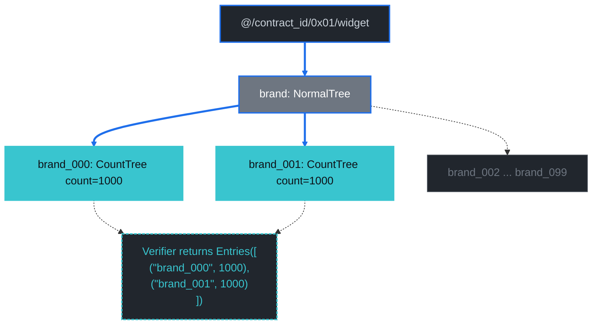
```mermaid
flowchart TB
  WD["@/contract_id/0x01/widget"]:::tree
  WD ==> BR["brand: NormalTree"]:::path
  BR ==> B000["brand_000: CountTree count=1000"]:::target
  BR ==> B001["brand_001: CountTree count=1000"]:::target
  BR -.-> BMore["brand_002 ... brand_099"]:::faded

  SDK["Verifier returns Entries([<br/>(&quot;brand_000&quot;, 1000),<br/>(&quot;brand_001&quot;, 1000)<br/>])"]:::sdk

  B000 -.-> SDK
  B001 -.-> SDK

  classDef tree fill:#21262d,color:#c9d1d9,stroke:#1f6feb,stroke-width:2px;
  classDef path fill:#6e7681,color:#fff,stroke:#1f6feb,stroke-width:2px;
  classDef faded fill:#21262d,color:#6e7681,stroke:#484f58;
  classDef target fill:#39c5cf,color:#0d1117,stroke:#39c5cf,stroke-width:3px;
  classDef sdk fill:#21262d,color:#39c5cf,stroke:#39c5cf,stroke-width:2px,stroke-dasharray: 4 2;

  linkStyle 0 stroke:#1f6feb,stroke-width:3px;
  linkStyle 1 stroke:#1f6feb,stroke-width:3px;
  linkStyle 2 stroke:#1f6feb,stroke-width:3px;
```

### Diagram: per-layer merk-tree structure (Layer 5+)

Identical to [Q5's Layer-5+ diagram](./count-index-examples.md#query-5--in-on-bybrand) — same merk ops, same byBrand binary tree, same two `KVValueHashFeatureTypeWithChildHash` targets. The only difference is what the verifier returns at the end (`Entries(...)` instead of `Aggregate(2000)`); the per-layer structure is unchanged. See chapter 29 for the diagram.

## G1a — `In` on `byBrand` with one absent value, Grouped By `brand`

```text
select   = COUNT
where    = brand IN ["brand_000", "brand_100"]
group_by = [brand]
prove    = true
```

The bench fixture has brands `brand_000` … `brand_099` (`BRAND_COUNT = 100`); `brand_100` is **deliberately outside** that range. G1a is G1's same-shape sibling: same path query, same `point_lookup_count_path_query` builder, same `CountMode::GroupByIn` dispatch. The only structural difference is one of the In keys doesn't exist in the byBrand merk tree.

**Path query** (identical shape to G1; only the second key differs):

```text
path:         ["@", contract_id, 0x01, "widget", "brand"]
query items:  [Key("brand_000"), Key("brand_100")]
```

**Verified payload** (note: only **one** entry — the absent branch is silently dropped):

```text
Entries([
  ("brand_000", CountTree { count_value_or_default: 1000 }),
])
```

This is the load-bearing behaviour to know about: grovedb's `verify_query` *without* `absence_proofs_for_non_existing_searched_keys: true` drops absent-Key branches from the elements stream. The drive-side verifier ([`verify_point_lookup_count_proof_v0`](https://github.com/dashpay/platform/blob/v4.0-dev/packages/rs-drive/src/verify/document_count/verify_point_lookup_count_proof/v0/mod.rs)) uses the default (off) and so emits one entry per **present** In value, not one per **requested** In value. Test coverage: [`test_point_lookup_proof_omits_absent_in_branches_from_entries`](https://github.com/dashpay/platform/blob/v4.0-dev/packages/rs-drive/src/query/drive_document_count_query/tests.rs).

**Caller implication.** Callers MUST NOT assume `entries.len() == |In|`. To check whether a specific In value matched, demux entries by serialized key (the same `serialize_value_for_key(field, value)` the path-query builder uses for outer Keys) — see the test for the canonical pattern. A `0`-count vs absent-key distinction would require passing `absence_proofs_for_non_existing_searched_keys: true` end-to-end, which the platform doesn't expose today.

**Proof size:** 1 357 B (**+255 B over G1's 1 102 B**). The delta is the absence subproof: grovedb walks the byBrand merk tree to commit the rightmost present key (`brand_099`) and the chain of `Child` ops that proves there's nothing between `brand_099` and end-of-tree. Even though the verifier drops the absent entry, the *prover* must cryptographically commit to the absence — otherwise a malicious prover could omit a present branch by claiming it's absent.

**Mode:** `CountMode::GroupByIn` routed to `DocumentCountMode::PointLookupProof` — same as G1.

**Proof display:**

The absence-subproof shape is what makes G1a interesting. The L8 (byBrand value tree) layer commits both:

1. The present branch (op 0): `Push(KVValueHashFeatureTypeWithChildHash(brand_000, CountTree(636f6c6f72, 1000, …)))` — `brand_000` as a CountTree with count = 1000, exactly as in G1.
2. The absence commitment (op 36): `Push(KVDigest(brand_099, HASH[…]))` — the rightmost present brand in the byBrand merk tree, paired with a chain of `Child` ops (37–42) that the verifier replays to confirm there's no key strictly between `brand_099` and end-of-tree. `brand_100` would have to sort after `brand_099` (which is true: `brand_099` < `brand_100` lexicographically), so the verifier's merk-root recomputation succeeds with **no** `brand_100` element emitted.

The bench's `[gproof] G1a` output dumps the full 1357-byte proof:

<details>
<summary>Expand to see the structured proof (L1–L8 for byBrand, with one present <code>CountTree</code> at L8 + one absence subproof at L8)</summary>

```text
GroveDBProofV1 {
  LayerProof {                                          // L1: roots merk
    proof: Merk(
      0: Push(Hash(HASH[bd29…3b3]))                     // sibling: contracts subtree
      1: Push(KVValueHash(@, Tree(4ed2…289), HASH[…]))  // KVValueHash of `@` (data-contract subtree root) — descend
      2: Parent
      3: Push(Hash(HASH[19c9…b71]))                     // sibling
      4: Child)
    lower_layers: {
      @ => {
        LayerProof {                                    // L2: `@` subtree
          proof: Merk(
            0: Push(KVValueHash(0x4ed2…289, Tree(01), HASH[…])))   // descend into contract-id subtree
          lower_layers: {
            0x4ed2…289 => {
              LayerProof {                              // L3: contract-id subtree
                proof: Merk(
                  0: Push(Hash(HASH[49e7…df8]))         // sibling
                  1: Push(KVValueHash(0x01, Tree(widget), HASH[…]))  // descend into doctype `widget`
                  2: Parent)
                lower_layers: {
                  0x01 => {
                    LayerProof {                        // L4: doctype-prefix subtree
                      proof: Merk(
                        0: Push(KVValueHash(widget, Tree(brand), HASH[…])))  // descend into byBrand index
                      lower_layers: {
                        widget => {
                          LayerProof {                  // L5: widget subtree
                            proof: Merk(
                              0: Push(Hash(HASH[9862…9d9]))                // sibling
                              1: Push(KVValueHash(brand, Tree(brand_063), HASH[…]))  // descend into byBrand value tree (rooted at `brand_063`)
                              2: Parent
                              3: Push(Hash(HASH[6c36…a86]))
                              4: Child)
                            lower_layers: {
                              brand => {
                                LayerProof {            // L6+L7+L8: byBrand value tree (binary search down to `brand_000` + absence walk to `brand_099`)
                                  proof: Merk(
                                    0: Push(KVValueHashFeatureTypeWithChildHash(brand_000, CountTree(color, 1000, flags), HASH[…], BasicMerkNode, HASH[…]))  // PRESENT — `brand_000` as CountTree(count=1000)
                                    1: Push(KVHash(HASH[…]))
                                    2: Parent
                                    3: Push(Hash(HASH[…]))
                                    4: Child
                                    … (24 intermediate `KVHash`/`Hash`/`Parent`/`Child` ops walking the binary search)
                                    35: Push(KVHash(HASH[…]))
                                    36: Push(KVDigest(brand_099, HASH[…]))    // ABSENCE COMMITMENT — rightmost present brand
                                    37: Child
                                    38: Child
                                    39: Child
                                    40: Child
                                    41: Child
                                    42: Child)
                                }}}}}}}}}}}}}}}}}
```

Op 36 (`KVDigest(brand_099, …)`) is the load-bearing piece. The verifier replays ops 37–42 (`Child`s) against the byBrand merk root committed at L5; any tampering — say, an honest `brand_099` swapped for a malicious `brand_100`-shaped commitment — would change the merk root and the verification would fail.

</details>

### Diagram: conceptual flow (where the absence proof sits)

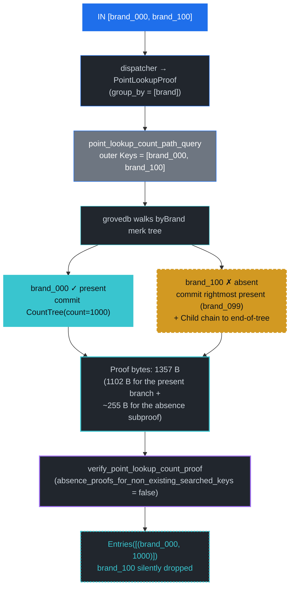
```mermaid
flowchart TB
  RQ["IN [brand_000, brand_100]"]:::request
  RQ --> M["dispatcher → PointLookupProof<br/>(group_by = [brand])"]:::dispatch
  M --> P["point_lookup_count_path_query<br/>outer Keys = [brand_000, brand_100]"]:::path
  P --> V["grovedb walks byBrand merk tree"]:::engine
  V --> P1["brand_000 ✓ present<br/>commit CountTree(count=1000)"]:::present
  V --> P2["brand_100 ✗ absent<br/>commit rightmost present (brand_099)<br/>+ Child chain to end-of-tree"]:::absent
  P1 --> R["Proof bytes: 1357 B<br/>(1102 B for the present branch +<br/>~255 B for the absence subproof)"]:::result
  P2 --> R
  R --> SDK["verify_point_lookup_count_proof<br/>(absence_proofs_for_non_existing_searched_keys = false)"]:::verify
  SDK --> OUT["Entries([(brand_000, 1000)])<br/>brand_100 silently dropped"]:::sdk

  classDef request fill:#1f6feb,color:#fff,stroke:#1f6feb,stroke-width:2px;
  classDef dispatch fill:#21262d,color:#c9d1d9,stroke:#1f6feb;
  classDef path fill:#6e7681,color:#fff,stroke:#1f6feb;
  classDef engine fill:#21262d,color:#c9d1d9,stroke:#39c5cf;
  classDef present fill:#39c5cf,color:#0d1117,stroke:#39c5cf,stroke-width:3px;
  classDef absent fill:#d29922,color:#0d1117,stroke:#d29922,stroke-width:3px,stroke-dasharray: 6 3;
  classDef result fill:#21262d,color:#c9d1d9,stroke:#39c5cf,stroke-width:2px;
  classDef verify fill:#21262d,color:#c9d1d9,stroke:#a371f7,stroke-width:2px;
  classDef sdk fill:#21262d,color:#39c5cf,stroke:#39c5cf,stroke-width:2px,stroke-dasharray: 4 2;
```

### Per-layer merk-tree structure (Layer 5+)

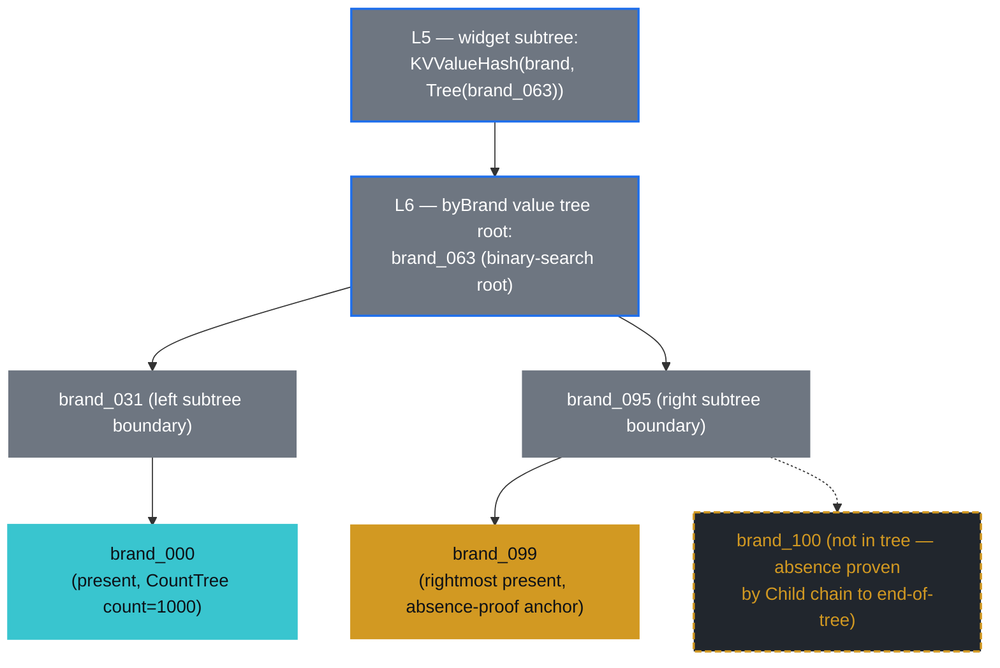
```mermaid
flowchart TB
  L5["L5 — widget subtree:<br/>KVValueHash(brand, Tree(brand_063))"]:::path
  L5 --> L6["L6 — byBrand value tree root:<br/>brand_063 (binary-search root)"]:::path
  L6 --> L7L["brand_031 (left subtree boundary)"]:::sibling
  L6 --> L7R["brand_095 (right subtree boundary)"]:::sibling
  L7L --> P000["brand_000<br/>(present, CountTree count=1000)"]:::target
  L7R --> A099["brand_099<br/>(rightmost present, absence-proof anchor)"]:::boundary
  L7R -.-> A100["brand_100 (not in tree — absence proven<br/>by Child chain to end-of-tree)"]:::absent

  classDef path fill:#6e7681,color:#fff,stroke:#1f6feb,stroke-width:2px;
  classDef sibling fill:#6e7681,color:#fff,stroke:#6e7681;
  classDef target fill:#39c5cf,color:#0d1117,stroke:#39c5cf,stroke-width:3px;
  classDef boundary fill:#d29922,color:#0d1117,stroke:#d29922,stroke-width:2px;
  classDef absent fill:#21262d,color:#d29922,stroke:#d29922,stroke-width:2px,stroke-dasharray: 6 3;
```

**Why absence-proof matters for count queries.** The drive count fast path treats absent branches as 0, but it does NOT trust the SDK to apply that rule on un-committed data — every count *or non-existence* the verifier reports must be cryptographically committed by the prover. If absent branches were silently summed into `0` without a proof, a malicious prover could omit a present branch (with positive count) and claim it's absent, shrinking the result without detection. The 255-B absence-subproof overhead is the price of that integrity — small in absolute terms, but it scales linearly with the number of absent In values, so callers building queries with many speculative In values pay per-absence overhead.

## G1b — High-fanout `In` on `byBrand` (|IN| = B), Grouped By `brand`

```text
select   = COUNT
where    = brand IN ["brand_000", "brand_001", ..., "brand_099"]
group_by = [brand]
prove    = true
```

**Path query** (same shape as G1, scaled to `|IN| = 100`):

```text
path:         ["@", contract_id, 0x01, "widget", "brand"]
query items:  [Key("brand_000"), Key("brand_001"), ..., Key("brand_099")]
```

**Verified payload:**

```text
Entries(100 groups, sum = 100 000)
```

Every document in the fixture, partitioned by brand. Each `Entries[i]` carries `(brand_NNN, CountTree count=1000)`.

**Proof size:** 10 038 B. **Mode:** `CountMode::GroupByIn`.

Same structural shape as [G1](#g1--in-on-bybrand-grouped-by-brand), scaled from `|IN| = 2` to `|IN| = 100`. The byBrand merk binary tree at L6 emits all 100 brands as `KVValueHashFeatureTypeWithChildHash` targets — each ~100 B (key + leaf kv-hash + `CountTree(00, 1000, ...)` + `BasicMerkNode` feature + child-hash) — plus minimal boundary glue at the binary-tree corners. The proof grows linearly with `|IN|`: G1 (`|IN|=2`) was 1 102 B; G1b (`|IN|=100`) is 10 038 B; the slope is ~99 B per additional In value.

Compare against the `byColor` equivalent (`group_by_color_in_proof_100_rangecountable_branches`, 10 512 B): the `ProvableCountTree` overhead from `byColor`'s `KVHashCount` running counts adds ~5 % to the byBrand baseline, even though those running counts aren't consumed by a point-lookup group_by. This is the same `ProvableCountTree` overhead [G2](#g2--in-on-bycolor-grouped-by-color) carried at the smaller scale (`|IN|=2`).

**Proof display:**

<details>
<summary>Expand to see the structured proof (5 layers; bottom layer enumerates 100 brands as `KVValueHashFeatureTypeWithChildHash` targets — 192 merk ops total at L6 including binary-tree glue) — or <a href="https://dashpay.github.io/grovedb-proof-visualizer-widget/#f=text&d=H4sIAAhCBmoC_6WdWa91uXGe7_UrvksL0AWLrOIgIIFjB4mBDDBgQ7kwBIOjJUSQjLYUxwj83_PU7tbcS73W0lF36wz77LN3sfgOZLH4X7_6xf_Z__mv_varX_zi_Ei-_L_vffny3_u_7a8-3_h8-eXLP_vnP_zyP_ZX__svPt_48iX88Mvf_upffvIXf9P9P__p7_7mH8aKTU5staUz8skrxyChlqJ5dn6QupS6VqhbEt8aeUosu0nfKcc00o-___1vnlu-ee7_9qMf9Z_9an_-xF_-4Mvff7X3X-heMeaoxWIrsZ9WzijSx9GQy4hpZ15G7ll6iCfZiKHVKu2sndqKtX3_B18-r1a79VjnkKGBJ-zdH3vCshBLLutIirmOdTSXmmNZg2fgYWalz3XK77zayKvtX-2f__Kbr9MfRUbabFEJzNaSegvEQGssZYUhfHvOWddIa9YS5piSwi4lnbRK2914d7_9W_rDL3_9k5_-bH399c9-8a_7q3_8mY_Wv_zwm6H68uUvv_yH__ibL75lML_--JYh_f2B_d3gh__754b9m9EL8uv422hhy24WR9n7tJDmbGvE1fjNnZL2VE7Zoc6-tsWZR9w98feG5ZHViMn3f-d1f3sovnlHf_ar__2I_sm4fkd0ryaPtl2kSeAVlpia7VXiPCHtVlKrZa-dtzY1AmJFDwnCA-zo3GWTj_XHvxeNX3_It45lkG9Go5TcMgmeecrfjMtqPZy-aicDo-Vw6q7NwpRdtZez--h9RBmljVni2VPJZdVYVXfc59tfyG_myB__8E-N3K_HL8i3jcCNcbg1Gtd5_68_Xf-0f_lNtECBmCXv_JtY5WnBjqUT92C67pDCnLHPrjktHRpb3yPF0BsBHbVvEIW4hdRjHCPXP8jhZ1H5-uPrV3gdndsxehCpqxxuAGVtOiT3UBrwWc-aJzP55ohz-zyeldmmWds4M0_-VR6W2wi7rfbjy2j8qXweX_Wfrz8aIjsppJzSb4aqjtzK6q2tvHsJvaY9VErTNXsZPbVUgePe6hnHR20uUr6NNGyFc-J3v7Y_pIGrjz-mhzxTLrHtlob0JFDjYdrtWEmrTEqFzWtWWyNUkDGbCIkW4c82mYw1f_dr-33auPq4m3Nff3zi_l2J9zD9Hifh5dT9L7v_8ldf7b__t3_e_-unv_zJ593_Nl3-MYTwgy9__Ytf_fyXX-dNQq_MfEr8wRf5_Oz8rP8TQfgHPvV_fvzrPGokg2ub1hNMJdKs1SixQtq5lKgw1IplFCuImpBPmlVDaDlvtEUq48c_-PJX_V9-Ov3N_c9frP3N05JpVmtNU1vcCKaaZQ3ZuS9nhIZWaYJKSCn0Y1AZiFvzGo25tHIt9t0pcDmBvjNS8i5SWhXZJ2fonvUodLHllNo_VL8DZA-Nkd4mBKudEQTGi1Z4Q6NlixeRCuNIDDFBS0QcCbkGJDjFakI5wN81VWRmdh0xS5aWfSRaKxYIcWl3I3V3Ov_-pH4S1_gyrsDSCVoCSWKKaiD3FjKA998J5F6A7lDNG_0Y9ukyqrU4C2TeVpd8EdddlyVQKOgoR_tsLsGAyLX6IIok_Co9IedT7IqYFwVnJcRQe0A757tx_TUU3XqwvQhrejmxO_RtcPiEG7bUlBtz3Sx1bfz6romJmJjie4lNmIXpyFTvpnUQ3nYR1ujDZVm0aGhxpTS6z1hkKFSUg2ZQIp4aQgmo_lonQmqeVSztlaDJu2HNj9K1vIirvosr8qhVWZqRrjsBi31PBBMWKs8d46qNXJoWa6iCnG1EPKiBg3MhTMe5iCuyAs622HvtceUciLC1M6Ns_m2n6kanFmUOaJEJakKu_Am0rMrJ9W5c64tI2btIBailyyyhkVApVsARiseEHJ_VcZCYvWkmgepKKwYsY5eF0uxjpK16EalcyLVqPZ9ZEDJr7B0P0p38wumsmIdgTEUwoGMXIADraZuY4i5s7tuRao8yUN5wdn4XWCzmHu0guceaKREwRFZRYA57L4hQJ-zYRuXbaEaYArfY2igqrc8arjhbbB8MEtoNskEOlO4DGCODGDRJCWW0Mn25IMiIHduKg3U_K6HrnLc5W55ApsRHj35DXOXdMEDKsRPqEw4pzoBoWWjuELFRKIVKzufgJrc0kAFZzqctkI3gYUWRXwyDJeD6AARb8R3I5hgwWUG6KL_WkvWdwhmtAe5OmSfGFDYqO-SxV4i3h0GfJfgb7qovMbZKnXO5-3QsaD1uDXPxHg3iR5NuPMOZoERJe4KTPZ5zho2KT0MZXES296myRJKudJLsoNBdn6BGWZaNAK565h4R2VsBqAy0NqQCwkNam7e5S_KLULV3oRKLZWER-WcuKGlh9PhvbbI7Zj6ToEZaIKsR8ocRkQK_Z7TTPhVldBEqdZHVdiIChZzbSeMy0tBynni2UwCcjW6YgUGYc8ZFBGP0BZQO2PTboSrPkvAFfclLZxRHs5Dh3JMJQPSA2Ahx74DwX6sZUvWMVc0EuMRyY2PURlsVGNAtVyhrALSYMSp5Hnw5BIiUH7ORfRgm0hqJWsvkW2D4qTW4CggAbdkPdKm0J7gZX9CXvDRSfa1yKjapaw_NAMsY9EhjJmcrpdXe01nbFwiD9npqzK3qwkD6KrPuK12w1-DvT6e_jdQFd3sxRg3nYMtAxuqv0aqvPgQcxR6MKCp51kLqnttGSh6lbIwvIvvSSvlSZrKmoarBGAbgodRPGbYWLnNkcC1kPVA4_p3wt113NAuNAZlyFdltGLCj9SCxdvGh6SMajrWEI3nUXC3XXYxXCG63jBKZOC6EQfWJcd-iviBveWmPCgJ-dCUctqZZQc_s4vSQFoQKk6SlfZxi_WxjBgo8Dy2TsbJbudRQG0OERMrAravyhnSX3pnyU_GaZHgih6Fv8u-I5rLKEECV4eodL3s_CZ-Rd3xB3vLSIKGAeupLiWiog5lVYsjxFGa2I9l2ysW02MikUD8lzL4r3DU0ms5Tr4xnOLFkDT0r1DXKqCJkN__GFmsBrQ_GPjJA6QT1lyjbmhPYMD15345sfoSb5dGj66NHtxeD9tKr-WzOAUFvAV5vtViZpHldZlCRRUUPnbPw-tDhAVk2CYwMyIza6nIlI0KW4yKh7R6nw3MCSWSsjRnJsZ6jLjHQsB2JjFBp0xcRYkuV567n9jJgCs9Wt14sG8pLs9ZOyDnjZ9cZtaDpE1N-x35cVja874HSWqjrnFn5GIDDtBEx-ocIzSstW2sZG7UakMImKDvGi98gxDqsCiQXtmHOZsVV97kPeCdMQOwykkZuR_YNfZW3oUrQMqZp1rinkG-KjU0b7t6kYnB8jmToTn2fFD-CX2o9WQq-Pl0tWQ0QKQ9pLuOQa3JwVRMYJtXPSciMSBLm1nvDdGnq-LleFrw4t2pbt7VsSs-SUF9E9qWhaiirWSr2PkSCoBWOnsFXZNZgwi_3QssQTG3CgwjUriORl8s3AaRdrfLj-tvIQPLRyLOCEkAucxsFZxWMrxolmc1EWk7gnqiD8JPxO7i7dFsYJHuCm-mF_ZKX9msDYbFU24IrWhNnSUBPm7PmlQYZpaGtWSWAbNb4vIxxYHpJZGxccqllfR8aRFDpu-eBV0CEYfEmHIicWMc0lX6ab0VKKmU1Irp9YdYAl3I7sM_sV3phv-JL-zXIUOTTLLiwKhrPhi6Gb77gQK3jwdKWkpJC8zW0pGmhO3T02m310C8XuXBn2VdvefqK-I-NWZUlTjTtWBGUaQFJ6Ow0Eu427OIARJof6w_A4AV5x5eGCpevCMrSEEEl1NpjzjVsqEU_-6voV3wBpA4KJM2CFVJf_4AREoG7ws3SIGaZCV86UyJaBUbZp0pLXmuEbNtu2Do53w5onBocn1OqYGfn79_eQXlG3vqCvONLQ1U7kw6jatHwTeOoJTl7Q7UlB4x_9QVXEmWXEFZYkEdfGZArrndatUvyFqnixl-GZvwEc310pjupLKWlOPhlV7olLt85LY0_UOWMyCvAw92O7KO1U02PHv2CvuJLsybYTPXFOqn4Tj2hIqJKCuBp91K3OGQxg3FvULyaTNQBuhSw7Lj8feVrW56lr1baIeadv8GgkMttBI_ymWnDXHVuEB2dq4D6KIzaOb5ZvvT2grfaswR_wV_xrVmbISnJjAXe2VdOnPM3cWxlj8g_4WjrqAbsa4wj4Nt0LKx91QbKXG1qYxGaodRyBl2zL0qmo9P_EEAU0K2D3CaUKfWJ2D28Ch5VLfs22Jbbul9fbPzFlxYphlpEE5QEcadG0nS0TlVUzTjVSoKcjlfrdKktdywtRrWJkjQg775C2Xl8CQp0BsChublR6qNLCkfGsbwshlWmABkRI7aa7_pn8S1qNP6672u1PkvCN_z10iKdFpH54tvHQCuKZpfuW6ru5mvjGwEtqf30qBDcKvipqaiAZdn10NVGYc1eLbF2aUutWupLBIzYa0Sd0Dn6FvxGw6a4Q0gxx-MLCbiwD4iEu5G18KgE4A19vTRUJrylE3lX6ewSx0kYoeaVN0l6bjY6jltnWRDPDLKSKtnrBX9SBId6hZtYp4CD72Yq2LGAwrc5QkWx5h4cdiNxbsuwVwHOSqs33BRey2tXbtOXPatZsRfLh_GlocIXmRjhOr211g8uignMDC1n-aLr0VVHh4GQX3DSiVu7b2yfsQbAcLXItcwJbkSpwU2w9Ih1RaWJF1OojM2v98TwVSAhuHWTHNueIDZzZd5P2Tfk_dIixdx2Xh4pV9XIzk-ll0pDiVoqQOlwIN0JE7_RmKMeEhIe6qmQPlf1PTl9YktMU4Q_omQcKMEdwwW9Ta-LXL7aXXsYxHIkvD2mFJcUQq-3V1rtGXnbC_JOb2v3sJi-gI_l2YShH9JhB3Qk2blLIczYcKyOWsOB9h0ryHfM6yW8tu_KfFYvXCsGHJ9R5vKaHh_AqqskZOha0FkcumyTeowoWtdgw7xkYw3S7W1Se7R2ao_WTu3R7ld-hOD5BYKnl9ZuojaTnQNpjdEjwjNMACAXoHwA4DnM5gN0atKA1gDbca_N6oyjoGGvRMf2mkuVE07lF_DVoSRJXqs4XVLDiCtDkDKZs0xGS16VmAs8KgdWuV3F9QzB8wsET2_LDtuwgI2VmS3MIYr_Z0JBlWBFUF8bFE_sAsK0NXC_uUxQBoM3W6vz0lOILyr40Y4eli3FRmCUu5vCnENqJqiQqAWg99CC3LJMFwKZF11uw1J-geDppf1a8SCI8AgIh5ahIHR7mKI5lI7TnauYH3ApOS6F_4ocsgrW92L4Pu1qr8wPf5TQNWOBccygdM-EJkxfzOWZyWyMNyDuVW41KCKCcUGoIGGW3S_HyM8QPL9B8Jf2Cy7KOpskwUzgfnYcKyAr9tm4oLIzv33QpaEV3JgMwwKcOBFtCFoCcxHZVGDSOMhF8m1Aoi0FM98rsINaCHtDAmlBC3lU374FOJoXOfBDIq-3I_sIwfOL1cP00qzpwtFrdKsKazXe1dHTa90ZGgTodMe8C-IYhZZQDwaACtNUMjCIwLpauGkjYdhwbGcOktWY07EyZENDmxnjlohit9JHtVGQJshrqDPJCKeH2-uy-VnxYXlRvZHemjUvN0pM3O1VV_hgieLV8KGm44XAu-OJMVTVF1eORv61QXond7bhcqewNSAmnDUlkvoHHlvY3lNPAkYP0poPc0nXsnlN_dpp-OZi7-hg3OHdyJY35P3Sfi0MUcq-37KkewHsORZRTzbqkByY7lLSMB212SkD5TsW6diD7xTOc6XPJhPWhdxZPrld6Aae03cTDxqgGeqt9THVqz-TKVZZTrdVYPneer-9hF2ekXd5Q94v7deco05iN7Vt84pIMqJ8lgID1DrRrTxPaQLIqRXfxG4qOkc5yOCcLkuLCWSbq2njSb0CEHtF1DampMUeGulZscURwM65xIgDxPyFhYbgW-s2eZdHhwbKo92v8oa-Xlo73G6qwWsyc10nbMsindTDwwa0gaCctJKUvutHsNYeeOBzkEhYu5SuVg_9qMJu9VMTl32ZazY8sQ5xn5cwxKQyXmavUBRzCSyI-Wqk1NJt59slcuXZ7ld5wV_60tqZS8i1-q694tR4w02EmCBOMbcg6ujQWg_hU3TZc_TdXaulHjQmqXtp7YLrNzteHrcCY6Npz7xxAAg8-DAcP8s5cZOSxogwZ40Z9gy2T5r3UfbF6qG-tEhbQ2zTprSSTjAZGSnvdW5RmMsKEfVVI6kR5vos-fHuMvrIpldgjMvVQ8DYzCVoEx4eckcr9WyzI4IDrwttWne3yaBsL57pPNIXczM5z5-7fSDj2e5XfcFfGt_WFu-wFCGqR_aA3LvB914VTHpoXcy-MhafwTUaU941-CYhDrJPCPtq28U2HO8-VWIYuZmvveImVjJDQoAjSLbq69syeg5-Alfi_BQf7YTRuB_ZR7tf9QV96UtDhZtZJad6vAA4IQHcTfmMh8eY4uuzenhQD-SY7tQrdsfIX-QTUkrKVaELwSFVxyqrEmMwYTbG5Ow8dpxpSokrA8DReF4BCPqZlhMGNB4__347sM-KD-uL4kPVt4c01zj5YJ98d7VvM965MjVzK4Uwh69Xtqrv6hddQzFIiP5RhOkOJ12lbGZIOlMdliH1Z1I_JTv049RQCchVpFfMzm3aZwKK8PvidV4r9XV7vaS-IG99W_JXO0gFsI-U3QHlkuoMZSs4Zv6pVHj4U4w2S8MtbT_RUubws7stXJauIPilHfPyrRmarE8FN_HFtEpR41dLDd4VBO2QC_gZvOSWHETJyv0l7PqMvOsb8n5pkXo5C1QzJxzzkz7kV3GXeI5v9HWvylvo9yFQTBqNjB34mhRAPJjmqnSlkdGt-FkV5jWoiy7ojJwVmfG4twpeeLxj8HWVExFfra6Gbdql5FPvR_bR2ml7tHbaHp39ai-KD_WlWQMqofgYFYpHTC1JO1uDp87GpjAuTAjMhWSvxfACy5z86PrgoxyvdrlYMVgRbRywJ8Xbn-j8MJm0FbqX0YQQewOLvRxp7yVeXG-V-TIFl5jL7RqD9qz4sL1YPtSXZg3snHVC5rwxjC1KXr1GuyRrR9rY9dP-BQ0VGmJ0pLibjmPFiwUN_r86MRsHgn81Px9TW9mhYYJrO6C4K1uwlwlRJpo4JBkN0eJFjyjkgtCFFW5H9g19vTRU6hpnDt-RdRYzVPqIIaMQYihh-SmCFdzoBy_mBbXjrrCMlw1YB1Kvit6C7mLqedqJGCPgHaxGJQ3RDF6HiBLIuzFGpW8Ev1eHbWRdS75jfltxtWenttuL6g17a6jSQsFGL6Gcy0_D5JO8sKdq6xjJGaYvXJUOUR1DFvDW-zihC46BB15Vb_jpTrWysaWnMoWDnxgpR8jbk9VLDDbCdseyh61IRiI9aow9-ZLYub_S2h7tfrUX9svenuYiU1Q7kFWbVZ24RixoIKLnYP39KCXetSIv3RT47nVETEjkoWpE66r4MLne8or1rNtgOzH-xvAC5QGj6uwYMEt5acLpffwfukJdn50p9-s0eXMPz3m_MGD20oDZUhylmYm3EJkVSEM88LW3IPD1UPVOC2fU6Adjh8bTDAQNfs6rM6evJBrJxyQwfDEpW0at9Yy4rTRvXEI808zTT-_AUxLTQvL6woP3Mmutt3A_ti_42972u0BolTTcoK4A-uMm68TuzJi8SGL5ftWcyc9y5Yk_YgaKr0l5PxfTJJf9LmIFNLKkqA09nNdnC1BTRikPUpnJHyI5XsZce-QPFpCXM0niFen9WKWHefiCwe2lq_I-DbP0EXwhLswcas0L5zjDwK7jULHw3rYtrC2Qu1dr-gmOeWyCddeCNnuHC8UDWCm9nUxCr4y_CKl3ZU7vzORPJfiRoF5rWmjoNTAi5Gx_EttHK6iA9LOHv6Gxl6atxrbTihJLBEF9Z_SM42t0CMyE9kcIfLZfrccwxOuQWmx-ANSL5rVcnvDUHFNHI_QhlpIGuGkm5Kh6HefxtcU294p-KKx_mhMFRPIxzKKvDt4_lBzqwyx_w2QvbVuJfetZzGc_XpD8wHzBlW7-546-FMRS9ZTeE80JJAYvURR0wyZieiW-FKDuy1vpMUtmTqanf5qjKXRpfiBs4IQlHtWln91e7IJo6ZKyaVz322q82AW0l24pYN_RPcrMnLI96bx7opiQNjHglc7yI548QH2XJDoe-J5WrlnXylcrWI3BQx5NP7s8cpAJonpvi4A7WBUF508L9FVDXrXOEB1UcW74KyJXHsTq2SFukTdM9tYvleYKvMWA2GHautuHvjCDa8BmdaWiDofm0hTDEwZzcUsYQ7BElzXZmCTz4wvp08vR25ZsP_LlX9Thy6054rcguTxO7vucXkfCLbktQ07cR1t5dI5A5A2RvfRXuQ9E5e69Ms0BNGKXREr5iAKfnwFSn96T6IRYAhmbhkI2q1aUrF6dg5t-kPP4SmtbK1Y_xjoGz9N3L1p4YSUAqbEPlNrxPhLTV3gXGHBaD_eLfkTsYdq-WE_MLx0Wfj4GyVgrxZBiwZsXPOF-vP9dx3cT-y2bWGbvlpd041i9MJMkziDI1dKrn0YGQSVamnjdUVuL57TMHJhyYgVZQCMkCIYBEcZ73n7QWLwZR9D7nQTlBY3nl6bJ23wJQZJyzvJiB-gWmukadzS01knIrbJW91ai6r0yfJtuRRPs0-mXJ7amE4xXr68KeyzvYDKbN4ix3avXnhVAA_EAsmJqdww95BFsljwy6Xk_Vg9pXF7QeH57Zmt5dxomKwgp1sTyZxFlrc0zEOnqbYM-DbLyap_yoBFIMIIWq2_sX22ueFGkHx72g9X1iCzc7ZnT1qcTo6Y2vd0dKjaixj7706Q8GFP66jzz7djG8Kw91sNuWs_aacVnWB712cNfLK3ll_7QXQvA06WeWvcJqGKvqfXWEAWPPY-7PH7SvRATuNbqrfxa0TS7kSmXS2veZw2DdNrIjLstb2th_azlJ9jT9uZoGaL2YwHDYul9pTlWHbjwfv-krsRna2sS38DZS3-IxGttZz9eDuZ7mzImRsreca-Acudz0v4gqysibWORT0m6_HRvcxFytQbE_N0p2RJtC2vjtUt8Kq3I2p8-1JWnXOnUs8_K-SCfETE5oMfRMF3ux_bF5lB-6eBGNBSziyudYC5-wIygoB02EdEDcBeAWZZ3pykosdL8iBnosjO650qCoNMGaG5-3M78GOScPfuxxi1pBfHdyFmzeaXpGF6H57ug0e8DSMkPnt6P1cO-iOmFK8kvHVzYScIZPbQ1xAuGiWVoMfkBMHzV0DaT8j3cFbqaLPQDuH6LAd_tJ1429fF-SfAIsznu0pjVo07x9NsoGWiD_PTm6JthzF7_WSS1k86CM6as-3mYnmH5m94c-aXhQz6g1rzxqzYi5WfuMSZMct6_uIq2kLQCd22bQ-cuelLXT23YaJfq7iATsZE2mMK-UBxKGwexgquWqsfMb9to-BRvkDK9MqI3EKUY7qXL_TN68rA5h7zpzpHr2w7IB8_r5-xziYOZS-7mJX7sokxNGL3o7STVySQCph7UlHL0EpJu9Sq2qxYp3jnOryrxtsbmZrnvOJeL5J5gqMIQFRnbgnq1LtntTdq7-fnq-7F9Q-NvT5OJgnFM3ekV3itM37JS67nr9IsmsmZUnGGt_FaN7B0RjmDAmpKL4_LM0yjTDzWAGsWLHrCE6G8dOwMLU7191xp-JmE1Etz7nKk368OTe18TzffNcXpI4-kFjZeXDk69EdFYZFRSZ1Hz0iM_gOt9MdFOMW71M44h92QH61BWiCRq936Gc9llw17roManzIMs9zON2iMmse0Na4uXyVcCjTFGeq2DNPAu5wq5h8KD7se2PoPPR3UOoi-IrLz0h4AANC5wN06jxjR8zUJ26TX77gIyALPojY8a7J1Sxez0yJQWENRb8lwRGTiDMU_ezmRHmKwaksCvoJnNm_yBt-Ktwrt5y3RvR4HmAMgRwTjteX-dQh8ur-kLJisv_eEqG7V-eve1tdl0Le_Ud7qSphl-W2PphNyXHzGHekh60vFYWp_d26t6UYGVZj3eYDkySH4LT6kOPXH0480WfWl0b7I68pyrVG-TaqUH76SMALkf2xeFiuVtoWJTBLaXc4V9JB3faV0h-D1GIn6J1KzJ345L7xaaN5myYRvOQbkiOa-WxImm5XlWHJ8VzRnNMGPdu6aAqBJm3dsYgzq3Vl5px5n5YXX1xnMPlnn1YY9jfcFk5aVpClGdaHoLXg6wk6_NAqdngpcL6tmWRoCww0rDRvTN7dB1Wy-b9N2XjeSB12YtkVrJm3SQeCv3Du-XPdZaEcwI05vZkKte4oxxiIC6Ev8z71eJiT7bJXvTqqO89FheLgCP-5VTCBto3_tLbi211ZbdcXWx4-cZBySACKpYruxVtr4DtPu6PJ0fMaJM4EjOduLmDanOp0yha_cDDebLejsjTv3ImdVjJZt5W_8xwv3ltYe9OuRNs47y9vxXmAs427sm0lHi0P7psjNVP83jc_aLDlCe3qez4DQ_p51M5ipZsuU_sQO5QRuvt88TocYzAyoOxOonZUvN3txKAZ_Nj4_gvkTWCq1HLwG7HVt7Q-NvGxpq7U389rssdfqtBY6Ly7VO8gscQMu8vDyoqx97jQBp9P6DvKXmDd4uO8Sf5ccNuy3fAdsDdPArYhJqIGxMAU6sJBwYvqzCb97Jc_g1NNEbcZb7HeLtIY3bGxp_2yM-NQE75Qi84ScEsoy4-vCWZ4eUPGkZ_Grisz2ZH5oFWyXjLKd3RbjaymGiWlhI3oMcCGn7cXdv97SU-a5opZ4cQ4KuYK2pePl8b4jgiTUdD_Lw2cqqPVtZtWcVD2-6VpS3LRMXkiH4wdjpnSZlwmfm7mqO4q2QydPQK8QVsQfVO0VWK2ENhuGgR_vlpOBNe5dmPxc2XBc3nm-2CGZMYxTbBJURvT6i3m1VmYYhBQlW4gn39Zc9bFlvLxYXa3h7Ymf6FQhgQoaBCiGTT9Mk74J2ZvJ2EW6fizfjzBaQtyi30ar6ck4Wuezz6c3pvLe3-h0M01dvVUqoMfh9iqDwxAdOJO3s3Zc3xx75nFWKF1KO--Uh9oLI6tvWGjXWriiuuMkcWCt6J0PkqAbvgIznjX7NRlCgU-dBLnmvWSQr7zy2fbUQO-Y83QtAkxCrU8iudCRio09VnkxQ1GBWBOzjDGd2b6oYa0rGnIj3z5BKfli4-KZtSX3psTChYIpCTd4JyRcIpu3dippXxe6CMCftDmKh4IxO99aJBYk_ySsjY6_aSUP4Ef2PUfC-XcubA9c4SWv10SzB_MwPGYo-0YpJBmhWNtxF5tv5wQUez3bJ3vQtqW_rHH0HEj3hx0Yw-2fN1VfxRgPeKS3XT9_S6FcltEYUOilbwlmddCu-OnB5dgwg3OLbmWMl9av5EoOzELqposwkn7iD-7ZO-Nde0TTvutW71c15v942P7Rk-YUlq2_v9iJMG_t5mK7Fe6bGjDJDWvghr129R0zI3qLAi-5y570Er8LzFX-v3L-ETx-dpJv5v8pB6hWmxTkCv5HBBcU3kLxEPXU_ibaa9_YaAWFddICu92P7gsbr23aI2kovA_3tRSx-hI4MOsGbtPjZguUa1pdZvD9q4gGaEV2nxXmgBPDvaorvjmPy21XHLlGjeD3ZdFknyUtGlud7INZ5-MzuBPMsBK8Gq6PZ_UXr_JDG33QvqW8v-Np-7g6y8C6TTeKyFo9XBHotQ2y-YgpH-V0ohJ3kaU4vLj8_wLAv28IgorSaSyks6hgWgvdMMAyKN_CbyC1LUbMkn_PTL0TCy25vD9Nj3A9i-2xltTyreHjTwqO-dHC-oz_9avVc54DUqsvS6Hwmy0vsEZDF91TJShJQ_UTpZtTSCUfTLJe3KAZQxFDCKNueyjDZwEMuJDq2o2j0i61wM7N6l3q_dIg5lvuMfvhvPDjd8LCHh7xp4lFfOjhZM_VahBcZjy91Myf90EjMw1tNDRBlqR9RRSEcJPFBNPWRkp-1UcJ3tQDmvTsbihYzXHx_4fi9TH7oxBraFzmMrytkdypa-JtpMMUAKG9Rqbym-7F9sUVY317zdcA2v6vU2xd4jcUOZcEVI63j9ynrKXt6eWEFhHvirXlbMcP6nHhOvSxqkpjAVj81s6OfTvXTZQFianNXLANyrXqrCUAG5Z9j3mHXbucQTKTBfdNUHhYuvuli0t5uewkmvsRPi8gD6aoXYJxIZhTvpZ6ae0UMDfRd-w7Rz-I3wdd9jpFfXjsB01n3ixbGMtUZevYe6tnW7nEsX5HpCYQV-L5r8TL7MDLwDcpknfG-WC3lGXy-ILImbzsgYahMU97Lm9S3kMqn2cC0lAbKdAQymK9OEu93wBfTyzvxSTtYuyy6WhL0MDbFJZP5dalAtIqXYAGsCIyyTkvNdxUZQi3JPlvfzPMUe3-wj1UeFrvUF4uL7aXHSmn3z_I-RHFI4bMw8XGjnKLffYxCwreKb-kNPwUbwVe_yjv4jjXmUS6b-26MlZ8pAayary1qd1c2GwgE9vilYtZwB4XEY5qYL6kf3OuCn3K_L1bfdDJp6e0NCWEsFBOsmkqfffmp-zb8lOKoWEiZiMcGmBIjfxd1N79vpjUm_ZqXi4UxbF-ELUG1-x2JGLFWtfmi9fxMecK0P_esrPh1q3kgZfNHUHGdvL8fq4c0_qaZSXtb_FdWsWVJQiZPeh1xIm7mhFf3IQwRyq2ji19VWlT68BMFpXjpUPS-RVcLsb0TfRiN596tYAL8nAnGyDscRWveebJhan3nMOE5ku-3Ig2kyRnhwXGF-mxltT5bWX3T0aO9PRxWwL6EefVrjHJp6yTsnfSzMap5z-Tn6klzYqYM10al7rS8XsbvO92XXdEaGreMOZo3CsnJe4QnxvAQ5er3CgdhpP2CZU0bmbzi13eLB2jU-v0Ll6U-vQz0DZO97unBpEUJNbJxqjfXGJ9LPGfwdeYjQMhx8F1kYMk1Hj8vUoYfJkc3XZZtBr-OZmRvCzgrHsC3hQ5moETxshsv3e-fS5rQvPvwjGQ7A5ard-ut_QGCvFhZbW-3vWJfSMgU55TYYvGtP8AP9rEW8hhnmzN0HIgswBeMtTF0-VEb3r5c5WFSnO72bgfqff6wV3q88gjThXhLq-cpfnuA7-uuhc6aO0Uimo__ablfgd8erqy2N0z29nBY9Y7683jLZ78JPSQ7w69CSJ-LjOzwhvcqa1e_JZ0p-Slg3xr89jRA92qJanqfYu_PYaiH2lCsbej0Oo-jQ3xvMvgN7n6vjzaxudbGkLgRGMHT-3ZsX2wRtpemqR-kCVE4sUvoTQMKf33YYfoNsNCVN4jkjYwKjs2AJPUuRISiKfLpsgwgaDvbwS2MsryRV1e_c8qXCn0hwAuGvAnJanYQEfgEr_1x3ZUgRbtfDtyebRG2Z0TWnhFZe1bu0Z6Zkt_0t_ju0Pz79_6cn_-pn17_7Oon3_79b_vuH3_vD7_z-1__7le__fzXn339__7ff__ev3_v_wPod7yV8pAAAA">open interactively in the visualizer ↗</a></summary>

```text
GroveDBProofV1 {
  LayerProof {
    proof: Merk(
      0: Push(Hash(HASH[bd291f29893fb6f6d6201087746ca1f23a178dd08e1346cb6c127e91ae3623b3]))
      1: Push(KVValueHash(@, Tree(4ed22624752972af97fb71abf4067b23e6d296a61a02f35b2098819fde39d289), HASH[4a5a28cb1b40226aa35b2f0d502767df13268bdf4678627dbfde26a557acdf73]))
      2: Parent
      3: Push(Hash(HASH[19c924989e473a90d0848277d0b1498ccc8db3dc870cbc130e773f3d79ea5b71]))
      4: Child)
    lower_layers: {
      // L2..L4 are byte-identical to every other query in this chapter
      // (the @ / contract_id / 0x01 descent into widget); see chapter 29's
      // Q1 verbatim for the full L1..L4 chain.
      ...
      widget => {
        LayerProof {
          proof: Merk(
            // L5 widget doctype — `brand` queried, opaque siblings 9862 / 6c36
            0: Push(Hash(HASH[9862894b16a0792688fdcf64edcb2ceade5c8b234649bfc6cfc6426869b0e9d9]))
            1: Push(KVValueHash(brand, Tree(6272616e645f303633), HASH[68b697da99d6ea70a83eb41794dca7ba3938d0ba98fbfaeb3cd0c19b3b5d0ff2]))
            2: Parent
            3: Push(Hash(HASH[6c36729e93b1a316cbf60fe282eb630c0ed6e45db088e365110302b6c9caba86]))
            4: Child)
          lower_layers: {
            brand => {
              LayerProof {
                proof: Merk(
                  // L6 byBrand merk-tree — 100 targets + binary-tree glue
                  // (192 merk ops total; structurally a fully-resolved in-order
                  // traversal of all 100 brand entries in the byBrand merk tree)
                  0: Push(KVValueHashFeatureTypeWithChildHash(brand_000, CountTree(636f6c6f72, 1000, flags: [0, 0, 0]), HASH[90ff6f6d9a3d901195982128130677243bfd27b75736206f3c8400966ef0d37b], BasicMerkNode, HASH[19b58883c492e746861db1e6ad07529a5a91cc8330af522682486db9346d6875]))
                  1: Push(KVValueHashFeatureTypeWithChildHash(brand_001, CountTree(636f6c6f72, 1000, flags: [0, 0, 0]), HASH[484ca11fb4ec8f479be1f78af903ce0c9d4fe630517579fb0172c2576d6b9652], BasicMerkNode, HASH[0bf12023f8e067c12db4cec1583909a0283878d6d909c76196736299750b5879]))
                  2: Parent
                  3: Push(KVValueHashFeatureTypeWithChildHash(brand_002, CountTree(636f6c6f72, 1000, flags: [0, 0, 0]), HASH[4c19f047068654e71813dce7839a579edfdcb446e3d70efa1b8592c73259da16], BasicMerkNode, HASH[e8d5372904b7f4ac9334aeb4ddab619d9ad7a308732a4f231416e10208a0a356]))
                  ...
                  // 97 more KVValueHashFeatureTypeWithChildHash targets following
                  // the same template — brand_003 ... brand_099 — interleaved with
                  // Parent/Child ops glueing them into the byBrand merk binary tree.
                  // Every target shares the structure:
                  //   Push(KVValueHashFeatureTypeWithChildHash(
                  //     brand_NNN,
                  //     CountTree(636f6c6f72, 1000, flags: [0, 0, 0]),   // count_value=1000
                  //     HASH[<per-brand leaf kv-hash>],
                  //     BasicMerkNode,                                  // NormalTree (no count on the merk node)
                  //     HASH[<per-brand subtree child hash>]
                  //   ))
                  ...
                  189: Push(KVValueHashFeatureTypeWithChildHash(brand_097, CountTree(636f6c6f72, 1000, flags: [0, 0, 0]), HASH[92adee932cc12927cd76ad9fd25906bbfe547df2bf21e826845bb4d3b47f5314], BasicMerkNode, HASH[34b69e1e424aa023c74f61554db2823da6c19dcbc51bdd5dece32e3f6f9fd219]))
                  190: Parent
                  191: Push(KVValueHashFeatureTypeWithChildHash(brand_098, CountTree(636f6c6f72, 1000, flags: [0, 0, 0]), HASH[68e02fcf66f86797035fbc8d53290185fe3fed7de897a8654743cae4007c47c3], BasicMerkNode, HASH[acfc3a88b852e8895449b4c7e01f4b1cc25028e6a80e4915cdde578ff6eb029b]))
                  192: Push(KVValueHashFeatureTypeWithChildHash(brand_099, CountTree(636f6c6f72, 1000, flags: [0, 0, 0]), HASH[af9667a8f2a10a9402b3d1fb0ac6e0b64d1e3dde5b8829c03b8d2c9cfc94e16d], BasicMerkNode, HASH[d049fe7e250b7dd763a4a5daa4227dcd2e41733dd95fd0758641ac06c63c3b51]))
                  // + closing Parent/Child ops binding the last few entries
                )
              }
            }
          }
        }
      }
    }
  }
}
```

The 254-line full verbatim sits in the bench's `[gproof] G1b` output — same template (one `KVValueHashFeatureTypeWithChildHash` per brand, all with `CountTree count=1000` and `BasicMerkNode` feature) repeating 100 times. The schematic above shows the first 3 and last 3 targets so the structural pattern is clear without reproducing 100 near-identical lines.

**Key observation:** `BasicMerkNode` (not `ProvableCountedMerkNode`) is the feature type on each L6 op. byBrand is a `NormalTree`, so its merk binary tree's internal nodes don't carry running counts — only the per-brand `CountTree count=1000` values stored *inside* each brand's element matter. Contrast this with G1b's `byColor` cousin (`group_by_color_in_proof_100_rangecountable_branches`, 10 512 B): there the L6 targets would carry `ProvableCountedMerkNode(...)` features because byColor IS a `ProvableCountTree`. The ~5 % size difference is exactly those count fields × 100 nodes.

</details>

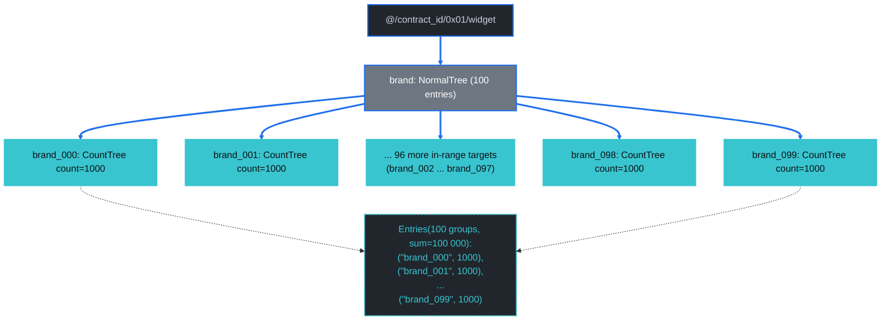
```mermaid
flowchart TB
  WD["@/contract_id/0x01/widget"]:::tree
  WD ==> BR["brand: NormalTree (100 entries)"]:::path
  BR ==> B000["brand_000: CountTree count=1000"]:::target
  BR ==> B001["brand_001: CountTree count=1000"]:::target
  BR ==> BMore["... 96 more in-range targets<br/>(brand_002 ... brand_097)"]:::target
  BR ==> B098["brand_098: CountTree count=1000"]:::target
  BR ==> B099["brand_099: CountTree count=1000"]:::target

  SDK["Entries(100 groups, sum=100 000):<br/>(&quot;brand_000&quot;, 1000),<br/>(&quot;brand_001&quot;, 1000),<br/>...<br/>(&quot;brand_099&quot;, 1000)"]:::sdk
  B000 -.-> SDK
  B099 -.-> SDK

  classDef tree fill:#21262d,color:#c9d1d9,stroke:#1f6feb,stroke-width:2px;
  classDef path fill:#6e7681,color:#fff,stroke:#1f6feb,stroke-width:2px;
  classDef target fill:#39c5cf,color:#0d1117,stroke:#39c5cf,stroke-width:3px;
  classDef sdk fill:#21262d,color:#39c5cf,stroke:#39c5cf,stroke-width:2px,stroke-dasharray: 4 2;

  linkStyle 0 stroke:#1f6feb,stroke-width:3px;
  linkStyle 1 stroke:#1f6feb,stroke-width:3px;
  linkStyle 2 stroke:#1f6feb,stroke-width:3px;
  linkStyle 3 stroke:#1f6feb,stroke-width:3px;
  linkStyle 4 stroke:#1f6feb,stroke-width:3px;
  linkStyle 5 stroke:#1f6feb,stroke-width:3px;
```

### Diagram: per-layer merk-tree structure (Layer 5+)

Identical to [G1's L5–L6 shape](#g1--in-on-bybrand-grouped-by-brand), just with all 100 entries in the byBrand merk tree resolved as visible targets rather than just two. The byBrand binary tree has all 100 keys exposed — no opaque sibling subtrees (`Hash` ops) at all, only `KVValueHashFeatureTypeWithChildHash` (full reveal) plus `Parent` / `Child` glue.

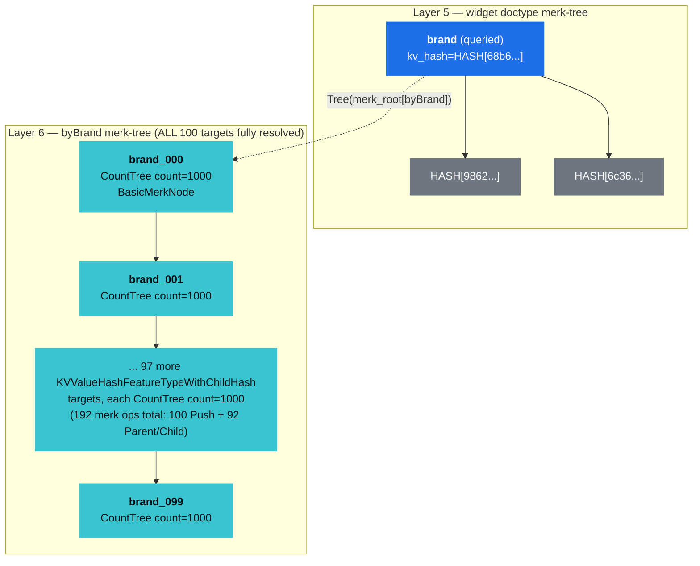
```mermaid
flowchart TB
  subgraph L5["Layer 5 — widget doctype merk-tree"]
    direction TB
    L5_q["<b>brand</b> (queried)<br/>kv_hash=HASH[68b6...]"]:::queried
    L5_left["HASH[9862...]"]:::sibling
    L5_right["HASH[6c36...]"]:::sibling
    L5_q --> L5_left
    L5_q --> L5_right
  end

  subgraph L6["Layer 6 — byBrand merk-tree (ALL 100 targets fully resolved)"]
    direction TB
    L6_t0["<b>brand_000</b><br/>CountTree count=1000<br/>BasicMerkNode"]:::target
    L6_t1["<b>brand_001</b><br/>CountTree count=1000"]:::target
    L6_tmid["... 97 more KVValueHashFeatureTypeWithChildHash<br/>targets, each CountTree count=1000<br/>(192 merk ops total: 100 Push + 92 Parent/Child)"]:::target
    L6_t99["<b>brand_099</b><br/>CountTree count=1000"]:::target

    L6_t0 --> L6_t1
    L6_t1 --> L6_tmid
    L6_tmid --> L6_t99
  end

  L5_q -. "Tree(merk_root[byBrand])" .-> L6_t0

  classDef queried fill:#1f6feb,color:#fff,stroke:#1f6feb,stroke-width:2px;
  classDef sibling fill:#6e7681,color:#fff,stroke:#6e7681;
  classDef target fill:#39c5cf,color:#0d1117,stroke:#39c5cf,stroke-width:3px;
```

Because the In set covers *every* brand in the fixture, the proof has zero opaque-sibling subtree commitments at L6 — every binary-tree node is revealed as a `KVValueHashFeatureTypeWithChildHash` target. That's the most efficient byte-per-key shape `GroupByIn` can hit: at `|IN| = B` (where `B` is the total entries in the property tree), the proof bytes ≈ `B × (kv-hash + count + child-hash + glue)` ≈ `B × 100 B`. For `B = 100`, that's exactly the 10 038 B we observe.

By contrast, smaller In sets (G1's `|IN| = 2`) pay the boundary-proof tax: the byBrand merk tree has ~98 unresolved entries, each contributing one `KVHash` (opaque-key commitment, ~33 B) or `Hash` (opaque-subtree commitment, ~33 B). The asymptotic crossover at which "reveal everything" becomes cheaper than "reveal-some-and-commit-the-rest" depends on the ratio of `|IN|` to `B` — for byBrand with `B = 100`, the crossover is around `|IN| ≈ 50`.

## G2 — `In` on `byColor`, Grouped By `color`

```text
select   = COUNT
where    = color IN ["color_00000000", "color_00000001"]
group_by = [color]
prove    = true
```

**Path query** (identical to [Q6](./count-index-examples.md#query-6--in-on-bycolor-rangecountable)):

```text
path:         ["@", contract_id, 0x01, "widget", "color"]
query items:  [Key("color_00000000"), Key("color_00000001")]
```

**Verified payload:**

```text
Entries([
  ("color_00000000", CountTree { count_value_or_default: 100 }),
  ("color_00000001", CountTree { count_value_or_default: 100 }),
])
```

**Proof size:** 1 381 B. **Byte-identical to [Q6](./count-index-examples.md#query-6--in-on-bycolor-rangecountable)** — same path query, same `ProvableCountTree`-style boundary commitments (`KVHashCount` ops carry running counts even though the SDK doesn't read them for this point lookup). The single difference from G1 is the underlying property-name tree type (`ProvableCountTree` for byColor vs `NormalTree` for byBrand); that affects the merk-boundary commitments but not the dispatcher's GroupByIn-vs-Aggregate routing.

For the **verbatim proof display**, see [Q6 in chapter 29](./count-index-examples.md#query-6--in-on-bycolor-rangecountable) — or [▶ open it interactively in the visualizer ↗](https://dashpay.github.io/grovedb-proof-visualizer-widget/#f=text&d=H4sIAAdCBmoC_6VY244dxw1811ecRwnQQ5PsGwUkcOIgMZALDNhQHoyF0d0kLSELr7GW7BiB_z01e5W0e6Q50Eh7dOaimZ5isaq4f7u8-MX_8uevLy8u4iUd_vfkcPjH-M0vrw5c7R4OP23fXxz-6Zf_eXp14HBILw5fv_351dOvxvbxp2---m4aKwVrV4lZo1rlRKm3lusaOCGDWjdL3UlwaNZF3FxpuFSWKWfPnt3cm27u_feXL8f5W796xBfPD99euj_NbsyVcyusjUdoi9lozMiptsniFcuoo9JIHFImJ-2dNMxFjbs-e364Wm0eZXBfk2ZOuOEY27WRrCRutVmQcO3TItfWKzebuAMuK6WNZdHeWS1jtePSf3xzsy8PkCFdyhnAeG4yNAGD3Lk1S5NweK3VbYqt3tKaiyR5axJiTX0UvN39s_KLw5evXp_b9f75xa9--f35Vq2fX9yU6nD44vCHP97tPFLM6-2Rkr5f2HfBT__9XNhvqpfoFv8yNTm5Fp7NPTTJWmqTTfE_XSQPadE89TXMC6862YfgebPUWXMBJs_eWffjUNy80Wev_n1EP4rrJ9A91jxZvZFSwgobixa3xiuSuDbR3ty8etZcAEhpOUAQXFAiL28OPvaz99C43ejRWia6qUZrVSsIXnHLu7qYjhTD-gADudQU3buWtMh7Hi18zDEm02w6V-PwlcHlnLnn7Ozx-ELueuThyY9V7rZ-iR6rwI467KrGcd7_-tp-8Dc3aEEFuFL1eodVXSWVKBLsE-3qSdJaPNbIVSzPzDp8CqehAHT24VAU4JZkMM9Z-wccPg2V6-16hcfR2Y3RCUgd47BCKLvmSXWkppDPHraiovnW5OVbH6-Obss164xVF34yLqs6k6vp2VE0HvL5_qmD1b0Hpzq4CKxkVhs51ljRaxac86JclmnTWJbRaUVTjRQafbp8-qkfCvyxTR5h0Lo4v7h8fgD2v4x57l9evP3xzTWbBBa5amxdLOnuTxEStCelbbvlWdNS1YoWm63MCbqpraEw1LI0bfq5AjKmWmFataMlKTmnBlWDhtL69Cu-7yvHtr2kvN6uXv1TzDyRnyez9Ghv_9XHm7eX_u1vP_m_X795dfX29xX7Pt1szw_3Jdv2aPuI8_EDAPgOX7e_Z7d1Wl46QzqTjdmiMzeY-zSQbjRnyyWLqEexUdII9IcLjTWhFogbc9WzD4jitr3ivy7Mn9I9G8bmSIT4IjABLg76pJJrjDGgPR6U15QsSBZp9OpGRtVKWFVf6hKfZsNR89gHGp0GGvJXBlRRSQoiAXfqCpLbVLyHwXxkeCStG7XTEGM0eajSIpvITx8BTe5Bg3NyLrh3NbQQN5iYGkGTUTAutJypm2a1lFAJR9hgSBYhBgjxyrYXtL1acSwqbqVDeB5pmtQZtS2VVnvItDlstQXPR4WFqTBzQMEgqTPAKWRXXLt3nbcNv-vi8p7sXqF8vVr2BGAhqcMqQgkj6hN1BslEyqbKsxbqsmhLEyaeI6hBsxwRe6Y8UbuGGu1bcj0J2vYA2m4NKxGMHQgrXtcaZSH5wJt9EoNtK3tL8C_bsJYuSdFflkoSHhlE27nOfgq0egxaZIZm1TEO6JKcyoDqI5CtbSSJ7CtBVLTC2eYsJl1DBxDFINUVrjILoKWyG1tKJ4FL9ABdDHWEfAQFhDMRkpHxQs0jUp2OmWq2CcBR9lwG9ZKnbJMhvGuLSTO33arEp8BLcgzfpR01Z7gkRLg1HRFzCcIsXBYc1Yz3qLmBFoR0nBYmsxQVsr5FcUsGfIX245tPw7c8FIYehMeW3jGubI2VQNMuiFiGUarnVTVDPS1b1oaF46KGtqvS4T81r9341pPwbcfwxUQ7McCYTKhroP07hH51KrMrOr-WFFbIBfQtw3OKlgljdSbOfSzpwLfKfnz7afjqA3wZ-MI_Z0IYVU5eoMABNBPGRqjDAA8MwyB0ranlXqRiSh-QC6qtjLxbeDmdgi_TMXxhDi0VKANoGeglSFRU5ViU5vBkpo5YMbaZZU40IuazQOhmECM4j9j0gfeLL59mbPzQ2bpPbwJmOrLJln7hsAU8BXU3pwOXrQFQp6QGq5AoA4mlwuc7hlD13QCfZG181NsmB_K1ZKguAhrw3cwgSsXIi-kiq_RpqW0z8MBS6ep3C7n1Eb11bbwJBJf9Csyn2Rs_9DdDkCSsWpsQEToMC49tnJC1EBCKpMkZ77St2bc5w3LbVizIUwZO7Ab4JIPjow4ntWfJbSDjuBtSbcT2C4bldfg2C_WKvLwIaadGwQ7acbFUYpxaqWzhodB-CZbTLE4esbi-tDTIcAHIWKMKB0XfyGqYsyphSpuFMYhFWDPYX4ZtbGqM1crcDbCcZHFy3OKQWzwhTQPCDugUU_nGaOA8F6cSA-Iro61mVAJ9BxkrmSAKuWwYn93NoTvXfZrJyUOTo0ELyb4ipE9y8qmpw3xB44mU1tkaoiZWPFoVG-BH4MUQfygjvyNU7ka47pp3t-33J59z_mNnj587dubx448dfXjswyPv77-7d__99tv1v9vn709-f_J_sY4oiTEYAAA).

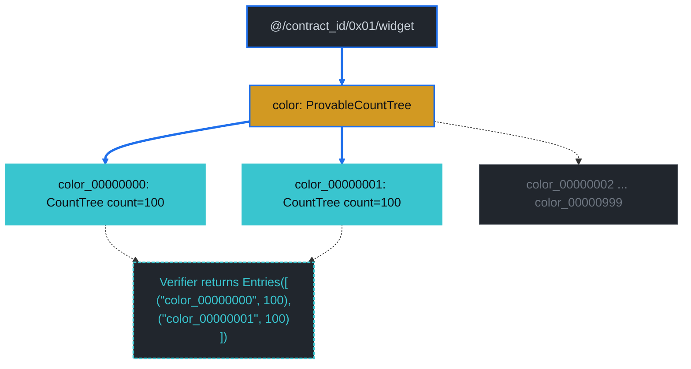
```mermaid
flowchart TB
  WD["@/contract_id/0x01/widget"]:::tree
  WD ==> CO["color: ProvableCountTree"]:::path
  CO ==> C000["color_00000000: CountTree count=100"]:::target
  CO ==> C001["color_00000001: CountTree count=100"]:::target
  CO -.-> CMore["color_00000002 ... color_00000999"]:::faded

  SDK["Verifier returns Entries([<br/>(&quot;color_00000000&quot;, 100),<br/>(&quot;color_00000001&quot;, 100)<br/>])"]:::sdk
  C000 -.-> SDK
  C001 -.-> SDK

  classDef tree fill:#21262d,color:#c9d1d9,stroke:#1f6feb,stroke-width:2px;
  classDef path fill:#d29922,color:#0d1117,stroke:#1f6feb,stroke-width:2px;
  classDef faded fill:#21262d,color:#6e7681,stroke:#484f58;
  classDef target fill:#39c5cf,color:#0d1117,stroke:#39c5cf,stroke-width:3px;
  classDef sdk fill:#21262d,color:#39c5cf,stroke:#39c5cf,stroke-width:2px,stroke-dasharray: 4 2;

  linkStyle 0 stroke:#1f6feb,stroke-width:3px;
  linkStyle 1 stroke:#1f6feb,stroke-width:3px;
  linkStyle 2 stroke:#1f6feb,stroke-width:3px;
```

### Diagram: per-layer merk-tree structure (Layer 5+)

Identical to [Q6's Layer-5+ diagram](./count-index-examples.md#query-6--in-on-bycolor-rangecountable). The byColor `ProvableCountTree` at L6 carries the same `KVHashCount` running counts; the SDK ignores them for point-lookup group_by and reads only the two resolved targets' `count_value_or_default`.

## G3 — Compound `In` + Equal, Grouped By `brand`

```text
select   = COUNT
where    = brand IN ["brand_000", "brand_001"] AND color == "color_00000500"
group_by = [brand]
prove    = true
```

**Path query** (per-In compound resolution — outer Query on byBrand, inner subquery on byBrandColor's `color` terminator):

```text
path:               ["@", contract_id, 0x01, "widget", "brand"]
query items:        [Key("brand_000"), Key("brand_001")]
subquery_path:      ["color"]
subquery items:     [Key("color_00000500")]
```

**Verified payload:**

```text
Entries([
  ("brand_000", CountTree { count_value_or_default: 1 }),
  ("brand_001", CountTree { count_value_or_default: 1 }),
])
```

Each `(brand, "color_00000500")` pair has exactly 1 document in the bench's deterministic schedule.

**Proof size:** 2 842 B. **Mode:** `CountMode::GroupByIn` over the `byBrandColor` compound index.

**Proof display:**

<details>
<summary>Expand to see the structured proof (8 layers — two parallel brand-X → color → color_00000500 descents sharing L1–L6) — or <a href="https://dashpay.github.io/grovedb-proof-visualizer-widget/#f=text&d=H4sIAAdCBmoC_-1bW49cx41-96_oRxnQA8m6kQY2yGWRBNjdIEAC70MgBKwqVmys4AkmcrJB4P-er1qj60xrutsKIAduzUh9Od3NwyK_C-voV7c3f43__Plvb29u1pd8-Mdnh8N_-9_j9vjE8eHh8Od9_4vD_8Tt_z05PnE40BeH3377l6-e_Nr3Xz_73a__0KcYLzG1tHpddVYhJm0t1-F4ITk3nZM0OOGpXgdLC2OPVCX19Ozzz-8-m-8--7--_NKffxvHr_jp08PvbyOe5JgiVXIrYk18WVu9sfeVqbYuKSrCqF7ZSVYqXchU2daMZFPUPn96OEabvbjo6Nwz4QPd97GLZiFptc3FSar2uXJtWqXNjk_AYaU0H3O1t6IVROu38c2Lu8fpXmbYhklGYiK35EbIQVZpbVJnPD3G0NnTHNpo9MGJorW00mwWXnB2b74rf3H4xVdfP58vHz-_-Vvc_vH5Xq2_fHG3VIfDTw__8ZPXDx5YzJe3B5b03YV9O_n0_9837XerR_wq_6UbBYcV6S1iGaUxbHaZhndGStlTWy1Ih88oMmqX8ITv66X2mgty8vlbcT-cirsz-t7Rv5vRD-b1keyeap5s0diYEGGTZCVmk7EohbVk2mJGjWy5ICGl5YUCwQFl5REtUI_67J1svLrxg2tJfLcarVWrKPCKj3y9LtOclk91VKCUSktDrdDg0OxthXf3Ltyb9dFkxcio5ZxFcw6J9XAgr3vk_osfWrlX60f80AqcsQ5nrcbpuv_b1_NP8eIuW0ABqVyjvs5VHYXKKmlJdLRrUKIxxIfnmmbuWcyjJyE3JLSrBxAFeaPkIr1Xfa-GL8vKy9vLCE9n5-wcXZCpUzVsAEq13Lk6NQN86ppjVTTf6DJi9_FQdFuu2foadeA347BqncKmPTuZjQ_Vc7_1b-a9JSorUaopvV4q7dXadLNZwxu5puiZm-U5vHVPlhRw7Karr71qY6LkradeJq0lj8f2Pg2cut2nhzpSbWJhqbMnBjUutF2IoqwqSooCMecyOymQsRZmFJqAP22gGbU-Htu7tHHqdm7Nvbwd8_5Y4V1YfhcX4enWPYb3RyJ6evjFzbffvHhZHwm6ZNTV5OmBj6-t5_4nnOwfcHf_PHtVL4ZF3xrGPIGRmK2YCouCnGtrksFEU1pvpUG8UF1paCayWgMaIrX--Jo8UtEIna8LPWuG3uLVcwxdGTgdvJr6kWODwLLgD9RVYURvqxODaqQ0CLZutci5oZ9b8KfKHsxONh2yh8RbLMBnSSC07NOMIcbAhysBRZq2suVALwAQwnpAM00_O8Wviv-sg8vr9XgTaGzV0IEXoQzESmWIrcZCLU8vqw0jqSVYYgL2V_HFu3KIArRpi88NtF6U0HYvoYVWgm6cxDNcoTkNGtNazXMtlQG2JurZBOexysCxwlvZlgT1DcxZ58aplyTUHkjoQDnuxADukMXcIe1yaoo2gtAThvrjZALxlQHhCsEjffLy3EfwmKOd3Vx0UUaZ78sy1zlYqxuoa2SEW2T1wrOPTMCBtgowuZeOKkbQw3AKqA6F1N-nUM-OVC7JKacHkjpRbwEpl5A2-IyZKxEW2zpDmcyUUARULabBbWjKIGToxgrRW9YEdp1dpZwvS2q5l9S2eHID1iQYrj5zpuljFehLJilQk_BAUxmMh_Yv4DpG-r3g7HiEDj070npRUtsDSU0xs-Kr0fPA-lxnEsvaoFfgHtSVZxulx0hFR2oZKh7sPa3USL0j3WeHqpcl1e4lNRwmao2SKJNCzfSRhDNZ5oxUdgH4k0EsMBghu0nBrwiyK80XhNjZqE-XJFX4gaQu-A5IL3iaBqnGlhtB32jywdk7kHZ2-HHKlQPPxCywIGUCvBoDD_xsnJLLGEruU1RPa4zuzRAH7hW4McgC3-KwsAiwoZUC8xicW49VbSvIqiwVGe92fqTnCbRrZNpbYm2rofME21Wy7UrxdspNzEql5940KgzvbC01Dq8wUgnYlaJooMmszpZGngkkB_woUGBcUy56Nkmc1mHj5vnN7dPDb26-OcqwmE-QjL96fx4PybKj43j1p4AM-KRQe6XUUFIDCiHDfy9IICXNYEbre3qmbYAYXQzg41RlJTY47pQW5zmlw4nLZaf4AQ_-MUvt5e2Yu0uK7XuU3PcqvFPlt3JA2W0H5gE6B_ND0k2uDA-51arBtEGqDvKydUAGqSqBYb3CKKAoL1ub94twx3EssjupTAUeGWDN-NpAZSyFt-34Vl5wKI16kT1vWFqkDBjgNfZbtjRZkM_07OkBrvGKiC5D0A_r_Z4IvOkDAqoX0jHxT54xlphvyayzNmYQgo5wGPVaO2UP7hVN1mhek9F8KqMtMqxESM6gSYE1UoFsBn3rUqIJvMFiA1kUMnmVDjVKDWJ5lJJtLU_IqJRyRUTl6ozWexmVvhDmHg3W0bbiBAwmb0MLKN-EoZtoDBDWqL0OByhNLiSh3SYwi67JaDuZ0YnKd9aSx4ztPgIJGlP7HrVo0go_F9towJeusZBqIRzcrUB-WCvIKEu7IiK9OqP3VRQVKGW0GuSnQPDDzC_pCWXQos8GVTp2wdYsXHqpe55fFtoO_iAB9XVd1fV0su3roC3R6vRW4dwc8hPQAlZgJbj6KjVNgFNHs0sx8dzWoFnQ8R4WjpTWdE1EfHVKt5F5L6dDJloNTayoOtCZjkbLRXJKG8_cIQVHc6j7ZqtkgsLL22aj_yq5jqtymk7lNDkTEBrWuAT8sq1u2ldeAMvKfUALIzDYphUd8i7EE6QcVnk4A_S1IqfpGiS90DY9YqFQmyAeoPyekDgzgQtsqLQk2hbgNHiNlms72oBBde9mCLQTLEsr56v99-3UidbvTi6pWbUMUcwqMvNEHAHLAdgXAs5iOcFVQp4VnVT2RC32juEURU6vafyjY7sypXpf7_0y_MW3t_H7v_85_vfrF18d9fgbHbjFM4GC35kn7kd8ehJX4bPRlbDfWaZXkrRqwqfoJB6w3SsWXEMHue1Vayg2CVhgDpbOMXetvaM4Y25185ubGU9e76PBusOEUMrVC2-QpwEzXzxKjOGBRiLbU4lFE-GAF0ABg2GuIaUriOKqSrBTlYDvwfeVmiMcRMn7DGGaJ3xbFuGqQLCy5zg2QF7dx0QBAPxzdjTXGru7rpEpdHUlyP2hT4-kMjgtOlJ_tK1MzOuWAyjagAMxMvRclL2DAN_HcH44yqX1THFNSuWiAdD7tvXKd55URzQguxLkZcIJzaSUiYCHZaJg9tYW9wnpoeCihnqCDIaUUm0gwiRztbW5_BpxJNerI7kvj1YvUDtZCqwhvBNWCkJya4-EcvNVo3fYq5Yhi0DfrtNKAfqzl9550-c1Z9CuXg29-p127TsTXf1OvvqdV1d6OknqIBXgqi-HtfCaouD-jJKaum9CCkhTeKUG0plzLKg21UVSM1ZZ2LZQ2lb9ivVO19N6uk_rEJgdQM1QnDMH8KUwJBLOrABcIEQ6oYIRb4YJlMhQgWarwpTsPUzjfE3FpnrB7OnN7bvP_hXHnnvkecd9d9FsjH84szHI5FatA8JswvgbdF1JcCipDRvRU9bS09g7xXDVAecFrKba6oq8oY5_ALMx-HBN6Nixdy7I4XnKEZltogEKJO5oe1MIAsPAPehqCIhJJnBsXoLtx9nYv2421sDxfcCz5Vl9lhHRYDNShgBSGqOkIm0xJKgb1di-r2PBUl-lQdaaf9TZGKy6AS37HsKD7YGHUwi2xyF1V_E-s4-EIACqe1Q2wP0ZBlPw626zfRKzMYVugg0uiNkRtUASd42RrPWYxfYMZW-C5V5m4uymDtFSOhgsFNpzfNTZGBjTes3ex-yjIW2SSsNP0729mBJV14oEg56Ual9SIflbY0rbyZf8SczGYvnorFPSGKOO3GlmBJ60zUFFWKikXjtcKpwI_BnDNqWirBGxLx36qLOxTt0BUcUHQTdXZCol6FCp0rHOgDVSMD1KYHAg27AadSM3wRdZarN_ErOxyOID9ketlzFnRcomqg_s4s7AZUGkSQYEDCxpXnvzRkcFIiClDXLm487Gyr5kN9UKNgDJRDKFO_NplSWvpAnAlJotlTk1gxA7gS8GcgmsarnopzEba0WiotH3bA-Q5CpOY1dq7pzRdtRpie85ylreewXmjhELzmtfj7L0487GIJMJ6jOrTvUWc3WuQNayr3hGZs32pBlIm0u1GbkwTFWk1ja6Oil_GrOxuvK-YgtGbhi6Cg1FW_8TNecFGBDJ26vCw6LBVCtgzet2ragjuNz8cWdjSWUPj2FGFATVERtb8zU8oZda4aKlGJJaaW902IJ-qzVKDlmtZJN_19mYKk-WlHQJrMxAMtCcBUqRkhgaGs59UgUvJqVQBZhUQyahaIs1Ps4MH52NeRYhZ5ijOWHpF9BqJTNwAJgqz32R6hooDZQxQEy75op1UFq1pmVSPu5sTInV4FM1ZYLtFKiWBDEEei-t7ms8s-wNsASa4Cl1aLPore3ruNoCW30aszHf24_QAD0P6A4TS9Nj76FBdQP3uWLZdP8_CVaol71Rb151OfAiLeEf_mwM8nK7Eo-1BAoJJYyFixizaGtlT7k1-fShph1gvSTWaIoyxmpvvfFpzMb2xcYwTgTiMVirnlYfC3JZgZqQ6IEGTGtOQzmKOIi_aLgLQ0Hnmuv4cTb2Q5mNdagiOO5ZVlkTfG1wQamhOjmDZtTxM-GF8oCCByZ7W8CofTXmjDKhRz-V2RjMD4_huQBpKoO9FRYU0GgJUAndNKYNh0LZO7WLvOXWBR4KJjUgB2z-OBu7-KjHj3nsiA-__qFXT7926pWHn3_o2fvPvf_Mu4_ffvTm_qt7L__df3_32Xef_RM2G-h0TzkAAA">open interactively in the visualizer ↗</a></summary>

```text
GroveDBProofV1 {
  LayerProof {
    proof: Merk(
      0: Push(Hash(HASH[bd291f29893fb6f6d6201087746ca1f23a178dd08e1346cb6c127e91ae3623b3]))
      1: Push(KVValueHash(@, Tree(4ed22624752972af97fb71abf4067b23e6d296a61a02f35b2098819fde39d289), HASH[4a5a28cb1b40226aa35b2f0d502767df13268bdf4678627dbfde26a557acdf73]))
      2: Parent
      3: Push(Hash(HASH[19c924989e473a90d0848277d0b1498ccc8db3dc870cbc130e773f3d79ea5b71]))
      4: Child)
    lower_layers: {
      @ => {
        LayerProof {
          proof: Merk(
            0: Push(KVValueHash(0x4ed22624752972af97fb71abf4067b23e6d296a61a02f35b2098819fde39d289, Tree(01), HASH[5b90e1e952b7eef903cc9db2d9098e334a37f7e08cade52c6b2ea3bf4b56b645])))
          lower_layers: {
            0x4ed22624752972af97fb71abf4067b23e6d296a61a02f35b2098819fde39d289 => {
              LayerProof {
                proof: Merk(
                  0: Push(Hash(HASH[49e7191075272395ed72cf03e973987ede6e4945e08574fe77d725f4ce7ecdf8]))
                  1: Push(KVValueHash(0x01, Tree(776964676574), HASH[5d9a0fad8a3f32560f8e8950c1e84a7feabaab21b79bc72fec4482442844e2ef]))
                  2: Parent)
                lower_layers: {
                  0x01 => {
                    LayerProof {
                      proof: Merk(
                        0: Push(KVValueHash(widget, Tree(6272616e64), HASH[6c505f53f2ebf3de030cc2aca463d4b429aeb320a9fadb8ae68bb7903a22bb68])))
                      lower_layers: {
                        widget => {
                          LayerProof {
                            proof: Merk(
                              0: Push(Hash(HASH[9862894b16a0792688fdcf64edcb2ceade5c8b234649bfc6cfc6426869b0e9d9]))
                              1: Push(KVValueHash(brand, Tree(6272616e645f303633), HASH[68b697da99d6ea70a83eb41794dca7ba3938d0ba98fbfaeb3cd0c19b3b5d0ff2]))
                              2: Parent
                              3: Push(Hash(HASH[6c36729e93b1a316cbf60fe282eb630c0ed6e45db088e365110302b6c9caba86]))
                              4: Child)
                            lower_layers: {
                              brand => {
                                LayerProof {
                                  proof: Merk(
                                    0: Push(KVValueHash(brand_000, CountTree(636f6c6f72, 1000, flags: [0, 0, 0]), HASH[90ff6f6d9a3d901195982128130677243bfd27b75736206f3c8400966ef0d37b]))
                                    1: Push(KVValueHash(brand_001, CountTree(636f6c6f72, 1000, flags: [0, 0, 0]), HASH[484ca11fb4ec8f479be1f78af903ce0c9d4fe630517579fb0172c2576d6b9652]))
                                    2: Parent
                                    3: Push(Hash(HASH[8ca09dadc802a7efe03534ce4ad991b2f191f368878754a37b5e5c03d9498dab]))
                                    4: Child
                                    5: Push(KVHash(HASH[e5297b3ebe81c6435c29f712074da5f7c90265e12ed3d4f5af1f6d900e50c9f1]))
                                    6: Parent
                                    7: Push(Hash(HASH[50f373fd01dea89c992779764dff82cc7200b492be8f5cf3721627d5323bcbff]))
                                    8: Child
                                    9: Push(KVHash(HASH[cf78c9f1b1a1204bb2e437806f52c21e331392de3436388572bd1fa4bce1cdc7]))
                                    10: Parent
                                    11: Push(Hash(HASH[4a8dc186a95c8c4a1252fb51dbc407727f588eb5bdc8313c96f5c29889e13926]))
                                    12: Child
                                    13: Push(KVHash(HASH[d00ee7653e34e47d46004929b13ded33dff069ed9cc88342cecdf66a65fd8401]))
                                    14: Parent
                                    15: Push(Hash(HASH[7f1d17b9632f0bd440dacf5e841025482bc1d8145df3650301a95a5ee71ce8c8]))
                                    16: Child
                                    17: Push(KVHash(HASH[3ed48a5e35cb7546d329487b0e1ab8a81d7c5bec358c37449e6cbd956e3bb069]))
                                    18: Parent
                                    19: Push(Hash(HASH[eaef9fc530408393bc321409414814b290309a861f474a925a922250327affc6]))
                                    20: Child
                                    21: Push(KVHash(HASH[f776417ede76e6194706e483ac14ab7b3db6aa0461ec14ed5f8e5d20071363af]))
                                    22: Parent
                                    23: Push(Hash(HASH[b3fccba79c14fcc5e97ff6a3cd051228dc755e6de147bef690ba9681264b2b9f]))
                                    24: Child)
                                  lower_layers: {
                                    brand_000 => {
                                      LayerProof {
                                        proof: Merk(
                                          0: Push(Hash(HASH[d605b4b78e674fd77371ea6adb32ce3e58ee3b96d73c4d34df84159661634587]))
                                          1: Push(KVValueHash(color, NonCounted(ProvableCountTree(636f6c6f725f3030303030353131, 1000, flags: [0, 0, 0])), HASH[fccc0c94657f2a78084f789bb6f687c4bba295e3a062f3199bc33f14dd2b7fe2]))
                                          2: Parent)
                                        lower_layers: {
                                          color => {
                                            LayerProof {
                                              proof: Merk(
                                                ... 37 ops — same boundary shape as Q4 / Q8's L8,
                                                terminating at op 18 with
                                                Push(KVValueHashFeatureTypeWithChildHash(
                                                  color_00000500, CountTree(00, 1, ...),
                                                  HASH[6834...], ProvableCountedMerkNode(1),
                                                  HASH[840c...]))
                                                — TARGET 1
                                              )
                                            }
                                          }
                                        }
                                      }
                                    }
                                    brand_001 => {
                                      LayerProof {
                                        proof: Merk(
                                          0: Push(Hash(HASH[f54769bf6e9d24b9dba53ebd37c9ceb3485b3c6511f8de6f17860676fe4d9331]))
                                          1: Push(KVValueHash(color, NonCounted(ProvableCountTree(636f6c6f725f3030303030353131, 1000, flags: [0, 0, 0])), HASH[8f883171c33df0aba2541a5b9d6195faac7bd1ffef93e8ddcaf9d092f0fa5e19]))
                                          2: Parent)
                                        lower_layers: {
                                          color => {
                                            LayerProof {
                                              proof: Merk(
                                                ... 37 ops — same boundary shape as brand_000's
                                                color subtree, terminating at op 18 with
                                                Push(KVValueHashFeatureTypeWithChildHash(
                                                  color_00000500, CountTree(00, 1, ...),
                                                  HASH[881d...], ProvableCountedMerkNode(1),
                                                  HASH[a422...]))
                                                — TARGET 2
                                              )
                                            }
                                          }
                                        }
                                      }
                                    }
                                  }
                                }
                              }
                            }
                          }
                        }
                      }
                    }
                  }
                }
              }
            }
          }
        }
      }
    }
  }
}
```

The two parallel descents below `brand` are the structurally novel part — every other layer above `brand` is byte-identical to Q4. The byBrand layer (L6) inlines `brand_000` and `brand_001` as `KVValueHash` siblings (ops 0–2), then descends via the `lower_layers` map into each one's value-tree continuation. Each continuation (L7) carries a single `color` key whose value is `NonCounted(ProvableCountTree(…))` — the byBrandColor terminator. The terminator (L8) walks the boundary path through its in-color binary merk tree to land at `color_00000500` with `CountTree count=1` and a feature-typed child hash.

The bulk of the proof bytes (≈ 2 × 1 100 B = 2 200 B) is the doubled L7+L8 descent. The L1–L6 prefix amortises across both branches (≈ 600 B shared), giving 2 842 B total — significantly less than 2× Q4's 1 911 B because the upper layers aren't repeated.

</details>

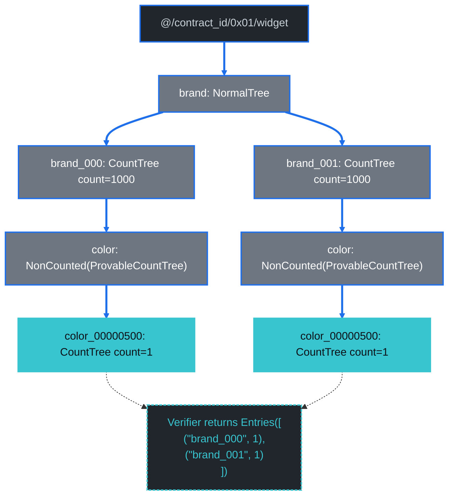
```mermaid
flowchart TB
  WD["@/contract_id/0x01/widget"]:::tree
  WD ==> BR["brand: NormalTree"]:::path
  BR ==> B000["brand_000: CountTree count=1000"]:::path
  BR ==> B001["brand_001: CountTree count=1000"]:::path
  B000 ==> B000_C["color: NonCounted(ProvableCountTree)"]:::path
  B001 ==> B001_C["color: NonCounted(ProvableCountTree)"]:::path
  B000_C ==> T1["color_00000500: CountTree count=1"]:::target
  B001_C ==> T2["color_00000500: CountTree count=1"]:::target

  SDK["Verifier returns Entries([<br/>(&quot;brand_000&quot;, 1),<br/>(&quot;brand_001&quot;, 1)<br/>])"]:::sdk
  T1 -.-> SDK
  T2 -.-> SDK

  classDef tree fill:#21262d,color:#c9d1d9,stroke:#1f6feb,stroke-width:2px;
  classDef path fill:#6e7681,color:#fff,stroke:#1f6feb,stroke-width:2px;
  classDef target fill:#39c5cf,color:#0d1117,stroke:#39c5cf,stroke-width:3px;
  classDef sdk fill:#21262d,color:#39c5cf,stroke:#39c5cf,stroke-width:2px,stroke-dasharray: 4 2;

  linkStyle 0 stroke:#1f6feb,stroke-width:3px;
  linkStyle 1 stroke:#1f6feb,stroke-width:3px;
  linkStyle 2 stroke:#1f6feb,stroke-width:3px;
  linkStyle 3 stroke:#1f6feb,stroke-width:3px;
  linkStyle 4 stroke:#1f6feb,stroke-width:3px;
  linkStyle 5 stroke:#1f6feb,stroke-width:3px;
  linkStyle 6 stroke:#1f6feb,stroke-width:3px;
```

### Diagram: per-layer merk-tree structure (Layer 5+)

Layers 5–6 are like [Q4](./count-index-examples.md#query-4--compound-equal-only-bybrandcolor)'s L5 + Q5's L6 combined (one `KVValueHash` per In brand at byBrand's binary tree); Layers 7–8 fork — one `brand_000`-rooted continuation chain and one `brand_001`-rooted chain — each shaped exactly like Q4's L7 + L8 descent.

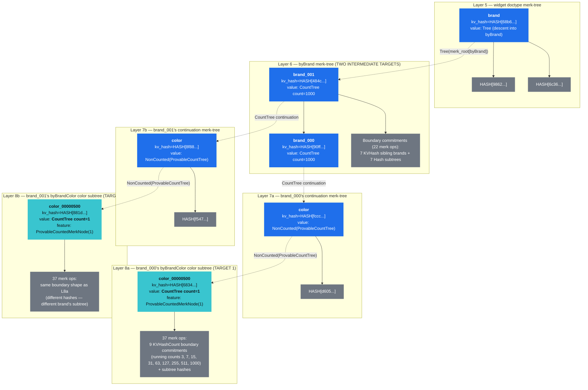
```mermaid
flowchart TB
  subgraph L5["Layer 5 — widget doctype merk-tree"]
    direction TB
    L5_q["<b>brand</b><br/>kv_hash=HASH[68b6...]<br/>value: Tree (descent into byBrand)"]:::queried
    L5_left["HASH[9862...]"]:::sibling
    L5_right["HASH[6c36...]"]:::sibling
    L5_q --> L5_left
    L5_q --> L5_right
  end

  subgraph L6["Layer 6 — byBrand merk-tree (TWO INTERMEDIATE TARGETS)"]
    direction TB
    L6_t1["<b>brand_001</b><br/>kv_hash=HASH[484c...]<br/>value: CountTree count=1000"]:::queried
    L6_t0["<b>brand_000</b><br/>kv_hash=HASH[90ff...]<br/>value: CountTree count=1000"]:::queried
    L6_boundary["Boundary commitments (22 merk ops):<br/>7 KVHash sibling brands + 7 Hash subtrees"]:::sibling
    L6_t1 --> L6_t0
    L6_t1 --> L6_boundary
  end

  subgraph L7a["Layer 7a — brand_000's continuation merk-tree"]
    direction TB
    L7a_q["<b>color</b><br/>kv_hash=HASH[fccc...]<br/>value: NonCounted(ProvableCountTree)"]:::queried
    L7a_left["HASH[d605...]"]:::sibling
    L7a_q --> L7a_left
  end

  subgraph L7b["Layer 7b — brand_001's continuation merk-tree"]
    direction TB
    L7b_q["<b>color</b><br/>kv_hash=HASH[8f88...]<br/>value: NonCounted(ProvableCountTree)"]:::queried
    L7b_left["HASH[f547...]"]:::sibling
    L7b_q --> L7b_left
  end

  subgraph L8a["Layer 8a — brand_000's byBrandColor color subtree (TARGET 1)"]
    direction TB
    L8a_target["<b>color_00000500</b><br/>kv_hash=HASH[6834...]<br/>value: <b>CountTree count=1</b><br/>feature: ProvableCountedMerkNode(1)"]:::target
    L8a_boundary["37 merk ops:<br/>9 KVHashCount boundary commitments<br/>(running counts 3, 7, 15, 31, 63, 127, 255, 511, 1000)<br/>+ subtree hashes"]:::sibling
    L8a_target --> L8a_boundary
  end

  subgraph L8b["Layer 8b — brand_001's byBrandColor color subtree (TARGET 2)"]
    direction TB
    L8b_target["<b>color_00000500</b><br/>kv_hash=HASH[881d...]<br/>value: <b>CountTree count=1</b><br/>feature: ProvableCountedMerkNode(1)"]:::target
    L8b_boundary["37 merk ops:<br/>same boundary shape as L8a<br/>(different hashes — different brand's subtree)"]:::sibling
    L8b_target --> L8b_boundary
  end

  L5_q -. "Tree(merk_root[byBrand])" .-> L6_t1
  L6_t0 -. "CountTree continuation" .-> L7a_q
  L6_t1 -. "CountTree continuation" .-> L7b_q
  L7a_q -. "NonCounted(ProvableCountTree)" .-> L8a_target
  L7b_q -. "NonCounted(ProvableCountTree)" .-> L8b_target

  classDef queried fill:#1f6feb,color:#fff,stroke:#1f6feb,stroke-width:2px;
  classDef sibling fill:#6e7681,color:#fff,stroke:#6e7681;
  classDef target fill:#39c5cf,color:#0d1117,stroke:#39c5cf,stroke-width:3px;
```

The two parallel byBrandColor descents share their L1–L6 commitments (the doctype prefix + byBrand merk root) but each gets its own L7 + L8 sub-proof. Proof bytes ≈ shared upper layers + 2 × per-brand byBrandColor descent ≈ 2 842 B.

## G4 — Range on `byColor`, Grouped By `color`

`GroupByRange` is the proof primitive that enumerates distinct in-range keys with a count per key, as opposed to chapter 29's `AggregateCountOnRange` which collapses the same range to a single `u64`.

```text
select   = COUNT
where    = color > "color_00000500"
group_by = [color]
prove    = true
```

**Path query** (uses `distinct_count_path_query` with `limit=100, left_to_right=true`):

```text
path:         ["@", contract_id, 0x01, "widget", "color"]
query items:  [RangeAfter("color_00000500"..)]
limit:        100
```

**Verified payload:**

```text
Entries(100 groups, sum = 10 000)
```

The 100 groups are color_00000501 through color_00000600 (the first 100 in-range colors in lex-asc order, capped by the limit). Each carries `count_value_or_default = 100` since the fixture's deterministic schedule gives each color exactly 100 documents.

Wait — but [Q7](./count-index-examples.md#query-7--range-query-aggregatecountonrange) said there are 499 distinct in-range colors and `sum = 49 900` over the same `color > "color_00000500"` predicate. So why does G4 see only 100 groups summing to 10 000? Because `GroupByRange`'s `distinct_count_path_query` applies the 100-entry response cap (`Some(limit)` in [`execute_distinct_count_with_proof`](https://github.com/dashpay/platform/blob/v4.0-dev/packages/rs-drive/src/query/drive_document_count_query/execute_range_count.rs)). Without that cap the proof would scale linearly with the full in-range distinct count (~5.5 KB for the full 499 colors at ~110 B per resolved CountTree branch). The cap is a response-size safety control — the verifier ceases the walk once it has 100 entries.

**Proof size:** 10 992 B — ~5.3 × [Q7](./count-index-examples.md#query-7--range-query-aggregatecountonrange). The structural reason:

- **Q7 (`AggregateCountOnRange`)** walks the *boundary* of the range and emits one `HashWithCount` or `KVDigestCount` per merk-binary-tree boundary node. Total boundary nodes ≈ `O(log C)` (≈ 36 ops on the 1 000-color tree). The verifier sums subtree counts directly without descending into individual keys.
- **G4 (`GroupByRange`)** walks the *distinct in-range colors themselves* — emitting one `KVValueHashFeatureTypeWithChildHash(color_X, CountTree count=100, ProvableCountedMerkNode(…), …)` per distinct color in the range, not just per merk-tree boundary node. Total ops ≈ `O(R)` where `R` is the distinct in-range colors (capped at 100 here).

The trade-off is exactly what you'd expect: `AggregateCountOnRange` is `O(log C)` in proof bytes but loses per-key resolution (returns one `u64`); `GroupByRange` is `O(R)` in proof bytes but preserves per-key counts.

**Proof display:**

<details>
<summary>Expand to see the structured proof (5 layers; bottom layer enumerates 100 distinct in-range colors as `KVValueHashFeatureTypeWithChildHash` targets, each carrying `CountTree count=100`) — or <a href="https://dashpay.github.io/grovedb-proof-visualizer-widget/#f=text&d=H4sIAAhCBmoC_6WdWc_dyXGf7_UpeCkBuui1qktAAic2EgNZYCCGcmEIRq-2EMFjjCU7RuDvnqcOZ-FohtS_j6kRyfd9D89SXf1buqur_-vXX_3z_ov__Fdff_XV-XX88P9-9uHDf-__ur9-feP15YcP_-h__9WH_7G__j8_f33jw4fwqw9_9Yd_-vuf_2X33_7T__rLvxkrWTzJmuUz5MiSFGJoqkVm5we5R21rhbZj5ltDZky6LfadJeWRf_OLX3zz3PGb5_5vv_51_90f9usl_uyXH_76671_XvZKSVLRmkxTP6ZnaOzjlCA6Ut7C25AusYd0ch0pWGvRztrZVmr2i19-eL3b0mtPbY44SuAJe_fHnrBqSCq6TsxJ2liniDZJugbPwMNq1T7X0U_ebeLd9q_3P_z-m6_zjyITbVoqBGYXzd0CMSgtqa4wIt-ec7Y18ppNwxwz5rBV88lLbffKp_v-tcqvPvz53__2d-vj17_76l_213_7Ox-tf_rVN0P14cOfffgP__G7L35iMD_--okh_eHAfhr88H__vWH_ZvRC_Db-dVjYcVtNQ_c-FvKctkZaxr_cOZee9egObfa1a5oy0u6Z1xtVhpRKTH7xyfv-6VB884n-3e_-hxH9Ylz_RHQ_N3mKbY0WA-9QU7a6l6Z5Qt6m2ZrutWUXK5WAVC2HBOEB9ZS5dZOP7Tc_iMa3v-JPjmWI34yGqpiQ4MJTfjcuy3o4fbVOBqYq4bTdrIYZdytdz-6j95HiUBtT09mzkMulpFbKTvv89Bv5bo78-IdfGrlvxy_EnxqBB-PwaDQ-n_f_8tv1d_v330QLFEgSZct3sZJZQz01n7QH03WHHOZMffYieZVRkvU9cgrdCOhofYMoxC3kntIY0v4oh--i8vHXx3f4-eg8jtFFpD6XwwZQNisjSg9qwGc7ax5h8s2R5vZ5PBuzrUixcaZM_l94mNgI25b95rPR-HE-f_-qPdne7aQgPdUMlQxZvZzZ52lSMj_b1VKdy9TOXIWZVi3ICcdOGzv_6Vf9Y4D_3K_8Exk0v_rdV1__8gOx_-c-frf__Ks__MPvP2ZThiKnHJ_FOXz3v5pjZnrG4L--zTO1Kraq1TW0jkG62ZrdINQ6LTh-zgOMmQmkJY0pGcNOQUE1MDTOP_0Rf8grn_v1NCk__np99D-VmZf5eZ2ln8tVUmO2XjPYOaMCc5BLAFdL6Ltp1SBmXSzx_Q0zDwGZPZQ9wcojpD8d0p_K2Nfwf3wDWVrJRbvo3Hv1lc5xeJ1beEEyoUktecYTi5zKF4u5lLLExI9mqOM3v_xQI2ny8H08zeHPSZjKTE0AXD7znIUMioXInNaCMd2MBC3IPT351J0LoWuFBM6OgeqE_jRe5XPx6h1dFkqICmyUqnOuimobexQQpMPXI4ygecUZJwhbDiqtRYY5x9l2J16p1sfxqlfxkh_FK8COC1GpyMzNEFqo1nWGJOMYSRdnWnEtJu6EzNPp_A7hBjRJGgjCp_HSz8WrJlKmQMw2Vt2omVXrsTJjHDuNOA1EjDGRT0yFM5GnG0Gu5Dvv8VSPF_L8cbzaVbzsR_E6Z9c2IE4UYDwWRyjbJgPY6iiKwmin9RVRKlVb0WV4icDsrLUvmUkez8fw2QQbA_G9kYT1RNuhk9lodVAVbzJVpupkDIcTOYhAALPYbsQMBxGnEjDJj-MV41XAYvqxYtTU1JZAo22HiCJEzhKnhY5Fk_D-Iz9S5ubSmNYeIcx2OlwYRitWH0csfxbC-swNARmcxDc4CjVN66k3-LZ7iPaB30o7U2fPvW_4TlJtytQARYhYfo5gsdxFrP7Yhs0CsApYdcCFXdByWgD5ucM5p_mbjBiEUPoqekqZEksiB1NaGXwejyMmn4sYCt5yJX1iYMJVwKsG_oT1sRlkPJg26uyN-QeEdTzQxHiipzJyKudKxJ5Pyah3AWvfveu_-O3f7X_6_cf3_WLxv33JEdDzW_OsI7icQ4KkzUTFvCzNAvgzeWHN1lIAi7FZIVWcFxNqBSO-ieml5wUuzz-H_VhX_Zfdf_-Hr_df_-s_7v_929___Uu7fK-3vn27CKnvBZe_-ei_nd_1v0O-_A1_9f9-863KMqi25LzRjyXjRE8MdiB9jYWf4B7HEscnnUranjwT1lRjrXvwrRJ_80cyby8XKP_zq7V_nr_XcjO1us9ozIteWlvbmKa75QDkAcCEbErTgT0eLfdQMBYvRObNtBW1P03CFK5GP8V3g5yugowNONCO-BIIBL60A7mBidfwt5lPi3xYgt2FpcioOBxgNyqerMGRly8EOX4fZEtlpYwaWYF_ta203DrhrOTlnPlsnKqm0aPy5O0IL7y0LslREo8qj4OcvtHNzx6drx5d3h2RfDUiIrvH1MLErfLXXMMOU0DJPlooOTCn86iIz4Vlqp1RK6VbbMvOwHv1L41I_X5IeBJgf6h0Jfdh1lP8aYdJjBkMSSdozJ0JB0pozkPAwQxz9R77kPN4SO6UW5J3o1yuotwE3MfDjYh-CCvFWOABK3y2Bg4ULF6yWpAds_czIE6SccYGueOgy3yW90HRnGml1cyCTtilukTJOUF8hSc8shjKsNc6e7YshTk1QSHFNCZ5rNKTvhu1ehU1J5XeZDZB7m2mMBkpo0KjanmRNphgPtwo5cQaO4we40JNB3ktvcgzSA4gOBIZdb5PzjEFjF5s8TQJ8zBGJQ6sV-jHIIbiHmMliQulgwTDij-O2p1ITm_znlwFGc5u0NgWWbth3hYyvCwLpOdoWAV-Dw1rGhtuAZOFp4gzQ_gQVo5mz1ITk7hKZcBGiQEcPmX1grCqLbgcagsnGXFIM9jMIgev2RnpgRLShD1-GuQcbkA2v017epfIAUlprfS5Jh-WONoMqMveAcSNelb3XNhqotFcy_viQEbML9O4U_hCjPX7GGOW8HYEDjViu7SxkeIDmiu7RmxUdPI13kEfjAN2Ct2O0G2CzVqIm8cxvlxNyO8GuV0FOZmbMcCPgJ1dhlpvCbQz9LyvAkz4qFVrWkdIsWJdSPGe2xyokDbSs0RuYE6Do_h9LZ1lxazpZZ-HpR0kbGRKSENkMDsYj67ktiSMI9JRHqNFfpv_7W76F-ZdL7DFTiKwxMomp8ETHVI6fWrFG9WpUEaodQ6rxqxHj-p2ZfwMYytUc-qYmCtTyUkx1gmC2yXlkZybdkKwb0sgLZYbuG0IkQXiBuGFHkftjv7zu_Qfw1WQtWOTPTHMnTnsYr4qjfyZfPiMKWYu-kKNr_ti9NJe4ADE3DqJpGU_S82OkQ0NWueJCCaCSyLouQ0zQ-4Np1BsJR5sGq72kJ19CVZ4b58pjzVW1iuMbVePtptHlyu0L_Hq0VfivlyJ-1KuHl3fzdI7Bzz1QAPB9hGn-8JMHXEw74dhV-tZZw4Mcs2o01ai72D7EvCpTGybX3TAP9zQqLkklxgSUQS6XhxFomMCMdIdpx1qcamayj6uNnyFch8bkrHIvT9e7StyhQblXVkb70ywbykQ4yh5Y4Dm6YjchP8017sp8MGPHkEq4PwxZDtBz31Y6b6clkJ4hga116Rno2MztIhYzlUzQFCyVJMQo3U3GUW6iALI7STQaIPzSGENj9VAae9G7c6oIvorGknGSmXiUSvkIaBjSOSMSfGtE3wrhiceyH5U2NdXcVD2QYrUZ0RFFEhxLwcBfIFfccVa_c22Hs6cr11eVBMIGnoPBUIbvlq9kKsW4_PUtKvUrOHdIN_51GrqqnzCVAN73gszvvXeDXbKK-0S8sQwbHQqT44uGHlsGBwm78tt-qPUREOs7PuTu8wiL9m7sb97lxJ8p7OISCL6G9hJpGNHIK8IHyoyLZ7HuyP1CvBrejfGd642xPMKo3VBhmoZONhIEMm3oi1bQ48aIogYIbm0Fh2WFd9U9xL-2TMz4DVHOIgZAuYWL9tL3mlqT4j_NeqcZiLZzBBfoLEZYFENgG15MCaPDVfNd4n8rqyNd64W4UNI5cy05ZyuMcR8cGEDwXWaZV9qOUhO3E8oEn2hIeG29pYSsZv5aSIvEjmsUMpcuIlaWh97jwNbFc2hbD3jxGKFt2GMIIOKc5g4kjViDI-D_LYCuPOpTDDot5KPNXbBNEJHfUyCaIHJCA3ZAVd1kKYVJD7YytNC8nWCuOZ4hrG8iDAOntLxoPixxfgwL78LmolkDmluxAjKv2AWZtdU9-ynL7cE-TEz1Tv6r2_T_6VP7e6huu939qaRGIS9mfLpbEXv5Dpi2m0EaAtzvibfWHr63qukhkd6lpoQFjqfdDweNIZtA-Vn1eG7WaZRQ965k_GafKOQiKcwy4HxKsKrtsdBvpL39Urey9usd-eBpZaNnS1DiA35XqAzTJihgrMhkqr4snr1KoeNO8bLx5mTLwL0k_sXEfnTNXCgoNpMObrxq_4_HdH3RAegj8s27HFKGx9uy9c1wbwSl2pr24ByfTokcre5LO_yXrozwROGHxEN21Zxg6tY3-zrNWvnFiQQiZgAUIKggEtzQ7AmCO61EiWMh3s_5HlKE5HY0Q8lhY2-tuYlx9BgnBU56GUXExkMREvbzC4IYG--Xac9DvK7q1rpzpTlFKpoYxb3RUYWwuUb7j1MNdJUQel98P1g6Ebfk7vMezJJWo--fPp0DXwVXb1J7r61iXXAoG0wZKOHY0KKJYAh9Q2NzoFXAVmAK6tVNfT0WJHJ3S6-vMt76c6RIeLhnLZ0NyNBgWPEPJ8MmtbVdIwWc1KmJZ--NsO92RZFMmGDgeiHqRkJVNrrHHLa2lwoX809ayMXkQNKgnb-TgL3KPFVL8Tcr0wDzBok-zjIcgWy79JeuvNv_un5xEx8rz6SpqX2ouRQB2RJYGIRmIm41WwR-POtb0ART2XDF8Gfyd4kPEXHvSB4cQwINEiTsepEepfqShreReYS4xHQaTF149nBmBW1PZ_-d5s58u5mTrrzbxkPJRXeinxaw6-htYIRUuAwgBnBHbH2fNAYZGBHyEE7nuIRiRDqw80cVKxiEVeraRVGdTlVNuyJepXCXEiiPELLtQJZi3eUCkBbAf9o4Nbj6rZ3-T_dOTLeurXY-RhFdmJ6znmgh257TRxDG4S1Y_m9Zi9lXXlkcbMqUEnWvJ5hLCTegxeDzwKyrjqBEd8Vyr5tMEh-0Ls1WR3bXQGhWIt1khX6rzPOx8uzekf_-jb93zmyEGJLJu00uINUabWnF7VnPNdgEp4yvKAsnh3Jpl5zObXhBTQefMnDLfCMwPJ9BpSFapJJEp6WN5Aw14C90G12sDVIEd81DnbWyL6WsfZiMjwu8tKr9V69Wu_VevXod_cw0p03JH4Z7yAgiCyvyaiadupl9zhH0-wrFxZ7GI4yyOaU8Ddis-GyW29fWhrKn25iYAgRhNk3f3LHFsIFPe18OuY6OM6EElrxgsKqlZne-4SZmbABh73y4wG8K4_Td1c50505FNDnCDJ4IuGsCS4YktwlT9PZJM0RjMQduG7ROWssqYSESUCngeX6bJYUfMv2c1U7DxcfMgGdOnzFOGG8R-W_Nk4qrvckM6Y9ebU5MLT6bI-LR_Vt2rszcGP17sf54Pgxpvmm7xZhahO4BpwXRUWIr3AdW2gPRC6wM7QUpMWy9nBtGLi3vmLVFbb0vDAV7lxQ47P4IlseTSYq-XiRekq6E2oHexEKwX2-ot7uavfau0UMOVxuW5CHacyTzK1Z93Ki6iuzJeoaIoYjlo56FU0R-RY6QUoI3B63l_c9S80dmNHb155QZbE3dX_TVPJZyMFSiasMfdUxdETMSXFgUnDn08v66uOd4na1vdfedXv5zu3VaijUXII4f5UOmRWvj0HN7ZxaaRVLMHuMfgwknRXOYUzQy-T_jmM8E8k1BKfZFUceXqGN0-ElLMYNKuRurQsCWfeYyct0cCpgOvhScJcTmH8c4zu31951e_nO7aWN9shAZ99-EmzY8ULQqgWdJbWgm4uiVzsyAm_nJSW11dOhthPGGg8rnmKt5RCyELSiK0dZVUHoHPB1XtwNJK2FJwrZOpCuCTO9GPfWIv_lx5a6vcv_OV965O5sE8E3s0TQpOZR0FOoNfETqzP7IjAcYmjmGCBr5EHLmDD83nookr0qkn_ied2DV5qgticCETmx_VD2hhoNWejf2yn7aalFlH213RoG83HU7ui_vUv_-c6_YdfMdw9geJAVderb3zvuiXcryJyaqxHZrIUQjBaDL2ZVVwg9l_hFIvvUvw0yrWOqc-kkph-tDgJLDt8nwZHElcESVEDEFaX2Kkub0U-bHD9X9Hjbol2t9tpVMYe9zXp33hA2AxmgL1lIi9rX8P2JChZsPzw1j-qYbh0HA5GYEzNARS7FEAgnPa2PTgmFh9oqlSdOq4nXW4Los7qJRj1kXGhy0cZUOAIQj-61mcK8i8jup0Nid7V79jbv3ZnDYlEwEV1rWeimKR0UJrHDAlsOYMycr4PApBa8WH_7GT8mRrL9OjL_sD46K1qhtFgI6lx4wN0ZydiXFozKQewqY2CHgOLMYb78qunjZbDm5zHv2bubnPlyuw5lbidsPkPg7Zn17D7okDlgQ9WImWo57rr8kImSleB2SYFcZTL38wySh4bqp6AMqPHFEa0rRT_WOXdAcx_Ys4IdsQ1fDfbys9Tj8S1sgBzV_Thqd7V79jbv3TmyVaotC2AjHz8hPI-fNTWXoiIoVAGKo1uD0TEcBcJH9BUC1roXUz9ct4iK5ls-nPjc7VO--DYdkZ_diGjRg7DOC80A41lMEF8do7cYwZrn2xZ2Vbtnb9PenX-bmawhXxKJhd73M4sAX8RPNGb6rNLJLUNelNJ6qiesnn3dFv2qR09-uDZsDdWC2tWx_PS8hLpxt7pQaQtwtZIZaz8JWMDiklNIZ-D0kBejQpKPY3xX20Nk3oxyuTNwJTB380zSJtE8OSmqrVkPqCey_KAymLFgYNySfOeHUOSC9GC2k-wPayKKn6okom1FT-bm_JQTCg0hs325CJRSokuGJ4116oy5psNLl1DCeH7MMryrAEq8LN6vC5JJqSrcrFgA5uDqvSEDQAZCyjcmdO_VZ0UmkEe-VIyvK_6tz1AWaMnDl7Z8No_ip9_GhhbrEvLUkz5Ppj7I4OMVyFkkIZJk-OHVmMrzsKXL7HxXApQ7V7akiSA5_bwXZAvhi4Xky5TZFQ-GuPiupHUoaBff2hwJESs7jYY3eygBfBtTApP9JCm1afIi03AYLN_ig-GiCXy6SMnl-_6WNz4YK47zzrnm52G-WvKNod49XO4erncPfxf2y52lTGgwLO_0nYHTRtkIWgwO3u_VYcjLKvspewxGRHc-dqoviC6E72JCfKngWD6ZWhld2SbTd0OW3rzIvOeTCqopbRln6EKwnIooOjwv6SBAWN0AFVgY1_MxvwT--Dbw37nKHaX2GaNu8crtGgrwG-IBt2raFbpF3pD7oJe9hExgSBB42qMlWOPZ1CKeOeNeu2pkwupo5XRGzASaHnt58Z1A7AwjWInDtSBj7lnqsgM5PA5zfBv4L48f-ibxNvXF3QTomLc7ORNLfHTzQaBTPyIeG56cNF0tH0gpHYw64HQeAj_P0hkcbMiEdGPf_txJkUPeTu94HcxGZpfQfXucLJaUE1nJo6DO0p6H7RL449vAL7fHDvDY3rKlLGw0Cacj8vH9VJoXsEU5mwwJY--5JqkajtfMwcN-lugp8DNuXoQZQPLVom-zCNm9JXpHwoq9U6bIxEfpXKd475hWZPCioUhZZT4P8x3wx3cXPcudVyxMvRBXicCsb2qTyJaHrwRv1ePVb15GJF4LGPvZvigZESLepNH66uuZxPauesmbXLTdV8Y0BvElwxinAOXGC2OtT3Zv45La2tLohVgzrl6kh-dRlstkfrfKpdy5RXgkk9AmOXt-kq42dWDsFdk5Fo5QgFcLXgoxibcsr-2utabunWziw11uwuetEeFGpGeI_bX4CYTn5isBW7xcMfMmVjgTc54B5ZPRU7isVPp5Hua3lcCdAWQ2DoleMo22FeC1xsS7Rd7lcQxz6N2K-LjgquU4aiOq0yvnmx_I-OIB2U8Xl5UZPnZ7nbL1fpx9B172hBq67eZdENpI3qKgSeppRQCgHkXj7-Clb8_DdikE0rtCoIbL3eXR5WXDXqY2zIHu8raXQw755Iuc0zfsdiqpVi9Sh_ayr-YcL5p_mJ2p8yx-yHu07DRfYUeUxYiNqdFgMVC9O7xP4KLM6XGPaZ--O-mcn-utdHW-I96164jpXf6rl8fu3F06KuNnJontO9YCUALNI8fmK3buz200iy3WVhAiO0VklDIpdnu6wozmKjZ3XXhHr93iCaThMiconWrBAw0_OIX7Qs_ktiSlZmmlPTe8cTEql52a0rsMWO8MJhk5tIkfgB06K3M8dLTnCMS2QIa1wHZe_VleDUp8VRiWVN_FiurH459B8_ReJr35ge-o1UQlgllVsgRwueNmV9cCZrtg5EW314N7oRz4d-bzzoJvty6plw1ifDUnKJTlteveMERVAZLoW3ITOeXHsySA0BYNivNFdtvIC8l9YeOfQXPpfujubNz_GXXmCfwkr4IPda7SGbAdvPDYazU7xiW-ToRWhuVVUf68nVm6bIuV3mXAeuvRahxjHj9_B3GXkrq3ms6pjooNhh9r4y-g5HBkLn6Iq5C-fpbAt2IfHhFHMRsuDMO1hpD2JwclN82bLJWUCwgD7DQsIup44bYTru7UxjD4Ot3zMF9t_cX8NgHeWbrO7ITiS8VwldQQoPxaZr2uqYlE7_B9ysv7rBpSQULZ0EzX6UcyVnyoghmRLX6-rnU_fbZ6RAcf5kz0nZfS4mjYKx3e3KC-evyc0sxPtq4Qsz3vzXfZRjC_W-tZL7fzspdag6YjoLaG6VjeduvVA8btQTuVRyATSN_cRFrrzPSdZSNPssjTKrYQQIvSvKthkun9G_1QbjWDuWY9x1cfdk-OWKmgbMJC5aEo8ZkSnjvntzuY1DuPhtDVIF6YBaqO4GfiYakO0Z06ytkp-5Kv7hnRayd5k9Owqq8LoAiwbw8XHLybXQ65WwpQ3iDiB5tDWjIwHYEMYfWSTgRsIWdvA1R90VTwxTDoc_OQL4VAflsI3Hk00zz7jq0d11ZnVfDNT3bv5Koo2q6hbtm-ugwbTUQZrinKyTi3hFp7lp2-92lJg3WMmp20MHspqHc9md11nq9q911t-TnnrOWIn3_0VytjX3i0fLcWfNe9I96174j53YrPemcYCyKu-XUSimM4vlLkRZ852w5-_sFyGM0rCCsZ7brFm9wvZtAMbVRr8rAaGdja5uUyuRc_9bR3QTjO7T0azrZevAghnIxTXExLX8KIEfEewvZuBc9Fc7mr-Yzl3TVQuXOM5kfG0Vd8QD-ss7tWsAH95x3umRvRT4B0771W0bw1wpNabI-jOZb8xaMRP6jadwoUNYv1RCaKNUYNj4ha6Zt5lxfvwntVeVNHneHo2Fnj2d6z0Z4vzpV3CVDuPN3xPlC7-TJ7aHHvFl7EJ0PLLvtVcxgGWBC909xq2N4-clHpx-ysaQ-RvOfh29MZQZPFV6aB8jBD9TPZK-YFnpXhp06ben9ZP2fM078Oo3sHl-dhy5fZ-W4BjFy2Ex3pZFvR-yTp9GK1mRFuhvOS6SZX4_a-Z8iEgpsbCAJFIAC7pPCsT49SewMMz_cxlo0JTzYYugbftPD9E5HN2KHzukmHN6ORx2p1xLLivAnz3SZgedcByp0DHHiRIKgCfAdCzqJ3At3ZO3HXOrwpx3h1tMKOofvRdHwLCnWjYX5I5GF1htd8QAMd6vXGd32j4HbNDdxJg1fNFUvE8y2_mASc965WrU609TYI9HmULx3g2w1u5M4BTnLTjk3B_i4_47Ek-_bYKsGrkCva0NVhQDD4JohG9AkSw2uNFqF4KJrj9tytBXne_WzNOd5kvZiv2Ks3JQgyrE4CXPxUcT0LzIgaV9rLJ9TzML-rBOTO0vFeK75h7tWhg7F69i25TWaeWbEIzFP1Hmt8E0FNpPogdAWiSjGkL54r_RRq1XyJ2s-i-rJHaCWMws9TsmGtAL4oBD8O1XAxwVuwNpT0iTCmt6h_XJ8Z66UQqG8Lgcvje_5B9zyQGnZ5G8zvtVTSvcdhRvBAaDLRXX490JhuLWyGgJsrU3fpD0_vt4CsStL8GqapWG9vCwAnMpxAEAONfNtAxGxnITg2gNwQIzEqM0Cf7x_Vu7Xgmu8e_jb_6eVuU56jaq5-zOiorAE28idTmKBV30qtZ5zgG51wfg7N7xaz5vseK439cOk4w6VINLDndA3HEN279VP9WjO8d_Az1NMKtgZ7RAbs-GoM5_dHTaTJ8_WMWi-T_20GvKwBhYiWLyak6lv-3pxillyXYiF3l9CQHr7JGV-9wPy6FkZk-q4K2iE-1RkAyfBKR0ygd2PjqxNa7ytrPoZrQcE176PfcBayjx8dHp0Ql412RPI9D_O7m6FyZ9IWhtq8iLMMMi6FjEOA2pnKYHVbsno_uKdOdmkafpmZ3-yR8xbfFsr5GTQvTX3iAskeRHcdYJMvoO6cVgqMARJ8twM-TMUUnrlib60j3NCOu8bnwqG2y-x8lwE1XFYo43ABzVPMWzQfBFPNQRZud8TuBQ9j-qVk6osbIU7Jo3Zv-RVdvObwtHIOy52WrwV64YVP-FEwx68b-cJp05td9Zi9JS4q3DekSylAxukJxni-sSFX50CivEuAenk_BO52Mzn9nLh5D1W_0gw1VRs05IsEvqWPOhVvO-HloEkt-7ZeL33r06N5Y7TUoqgOAk1mxzWlwbdpeBcQ-VgXDcee7QWpyZcjNBN49OFZOT33GnJZDfR2vxu9bMWSCiZtOaShhsNqhh7G0aYdj--Tene6nV8LkyDtKtCMlTUKg-OHIx-qYL_qYOQDynjpXyfMy3jR6MUEki35eoauzkzZifEMr0vBml8PWruu8Rwz5F0loHcerXqXI79gJXmLX3Ej7I3GCVBd8FM_HQW1_fgYsj-0xETlszZVv9BxzYdHQTLpBkq3HREX1TcsZUP-Qfvwaw2bNw7rzYhROugxpn7ZURUUAJdSfL7iLpdCQN4VAnp5Pk9aX96zmcl3XlQvaP2QxvCL-9rYC692QunCZGQk1K_Q8Au1Shlt6cP-KsErqNR6r0XRFIxcRs_lRjqusLG8i0mPVuTXKq_bZKXBnN6xm5lynt-GJXdrwXK3Fix3e4B6h_t6V_zxdpsTvbSjI8_Em2PUkBmrT2YLLtQbRE6XbPH4_Z-GgG45wCUYxdL87LUfxAbUv5Qh6ROiQPgZoByZ8LxJZvuQQE4ucsa7phySbyU3SEPxBVl8YSZL9Cske9SLJVO9XPvTtxHvzpAy-0A43GXSNgXj4ZdN9ZJco4_kp1mCDoKA9KuTMPm9hBgX_gm8LefhhjmTC6szw9IyhnaNfmVkh5YqIeapO54ngHJ-AsTrPvo6zlAjjJhtnecbAPru5pfeWUaEsF99Wby9_hH1i5d8Ke3Vdj8G22Zzxn5O8XKg7itN-JiYQkLDh9Af3qkC5wyT0tXvX9q8SV-gxUMBXSNu0dR6HJpROX5HuC-v8yp-Idbhb1iq52G7rAPVd62P3jlGX7JbaOADFtQCEsSiY1pedrYL4pBx5b70v8LZipb2wo89kolmFyVPl0sk9mjDK5fyOLt3v36Yl0J_-vaDn9cuupIgYGbLWvKJMtClJ_h25vNyDr1D_rf7vuidwYy-utSIcIIbrZgfTkUSe6O55TvW3Q_3oDyaXyCZ_Tpg2HH4qn0vwW_GfVbO0XYwON90ekMHFQAAN3liIdjTb_vIfh2qbm-25mUfBh41hPyZrdxU2142folvd35pdwbzDPMSlrgK_FKsW6vTwFiPK65vnh3K4lPj3cdCqsQ0cfsHNyoh5_y0KwFR0-V3pCa_lh1Fhf7G3vhG_U6-VY6XSOI53TIil6dfvsmI8GKureerTO1dKdDiZXZ2MJWEge41dd62ioMqOYE-SMUPcqiNM6QdZv7ya93zOd6Be3aRh8sfEVsoqXvn4OknPMPA-FcMqncdQnMiPjKOBY8zpfoJEm02_J5L82_151amXQqB9q4QaJebgCjfsF-3es_XkS31UnIcSeeT5tAXljxvcjPlvALxwNsxBNu7rQMFD-s6R9boF78yft6mszEjvBOWRJy_79CAvcpgLizl3L48IsULatB2bS6EyfMw320Ctrvqj_Yu_7U7P7pcbvk5eaByMQlcdjCdMfG75yPeyiUHiCgE37waa_la0hDAJIdlX9yV-XRlerfhB1S8-wbCFmntx6VyJA1MSx19Z7_5MS2ZvouYdoiROVKKFV-xXhfQfLn2195lwHZnSPHhLQaQ5HTfpt3q_ZSDN_ZHqBbcuXcCnUtDmpYGIOqFGb5Pi49FlzxcLmn1-Il49Tu0oDW_ZGMiKaKig8Gv5EcqZEB64lc3oN9yQ814g43ja9bPMcberQNtdy6tbV-q8-Yi6h3cvJBOQ9wQI2jpVyZCMV4mVLwFTvQeZxLgGVmu6iGihw3j4hjYtKXOlpFhEaAXv5d8wZpsNdV9UGXJe8f41SZnHCmhDe8hkZ_fLBjtsg7U3mbAyzpQLMbaErpXwPg-M-m3O1PU8XJp06H4NPEWnd59MyGyRu37ZbTQrA_7KjM6MOk-zSQGwHadUbAaJ0AJ3qK6n3JK217GHrT7LiLWRIAdHKLqhUezu13At9vAtDtLh_hK6XRZvqO9Vqy5klLKvN-t6oqAbbGda2cIvM1TJruxfqgFvxQ-l4cXilTmNajJjM6-2LyqyTk8gTeQLEyW6kd817GBjcQ2-21FkYE8uqqfqn8e5cu1v7cbwbTL1pxivmRMlL36lgnc_ZSot6zeSoK9Tnl0r6Y4m0cOoIK_JxLdIJ1W4uO1v7mWg_ir52Fos9QyiiqofZbXB1sCHHyPEQjbS3hHuNo0GfIozxtBRXtbCVxuAjK3o18qWlf1PWHzU6Z-31XWJUucTY6KL4d1FP_AwgU_9ouPaN5a8mmTohpmkOqX1xTU4Eh9II1Wm2ON152ounwLsglTfhR8CxjkFXFtejFXeL4cZpdCwN4VAnbn0bw5E-TiJ6TnGC5VF2YgDeQVEjjNGryJ0FjetKjDRepnTzHCljF2IT9UwTzcn_NjGcDrCCFGBs0NLGhcs1cDUIhu7rVWPxk0y14Dbecbk5Dr8-vLrxaDU4h3D7-7uPvtFih2aRhHR6Y1P4Vnpn5Is2_za-EmU9yCn06vDJqtHKTnUrxf2vYuiCPuOexpUXP0a_Wy4c1L4i3WGMqr5IBBtZfZ9gbOe-JPRVMxXSDbGeYH5qeXXT8fxLsDACm8uwZqlxfwCSpkto0Nnsk7vyw4LKSB-PMifL_gpffYJn8CxorJmL5aBrDkDPQ_PAAQfB2o8DqTWdb8QqPB4EGGvCDwl3wTPQS_CtULSeESQF56nd6cyk6y52F-lwDtco_RWwhI3L4TNSF-8y3T5idvqrfgPNiBOc-qUT2HBPVRYl6ZD1hnK-3hegbSArxO42RvI86_K6sLqkIZokrKL2RMkwbe-ZnsAtSToDNNNA6esl-ETS-z8906ULuzdH4TSN3BGxDBhMkSAFpnFa2-7ZiHX2Ps3RIyUraMV6My9Q0Qb-pVTn-42nY2NGh-7wF8UQHxnZbhi5tW3yOCL9fEKQPnsfU8Vhve16WhPc6GTfV5mK92AdPbPXHs0gEq-He6X-BEVo8eO8KqnRFeh3WHt7PdTJAk2-srilQs3MTqzrXLyOthUfPI6icbSNNyAsZk9iSe323vgTxJcy_MJbM-gSygUdiCQop-plVAhMclXSneOcAU33WAducA_Wo4x89de9Ju7bWZtP20CKTmW0GhveoJwImMO4xeyQgOdj_MAAw-bD1EYHPTvCQKwcsFViSaqBPgyqkTbtzoIG9IEEroNVbvghA02nztnj4P89tK4HKXzstb0xiGiCurKZEZPv3O9jDuIUOaeFMVX06YH4-yRX-oep_U8VA09579VgcrgLOfPl3SYp9-dnIsZgNWZ3eHnJM02dQcz_BLVV_yAA39HGrjpRB4uymO3Vm64ldZ9VNjr30Ub4dlCy5GIi_8x8oLj6xIBMmt-tUkjsJpSgUEm5RSnh66NsHV7L2rlhyr9QYARJz6EK-vH2WMAL1MjF7y0-xnZ8HNTJ8nVsbzMMsd1Ordw9_mvzvD6LfhSPV1fLSnMTTQnXdC9eagKa3QYyrekeL4-u6rITBgmlFnuMgav6zOPlk6Djv6zDp4oFjG9stQu5_THn4f8vRbzTAtCO62cjnTW30ZfFund3XV9LzjQLpsBpPebQYj4c4x5trbqsuz3Q98pFxzGSt6W1siqaPxhd-76xurq0BGw28j6-mEvGNaD4uaU9ZzsIKj7bJebfdz9pPLNnLoxjcSHKnmt30yCcTa8FtlksvwHkiAx2FO32-GemReb-nn35wSe8n20qsvmqzVQkRbIhhgAlPyGvJoXhRDekhnZoubLyhq59Xzq8GYg-bT95Euh_tbSnmN50fAyHWBub7y4_Q1zE5Jzobm_e_NW9TiSnKeBSexiBxC0VvN82ZnjfMiZle9ytInnVr-KMRWG2_wtNRVSkuvhrqymTwm1dsOWvMbTGM564gPd5zLPxrZh7ofw62BXoRYLkOsPwpxCseviLQO8Ppp-uwdRfC4NSA_LPl91Eiw7ncYTMP4BUwGFsf6wD1DmM9D3O5CfKeW890ySf7sHOmMSi9kHNaDZO8T_J2nB4hvrHOa75VEh8MZkkcln-jnnvdqLWmePoByMUny5STJP54kGR5AWKc9fSdLgnc483vES_V7CxSW7WUHv8aN8eronIqxUohDC1Buj9tNpnw3SXK9e7h8bkiCuZ7LG8GMsgWMvb57NjJ0TIw2qN2zL67hyLHD3m_OC8UXUrsll78MSar1Ykwu_XBuP55V4ntajEWb2Bs_jaHi8Ope1m9VkQhRr_zNHXvqst0_ADozjt73xZjcTZMSPhdk8WbD0fx2SGjKm7JgCJIX785SAC5k9R7n1X629OJV0xOJiD0sNcrHe8JRws-DXC592ncH1j9J_Izp92UiKKI19KRXzMSYCKC3lvJKOk21V-J-LPmFVXNHPyBzLHQmwuMgl3wX5G_nyZ9--n_72b_n51_66ed_9rmf_PT3f-q7P_7eH3_nh19_-tX3f__2bx__9N__7Wf_9rP_D4GnvriHpQAA">open interactively in the visualizer ↗</a></summary>

```text
GroveDBProofV1 {
  LayerProof {
    proof: Merk(
      0: Push(Hash(HASH[bd291f29893fb6f6d6201087746ca1f23a178dd08e1346cb6c127e91ae3623b3]))
      1: Push(KVValueHash(@, Tree(4ed22624752972af97fb71abf4067b23e6d296a61a02f35b2098819fde39d289), HASH[4a5a28cb1b40226aa35b2f0d502767df13268bdf4678627dbfde26a557acdf73]))
      2: Parent
      3: Push(Hash(HASH[19c924989e473a90d0848277d0b1498ccc8db3dc870cbc130e773f3d79ea5b71]))
      4: Child)
    lower_layers: {
      @ => {
        LayerProof {
          proof: Merk(
            0: Push(KVValueHash(0x4ed22624752972af97fb71abf4067b23e6d296a61a02f35b2098819fde39d289, Tree(01), HASH[5b90e1e952b7eef903cc9db2d9098e334a37f7e08cade52c6b2ea3bf4b56b645])))
          lower_layers: {
            0x4ed22624752972af97fb71abf4067b23e6d296a61a02f35b2098819fde39d289 => {
              LayerProof {
                proof: Merk(
                  0: Push(Hash(HASH[49e7191075272395ed72cf03e973987ede6e4945e08574fe77d725f4ce7ecdf8]))
                  1: Push(KVValueHash(0x01, Tree(776964676574), HASH[5d9a0fad8a3f32560f8e8950c1e84a7feabaab21b79bc72fec4482442844e2ef]))
                  2: Parent)
                lower_layers: {
                  0x01 => {
                    LayerProof {
                      proof: Merk(
                        0: Push(KVValueHash(widget, Tree(6272616e64), HASH[6c505f53f2ebf3de030cc2aca463d4b429aeb320a9fadb8ae68bb7903a22bb68])))
                      lower_layers: {
                        widget => {
                          LayerProof {
                            proof: Merk(
                              0: Push(Hash(HASH[9862894b16a0792688fdcf64edcb2ceade5c8b234649bfc6cfc6426869b0e9d9]))
                              1: Push(KVHash(HASH[a29ee8f206a253362b6da4fcacf8643ee8e5925cd979fcd449e5906f0f9f8be3]))
                              2: Parent
                              3: Push(KVValueHash(color, ProvableCountTree(636f6c6f725f3030303030353131, 100000), HASH[79569d595db75bbf2e9dca93a15c90b7eecf7b299632668ec410e2076d27f71c]))
                              4: Child)
                            lower_layers: {
                              color => {
                                LayerProof {
                                  proof: Merk(
                                    ... 18 boundary-descent ops walking the binary tree from
                                    root (color_00000511) leftward to the cut point ...
                                    18: Push(KVDigestCount(color_00000500, HASH[47b0ade5...], 100))
                                       // op 18: BOUNDARY (excluded by strict `>`)
                                    19: Push(KVValueHashFeatureTypeWithChildHash(color_00000501,
                                       CountTree(00, 100, flags: [0, 0, 0]),
                                       HASH[9146433eb6d43db2f109f5f7714146624bd646b27c7310f3c2cad7155eb7c741],
                                       ProvableCountedMerkNode(300),
                                       HASH[c285efb8724a488de916ce8301b06c197fc687b5b9b83a04bf3a026f1098d17a]))
                                       // op 19: TARGET 1
                                    20: Parent
                                    21: Push(KVValueHashFeatureTypeWithChildHash(color_00000502, CountTree(00, 100, ...)))
                                       // op 21: TARGET 2
                                    ... 98 more KVValueHashFeatureTypeWithChildHash targets
                                    (color_00000503 ... color_00000600), each emitting
                                    `CountTree count=100` plus its merk feature/child-hash glue,
                                    interleaved with Parent/Child ops walking the binary tree
                                    in lex-asc order. Every target shares the same shape:
                                    Push(KVValueHashFeatureTypeWithChildHash(
                                      color_XXXXXXXX,
                                      CountTree(00, 100, flags: [0, 0, 0]),
                                      HASH[...],
                                      ProvableCountedMerkNode(running_count_at_this_node),
                                      HASH[...]
                                    )) ...
                                    220: Push(KVValueHashFeatureTypeWithChildHash(color_00000600,
                                       CountTree(00, 100, ...))) // op 220: TARGET 100 (LAST)
                                    221..244: closing boundary ops — KVHashCount running
                                    counts (300, 700, 6300, 25500, 48800) and Hash subtrees
                                    proving the still-out-of-range portion to the right of
                                    color_00000600 covers the remainder of the merk root.)
                                }
                              }
                            }
                          }
                        }
                      }
                    }
                  }
                }
              }
            }
          }
        }
      }
    }
  }
}
```

That schematic gives the shape; the bench's `[gproof]` output (run `cargo bench --bench document_count_worst_case` and grep `[gproof] G4`) has all 245 ops verbatim. The compression in the chapter just elides the 100 `KVValueHashFeatureTypeWithChildHash` targets since they share the same structural template — only the key name, the leaf kv-hash, the running count, and the child-hash differ.

**Why so many targets?** Because `GroupByRange` *must* enumerate every in-range key with its `CountTree` value — the SDK needs each individual key→count pair, which the aggregate-style `HashWithCount` commitment hides. So the prover walks the merk binary tree's in-order traversal across the in-range portion (here, left-to-right starting just past `color_00000500`) and emits one `KVValueHashFeatureTypeWithChildHash` per distinct color it visits, until the response-size limit is reached.

</details>

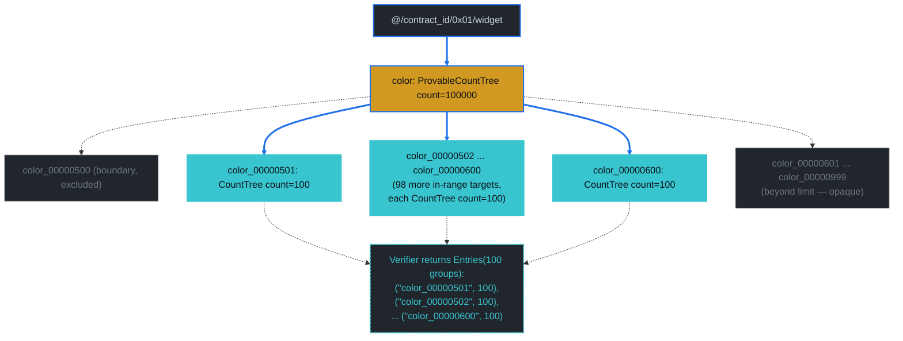
```mermaid
flowchart TB
  WD["@/contract_id/0x01/widget"]:::tree
  WD ==> CO["color: ProvableCountTree count=100000"]:::path
  CO -.-> C500["color_00000500 (boundary, excluded)"]:::faded
  CO ==> C501["color_00000501: CountTree count=100"]:::target
  CO ==> CMore["color_00000502 ... color_00000600<br/>(98 more in-range targets,<br/>each CountTree count=100)"]:::target
  CO ==> C600["color_00000600: CountTree count=100"]:::target
  CO -.-> CRest["color_00000601 ... color_00000999<br/>(beyond limit — opaque)"]:::faded

  SDK["Verifier returns Entries(100 groups):<br/>(&quot;color_00000501&quot;, 100),<br/>(&quot;color_00000502&quot;, 100),<br/>... (&quot;color_00000600&quot;, 100)"]:::sdk
  C501 -.-> SDK
  CMore -.-> SDK
  C600 -.-> SDK

  classDef tree fill:#21262d,color:#c9d1d9,stroke:#1f6feb,stroke-width:2px;
  classDef path fill:#d29922,color:#0d1117,stroke:#1f6feb,stroke-width:2px;
  classDef faded fill:#21262d,color:#6e7681,stroke:#484f58;
  classDef target fill:#39c5cf,color:#0d1117,stroke:#39c5cf,stroke-width:3px;
  classDef sdk fill:#21262d,color:#39c5cf,stroke:#39c5cf,stroke-width:2px,stroke-dasharray: 4 2;

  linkStyle 0 stroke:#1f6feb,stroke-width:3px;
  linkStyle 2 stroke:#1f6feb,stroke-width:3px;
  linkStyle 3 stroke:#1f6feb,stroke-width:3px;
  linkStyle 4 stroke:#1f6feb,stroke-width:3px;
```

### Diagram: per-layer merk-tree structure (Layer 5+)

L5 is identical to [Q3](./count-index-examples.md#query-3--equal-on-a-rangecountable-property-bycolor)'s / [Q6](./count-index-examples.md#query-6--in-on-bycolor-rangecountable)'s L5 (color queried under an opaque kv root in the widget doctype tree). L6 is the structural novelty: 245 merk ops, of which 100 are full `KVValueHashFeatureTypeWithChildHash` targets and the remaining 145 are boundary-walk glue (KVDigestCount / KVHashCount / HashWithCount / Hash + Parent/Child).

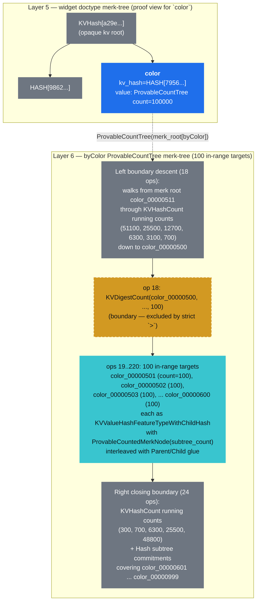
```mermaid
flowchart TB
  subgraph L5["Layer 5 — widget doctype merk-tree (proof view for `color`)"]
    direction TB
    L5_root["KVHash[a29e...]<br/>(opaque kv root)"]:::sibling
    L5_left["HASH[9862...]"]:::sibling
    L5_q["<b>color</b><br/>kv_hash=HASH[7956...]<br/>value: ProvableCountTree count=100000"]:::queried
    L5_root --> L5_left
    L5_root --> L5_q
  end

  subgraph L6["Layer 6 — byColor ProvableCountTree merk-tree (100 in-range targets)"]
    direction TB
    L6_boundary_l["Left boundary descent (18 ops):<br/>walks from merk root color_00000511<br/>through KVHashCount running counts<br/>(51100, 25500, 12700, 6300, 3100, 700)<br/>down to color_00000500"]:::sibling
    L6_cut["op 18: KVDigestCount(color_00000500, ..., 100)<br/>(boundary — excluded by strict `>`)"]:::boundary
    L6_targets["ops 19..220: 100 in-range targets<br/>color_00000501 (count=100), color_00000502 (100),<br/>color_00000503 (100), ... color_00000600 (100)<br/>each as KVValueHashFeatureTypeWithChildHash<br/>with ProvableCountedMerkNode(subtree_count)<br/>interleaved with Parent/Child glue"]:::target
    L6_boundary_r["Right closing boundary (24 ops):<br/>KVHashCount running counts<br/>(300, 700, 6300, 25500, 48800)<br/>+ Hash subtree commitments<br/>covering color_00000601 ... color_00000999"]:::sibling

    L6_boundary_l --> L6_cut
    L6_cut --> L6_targets
    L6_targets --> L6_boundary_r
  end

  L5_q -. "ProvableCountTree(merk_root[byColor])" .-> L6_boundary_l

  classDef queried fill:#1f6feb,color:#fff,stroke:#1f6feb,stroke-width:2px;
  classDef sibling fill:#6e7681,color:#fff,stroke:#6e7681;
  classDef target fill:#39c5cf,color:#0d1117,stroke:#39c5cf,stroke-width:3px;
  classDef boundary fill:#d29922,color:#0d1117,stroke:#d29922,stroke-width:2px,stroke-dasharray: 6 3;
```

Three things this diagram makes explicit:

1. **The cut is named.** `op 18: KVDigestCount(color_00000500, ..., 100)` exposes the key at the boundary so the verifier knows the cut sits exactly between `color_00000500` (excluded) and `color_00000501` (first in-range). Without that named op, a malicious prover could shift the cut and the verifier wouldn't know.
2. **Targets carry their own count, not a running total.** Unlike Q7's boundary commitments (where `ProvableCountedMerkNode(N)` carried a *subtree* count), G4's targets are individual keys with `CountTree(00, 100, ...)` — the `count_value_or_default = 100` IS the per-key count, not a subtree aggregate. The `ProvableCountedMerkNode(N)` on the merk feature still carries the subtree count (e.g. `300` for `color_00000501`'s subtree), but G4's verifier reads `count_value_or_default` directly from the CountTree element.
3. **The right closing boundary doesn't enumerate the rest.** Once the limit is hit at `color_00000600`, the proof commits the remaining ~399 in-range colors as opaque subtree hashes (`KVHashCount` + `Hash` ops). The SDK returns only the 100 visible groups; the remainder are provably present but not enumerated. This is the limit's whole point — bound response size without sacrificing soundness on the visible groups.

## G5 — Compound `In` + Range, Grouped By `brand, color`

```text
select   = COUNT
where    = brand IN ["brand_000", "brand_001"] AND color > "color_00000500"
group_by = [brand, color]
prove    = true
```

**Path query** (outer In on byBrand fans out to per-brand `distinct_count_path_query` on byBrandColor's color terminator):

```text
outer path:         ["@", contract_id, 0x01, "widget", "brand"]
outer query items:  [Key("brand_000"), Key("brand_001")]
subquery_path:      ["color"]
subquery items:     [RangeAfter("color_00000500"..)]
subquery limit:     100 (shared across both brands)
```

**Verified payload:**

```text
Entries(100 groups, sum = 100)
```

Two brands × 50 in-range colors per brand = 100 distinct `(brand, color)` groups visible in the proof. Each `(brand_X, color_Y)` pair has exactly 1 document by the fixture's deterministic schedule.

**Proof size:** 11 554 B. **Mode:** `CountMode::GroupByCompound`.

This is the most general group-by shape supported on this contract: outer `In` fan-out × inner `GroupByRange` walk. Structurally it combines [G3](#g3--compound-in--equal-grouped-by-brand)'s two-branch descent with [G4](#g4--range-on-bycolor-grouped-by-color)'s in-range enumeration per branch. Proof bytes ≈ shared upper-layer descent + 2 × per-brand byBrandColor distinct-walk. The bench's `group_by_compound_in_range_proof_limit_100` benchmark uses the same shape with `|IN| = 100` brands instead of 2 — yielding 17 256 B at the much higher fan-out.

**Proof display:**

<details>
<summary>Expand to see the structured proof (8 layers — same descent skeleton as G3, but each brand's L8 enumerates 50 in-range colors instead of one point-lookup target) — or <a href="https://dashpay.github.io/grovedb-proof-visualizer-widget/#f=text&d=H4sIAAhCBmoC_7V9W6-lyW3du35FP0qAHqrIYpElIIETG4mBJIYBG8qDIRh1tYUMNMZYsmME_u9Za_dMz6Uvs3edZHSZ7nPOPvvbLHJxLRaL9V-_-fpf9l_857_-5uuvz2_zu__zi3fv_nv_t_3N4wuPv75790_882_e_Y_9zf_65eML796l37z76z_98z_-8i87_-8__c1f_t1Y0vKRFk3PqKeuKimncC91dnxDe_ZYK8XOii-NOrP4brlvraJDf_erX337u_O3v_u__fa3_as_7cdb_Nmv3_3tN3v_suwlUqW4SXPpp_kZnvs4JVUforviMWqvuSc5akNSi8jtrK1tSbRf_frd42lLty4xRx4l4Rf2zp89aVkSr75OVqkx1inVo4qvgd-AHzPzPtfxHzyt4Gn7N_sPf_z27_qRZXKbTQoMs4trbwk2KCHuK42ML885Yw1dMzzNMbOm7a5Hl7fdDZ_u-_cqv3n35__4-6_W-79_9fW_7m_-_iuu1j__5tulevfuz979h__44S-fWMz3_3xiSX-8sD80fvrfbzX7t6uX8nf2t9HSzruZDN_7tKRztjVkNbxyq5aufnynmH1tk1mH7K54v2F11GKwya9-8NyfNsW3n-jNT_9ji37Rrj9j3c8FT2nbc8sJT-iizfZymSfpbq4tfK9dd2nFYBDzcuAg-AE7ZW7f8Mf43Y-s8d0_-ZNrmfK3q-FeW4WDV_zKD-uyWk-nr-jwQLGaTuxolmbeUbqf3UfvQ_LwNqbL2bPAl0uRKGXLPp9-kA8x8vE3v7Ry361fyp9agSfW4anV-Lzf_-vv1z_sP35rLaCA1Fx3_WCrOi3ZMT2yB8J1J01zSp-9VF1lFGl9D5XUGww6om8gCuyWtIuMUeMnPvyaVd7_8_4JP2-dp230gqU-58MNQBmtjFx78gb4jLPmqQi-OWRuxvEMRFuppY0z68T_Cn6stpF2W-13n7XGl_x5fNP_sD5aIjuatKp-WKoYtfnqra26u6ceukfJ3sqa3UfXpgE47i3OOFy1ueDybeiwlc6Rn3-2n6aBz_3zcXqoU6tL201H7pqRGg_CbkvArSpcKm08c7E1UgAZq-UMRxPkzzYRjFF__tl-nDY-98-zPvf-n4fdf87xXnS_l53w86H7eLy_Tyn9-t2ff_2nP_zxvX8oeMmsx-XX7_Lje-er_g_4sH-HP_K_v_vOXxoWnRymdUVGyrlZC8kSSM7VXQoy0RIfbg7ykurRGSWlVusGh1AfP78mP-PRePR89-glCvhWPqPsGacAp3c-Hv2RY3dClkX-gF9ZxtO3M1JGqhFzELbRqsmzj_6sw3_O7ZHZU1sdtCdJ930An6ZIaKWv1jLIGPLhUaCIhxvpwDAASMJ6gDOt_rSJv3P-p37YPqzH9w-6yRoG8GJHBmKpTWnHsyQvq9vx2ZJU21n2Auwf6yfTc1LaSJvt5GcftL5kUP_IoJaOgjeulNfuAc7ZwDGb17LOCZnI1imN0gSf49jEz0omszUF-wbmnGefM14xaPuEQSfckYYB3MGKZYDaFfVAGIHoSQb7y9oE5KsAwgOER8bKp5cxd55r-tPBlV6yaM4f07Iea-aovSF1zYLHNTnD8hqzJOCAHwMmDxvwYjz0bPgI8I4A1edHqE8_qbxi06yfMOqCv21QOYXZoDNWqSlhsdvIYCZLFU6QaturQW2EFiRk8MYK0mtnAbue9tJcXjOqfWRUP3llB9YoBNdYpaTV5zHwy5zEwCahgVZkZDyEvyHXZZi_Gz5dnjtmPP2k9SWj-ieMqnuVwFsj5oH1pS6VVsLBV6AeokdePm3sqRZTvYDFI3uvZnXrGDD3048arxm1fWTU3SGizjRNJQXYzJgquaRWcoEphwD8UwNZyMgIpTcx_E8E1hXvB0TsadRPrxhV8ieMeqA7QL2gaRxULbfiCfwmtM9c-gDSrgE9nkrNG1_ZyyBBbAG8PAMP-tM4Ja9lKPk4RQ09c47uDc-BPxnUGGhBJzm0LAJscDOIx52Lj31qI4OskaXC4qM9_6TPEbQbmvYDskY29Bxhu6Jtl-Ttc2pi1WSjDI9dIXiXu3revUJIKbBLt8VGkLW6XGdZiiQH_DAwsFy1WDydJD7Pw-bXX339za_f_dXXf3jQsL1-CWP8Sx9f7U_Rsofi-O4_hmSQP0vUvmNqcKkJhlCgvw8oUKQoyIxtsHoWPpEYuzSAT09VjuYGxa16cllLBpS4vPYRv6DB_1-62vt_HrZ7xdne4HJvcrzPud8pG8yOCqxvpHNkflC6lWuGhiRbbRBtoKozdSMPKEiqkZBhe4VQgFO-tjY_dUI-x8PJvqXKyaCRAdYZb7vhGSegbQfeNR8oFE_DhPWGEyY2IYDP5EtITQ7oc_rdr99BNV480WsI-mW-PzQhb_YJAjUsxVz4V1l7HmmdlDlW9ZyREGLuDqFe60il7zwqgszTurFo-ZxFfRdIiS2lIE0KpFEIaDPSd5xIaQFvsNhAlgBNPjbARpODLE-z0s7pCouK2cUT2bVF60cWlXHwmCwN1ulknIBB7T7DkPKbZPCmNCcS1qyjzg5QWtmS7BhtAbPSjUX9sxZd8Pyew8pcm-pjw0BzxWCpJTQq9Nym0IAuPfPA1JLww6MZ6Edzg0Wz-MUTxbVFP2ZRycCUEWqgnwLCDzF_ZCjcwPdYDlY66bC1SLZhlfV8Owg76AMF6se5ivr02bCvM5Gi1dW9Qrl10E9AC7JCjgRVX6XqAjgNBLtYk178zLQMEd932x0mrXrzRPnapBQyP7HplIVQQxAHvA7pLKan00WKKvGsd1DB6R3s3tuxksDwCmU24q-mHvPKpvo5m2rPCQgNaWwbermd0WKccgCWNY8JLowHg2w6e4DebekKKodVnj0D9KPCpnqDpC_Kpp-RUPBNJB6gPCskPeeEXNBmiKuEH8Dpzmd6qf6QATNV7mYIuBMki9vzbP-ncuozoT966qLeaisgxTlEVll4jg3JAdiXBJzFciJXSeolEEnGitrmjuGSgE1vAv-h2C5NGh8-y1_8_h_2P__x_ad5sBbS5IRkmz6UjhVg2iGii6xek-ipip-IlfKEeD77gPsPpCja3uEysiFk884y8l70mCuHaR9T0v-y-x__9M3-23_7p_0_f__Hf3xIhu-p6ncP_qO6IT9G_kKxMHNnMuUBBwJzlhGe65gzGzCNOzvcEAOsgH9A2HbI8GLI4LlanjWniQ_3I1K8FwnYX3299i8_1N6njnIK2O2u3FxDcqhrpXG2Q_M5_g3RmqwCwCCnz4kORPWaweG1CkDhxlklXfuG5FvDywuGBzsD3ZE2QczKybE2HAvM0S0gecswndtlNmTu5BOaUw5gdJUCigJcyl8w_Ic91rIH0rzCxEj4thGhsSBStbL6pxM8DFQSrCxk4h0DDGcHcg3oQzqj5CvGJS9Vsn6qvy9fWW5XTF9YsYMk1sRADwBruQagDug2Ee61YhWrbuh_QG_foDZnLtAw2PKAoHVkGfEvrZh92KfCy0YrIJqs5NVGTAUhbRAWeySWHhKJVumAHj8D8XggiLGoYUhP64qAyD0nlXpr-fKC5Tu4-k5D904rIXtN7hK0ZFYXePuUtgJh08wRSWv42nuCZlYA2zZ8356KlQUGlRbzaDoZvxrruqbk5hkCS0ZxTe594budQQMGs8C6WfbPINZ3IOW31rMXrLdP6c3goIBv5CeD4nEonchz-ZrI3GdZUwA0PrueCSMfMN-8Z92uBt31BMQv4tY8W8_CL4OaA3bvDc7RweyQNSWB2dXuZkigeMOeR-ouJeN1yccVH5F74i_XubW-klsn1JAAwYEScJsK6_SeonOrsOFX2ShYlgOFBINAyo3umvECCA6pZ_Sn3DaNNkrqBHCTtUbBgkLr9YiD8ADwT4Gkdm0tgElYpCZVmteDL5S7MoWmW6DW69TqrwD1qTWNCgCFIMrgv71GmlwF8LOhYME2-5zCGrh2i4FVCrUjEbt0q1-wu3_AaQOlnhsqsMGQisUDMB2DCmwpabLO0ovvYmoBgtiX1-Kiaze1ZlKu7P6GaozeGj5eMLxYHhVCmZt7A_81W0m9W1bkqC0JvpiBrQVrAyyKEFh7qnnvrU_IrmccfoCdak-NeNUa2HcZrqtU0ZkRSH2BJ6XeHs03HZnSFLQzQ49UrK7vK5zWa37RXrBecENZqT8BDXlZHXuCEo4kIBqZBMNN4MOpUqXaySztzFKBJXNoeYqKl5Kzr9hmAtMXIPxpSbZBvuTYG4QQAAJeHkdTiT6QSutjB7k1gItf4bTe0wu9pRc5vWD4CScRE0ma2YCIP4NwQ2Dr7DIzZND0keFhSIfh-L6Z4U9rAXMnFuEpepGXegEcI-MmrCvYHBCjTpDGE9yDcyAJaDfiTcHmommDHosKwJBlY8mV4f0ap-P6le32leU6q5R8_cprsVKuxUop16-022h4pSIAWmgAF_EBkS5Q5hsKtI1hR4-N00PWHrETMhyiYyLD9rI2-75XIUv_UjTgYT7g-GQzawerXyA8wh0BpGrPIEkjJd9gRLvvNaBgoWwUP1JYy85zCJvkxtVuQL1GonJL1fMrRYEORQko8LSlI0VW1gIsOtRGDm6Rh9RC4EZ-wN_rIpZjNRbsBHnY4hkkakyYc62qRfCA3FE8E5T96BwWGhO_3tlwlSFfuy6bLU9m9lCoX8tXho9b670i0EUVBPoI7MEGHBBAGAkq7SSCbs4DJJyycPd8tkjNs7Mo6jOvXgTa-YkECo5tLJJ43RsqCS-LhWRRQTGhQ6E4j-yTa4YsT825vxSjOtdSK2TRVTG7tGu3tXRr-Ff0OXTOaaMe3Sa5AgQcX9A2BOwXirOV7FmssH8KdDnYwm6jr8Jmft1fNPwHt405tdWD1yTwuDVHVMljAJSSxJE5_ECVrz0T1qWtBu0OxgLmXUrHN6-Yi10nFpNbu7-i7OFqArM4YvPhyETgAzO1lQUYcSAtYwyeYmEZhDIwHD6a4MGaEA7PCB2s1xwg8xNo0bdskPvsY4D_ZARWrXOJDhDTSM4CSktdp1krxzVJa3Zld713-Fuqnl9R9rXuXLsVKMaVI8aOxBZaSwDkVnvSBhI3HH6auFnYRJ0Fq1LYG6ZfVJgfHD4t6Jq9iwpETM2Iq8kNE2hNqMq0a_Q-AXfICT4nO7wiF52xADMTOXVfGf6aYbyiz9vUwvb7PBPYA2QFNDdct2vArpA33r2Y9bSRk_pMcbyCfyj0XDPolKeEDhTnZpk7G7RT2fjVwY5nMO4WyGiVlZmx4aF7QxwO1sVSQcIF2Y6U9xW9sHt6Ydf04hV9zn1s2fkAKWMBAVKH9EaOnSyYZASwSN4lKXta4L0xY_S-eTxhgqhVf8Zt8TtG8eYJAO0d7puqJIirdfJ-bJgpgmKD3tnuYID4KxZ1s4GrsHk2rgx_LVfsWq7U68z6Sk3gZKSvTBazPC2QMLBfkabckEbk2wZvBvILaFw-Oa3R1ql7tok_YBn6U3sOCL3FnWME4HI5px0Hv1mIhQQ0gdYFciXTsooMUNNA9CgCFJmlZyl3sVLvWwzqbW6VV4oCYzq4d40D_WMm84HrViF1DDEyodtXKnWxRwwxJEsBN1gjQPQ5e_tTxVvFitWN4GNtEEiH9_FUBl9-QFURig6pBeSbgvjklgZCMreUO5ZXz1URsd5WAuUVEclmbUGSzF5GXg5eiATYyzQ8ObzZ1hFjA_BQbqtst4AgmfBfAVUEq3kG4itP5OYKpg8EUVE45eQBM3cH2TltWwH9DOglnvyC82YQfTxYcqwsourKevddHPU2t8orCjJBIcJd4DBlVTlQiL7q2r6h9opMn0fZux7BnWW4K8-UFUh9eNNQAMBTew4NiXPNHgvsmyfS8vBFCCH9h3qkrEwnzTPZEsWWXEDFCXz5NED_1R5lrddAfZta5RXtOTdsykQGh58L3FqoBVsvruxrb5u7x5EQ8aUotE8fsB5A_UCntPnF0vf3ew6N3V-ld2LTHAJzcgui9xwdASV7jIdSl-gIv7lzG1EI1I4lOnLn8PebbPV2k01e0Z6l84ybbaQ-EA_4OPIhHK5B-49jyaMLtwegWgLiCMgDdjPZSF3xyipPOfw4RaByYE7uLUsLPy2yHMjRiUzpBwijW72nnuYEHB1kggCpeRz_bVd9FH7LL-SlveFg51IDvwC1aGwSHWMAJC0DLGuHqtDY0O-rZZ4S2pNmzhvsEYiqNp7BaXjjiTVnr-VU9w2RXlOFEvJQaHMVIENXPHeUFUyJgzwf754H_liuhIzf0wu_phevKEhSiEpVWOQRzuztNIN58mZbaRegc9RzxtxYFah5KHzgeZkJK1TaU1tlAcnUAMkAmg406JMbn5IecyW84rd7PqVCrgOcqqiVWWcemftW0PfWrwx_XRf367q42_Urb_eX5BW9yw2jAkIN1iEQmVYazJuBGjLUZs-95KoC1O4hcoBNIENceWW0aPlStUC_T8p98vxZNlaCAxk91wxCySJuAI_Wysj8hqyNyGJlCJBGFbYAlNZzuUoOft-A6bcVYXlF8LIcJc3BnAcLwUn3fHTyTLZsGkvngqCyjDVYkXtDBi2g2Lb18HTqU1F2kkOELagmhdFJskY_ZLnWgHkxOwCPa86eUHaClTM6lPFsa3fg4Z3hr1PrS-KzK3TPaqBuTBApg22v5NkNAJFYQaACymrdegx4rDr4DAzRuZ_8Zb_9UC4oPAYAaQC7JeZjGCxgnwlV0HPuoDFis8wDWh8AL-F5O6ycsn6AJ7mxXtz3hsZtA4u-oj2Bzym3ZUBrFQdOp1kGaz21NYRzW4-iX2gKw2-ezvZZmN8Z26fs_YzbeitYRC9rbHhtUjm9KtNt4h5QaxINC6-QoOPorHtXbvml2pBE9s53hr_ebo1b1aqvqNaeEat11t4SOHOGLu2qkg-cvYtMMGuLHXMlwZKU3YWg4UBYmD48nqqnL25haFEeF4aQz_BkiH17sEddUKuIt2a1ZDbongrlBunka3BaCiDkqn8l7lVr3KpWfUm1Hqh0wAqLXICSpqDwzQHBJ9uZ9QSkfMK6eK2A18SjTge6Hy8L95GfcngxrWvWmkDZ26MvKCY0APTC4-yxsJKlAO221zSWcJR7HDMbKGpD4rwy_C2_0Fe050gVNpsLbgXRP5HAKgQIj9jhk52lssZxfOZSIEJbcBcC4V7ZgGhtmD1VT-dpVAj9LCDlyKgg59Ctc-SYLPaKnYie8kRKU2Q_-HXNpXNIBpTZvju8F_f0Im7phb6078mWbBFQaE0Hwn-swC8ILAG7_HbhIDmsgYexiwFZbKXIBiDxBNGYntKee_CHvbJdH96bAUmxN4Klsw-9VmSJUSH1K0eWwX2NvRjxSKUVIvSqRhjXVfF23cTTrjOrvdTDbwvpDewBbptzNNbjey8tVAZS4PE6YsTjO5tnTzUtwx8rq2Wt21P1dMYflmCvXRRku2QrqzsWA6nauVfoFALK02aq4N5RBpAPYq-lJGNfbVW3-97Qdp1bXxG8ZL72sESrChMvlra1CdvfWnNABRjjWZY1kij0ymoiCaJldW7UPbX3BDTPCSat7HJH6HmLOlYJWLxwGljDNxGKyDLbpo4zgX9xMnfB3NcdxLfbDWd9SUK2fNIYZ0S1TWW43aDywJln8Q7KwhNCFYStkzemAa8TD_AGspXQp3r4DSYvus_x3UCxR2ulg_Rt5L8DYrQr0qLkrDN4CgWMM5CEkXkK-L83vWolb_e9oe06t76iIGtKOlqZls5s3MKH1-dOlpCA-sASLZ60p-0tuWFVeDS_J2TjWeoY-lxv6DgFPw-iB7metk6kD3DRzcMTGcudBWs8kG1LBz2cCmFfOGKVkyZiXeXWdt0b2q5T6yvac7AmdXYNKBpOlC07QwJxbCoimX2yYhwaoK1XiM-UzmDiQyj7PJBH5RkqnhU6hkPboNrBabBm-I21ad-Lv6lyswJejhUxCNB6kN9BHREfBcpgjjuHv-_lyum2JFxe2_iEA1bhNDb63eEG8IFDIzmGGUC8nNzmmGZpwt0TIMEr8BSvmiv2U0DN8m6qmYNSwLMLMMSnrayrYUnS2HgTqRusn9Vi_GjDm5uO9Zgn4Ofu-HK6ZRjlJQ2pS2aUx1i1vNmzz4m10WeC5nNgh_Nwj57FyVYFBLHIprhPVnuBnHwGqXf2bDwrz3Nwm72NYH6yRHnYCpQbwL_x-xKHV60BHcvzAkrCeHqeSe_MJ2_w3FuKUV5RkQL_7NFy9cnZYjo4yzelOpEnV--5J54d4cl__AicFuLneIC3c9zgOE_RcQ5t1s4JT4a3gKNy6vX23KGGkKSR1bHETTNsXTgQ95DfNeTk7kggK9-Z_ro0jkxx_9J6_1K_f-lteikvtQqXrazQHjB05cgedi8iRBII1T57NPhS4t5Mh4qyecASzziPE-p6kGS-4Cr1B4RqlOYQwyWfKMjmIWzgAw70AA89POozehfOdI3B4eI9rdTL2F3AVe8GX6Q3JJh8nWBeUc2sIINTQQpB-WwO5GU590AXjdhHYXTlSTFuh0QCeEbhKENWg9ves8tTTe5HHsMDsJKmuXTI5oxYHZtnb1bfwu4lMKyRmseZxylEFBwbSQgk4C5M83WCeUXC1r2lg4loPVlm5-HDjQS54kAvAQA5ySHGo3HskLfjZ9mgbqD1a7jvp1preGT30UIPaMzI7LYECHkaT7RWzdOEE6m6rPeD-SChReaUlaWdmved-d6QYPJ1gnlFw_Lj7ZLzQugWJHjLxzmQVvdaW3lcZQJPtic50hpnWiC1c8yt7Qny8pQYYHF5IXFAY6jDmlqS8bT26IcFBIP71nNqRCwoslI4TBGpP_W18pp2N3cs3yeYfFsgLq_o31GbpQW6zgJkhtYFXDSkcu5gsivh7NkyzA_-6VDEDhBXKDfjQVTIsnhGDiByeCYyWlcF6tctXuqxWoaqCsGqCGeTdCDHKJln-KSIuQeeKJ9Lp69vcPrbzqbyigJuATmEz9jYTRYg_yM4KMGQwMB5VpqVZ3uFXSRFlhJ1AUOpwCPttDafqs2HDm_g-2BjiCoe5rVVYPHmxRo3VTuPFQgW3VPvFhsxlXqSEWWcWe5Mf800XhGy0KxJAY5pdMA1Hp_H3TJQVVNtZRRIms5ejBSLe2_A7XR0c1KSKsc4Pzd9oSxuJW_v0X3CRzdSXxt5ZfYDThlYoNVBLaA4Ejv9kPcg4WrirKJ0ab43EA25JRr2ipKNhbQoSJcFaMCj_711mL3XUmzV2lPkOFVDdUxosg5NBo0JGUsI789to8pBYg2AcMkdWitWzAka04BP2cwl67ayQng2bLdaTkPiWGB4YHxplKtzvVmuzyXl-_E8WW5zrL2in3eONtOuebkW0OapMGsFX87lyGO63ToD2KN2CufyH8kGQrnYvcq5PE9V6A9XOW0DwcmsDHP8dGLZp5XJY3qsO8WeBr3IY3zgqnPpAH3frZ_ocbdqb5gAJ7dZ1l4R0NAobTpoRZ8OGgmrB7ifwxaFt9IED2i0VgHEPAjqVdl8AHWbvKZWx1MzqczOzkwoyCgd78VCtY-1C9Bw9VzBYcynIwcg27Qa7ISrEM8dWJ8BXnemv60V2yuiMrFkBbHIQdELWQvOFOYBE80NRlgTTSVRQcxBntlnx8uNIDqCRcv6VOlnskA5x2Z3gAC0oGuMQ7zHoyUhgqP-yE5PPayZDhZMH72v2eqKu-N4Wd4waE9us6y9oikrsiondKeBYHYgLSjbMK1A4hn8s1RLYGocs0M8AZCkAr4MjIHiq0-VfiDJO7tgM8eTp-oQPGAgnRSdJ55iLix4Wytgdjt1L-g6pCCQUN4wZuPO9NdbsVmvk6y9dKZMe61u7J1TNvjD6yYFtiuISM5Dee1Z4rys4gUh3jnjXY9WMh55qmemR1lY4AAhClDy9GhAgOwZ4DcHb783L8mprOJV5QjRAvHP-1hAotKwywmibxiCqrc9xPaKHFUe2OjJ4WgOSOZhFzh4Ko2DtgqoDQj7oplB8SCe2uxIqhmk0yanTz0lRwH-yK7AG06_LYWtoyxWH2RQvlnvi50PyADIvYUzpXxvkPM1FxTT6Zemv2Yar2jKaZytDmYBt8wAU2m8MYfjg5TlDrJvYGrDnzgSusDP8gnQ9ZRnOHToU8ycl64UTmfdG5oUuAOX5Jjrph2agE2PYgcR18DcmTkyeKhudv2BksS6M98biIZeE41XNOVaoM0tZdrVARubB9J5sjxzZ3mPWsuugzeIDWIJcOXk910tY7Ft_alCCi_Lmm1ITF7zN2PNFGy5PduwpGzv3SxEgl_sBoLOWRFYZCQ7ab7mXQlQ72vm99N68v24nqy3ncT2ighW8J_MNpd8bMYuwmnv-Bs3Yjb4iea-Z7Iup0C7Do5R60jRtQPahFc9PdMB70uWudfOCZCrLmRonTXvCG0GoQvkIyVTAXgxFBuiPvN8RJOpxe6kWLnvJc7ltl5cX9rP7UDwMharigu6CVyEBYfAx2_UQXul6XU_zgLWVoH1kMZgUJBZSND61KwCMM5uiKks3RBwmwWJdSisCzjpwNofZ5RBFyPohgj01Eocb167zXlH6sttkq35pd2KVVqeE08O0FrZeCVNDuHk8gHlr9w3kspLSvK202vz7Zx0fng7XHmquVJ4By0yprGhJwveIVIdnNWR9Wy8D4_vgfqAvyM42BzuChCbUwfSh1-aT9_gubdNT_UVOTqsZ6huSB3AxbQ8z6jzcfL64IOXPJA84dtHJovyZQrHVXMmfhkcNfNU_SYBA9jMNOCpDU6JsGjLWuRUVkU2giTuPFSIJIFlIKkCapzoUMHs3L7rRCj3m7LlVsnWV5Tssmqrnbl4nICHG7XF0AEH30jIvXAz4rDzt3doKm_g27zIGXwPX0XCfYbUhxj7kTtii-R0rwcNA1JxdiSWtHUsRlMQsD5H5-jOhiRhuksTNk3cWf4NSvZ6iFV9RcmuDQ4W3HMgq-46nf4J6SOlQEm2Lv645KFMeKzDRuVYzvvRxsRDwc84PbBq8LoTXgumZUteHQlYpgfJkhxEw6REAMkFoPOKQGvg_auzzU_XXb243DKN-ooc7XPDKFId4LnT4EFWh90Arh2-tQWiJYAlq4FpQ7co6_CnF01QjLzt5Rm4htBZWjsnWmVe9WQyUu6P25rSlP64s9tlzTa5XXU2VO8Y4BjQNYW3nl-Zz95ANOyaaLw0FElhc96JpqKcoQnxua1PzsfdnKidMieCcfJ8psAqq6-TsVIHoDqqtadqMMmRC_HbAEZ6asX6Ilf2sXem8m8bMK28VSgm2YZoy6IIF7jDLFAQd6a_r5mb3r_0Ose-IoIR0j20Is55KhiG8zLBOFZPiT1LyHEJ2TQl3mrVgP9A5fS4daY2jp0tT5XbtS7J89EmdTRLE9ZHe2DxwLsbOFNmbXf0wTYs31s1cuM1kOc0AzLdrZq9IWCus-xL45jAmXmZHUeorQJZi7hoLVsY-DNP6Bi72Qen_XdkyAoMKMjEmstKw54LGG6d8sLKDIrTYxgPqoHFzEGzex7akrBVnDcFQ_aCYoZVRCSSMhjnuWsnuJ5mVV8RlbkWW8vVOGCx9srtf_hygsyBe6VR2ZQhJ80OCG7grBAkPFfNfiue63qq0_LklCSlDlRHop3VYCFImiquusMBab4Ha5Jw8KOeOO1eLHU9vIH3Em_iDZ57m2X9FU0pswzQDgG2-zjcaDZNk_enH-i6OSGO2qoJToXcGD2BOcSYdcGd6wClecZzkUY2JBSy7BCOSrbImvF27A3QcQpSS3K21wjUFtuDoxde7Y6VVvznDjTq9fmlXG-TrL8iR49DtNfJOVHz7NMECbFDCvPYTF4DJCQKtKhBHClsXlYzSZBMqmuC1fkzzDxJcO4rgSHYU4vUCqID0RXmCIMRZ0PUs2-7QZ0at2MX3s9Kl96i32101Dd0f13PtPJX5OiE18P16hxAmz7SoUpCRnxcszV4gQDIZU1Ijhmm8zAe3eDeBxLls3I0V4DGrjKJWwJaj_dj82MS8J0BjClrTtE9wGXW4IU9R-o6sZAyRi93cF1vmYa_oik5EjR3DRHfSdvJIAAlIcsFN9WOFY5I4gRflj3KOjyVDlpSenKOqGlPMfMDmBmQrIkXYK8acNwqClXDu4MjvHEMGUvNnG638IOcjqHm-Ch73A0fzPUNRKPeEg1_RVPyIm3ej5Br7AFrerDZqBtvtAPVOsYZCzxLMxOCmqITLGy2ijzqEnk8VUjBa3RAl3akYwfNwO_SAgInPOAOfYm_aQKlA_GTGVBnYTOwNq0mduHfmf6-Zl7va-b1fk_W7_OL3zf9XI80cnsJH3lYi1NbE4h8MvAkSw2eF4UdkyIgJ8VOSqOAnEnd6VjnrbVyort8cVNHvj-0BcIHarAe12GNQkfKPTdtla3QyibCwiNJnCpVd4XYdIOACedsSxl3VX5_Q63Ur9H1FfE9ezcrwhnD3tg5CGPnhM9tO00Ed9QCaoa8XTgC7RhLSrEWT4s6p2Y_dbzWCrSHQ_Z1KO2YC1Ayh62E5HNGTwB2SZxhNFIbwA-boHylmHRFjkl3vSd-uyHp_hJCjtoPPpQ-Bu1PbnLzUtfOuW7pUJUedviB_kCsQWJ33lJsxTlDq0V-qsqfx-Icl2YDPDnL-zvjN9tWZnhl2WoKT5qC-CLJV8hwM6THygH25e6YZ_Y39Bf7rYzzV1Qwr2SyBonlyBVIGFCgrfDkDMecnShpcV6ngvL2BAWcE6gmGAKvRwE_zU8VPI9ZgmibxUGIgUC9tOKVwBM9czh9wrKDHhdQEQfH8sTbaVc6wC9G053p7zPM9Xwnf0VA8zK7tdvi8Fre22wl9Zyc5xcFqBqQUwDaGcjZjW3fSNmwz86P3oQ20zNa4lTOneed6WqcOcL5fj6hGgL8udfaClU0NHyDagQ7Ucho_AUMbWgp9a5_5A0DnvL1hKd4RUBnuGFn7TjpcDYpbBbeeDm3MzUWnZsXoGdOcnZZ4_0IeM4HFJjPnoJrA5ODTF6pSSu58D7JAJpM3piAX7uc-MPxb_jvmUjH1bBMvA9Q9EDi3Zn-lmrES7fWCqcLc7JbyWy3W5SovCV7QFPYyadywqEg5ydYq0TacyUQXp6E4s3vz8B1f1TdQjkifmygjmzjmIoeXBE4Z9659N0QIZNn8q0vEGtOws0WXe4wI95ANOKWaIS8djx8nl6XhCvT1cYn54FxhYZy6b5GOFDcecSvwZ8eJ0EC2pW6b6-nms42BYEz2fIaSicw2OkSR9fEG2AVeZtfns53SdI5cntwTpZ1Hnm-22CJ-03ZuO_6idscG69ob6i-Ja0v-Gg9OnjD5_YBBQzabMK5Bm2ye7LEAlhQI3vy4OR-KJb55Rz7fZXfD9BezuY9TlgS4alL2Sv7gJwvcJv8GKSBJHx4Pwv8oswFJKyDN7XcKcB4Q600brNslJfqHjUFu81s8YROpJUAJvjYG7jSc-VxShBCL-NQPm-JAf7ppxTIIx1PVfmnsaM8QMQHtBeySmwIH1ZOK_s0A8R2ze7B7RRl6RRhheVq0FVYkcsG2XbbXxwv9Rcrd0N4i31M-EsDB1QFcwmW84efuaLvng5HcqQjoz_-bqWy1AD0fqqpPnkqTK7HclHQlRpIvmq7PGZocx5_5_FOPVKysF2xeGZFlEO4-uVB7faG_uJ2nWVfur_WOTAPbI9dNv0sfVhApoMpGG-IHONxe4HxEgMQtrQd2milLKFl-lNN9bMU7i7yAInWxK0_djwUmz2lOVcdpOg8UQH1Ol04s5vDzs6ulTeYtDvT3-_KXo97ipdusI0pQxNv-I4zA9L0VGNzfd8C9hHgbLzVL22QECiilmblZl4DReFt1U811YPzZVaxFTJLK-_v4h0TGx5dtc9HU_nqbNA007Nb5g4CIwMxONj1dmf5N9RKrwc-xWubsqXxUkJIEQ4pB_QU9olLkiG8AA9BUIwHnoCqja3xacdOSLCc9R5ynoPrnXjxdqlgsJl7XLzNCb_CeVWulNaU7SI2IHVPNh9dOWl-bltYq7ib39KumcZLmjLAuEvt4Ie1nrrZrVX1QLGzm0t4d8wq-ODw15049MEbSx9tpMQb4Z6q8sP-Obp3XoyaC3e2c4yZuOvYJ-ACaXbwXubiWBIbxu0Ttu0hOdQjl9MJ2huIRrslGu2l467IjXWujUQ2YITFO2qtBTdMW01dIQAVRHo99vR4Z5BDegqRBp6V5KlrbMH3F09_CEE6Vmze7lc52NJ8AY0462iGcsKejArNf4BKZTUoo72WXXWqSroumkvK9y-V-5fe7ke2lyZNMU9CwHMkXDTNu3DqB9x-JlkHeNQ771ocPG_VEId1shH8IATBM-fUp5rqwaACdGtDMLSMcNamnAKQtxryUAP4FR7lROIfAPcoOxqStpclGYA4_W7B7w-wSLqtF7eXVDAAmee9nbvfCB8fHBucMw-WC693dlJHnv_m3ZgHCnmBQALOl1Q75akGCCblPntHTBeDKlhjj6UVrHOwLeuAmOFr4PnsS8kcYlcXZDiEsrB4tO9Mf5tk2yt61G1C6ECyrH6IVRyl0U8BrbRzkhZwGN7uVConLAoITeX1lqlxkFkHL3mq3C69zwRLIaVONePFJbxDcPmGLTm52HbVya3UXTuE-Gb_E8_JgmV5voQqf4Pn3vYXt5fkaE8a8JcBKQptz7mnoHMNhBu0D7kepH5bgpISzjKGTYbDqXgJY-5V6nMbRakDnE7OfekZrDOCOFY2m8GHmYWqzJ5Pn1AReE9xB8XhjkpDykrp0vTXu7JyPfeqvaJkXQtAMu3sKYHxTO5YntFS4zkHnj4cBSHhdfDwH0imTraNgCKNs2fqT82wYXsVTykkhU8LB41sENh9Oi-3xLe85V7icQVk4sEcyTyimyd-torcbXRIvleykm-VbHtFyTY_vB8R2t7yqchVAEqWDdue7eylg2MY-2YfZgLsKvhQzFQ4KAQRoumpk7IAYyQR5GB494KK3Vl45_MuIKkSiLPONOmp5C6rr7RbaGb_mnSzXe5Mf800XjopCx8Zrkj0xqm0bjySAdiGI80idaW2gBPKmyqR7cZO5XiiZH0_His91brD27Ez78XhZXGT3bAiFbExoIdA4jtvRbc2pblv56KxhxwyChAj4-4SSslvIBrXg6_aK3J0Q6TbgsVtg4ANUIk1grvFyPBFePIaZtDNFlXudSwD6xpE1iENMfKUHK0cXAHhBL3WoBfYnIPf2AxxEMaLzn1AqR44eFrg9tDEBxQNpGNu3k_f70xf7-Ha7196nWNfEcGtsetYtYB3gxgFL02Zi4Mk9TEldCOPHu4ecWM_2FjM-dpgJ3sEhNhzM2x4zmItLlepckDJTwM_igJu05WHLnSPjpAsNSCXN4824636brz8iPT_atXuhz7J7dCnml467trKSeAqrbvqcXaeuBpvJebUuNVAviGQhoOMczs7H-5Np-LO6xTkuemSlScO9-MOO7aU2wDWT3xJFAmd10uxmh-eJTiNV9j6zKvpWxjLOvPq0KDI9xvTtNDj4X75nuk2ELaeEFLqC7AMTtdDDAoMjK6lVFjNa0jxnK-j4jxhPU9KpGNNK91Nr55I3uAM3yWux2q_Z40reH9ZjsV2GAQICBFkzqgFISSOxeJhCZbcR020LotmC8ZPx5AS7hxaricfyg9mMv1kQQYPmLUDssupKAIYHdk5VbbJhFzuCe4wHh_XjvC2CBZuALFZOZWssd_Srz5MfcOC-EcLsiDz2etcGIRg8XmuvWIb8go4C1hU4W30Xs4cGmD7ZrkPkJtdsSpQkncLEvcLcq8A9L7EpJ-NywJeBx6YDm_S7OsxizXNHAMfUqAy6wmgPjh4bwbrLqwBz8dxIxZ6yAlF9Sow9Q2BqR8HZqdEtCrIYGtJOtASDR6MgISu9kYZB4_f3zauJF7MZrw0rgQPYua7GpDeB6ba_Uvr5xbzrKKaCi8lYO-McdhtKSc7Ataqgr5K61vr46wcQn0UkACIr-oD4vpxYaeYXVniDTUFjY9WU3h1X0K05qa5n2mnQiUuXjxZdFORQrszP4QVJkvQb8Bu29GSgprfRbXeh2ZJn4XZEQbC04ITtoUTckF97WRIKohstrhGdO6ILzZSQmwDIHu3iiCEFjTGV4m4-TjlDYr3w9iK75cEyqdB9EPhcKekdvC47nVtqngeq2cYAXY5e0h1w-sGiAYkY4vMGc9X-89S9H5JvovN197233_x_-Nnn_3J537umZ_6-Z_5uZ_48ve_9N3Pf-9z3_n01z_11Y-_9tOv_PjvP_zb93_-7k_v_83___df_Psv_i-_r7THZrwAAA">open interactively in the visualizer ↗</a></summary>

```text
GroveDBProofV1 {
  LayerProof {
    proof: Merk(
      0: Push(Hash(HASH[bd291f29893fb6f6d6201087746ca1f23a178dd08e1346cb6c127e91ae3623b3]))
      1: Push(KVValueHash(@, Tree(4ed22624752972af97fb71abf4067b23e6d296a61a02f35b2098819fde39d289), HASH[4a5a28cb1b40226aa35b2f0d502767df13268bdf4678627dbfde26a557acdf73]))
      2: Parent
      3: Push(Hash(HASH[19c924989e473a90d0848277d0b1498ccc8db3dc870cbc130e773f3d79ea5b71]))
      4: Child)
    lower_layers: {
      @ => { LayerProof { ... contract_id descent ... } }
      // L2..L4 identical to G3 / Q4's first three subgroves
    }
  }
  // L5 widget doctype merk tree: same as G3 — `brand` queried, opaque siblings 9862 / 6c36
  // L6 byBrand merk tree: two KVValueHash targets (brand_000 + brand_001), 25 boundary ops
  // L7a brand_000's value tree: single key `color` with NonCounted(ProvableCountTree(...))
  //   L8a byBrandColor's color subtree (under brand_000):
  //     proof: Merk(
  //       ... 18 boundary-descent ops walking from the merk root down to color_00000500 ...
  //       18: Push(KVDigestCount(color_00000500, HASH[...], 1))     // BOUNDARY, excluded
  //       19: Push(KVValueHashFeatureTypeWithChildHash(color_00000501,
  //              CountTree(00, 1, flags: [0, 0, 0]),
  //              HASH[4192...], ProvableCountedMerkNode(3), HASH[c3b4...])) // TARGET (brand_000, color_00000501)
  //       21: Push(KVValueHashFeatureTypeWithChildHash(color_00000502, CountTree(00, 1, ...))) // TARGET 2
  //       24: Push(KVValueHashFeatureTypeWithChildHash(color_00000503, CountTree(00, 1, ...))) // TARGET 3
  //       ... 47 more KVValueHashFeatureTypeWithChildHash targets, each CountTree(00, 1, ...)
  //           — color_00000504 ... color_00000550 (50 per-brand_000 targets total) ...
  //       ... closing boundary ops covering color_00000551 ... color_00000999 for brand_000
  //     )
  //   end L8a
  // end L7a
  // L7b brand_001's value tree: identical structure to L7a, single key `color`
  //   L8b byBrandColor's color subtree (under brand_001):
  //     proof: Merk(
  //       ... 18 boundary-descent ops (different hashes — different brand's subtree) ...
  //       18: Push(KVDigestCount(color_00000500, HASH[...], 1))
  //       19..220: 50 in-range KVValueHashFeatureTypeWithChildHash(color_X, CountTree(00, 1, ...)) targets
  //                + interleaved Parent/Child glue + closing boundary ops
  //     )
  //   end L8b
  // end L7b
  // end L6
}
```

The 344-line verbatim is available via the bench's `[gproof] G5` output. The schematic compresses the 50 per-brand `KVValueHashFeatureTypeWithChildHash` targets at L8a / L8b — they all share the same template (`CountTree(00, 1, ...)` since each `(brand, color)` pair has count=1), differing only in key, leaf kv-hash, running count, and child-hash. Once you've seen [G3's L8 structure](#g3--compound-in--equal-grouped-by-brand) (single target) and [G4's L6 structure](#g4--range-on-bycolor-grouped-by-color) (100 in-range targets at the doctype level), G5 is precisely the product: two parallel G3-shaped descents that each terminate in a G4-shaped distinct-walk.

</details>

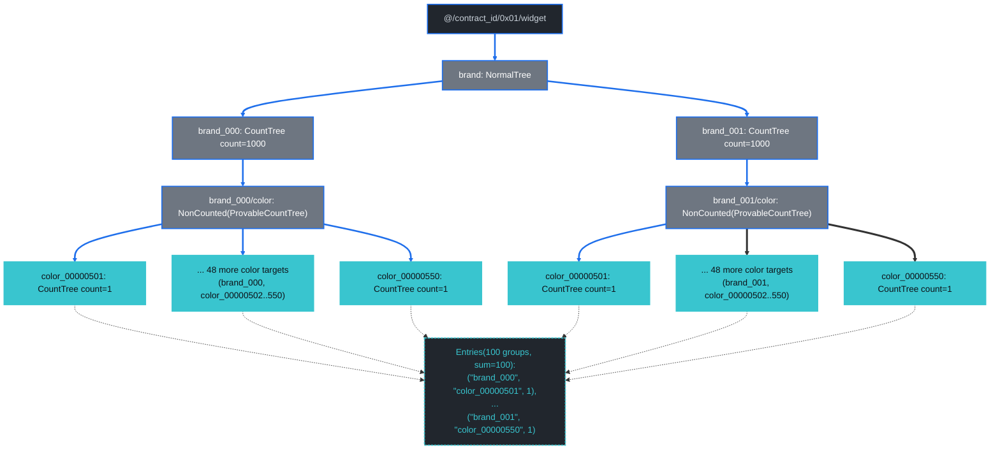
```mermaid
flowchart TB
  WD["@/contract_id/0x01/widget"]:::tree
  WD ==> BR["brand: NormalTree"]:::path
  BR ==> B000["brand_000: CountTree count=1000"]:::path
  BR ==> B001["brand_001: CountTree count=1000"]:::path

  B000 ==> B000_C["brand_000/color: NonCounted(ProvableCountTree)"]:::path
  B001 ==> B001_C["brand_001/color: NonCounted(ProvableCountTree)"]:::path

  B000_C ==> T000_501["color_00000501: CountTree count=1"]:::target
  B000_C ==> T000_more["... 48 more color targets<br/>(brand_000, color_00000502..550)"]:::target
  B000_C ==> T000_550["color_00000550: CountTree count=1"]:::target

  B001_C ==> T001_501["color_00000501: CountTree count=1"]:::target
  B001_C ==> T001_more["... 48 more color targets<br/>(brand_001, color_00000502..550)"]:::target
  B001_C ==> T001_550["color_00000550: CountTree count=1"]:::target

  SDK["Entries(100 groups, sum=100):<br/>(&quot;brand_000&quot;, &quot;color_00000501&quot;, 1),<br/>...<br/>(&quot;brand_001&quot;, &quot;color_00000550&quot;, 1)"]:::sdk

  T000_501 -.-> SDK
  T000_more -.-> SDK
  T000_550 -.-> SDK
  T001_501 -.-> SDK
  T001_more -.-> SDK
  T001_550 -.-> SDK

  classDef tree fill:#21262d,color:#c9d1d9,stroke:#1f6feb,stroke-width:2px;
  classDef path fill:#6e7681,color:#fff,stroke:#1f6feb,stroke-width:2px;
  classDef target fill:#39c5cf,color:#0d1117,stroke:#39c5cf,stroke-width:3px;
  classDef sdk fill:#21262d,color:#39c5cf,stroke:#39c5cf,stroke-width:2px,stroke-dasharray: 4 2;

  linkStyle 0 stroke:#1f6feb,stroke-width:3px;
  linkStyle 1 stroke:#1f6feb,stroke-width:3px;
  linkStyle 2 stroke:#1f6feb,stroke-width:3px;
  linkStyle 3 stroke:#1f6feb,stroke-width:3px;
  linkStyle 4 stroke:#1f6feb,stroke-width:3px;
  linkStyle 5 stroke:#1f6feb,stroke-width:3px;
  linkStyle 6 stroke:#1f6feb,stroke-width:3px;
  linkStyle 7 stroke:#1f6feb,stroke-width:3px;
  linkStyle 8 stroke:#1f6feb,stroke-width:3px;
```

### Diagram: per-layer merk-tree structure (Layer 5+)

Layers 5–7 are exactly [G3's L5–L7](#diagram-per-layer-merk-tree-structure-layer-5-2). The difference shows up at L8 — instead of a single target per brand (G3's compound point lookup), each brand's L8 walks 50 in-range colors via the same `KVValueHashFeatureTypeWithChildHash` enumeration G4 uses, plus the boundary descent / closing boundary glue.

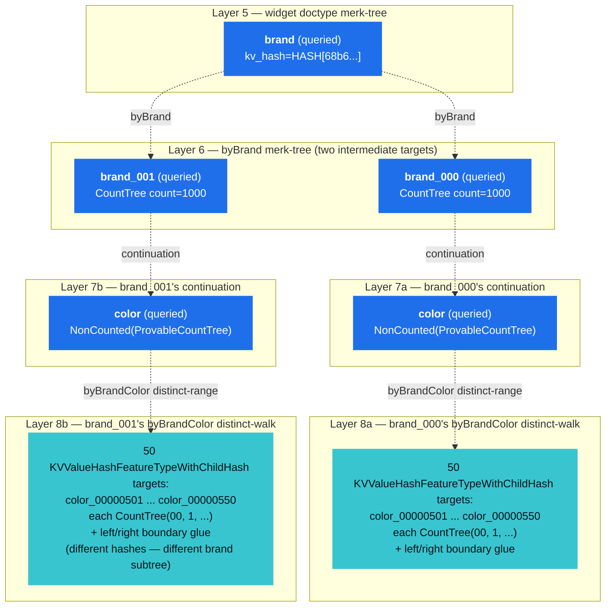
```mermaid
flowchart TB
  subgraph L5["Layer 5 — widget doctype merk-tree"]
    direction TB
    L5_q["<b>brand</b> (queried)<br/>kv_hash=HASH[68b6...]"]:::queried
  end

  subgraph L6["Layer 6 — byBrand merk-tree (two intermediate targets)"]
    direction TB
    L6_t0["<b>brand_000</b> (queried)<br/>CountTree count=1000"]:::queried
    L6_t1["<b>brand_001</b> (queried)<br/>CountTree count=1000"]:::queried
  end

  subgraph L7a["Layer 7a — brand_000's continuation"]
    direction TB
    L7a_q["<b>color</b> (queried)<br/>NonCounted(ProvableCountTree)"]:::queried
  end
  subgraph L7b["Layer 7b — brand_001's continuation"]
    direction TB
    L7b_q["<b>color</b> (queried)<br/>NonCounted(ProvableCountTree)"]:::queried
  end

  subgraph L8a["Layer 8a — brand_000's byBrandColor distinct-walk"]
    direction TB
    L8a_targets["50 KVValueHashFeatureTypeWithChildHash targets:<br/>color_00000501 ... color_00000550<br/>each CountTree(00, 1, ...)<br/>+ left/right boundary glue"]:::target
  end
  subgraph L8b["Layer 8b — brand_001's byBrandColor distinct-walk"]
    direction TB
    L8b_targets["50 KVValueHashFeatureTypeWithChildHash targets:<br/>color_00000501 ... color_00000550<br/>each CountTree(00, 1, ...)<br/>+ left/right boundary glue<br/>(different hashes — different brand subtree)"]:::target
  end

  L5_q -. "byBrand" .-> L6_t0
  L5_q -. "byBrand" .-> L6_t1
  L6_t0 -. "continuation" .-> L7a_q
  L6_t1 -. "continuation" .-> L7b_q
  L7a_q -. "byBrandColor distinct-range" .-> L8a_targets
  L7b_q -. "byBrandColor distinct-range" .-> L8b_targets

  classDef queried fill:#1f6feb,color:#fff,stroke:#1f6feb,stroke-width:2px;
  classDef target fill:#39c5cf,color:#0d1117,stroke:#39c5cf,stroke-width:3px;
```

The 50-targets-per-brand limit reflects the shared response-size cap. In the 2-brand case the cap kicks in at 50 colors per brand; if the In set had 1 brand it would be 100 colors; if it had 4 brands it would be 25 each. The dispatcher slices the cap evenly across the In fan-out so the *total* number of returned entries equals the limit, regardless of how many In branches share it. That's why the bench's `[matrix]` row for this case shows `Entries(len=100, sum=100)` rather than `len=200, sum=200`.

## G7 — Carrier `In` + Range, Grouped By `brand`

```text
select   = COUNT
where    = brand IN ["brand_000", "brand_001"] AND color > "color_00000500"
group_by = [brand]
prove    = true
```

**Path query** (carrier `AggregateCountOnRange` — outer Keys per In value, ACOR subquery over each brand's color subtree):

```text
path:                  ["@", contract_id, 0x01, "widget", "brand"]
outer query items:     [Key("brand_000"), Key("brand_001")]
subquery_path:         ["color"]
subquery items:        [AggregateCountOnRange([RangeAfter("color_00000500"..)])]
```

**Verified payload** (verifier returns one `(in_key, u64)` per resolved In branch via `GroveDb::verify_aggregate_count_query_per_key`):

```text
[("brand_000", 499), ("brand_001", 499)]
```

Each brand has all 1 000 colors in its byBrandColor terminator; the strict `>` cut at `color_00000500` leaves `color_00000501..color_00000999` = 499 in-range colors per brand. Total `sum = 998` documents.

**Proof size:** 4 332 B. **Mode:** `CountMode::GroupByIn` routed to `DocumentCountMode::RangeAggregateCarrierProof` (the new dispatcher arm wired up against [grovedb PR #663](https://github.com/dashpay/grovedb/pull/663)).

This is the natural answer to "give me a per-brand aggregate count over a colour range" — same per-In-aggregate semantics as the no-proof per-In fan-out, just verifiable in a single proof. Strictly smaller and asymptotically better than the alternative two-field shape [G5](#g5--compound-in--range-grouped-by-brand-color):

- **G5** (compound distinct walk, `group_by = [brand, color]`): `O(k · R' · log C')` bytes; emits one `KVValueHashFeatureTypeWithChildHash` per resolved `(brand, color)` pair → 11 554 B for `k=2, R'≈50`. Carries per-pair granularity the caller may not want.
- **G7** (carrier aggregate, `group_by = [brand]`): `O(k · (log B + log C'))` bytes; emits one `HashWithCount`/`KVDigestCount` ACOR boundary walk per brand → 4 332 B for `k=2, log C'≈10`. **~2.7× smaller** than G5 for the same input data, at the cost of losing per-color resolution (which the `group_by = [brand]` caller didn't ask for anyway).

The win vs Q8 (`brand == X AND color > floor`, the same shape with `k=1` and `group_by = []`) is asymptotic: Q8 is 2 656 B, G7 is 4 332 B for `k=2`. The slope `(G7 − Q8) / 1 = +1 676 B per additional In branch` matches what you'd expect: each brand adds its own L6 commit + its own L7 + L8 ACOR boundary walk (≈ Q8's L7 + L8 ≈ ~1 700 B), with the L1–L5 prefix amortising once across all branches.

**Proof display:**

<details>
<summary>Expand to see the structured proof (8 layers — same skeleton as G5, but each brand's L8 is an ACOR boundary walk instead of a 50-target distinct-walk) — or <a href="https://dashpay.github.io/grovedb-proof-visualizer-widget/#f=text&d=H4sIAC5zBmoC_-2bW4-cx3GG7_Ur9lICdNHVXX0oAQqc2EAM5IAACZwLQzC6-iAJJsSAlu0Egf57nh4uKS3J1e6OHIYONBIl7sw3s93Vb72Hr3v-_sXzP61f_d2_vHj-fP9Gbv77o5ubf-z_tV5cnrj8eHPzH-fvn93803rx-48vT9zchM9u_uWPf_jq41_385-__ddf_9ZnNNnRmqXtZZdZYpDQatUyOi-kLrXNGdqSxFNehsS6TPpKJSZPX3zyye1ny-1n_8NvftOf_XFdfsUvPr35txdrfaxrxlii1hytxr6tbq_SfWso1WNahWGUXqSHuFP2GKw1sT1XshmbffLpzWW02nOPbbi4Bj6w93PtDjOHWEudW1IszefWUluJdTqfwGU51z7mrj8YbWS0_cX65tvbn9NblREbFpXCLK2pW6AG2mKtM7jw9BijTU9ztBqGD0lh1Zp2mtVWz8zu-9-ln9388quvn82XPz97_uf14nfPzmr94bPbpbq5-cXN53_z-od3LObLxzuW9O7C_rD44T9_atlvVy_Iq_pnt7BkWY5e19oW0hg2PU7jnSsl7anuukIbfa4cR_G4euL3eS5eNFOTT34w7neX4nZGP3n0dyv6o3V9oLr3NY_aqmISGGGNyfKaNY4d0rKarNU1V1lqmilIrroBCBfkrWPVBR7bF3eq8eoh71zLILerUWuxAsALH_l6Xab1sPtsHQTGXMJuq1kOQ1bTXvfq3rtH8Wo-atxrKFhWjU11xbXfPZDXPfL2iz-2cq_WL8i7VuAR6_Co1bgf93_-en65vr2tFiwQi5RVXteqjBzyzmnH5bTrCimMEfvoWtJU12h9eYqhGwX11heMQt1C6jG6l_YGhp9WlZePlyO8vzqPrtETKnUfhg2ibKYupYdq0Gfbc-xC8w2PY50-Ho1u06Lme5TBH-WyYh6WTfvi3mr8GJ79Rf9mvrVEeaeQSkqvl6p5sTq72Syr19BbWq5STefo1Xuy1KDjbm37Pqs2JpA3T55n2Ds-PLY3ZeC-x9vyUEYqNdqy5NKTII2btluxAasCpMJizJqnhwYzliwC0CL6aYNmbOXhsd2Vjfsej8Xcy8el7g8B74nwezII72_dy_B-F0L49OaXz__4zbcv8ZHwJaPsGj-9kctr-1n_ksn-lr-ef794hRdj0Y-HsZ5QJBHL1qLEhjiXWqOiRDNWr7liXkLZaTQNwUpZeIhU_eE1eQDRDF2uG7o2xW_Jdl2jbYWnl-za-kVjV0Bl0Q9wlYXR2_YgSE3MFcPmVnJ87NAfC_j7YI-yB5sd2xNir2tDnzkhaNqnmWDG0MOdYJHaaj52wDMEElgPPNPsjy7xK_A_6uL8ej2-H-g6rsHhi9UExkp5RNtVYqg6e951WIglL4lrQvs79y0HOSEsZNO2PHag5UkFrW8VNIed8I0zyFy94TkNj2m16Ny7xYFah-BqkXnsPLg2ynG2OeG-4Zz92HG2pxTU3lHQARxPYaA7qqiOtdNUG22E0YuC-5NkEfOlUHjD8ESfsrv6WDLmqI9urvCkioq8bct6m0Na6YZ0DWW4OW7PMn1ogAfqznCyZwfFDHoYUwAdDat_plAePdL4lJpKekdRJ3hbWLlE2cgZU0sILLa54ExmSoAgFFvTSBstKYKMbyyY3rwn3PVolIo-raj5raLWLVMqXJMIXD5Vw-xjZ_ylhJhxk2Sg2QTFo_0zWieUv2dmJ2O10R490vKkotZ3FDWtqY1fTc_D9Vpmiqat4ldID603mXVkXyPlNlJVXDzqPS2Xldwp96OH2p5WVHurqKsTovbIKWhouBkfKYoGU1FK6RHyD4ZZEBRBu8XMnxipbqx9Y8QezfrhKUWN8o6ibnIH1otMU7FqYloD_qalPkS7w7TTyeNBiyyeWTMTQfKEvKrAB_3RPBWfplDxbYnytMfwXo1x8LdMGsMW9GMOs8QIN9ScCY9LtPraxY6DLE1ioeJujx_p4wzaNTbtB2btuKHHGbarbNuV5u2-NDFLyK5e2yoE3llrqrJ6IUgluCut3BZNZmXWNHQmRA7-yDgwKUlze7RI3O_DxvNnz198evPPz7-52LA1P6YYf-r-bL3Lll0Sx6t_MmIg9xq1V04NSA0cgpK_NxaohaYoo_m5e9bqQBh7NMinhxJ3EiNxp7RF54xOEo9Pm-KPZPC_JNRePi61ewrYfgLkfhLw3obfv3_97VeXBf7493_63Vc88fnLm3hdQeNCtdpeGBU8ya74fpKY7HXulwgOcTkJOExAOOBbQQrAsFhS_-LTm2drf_v5LVu7DaS4Vo1pa04TYkE-CkqY10D6UoegdTl-90RQX6Xx-2KP0aYUPuzF119-dftpDUO1sCCRXJIKaJImOXfyCWKfiShEkoIrDK3snVNCSBmbRn5jdowLnzbOhD-POT8JUm_2zq--_nL94duXxbsg4FBOQNTzLeJrSDKSWiDIzikqmPwQmW5rBHcGVDLEL17xL4wXLkW4itIZ0nAFnZESf68Y49Ok4L7gcg80rLPE0P0mmXQqb7jwFXvvOGsb21o31maMTXKPQ7C6lXiQUd2jJVvvQAPVyxDaIJDtrI6S9Ll5K_ksIe05z6EtY_CpyA7H6Huuc9ZjO6R1vQuN7IZiVsyg1-CY6-O8D9yC1Yn8OwrWQsa1EHBIgrNHEixJotcSEenX0JBYryi7PgSN1NItNHAkIVG-kLxD_doJwH6mi6lKu0D1E5_axoiY3B7DwJHPcxe9SsXkREZ6HXzz1dAoD0ODMJiznJCrumD5VGCEXCLeVpNMyq4jd-lIFoGtnLtAM8dgIGkQLOIdaCBu27KdW1y5pDpCOJLRQ161x5ycLOqj74IFHL4AUBDZrRoeT1VLuwsNyxu7FUkzWmMDi6UorFA7bEF2HIdGGHguWgZEV-yQyBhTYp9Ld3gNjZKuqHp9CBmq9RVpAAMhwQySAcY7n9uJDLuGzagk9VXjjs2SHR6NJknHbllT1w3L9EOW16G3XY0MexgZAUy37kFGM2IZ4baBBBuLFvQZyfBhEzFcIPyzH8IUl4ZN3si9bA13kDHIpnsiPumiOTAoaYqMD_ljRCYhC980K-uGIGC9SYVIBmIydu_F_C4yMN0bSJLBbHob4PVs1Yw4Y10jYL1i2AcWq1ZoYi9TN68QirUVoLTXyEjXULWEB6FR7fVtXZQ45UgwxPaRaPZaDYHThGNczVtRfkZ0TtCgsPjDgHckgILo5AcaV6H3cqvgOmicqP8QNhj9buXMazNI2FpqxAVqwiI4JpcJ7iksNuHNajSTtmo7oeTYwmx3sBHR_wRB1EJPCzRR4AUjYHW8C4QSdwvTcZ5ipV4gkfDcrlDrxi-Mu9jwnjwNIjFj27ougTdbcx7AIzGAFgU1j_1YdCxObBvWNh5ZV_ieNeQqq5EexIa98hpMF6WD4WDJjn5Ox0QF0kI6PIvK0Cobl5HPLl_BXkSN6OfKmSvSOvO-Dr96PTbyI3gjyzgTC5ByxR_0yc-5oAZOLqh27kvu3ImuZIqOQ9BKcxhRujdsgr3hQ6249bbEEc9JFdIAUpqwY_ns5kO3BJQMdeBH8bFxKW84dxVxwLW-wRuJStZIhMGxmDgmF8bC78icoc4QYY_W4TGCDd3IauCSu294PFfa9HveuKbs5WFovKKNrvW49bOnv-ZmvUeFy7LvQsQ_23PTh08HG47tD0NwzUsG9r8WnPahy2v05HKL6UpktIdml0_UvCVFHPYR6akR-Qvx2CeugCBkZKhlbeffUkNsZ4-dULEwprKEKLPmRS-vmZ09PER5tUch50AEBs-xplKityrFx5BcQJ-2ePbhFRzbWYiee0bN4sb3yCgSLr15TQoIVy9AlEfkgHOnQm0T43fcp8wY2lF6FxgRQQ2leFdCASQVdEjL3ltrJQ4aBjzeac3wEx93W_Mv8Gm3tH1N2Z90d_vNe3JXvlMfRuOr6LED7hYDbb7IxaWhA0S6QV-UgmSWtIoFuLSvVeIemPk8e9sEkm7b42HBq9QsXh894iOyB64gMvpOj5GWBDYQR4IhMFz8jNiG45XNGslQshM1cXNjdZ3HVujd7JFJJoYvtDGdOS-IJCIFsjqhPflQxEYSfIMD2zqgUFJpFLFjvVp6w2H6DN0abm0na2kRYwruw1PASaZ27gHjV3DG0kRn7avXc2fbNjF6rbH3azheQ8OxXg2qdvU77dp3pnD1O-Xqd17dsOlBg5bllQjImDlvohnGBZEKYXkJ5sTYtNHi3uJJNCtgT-KQoRUtnuucMJwaVjiQOjdYr0BAut6ipUdYNCew9nYO_HWV2LxvrAYzbQOhrQg1pE8eC0fZ8oZDLgcQc_Ewtmi-23hJ-Syi2sa0koAHQYxYS8v2IaXg3RIpf5zYWIvujphgw0mSrdCafeS7jbdl2LmBUkPCoiG2q_O-c3QJjhMyZMTgZCzwDCdG6ZGwnRdz4UXe_LrxtLVrCl-esNHx_eO7j_43rn3slY-77rsnbcTIX89GzM5KdMQbL5sRfp7eccM-Ux02lifFxqRxjiXtNlchaTWM_bkvoNNSkr-CjZi2WyO6yjjb5KF7j1mlZ-aKLNGhfdRzAgG5IhiSokZH_APJOWySsNjPGzHvcSOmQX5Ym6qj4L-CZBvn-FVte880Ous1VtClmfwjIVseJdZzhoRLHCW5w65NPeQ2Wf_qtRzK2zgleLXxwax-SvjEUpAq2HTK2c4ZpQ3VZKG0nd7YiLG2zyF4bbZ2rhjGPjapOpdZiDzaUw_SiQC9kY3zDKT3tfBn53Q8VvL9bcTkskOB3JMqXWq1o1NKtw4cVus6AtowZt2XAU4CejyHxxJig4LFNT_MjZjZRknQ0YyD8CUYhXM_qmNcc6SxeWHOjcCxuhtvmYpGzOS5K7r2hMzuQKMTC7qec-NN6uXwBCCaDaVeIwQ88jj7EvvE2C7ArZ0jNYh8QlLR7DegEWvYK6xzO6oIOcIusXakcVKE1FAGDrcAq2O0SYgE4QLepqTL7yvvbyOm40KGjtTHUOukcFi8we20GxRYSlDGmTMF3tb7NAz62Y7Cx3uSHMuHuREzY4v9mJ9ehIDnGCQ7ndgCAQgCCT56rZUVaTQp3qwSb8bwrVPOjtjdbA6M6mlv-IXFE8JgDNgo80ZDxZMUC4yRYsOQnePDurlCOzpJvhK7C42FtyIwUelusqSZxBOlstdzs7KPc28X90iUqic0rT7PrcpcyGyMrZX3thGzzj7APN9JKVqr-jlMeE6bpsNtLUHEeTLPwniVnBZyyeccVMnNbIzL_tMHuBGTzjHY6qNQ9pE1-VzMBHnRHLDBe466Mdd52PLFldnjxAt5tNnbbHeRcbbno-xiI9IrtLhDp7WUer56kmpXxAP8FR05T_LsatAH5iIWS3mEfRcZZbgm2KWvqOiO4vpnKuQJVdtK0i7bPJAZgC3tyMq0tqn2qBbyCvb-NmIcDc0WRystZIpQz7e7oC1jUGF2PadQC4G_ZCPkj0hkId5l71itQl0-0I0Y1tCoMZMggzI9iRuldPzBIH3ts7FOLxSfuA3trUYZvSerC-T4bHd39mcLBDeuPcf4Ey3B0qJWewQNsc5zbmnnAcc6usOvQqNrPbrbE6ba4l1sVI27FoFqalp75FAh5nDOIwI_n-RExfoc5hhzd_6Pb4WVAuY8HSZ6fxsxkT7CTYljLWIqGd3UfDyc5FXzeWEdiYWfZ8BxCADJEnAlbeK-Zv1AN2JAcFnhnKSYa2A0Vqarz7YJPlLJSYSDwLQMilitI7C5o_Q4jeOi-kx3sLHzoR8_OyVC97bLnh0FmxWkIcJdCqJaiyc_R2BXa2dLdsIt6oLDfcNsIFAOeCqmdtCaaxiiFlGicYSuXM4FJ3F8bUm9EmZijcDJvGM7ury3jZiYZp6HedVPoup4qnXYFZwWl-FydqJg3QYPMnNPpe4aRBK57JiND3sjpjWZElNCE_HMAwEZdWYCakjRylg5RCJASxEXwoq6erHYKkEaEGHI38NGTMLsK4XEuZ5vrLXZqa8NZEoEJ4JhQUnGORt0vqQV6OGzWYgXPsfL12U38QPciOk9nHMI5ytSVNsKsGpa5Xi-sw0Tt-yUYFSjH8vZDDuJkXaulg9Z7Z83Yv6PNmIw6H5c8tncRg_P-Z7zBWiaJM_lOaMJa_RcNWzi-prZwgSnAbXENacPdCMmpniOdO3gKZAwzsGfWVcR2p-ZAkoLQ5nS-dZfr3LOeAhsp6ukGcK4uy8oco4E-rnV0baFDlPkRAQJzkdEgoeTRBGi8yVdLOXEhodznx0p8ZV3eNNh5rLGZftnHmvru2DbFqIS6oQNesbT3QYOzGWI6EVmLi74GOn-80bM_4ONGJV2vn6FhV8s88RO6uUL3ousaYvEb4uMssmxFTj1oXgJYl8ZPehMOXywGzGp0QqN3OQjGp57Yyk3ikaudh2HayRoKaW38yVEzA8h1i1pPN89SBfn-YPGOzcdK81Et_QNLbWxSs-ppLHOsbLjoqbluW34OayQaFKsl5RzeAs3_8bBXKs7bm_Ba6Klz5HLlBUBXsf-Lpezi3oOoMyAK7B9trwsL7O1YMmaf96I-SlXPXzNQ1f8-Os_9ur9r933yruff9ezbz_35jN3f_7hT9___dXfXv7__Pe7j7776H8AekjPWClGAAA">open interactively in the visualizer ↗</a></summary>

```text
GroveDBProofV1 {
  LayerProof {
    proof: Merk(... root-level descent, identical to every other chapter query ...)
    lower_layers: {
      @ => { ... contract_id descent ... }
      // L2..L4 byte-identical to G3 / G5 (the @/contract_id/0x01/widget chain)
    }
  }
  // L5 widget doctype: brand queried (same as G3 / G5 — opaque siblings 9862 / 6c36)
  // L6 byBrand merk-tree: two KVValueHash targets (brand_000 + brand_001), 25 ops
  //                       — same shape as G5's L6
  // L7a brand_000's value tree: single key `color` with NonCounted(ProvableCountTree)
  //   L8a byBrandColor color subtree under brand_000:
  //     proof: Merk(
  //       ... 36-37 ACOR boundary ops over color > color_00000500 ...
  //       18: Push(KVDigestCount(color_00000500, ..., 1))          // BOUNDARY (excluded)
  //       19..35: HashWithCount / KVDigestCount boundary walk
  //                 — same shape as Q8's L8, summing to count=499 for brand_000)
  //   end L8a
  // end L7a
  // L7b brand_001's value tree: same single-key shape, different hashes
  //   L8b byBrandColor color subtree under brand_001:
  //     proof: Merk(
  //       ... 36-37 ACOR boundary ops over color > color_00000500 ...
  //                 — same shape, different hashes, summing to count=499 for brand_001)
  //   end L8b
  // end L7b
}
```

The 186-line full verbatim is available via the bench's `[gproof] G7` output. The schematic compresses the L1–L4 doctype prefix (byte-identical to every other 8-layer chapter query) and the two parallel L7+L8 descents (structurally identical to Q8's, with different hashes for each brand). Each brand's L8 contributes ~1 700 B of ACOR boundary commitments — exactly the predicted `Q8 - L1..L5` overhead per branch.

**Cryptographic guarantee** (via [grovedb PR #663](https://github.com/dashpay/grovedb/pull/663)): every per-brand count is independently committed to the merk root via `node_hash_with_count`. A malicious prover can't lie about brand_000's count without breaking brand_001's verification (and vice versa) because each carrier ACOR subquery has its own hash chain back to the merk root.

</details>

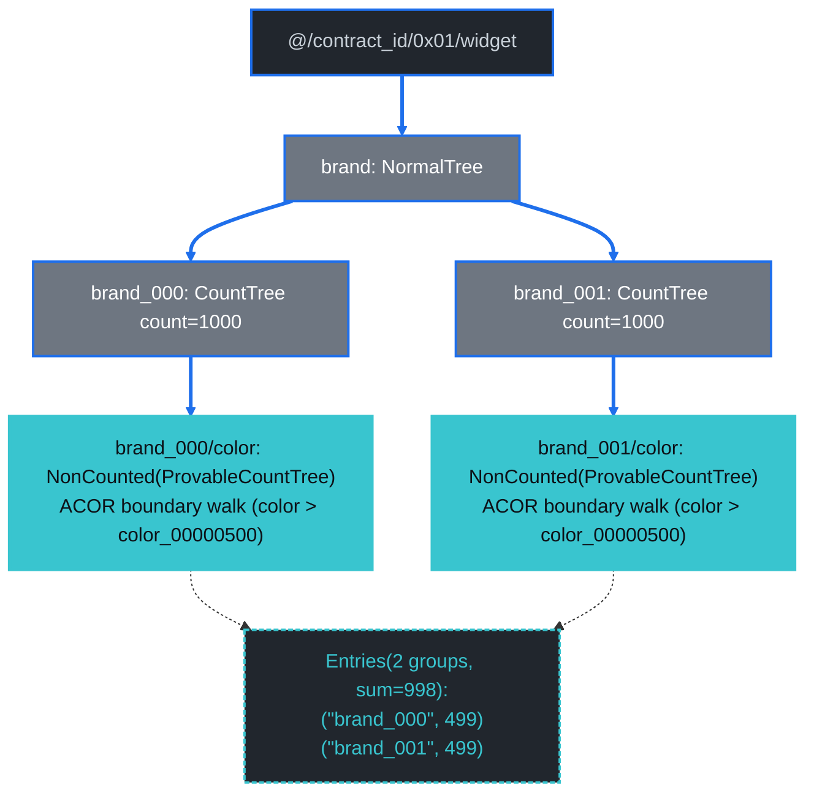
```mermaid
flowchart TB
  WD["@/contract_id/0x01/widget"]:::tree
  WD ==> BR["brand: NormalTree"]:::path
  BR ==> B000["brand_000: CountTree count=1000"]:::path
  BR ==> B001["brand_001: CountTree count=1000"]:::path
  B000 ==> B000_C["brand_000/color: NonCounted(ProvableCountTree)<br/>ACOR boundary walk (color > color_00000500)"]:::target
  B001 ==> B001_C["brand_001/color: NonCounted(ProvableCountTree)<br/>ACOR boundary walk (color > color_00000500)"]:::target

  SDK["Entries(2 groups, sum=998):<br/>(&quot;brand_000&quot;, 499)<br/>(&quot;brand_001&quot;, 499)"]:::sdk
  B000_C -.-> SDK
  B001_C -.-> SDK

  classDef tree fill:#21262d,color:#c9d1d9,stroke:#1f6feb,stroke-width:2px;
  classDef path fill:#6e7681,color:#fff,stroke:#1f6feb,stroke-width:2px;
  classDef target fill:#39c5cf,color:#0d1117,stroke:#39c5cf,stroke-width:3px;
  classDef sdk fill:#21262d,color:#39c5cf,stroke:#39c5cf,stroke-width:2px,stroke-dasharray: 4 2;

  linkStyle 0 stroke:#1f6feb,stroke-width:3px;
  linkStyle 1 stroke:#1f6feb,stroke-width:3px;
  linkStyle 2 stroke:#1f6feb,stroke-width:3px;
  linkStyle 3 stroke:#1f6feb,stroke-width:3px;
  linkStyle 4 stroke:#1f6feb,stroke-width:3px;
```

### Diagram: per-layer merk-tree structure (Layer 5+)

L5–L7 are exactly [G5's](#diagram-per-layer-merk-tree-structure-layer-5-4) L5–L7 (widget → byBrand → brand_X's continuation). The difference is at L8: G5 enumerates 50 distinct `(brand_X, color_Y)` pairs as `KVValueHashFeatureTypeWithChildHash` targets per brand; G7 walks the same color subtree as an ACOR boundary cut (like [Q8](./count-index-examples.md#query-8--compound-equal-plus-range-bybrandcolor)'s L8), emitting `HashWithCount` / `KVDigestCount` ops that commit a single aggregate u64 per brand.

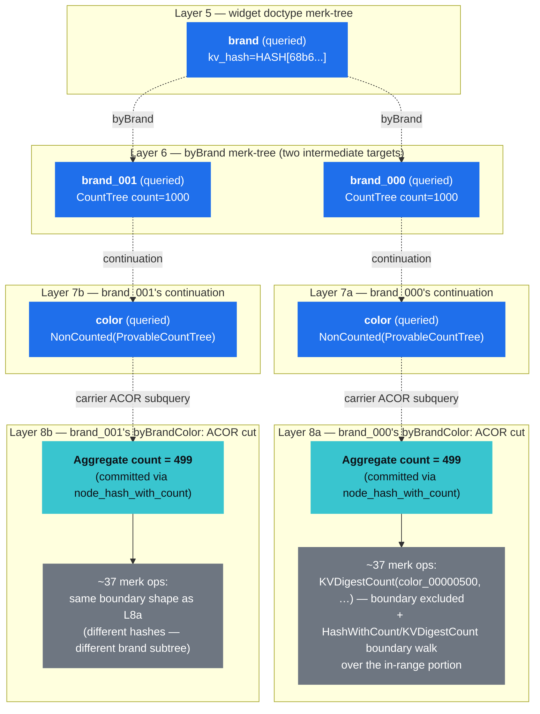
```mermaid
flowchart TB
  subgraph L5["Layer 5 — widget doctype merk-tree"]
    direction TB
    L5_q["<b>brand</b> (queried)<br/>kv_hash=HASH[68b6...]"]:::queried
  end

  subgraph L6["Layer 6 — byBrand merk-tree (two intermediate targets)"]
    direction TB
    L6_t0["<b>brand_000</b> (queried)<br/>CountTree count=1000"]:::queried
    L6_t1["<b>brand_001</b> (queried)<br/>CountTree count=1000"]:::queried
  end

  subgraph L7a["Layer 7a — brand_000's continuation"]
    direction TB
    L7a_q["<b>color</b> (queried)<br/>NonCounted(ProvableCountTree)"]:::queried
  end
  subgraph L7b["Layer 7b — brand_001's continuation"]
    direction TB
    L7b_q["<b>color</b> (queried)<br/>NonCounted(ProvableCountTree)"]:::queried
  end

  subgraph L8a["Layer 8a — brand_000's byBrandColor: ACOR cut"]
    direction TB
    L8a_target["<b>Aggregate count = 499</b><br/>(committed via node_hash_with_count)"]:::target
    L8a_ops["~37 merk ops:<br/>KVDigestCount(color_00000500, …) — boundary excluded<br/>+ HashWithCount/KVDigestCount boundary walk<br/>over the in-range portion"]:::sibling
    L8a_target --> L8a_ops
  end
  subgraph L8b["Layer 8b — brand_001's byBrandColor: ACOR cut"]
    direction TB
    L8b_target["<b>Aggregate count = 499</b><br/>(committed via node_hash_with_count)"]:::target
    L8b_ops["~37 merk ops:<br/>same boundary shape as L8a<br/>(different hashes — different brand subtree)"]:::sibling
    L8b_target --> L8b_ops
  end

  L5_q -. "byBrand" .-> L6_t0
  L5_q -. "byBrand" .-> L6_t1
  L6_t0 -. "continuation" .-> L7a_q
  L6_t1 -. "continuation" .-> L7b_q
  L7a_q -. "carrier ACOR subquery" .-> L8a_target
  L7b_q -. "carrier ACOR subquery" .-> L8b_target

  classDef queried fill:#1f6feb,color:#fff,stroke:#1f6feb,stroke-width:2px;
  classDef sibling fill:#6e7681,color:#fff,stroke:#6e7681;
  classDef target fill:#39c5cf,color:#0d1117,stroke:#39c5cf,stroke-width:3px;
```

The "carrier" name comes from grovedb's PR #663 terminology: a *carrier* query is the outer multi-key query that carries an ACOR subquery into each branch. The ACOR primitive itself is unchanged — it still walks one range over one subtree per invocation — but it can now appear as a subquery item under outer `Keys`, which is what enables the per-brand aggregate proof shape G7 needs.

## G8 — Carrier outer Range + Range, Grouped By `brand`

```text
select   = COUNT
where    = brand > "brand_050" AND color > "color_00000500"
group_by = [brand]
limit    = (optional; ≤ 10)
prove    = true
```

The platform's `MAX_CARRIER_AGGREGATE_OUTER_RANGE_LIMIT = 10` is both the default (when the caller passes no `limit`) and a hard ceiling. Callers may pass a smaller `limit` (1 through 9) to truncate the outer walk further; passing 0 or any value > 10 is rejected with `InvalidLimit`. See [the rationale below](#why-the-cap-exists-and-where-the-ceiling-lives).

**Path query** (the same carrier-ACOR shape as G7, but with a *range* outer dimension and `SizedQuery::limit` bounded by the platform max):

```text
path:                  ["@", contract_id, 0x01, "widget", "brand"]
outer query item:      RangeAfter("brand_050"..)
subquery_path:         ["color"]
subquery items:        [AggregateCountOnRange([RangeAfter("color_00000500"..)])]
SizedQuery::limit:     10  (platform default; caller may request smaller)
```

**Verified payload** (verifier returns one `(in_key, u64)` per in-range outer key, capped at `limit`, via `GroveDb::verify_aggregate_count_query_per_key`):

```text
[("brand_051", 499), ("brand_052", 499), …, ("brand_060", 499)]
```

The bench's 100-brand fixture has 49 brands `> "brand_050"`. The platform's default `SizedQuery::limit = 10` caps the carrier at the first 10 (`brand_051` … `brand_060`); each carries the per-brand ACOR count of 499 in-range colors (`color_00000501` … `color_00000999`). Total `sum = 10 × 499 = 4 990` documents.

**Proof size:** 18 022 B. **Mode:** `CountMode::GroupByRange` routed to `DocumentCountMode::RangeAggregateCarrierProof` (the dispatcher distinguishes G7's In-outer shape from G8's Range-outer shape by the carrier clause's operator).

G8 is G7's natural extension from "k specific outer keys" to "L outer keys from an in-range walk." Same carrier proof primitive, same `node_hash_with_count` commitments per branch, same one-`u64`-per-branch return shape. The structural differences are exactly two:

- **Outer dimension**: G7 emits `k` `Key(serialized_in_value)` items in the carrier query; G8 emits a single `RangeAfter(serialized_floor..)` (or any `Range*` variant) and lets grovedb walk it.
- **Limit**: G8 sets `SizedQuery::limit = Some(L)` where `L` is the smaller of the caller's request and the platform max. Per [grovedb PR #664](https://github.com/dashpay/grovedb/pull/664), this is the load-bearing relaxation — the predecessor PR #663 allowed Range outer items at the validator level but kept the leaf-ACOR rule rejecting `SizedQuery::limit`, which made unbounded range-outer carriers impractical at any reasonable dataset size (49 brands × ~1 700 B each ≈ 83 KB; with the platform default of 10 we land at 18 KB).

### Why the cap exists and where the ceiling lives

The cap bounds the prove-path proof size; the *ceiling* is a hardcoded compile-time constant for prover/verifier-agreement reasons.

1. **Proof-size bounding.** Proof bytes scale linearly with the limit (~1 700 B per outer match, exactly as for [G7](#g7--carrier-in--range-grouped-by-brand)). 10 keeps the worst-case proof under 20 KB (Tier-1 for the [GroveDB Proof Visualizer's shareable-link guidance](https://github.com/dashpay/grovedb-proof-visualizer-widget/blob/master/prompts/link-from-platform-book.md#size-guidance) — Tier-1 ≤ 20 KB works in every browser and link-preview surface; Tier-2 of 20–50 KB works in browsers but may be truncated in Slack/Discord previews; Tier-3 above 50 KB risks Safari's URL ceiling) — enough for typical "top-N brands by an outer range" queries while avoiding pathological proof sizes. Callers that want a window above 10 entries call repeatedly with disjoint outer-range bounds; callers that want fewer pass a smaller `limit` (1 through 9). Limit 0 is rejected to keep the response shape non-trivial.
2. **Prover/verifier byte-for-byte agreement.** `SizedQuery::limit` is part of the serialized `PathQuery` and feeds the merk-root reconstruction; both prover and verifier must agree on its value. The caller's request carries `limit` over the wire, so its specific value (1..=10) is fine to vary. What can't vary is the platform's *default* when the caller passes nothing — that's why the ceiling is a hardcoded compile-time constant (`MAX_CARRIER_AGGREGATE_OUTER_RANGE_LIMIT`) rather than an operator-tunable runtime value. Same rationale as `RangeDistinctProof`'s use of `crate::config::DEFAULT_QUERY_LIMIT` rather than `drive_config.default_query_limit`.

Caller semantics summary:

| Caller `request.limit` | Server uses | Reason |
|---|---|---|
| `None` | 10 (the platform default) | Default = ceiling |
| `Some(1..=10)` | the caller's value | Truncates the walk further |
| `Some(0)` | rejected | Non-trivial response required |
| `Some(11+)` | rejected | Above the ceiling |

Complexity: **O(L · (log B + log C'))** where `L = min(caller_limit, MAX_CARRIER_AGGREGATE_OUTER_RANGE_LIMIT)` — `L` outer-key descents in the byBrand layer + `L` leaf-ACOR boundary walks in each brand's color subtree. Independent of how many keys the outer range *could* have walked without the cap.

**Proof display:**

<details>
<summary>Expand to see the structured proof (8 layers — same skeleton as G7, but L8 contains 10 per-brand ACOR boundary walks instead of 2) — or <a href="https://dashpay.github.io/grovedb-proof-visualizer-widget/#f=text&d=H4sIAFjZBmoC_-29W49lyZGl996_oh7ZAB_87m4NtDDSDKABdMEAEloPA6JhfmsSQzSFanaPBKH_u751sqrIOHXLDBaDUUQmWVUZJ06c2Nu3udlabmbL_ucvf_dv5z_9T__ly9_97v5D_OL_-5svvvhf_f89Xz5eeHz5xRf_t_7-d1_8b-fL__aLxwtffBH-7ov_8q__8utf_GfXv_7H_-M__9e5k8WbbFi-s922WwoxjN5LW843ssc-9g7jxMxLs62Y-rHoJ7eUZ_7V3_7tV58dv_rs_-Uf_sF_-6_n8Sv-wy-_-D-_POcX5eyUWiq9JuvJr_U7e_R5S2h9pnwal9G8RQ_p5jpTsDGi3X2y7TTsb3_5xeNqi1dPY804S-AD3fXeG3YNqbe-b8ypjblvaX201PfkE3hbrd3Xvv2PrjZxtf7l-efff_V1_tbKRFuWCgtzSs9ugTUoI_W-w4y8vNYae-a9Rg9rrpjD6T3fvLsdr9zdH35X-bsv_uOvf_Pb_eHr3_7uv58v__G3elr_8ndfPaovvvgPX_z9__DNF9_xMD_8-Y5H-vLB_vHih__nT132r55eiF-vf50WTjxW0-znXAt5LdszbeMnT87Fc7_9hLF8n5pWm-l45vfN2mYrlTX52z-67u9eiq_u6E---pcr-oPr-iOr-32bp9jp0WLgCnvKVs_uad2Qj_Vso5992ilWKgtSe7kYCG-ot6zTD_Y4fvViNb7-E7_zWYb41dPovVnDwBsf-c1z2ebh-h6OBabawh1nWA0rnlG83-PTfaY4u83V0z2rYMulpFHKSed-94V8s0e-_c0fenJfP78Qv-sJfMRz-Kin8f12_99_s__p_P6r1cILpBbbad-sVVs11FvzTWeyXU_IYa3ky0vLu8ySzM_MKbixoHP4waOwbiF7SnO28WTDn7YqH_58uMLvX52PXqNPWKnvs2HDUQ4rMzYP3XCf4-51G5tvzbSO9vEa7LbSis272uKfwtuazXBs26--dzV-yJ7nl_7P-1uPqN4ccsv5m0c1ZrO-3Wy34z34yGeW2K3s5X16tjxwx27jzquntjYmbzPPusO96cev7TkMfN-fb4eHtnLryY7lGT1HQuNl2500MKuGSYXDNZe6Zxh4xlZjxNAS8dMWm3G0H7-2l2Hj-_58rM19-PNY9x8zvE80v082wu8zxTvrmQIVMePQFs7_tHhDKPfOklm1E0NJPPLhEXOYq4UzDkHGU4_VPmJJnw3yD787n12G15Prmr2WtnOyMjo2TsQZPuLuq86zch0r94Ln54lvq-3kOUOzj_3dH2tw349Kzqo9BwfrlGO-bIQ5j1taRMmRYlrjEGlqwJ91n7Xc0IFq7YTl6daPvc7yHWs0tOSErnhKq3PstQnKWLgZ-KrUuttklXq13vaMiaCcT7Wkq7n8jH_s766ftEbtW2vkAVxYLt662hyxWaoZ7-B8DYxYK69qq2A92xMIZozBQs3WbffSYxsfe539O9YI7zjjDgkcNO4dNmutPKZIvA3YLzY0gKtJ4dpk723IlEEDsfad90ev0fikNbJvrvQ__eafzr_8_oP__cdQw9cAIu8J9MeNrbU3QLpdXC0wohANcaqBSACi8R7HrWzGYuzHG7ivI5_80eYfw1dO7ePe_b2hg0sHD_3H3_3rP__-QwzJcJfVbk-_5HcEbuv-1v8Jh_hf-av-_6uvYwqu45TiIHkA0ihrztTwzNzivSDLVPKYFgcR31dJxBj2VTsRpLSIT_2jN1D8tJ0e8w_canrdrdZd1oX81NimNfxCij4WXwNO2Z58-44Q7hxpgdVBPuzms_BmrIFHvx99q-UHrj2_7tqhE7MTCozYH_AeueJ4d9sL3B9b2ivCRvHGQZBkE2FnjCnWTaQ4teT40df-ac4mth-41fJKi3QrCw8UFlgi4JbGaLu2vAJMNpSDcWZ5iLAPboTFaGD3s9athEh83Uffav-kvTc-6d32A-tSX7cuA3SVNxGtJ3Yf1O6A8tZIrW0i2kmg0x7xsRUvDnyNt1iy26Gaa9TSz0eH5PBJJpB-yCm1190q9PaUu2HO1Sc3Pfn75v7438rW4Y3zDD3vswYGMECS8tb45JNLKPmjbzX9wLX31117iPkWuGgLCbqpZyKOGWv0BYs6-NUNBZ68obBBS5Lxjg7FGK3s3fpHX3v-tMf0Q05pvO5WgQjwn2wpgE4xsr4s4olaX3suAVOQofnA-oiKw26YawGXAGgxYaHpo2-1fsreSz_kk-yVd-pzGbDSB0a5Dn4IVB57f7jbhUMKp8xVgN43pB54nnmWDiYcgxBa5kffaf-0hzq-_1ZbeOXeyzWF2MA85ZS0wwC-tlAAY0RN7-OyFEBebk0Y2kDdviJuaPKIG-b-0bdq30U7bjopg0G9l3h2KisPdo4t-Mb2DeQwy8CybhG4lcsu3lOGeqbbjG30sb88f5qPy_FboLrChuqyEuMGJt8aQYRrrEA4TstqDb3Vim_2u_cy8GJoZ-LNMm8tbJmPvtL0Kbaf8ye9u3zSuz9pF-b2Se_-Tu7QeytRx4ZdzNdKZw3LyNhb8dkncaG5h9JwsxjrrneculMIPeaWPx6v5U8jD9m-nTXI0KjpHTst_A2G0-9trvOXCrKEGnZoTxNg6fNgqjqkgeqkVmaa9tFXWsJHnYG85iTkj85DRCY-7kzkVScjrzwf-d4Du6tzEC75hhDPlDXs6X5A-nl1QjCRB3uwWG-ON_uuAZQEoOilEKc_msB8_-Hd-t1vf_flL7_433_3zw9_e_YvWIx_8_nb813-93Go9_X_ao45fq9H_tolYzJn5g5Pb90jBs-NBfFTaPrBoWRInDyR2X0kfArIwwAXtfCfttOn3eIPHHP_lKb24c9j7T7F2P4Ek_uTDO_b5vd__eb3v3484F_8t3_7x1_zwt9_oC-Am0IAcNhy97amhXLZ7A2aArXBaU0AocV0dqwhQWcEF8fm_TvNYr_65Re_Pff3X32Y6aj0xLh6uz6KjXoJeWOOUsfUWfyOrZ7k9xRP2bLNvneACxDD7UQ-7Mvf_NOvv_q0WIcVb5sIjpVci3YxKZyTHcdvpTpDTiOMjS3BitPKR3FrQL6qgfX4tKUb_vtU6yeZ1PPe-XDq8mHxHhbwj0F_kqjRBxCd4DbYcy07ApHxl434XxOgkgsdd-5ANE2z6uh78R14e_DcraSWSw1caY3xFdf4aacU33c2-T2msQy-ku6GlIkjPFJzI989VunZKkShsMP7I9FQMAn-c9YFaLTqQOr6wjRA3cUW5gM7mnt5uzeGWM_0VULdB_PKp8E8Jv6vjLNyuWk1ZTdSH_G-NA2lDTaoKp7Wy-wDnh3CzvkEyGS9VufOPB6Pd6zZLAdXJtM3JMzvXPMb04CevmLZy4-ZBuv0lWkQXWMAcgMRCfJ5s5Al8VItNeUWoYdcVSkJXngnW2azc6DBvJhygZtxpa8z3_pq02g_bhqz3dRmKTw3Hvrcvg6bdI42t41zbVeo_8a2-dvdzZXPgYW0gw31uMIL0yh1DejIxOXYABOBTMYgfmQVBkRgyinBw65tBet4FMKFx41NbLY7NvPSNGoqM5qDbvc44TqkNewQWFOdBK7Kp-mEsM4awOE762jiAsT4vangob4xjZZfser9xyyjlP6VZQD6WkwbL3EmjlWH3JbhCmMkyNrUtw-bzkZYHqeoWx0V3MBiDVvjcKGvs97xasuwH7eMrqNZIsgui2gwJn5tgntx37XFEn3BuRa8Ws4EbwlObj0cdkVrKkt46TSAEZGNrCqNdpKBWYkbt19lRjAzvD-Y9OJS8sS_wOvxpx5dR4g8-ttfWoaXBsRoMOMW8i6315FzTDXjiLFltiT-R7B42rjJOmzRw4KohZOVcf_GMvJrXHUMP2oa3b4-O6v9AraMOyuE43FKrGn4mdMx4T3B7bA0wjaW4tWGJ6jlhVJob61HPHmV9T5O7F9nGjH9uG1kCBJ-oXScXGwEdlx-jMPaDD3UUwncWMLlSa6UZy2-4RsJjNDaIm6uF7ax2LgteBu-JxsIMrMjMXgR-1ON8Cn4V8X74FVjFs2N4IzUzu6E3tvmk23cPceKQAjACZBCORM_rGXFYxQjtM-yc-j1Am6JSLBjRfVeNkZe2v5DQHkV1Mg_ahv2NdbIcx38KNgZM18rDuJeXAPEUXfBPcwea7tDNSXdqoXooU8cXB6eayjaYK-z3_J626gfATZm9lo6SI7YyR6e5cbuEB4CeDf4A9Gh4fWVYJ6JJ4NTn-x3Hs_IpacXtpEvRoZlPHDmIWYcu61CcYEBg4hblPS3fdeNKobrcxKvRpyH4GyzPtlGAZyEtjccHpOLYwDmFLp5O_uzrJtXGJNHAaapqrTDcu5pxPGuCqP6B7_xmmVvP24aX7uNRISd4_RiPQalI91AE_ES5s7GIk4kwm6wuOU6Bn60wu5slN5Zc2V4f_nFa-JJ7K-3jPFjd1fD10nOBBUZqiiYEIKgqpMb-mo4kLVL0Qn8XYUdX9il-WpzNABKzexUC6fIQl5l9_bjlxi_Tnv1qRAyzENdd8zAohMQFXRU9IiFr2xXOWMvvUCmMazhYeLXoVIP7PEaG_nEFMh3pkN-YGsGwNiErINGvBywOTYGhGcPXVD3YU9ABHY5EUheAS0riOQ3q32nNJ7cdvgT_7zcmj_Bp33ltl-z7J901vmcDHnlT5Yft8avqQebo3kYLanANVlZG1gDz3Zg2e2BhwnzMIhawR9gqueM5Gc45GtA9vTcXhXN0uupR_oI7nFCT9kJ7sCDZRZS26tdXC5m2tcNx6DW-Pd2iRyZCJE6gRqakkawYeUlwhzLRsS1WwGrrgXfdOGSqmOrGSE2bQIAgaEDf-4Efrc4E7CwDYLKfmmOQ-s4Y-NCKu8r5iAXs6ZyEeH42EEg2dJkrdtxMRHC252PtP2Nf0CYr3HDqb_aqMarf9Je-5M5vPon46t_8tUbNv8oQIPnfH0YBBA4RZC93wkeDaq-DCd2zLSyHzNPvJ51rUSzTrgaGPSJwPtb20gPXscHvsIC8ushWv4IiAaK2h3WhY9QRfScaaYOkqix8x1f4A3IH3AMPL4W7r9Dyo4q72PKVl5CtNUznPa0Ao2_BEtPkYhRagWxwMp0QLyTUumQgkisbA5NgyGcvSCCYzzFAR-VsN8r2Bj6yQUmwBDgrN2kYtMApG8z3wHZ3EAjVWz1XXfmpdtW-WbjQSpes_DtExIdf_jz73_z53jvx77z497375-UiEk_n0RMnFUJcfhbG2VHA4iV7kSPGGHQl8g4Dxy8r8D3PVlTOwncI6Q6YanpZ5CIKb6CAy0hJ6oMm1OHb7uundrc3KWbE5cycTKn2QuxsWnHnsCaXDv5cyLmDRMxqpcLexpPvEExYxm4MB8QBjxa1lPEDmEQDViBI3TAtfdkqceyeHzjiQBn4IcIE3Qj7x1iVkWS8jFnGfQa94e7jNgzL2MQI_GJWMJOkRD1RICv76ZCbh0iJFEYXPHdMaowcRWwP5ulmU0_SueIAKjWUlU0aSvb93aJmJRVtgBVYYcqkcB9PfBhLjp6hDOuvpsK02pRod62molWJ-kOWcj2PhMxV0fAZep4ZHNnsTYfO-7M7ZRyghfc2AB03gj2qAD4UO7ePIJot-fsL0xj4z2IzDePa3cF4uHOJUbIQnfi7di1Qlghoz1vHuDBYVTsMbeSNp_6lKObuKI277Id7N5r_aR8t0odsmpTc50Bwph9ZxuzHbnSOtfuuB0oZDtvl4jJ_PIOSDgw8c7lgErmdTsNtuA5sCblNjaDSJHK46_xsuESO260DnufiRj1S3Yi2aPDcaYcg9eLbbeyHwcMNjzGMrcfbu1u7Ucr7rMmQlt84uaRHX6hJeDXdPPOKsbVsdwubJIODFMr315l4FPi7srb4rAmBDO1BWZ7aRp5mKvZ4uKdzpBBhYDzUhKsbkicTtq2Fx-lp3IV3ryv0UDCsYAF45slYlrMtynL0PCK9YYSeqyu3FE42xtgPZ8BOgCoa7mBtDWyxbhmA5fG-T4TMQV8W2TrV62-ducC4bDVV9zx9FZv5QFuw02DDopIbcyYSairrrnnS5qMx9kQmntH7PjRpVT8OaXP0EEmcQd8U1gz2kgbVwQZINyAru7R6fvyp3hS5tVJXUpZvVQn7RYTqP6E0oclQscm-MVTQsWqF4Q-5G74lJkxn9HfLhFT4QYeiWmJBx7GgqycCE6so0NWCs6iqX8oz5rXWL4eJj2a18BdxRvfaSJGLcB18jR7agALjNtiUwo0qDEklTD7UcVg3PeMssbpREyL3JuDPB91Gn-wjZFyd245qy21sJWdUJGS8xt2qckJLK2DFnjkqeNyHxk6eC4xzMAT9pSIqQcEWnaNi4DChU7DbU2iB2QRx61IPXdTjXXEw-w7Y4IowjtNpSTz7RIxo9Rua8LZLXOXfAtniOHPWsNi5-E3bHnqwI58zeX24BnqbtLJfHiviZgaVRK-5kkV3Nn2mWYG8tutnDPOgK7rAIzwYhHW3gk_LStOCGUOf5nADWyUCBqJHoNaydnFrT2azlKM2F4qC0K_04Gi5Aao3OoYD_iUVczik23EsWoupx1Cl4vhw_PrTVpR-WhgCBZTMasx8qPQrInKDdjTKGqCfbNEjKmaaoyL3R7v9ewLqsznVpVfmyXlXTwsg4Hl1cCiDVfiBN-dvQ_v7zsRI6DX_XjJEkw4KmEAQxIWoI-gQCw_OTGFPQ-pxKeAVVXclwFcAVOyN0jE4LxAfg0o04GuoFDgqeHUeouEebal4WbiyhUwLV_jJ7Vjm58BBIdHyu49JmJOBUitCebA3SxjcVcvZTh8HoxdhkpkvGWiz-0qi1c4BZmHGU6_rX5OxPyFEjEzON4sRSiPTEyPR-lmlS6qU5Nw2G7rx2YRRo96wYNBXiFxYO93mojBqV1ssGGIBOV0ZqqNOJz6xRLZ7aC6mkM60DxwxFm9zgTtSqUae7Lcl9wDNCKFlrsiIQY4iafvXdWohz3L116AqUkdHhUgaCERnS64NENIwOhPRWAElBn5XTOdPmZOBgTmItkrSwHkdq4cfgRvXRnMsj2qJrM1IYmb9udEzF9BIiaNR4vs6HO0csUmUoIjs60ysblJWYh_VF8FkMszjrHBFIrPe57zODZ5p4mYBhtXAD7AsLAjoW3pGG8BtBrQo3VV0ufac1V9I3ugxQAGB2nosKu_TMREHdUpURWH0HqcDhWPBeJ2Nns3Kr1f2lgrAXSJqR6ndVWZWWdjPRXmDikupQI0O3NOqy0LvbOe0IHRF2EInLPAZ2FfXgk4vJNm8QxTZF_a50TMT5OIyT-fRAwbDh6oKs6R4g5dGZcZy7gYWmzm_USVvZ5yDazfB3t2YTtRslFZR4g_g46YBCchoIfeTP0BBjKDIIP_3VsNSeHN2ryPbGT05dVuC6yFsxQh2udEzBsmYni8rYLTxmg5yizxYdlbT9fXgBSHcwPPBsvcMd26HxWBBcNcbRsO-eXBGVgnpRL2Lnl3bBncYbB_dYXkRyEy9FCJCVgsoOQGHYZCmXhh9lCe0twHJJ9rMcKUasryzoYR1X6h1nhUEOONC4SkEJe296362jjUhr7ZSv3tEjH7EFxVz55V0E8cqfGA6MI-wQb3n2vd3mbOO-lsqTzqdthcya6Pscb7TMSAJ_MjD_NBGsZaq_cmyRpmpeDslJV0HnLy0flnBBQbUZS93wD98aVp5LVNsh0SYizBZqwWVz1Yyzz97F2buoWJ54c4mRPfttjNfMk87TwXMKsgeLXB9Vwidpjq1zyZpz_zLguHqrZ3Sc-pkpprWmpbjvB3AHn4o9KjP3sixpPrGB0UEXyPPrQ4oI6uzhw1PvaW8znsDCUaos7Yr7VgWHdM5eb-PhMxSZ1pqwFudIxQRxu9gXnu8lyxFXbnI4LEAxVJbZx4-QobGk2qRfclGTIs6dSNVQw1XxNiylWAKH1B7HfEdMY0HwfgFHFIs6hkZpddA1hrPnXEFLXAS_xzJijQqKeHbjtAhCRcgmcCEwZ8XWW79os3A01iSo8mKtDg2yViihcDw3Lj5dzC-s16KxyYdcU1Ehu7ejViCaB6L0XB89a6phQa-17xfSZiRsMT3mBllNB4ljeKNssnhHtXXQ8IcVvB_h2YPr2GPWJco4G463qZvW034TxB2MeJRSbuy-1jCPyQ1xL3xtE3aSC48ddT-4iudv91orfn7O2Ovs_mV7J8bXX2YxWpl9JHVEsfzmcVb6D5sNxTqgSurbotuH1Jb5mI4V7wEbhEneUR_FQuzdXnkpXHH0mXnR22sgbmzH46Z2S_uw6HE9XyThMxsKGIT-DBD0-5Z2CA6izYkwBbNiWQw86dvefSj8S9dIjaVsBlwuPiS6-xfd6Uo-Xw0FcNxcLtOhUEctaEofUp6BAKIYbdEveagVgTEsFrbHuqZVVjejipAUIi_zL-NUA9905LWmYCS5Ha5lrQa0xViTK16kDoTtm7v10ixkA5xXcGSQ-8wr24RO4vs2479mgbhwdr2FHlgFtVTynUGoLCCYS3vNNETFBfZLSx6gZVVHU28FwBVp0wMotC4lSC5k7wlEOty8g8DtZiwJ16fgk2Si7qogusUr_JpPfHB_Pxt6s0yKqsUG17RUX9F0iWVf1GgIoqaX5i-UDKOGKegA7MZx9IywHyrHwT0XtZxCcNqek4rD_0gJEAU4PdWCIR8s0SMUW6UiqvvsBi1_lhsjPMKlYdElasw3TQEHgo1MvOWoOfvwDXNona7z0Ro_JWSzwComY_HYN2wwcA9Vn8cnmUt6lWa-y54SgbRg2tbEn6j9XWGyRifO2qBiyoPC7I7C7JXrHx-h63yHE0XPTcS8UrV4pSumAlElvP8873mYgphBo5xC0lj1uBr5AWvK7g_wLuJQKThOwcWL_Uunzxi6qqcZwuzulzIuYvk4jJASYxzt0OS7o4rJAK7u2MsnUmXObKWTv_hqgiA5e4QS13T4fDWYjvNBEj4YWgKojN3n8QUcLhgI4a3KJ1SzsANIFwGejY3E9rDW-BI_S9iOcvyznYgbiJgyGvPjPogyhZj52w2by98_EPybC0pO9x1X8KJqy8DGUN9pSIWSHVlFaP3QlMBoCLKUijtyo-78pj6OXOBfhdlrrFMAv8g5ABiOVuPidi_goSMSCUBdO0wT7StIc96-5Y4IbutaIyMkwyquB-YKqPI4pxfNqokN_S3m9HDNZLuCoC2hmQkUDgblF9YU1HK-ywrn6fOgqIE4wxRc_Uhy7NuLWexA4KDPyATFYv7LC1b26NEDjYojku1V-ygcYaFYjr82zC6ciHCPuhGfkpA2rXVpUsdts7r0gkYiuuY9BGdtedqk8rOxKSelm6DzDkhyOAHoKdz4mYnyYRU34-iRgYqA_J8_fhBDszD1Jz2mc6FEFyga3fXlWEx4b1ftoC3nu3sfuNafwMEjFjubYBkT2smPKUtFBoMc3abi1EHHbCDetm8ZbdPcV9Muj6LPd4rX9OxLxhIiaHNqSjsLeK9bOG1LS8billwzO3ys5zOg9FbE8zRC_DgNe4xH0dI3nhXfG5bn0CgPJQRXKG5iZBc4ccysaNl6tLlIlnLzRlEqrOe7ENzNITrPGOJdlSPapE0oLGSMCmgUlQg1OU_DjlMTrCVUNclreyJKKGqflbSpNFlaXCve7SjI1yHLI4riiuWvV3122W6d7CCkDfGk4kNs_Tk_KPIb_PREztQzXB6UHjNf2krVMJqDyHfZyAHMfpWbHTc-p1S9N4ZELuBmaEfV6ethO0F_7kSuisaRxD74TV23SKqvJe6QUDS6PFZGP0PlWXhFfcRNB1n4pUFWOtJldDXS6xqaZ6HvBBmk0LLCAuiaJYPaUw7CGTvdXHNSZYZ7-hNFnDurdOG3eZQVoZDfepmUdJAgAzrSw57l07f7V9I7vMrdjGPGJ_iKi9w0RMiR6gOwkCUfEeK6hGmMuvx--IU6V1tzY79yQeeRwXW_HVeeslzMWX3Jwfh5usvFuQkouk7dJYpbKLYPnEnIW5LeVlZmrxdHaVCpO7jvHV9v_ULCVRp9TLVLbiWMG8cueqEmtKTBtp-KgSJ4YjFWWbcXYHA4m19WG9v1kiRpqQ-LfZY9uYx_CGh2X1WgKhLpd8dlxZdsLa5l2Cao4cKJAHNm3vNBFjbmw_4kBbcR4eVpDm7cXhQXLH2X5OS30enjHxJW-QzlqJ3dtGvaO87Hroj_7hlKsGB7GNJwi9FqyiASHyHIpKIImy8b4syyEgGZGn4kT66eWpbEqtAwHwVceuEbhuQRLRUXNghjxRntPg-HPh1yBP-W413mc2bNR5a3m7REzLJ3QlAqbmkin1KGGtNiQmZK1hBnskCcAOyEeLLeTkCt3hVj8p9HeaiIlXwgCWiNXRMZKJ25BeIZ7aUpJOQJCOiLlam8rRKWW93LUtYsyyJ61LBYipUVtQK488MQl2YX6WAZaw3N1rvLUb4JJHLaBRAn4k5bWXn6f0bVo3XSJaLqxtLWvyPDAyYtS0GjABT10CIvg1-GUywEadUtftfafzR7J1f_ZEzF4qNWd_-QqLtSkGLdjjzloxeS6yN5XXmlfJBU2usg61RAxF3PyoS3yPiRgjXESMHmBksOUWZlkBaj7H9hCVlFuS_U53m6oey7kb2-CZ26PZx54kDY3FiCWDOokgOHpXf81Sf7ek-Q__eHYBMX2lZB4P-Jx661Ht0VMn3czqtKi5S05P4heqvTY8GzFJRedlO0ELaxiFCBcKVCbg3YB-vJL623XExD3UMOk5jrx0VOgECrwElCsnvNqoPeFjpQBql21y1SakSSrekt3yzhMxsGQVcmQQ4qrXi9o01oFLcsc60SlYQ1qiykpOVvz4vPGwZV1apW_REbMxsJDUHX6kP6aDnlYIRxHTcmJezjqIa1mymAR24sswFX_EBhIcI73PRIyqGiQythvOO4P4I1C29ix1soWbAWfvEDXdYAG01NqofVel_4lPzf1zIuYvk4hJartPPUu9K1rFtQ6l4sfIsAtIdVPOUuhpBS-eVku4LeKknZSg6fedJmLmVNUalLGPQPQDHdZwVfSpIXvg_ZRPTdwroZwoMYBEGQjVgZ18O8WXPdcTds62jAT16HP3g_GG1epZOsPlyyGZ2rpKwmVmgfJ-leP1qHOJnJ8iRXIcK4Q-wfQtlhvBtBGUI52Qpf5EL9ZHd1OanifVcbywao0CLDX2z4mYv4JEDKE_rAkHhZ6ofRpCGkux5UPVG5Kc3kERq-Ito0GhxUI9FfbgZaPmd5uIgSRBxLKwJBcNHoaQtSu5kZAbQHlg6zGsmi5ULJ8dQRZAVWCbRgLdl9Jk4TTC-e2a1hLSaPAwkJVErNcwdq6OkBVnlr5eUIMmvbcJlksl5tyejwqjppmL8DdgL8gPvKZe0xu2yOYC6aUgreEJIjMNnJQQuZQ1paj2ORHzEyVi6s8nERPAjjmlGq342FggzBlkmaAe6qaP3MxjrpBKBbVtJ0al_1fCRR6p_AwSMWqzZtdIay0_ZoPMuRbBzKTqa35Lc7CcA6dXO-zQkfBS0K51xxhhfO6IectEzLZSpqY7Q1bajHNI1Mum69gvVpcvA6SclYPSH7vcgHMz-dDS9n0-HIFm4OQ8S5lr3jH7tVD0P_xj8FALnhDopMEjDQAPxKkAQJDS2UqbP3nXdvMeEra7GqpZiQK414bPzjUszWKceNMV6-4KDrVruHcGMs0E7wnl7RIxJ0psnKgbRPsdwOd2unnRTMLQ-tRErl2GVHYIXeyMLd6vBoncwnudEXOstrmLZVi8-pvCVe3hXSlZSZpy1haMS_MekuQJZiFYqnMJN0bMbE-n7d0dqKEC-I112BlSIopLz7KrO3WqAD0rj7XNoNc1te2n-57J5nNHjI7wNCqC9YtpYqi3G9h8GqsJy8gXcFtamWWt0CEeR8q8Pa55bwdQt7dLxOzs6kq2UCc4YCedIgVcK4ihH7e5AvQBCrDb9Rs0EVyT_HY5qvuMj0bld5iIcfz33GnKqHXywPMMKiefDyH-lfvYPB0Y0RjFNAptA0gh87GdS0R4Wb-Mm-ldxcMlBfghAG-NzmNMoKfZhjQv7gHl1aSJ4aqFrjEZAfPWUvr2b0176M22znxPuadyGbFxqSFvHfDFfR8SV2oSj-5GyKnn9q12nD2sv11HjBT9gOZ1SqcpSdFA89BZCTYb5tyvxj7oYA86GOUtkqYnu1SF1921vs9ETFCpn5R8NLz9-OjnaPpHtFwdTqzRibMuTaAcTSEE983dc58n8Yzzy-zt4afOVk1x2YSPOO-U8O8uj9aYJnk6wgDbhKcc7jBNBYL0aID2kfr5k2ideo-UFmqRUGRLVYiShxsesClN_QiW70NeSLZlmYCysuYNrKR5LW-XiDHTrJLTu3RqZ4dWnHT7ZQ0OjsTwctfjGWdqIvqRoGEccbW-F1snnfcqTWYdpNdWLFMn7sTriXXcFJeNLQEPjKbofLXBmqYF6R3orZtIMHm4L49QcspZ2mV389y21A2TEZ7GWcqYFM2DvfUxsUhHM6E90EcgNNuM3cYTk9v5XMtxVw2qumsm5YYaBC4P6QmtbJoVU8RBq_B7aUnnLeNEDW_P5e0SMViwEf3CBpqJ4Wu0DYYPot7sDugD_vUWb_DjqEgTC_Cqq60Vy56PBNR7TMR4nXE8CmtKTq02YsWYuHAdqpd1J49Zdq-cvkhJv9Imb9Z40GJJTxGFp72wKJzHxvlPTWTDZ8RtGi_Sj1RmbpL8DOFJRkk0GXVo8JKKMp8KgtLZXX2ZagmQyMVIQ2ng62rjJ4C05af1rpzpdk0WSHsT26925-p9vlkiRgjMwVdNCrA4h7RzHHiyEEGnIG0ue2RVeK-005K-gkpzW1nH8LSP1tJ3nIgZGPpciUd2c-_ZsH_C5nroXuc613hIulbrS1NLTFJscffk10fK-0OB_585EYOXOSznXX2y_3DXe6XhgOK4l0THA4wIzBKj6lQS9rjU0yYtZ5UOj_s-EzEuNYR4mqqgV75q7y9qcAbA4yODtB51ggaTFPzDC4G-bm1H3Whx2ucZMX-hREzuAOc6cnBXs28YQ0jSFgwrH8NtxnMbcDPEc5SxgCY9DjwN_Akue68zYppDIFq9Wyg-S-FWwkUz4crramoriEFzajVOjD8aCniXGp41lTuNp6m2fMzdhmFH3qraBimyx3Z1NAxVA6ScpfoWTcOQDmaOoEG1x5ytGpAnEUvngkJeM6tKTVqYOptYEoLEaY2tQzQcQcVbqR0AdpqTq6ajjRVqWp8TMX8FiRhYwzDJWoC-0krnoXY31aRcrk9oLFEYe_JlC8qrotYUElZYQwnqdX-3iRjzUULZHcYRfUoXN2kesrd5NNBgwFDvxZE4uGxKbdN4U4ReaUSf75diB3ibDskvKuBNgNkzgoUHDKtAErhxMjWydfWUPXSVgOb7jsXOAnc9j__keyDi7VlZ2jIWeykC1IC8dYQFW8QHTjdwf9Bks9V5NdcAGJzc0ImfEzE_TSKm_YwSMWqVhwLEDCvgLxNnDWTsEsGeqW_pYow9T23w6zkllJGIPPdiVyr5-TnMiFGxD6iN-5H-WnjM1HWNfQiPeU_r3KC71fzvPt1PnGyxfHWGEjQO4nMi5u0SMToCf8xLf6g-7rh2CR5jDwPAA6pRG1aJMOKeZusH8gCvMTwwzwoY93JGzJR22T6qKN4TtB5ylh5j0OQHA_VJuD-o4HtolHIEN4XZcsWe2BQtPHlX1Y1JSRJ8dLLa-i3l0a76YxxfunC7mlJcdVClOTTNHFK66tXp6tpv2RHTgwS7UpwqbJkRMsheCeC2BFG8EhKXnoyaVfcQr-mG6RdFKwjkY4Duu5Qm03y0c6c0rsPp24GxMXhvXadgse1HBZLKiNUN0WbSidlSIUM-a7xslophGWA4dEnwstVDBoekBJsOmvS5jViMAZZ5uxJs9lBf2eX0YEqiPJ2baRCjapek8oCDqs2ln2exLPPc4Rhp9SCNIlPZu0v6HTzMzcTH_OI3TMQALMDasajFI-DwcHS6jjPKTSevNPGpghCxqKMI-n7DyRiQeppFNd5nIuZknpf1x2SYR641QOUulrFnxpk8JMCCLbb-gXWkNcE9kj6Mqrljrz5VpZVxS3r01bS-D_vkpLpDAjJBWUJmp-gMpmvaaAfz6jjalbxXu40_JWL4MN7m6QbNOIctJaiUOqNLzgbh0aSYrMM8rrS2opolPgWuBhLk6uqbJWI8e9RQBK4lY6pH7deNlYIGV4VQi0uiS0lDITRNLQEvgfI397FECd_pjBjYxR247Bnr7AX3p46FnKepWzz2dYepC5_t3QsUJUGj9xhKqhg-5mXZ1AymWhUNnW1dSZitaYxXHe03NdiO5irpRdvqFSF6eZn-GDAS6ocZjH-c2Adn2ZwPVbReU-p9A8U1ngkqMK6GGl2xaNbbI1i_4ihqjzrID7M_KkTfKBFzHLO9TY5A8htsj4RXwyLwjkqKS8GrzZ4xBpfCQWvKYN8dMsHFH5LH7zERM03H1wPwm4pL5CDumjph_KEe8FBO2VGKpVtDBnJxyT1t6TVczR9PTx0xlZAyF3s7Hm3qMS1qNl04G16rvBS_qg51OhWgS5mTOHCIykq0PB-2S9fslKKyYLBK7V3jr6xO4oayN-lDAJcg9r3TYXt3DudCo3cHPu23S8Q0qANRrMAU2iO3HJNUyubWlBP8pqoSVgF3YTdEYpdWvkt27bQ0j493mohRLKlVfVILbJeWJHRmUbe2FWO1D8jOsBt1TgE7ozK76kpqkpyx9eQ39tpwLPY6-wcSVSNQwKHfrAfoFRbjPSqbLXnVoslkwIhuexk2xXI9gY0GleflrkYjtVWy2dSnFzWRGSTjj3ajhkO5NXMfksTyUOL0ga284YwYTB4QpSO_CRIDYJ_jpYE2Bmi7axSBmnl8qk1BNUJjgrxSUqVrzunU952IiWpfzHOUPh7CapWosre13iMbHr8nheNTrdUEzsAlStTS8jqzswCPBvk_dyKmnfmYspnDXlxbcfitmrulY2jqjc8JlKQpFI8BatPmUEemzRI0R2C_z0TMJkQnXPGYAc8ypTpcy5Tu3Q6EI1X0q--qPsJr6q0A10a8vDlgXnV8TsT8ZRIxxMbHtEmXKiMAK8dFFFBljEZ0gtF2HUPTitkuq0q4q8Q-ADoYZv7QjP8upcmIuxjbkIakV4uuVi1g2wTFV-deNjEhQkQi6F8TW3uS-qnaJwHR6UmoobJdN6atwZYtDVWknhn50CuYLRxIkA1hVGlw3CJZZJWPDJyNmjhfmmOXrlk6xySlLDGlqlmmoBTAQoK3PAokNDzRqq4rS9wMCjIh0FfdMZ8TMX8FiZh1y86SckiztdCICclPjDUcySznHpsPG9nLBufAi4OrqPTkVvdDKOndJmJyCFI3sr7dTmVX9eZY8RwViK1uFKnVPGq5gzA7vl8SFq7hFEOp-ZcZ0OE4ntB2Y6-MUx0iOLNwCrs5TrxSUXY0P0J7YnVS1LCYelRzccZT07KfoBF4gLCyDLawG8xN-hxc2mhDAhMxRK5ZJ5r8dB5nH49g-5zHh9Olz4mYnyAR039GM2ImD1-dvVdFm6rTXdlPSRn6GGMAz-Rd-mkDq4-A7LNUQA96q3BYIs_PIBFTk90NoRlLOp4L5jTGQ1xjSp67E3Z0pDZUxKdczVWH5oE63tmhyOafEzFvmIgJs1uyvqzU0DTNKq_a881YqLSRNNwkaVSHFC5Un7inlemqQcSt3af6kjJHKnmlq-mAUMIJMkrZa_e-yh4bd80z9jIVjlSuOXZVQb3PVbK3J23urrO59jh5ulHq7knEy3zWo6PVmFZvMHQNwrO6sdMz9lYrFvyGa69vl4gZxiaFTZ3Tag27xXgkaWNaOZi5dvXeua41D6E5SAgiTSm8dZWDh_Y-EzFeYooOtCx3YwiSsggEwyrdTtxWy3gneH4D59tJeWnuY3MdgNsFDb9MxGiQgyV327bK4QdVc-6OQ4Ha4fFs9x4K-HTnlomaGwKbLnYDze6g2GdpshWHmu65OvU_TT6oet1EYWxqzRHuIdq2HIOEvzT4AXyQUhVxxOe8pTRZlLZ8Zh_ZPPfYbBBbnP-ICSBeMOzEnjsafaRTISBIkK6ptc07HwfT7zARo_m3Q-PCJY6z91iSNlBr3crJgp-6otQP9EWc2rtFuknGTcd4-3pZJOlw-jET5G_qeCxt9op1KJAmKJXZZo1bzTEwKoXKJtELuKKW7YJsn47b-6MhS0OKQ8QqfGNMKjrdSge1mpWBCb1GGFJJU5LPSSKCGMUcEV70ZokYfGNryafrvD-BM6NK-GFkpjP4h5ih5A7BCs6uqipwLqfjAvs-eOzyPhMxdZ_ui6c81aeypS54_EzWum3cNtFGuXWp_NR72JAnuKnXg683i_HSaVQwQXIc6G0hmuZ3rJ1x7jpkhhcr_6qRUixHgCVL3kwzRZS1kgBEfUrsY39VfRH8kXikaeDK1DF9XOCTqdnVIkvpdswYDxYUBWEUDc8C469vl4hJmmGTfF1zbnrZsFXhGOkEHN0EQ6lQompmkHlNeMdiOhhgt4C7aq_vNBED11zea65J5xtVhXK7YsPHieviRzsBOfa6molUIn6hV7a95gI5ruFlSV2CvXL7V5XvTf4gn0iwbb5b6Phb8dwpuUr87y5Vgwq9jCSRVHXZPGX2JRpJ0LDUHRwSpH23loTNmjpP8N9XDSg6Y0wmKby0NBCOnwo9tVTr2yVi-g0xmbR_IO-p8-D3JVBcdsVJUaPylF3w1GNtSmTgJI17yWEDw-rK7zQRcwc8wGeR8kvmDszAmGqMhC2wG-LCDWDjcW9COuGzAQwzBN1G1W2_TMTgLXnWBJOi-LPjxhkFnXu13FXMU-sYFaYBgsTFaDIXgUIHkJK_7e2pk04uQj1UjW1YwJ44aLWalEdz_1bBEhA0XM2DJqTH3vFrExzoWV004e2kyW49EvGto4Y6snfJF6qClBAyl0XgF1d7pbHTMQvdcb5qYYbrgVPN37k02eq3hFZG8KTu4cndnOZJ0ib4f6LNUX7pDINOQqJ53LlIA1hD4soju_bnTsTYwYLOTT0kfARB6szH9LfW4dLSITdNkBjqhTepRs2ZI2YVjEdU0iOkv8cZMVKBZrfdbvaYIjLhhCsoWo9zR23XNcSJ2Gy8UAW2ru_DM9nlAhM_J2L-MomYhgfUpC2iKqzrNiIuCKLV3kHYSUCJvXPB5m0ovdlrmBo6px2UwEb7nSZidoV6YndZh8IlFr_7rq7aiokrDndWCVmqwZpwvayU-0F4NjyGUdhLpTx8-KhguwJZkOhrDESCMADZhFLwQICKBDhZzwDHZoK14JSAA_VlBIyn8-CZ89wbrjNcyqlQnW7K5kjzQw3vuAeQ6qwDSC9pEegQF2kj9zhn-yxN9teQiBEeu6HZOj40I75VTSHJLeELwSPAfEJXMntMutP82NbhM4fv7ipa-34TMWsFHdOUs6X9azPp3BqM7nlPmPU5UkU5x28cXuuctzZVce-Wh0LCS4h21P5eY_ZWMlujsE4lVSJ3jRrb8YD_CyxzgGoZYBO2EGKbkZ0XnuuoyhApvL2q88xVKMPPsaZtaeTsXOfoFH3hFXaGCoTq03RIbURsi2d9TsT8NImY8fNJxEhGQK3JvXc1jQJdUr2ecs6eRoFs5InrvkEi2VKI0lhnV1ebyutv-TlIk6lY1dWXX2JVoVU-xMtG9F9-hEkluXMe5au1Navgt3vTSG1VHdb7546Yt0zEgL1Suln6SC3ptNg9es86fZ-qdxrLNO7O64fBwB0spxHKroq0W54OzjQqeYEv0tU3YxjLRylDY7DPlFwRVtHs1JqXZqbvKKbYNQ3PZwK1PNW21z6CRoiwYzJmyI4J-5x5JNvivLQk_DhwzXj9XbiPCagkDuyW4qr2domYvrsavh7TP2LUIZ7Y_l0EB9ZpaziOun5KDlAYJaoAeCt57pN39se4h_eYiGGdIV0L9gh5H64jqR1ir0BdAPCji0XHPPuUHXLaKXKXa6vEvwwcyNOZatS03bys89guODnXLW3Gi18oM59-d58XiyCY4yDP3phZTevcvQjGT6YR7wLQqkBJMyhPkvgh4DYO-Df4OBtkYvIJV6NAeDag3lpilDRiGw-w80aJmFhhrDAFDcB4NGqMI_X7tBeW3bcSV5e3LOD_LMBxx4DGwDZ4OWsm2PucEWMnJrhd72vATJoagj3ooD3Wc4LKseM13yoq1whQIFqeDliC-0XrL7n5rmenpjGwwDdRnAGZL-qQWiroLaNvnvSWQKKUpdz7wXhWXDqvgyE9CVCNQoRpwNoEvcSHdJ1K4V7aHvxuWVssLH5fmGDuGigTzynKoXooN7xZIgZnacDx0wJotmimdqkdI1UaaeIl4cPR5WvzrOqQupJ9Y5PoXKTURxXPO0zEnMe46joBD-z4Y8fXQ9XEQoPw5qx52Yunc29JEtsG03QeNOafH0NZXspPAb2tnLWB5lGNKStuAsbime06JawPvmZvjVX7BVD3zesLz3EijCf5s3BEG6NpdEK9Gq_Bz0qzTpMFgCpjlb5PLiMRpXqeOqDl6chfx3FVZPmGiRg8wcleN2arEcl36wAY1q7ejDXxyCfgZlmFNVSVIGnppRTz5A78hHeaiGkZF7DwCpCvLtVLXLhc4a1EbrZBUwQ4Dw6nNsvNM5y1rmlrQ17Py_RtzWqImI_xwzzQtE2iU6vUmGa_NVpaXYOKrWZsZkAiq7LFUL7FHgxPAUW7budgUSfXElU4lolUKy9fpa0t9HFEqpckFaKrkDHcpjnASY78DaXJ0mghVqDOUvmK-kW4Cp-gng3wqRhBDG0TQ4NpTHBy695qqiAiOeN3mogpDfKNF77qitmVoAGSgH-DovIeUq9Qw7Gpn2AUjX5j616QKn8FAdanQRRJWpQtzprt6HlKl115CQn2HwIR1qaZ7jpxKwDemJr0acRLlDx5StKx1zRH5iEhzbezzpqVBHOwkPCnzvlTrkVi00DACGvShCEgjrqr_kiA_M-diAFGcXdjgRu8BJygknNnhXWIlVJFcWm4m18Qs8KdBtMFMw0gk7rUO58RI0XAWNPWCEqwpDJKW4ese6vDMtnoizthk0oCft3-GFSyw3iM-m05vUEiZsYylLIYVcjUJOWlcjHcWj_S3q7z8H6MWJpRKTx6tx0Lvn3zGOo7TcT41WY6YS0NY9JEWzC_ZKlXAKpaGTHhdDU4q-GmgtopCrd9zEqRivXnRMxfJhEzIFrHhzQZQgWkJ0Ji283azUKeksC1RizpGqtGCE7zStN56GwUx-HvVZps3z5wtQS0qVZqrxOjVIEvgWJpbqRUxAgeicC4Y4YH1qCxFtLxPOHlFEJVa4CkpuBiw8L7uPrn0VkcNQVuDc2vHFEjUk9TUah4Rwdvjj76U6nPNGe3x6LRSC0c4ZjgxAX2B-x_bOIDj6EuifLypmmpQ_h8PkqWxqyfEzF_BYkYUAaOT0UQJfnIw9fE-QMEoKNXzZB-gRA1aGJDXOFeSJ1pdIOr_nC93xkxULS6hzRA4SeamyRdCsB8JiQMDWCMp4YjpTUJgzdNPQNf3D7Zkyk9qcdyr0m2H7a3IAluB84XVwRncwQJEne2i1Q7Z6h5xqzj407wYcViO8_SZCGB3FWNvXIGmIF9C9ssdQJRkxZcDo_xH1LCf3TQhXNjh4qofenkz4mYnyYRYz-fRIxDlXo-6lmeGnxRZoMDprg1J0Hn2HEJlQH5D7BuQ1ebRt1rGHWf5e6fQSImJ00CqNYLzsYzce2mU4fGckNdIdjSue9QqXJsaCCt9Eokr7CWxjGuz4mYN0zEQHm9Xh6Y6kvDaDyUGfhvCY-heNggeOac5qKiIcI659CM-RmKxnm87DsvaSRoccsrOQ41KgNDXHLYkGpXJVJt5_TVRugZo84aXZkO8FCND-Vp9J13m-qFGbfZyr3f25xPCCXPEramT4TZB2gs4nSrEdRSLmqu6dzGqW84I2amG1eTWNsGzGmK9NTcsAkZb900KrzaJeR06ddbZBU8a7u3tIcq_d9nIgZ3dB5zeFph-Zcm6Kp3veIFhtmUpNKavi4PusRY2oKW7bh9AWR3ay9P2ydAEzwiapx5er40jrwlNr1mc7RmRfrr_ToMoIyr6eyPBtIlKd39nIiZ9ayqma3w8VXVp77nfYw5Wuo033z_rgZiTiCbqPkbMIu2ifRjeC5vOSNGumM-RNB7jwD16E1laQOMjomosDOPERvrfKHwwA1N-oM6wQuG7f5OEzGLa4XUSWYVpoMFqNjuJm4naVaPyr94zMq8AUlXjKGvuUsloFxutz0JUIXWNVEJG3mc2hf2C56HGBkfI4giJqaq6Hzbrdk20NUDmGrcCpDqz-lbAOGopVrDwuIdE_vSTM44PJa8rMWmTgML3XElDVipqcYzbpb8nvRmiZhi9-Sb00l7Wu25h_gQ8_ARHxXLrjxMzjNoHM8-ROTu4PhWiahjnHfaEYOPh39qWKUm3ScJAvZ9etG5dksAaijLgKDiLNQsGaTXouPzhR_Bubw8bL9rtqzCsvlobj_bHB8Tbyk5asxM9Kjj2QEzVtEnW32zf8BJY6kQ8j6d2kCFvOOqAsDkhrwV6HBls1cvGnJfGsBcR_qYUIhKnxbryv-X4vmut0vEFO5V_XKWRztsCUtBPavdVP5tO1kmesIg2GFph4Frs6NaZfwr9_Po6nqPiRio0e7SUM8jLLWitZWr95AWltDaSJqpq9FxV8OaStYUJe6YhwBpTeFlZj_M47FXPGbuETtKoOVbo6-u3qYKOOAX1JWIXaG309YuNtUNszXpPT4xOdPE6YHDmKzgTnxIVh9rU31HnQCMZOrCNemk3pp0bqXhIFzkQ_5wvV0iRpWUXJwZPjhelg784DZSv5JybBDlqxWtLF335f10Kf5NCaEAvh-yde8yERNTHL3AOtiM1-otUdJhGHu-NoM_BHMl8QGwkAIhT5H7uSPUpXrul36jyeMAXrZdFTpftfPuetnK2FVucji43BaanjOxgc_Knu6jSgK6_uQ3XBXVu3VcFDhuHTDHZK3X8SadWXx10BmFNFUVqFKZ_kgVS4BaCO_tpMkIiUMVqj0lhVuupivF34oOxze7qFqNO50szYLZAfYDn3Kx6xo_qPW940QM9CNcHIY8Q8Dfa-ybXVX0EwZYcFk7voNHATVRqs6gNiYbGsdwl2-RiGHP6RHY9ei5WWPBSzQpInIdHS60CuGRIJ-tSoIgzqQmV1_53lre6YwYDPyqqkUDzCvkZalIIKSH7l7QkZw_ulXVDbMXTPJ2nY5jmM0djlM-J2L-MokYAl8bJQEfCJWOQ01XoxGXqJg_GtMJj4CdcYc3oY-kiVf4YbAxhC-900SMxkg2VcjUZlkilF3uQKVa004peAnQQK5HRR-NkL82RiuJQhzDAAc8aXgQShfhBWgpWSS2aAFzxlJhsFdzx63m1lzd08NnC068ObtFu8vmc-lo25nvlAiO3BCemFc9qj5NoJc5wWt8fpYkjJoFNlT4SmPxUTd0RsnjcyLmryARsxbQ1AArIWyJhcDf8lLNl-Z94vCxoVPOUnWoZDOH5gfdKdlN0NkHuPA-EzFH0iL5QOO4ytLxIbB81U8dsE-rmopnFonJIJLaz5EjmQ0-FuZW2cfLjRc8a_7wdk37rKCTIK3R0TRhdmr4HwgtpulBOhldcmVrS2xlh9lnfBLPmWpVawB15z1s3gL1rJajqjBWYaeBf3iLcsywaOkjp16GAeB1Orf250TMT5KIaeFnJE1WU0jY3YQ17tEeY4jYkG2dOqAKUUNTPogeqJokS2tDHfQHa8qnpfEzSMSYpqalYydBBidAoKzd_Iyx1LEHA6ht3agxD3dvqFTsMUgYZongrHE_J2LeMBED_poGXjk6IYacpVRjAT-Da2orsDYghMYXxHWO1Pxxrz4y0O1cwom9PBxpKbiKWfeQ7hZ-cHaYkjQScnYpdLVWHmM7AEaursCdjxoc1z7Tc6hPte0V6BMt1qt5EWt0MZsVJGRVH5XPMabex7mzHIKCinn2ldCNpAmSzbdLxLClb-zwQo2tiCWNxaqZ7S6Ncx1Bj_pQTzNiWR1hV41gXnFe_g9rPu8zEZNv2SmwmPHEtlSTfwDBbGIraacOdqw2cp6zlDTjPoudnZWG2RZb8mfTYA1SJgSCN8aC-l-JLHnB6iQoEUawDIb2XNYgtPdWWCuQ6qkl9Lifzs16XEpfDGCzrkODEwHLGcitsqUbQ1Sn0c3DJTKaiqaed99Fal-xrrdLxBzYj_TTpKGSUmRbVNdo8px0-AiuSGWsuOpkQw0Nga4g_7CkHKxpCu90Rgx3wxWOHm2rIaqqplh6zQDQEvI5cWsGUuuhabDriO4qMFiZR7x1QP9SHgDAJvE7l57MaXHwuUUTD4dmYhg_u7CG5VXjqJ24tFUNez21iYNZT0eqqj8KA465l4frQWLmMq8bq_F1veqGUaFy9KhTV0lkyWPFUjrc7e0SMVFibSb8fStXOq942jmQ5BPanBqxfWCYQvAd3lzh0tIq06AhadvZ-0zEhLuvBOAuTm_npYJ9DGMnT_OErWEPZRT3Yg8FbZ6z0tIAIZ6WtRZfpuhEWPANfZncKbvFpQ8ssao9s0cAibrYY7lZfTCwgJps7ZLnY4RAfBKOMMmq1NV7KhNwpea7rMMlqfhLP6_1eaqMbO-ZQDs3Ar5u0bgW_rrt7RIx7TQpkeWsAgRpDcWSY6qNVbhT8pAldxg-YWeWfnqtmheed2J9zLHud5qI8bJdmpUERHz-zFLvzG2oLQFA0NMjm8R9haG5Tu7csPO4dlIfnZ-XthGwH8Kr6bi5Sv_-4no6PmMRlQz6JWHCa-HcrgruqPlgW0lP5ZCLP9lGdYuPydpwvKznj03khon43qfmuvNcN_GEgCCEwbGXlA2OKsBXave-YUfMzbpUKxI76S1CC7CUssuCykIqVCWDRzlLnQAQfw0-WlGHU2oie9QgvEtpskp8vmw64BJkoQTN35E44G7sfh1SzFEMvt5yiRefrnHH0njS5Mm-ngfSmUbKli5HvywnNeOWMHnIZySHaoxcgWSjqgMG4DjP6aqfHBN-dp-rPkrFnDTYPqcD0gP_HLZj6iqn1oncvbJlU4vdGCW7qm-kPY1V9jnamyViKlA9qyOhDHzuOEQ6pQQGrm2qk3KDrRbuYxOt1aQtv6c6eVzI0FH6-07E7GNYwiNMKFWuYU-axlC3ppA6_KQZVEDTwxy2AUvxEcCmbjOMPMpbdMSAX2FOZWBuPpT6zDuARUFKKWkyVRgYzFm1R_WES49xLxUfXSHe8ICl7zARY6OA6EEcBeIG9dttrLJqDDwQZ7Fj0sBD-M-sqaZwFbcwMFsSmV3384yYv1AiJs9wR1aFr-UZiRErTBgSgAvOtRb-qVicGj4HVIKFqvq3x6R-4C6Z1_cqTXbUq9xUbAmjWMnLJPKnVtTr3EoWOHw4v2Rq1a_86zF9UQPqejsvZ8QsPmpWYIerLbdryBaEASajIRUl70Jsua3V2h3PeRcb2Q1QW7LmzvlT6SiQvuZVxVhvweEqh5NgLq0fnQ0MFZE-Bl0Q7W7TVe581OQJQIEYn8-JmL-CRExWL3vECKaymZ42QANEtkOqRXZ6wPB1AHTyml29UL2oldkkI-r10Y77PhMxoMiOj9AAl_6hQRnqFAYXvvKeXXISU-NWH-NjQGDsyAQKqmwItk56GQeyKvXTbICpbbMkledDDg8fpQGBWaeIF0LmBZJgamcj_hDu1TGzS3hKxOwG-QnWWGdWUpr6EmGAxTVvbiVC4XolxMJMR5zp5tTSbr2AD6_dR_Pf50TMq9_14-_5sXf88Pd_6Lvf_73v-853v_5dr377tedXXn79x1_94e9f_-3Df_Xvf_-bf_-b_x9iwBgP1BkBAA">open interactively in the visualizer ↗</a></summary>

```text
GroveDBProofV1 {
  LayerProof {
    proof: Merk(... root-level descent, identical to every other chapter query ...)
    lower_layers: {
      @ => { ... contract_id descent ... }
      // L2..L4 byte-identical to G3 / G5 / G7 (the @/contract_id/0x01/widget chain)
    }
  }
  // L5 widget doctype: brand queried (same as G3 / G5 / G7)
  // L6 byBrand merk-tree: 10 outer-key matches inlined as KVValueHash items
  //                       (brand_051 ... brand_060), each descending into its
  //                       continuation. Boundary commitments cover the
  //                       brands_outside_the_limited_window.
  // L7 brand_NNN's value tree: single key `color` with NonCounted(ProvableCountTree)
  //    — repeated 10 times, once per resolved outer brand
  // L8 brand_NNN's byBrandColor color subtree:
  //    proof: Merk(
  //      ... 36-37 ACOR boundary ops over color > color_00000500,
  //          summing to count = 499 per brand ...
  //    )
  //    — repeated 10 times in parallel, each with its own per-brand boundary hashes
}
```

The 618-line full verbatim is available via the bench's `[gproof] G8` output. The schematic compresses the 10 parallel L7+L8 descents — they share the same template (single-key continuation + 37-op ACOR boundary walk), differing only in per-brand kv-hashes and the resulting subtree commits. Each per-brand L8 contributes ~1 700 B of ACOR boundary commitments — exactly the predicted `Q8 - L1..L5` overhead per outer match, scaling linearly: `18 022 B ≈ shared upper layers + 10 × ~1 700 B ≈ 18 KB` (matches the per-In slope from G7 vs Q8).

**Cryptographic guarantee** (via grovedb PR #663 + PR #664): every per-brand count is independently committed to the merk root via `node_hash_with_count`. The `SizedQuery::limit` is part of the serialized PathQuery and is part of the merk-root reconstruction the verifier performs — a malicious prover can't truncate the outer walk at a different point without breaking the hash chain.

</details>

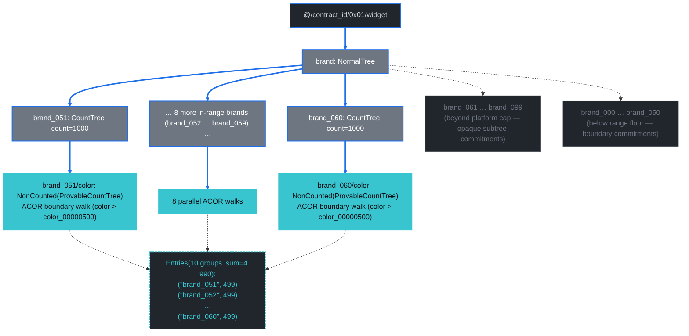
```mermaid
flowchart TB
  WD["@/contract_id/0x01/widget"]:::tree
  WD ==> BR["brand: NormalTree"]:::path
  BR ==> B051["brand_051: CountTree count=1000"]:::path
  BR ==> BMore["… 8 more in-range brands (brand_052 … brand_059) …"]:::path
  BR ==> B060["brand_060: CountTree count=1000"]:::path
  BR -.-> BCapped["brand_061 … brand_099<br/>(beyond platform cap — opaque subtree commitments)"]:::faded
  BR -.-> BBelow["brand_000 … brand_050<br/>(below range floor — boundary commitments)"]:::faded

  B051 ==> B051_C["brand_051/color: NonCounted(ProvableCountTree)<br/>ACOR boundary walk (color > color_00000500)"]:::target
  BMore ==> BMore_C["8 parallel ACOR walks"]:::target
  B060 ==> B060_C["brand_060/color: NonCounted(ProvableCountTree)<br/>ACOR boundary walk (color > color_00000500)"]:::target

  SDK["Entries(10 groups, sum=4 990):<br/>(&quot;brand_051&quot;, 499)<br/>(&quot;brand_052&quot;, 499)<br/>…<br/>(&quot;brand_060&quot;, 499)"]:::sdk
  B051_C -.-> SDK
  BMore_C -.-> SDK
  B060_C -.-> SDK

  classDef tree fill:#21262d,color:#c9d1d9,stroke:#1f6feb,stroke-width:2px;
  classDef path fill:#6e7681,color:#fff,stroke:#1f6feb,stroke-width:2px;
  classDef faded fill:#21262d,color:#6e7681,stroke:#484f58;
  classDef target fill:#39c5cf,color:#0d1117,stroke:#39c5cf,stroke-width:3px;
  classDef sdk fill:#21262d,color:#39c5cf,stroke:#39c5cf,stroke-width:2px,stroke-dasharray: 4 2;

  linkStyle 0 stroke:#1f6feb,stroke-width:3px;
  linkStyle 1 stroke:#1f6feb,stroke-width:3px;
  linkStyle 2 stroke:#1f6feb,stroke-width:3px;
  linkStyle 3 stroke:#1f6feb,stroke-width:3px;
  linkStyle 6 stroke:#1f6feb,stroke-width:3px;
  linkStyle 7 stroke:#1f6feb,stroke-width:3px;
  linkStyle 8 stroke:#1f6feb,stroke-width:3px;
```

### Diagram: per-layer merk-tree structure (Layer 5+)

L5 is identical to G7's L5 (widget doctype with `brand` queried). L6 differs: G7 inlined 2 `KVValueHash` targets for the In-bearing brands; G8 inlines 10 KVValueHash targets for the in-range brands the carrier walks (`brand_051` through `brand_060`), with boundary commitments covering both the below-floor and beyond-cap portions of the byBrand merk tree. L7 + L8 fork into 10 parallel descents, each shaped exactly like G7's L7 + L8 — same `NonCounted(ProvableCountTree)` continuation, same 37-op ACOR boundary walk over `color > color_00000500`.

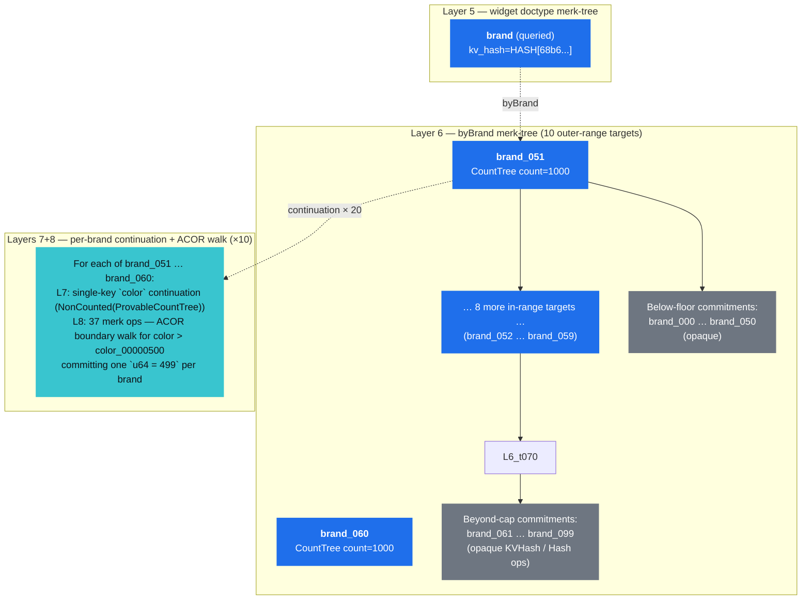
```mermaid
flowchart TB
  subgraph L5["Layer 5 — widget doctype merk-tree"]
    direction TB
    L5_q["<b>brand</b> (queried)<br/>kv_hash=HASH[68b6...]"]:::queried
  end

  subgraph L6["Layer 6 — byBrand merk-tree (10 outer-range targets)"]
    direction TB
    L6_t051["<b>brand_051</b><br/>CountTree count=1000"]:::queried
    L6_tmid["… 8 more in-range targets …<br/>(brand_052 … brand_059)"]:::queried
    L6_t060["<b>brand_060</b><br/>CountTree count=1000"]:::queried
    L6_capped["Beyond-cap commitments:<br/>brand_061 … brand_099<br/>(opaque KVHash / Hash ops)"]:::sibling
    L6_floor["Below-floor commitments:<br/>brand_000 … brand_050<br/>(opaque)"]:::sibling

    L6_t051 --> L6_tmid
    L6_tmid --> L6_t070
    L6_t070 --> L6_capped
    L6_t051 --> L6_floor
  end

  subgraph L7L8["Layers 7+8 — per-brand continuation + ACOR walk (×10)"]
    direction TB
    L7L8_each["For each of brand_051 … brand_060:<br/>L7: single-key `color` continuation (NonCounted(ProvableCountTree))<br/>L8: 37 merk ops — ACOR boundary walk for color > color_00000500<br/>committing one `u64 = 499` per brand"]:::target
  end

  L5_q -. "byBrand" .-> L6_t051
  L6_t051 -. "continuation × 20" .-> L7L8_each

  classDef queried fill:#1f6feb,color:#fff,stroke:#1f6feb,stroke-width:2px;
  classDef sibling fill:#6e7681,color:#fff,stroke:#6e7681;
  classDef target fill:#39c5cf,color:#0d1117,stroke:#39c5cf,stroke-width:3px;
```

The slope vs G7 is the proof's whole story: G7's `k = 2` outer matches → ~4 KB; G8's `L = 10` outer matches → ~18 KB. The per-outer-match cost (~1 700 B) is the same; only the outer-walk count changes. The platform max of 10 keeps the worst-case proof under 20 KB (Tier-1 of the visualizer's shareable-link guidance); larger windows are unreachable without changing the constant — callers that want more results call repeatedly with disjoint outer-range windows.

## G8a — Bounded carrier + bounded ACOR, grouped by `brand`, descending

```text
select   = COUNT
where    = brand > "brand_050" AND brand < "brand_065"
       AND color > "color_00000200" AND color < "color_00000400"
group_by = [brand]
order_by = [(brand, desc)]
prove    = true
```

G8a stresses three carrier-ACOR dimensions G8 didn't: a **bounded** outer range (instead of half-open), a **bounded** inner ACOR (instead of `>` floor), and a **descending** walk (instead of left-to-right ascending). All three orthogonal. Same `RangeAggregateCarrierProof` mode, same path-query builder; the differences live entirely in the per-clause `QueryItem` variants and the carrier's `left_to_right` flag.

**Path query** (the carrier query items differ from G8 in three ways: outer item is `RangeAfterTo` instead of `RangeAfter`, inner ACOR item is `RangeAfterTo` instead of `RangeAfter`, and `outer_query.left_to_right = false`):

```text
path:                  ["@", contract_id, 0x01, "widget", "brand"]
outer query item:      RangeAfterTo("brand_050".."brand_065")  // exclusive bounds
subquery_path:         ["color"]
subquery items:        [AggregateCountOnRange([RangeAfterTo("color_00000200".."color_00000400")])]
SizedQuery::limit:     10                                       // platform default
outer Query.left_to_right: false                                // from order_by [(brand, desc)]
```

**Same-field range merging.** The caller's wire shape carries *four* range clauses (`brand >`, `brand <`, `color >`, `color <`). The dispatcher merges each same-field pair into a single `BetweenExcludeBounds` clause via [`merge_same_field_range_pairs`](https://github.com/dashpay/platform/blob/v4.0-dev/packages/rs-drive/src/query/drive_document_count_query/drive_dispatcher.rs) before mode detection runs. After merging, the structure is identical to G8's two-range shape; mode detection routes to `RangeAggregateCarrierProof` for the same reasons.

**Verified payload** (descending walk — outer keys come out from highest to lowest, capped at `L = 10`):

```text
[("brand_064", 199), ("brand_063", 199), …, ("brand_055", 199)]
```

The bench's 100-brand fixture has 14 brands strictly between `"brand_050"` and `"brand_065"` (i.e. `brand_051` through `brand_064`). The descending walk starts at `brand_064` and runs left-to-right=false through the byBrand merk tree; the `SizedQuery::limit = 10` halts the walk after 10 outer matches (`brand_064` down to `brand_055`). Each brand's inner ACOR over `color > "color_00000200" AND color < "color_00000400"` sums to **199** documents (199 colors `color_00000201` … `color_00000399`, one document per `(brand, color)` pair in the fixture). Total `sum = 10 × 199 = 1 990`.

**Proof size:** 29 010 B. **Mode:** `CountMode::GroupByRange` routed to `DocumentCountMode::RangeAggregateCarrierProof`.

G8a is structurally G8 with three independent variant changes, each adding a small amount of merk-proof overhead but no asymptotic complexity change:

- **Bounded outer range** → the byBrand merk tree commits both bounds (`brand_050` lower-exclusive + `brand_065` upper-exclusive) as boundary `KVDigest` ops. G8's `>`-only outer commits one boundary; G8a's `>` AND `<` commits two. Modest size delta (~1 extra `KVDigest` per bound × the carrier's tree depth).
- **Bounded inner ACOR** → each per-brand color subtree commits both bounds as `KVDigestCount` ops. G8's `>`-only ACOR walks `O(log C')` boundary nodes for the lower bound; G8a's two-sided ACOR walks `O(log C')` for both bounds. The asymptotic stays `O(L · (log B + log C'))`; the constant roughly doubles for the per-brand boundary walk.
- **Descending walk** → grovedb emits `PushInverted(...)` op variants instead of `Push(...)` and walks the binary merk tree right-to-left. Same op count as ascending, slightly different serialized encoding (~1–2 bytes per op for the `PushInverted` opcode discriminant). The verifier's reconstruction is byte-identical given the same `left_to_right` flag in the `PathQuery`.

Total proof bytes: **29 010 B** vs G8's **18 022 B**. Per-outer-match overhead: ~2 900 B (G8a) vs ~1 700 B (G8). The extra ~1 200 B per branch is the bounded-inner-ACOR cost — every per-brand subtree commits twice as many boundary `KVDigestCount` ops.

**Proof display:**

<details>
<summary>Expand to see the structured proof (8 layers; L8 uses two-sided ACOR boundary walks per brand, `PushInverted` outer-walk ops for descending direction) — or <a href="https://dashpay.github.io/grovedb-proof-visualizer-widget/#f=text&d=H4sIAFHdBmoC_-y9X4-mR3Lld7-fgpcSMBeZGZH_BMhYexfwGmsbC9iQLxaCkH8lYQcag5rV2jD2u_t33iY5rHfI6WK1plFNdM-MRHZXVT9vPpER52SeOPE_f_u7fzn__n_6T9_-7nf3b-I3_9-_-eab_3X8v-fbx288_vWbb_5v_fNfffO_nW__y188fuObb8JfffOf_us__8Nf_Ieh__M__h__4T_PnXq8qbdud5ZbdkkhhlarlzX4Axuxtr1DO9H4rVlWTPX0OI6VZNP-9i__8rufHb_72f_xb_5m_Pa_nsdf8W9_883_-e05f-Fnp1SS15x6TeP2emeNY14Ppc5kp_AYZZQ4QrqWZwq9tdjvPtZ3av0vf_PN42l95JHamnF64AeOoa-9YeeQaqn7RkulzX291FZS3ZOfwJflXMfat_7oaRNPO749__T77_7d_mhlYl89OQtzvNrogTXwlmrdYUZ-e63V9rS9Wg1rrmjh1GrXdu1nZD7dH_4u_6tv_t0__ONv94d__-3v_tv59u9-q7f1z3_13av65pt_-81f_w8__MtPvMwPv37ilb58sT9e_PD_fOqyf_f2Qvx-_fPs4cTTc5r1nNuDrdX3TLvzncfMh9VbT2hr7JPTKjOdYfx9M5dZPLMmf_mj5_7ppfjuE33y079c0T-5rh9Z3Z_bPN5PjT0GnrAm6_nsmtYNdnq13urZpxzvnlmQXP0SIHxBvr5OPcRj-9sXq_H9r_iT7zLE795GraUXArzwI394L7uPcMdugwhMuYTbTus5rHiaj3rPmGPMFGftc9V0z3Ji2T0195PO_ekH-WGP_PEf_qk39_37C_Gn3sAr3sOr3sbPx_1_-8f99-f3360WWSCVWE75Ya3KyiHfbDedyXY9wcJaaazhxbZPT32caSmMzoLONg4ZhXULNlKas7SnGP5lq_Lh14cn_PnVefUa_YKV-rkY7iTK1n3GMkLtpM9297qFzbdmWkf7eDV2mxfv866y-J_zZaXPcPruf_uzq_Gn4nl-O_5p_9EryteCFbMfXlWbpdc9et_ljBpGszM91u57jTqHdWuk49HbnVdvbW1Cvk-beYd708ef7bkM_NyvPy4PZVmpqZ9uMw6LlMbLtjupEVaFkAqHZ_a8Z2hkxpJjJNAS9bMvNmMrH3-2l2Xj5369NuY-_Hqs-8cC7xeG3y8Owheh-L_807-cb39_9o-WdkUWkajLtqngPmam1KSVFhCFTdo2mW2y5B5snjlDrS3arTUlavwq4eNL-yIwf3iC__g3f3iGUAZ_3852alkltxju9jKHzzJnd56ml7Zt1lbbmYeCZK2HvMmuxzzaa5_hhwD8_ile9V32s2tXSGU7XWoDcbj7Jb2R0Gxq2w6e8u4K1KvNKdsxq5pG1nN7BVmd0V_93P4n1o6qQpJ1u0CoxNYMq5VVO9CIDNOCj04dL_UmPxdwxgrmFi5wMtXhrOlrnyG_ae3Kz67dqTfvsRK1oddwZiipZ6Dcyqms7WHctlhZvmYXcz5HbCPGugEBo9YxXvvc9U-s3aTiBIpNNUHt6fyVuaTLFjipO5gix5RZuLQaG6DXmYGbl02R46Y43dc-Q3vT2vWfXbu6WbeVWYtrPcZyia_bZk5x5VOAZ-u0lEZQvJUQ2FqCcgtEl1uPLb56z4Y_Wrx__49_f_759x9Kyt-Fkr8rHpPnieeONn2VNIrlnAvY9J6zAfaXnFEPZGezqVslECkrtlpf9ZSQ-6ujMMY3LWVMf_RBnsojn8V_882_-91__afff6iTBj9b5db0G5YhhN98c387_p6k_5_5R_33b7-vmynm3sGeN4daiu927qJcFaAneWHrt--9IY92WZFcD9TIWZS4gPc751d_dPuuRP2yT-5v-q78pu8qb_qu-op3Y297N9SnVk4gd1yAwQ39QlMnG72wdUZeFygBCIM23VsDWabt1iFAxObI5TV467vP8LYdHvsrPnp620dvlGeSls9Gtso95gLuTGFDk26Ji3RBta0TVMXnXGuTAwN8CRQFQo1WXl1Twys-Q3zj1hqjRfZQZAft23nqsdaBPKSTcvd1bdVR9x7Cx87nrHYWRDVHW-mOV7--9Laskl6TVcLbPnq1TLos-0Y_rEBoneQSKNi7zD5qu-TzA-Hciu_Vzc9YcbU0m1H_T331R39TVkn-8U-e-9s-eeGT9Xl49RvifvYV_Iy1BvGhFQD2x-cSPLwh1dDqsul1shItwLJfXUrS2xBNKq_46O2NH712KJ_1FMByQPK6etwL9Lb2XAksbtX7YEP74TV3VmZRQGOYMyY4ZXr1R39Fys31bZ8hwA4cRFxCAhEsndnMVYV-Fzz_LKB9d3AeFJfK6cmhH7zDC8n1vcvrA_dtKTe9IuXm8sY9m8ZxMP-h2M9jOhCtG1rPf5b1Wqk9p9280llA8NigqLukCBM4QrivpgMW3rJnLb7pu16R43J-Y4mC0dtOMUEmm7cGgJyXHFYK1aiclBQ997Y8UiC843Vq8wWFF_aG1_Pq9bK38T7_WQBOyEID2I5g3bvIQSHcuTYPu0nOOXtmUWoh6EPfVKgHf-kG7NA593p1kNubcJiVP8F5Wp0L9EPt8JLJmmuP2_OevWcIYc7Ul11XzdQbSGtK1-zknu6p-fI9r-ZdVt-26O1nFz32s3I1mGGk3PWxoLeTQqHTil4bcbTAeDxnGF7qmNlvII6SCuSApb_6yftbFt3Dn1h0O9vbyAdmBgfzsu3BL2c48LIGyGHJ8zzLclvkeIdPrLl7LscmzPjVQMbfBmQ8_eyiiwxP3T1Fy-DExGqyEUPwe6fbmIPy4ypNsPMzFFvhNEDYHImk318NI_1NOMSf2c1r_rJfdoj3o6M8ZbrXHee96VDvjUd7P3fWHIDKlsDC3YFSqZVxUmdD1xIq7yzyYbzZAFH5oTLZjG76by5m1pK_9s39_Lnz-t1vf_ftb77533_3T4_qQFyxGP8y5m_PT1WLx3n09__JxFv82frxQ8EdFsrxGFc2z22OCSBKmRRb4HrjeiFX7EFiIOWZXwoO5GEF2A9gsfVf9hH_xA3Nv2aoffj1WLtfEmyfEHKfFHh_HH7_1z_-_h8eL_gv_su__N0_8Bt__V3hWQNqNk7OxjsLqw2SYZjN8zLeFHmu7CYceGYL2a1kEr6NPkeMfaS__c03vz339x9-mEFcKzw1p0lk73QpqmGUUj0Xh3T1WS449OpqKRr_zTpFtgr22mt55Id9-49__w_f_TSHYeXJ9_HXHw-q5nxDbjaLzlApN-MWn0RXseAhVlCIFe9U_Njb0aMtfeC_Bsr8opB63jsfTtc-LN4jAv4u6Bc_9ruIvyk2IGbJG35Ycl7UkHt7qjfbaIvNbRbHIPOu0gt0P8waKeAVvs_WN5405fyGZ3zt3c2fvs35mdDQtQLAqI4zh9uuDmTWsUQIAiG2Rt9x8Qo2aakRJztY3cCp2muPvPUXoRFOv4M3luyc2ZNZjivWbBCp2G8K3vtwmEg9x22VkeJtoE1WkZfbz3wZGmGeAEYv2VZt1anTgwCJtwYAE3Xw1lwo6oqcG5bpVh4oS8YhQolD_yE0ir1h1f2jkdHjd5ERJwEx2U33kFPj6OuOCXberaQ5mi6yfV_T4vBkzrKBvL1endrOdhoP-rbozW-OjPKKyCiJnLB68RPChC2yMXkbzSltQxkdJkxZu3v3Etn8yTNxwocmYZQZw4vI8OW7rHoLX5VyhYzeEhM89MTWcw9pXl91jFD3A9qfKmnOHgEoCbhZLyOjnV3zyImiA9bfZzgBPKulK1J7ob19w2tm3SGCh2C7cHu-Z1o6Flf_ITLesuj144HRvz-aP5nS38mjbj5bd3GXSpqIawdyAm995GiB9Dt26F4AC0XSHg_JZ1eqjG_JGO3NcdE_9uGSUMEHIkbNOFKBtDFKNx2IrOJj2AJD1D14O_sSFQH43cbuMdyitH2UY-4jc8e3ZOzw8Uf8fmPuNHMDIpO6J_lo8lzJ9zECgV_EnkMJ7pnb-igEXFZ0rEVaacfXyTziW1LHH25Kfvm3po9vTB6TjRHJxTOMcA-FaID_6xS1tBLa4xgrdUtTp-mB_NsG0LPB0ay3-DJlf-Kvp5T96T_tu2r-lmX_nsf88u_0j8eUfX9yUnc-OUyAzu3UR3LgrXfnu1foQjx-o2rTBv7M0FeDCIS1-9grj-qXj_gmoPL2XB9fkezLYhu35WfecVWnO4BdyKzGVXs5kPu-iaq69nU_N7RmQEe2fjMqwX4RU-Tf2kjzDtrnl35EoSrslvm25brDpUyAjELIMO41qmmh1oo775vOy5iiDIEPwJcAB889USfisZ1DrR92LCx5SbJ4l3Du4EO0dQqkJta6evshpt60leubY6q9-TtfkYTrD4K4cQFsZFrzlPz48LKpo8ZmdyDp3oHqM-deqWeVSeWOHUcFepAgHhnuLXvtcfX0tnBM8ePhGCbRU3SsxFOvQ0WN6_L52inSqYIzF3UE4gpRWcATIuOhtDiEaKmzvwjHFgIBmImIGIfO0-DjNRC0fGEkWZIZWZKZ3GOvG2JuBQJbdcJVdKr1hD1g73D0c6E24M7tLtEwEB_kEk4ixMsusfCPI-_TKTaWKS4bDOCDyv-HFPcmLpDeGlXJPhpVyX4g9yu3GBvgn7WnWrIyt88FfcxtTFB8IznwRsYm8MYD8vN_d78zseFFdd6EuR93W2-MqvzxqAKYtDYXNC7FasNOhcQCbcM5B25ptvpYO1UpIwgG2Fsle5HMIBQEyHlJg90GvLbNe8V5B8Qnpb4DcHm2OHvTmuSVpRle4M-w27JkM68C_75PNJi055VCkgePMHV6wu8ModgIzeRvzxT8fBY8edx0gTNgqcyriE5ujn8onG_bzeXNUfXm_JjenB_Tx_Nj_l4ccyIsCwpryigsaAaMnwoL1WWfUsWauiNoMfMa7xEwH-mcVqlvJWStK1njDUtqb0-Q9ooEeXouczsAxBL5vgpbt3oXIUhw-4Fs2bxrSXzW-FK_haS0LAZqxCkv63WhYAyQew57CzhSP-eeUHejyEYq-czgTLvj-O4dug7d3ePUsWfq85m2z9BCvXWwgjHNwsrW7jxCl9poF6NebS8-fa1Qm3U4c4cKEfVXkr3yiSc639-a_Xx0WPs-z21pnQE6IYOgw-bF68h_ldNLPdTNpZMGaMwuQkW60ljd45YqDZRn481HOn-4Fvvl3-qvKJ--MrV-m_pIloOCVufZy7UN2trU0mknDPGCFYcUYnmdugr0iCjylwyBP6DImdWzs0XWKadKcWwJajujw-Z82d4ROn9Xt3733L1Bt3WCHNtTdKwBYQFEboKws6JOCZ1xrn7jmNB9I9B24I8p8afyMs4I_J2Edwlefhwdb1r3_NHg-IG8A9vBk3yUPnji0kCT414yxAE_wAdI2OyX7CCrdKydUMMqkQAHec5h4a3Q6nGF-MbY-OjZhP9A3-9uOnbzK5lLv8WJbKGnkRtAepd5zt7klXRzmwL0vJu1OmmGXMG_v5G-f3_J-Kce8Xv6Phq7bAeShxqQcmHTWWDNd6Q25kkpBaaNnBrF9ZRMVop278kdalHC48T1LShEl5BvfAH-isN4PsOQfOjeDWJafXZJTpRy4JEh7-jXoU-gRap8zXFJpgEYvrAf9lj-tdJ3j28FBJ4-HlPfp_x8R44Ca2xaMv9wSzB36CJVLwZ1AoJmSe8AMDvwDV5La02ZkwRF7L2RvvvbE76_IuGXqUuSclojdHrbUwJvPukFbaYH_tRVZF5waKvDFjEW8lrzkPNvji-Rrd_TdkjqnTpjNuoEAPN6DzXvoC4Qn2keQMBycUl-to9VBtw8d5L201ntLVCoG1eV9HaWpN45cBb0zVQGqloceQmg7rOsZzMWnbSTu4SEvK1Pou-e3xxT5eMx9T0J3zqWgFSbjVbBWetxtngSvw-Sj3GTUAFrx-_0Y-oAuOq04F3laCDOtx7zen17ULVXBBV0pac5SVgpA6LttGzHbEf197W7IxXCgAOrJfjiqnEAH8AaD4KSX2JMXQuQ6GIlRKwphE7eyTso1tJga2UKanwIdlogXmrzBeWpzp6rdp5IOJzIbjG4XIeG9rjWg3zWY9kI_JyswE3VOlgXAAPg3zNBtxPUlZgdn3QB4P2tQZXDm7_zoxeVHr_nPJDMe6x4TK3qum2dHFjSTim5PuMtunWbR-2Su4O6gzq14pXCpKX04DxvYu_57ReV-TU3ldtWmFFxk88hHRFER5cJ0ePIxEgEkiZ1z6ldVsxi71XKeJB4Xy_PhEhp0SHUU8czK1-pfzIxV6pRmgkmMn6AlhyL1rLUHKNl6A4RF0be9sTe7YqlUztmg32NBKW5xHElqoHhgQoeVFFItyNG4EoWm2CxidcJ2fo09p79zVH1UTjs_sP1dySQTs0T3M86xNBiYYFqhH_qNvjOorsUcNdJURQ6ZYcu1McpsHot3nzJ-XY8nOsrshzwvk0qzdW1_ZByKlXfl1wXcvOH-Pf0AY8mRHhz6q1JvPANHt7tKctVaq-TffqigoViVcdDlSy3CEgh1b7aoPiyYiRQcqACegJs5zzU0acsZ1Vi1d1za6PnfHiattPWeUaL6iKDOp24a07U5xEWLN5mdWXUpWPhT7sAz28-oMlvTpDlzQmyfDRB5vg9r6hFCm4IpTrfgN41m1TsqWz_cHH_Qfg6lk6Z3eY-KVDfeaMeoEOPa1l-4BvWtLw9RZZXpMgOYwouZwZQ2iRnkdKVKCFzpKDU2JTwo0sIlj4bSLDzRbFIHqkm8PEilq9007kDUnTxs8HHgQJeS8s5eiEdkGXLqZU6E7rz98DQ2DYLgDNKuPVlLPNnom5Dokog3gI1RFJka2TesMDbYcD_-0PzoyMC-OayHCYpnw90_nBszve8ZeFf12T8_Ou__5s_x9e-9itf93X__RepKMsXpKKkoPZAfaccgx3Ja5PcnNmt8ei65Z4ga5KTC2lxTjFkqjQJl7jyXM4XoKJ0hzgceBgVFeQQLJHYB-RhByFuONEN-rQQDBDGGCdOtpjdEF3AOH5VUX5GFeXVbViVrm21mgA2C37cgXgXjtRqH2Bqwu4sHWjCRnRODv2wna5Xqy9PVSn-kxcMS3mcmdYBxizi1LnVPGoTn64K_uSFdClF22zQxzqACmv40x35mNQ00zUpAB6svyhZQy39PTZZGYkhEUy5jlHGcmAZ0FiqSh369fn5VJR1x3AoohQAX6cAZKJQO5-oAm0kNQwVLAlnC1sNkkY54WtzyXE39sr7VFGSic6IxhtqLHrjRd6bYhwdmJxBa7vAXSi0cefYurfjqUsS3SEzE5z88vxFBgWxEQIdHp2yTvFb7hGoEqGvp-hUZ3VfJc4WzSEydbRASnTddD-FBqwG-txnFs0bcsbZ0sm13iYLXhdEsUx5xQizugEmm3oOQL0WeNT92VSUVy2yY-ZS8rjuQinyJpjEaa7zSE4LraijlMinARcMwrvmsB5Hdie_TxXlYPFDpjrt6zJdGCeJHqlQFVfCgLr21QE7I965fQfgaNWnvN7b9ZesNboyTdrLrGSJapP6jGW0FCJZY7Qd1Cm0IJcsXov3PjoACzCKgLzPVzEP54LSgutHhdPP4iXEy48-EiwKkyUYDTF3RhJEg9LwAcYizMv-XCrKk-cdfnzbeJh7GJEb4e02F-uaAbZ9lV3d2ExyTfGU1oT2V7ui3PNdqyh3uSk0Ca5KrYR6kDmdscZHJ1fD-KSrKKdnysQ5nnkzsG7pKfncj6Ly51ZR6pztnEvEUZ3gmDBg4iP4gAlQ6WzdcccpHf7ElxA_pPBZeSU9-7AR3qeKUk3OrevUvOw8e4YSDYjT0f-Fp5NOReNjh-3Xts-e8hBLUReTdfW6v6ooP0VFWaa8A263A_sE2F-1tgGl2-79-mw11CNpOMUgytvwdljhjDc2IaDHYd47VFFKEVbZy5Kgn6UCrrMF2ddUnfOlJsh32wGdgSLH7OzyuHdt_milf5KtUfWXdnwOLZzhxCB5f0XVe-KU79oy5tFyeGEtU7Mmb4Zutmqp42VMgQCI8zDZuCmeoAOCBigMrQELrlHpH7INfrOAxa5kGqNEONVdda8aftUqSip09O73qDsc3LNIwAq5UoCj5VxZa5IIWjkbHN8l6B0FMOYCK2fOd6qiXEtntruZxG7kO5VveHPqucjKYbe1V7xCWKuuTGqvZ4_RIQiQGRjmi3DsxAjA4Fa2aqtGio-yohtAEJObqqkhaoUh5TyFYp3e1OEjXKKegKdwpHzky5qnllnsecORjFBqLa9-4fmEMlQGFuNmO4MHKTZDxS92S7t_CSrKsBJ4W50eYfUy2bUwGQPkys5vwiYhZ1Qa6w752_uqP0FIrlFuIWj3vaooL6lImoXalukGxR8oFgSWTyyV-m8xywd0djAaKCbZ7Z5uc9HhdV_SYLZU0olkiK4WDNtlQ6Z8POzGnOR5N1SEXVYK0UliImZH05F4MvjOE6JNN1BTjBJuVRaEsequWoZ5fuMCrYRNnc_38N8wdvHY5gFcjRImf99XFeVPqyhjDbxiSxJJ5zgBRbx5C7Z3Wvvcww5uD53Q2LsNOGqlirP0ZB5J8_N7VVESQxDecyekHb6kpqUGZYdYVgiwRUHY7qWrqWP1XcCERXYwcUM2qO8vux7Y5bWVUL1WEloMgo-SBBu5DmLXdz-bmjE_GGGx6zeJ008NXQrI8nSicxeLbYQl1M1CLiOEHXr01aE2Czi6pJKIq_dQJDT2vpbk_VHtdPFzqijJzGmAStqS90a_t5ke5DS_6dhKM1vU0X9kDeYqpSnbS2ovvWns972qKOOamewxfdpMdxRZctQBkEpqhxkdzDWhlxS_a8pWdd8lqz35y8abX6K5mPda7cLEW0_UyV36LcMpm31n2cwCJ2YqD_VkmSPzt5KcCpiEjQhye4oOU--XNPmjJjWVNinEZ58UlyxDDhFFqFnLANIONQOIjlwTobjlWPT5VJR9ZpI4OP8GQkSdsAesyYPkMX1FtaB3k6Iwsj-upJM6h-gQe_aF7_LOVZSwYDlOU7h0N7x4aUddJLryDRTHofaVHqfXOJbW_siD5kQJBcAArX0GFWWpWaV4BqpmaUYdjF2_UtShCU8F6APJ2o5bGDFvyd5KlC_QGrbT-1RRgqk85JRji-2yVZwMLSTFvjgjgD9BGuSjBmyHWfJHYwRQQ05koeiWvqooP0VF6dL07ThzLKeNA3RjnW8uaQrPARTS6Kb-x5PjmeUOr8RYvD2NlIBh71NFCeWIRfZWQ77_Vk7PVuvwkTSIARqTHtf_MqgclveNOksvTv6u7m5P9N3HCUmFwbyRBeHte0NgHO6UBos1oQTU7UfeuFNuspBvmRJpDkV-loIsYtaprWNrMgTUq5PS28NLAPwy5JXA2mtsg25-yKk3stRsgFCD3_wFqCjNK9WvFYqXpKupAP1zUsdJ1l1FPOl0K8XLlUN1gR1QPFshr1FHKTnvVEUJ1UhEPoin3ZgAclnmGryjcQFwBpJryloXmOm5RPmjQk5qgVHflh6n138Iqpwg5vWhBdrAgy5_BoMuAyR7JRmOqoZJdiHJXS2K53qMOzRdXRIdT9Jc2De_1CqUZwDIhyG7SzUCDXLnhqxum0IN0NFmcaUgqGySL01jP_-qVZTztBBEDlsxy_X6uPGsnOWJLnv00Y4Q27QC2CcN2EgbQtlLoaxT2t-rihLAEnOGoakLsajBtdokMcc-6mmVdB0ruLevA64BAMy9V5KFw8PG6aVSnJUIWdNIVoUiimQfGLeBXVkG9RufbAMG0yxtHXeezpdsOaEDj3t_Cse4AVEDEpluuxJ0Vra3hYcNSUxLncs5QHNm9t0CQXn09_BR2D9QqPMlqCiHrvnWPOxWk_B-HvW1ANtZEYlBelwa-QL2ynIrgeWRAu-AYLQ17dF-8C5VlLk23li0Vmt0PklOoeUrpH95dwBLPk7IFR6YIdKrBGXxOHqYV2eET8qzBR2HQhB_1SrJvw3y_l3xqjLuIIBqmdVZOlALOp9ei4BKxA5p8wmOWX8UiRuzJhbs8qiKsPEDS9nq1F1y0OAFjCN7apY8gJJHTz6jhDxfVZQ_raLUOaB1tdXOwvssZwJrYtRpGpvTaiyDAmXDNSsiLOCgLhg0IoTk47W9WxWlBWkp2mMgy6H8UYxHJylCpm2mvXSKQ5bk3wNBUrYKQioj6eJn3_uyQQtGRYUOZZc2ezsU52xTlud1FwD07uZEXIRn7T6Sho09zoTlVznXaU8wEEjZU85Eua9eeAGlZPmRDB4N5HSWFCeRZ5bunO-2dvYZUdbN1j6cMX1VUf4rqCjrl6OipLgEYgwEA7HvM9heRuUE1O0UpbAB5TkkWWgnUl7PUhf81cS5C1QYX4CKMsuFLKzSVrJ9F1gDAOYphmlUUtlX1LUBZTduCS2veuCOW7uzUov7-Kqi_IwqSsgGr3NoZM66R0q4qAvJXtUmtykv6gEbd29qCFChDY3RmfdcicJ6e4kUHOwAlQoCqHUU8SDQbTW5j9V9x1ihPobVOfWnlduAnueYmhl9ttWenAs6e0KegnHKzhGCtnKRwzsbowy7_A67Jx92VFiqe_LJBu9MWWbaj0j2n11FeeRv1PeE7p2aNDtHkJ7tc4DYE6gegZVtXphkqmzuHkqOlUqwA7jnYfvzDlWUnuEiYDqdVfq9FieVMnW4ZrIFNDZ2d3EPayyxiTmklIur5EMwxVZfmlqARMq6XZqSMLI8zhOFs8rig3wnT6SuCUOAE_IF1HtRnjeIRQ05uZVnm1IZElJ-bUV-iOmEe1-i6JJhSrtySe8tDIIlelOrw_Juk6flL17nfj4vypBs3JDVcApaS6c8wO8o7JN0HOoRNoB6a_6p1zH20c2BVVdvBl_6PlWUQYccW6rrGxTDEEvv8c7Cq9XAwlzUwQi_iA3iGZvtmqEDRX4v8NNne7Ks-ZHgLFBck63lXPBJeCpZ4rA-njSxhXzkvOHED1i36lZtS6JgT0kj1iW8Fst0O8Rqv8YaR_45sKbWElsUrg0hultXSfxrOAkIyaa8rc3PpqKUM_vu68HRdkxja9pH8EZokzqWsLuGSAVdZsW9N0hB03BPvhuuft-1ilKDWdjDkyWnFkhqbUqJc5_GLmB7akc_Tk9vnE5-zLx0oLcMLgj3_RlUlPa4LiR8O6XpDGoGOD_7JGtP2W40s7hJIVkNVmQ3EI2SSymgl8hjvk8VZchsjkhCUYectGWUQa81TUl1JymlSjSZhj6IsxnvlOeppsckvqOMryrKT1FRnrzqEtDdWTMvRmwUPGkogzxp0tVLIRsuQH7bK2lSxsOLIZlm-Xp7nypKUFWSI5Ds88AAVo_OjQxwAJIBxowrA_naYrmLnV3Z1Cf5oKhXiz28vIZZpLezsnYX6TaB23aJsXa5Bwc_FnUmr_kbu47p-TQqTZPIl6Sue5ongRGVZZIZ5Z4x4zpF1zIxdLaouiXSEdGuUO3DH7fGTqcY-CqDSjB56l-1ihLSOKi51ENgFNSqH9BzCRUMDg4l1_XVogTUcg6ZEiTkoqJz5fCT4n6nKsoztgzpH1aHJ_UlWROUpGliMtDj6OxbI3F3kNNzJLx6B0iNXCHYPT759TiA5UQjE9rJpMudgDIp79Jk3WsFwisPjAIuPfLWt2SwpVEXQWR9Px1tauaY5MZWb2ojPDQhgOazew08hzqHyMDJa9Hld4-k59ssQAQiZXJ_CSpKtltuK5YQ3NSmFJb6Og7B5Zp1At6SEbJ7CYdykxqpz-2ebQ9rpZ7eqYoSaJnKo8lrxRqBnw2yCSAFr3RZfxe5aKtBq2vW8nG-Hu76sFqX1-RLFaUMR-fMAczvCzRcwXoPzxkqrMnSD6oywckSAiddaXfR7VArTzDhsU-OPUE2QbbjmcDk3q2N7kDadGMfBGirQefsQMVeyooxC4evKW367DnbVxXlT6soqQoxPtxGS85BZYhqkyXO6nIt0VEcZeJhy6S8yRJ39YiuWsGDQMT3qqIcHlMcN2UNYOP9i38K266Wib4FgO0H7sHm3f3A5Es9XcL6dojt_TRCQrMWQcijQ1X8yOv3AhsHadEnzKz2XWuQrkdXrh1cAJtJl_xIQNeRnjAgi0m4GkwrZTkOEdAxj7xXL1SpRUm-B0ZXhIcmJFITiFtO7CAA60zzM6oo1c0Jd2TTU1xkt61-DbswGLJ2Dh7nYVcuzRMZQAqfQnk51E72K7um96qinPINq5Z5FWRwmMJcwDteG1UvUjxDdupW7uCGR5sfYDWtLZka_DuGlwwh7axxSqC-xjLJH2xdZ6V4fwBGgK70YFMynUgx2JpXkqeTY29Skn26cF6STFDJu7pmR4Qx3uTyTx1Bhis7ytEM4pikaM9W1G_opkmnvJga8-dTUYbZKth-h91J8HKrZZF6kONRXzzYVvsK7GvUeaQv6V3tknwYWcPY4xbpPasop4ZCyTMz3piXXmwEURErRbf90txWak-1mnRoYTNW5RddfckX8SF2_nOrKEkynq_wPDVugVlXvOqGBL-uChiZDxqcgHUdsmUB-KsbQij8kq_tO1VRLu_lPnz9MrVHw6HCo8cxq-G0Lrn1kmecpEhKkowt8enkyFF3gKP5VxXlJ6koNYiE0lVuqXLPGVGHzEAoIHwqKUxrQDEJyIigKpF4KwU0oAFrOvB8nyrKzDaQrbOGvUXw7S4nTQJHzVC6Lr8kfCv9gQdU4EvXUegosCo-U3rJlyjygXpn0_dkaWDnGk51m3oTdX5JmoCAtsdN5TmslrBTIwcCvKQeeTqr1aDTYrpi1EjuxpYGIMP3NTVBF4K1yp0YfDFAKb5uPstO2KZOuZnCF6CiZFGufMP6DsuutT1j2Wqpstxa9wzDGBoypFuTCJxabp6lg4FMaezXO1VRaqSW_se2IPusW-G03RJ1AKKtE98kF4zlsOeyVoaVH73VWpr4or0MKnXjJlChT-d9T_lwBHhygi3LVke-fHGx78CFN8cJzIqwqvr4689-drTWKE5VJwd_HlCa5X7l7-cFuAALUxegbw1OX2CSqLsigAbsSe1nefRft4oyujTi_cYo6SsgsFjRYDj-QTcrxrKzc5daRKiZOfG2uvqt2Jajvn2SxJ9ZRdkga-RguAigC87Tr9SPsgZcW1JaWebPBBLrBpGfHRzvJBJSe8r8v5fs3WP3vR2kP1sESsRU5HjWjsVZ4hkO4R6SxMHwQyXHeZJb4M71BErCs6hXkt0S4ObbVpOlQRql7nonyLb0GUYilguspwJWZqmXFFjMNMReN6Bfgoqy51EInzlCfDhOpMhGrVdzrzTnOWpgZCQtTL5u3Ew1VZ-d7S11fH845LxLFaUC38LqMutv0h2M9ThepDpBSFIJS3NZhon8zC3wXxbv20Vea366TVnLqnye-XoKHmnfLJzV1OJdR5ubCP5QgdNjwEMJ5ZSpFlsyHYw6PDtMyWt9PWbtZXKYUtu--wZvgsUU6dQ0d486zJOO5nE9Gufjmexwq19VlD_jRbk1vbJIbg0cGaewx7tkgLc37wS9DttUoAgFqtncpepymT_dmeVO71dFCY7SYY3ay_J8dE26PEt1JjQLVONoKsk5A940BHlvLlEW0LLwmfdJEXzOco1KHAWYxv5mnVwDbS0DYtpwNbssAvO0li2fSxW_oEx5FKzwYF8_rtiQTagmOwZ6Nozw5ftY0wLvJOeucySBkwmEuimjWhW77mNh1bPHh8H5VxXlv4KKsn05KsooiCy3lVoh96OXJm96gIyR9zyMZtIjXR0kEeojTE2ik5-seuSvfwkTvUnWfUA5J-jNQL92ukeQw17jgCAeE2_OYxpwVnPHgobdRA1aasfY46sX5edUUQIMa8h3gwxJh-BoMm03ii6hKZt-wILzJeXO1m2E8t056825xhHXyzYeTQWtancKasmQH0ZaN955xvYyH-Nf9u4ydRmbQg8QsK1p9VDllep5MhyMR4ycHdFyUVcGETmETnq2QjhJoTUc9JAWWT-UCdMWwwefnkrFs8-nogRjyeLIoftptQtQpBClnuMRLZH6RmNjNZMXgD4zjDMkdU_VM8JND6j8DlWUN04Szppqrr_b4CdjLJkKQE7HY6pZ90Z1A0Kk2pPeB5HSZbdFQX1qOJQXTSyFlXJvG7qmpphGGA2XVE5e9xFut3VwW0mS586d5A5dLDf-8zS2QVeaAdBZE7C1wUrOsR0DfGbeYqOm3RZFOe0qE2gpVyj85sTZFh36bCrKdXV_PDUM1dJSS0W7xKm6sWwGXXJNKIY64njQLcNh-JtOgnnkWUJ6p16UoZksYYN3NrEcKShPaikJFltbaaqbRxM5duwQcd3WLZNyWG4nvbwU1lAKUwq3kFXKWiB82XQCo3ShPZZFKWr66Ks3LZRu8eqAfg7zfPu5T6z1QBYmrHrDp-djNsJOK1DN2n4Mb5C2xiXZI0AzNY0I29QpDeWRtYJ_NhXlgjU74SoHhWxjd-c_LU9Wq3mGbtnhGVPWzXjbTePXAplYRBVU-769KH1oNKo85zSKvM1BYS9q2LyN7JB3HV7no0m-qEE0bNs5DeNfQQHnIc3_c6soWyZrlawz8HYP2WdHTacvPrpGNlCMEjg9EdElU4E0KN5b56s1Dj495si_QxUlRMjZT05udkjd6su9JHg6qOtQImsJ1Et2ri6h8oFCwRj7utCgsPopX1WUn6KiXCX49g_-LL1eSQ2yJrc0UI4McLf6V9vM06HlWvaVpd0gXyaDkef3qaJsB1ZM-Y_slUThZyMA2HKlyM6pKYVFGj34cTrQ6b3ZReuQtY7VpaEnL30HfMsgrbelYiD_11NYnm3eKghiKOMbVfCS5KvIcmEXAkzPBGz2-hRT6di4Vy5u0nYZcX-bJj7NWM-N8rMCx1JlO7gibrayXDOmB1lwxeT9Vz7RO49Hp3QSbFcLKvjbgo8wdpT5xw1xUcN7a2HJin714YMszcrARNM7VVFadptTno633nSbpuvNotnlkii02jb7r3ijtNppVVNvJJ2KpnF9nl-emAcCuz2OZmqQXbi4BlHc4s3UpKMqFVQppKgKBsrJUtacdBrhNOxJRXknu1i0Pq6WbnRZlJXZncoB7OCRJlF6wxlNyTlr__NyoP8QYzbU-RJUlOMxfE8DfMMFn5gahJOrFcxGGrwE2VxAKYk0Ss2egDh1soTJZ7b2qJvv0otSvdN770KF3104xEg_VqLJzL6CZhevbkB0ajpX1pqxdN4lEFKpPbwUF51yR1bPT7PUNIzz9NW63PthzrXHc3ZUmjs97Q4jThe8XAIsQJqbp46x44Ed2zUS3nvxvspMGhTOWzGetDWAE5VcJ_OU96SDekme1CW_NG_sq4ryp1WUkEbNRwFSB6rwQ-nbeP1rhjjB2LrW4I-uW9iPtkFe516gVI0QMF7iu1VRnjQgz2C8RNpphA6pTNV75iV7M_lHksqg2OxhSw9tuUx7eiVFWXmZIDOJbjYNtK8rEPgaNLfbJqr3Xk6GJcHWeWM6QM8Y28N-duS0joahtqcWtwOzJVvzn4fu56S5WFG1m7hB5qaJnk1-wk2PLsMY1AUU40On0nr6jCrKqNS8ydC3gUbkJMMnXCHtVXX4JNnp5UugqEGmfHMQQ-rTMH7bYmrvVUXp3iBY1WRDyktN1SqcLFm8BfDksRr0u6iQRTAa1TCpF0A-YG1rvtzLQ52ko4ytQ59kIDRZ3ktvfMdRC0eS3C70Po7QYuWHC8dVqFZSQ3Z8SnQrZBXVmDZ5TWITYsFJlO7kv6GjtHZNLbtLgyM0vXnrQOmqIblDND-filIHTSV6ukDhOYFTZUNn7UQvfExJ3Ps9zXqIN6U0Nad1JzWA59SkLXnnKspRC5uOTZjYp7y0uqdrSltPmqvO6z6gLZnqqKU9pjQU-aU76XPft4-S-EUTvZemI95Qqk6HJ8-Wr44dl8CtDlCaCveqmp47pskXO88WNBjG7Yz5Tr0or6npR55udsuaEqVqdhP7huRYxpgnH20L-Q8ABaQOqtfnUmPkGV8nen-SijKnJEC3Bts4sU3tXDbCgpUOk6fWufIHLbwCcG5f6WEs6_KXguaW9k4nequZy-8cVsrWyK6ju5JRXKfjJGMjJbULKNWkkhAqm1kNI6lnPvJM-yWy1XQHCh18ACK_yODUQk28hVyuKKM7QHSP48QxakgVaLoI1zMrJK3ac1MFtE2zEbwAFdit0KZc2oKT5aWb_lmLeizk3i7L9mCCXQtGAWW6xX_s0_ZuVZQpT5lK1iK3GDZszAaeCgY5zHlTMMA6I2Z5XoNNgRhjLwhsF2k8_OE7VVHK5tGp4_nOOzqfpc6SJL0gGsoK0tIWGzFWWaD52Q0Sw-uvLjEHuO-lNHd7BS4M1wAIWHIgi8sA2TXnZB3J_Wai-sZTNd0wEBNX0g8wQfbR-xOKyA7tLKCFuzWuqoQ6NdprpTjlL341FxzkCqpUe2PhoXu0moIGma7w61ZRasxSX_HRTEA10VjA1cd2TSgBmbvMvQBY26S31rWel9OOGmhAgOtxQvEeVZQuYyZ3NWzOrvafAGYEdFJAs8Y-TLgQaX3aY1TDFZWLGtY9d8ryNXsZjp5dp5f7ysiEUGIrkiVnupKh8QeBmM5rE6MbJkiaJLL9wXe8hPt0U_n4m25nU99W2feBhJaASXO1TDqI0hrJ9ZLKww4AmTtcTJtlynhk3C9BRdkiu7CHw7ZXq9BgOXKFt8nCfJZ-TqMmFE3Xm1lu_TfLAWkrww1gXHm3KkpekEYuTLVZk7z6kUa8S_lAYEF9S9TEJFEmYICEpETb7Jkvze3WpwtwM9kE7FurjIhaDpfMP3cHrcp3QGp0uIOdtcR0fDy8iy_ht2G_f6SNsD3kS54yXMMijOvqEm2rjRZW4pRm9sQwXkxaRG8mlz46ciRbaLt9VVH-tIoyaaiAt3SuJ50GQzQP9cTGbH69Vnu022f5M62oWYisu9oH14C01mXvVkU51AVOOW0j6ThzaZp3F90uObZEtoyS68jzmwgNkvs06iZBXCZEfr68xeGzgh3LgE2VhyfDAAK4TM1YtwKK3KmORu6ce4Zs7B9pv2qOhxUDQT9P9A4QH_5ezcuyESKl2FdRp2Xi_8F1DMBZS4iWQ9tlWzhXsoAg49BjX1WU_zoqyv7lqChl1FXFz9RPuIg90qQMAHfUYIZx2ZuVzBqTnRkdHChbjCB52wQU3P0FqCgtlXMz9dJJNkNnX_fRSVQLP5TkvkfVgIHEB-9NV_sVhFHYIEuT2sr6qqL8jCpKWzaBdUFDZx4-XGWRyIjODng4spKbej2kTbvkS7KrvDjWOQmWA_d-qaJUI61M_muCop-9axnnqFFxPGziz4NClQy3qn3vPG3lo5MiuXPU5wF55ewqAxNJbkn7Y8TrpNOrph7NH9Ss6QMCvaAdDV8doWR1iIOpYWv1fj4VJSn9wRaPqZN-zzOkipNEMFIhYpQzU9qT6Kfo2K6Tjx57qj3KczvM96mihIfslQtbl11ZYgdYzHxAwNY9-cM8UiYBO7PRI0nNbehGEWDZT79P8onB7zjIU6Z6kUIpa86lUXSypDDyylQPFvSlAbKhtEtSscB6NWBi9vRMlUGbMcPUy13SsDbAIvgdNAC0rZrpCKpvBxY4YifhJBDPBv9m27yezzfRO-jQal_1aBbJSy_7KZ6iwX7L49asq1RNppwNDgiMkTUcaCLnMlvxdzrR-8IZTlJTjkYpBM1817i4qbfu8KSlcQpBt3nUEAhDeryVTHFTo0B_yVrPqDerm3mXlD2EE8KA595zpmkArBNuZ90Anq2zt6XxEvcxrPUU-3Al8WN6EVZ3zV6MeYinVZ5jyWomLx3yN3lkjiPjlJpDsRZ28Ko_vPUkyu3nUlFS_kCHZ5Mw-Bi6zUpb2o0DUsyrtLN72yxmPt3b1CDBFJ1ymTSmPvj79qK806FqD4ttJyX63JSM2MKVSRIkktdJ2q8k9DE1Vz2Eqfb4JvfKU-7nmOitqcIUKSrJGl0OMg0KSg0BsHe5JcvIDpTWZcUirTBUQ92HU31Wwfy9TvTOy6TE1QAR-blodHKjnEN2dC_TNG-5O3k21VzHoBCRig_xxX5o9uQb-FVF-QtVlDVFeTICqZKmtDbq5i1SzNQxyUdNJgqkSCDCcCcnDSn9epi5q9lon_eponwYdHTN-5mPIQ5b3ftB5n8dzq0stdT_kHrUfeYMMlcmZWlaDZjxvLyGWbpWX3l4WtbndpLgNZOjm2Z0wYMOfGgBFNX3OZauPjfQT14_MmJ7QohLKnregKfLl0O5yeaav-Y8QMj1MaFiNgMBLEJf6CJbtXsLH2Cv8-tWUVrWmLQZqW0SCoaUj5C5JnmIeI65VEb5_3edEvMFKGk-ZSoygUirvlMVZQNeNOVmUGR3WZbH7QMuKfCZVUgP6CRLERQt1XlMun3qqny_71wvHdLPWMAMai4LUi7VZ9XRADNpZBunyq0uj1XjGluDLC1Hdmo62yuMZTypKHs8MllPNUBU3DRAF6C7dI2x9noMfNqaHzayL3IEUMSEoEzSN5lwfwkqSvXbL4nv5a4gdgZtL9tlBSsnlWtS5oC8y4ISgOt09wJZVNnPqe7xTlWUw3kV0NT0GABSNZJqUjJXToVUHk-Xe3nXdB8SfLAqhJvqtR00uDu_bD8AzUuyFnVhsiKfnCocNQJoV4J3Xokn7YzbreugJUnEtk_L0kv2_Nh5L-6aF-QhS_b0MGlZTsRvZ2NLhm5me_AV8Ui6WVYZQ64rZaWVNvvex1cV5U-rKGe6cWmWggan6DAhT9UEjZAstctiWZ4mW76KlKN42e-mMzoNY9OEuPeqopSZjKZrE7mLQI21kH9qy9li62zYmkxSBLlge4yuJq2mwbdQIAMCv7z7gXDpGkFuUoBevkjWdAXev5o6o4o4a706xJBJyz26ddDEJb7DNXDmKZTVfqE5dpK95wydEcufUVaU0hPz5zBGqnpig2nkSJsBskwQSyvsn3Oi99a47tEcJllr7OroK0cHTGQ8ouTCBKw1ec5KOsAmXBBUuS5AEhoM4r2qKJt8qaHGt-r8RgNepY8tPmviTbQgL9AJxzy8-fhwHOTz8LVJJmBwpJdjJKoEusJz8AuZ9SfN_KBYyNm1EweFHBU0GIbsFUmFd9eHRPaUFuuazz0xyR_6sahT4K4uHSkbvDi1hlCR1anEv5nkVgiayh9fqLtZu-mDeO8zqShrhDIBWCOsll019gQ4rGkNpAHmdSOxRN9JD0vRI37lDVxcE3N3We_di9ILVf0MjcDs6kDq7Isi5tvUGhWpQQVC8_AtOcT-SqSWdQ7bWI3t-34GFWUfOU4dCNXUNNFqy3G9BMKi8EBzj6kujtDyiFP6EDX3S6Sl4yeCa7xPFWXXaLKR_GSAJ3lSl7fsTanHxmXTqmvtWkkjySGdDZzVmVoFINjITwL4ryrKX6iiBO8dEdJzNW51G2tcLBeDWoxurpuHqVZn8k2pIY14tuZeqxtblyf2PlWUM0q8BxxtsOmgebb8NwjusGWzzIHsgHz2tZggNxDBc2Z9iJQr5fklfdfQnK45wAXcK2vBuLoaHqSZO4FiYUP2QZobtgNrEkgMZPoaqSbA52dDrVAo-1CioBUPpzXIFxkyZdmEx6GeCrMC9xf-qBlmpYG4XQMrUm7xC1BR1i6bpbk1OCuabBY7H4slOrId2-t2DR6eKfF1HaJE_Yhll7pYQNLWfqcqSpnr-wRfDlggXFk2pO7NAcTm-yy7sB5dE6U1IOyuIwh4Y5gQKULHn86EsuuIhzI-JM0FhG5Ql7wS-8NsQ9bwm00IXJHfQe4qQ7fKhFdud0-JCmTDc-TD329iRf5wqlA3X4u9G7Tr3hvkz3KBI6ZeuApa8SwL8T1-1SpKFmdcXUUNi0MbVW3HPniDoWlJ0qP5OJEDLe5ze3-Q0lrZoUFu2-9URUlkRKjvPnG5_HuA7Is3OgHjW8eJM2h0iBEyMPmeQQvwnK0r7GwOfH1pjQr8qSaNwyRQYtvWs6aCt-pEZfIRpDpNqWnkrAxlZ3l4XwzRmpGfXD2KGpUr4Wv9tJQiKVJt84Hi3VKYTvCZ5jO2WxK15soD-OGZedvSScqXoKL0fo9dA79LQ8jnIeUtVmm0yD41TeQdwLIJf5w6iStXNhq1ZKuttfNuvSjjWifJoo_qtuCfsbIbIo8NNxkabVMufxQTqPfcXMl1ZKeqzi4q35hPk70KCUgmUNTjGtM1XaJK_ZtlLqLo2GcXXVZuOTEsqrGkDGoMJyjWkzh3Fa8nWVepbVBywO6R4ep2dTISk_CsJI6niepxrKJBa7vYFs2jdn9VUf7MRO9HjQJ7aHylWpr3sBUpyfeUENW-PA5cTw2eC5j0sGq6sNDItu5pv9-J3kejPezUknhKr3NE9cCQIE8mZDNcbsp0GHBHgoTbaaSXTh4rmark8ZL3uxwEAMJ7qOUy113Dg4YXwGSdpRcnD8Q0JSRSG96Oc2mSYt9h1hmfruwnAIldNePga6Jr0hQIUDbRwArfvAVI59XIKSWO-ehl99YLKZ5q9qMRTl9VlJ-ioizhC5roncUARIFvlkFTcpm9H5h-bvkGDYiCiDRqlMtKtomSpFUB1NlOSe0LUFFCNDN5RnesstmJEnOXAUda8sqFiuayrub_zQt5a3xm9fZOMpIuS9v9qqL8nCpKjVOqeydS1bg6qJln6Qw0k_r6jEljLNRkn8moI-pwlIS3b6w3eggvLyVT5yWPrZZ8NZSnvjW2dtc8JYTzZpe_QoIpoQmp5yj8ot8PYTyg9okPWfTCDukgC7L2naPJB3NdYKtk8zKjT6Fsmews3UDNBBUK26bU7Xt9PhVl3vIdlhVfW8DDHiHPLV3ZskBHBgRZ_5zXUtu0qYm6S8fSE3hGt3fvU0UZ890Qezgsr0F9VhS1qMHd3sYiPRVqZ0mAiUJ6CnmcSg2UAQsfsPfzMjT2NDWOjxxD7g2Qcli0Nqa6C3QrnqrMm12tOQbU5h9dU77jIKY2dObpwB1YLr_L3RY4YPnyJIsFyro0QhKl1LijvP1D6I8L8Ao4TQ-VFJzKPpuKcswKvhhxQLfW2jEIGegkRRZQGpc1hGTmsQrNiFEzJCtYptS4jlov3qeKsiQNId8leb0BmO9RV4zLomSUwzX4QBeRme2ec228eL5DstvS5Pn_UqwlW4zllIekI5hydkxZjqdLU-n6Q0Q5BsvEqp7UFkBLXKFIPp0gac-sdWz5AOX0mJrCuwcgSp855S-ouTF1HPm-3RbDZsfG3q-VB_lQe3_9XCpKHQU1ncXaPTlkjbLxfEiGBrkeWbdPpXfgYpiyozx7RekyHKoOwM_vW0V5Rtfsn3wLTEP3HFd2FgOuWUX2RpOQj9wh0y950_lMInm98lb3fkza_bOrKJd8bqYGGGWdpAHlH3L3cmTOImtKN133gmAiW7eTyEONOSVn9dcs71NFedqJudUqAV_0o4GVqy7b7E-odB5y9pNehE8Pq09F8_fS1VBQc_VPfFVRfoqKMvVC6jkglnsl9Dqat1pCBgAZNTJ7ucPVDE_KjEBkQp8KF2Kc8MdT-_tUUYJVykOlNmeUZkJDuA06m5WS8x5Dg6ELKH7wuVp4qJF1CrS7ul7vSxiQQRR7BIEIWHisDYqhm2gb6vLdZ66QYB4nih5dTxcq4VXqhCVV5RP_vvnqOP9SQIEOmhNZYS1JJ5Z5dTmIBRvywdCEMfki9z7Dvfy4rikU-1etolSn3pnkg56267pDtg6-Ww8U3AtOvjmoycdNqbnGYhqzOvkBlFVf9716UV55GlYZHDcQ3j5p9xEAfFMGJiEMv6sN6nuq-xA9RjVlJTQwnmpqT3a7ipbZZUosG4Zr0-6NGuQSjy3KQITC6DqbQPSji8NKfOeWfFEDzngmLKfXKD9BteCrQSrDgMOQp_uEu1O9q95DP1Kk9JUhXzlsV7MaaCV8CSpKAbPDSpRU-17SiQLD5tXw6DICSW2c3vhgxJWnIBPPWShCAfQNf3wMz3qPKspZyQo-qJByJBlLludJeiAAO6CWVA7ZCbypniGlQaLxEgRxElkq1JfmKmXpBJEk1mIerA_8CYynSYkZrhp4-WA7kE-UMb4P-RiEIFqoxtL1bDtQm0sWEqa8dqeu-KG6Gksqq7ZCjelqQ9RgqeaymQNYQj-l2Ak8wplfVZQ_raJ8DBoG-PRBYogQSLbq7Gzb0i5Vbu6Wvctc7eSSG6jv2KxSgvHfUdN5rypKu_7Ya7z7WJasP06lDF-QX9rs2iNzXbM52aAzbg29yyYNJWmrpKfh9GSt7Mnu4DtOW0u6nV03MKZsGdWE9nCdHbCX1YjyKlyf2T2gHfDys8wcWivpIVE_9Rw81mN-XY6XOE4Sxsvl85rGXO6enGcvVYNMNhGe12dUUZ50r-aOww00pG6vKgukc4ycAEnoG_KyIgRhkAxhBSXDIygnvkVvzn2vKkqim0-yqGB7KcAhDCVKPVkgZaCkKCmHeA7RAgVtYD9JXsFQsIVan3pijkS5cVYNIAVQLcLqOG81DZh3qL2BPOZpU2LNSwVeS7PP78xrlFifPClkG0AR8WaJorhlm21HludRQziHJhdFSKI6HVboK8r6Mhr1mXRdY-2fT0XJp6g-qRZ3zxBPubCn402nVmRmwMFsBTIp36IbKjBWmgSWk4qo-7b37kV5WwhZd1UbwKzJRKd4odjNMYKksvCVSSqQcIZITy3xsjVqBcZzD3nnM6gooeBjOCvMe1cTMugpVIAtqe9K0SCdEgEHTUlZTtIhdT6TuV8jwzy25ztUUc5cV9nbHgNs7iy7U3gKoAqWU2UlSAr2K5FSIYXzYcCpD_ZYzsM39KuK8lNUlDWmcOIMGiZVqI-EWNaMLu9Fgwy2dGKayXRgGGM2CfqUOjP4kDy58_tUUcJAbtRsu347-clm0L1chZJIEV0hzenRDllg63yUMXaOFIUg9_PQ4nriSzMueWZNJYjeVpmW1QX5sEdgj0UQMglO9zV7nFRBpRrzeIjY-OHU8scd7_xFd4J8gat-pDWyqrZIdvEt5uxiNW8EMEeh0Jrsnu6dMrhPzT_0sL17FeUVdmhXXvyFWvCY5JtX6Q-xwkp56xyFstf60QUFf7JV5pq8n1N-r16UhaBqRfO1AYJqNAu6s2hQaK_k1605JOXyemtKBXRACed309XFd1vzZaKSX0vw2Ga7No5acBPkemf1cg55-NepQaFQrTzh_R00Trmx3TTTIfSnTp28HcC4ertD7DQSSq2lWSb_qCG5qbUiOSWBH1ya3cE7mY-xo7fH_uv2ohzs9qIOPiFsidx4WRciWXZMJSoXBjNo6ADYOV-1UgesUUDFd8l971RFSQBJjpYD5E3REasrFAFeJwonXhmdUVU1WrYEsaOQwAYHXOAyP3saV5vvVdOr1BnTIxCCmgDWP-qGvUdh6NPzYdeKtPSqk6HQskzb0n7ugdy6YeiFpBZJWznLW8InTImIV0dQSmTTzqvoW1fmRGiDAC3NbeQR-5egooydrdOFbG8Gc03g8IZHNLhRKHMOG5XsrqnnV84ZeQy1zuVAucm8lf5eVZRrSAt5iQSHh6Qt2eeNstOE0VTNzYMgncPekMNTXySe3TSABRxMWnmZ5WaSxdRu-fDnml08l8xeR5f9oRo0VBhISOfqov1qOiNrXKQh09n1U-nMU46eH2TDJLSdhs4YodMll3mhy1dEvEt1phGMbGpX1I8qb9Rzy1cV5U-rKO1IopCzs2w18c6hyMLjIWV3aQ6VD5vdalQxk37QdQ8Oo9A582OMzPtUUa4IHY9J5qc1bA1Hba2GJhsK2w8Li6BGSkBJOjX0WqjC9e6srJpueumWZvLIo6aGDh-f5LNHEdW0Tw1-bNajPFfnGYrBHr6j7VAWont7eLrF2YRvV1M-IJGt5FGSjq75bKOMTs6F0uXD4mbJ4RJMs7AXq1e-od8zvqoo_3VUlPHLUVFSow_BWiisLmaQAlixzS1vacCzoI03uViMmuWuB1MhL9fTHzNW7vkCVJRC2IBmkMgGeJRma1FldBSzgWwTquQy7Omzzl1HdrUAuWugLXU4xPZVRfkZVZRqetO84UM6LP1xJnAeQwDDtH7iCbMMOVF7DnVOnbqq-A-1-RCO4Wn-U25pyzaAwrJD1smsjxiyfM_PIvOBNDQzYktFOSqMvs3aSbZQrwGSeMqucrO8Te2NdY0y5e8C8E1TzUFnH7K-7NUXP8883pXUbZaLl7RiT_t8PhVl3w1cvdWQCUO-_chboYNZWi55bYq0Dlo7n5YaXOz0rM89IqWg1Fvb-1RR2gQ9hEaGWis1eQkszUXOa64V-gQsH9VifULNAtF0BwkrDv9zKO_z3GZCyUZZ9wZ1mIYKoU0lR1JMWCubxlvnEAHh0mGAs3V0NaatA8t4BpF9alpq8dra0h1Y15H6AFXKR_UeI2dacg3iTTJLl40BXxAu8Bbg3sZnU1F26JjulmYOGkStJrQ4D1AWiuaaYk-GnHnCmVaVlGSfRHWYscpbe9R3qqLUpEBQj-5h2Lu35eTygJ0aWlV5I7zMuUqCbWjMAqT9yNAC7ngXH3W8vHOOx1vWkLfLV4jsaoRYiLqwrG24hiZEiNe2Wakl1AyNBrmANSpmqPVJyeBjQm8DEEy9Xiw-5MIMktv6SkZK0iOw4FmOGZ2kois9FptCPMgk53OpKMPh72uaDSQF5ZUSaYAOYdDlwnLSnjw75Z8cB51KleWU24WsVW8oD4eh96uizBVmCcqdGvvSNNA9F80s4C2cIQPONFssDsCu4UjGxxYOlxDqyWWH9hlUlAb82CNCGYhNSdiqLgNl0dbklgpJNc2G1fEvtekMjWt4THeqMIX8mCb0Hid6d8j9FmgsdZNpRyXJKOAJPCLMQ48jT_AXe866P6adkLYpmE1DQtNXFeWnqCi7gQHAOaf0Hc_tkZg_fd8ivSCMcrZRRGG7vLXraBeQrC2ijMV-GO9TRVmos0mHPJZLyBqBrDylCY27RGi3Ts_GHpITqI36McMLJsyOOf3kOJ5Ggsmc4UxZ86zWNeLllCgouR4XJnX66t1MGhZ2YFzBU9p7rOQT3PAkMCpzhKFp1bwDFdGxglxymnRN1_Q4rbLlR5sgTNmo3y4rapCAxiv7-lWrKAMoW44hRcLvSYwVXwJMsiJpg1SXZFcXKTFnzCJMnTOZGczexv0w7vw9qijv3ZpAHuLeUZc38pJckrZo8NSQw33OVVihlnQ1jWnVvNxr1pQkfyg3fuQ7oM5jqATc1kswyEYkZKsLqUPUAR6QDTu13jvln060d7VAbbmx5_2EPXrSqbuBPcm0EqU0OQrNtoErs9owGJXO4-QBl6j_vAaKP4VPZlWn1C9iorfGYzZdm1XddJ58A_hpaH508wrCGQsk3hd_VFX6b9HZczYXzwQevteJ3mDQPEduwMcl4xvIrh31G2yN1LgAgHAAu4tyOcponkkvOxJhEvSWp7mHzTW3Vm5qoDk5Xcv-NvD-Z8-6KDlAH_hTjgkKuFmedBrlYK-x6npGtGHryP3o9KUTVyTPoBGmxakuZWmWJOhRcwBIbUEZr2SeOT6G7olwflVR_rSKknwY1UCSeU_qHGUVIed9aySvUck1MjjIdSquc8dUP9iRgDtUl1R1vFcVZT7xNI2ZXhO2AE-OPC_sh00cKcq9lK7RI4NwWo_BfvXR-xh8Bw1knE8J8oJ6qcZEmSmqnEIxq3RscYE2I2GtyRJ3B80LVzyHQGFPj1Ej42mERNMxTol8S1Vb7WrrSLsRNQdNIxjYMx4kUct5XOcldNHItCpc4Tuq99kmesO6ygE69NJkUZqs9cpOBLdIW99JAZABdnM9YJ6y4PhSQpy5i8ly5r2qKC3r8riD5FLVKW265J1GOZO0AMrWT7hGUnK-JDZSoJQFIZ8UblanxUsVpdxO1WJbqWJS3kQd2xAWFMuYdYmiU8BNdaXugcR4udN0I_1ow9lPXpSmWZNdHplL5j1F_ZcOa--T0Fy3yM9s___tnWuOJDlyhP_rNKTzfRzSSd5Cd9dn0RA0FZrZhTBCIXtQ-5zurq7KzCDdzUhzs6KMxd11ujOGxZs16AYspeF_n4py384HBLZijbKkz1YGx4FiUebVNZaV3ha1P8QK8DrA3G38JUuxwIHtw1WUioVROJBcVlU8oqyGQlT9GLoJj-0u6AvAUde1PluByRSIJxs2xtm-QUV5UwHzX9mWqZzBQXTCZz0foF6GdWxtR_r2WEmOoTwHDQtpGMY6hf0zVZSF1m2lLblRzhVOOryJmLYCG4vR2hUjzfYFqgwhfTszQC2LQu5D3fFHRfl3VJRRdurGynFgQDhSSGp6-5z7SGjoqJFucACKlP0MWaB2Nh8tQxCi-4eqKKPTkUITzoSBlGmTXRurR1HtBr4Buacd9j0ZLMAvq2h723bSpEOXV5Tj9LgVIE99Z7VGbXpBBLmmrPnYBhYZqao-LnnY6cJghKXcsH1f1-eueGfagMMLZk6-pZcrsHZomXvkr1mVMQfVPXU5tSlHVxbXTYlDaf0Oid4BcNk1qeiwAo30gZBspwrnpH0sgFOJUhHCm1Rjb8tXkwQTKNUh5Z_qRbnnUaiajJdnAPz0k-nZ40mXUwzOPqfAnuj0NS3ea-bZAvpuOp4shLfBRgWH5K4AoH54zq1Gur60spoBBZ9vmqambeV6V62cA52_LNklxP6axYggHKiWQkBnS7osAJDOuxXbnYrClVnuk0VrrLMYwzrz8MnHOm4EdfyjVZTseLl498KWk5fTMDqJJmXkL1-kKm3KTyi2GtQna46JfTz7o7eMj4foJ6ooWWkWKRlL_hK0TGUSQn4bXJh3oIvjCVGfF-ZRjTfSqVYT1JZ1JHRepoG6D7Ijm-ulY1qgHdvTGj3Zy04G5r-Z3szHAhDdtoYCmnX5dW93Pqj3ESUlkm2wgFTF43ONmsLQeZT0bZq1DYLLIK2aRZ8GJINu33QjAt__LVSUMjT2lnt5Zjj7uAsOamw-pQzCImaBK6XZl0IGLiRBbvTyVSkqeP65id5VuuvbdBFJnUjybIZ6yP0ccupj06rs3HLv8Rl1htRlJzqBCub5622KdZ29ln4qXCaIVoJKN4UM6sAHkm2Fpr8_-VSuZvKqbtobUHZVjRG8RmtnV9YTgJD_xg0n3WtrB5gYKCVP9w-6fj1tQk1v2co_Sak3uwHY8qOi_HMVZc2aiwH6mTTkdGa7C4YcFUYvZ_jRygQBUltkrhhkLNHGqa0eYcD0wV6U425AXYCU2p7jdAeX5dJDYW1orNL9VNZMnmssOaspEyTEvGetIL4X7zdNXcoS5LCbNWfOex4HUPYoHduTEalIKykg6ehs-iJP9BqACGe-5x4SH7E9s0s0f-o1IEkzZFcfs3WrSuLRyagckqCmUJ4epGzntfve60dF-f-jorTfKNF7znZ9rDOGa6IrlwYQLc1AzTPUfCJL0FuQLNdPk6dslUPGrLlueTl8vopSapcKLbCZY75BDCvApuT_Ljvr0hfgO_Kmez1ysdGYu6yf6FizUf9_VJTfqKK0VEPdto-u_6iaK6bNc_EentlvGC6FDIYzV_A5-13jjn6pr1FzD-krH1JcHaSX4tpGXMpBUtLKKDvb1BlzT5u1Xw3KVfn-fvjKrucuUBvSiw9tyxHEqQgWYAnYjFcpx7vHa1IXXnKhZ5uMqDTcfbZO0OKeujyo64RvTPSuclS69ljILfattZ1pJ-FInhpB3zeUbUN28zI58F59QwuHZHX-zHt-oIrywvAb1DZvYMbsapjFAMkQqn6THO1NuttEq9ynZDnUzOx98Rs0xv31_IWmSu2II63eGoiDjqizQT62DILUDH_lYTtYU6nWdNxTwJGujE_d-b9uFiHvmr3uGi1kiSnYh1oKxmVtyoBSLpln1xpYXGI9im-WCh0kLxGIf5uKEu6mUB7XBPOyCs2wxlYrB2giW8wZYt1pADDAD1KEsmNGijuyrPev7OtP9KKEAC3oIGgfQjQc2gSOSvd0eVPM9oQO5QXS8jlK1KnQDF7lamK8za-sNfcIWdXIH-uCR9-fqqBNXQK_DwFmT9MVO2yVOkGHjFLiDspRyXm9rO53zqyCYrbLdrmOzSrrNG_yhaiFwgYcO6G5BBd-eF1AsV-mNM5mte9SUeqwKUdJyRMVgJfBL0sqNlkoUHvXIPx1XpafJ56-DE-3Q9urxhSfHPPPVVE28Q75hejMJvN6o03ZObX0iC34oFkYV2TxKEuu8KBAQQ5YYLnctL9BRel3WJQfi81y-H_3kExuA_4MTi2j4LGMFH3LZvTnBAbGTM9ra2bbn6mibJZGu7XBP86aYyTaToGtR-mIpOu7lffKO9ZMXbp7wv6TxC5siJNf6cs_Ksr_o4pyPt642si2QTNbVW_FLfVtoJ6dCgnUgXCxQs_iqYAKCjsigBH0RZ-pokxdcYyxBCopRddSpO7efPrjcgGM3xt2u5Z0bVL3yNmo7bXcQXwjfU1vSvPMk0aR_USPu4OAmutCvPaSLAYgBi1C8kfdL5y0js5w_fJPaRd7pTcdz6CRWluN-ZRgNoRhdfC-aBu-5E1TV8-TLUv9GZYeP_AQ11b45PxHqyj3qLorY7dHu53WKeNQYHkB7vMLX-DkzqdE10lHZ-rFjl8Dv9UKtP7URO-mM8NwAk-dqlyzsxhhE65WP24JDbBhStucYSuRbs_LJmTZ6QynzfiKJHXwxJhwHz6EPY1CqPl4zUBZoyDKUrDem-SPJQcButqOmomZCp57HQc1RdOzzdNOeQJooPquMd9c1MOPC2_cCdjNymK-UY-kRMVlacboj1Zrn6uiPK0pogpcUv0MOY7RajSgvTJoKwqNjzDhZTOepE_j5pQb_9EcXan9U70oYZSNJWVXYxWgAgiGhvrveMLZBcVoph1Cuo6umw8w4NqlnmgAZH917Gl7J_54Lk1Xd13pKD3HFA0-xsiqbmy_COLpWcN_ci5gt4J-IbXjvlYVZAncNOONSsqleKY1LBwJJOXn3yRRfQwzelomJ3c_1GaNsMpN6Jlz_FFR_omKMuUyNLlUDh_TUAaxFMAwtNuCZvJ9POaNtRRFt8Hh_Ia74JwQ-9iekc_PVFEC-6CRV0mbo9L7aqV9JuVi6A6HLQv9LGnWvh-C3WX0FBVadkHj_rVApmC682O1F1Yw7V2ehKqrcJSpy7606jgRZhaLLKhhab5cwqsm0-fX8KNcg4-SBM5OvCT-tlLM6PV8ziXI7XKHZa3IphW0ATA4Q6dM8hy6fX5nojeQzXfQmAGflH74oT3moaHOFR87m1jtKn1X4caWlRhUdT6VlxJU7VNVlFO28-CfKR0H_9XRQwb7ty1b_jUk9atDJermRn-i3vXdFRnCOir5q5WzjyxXS1jsLVlLI1HuzmqqkVEe_yyoU2h_bYbcQt3Jnhbhwsk3vVSUgOEYVdronQCT0XPpgEulgI3HdQ9I2IZ4u6S4lMQVlA66-b6zhBK-T0WZlBVdo3y8Jb2YvJb6OAbkGuUSc-TGbCxpNtfYQJNnxZyu4zIN-Xy4ihJMHRIPaSX2I0_k6GCndtMOlZz8aE5VssoKKIppKfOl3-U9uVLh-zeoKJfG_qyOPKniFLRnPnZZok2uxaL2darGVAsFZup6bgsRnjWqpu9P_UwV5QS70mO8PhaULKgtU3VALE8k6lBsV13jsu3Yr22zYaCPJ4Vj0kR7-FFR_h0VpcMvU4QyUWxaGXSzNlbSVXILpVmHEdSs_OU2HE5q0oVQ9el5bPKVPjTRe5YSnH7vGjc8UL7hg7cJ1tzxghfnaFTjreF-itZUWlhjm3SNlvTbvtL300IMdBCxpNGTfJh1eRTm0QllmvTP1hYFW8YXsocF9u_s9NFZzvCXTcaaglY7SB0czs7Nw5E-OKyR2lEALtRr83pXuHHAJPrKKQAOWPkwkvwbqCjrgN_BIekB7q6wrfb40d-wxwbsb7neWUlRN8JyrODLTWanymMt8VNVlBAVD2vfGa0PkDNlCCpbwJEr7g7wERunJIMw6XlwkhABzdChsuGCr3wSh5UDIzcdNp58THijVhZnO0U63w5KLWHEofix9kuP1WvLoPPL0n1P1rLaE0vENEWrUHm4m1KSjQXJywIAp1FZkXEXV0iWcGqPtDaah8X7z_aiDA3kDT3IAPZpN9RUS5hjiecE-U0Yn7Ruf6l0aT6JCRXSTn8B3bW-PlRFuUZXXO2Me8-Yl3q-jFTiokwYBS3D2_iXrhn3Y6fCCjnZR2L3jRG_-r1cpTilq5pZ8rIAzQHiU8ZovvkpSz5zd10l8qN8l90Bn3D8kRcf0js1zyXJyrnwYYOpddxjaU07o039CApC5bWyb55hiE612MBIOn5gwbb9O6gow5TBaen56gAsd_6xgk-8a6oKPqT55U6pgFtnSCTvtkCeZIJyNOZnn6qitJ0WpfvAVICOSiMHCwPRelHk1PQAR4q8V8D9dXCb7jZlup-sF-rUC44B44YG_Deb6jls4gGLnWtqwFeKllVPy41wi3mrAlpZTamybpUG-ZpHBNlODZdVemfKvQeXKl95tmCSMALruoSoKYUcm9ysYKVhtxbgeTyYHxXlXyR6h7Rr52PsfcSsgREZctOLO91Jz67NDplVEHZsSR2PUnN6z4MW4o-i70O9KC0FimS-Z4qM15vNFpVrATNMESKt3barA4Ipe7wdtzt0WNN1bu1fZ2sv-GWW1Lsi7rrrNlGe2qznpSBWAJvm6jJ_Pd3pO0nuceksoD0dHL2oBWUbMBoUQhZ0iVR1ABCaIFHSBE4dXToUDdZSUQAGYQMAdWAKBK37x4vy_0lFmX4jL8oRFX9Sb4CDxNrmo6ZQlGRiJYcFzDsdBt11VCs5EM27-Wwmf4xRfodE7yTvrB7PyVXptEqWrG01r6Ps3eKzXRXibFAlndsBkFcubGeFcsybflSU36iihFArfjeb1HBDYX7Hr7KWu7cVYXYDhrOvKZO7-sn0kHuPhgdjvzt8BaBBc4nSmARTDlaP9Z6sQWHv4tC5xv4kJWVI8dW83aRSzxVDqZ5-qWf-CED5bpTXehIws-vcnz7WwGhrasLnnADMPyXcRIUG6hReZt_gUlAtRXl9oxcljC5mSH4tPruGnHiv9JbS5MZdht1i4O4YpPLPSULVVeSQt0GU0LfPVFGOMxNw4caePKdbV210M3pY0IlI040g74hnAyakoVktoMrUZ15l8p-vB-53j81uD6ZA39jkD1ioeIFneW9Zvc-rHBFIXYmZhwvRkXBc1-VRXravM73Zxy0juWxhwtPsR7ER5BunW-mqQTrq62xpbClAFYnnN2XoPnRxfJuK8to98ShRugwFmSd5pRYlnhY-IsVaRfm3--TzoSzK3ZOPp5cjQ0a3-Jkqyimb7mypN95bVrxH2Z4zBP3ATJ94d2XhWeKhAqb4t225A0AgYIf7qx_UArXN6HISg1fyyehCzqQ3ZmeHo-64SlNOeF0GqbEZdZKpyOixp71UlPnuWyPfZSsCkWexvcgyU3b5pq5Tuk7sptJ2Q5SrudjQWnXpmez6bSpKb1OhQeyumDfvskb2jm1dslg1STrqI8nWmOLkY52uzdYGJHQB6z9aRfm4EcuYyk7f62h3O9s4jnSMHb8nb8up-3m5_Htd6ZSZ5QEBBH2P-A0qystHaUmOmfe65gQk4urnNKhwGLoOMnmZytnfB2SDEpWaMvA2LOCE9Jkqyr1SUB6yFPy76ASpJAghFbTbYR9RXURVerAoBWszy0t2O2MbFfP0HxXl31FRHolgDth-n168KofIYjsplhgGjc0pRhZ3o1z6SH1BDuXLTd0Zc1n5UBXlEe-91O1-U8wUq6LJqELZppTOmDuADk4LcxmNdwQqYJHtJv2xevjXNVWiZjNktkIxj1sWxp5rOlUpDiDO0eQiGWe-Hbo8p2s8e3Uqh1LB9ktgtO7wC7YsK6caigzkQitQF6HGYoGPVdYhp2xgx-L1LrY7P-Q2eQyG9Y9WUbp5kpFQi06vfuRBs5VgZYahTIzot1HzsgPc6Dt1ZUhYs7OPJpb8fKiKEsRvrAUQUtwrZIpbpnHuC0lOaayseCFZmfC889pW5fI9s9JmsyJa70vUO6EyA-CRrXkrSjtlzQ2bTULeeem4NOF9si5RAawarQXJ1t2qHKZe3ipNIqB7NfMFNB0OFr6sRBBqkNtbuXz8wL94qQwaEwfu2uIrhnm48bfwonQ--3koBRV8zXuEHYa6IHAgvQarAcrWlC47NkwZr0TN500WHk8LbO4fqqIsPIlwd9aJ6J3K485G2Yia0oIRZ0p3MJm7Jps1VEjopICbQ19KPyG_ilwDNDToxjNCFeLt1Keok0m6sEKiHg3Z3VFakCPHgaGbwvSowu0VdMu6pkTCW5LPrAyedHKOt25vEqx5MT7gFZxvYYc936DDcJydZtB9kP-oKP9cRXls-u0GY6dm7F171GQYbUkHDkUZWXNuCX_TXDWyi3kMMvfVtW6pT_P4SBVl7gu4cbRI1GGvRyujRPmglCJPKMgoa7qyyremPmGod-yU1wnWUv-6lNfz9kuS53MZ4GEf2zVDJ9PC0L2G4evA503-02XIhJpiKSvuUCy9l3KLK2kWNhapqhOvLQOAhCz6uqFNmbjmM5T6HJ5ongg1HK32GWPw71RR0i5dad696WTnXvhsyFFpXk1quA3Uq8FSkdFxGe5CLCOFZ3wY9H0-VUWZKWBUEFl7y3NIgxaQX3oZjSntlta17rPbtUjRbnH0tptu5pq1Ddz6Wui28C3fTqe4Suue9Dyvbgo8i5Q1hXs3ytGC18MIb8ntSX64Z1FlX-GHI5nOQ-ZVTnjoZtcXRN_2vayAvqnJzlrJOi_xckSWjZ9JZ73H4-Nw8U0qyjnhtK5pqSQBsosbKjNi2lkzQ6xSnyJega4ht5KzK7V4XHkiZPDFh6soYShRyShd0yT5sArybrIsrW2As9kElrYFJXrbAlmlXEVwpHtd7N77DSpKiFOUJLWf6gCNrNnaDta74C6qtStRvUZJEou87FJVhWEnP5pfmMlnqigH6NuyQx4NKF7nUmL50pl2F-sKLvtp9mONxXXOJeds3hIb-rYTX76BPyrK_6OKUik3h7KuHNLQ6DrgVbMiABt1tNmGbiB8mpJxMnW-UuHPdlYcn_4On6milKNDL0PqoQ2uja0UeQ-M2kfIo09lYsSsS5nMJkk1P6qASfXS0Xz8eorf2zQdSF5rT0J1iXXL-qVCxAYrk7IeV2857M5X0CU1In8CYCAvessLDlwQg3ssmmOWI9cAiFhrso41qk-r90bNUt4uk4z6-OJOfq-dwpZu83fwohygCGoiL5ePZHvWOQmcADZKV9zQgaJLLR9ZV0dhpRAOBVbTp1KE-YeqKGnV8QAvD09-lMmCajEWabv9SiYlAzf4Eu0ilSpVivaMLwr0orS1r2dCrdBBZwA3ySA9AjNKWVWkZoV9AIuD7TeLsS3BnrHVwEqqMgrTcPt4XQ1BPW_3zUNoG9IO1cqR5QX0PXJhp2ezLsEtrG6BUdDFZKVLSCgxR-__aBWlseZ0IxY0wqfkLzrmXK1N3nhmB87dpKeWRY61cfrIj55I53nDf2VvfKKKUnJP2QPuDH9WFDwLEGjOA15WLmv0NGDvXCbPTQrW0YyjMKSf4Xd9lbupqEN4YlPNgpt7Aii3bMBavtfl-1D5lHpiEs8Vvk_VYDgYb7Zd7LUcF7uCIpkTrLytnOKkgjVwMkzykZsfCH33AMHcc_YuX29KojxKaj9x_Q4qSract1wU3TDOHMX2LLr25r3r0K1XYLGccHRfX0JkY8eZYqgyWeEBfGyi95Ihbi4JFgTyHBCA4tDS48BJ-FG6sj4ACsh0c8uuMD5z2spOogS9tBGaCGhX1VG2pPeuNeSH2zOPfXlLe9FPQwFD60faE2sD_7ki7_2M18m3RjyLfgpwfOqj3ClBqHl5ZzZdPMy8FWsXQCsrZwj1Y17lgQUb5kg_Kso_V1E2eSZn5UfO8cRmLAcgVvkztOkK0bqai-cRKYlLsU5rlcmfKtGjP6Zin6mi3LFsqp44Est3yNmrSdpNZRt1SuIN079ySE37oe7pTkjFnGnMvcrXjq0bhQTxGnzRinvnIm3IqpUOsnSidvYpo43F6mXDDGetK0q8gG4E8F4qyg7EXiqHWvB7LPl2gYAMXjeb7xnYVGteGQSPJl9rDQPxSgvbx_9wbP6jovxbKsr8-6goR6kQBIN2SYSiRKZVfh3KS2iYKYLLR3vcqXLznhZ9GT4SzAftdcffQEWpq5McxwDGyEbLlSg5Ves1zs23bBbAKVfj7ydfmYiHbQaiq_Uo2PdHRfmNKsqyNAx3yw5360Sgwe54eo0Se3oFHQWHfOseWzRbVU0WK_SYK-K0vp65zxPGjbpdi4BNyHacToE-h-9soBBLFf5bvbXkWRefQ9fkBr_2lGDgr-p6ly4s66Z19Xk0yqYbJOCY3BVCrzqUZOEEGNaImg5pXeNHfFtx829M9L517qGIAMt0HKDSyXneAX8D44SmOfrMVwyJxWzJNuScoS6zdDM39meqKHM6SnEakq_BhtdRxiaPeNdxrj8mzDv3rcIUWs8XHhOewO-keMhX-JMGqkuWMd3a2flEaLulbynFhyYkVrSubrzrrmUVag04pUQ56Y9zor0P3GXZyLd0u9LVJYplPyB3kHm-fNMS2jAD_Y5Ow2_l5CPJhgzXFCP2fV6UCgJQFNVlccyg2ZZ4bbQWSy9Vkq0RIhQ15nRv1IWUbCH20OyTtTA-U0XJYyu2dMK1YKsSZOSoSR1IIMgyUu2bbB-PwxihqbI0uDNB1Pejq_zqRXk98adnlTQARSEn4590rybLknlrB-cB-e6JUNm4ZN-jGTAxTiBZftudQGfC7EeOpOwtXmnftCEtXNpnu-YeQGU0J42BwYWWnNaWDuV4Byd9l4pSSVP8SOXk3WIGpy6Qc_A4hZX3SDWskcUzdUyp48jhgNEadoxXH-_5aBWlDKiiLixYFqDpzKNU0gN7WrFuCWi-dxjDLgihR4vyidUiaKPyzKx9g4qSnqEB26Q5gWzlNLbZvVQprzOd6DMfHseq8lZOsZYpqXDv0u1Hh1t9poqyS3Wct6dcqEFlQNjl_XODjI8j1DDK0C-w5dilfUNf2Lre1819rJDWj4ry76gop5SqIqHj1itRwOxXNj3QUegkQGsl5WlCz1OFgCsib7cEYQQOxfgc4H6ginLDfSHFyrgxQIwSLIFYB5oCWQlybQ2L9guIU2QLPHpQn5bRkg9Iob7mbEAM1-h0W9413XUapOxM953t1Ic_NzBhkcuMSt9VJjLf7uZdu73cypUsGCjeZ-rMt6Sw2i7ghywnQj7dJP-oOE0RbXMBTlqiECknYu22kv2jVZQyswZp1JF0o1AV4dRr1e6nPcZ6lpIO4mPk0zRSq3groNcBu50UH7-IT1RRghF7cVZjf-wmMliqbyU4KVxPVlgnwV7DsBXUTe6AWGaZnTUIhr1me6R2MAWTrRL5IGJaI8KHlC7bvSsbwVlGCnSSsxZAYikvt9CjBXX8ZaYFgaL4Ug-UNwI2OeNMZ40C8tYVSdGx-BxsjDA0U3uuWTepWRIvrqbfQUUZagO6A6VcKa5XAS1Q-1mycF6LW5negJXsfJ7gNytbF6K5y_wDLG-f6kXZuo7_At1RhrtUnH5uzYVqJtOIui_cQWFLWfceAmBLh98sRR7qrySfPxS5CMbV3VOTEPyJvJMD25GS9MjgwPjlWEfAtMiZWyLJFYLPMNijr1V1TrC-WEbsTij35Bsdmf6OvensV1lDwFuQMoh2lwnEiVfwecaloa30o6L8Cy9KazQe8yyVbOQBl0J1bLnI7cszPFa244F9r5Teuzsdm-JCP78F8P6xKsriKc11B4VyQTOT3sKaNHCqZphavR0EsiAatIBEmw1pN12AQUlKvK_sJr9jnCXPAgpUO9nTUQSnTVnlw_bKiD7Wvo8ML9v1K1uN0LNGvt5elPxMmWGxy24Cg5piH_uhdQ-lqe8Mm6TTsyVK0hVVazqNmra8Dqk4vzPRu8dDITdFrmlqmK17FYNKy7nNi9-pyKtILbcjfUTU7UHr2uzF4pgfm-h9K2_s-F63ngjdDhJr8EwtnBwuz2AbNBw00OJMslypiYXf0ljGU6hfhxAm-Kz7aTeNmy-Awi40grqkiK415CTaKHeQ6yxLmqVjQR5ovafqXtXe7VPKEecHZXr3SokW00rMQ5ag4zgvY-y1YC8syty6WnC8WyfoAwy4v09FWSGzmlSjRpjMED1pSDdS2jP4yoP8q6uc_mG74Fr-5uyzgz_T7rns8-EqSoc1ztFlzdfjzY_N3GVfA6U1Tg91KUtkeAGcgrE9JMXgTyaPe6YQv0FFyU9iuSn1LVjk3ys9oUeNBzGS83FTS_ZOCl2vFCvg4eRpdU_DAf-xfKaKEpw6Yr8QpDppOoW9c4riGfmkAaKZ-hK9dTCADarxrhOyqWSjqUNQ8x8V5d9RUXpIXsH2BVaqM7h8QWjXDqAAFFhKkeVidRhCqLppHrqAprZBE3hGZ3yoFyWbph_aPRB99812_iUsUuxqo7PJzkTOLqHmDISPfhKb5U7K-Di8wS9rqnrQpPOZqdL3ikz5T7kbtg6cjWXRPejayonsCpqjF4QTqXmwe9dh29c1FTOdJ_wKgL0aVHMN-HZKyag1lPmEg3dNsuxxhyKZqxfdo7P8S5n2G6goY4_OW5MMoyr-us-Tzxgmt1PaxO5xnTz5lOTLecAYUSGFs3W7c_8a6v9EFaUIRzPKERWWx71S7SClKE1xMlZR6s2lsGS5OaCSpZR2nkoHo5Hc-9IXBZYUn8S9zyhjoMDlm9cwmLZNeGTSlGEBmp9KqbcTQ5MkbawhSPu2UfBw5TA55bwOzzZdrlzj5wNCIpxdocxFF--zLZpxd11Wm8lVVbEC_2gVZd0JBuDPWUatfXSaudQowLZMGzkQ3ppjg90cPrdVAfkzaMQ5sR1p_R-qomz9sAKLRLxUaOOlwpmDU4aU-xoeLaic0V22VRJkF-gHxcbot2ek9rXGXRA9y5GPp_juB5YUWN3nylNRZoKxwq6SckTt9JVXa6PMeWKCSJ36krvFZjpj4zvyTRYru-xHnLVY7AFEPTQRyV8ucggtsanv1ytj6ZAVQPE7qChpLKlQ0QJIHKQesvJ7dY8JTN-HDeZ8zC662KusbIIkMGy5HvcsVPdPVVHyhOTksikg5puOk1grComDgGjFKc-uHqjSOkNGnL3SUGXmtHX53L4meutSYLY6XNR56LtlSmhTwoPkDe2IOyuwsCgbXFmLIVLzqkLEdjovL8qxbmQN71ur99b6dbB55dWaRpmbRrb7FOZl3QZae5QZe5bnblRO-fhRUf65ivKyHUdL1Ao-KIvQCEX_6UonbUlQZUTe02r0Mh0Ub2U7CRIp_VKRPB-rorTSgVKlLDnsTk9UGKMKJT-AXYgUWGTnw-6tAXqkMVYbKUMyLBucyV-WWLOY3HWpW4dtX5XSs-gbI1YJMzSWrPNStn2HcwERKXIOjakl8wpe6fQbckzhbrl0GzcuGXRFpcGcqF0nF5jeqoDp3E2GanUDV-lXidfr7f6oKP_OV_37r_l3X_Gv__xf_elf_9lf_cmf__6f_e7__r3373z99R9_9T___N__9Ov_9b__-R__-R__BeGZnfHxuQEA">open interactively in the visualizer ↗</a></summary>

```text
GroveDBProofV1 {
  LayerProof {
    proof: Merk(... root-level descent, identical to every other chapter query ...)
    lower_layers: {
      @ => { ... contract_id descent ... }
      // L2..L4 byte-identical to every 8-layer carrier query in this chapter
    }
  }
  // L5 widget doctype: brand queried (same as G3 / G5 / G7 / G8)
  // L6 byBrand merk-tree: walked LEFT-TO-RIGHT=FALSE (descending).
  //                       Outer query item: RangeAfterTo("brand_050".."brand_065")
  //                       Inlined targets: brand_064 → brand_063 → ... → brand_055
  //                       via `PushInverted(KVValueHash(brand_NNN, CountTree, ...))` ops.
  //                       Boundary KVDigest nodes name brand_065 (upper-exclusive cut)
  //                       and brand_050 (lower-exclusive cut, capped by SizedQuery::limit).
  // L7 brand_NNN's value tree: single key `color` with NonCounted(ProvableCountTree)
  //    — repeated 10 times, once per resolved outer brand (in descending order).
  // L8 brand_NNN's byBrandColor color subtree:
  //    proof: Merk(
  //      ... ACOR boundary walk for color > "color_00000200" AND color < "color_00000400"
  //          (two-sided cut, ~2× the boundary ops of G8's one-sided ACOR),
  //          summing to count = 199 per brand ...
  //    )
  //    — repeated 10 times in parallel, each with its own per-brand boundary hashes.
}
```

The 902-line full verbatim sits in the bench's `[gproof] G8a` output. The schematic compresses the 10 parallel L7+L8 descents and the per-brand boundary commitments — they share the same template (single-key continuation + ~50-op two-sided ACOR boundary walk), differing only in per-brand hashes and the resulting subtree commits. Each per-brand L8 contributes ~2 800 B of ACOR boundary commitments (~1.6× G8's ~1 700 B due to the two-sided range walking both bounds).

The most visually distinctive feature of the descending-walk proof: every L6 carrier op is `PushInverted(...)` rather than `Push(...)`, signalling grovedb's right-to-left binary-merk-tree iteration. Identical merk-root reconstruction given the same `Query.left_to_right = false` flag — but the wire-level encoding diverges so the verifier knows which direction to walk.

</details>

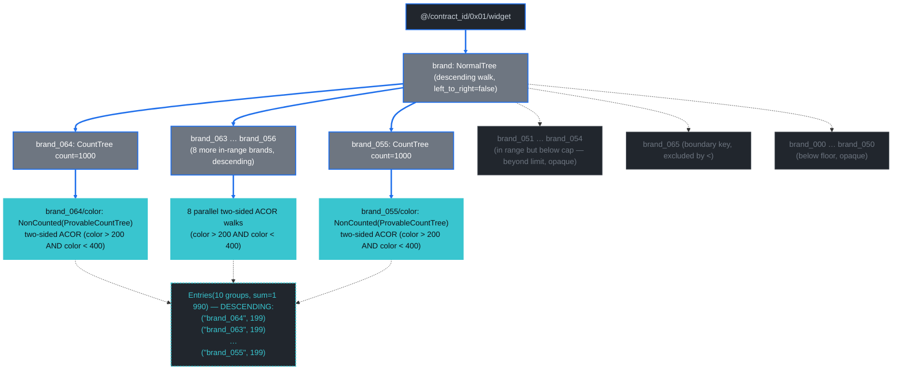
```mermaid
flowchart TB
  WD["@/contract_id/0x01/widget"]:::tree
  WD ==> BR["brand: NormalTree (descending walk, left_to_right=false)"]:::path
  BR ==> B064["brand_064: CountTree count=1000"]:::path
  BR ==> BMore["brand_063 … brand_056<br/>(8 more in-range brands, descending)"]:::path
  BR ==> B055["brand_055: CountTree count=1000"]:::path
  BR -.-> BBelow["brand_051 … brand_054<br/>(in range but below cap — beyond limit, opaque)"]:::faded
  BR -.-> BAbove["brand_065 (boundary key, excluded by &lt;)"]:::faded
  BR -.-> BCapBelow["brand_000 … brand_050<br/>(below floor, opaque)"]:::faded

  B064 ==> B064_C["brand_064/color: NonCounted(ProvableCountTree)<br/>two-sided ACOR (color > 200 AND color < 400)"]:::target
  BMore ==> BMore_C["8 parallel two-sided ACOR walks<br/>(color > 200 AND color < 400)"]:::target
  B055 ==> B055_C["brand_055/color: NonCounted(ProvableCountTree)<br/>two-sided ACOR (color > 200 AND color < 400)"]:::target

  SDK["Entries(10 groups, sum=1 990) — DESCENDING:<br/>(&quot;brand_064&quot;, 199)<br/>(&quot;brand_063&quot;, 199)<br/>…<br/>(&quot;brand_055&quot;, 199)"]:::sdk
  B064_C -.-> SDK
  BMore_C -.-> SDK
  B055_C -.-> SDK

  classDef tree fill:#21262d,color:#c9d1d9,stroke:#1f6feb,stroke-width:2px;
  classDef path fill:#6e7681,color:#fff,stroke:#1f6feb,stroke-width:2px;
  classDef faded fill:#21262d,color:#6e7681,stroke:#484f58;
  classDef target fill:#39c5cf,color:#0d1117,stroke:#39c5cf,stroke-width:3px;
  classDef sdk fill:#21262d,color:#39c5cf,stroke:#39c5cf,stroke-width:2px,stroke-dasharray: 4 2;

  linkStyle 0 stroke:#1f6feb,stroke-width:3px;
  linkStyle 1 stroke:#1f6feb,stroke-width:3px;
  linkStyle 2 stroke:#1f6feb,stroke-width:3px;
  linkStyle 3 stroke:#1f6feb,stroke-width:3px;
  linkStyle 7 stroke:#1f6feb,stroke-width:3px;
  linkStyle 8 stroke:#1f6feb,stroke-width:3px;
  linkStyle 9 stroke:#1f6feb,stroke-width:3px;
```

### Diagram: per-layer merk-tree structure (Layer 5+)

L5 is identical to G7 / G8 (widget doctype with `brand` queried). L6 differs from G8 in two ways: the outer query item is `RangeAfterTo` (bounded) rather than `RangeAfter` (half-open), and every op is `PushInverted` rather than `Push` because of `left_to_right = false`. L7 + L8 fork into 10 parallel descents, each carrying a **two-sided** ACOR boundary walk over `color > "color_00000200" AND color < "color_00000400"` instead of G8's one-sided `color > "color_00000500"`.

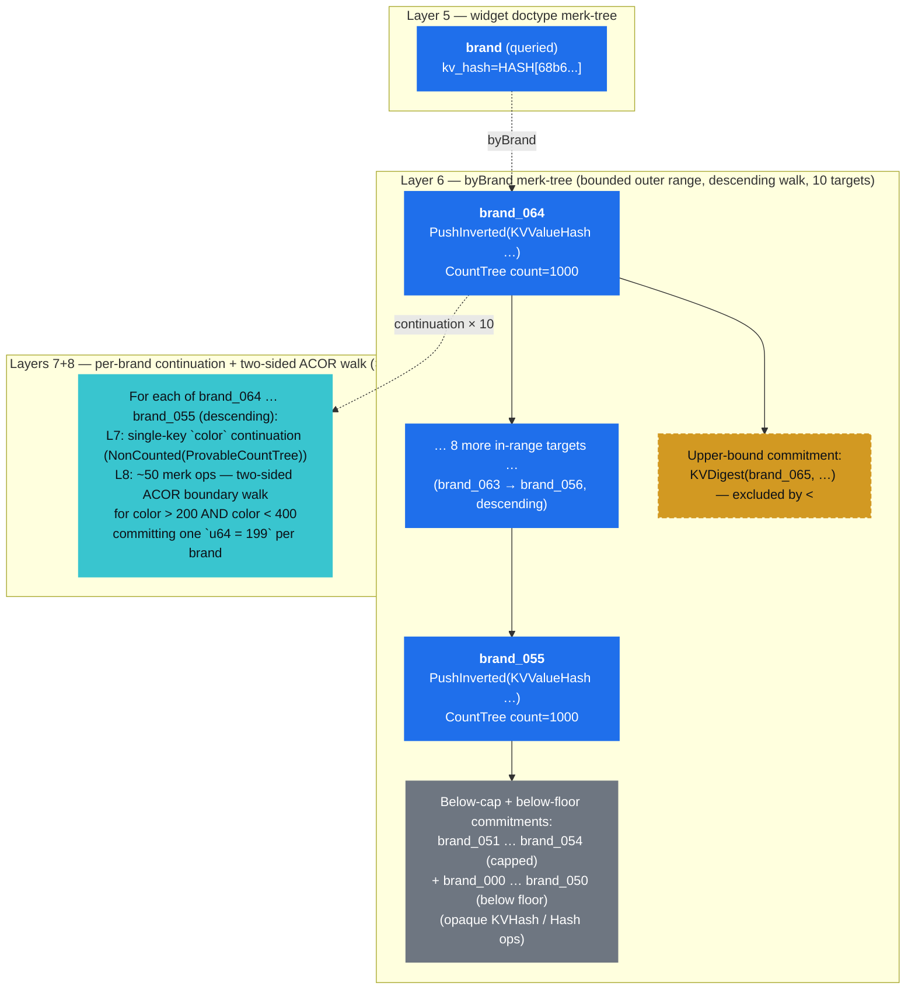
```mermaid
flowchart TB
  subgraph L5["Layer 5 — widget doctype merk-tree"]
    direction TB
    L5_q["<b>brand</b> (queried)<br/>kv_hash=HASH[68b6...]"]:::queried
  end

  subgraph L6["Layer 6 — byBrand merk-tree (bounded outer range, descending walk, 10 targets)"]
    direction TB
    L6_t064["<b>brand_064</b><br/>PushInverted(KVValueHash …)<br/>CountTree count=1000"]:::queried
    L6_tmid["… 8 more in-range targets …<br/>(brand_063 → brand_056, descending)"]:::queried
    L6_t055["<b>brand_055</b><br/>PushInverted(KVValueHash …)<br/>CountTree count=1000"]:::queried
    L6_upper["Upper-bound commitment:<br/>KVDigest(brand_065, …) — excluded by &lt;"]:::boundary
    L6_lower["Below-cap + below-floor commitments:<br/>brand_051 … brand_054 (capped)<br/>+ brand_000 … brand_050 (below floor)<br/>(opaque KVHash / Hash ops)"]:::sibling

    L6_t064 --> L6_tmid
    L6_tmid --> L6_t055
    L6_t064 --> L6_upper
    L6_t055 --> L6_lower
  end

  subgraph L7L8["Layers 7+8 — per-brand continuation + two-sided ACOR walk (×10)"]
    direction TB
    L7L8_each["For each of brand_064 … brand_055 (descending):<br/>L7: single-key `color` continuation (NonCounted(ProvableCountTree))<br/>L8: ~50 merk ops — two-sided ACOR boundary walk<br/>for color > 200 AND color < 400<br/>committing one `u64 = 199` per brand"]:::target
  end

  L5_q -. "byBrand" .-> L6_t064
  L6_t064 -. "continuation × 10" .-> L7L8_each

  classDef queried fill:#1f6feb,color:#fff,stroke:#1f6feb,stroke-width:2px;
  classDef sibling fill:#6e7681,color:#fff,stroke:#6e7681;
  classDef target fill:#39c5cf,color:#0d1117,stroke:#39c5cf,stroke-width:3px;
  classDef boundary fill:#d29922,color:#0d1117,stroke:#d29922,stroke-width:2px,stroke-dasharray: 6 3;
```

**The size delta between G8 and G8a, per outer match**: ~1 700 B (G8) → ~2 800 B (G8a). The extra ~1 100 B per brand is roughly evenly split between (a) the bounded inner ACOR's second boundary walk and (b) the per-op `PushInverted` discriminant overhead. Both costs are linear in `L` (the platform-max outer cap), so doubling `L` doubles the delta. The asymptotic complexity stays `O(L · (log B + log C'))` — the bounded-vs-unbounded distinction is a constant-factor change in the per-walk boundary commit count, not a complexity-class change.

**Reading the descending result**: the SDK returns `Vec<(Vec<u8>, u64)>` in the same wire order grovedb walked the outer dimension. For `left_to_right = false`, that's lex-descending serialized brand keys (`brand_064` before `brand_063` before … before `brand_055`). Callers that expect ascending output sort the result client-side; the prove-path guarantee is on the *contents* (which brands and which counts), not the client-visible ordering — though for chapter-fixture-deterministic proofs the ordering IS visible in the proof bytes via `Push` vs `PushInverted`, so the verifier knows which direction grovedb walked.

## G8b — Two-range carrier with `group_by = [brand, color]` (rejected)

```text
select   = COUNT
where    = brand > "brand_050" AND color > "color_00000500"
group_by = [brand, color]
prove    = true
```

**Outcome:** `Err(QuerySyntaxError::InvalidWhereClauseComponents("count query supports at most one range where-clause; combine two-sided ranges via `between*` instead of separate `>` / `<` clauses, or use `group_by = [outer_range_field]` with `prove = true` for the carrier-aggregate shape with one outer range and one inner ACOR range on a different field"))` — at [`detect_mode`](https://github.com/dashpay/platform/blob/v4.0-dev/packages/rs-drive/src/query/drive_document_count_query/mode_detection.rs)'s `range_count > 1` short-circuit, before any index picking or path-query building.

**Why.** The two-range carrier shape (`outer_range AND inner_range` on distinct fields) is opened by mode detection **only** when `mode == GroupByRange` *and* `group_by.len() == 1` *and* `prove = true`. G8b violates the first two: with `group_by = [brand, color]` the request maps to `CountMode::GroupByCompound`, which routes to `distinct_count_path_query` — a builder that knows how to walk an `In + range` fan-out but not a `range + range` cartesian product. Two design points:

- **`GroupByCompound` is specifically the `(In, range)` shape.** Its path-query builder emits outer `Key(serialized_in_value)` items (one per In branch) and an inner `Range*` subquery; the walk is `|In|`-bounded by construction. Extending it to accept `range + range` would mean replacing the outer `Key`s with an outer `Range*` (and a `SizedQuery::limit` to bound the walk) **and** swapping the inner from "enumerate distinct values" to "single ACOR aggregate" — at which point the result shape stops being "per-distinct-value entries" and becomes "per-outer-key `u64`s," i.e. G8's shape with a redundant second group_by field. There's no information gain from adding `color` to the group_by — the carrier already commits one `u64` per outer `brand`, and the inner range collapses into that `u64` rather than being enumerated.
- **The carrier primitive returns one `u64` per outer key, not per `(outer, inner)` pair.** Per-distinct-color counts inside an outer-range brand walk would require the alternative `RangeDistinctProof` shape (the G5 compound-distinct path) running on a `byBrandColor + rangeCountable: true` cartesian fan-out — which works for `In + range` (a finite outer key set) but would explode for `range + range` (potentially `B × C'` distinct entries, dwarfing the `MAX_CARRIER_AGGREGATE_OUTER_RANGE_LIMIT = 10` cap that bounds G8). The dispatcher rejects rather than silently routing to a path that'd produce a proof orders of magnitude larger than the caller likely expected.

**What to use instead.**

- If you want per-brand totals across an in-range color window (the most common interpretation of this request), use G8 (`group_by = [brand]`): one `u64` per brand, capped at 10 outer matches.
- If you want per-`(brand, color)` distinct counts across both ranges, the dispatcher has no path today — you'd need a `byBrandColor + rangeCountable: true` index plus a new mode that extends `GroupByCompound` to `range + range` with a per-pair `SizedQuery::limit`. Out of scope for this contract.
- If you want a single sum across the whole `brand > X AND color > Y` window, you'd need to call G8 and sum the returned `u64`s client-side (server-side aggregation across the carrier's per-branch counts isn't supported on the prove path — see G8c below).

## G8c — Two-range carrier with `group_by = []` (rejected)

```text
select   = COUNT
where    = brand > "brand_050" AND color > "color_00000500"
group_by = []
prove    = true
```

**Outcome:** same rejection as G8b — `Err(QuerySyntaxError::InvalidWhereClauseComponents("count query supports at most one range where-clause; …"))`. Mode-detection's `range_count > 1` short-circuit checks `mode == GroupByRange`, and the dispatcher maps `group_by = []` to `CountMode::Aggregate`, so the check fails for the same structural reason as G8b.

**Why.** With no `group_by` the request asks for a single scalar `u64` covering every document matching both ranges. The carrier-ACOR primitive emits one `u64` *per outer-range key* (10 brands in G8's case), not a single sum across the whole walk. Two paths to a single sum, neither viable today:

- **Server-side sum across the carrier's branches.** Would require a new grovedb primitive that takes the carrier shape and emits `Σ branch_counts` as a single ACOR-style aggregate. Not implemented — the carrier's commitment is *per branch*, which is what gives the verifier the cryptographic granularity to verify each entry independently. Summing in the server would lose that and force the verifier to trust the server's sum.
- **Client-side sum after running G8.** Allowed and easy — call G8, get back `Vec<(brand, u64)>`, sum the `u64`s. The proof still cryptographically commits to each branch, and the client's sum is over verified data. This is the pragmatic path for "give me one number" callers; the chapter recommends it instead of opening up `Aggregate` for the two-range carrier shape.

**The deeper reason `Aggregate` can't shortcut this.** Per [chapter 29's Q7 (Range Aggregate `byColor`)](./count-index-examples.md#query-7--range-aggregate-bycolor), `Aggregate + single range` uses the leaf-level `AggregateCountOnRange` primitive directly, which DOES return a single `u64`. That works because the range is rooted at the index's *terminator* property — there's a single CountTree under which the boundary walk runs. With G8c's two ranges, the *outer* range walks the byBrand merk tree (no `ProvableCountTree` involved) and only the inner range hits the rangeCountable terminator. Collapsing across the outer walk would mean a `ProvableCountTree` over CountTrees, which grovedb's primitive set doesn't have. The walk could in principle compute and emit a sum at the outer layer, but the verifier wouldn't be able to recompute the per-branch counts to check the sum — defeating the prove-path's whole point.

## Future Work

This chapter now mirrors chapter 29's per-query structure: every section above carries a path query, verified payload, proof size, verbatim or schematic proof display, narrative, conceptual flowchart, and per-layer merk-tree diagram.

Two pieces of infrastructure made this possible:

- `query_g1_*` … `query_g8_*` criterion `bench_function` calls (the series skips `g6`) in [`document_count_worst_case.rs`](https://github.com/dashpay/platform/blob/v4.0-dev/packages/rs-drive/benches/document_count_worst_case.rs) — produce the **Avg time** column in [Queries in this Chapter](#queries-in-this-chapter).
- `display_group_by_proofs` (a sibling of `display_proofs` in the same bench file) — emits each `group_by` shape's verbatim merk-proof structure via bincode decode + `GroveDBProof::Display`. Tagged with `[gproof]` prefix in stderr so reviewers can grep deterministically.

Open follow-ups:

1. **Inline the full G4 / G5 / G1b verbatim** rather than the schematic-with-elision form. The bench captures every byte; the chapter's `<details>` blocks currently summarise the 100-target enumerations because reproducing 100 near-identical `KVValueHashFeatureTypeWithChildHash` lines per case is more noise than signal. If a reader needs byte-exact output, they can run the bench and grep `[gproof]`.
2. **Wire path-query reconstruction + verified-payload printing into `display_group_by_proofs`**. Today it only dumps the proof-display block; chapter 29's `display_proofs` also reconstructs the `PathQuery` and prints the verifier's structured result (the `verified:` block). Adding that to the group_by side would give the chapter parity with chapter 29's `verified:` sections — currently rendered manually from the `[matrix]` output's `Entries(len=N, sum=M)` figures.
3. **A high-fanout byColor variant of G1b** (`color IN [100 values]`, `group_by = [color]`) — captured implicitly in the bench's existing `group_by_color_in_proof_100_rangecountable_branches` (10 512 B) but not given its own G* section, since it's structurally G1b with `ProvableCountTree` overhead.

## Cross-Reference to Chapter 29

For background on the building blocks every query in this chapter uses:

- [Document Count Trees](./document-count-trees.md) — `CountTree` / `ProvableCountTree` / `NormalTree` mechanics.
- [Count Index Examples § How To Read The Proofs](./count-index-examples.md#how-to-read-the-proofs) — the four-section per-query template plus the `LayerProof` / `Merk` / `Push` / `Parent` / `Child` op grammar.
- [Count Index Examples § Worked Example: How `node_hash_with_count` Rebuilds the Merk Root](./count-index-examples.md#worked-example-how-node_hash_with_count-rebuilds-the-merk-root) — exact Blake3 formulas underpinning every count proof in either chapter.

The path-query builder (`packages/rs-drive/src/query/drive_document_count_query/path_query.rs`) and verifier mirror (`packages/rs-drive/src/verify/document_count/`) live in the same modules for both chapters' queries — the only difference is which `point_lookup_*` / `aggregate_*` / `distinct_count_*` / `carrier_aggregate_*` function the dispatcher calls based on the `CountMode` carried in the request.
