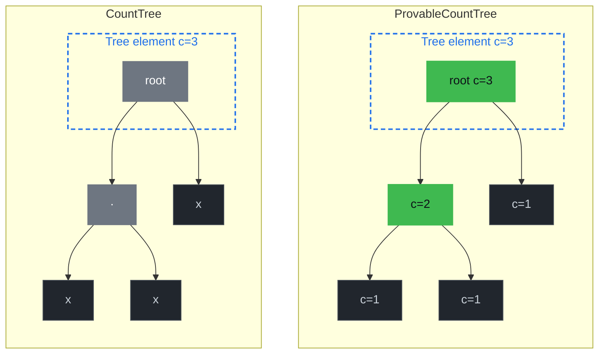
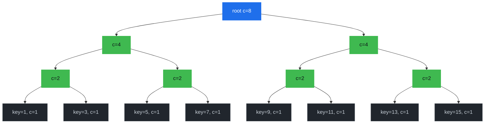

# Document Count Trees

Counting the documents that match a query used to mean fetching them and calling `.len()`. From protocol v12 (Platform 3.1) onward, document types can opt into a different primary-key tree variant that maintains a running count inside the tree itself, turning `count(*)`-style queries into an O(1) lookup. This chapter explains the three tree variants, how a document type selects one, and the two query endpoints that expose the feature.

## Why Count Trees Exist

The default primary-key tree for a document type is a `NormalTree`. To count the documents in it, Drive walks the subtree, deserializes every record, and returns the length of the resulting collection. That is fine for small types but becomes painful as soon as a UI needs "how many widgets are there?" on a contract with millions of widgets.

GroveDB has two count-aware tree variants. **Both are provable** — the count is committed to the Merkle root in each case — but they differ in *where* counts are stored inside the tree, and that controls which kinds of count queries can be answered without enumerating leaves:

- `CountTree` — stores a single `u64` count, at the root of the tree. The total document count is one read; any per-subtree count requires walking down to that subtree's root and reading its (separate) tree element.
- `ProvableCountTree` — stores a `u64` count at *every* internal node, not just the root. Each node's count covers everything in the subtree below it, so range queries like "how many items between key A and key B?" or "how many items per value of an indexed property?" can be answered by walking the boundary nodes and summing their pre-computed counts, without touching any leaf.

GroveDB merk trees are binary — each internal node has exactly a left and a right child:

*The dashed box is the wrapping `Element` (the "tree" in grovedb terms) and contains the root node of the merk tree. Both variants store the total count on the wrapping element — that's the O(1) field Drive reads for total counts. The difference is what's inside: in a `CountTree` the merk root and the rest of the tree don't carry the count, so only the wrapper has it. In a `ProvableCountTree` the count is *also* stored on the root node itself and on every internal merk-tree node, so it's committed into the merk root hash and provable per-subtree.*



In a `CountTree`, the only count-bearing node is the root. To compute "how many items per value of property `P`?" you'd have to navigate to each value-keyed *subtree* (a separate grovedb tree, not a child node of the binary structure above), read its root count, and pay for a separate proof per read — *N* reads for *N* distinct values. In a `ProvableCountTree`, every internal node along the binary path already carries the count of its left and right subtrees, so a range query like "items in [a, b]" or "items per value of P" walks only the boundary path and sums the pre-committed sub-counts in a single traversal and a single proof.

A document type opts in via two schema flags:

- `documentsCountable: true` → primary-key tree is a `CountTree`. Enables O(1) total-count for the document type; sufficient for `GetDocumentsCount` with no `where` filter.
- `rangeCountable: true` → primary-key tree is a `ProvableCountTree`. Implies `documentsCountable`. The same flag is also accepted *per-index*, where it controls range-count storage layout (see below) and is required for any `GetDocumentsCount` request that carries a range where-clause.

## How a Document Type Picks Its Tree Variant

Selection lives in [`packages/rs-drive/src/drive/document/primary_key_tree_type.rs`](https://github.com/dashpay/platform/blob/v3.1-dev/packages/rs-drive/src/drive/document/primary_key_tree_type.rs):

```rust
impl DocumentTypePrimaryKeyTreeType for DocumentTypeRef<'_> {
    fn primary_key_tree_type(
        &self,
        platform_version: &PlatformVersion,
    ) -> Result<TreeType, Error> {
        match platform_version
            .drive
            .methods
            .document
            .primary_key_tree_type
        {
            0 => {
                if self.range_countable() {
                    Ok(TreeType::ProvableCountTree)
                } else if self.documents_countable() {
                    Ok(TreeType::CountTree)
                } else {
                    Ok(TreeType::NormalTree)
                }
            }
            version => Err(Error::Drive(DriveError::UnknownVersionMismatch {
                method: "DocumentTypeRef::primary_key_tree_type".to_string(),
                known_versions: vec![0],
                received: version,
            })),
        }
    }
}
```

`primary_key_tree_type()` is the single source of truth — every Drive code path that needs to know which tree variant to read from or write to routes through this helper, including:

- Contract insert and update (to `CREATE` the right tree element when the document type is added).
- Document insert / delete (to know how to update the count alongside the document).
- Cost estimation (so fees match the variant that will actually be used).

The contract insert/update paths use three thin `Drive` helpers parallel to the existing `batch_insert_empty_tree` / `batch_insert_empty_sum_tree`:

- `batch_insert_empty_tree` — NormalTree.
- `batch_insert_empty_count_tree` — CountTree, used when `documents_countable() && !range_countable()`.
- `batch_insert_empty_provable_count_tree` — ProvableCountTree, used when `range_countable()`.

Each helper goes through `LowLevelDriveOperation::for_known_path_key_empty_*_tree` (or its `_estimated_path_key_*` cousin in cost-estimation paths), so the contract setup, document operations, and proof generation all see the same on-disk shape.

## Storage-Layout Invariants

Because the tree variant is fixed at contract-creation time and baked into how the tree element is laid out on disk, two flags are *immutable* across a contract update:

- Changing `documents_countable` from any state to any other state on a `validate_config` update returns `DocumentTypeUpdateError`.
- Same for `range_countable`.

Tests pinning these guards live in `packages/rs-dpp/src/data_contract/document_type/methods/validate_update/v0/mod.rs`. Don't relax them: if a `NormalTree`-backed document type were silently switched to `CountTree` mid-contract, every subsequent insert or delete would update a count value attached to a tree element that physically isn't a count tree, leading to grovedb element-shape errors at best and consensus drift at worst.

## Counting Documents at Query Time

A single unified gRPC endpoint exposes the feature: `GetDocumentsCount`. The response shape varies by request mode (total / per-`In`-value / per-distinct-value-in-range / total-over-range), see [Range Modes](#range-modes) below. The endpoint also has two underlying paths (prove vs. no-prove); both modes are valid in either path with the exception of `return_distinct_counts_in_range = true` which is no-prove only.

### No-Prove (Server-Side O(1) or O(log n))

When `prove=false`, drive-abci calls into `DriveDocumentCountQuery` (in [`packages/rs-drive/src/query/drive_document_count_query/mod.rs`](https://github.com/dashpay/platform/blob/v3.1-dev/packages/rs-drive/src/query/drive_document_count_query/mod.rs)). The handler picks a path based on the where clauses:

**Equal/In only** ([`execute_no_proof`](https://docs.rs/drive/latest/drive/query/struct.DriveDocumentCountQuery.html#method.execute_no_proof)):

1. Pick a `CountTree`-typed primary-key index whose properties cover all `Equal` / `In` `WhereClause` predicates (a covering index — see the supported-operators note below).
2. Walk the tree from the root down to the deepest covered level, pushing `prop_name` and `serialize_value_for_key(prop_name, value)` at each step. `Equal` extends one path; `In` clones the current path once per value in its array (a cartesian fork) and the per-branch counts are summed.
3. If every index property was covered: read the `CountTree` element at the resulting path and return its built-in `u64` count. O(1) per branch.
4. If only a prefix was covered: sum the counts of all `CountTree` children at the deepest covered level.

If the request carries an `In` clause, the response emits one `CountEntry` per `In` value (the per-value split mode). Otherwise the response is a single `CountEntry` with empty `key`.

**Range** ([`execute_range_count_no_proof`](https://docs.rs/drive/latest/drive/query/struct.DriveDocumentCountQuery.html#method.execute_range_count_no_proof)):

1. Pick a `range_countable: true` index where the Equal/In clauses cover the prefix and the range operator hits the index's last property.
2. Build the path `[contract_doc, doctype, prefix..., range_prop_name]` — pointing at the property-name `ProvableCountTree`.
3. Issue a grovedb path query with the converted range `QueryItem` (`>`, `>=`, `<`, `<=`, `Range`, `RangeInclusive`, `RangeAfter`, `RangeAfterTo`, `RangeAfterToInclusive`) and walk the children whose keys lie inside the range.
4. Each child's `count_value_or_default()` is the doc count at that property value. Either sum all per-value counts (summed mode) or emit them as per-value `CountEntry`s (distinct mode), then apply order / cursor / limit.

### Prove (Client-Side Verify-Then-Aggregate or Aggregate-Count Proof)

When `prove=true`, the proof shape depends on whether the query carries a range clause.

**With a range clause**: drive-abci builds a grovedb [`AggregateCountOnRange`](https://docs.rs/grovedb/latest/grovedb/struct.GroveDb.html#method.verify_aggregate_count_query) path query against the same property-name `ProvableCountTree` the no-prove path walks, and `get_proved_path_query` produces an aggregate-count proof. The client verifies via `GroveDb::verify_aggregate_count_query` and recovers `(root_hash, count)` directly — no documents are ever materialized server-side or client-side. `return_distinct_counts_in_range = true` is rejected on this path because the merk-level primitive returns one number, not per-distinct entries; if you want per-distinct entries with a range, use `prove = false`.

**Without a range clause** (point-lookup with prove): drive-abci falls back to a standard `DriveDocumentQuery` proof of the matching documents themselves — there is no signed-count primitive for `CountTree`-direct point lookups today. The client verifies the proof, deserializes the documents, and aggregates locally:

- For total counts the aggregation is `documents.len() as u64` ([`packages/rs-drive-proof-verifier/src/proof/document_count.rs`](https://github.com/dashpay/platform/blob/v3.1-dev/packages/rs-drive-proof-verifier/src/proof/document_count.rs)).
- For per-`In`-value counts the aggregation walks each verified document, reads `properties.get(split_property)`, encodes the value via `document_type.serialize_value_for_key`, and increments the per-key counter.

Because the materialize-and-count proof path actually returns documents, drive-abci caps it at `u16::MAX` matching documents per request as a defensive bound on response size. Result sets larger than that need a covering countable index and `prove=false`, OR a covering `range_countable: true` index where the range proof primitive is unbounded. The SDK side explicitly clears the underlying `DocumentQuery.limit` so the verifier counts every document in the proof rather than truncating at the caller's pagination limit.

Aggregation for the per-`In`-value mode needs the split-property name, but `DriveDocumentQuery` does not carry it. The proof verifier exposes a dedicated entry point that takes it explicitly:

```rust
DocumentSplitCounts::maybe_from_proof_with_split_property(
    drive_query,
    split_property,
    response,
    network,
    platform_version,
    provider,
)
```

The generic `FromProof<Q>` impl on `DocumentSplitCounts` is intentionally *not* the way to reach split counts under proof — calling it returns an explicit error. This is a load-bearing design choice: an earlier version of this code silently returned `Some(BTreeMap::new())` from the generic path, so any caller using `prove=true` got a valid-looking but empty result. Erroring loudly forces every caller to thread the split property through.

### Supported Where Operators

The no-prove fast path covers three operator shapes:

- **`Equal` (`==`)** — single point lookup against the count tree at a fully-resolved index path. Picked by [`find_countable_index_for_where_clauses`](https://docs.rs/drive/latest/drive/query/struct.DriveDocumentCountQuery.html#method.find_countable_index_for_where_clauses).
- **`In` (`in`)** — cartesian fork. Each value in the `In` array becomes its own index path; their counts are summed (or, for split counts, merged by split key). An `In` clause with `k` values costs `k` point lookups, not a tree walk. The `In` clause also doubles as the per-value split signal in the unified `GetDocumentsCount` endpoint — at most one `In` per request.
- **Range** (`>`, `>=`, `<`, `<=`, `between*`) — walks the property-name `ProvableCountTree`'s children whose keys lie inside the range, reading each child `CountTree`'s count value. Picked by [`find_range_countable_index_for_where_clauses`](https://docs.rs/drive/latest/drive/query/struct.DriveDocumentCountQuery.html#method.find_range_countable_index_for_where_clauses); requires the index to have `range_countable: true` AND the range property to be the index's last property (the IndexLevel terminator).

`Equal`/`In` and range can both appear in one query: the `Equal`/`In` clauses cover the index's prefix, the single range clause hits the terminator. The handler returns `InvalidArgument` if more than one range clause is present (use `between*` to express two-sided ranges) or if `In` and range are mixed (the per-value split signal would be ambiguous).

`StartsWith` is rejected on the range path with a clear error — its grovedb encoding requires a byte-incremented upper bound that's not generic across key encodings. Use `between*` with explicit bounds instead.

#### Range Modes

A range query in the unified endpoint produces one of two response shapes, controlled by `return_distinct_counts_in_range`:

- **`return_distinct_counts_in_range = false`** (default) — single `CountEntry` with empty `key`, count = sum of the per-value `CountTree` counts within the range. Use for "how many widgets have color in `[red, tomato]`?".
- **`return_distinct_counts_in_range = true`** — one `CountEntry` per distinct property value within the range, key = serialized property value, count = `CountTree` count for that value. Use for "show me a histogram of widgets by color in `[red, tomato]`".

Distinct mode also accepts pagination knobs:

| Field | Effect |
|---|---|
| `order_by_ascending` | `true` (default) walks the range in BTreeMap natural order; `false` reverses |
| `start_after_split_key` | Skip entries up to AND including this serialized key; pair with `limit` to walk in chunks |
| `limit` | Truncate after `min(requested, max_query_limit)` entries; applied last (after order + cursor). **Unset (`None`) is normalized to `default_query_limit` before the cap is applied** — the server never walks an unbounded distinct-mode result set, even if the client omits the field. Clients that want a tight working-set should still set this explicitly. |

These knobs are ignored on summed mode (they have no defined meaning for a single aggregate).

#### Range Queries on the Prove Path

When `prove = true` and the query carries a range clause, the handler builds a grovedb [`AggregateCountOnRange`](https://docs.rs/grovedb/latest/grovedb/struct.GroveDb.html#method.verify_aggregate_count_query) proof. The client verifies via `GroveDb::verify_aggregate_count_query`, recovering `(root_hash, count)` *without materializing any matching documents* — replacing the older materialize-and-count proof path that capped at `u16::MAX` matching docs. `return_distinct_counts_in_range = true` is rejected on the prove path because the merk-level primitive returns a single aggregate; per-distinct-value entries can't be expressed as one proof shape. `In` on prefix properties is similarly rejected on the prove path (the aggregate primitive lifts only one inner range).

For point-lookup count proofs (no range clause), the handler still falls back to the materialize-and-count flow with the `u16::MAX` cap. A future change can wire per-`CountTree` count proofs through a similar aggregate primitive.

## Range Queries and ProvableCountTree

Range count queries (`>`, `<`, `between*`) over an index with `range_countable: true` are answered in O(log n) by walking the property-name `ProvableCountTree`'s boundary nodes. The proof path uses grovedb's `AggregateCountOnRange`, which lets clients verify a range count without ever materializing the underlying documents.

> Offset-style queries ("the next 50 items starting after item 7") are a separate primitive that will likely build on the same `ProvableCountTree` shape. They are not exposed via `GetDocumentsCount` today — the existing `start_after_split_key` cursor on the count endpoint is for *paginating per-distinct-value entries* in distinct-mode, not for offsetting into the underlying documents.

### Why Internal-Node Counts Make Range Counts O(log n)

In a sorted merk tree the keys partition into a left (smaller) and right (larger) subtree at every internal node. To answer a question like "how many items have a key strictly greater than 7?" you walk the boundary between "below 7" and "above 7" from the root down, and at each step you can decide what to do with the *other* subtree — the one not on the boundary path — based on a single read:

- If a subtree lies entirely above the cutoff, add its full count and don't descend into it.
- If it lies entirely below, ignore it (contributes 0) and don't descend.
- If it straddles the cutoff, recurse into it (it is then the next step on the boundary path).

On a `ProvableCountTree` every internal node carries the count of its left and right subtrees, so the "add the full count" step is a single O(1) read of the node we're already touching. The whole walk visits one node per tree level — O(log n) — and every visited node is on the boundary path. The total ends up as a sum of pre-committed sub-counts plus zero or one straddle leaf at the bottom.

Concretely, picture a `ProvableCountTree` of 8 items with sorted integer keys 1, 3, 5, 7, 9, 11, 13, 15 — three full levels of internal nodes plus a leaf row:



For "give me the count of items with key > 6":

- **root (c=8)**: 6 falls inside the left subtree (which holds 1–7). Read both children's sub-counts. Right subtree's keys are all > 6 → take its full `c=4` and don't descend. Recurse into left.
- **left (c=4)**: 6 falls inside its right subtree (which holds 5,7). Read both children. Left-left's keys (1,3) are both ≤ 6 → contribute 0 and don't descend. Recurse into left-right.
- **left-right (c=2)**: 6 splits this leaf-pair. Read both leaves. Key 5 ≤ 6 → contribute 0. Key 7 > 6 → contribute 1.
- Total = 4 (right of root) + 0 (left-left) + 0 (key=5) + 1 (key=7) = **5**.

We visited 4 internal nodes on the boundary path (root → left → left-right → key=7) and read sub-counts off 3 siblings (right, left-left, key=5) without descending into them. Six of the eight items were never enumerated: their counts were summed straight out of the committed sub-count fields. The walk is O(log n) in tree depth regardless of how many items live under each skipped subtree.

### Why This Is Provable

A merk proof of the same boundary walk includes:

1. The boundary path from root to the leaf adjacent to the cutoff.
2. The siblings of every node on the boundary path (so the verifier can recompute hashes up to the merk root).

Each sibling node, on a `ProvableCountTree`, ships its committed sub-count alongside its hash. The verifier walks the same logic the server did — "this sibling lies entirely above 7, add its `c=…` value" — and ends up with the same total without enumerating the sibling subtrees. Verification is also O(log n).

The same primitive answers any range query of the form `[A, B]`: walk to the cutoff at A, then to the cutoff at B, and combine sub-counts along the way. `[A, ∞)` and `(-∞, B]` are special cases.

## Authoring a Contract That Uses Count Trees

There are two opt-in surfaces in the document meta-schema. They're independent and can be used together:

1. **Top-level flags on the document type** control the *primary-key* tree variant — the tree that stores documents keyed by document ID. This is what `GetDocumentsCount` (with no equality predicates) reads.
2. **A per-index `countable: true` flag** controls whether *that specific index's* tree carries counts. This is what enables the no-prove fast path for queries that filter by the index's leading equality columns.

### Primary-Key Tree Flags

Set at the same level as `type` / `properties` / `indices` on a document type:

```json
{
  "widget": {
    "type": "object",
    "documentsCountable": true,
    "properties": {
      "name":  { "type": "string",  "position": 0, "maxLength": 64 },
      "color": { "type": "string",  "position": 1, "maxLength": 16 }
    },
    "additionalProperties": false
  }
}
```

That contract gets a `CountTree` for the `widget` primary-key tree. `GetDocumentsCount` for `widget` with no `where` filter is now an O(1) lookup of the tree element's count value.

To opt into a `ProvableCountTree` for the *primary-key* tree instead — useful if you want range queries on the primary key in the future, or if you intend to use this document type behind range proof primitives — set `rangeCountable: true` at the document-type level. It implies `documentsCountable`, so you don't need both:

```json
{
  "widget": {
    "type": "object",
    "rangeCountable": true,
    "properties": {
      "name":  { "type": "string",  "position": 0, "maxLength": 64 },
      "color": { "type": "string",  "position": 1, "maxLength": 16 }
    },
    "additionalProperties": false
  }
}
```

These two flags are *immutable* across a contract update. You pick the tree variant at contract creation; you can't switch to a different one later without creating a new document type. (See **Storage-Layout Invariants** above.)

### Per-Index Countable Flag

Set on a single entry in the document type's `indices` array:

```json
{
  "widget": {
    "type": "object",
    "documentsCountable": true,
    "properties": {
      "name":  { "type": "string",  "position": 0, "maxLength": 64 },
      "color": { "type": "string",  "position": 1, "maxLength": 16 }
    },
    "indices": [
      {
        "name": "byColor",
        "properties": [{ "color": "asc" }],
        "countable": true
      }
    ],
    "additionalProperties": false
  }
}
```

With `byColor.countable: true` the `byColor` index's tree carries counts, so `GetDocumentsCount` with `where: [["color", "==", "red"]]` reaches the count via that index in O(1) instead of falling back to a scan. Without the flag, `find_countable_index_for_where_clauses` will skip this index and the count won't take the fast path.

The `countable` field accepts three forms:

| JSON value | Tree variant | Capabilities |
|---|---|---|
| `false` (or omitted, or `"notCountable"`) | `NormalTree` | No count fast path |
| `true` (or `"countable"`) | `CountTree` | O(1) totals at the root |
| `"countableAllowingOffset"` | `ProvableCountTree` | O(1) totals **plus** per-node counts that will enable future O(log n) range / offset queries on this index |

The boolean `true` / `false` form is kept for back-compat with contracts written before the enum form was introduced; new contracts should prefer the explicit string variants for clarity, especially `"countableAllowingOffset"` when range/offset queries are wanted.

A few notes about the index-level flag:

- Setting any countable variant increases storage cost — every insert and delete updates the index tree's count alongside the document. `"countableAllowingOffset"` costs more than plain `"countable"` (every internal node carries count metadata, not just the root). Don't sprinkle it on every index; opt in for the ones you'll actually count by, and use the cheaper variant unless you specifically need the offset capability.
- The flag is on the *whole* index, not per-property. The index handles `count(*)` queries whose equality `where` clauses cover the index's properties **exactly**, in order. A `["color", "size"]` countable index gives you O(1) counts for `WHERE color = X AND size = Y` — but for `WHERE color = X` alone (only the leading prefix matched) the count is computed by walking every distinct-`size` bucket under `color = X` and summing their counts. That works and avoids document enumeration, but it scales with the cardinality of `size`, not constant time. If single-column `WHERE color = X` counts are a hot path, add a separate `["color"]` countable index.
- Index-level countable is independent of the primary-key flags. You can have `documentsCountable: true` on the document type AND `countable: true` on a specific index — the first gives you fast totals, the second gives you fast filtered counts that match that index.
- **`countable` on a `unique` index is mostly a no-op, but not always.** A unique index stores its terminal as a bare reference at key `[0]` rather than wrapping it in a count tree, so for documents whose indexed fields are *all* non-null the flag has no storage effect — insertion bypasses the count-tree code entirely. It does still do meaningful work for **null-bearing** entries: when a document has any null value among the indexed properties, insertion takes the same count-tree branch a non-unique index uses (because uniqueness can't be enforced on null), and the count tree at that path aggregates them. So `countable` on a unique index is worth setting when at least one of the indexed properties is optional in the schema and you expect null values; otherwise it's an inert flag. Counts on all-non-null exact matches still return correctly (1 if present, 0 if not) because the on-disk reference reads as count 1 via grovedb's default-aggregate semantics.

### Choosing What to Set

| You want | Set |
|---|---|
| Fast `count(*)` for the whole document type | `documentsCountable: true` on the document type |
| O(1) filtered count: `count(*) WHERE col = X` | `documentsCountable: true` (or `rangeCountable: true`) at the type level **plus** `countable: true` on an index whose properties are exactly `["col"]`. A composite index whose leading column is `col` (e.g. `["col", "other"]`) still answers the query, but as O(distinct values of `other`) instead of O(1). |
| Per-`In`-value sub-counts: one `CountEntry` per value in an `In` clause | `documentsCountable: true` plus `countable: true` on an index whose leading columns cover any other equality predicates and whose next column is the `In` property |
| O(log n) range count: `count(*) WHERE col BETWEEN A AND B` | `rangeCountable: true` on an index whose last property is `col` and whose other properties cover any equality predicates as a prefix. Implies `countable: true`. |
| Per-distinct-value range histogram: one `CountEntry` per distinct value in a range | Same `rangeCountable: true` index as above, plus `return_distinct_counts_in_range = true` on the request (no-prove path only). |
| Range count proof (`prove = true` + range clause) | Same `rangeCountable: true` index. The handler uses grovedb's `AggregateCountOnRange` proof primitive, which is unbounded (no `u16::MAX` cap). |
| Future offset-style range queries (not yet released — see above) | `rangeCountable: true` on the document type |
| Nothing count-aware (default) | Don't set any of these flags. Primary-key tree stays a `NormalTree`. |

A migration check from `dapi-grpc` server logic: if you ask for `GetDocumentsCount` with a `where` clause, the no-prove path needs a covering countable index. If no such index exists for that document type, the call returns a clear `InvalidArgument` describing what the picker was looking for ("requires a `range_countable: true` index whose last property matches the range field" for range queries, or "requires a countable index" for Equal/In queries). Pick your indexes deliberately; per-index `countable: true` / `range_countable: true` flags are cheap to add at contract creation time and impossible to add later.

## SDK Access at Three Layers

### `rs-sdk` (native Rust)

Both endpoints land on the standard `Fetch` trait:

```rust
use dash_sdk::platform::documents::document_count_query::DocumentCountQuery;
use dash_sdk::platform::documents::document_split_count_query::DocumentSplitCountQuery;
use dash_sdk::platform::Fetch;
use drive_proof_verifier::{DocumentCount, DocumentSplitCounts};

let DocumentCount(count) = DocumentCount::fetch(
    &sdk,
    DocumentCountQuery::new(contract.clone(), "widget")?,
)
.await?
.expect("DocumentCount::fetch always returns a value on success");

let DocumentSplitCounts(splits) = DocumentSplitCounts::fetch(
    &sdk,
    DocumentSplitCountQuery::new(contract, "widget", "color")?,
)
.await?
.expect("DocumentSplitCounts::fetch always returns a value on success");
```

`DocumentCountQuery` and `DocumentSplitCountQuery` wrap an internal `DocumentQuery` (so they reuse where-clause / order-by / contract-id machinery) and expose a `with_where(WhereClause)` builder for filters. Both target the unified `GetDocumentsCountRequest`; the SDK derives the request mode (total / per-`In`-value / per-distinct-range / total-range) from the where clauses you supply.

### `wasm-sdk` (browser)

Four methods on the `WasmSdk` JS class:

```typescript
sdk.getDocumentsCount(query: DocumentsQuery): Promise<bigint>;
sdk.getDocumentsCountWithProofInfo(
  query: DocumentsQuery,
): Promise<ProofMetadataResponseTyped<bigint>>;

sdk.getDocumentsSplitCount(
  query: DocumentsQuery,
  splitProperty: string,
): Promise<Map<string, bigint>>;
sdk.getDocumentsSplitCountWithProofInfo(
  query: DocumentsQuery,
  splitProperty: string,
): Promise<ProofMetadataResponseTyped<Map<string, bigint>>>;
```

The split-count map's keys are *hex-encoded bytes*. They correspond to the canonical `serialize_value_for_key` encoding of each property value, so callers that need a typed key (`"red"`, `42`, etc.) need to hex-decode and interpret per the contract's index-property type. This shape matches the no-prove server response too, so a caller that wants to merge or compare count maps from both paths doesn't need a transformation step.

### `rs-sdk-ffi` (iOS / native bindings)

```rust
dash_sdk_document_count(sdk, data_contract, document_type, where_json)
    -> JSON {"count": <u64>}

dash_sdk_document_split_count(sdk, data_contract, document_type, split_property, where_json)
    -> JSON {"counts": {"<hex-key>": <u64>, ...}}
```

`where_json` is the same JSON shape `dash_sdk_document_search` already accepts (`[{field, operator, value}]`), so iOS callers can reuse their where-clause encoding. Both endpoints return their results as a JSON-encoded C string allocated on the heap — caller frees it via the standard SDK string-free routine.
