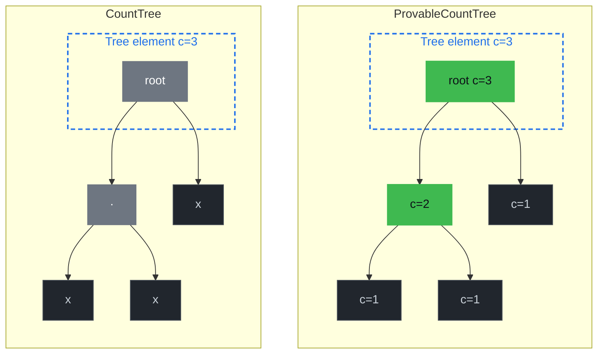
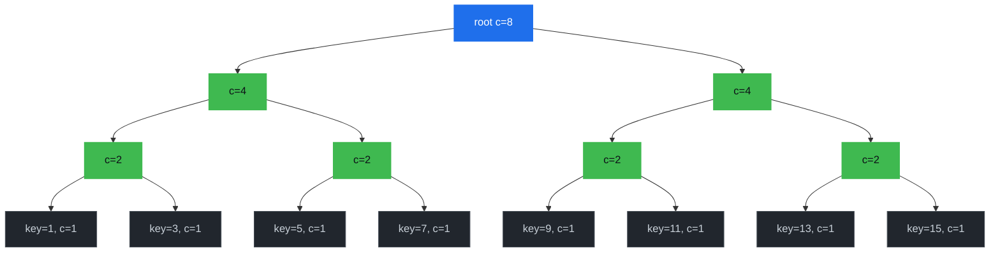

# Document Count Trees

Counting the documents that match a query used to mean fetching them and calling `.len()`. From protocol v12 (Platform 3.1) onward, document types can opt into a different primary-key tree variant that maintains a running count inside the tree itself, turning `count(*)`-style queries into an O(1) lookup. This chapter explains the three tree variants, how a document type selects one, and the two query endpoints that expose the feature.

## Why Count Trees Exist

The default primary-key tree for a document type is a `NormalTree`. To count the documents in it, Drive walks the subtree, deserializes every record, and returns the length of the resulting collection. That is fine for small types but becomes painful as soon as a UI needs "how many widgets are there?" on a contract with millions of widgets.

GroveDB has two count-aware tree variants. **Both are provable** — the count is committed to the Merkle root in each case — but they differ in *where* counts are stored inside the tree, and that controls which kinds of count queries can be answered without enumerating leaves:

- `CountTree` — stores a single `u64` count, at the root of the tree. The total document count is one read; any per-subtree count requires walking down to that subtree's root and reading its (separate) tree element.
- `ProvableCountTree` — stores a `u64` count at *every* internal node, not just the root. Each node's count covers everything in the subtree below it, so range queries like "how many items between key A and key B?" or "how many items per value of an indexed property?" can be answered by walking the boundary nodes and summing their pre-computed counts, without touching any leaf.

GroveDB merk trees are binary — each internal node has exactly a left and a right child:

*The dashed box is the wrapping `Element` (the "tree" in grovedb terms) and contains the root node of the merk tree. Both variants store the total count on the wrapping element — that's the O(1) field Drive reads for total counts. The difference is what's inside: in a `CountTree` the merk root and the rest of the tree don't carry the count, so only the wrapper has it. In a `ProvableCountTree` the count is *also* stored on the root node itself and on every internal merk-tree node, so it's committed into the merk root hash and provable per-subtree.*



In a `CountTree`, the only count-bearing node is the root. To compute "how many items per value of property `P`?" you'd have to navigate to each value-keyed *subtree* (a separate grovedb tree, not a child node of the binary structure above), read its root count, and pay for a separate proof per read — *N* reads for *N* distinct values. In a `ProvableCountTree`, every internal node along the binary path already carries the count of its left and right subtrees, so a range query like "items in [a, b]" or "items per value of P" walks only the boundary path and sums the pre-committed sub-counts in a single traversal and a single proof.

A document type opts in via two schema flags:

- `documentsCountable: true` → primary-key tree is a `CountTree`. Enables O(1) total-count for the document type; sufficient for `GetDocumentsCount` with no `where` filter.
- `rangeCountable: true` → primary-key tree is a `ProvableCountTree`. Implies `documentsCountable`. The same flag is also accepted *per-index*, where it controls range-count storage layout (see below) and is required for any `GetDocumentsCount` request that carries a range where-clause.

## How a Document Type Picks Its Tree Variant

Selection lives in [`packages/rs-drive/src/drive/document/primary_key_tree_type.rs`](https://github.com/dashpay/platform/blob/v4.0-dev/packages/rs-drive/src/drive/document/primary_key_tree_type.rs):

```rust
impl DocumentTypePrimaryKeyTreeType for DocumentTypeRef<'_> {
    fn primary_key_tree_type(
        &self,
        platform_version: &PlatformVersion,
    ) -> Result<TreeType, Error> {
        match platform_version
            .drive
            .methods
            .document
            .primary_key_tree_type
        {
            0 => {
                if self.range_countable() {
                    Ok(TreeType::ProvableCountTree)
                } else if self.documents_countable() {
                    Ok(TreeType::CountTree)
                } else {
                    Ok(TreeType::NormalTree)
                }
            }
            version => Err(Error::Drive(DriveError::UnknownVersionMismatch {
                method: "DocumentTypeRef::primary_key_tree_type".to_string(),
                known_versions: vec![0],
                received: version,
            })),
        }
    }
}
```

`primary_key_tree_type()` is the single source of truth — every Drive code path that needs to know which tree variant to read from or write to routes through this helper, including:

- Contract insert and update (to `CREATE` the right tree element when the document type is added).
- Document insert / delete (to know how to update the count alongside the document).
- Cost estimation (so fees match the variant that will actually be used).

The contract insert/update paths use three thin `Drive` helpers parallel to the existing `batch_insert_empty_tree` / `batch_insert_empty_sum_tree`:

- `batch_insert_empty_tree` — NormalTree.
- `batch_insert_empty_count_tree` — CountTree, used when `documents_countable() && !range_countable()`.
- `batch_insert_empty_provable_count_tree` — ProvableCountTree, used when `range_countable()`.

Each helper goes through `LowLevelDriveOperation::for_known_path_key_empty_*_tree` (or its `_estimated_path_key_*` cousin in cost-estimation paths), so the contract setup, document operations, and proof generation all see the same on-disk shape.

## Storage-Layout Invariants

Because the tree variant is fixed at contract-creation time and baked into how the tree element is laid out on disk, two flags are *immutable* across a contract update:

- Changing `documents_countable` from any state to any other state on a `validate_config` update returns `DocumentTypeUpdateError`.
- Same for `range_countable`.

Tests pinning these guards live in `packages/rs-dpp/src/data_contract/document_type/methods/validate_update/v0/mod.rs`. Don't relax them: if a `NormalTree`-backed document type were silently switched to `CountTree` mid-contract, every subsequent insert or delete would update a count value attached to a tree element that physically isn't a count tree, leading to grovedb element-shape errors at best and consensus drift at worst.

## Counting Documents at Query Time

A single unified gRPC endpoint exposes the feature: `GetDocumentsCount`. The response shape varies by request mode (total / per-`In`-value / per-distinct-value-in-range / total-over-range), see [Range Modes](#range-modes) below. The wire-level shape makes that split explicit: on the no-proof path the response's `CountResults` carries an inner `oneof variant { uint64 aggregate_count; CountEntries entries; }` — total-count and range-without-distinct modes return `aggregate_count` (a single `u64`), per-`In`-value and per-distinct-value-in-range modes return `entries` (a list of `CountEntry { optional bytes in_key; bytes key; uint64 count }` where `in_key` is the prefix value for compound `In + range` shapes and absent for flat queries). The endpoint has two underlying paths (prove vs. no-prove); every mode — including `return_distinct_counts_in_range = true` — is valid on both paths. The prove path uses two different proof shapes depending on whether you want a single aggregate or per-distinct-value entries (see [Prove (Client-Side Verify-Then-Aggregate or Aggregate-Count Proof)](#prove-client-side-verify-then-aggregate-or-aggregate-count-proof) below).

### No-Prove (Server-Side O(1) or O(log n))

When `prove=false`, drive-abci calls into `DriveDocumentCountQuery` (in [`packages/rs-drive/src/query/drive_document_count_query/mod.rs`](https://github.com/dashpay/platform/blob/v4.0-dev/packages/rs-drive/src/query/drive_document_count_query/mod.rs)). The handler picks a path based on the where clauses:

**Unfiltered total (no where clauses) on a `documentsCountable: true` document type** ([`Drive::read_primary_key_count_tree`](https://github.com/dashpay/platform/blob/v4.0-dev/packages/rs-drive/src/query/drive_document_count_query/drive_dispatcher.rs)):

The doctype's primary-key tree at `[contract_doc, contract_id, 1, doctype, 0]` is itself a `CountTree`. One grovedb read gives `count_value` — the total document count. O(1).

**Equal/In only** ([`execute_no_proof`](https://docs.rs/drive/latest/drive/query/struct.DriveDocumentCountQuery.html#method.execute_no_proof)):

1. Pick a `countable: true` index whose properties **exactly match** the Equal/In where-clause fields — every index property has a matching clause, no orphan clauses, no uncovered properties. If no such index exists the request rejects with `WhereClauseOnNonIndexedProperty` (the strict-coverage contract; see "Index design" below).
2. Walk the tree from the root down to the terminal level, pushing `prop_name` and `serialize_value_for_key(prop_name, value)` at each step. `Equal` extends one path; `In` clones the current path once per value in its array (a cartesian fork) and the per-branch counts are summed.
3. Read the `CountTree` element at the resulting path and return its `count_value`. O(1) per branch.

If the request carries an `In` clause, the response is the `entries` variant — one `CountEntry` per `In` value (the per-value split mode). Otherwise the response is the `aggregate_count` variant — a single `u64`.

**Index design contract**: a `countable: true` index counts exactly its declared properties. Want `count(*) WHERE color = X`? Define a `[color]` countable index. Want `count(*) WHERE color = X AND shape = Y`? Define a `[color, shape]` countable index. Want both? Define both. Partial coverage (e.g. `color = X` against a `[color, shape]` index) is rejected — define a more specific countable index, or set `documentsCountable: true` on the document type for unfiltered total counts. The prove path enforces the same contract, so `prove=true` and `prove=false` reject in the same situations with the same error.

**Range** ([`execute_range_count_no_proof`](https://docs.rs/drive/latest/drive/query/struct.DriveDocumentCountQuery.html#method.execute_range_count_no_proof)):

1. Pick a `range_countable: true` index where the Equal/In clauses cover the prefix and the range operator hits the index's last property.
2. Build the path `[contract_doc, doctype, prefix..., range_prop_name]` — pointing at the property-name `ProvableCountTree`.
3. Issue a grovedb path query with the converted range `QueryItem` (`>`, `>=`, `<`, `<=`, `Range`, `RangeInclusive`, `RangeAfter`, `RangeAfterTo`, `RangeAfterToInclusive`) and walk the children whose keys lie inside the range.
4. Each child's `count_value_or_default()` is the doc count at that property value. Either sum all per-value counts and return as the `aggregate_count` variant (summed mode), or emit them as per-value `CountEntry`s under the `entries` variant (distinct mode), then apply order / cursor / limit.

### Prove (Client-Side Verify-Then-Aggregate or Aggregate-Count Proof)

When `prove=true`, the proof shape depends on whether the query carries a range clause.

**With a range clause**: the handler picks one of two prove sub-paths based on `return_distinct_counts_in_range`:

- **Aggregate (`return_distinct_counts_in_range = false`, default)**: drive-abci builds a grovedb [`AggregateCountOnRange`](https://docs.rs/grovedb/latest/grovedb/struct.GroveDb.html#method.verify_aggregate_count_query) path query against the property-name `ProvableCountTree`, and `get_proved_path_query` produces an aggregate-count proof. The client verifies via `GroveDb::verify_aggregate_count_query` and recovers `(root_hash, count)` directly — proof size is O(log n) regardless of how many keys match. No documents are ever materialized.

- **Distinct (`return_distinct_counts_in_range = true`)**: drive-abci builds a *regular* range path query (no `AggregateCountOnRange` wrapper) against the same `ProvableCountTree`. Because the leaf is a `ProvableCountTree`, merk emits one `Node::KVCount(key, value, count)` op per matched in-range key, with each `count` cryptographically committed to the merk root via `node_hash_with_count(kv_hash, l_hash, r_hash, count)` — same forge-resistance as the aggregate path's `HashWithCount` collapse. The SDK's [`drive_proof_verifier::verify_distinct_count_proof`](https://github.com/dashpay/platform/blob/v4.0-dev/packages/rs-drive-proof-verifier/src/proof/document_count.rs) runs the standard hash-chain check, then walks the proof's op stream to extract the counts as a `BTreeMap<Vec<u8>, u64>`. Trade-off vs. the aggregate path: proof size is O(distinct values matched) rather than O(log n), because each distinct in-range key emits its own `KVCount` op instead of being collapsed into a boundary subtree. Acceptable for typical histograms (a few dozen distinct values in range); for "give me a single count" use the aggregate path instead.

**Without a range clause** (point-lookup with prove): two sub-paths based on the request shape.

- **Unfiltered total + `documentsCountable: true`**: drive-abci proves the doctype's primary-key `CountTree` element at `[contract_doc, contract_id, 1, doctype, 0]`. One merk path proof; the SDK's [`drive_proof_verifier::verify_primary_key_count_tree_proof`](https://github.com/dashpay/platform/blob/v4.0-dev/packages/rs-drive-proof-verifier/src/proof/document_count.rs) reads `count_value` off the verified element. O(log n) bytes.

- **Equal/In against a fully-covering `countable: true` index**: drive-abci proves one `Element::CountTree` per covered branch. Two sub-shapes:
  - **Equal-only fully-covered** → one element at `[..., last_field, last_value, 0]`.
  - **`In` at any index position (with any number of trailing Equals)** → one element per In value, fetched via outer Query + a subquery whose `set_subquery_path` carries the post-In Equal segments (zero of them when In is on the last property; one or more when In sits earlier in the index). The subquery's `Key([0])` picks off the CountTree at `[..., in_field, in_value, <trailing equals>, 0]` for each matched In branch.

  The In position rule for count queries is **more permissive than the regular document query path's `Index::matches`** rule (which restricts In to last-or-before-last because of a positional path-construction assumption — see `DriveDocumentQuery::get_non_primary_key_path_query` for the layout that forces it). The count path doesn't have that constraint: there's no document-key terminator descent, no `order_by` interpretation, and no `limit/offset` semantics — it's a pure CountTree-element lookup, so `set_subquery_path` with an arbitrary trailing tail works. Both no-proof and prove count executors route through a single `point_lookup_count_path_query` builder (no-proof runs the path query via `grove.query` and sums the emitted `CountTree` elements' counts; prove signs the same path query via `get_proved_path_query`), so they accept the same query shapes by construction. The SDK's [`drive_proof_verifier::verify_point_lookup_count_proof`](https://github.com/dashpay/platform/blob/v4.0-dev/packages/rs-drive-proof-verifier/src/proof/document_count.rs) verifies and extracts `count_value_or_default()` from each verified element.

Both sub-paths share the proof shape: each CountTree element's `count_value` is cryptographically bound to the merk root via `node_hash_with_count(kv_hash, l_hash, r_hash, count)`, same forge-resistance guarantee the range-distinct path relies on. Neither materializes documents or runs per-key bookkeeping client-side.

Proof size: **O(k × log n)** where k is the number of covered branches (1 for the documents_countable fast path and Equal-only fully-covered case; ≤ |In values| for Equal-prefix + In-on-last).

**Symmetric rejection contract**: prove count requires a `countable: true` index whose properties exactly match the where clauses — same requirement as the no-proof `Total` / `PerInValue` modes. Partial coverage (where the where clauses are a strict prefix of the index, or the index has uncovered properties) rejects with a `WhereClauseOnNonIndexedProperty`-class error pointing the caller at the index-design fix. The `documents_countable: true` fast path handles unfiltered total counts in O(log n) proof bytes when set on the document type. No silent fallback to materializing matching documents — that path doesn't exist anymore.

Implementation reference:
- Path query: [`DriveDocumentCountQuery::point_lookup_count_path_query`](https://github.com/dashpay/platform/blob/v4.0-dev/packages/rs-drive/src/query/drive_document_count_query/path_query.rs) — shared by prover and verifier.
- Server executor: [`DriveDocumentCountQuery::execute_point_lookup_count_with_proof`](https://github.com/dashpay/platform/blob/v4.0-dev/packages/rs-drive/src/query/drive_document_count_query/execute_point_lookup.rs).
- Verifier: [`DriveDocumentCountQuery::verify_point_lookup_count_proof`](https://github.com/dashpay/platform/blob/v4.0-dev/packages/rs-drive/src/verify/document_count/verify_point_lookup_count_proof/mod.rs); SDK wrapper [`drive_proof_verifier::verify_point_lookup_count_proof`](https://github.com/dashpay/platform/blob/v4.0-dev/packages/rs-drive-proof-verifier/src/proof/document_count.rs) composes tenderdash signature verification on top.

### Supported Where Operators

The no-prove fast path covers three operator shapes:

- **`Equal` (`==`)** — single point lookup against the count tree at a fully-resolved index path. Picked by [`find_countable_index_for_where_clauses`](https://docs.rs/drive/latest/drive/query/struct.DriveDocumentCountQuery.html#method.find_countable_index_for_where_clauses).
- **`In` (`in`)** — cartesian fork. Each value in the `In` array becomes its own index path; their counts are summed (or, for split counts, merged by split key). An `In` clause with `k` values costs `k` point lookups, not a tree walk. The `In` clause also doubles as the per-value split signal in the unified `GetDocumentsCount` endpoint — at most one `In` per request.
- **Range** (`>`, `>=`, `<`, `<=`, `between*`, `startsWith`) — walks the property-name `ProvableCountTree`'s children whose keys lie inside the range, reading each child `CountTree`'s count value. Picked by [`find_range_countable_index_for_where_clauses`](https://docs.rs/drive/latest/drive/query/struct.DriveDocumentCountQuery.html#method.find_range_countable_index_for_where_clauses); requires the index to have `range_countable: true` AND the range property to be the index's last property (the IndexLevel terminator). `startsWith "p"` becomes the half-open range `[serialize("p"), serialize("p") with last byte +1)` — the same byte-incremented encoding the normal docs path uses (see `conditions.rs`'s `StartsWith` arm), valid for UTF-8 string keys since UTF-8 never contains `0xFF`.

Through the unified `GetDocumentsCount` request handler, range queries take a single range terminator clause plus a prefix of `Equal` clauses and/or one `In` clause. `In` on a prefix property exercises grovedb's native subquery primitive — each emitted entry then carries both the `in_key` (the In value for that fork) and the `key` (the terminator value within the range). Per-fork counts are NOT merged server-side — see [No-Merge Compound Semantics](#no-merge-compound-semantics) below for rationale.

#### Range Modes

A range query in the unified endpoint produces one of two response shapes, controlled by `return_distinct_counts_in_range`:

- **`return_distinct_counts_in_range = false`** (default) — `CountResults.aggregate_count` carrying the sum of the per-value `CountTree` counts within the range. Use for "how many widgets have color in `[red, tomato]`?".
- **`return_distinct_counts_in_range = true`** — `CountResults.entries` with one `CountEntry` per distinct property value within the range (`key` = serialized terminator value, `count` = `CountTree` count for that value, `in_key` = the In-fork value for compound queries or absent for flat queries). Use for "show me a histogram of widgets by color in `[red, tomato]`".

#### No-Merge Compound Semantics

For compound queries (`In` on a prefix property + range on the terminator), the entries are returned **unmerged** — one `CountEntry` per emitted `(in_key, key)` pair. The server does NOT collapse them down to a flat histogram keyed only by `key`. This is a load-bearing design choice:

1. **Correctness under `limit`.** Pushing a `limit` into grovedb's path query truncates the emitted elements before any merge could run. With cross-fork merging this can undercount the merged sums (e.g. `brand IN (acme, contoso)` + `color > x` + `limit=1` could return `acme/red, count=2` and silently drop `contoso/red, count=3` so the merged `red` count comes out as `2` instead of `5`). Without merge, `limit` and the user's "number of entries returned" mean the same thing.
2. **Proof verification stays straightforward.** A malicious server omitting one `In` branch shows up as missing entries with that `in_key` rather than as a silent undercount in a merged total. The caller can detect "I asked for 3 In values but only got entries for 2" directly from the response shape.
3. **No information loss.** A caller who wanted the merged histogram can compute `result.fold(by=key, sum=count)` client-side trivially. A caller who wanted per-`(in_key, key)` counts can't reverse a merged histogram.

The rs-sdk surfaces this via `DocumentSplitCounts.0: Vec<VerifiedSplitCount>`. Callers wanting the historical flat-map shape can call `DocumentSplitCounts::into_flat_map()` which sums across `in_key` forks.

Flat queries (no `In` on prefix) have `in_key = None` on every entry; for those callers the API behaves identically to the pre-no-merge shape.

#### Pagination

Distinct mode accepts pagination knobs:

| Field | Effect |
|---|---|
| `order_by` | CBOR-encoded list of `[field, "asc"\|"desc"]` clauses, same shape as `GetDocumentsRequestV0.order_by`. First clause's direction controls split-mode entry ordering; ascending (default) walks the range in BTreeMap natural order, descending reverses. Only meaningful in split modes (per-`In`-value, per-distinct-value-in-range, prove-distinct); total-count and aggregate-prove responses are scalar and have no entry ordering. |
| `limit` | Truncate after `min(requested, max_query_limit)` entries; applied last (after order). **Unset (`None`) is normalized to `default_query_limit` before the cap is applied** — the server never walks an unbounded distinct-mode result set, even if the client omits the field. Clients that want a tight working-set should still set this explicitly. |

For pagination, clients narrow the underlying range itself rather than passing a cursor — page 2 is just `color > <last-key-from-page-1>` with the same `limit`. There's no cursor field on the request because a single-`bytes` cursor would be ambiguous for compound (`In + range + distinct`) queries whose natural sort is `(in_key, key)`, and range narrowing has the same expressivity for the simple cases.

These knobs are ignored on summed mode (they have no defined meaning for a single aggregate).

#### Range Queries on the Prove Path

When `prove = true` and the query carries a range clause, the handler picks one of two prove sub-paths based on `return_distinct_counts_in_range`. The aggregate sub-path (default) builds a grovedb [`AggregateCountOnRange`](https://docs.rs/grovedb/latest/grovedb/struct.GroveDb.html#method.verify_aggregate_count_query) proof — verified via `GroveDb::verify_aggregate_count_query`, recovering `(root_hash, count)` *without materializing any matching documents*. Proof size is O(log n) regardless of how many documents match. The distinct sub-path (`return_distinct_counts_in_range = true`) builds a regular range proof against the property-name `ProvableCountTree` — the leaf merk emits per-`(in_key, key)` `KVCount` ops, each bound to the merk root via `node_hash_with_count`, and the SDK extracts them as a `Vec<VerifiedSplitCount>` (preserving the unmerged compound shape per [No-Merge Compound Semantics](#no-merge-compound-semantics)). Distinct proof size is O(distinct `(in_key, key)` pairs matched) instead of the aggregate's O(log n) — pick the aggregate path when you want one number, the distinct path when you want a histogram.

`In` on a prefix property is supported on the distinct sub-path: grovedb's outer Query enumerates `Key(in_value)` entries at the In-bearing prop's property-name subtree, `set_subquery_path` carries any post-In Equal pairs + terminator name, and `set_subquery` is the range item. The aggregate sub-path still rejects `In` on prefix because `AggregateCountOnRange` is a single-range merk primitive that can't fork at the merk layer — for compound aggregates, callers use `return_distinct_counts_in_range = true` and reduce client-side via `DocumentSplitCounts::into_flat_map`.

A `"desc"` direction in the first `order_by` clause is supported on the distinct sub-path. The derived direction flows into grovedb's `Query.left_to_right` on both the outer In-keys Query and the inner range subquery, so descending iteration walks `(in_key_desc, key_desc)` tuples. The prover and verifier MUST agree on this direction — the path query bytes include it, and disagreement breaks merk-root recomputation. The SDK derives `left_to_right` from the first `request.document_query.order_by_clauses` direction, matching the server's derivation in `drive_dispatcher`, so the two stay in lockstep by construction. Combined with `limit`, descending order returns the LAST `limit` matched entries (the largest keys) rather than the first `limit` reversed — exactly what callers paginating from the end expect.

For point-lookup count proofs (no range clause), drive emits a CountTree element proof against the covering countable index — proof size is O(k × log n) where k is the number of covered branches, with no cap on the underlying document count. See [the Prove path section above](#prove-client-side-verify-then-aggregate-or-aggregate-count-proof) for the symmetric-rejection contract.

## Range Queries and ProvableCountTree

Range count queries (`>`, `<`, `between*`) over an index with `range_countable: true` are answered in O(log n) by walking the property-name `ProvableCountTree`'s boundary nodes. The proof path uses grovedb's `AggregateCountOnRange`, which lets clients verify a range count without ever materializing the underlying documents.

> Offset-style queries ("the next 50 items starting after item 7") are a separate primitive that will likely build on the same `ProvableCountTree` shape. They are not exposed via `GetDocumentsCount` today — pagination of distinct-mode entries is done by narrowing the range itself (e.g. `color > <last-key-from-previous-page>`), not by offsetting into the underlying documents.

### Why Internal-Node Counts Make Range Counts O(log n)

In a sorted merk tree the keys partition into a left (smaller) and right (larger) subtree at every internal node. To answer a question like "how many items have a key strictly greater than 7?" you walk the boundary between "below 7" and "above 7" from the root down, and at each step you can decide what to do with the *other* subtree — the one not on the boundary path — based on a single read:

- If a subtree lies entirely above the cutoff, add its full count and don't descend into it.
- If it lies entirely below, ignore it (contributes 0) and don't descend.
- If it straddles the cutoff, recurse into it (it is then the next step on the boundary path).

On a `ProvableCountTree` every internal node carries the count of its left and right subtrees, so the "add the full count" step is a single O(1) read of the node we're already touching. The whole walk visits one node per tree level — O(log n) — and every visited node is on the boundary path. The total ends up as a sum of pre-committed sub-counts plus zero or one straddle leaf at the bottom.

Concretely, picture a `ProvableCountTree` of 8 items with sorted integer keys 1, 3, 5, 7, 9, 11, 13, 15 — three full levels of internal nodes plus a leaf row:



For "give me the count of items with key > 6":

- **root (c=8)**: 6 falls inside the left subtree (which holds 1–7). Read both children's sub-counts. Right subtree's keys are all > 6 → take its full `c=4` and don't descend. Recurse into left.
- **left (c=4)**: 6 falls inside its right subtree (which holds 5,7). Read both children. Left-left's keys (1,3) are both ≤ 6 → contribute 0 and don't descend. Recurse into left-right.
- **left-right (c=2)**: 6 splits this leaf-pair. Read both leaves. Key 5 ≤ 6 → contribute 0. Key 7 > 6 → contribute 1.
- Total = 4 (right of root) + 0 (left-left) + 0 (key=5) + 1 (key=7) = **5**.

We visited 4 internal nodes on the boundary path (root → left → left-right → key=7) and read sub-counts off 3 siblings (right, left-left, key=5) without descending into them. Six of the eight items were never enumerated: their counts were summed straight out of the committed sub-count fields. The walk is O(log n) in tree depth regardless of how many items live under each skipped subtree.

### Why This Is Provable

A merk proof of the same boundary walk includes:

1. The boundary path from root to the leaf adjacent to the cutoff.
2. The siblings of every node on the boundary path (so the verifier can recompute hashes up to the merk root).

Each sibling node, on a `ProvableCountTree`, ships its committed sub-count alongside its hash. The verifier walks the same logic the server did — "this sibling lies entirely above 7, add its `c=…` value" — and ends up with the same total without enumerating the sibling subtrees. Verification is also O(log n).

The same primitive answers any range query of the form `[A, B]`: walk to the cutoff at A, then to the cutoff at B, and combine sub-counts along the way. `[A, ∞)` and `(-∞, B]` are special cases.

## Authoring a Contract That Uses Count Trees

There are two opt-in surfaces in the document meta-schema. They're independent and can be used together:

1. **Top-level flags on the document type** control the *primary-key* tree variant — the tree that stores documents keyed by document ID. This is what `GetDocumentsCount` (with no equality predicates) reads.
2. **A per-index `countable: true` flag** controls whether *that specific index's* tree carries counts. This is what enables the no-prove fast path for queries that filter by the index's leading equality columns.

### Primary-Key Tree Flags

Set at the same level as `type` / `properties` / `indices` on a document type:

```json
{
  "widget": {
    "type": "object",
    "documentsCountable": true,
    "properties": {
      "name":  { "type": "string",  "position": 0, "maxLength": 64 },
      "color": { "type": "string",  "position": 1, "maxLength": 16 }
    },
    "additionalProperties": false
  }
}
```

That contract gets a `CountTree` for the `widget` primary-key tree. `GetDocumentsCount` for `widget` with no `where` filter is now an O(1) lookup of the tree element's count value.

To opt into a `ProvableCountTree` for the *primary-key* tree instead — useful if you want range queries on the primary key in the future, or if you intend to use this document type behind range proof primitives — set `rangeCountable: true` at the document-type level. It implies `documentsCountable`, so you don't need both:

```json
{
  "widget": {
    "type": "object",
    "rangeCountable": true,
    "properties": {
      "name":  { "type": "string",  "position": 0, "maxLength": 64 },
      "color": { "type": "string",  "position": 1, "maxLength": 16 }
    },
    "additionalProperties": false
  }
}
```

These two flags are *immutable* across a contract update. You pick the tree variant at contract creation; you can't switch to a different one later without creating a new document type. (See **Storage-Layout Invariants** above.)

### Per-Index Countable Flag

Set on a single entry in the document type's `indices` array:

```json
{
  "widget": {
    "type": "object",
    "documentsCountable": true,
    "properties": {
      "name":  { "type": "string",  "position": 0, "maxLength": 64 },
      "color": { "type": "string",  "position": 1, "maxLength": 16 }
    },
    "indices": [
      {
        "name": "byColor",
        "properties": [{ "color": "asc" }],
        "countable": true
      }
    ],
    "additionalProperties": false
  }
}
```

With `byColor.countable: true` the `byColor` index's tree carries counts, so `GetDocumentsCount` with `where: [["color", "==", "red"]]` reaches the count via that index in O(1). Without the flag, `find_countable_index_for_where_clauses` skips the index and the query rejects with `WhereClauseOnNonIndexedProperty` — there's no slow fallback, only fast counts on properly-indexed properties.

The `countable` field accepts three forms:

| JSON value | Tree variant | Capabilities |
|---|---|---|
| `false` (or omitted, or `"notCountable"`) | `NormalTree` | No count fast path |
| `true` (or `"countable"`) | `CountTree` | O(1) totals at the root |
| `"countableAllowingOffset"` | `ProvableCountTree` | O(1) totals **plus** per-node counts that will enable future O(log n) range / offset queries on this index |

The boolean `true` / `false` form is kept for back-compat with contracts written before the enum form was introduced; new contracts should prefer the explicit string variants for clarity, especially `"countableAllowingOffset"` when range/offset queries are wanted.

A few notes about the index-level flag:

- Setting any countable variant increases storage cost — every insert and delete updates the index tree's count alongside the document. `"countableAllowingOffset"` costs more than plain `"countable"` (every internal node carries count metadata, not just the root). Don't sprinkle it on every index; opt in for the ones you'll actually count by, and use the cheaper variant unless you specifically need the offset capability.
- The flag is on the *whole* index, not per-property. The index handles `count(*)` queries whose equality `where` clauses cover the index's properties **exactly** — every index property has a matching `==` (or `in`) clause, and every clause's field appears in the index. A `["color", "size"]` countable index gives you O(1) counts for `WHERE color = X AND size = Y` — but `WHERE color = X` alone is rejected with `WhereClauseOnNonIndexedProperty` because that index doesn't claim to count by color alone. If you want both single-column-by-color counts AND compound color+size counts, define both `["color"]` and `["color", "size"]` countable indexes (or just `["color"]` if size-filtered counts aren't a hot path). The picker is strict by design: each countable index represents a deliberate decision about which count queries the contract supports.
- Index-level countable is independent of the primary-key flags. You can have `documentsCountable: true` on the document type AND `countable: true` on a specific index — the first gives you fast totals, the second gives you fast filtered counts that match that index.
- **`countable` on a `unique` index is mostly a no-op, but not always.** A unique index stores its terminal as a bare reference at key `[0]` rather than wrapping it in a count tree, so for documents whose indexed fields are *all* non-null the flag has no storage effect — insertion bypasses the count-tree code entirely. It does still do meaningful work for **null-bearing** entries: when a document has any null value among the indexed properties, insertion takes the same count-tree branch a non-unique index uses (because uniqueness can't be enforced on null), and the count tree at that path aggregates them. So `countable` on a unique index is worth setting when at least one of the indexed properties is optional in the schema and you expect null values; otherwise it's an inert flag. Counts on all-non-null exact matches still return correctly (1 if present, 0 if not) because the on-disk reference reads as count 1 via grovedb's default-aggregate semantics.

### Choosing What to Set

| You want | Set |
|---|---|
| Fast `count(*)` for the whole document type | `documentsCountable: true` on the document type |
| O(1) filtered count: `count(*) WHERE col = X` | `countable: true` on an index whose properties are exactly `["col"]`. A composite index whose leading column is `col` (e.g. `["col", "other"]`) does NOT answer this query — partial coverage rejects with `WhereClauseOnNonIndexedProperty`. Define a separate `["col"]` countable index if you want this count. |
| Per-`In`-value sub-counts: one `CountEntry` per value in an `In` clause | `countable: true` on an index whose properties exactly match the query's `==` clauses plus the `In` field. **The `In` field may sit at any position in the index** — both the no-proof and prove count paths use `set_subquery_path` to descend through any trailing Equals after the In, which is strictly more permissive than the regular document query path's last-or-before-last rule. E.g. `WHERE color IN [...]` needs `["color"]`; `WHERE brand = X AND color IN [...]` needs `["brand", "color"]`; `WHERE brand IN [...] AND model = X AND year = 2024` needs `["brand", "model", "year"]` with In on `brand` (position 0 of 3). |
| O(log n) range count: `count(*) WHERE col BETWEEN A AND B` | `rangeCountable: true` on an index whose last property is `col` and whose other properties cover any equality predicates as a prefix. Implies `countable: true`. |
| Per-distinct-value range histogram: one `CountEntry` per distinct value in a range | Same `rangeCountable: true` index as above, plus `return_distinct_counts_in_range = true` on the request. Available on both prove and no-prove paths; the prove path returns a regular range proof against the property-name `ProvableCountTree` and the SDK extracts per-key counts from the proof's `KVCount` ops via [`drive_proof_verifier::verify_distinct_count_proof`](https://github.com/dashpay/platform/blob/v4.0-dev/packages/rs-drive-proof-verifier/src/proof/document_count.rs). |
| Range count proof (`prove = true` + range clause) | Same `rangeCountable: true` index. The handler uses grovedb's `AggregateCountOnRange` proof primitive — proof is O(log n), no cap on matched docs. |
| Future offset-style range queries (not yet released — see above) | `rangeCountable: true` on the document type |
| Nothing count-aware (default) | Don't set any of these flags. Primary-key tree stays a `NormalTree`. |

A migration check from `dapi-grpc` server logic: every count query requires either `documentsCountable: true` (for unfiltered totals) or a `countable: true` / `rangeCountable: true` index whose properties **exactly match** the query's where-clause fields. No covering index → the call returns a clear `InvalidArgument` describing what the picker was looking for ("requires a `range_countable: true` index whose last property matches the range field" for range queries, "requires a countable index whose properties exactly match the where clause fields" for Equal/In queries). Pick your indexes deliberately at contract creation time — per-index `countable: true` / `rangeCountable: true` flags can't be added later (contract indexes are immutable post-creation).

## SDK Access at Three Layers

### `rs-sdk` (native Rust)

Both shapes land on the standard `Fetch` trait against a single `DocumentCountQuery`:

```rust
use dash_sdk::platform::documents::document_count_query::DocumentCountQuery;
use dash_sdk::platform::Fetch;
use drive::query::{WhereClause, WhereOperator};
use drive_proof_verifier::{DocumentCount, DocumentSplitCounts};

// Total count: no In clause.
let DocumentCount(count) = DocumentCount::fetch(
    &sdk,
    DocumentCountQuery::new(contract.clone(), "widget")?,
)
.await?
.expect("DocumentCount::fetch always returns a value on success");

// Split count: signal split by including an `In` clause whose field
// is the split property. The In's values enumerate the keys to count.
let split_query = DocumentCountQuery::new(contract, "widget")?
    .with_where(WhereClause {
        field: "color".to_string(),
        operator: WhereOperator::In,
        value: platform_value::Value::Array(vec![
            "red".into(),
            "blue".into(),
            "green".into(),
        ]),
    });
let splits = DocumentSplitCounts::fetch(&sdk, split_query)
    .await?
    .expect("DocumentSplitCounts::fetch always returns a value on success");
// `splits` is `DocumentSplitCounts(Vec<SplitCountEntry>)` — for the
// flat-histogram view, collapse via `splits.into_flat_map()`.
```

`DocumentCountQuery` wraps an internal `DocumentQuery` (so it reuses where-clause / order-by / contract-id machinery) and exposes `with_where(WhereClause)` + `with_order_by(OrderClause)` builders. The SDK picks the request mode (total / per-`In`-value / total-range / per-distinct-range) from query *shape* — Equal/`In`/range operators in the where clauses — *plus* explicit request flags. `return_distinct_counts_in_range = true` (set via `.with_distinct_counts_in_range(true)`) selects per-distinct-range over the default total-range when a range clause is present; without it a range query returns a single sum.

### `wasm-sdk` (browser)

Two methods on the `WasmSdk` JS class — one entry per `[plain | withProofInfo]` variant covers every count mode, because the underlying `DocumentSplitCounts::fetch` dispatches on the query shape:

```typescript
sdk.getDocumentsCount(
  query: DocumentsQuery,
): Promise<Map<string, bigint>>;

sdk.getDocumentsCountWithProofInfo(
  query: DocumentsQuery,
): Promise<ProofMetadataResponseTyped<Map<string, bigint>>>;
```

Result shapes:

- **No `where`, or Equal-only `where`** — single map entry with the empty-string key carrying the total count.
- **`where` includes an `In` clause** — one entry per (deduped) In value, keyed by the hex-encoded canonical bytes of that value.
- **`where` includes a range clause + `returnDistinctCountsInRange: true`** — one entry per distinct property value in the range. For compound `In + range + distinct` queries, entries are summed by terminator `key` into a flat map (callers needing the unmerged per-(in_key, key) view should use a richer binding).

Map keys are always *hex-encoded bytes* matching the canonical `serialize_value_for_key` encoding of each property value, so callers that need a typed key (`"red"`, `42`, etc.) need to hex-decode and interpret per the contract's index-property type. The hex-encoded shape matches the no-prove server response, so merging or comparing count maps from prove and no-prove paths needs no transformation.

### `rs-sdk-ffi` (iOS / native bindings)

```rust
dash_sdk_document_count(
    sdk,
    data_contract,
    document_type,
    where_json,                          // null or JSON [{field, operator, value}]
    order_by_json,                       // null or JSON [{field, direction}]
    return_distinct_counts_in_range,     // bool
    limit,                               // i64; -1 = server default, >= 0 = explicit cap
) -> JSON {"counts": {"<hex-key>": <u64>, ...}}
```

Single FFI entry covers every count mode — the result is always `{"counts": {...}}` with hex-encoded keys. For total counts (no `where`/`In`, distinct flag off), the map carries a single entry with the empty-string key. `where_json` is the same JSON shape `dash_sdk_document_search` already accepts (`[{field, operator, value}]`), so iOS callers can reuse their where-clause encoding. `order_by_json` is optional and controls split-mode entry ordering only (per-`In`-value and per-distinct-value-in-range results); pass `null` for total counts and aggregate range counts where ordering has no defined meaning. The endpoint returns its result as a JSON-encoded C string allocated on the heap — caller frees it via the standard SDK string-free routine.
