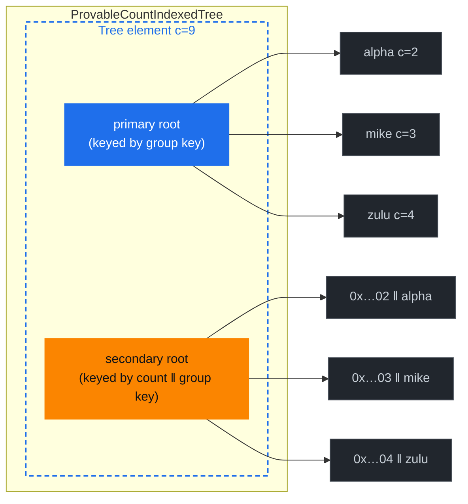

# Document Ranked Trees

The aggregate surfaces that landed in Platform 4.0 answer *"how many"* and *"how much"* — per document type, per indexed value, per range of indexed values. What none of them answer is *"which groups score highest"*. Counting the reviews of every restaurant is O(log n) per restaurant; finding the **five best-rated restaurants** meant enumerating all of them and sorting client-side, with a proof that grew with the number of restaurants rather than with the number you asked for.

From protocol v14 an index can declare that its groups are **rankable** by an aggregate. The terminal tree upgrades to grovedb's *indexed-tree* family (grovedb PR #657), which carries an ordered secondary Merk per declared ranking axis, and "top 5 restaurants by average grade" becomes an **O(log n + k)** read with an O(log n + k) proof. This chapter explains the three indexed tree variants, how an index opts into one, how the secondaries are keyed and maintained, and how the feature composes with the other v14 change. The [Ranked Index Examples](./ranked-index-examples.md) chapter is the worked-example companion.

The chapter assumes you've read [Document Count Trees](./document-count-trees.md), [Document Sum Trees](./document-sum-trees.md), and the [Average Index Examples](./average-index-examples.md) chapter. Ranked trees are built directly on top of the range-aggregate layouts those chapters describe: a ranking secondary is an *ordering* over aggregates the range layout already maintains, so the range axis is a hard prerequisite for the ranked one.

> **Status:** implemented and gated at protocol version 14. The storage layout is pinned end-to-end against a real grovedb by [`ranked_index_e2e_tests`](https://github.com/dashpay/platform/blob/v4.2-dev/packages/rs-drive/src/drive/contract/insert/insert_contract/v0/tests/ranked_index_e2e_tests.rs), which runs against the restaurants fixture at [`packages/rs-drive/tests/supporting_files/contract/restaurants/restaurants-contract.json`](https://github.com/dashpay/platform/blob/v4.2-dev/packages/rs-drive/tests/supporting_files/contract/restaurants/restaurants-contract.json) — the same fixture the examples chapter walks through. The grovedb-side design lives in that project's book chapter **The CountIndexedTree** (`docs/book/src/count-indexed-tree.md`), which is the authoritative reference for the element layout, the hash composition, and the secondary-Merk storage prefixes summarised here.

## Why Ranking Needs a New Primitive

A `ProvableCountTree` at the property-name level stores, per group, the group's document count — and stores it in a Merk keyed by the **group key**. That is exactly what you want for "how many reviews does restaurant `alpha` have?" and for "how many reviews do restaurants between `alpha` and `mike` have?": both questions are answered by walking a key-ordered boundary.

"Which five restaurants have the most reviews?" is a question about the *aggregate*, not about the key. Nothing in the key-ordered Merk correlates position with count, so the only honest answer is to visit every group. That is O(n) work and — worse — an O(n) proof, even though the answer is five entries. Three options exist:

1. **Enumerate and sort client-side.** Correct, and the only thing 4.0 could do. Proof size scales with the number of groups, not with `k`; a contract with 50 000 restaurants pays 50 000 committed entries to learn about five.
2. **Have the server sort and return the top five.** O(1) bytes, zero cryptographic value — the client has no way to check that the sixth-best restaurant wasn't quietly omitted.
3. **Maintain a second, aggregate-ordered view of the same groups, committed to the same root hash.** Top-k becomes a bounded range read at one end of that view, and its proof is a standard Merk range proof over `k` entries. **This is what this chapter is about.**

The grovedb primitive is the **indexed tree**: a primary Merk that is a byte-compatible mirror of the tree it replaces, plus one ordered **secondary** Merk per declared axis, keyed so that the aggregate sorts first and the group key only breaks ties. Because the primary is byte-compatible, every pre-existing range-aggregate query against the same tree — `AggregateCountOnRange`, `AggregateSumOnRange`, `AggregateCountAndSumOnRange` — keeps working unchanged against an index that adds a ranking axis.

*The dashed box is the wrapping `Element`. The primary Merk (blue) is keyed by group key and is byte-identical to the `ProvableCountTree` it replaces. The secondary (orange) holds one entry per group, keyed by `count_be ‖ group_key`, so a descending walk of its right edge yields the highest-count groups first.*



`TOP(2)` reads the two right-most secondary entries (`zulu`, `mike`) and proves them with a standard Merk range proof — three levels of hashes, two committed entries. The same question against the primary alone would have to commit all nine groups.

## Contract Grammar

Ranking is an **index-level** opt-in. Three independent keywords, one per axis:

| Keyword | Ranks groups by | Requires (in effect) | Rust field |
|---|---|---|---|
| `rankedCountable` | each group's document count | `rangeCountable: true` | `Index::ranked_countable` |
| `rankedSummable` | each group's sum of the `summable` property | `rangeSummable: true` | `Index::ranked_summable` |
| `rankedAverageable` | each group's average of the `averageable` property | `rangeAverageable` semantics — **both** `rangeCountable` and `rangeSummable` | `Index::ranked_averageable` |

The three axes are **independent opt-ins**. `rankedAverageable` is *not* sugar for the other two, unlike `averageable` / `rangeAverageable`, which genuinely are sugar for their count+sum longhand. Each ranking axis costs its own ordered secondary Merk and its own maintenance on every write, so each is declared explicitly. Declaring `rankedAverageable` alone is a legal — and usually the right — choice.

The range prerequisite is a hard requirement, not a convenience: a ranking secondary orders the *per-group aggregates the range layout already maintains*. Without the range axis the terminal property-name tree carries no per-group aggregate to sort by. The parser rejects the combination with a message naming the missing flag:

```text
rankedCountable requires rangeCountable: true; ranking groups by count needs
the per-group counts the range-count layout maintains
```

### Value-Sensitive Prerequisites in the Meta-Schema

The document meta-schema enforces the same prerequisites, but it cannot use the `dependentRequired` rows the `range*` keywords use. `dependentRequired` fires on **key presence**, so a written-out opt-out — `"rankedCountable": false`, which the structural parser accepts as exactly that — would be made to demand a `rangeCountable` the index does not need. Meta-schema v3 therefore expresses the ranked prerequisites as value-sensitive `if` / `then` pairs:

```json
{
  "if": {
    "properties": { "rankedCountable": { "const": true } },
    "required": ["rankedCountable"]
  },
  "then": { "required": ["rangeCountable"] }
}
```

The `range*` rows keep their presence semantics because that is what they shipped with in v2, and changing them would move historical validation results.

One asymmetry is worth knowing when authoring: **the meta-schema demands the literal key, the parser accepts the effect.** `rankedAverageable: true` needs a literal `rangeAverageable: true` to satisfy the schema's `then`, even though the parser is satisfied by the explicit `countable` + `summable` + `rangeCountable` + `rangeSummable` longhand. Since full JSON-schema validation only runs under `full_validation`, both layers matter — write the sugar form and the two agree.

### Shape Restrictions

Two structural rules, both enforced at contract-parse time in rs-dpp:

- **Single-property indexes only.** `ranked aggregates are only supported on single-property indexes in this protocol version`. Two reasons, both relaxable at a future protocol version. First, a compound index whose *prefix* level also terminates an aggregating index would need its ranked terminal tree wrapped in a `NonCounted` / `NotSummed` shell so it contributes zero to the parent's aggregate — and the storage layer structurally rejects any wrapper around an indexed tree, because the wrapper would neutralise the very aggregates the secondaries order by. (Drive's fail-closed guard for this is `INDEXED_INNER_UNWRAPPABLE`.) Second, the ranked query surface has no equality-prefix routing: with more than one property there would be a prefix to fix before ranking, and nothing to express it with.
- **Non-unique indexes only.** `ranked aggregates are not supported on unique indexes: each group of a unique index contains at most one document, so there is nothing meaningful to rank`. Contested indexes are covered transitively — a contested index is unique by construction, so it hits the same check rather than needing its own.

### Version Gate

The grammar activates with **protocol version 14** through two independent gates that must agree:

- `CONTRACT_VERSIONS_V6` points `document_type_schema` at the **v3 document meta-schema**, which hosts the three keywords. v13 keeps validating against v2, where they fail an index entry's `additionalProperties: false`.
- `try_from_schema: 3` selects **parser generation 3**, which is the only generation that passes `ranked_aggregates_allowed = true` into `Index::try_from_value_map`. With that flag off, the three keywords are not part of the grammar at all: they fall through to the unknown-key arm and are rejected with exactly the error a pre-v14 node produced for them.

The doubled gate is load-bearing. The meta-schema only runs under `full_validation`, so a non-validating parse — `check_tx`, contract-cache warm-up, state restore — could otherwise smuggle a ranked index past a node whose protocol version has no idea how to lay one out on disk.

**On the parser-generation pattern.** Generation 3 is a *full copy* of generation 2 (and of the generation-1 core that wrapper delegates to), not a version gate threaded into those modules. That is the repository's standing rule for grammar introduced by a new protocol version: shipped generations stay byte-identical to the code consensus already ran, so replaying a historical block can never pick up grammar that did not exist when the block was produced. The copy is kept structurally line-for-line with its sources, so a diff against `v1/mod.rs` + `v2/mod.rs` shows only the ranked deltas.

## How Drive Picks the Indexed Tree Variant

An index's **terminal property-name tree** is the level whose children are the last index property's value trees — one child per distinct value, i.e. one child per *group*. Without ranking flags its `TreeType` comes purely from the range flags:

| `range_countable` | `range_summable` | Base tree type |
|---|---|---|
| `true` | `true` | `ProvableCountProvableSumTree` |
| `true` | `false` | `ProvableCountTree` |
| `false` | `true` | `ProvableSumTree` |
| `false` | `false` | `NormalTree` |

A ranking flag upgrades that base to its indexed mirror:

| Base | Declared axes | Indexed tree |
|---|---|---|
| any | `[]` | unchanged (no ranking declared) |
| `ProvableCountTree` | `[Count]` | `ProvableCountIndexedTree` |
| `ProvableSumTree` | `[Sum]` | `ProvableSumIndexedTree` |
| `ProvableCountProvableSumTree` | any non-empty | `ProvableCountProvableSumIndexedTree(axes)` |

The single-axis variants (PCIT / PSIT) carry **no axis list on the element at all** — their one secondary is implied by the variant — which is why they are only reachable when the base layout is already single-axis. An index that declares, say, `rankedCountable` alongside `rangeSummable` still lays out as `ProvableCountProvableSumTree` underneath, so it upgrades to the multi-axis **PCPSIT** carrying just the Count axis in its TLV.

The axes list is canonical: sorted by tag (`0 = Count`, `1 = Sum`, `2 = Avg`), deduped, one to three entries. Freshly created, the element's TLV is `[(tag, None), …]` — every secondary starts empty. grovedb validates the list on construction (`Element::validate_pcpsit_axes`), because an out-of-order, duplicated or empty TLV would still be hashed into the parent and produce a tree whose secondaries nothing can address.

Selection lives in [`packages/rs-drive/src/drive/document/ranked_index_tree_type.rs`](https://github.com/dashpay/platform/blob/v4.2-dev/packages/rs-drive/src/drive/document/ranked_index_tree_type.rs):

```rust
pub(crate) fn ranked_property_name_tree_type(
    base: TreeType,
    ranked_axes: &[IndexAxis],
) -> Result<TreeType, Error> {
    if ranked_axes.is_empty() {
        return Ok(base);
    }
    match (base, ranked_axes) {
        (TreeType::ProvableCountTree, [IndexAxis::Count]) => Ok(TreeType::ProvableCountIndexedTree),
        (TreeType::ProvableSumTree, [IndexAxis::Sum]) => Ok(TreeType::ProvableSumIndexedTree),
        (TreeType::ProvableCountProvableSumTree, _) => {
            Ok(TreeType::ProvableCountProvableSumIndexedTree)
        }
        _ => Err(Error::Drive(DriveError::CorruptedContractIndexes(/* … */))),
    }
}
```

The catch-all arm is unreachable given rs-dpp's parse-time invariants (`ranked_countable ⇒ range_countable`, `ranked_summable ⇒ range_summable`, `ranked_averageable ⇒ both`), which force `base` to be provable on every axis a ranking flag names. It is a typed error rather than a silent fallback so a future grammar change that breaks one of those implications surfaces here instead of quietly laying down a tree whose secondaries nothing maintains.

`property_name_tree_type_and_ranked_axes()` is the single source of truth — contract registration, contract update, the document insert / update / delete index walkers, and the cost-estimation layers all route through it, so the layouts they describe cannot drift apart. The contract insert/update paths reach grovedb through three helpers parallel to the count and sum families:

- `batch_insert_empty_provable_count_indexed_tree` — PCIT.
- `batch_insert_empty_provable_sum_indexed_tree` — PSIT.
- `batch_insert_empty_provable_count_provable_sum_indexed_tree` — PCPSIT, taking the axes TLV.

**The groups keep their ordinary value-tree types.** An indexed primary is a mirror of the tree it replaces, so nothing changes one level down: with the restaurants fixture, `review`'s groups are `ProvableCountProvableSumTree`s, `visit`'s are `CountTree`s, and `tip`'s are `SumTree`s — exactly the shapes the range flags alone would have produced.

## The Secondary Merks

Each declared axis gets one ordered secondary Merk holding **one entry per group**, keyed by

```text
axis_sort_key ‖ group_key
```

so the aggregate sorts first and the group key breaks ties. Ties therefore come back in group-key order *in the direction of the walk* — descending group-key order for `TOP`, ascending for `BOTTOM`.

| Axis | Sort key | Width | Encoding |
|---|---|---|---|
| Count | `count` | 8 B | big-endian `u64` |
| Sum | `sum` | 8 B | big-endian `i64` with the sign bit flipped |
| Avg | `floor(sum × SCALE / count)` | 16 B | big-endian `i128` with the sign bit flipped |

Sign-bit toggling is what makes the signed encoders order-preserving: flipping bit 63 of an `i64` (or bit 127 of an `i128`) maps the two's-complement signed range onto an unsigned range with the same ordering, so plain byte comparison sorts negatives below positives.

### The Avg Fixed-Point Sort Key

There is no fractional key type, so the Avg axis sorts by a fixed-point integer:

```rust
pub fn compute_avg_fixed_point(sum: i64, count: u64) -> i128 {
    if count == 0 {
        return 0;
    }
    (sum as i128)
        .saturating_mul(AVG_FIXED_POINT_SCALE)
        .div_euclid(count as i128)
}
```

Three properties to internalise:

- **The scale is grovedb's constant, not a wire constant.** `AVG_FIXED_POINT_SCALE` is `10^19` today; it moved from `10^15` before release. Drive re-exports it (`drive::query::RANKED_AVG_SCALE`, itself re-exported by `drive_proof_verifier::RANKED_AVG_SCALE`) rather than re-declaring it, so the two can never drift — the encoded sort keys in storage are produced with grovedb's constant, and a platform-side copy that fell out of step would silently mis-scale every average a client renders. **Never hardcode the literal.**
- **Division is euclidean, i.e. floor toward −∞.** Rust's `/` truncates signed integers toward zero, which would place negative averages one fixed-point bucket too high. The restaurants fixture carries a whole document type (`adjustment`, whose `delta` admits negative values) for the sole purpose of exercising signed sums and this rounding mode.
- **`0 / 0` is defined as `0`.** An empty group has no entry in the secondary at all, so this is a defensive definition rather than an observable one.

### Maintenance

Secondaries are maintained through the **normal batch write path** — there is no separate reindex step and no background job. Every document insert, update and delete that changes a group's `(count, sum)` also rewrites that group's entry in each declared secondary: the old `(sort_key ‖ group_key)` entry is removed and the new one inserted, in the same grovedb batch, under the same block. Draining a group's last document removes the group from the primary and its entry from every secondary together.

grovedb's own consistency verifier enforces the invariant directly: every primary entry at `key` must have exactly one secondary entry at `make_axis_secondary_key(axis, count, sum, key)`, and the secondary must contain nothing else.

## Hash Composition

An indexed tree commits **two Merks in one element**. The composition grovedb uses — internally called **H1-A** — is a single three-input Blake3 call:

```text
combined_value_hash = combine_hash_three(value_hash, primary_root_hash, axes_digest)
```

For the single-axis variants the third input is simply that axis's root hash. For PCPSIT it is `axes_digest`, a length-prefixed Blake3 over the canonical axes TLV — `[n]` followed by `(tag, root_hash)` per axis. The length prefix is what distinguishes a one-axis digest from a two-axis digest truncated to a single entry. An axis with no entries yet contributes `NULL_HASH` in its slot.

The three-input form is deliberate and regression-tested: it must **not** be equivalent to `combine_hash(a, combine_hash(b, c))`, the nested composition rejected during design review because it would have doubled the hash work per bubble-up.

What this buys the verifier: the parent's `value_hash` binds the primary root *and* every secondary root. A proof of a top-k walk over one secondary reconstructs that secondary's root, recombines it with the primary root the same way the writer did, and the result has to match what the parent committed. A server cannot serve a stale or forged secondary while presenting an honest primary.

## The Grove Path

Every ranked read — and, on the prove path, every ranked proof — is issued against the path of the **terminal property-name tree**. For a single-property index that is:

```text
[ RootTree::DataContractDocuments as u8 ]   // 0x01
  / <contract_id: 32 bytes>
  / [ 0x01 ]                                // "documents", not "contract"
  / <document_type_name: utf-8>             // e.g. b"review"
  / <last_index_property_name: utf-8>       // e.g. b"restaurantId"
```

The children of that tree are the *groups*: one value tree per distinct value of the last index property, keyed by the raw index-key bytes of that value (for a `string` property, its UTF-8 bytes — e.g. `b"alpha"`). The secondary entries a top-k read returns are keyed by those same group keys. A compound index `[a, b]` inserts `<a> / <value_of_a>` between the doctype and the terminal `<b>` level — which is exactly the shape ranked indexes don't support yet.

Prover and verifier build this path through the same function, `DriveDocumentRankedQuery::indexed_property_name_tree_path`, which is why they agree on the root hash by construction.

## Write-Path Cost: The Grove v4 Cleanup Gates

Indexed trees need two batch behaviours that earlier grove versions don't have, so protocol v14 also moves Drive from `GROVE_V3` to **`GROVE_V4`**:

- **`delete_tree_cleanup_type_source`** — a batch `DeleteTree` reads the stored element and uses its **actual** type to select cleanup namespaces, rejecting a declared/stored mismatch that involves an indexed tree. V1–V3 take the declared type at face value.
- **`overwrite_indexed_cleanup_inspection`** — a batch overwrite of a non-reference element (with tree-override protection off) reads the stored element to detect an indexed tree being overwritten, scheduling its per-axis secondary storage for cleanup or refusing the ambiguous case.

Without them, a batch overwrite of a ranked index would orphan its per-axis secondary storage. Indexed trees only exist from protocol v14, so activating the stricter cleanup alongside them costs older versions nothing.

Both gates are **cost-neutral**: they derive the old element from data the merk apply already loads when it rewrites or deletes a key, so no extra stored-element read is charged and v14's fee constants match v13's. Three facts pin this:

- **Fees are identical across the boundary.** The identity-balance, token-balance and state-transition processing-fee pins carry the same values at protocol v13 and v14, and `run_chain_one_identity_in_solitude` has a protocol-version-13 sibling asserting the identical end balance — the pair proves the v13 → v14 transition changes nothing about those runs' fees.
- **Storage fees are untouched everywhere** — the gates only observe, never write.
- **Cleanup still happens.** A batch overwrite of an indexed tree schedules its per-axis secondary storage for cleanup (or refuses the ambiguous case), and `DeleteTree` uses the actual stored type — covered by grovedb's own overwrite and delete-tree suites at the pinned revision.

## Interaction With the Shared-Prefix Aggregate Fix

Protocol v14 hosts two consensus changes, and contracts exist where both apply to the same index. The [shared-prefix aggregate fix](https://github.com/dashpay/platform/blob/v4.2-dev/packages/rs-drive/src/drive/document/index_level_tree_types.rs) makes a contract legal that previously registered but rejected every document insert: an aggregating index terminating at a property that is also the *prefix* of a compound index (e.g. `summable [a]` next to `[a, b]`).

The two changes are **orthogonal by construction**, and they live exactly one level apart:

- The **ranked upgrade** decides the *property-name* tree type — plain → indexed mirror.
- The **continuation demotion** decides the *value* tree type one level below it — a provable count-bearing value tree that has to host a compound continuation demotes to `CountSumTree`, since grovedb rejects count-suppressed children under provable count parents by design.

A demoted `CountSumTree` value tree contributes its `(count, sum)` to a ranked indexed parent exactly as the provable variant did, so a ranked index's secondaries keep ranking correctly over shared-prefix shapes. Concretely, for a `dish` doctype with a ranked `[restaurantId]` index alongside a plain compound `[restaurantId, chefId]`:

- the property-name tree at `restaurantId` stays a `ProvableCountProvableSumIndexedTree` carrying the Avg axis;
- each group's value tree demotes from `ProvableCountProvableSumTree` to `CountSumTree`;
- the `chefId` continuation inside it goes in `Element::NonCounted`, contributing zero to the group's count and sum.

The one place the two changes genuinely collide is the case the single-property rule already forbids: a ranked *terminal* level sitting inside an aggregating value tree would need a wrapper, and an indexed tree can never be wrapped. That is the `INDEXED_INNER_UNWRAPPABLE` guard, and it fails closed.

## Storage-Layout Invariants

All three ranking flags are **immutable** across a contract update, for the same reason and with the same error as the count and sum flags. The set of declared axes picks the indexed tree variant and its ordered secondaries at contract creation; toggling any one of them would require rebuilding the secondaries for every existing group.

`IndexLevel::find_first_ranked_change` walks the two index-level trees and returns the first path where `ranked_countable`, `ranked_summable` or `ranked_averageable` differs — e.g. `restaurantId -> (ranked_averageable: false -> true)`. `IndexLevel::validate_update` turns that into a `DataContractInvalidIndexDefinitionUpdateError`:

```text
Document with type {document_type} could not add or remove '{index_path}' during
data contract update as we do not allow modifications of data contract index paths
```

Adding a *new* ranked index on update is rejected by the same machinery. Don't relax these guards: an index whose declared axes disagree with the element on disk would have the write path maintaining secondaries the reader can't address, or the reader reading secondaries the write path never updates — consensus drift either way.

## Authoring a Contract That Uses Ranked Trees

The restaurants fixture is the reference. Its `review` doctype ranks restaurants by average grade:

```json
{
  "review": {
    "type": "object",
    "documentsMutable": true,
    "canBeDeleted": true,
    "indices": [
      {
        "name": "byRestaurant",
        "properties": [{ "restaurantId": "asc" }],
        "countable": "countable",
        "summable": "grade",
        "averageable": "grade",
        "rangeCountable": true,
        "rangeSummable": true,
        "rangeAverageable": true,
        "rankedAverageable": true
      }
    ],
    "properties": {
      "restaurantId": { "type": "string", "minLength": 1, "maxLength": 32, "position": 0 },
      "grade": { "type": "integer", "minimum": 0, "maximum": 100, "position": 1 }
    },
    "required": ["restaurantId", "grade"],
    "additionalProperties": false
  }
}
```

The `countable` / `summable` / `averageable` trio plus the three `range*` flags are the *prerequisites*; `rankedAverageable: true` is the one line that adds the ranking. That index's terminal property-name tree at `restaurantId` becomes a `ProvableCountProvableSumIndexedTree` carrying axes `[Avg]`.

The count-only and sum-only shapes are correspondingly smaller:

```json
{ "name": "byRestaurantVisits",
  "properties": [{ "restaurantId": "asc" }],
  "countable": "countable", "rangeCountable": true, "rankedCountable": true }
```

```json
{ "name": "byRestaurantTips",
  "properties": [{ "restaurantId": "asc" }],
  "summable": "amount", "rangeSummable": true, "rankedSummable": true }
```

which lay down a `ProvableCountIndexedTree` and a `ProvableSumIndexedTree` respectively.

Note that the fixture puts each shape on its **own document type**. That's not an accident of style: two indexes over the same property set on one doctype is a `DuplicateIndexError`, so exercising all three variants needs three doctypes.

### Choosing What to Set

| You want | Set |
|---|---|
| Top / bottom K groups by document count | `rankedCountable: true` on a single-property, non-unique index that already has `countable` + `rangeCountable: true` |
| Top / bottom K groups by sum of a property | `rankedSummable: true` on an index with `summable: "<prop>"` + `rangeSummable: true` |
| Top / bottom K groups by average of a property | `rankedAverageable: true` on an index with `averageable: "<prop>"` + `rangeAverageable: true` (or the count+sum longhand) |
| Two rankings on one index (e.g. by count *and* by average) | Both keywords. The tree is a PCPSIT carrying both axes in its TLV; you pay one secondary Merk per axis on every write. |
| A ranking filtered by another property (`top 5 restaurants in London`) | Not available. Ranked indexes are single-property and ranked queries take no `where` clause — the secondary is sorted by aggregate, not by group key, so it cannot express a filtered subset. Model the filter as part of the grouping property, or rank client-side over a range query. |
| A ranking on a unique or contested index | Not available, and not meaningful: every group holds at most one document. |
| Range aggregates without ranking (the 4.0 surface) | Just the `range*` flags. Ranking is strictly additive — adding it never changes what a range query returns. |
| Nothing ranking-aware (default) | Don't set any `ranked*` flag. The terminal property-name tree keeps the type its range flags give it. |

Every ranking axis is paid for on **every write** that touches a group, not just on the reads that use it. Two axes on one index means two secondary rewrites per document insert. Opt into the axes you will actually rank by.

## What a Ranked Query Looks Like

The query surface is deliberately narrow — one aggregate `select`, one `group_by`, one `having` whose right operand is a ranking on the same aggregate, and nothing else. The [Ranked Index Examples](./ranked-index-examples.md) chapter covers the wire shape, the SDK surface, the proof, and the full list of what is rejected and why.
