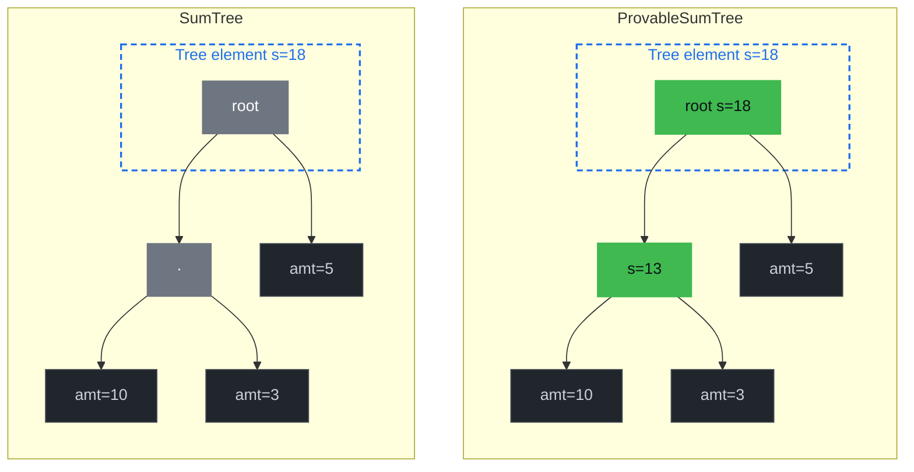
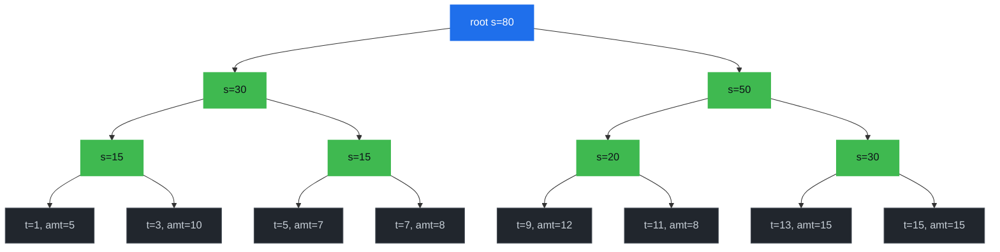

# Document Sum Trees

Summing a numeric property across the documents that match a query used to mean fetching them all and adding values up client-side. The grovedb upgrade that landed alongside [Document Count Trees](./document-count-trees.md) adds **provable sum trees** and **references with sum item** as primitives — the building blocks Drive uses to turn `sum(amount)`-style queries into an O(log n) provable lookup. This chapter explains the three sum-tree variants, how a document type opts into one, the unified `GetDocumentsSum` endpoint that exposes the feature, and the parallels with the count-tree machinery.

> **Status:** the grovedb-level sum-tree primitives (`SumTree`, `ProvableSumTree`, `BigSumTree`, and reference elements that carry a sum-item contribution) are in place. The Drive-level schema syntax, query handler, and SDK surfaces described below are the proposed design — the [Sum Index Examples](./sum-index-examples.md) chapter is the worked-example companion, and the tip-jar contract fixture at [`packages/rs-drive/tests/supporting_files/contract/tip-jar/tip-jar-contract.json`](https://github.com/dashpay/platform/blob/v4.0-dev/packages/rs-drive/tests/supporting_files/contract/tip-jar/tip-jar-contract.json) is the schema this design targets.

## Why Sum Trees Exist

The default primary-key tree for a document type is a `NormalTree`. To total the `amount` field across its documents, Drive walks the subtree, deserializes every record, sums the property client-side, and returns the result. That is fine for small types but becomes painful as soon as a UI needs "how much has this creator received in tips?" on a tip jar with millions of entries — and worse if the caller wants a *proof* of the total, because the proof has to enumerate every contributing document.

GroveDB has two sum-aware tree variants. **Both are provable** — the running sum is committed to the merk root in each case — but they differ in *where* the sum is stored inside the tree, and that controls which kinds of sum queries can be answered without enumerating leaves:

- `SumTree` — stores a single `i64` sum at the root of the tree. The total sum is one read; any per-subtree sum requires walking down to that subtree's root and reading its (separate) tree element.
- `ProvableSumTree` — stores an `i64` sum at *every* internal node, not just the root. Each node's sum covers everything in the subtree below it, so range queries like "what's the total amount tipped between time A and time B?" or "what's the sum per recipient over time?" can be answered by walking the boundary nodes and combining their pre-computed sub-sums, without touching any leaf.

GroveDB merk trees are binary — each internal node has exactly a left and a right child:

*The dashed box is the wrapping `Element` (the "tree" in grovedb terms) and contains the root node of the merk tree. Both variants store the total sum on the wrapping element — that's the O(1) field Drive reads for total sums. The difference is what's inside: in a `SumTree` the merk root and the rest of the tree don't carry the sum, so only the wrapper has it. In a `ProvableSumTree` the sum is *also* stored on the root node itself and on every internal merk-tree node, so it's committed into the merk root hash and provable per-subtree.*



In a `SumTree`, the only sum-bearing node is the root. To compute "total amount tipped per recipient" you'd have to navigate to each recipient-keyed *subtree* (a separate grovedb tree, not a child node of the binary structure above), read its root sum, and pay for a separate proof per read — *N* reads for *N* distinct recipients. In a `ProvableSumTree`, every internal node along the binary path already carries the sum of its left and right subtrees, so a range query like "amounts where sentAt ∈ [t1, t2]" walks only the boundary path and combines the pre-committed sub-sums in a single traversal and a single proof.

A document type opts in via two schema flags. Note that — unlike count, where the flag is a plain bool — sum needs to know **which property** to sum, so both flags carry a property name:

- `documentsSummable: "<property>"` → primary-key tree is a `SumTree` summing the named property. Enables O(1) total-sum for the document type; sufficient for `GetDocumentsSum` with no `where` filter.
- `rangeSummable: true` (paired with `documentsSummable`) → primary-key tree is a `ProvableSumTree`. The same flag is also accepted *per-index*, where it controls range-sum storage layout (see below) and is required for any `GetDocumentsSum` request that carries a range where-clause.

The named property must be `type: integer` and listed in the document type's `required` array. We don't define a null contribution rule — a missing-or-null value would have to either contribute 0 (and silently mask a misconfigured insert) or fail the insert (and invalidate documents that were valid at write time). Requiring the property avoids both choices.

## How a Document Type Picks Its Tree Variant

Selection lives in `DocumentTypePrimaryKeyTreeType::primary_key_tree_type` — the same dispatcher that picks the count-tree variant — extended to consider sum flags alongside count flags:

```rust
// proposed v1 selection logic — **sum-only projection** for chapter clarity.
// The real dispatcher also picks the combined count+sum variants
// (`CountSumTree`, `ProvableCountSumTree`,
// `ProvableCountProvableSumTree`) when count flags are set alongside
// the sum flags — those branches are omitted here and covered in
// "Choosing What to Set" below. The v0 count-only logic stays in
// place behind a version bump.
match (range_summable, documents_summable, range_countable, documents_countable) {
    (true,  _,    _,    _)    => Ok(TreeType::ProvableSumTree),
    (false, true, _,    _)    => Ok(TreeType::SumTree),
    (false, false, true,  _)  => Ok(TreeType::ProvableCountTree),
    (false, false, false, true) => Ok(TreeType::CountTree),
    (false, false, false, false) => Ok(TreeType::NormalTree),
}
```

`primary_key_tree_type()` stays the single source of truth — every Drive code path that needs to know which tree variant to read from or write to routes through this helper, including:

- Contract insert and update (to `CREATE` the right tree element when the document type is added).
- Document insert / delete (to know how to update the sum alongside the document — adding `amount` to every ancestor sum field, decrementing on delete).
- Cost estimation (so fees match the variant that will actually be used).

The contract insert/update paths use thin `Drive` helpers parallel to the existing count variants and the count chapter's `batch_insert_empty_*_tree` family:

- `batch_insert_empty_tree` — NormalTree.
- `batch_insert_empty_sum_tree` — SumTree, used when `documents_summable.is_some() && !range_summable()`.
- `batch_insert_empty_provable_sum_tree` — ProvableSumTree, used when `range_summable()`.

A sum tree's *contents* under each value-keyed path are inserted via a different family of helpers — the **reference-with-sum-item** primitive. Where a non-summable index stores a reference at `[index_value]/[0]/<doc_id>`, a summable index stores a reference that *also* carries an `i64` sum contribution (the document's `amount` value at write time). When the parent tree is a `SumTree` or `ProvableSumTree`, each insert's sum contribution propagates up the merk path, exactly as a count contribution does in the count case — but the contribution is `amount` rather than `+1`. Helpers:

- `batch_insert_sum_item` — drops a bare sum item under a sum tree.
- `batch_insert_reference_with_sum_item` — drops a reference that contributes a named amount to its parent sum tree. This is the helper non-primary-key sum indexes use.

Each helper goes through `LowLevelDriveOperation::for_known_path_key_*_sum_*` (or its `_estimated_path_key_*` cousin in cost-estimation paths), so the contract setup, document operations, and proof generation all see the same on-disk shape.

## Storage-Layout Invariants

Because the tree variant is fixed at contract-creation time and baked into how the tree element is laid out on disk, both flags are *immutable* across a contract update — and the named summable property is too, since changing which property feeds the sum would silently invalidate every existing aggregation:

- Changing `documents_summable` from any state to any other state (including changing the property name) on a `validate_config` update returns `DocumentTypeUpdateError`.
- Same for `range_summable`.

Tests pinning these guards will live alongside the existing count-tree tests in `packages/rs-dpp/src/data_contract/document_type/methods/validate_update/v0/mod.rs`. Don't relax them: if a `NormalTree`-backed document type were silently switched to `SumTree` mid-contract, every subsequent insert or delete would update a sum value attached to a tree element that physically isn't a sum tree, leading to grovedb element-shape errors at best and consensus drift at worst.

The named property's *value* is read at insert time and frozen into the reference-with-sum-item — Drive doesn't re-read it on delete (it pulls the contribution from the reference itself). So changing the property's value would require a delete-then-reinsert; document mutability concerns apply normally.

## Summing Documents at Query Time

A single unified gRPC endpoint exposes the feature: `GetDocumentsSum` — structurally identical to `GetDocumentsCount`. The response shape varies by request mode (total / per-`In`-value / per-distinct-value-in-range / total-over-range), see [Range Modes](#range-modes) below. The wire-level shape mirrors count: on the no-proof path the response's `SumResults` carries an inner `oneof variant { sint64 aggregate_sum; SumEntries entries; }` — total-sum and range-without-distinct modes return `aggregate_sum` (a single `i64`), per-`In`-value and per-distinct-value-in-range modes return `entries` (a list of `SumEntry { optional bytes in_key; bytes key; sint64 sum }` where `in_key` is the prefix value for compound `In + range` shapes and absent for flat queries). The endpoint has two underlying paths (prove vs. no-prove); every mode is valid on both paths.

The two-path / two-shape split is identical to the count endpoint's, and for the same reasons. What's new in the sum case:

- Sums are signed (`i64` / `sint64` on the wire) — grovedb's sum trees model overflow into negative space rather than saturating, so a verifier extracting a sum from a proof can detect "this aggregation overflowed `i64::MAX`" by recovering a value that doesn't match the document set's expected magnitude. If you expect aggregations beyond `i64::MAX`, use a `BigSumTree`-backed variant (`bigDocumentsSummable: "amount"` — out of scope for this chapter; covered alongside the `BigSumTree` Drive plumbing).
- Each sum query needs the property name to sum baked into the picker — there's no implicit "+1 per matched doc." The picker resolves the property from the covering index's `summable: "<property>"` flag and rejects queries whose target property isn't the same one any candidate index sums.

### No-Prove (Server-Side O(1) or O(log n))

When `prove=false`, drive-abci calls into `DriveDocumentSumQuery` (the proposed analog of `DriveDocumentCountQuery` in [`packages/rs-drive/src/query/drive_document_count_query/mod.rs`](https://github.com/dashpay/platform/blob/v4.0-dev/packages/rs-drive/src/query/drive_document_count_query/mod.rs)). The handler picks a path based on the where clauses:

**Unfiltered total (no where clauses) on a `documentsSummable: "amount"` document type**:

The doctype's primary-key tree at `[contract_doc, contract_id, 1, doctype, 0]` is itself a `SumTree`. One grovedb read gives `sum_value` — the total of `amount` across every document of this type. O(1).

**Equal/In only**:

1. Pick a `summable: "<prop>"` index whose properties **exactly match** the Equal/In where-clause fields. `<prop>` must equal the request's target sum property. The same strict-coverage contract count uses applies — partial coverage rejects with `WhereClauseOnNonIndexedProperty`. (See "Index design" below.)
2. Walk the tree from the root down to the terminal level, pushing `prop_name` and `serialize_value_for_key(prop_name, value)` at each step. `Equal` extends one path; `In` clones the current path once per value in its array (a cartesian fork) and the per-branch sums are summed.
3. Read the `SumTree` element at the resulting path and return its `sum_value`. O(1) per branch.

If the request carries an `In` clause, the response is the `entries` variant — one `SumEntry` per `In` value. Otherwise the response is the `aggregate_sum` variant — a single `i64`.

**Index design contract**: a `summable: "amount"` index sums exactly its declared properties' coverage of `amount`. Want `sum(amount) WHERE recipient = X`? Define a `[recipient]` index with `summable: "amount"`. Want `sum(amount) WHERE recipient = X AND sentAt > T`? Define a `[recipient, sentAt]` index with `summable: "amount"` AND `rangeSummable: true`. Partial coverage (e.g. `recipient = X` against a `[recipient, sentAt]` index without the range clause) is rejected — define a more specific summable index, or set `documentsSummable: "amount"` on the document type for unfiltered total sums. The prove path enforces the same contract, so `prove=true` and `prove=false` reject in the same situations with the same error.

**Range**:

1. Pick a `rangeSummable: true` index where the Equal/In clauses cover the prefix and the range operator hits the index's last property.
2. Build the path `[contract_doc, doctype, prefix..., range_prop_name]` — pointing at the property-name `ProvableSumTree`.
3. Issue a grovedb path query with the converted range `QueryItem` (`>`, `>=`, `<`, `<=`, `Range`, `RangeInclusive`, `RangeAfter`, `RangeAfterTo`, `RangeAfterToInclusive`) and walk the children whose keys lie inside the range.
4. Each child's `sum_value_or_default()` is the `amount` sum at that property value. Either combine all per-value sums and return as the `aggregate_sum` variant (summed mode), or emit them as per-value `SumEntry`s under the `entries` variant (distinct mode), then apply order / cursor / limit.

### Prove (Client-Side Verify-Then-Aggregate or Aggregate-Sum Proof)

When `prove=true`, the proof shape depends on whether the query carries a range clause.

**With a range clause**: the handler picks one of two prove sub-paths based on `return_distinct_sums_in_range`:

- **Aggregate (`return_distinct_sums_in_range = false`, default)**: drive-abci builds a grovedb [`AggregateSumOnRange`](https://docs.rs/grovedb/latest/grovedb/) path query against the property-name `ProvableSumTree`, and `get_proved_path_query` produces an aggregate-sum proof. The client verifies via `GroveDb::verify_aggregate_sum_query` and recovers `(root_hash, sum)` directly — proof size is O(log n) regardless of how many keys match. No documents are ever materialized.

- **Distinct (`return_distinct_sums_in_range = true`)**: drive-abci builds a *regular* range path query (no `AggregateSumOnRange` wrapper) against the same `ProvableSumTree`. Because the leaf is a `ProvableSumTree`, merk emits one `Node::KVSum(key, value, sum)` op per matched in-range key, with each `sum` cryptographically committed to the merk root via `node_hash_with_sum(kv_hash, l_hash, r_hash, sum)` — same forge-resistance as the aggregate path's `HashWithSum` collapse. The SDK's `drive_proof_verifier::verify_distinct_sum_proof` runs the standard hash-chain check, then walks the proof's op stream to extract the sums as a `BTreeMap<Vec<u8>, i64>`. Trade-off vs. the aggregate path: proof size is O(distinct values matched) rather than O(log n).

**Without a range clause** (point-lookup with prove): two sub-paths based on the request shape.

- **Unfiltered total + `documentsSummable: "amount"`**: drive-abci proves the doctype's primary-key `SumTree` element at `[contract_doc, contract_id, 1, doctype, 0]`. One merk path proof; the SDK's `drive_proof_verifier::verify_primary_key_sum_tree_proof` reads `sum_value` off the verified element. O(log n) bytes.

- **Equal/In against a fully-covering `summable: "amount"` index**: drive-abci proves one `Element::SumTree` per covered branch. Two sub-shapes parallel to count's:
  - **Equal-only fully-covered** → one element at `[..., last_field, last_value, 0]`.
  - **`In` at any index position (with any number of trailing Equals)** → one element per In value, fetched via outer Query + a subquery whose `set_subquery_path` carries the post-In Equal segments.

  The In position rule and the `set_subquery_path` mechanics are byte-for-byte the same as the count case — see the count chapter's [Prove section](./document-count-trees.md#prove-client-side-verify-then-aggregate-or-aggregate-count-proof) for the rationale. Sum picks up the same permissive layout because both paths use `point_lookup_sum_path_query` (no document-key terminator descent, no `order_by` interpretation, no `limit/offset` semantics — it's a pure SumTree-element lookup).

Both sub-paths share the proof shape: each SumTree element's `sum_value` is cryptographically bound to the merk root via `node_hash_with_sum(kv_hash, l_hash, r_hash, sum)`. Neither materializes documents or runs per-key bookkeeping client-side.

Proof size: **O(k × log n)** where k is the number of covered branches (1 for the documents_summable fast path and Equal-only fully-covered case; ≤ |In values| for Equal-prefix + In-on-last).

**Symmetric rejection contract**: prove sum requires a `summable: "<prop>"` index whose properties exactly match the where clauses and whose summed property matches the request's target — same requirement as the no-proof `Total` / `PerInValue` modes. Partial coverage rejects with a `WhereClauseOnNonIndexedProperty`-class error. The `documentsSummable: "<prop>"` fast path handles unfiltered total sums in O(log n) proof bytes when set on the document type. No silent fallback to materializing matching documents.

### Supported Where Operators

Identical to the count endpoint:

- **`Equal` (`==`)** — single point lookup against the sum tree at a fully-resolved index path.
- **`In` (`in`)** — cartesian fork. Each value in the `In` array becomes its own index path; their sums are combined (or, for split sums, merged by split key). An `In` clause with `k` values costs `k` point lookups, not a tree walk. The `In` clause also doubles as the per-value split signal in the unified `GetDocumentsSum` endpoint — at most one `In` per request.
- **Range** (`>`, `>=`, `<`, `<=`, `between*`, `startsWith`) — walks the property-name `ProvableSumTree`'s children whose keys lie inside the range, combining each child `SumTree`'s sum value. Requires the index to have `rangeSummable: true` AND the range property to be the index's last property.

Range queries take a single range terminator clause plus a prefix of `Equal` clauses and/or one `In` clause. `In` on a prefix property exercises grovedb's native subquery primitive — each emitted entry carries both the `in_key` (the In value for that fork) and the `key` (the terminator value within the range). Per-fork sums are NOT merged server-side — same [No-Merge Compound Semantics](#no-merge-compound-semantics) reasoning as count.

#### Range Modes

A range query produces one of two response shapes, controlled by `return_distinct_sums_in_range`:

- **`return_distinct_sums_in_range = false`** (default) — `SumResults.aggregate_sum` carrying the sum of the per-value `SumTree` sums within the range. Use for "how much was tipped between t1 and t2?".
- **`return_distinct_sums_in_range = true`** — `SumResults.entries` with one `SumEntry` per distinct property value within the range. Use for "show me the histogram of tip amounts per timestamp in [t1, t2]".

#### No-Merge Compound Semantics

For compound queries (`In` on a prefix property + range on the terminator), entries are returned **unmerged** — one `SumEntry` per emitted `(in_key, key)` pair. The server does NOT collapse them down to a flat histogram. Same three reasons as count:

1. **Correctness under `limit`.** Pushing a `limit` into grovedb's path query truncates the emitted elements before any merge could run. With cross-fork merging this can undercount the merged sums.
2. **Proof verification stays straightforward.** A malicious server omitting one `In` branch shows up as missing entries with that `in_key` rather than as a silent undercount in a merged total.
3. **No information loss.** A caller who wanted the merged histogram can compute `result.fold(by=key, sum=sum)` client-side trivially.

The rs-sdk surfaces this via `DocumentSplitSums.0: Vec<VerifiedSplitSum>`. Callers wanting the historical flat-map shape can call `DocumentSplitSums::into_flat_map()` which combines across `in_key` forks.

#### Pagination

Identical to count's [pagination](./document-count-trees.md#pagination) — `order_by` controls split-mode entry ordering; `limit` truncates after `min(requested, max_query_limit)` with `None` normalized to `default_query_limit`. Pagination is by range narrowing, not cursor. Ignored on aggregate mode.

#### Range Queries on the Prove Path

Same shape as count's [Range Queries on the Prove Path](./document-count-trees.md#range-queries-on-the-prove-path):

- Aggregate sub-path (default) builds `AggregateSumOnRange` — proof size O(log n).
- Distinct sub-path (`return_distinct_sums_in_range = true`) builds a regular range proof against the property-name `ProvableSumTree`. Per-`(in_key, key)` `KVSum` ops, each bound to the merk root via `node_hash_with_sum`.
- `In` on a prefix property is supported on the distinct sub-path. The aggregate sub-path rejects `In` on prefix (single-range merk primitive can't fork at the merk layer).
- `"desc"` direction in the first `order_by` clause flows through to grovedb's `Query.left_to_right`.

## Range Queries and ProvableSumTree

Range sum queries (`>`, `<`, `between*`) over an index with `rangeSummable: true` are answered in O(log n) by walking the property-name `ProvableSumTree`'s boundary nodes. The proof path uses grovedb's `AggregateSumOnRange`, which lets clients verify a range sum without ever materializing the underlying documents.

### Why Internal-Node Sums Make Range Sums O(log n)

In a sorted merk tree the keys partition into a left (smaller) and right (larger) subtree at every internal node. To answer "what's the sum of `amount` for documents with `sentAt > T`?" you walk the boundary between "below T" and "above T" from the root down, and at each step you decide what to do with the *other* subtree based on a single read:

- If a subtree lies entirely above the cutoff, add its full sum and don't descend.
- If it lies entirely below, ignore it (contributes 0).
- If it straddles, recurse.

On a `ProvableSumTree` every internal node carries the sum of its left and right subtrees, so the "add the full sum" step is a single O(1) read. The walk visits one node per tree level — O(log n).

Concretely, picture a `ProvableSumTree` of 8 tips with sorted `sentAt` keys and `amount` leaves:



For "give me the sum of `amount` for items with `sentAt > 6`":

- **root (s=80)**: 6 falls inside the left subtree (which holds t=1..7). Read both children's sub-sums. Right subtree's keys are all > 6 → take its full `s=50` and don't descend. Recurse into left.
- **left (s=30)**: 6 falls inside its right subtree (t=5,7). Read both children. Left-left's keys (1,3) are both ≤ 6 → contribute 0. Recurse into left-right.
- **left-right (s=15)**: 6 splits this leaf-pair. Read both leaves. Key 5 ≤ 6 → contribute 0. Key 7 > 6 → contribute its `amt=8`.
- Total = 50 (right of root) + 0 (left-left) + 0 (t=5) + 8 (t=7) = **58**.

We visited 4 internal nodes on the boundary path and read sub-sums off 3 siblings without descending. Six of the eight items were never enumerated: their contributions were combined straight out of the committed sub-sum fields.

### Why This Is Provable

A merk proof of the same boundary walk includes:

1. The boundary path from root to the leaf adjacent to the cutoff.
2. The siblings of every node on the boundary path (so the verifier can recompute hashes up to the merk root).

Each sibling node, on a `ProvableSumTree`, ships its committed sub-sum alongside its hash. The verifier walks the same logic the server did — "this sibling lies entirely above 6, add its `s=…` value" — and ends up with the same total without enumerating the sibling subtrees. Verification is also O(log n).

The same primitive answers any range query of the form `[A, B]`: walk to the cutoff at A, then to the cutoff at B, and combine sub-sums along the way.

## Authoring a Contract That Uses Sum Trees

Two opt-in surfaces, parallel to count. They're independent and can be used together:

1. **Top-level flags on the document type** control the *primary-key* tree variant.
2. **A per-index `summable: "<property>"` flag** controls whether *that specific index's* tree carries sums.

### Primary-Key Tree Flags

Set at the same level as `type` / `properties` / `indices` on a document type:

```json
{
  "tip": {
    "type": "object",
    "documentsSummable": "amount",
    "properties": {
      "recipient": { "type": "array", "byteArray": true, "minItems": 32, "maxItems": 32, "position": 0,
                     "contentMediaType": "application/x.dash.dpp.identifier" },
      "amount":    { "type": "integer", "minimum": 1, "position": 1 },
      "sentAt":    { "type": "integer", "minimum": 0, "position": 2 }
    },
    "required": ["recipient", "amount", "sentAt"],
    "additionalProperties": false
  }
}
```

That contract gets a `SumTree` for the `tip` primary-key tree, summing `amount`. `GetDocumentsSum` for `tip` with no `where` filter is now an O(1) lookup of the tree element's sum value.

To opt into a `ProvableSumTree` for the *primary-key* tree instead — useful if you want range queries on the primary key or intend to use this document type behind range proof primitives — pair with `rangeSummable: true`:

```json
{
  "tip": {
    "type": "object",
    "documentsSummable": "amount",
    "rangeSummable": true,
    ...
  }
}
```

Both flags are *immutable* across a contract update — you pick the tree variant at contract creation; you can't switch later without creating a new document type.

### Per-Index Summable Flag

Set on a single entry in the document type's `indices` array:

```json
{
  "indices": [
    {
      "name": "byRecipient",
      "properties": [{ "recipient": "asc" }],
      "summable": "amount"
    }
  ]
}
```

With `byRecipient.summable: "amount"` the `byRecipient` index's tree carries running sums of `amount`, so `GetDocumentsSum` with `where: [["recipient", "==", X]]` reaches the sum via that index in O(1). Without the flag the query rejects with `WhereClauseOnNonIndexedProperty` — there's no slow fallback, only fast sums on properly-indexed properties.

The `summable` field accepts a single shape: a **string naming an integer property** declared on the document type and listed in `required`. The named property must be the same one named at any other summable level (doctype `documentsSummable` and other indexes' `summable`) — multi-property summing on a single tree isn't supported and won't be; if you need to sum two properties, declare two separate aggregation surfaces.

A few notes about the index-level flag:

- Setting `summable` increases storage cost — every insert and delete updates the index tree's sum alongside the document, and the reference under the index value tree carries an extra `i64` sum-item contribution.
- Setting `rangeSummable: true` increases storage cost further — every internal node of the property-name tree carries running-sum metadata, not just the root.
- The flag is on the *whole* index, not per-property. Same strict-coverage rule as count: a `["recipient", "sentAt"]` summable index gives O(1) sums for `WHERE recipient = X AND sentAt = T` but NOT for `WHERE recipient = X` alone. Define both indexes if you want both queries.
- Index-level `summable` is independent of the primary-key flags. You can have `documentsSummable: "amount"` on the document type AND `summable: "amount"` on a specific index.
- **`summable` on a `unique` index is mostly a no-op, but not always**, mirroring count's caveat. A unique index stores its terminal as a bare reference at key `[0]` rather than wrapping it in a sum tree, so for documents whose indexed fields are all non-null the flag has no storage effect. Null-bearing entries take the same sum-tree branch a non-unique index uses, and the sum tree at that path aggregates them. Sums on all-non-null exact matches still return correctly (the reference's stored sum contribution) because the on-disk reference reads as a sum item via grovedb's default-aggregate semantics.

### Choosing What to Set

| You want | Set |
|---|---|
| Fast `sum(amount)` for the whole document type | `documentsSummable: "amount"` on the document type |
| O(1) filtered sum: `sum(amount) WHERE col = X` | `summable: "amount"` on an index whose properties are exactly `["col"]`. Partial coverage of a wider index rejects with `WhereClauseOnNonIndexedProperty` — define a dedicated index. |
| Per-`In`-value sub-sums | `summable: "amount"` on an index whose properties exactly match the query's `==` clauses plus the `In` field. The `In` field may sit at any position. |
| O(log n) range sum: `sum(amount) WHERE col BETWEEN A AND B` | `rangeSummable: true` on an index whose last property is `col` and whose other properties cover any equality predicates as a prefix. Requires `summable: "amount"`. |
| Per-distinct-value range histogram | Same `rangeSummable: true` index as above, plus `return_distinct_sums_in_range = true` on the request. |
| Range sum proof | Same `rangeSummable: true` index. Handler uses grovedb's `AggregateSumOnRange` — proof is O(log n), no cap on matched docs. |
| Aggregations beyond `i64::MAX` | Out of scope for this chapter — see the `BigSumTree` variant. |
| Both a sum AND a count on the same tree | Combine the count flags (`documentsCountable` / `rangeCountable` / per-index `countable`) with the sum flags. The dispatcher picks one of three combined variants depending on which axes opt into per-node aggregation: **`CountSumTree`** (both at root only), **`ProvableCountSumTree`** (per-node count, root-only sum — useful when range count is wanted but range sum isn't), or **`ProvableCountProvableSumTree`** / PCPS (both per-node — the grovedb PR 670 newcomer, enables `AggregateCountAndSumOnRange` recovering both metrics in a single range proof). One tree, two simultaneous queries, no double storage. The tip-jar contract above doesn't use these combinations (it's pure-sum to keep the introduction focused); a worked example using `(count, sum)` together is covered in a separate chapter alongside its own example contract. |
| Nothing sum-aware (default) | Don't set any of these flags. Primary-key tree stays a `NormalTree`. |

Every sum query requires either `documentsSummable: "<prop>"` (for unfiltered totals) or a `summable: "<prop>"` / `rangeSummable: true` index whose properties **exactly match** the query's where-clause fields. No covering index → the call returns a clear `InvalidArgument` describing what the picker was looking for. Pick your indexes deliberately at contract creation time — per-index `summable` / `rangeSummable` flags can't be added later (contract indexes are immutable post-creation).

## SDK Access at Three Layers

### `rs-sdk` (native Rust)

Both shapes will land on the standard `Fetch` trait against a single `DocumentSumQuery`:

```rust
use dash_sdk::platform::documents::document_sum_query::DocumentSumQuery;
use dash_sdk::platform::Fetch;
use drive::query::{WhereClause, WhereOperator};
use drive_proof_verifier::{DocumentSum, DocumentSplitSums};

// Total sum: no In clause.
let DocumentSum(sum) = DocumentSum::fetch(
    &sdk,
    DocumentSumQuery::new(contract.clone(), "tip", "amount")?,
)
.await?
.expect("DocumentSum::fetch always returns a value on success");

// Split sum: signal split by including an `In` clause whose field
// is the split property.
let split_query = DocumentSumQuery::new(contract, "tip", "amount")?
    .with_where(WhereClause {
        field: "recipient".to_string(),
        operator: WhereOperator::In,
        value: platform_value::Value::Array(vec![alice.into(), bob.into()]),
    });
let splits = DocumentSplitSums::fetch(&sdk, split_query)
    .await?
    .expect("DocumentSplitSums::fetch always returns a value on success");
// `splits` is `DocumentSplitSums(Vec<SplitSumEntry>)` — collapse via `splits.into_flat_map()`.
```

`DocumentSumQuery` wraps an internal `DocumentQuery` (reusing where-clause / order-by / contract-id machinery) and exposes `with_where(WhereClause)` + `with_order_by(OrderClause)` builders. The SDK picks the request mode from query *shape* plus explicit request flags. The target sum property is part of the query construction — the SDK validates against the contract that some covering index sums it.

### `wasm-sdk` (browser)

Two methods on the `WasmSdk` JS class — one entry per `[plain | withProofInfo]` variant covers every sum mode:

```typescript
sdk.getDocumentsSum(
  query: DocumentsQuery,
  sumProperty: string,
): Promise<Map<string, bigint>>;

sdk.getDocumentsSumWithProofInfo(
  query: DocumentsQuery,
  sumProperty: string,
): Promise<ProofMetadataResponseTyped<Map<string, bigint>>>;
```

Result shapes mirror count's wasm SDK, with `bigint` carrying a signed sum:

- **No `where`, or Equal-only `where`** — single map entry with the empty-string key carrying the total sum.
- **`where` includes an `In` clause** — one entry per (deduped) In value.
- **`where` includes a range clause + `returnDistinctSumsInRange: true`** — one entry per distinct property value in the range.

Map keys are *hex-encoded bytes* matching the canonical `serialize_value_for_key` encoding of each property value, same convention as count.

### `rs-sdk-ffi` (iOS / native bindings)

```rust
dash_sdk_document_sum(
    sdk,
    data_contract,
    document_type,
    sum_property,                      // name of the integer property to sum
    where_json,                        // null or JSON [{field, operator, value}]
    order_by_json,                     // null or JSON [{field, direction}]
    return_distinct_sums_in_range,     // bool
    limit,                             // i64; -1 = server default, >= 0 = explicit cap
) -> JSON {"sums": {"<hex-key>": <i64>, ...}}
```

Single FFI entry covers every sum mode — the result is always `{"sums": {...}}` with hex-encoded keys. For total sums (no `where`/`In`, distinct flag off), the map carries a single entry with the empty-string key. `where_json` is the same JSON shape `dash_sdk_document_search` already accepts. The endpoint returns its result as a JSON-encoded C string allocated on the heap — caller frees it via the standard SDK string-free routine.
