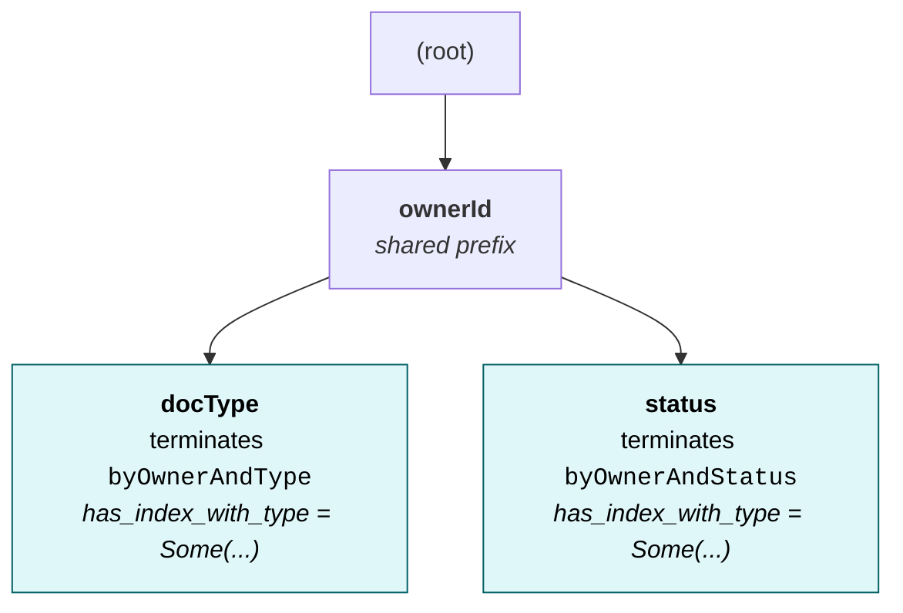
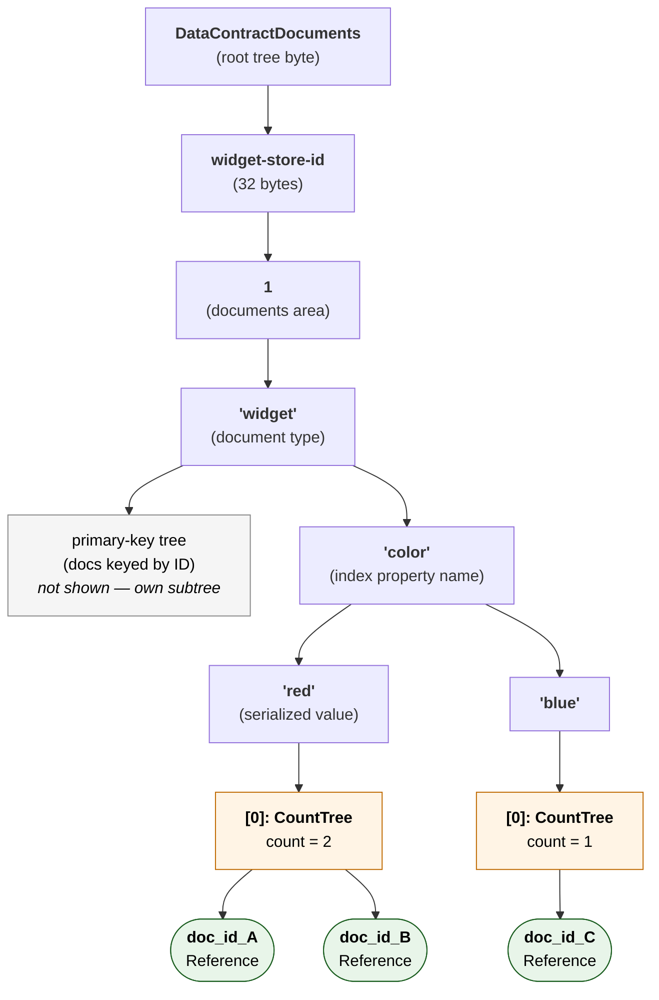
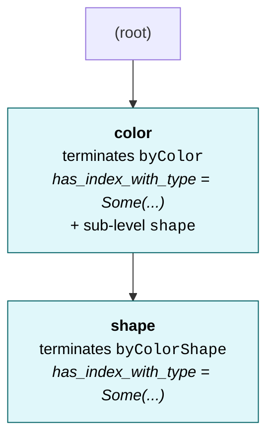
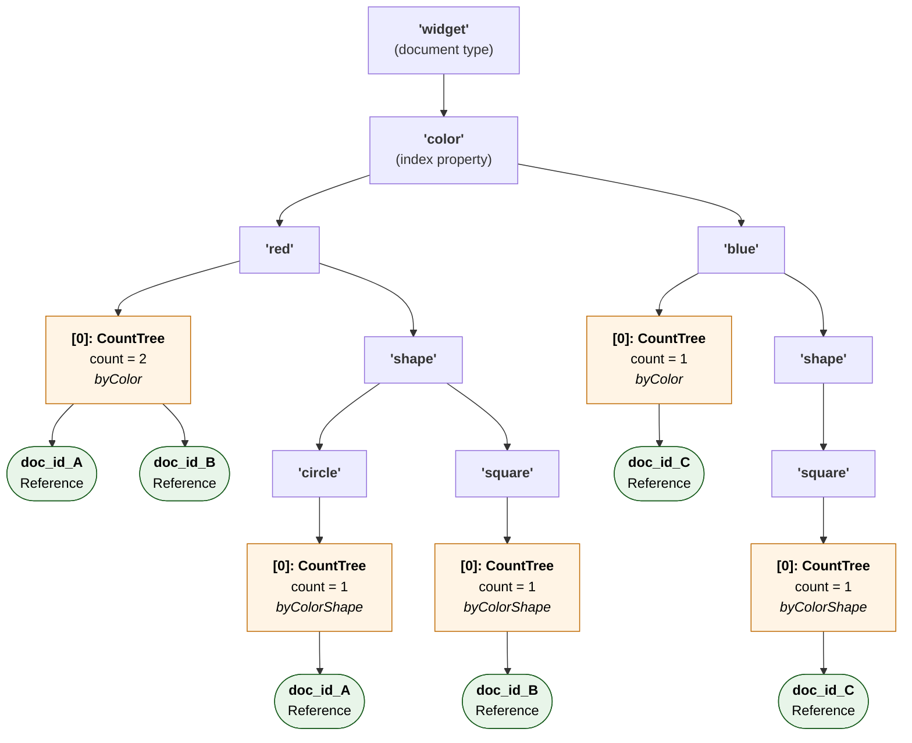
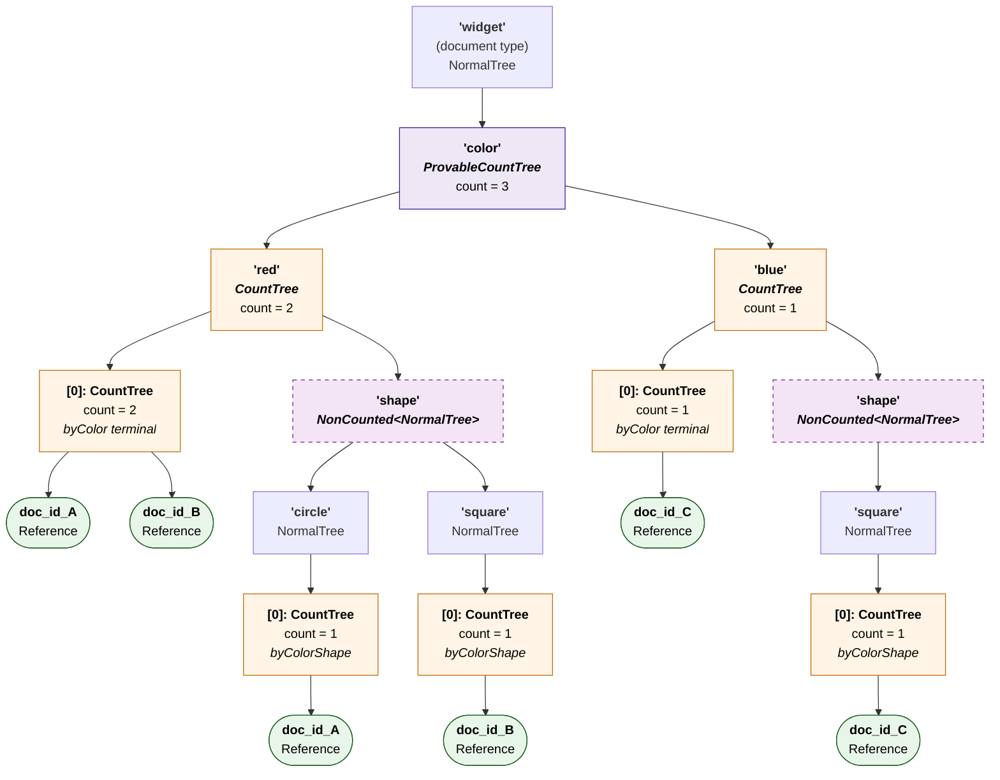
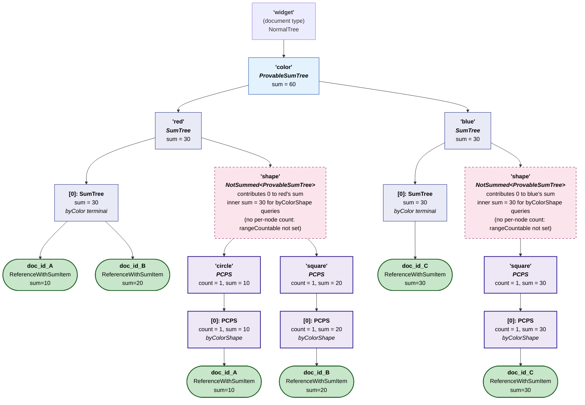
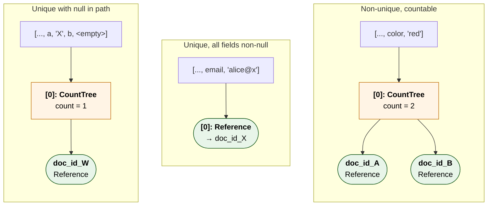

# Indexes

Drive stores documents in GroveDB. Every document type has a **primary-key tree** (documents keyed by document ID), plus zero or more **secondary indexes** the contract author declares in the document schema. This chapter is a reference for the `Index` struct's fields, what they mean for the on-disk layout, and how Drive walks indexes during inserts and queries.

## What an Index Is

A document type's `indices` array tells Drive: "for queries that filter or sort by these properties, build a sorted lookup so they don't have to enumerate every document." Each entry in `indices` becomes one secondary index; Drive maintains it on every insert/update/delete so that queries which match the index prefix are O(prefix walk) rather than O(documents).

Concrete example. Given:

```json
{
  "person": {
    "type": "object",
    "indices": [
      {
        "name": "byLastName",
        "properties": [{ "lastName": "asc" }]
      }
    ],
    "properties": {
      "firstName": { "type": "string", "position": 0 },
      "lastName":  { "type": "string", "position": 1 }
    },
    "required": ["firstName", "lastName"],
    "additionalProperties": false
  }
}
```

— a query like `where lastName = "Smith"` reaches the matching documents through the `byLastName` index in O(log n) plus the per-result IO. Without that index it would be a full document-type scan.

## The `Index` Struct

The compiled-Rust shape — the JSON schema fields are deserialized into this — lives in [`packages/rs-dpp/src/data_contract/document_type/index/mod.rs`](https://github.com/dashpay/platform/blob/v4.0-dev/packages/rs-dpp/src/data_contract/document_type/index/mod.rs):

```rust
pub struct Index {
    pub name: String,
    pub properties: Vec<IndexProperty>,
    pub unique: bool,
    pub null_searchable: bool,
    pub contested_index: Option<ContestedIndexInformation>,
    pub countable: IndexCountability,
}

pub struct IndexProperty {
    pub name: String,
    pub ascending: bool,
}
```

### `name`

A short, human-readable identifier for the index (e.g. `"byOwnerAndType"`). It shows up in error messages and is the key used in `document_type.indexes()` (`BTreeMap<String, Index>`). If omitted in the schema, a random alphanumeric name is generated. Two indexes within the same document type cannot share a name.

### `properties: Vec<IndexProperty>`

The ordered list of columns this index covers. Each `IndexProperty` is a `(name, ascending)` pair. Order matters: a query has to match a *prefix* of these properties for the index to be useful. An index `[lastName, firstName]` answers `where lastName = X` and `where lastName = X AND firstName = Y` but **not** `where firstName = Y` alone.

The schema form is:

```json
"properties": [
  { "lastName":  "asc" },
  { "firstName": "asc" }
]
```

`asc` / `desc` controls sort order on result enumeration. Drive currently only uses ascending storage, but the field is preserved through the contract.

### `unique: bool`

If `true`, no two documents may share the same combination of values for the indexed properties. The platform enforces this on insert: a duplicate trips a `DuplicateUniqueIndexError` consensus error.

A unique index changes the on-disk layout at the terminal level: instead of a sub-tree of document references keyed by document ID, the terminal stores a single bare `Reference` element pointing at the one document that matched. See [Tree Type at the Terminal Level](#tree-type-at-the-terminal-level) below.

Uniqueness can't be enforced when an indexed property is null, so a document with any null in the index path falls back to the non-unique storage shape for that document. See [Null Handling](#null-handling).

### `null_searchable: bool`

Defaults to `true`. Controls what happens when **all** indexed properties of a document are null:

- `null_searchable: true` — the document is still indexed at the all-null path, so a query against the all-null prefix can find it.
- `null_searchable: false` — Drive skips the index insertion entirely. Documents with all-null index values exist (in the primary-key tree) but are not reachable via this index.

The flag only affects the all-null case. A document with *some* null values gets indexed regardless.

### `contested_index: Option<ContestedIndexInformation>`

When set, this index identifies a **scarce, contested resource** (the canonical example is a DPNS name like `dash`). Documents trying to register the same value under a contested index don't auto-fail with a uniqueness error — they enter a masternode-vote resolution where each contender's claim is held until voting concludes. Contested indexes must also be `unique: true`; the parser rejects the combination otherwise.

Out of scope for this chapter; see DPNS / contested-resource docs for the full lifecycle.

### `countable: IndexCountability`

Controls whether the terminal tree under each indexed value carries a count, and which count-tree variant. Three variants:

| Value | Tree variant | Capabilities |
|---|---|---|
| `NotCountable` (default) | `NormalTree` | No count fast path |
| `Countable` | `CountTree` | O(1) totals at the root |
| `CountableAllowingOffset` | `ProvableCountTree` | O(1) totals **plus** per-node counts that will enable future O(log n) range / offset queries |

### `summable: Option<String>` and `range_summable: bool`

The sum-side analog of `countable` / `range_countable`. When `summable = Some(<property_name>)`, the terminal tree under each indexed value carries a running sum of the named property across the documents at that value — `O(1)` reads for `SUM(<property>) WHERE <indexed_field> = X` queries. The named property must be `type: integer` and listed in the document type's `required` array (the DPP validator enforces this at contract creation).

`range_summable: true` is the sum-side counterpart of `range_countable`: per-node aggregated sums committed to every internal merk node of the property-name tree, so `SUM(<property>) WHERE <indexed_field> BETWEEN A AND B` queries land on grovedb's `AggregateSumOnRange` primitive — `O(log n)`, no document enumeration. Like `range_countable`, it requires `summable` to be set; it's additive, not a replacement.

| `summable` | `range_summable` | Property-name tree | Value tree | Capabilities |
|---|---|---|---|---|
| `None` (default) | – | `NormalTree` | `NormalTree` | No sum fast path |
| `Some("amount")` | `false` | `NormalTree` | `SumTree` | O(1) `sum(amount) WHERE field = X` at the value-tree root |
| `Some("amount")` | `true` | `ProvableSumTree` | `SumTree` | O(1) point sum **plus** O(log n) range sums via `AggregateSumOnRange` |

Compose orthogonally with the count flags. Combining `countable` and `summable` on the same index yields one of grovedb's combined-aggregation tree variants (`CountSumTree`, `ProvableCountSumTree`, or `ProvableCountProvableSumTree`) — one tree carries both metrics, queries on either axis read from the same merk root. See **[Range-Summable Indexes](#range-summable-indexes)** below for the storage layout, the `ReferenceWithSumItem` element type that makes per-document contributions land on the parent SumTree, and how range-summable composes with range-countable to produce PCPS trees backing the new `AggregateCountAndSumOnRange` combined-proof primitive.

For the conceptual treatment of sum trees and the full `GetDocumentsSum` query surface, see [Document Sum Trees](document-sum-trees.md) (paralleling [Document Count Trees](document-count-trees.md)).

The schema accepts both the legacy boolean form (`true` → `Countable`, `false` → `NotCountable`) and the camelCase string form (`"notCountable"` / `"countable"` / `"countableAllowingOffset"`). For the full design rationale see [Document Count Trees](document-count-trees.md).

## How Drive Builds the IndexLevel Trie

The flat list of `Index`es declared on a document type is compiled, at contract-load time, into an `IndexLevel` trie ([`packages/rs-dpp/src/data_contract/document_type/index_level/mod.rs`](https://github.com/dashpay/platform/blob/v4.0-dev/packages/rs-dpp/src/data_contract/document_type/index_level/mod.rs)):

```rust
pub struct IndexLevel {
    sub_index_levels: BTreeMap<String, IndexLevel>,
    has_index_with_type: Option<IndexLevelTypeInfo>,
    level_identifier: u64,
}
```

Each property name in any index becomes an edge in this trie; indexes that share a prefix share their initial path. An index "terminates" at a level by setting `has_index_with_type = Some(...)` — that's how the recursive insert / lookup code knows it's at the last property of a defined index, vs. just walking through a shared prefix.

Given two indexes:
- `byOwnerAndType = [ownerId, docType]`
- `byOwnerAndStatus = [ownerId, status]`

the trie that gets built is:



The `ownerId` level is shared between both indexes. The `docType` and `status` levels each set `has_index_with_type` on themselves with their own `unique` / `countable` / `null_searchable` flags. A third index that *also* started with `ownerId` would attach further sub-levels under `ownerId` instead of duplicating it.

This trie shape directly mirrors the GroveDB path shape used at insert / query time.

## GroveDB Layout

A document under contract `C` of type `T` with index property `propA = vA, propB = vB` lives at the grove path:

```
[ DataContractDocuments,  contract_id,  1,  doc_type_name,
  propA_name, vA,  propB_name, vB,  0  →  <terminal element> ]
```

Let's break that down:

- **`DataContractDocuments`** — root tree byte (`u8` constant) for "this is a document index, not a contract definition or identity record".
- **`contract_id`** — 32-byte contract identifier.
- **`1`** — separator distinguishing the document storage area from the contract definition area within `contract_id`.
- **`doc_type_name`** — UTF-8 bytes of the document type (`"person"`, `"contactRequest"`, etc.).
- **`propA_name, vA, propB_name, vB`** — alternating property key and serialized value, one pair per index property, in declaration order.
- **`0`** — the conventional "terminal slot" byte under each value level; it's where the actual reference (or sub-tree-of-references) lives.

The intermediate levels (`propA_name`, `vA`, `propB_name`, `vB`) are all `NormalTree`s. The terminal element at `[0]` varies — see the next section.

Concretely, suppose a `widget-store` contract has document type `widget` with a non-unique countable index `byColor = [color]`, and three documents stored: `A` and `B` with `color = "red"`, `C` with `color = "blue"`. Then drive lays out:



**Legend**: rectangles are tree-type elements (intermediate `NormalTree`s holding sub-keys, terminal `CountTree`s holding per-doc refs); rounded green nodes are `Reference` elements (leaf pointers to documents). Amber highlight marks count-bearing trees specifically.

A query like `where color = "red"` walks the path down to the `red` value, opens the `[0]` `CountTree`, and either reads `count_value` (for `GetDocumentsCount`) or enumerates the inner references (for `GetDocuments`). Because the count is stored on the wrapping element, the count read is O(1) regardless of how many docs are inside.

### Shared-Prefix Indexes

Now extend the same `widget` document type with a `shape` property and a second, compound, countable index `byColorShape = [color, shape]`. The `IndexLevel` trie is:



Importantly, `color` is a level that *both* terminates an index (`byColor`) **and** has a sub-level (`shape`) continuing past it. That dual role shows up directly in the on-disk path: at every `[..., color, <value>]` subtree, key `[0]` (the `byColor` terminal) and key `'shape'` (the continuation into `byColorShape`) live as siblings.

With three documents — A: `(red, circle)`, B: `(red, square)`, C: `(blue, square)` — the layout is:



Two things to notice:

- **`[0]` and the sub-property name (`'shape'`) are siblings under each color value.** The `[0]` count tree is the `byColor` terminal at that color value; the `'shape'` subtree is the continuation that `byColorShape` walks past for the next index property. Drive descends one or the other depending on which index covers the query.
- **The same document is stored as a separate `Reference` under every index path that matches it.** Doc A appears under `byColor[red]` and under `byColorShape[red, circle]`; doc B under `byColor[red]` and `byColorShape[red, square]`; doc C under `byColor[blue]` and `byColorShape[blue, square]`. That's why each of A, B, C shows up twice in the diagram — once per index that covers the document. Insert/delete touches all of them; queries walk only the one path their picker selected.

A query like `where color = "red"` resolves through the `byColor` terminal (`[0]` under `red`) — count = 2, O(1). A query like `where color = "red" AND shape = "circle"` resolves through `byColorShape` instead, taking the `'shape'` sub-tree past `red` and reading the terminal under `circle` — count = 1, also O(1). Both queries are served by the same shared-prefix layout, just descending different branches at the `red` node.

### Range-Countable Indexes

> **Status: design.** Not yet implemented at the time of writing. Depends on a parallel grovedb change that adds `NonCounted<ElementType>` element variants — element types that behave exactly like their counterparts except that **their count value is not propagated to the parent count tree**, and which are only insertable inside a `CountTree` / `ProvableCountTree` / `CountSumTree` / `ProvableCountSumTree`.

`range_countable` is a *separate* per-index property from `countable`. Where `countable` makes the count of docs at *one specific value* O(1), `range_countable` makes the count of docs *between two values* O(log n) — answering queries like "how many widgets have a color between `red` and `tomato` alphabetically" without enumerating every distinct color value.

#### Constraints

- `range_countable: true` requires `countable` to be `Countable` or `CountableAllowingOffset`. It is additive to countability, not a replacement: range queries are useful only on indexes you'd already want to count by.
- The combination is meaningful only on **non-unique** indexes (or unique indexes whose entries can be null-bearing), for the same reason `countable` is mostly inert on unique-with-required-fields: a unique non-null terminal is a bare `Reference`, with no tree to hang per-node counts off of.
- Sibling sub-trees that share a prefix with a range-countable index — e.g., the `'shape'` continuation when `byColor` is range-countable but `byColorShape` shares its `color` prefix — must use `NonCounted<*>` variants so their counts do not pollute the range-countable value tree's count.

#### Mechanism

Where today's `countable` upgrades only the terminal `[0]` element under each indexed value to a count tree, `range_countable` additionally upgrades two more levels:

| Level | Without `range_countable` | With `range_countable` |
|---|---|---|
| Property-name tree (e.g. `'color'`) | `NormalTree` | `ProvableCountTree` |
| Value tree (e.g. `'red'`, `'blue'`) | `NormalTree` | `CountTree` |
| Terminal at `[0]` under each value | `NormalTree` / `CountTree` / `ProvableCountTree` (per `countable`) | unchanged — still driven by `countable` |
| Sibling continuations inside the value tree (e.g. `'shape'` for a compound index sharing the prefix) | `NormalTree` | `NonCounted<NormalTree>` |

The property-name tree is a `ProvableCountTree` rather than a plain `CountTree` because the merk-tree internal-node counts are exactly what makes range queries O(log n): walk the boundary path between the lower and upper bound, sum sub-counts at each internal node along the way. (See [Document Count Trees](document-count-trees.md) for the underlying mechanic.)

The value trees become `CountTree`s because the property-name `ProvableCountTree`'s aggregate is computed by summing each value tree's `count_value`. For that aggregate to mean "total docs at this property" rather than "number of distinct values", each value tree's `count_value` must equal "docs at this exact value" — which is only true if (a) the terminal `[0]` `CountTree` contributes its doc count, and (b) every sibling under the value tree (continuation sub-property names like `'shape'`, etc.) contributes **zero** rather than the default 1-per-Tree. That's what `NonCounted<NormalTree>` is for.

#### Layout

Same `byColor` + `byColorShape` example as before, with the same three documents (A: `(red, circle)`, B: `(red, square)`, C: `(blue, square)`), but now `byColor.range_countable: true`:



**Legend additions for this diagram**: purple = `ProvableCountTree`; amber = `CountTree`; dashed lavender = `NonCounted<*>` (the new grovedb variants); rounded green = `Reference`.

Walking through how the counts add up:

- **`'red'` (CountTree, count=2)** — its children are `[0]` (`CountTree`, contributes its `count_value` = 2) and `'shape'` (`NonCounted<NormalTree>`, contributes **0** — that's the whole point of the new variant). Aggregate = 2. ✓
- **`'blue'` (CountTree, count=1)** — same shape, 1 doc + 0. ✓
- **`'color'` (ProvableCountTree, count=3)** — its children are `'red'` (CountTree, contributes 2) and `'blue'` (CountTree, contributes 1). Aggregate = 3. The provable variant additionally stores per-internal-node counts inside its merk structure, which is what enables the range walk.

If `'shape'` were a plain `NormalTree` instead of `NonCounted<NormalTree>`, it would contribute 1 to `'red'` (every non-count-tree element contributes 1 by default — see [Document Count Trees § How Counts Aggregate](document-count-trees.md)). Then `'red'` would read as 3, `'blue'` as 2, `'color'` as 5 — a count of "docs + sub-property-trees", not "docs". The `NonCounted<*>` variant exists exactly to fix this.

#### Query — "count between two values"

With the layout above, a query like `WHERE color BETWEEN 'red' AND 'tomato'` resolves at the `'color'` `ProvableCountTree` level:

1. Walk the merk tree from `'color'`'s root, finding the boundary node between `'red'` (lower bound) and `'tomato'` (upper bound) — O(log distinct color values).
2. At each step, decide what to do with the *off-boundary* subtree using its pre-computed count: include its full `count_value` (subtree fully inside the range), exclude (fully outside), or recurse (straddles the boundary).
3. Sum the contributions; the result is the count of all docs whose color falls in `[red, tomato]`.

No leaf-level enumeration of distinct color values, no enumeration of individual documents — the count is computed entirely from the tree's pre-aggregated structure.

#### Compound indexes

`range_countable: true` on a compound index applies at the index's *terminating* level (its last property). For `byColorShape = [color, shape]` with `range_countable: true`:

- `'shape'` (the property-name tree under each color value) becomes a `ProvableCountTree`.
- Each `'circle'` / `'square'` value tree becomes a `CountTree`.
- Documents are referenced as `Element::Reference` leaves under those `CountTree`s, contributing 1 each to the count aggregate.

When the compound's leading prefix is also indexed by another `range_countable` index (e.g. `byColor` is also `range_countable`), sibling continuations under each color `CountTree` are wrapped with `Element::NonCounted` so a doc routed via `byColorShape` doesn't double-count under `byColor`'s color aggregate. The walker (`add_indices_for_index_level_for_contract_operations`) threads a `parent_value_tree_is_range_countable` flag down the recursion to decide when to wrap, regardless of whether the inner tree is itself a `ProvableCountTree`, `CountTree`, or plain `NormalTree`.

End-to-end coverage in `range_countable_index_e2e_tests` (in `packages/rs-drive/src/drive/contract/insert/insert_contract/v0/mod.rs`) pins the storage layout against a real grovedb — including the `count_tree_value_count_excludes_compound_continuation_via_non_counted` test that proves NonCounted-wrapping is load-bearing for compound-index correctness.

### Range-Summable Indexes

> **Status: live as of grovedb develop (PR #670 merged; head `e98bab5f` as of this PR)** (`feat: add Element::ProvableCountProvableSumTree + dual-axis crossover proofs`). Uses two grovedb element variants from that PR: `Element::ReferenceWithSumItem(ReferencePathType, MaxReferenceHop, SumValue, Option<ElementFlags>)` — a reference that *also* contributes an `i64` sum to its parent sum tree — and `Element::NotSummed<*>` / `Element::NotCountedOrSummed<*>` wrappers that opt out of sum (or both sum and count) propagation. The pure-sum side reuses the existing `SumTree` / `ProvableSumTree` variants; the combined-axis case uses `ProvableCountProvableSumTree`. Carrier-aggregate sum proofs work end-to-end via `GroveDb::verify_aggregate_sum_query_per_key` — see [Sum Index Examples Query 9](./sum-index-examples.md#query-9--carrier-aggregate-in-plus-range) for the byte-counts.

`range_summable` is the sum-side counterpart of `range_countable`. Where `countable` / `summable` make point-lookup aggregates O(1), `range_summable` makes range-sum queries O(log n) — answering "what's the **sum** of `price` for widgets with color between `red` and `tomato`?" without enumerating every distinct color value or every individual document.

The shape is structurally parallel to range-countable, but the per-element contribution rules are inverted, and that asymmetry shapes the storage layout in a subtle but load-bearing way.

#### Constraints

- `range_summable: true` requires `summable: Some(<property>)`. Same additive relationship as `range_countable` / `countable`.
- The named property must be `type: integer` and listed in `required` on the document type. The DPP validator enforces this at contract-creation time — without it, a missing-or-null value at insert would leave the reference with no sum contribution and silently underflow the ancestor sums on delete.
- The same property name must be used consistently across the doctype: `documents_summable` (if set) and every per-index `summable` must name the same property. Grovedb's sum trees aggregate `i64` per merk node without a per-tree property tag, so mixing properties would feed inconsistent contributions into the same merk hierarchy.
- Combining `range_summable` with `range_countable` on the same index promotes the property-name tree to `ProvableCountProvableSumTree` (PCPS) rather than nesting two trees — both metrics live on the same merk root and can be queried atomically. See [Combined: range-countable + range-summable](#combined-range-countable--range-summable) below.

#### Mechanism

`range_summable` upgrades the same three levels `range_countable` does, with the sum analogues at each level:

| Level | Without `range_summable` | With `range_summable` |
|---|---|---|
| Property-name tree (e.g. `'color'`) | `NormalTree` | `ProvableSumTree` |
| Value tree (e.g. `'red'`, `'blue'`) | `NormalTree` | `SumTree` |
| Terminal at `[0]` under each value | `NormalTree` / `SumTree` (per `summable`) | unchanged — still driven by `summable` |
| Sibling continuations (compound-index suffixes inside the value tree) | `NormalTree` | `NormalTree` — usually unwrapped (see below) |

The property-name tree is a `ProvableSumTree` rather than a plain `SumTree` for the same reason `range_countable` upgrades to `ProvableCountTree`: per-internal-node aggregated sums are what make range walks O(log n). Walk the boundary path between the lower and upper bound, sum sub-sums at each off-boundary internal node along the way. (See [Document Sum Trees](document-sum-trees.md) for the underlying mechanic.)

The value trees become `SumTree`s because the property-name `ProvableSumTree`'s aggregate is computed by combining each value tree's `sum_value`. For that aggregate to mean "total `<property>` at this color" rather than "first-byte-of-some-i64-garbage", each value tree's `sum_value` must equal the documented sum — which requires the **leaf elements stored under each value tree to be sum-bearing**.

That's where the layout diverges from count.

##### The contribution asymmetry: count auto-propagates, sum requires sum-bearing elements

Count trees automatically count *every* child element. A `NormalTree`, an `Item`, a `Reference` — each contributes `+1` to the parent's `count_value` by default. That's why `range_countable` needs `NonCounted<*>` wrappers everywhere: to **suppress** an aggregation that would otherwise happen.

Sum trees behave the opposite way. Only sum-bearing element variants — `SumItem`, `ItemWithSumItem`, `ReferenceWithSumItem`, and the sum-bearing tree variants themselves — contribute to a parent `SumTree`'s running sum. `Item`, `Reference`, plain `NormalTree`, `CountTree` — all contribute **0** by default. That has two consequences:

1. **Per-document contributions don't appear automatically.** A plain `Element::Reference` under a `SumTree` does not propagate any sum. We need a different reference element — `Element::ReferenceWithSumItem(path, max_hops, sum_value, flags)` — that carries an explicit `i64` sum contribution (the document's value at the `summable` property, frozen at insert time) alongside the usual reference-path bytes. Grovedb PR 670 adds this variant; Drive's index walker constructs it via [`make_document_reference_with_sum_item`](https://github.com/dashpay/platform/blob/v4.0-dev/packages/rs-drive/src/drive/document/mod.rs) under any index path with `summable.is_some()`.
2. **Sibling continuations usually don't need a wrapper.** A `NormalTree` continuation under a sum-bearing value tree contributes 0 by default — exactly what we want. No `NotSummed` wrap required. The exception is when the continuation is *itself* sum-bearing (e.g. a deeper compound index that's also `range_summable`); in that case wrap the continuation in `Element::NotSummed<*>` to keep its sum from leaking into the outer index's aggregate. Compare with `range_countable`, where **every** continuation needs `NonCounted` because every non-count-aware element auto-contributes 1.

#### Layout

Extend the widget contract with a numeric `price` property and promote both indexes to the sum surface:

```jsonc
{
  "widget": {
    "type": "object",
    "documentsCountable": true,                  // unchanged — total widget count fast path
    "properties": {
      "brand":  { "type": "string",  "position": 0, "maxLength": 32 },
      "color":  { "type": "string",  "position": 1, "maxLength": 32 },
      "shape":  { "type": "string",  "position": 2, "maxLength": 32 },
      "price":  { "type": "integer", "position": 3, "minimum": 0 } // ← new, summable target
    },
    "required": ["brand", "color", "shape", "price"],
    "indices": [
      {
        "name": "byColor",
        "properties": [{ "color": "asc" }],
        "summable": "price",                     // ← aggregate `price` per color
        "rangeSummable": true                    // ← per-node sums, range-queryable
      },
      {
        "name": "byColorShape",
        "properties": [{ "color": "asc" }, { "shape": "asc" }],
        "countable": "countable",                // ← per-(color, shape) doc count at O(1)
        "summable": "price",                     // ← aggregate `price` per (color, shape)
        "rangeSummable": true                    // ← per-node sums on the `shape` terminator
      }
    ],
    "additionalProperties": false
  }
}
```

Both indexes name **the same** sum property — `summable: "price"` in both. The DPP validator requires this: grovedb's sum trees aggregate `i64` per merk node with no per-tree property tag, so a contract that mixed `summable: "price"` and `summable: "fee"` on the same doctype would feed inconsistent contributions into the same merk hierarchy. `price` is `type: integer` and listed in `required` — both also enforced at contract-creation time.

`byColorShape` combines `countable` (root-only doc count per `(color, shape)` pair) with `summable` + `rangeSummable` (per-node sums of `price`). Drive's dispatch table promotes this combination to **`ProvableCountProvableSumTree`** (PCPS) at the value-tree and `[0]` terminal levels — the only grovedb variant carrying per-node sums also carries per-node counts as a side effect, so the count side gets per-node tracking "for free" even though only the sum side was opted into provability. See [`DocumentTypePrimaryKeyTreeType::primary_key_tree_type`'s v1 dispatch table](https://github.com/dashpay/platform/blob/v4.0-dev/packages/rs-drive/src/drive/document/primary_key_tree_type.rs) for the full mapping.

The two indexes share the `color` prefix exactly as the count examples did, so the same shared-prefix layout still applies. What changes is the element types at every level from `'color'` downward — and the diagram below makes the compound case visible, because the `'shape'` continuation under each color is now *itself* a sum-bearing tree (since `byColorShape` is `rangeSummable`) and needs `Element::NotSummed<*>`-wrapping to keep its aggregate from leaking into the outer `byColor` sum.

Document fixtures, three widgets: A: `(brand_acme, red, circle, price=10)`, B: `(brand_acme, red, square, price=20)`, C: `(brand_acme, blue, square, price=30)`. The on-disk layout:



**Legend additions for this diagram**: light blue = `ProvableSumTree`; indigo = `SumTree`; purple-outline = `ProvableCountProvableSumTree` (PCPS — per-node count *and* per-node sum); dashed pink = `NotSummed<*>` (contributes 0 to the parent's sum despite carrying its own internal aggregate); bold green = `ReferenceWithSumItem`.

Walking through how the aggregates layer:

**`byColor`'s view** (read at the `'color'` `ProvableSumTree` root, sum=60):

- **`'red'` (SumTree, sum=30)** — children are `[0]` (`SumTree`, contributes its `sum_value` = 30) and `'shape'` (`NotSummed<ProvableSumTree>`, contributes **0** — that's the whole point of the wrapper, even though its own internal aggregate is also 30 for `byColorShape` queries). Aggregate = 30. ✓
- **`'blue'` (SumTree, sum=30)** — same shape: `[0]` contributes 30, `'shape'` contributes 0. ✓
- **`'color'` (ProvableSumTree, sum=60)** — children are `'red'` (SumTree, 30) and `'blue'` (SumTree, 30). Aggregate = 60. The provable variant additionally stores per-internal-node sums inside its merk structure, which is what enables the range walk.

`byColor` is pure-sum (no `countable` flag) so the value trees here stay `SumTree` — there's no count aggregation at this layer.

**`byColorShape`'s view** (descends *through* the `NotSummed` wrapper rather than reading it; the inner `ProvableSumTree` aggregates the PCPS value trees beneath):

- **`'red' → 'shape'` (`ProvableSumTree`, inner sum=30)** — children are `'circle'` (PCPS, count=1 sum=10) and `'square'` (PCPS, count=1 sum=20). Inner aggregate = 30. Note that `'shape'` is `ProvableSumTree` rather than PCPS: only `rangeSummable` is set on `byColorShape`, not `rangeCountable`, so the *property-name* level (`'shape'`) aggregates sums per-node but doesn't track per-node counts.
- **`'blue' → 'shape'` (`ProvableSumTree`, inner sum=30)** — single child `'square'` (PCPS, count=1 sum=30). Inner aggregate = 30.
- Point lookup `SELECT COUNT(*), SUM(price) WHERE color = 'red' AND shape = 'circle'` reads the PCPS value tree directly — both metrics in one element read (count=1, sum=10), no traversal.
- Range query `SELECT SUM(price) WHERE color = 'red' AND shape BETWEEN 'a' AND 'z'` walks the red `'shape'` `ProvableSumTree`'s boundary and recovers sum=30 via `AggregateSumOnRange` in O(log distinct shape values). Range-count over the same boundary isn't supported (would need `rangeCountable: true` to promote `'shape'` to PCPS at the property-name level); range-count proofs over `shape` would need to enumerate the value-tree count_values manually.

##### Why PCPS at the value level

PCPS is grovedb's only tree variant carrying per-node sums. When an index sets `countable: "<tier>" + summable + rangeSummable`, the dispatch table promotes the value tree to PCPS because there's no "ProvableSumCountTree" variant (per-node sum + root-only count) to land on. The count side gets per-node tracking "for free" — same storage cost as `ProvableCountSumTree`'s count-half since PCPS commits the same per-node count metadata. See [`primary_key_tree_type.rs`'s v1 dispatch table](https://github.com/dashpay/platform/blob/v4.0-dev/packages/rs-drive/src/drive/document/primary_key_tree_type.rs) for the full mapping.

`byColor`, by contrast, has only `summable + rangeSummable` (no `countable`), so its value trees stay `SumTree` — root-only sum, no count tracking, no upgrade. The two indexes living side by side on the same widget contract show both sides of the dispatch.

##### Why the `NotSummed<*>` wrap is still needed

The `NotSummed<*>` wrap is what keeps the two index views consistent. `byColorShape`'s `'shape'` subtree carries its own internal aggregate (30 at red, 30 at blue); `byColor` must not let those aggregates leak into its color sums. The wrapper makes `'shape'` contribute exactly 0 to its parent `'red'` / `'blue'` SumTrees, so `byColor` reads from the `[0]` ref-bucket alone. Without the wrap, `'red'` would read as 60 = 30 (refs) + 30 (the shape subtree's leaked aggregate), and any document covered by both indexes would be double-counted in `byColor`'s aggregate.

Compare with the range-countable diagram above: there, the `'shape'` continuations needed `NonCounted<NormalTree>` wrapping because a plain `NormalTree` auto-contributes `+1` to a parent `CountTree`. Here the wrapper does conceptually the same job — suppress the would-be propagation — but for sum aggregation rather than count aggregation, and the wrapped variant is `NotSummed<ProvableSumTree>` because the continuation is itself sum-bearing (which is the only case where a sum wrapper is needed; plain `NormalTree` continuations naturally contribute 0 to a `SumTree` and don't need wrapping at all — see the asymmetry note above).

#### Query — "sum between two values"

A query like `SELECT SUM(price) WHERE color BETWEEN 'red' AND 'tomato'` resolves at the `'color'` `ProvableSumTree` level via grovedb's `AggregateSumOnRange` primitive:

1. Walk the merk tree from `'color'`'s root, finding the boundary node between `'red'` (lower bound) and `'tomato'` (upper bound) — O(log distinct color values).
2. At each step, decide what to do with the *off-boundary* subtree using its pre-computed sum: include its full `sum_value` (subtree fully inside the range), exclude (fully outside), or recurse (straddles the boundary).
3. Sum the contributions; the result is the total `price` across all docs whose color falls in `[red, tomato]`.

No leaf-level enumeration of distinct color values, no enumeration of individual documents — the sum is computed entirely from the tree's pre-aggregated structure, exactly mirroring `AggregateCountOnRange`. The verifier counterpart is `GroveDb::verify_aggregate_sum_query(proof, path_query, grove_version) -> Result<([u8; 32], i64), Error>` returning `(root_hash, aggregated_sum)`. (The sum is signed because grovedb's `SumTree` value type is `i64`. For tip-jar-style non-negative aggregations this stays ≥ 0 in practice; the verifier surfaces overflow into negative space as a distinct error rather than silently wrapping.)

#### Compound indexes

`range_summable: true` on a compound index applies at the index's *terminating* level (its last property). For an index `byCategoryPrice = [category, price]` with `summable: "price"` and `range_summable: true`:

- `'price'` (the property-name tree under each category value) becomes a `ProvableSumTree`.
- Each price-value tree becomes a `SumTree`.
- Documents are stored as `Element::ReferenceWithSumItem` leaves under those `SumTree`s, contributing their `price` to the sum aggregate.

When the compound's leading prefix is *also* an index that's `range_summable` (e.g. a separate `byCategory` index that's also summable on `price`), sibling continuations under each category `SumTree` need `Element::NotSummed<*>`-wrapping iff the continuation is itself sum-bearing — otherwise the inner sum-tree's aggregate would leak into the outer index's value-tree sum, double-counting documents that route through both indexes. The walker (`add_indices_for_index_level_for_contract_operations`) threads the parent value tree's aggregation flags down the recursion to decide when to wrap.

#### Combined: range-countable + range-summable

Setting both `range_countable: true` AND `range_summable: true` on the same index doesn't produce two separate trees — grovedb PR 670 adds a dedicated `ProvableCountProvableSumTree` (PCPS) variant that commits **both** per-node counts AND per-node sums to every internal merk node. A single tree carries both metrics, and three range primitives become available against it:

- `AggregateCountOnRange` — recovers just the count
- `AggregateSumOnRange` — recovers just the sum
- `AggregateCountAndSumOnRange` (PCPS-only, new in PR 670) — recovers BOTH from a single merk traversal, verified via `GroveDb::verify_aggregate_count_and_sum_query(...) -> Result<([u8; 32], u64, i64), Error>` returning `(root_hash, count, sum)`

The combined primitive is strictly cheaper than running two separate range queries: one proof envelope, one merk walk, and both metrics atomically bound to the same root hash (so they can't drift relative to each other across a concurrent write).

The full dispatch table mapping `(countable, range_countable, summable, range_summable)` combinations to grovedb tree variants lives in [`DocumentTypePrimaryKeyTreeType::primary_key_tree_type`](https://github.com/dashpay/platform/blob/v4.0-dev/packages/rs-drive/src/drive/document/primary_key_tree_type.rs)'s v1 arm; the index-walker dispatch in [`add_indices_for_index_level_for_contract_operations`](https://github.com/dashpay/platform/blob/v4.0-dev/packages/rs-drive/src/drive/document/insert/add_indices_for_index_level_for_contract_operations) follows the same table at every recursion level.

End-to-end coverage for the sum surface lives in [`packages/rs-drive/benches/document_sum_worst_case.rs`](https://github.com/dashpay/platform/blob/v4.0-dev/packages/rs-drive/benches/document_sum_worst_case.rs)'s tip-jar fixture (paralleling the count side's `document_count_worst_case.rs` widget bench), with the worked-example queries in [Sum Index Examples](sum-index-examples.md).

## Tree Type at the Terminal Level

The decision happens in [`add_reference_for_index_level_for_contract_operations/v0/mod.rs`](https://github.com/dashpay/platform/blob/v4.0-dev/packages/rs-drive/src/drive/document/insert/add_reference_for_index_level_for_contract_operations/v0/mod.rs):

```rust
if !index_type.index_type.is_unique() || any_fields_null {
    // Non-unique branch: insert an empty tree at [0], then put
    // each document's reference inside that tree. The tree's variant
    // is governed by `countable`:
    //   NotCountable             → NormalTree
    //   Countable                → CountTree
    //   CountableAllowingOffset  → ProvableCountTree
} else {
    // Unique branch: store a single Reference element at [0] directly.
}
```

So the matrix:

| `unique` | `any_fields_null` | `countable` | What lives at `[0]` |
|---|---|---|---|
| false | (any) | NotCountable | empty `NormalTree` containing per-doc references |
| false | (any) | Countable | empty `CountTree` containing per-doc references |
| false | (any) | CountableAllowingOffset | empty `ProvableCountTree` containing per-doc references |
| true | false | (any) | bare `Reference` to the one matching document |
| true | true | NotCountable | empty `NormalTree` containing per-doc references |
| true | true | Countable | empty `CountTree` containing per-doc references |
| true | true | CountableAllowingOffset | empty `ProvableCountTree` containing per-doc references |

Note the last three rows: a unique index *does* go through the count-tree branch when any indexed field is null. That's why `countable` on a unique index is meaningful exactly when at least one of the indexed properties is optional in the schema.

Visualizing the three terminal shapes side by side:



Same convention as the layout diagram above: rectangles are tree-type elements, rounded green nodes are `Reference` elements. Same key (`[0]`) at the terminal in all three panels — **what** lives there is what differs. The middle case is the one that's "special" — a bare `Reference` directly at `[0]` instead of a sub-tree containing references — and it's specifically scoped to the unique-and-no-nulls scenario.

## Null Handling

The `any_fields_null` and `all_fields_null` flags are accumulated as Drive descends the index property list during insertion ([`add_indices_for_index_level_for_contract_operations/v0/mod.rs:170-171`](https://github.com/dashpay/platform/blob/v4.0-dev/packages/rs-drive/src/drive/document/insert/add_indices_for_index_level_for_contract_operations/v0/mod.rs#L170-L171)):

```rust
any_fields_null |= document_index_field.is_empty();
all_fields_null &= document_index_field.is_empty();
```

`any_fields_null` becomes `true` the moment the walker hits any null/empty value at any level (first, middle, or last) and stays true for the rest of the descent. `all_fields_null` only stays true if every value seen so far is null.

By the time the recursion reaches the terminal:

- `any_fields_null = false` and the index is unique → unique branch (bare Reference).
- `any_fields_null = true` (regardless of unique) → non-unique-style branch (sub-tree containing references).
- `all_fields_null = true` AND `null_searchable = false` → the terminal call returns early without inserting anything; this document is not findable through this index.

This means *different documents under the same unique index can land in different storage shapes* depending on which of their indexed fields are null. A document with all required fields populated takes the bare-Reference shape; a document with a null in an optional indexed property takes the sub-tree shape, side by side under the same index.

## Insert Flow Summary

Putting it together, when Drive inserts a document into a contract `C` of type `T`:

1. **`add_indices_for_top_index_level_for_contract_operations`** — for each top-level entry in the document type's index trie (each first-property of any declared index), pushes the property name and the document's value for that property onto the path, computes the initial `any_fields_null` / `all_fields_null` for that single value, and recurses.
2. **`add_indices_for_index_level_for_contract_operations`** (recursive) — for each sub-level of the trie, pushes the property name and value onto the path, OR-accumulates `any_fields_null`, AND-accumulates `all_fields_null`, and recurses. If the current level has `has_index_with_type = Some(...)`, it also calls into step 3 *before* recursing further (because an index can terminate at a non-leaf trie level when another index continues past it).
3. **`add_reference_for_index_level_for_contract_operations`** — the terminal call. Decides between unique and non-unique-style storage using the matrix above; for the non-unique-style path it picks a `NormalTree` / `CountTree` / `ProvableCountTree` based on `countable`; finally inserts the document reference (or sub-tree containing it).

Deletion mirrors the same walk in reverse — see [`packages/rs-drive/src/drive/document/delete/`](https://github.com/dashpay/platform/blob/v4.0-dev/packages/rs-drive/src/drive/document/delete/).

## Query Traversal

When a query arrives at drive-abci, the document-query construction path picks one of the document type's indexes that "covers" the query — i.e., whose property prefix matches the query's equality clauses, in order. The picker is in [`packages/rs-drive/src/query/mod.rs`](https://github.com/dashpay/platform/blob/v4.0-dev/packages/rs-drive/src/query/mod.rs) (look for `fn construct_path_query` and the index-selection helpers it calls). For count queries specifically there's a separate, count-tree-aware picker ([`drive_document_count_query/mod.rs`](https://github.com/dashpay/platform/blob/v4.0-dev/packages/rs-drive/src/query/drive_document_count_query/mod.rs)) — see [Document Count Trees](document-count-trees.md) for that path.

Once an index is picked, the query-engine builds a `PathQuery` whose path is exactly the prefix shape the insert code produced: `[DataContractDocuments, contract_id, 1, doc_type, prop, value, prop, value, …]`. GroveDB then walks the path in O(log n per level), reading the terminal sub-tree (or single reference) and returning matching documents.

A query whose where-clauses don't form a *prefix* of any index can't take this fast path and falls back to a full-scan plan — which dapi-grpc surfaces as an error in most cases, since unbounded scans are deliberately discouraged.

## Choosing Index Settings

Quick checklist for contract authors:

- **Don't index what you won't query.** Each index costs storage on every insert/delete and counts against the per-document-type index limit (10 indexes per type currently).
- **Order index properties from most-selective to least-selective.** A `[country, city]` index is more useful than `[city, country]` for queries like `where country = "FR"`.
- **`unique: true`** when the platform should reject duplicates at the consensus layer. This is the right place for "this should be unique" invariants — don't enforce them application-side.
- **`countable: "countable"`** when you'll regularly call `GetDocumentsCount` with `==` (or `in`) clauses on **exactly** this index's properties. Adds a constant-factor overhead on insert/delete; reads become O(1). A `countable: true` index counts only queries whose where clauses match its properties exactly — partial-prefix queries are rejected with `WhereClauseOnNonIndexedProperty`, not falling through to a slow scan. Define a separate index per distinct count-query shape you want to support, or set `documentsCountable: true` on the document type for unfiltered totals.
- **`countable: "countableAllowingOffset"`** when you'll *also* want offset / range queries on this index in a future release. Strictly more expensive than plain `"countable"`; only worth it if you need the capability.
- **`null_searchable: true`** (the default) is right for almost all cases. Set to `false` only when documents with all-null indexed values shouldn't be findable through this index — typically a niche optimization to avoid a hot all-null prefix.

For specifically count-related concerns — primary-key-tree flags (`documentsCountable` / `rangeCountable`), the no-prove-vs-prove paths, and the operator restrictions — see the dedicated [Document Count Trees](document-count-trees.md) chapter.
