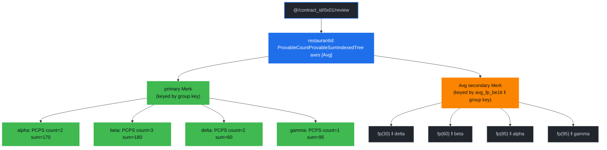

# Ranked Index Examples

This chapter walks through a representative contract and shows how **ranked queries** work on Drive. Every example uses the **restaurants contract** at [`packages/rs-drive/tests/supporting_files/contract/restaurants/restaurants-contract.json`](https://github.com/dashpay/platform/blob/v4.2-dev/packages/rs-drive/tests/supporting_files/contract/restaurants/restaurants-contract.json) — the same fixture the write-path e2e suite and the query suite share.

The chapter assumes you've read [Document Ranked Trees](./document-ranked-trees.md) for the storage layout, and the [Count](./count-index-examples.md) / [Sum](./sum-index-examples.md) / [Average](./average-index-examples.md) example chapters for the aggregate surfaces ranking builds on. Here we take the indexed-tree machinery as given and look at the query shape it enables: *"which `n` groups score highest?"*

> **Status:** implemented and gated at protocol version 14. Unlike the count / sum / average chapters, this one is **not** backed by a worst-case bench — there is no ranked bench, so no measured proof sizes or timings appear below. Every value shown is instead taken from the end-to-end suite at [`packages/rs-drive/src/query/drive_document_ranked_query/tests.rs`](https://github.com/dashpay/platform/blob/v4.2-dev/packages/rs-drive/src/query/drive_document_ranked_query/tests.rs), which runs prover and verifier against a live Drive and asserts the reconstructed root hash equals the database's own. Where a size is stated it is an asymptotic, not a measurement.

## Why Ranking Is a Different Query Shape

Every other aggregate query in Drive walks *value trees* under a property-name tree and aggregates what it finds: `AggregateCountOnRange` sums per-subtree counts along a boundary, the average carrier fans out over an `In` and aggregates each branch. A ranked query never touches the value trees at all. The answer already exists, pre-sorted, in the axis secondary described in the previous chapter — the query is a bounded scan of one end of it.

Three consequences shape the entire API, and they are the reason this chapter's "what is rejected" table is longer than its query list:

1. **No `where` clauses.** Ranked indexes are single-property, so there is no equality prefix to narrow; and a `where` on the ranked property itself asks for a *filtered* ranking, which the secondary cannot express — it is sorted by aggregate, not by group key.
2. **No `start_at` cursor.** A cursor names a document id, and document ids do not appear in a keyspace sorted by aggregate. `LIMIT` and `OFFSET` *are* honoured — they are how the ranking is sized and paged; see [Ranks and Offsets](#ranks-and-offsets).
3. **Entry order IS the ranking order.** The executor returns entries in the order grovedb walked the secondary. Callers must not re-sort.

The rejections are **rejections rather than silent ignores**, on both the client and the server, because a ranked walk cannot honour them and silently answering a different question is worse than an error.

### The grammar is plain SQL

A ranked query is spelled the way SQL already spells "the n highest-scoring groups":

```sql
SELECT avg(grade) FROM review
  GROUP BY restaurantId
  ORDER BY avg(grade) DESC
  LIMIT 3
```

`DESC` is the "top n" reading, `ASC` the "bottom n" reading. `LIMIT` is the ranking's size; `OFFSET` moves the window down the ranking.

**This replaced a non-SQL spelling that never shipped.** An earlier draft put the ranking on the right of a `HAVING` clause — `HAVING avg(grade) IN TOP(3)`, with `TOP` / `BOTTOM` / `MAX` / `MIN` as cross-group primitives. It was removed before release rather than deprecated. The deliberate call: SQL conformance beats a bespoke primitive. Every client author already knows `ORDER BY … LIMIT`; nobody knows `IN TOP(n)`, and the two express exactly the same thing. The retired spelling also had a rough edge the SQL one simply does not have — `= MAX` means *every* group tied at the extreme, which a bounded read cannot prove, so `MAX` / `MIN` had to be permanently refused. `ORDER BY <agg> DESC LIMIT 1` is positional and has no such ambiguity.

`HAVING` survives as what it is in SQL: a boolean per-group predicate — and since protocol v14 it is evaluated. A grouped aggregate carrying exactly one `having` clause that bounds the selected aggregate (`GROUP BY hashtag HAVING count(*) > 100 LIMIT 100`) is served as a value-bounded range read of the same axis secondary the ranking walks, with the same completeness-proving envelope. An `ORDER BY` naming the selected aggregate may ride along to set the walk direction (`HAVING avg(grade) > 80 ORDER BY avg(grade) DESC LIMIT 5` — the best matches first); what a `having` request cannot carry is rank-window pagination (`OFFSET`, `starting_rank`), because a value-bounded page has no rank base — its continuation is "tighten the bound past the last value seen". That continuation steps past *distinct* aggregate values only: if the `LIMIT` cuts inside a tie (several groups sharing the boundary aggregate), keeping the boundary value repeats the same page and moving past it permanently skips the remaining tied groups, so size the limit above the widest expected tie. The grammar's v1 boundaries: one clause only, on the aggregate the select projects, with a contiguous-range operator (`=`, `>`, `>=`, `<`, `<=`, `BETWEEN` variants; `!=` and `IN` are non-contiguous and refused).

## The Restaurants Contract

Four document types, one per ranking shape. They all group by the same property (`restaurantId`) and each carries exactly one single-property index — because two indexes over the same property set on one doctype is a `DuplicateIndexError`, so exercising all three axes needs one doctype apiece.

| doctype | index | declares | terminal property-name tree |
|---|---|---|---|
| `review` | `byRestaurant` | `averageable` + `rangeAverageable` + `rankedAverageable` | `ProvableCountProvableSumIndexedTree` axes `[Avg]` |
| `visit` | `byRestaurantVisits` | `countable` + `rangeCountable` + `rankedCountable` | `ProvableCountIndexedTree` |
| `tip` | `byRestaurantTips` | `summable` + `rangeSummable` + `rankedSummable` | `ProvableSumIndexedTree` |
| `adjustment` | `byRestaurantAdjustments` | same as `review` | `ProvableCountProvableSumIndexedTree` axes `[Avg]` |

`adjustment` duplicates `review`'s shape for one reason: its aggregated property `delta` admits negative values, which `grade` (`minimum: 0`) does not, so it is the only doctype that can exercise signed sums and the floor-toward-negative-infinity rounding of the Avg sort key.

```json
{
  "$formatVersion": "0",
  "id": "AY6xWncZUFv2GCrS5seqKthUfbW9yYyUXtF8diSuHQ3f",
  "ownerId": "AtirhSVpAWF7dEt6dLAmesC4Sr1MsJ9bFC1nLAoNnq2S",
  "version": 1,
  "documentSchemas": {
    "review": {
      "type": "object",
      "documentsMutable": true,
      "canBeDeleted": true,
      "indices": [
        {
          "name": "byRestaurant",
          "properties": [
            { "restaurantId": "asc" }
          ],
          "countable": "countable",
          "summable": "grade",
          "averageable": "grade",
          "rangeCountable": true,
          "rangeSummable": true,
          "rangeAverageable": true,
          "rankedAverageable": true
        }
      ],
      "properties": {
        "restaurantId": {
          "type": "string",
          "minLength": 1,
          "maxLength": 32,
          "position": 0
        },
        "grade": {
          "type": "integer",
          "minimum": 0,
          "maximum": 100,
          "position": 1
        }
      },
      "required": [
        "restaurantId",
        "grade"
      ],
      "additionalProperties": false
    },
    "visit": {
      "type": "object",
      "documentsMutable": true,
      "canBeDeleted": true,
      "indices": [
        {
          "name": "byRestaurantVisits",
          "properties": [
            { "restaurantId": "asc" }
          ],
          "countable": "countable",
          "rangeCountable": true,
          "rankedCountable": true
        }
      ],
      "properties": {
        "restaurantId": {
          "type": "string",
          "minLength": 1,
          "maxLength": 32,
          "position": 0
        },
        "guests": {
          "type": "integer",
          "minimum": 1,
          "maximum": 100,
          "position": 1
        }
      },
      "required": [
        "restaurantId",
        "guests"
      ],
      "additionalProperties": false
    },
    "tip": {
      "type": "object",
      "documentsMutable": true,
      "canBeDeleted": true,
      "indices": [
        {
          "name": "byRestaurantTips",
          "properties": [
            { "restaurantId": "asc" }
          ],
          "summable": "amount",
          "rangeSummable": true,
          "rankedSummable": true
        }
      ],
      "properties": {
        "restaurantId": {
          "type": "string",
          "minLength": 1,
          "maxLength": 32,
          "position": 0
        },
        "amount": {
          "type": "integer",
          "minimum": 0,
          "maximum": 1000000,
          "position": 1
        }
      },
      "required": [
        "restaurantId",
        "amount"
      ],
      "additionalProperties": false
    },
    "adjustment": {
      "type": "object",
      "documentsMutable": true,
      "canBeDeleted": true,
      "indices": [
        {
          "name": "byRestaurantAdjustments",
          "properties": [
            { "restaurantId": "asc" }
          ],
          "countable": "countable",
          "summable": "delta",
          "averageable": "delta",
          "rangeCountable": true,
          "rangeSummable": true,
          "rangeAverageable": true,
          "rankedAverageable": true
        }
      ],
      "properties": {
        "restaurantId": {
          "type": "string",
          "minLength": 1,
          "maxLength": 32,
          "position": 0
        },
        "delta": {
          "type": "integer",
          "minimum": -1000,
          "maximum": 1000,
          "position": 1
        }
      },
      "required": [
        "restaurantId",
        "delta"
      ],
      "additionalProperties": false
    }
  }
}
```

Three things to internalize before reading the queries:

1. **`rankedAverageable: true` is one line on top of six prerequisite flags.** The `countable` / `summable` / `averageable` trio and the three `range*` flags are what give the terminal property-name tree its per-group `(count, sum)`; the ranked flag adds the ordered secondary that sorts those groups. Drop any prerequisite and the contract is rejected at parse time.
2. **`visit` needs no aggregated property.** The Count axis ranks by group *cardinality*, so `COUNT(*)` takes no field — and both the `select` and the `having` aggregate carry an **empty** field string on the wire.
3. **`tip` is sum-only.** It declares no count flags, so its terminal tree is a `ProvableSumIndexedTree` — you can rank restaurants by total tips, but not by tip *average*, because there is no count axis to divide by. Averages need both.

## GroveDB Layout

Each doctype's terminal property-name tree at `restaurantId` is an indexed tree: a primary Merk keyed by group key, plus one secondary per declared axis keyed by `(sort_key ‖ group_key)`.

*Diagram conventions: blue is the indexed element wrapper; the primary Merk's children are the ordinary group value trees (green); the orange secondary holds one entry per group, aggregate-ordered.*



The full grove path down to that indexed tree, for a single-property index:

```text
[ RootTree::DataContractDocuments as u8 ]   // 0x01
  / <contract_id: 32 bytes>
  / [ 0x01 ]                                // "documents", not "contract"
  / <document_type_name: utf-8>             // e.g. b"review"
  / <last_index_property_name: utf-8>       // e.g. b"restaurantId"
```

Every ranked read and every ranked proof is issued against exactly that path, built by the same `DriveDocumentRankedQuery::indexed_property_name_tree_path` on both sides — which is why prover and verifier cannot drift on *which* ranking is being checked.

## The Request on the Wire

Ranked queries ride the existing `GetDocumentsRequestV1`. No new request message and no new field were added: `selects`, `group_by`, `order_by`, `limit` and `offset` already existed, and the ranking is expressed by what goes in them.

```proto
message GetDocumentsRequestV1 {
  // …
  repeated OrderClause order_by = 4;
  optional uint32      limit    = 5;
  bool                 prove    = 8;
  repeated Select      selects  = 9;
  repeated string      group_by = 10;
  optional uint32      offset   = 12;
}
```

A well-formed ranked request carries **exactly one** select, `group_by` property and `order_by` clause, and everything else at its unset wire value:

| Field | Ranked value |
|---|---|
| `selects` | one `Select { function: AVG, field: "grade" }` |
| `group_by` | `["restaurantId"]` |
| `order_by` | one `OrderClause { target: Field("grade"), ascending: false }` |
| `limit` | the ranking's `n`, `1 ..= 100` — **required** |
| `offset` | ranks to skip; unset = 0 |
| `where_clauses` | empty — **rejected if not** |
| `having` | empty — **rejected if not** |
| `start_after` / `start_at` | unset — **rejected if set** |

### Naming the aggregate in `ORDER BY`

The `order_by` clause names the aggregate it orders by through the wire's **field** target, and the name has to be the one the `select` already fixed:

| `select` | `order_by` field |
|---|---|
| `SUM(amount)` | `"amount"` |
| `AVG(grade)` | `"grade"` |
| `COUNT(*)` | `"$count"` |

`SUM(f)` / `AVG(f)` are named by `f` — the same property the projection aggregates, which is how `ORDER BY avg(grade)` reads once `SELECT` has fixed the function. `COUNT(*)` aggregates no property, so it is named by the reserved sentinel **`$count`** (`RANKED_COUNT_ORDER_KEY`). The `$` sigil is load-bearing: DPP reserves the `$` prefix for system properties (`$id`, `$ownerId`, …) and a schema cannot declare a property starting with it, so `$count` can never collide with a real column. A bare `count` would silently hijack ordering for any schema that happens to have a `count` field.

An `order_by` naming anything else — a second clause, the `GROUP BY` property, an unrelated field — is rejected rather than normalized. The SDK's `order_by_selected_aggregate()` builder derives the name from the `select` through rs-drive's own mapping, so there is no way to get it wrong by hand.

The wire also carries an explicit aggregate target (`OrderClause.target.aggregate`, e.g. `ORDER BY AVG(grade)` spelled out). It is still `Unsupported` — the field-target spelling above is the one the ranked executor reads — and exists so the explicit form can start being evaluated without another version bump.

`limit` is bounded to `1 ..= 100` (`MAX_RANKED_LIMIT`). Out-of-range is **rejected, not clamped** — `k` is echoed inside the proof envelope and re-checked by the verifier, so a server-side clamp would produce a proof the client's own reconstruction rejects.

## Ranks and Offsets

`OFFSET` is honoured on the ranked path — the one place in the v1 surface where it is — and it is how you ask for a rank rather than a prefix:

```sql
SELECT avg(grade) FROM review
  GROUP BY restaurantId
  ORDER BY avg(grade) DESC
  LIMIT 1 OFFSET 4        -- the 5th-best restaurant
```

The response carries the skip back in `RankedEntries.skipped` (see [The Response](#the-response)), so the page is self-describing.

`skipped` is the page's **starting rank base**: entry `i` is the group at rank `skipped + i` (0-based). Without it, a caller who asked for `LIMIT 1 OFFSET 4` receives one entry and has no way to tell that it really is the 5th-best group rather than the best. It is `0` for offset-less queries, which is what makes the field additive.

Three properties worth stating plainly:

- **The skip is counted, not walked.** grovedb descends the secondary reading each subtree's aggregate count and collapses any subtree that fits entirely inside the remaining offset, instead of stepping through it. Both paths do this: the prover attests the skipped region from the counted subtree commitments (`HashWithCount` / `HashWithCountAndSum`), and the unproven read performs the same counted descent without building a proof. Work and proof size stay `O(log n + k)` **at any offset**.
- **There is therefore no offset ceiling.** An offset of 4 and an offset of four billion cost the same order of work — on either path, the deeper one in fact cheaper, since a tree that fits entirely inside the offset collapses at the root. There is no denial-of-service lever a cap would close, and a cap would only stop honest deep pagination.
- **An offset past the end is a positive answer.** `entries` comes back empty and `skipped` is the ranking's *entire reported population*. "There are only 12 groups" is more information than a bare empty list.

Both paths report the same `skipped`: the offset you asked for when the skip succeeded, and the ranking's total population when the walk ran out of groups first. What differs is the warrant, not the value. On the proved path it is cryptographically attested, re-derived by the verifier from the counted commitments. On the unproven path it is an **unverified claim, exactly like the entries beside it** — equal to the attested value on an honest node, with nothing forcing a node to be honest. **Callers who need to trust the population, rather than merely receive it, must still prove.**

## The Response

The result is an additive `ResultData.ranked` variant:

```proto
message RankedEntry {
  bytes key = 1;
  oneof value {
    uint64 count = 2 [jstype = JS_STRING];
    sint64 sum   = 3 [jstype = JS_STRING];
    double avg   = 4;
  }
}

message RankedEntries {
  repeated RankedEntry entries = 1;
  optional uint64      skipped = 2 [jstype = JS_STRING];
}
```

Five properties of the payload, each of them load-bearing:

- **`skipped` is the page's starting rank** — see [Ranks and Offsets](#ranks-and-offsets). `0` for an offset-less query.
- **`key` is raw index-key bytes**, not a typed value — the same bytes that name the group's value tree under the index. For a `string` property that's its UTF-8 encoding (`b"alpha"`). Clients that want the typed value decode it with the document type's key deserialization; the wire carries bytes so prover and verifier agree without a schema round-trip.
- **Entry order IS the ranking order** — best-first for `DESC`, worst-first for `ASC`. Clients must not re-sort. Ties come back in group-key order *in the direction of the walk*, which is **descending** group-key order for `DESC`.
- **Fewer than `n` entries is normal**, not an error — the index simply has fewer groups than requested.
- **`avg` is a `double` approximation, and deliberately so.** What grovedb sorts the Avg axis by is an exact `i128` fixed point — `floor(sum × SCALE / count)` with euclidean (toward −∞) division — and this field is that integer divided by `RANKED_AVG_SCALE` in `f64`. The precision loss costs nothing because **`RankedEntry` only exists on the no-proof path**: a client that asked for a proof reconstructs each entry from the proof itself, where the exact fixed point lives, and never reads this field. So the wire says what it means — an approximation for the caller who already chose to trust the node — instead of dressing a trusted number up as an exact one. Two groups whose averages differ past `f64`'s ~15–16 significant digits can compare equal here; anything needing the committed integer must request the proof. Entry *order* is exact regardless: the ranking happened over the `i128` before the conversion. The decoder rejects a non-finite `avg`, or one that scales past `i128`, rather than casting it into a plausible-looking zero.

## Queries in this Chapter

Every query below uses the same shape — one aggregate select, one `group_by`, one `ORDER BY` on that aggregate and a `LIMIT` — and differs only in the axis and the ranking. All seven come from the end-to-end suite; the "verified result" rows are what the unproven read returned *and* what the verifier recovered from the proof, both asserted equal against the live grovedb root hash.

| # | Query | Doctype / axis | Complexity | Verified result |
|---|-------|----------------|------------|-----------------|
| 1 | [Top 3 by Average Grade](#query-1--top-3-restaurants-by-average-grade) | `review` / Avg | O(log G + k) | `gamma(95)`, `alpha(85)`, `beta(60)` |
| 2 | [The Worst Average](#query-2--the-worst-average-and-the-fixed-point-floor) | `review` / Avg | O(log G + 1) | `epsilon(10.5)` |
| 3 | [Top 2 by Visit Count](#query-3--top-2-restaurants-by-visit-count) | `visit` / Count | O(log G + k) | `delta(4)`, `beta(3)` |
| 4 | [The Quietest Restaurant](#query-4--the-quietest-restaurant) | `visit` / Count | O(log G + 1) | `alpha(1)` |
| 5 | [Bottom 3 by Tip Total](#query-5--bottom-3-restaurants-by-tip-total) | `tip` / Sum | O(log G + k) | `delta(1)`, `gamma(24)`, `alpha(25)` |
| 6 | [Four-Way Tie](#query-6--a-four-way-tie) | `tip` / Sum | O(log G + k) | `gamma`, `delta`, `beta`, `alpha` |
| 7 | [More Than Exist](#query-7--asking-for-more-groups-than-exist) | `tip` / Sum | O(log G + G) | `beta`, `alpha` (2 of a requested 100) |

**Complexity variable.** `G` = the number of distinct groups (distinct values of the ranked property). Notably absent: the total document count `N`. A ranked walk reads pre-committed per-group aggregates out of the secondary and never enumerates documents, so both work and proof size are `O(log G + k)` — independent of how many documents sit inside the groups it returns. Proof bytes grow linearly in `k` (one committed secondary entry per returned group) plus the `O(log G)` ancestor path, which is exactly why `k` is capped at 100.

## Query 1 — Top 3 Restaurants by Average Grade

Eight `review` documents across four restaurants:

| restaurant | grades | count | sum | average |
|---|---|---|---|---|
| `alpha` | 90, 80 | 2 | 170 | 85 |
| `beta` | 60, 70, 50 | 3 | 180 | 60 |
| `gamma` | 95 | 1 | 95 | 95 |
| `delta` | 40, 20 | 2 | 60 | 30 |

```text
select   = AVG(grade)
group_by = [restaurantId]
order_by = grade DESC
limit    = 3
prove    = true
```

**Path query:**

```text
path:  ["@", contract_id, 0x01, "review", "restaurantId"]
read:  indexed_avg_top_k(k = 3, descending = true)
```

**Verified result** (returned by `GroveDb::verify_indexed_axis_top_k`, wrapped by `DriveDocumentRankedQuery::verify_ranked_top_k_proof`):

```text
[ ("gamma", AvgFixedPoint(95 × SCALE)),
  ("alpha", AvgFixedPoint(85 × SCALE)),
  ("beta",  AvgFixedPoint(60 × SCALE)) ]

descending by average: gamma(95) > alpha(85) > beta(60) > delta(30)
```

`delta` is below the cut and never appears in the proof — that is the whole point. A count-tree walk would have had to commit all four groups to convince the client which three are highest; the secondary's ordering means committing three entries plus the boundary is sufficient.

The client divides: `95 × SCALE / SCALE = 95`. It never sees a `double` off the wire.

## Query 2 — The Worst Average (and the Fixed-Point Floor)

Add a fifth restaurant whose sum doesn't divide evenly: `epsilon` with grades 10 and 11.

```text
select   = AVG(grade)
group_by = [restaurantId]
order_by = grade ASC
limit    = 1
prove    = true
```

**Verified result:**

```text
[ ("epsilon", AvgFixedPoint(21 × SCALE / 2)) ]

21 / 2 = 10.5 is the lowest average
```

Three things this query pins:

- **`ORDER BY … ASC LIMIT 1` is the positional single worst-ranked group.** It walks the secondary from the smallest sort key up and stops after one entry.
- **The sort key is `floor(sum × SCALE / count)`**, computed with grovedb's own `compute_avg_fixed_point` — the test asserts the returned value against both the hand-written `21 × SCALE / 2` *and* grovedb's function, so a change to either the scale or the rounding shows up immediately.
- **`as_f64()` divides back down**, returning exactly `10.5`. It is a display helper: lossy for large counts and sums, and never to be used for consensus-relevant comparisons, since two groups whose fixed-point averages differ can round to the same `f64`.

For the negative half of the rounding story, the `adjustment` doctype exists: with `delta` admitting negatives, `expected_avg_fixed_point(-11, 3)` must come out exactly one fixed-point bucket *below* what truncating division would give, because euclidean division floors toward −∞ while Rust's `/` truncates toward zero.

## Query 3 — Top 2 Restaurants by Visit Count

Ten `visit` documents. The `guests` values are stored but irrelevant here — the Count axis ranks by how many documents are in each group, not by anything inside them:

| restaurant | visits | count |
|---|---|---|
| `delta` | 4 documents | 4 |
| `beta` | 3 documents | 3 |
| `gamma` | 2 documents | 2 |
| `alpha` | 1 document | 1 |

```text
select   = COUNT(*)
group_by = [restaurantId]
order_by = $count DESC
limit    = 2
prove    = true
```

**Verified result:**

```text
[ ("delta", Count(4)),
  ("beta",  Count(3)) ]

descending by document count: delta(4) > beta(3) > gamma(2) > alpha(1)
```

On the wire, both the select and the having aggregate carry `field: ""`. A non-empty field on a `COUNT` ranking is rejected — `COUNT(field)` (counting non-null values of a property) is a different aggregate and the ranked surface doesn't serve it.

Note that `visit`'s index declares no sum flags at all, so its terminal tree is a plain `ProvableCountIndexedTree` — a single secondary, no axes TLV. Asking for `SUM(guests)` or `AVG(guests)` against it resolves no index and is rejected: the stored element *could* host that secondary, but the contract never declared it, and the write path therefore never maintained it.

## Query 4 — The Quietest Restaurant

```text
select   = COUNT(*)
group_by = [restaurantId]
order_by = $count ASC
limit    = 1
prove    = true
```

**Verified result:**

```text
[ ("alpha", Count(1)) ]
```

Note what this query does **not** claim. `ORDER BY $count ASC LIMIT 1` is the *positional* single worst-ranked group: if two restaurants tied at one visit each, one of them comes back and the other does not, deterministically (ties break by group key in the walk's direction). It is not "every group at the minimum" — that is a set a bounded read cannot attest, and it is why the retired grammar's `= MIN` spelling could never have been served. The positional reading documents dropping ties as its meaning; the value-based one would have had to lie about it.

See [What Is Rejected and Why](#what-is-rejected-and-why) for the full reasoning.

## Query 5 — Bottom 3 Restaurants by Tip Total

Seven `tip` documents:

| restaurant | amounts | sum |
|---|---|---|
| `beta` | 100 | 100 |
| `alpha` | 10, 15 | 25 |
| `gamma` | 7, 8, 9 | 24 |
| `delta` | 1 | 1 |

```text
select   = SUM(amount)
group_by = [restaurantId]
order_by = amount ASC
limit    = 3
prove    = true
```

**Verified result:**

```text
[ ("delta", Sum(1)),
  ("gamma", Sum(24)),
  ("alpha", Sum(25)) ]

ascending by sum: delta(1) < gamma(24) < alpha(25) < beta(100)
```

`ORDER BY amount DESC LIMIT 1` on the same data returns `[("beta", Sum(100))]`.

Sums are signed (`sint64` on the wire, `i64` in the SDK) for the same reason the sum surface's are: grovedb's sum trees model overflow into negative space rather than saturating. The Sum axis's sort key is the `i64` with its sign bit flipped, which is what makes plain byte comparison order negatives below positives.

## Query 6 — A Four-Way Tie

Four groups, all summing to 50. Only the group key distinguishes them.

```text
select   = SUM(amount)
group_by = [restaurantId]
order_by = amount DESC              // and the ASC mirror
limit    = 4
```

**Verified results:**

```text
DESC LIMIT 4:  ["gamma", "delta", "beta", "alpha"]  // descending group key
ASC  LIMIT 4:  ["alpha", "beta", "delta", "gamma"]  // ascending group key
```

The two directions are exact reverses of each other under a full-width `k`. That falls out of the secondary's key layout rather than from a separate tie-break rule: keys are `(sort_key ‖ group_key)`, and the walk is a plain directional scan of that keyspace, so equal sort keys come back in group-key order *in the direction of the walk*.

The consequence that matters is determinism under truncation. `DESC LIMIT 2` on the same data returns `["gamma", "delta"]` — a **specific** subset, not an arbitrary one, and the same subset on every node. That reproducibility is what makes a tie-truncating `LIMIT k` provable at all, and it is the reason the retired `= MAX` spelling could never have been served: `= MAX` means *every* group at the extreme, and a bounded read cannot attest that nothing else ties.

## Query 7 — Asking For More Groups Than Exist

Two `tip` groups, `LIMIT 100`:

```text
select   = SUM(amount)
group_by = [restaurantId]
order_by = amount DESC
limit    = 100
prove    = true
```

**Verified result:**

```text
[ ("beta", Sum(20)), ("alpha", Sum(10)) ]
```

A short result is the index having fewer groups, not an error, and the proof round-trips just the same. The verifier enforces the bound in the other direction only: **at most** `k` entries, because more would mean the proof committed a longer walk than the request authorized.

## Fetching From the Rust SDK

`DocumentRankedEntries` lands on the standard `Fetch` trait against a `DocumentQuery`, with `order_by_selected_aggregate()` building the one ordering clause the surface needs:

```rust,no_run
use dash_sdk::{Sdk, platform::{DataContract, DocumentQuery, Fetch, Identifier}};
use dash_sdk::drive::query::SelectProjection;
use dash_sdk::platform::documents::document_query::RankingDirection;
use drive_proof_verifier::{DocumentRankedEntries, RankedEntryValue, RANKED_AVG_SCALE};
use futures::executor::block_on;

# const RESTAURANTS_CONTRACT_ID: [u8; 32] = [0; 32];
let sdk = Sdk::new_mock();
let contract = block_on(DataContract::fetch(&sdk, Identifier::new(RESTAURANTS_CONTRACT_ID)))
    .expect("fetch contract")
    .expect("contract exists");

let query = DocumentQuery::new(contract, "review")
    .expect("document type exists")
    .with_select(SelectProjection::avg("grade"))
    .with_group_by("restaurantId")
    .order_by_selected_aggregate(RankingDirection::Descending)
    .with_limit(5);

let ranked = block_on(DocumentRankedEntries::fetch(&sdk, query))
    .expect("fetch succeeds")
    .expect("a well-formed ranked query always answers");

// Entry order IS the ranking order — best first.
for (offset, entry) in ranked.entries.iter().enumerate() {
    let rank = ranked.starting_rank + offset as u64;
    let restaurant = String::from_utf8_lossy(&entry.key);
    if let RankedEntryValue::AvgFixedPoint(fixed_point) = entry.value {
        let average = (fixed_point as f64) / (RANKED_AVG_SCALE as f64);
        println!("#{}: {restaurant}: {average}", rank + 1);
    }
}
```

`fixed_point` is the exact integer the proof commits to on this (proved) path. On a `prove = false` fetch the wire carries only the `double` — the SDK re-scales it back into the same variant, so the low digits are reconstruction noise. See the [response notes](#the-response).

The **5th-best restaurant** is the same query with the window moved down one rank at a time:

```rust,no_run
# use dash_sdk::platform::{DataContract, DocumentQuery};
# use dash_sdk::platform::documents::document_query::RankingDirection;
# use dash_sdk::drive::query::SelectProjection;
# fn example(contract: DataContract) -> Result<(), dash_sdk::Error> {
// SELECT avg(grade) GROUP BY restaurantId
//   ORDER BY avg(grade) DESC LIMIT 1 OFFSET 4
let query = DocumentQuery::new(contract, "review")?
    .with_select(SelectProjection::avg("grade"))
    .with_group_by("restaurantId")
    .order_by_selected_aggregate(RankingDirection::Descending)
    .with_limit(1)
    .with_offset(4);
# Ok(())
# }
```

Notes on the surface:

- **`order_by_selected_aggregate()` derives the ordered field from the `select`** through rs-drive's own key mapping — `"grade"` for `AVG(grade)`, the `$count` sentinel for `COUNT(*)`. You never name it by hand, so client and server cannot disagree about what is being ordered. Set the `select` first; the builder reads it.
- **It replaces rather than appends.** A ranked query takes exactly one ordering clause.
- **`RANKED_AVG_SCALE` is a re-export of grovedb's constant**, which moved from `10^15` to `10^19` before release. Never hardcode the literal. `RankedEntryValue::as_f64()` does the same division for display purposes.
- **`ranked.entries` is `Vec<RankedEntry>`** in ranking order. Do not re-sort it. **`ranked.starting_rank`** is the rank of `entries[0]`, re-derived from the proof rather than taken from the node.
- **The `Fetch` path always requests a proof.** There is no `prove` knob on it; if you need the unproven read, that's the `DocumentRankedEntries::from_unproved_response` path.
- **No JS/WASM or FFI binding exists yet.** The ranked surface is Rust-SDK-only today; the generated gRPC types are present in the web client but nothing is hand-written on top of them.

## Proof Notes

**The root hash is the whole point.** The merk-level verifier returning `Ok` is not by itself evidence of anything. A bit-flip sweep over a real ranked envelope shows that most mutations do error out — but roughly **9%** of them (bytes of sibling-subtree hashes inside the ancestor layer proofs) verify cleanly and return the *correct* entries, under a **different** reconstructed root hash. What rejects those is the tenderdash composition: `drive_proof_verifier::verify_ranked_top_k_proof` checks the reconstructed root against the quorum-signed app hash for the response's block, and there is no path through it that yields entries without that check having run.

Three things grovedb checks before the entries come back:

1. **The envelope's `(axis, k, descending, offset)` match the query.** They are echoed in the proof and compared against the arguments, so a proof generated for a different ranking — or for a different page of the same one — is rejected rather than silently reinterpreted.
2. **The result's axis shape matches the requested axis** — a `Count` request must not come back holding `Sum` entries. Belt-and-braces on top of (1).
3. **At most `k` entries.** Fewer is normal; more would mean the proof committed a longer walk than the request authorized.

**Empty rankings prove.** An earlier iteration of this surface could not prove one: grovedb's non-paginated prover had no absence-proof shape for "this axis secondary has no entries", so the merk layer failed with `Cannot create proof for empty tree` and the node had to map that to an `invalid_argument` telling the caller to retry unproved. It was reachable by anyone — querying a freshly registered contract with `prove = true` did it.

The paginated prover (`prove_indexed_axis_top_k_paginated`) closed that gap: against an empty axis secondary it emits a **guaranteed-empty range** rather than refusing. Proving a ranking over an index with no documents now succeeds and returns an empty page, so the proved and unproven paths agree on the one case where they used to diverge. There is no fallback to implement and no rejection to recognise; `prove = true` is always answerable.

The same mechanism is what makes an offset past the end provable — see [Ranks and Offsets](#ranks-and-offsets). The node keeps a narrow backstop mapping for the old merk-level error because it names a *class* of failure rather than a single call site, but it is no longer a live path.

**Against a protocol-version-13 node**, the whole request is rejected as `Unsupported` — v13's query table has no ranked path and refuses the aggregate ordering. That is the intended activation gate, not a bug: a v13 node and a v14 node must disagree here and nowhere else, which is what lets a mixed-version network run through the upgrade.

## What Is Rejected and Why

Everything below is rejected *before* any grovedb work, and most of it is mirrored client-side so the caller learns without a round trip.

| Rejected | Why |
|---|---|
| **Compound (multi-property) ranked index** — at contract-parse time, `ranked aggregates are only supported on single-property indexes in this protocol version` | Two reasons. A compound index whose prefix level also terminates an aggregating index would need its ranked terminal tree wrapped in a `NonCounted` / `NotSummed` shell — and the storage layer structurally rejects any wrapper around an indexed tree, because the wrapper would neutralize the very aggregates the ranking indexes. Separately, the ranked query surface has no equality-prefix routing yet. Both are relaxable at a future protocol version. The query-side index picker is the backstop: it refuses compound indexes even if the flags are somehow present. |
| **`unique` ranked index** — `ranked aggregates are not supported on unique indexes: each group of a unique index contains at most one document, so there is nothing meaningful to rank` | Every ranking over a unique index degenerates to a constant-per-group ordering a plain range query already serves, while still paying for an indexed tree and its secondary maintenance on every write. |
| **Contested ranked index** | Covered transitively — a contested index is unique by construction, so it hits the check above. |
| **`where` clauses** — `InvalidWhereClauseComponents` | Ranked indexes are single-property, so there is no equality prefix to narrow; and a clause on the ranked property itself asks for a ranking over a filtered subset, which the secondary cannot answer because it is ordered by aggregate rather than by group key. Silently dropping the filter would return the global ranking under the guise of a filtered one. |
| **`start_at` / `start_after`** — `InvalidLimit` | The cursor names a document id, but a ranked walk iterates an aggregate-ordered keyspace in which document ids do not appear. |
| **`order_by` naming anything but the selected aggregate**, or more than one clause — `InvalidParameter` | The single ordering clause *is* the ranking, and the secondary is sorted by one aggregate only. An ordering on the `GROUP BY` property, on an unrelated field, or a second tie-break clause names an order the secondary cannot produce. Accepting and silently ignoring it is the one genuinely dangerous option. Use the aggregate's own name (`$count` for `COUNT(*)`), or flip `ASC` ↔ `DESC` to reverse the ranking. |
| **`group_by` with ≠ 1 property** — `InvalidParameter` | Ranked indexes are single-property, so there is no compound grouping to rank over. |
| **`having` that isn't one contiguous bound on the selected aggregate** | A grouped single-clause `having` bounding the selected aggregate is **served** since protocol v14 — it routes to the having-range executor, a value-bounded range read of the same axis secondary (see the `HAVING` paragraph above). What stays rejected: multiple clauses (a second predicate needs a per-candidate post-check no executor performs), a clause on a different aggregate than the select projects (same reason), non-contiguous operators (`!=`, `IN`), `having` without `group_by` (a single implicit group is a plain aggregate the client can bound itself), and `OFFSET` / `start_at` alongside `having` (a value-bounded page has no rank base; continuation is by tightening the bound). Protocol v13 and earlier reject every non-empty `having` unchanged. |
| **no `order_by` at all, on a grouped aggregate** — routed elsewhere | Without an ordering this is a plain grouped aggregate, not a ranking; the caller wanted the `DocumentSplitCounts` / `DocumentSplitSums` / `DocumentSplitAverages` surface. |
| **`COUNT(field)`** (non-`*`) — `Unsupported`; **`SUM` / `AVG` with an empty field** — `InvalidParameter` | The Count axis ranks group cardinality and takes no field; the Sum and Avg axes rank the property the index accumulates and require it. |
| **`limit` unset, `0`, or `> 100`** — `InvalidLimit` | A ranking with no `n` has no size, and `LIMIT 0` selects nothing. The ceiling is a **hard limit, not a clamp**, because `k` is echoed in the proof envelope and re-checked by the verifier — a silent clamp would produce a proof the client's own reconstruction rejects. |
| **A `SUM` / `AVG` ranking on a field the index doesn't accumulate** — no covering index | The picker requires the select's field to be the index's `summable` property. Resolving anything else would answer about the wrong property with no indication that a substitution happened. |
| ~~**Proving a ranking over an empty index**~~ | **No longer rejected.** The paginated prover emits a guaranteed-empty range against an empty axis secondary, so `prove = true` over an index with no documents returns an empty page. Listed here because it used to be a rejection and the old advice ("retry with `prove = false`") is now wrong. |

## At-a-Glance Comparison

| Query | Doctype | Terminal tree | Axis | Ranking | Returned variant |
|---|---|---|---|---|---|
| 1 — Top 3 by average | `review` | `ProvableCountProvableSumIndexedTree [Avg]` | Avg | `ORDER BY grade DESC LIMIT 3` | `AvgFixedPoint(i128)` |
| 2 — Worst average | `review` | same | Avg | `ORDER BY grade ASC LIMIT 1` | `AvgFixedPoint(i128)` |
| 3 — Top 2 by visits | `visit` | `ProvableCountIndexedTree` | Count | `ORDER BY $count DESC LIMIT 2` | `Count(u64)` |
| 4 — Quietest | `visit` | same | Count | `ORDER BY $count ASC LIMIT 1` | `Count(u64)` |
| 5 — Bottom 3 by tips | `tip` | `ProvableSumIndexedTree` | Sum | `ORDER BY amount ASC LIMIT 3` | `Sum(i64)` |
| 6 — Four-way tie | `tip` | same | Sum | `ORDER BY amount DESC/ASC LIMIT 4` | `Sum(i64)` |
| 7 — More than exist | `tip` | same | Sum | `ORDER BY amount DESC LIMIT 100` | `Sum(i64)` (2 entries) |

Every row is one bounded scan of one secondary Merk, one proof, one root-hash commit. The shape never varies with the axis — only the sort-key width (8 / 8 / 16 bytes) and the returned scalar type do.

## What's Next

Two capabilities are deliberately deferred and would each land as a separate protocol-version change:

- **Compound ranked indexes.** Both blockers are named above — the indexed-tree wrapper conflict and the missing equality-prefix routing. Lifting them would enable "top 5 chefs at restaurant `alpha` by average grade" without a client-side sort.
- **Offset-paginated rankings.** grovedb already has the primitive (`prove_indexed_axis_top_k_paginated`); it is not exposed because a ranked query currently rejects every pagination knob, and wiring one in would need the result-size contract (`result size == n`) to be rewritten rather than extended.

For the shape of the tree these queries read, and the write-path cost of maintaining it, see [Document Ranked Trees](./document-ranked-trees.md).
