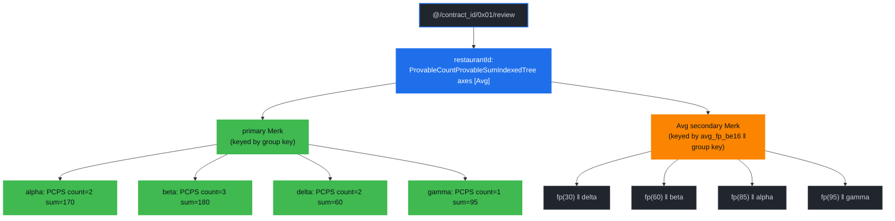

# Ranked Index Examples

This chapter walks through a representative contract and shows how **ranked queries** work on Drive. Every example uses the **restaurants contract** at [`packages/rs-drive/tests/supporting_files/contract/restaurants/restaurants-contract.json`](https://github.com/dashpay/platform/blob/v4.2-dev/packages/rs-drive/tests/supporting_files/contract/restaurants/restaurants-contract.json) — the same fixture the write-path e2e suite and the query suite share.

The chapter assumes you've read [Document Ranked Trees](./document-ranked-trees.md) for the storage layout, and the [Count](./count-index-examples.md) / [Sum](./sum-index-examples.md) / [Average](./average-index-examples.md) example chapters for the aggregate surfaces ranking builds on. Here we take the indexed-tree machinery as given and look at the query shape it enables: *"which `n` groups score highest?"*

> **Status:** implemented and gated at protocol version 14. Unlike the count / sum / average chapters, this one is **not** backed by a worst-case bench — there is no ranked bench, so no measured proof sizes or timings appear below. Every value shown is instead taken from the end-to-end suite at [`packages/rs-drive/src/query/drive_document_ranked_query/tests.rs`](https://github.com/dashpay/platform/blob/v4.2-dev/packages/rs-drive/src/query/drive_document_ranked_query/tests.rs), which runs prover and verifier against a live Drive and asserts the reconstructed root hash equals the database's own. Where a size is stated it is an asymptotic, not a measurement.

## Why Ranking Is a Different Query Shape

Every other aggregate query in Drive walks *value trees* under a property-name tree and aggregates what it finds: `AggregateCountOnRange` sums per-subtree counts along a boundary, the average carrier fans out over an `In` and aggregates each branch. A ranked query never touches the value trees at all. The answer already exists, pre-sorted, in the axis secondary described in the previous chapter — the query is a bounded scan of one end of it.

Three consequences shape the entire API, and they are the reason this chapter's "what is rejected" table is longer than its query list:

1. **No `where` clauses.** Ranked indexes are single-property, so there is no equality prefix to narrow; and a `where` on the ranked property itself asks for a *filtered* ranking, which the secondary cannot express — it is sorted by aggregate, not by group key.
2. **No `limit` / `offset` / `start_at`.** The result size is the `n` of the ranking. A second, independent limit could only disagree with it.
3. **Entry order IS the ranking order.** The executor returns entries in the order grovedb walked the secondary. Callers must not re-sort.

Each of those is **rejected rather than ignored**, on both the client and the server, because a ranked walk cannot honour them and silently answering a different question is worse than an error.

## The Restaurants Contract

Four document types, one per ranking shape. They all group by the same property (`restaurantId`) and each carries exactly one single-property index — because two indexes over the same property set on one doctype is a `DuplicateIndexError`, so exercising all three axes needs one doctype apiece.

| doctype | index | declares | terminal property-name tree |
|---|---|---|---|
| `review` | `byRestaurant` | `averageable` + `rangeAverageable` + `rankedAverageable` | `ProvableCountProvableSumIndexedTree` axes `[Avg]` |
| `visit` | `byRestaurantVisits` | `countable` + `rangeCountable` + `rankedCountable` | `ProvableCountIndexedTree` |
| `tip` | `byRestaurantTips` | `summable` + `rangeSummable` + `rankedSummable` | `ProvableSumIndexedTree` |
| `adjustment` | `byRestaurantAdjustments` | same as `review` | `ProvableCountProvableSumIndexedTree` axes `[Avg]` |

`adjustment` duplicates `review`'s shape for one reason: its aggregated property `delta` admits negative values, which `grade` (`minimum: 0`) does not, so it is the only doctype that can exercise signed sums and the floor-toward-negative-infinity rounding of the Avg sort key.

```json
{
  "$formatVersion": "0",
  "id": "AY6xWncZUFv2GCrS5seqKthUfbW9yYyUXtF8diSuHQ3f",
  "ownerId": "AtirhSVpAWF7dEt6dLAmesC4Sr1MsJ9bFC1nLAoNnq2S",
  "version": 1,
  "documentSchemas": {
    "review": {
      "type": "object",
      "documentsMutable": true,
      "canBeDeleted": true,
      "indices": [
        {
          "name": "byRestaurant",
          "properties": [
            { "restaurantId": "asc" }
          ],
          "countable": "countable",
          "summable": "grade",
          "averageable": "grade",
          "rangeCountable": true,
          "rangeSummable": true,
          "rangeAverageable": true,
          "rankedAverageable": true
        }
      ],
      "properties": {
        "restaurantId": {
          "type": "string",
          "minLength": 1,
          "maxLength": 32,
          "position": 0
        },
        "grade": {
          "type": "integer",
          "minimum": 0,
          "maximum": 100,
          "position": 1
        }
      },
      "required": [
        "restaurantId",
        "grade"
      ],
      "additionalProperties": false
    },
    "visit": {
      "type": "object",
      "documentsMutable": true,
      "canBeDeleted": true,
      "indices": [
        {
          "name": "byRestaurantVisits",
          "properties": [
            { "restaurantId": "asc" }
          ],
          "countable": "countable",
          "rangeCountable": true,
          "rankedCountable": true
        }
      ],
      "properties": {
        "restaurantId": {
          "type": "string",
          "minLength": 1,
          "maxLength": 32,
          "position": 0
        },
        "guests": {
          "type": "integer",
          "minimum": 1,
          "maximum": 100,
          "position": 1
        }
      },
      "required": [
        "restaurantId",
        "guests"
      ],
      "additionalProperties": false
    },
    "tip": {
      "type": "object",
      "documentsMutable": true,
      "canBeDeleted": true,
      "indices": [
        {
          "name": "byRestaurantTips",
          "properties": [
            { "restaurantId": "asc" }
          ],
          "summable": "amount",
          "rangeSummable": true,
          "rankedSummable": true
        }
      ],
      "properties": {
        "restaurantId": {
          "type": "string",
          "minLength": 1,
          "maxLength": 32,
          "position": 0
        },
        "amount": {
          "type": "integer",
          "minimum": 0,
          "maximum": 1000000,
          "position": 1
        }
      },
      "required": [
        "restaurantId",
        "amount"
      ],
      "additionalProperties": false
    },
    "adjustment": {
      "type": "object",
      "documentsMutable": true,
      "canBeDeleted": true,
      "indices": [
        {
          "name": "byRestaurantAdjustments",
          "properties": [
            { "restaurantId": "asc" }
          ],
          "countable": "countable",
          "summable": "delta",
          "averageable": "delta",
          "rangeCountable": true,
          "rangeSummable": true,
          "rangeAverageable": true,
          "rankedAverageable": true
        }
      ],
      "properties": {
        "restaurantId": {
          "type": "string",
          "minLength": 1,
          "maxLength": 32,
          "position": 0
        },
        "delta": {
          "type": "integer",
          "minimum": -1000,
          "maximum": 1000,
          "position": 1
        }
      },
      "required": [
        "restaurantId",
        "delta"
      ],
      "additionalProperties": false
    }
  }
}
```

Three things to internalize before reading the queries:

1. **`rankedAverageable: true` is one line on top of six prerequisite flags.** The `countable` / `summable` / `averageable` trio and the three `range*` flags are what give the terminal property-name tree its per-group `(count, sum)`; the ranked flag adds the ordered secondary that sorts those groups. Drop any prerequisite and the contract is rejected at parse time.
2. **`visit` needs no aggregated property.** The Count axis ranks by group *cardinality*, so `COUNT(*)` takes no field — and both the `select` and the `having` aggregate carry an **empty** field string on the wire.
3. **`tip` is sum-only.** It declares no count flags, so its terminal tree is a `ProvableSumIndexedTree` — you can rank restaurants by total tips, but not by tip *average*, because there is no count axis to divide by. Averages need both.

## GroveDB Layout

Each doctype's terminal property-name tree at `restaurantId` is an indexed tree: a primary Merk keyed by group key, plus one secondary per declared axis keyed by `(sort_key ‖ group_key)`.

*Diagram conventions: blue is the indexed element wrapper; the primary Merk's children are the ordinary group value trees (green); the orange secondary holds one entry per group, aggregate-ordered.*



The full grove path down to that indexed tree, for a single-property index:

```text
[ RootTree::DataContractDocuments as u8 ]   // 0x01
  / <contract_id: 32 bytes>
  / [ 0x01 ]                                // "documents", not "contract"
  / <document_type_name: utf-8>             // e.g. b"review"
  / <last_index_property_name: utf-8>       // e.g. b"restaurantId"
```

Every ranked read and every ranked proof is issued against exactly that path, built by the same `DriveDocumentRankedQuery::indexed_property_name_tree_path` on both sides — which is why prover and verifier cannot drift on *which* ranking is being checked.

## The Request on the Wire

Ranked queries ride the existing `GetDocumentsRequestV1`. No new request message and no new field were added: `selects`, `group_by` and `having` already existed, and the ranking is expressed by what goes in them.

```proto
message GetDocumentsRequestV1 {
  // …
  repeated Select      selects  = 9;
  repeated string      group_by = 10;
  repeated HavingClause having  = 11;
  bool                 prove    = 8;
}
```

A well-formed ranked request carries **exactly one** of each of the first three, and everything else at its unset wire value:

| Field | Ranked value |
|---|---|
| `selects` | one `Select { function: AVG, field: "grade" }` |
| `group_by` | `["restaurantId"]` |
| `having` | one `HavingClause { aggregate: {AVG, "grade"}, operator: IN, right: Ranking{TOP, n: 5} }` |
| `where_clauses` | empty — **rejected if not** |
| `order_by` | empty — **rejected if not** |
| `limit` / `offset` | unset — **rejected if set** |
| `start_after` / `start_at` | unset — **rejected if set** |

The `having` aggregate must be the *same* aggregate as the `select`; ranking one thing while projecting another is rejected. For `COUNT(*)` rankings, **both** the select's `field` and the having aggregate's `field` are the empty string.

The ranking operand itself:

```proto
message HavingRanking {
  enum Kind {
    MIN = 0;
    MAX = 1;
    TOP = 2;
    BOTTOM = 3;
  }
  Kind kind = 1;
  // N-th rank for `TOP` / `BOTTOM` (1-indexed: `n=1` is the
  // single largest / smallest). Required for those two kinds,
  // and its absence is rejected at evaluation rather than at
  // decode. Ignored for `MIN` / `MAX`, which evaluation
  // rejects whether or not it is set.
  optional uint64 n = 2 [jstype = JS_STRING];
}
```

**Operator pairing** is the surface's sharpest edge. `TOP(n)` / `BOTTOM(n)` are *set membership* and take `IN`; `MAX` / `MIN` are value-based scalars and take `=`. `= TOP(1)` is also accepted, so the `n == 1` case is not a trap. The SDK's `ranking_having()` constructor exists to get this pairing right without the caller thinking about it.

`n` is bounded to `1 ..= 100` (`MAX_RANKED_LIMIT`). Out-of-range is **rejected, not clamped** — `k` is echoed inside the proof envelope and re-checked by the verifier, so a server-side clamp would produce a proof the client's own reconstruction rejects.

## The Response

The result is an additive `ResultData.ranked` variant:

```proto
message RankedEntry {
  bytes key = 1;
  oneof value {
    uint64 count           = 2 [jstype = JS_STRING];
    sint64 sum             = 3 [jstype = JS_STRING];
    bytes  avg_fixed_point = 4;
  }
}

message RankedEntries {
  repeated RankedEntry entries = 1;
}
```

Four properties of the payload, each of them load-bearing:

- **`key` is raw index-key bytes**, not a typed value — the same bytes that name the group's value tree under the index. For a `string` property that's its UTF-8 encoding (`b"alpha"`). Clients that want the typed value decode it with the document type's key deserialization; the wire carries bytes so prover and verifier agree without a schema round-trip.
- **Entry order IS the ranking order** — best-first for `TOP(n)`, worst-first for `BOTTOM(n)`. Clients must not re-sort. Ties come back in group-key order *in the direction of the walk*, which is **descending** group-key order for `TOP`.
- **Fewer than `n` entries is normal**, not an error — the index simply has fewer groups than requested.
- **`avg_fixed_point` is a 16-byte big-endian two's-complement `i128`**, the exact integer grovedb sorts the Avg axis by: `floor(sum × SCALE / count)` with euclidean (toward −∞) division. It is carried as raw bytes because protobuf has no 128-bit integer type, and as the exact fixed-point integer rather than a `double` because *this is the value the proof commits to* — rounding server-side would make two groups with distinct averages indistinguishable and break the client's byte-for-byte comparison. The client divides by `RANKED_AVG_SCALE`; the decoder rejects anything that isn't exactly 16 bytes rather than zero-padding a short buffer.

## Queries in this Chapter

Every query below uses the same shape — one aggregate select, one `group_by`, one ranking `having` — and differs only in the axis and the ranking. All seven come from the end-to-end suite; the "verified result" rows are what the unproven read returned *and* what the verifier recovered from the proof, both asserted equal against the live grovedb root hash.

| # | Query | Doctype / axis | Complexity | Verified result |
|---|-------|----------------|------------|-----------------|
| 1 | [Top 3 by Average Grade](#query-1--top-3-restaurants-by-average-grade) | `review` / Avg | O(log G + k) | `gamma(95)`, `alpha(85)`, `beta(60)` |
| 2 | [The Worst Average](#query-2--the-worst-average-and-the-fixed-point-floor) | `review` / Avg | O(log G + 1) | `epsilon(10.5)` |
| 3 | [Top 2 by Visit Count](#query-3--top-2-restaurants-by-visit-count) | `visit` / Count | O(log G + k) | `delta(4)`, `beta(3)` |
| 4 | [The Quietest Restaurant](#query-4--the-quietest-restaurant) | `visit` / Count | O(log G + 1) | `alpha(1)` |
| 5 | [Bottom 3 by Tip Total](#query-5--bottom-3-restaurants-by-tip-total) | `tip` / Sum | O(log G + k) | `delta(1)`, `gamma(24)`, `alpha(25)` |
| 6 | [Four-Way Tie](#query-6--a-four-way-tie) | `tip` / Sum | O(log G + k) | `gamma`, `delta`, `beta`, `alpha` |
| 7 | [More Than Exist](#query-7--asking-for-more-groups-than-exist) | `tip` / Sum | O(log G + G) | `beta`, `alpha` (2 of a requested 100) |

**Complexity variable.** `G` = the number of distinct groups (distinct values of the ranked property). Notably absent: the total document count `N`. A ranked walk reads pre-committed per-group aggregates out of the secondary and never enumerates documents, so both work and proof size are `O(log G + k)` — independent of how many documents sit inside the groups it returns. Proof bytes grow linearly in `k` (one committed secondary entry per returned group) plus the `O(log G)` ancestor path, which is exactly why `k` is capped at 100.

## Query 1 — Top 3 Restaurants by Average Grade

Eight `review` documents across four restaurants:

| restaurant | grades | count | sum | average |
|---|---|---|---|---|
| `alpha` | 90, 80 | 2 | 170 | 85 |
| `beta` | 60, 70, 50 | 3 | 180 | 60 |
| `gamma` | 95 | 1 | 95 | 95 |
| `delta` | 40, 20 | 2 | 60 | 30 |

```text
select   = AVG(grade)
group_by = [restaurantId]
having   = AVG(grade) IN TOP(3)
prove    = true
```

**Path query:**

```text
path:  ["@", contract_id, 0x01, "review", "restaurantId"]
read:  indexed_avg_top_k(k = 3, descending = true)
```

**Verified result** (returned by `GroveDb::verify_indexed_axis_top_k`, wrapped by `DriveDocumentRankedQuery::verify_ranked_top_k_proof`):

```text
[ ("gamma", AvgFixedPoint(95 × SCALE)),
  ("alpha", AvgFixedPoint(85 × SCALE)),
  ("beta",  AvgFixedPoint(60 × SCALE)) ]

descending by average: gamma(95) > alpha(85) > beta(60) > delta(30)
```

`delta` is below the cut and never appears in the proof — that is the whole point. A count-tree walk would have had to commit all four groups to convince the client which three are highest; the secondary's ordering means committing three entries plus the boundary is sufficient.

The client divides: `95 × SCALE / SCALE = 95`. It never sees a `double` off the wire.

## Query 2 — The Worst Average (and the Fixed-Point Floor)

Add a fifth restaurant whose sum doesn't divide evenly: `epsilon` with grades 10 and 11.

```text
select   = AVG(grade)
group_by = [restaurantId]
having   = AVG(grade) IN BOTTOM(1)
prove    = true
```

**Verified result:**

```text
[ ("epsilon", AvgFixedPoint(21 × SCALE / 2)) ]

21 / 2 = 10.5 is the lowest average
```

Three things this query pins:

- **`BOTTOM(1)` is the positional single worst-ranked group.** It walks the secondary from the smallest sort key up and stops after one entry.
- **The sort key is `floor(sum × SCALE / count)`**, computed with grovedb's own `compute_avg_fixed_point` — the test asserts the returned value against both the hand-written `21 × SCALE / 2` *and* grovedb's function, so a change to either the scale or the rounding shows up immediately.
- **`as_f64()` divides back down**, returning exactly `10.5`. It is a display helper: lossy for large counts and sums, and never to be used for consensus-relevant comparisons, since two groups whose fixed-point averages differ can round to the same `f64`.

For the negative half of the rounding story, the `adjustment` doctype exists: with `delta` admitting negatives, `expected_avg_fixed_point(-11, 3)` must come out exactly one fixed-point bucket *below* what truncating division would give, because euclidean division floors toward −∞ while Rust's `/` truncates toward zero.

## Query 3 — Top 2 Restaurants by Visit Count

Ten `visit` documents. The `guests` values are stored but irrelevant here — the Count axis ranks by how many documents are in each group, not by anything inside them:

| restaurant | visits | count |
|---|---|---|
| `delta` | 4 documents | 4 |
| `beta` | 3 documents | 3 |
| `gamma` | 2 documents | 2 |
| `alpha` | 1 document | 1 |

```text
select   = COUNT(*)
group_by = [restaurantId]
having   = COUNT(*) IN TOP(2)
prove    = true
```

**Verified result:**

```text
[ ("delta", Count(4)),
  ("beta",  Count(3)) ]

descending by document count: delta(4) > beta(3) > gamma(2) > alpha(1)
```

On the wire, both the select and the having aggregate carry `field: ""`. A non-empty field on a `COUNT` ranking is rejected — `COUNT(field)` (counting non-null values of a property) is a different aggregate and the ranked surface doesn't serve it.

Note that `visit`'s index declares no sum flags at all, so its terminal tree is a plain `ProvableCountIndexedTree` — a single secondary, no axes TLV. Asking for `SUM(guests)` or `AVG(guests)` against it resolves no index and is rejected: the stored element *could* host that secondary, but the contract never declared it, and the write path therefore never maintained it.

## Query 4 — The Quietest Restaurant

```text
select   = COUNT(*)
group_by = [restaurantId]
having   = COUNT(*) IN BOTTOM(1)
prove    = true
```

**Verified result:**

```text
[ ("alpha", Count(1)) ]
```

The value-based spelling of the same intent — `HAVING COUNT(*) = MIN` — is refused end to end, not just in the pure detector:

```text
`Min` ranking is not supported: it selects every group tied at the extreme
aggregate, which the ranked storage cannot prove (ties are broken by group
key, so a bounded read would silently omit tied groups). Use `TOP(1)` /
`BOTTOM(1)` for the positional single best-ranked group instead.
```

See [What Is Rejected and Why](#what-is-rejected-and-why) for the full reasoning.

## Query 5 — Bottom 3 Restaurants by Tip Total

Seven `tip` documents:

| restaurant | amounts | sum |
|---|---|---|
| `beta` | 100 | 100 |
| `alpha` | 10, 15 | 25 |
| `gamma` | 7, 8, 9 | 24 |
| `delta` | 1 | 1 |

```text
select   = SUM(amount)
group_by = [restaurantId]
having   = SUM(amount) IN BOTTOM(3)
prove    = true
```

**Verified result:**

```text
[ ("delta", Sum(1)),
  ("gamma", Sum(24)),
  ("alpha", Sum(25)) ]

ascending by sum: delta(1) < gamma(24) < alpha(25) < beta(100)
```

`TOP(1)` on the same data returns `[("beta", Sum(100))]`.

Sums are signed (`sint64` on the wire, `i64` in the SDK) for the same reason the sum surface's are: grovedb's sum trees model overflow into negative space rather than saturating. The Sum axis's sort key is the `i64` with its sign bit flipped, which is what makes plain byte comparison order negatives below positives.

## Query 6 — A Four-Way Tie

Four groups, all summing to 50. Only the group key distinguishes them.

```text
select   = SUM(amount)
group_by = [restaurantId]
having   = SUM(amount) IN TOP(4)      // and the BOTTOM(4) mirror
```

**Verified results:**

```text
TOP(4):     ["gamma", "delta", "beta", "alpha"]     // descending group key
BOTTOM(4):  ["alpha", "beta", "delta", "gamma"]     // ascending group key
```

The two directions are exact reverses of each other under a full-width `k`. That falls out of the secondary's key layout rather than from a separate tie-break rule: keys are `(sort_key ‖ group_key)`, and the walk is a plain directional scan of that keyspace, so equal sort keys come back in group-key order *in the direction of the walk*.

The consequence that matters is determinism under truncation. `TOP(2)` on the same data returns `["gamma", "delta"]` — a **specific** subset, not an arbitrary one, and the same subset on every node. That reproducibility is what makes a tie-truncating `TOP(k)` provable at all, and it is also precisely why `MAX` / `MIN` are not: `= MAX` means *every* group at the extreme, and a bounded read cannot attest that nothing else ties.

## Query 7 — Asking For More Groups Than Exist

Two `tip` groups, `TOP(100)`:

```text
select   = SUM(amount)
group_by = [restaurantId]
having   = SUM(amount) IN TOP(100)
prove    = true
```

**Verified result:**

```text
[ ("beta", Sum(20)), ("alpha", Sum(10)) ]
```

A short result is the index having fewer groups, not an error, and the proof round-trips just the same. The verifier enforces the bound in the other direction only: **at most** `k` entries, because more would mean the proof committed a longer walk than the request authorized.

## Fetching From the Rust SDK

`DocumentRankedEntries` lands on the standard `Fetch` trait against a `DocumentQuery`, with `ranking_having()` building the one `HAVING` clause the surface needs:

```rust,no_run
use dash_sdk::{Sdk, platform::{DataContract, DocumentQuery, Fetch, Identifier}};
use dash_sdk::drive::query::{HavingAggregateFunction, HavingRankingKind, SelectProjection};
use dash_sdk::platform::documents::document_ranked_entries::ranking_having;
use drive_proof_verifier::{DocumentRankedEntries, RankedEntryValue, RANKED_AVG_SCALE};
use futures::executor::block_on;

# const RESTAURANTS_CONTRACT_ID: [u8; 32] = [0; 32];
let sdk = Sdk::new_mock();
let contract = block_on(DataContract::fetch(&sdk, Identifier::new(RESTAURANTS_CONTRACT_ID)))
    .expect("fetch contract")
    .expect("contract exists");

let query = DocumentQuery::new(contract, "review")
    .expect("document type exists")
    .with_select(SelectProjection::avg("grade"))
    .with_group_by("restaurantId")
    .with_having(ranking_having(
        HavingAggregateFunction::Avg,
        "grade",
        HavingRankingKind::Top,
        Some(5),
    ));

let ranked = block_on(DocumentRankedEntries::fetch(&sdk, query))
    .expect("fetch succeeds")
    .expect("a well-formed ranked query always answers");

// Entry order IS the ranking order — best first.
for entry in &ranked.0 {
    let restaurant = String::from_utf8_lossy(&entry.key);
    if let RankedEntryValue::AvgFixedPoint(fixed_point) = entry.value {
        let average = (fixed_point as f64) / (RANKED_AVG_SCALE as f64);
        println!("{restaurant}: {average}");
    }
}
```

Notes on the surface:

- **`ranking_having()` pairs the kind with its operator** — `IN` for `TOP` / `BOTTOM`, `=` for `MAX` / `MIN`. It will happily *build* a `MAX` clause even though evaluation refuses it, so the refusal comes back from the one place that owns the grammar rather than being duplicated in the SDK.
- **`RANKED_AVG_SCALE` is a re-export of grovedb's constant**, which moved from `10^15` to `10^19` before release. Never hardcode the literal. `RankedEntryValue::as_f64()` does the same division for display purposes.
- **`ranked.0` is `Vec<RankedEntry>`** in ranking order. Do not re-sort it.
- **The `Fetch` path always requests a proof.** There is no `prove` knob on it; if you need the unproven read, that's the `DocumentRankedEntries::from_unproved_response` path.
- **No JS/WASM or FFI binding exists yet.** The ranked surface is Rust-SDK-only today; the generated gRPC types are present in the web client but nothing is hand-written on top of them.

## Proof Notes

**The root hash is the whole point.** The merk-level verifier returning `Ok` is not by itself evidence of anything. A bit-flip sweep over a real ranked envelope shows that most mutations do error out — but roughly **9%** of them (bytes of sibling-subtree hashes inside the ancestor layer proofs) verify cleanly and return the *correct* entries, under a **different** reconstructed root hash. What rejects those is the tenderdash composition: `drive_proof_verifier::verify_ranked_top_k_proof` checks the reconstructed root against the quorum-signed app hash for the response's block, and there is no path through it that yields entries without that check having run.

Three things grovedb checks before the entries come back:

1. **The envelope's `(axis, k, descending)` match the query.** They are echoed in the proof and compared against the arguments, so a proof generated for a different ranking is rejected rather than silently reinterpreted.
2. **The result's axis shape matches the requested axis** — a `Count` request must not come back holding `Sum` entries. Belt-and-braces on top of (1).
3. **At most `k` entries.** Fewer is normal; more would mean the proof committed a longer walk than the request authorized.

**Proving an empty ranking is rejected.** grovedb's prover has no absence-proof shape for "this axis secondary has no entries" — the merk layer fails with `Cannot create proof for empty tree`. This is reachable by any client: query a freshly registered contract with `prove = true` and you hit it. Rather than surfacing an internal error, the node maps it to `invalid_argument`:

```text
this ranking has no groups yet, and an empty ranking cannot be proved: grovedb
has no absence-proof shape for an empty axis secondary. Retry with `prove = false`
— the unproven read answers the same request with an empty entry list. Once the
index holds at least one document, the proved form works.
```

The SDK deliberately does **not** auto-fall-back — you asked for a proof, and quietly returning unverified data instead would defeat the point. `is_empty_ranking_prove_rejection()` recognises that specific rejection so callers can make the fallback an explicit, visible decision. It is advisory only: `false` means "not recognised", not "definitely a different condition", so never branch on it in a way that turns a `false` into a silent success.

**Against a protocol-version-13 node**, the whole request is rejected with `Unsupported("HAVING clause is not yet implemented")` — v13's query table refuses every non-empty `HAVING`, ranking operand or not. That is the intended activation gate, not a bug: a v13 node and a v14 node must disagree here and nowhere else, which is what lets a mixed-version network run through the upgrade.

## What Is Rejected and Why

Everything below is rejected *before* any grovedb work, and most of it is mirrored client-side so the caller learns without a round trip.

| Rejected | Why |
|---|---|
| **Compound (multi-property) ranked index** — at contract-parse time, `ranked aggregates are only supported on single-property indexes in this protocol version` | Two reasons. A compound index whose prefix level also terminates an aggregating index would need its ranked terminal tree wrapped in a `NonCounted` / `NotSummed` shell — and the storage layer structurally rejects any wrapper around an indexed tree, because the wrapper would neutralize the very aggregates the ranking indexes. Separately, the ranked query surface has no equality-prefix routing yet. Both are relaxable at a future protocol version. The query-side index picker is the backstop: it refuses compound indexes even if the flags are somehow present. |
| **`unique` ranked index** — `ranked aggregates are not supported on unique indexes: each group of a unique index contains at most one document, so there is nothing meaningful to rank` | Every ranking over a unique index degenerates to a constant-per-group ordering a plain range query already serves, while still paying for an indexed tree and its secondary maintenance on every write. |
| **Contested ranked index** | Covered transitively — a contested index is unique by construction, so it hits the check above. |
| **`MAX` / `MIN` rankings** — `Unsupported`, on every axis, with or without `n` | They are *value-based*: `HAVING <agg> = MAX` selects **every** group whose aggregate equals the extreme. The axis secondary breaks ties by group key, so a `k = 1` read silently drops all but one tied group and the proof cannot express "and nothing else ties". Serving them honestly needs a value-bounded walk ("all entries with sort key == the extreme"), a primitive indexed trees don't offer. Use `TOP(1)` / `BOTTOM(1)`, which are positional and document dropping ties as their meaning. They remain wire-decodable so the refusal comes from the one place that owns the grammar. |
| **`where` clauses** — `InvalidWhereClauseComponents` | Ranked indexes are single-property, so there is no equality prefix to narrow; and a clause on the ranked property itself asks for a ranking over a filtered subset, which the secondary cannot answer because it is ordered by aggregate rather than by group key. Silently dropping the filter would return the global ranking under the guise of a filtered one. |
| **`limit`** — `InvalidLimit` | The result size *is* the `n` of the ranking. Change `TOP(n)` / `BOTTOM(n)` instead. |
| **`offset`** — `InvalidLimit` | Offset-paginated ranking is a separate grovedb primitive (`prove_indexed_axis_top_k_paginated`), deliberately not exposed yet. |
| **`start_at` / `start_after`** — `InvalidLimit` | The cursor names a document id, but a ranked walk iterates an aggregate-ordered keyspace in which document ids do not appear. |
| **`order_by`** — `InvalidArgument`, rejected in drive-abci and mirrored in the SDK | The entry order already *is* the ranking. A caller-supplied ordering could only agree with it (redundant) or contradict it (unsatisfiable). Accepting and silently ignoring it is the one genuinely dangerous option. Drop it, or flip `TOP` ↔ `BOTTOM` to reverse the ranking. This one is rejected client-side out of necessity: `DocumentRankedRequest` has no field to carry it, so drive can't own the rejection the way it owns `where` / `limit` / `start_at`. |
| **`group_by` with ≠ 1 property** — `InvalidParameter` | Ranked indexes are single-property, so there is no compound grouping to rank over. |
| **`having` with ≠ 1 clause, or an aggregate that differs from the `select`** — `InvalidParameter` | A `having` whose aggregate disagrees with the `select` would rank one thing while projecting another. |
| **`having` with a literal value operand instead of a ranking** — `Unsupported` | Threshold `HAVING` (`HAVING COUNT(*) > 5`) is a different feature; a query with no ranking is not a ranked query and the caller wanted the grouped-aggregate surface. |
| **`COUNT(field)`** (non-`*`) — `Unsupported`; **`SUM` / `AVG` with an empty field** — `InvalidParameter` | The Count axis ranks group cardinality and takes no field; the Sum and Avg axes rank the property the index accumulates and require it. |
| **`n = 0` or `n > 100`** — `InvalidLimit` | `TOP(0)` selects nothing. The ceiling is a **hard limit, not a clamp**, because `k` is echoed in the proof envelope and re-checked by the verifier — a silent clamp would produce a proof the client's own reconstruction rejects. |
| **A `SUM` / `AVG` ranking on a field the index doesn't accumulate** — no covering index | The picker requires the select's field to be the index's `summable` property. Resolving anything else would answer about the wrong property with no indication that a substitution happened. |
| **Proving a ranking over an empty index** — `invalid_argument` | grovedb has no absence-proof shape for an empty axis secondary. Retry with `prove = false`. |

## At-a-Glance Comparison

| Query | Doctype | Terminal tree | Axis | Ranking | Returned variant |
|---|---|---|---|---|---|
| 1 — Top 3 by average | `review` | `ProvableCountProvableSumIndexedTree [Avg]` | Avg | `IN TOP(3)` | `AvgFixedPoint(i128)` |
| 2 — Worst average | `review` | same | Avg | `IN BOTTOM(1)` | `AvgFixedPoint(i128)` |
| 3 — Top 2 by visits | `visit` | `ProvableCountIndexedTree` | Count | `IN TOP(2)` | `Count(u64)` |
| 4 — Quietest | `visit` | same | Count | `IN BOTTOM(1)` | `Count(u64)` |
| 5 — Bottom 3 by tips | `tip` | `ProvableSumIndexedTree` | Sum | `IN BOTTOM(3)` | `Sum(i64)` |
| 6 — Four-way tie | `tip` | same | Sum | `IN TOP(4)` / `BOTTOM(4)` | `Sum(i64)` |
| 7 — More than exist | `tip` | same | Sum | `IN TOP(100)` | `Sum(i64)` (2 entries) |

Every row is one bounded scan of one secondary Merk, one proof, one root-hash commit. The shape never varies with the axis — only the sort-key width (8 / 8 / 16 bytes) and the returned scalar type do.

## What's Next

Two capabilities are deliberately deferred and would each land as a separate protocol-version change:

- **Compound ranked indexes.** Both blockers are named above — the indexed-tree wrapper conflict and the missing equality-prefix routing. Lifting them would enable "top 5 chefs at restaurant `alpha` by average grade" without a client-side sort.
- **Offset-paginated rankings.** grovedb already has the primitive (`prove_indexed_axis_top_k_paginated`); it is not exposed because a ranked query currently rejects every pagination knob, and wiring one in would need the result-size contract (`result size == n`) to be rewritten rather than extended.

For the shape of the tree these queries read, and the write-path cost of maintaining it, see [Document Ranked Trees](./document-ranked-trees.md).
