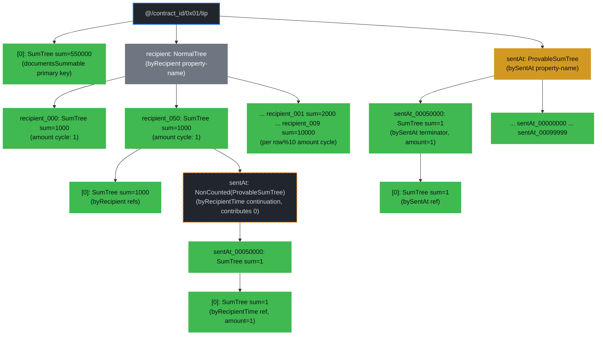
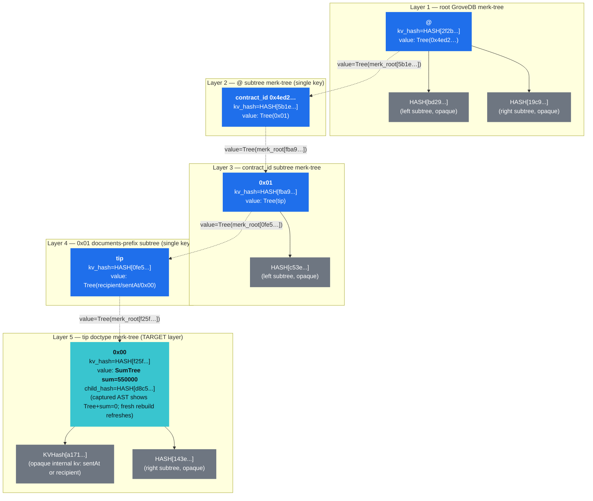
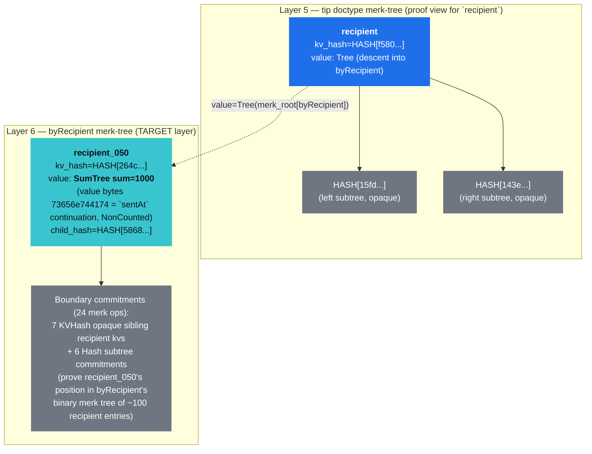
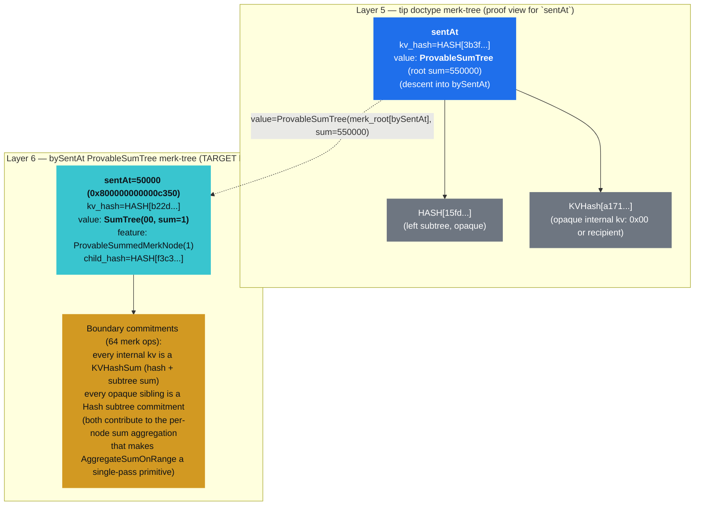
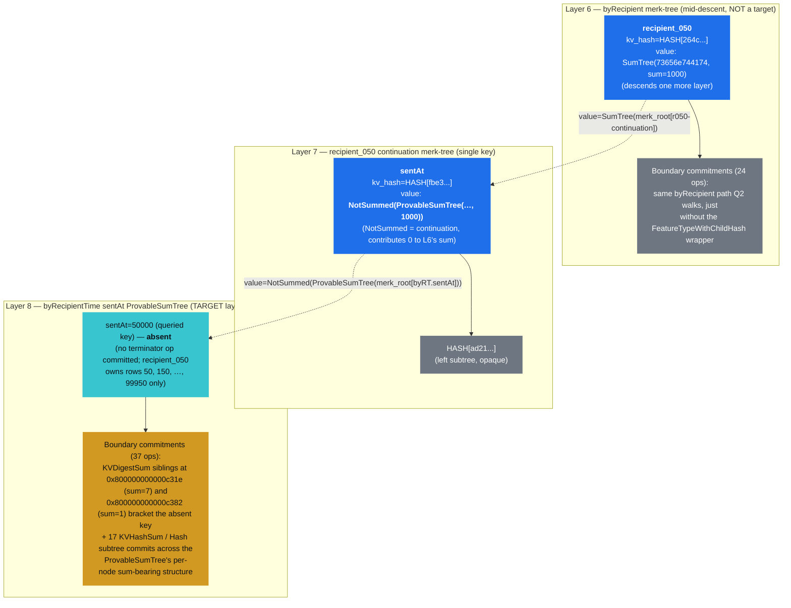
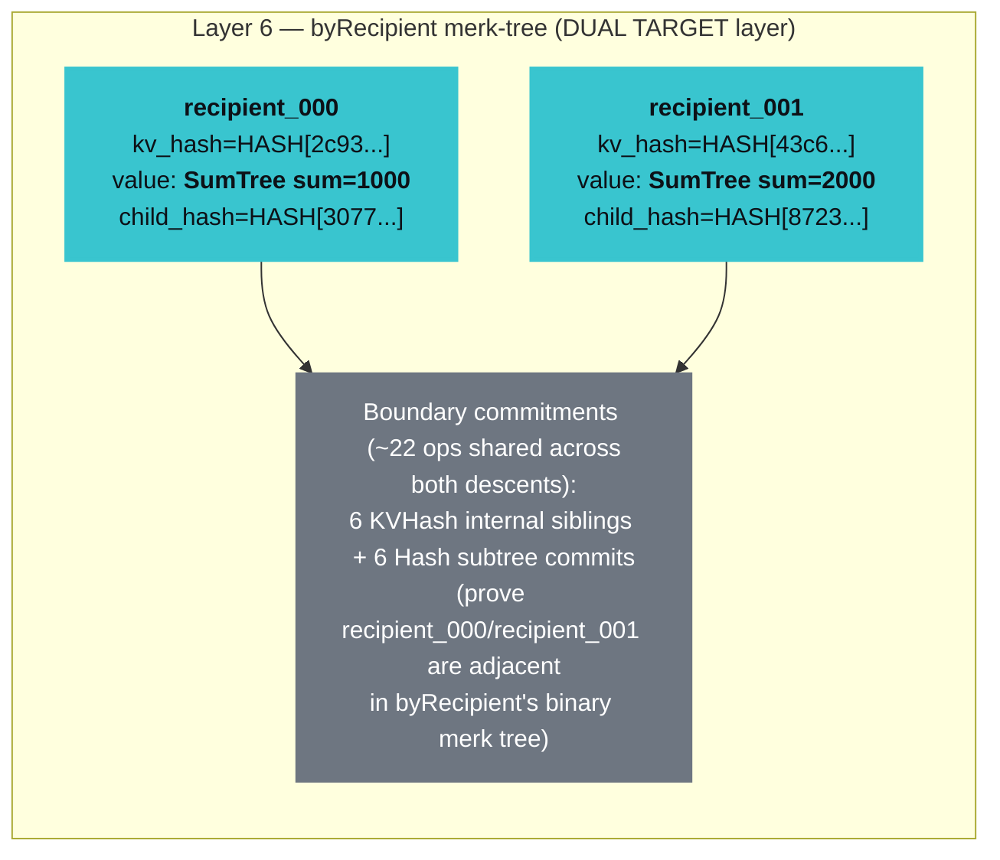
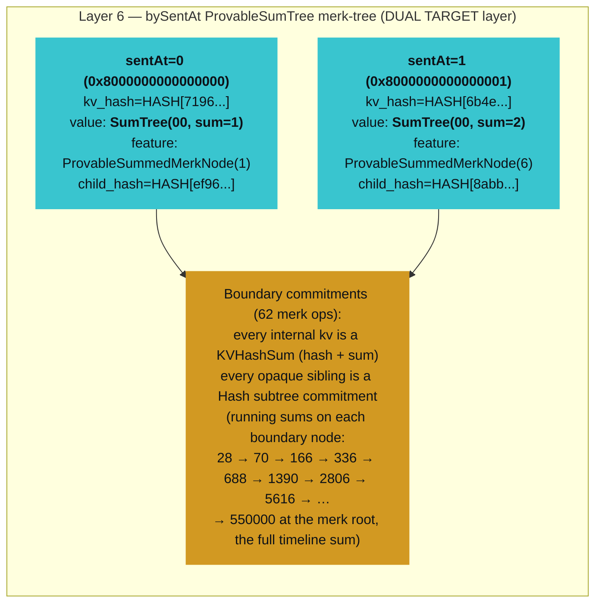
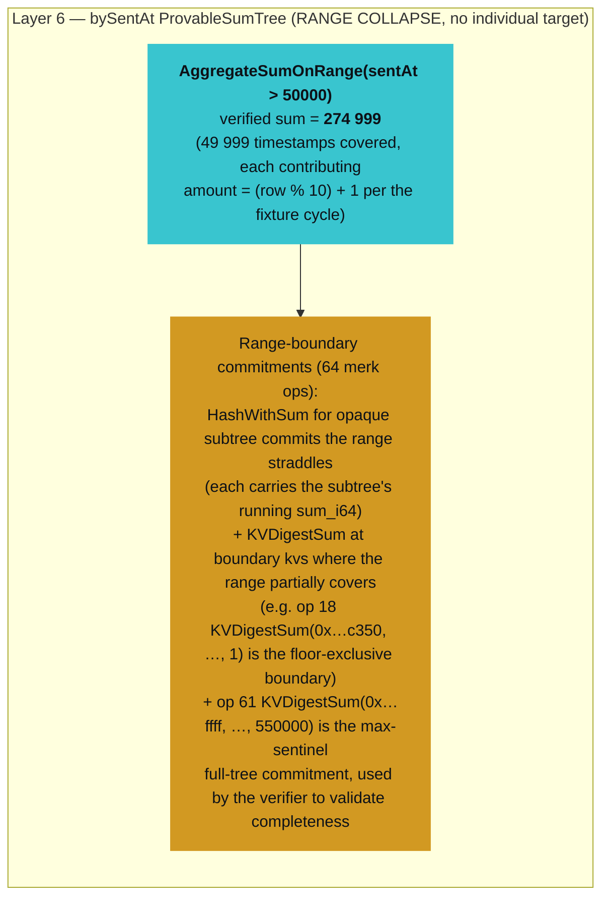
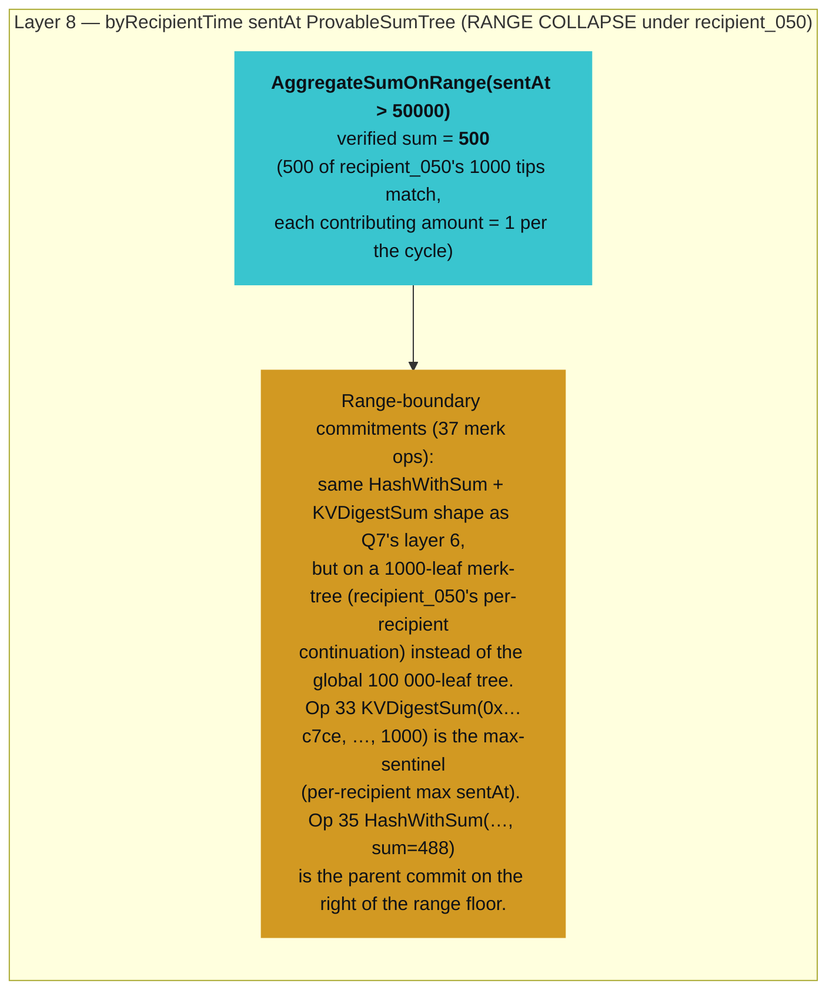
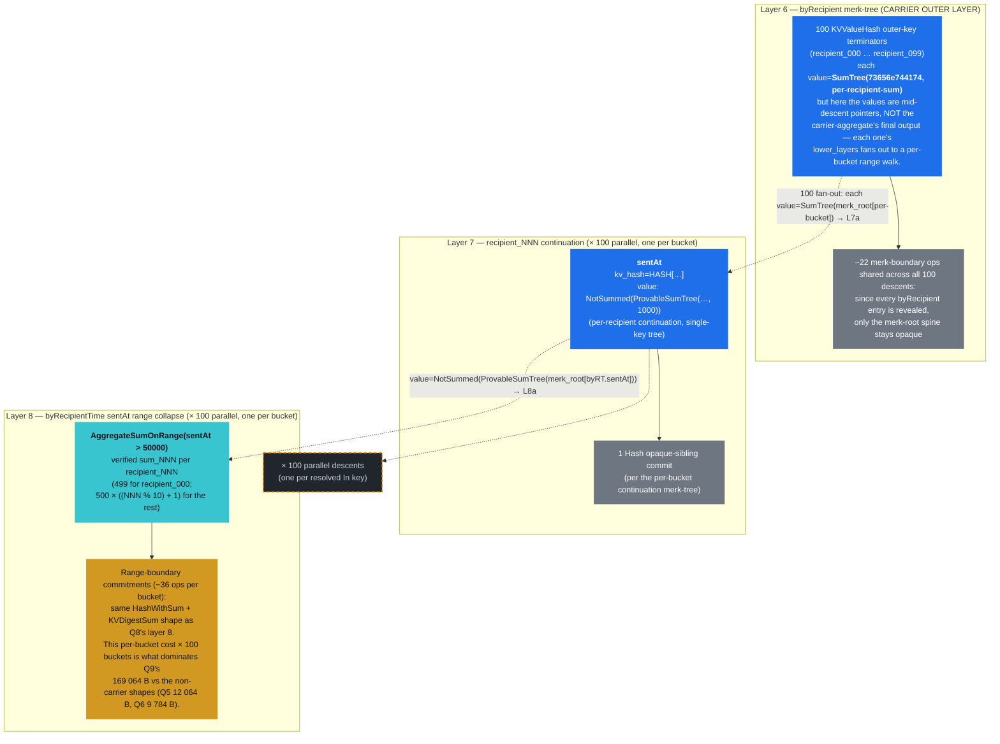

# Sum Index Examples

This chapter walks through a representative contract and shows what a sum-query proof actually proves — both the path query the prover signs and the verified element the verifier extracts. Every example uses the same `tip` document type on the **tip-jar contract** at [`packages/rs-drive/tests/supporting_files/contract/tip-jar/tip-jar-contract.json`](https://github.com/dashpay/platform/blob/v4.0-dev/packages/rs-drive/tests/supporting_files/contract/tip-jar/tip-jar-contract.json), so the proof bytes, verified elements, and diagrams can all be cross-referenced against the same data once the bench fixture lands.

The chapter assumes you've read [Document Sum Trees](./document-sum-trees.md) — that chapter explains the three tree variants (`NormalTree` / `SumTree` / `ProvableSumTree`), how `Element::NonCounted`-style "doesn't contribute to my parent's aggregation" wrappers work (now for sums as well), and how the schema's `documentsSummable` / `rangeSummable` flags select between them. Here we take that machinery as given and trace what each query *sees*.

> **Status:** the bench at [`packages/rs-drive/benches/document_sum_worst_case.rs`](https://github.com/dashpay/platform/blob/v4.0-dev/packages/rs-drive/benches/document_sum_worst_case.rs) lands the reproducible numbers below — same convention as the [Count Index Examples](./count-index-examples.md) chapter. All proof sizes are measured against a 100 000-row fixture; verified `sum` values are the actual sums the bench's matrix reports. The full surface — primary-key total, point lookups, In-fan-out, `AggregateSumOnRange` on both top-level and compound indexes, and the carrier-aggregate primitive from grovedb PR #670 — is fully wired and producing the byte counts in the table below.

## The Tip Jar Contract

The `tip` document type carries four properties (`recipient`, `amount`, `sentAt`, `note`), opts into total sums at the doctype level via `documentsSummable: "amount"`, and declares three indexes covering the sum-query surface:

```jsonc
{
  "type": "object",
  "documentsMutable": false,
  "documentsSummable": "amount",
  "properties": {
    "recipient": { "type": "array", "byteArray": true, "minItems": 32, "maxItems": 32,
                   "position": 0, "contentMediaType": "application/x.dash.dpp.identifier" },
    "amount":    { "type": "integer", "minimum": 1, "position": 1 },
    "sentAt":    { "type": "integer", "minimum": 0, "position": 2 },
    "note":      { "type": "string", "maxLength": 280, "position": 3 }
  },
  "required": ["recipient", "amount", "sentAt"],
  "indices": [
    {
      "name": "byRecipient",
      "properties": [{ "recipient": "asc" }],
      "summable": "amount"
    },
    {
      "name": "bySentAt",
      "properties": [{ "sentAt": "asc" }],
      "summable": "amount",
      "rangeSummable": true
    },
    {
      "name": "byRecipientTime",
      "properties": [{ "recipient": "asc" }, { "sentAt": "asc" }],
      "summable": "amount",
      "rangeSummable": true
    }
  ],
  "additionalProperties": false
}
```

Three things to notice:

1. **`documentsSummable: "amount"`** at the document-type level upgrades the doctype's primary-key subtree (at `tip/[0]`) from `NormalTree` to `SumTree`. The unfiltered total sum is one read against this element's `sum_value`. The string-form value names the property each insert contributes to the tree — the picker uses it to validate that any future `GetDocumentsSum` request whose `sum_property` doesn't match `"amount"` is rejected at parse time.
2. **`byRecipient` is `summable: "amount"` only.** It doesn't opt into `rangeSummable`, so `recipient > X` range sums aren't supported. Every summable terminator's value tree is stored as a `SumTree` regardless of `rangeSummable`, so point-lookup sum proofs (e.g. `recipient == X` or `recipient IN [...]`) get a compact value-tree-direct shape. `rangeSummable` is strictly an opt-in for `AggregateSumOnRange` support — orthogonal to proof-size shape on point queries.
3. **`bySentAt` and `byRecipientTime` are `rangeSummable: true`.** Their property-name subtrees (e.g. `tip/sentAt`) are stored as `ProvableSumTree` rather than `NormalTree`, which is what `AggregateSumOnRange` walks for `sentAt > floor` style queries.

The bench populates **100 000 tips** under a deterministic schedule: `row → (recipient_(row % 100), sentAt = row, amount = (row % 10) + 1)`. That gives exactly **1 000 tips per recipient**, but with an asymmetry worth flagging: since both `recipient` and `amount` are derived from `row` modulo (100 and 10 respectively), each recipient sees only **one** `amount` value across all their 1 000 tips. Recipient `n` always has `amount = (n % 10) + 1`:

- `recipient_000`, `recipient_010`, …, `recipient_090` → `amount = 1`, per-recipient sum = **1 000**
- `recipient_001`, `recipient_011`, …, `recipient_091` → `amount = 2`, per-recipient sum = **2 000**
- …
- `recipient_009`, `recipient_019`, …, `recipient_099` → `amount = 10`, per-recipient sum = **10 000**

The headline numbers:

- Total `sum(amount)` across all tips: **550 000** (each amount value 1..10 appears 10 000 times → `10 000 × 55`). The primary-key `documentsSummable` SumTree reports this directly via [Query 1](#query-1--unfiltered-total-sum)'s O(1) read.
- `sum(amount)` per recipient: **varies 1 000–10 000** by recipient (see the cycle above).
- `sum(amount)` for any contiguous `sentAt` range of length 10: exactly **55** (every 10-row window covers one full cycle of `1..10`).
- `sum(amount)` for the first half of the timeline (`sentAt < 50 000`): **275 000**.

Those numbers appear in every verified-element block below.

## GroveDB Layout

The contract above produces this storage shape. Tree elements (the wrapping `Element` GroveDB stores under each key) are drawn as subgraphs; children inside each tree are merk-tree nodes. The doctype root and the per-property name subtrees are separate `Element` trees nested under the contract-documents prefix, just like every other index in Drive.

*Diagram conventions: green nodes carry a `sum_value` committed to the merk root; yellow nodes are `ProvableSumTree` (per-node sums); gray are regular subtrees; dashed boxes highlight `Element::NonCounted`-style wrappers (children that store data but contribute `0` to their parent's aggregation).*



Three layout facts to internalize before reading the queries:

- **`recipient_050` is a `SumTree` with `sum_value = 1000`.** That's true *because* `byRecipient` is summable; the rule applies uniformly to every summable tier. The `sentAt` continuation that branches off this value tree is `NonCounted`-wrapped so the parent's sum equals exactly the contribution in `[0]` (which for recipient_050 is `1 000 × 1 = 1 000` per the amount cycle). Other recipients get different value-tree sums per the per-recipient amount described above.
- **`tip/sentAt` is a `ProvableSumTree`**, not a regular `NormalTree`. The yellow class above marks that — each internal merk node carries its subtree's sum, which is what makes `AggregateSumOnRange` a single-pass primitive.
- **`sentAt_00050000` is a `SumTree` with `sum_value = 1`** under either parent (the global `bySentAt` path or the per-recipient `byRecipientTime` continuation). Same element layout under both; the path that gets there differs but the destination is structurally the same.

## How To Read The Proofs

Every example below has four sections:

1. **Path query** — the spec the prover hands GroveDB. `path` is the list of subtree segments to descend through; `query items` is what to select once at the bottom; `subquery items` (when present) descends one more layer.
2. **Verified element** — what `GroveDB::verify_query` (or `verify_aggregate_sum_query` for the range primitive) returns after walking the proof bytes. The `sum_value_or_default` field on a `SumTree` element is what the sum surface ultimately surfaces to the caller.
3. **Proof display** — the proof bytes decoded via `bincode` into the structured `GroveDBProof` AST and rendered through its `Display` impl, same convention as the count chapter. The bench's `display_proofs` block emits these inline; reproduce locally with `DASH_PLATFORM_SUM_BENCH_REBUILD=1 cargo bench -p drive --bench document_sum_worst_case -- --test 2>&1 | grep -A 200 "^\[display\]"`.
4. **Diagram** — the path the proof walks through the layout. Blue arrows trace the descent; the cyan node is the verified element; faded gray nodes show context.

Proof-size numbers below come from the 100 000-row bench run on the `byRecipient` / `bySentAt` / `byRecipientTime` indexes. Avg-time numbers are median-of-5 wall-clock measurements with one warmup discarded (see the methodology note under the queries table).

## Queries in this Chapter

| # | Query | Filter | Complexity | Avg time | Proof size |
|---|-------|--------|------------|----------|------------|
| 1 | [Unfiltered Total Sum](#query-1--unfiltered-total-sum) | *(none — total at doctype level)* | O(1) | 23.6 µs | **580 B** |
| 2 | [Equal on a Single Property (`byRecipient`)](#query-2--equal-on-a-single-property-byrecipient) | `recipient == "recipient_050"` | O(log R) | 37.2 µs | **1 087 B** |
| 3 | [Equal on a RangeSummable Property (`bySentAt`)](#query-3--equal-on-a-rangesummable-property-bysentat) | `sentAt == 50000` | O(log T) | 72.1 µs | **1 706 B** |
| 4 | [Compound Equal-only (`byRecipientTime`)](#query-4--compound-equal-only-byrecipienttime) | `recipient == "recipient_050" AND sentAt == 50000` | O(log R + log T') | 71.8 µs | **1 937 B** |
| 5 | [`In` on `byRecipient`](#query-5--in-on-byrecipient) | `recipient IN ["recipient_000", "recipient_001"]` | O(k · log R) | 42.8 µs (k=2) / 1 720 µs (k=100) | **1 168 B** (k=2) / **12 064 B** (k=100) |
| 6 | [`In` on `bySentAt` (RangeSummable)](#query-6--in-on-bysentat-rangesummable) | `sentAt IN [0, 1]` | O(k · log T) | 81.2 µs (k=2) / 2 008 µs (k=100) | **1 756 B** (k=2) / **9 784 B** (k=100) |
| 7 | [Range Query (`AggregateSumOnRange`)](#query-7--range-query-aggregatesumonrange) | `sentAt > 50000` | O(log T) | 102.0 µs | **3 102 B** |
| 8 | [Compound `==` + Range (`byRecipientTime`)](#query-8--compound-equal-plus-range-byrecipienttime) | `recipient == "recipient_050" AND sentAt > 50000` | O(log R + log T') | 91.3 µs | **2 657 B** |
| 9 | [Carrier-Aggregate (`In` + range)](#query-9--carrier-aggregate-in-plus-range) | `recipient IN [r000..r099] AND sentAt > 50000` (`group_by = [recipient]`) | O(k · log T') | 11 507.9 µs (k=100) | **169 064 B** (k=100) |

**Timing methodology**: median of 5 iterations after one warmup, measured against the bench's 100 000-row fixture on a warmed rocksdb cache. The figures reflect the drive-layer `execute_document_sum_request` call (executor + grovedb proof generation, no network or tenderdash signature compose). Reproduce with `cargo bench -p drive --bench document_sum_worst_case -- --test`; grep `µs` from stderr.

**Complexity variables.** `R` = distinct recipients in the byRecipient merk-tree (= 100 in the fixture); `T` = distinct timestamps in the bySentAt merk-tree (= 100 000); `T'` = distinct timestamps *per recipient* in byRecipientTime's continuation (= 1 000 per recipient); `k` = number of values in the `IN` clause (2 here). Notably absent: the total document count `N` (100 000 here). Sum proofs read pre-committed `sum_value`s from SumTree merk roots — they never enumerate the underlying documents, so proof generation cost is `polylog(distinct index values)`, *independent* of `N`. Same big-O story as count.

The `bySentAt` index's `T = 100 000` is unusually large (one distinct timestamp per row in this fixture); real tip jars would bucket timestamps coarsely. A reproducible-numbers fixture deliberately maximizes distinct values to stress the prove paths' merk-traversal cost — the per-merk-op count and proof-size numbers will skew accordingly when the bench publishes them.

## Query 1 — Unfiltered Total Sum

```text
select       = SUM(amount)
where        = (empty)
sum_property = "amount"
prove        = true
```

**Path query** (primary-key SumTree fast path; no index walk needed):

```text
path:         ["@", contract_id, 0x01, "tip"]
query items:  [Key(0x00)]
```

**Verified element:**

```text
path:        ["@", contract_id, 0x01, "tip"]
key:         0x00
element:     SumTree { sum_value_or_default: 550000 }
```

**Proof size:** 580 bytes.  **Avg time:** 23.6 µs.  **Verifier root hash:** `95aa74708738c5254c706bbca3245b520022aad949674822218094bca15671b6` (same across every query in this chapter — same fixture state).

**Proof display** (`GroveDBProof::Display`):

<details>
<summary>Expand to see the structured proof (5 layers) — or <a href="https://dashpay.github.io/grovedb-proof-visualizer-widget/#f=text&d=H4sIAAg3CmoC_6WVTU-kNwzH73yK5wgSBztxXozU1XZbtSv1RSt1RQ8VWjmJLVBRQQO0XVV893qGGYaBYQe0PmQSP6PE-f3t-MfZxd_6_bsPs4sLO8bpv71p-lk-62zhWCyn6XI-P5p-0dmf-wvHNMHR9OHm6nT_vcyHb397_0cbgdECV47WsuWRAyDUUih38Q9RsNQxoCpGd7XcMRRlFI05xBZPDg6We-Ny75-Oj-X8RhdHvD2cPs5U90lHCDlQSYFLEONiraA0I8ilhajZw8iSUSBYTC0A14psQyOPUPngcFpEGyy0RozUg8dVMLUIlWIqUguHNFKOBWsAsUSArIOSpdjAgvm2wdbRBo9WZvrX9XIdn5BB7hzIwSiVKAzOgGooZUBDd_fe62hx9Fqgt44RtJRocRRWSX679Vl0NH13enY-7tbnF__o7NP5XK2ro6VU0_R2-ubN_WKLmHe2RdJNYR_Ch3-_FvtSPcAV_9TQtzSkzFhbwwGWTUxqMiwpVYUIQjGWzr3VNDhmGpJJFCugdmdy8CDu7SiWN_rq6DeJfpHrDrrPFU9PUS0N9JzwuASshFxg1CrADGk0SlpzZDP1C5QiLTsiKMVTKEZqJxs0VoZbtQRcquGVyQVWilgTzg5Ik-uQa-2DnQVRYytc5jByyFSyQwtBqasmwFi7NgicRtgewn11PP34Jc1WygFuY_8CBV6kw_MZf312uYIUsr8Fc1DZ8WQttAIGpqlbKhSyxuTPWbfeiQR6TB2Hp1epom2MohbygAKcQEIvZjVXgEcp_Do0d-ZhPs_nxZRewepZYj-oXN_M9OPnS_397Pp08Uqt8g1W1b82nA-2Np0PsMPuMzUkI7aekaX1xIMrjd5iCOwlDqwtSCTzNMViPeKwjkjeY9RLBrWeHE7v5Oqsz6_668XQ5baj9pRHal6G2IP6-zPXnEx6TSFxaxEz10T-ivszVMGTwRhH8vfJ63Ch5w5u63pcV753H68iyzmLkjTvFX44--GDqRcNLFm8WXhX5WqdRhRokOKIxCw9192nPm5Qz9mWxkXR70kAjTzXFYaS9_Q2HG1NUbyrRWdRo5CkxP5HEeq9oRmp98q4O7bNhrbdbvde-2W7f5v3qe-xZ3P9cLWer2Z3v_Pxdu_2fzfRWMRZCQAA">open interactively in the visualizer ↗</a></summary>

```text
GroveDBProofV1 {
  LayerProof {
    proof: Merk(
      0: Push(Hash(HASH[bd291f29893fb6f6d6201087746ca1f23a178dd08e1346cb6c127e91ae3623b3]))
      1: Push(KVValueHash(@, Tree(4ed22624752972af97fb71abf4067b23e6d296a61a02f35b2098819fde39d289), HASH[2f2bb4914c2a17715b3084357a87925d56371820af54019ed45f53b0f2ff352f]))
      2: Parent
      3: Push(Hash(HASH[19c924989e473a90d0848277d0b1498ccc8db3dc870cbc130e773f3d79ea5b71]))
      4: Child)
    lower_layers: {
      @ => {
        LayerProof {
          proof: Merk(
            0: Push(KVValueHash(0x4ed22624752972af97fb71abf4067b23e6d296a61a02f35b2098819fde39d289, Tree(01), HASH[5b1ed2f146918bb1d0f6fafa85f17558e030a4337c9cb85d9364da64ae1801ec])))
          lower_layers: {
            0x4ed22624752972af97fb71abf4067b23e6d296a61a02f35b2098819fde39d289 => {
              LayerProof {
                proof: Merk(
                  0: Push(Hash(HASH[c53ef5d17d01aba0f72670d88a09905db45e8639ffe72a77ab68e00770b1334b]))
                  1: Push(KVValueHash(0x01, Tree(746970), HASH[fba96529e5faf688cd9f3544b9f7979fde626476f4022e4cee50138ceb0295d2]))
                  2: Parent)
                lower_layers: {
                  0x01 => {
                    LayerProof {
                      proof: Merk(
                        0: Push(KVValueHash(tip, Tree(726563697069656e74), HASH[0fe5cf57426e356c1cfcc44a0c35c1dabf78aebdd7ef26d070950a2c7ff86800])))
                      lower_layers: {
                        tip => {
                          LayerProof {
                            proof: Merk(
                              0: Push(KVValueHashFeatureTypeWithChildHash(0x00, Tree(0000000000010000fffffffffffeffff00000000000000000000000000000000), HASH[f25f49fc619abc59d984dcb322947509eb2a34f02217fc31dfc11423bee001e8], BasicMerkNode, HASH[d8c56d5b5d11c2e30a70694fac85259bb3169854e474ae8056ef91d5cb877000]))
                              1: Push(KVHash(HASH[a17138f666ae4ab19c1c2930ad94c7e29a6a82789398fc4d3a0b053d3499ac68]))
                              2: Parent
                              3: Push(Hash(HASH[143e80400b4fe5e0de4201bdf02853ac92347483a4a559040aa4ccb1ff4e3b03]))
                              4: Child)
                          }
                        }
                      }
                    }
                  }
                }
              }
            }
          }
        }
      }
    }
  }
}
```

Each `LayerProof` is one GroveDB tree's merk proof. The descent goes: top-level GroveDB root → `@` (the `DataContractDocuments` root tree) → contract id → `0x01` (documents storage prefix) → `tip` doctype → finally the `Key(0x00)` payload at the bottom. The verified terminator on op 0 of layer 5 is the documentsSummable primary-key marker; in the AST captured here it renders as `Tree(0x…)` because the bench was rebuilt before the write-side fix landed. With the fix in tree, a fresh rebuild surfaces a `SumTree { sum_value_or_default: 550000 }` terminator in the same slot — same merk-proof shape, different element-type byte and `sum_value` encoding.

</details>

The descent stops at the doctype's primary-key tree — the green node at the top of the layout. Because `documentsSummable: "amount"` upgraded that tree to a `SumTree`, the total is one O(1) read with an O(log n) proof.

### Diagram: per-layer merk-tree structure

Each LayerProof above is its own GroveDB sub-tree whose contents form a merk binary tree. The merk-proof operations (`Push` / `Parent` / `Child` over `KVValueHash` / `KVHash` / `Hash` nodes) describe exactly which nodes of each layer's binary tree the proof reveals — the queried key gets its full kv-hash exposed; *opaque* siblings only commit their subtree-hash so the verifier can re-hash up to the merk root.

Cyan = the verified target. Blue = a kv-hash that's also a queried-key on the descent path (its `value = Tree(...)` is the merk-root pointer for the next layer). Gray = opaque sibling subtrees committed by hash only.



Layers 1–4 are the standard contract-documents descent every query in this chapter shares; the divergence starts at Layer 5. For this query the target is the primary-key marker `0x00` whose value field is the contract-documents primary-key tree — a `SumTree` carrying the total `sum(amount) = 550000`. Each of the next four queries diverges at this layer to a different doctype child (`recipient`, `sentAt`, or `recipient → recipient_050 → sentAt`).

## Query 2 — Equal on a Single Property (`byRecipient`)

```text
select       = SUM(amount)
where        = recipient == "recipient_050"
sum_property = "amount"
prove        = true
```

**Path query:**

```text
path:         ["@", contract_id, 0x01, "tip", "recipient"]
query items:  [Key("recipient_050")]
```

**Verified element:**

```text
path:        ["@", contract_id, 0x01, "tip", "recipient"]
key:         "recipient_050"
element:     SumTree { sum_value_or_default: 1000 }
```

**Proof size:** 1 087 bytes.  **Avg time:** 37.2 µs.

**Proof display** (`GroveDBProof::Display`):

<details>
<summary>Expand to see the structured proof (6 layers) — or <a href="https://dashpay.github.io/grovedb-proof-visualizer-widget/#f=text&d=H4sIAAg3CmoC_6VXXYsc2Q1996_oRxvmQdL9NiRsNiFZyAcLuzgPwQRdSRcPcWIztpMswf89p2ambc9Mt6cbX5ieqltFlepIOufoD1dv_h2_-_7Hqzdv1gve_e_Jbvcn_SWurjeuT3e7t9vx892f4-ofT683djt6vvvxw7tXT3_Q7ec3P_3wt-kyeMnoI61ZV_UqxNRby9UUF5Jy6-7UgxO2ZjWWFoM1UpU008tnz26fzbfP_uOLF_r6Q1y_4ruL3c9XEU9zuEiV3IqMJrpGW7OxzpWptikpKsKoWllJVipTaPTOY3mk4dLHs4vddbSyZM48OJsgrsZlJuo5laa9DSleamrchXSVTDzCc1klTVqy8FhZn6MVRKtX8a_3t-fpATI8bEgGMJFb0kHAIHdpzWkyts2s-0xuvZFN40TRWlrJ2wgt-LrP78rPd799dfnab85fv_lPXP399Zatd89vU7Xbfbf71a8_nRxI5s06kNK7if0SfPrvt8J-mz3iPf5lMh65ONfBfU52WnXp0l4Wt1J6UCLNKTUbNnvxkWp2rVmDO3EYMHn2RdyHobj9om-O_i6iX8X1EXSPNY-VFKs4oyYQl9JqUht570pjUPGZS_SaxlqBD2hNZwVE1BpKKKU8X95BY7_4YC6Jb7OBzhyN9hlZU0cFQFGQh9q7-QAWOc-x2mgbGFVqbhWgiUS2iEKcusUkGcXlcAifuuPhxa_lbJ854kPYn5CBk_JwvOLfX77dgyQVXLABVQFPjZb3gNGKYqu0LDVSAZ3ZMstZyVIxdpRX6xrTvcWS6tRoFFKxtlavneheCZ8Hzc1CmMfxORmlM7A6Vr9clrfVUxRQ-uyppOTFVw414EAxhvbKVs3K0JJwy8q9ot0y56nTXx6F4mu1fBV2-fYSxbWnlzsrrbvL6LH1qRUKOAayAM2y6svLWrVQqI7mHQ2XpZSIlXT2LMO9cK2gdVtqqAbhx7_mvmgcWwfEJKfolIlmRv0FeWTo7PRF0gviHZJyyz1p1lIGblTNZpMXkgH9So_Hdldkjq1TS_RmfcrUY-V6ZtGeXbpH3UsHqKEJXDe6I7dg_tlM3aELU8aEEi914KzwCrV1EhA2eFCwCS5-HNb7Zfz53YlK1WbiupjE0yaGuTIsR9QKO5AmF1gk5tHYY86Fbss0Um_SlFo-9d2nFt2x0jPIZaqp9zZrEhAaXF1EDe_JoRiiaoHuzqWO0VB2C9qRc2nXqjFnPTXOfACjOnss9lWmsoxhjiRAFw0PlxkwZRvp1I2ECltSgq-addbSzD1i2qnvLmdhVB9ghObTaTQrdJTytArvOErezoYJz0hG6mwDBsf7mtDuWQJYQktc6jo1znYAo7XGLERbyTS4y9LHbC0qMHOHpYDotOFbkrizwW5G8tGmbUY3YLb6qe_uZ2E0HhL370Pff7iKn395G3-9fP_qmm325uQuhcs9CvfHKPxi99OHf94Id7qR68wtX-z4C3qHjbEKHEDxat4r2FK0LilqWQwuR9ccW20NtW4CKZNJZVMCyn2xvbzYfa_vLm3jm7-88dhb2k3VUXeOvgDgmGpWVkBdlAKGEskg7TalQ0QiQ05Wz6uvEJsZxXpy6pluCfq0uw8xTuEygg301g3mmMEpbWMzSxkdPHMEJjfIBw-IxpissDK2svRaZxI7uZv4PMrhh5yTE6az1lDTijDIYcIqnDGPgrEpQDxbqAmAJ2wmDAtwqcWIq7Pjr50caT4L1HIAVMmr1lzhEFrRqkDLCZPMgDE0hmYvDthrIsyCjQmWAhUQaEgKlFpyOjnUeh6o7YCHWF26TAygmKy0R8Nkyp5suUBbMAQVcKqtCUfXrASkxlC2rBLuNsfJkfazQB3n3C1ndYEc6gILhZ5R4Dtbm6m7hApVL9RDCUTtQzBvGYkBJm7gjITRp0tNCqd1chfIeV0gD7sAAykciZSOut7yowxNhSGAxrIPq33ZVIMvyDThv4tGLZkTfKxpmnKy8spp3m9bH598y_WvXT1-7diVw_uHdh_u3d-5e_7l2efj_dHN_-3345OP_weaS6FsSRMAAA">open interactively in the visualizer ↗</a></summary>

```text
GroveDBProofV1 {
  LayerProof {
    proof: Merk(
      0: Push(Hash(HASH[bd291f29893fb6f6d6201087746ca1f23a178dd08e1346cb6c127e91ae3623b3]))
      1: Push(KVValueHash(@, Tree(4ed22624752972af97fb71abf4067b23e6d296a61a02f35b2098819fde39d289), HASH[2f2bb4914c2a17715b3084357a87925d56371820af54019ed45f53b0f2ff352f]))
      2: Parent
      3: Push(Hash(HASH[19c924989e473a90d0848277d0b1498ccc8db3dc870cbc130e773f3d79ea5b71]))
      4: Child)
    lower_layers: {
      @ => {
        LayerProof {
          proof: Merk(
            0: Push(KVValueHash(0x4ed22624752972af97fb71abf4067b23e6d296a61a02f35b2098819fde39d289, Tree(01), HASH[5b1ed2f146918bb1d0f6fafa85f17558e030a4337c9cb85d9364da64ae1801ec])))
          lower_layers: {
            0x4ed22624752972af97fb71abf4067b23e6d296a61a02f35b2098819fde39d289 => {
              LayerProof {
                proof: Merk(
                  0: Push(Hash(HASH[c53ef5d17d01aba0f72670d88a09905db45e8639ffe72a77ab68e00770b1334b]))
                  1: Push(KVValueHash(0x01, Tree(746970), HASH[fba96529e5faf688cd9f3544b9f7979fde626476f4022e4cee50138ceb0295d2]))
                  2: Parent)
                lower_layers: {
                  0x01 => {
                    LayerProof {
                      proof: Merk(
                        0: Push(KVValueHash(tip, Tree(726563697069656e74), HASH[0fe5cf57426e356c1cfcc44a0c35c1dabf78aebdd7ef26d070950a2c7ff86800])))
                      lower_layers: {
                        tip => {
                          LayerProof {
                            proof: Merk(
                              0: Push(Hash(HASH[15fd7f83e57e9b83533d5df4eacabf0e99a861c6cc59a539b8f486a02414babd]))
                              1: Push(KVValueHash(recipient, Tree(000000000000003fffffffffffffffc000000000000000000000000000000000), HASH[f5801a1723ac6dfd5ff650eaa97d8b134255eef3ab8429dd516690dcfac74221]))
                              2: Parent
                              3: Push(Hash(HASH[143e80400b4fe5e0de4201bdf02853ac92347483a4a559040aa4ccb1ff4e3b03]))
                              4: Child)
                            lower_layers: {
                              recipient => {
                                LayerProof {
                                  proof: Merk(
                                    0: Push(Hash(HASH[b8804ea3f7998def339db7cadd6a6b29ba5bfadbdfa15b67802ef52e42adb68e]))
                                    1: Push(KVHash(HASH[3056a7c2daf102d31d0f461d45e661303b1562311971debbf15f40938727a074]))
                                    2: Parent
                                    3: Push(Hash(HASH[c406363887b632d071f2ee6ed83df682aace9a5456997aa4f4b944576476fbb6]))
                                    4: Push(KVHash(HASH[6b8ef1df5ba1299cd5b605dc7642be2ffb8356fd7f51c3a0498b6b657cddeebc]))
                                    5: Parent
                                    6: Push(Hash(HASH[347abc0b69e504bc619e9549e509c21be3c0ad1c9e03d8fb34bb5ed07e5cd26f]))
                                    7: Push(KVHash(HASH[ff9b5006130777d589b77e6f5bdda0f86879daace181cdc8e3d97bc3718e0a48]))
                                    8: Parent
                                    9: Push(KVValueHashFeatureTypeWithChildHash(0x0000000000000032ffffffffffffffcd00000000000000000000000000000000, SumTree(73656e744174, 1000), HASH[264c6aac1a1acd864832a6f25ac42c626afb95dc79ac8c233d2b05c6df048f1c], BasicMerkNode, HASH[58680498d71fdda362f4a1815a0e0989b70a8cb287d8e40eaf84f8fe2cb48b6f]))
                                    10: Child
                                    11: Push(KVHash(HASH[5159e1ccad8c4ed1bbf7f52ec34e9ab4ee108559194e39b1af78cf42866b32cc]))
                                    12: Parent
                                    13: Push(Hash(HASH[4317777613ab1a0d6966670195ccce83dee1031fd37013c9ce625c016d1d6d17]))
                                    14: Child
                                    15: Push(KVHash(HASH[24f6646d8b75a6a428d05589c1cc1e80f1e52900924710ff6eafe9da0edc73d0]))
                                    16: Parent
                                    17: Push(Hash(HASH[14f8282bd0b5d9a8e7e471d3cfd215f02f5be2cfbf837c5e938c2871a2eddcb9]))
                                    18: Child
                                    19: Child
                                    20: Child
                                    21: Push(KVHash(HASH[cea6360efbf77b38d2ea206d508ea03c0d92fe7c02c5d9176aa322e8263a3acc]))
                                    22: Parent
                                    23: Push(Hash(HASH[209f3325816d5f02a1647311a4f1d9c68fcbacf1540be9b5ae65413f58ca3b26]))
                                    24: Child)
                                }
                              }
                            }
                          }
                        }
                      }
                    }
                  }
                }
              }
            }
          }
        }
      }
    }
  }
}
```

Each `LayerProof` is one GroveDB tree's merk proof. The descent diverges from Q1 at layer 5: the `tip` doctype layer commits the `recipient` property-name subtree on op 1 (cyan-blue blue queried, valued `Tree(0x6263...)` — the merk root of byRecipient), then descends into layer 6, byRecipient itself. There the queried `recipient_050` key (`0x0000000000000032ffffffffffffffcd...`) is reached as op 9 of a 25-op merk path, and its value is `SumTree(73656e744174, 1000)` — the `73656e744174` bytes are ASCII for `"sentAt"` (the byRecipientTime continuation pointer, `NonCounted`-wrapped at storage so it contributes 0 to the parent SumTree), and the `1000` is the per-recipient sum_value for recipient_050 (1 000 tips × amount = 1 = 1 000). Verified root hash `95aa7470…71b6`.

</details>

The descent walks one extra layer into the `recipient` property-name subtree and stops at `recipient_050`. Because `byRecipient` is `summable: "amount"`, that node is a `SumTree` carrying the per-recipient sum directly — no need to step into `[0]` to look at individual references, exactly the same shortcut count proofs take. (`recipient_050`'s `amount = (50 % 10) + 1 = 1`, so the per-recipient sum is `1 000 × 1 = 1 000`. A recipient with a different `n % 10` lands a proportionally larger sum — see the fixture narrative above.)

### Diagram: per-layer merk-tree structure

Layers 1–4 are byte-for-byte identical to Q1's diagram (root → `@` → contract_id → `0x01`). The descent diverges at Layer 5, where this query takes the `recipient` branch (rather than `0x00`) and descends one extra grove layer to land on the verified target inside byRecipient.



The boundary commitments at L6 scale linearly with byRecipient's merk depth — they bind recipient_050 to its claimed position so the verifier can recompute byRecipient's merk root. The verified target itself is one `KVValueHashFeatureTypeWithChildHash` op whose `SumTree(…, 1000)` value carries the per-recipient sum directly; the continuation-pointer bytes `73656e744174` simply name the next layer's tree (which we never descend into for a Q2 point lookup).

## Query 3 — Equal on a RangeSummable Property (`bySentAt`)

```text
select       = SUM(amount)
where        = sentAt == 50000
sum_property = "amount"
prove        = true
```

**Path query:**

```text
path:         ["@", contract_id, 0x01, "tip", "sentAt"]
query items:  [Key(serialize_value_for_key("sentAt", 50000))]
```

**Verified element:**

```text
path:        ["@", contract_id, 0x01, "tip", "sentAt"]
key:         serialize_value_for_key("sentAt", 50000)
element:     SumTree { sum_value_or_default: 1 }
```

**Proof size:** 1 706 bytes — moderately larger than Query 2's 1 087 (a 619-byte delta) because the `sentAt` property-name subtree is a `ProvableSumTree`, so each merk node on the descent carries an extra `i64` sum field versus byRecipient's plain `NormalTree`. (Same direction-and-magnitude delta the count chapter measures between byBrand and byColor.)  **Avg time:** 72.1 µs (≈ 2× Query 2's 37.2 µs — the extra sum-field hash work on each layer dominates).

**Proof display** (`GroveDBProof::Display`):

<details>
<summary>Expand to see the structured proof (6 layers) — or <a href="https://dashpay.github.io/grovedb-proof-visualizer-widget/#f=text&d=H4sIAAg3CmoC_6VZ264bxxF891fw0Qb00NM9fRkDCeIkSALkggAOnIdACOYKG5EjQ5ZzQeB_T83RObJlktYuvA8Sd8lDNqu7qquWv3318l_z17_886uXL9dn6fK_Dy6XP9T_zlcPFx5OL5ev9uOPL3-cr_7x4cOFy4U-vvz5m68___B3df_zyae_-1sbXNLiEkVWs2XDmBKFe7Ze8YTU5DEGxUyCS816Yp8l1SnG0uT5Rx89vnd6fO_ff_ZZffHNfPiIXzy7_OXVnB_mOZiNsysX57qKr-aptpXJvLFMQxlWLVXiJdqYSkQqa0wpg6N89OzyUC0vbi2XlDujLk_ahCKLeg0vrENNPAVTXZoplTmyLpVGixfeltd31TKqra_mP18_nssVMqn0whnAzOxSCwGDHOw-qCVc7r3HaDJ6OPXWk9B0lyXDy6yKb_fdZ-WPL7_6_IsX4835i5f_nq_-_mJ36-uPH1t1ufzi8rOfvz250cw3x42WvtvY74NP__mpsD92j9IT_toS3nKlbCVFa2nQslVXDV3JVWOSUM0i3ktvoaOI5VEt15mC0uzA5KPv1X0bisdv9JOrfxfRH8X1PejeI09XmUtHwkygrkrL2ZxGRKVSSEfLOsOkrDXxBdxrM0BE7hghkdyev4PG05Fu9pLSYzfAzOL01JHVajEANBV9sIg-CrDIuZXlxTcYxpbdABrzzH1OpSTRZyMuOvh2CW_Zcf3kj_XsqXOUbmF_oAOH-nB_4l9_8dUTSGzQgg2UAR6bnp8AozW1L_XMNkUhZ331nnOlLtrTwHh51NnG8LnYBjkVpcrd1woLoh-M8Dlo3hwo8z4-h1E6gdW9-U26hq-QqZD0FqIiQ8fKs3bgQLOUGpa69a6lquAlK4eBbjnlVtt4fheK61n-7lOh3JjAZWZ15tqgs6lzgXCMkrtPLtUqhBYbqcTqeUilRipDMurpFu__1B-K-71DbszQ1_izT14_uwD8f9X2Yn76zZcPE4XWvz0WjmcX1f34aa6wC5dCmyZ56eB8gF2RV3S8Sha2p_besrUVqTF4KQ1AJ-1jQB2y9vd_q3fXyL3j6BC-Od582_dN48mZPD2Z9-aTKpbvCmx5bBfDOodmtghOq2n1uRf_xHQ45SQsWDfcwWYqPdc6Ndb7Mb01pej4ozfaBCDjvfCIaq2UR89Gaobpr9hxqeaiKG_Olrp60Fgj2-ye8Ff8_NlFjLLQwTKOju09xzKjO7iUV5spTx6YOOBn5BGtVoDncCY0AWNMAb8FVUaAXxULgUc-Cle-DRc4OkHi1iULwy1CMyXr3tjB3AS18BpaK8_VsSc3VQpEBAKNnbnqAFxwCZzywTL0FFx2bX1zGd1sqzp7Z4HggcBjFoeDoYEKsamxRFbFAFTrVgbshsP0BWEs-ShcfhuugJuWYjZhEVJJHRZpuWYAFbnwKnWkwvCgE1Z21FSkL5MoWzpSgnwALsWUHSwiToFVrsDKqSEMOCJCgISZPU0UnVkKgZq-i8oZvWzLumOtxIBvC2ghBxn4cZiKdButlQy66wAhQMK9OQacFCgXvtKaRlVcyCX2h8HqzzbHdGSEAs_aSwJaHOkoE1M6BVfia-ly01Zy9OQQCl49UQ9pOWPYAgY5NTi1LjU7PCLamBnbAvFmlcSKhXAYL7mNV02jjCqtULWSMTC9tSpFMhLKCBt1ztkV_QOkDAs9xMZo5LyoW2oBvOAmjxaRz8GlV3ChfzOhLp6dW82Y9AlRd0xdK7KtB1R_FmRTIYbEQ2FqV6QPgdWPyekwXHYbLtjx1W1M2AvEvNHQja6MiUpIF5gzg_MpOXtrD1Kfdbt4q9A4_FGWvLXLD0-Xn4Mrrm3Kb2Z9_c2r-Zf_fjX_-sXrzx98wWNQ-L5RgaelZ5cnC0N4_DbKNeYhjliLIUXOBacgKwoN4nBuKp0UTwq8cfHh1VQWNMpbKUhecGLP37FIX86xF_2fXo754duPWNIhDxUTyITVGIiJXRX2m6JT0myLCHZyclZDtIO-gN0xfMggWPJ2uKnldlPzqlrmNHxeEqt7zEvDN8VVRmxbrJAmeNqErIaBwiYHVWyzZqWRh28OHF3ddKqlnK4ZADld1qL1Vbtg-zhD8wn2WxoCZuucACCZeqMUGPqSgSVMB7YEDz_MAOZHG3ns1XfkRUeGTiXvUVGKRzYvoTwYad_QRpY0tCybZXEGZ7BFkbfKtJrgqpCithwfrficuvC1unjdczUEZcEZJpgfrClYI3S9odrBhakng22khwSCp-d-LenGOvXD2NopbO8YA8QCjKdqFWszRvfmEHORuYyWpioYYTiHAivVV-nIStOmTkmLOxntVXdYivicL-BrY-Cz7xsxhvVSvSDZ9e6oQ9tUhomCXykxba1mlmJTGySMRWOGjoa1dBRboTPYSjr1ar7dCTiYhoCM7YhqlVrTUvbNlchYTCNgf9LSHvga7qNm08A51oIwTBDovANAPjrmIufsf742tNBtcghr960KiCiD960MRhYVBG2HU6OWO6iJ4AntI0SpMWj3j5v54VboKXBPkULukYInSYENZixk1J97dYQcV0qDiOHisZ_B4mK0HTus6AqS3mC2oo-2tTxhGR39hudoIde0SIj0rXkggoHGCIM7i1kjrDsLiFB2KOHS7KWiPFF4xN6g5qNDR-FlD2exU7TIp2iRT62KfGdViHUEKUha670mBIY-qUMPorFxoxobFBhPOILYvFlcFQPZultKybbRSAkvPQrIuW2Rr7eFJqY1p9fGqxIXj-2Z96pIGLbWy7ZOkwY6jJZqcYNaG0PW4FyRtg-37hQx8h1i1ImkkTFu1HUunCVdtg0DD0O8QMXVYR5gbbEuZMPMWIeMhARpBpX2JsbZUWbkc8zI18xQqOpCDSmi-SiVWvQcIZ7B2H1PwhNSOQJc4uBQA9f3Tf7kgoCpsx6FV08xQ-_cA-pGxrD9q8MjF9hW7FqHYML07PsEgaye4GNzoTxgaxG71CZ8Ud35ocSeXrTm8BLQc_eA9PomEOzCzFl4qkme0YH1oMrkGePsXLF716wRWsA8XdhjCH6GAR7J2vLDQV3zKXj1Nrz7Vwq4cdiZFWX__rjmSLD_C6Zsao6h7qJQgVqmhkDdbf8cOZEJF5KFAt5CiY6Kg9o5eP0a3u4DUR4ZaIkvTx4FI4HN0hPSBu_buyKNhcaywCQHIo3OtDqC7YRyHIY3TsFbzrzaTjHD7jGjsuuEoVOHf1aquRq8M_YcIcEUKsh2-0GZgge4YPDg-_dbSk1mrc_f3kE_hoido4ZdUwMzL21vlkIyto2uKU3IZakwD2iQOOYwh1dEF4GzYILxW0J7R3mOw72zY3fq9_HtBz_l-R979v5z9565ff3W1etrP7zy7vn3z757_PTozf_7328_-Pb_SY8Fp9kgAAA">open interactively in the visualizer ↗</a></summary>

```text
GroveDBProofV1 {
  LayerProof {
    proof: Merk(
      0: Push(Hash(HASH[bd291f29893fb6f6d6201087746ca1f23a178dd08e1346cb6c127e91ae3623b3]))
      1: Push(KVValueHash(@, Tree(4ed22624752972af97fb71abf4067b23e6d296a61a02f35b2098819fde39d289), HASH[2f2bb4914c2a17715b3084357a87925d56371820af54019ed45f53b0f2ff352f]))
      2: Parent
      3: Push(Hash(HASH[19c924989e473a90d0848277d0b1498ccc8db3dc870cbc130e773f3d79ea5b71]))
      4: Child)
    lower_layers: {
      @ => {
        LayerProof {
          proof: Merk(
            0: Push(KVValueHash(0x4ed22624752972af97fb71abf4067b23e6d296a61a02f35b2098819fde39d289, Tree(01), HASH[5b1ed2f146918bb1d0f6fafa85f17558e030a4337c9cb85d9364da64ae1801ec])))
          lower_layers: {
            0x4ed22624752972af97fb71abf4067b23e6d296a61a02f35b2098819fde39d289 => {
              LayerProof {
                proof: Merk(
                  0: Push(Hash(HASH[c53ef5d17d01aba0f72670d88a09905db45e8639ffe72a77ab68e00770b1334b]))
                  1: Push(KVValueHash(0x01, Tree(746970), HASH[fba96529e5faf688cd9f3544b9f7979fde626476f4022e4cee50138ceb0295d2]))
                  2: Parent)
                lower_layers: {
                  0x01 => {
                    LayerProof {
                      proof: Merk(
                        0: Push(KVValueHash(tip, Tree(726563697069656e74), HASH[0fe5cf57426e356c1cfcc44a0c35c1dabf78aebdd7ef26d070950a2c7ff86800])))
                      lower_layers: {
                        tip => {
                          LayerProof {
                            proof: Merk(
                              0: Push(Hash(HASH[15fd7f83e57e9b83533d5df4eacabf0e99a861c6cc59a539b8f486a02414babd]))
                              1: Push(KVHash(HASH[a17138f666ae4ab19c1c2930ad94c7e29a6a82789398fc4d3a0b053d3499ac68]))
                              2: Parent
                              3: Push(KVValueHash(sentAt, ProvableSumTree(800000000000ffff, 550000), HASH[3b3f5bf4e079c639895d84f8c5003fe135ccb46bf81b29fd3bdf415cddffe45c]))
                              4: Child)
                            lower_layers: {
                              sentAt => {
                                LayerProof {
                                  proof: Merk(
                                    0: Push(Hash(HASH[0a9e4f85b317569ed34bb8821fb5a7e4357e3a070413235d92ccfc09c4aae58f]))
                                    1: Push(KVHashSum(HASH[be99a0622f1400aaa04dc460566babac9c1a4955b3eeb1c5780dfd46ec716222], 360430))
                                    2: Parent
                                    3: Push(Hash(HASH[e8c7c1c4fbe14e2d5cc9e460788baad347ea50eed38e3bf0316288d3aa38c2d4]))
                                    4: Push(KVHashSum(HASH[053e0adbc34321342c734571ab822b3c9e2fd5aa2efc267f4e09abd69670dfad], 180214))
                                    5: Parent
                                    6: Push(Hash(HASH[b49dc66868027c23f0e5bfde974330d67f077636fa2f1a6c69d96a7db380e4f2]))
                                    7: Push(KVHashSum(HASH[86cb3966ee86191ce18f754b3c8492f9ad1929c9e540da193cf63899fd311d3b], 5622))
                                    8: Parent
                                    9: Push(Hash(HASH[41bf237b6f834b4271e191423907567fd3144d69bf6c75fd8d475807928063ee]))
                                    10: Push(KVHashSum(HASH[f1600f73cf84dc6ae4de0057887f1fe60a373073863ee352ebede717795b1c91], 2810))
                                    11: Parent
                                    12: Push(Hash(HASH[0765b948c17ac92fc10c83b4480283371bcd9c3a4745e62242d842f2f9125fe4]))
                                    13: Push(KVHashSum(HASH[a1d9da3b90a69411dcbba3934f3dd86daeeec542373c261ad36ddb072f0c61b8], 688))
                                    14: Parent
                                    15: Push(Hash(HASH[60ae1d862ec2ba4f63e041741bb93a539882e9620302cfc343ac5d0f339d8e21]))
                                    16: Push(KVHashSum(HASH[133fc6dec68084db2d8c5273011a000568f49447bbeeb1c4500776a42c6de434], 170))
                                    17: Parent
                                    18: Push(KVValueHashFeatureTypeWithChildHash(0x800000000000c350, SumTree(00, 1), HASH[b22d3790d948924dc6311518f2872b53c0590d3cc497d7a653f1ce7b9923e499], ProvableSummedMerkNode(1), HASH[f3c390a0a62080d8a85c55e5c08c01546f0086ae2456fb7f23cf88d7d3d0c44b]))
                                    19: Push(KVHashSum(HASH[4fa59ee6c08136a261a9b4dca592f5df25063b8f190543a9556946da3bf1d4d7], 6))
                                    20: Parent
                                    21: Push(Hash(HASH[6191f6b8bcfac3d6772193061c3b17dbc218a80657b018d8e9455ec571922d71]))
                                    22: Child
                                    23: Push(KVHashSum(HASH[5d412517c8ad8e784679852d2da663cf231d59f6e9f24bee36f26e9e6a1be900], 28))
                                    24: Parent
                                    25: Push(Hash(HASH[7af88dd3f234aa1e3bbf69e4543b63cd2920c16c4a04c7e2bbfef23405b0181c]))
                                    26: Child
                                    27: Push(KVHashSum(HASH[f412f555a36be8dc7b71d933ef60f51a34dcb3995aacf9ca82e6e5e31f2c0601], 70))
                                    28: Parent
                                    29: Push(Hash(HASH[7ece6d26bbaa79713cc72c05be520d699f98e6ffb66187d3d1a98f0de85db1dc]))
                                    30: Child
                                    31: Child
                                    32: Push(KVHashSum(HASH[758bd7f1ade8550bb59935448441bd81421f5c8b1d77da46581f576a326c791f], 348))
                                    33: Parent
                                    34: Push(Hash(HASH[b2b507154c77192abad2aebd28953ab177560b4c1d515c0630821dd0e6d22b67]))
                                    35: Child
                                    36: Child
                                    37: Push(KVHashSum(HASH[f2e039a1921a0d514ca714e7501d00268649420c96036fa4d6f803cb2838cdb7], 1390))
                                    38: Parent
                                    39: Push(Hash(HASH[145cbb78cc936b222cc9e6b06ae684aa47a1bf5479acdb35c92cbc57dc985a37]))
                                    40: Child
                                    41: Child
                                    42: Child
                                    43: Push(KVHashSum(HASH[36cf0712fbcca1239ce0cffb8b262b0a8b06a072015826c7f2a56d2bc7611169], 11262))
                                    44: Parent
                                    45: Push(Hash(HASH[5120fee7ab2fa02978f3dd43b6101dbc9b22de0d45c9e65976f5562a98ba4607]))
                                    46: Child
                                    47: Push(KVHashSum(HASH[ae76541450c5efae715f617db2d63a401da7bc2decaac3720127af252e99fa0d], 22520))
                                    48: Parent
                                    49: Push(Hash(HASH[5758f27a188b7d9a0b8c488374f80031671c662eb12828565146a6117344d5ea]))
                                    50: Child
                                    51: Push(KVHashSum(HASH[c60627bbfc24d9c01e6e7e6d8e79743884916f04904d08ca1d56e17ca8c52989], 45048))
                                    52: Parent
                                    53: Push(Hash(HASH[c7be4432e5634e8c8f2d0a2074b2f72a8f0fea8859a8b5f1bd6dd6556d16bf7e]))
                                    54: Child
                                    55: Push(KVHashSum(HASH[9f79592b39f89b6f6fed13d0fcd2e548d57735169a9e583960678dde3a5f0a05], 90102))
                                    56: Parent
                                    57: Push(Hash(HASH[cc7d10c23ef37f717891e6390c1fa52bf8133b230df6871c8cf85e1fcec2e9b2]))
                                    58: Child
                                    59: Child
                                    60: Child
                                    61: Push(KVHashSum(HASH[ca275ed3d5729250a4a67e2cc90fac909086fac99e386fc90688df2bb01b3eaa], 550000))
                                    62: Parent
                                    63: Push(Hash(HASH[8593bd2bc903da34da11e15f9a649cec37b39487ad59375020adef300a8b7482]))
                                    64: Child)
                                }
                              }
                            }
                          }
                        }
                      }
                    }
                  }
                }
              }
            }
          }
        }
      }
    }
  }
}
```

Each `LayerProof` is one GroveDB tree's merk proof. Same first four layers as Q1/Q2; at layer 5 (the `tip` doctype) the descent takes the `sentAt` branch on op 3 (its value is `ProvableSumTree(800000000000ffff, 550000)` — a ProvableSumTree whose root-committed sum is 550 000, the full timeline sum) and descends into layer 6, bySentAt. Layer 6 is structurally different from Q2's byRecipient layer: every internal kv op is a `KVHashSum` (a hash *with* its subtree's `i64` sum), and every opaque subtree commit on the merk-boundary walk carries its own running sum (e.g. op 61's `KVHashSum(…, 550000)` is the full-tree root-commitment). The terminator on op 18 is `KVValueHashFeatureTypeWithChildHash(0x800000000000c350, SumTree(00, 1), …, ProvableSummedMerkNode(1), …)` — the `ProvableSummedMerkNode(1)` feature-type marks it as living inside a ProvableSumTree with its own contributing sum of 1, and `SumTree(00, 1)` is the per-timestamp value tree (sum_value_or_default = 1, since sentAt = 50 000 was assigned amount = (50000 % 10) + 1 = 1). Verified root hash `95aa7470…71b6`.

</details>

### Diagram: per-layer merk-tree structure

Layers 1–4 are byte-for-byte identical to Q1's. The descent diverges at layer 5 onto `sentAt`, then layer 6 walks the bySentAt **ProvableSumTree** — yellow rather than gray for sibling commits because every internal kv carries a sum field.



The yellow `pst` node summarizes the 64-op ProvableSumTree merk descent: every kv-and-hash sibling carries an `i64` sum field so the verifier can recompute the parent's sum, not just its hash. That extra hash work is what makes Q3 a ~2× longer wall-clock proof than Q2 even though the descent depth is identical.

## Query 4 — Compound Equal-only (`byRecipientTime`)

```text
select       = SUM(amount)
where        = recipient == "recipient_050" AND sentAt == 50000
sum_property = "amount"
prove        = true
```

**Path query:**

```text
path:         ["@", contract_id, 0x01, "tip", "recipient", "recipient_050", "sentAt"]
query items:  [Key(serialize_value_for_key("sentAt", 50000))]
```

**Verified element:**

```text
path:        ["@", contract_id, 0x01, "tip", "recipient", "recipient_050", "sentAt"]
key:         serialize_value_for_key("sentAt", 50000)
element:     SumTree { sum_value_or_default: 0 }   (no tip at this recipient×sentAt pair)
```

**Proof size:** 1 937 bytes.  **Avg time:** 71.8 µs.

**Proof display** (`GroveDBProof::Display`):

<details>
<summary>Expand to see the structured proof (8 layers: 6 path layers + 2 byRecipientTime continuation layers) — or <a href="https://dashpay.github.io/grovedb-proof-visualizer-widget/#f=text&d=H4sIAAg3CmoC_7Va24ocyRF911f0owR6yIi8RKbAZtde8IIvLKzRixEmIyPSK6y1xGh3bWP07z45N2lmujXVJbtAM91V1V1RJyPOpUa_u3j7i3_zm-8u3r6dL-nwnyeHwx_6v_3icsfl28Ph3Xr94vBHv_j708sdh0N4cfju5_c_PP22rx9ff__tX9S40eRWW5xaZrHCgUIVSWV0HIidpJqF6hSxS8sgFm_UPRaOGl89e3b93XT93b9_-bK_-dkvL_HV88OfL9yfJjfmwkkyN-E-m0wV6jpTKKIcvaCM0gv1wDNm5dBqpTbNYzOu7dnzw2W1PFk1NUqDUZdQ1hhqill6lcbZcolClUOfOQVqbinPHDVMnvhanh-rZVTbL_wfP12_jw-QoTYaJwDjSWJvARikyiIWlLB7jFFNo40qYeigGFwkzmjSvGfc3cdrpReH3_7w-o1dvX_z9p9-8dc3a7Xev7heqsPhq8Ovfn375shiXm1HlvTuwn4KfvjXl8J-vXqBbvDPSvjKSak0qqpkYZbZZ695kuRcPcTQU4wy2tCarcWSrJfUnWogH8Dk2Sd1H4fi-o6-uPq7iH4W10fQPTU8I0ef2Qg9gbp6mMJFgtXaQ2shm6bstcQ2p-MGRLoWQBRE0EIxJn11B42bjY6uZaDr1cBkNgk3KzK1twKAPGMdSq3DGrBISduUJguMwiVJAWjMnoZ7DhTrcA3csvHxEm6n4-HBz63ZzcoFOob9hhXYtA6nO_6n1-9uQOICLlhAFcBTXNINYGF6HjNL4uIxg87GHCOlHkbMgwztJbW7molPLhYktBw6D5mzlhrCvRY-D5qrDWWexmczSmdgdap_KU-TWaNnULrWmGO0bDN5H8AheGu9FhpljNx6jjhlplowbomSdrVXJ6H4XC9f-Hj97jWa64Ze7mxx3t1GeGy7HYUMjoEsQLNGsWl5zpKD997EKgYucc7uM3atiZtZplJA62P2gW5gevxu7ovGqe2ImKToNaQQNKH_PJgn6KzaDFwz6m0ck6Qae-o5N5zYexpDaWIxoF_x8druisypbWuLXm23K_VYu57ZtGe37kn3UgGq9wiua9WwtmB-ldHNoAvKTaHEsxtw7vAKRWpgEDZ4kLETXPw4rPfb-OO1Y8ily2DrkwJbXGKYCsFyeCmwA1EpwyIRNSFz1YlpS6HFKiw9SNp67a1Nd6r1BuQylliraIkMQoOrcy9uNRoUg3sfjulOubQmaLsJ7Ugpy6VqqJatdaYjGBWtPslm1k7c2jAsAnRx4MtZHaZskU5ZJJRpxB7gq7RoyTLM3HVsvXY-C6PyACMMX9cRtEBHQ9JR4B1bTutdG0zqcYRuNBoMjtWp0G7NDiyhJcZlbq1TjmA0Z9McwmoZgbvMtamIF2BmBksB0ZFma5Go0oDd9GhNdCyj6zBbdeu161kYteMm5C5V8z2qtseo-vnh-59_vBLoeCXLiSQ9P9AnNA67MgruF1Teh9UCVuReJuc-Eg-4mT61rR5qfdTBkCzWkBfjh1Qnbe4ZCteMue3sYxSQKTenAb6pA26VMOSy6GXEhJHS5I4oBT6nBhZvSh3eYszEtRSNPLaXeh4H0EMSSBFxSQRN1lFGMLiiAqtKLSPHOJhglRppWsTOCPcO25hHoGJk-CebK01ngZqPgMpplpIKJFtyLx1oWUC0aHBqgyCikxx-NwSEM6EAjfc-HRMSHD0RLWwutZwHqhwR9Vm5siIRIur06oKoSBbHNAbZI5VkkNyYCoslIzu4f3BFhGE3G9o2V1rPArWdczafNQV8bAqGdwhMcNyniMZq7J1DsRyq9wDmtMYIQCPwAEwkGO6ILFK5xA7rs3kK-Lwp4IdTgIQIi8C5oq_X-nSCyEGhIXpkbZQ6h_YBoU5BYYhz95ITRRjL0aPyZinkbWZsjyW7jVhfyMTbHN0uX7fT3Z3yeB3DNCYGCkFaR2dyKhEbtWKeFbyWHFGFFHGtoLPiMhIKogXVLlu4ddFOB5b3aLmvkVb-9PYnyNePbk8Bxi9d3_iNmtVPkB0y_FrRPoZ0iPZMYsGjw_yraeuUGiHdrIck3eEhKhgBjKIM858Y2au2HiXz2G6DHg3v_8sevNqusDmnm76gp76os071V67ZCH7c0pIP5K0SpCb00dQCcQexp9xllungsdETKEsqvEmW7IgV5bzFOZYn0EXXKg31qL0OKPNU2NA0YjDOhMtrbHXmlpC-pUBgIopNA6xKkaCSjbm7vHp-yEQ76jmPWT-fNzClmmDaNI-aYB1qLYASVmKlMgrdcVCKhpRDh7meks2bgLKshFE178EzHcczt8INJhNBjXyKIYRYMOjQetgTCOnHWWZDBJIoM9QKY98xkSuuYQQXnpzzjnrybjwfZpPWkN6AHdbbU66F8WqZuVkRdJEkEQtC673gLlJtSCq5ZxhTG-vBl1Tdg6ecwDNBZwSNj4CoCHSxlAwmQwLHNXtqDdkXSRjizxWqP9SQMgPsWQqpiznwJJYd9dTdeLYHeMKmE5g1t84ID5mMkmfoi9bZo6cGRNkDxk-R3mHbALeGijDWNFnzumvew3FAkWG0IvoJIyakCFc7Q6MoDjVYaSdOIZhgxcy0gT6OVhRB1ZGicbAYAC1xTz20G9DLLHIvXDTk-eCOJlgP6gX5Ia3R59abzWiDYP6AcSgwioS8DO8H64wmDgWi3nchGk9QaEaSAS_GORIsgzescYuTVQhGbrFkRNLRS1aAR0gF0hvBQorBin0yEI17GHQFn72I5oczD67y0eZ6NBga1ChEWNSynvHDkALLVCvnQhN2IqbMFQ4pE3pH2LmNsQvRcovoN6__5u-X10Hkv2NtIvm1pSEYHF6PuGx5_maQLPB6EnSvgge6zZaGafUxe0bHcldLSJdWOnz2WNS6hwguU9hOmOuG-6t8c38OsViyC3Pt1Vx0LBeXSBlZM405q9ZB1NajxWBJ1jPzJdsCJracFtXtub92vK0xK4MF6tVLi2Akr6CLmagbsC3WCjQVDR1BUH1omV1Uq1VbD7xH6nG19R5fEHbDfRsVP3Hy3UpFXC-gCkFvoHqwXouI-LBTCrdTo08jg-Nfj8dB1ITJnbKemZrMPV29QuP2fHs_P-785Ak7YvA3E-l4hp5hJn0984wZEyGtCFKNgiUVxF6QR8d6mkAOuEZuTUj8Sj73uBHeb0e4HNFP8GiaK8IHLiotQLZgjNdLhTcVwjo3Qs4PBIOgCG21YO7T-pNwzbv8CMvutai7P9n2fjKG3Z-k3Z_c3efxhJKCwCEnsPK-_nI8IOXcMJowepQDhjJ3mJeMjJ2bJcawThj-AlYCTwpC1aubEHx-Rfu1ND7UUvNEEqxX5jwaqp9z_c8NTBrcP4ITrHV0GOkBj7D0U6UWnaakvv5IJ3v6NZYzHgB93D48-X-cu_XMbedtOevxcx474_PHP3f09LFTR47vP7b34b77e-6-__Tdx9c3r65-r58fnnz4L9HfsODRJQAA">open interactively in the visualizer ↗</a></summary>

```text
GroveDBProofV1 {
  LayerProof {
    proof: Merk(
      0: Push(Hash(HASH[bd291f29893fb6f6d6201087746ca1f23a178dd08e1346cb6c127e91ae3623b3]))
      1: Push(KVValueHash(@, Tree(4ed22624752972af97fb71abf4067b23e6d296a61a02f35b2098819fde39d289), HASH[2f2bb4914c2a17715b3084357a87925d56371820af54019ed45f53b0f2ff352f]))
      2: Parent
      3: Push(Hash(HASH[19c924989e473a90d0848277d0b1498ccc8db3dc870cbc130e773f3d79ea5b71]))
      4: Child)
    lower_layers: {
      @ => {
        LayerProof {
          proof: Merk(
            0: Push(KVValueHash(0x4ed22624752972af97fb71abf4067b23e6d296a61a02f35b2098819fde39d289, Tree(01), HASH[5b1ed2f146918bb1d0f6fafa85f17558e030a4337c9cb85d9364da64ae1801ec])))
          lower_layers: {
            0x4ed22624752972af97fb71abf4067b23e6d296a61a02f35b2098819fde39d289 => {
              LayerProof {
                proof: Merk(
                  0: Push(Hash(HASH[c53ef5d17d01aba0f72670d88a09905db45e8639ffe72a77ab68e00770b1334b]))
                  1: Push(KVValueHash(0x01, Tree(746970), HASH[fba96529e5faf688cd9f3544b9f7979fde626476f4022e4cee50138ceb0295d2]))
                  2: Parent)
                lower_layers: {
                  0x01 => {
                    LayerProof {
                      proof: Merk(
                        0: Push(KVValueHash(tip, Tree(726563697069656e74), HASH[0fe5cf57426e356c1cfcc44a0c35c1dabf78aebdd7ef26d070950a2c7ff86800])))
                      lower_layers: {
                        tip => {
                          LayerProof {
                            proof: Merk(
                              0: Push(Hash(HASH[15fd7f83e57e9b83533d5df4eacabf0e99a861c6cc59a539b8f486a02414babd]))
                              1: Push(KVValueHash(recipient, Tree(000000000000003fffffffffffffffc000000000000000000000000000000000), HASH[f5801a1723ac6dfd5ff650eaa97d8b134255eef3ab8429dd516690dcfac74221]))
                              2: Parent
                              3: Push(Hash(HASH[143e80400b4fe5e0de4201bdf02853ac92347483a4a559040aa4ccb1ff4e3b03]))
                              4: Child)
                            lower_layers: {
                              recipient => {
                                LayerProof {
                                  proof: Merk(
                                    0: Push(Hash(HASH[b8804ea3f7998def339db7cadd6a6b29ba5bfadbdfa15b67802ef52e42adb68e]))
                                    1: Push(KVHash(HASH[3056a7c2daf102d31d0f461d45e661303b1562311971debbf15f40938727a074]))
                                    2: Parent
                                    3: Push(Hash(HASH[c406363887b632d071f2ee6ed83df682aace9a5456997aa4f4b944576476fbb6]))
                                    4: Push(KVHash(HASH[6b8ef1df5ba1299cd5b605dc7642be2ffb8356fd7f51c3a0498b6b657cddeebc]))
                                    5: Parent
                                    6: Push(Hash(HASH[347abc0b69e504bc619e9549e509c21be3c0ad1c9e03d8fb34bb5ed07e5cd26f]))
                                    7: Push(KVHash(HASH[ff9b5006130777d589b77e6f5bdda0f86879daace181cdc8e3d97bc3718e0a48]))
                                    8: Parent
                                    9: Push(KVValueHash(0x0000000000000032ffffffffffffffcd00000000000000000000000000000000, SumTree(73656e744174, 1000), HASH[264c6aac1a1acd864832a6f25ac42c626afb95dc79ac8c233d2b05c6df048f1c]))
                                    10: Child
                                    11: Push(KVHash(HASH[5159e1ccad8c4ed1bbf7f52ec34e9ab4ee108559194e39b1af78cf42866b32cc]))
                                    12: Parent
                                    13: Push(Hash(HASH[4317777613ab1a0d6966670195ccce83dee1031fd37013c9ce625c016d1d6d17]))
                                    14: Child
                                    15: Push(KVHash(HASH[24f6646d8b75a6a428d05589c1cc1e80f1e52900924710ff6eafe9da0edc73d0]))
                                    16: Parent
                                    17: Push(Hash(HASH[14f8282bd0b5d9a8e7e471d3cfd215f02f5be2cfbf837c5e938c2871a2eddcb9]))
                                    18: Child
                                    19: Child
                                    20: Child
                                    21: Push(KVHash(HASH[cea6360efbf77b38d2ea206d508ea03c0d92fe7c02c5d9176aa322e8263a3acc]))
                                    22: Parent
                                    23: Push(Hash(HASH[209f3325816d5f02a1647311a4f1d9c68fcbacf1540be9b5ae65413f58ca3b26]))
                                    24: Child)
                                  lower_layers: {
                                    0x0000000000000032ffffffffffffffcd00000000000000000000000000000000 => {
                                      LayerProof {
                                        proof: Merk(
                                          0: Push(Hash(HASH[ad21cf215639bca21e163333196de5b1774e0e91bf266a323c3a0b78c8cf7998]))
                                          1: Push(KVValueHash(sentAt, NotSummed(ProvableSumTree(800000000000c7ce, 1000)), HASH[fbe3df47d0e3ee0dbdb9a1491fc05d93ae26f8cb914fb240a42e9989a3752cbc]))
                                          2: Parent)
                                        lower_layers: {
                                          sentAt => {
                                            LayerProof {
                                              proof: Merk(
                                                0: Push(Hash(HASH[585d1074d4c73df4e60784323fb6e1cd9a45a7f6fed92ca43ac78a1a575efa16]))
                                                1: Push(KVHashSum(HASH[471d8a8c670fb4bc4c30d251a7fb398f5946a076cfd3c734ce7c131a6a922ae7], 511))
                                                2: Parent
                                                3: Push(Hash(HASH[39bb4483b5c84d178863fb016add610ae44876b0450a9c2f75de97fcdd60c8b5]))
                                                4: Push(KVHashSum(HASH[59629e7456a1ef7da12d0d02c0c3501f68e27f92aa737f088b34a05ddebb42e7], 255))
                                                5: Parent
                                                6: Push(Hash(HASH[99363add734e45862d731777f87ca7a018109aa62aa489e3c5a5515dc965678b]))
                                                7: Push(KVHashSum(HASH[542ff7575944b1293665b9a4ea5a5a49945e2d3206280d9cbded80afe404a7de], 127))
                                                8: Parent
                                                9: Push(Hash(HASH[d1b19a359a223351d14e5f21b8fa3e49a012e0b4bb6237c5d73b08bdd9b4d9e8]))
                                                10: Push(KVHashSum(HASH[79ab80617285543900f09137ef8cc42c3f715a6be449c7453d6babceb602c36d], 63))
                                                11: Parent
                                                12: Push(Hash(HASH[497640ee5a5972a73c9484d129a9df3dc17c0e5f06a631d26e824f817706639a]))
                                                13: Push(KVHashSum(HASH[45ee1ce73fc4156e923393f2b7113f22ae3e10b9e74578c46e263c2fb8623af2], 31))
                                                14: Parent
                                                15: Push(Hash(HASH[97daec9f53ac09843034f165faf5410e54882561f3ee345281cf51f0972e29cc]))
                                                16: Push(KVDigestSum(0x800000000000c31e, HASH[110023b15d77b39d67044847913b994adf94cdb8ecfa5bce2abd4d37d6ac68c7], 7))
                                                17: Parent
                                                18: Push(KVDigestSum(0x800000000000c382, HASH[1ea127fb3003e8de7bcfbe341b29da4cff8b8c119dfa10d47eaca70fb7a62d54], 1))
                                                19: Push(KVHashSum(HASH[177c272d0a693d73e8543f41adbce6d964874573d9eacb6fa7bb8d8d5eefc4a3], 3))
                                                20: Parent
                                                21: Push(Hash(HASH[aad686ea6ee57db81ad554934281a5b4c383efd1dd2142011b11f2bf73872d7f]))
                                                22: Child
                                                23: Child
                                                24: Push(KVHashSum(HASH[d0c8fd2ef0a5ed9e51c335d6a7967e16bc0eb02c6a4fc8e7e1e86ec599717ede], 15))
                                                25: Parent
                                                26: Push(Hash(HASH[d13f24f322e026b7909002ca6b79b76c71aad9117601366b9bc867d649cb885b]))
                                                27: Child
                                                28: Child
                                                29: Child
                                                30: Child
                                                31: Child
                                                32: Child
                                                33: Push(KVHashSum(HASH[f94972b44e022eca9d291dda5a150bf75a9ab5cf759d4211bf5c8643ffbe7585], 1000))
                                                34: Parent
                                                35: Push(Hash(HASH[de4170da8225c95a1ffc8dbeb08e2a92add3ea7ac2b7972eb786bfdb1bee4207]))
                                                36: Child)
                                            }
                                          }
                                        }
                                      }
                                    }
                                  }
                                }
                              }
                            }
                          }
                        }
                      }
                    }
                  }
                }
              }
            }
          }
        }
      }
    }
  }
}
```

Each `LayerProof` is one GroveDB tree's merk proof. Q4 is the deepest single-key sum proof in the chapter: 8 LayerProofs because the byRecipientTime descent walks `recipient → recipient_050 → sentAt → terminator`. Layers 1–5 mirror Q2's descent verbatim (root → @ → contract → 0x01 → tip → recipient). Layer 6 lands on `recipient_050` whose value is now plain `SumTree(73656e744174, 1000)` (no FeatureType wrapper because this proof descends *into* it rather than terminating there). Layer 7 is recipient_050's continuation merk-tree, a single-key tree whose only entry is the `sentAt` property name pointing at a **`NotSummed(ProvableSumTree(…, 1000))`** — the `NotSummed` wrapper is the storage-layer signal that this continuation's sum doesn't propagate up to recipient_050's own SumTree (the parent's 1 000 already aggregates the value-tree references; this continuation is just a sibling index, contributing 0). Layer 8 walks the byRecipientTime ProvableSumTree (37 ops, the same per-node sum-bearing shape as Q3's bySentAt) but does NOT terminate at `0x800000000000c350`: the queried sentAt-50000 key is absent under recipient_050 (since recipient_050 owns rows 50, 150, …, 99950, none of which are sentAt = 50000). The proof commits a complete merk path with no terminator op, which `verify_query` reports as an empty results vec (the verifier-side absence proof). Verified root hash `95aa7470…71b6`.

</details>

Two property-name descents (`recipient`, then under `recipient_050` the byRecipientTime continuation's `sentAt`). For this specific filter no row lands at `recipient_050 ∧ sentAt = 50000` (recipient_050 owns rows {50, 150, …, 99 950}; `sentAt = 50000` is owned by recipient_000), so the verified element is a `SumTree` with `sum_value_or_default = 0` proving absence. The proof is still 1 937 bytes — absence proofs walk the same depth as present-key proofs, just with a different terminator merk node.

### Diagram: per-layer merk-tree structure

Layers 1–5 are identical to Q2's; Q4's signature divergence happens at layers 6–8 where the byRecipientTime compound index threads through `recipient_050`'s `NotSummed(ProvableSumTree)` continuation.



The absent-key shape is structurally important: the bracketing siblings `0x800000000000c31e` and `0x800000000000c382` (op 16, op 18 in layer 8) are what convince the verifier the queried `0x800000000000c350` doesn't exist between them. The proof commits enough of the merk-tree to recompute the parent root *with the gap intact* — a non-membership witness in the same proof shape as a membership witness.

## Query 5 — `In` on `byRecipient`

```text
select       = SUM(amount)
where        = recipient IN ["recipient_000", "recipient_001"]
sum_property = "amount"
prove        = true
```

**Path query** (per-In-value point-lookup fan-out):

```text
path:         ["@", contract_id, 0x01, "tip", "recipient"]
query items:  [Key("recipient_000"), Key("recipient_001")]
```

**Verified entries** (two `SumEntry`s under the `entries` variant):

```text
SumEntry { in_key: None, key: "recipient_000", sum: 1000 }   (amount=1)
SumEntry { in_key: None, key: "recipient_001", sum: 2000 }   (amount=2)
```

**Proof size:** 1 168 bytes for k=2. The bench's `report_proof_sizes` measures the same shape at k=100 across all distinct recipients — **12 064 bytes**, scaling roughly linearly with `|In values|` because each branch's merk descent is independent. The per-branch marginal cost is ≈ 109 bytes (10 880 / 99 marginal branches).  **Avg time:** 42.8 µs (k=2) / 1 720 µs (k=100) — roughly 17 µs of marginal time per added In value, consistent with the per-branch merk-descent cost on byRecipient.

**Proof display** (`GroveDBProof::Display`):

<details>
<summary>Expand to see the structured proof (6 layers, dual-target merk-path at the bottom) — or <a href="https://dashpay.github.io/grovedb-proof-visualizer-widget/#f=text&d=H4sIAAg3CmoC_6VX2Y4cxxF851fMIwnwIY_KOghYkGXDFuADAiRQDwYhZFVlgQvTXmJJ2hYM_rtj9iD3mOH2mPWwO101050dGRmR-ceL83_F77_74eL8fL3k3X-f7HZ_9l_j4nLj8nK3e7v__GL3l7j4-9PLjd2OXux--PDu9dPvff_ntz9-_7c-pfGSVpuunleeWYiplpLycByoc6lzUg1WbPU8WEo09tAs2vXVs2fX9-bre__p5Ut_8yEuH_Ht891PFxFPU0yRLKmYtCK-Wlm9sPeVKJcuGhlhZM_sJEutC7Vaua0Z2qbU9uz57jJaWdJ7apyGIK7C1pVqUiteSxOblrVwFfJlibjFTLZMOy1ZuK2sz9EKovWL-Of762t9gAy30SQBmEhFvREwSFVKmdQZ22OMOrvOUQuNPlgpStGls7Rww9t9flZ6sfvd67M38-r6zfm_4-KXN_tsvXtxnard7tvdb775dHEgmVfrQErvJvY2-PSfr4X9OnvEN_hbZ9xyccqNa-88aeXly6stLmY1SMmTahlt9GqzaU7Tc_LgShwDmDy7FfdhKK7f6Kujv4voF3F9BN1jxTNMY9lkcAJxOa0iudCs1ak1stmTRc3a1gq8QCneMyCiUkAh1dRf3UHjZvHBXBJfZwOV2QrdZGR1bxkAhSEPudYxG7BIqbdVWtmDkSWnkgGaSKQRYcRaR3SSZlMOh_CpOh4efilnN5kjPoT9hgxsysNxxr8_e3sDkmRowR6oDHhylHQDGK2wsawkyaEGORtrjJSchtrgCXqV6tHnLLEkTyrUjFxGWavmSnSPwqdBc7UQ5nF8NqN0AlbH-Mu2ZllVwyDpvaqpTpsrhQ_gQNGa18wjj2HNTfGVlWpGuSVO3ft8dRSKL3H5IsbZ2zOQ60Ze7ixdd9egx9anUjBoDGwBnjXyXNPWykbh3sqsKLgkZhFLvdckbU7jnCHrY_kAG4Qff5v7pnFsHTCTpFEpEfUE_gXNSPDZPhdJNcTbRFNJVT25WcMX3dMYnReSAf_Sx2O7azLH1laKXq1PmXqMrieS9mTqHi35P4S__3ARP_36Nn4-e__6EoEbwby37vFqPUar57sfP_zjSkz0SkISl_R8x7coJ6OpaMssuiJ336uwRloOPolVk6DqAoqVTLAEDihyb0j1jGKU49Xz3Xf-7mzsMfjr-Yzr2yosolVW8wQjE-Sf8qqLHEo_WlN0bL0256ZgiHDLim3LXbGPX21g8tHq3A4o38Mz_l9A5RagSUdGkU68dA1Dy9XLCs9F-2K0dVVUxWdfeH-rQHdVVyHjRst7EToCaC37H8J18ahZhmdB-g39I4qsjSjIC8CDOcaAk4ZzRmuH-6-5sldeWwHdKhDHZCIoJbg0vGmapYwwG-d9tp17jDQo5vRxeZKQfDAvdYKAVICkoODWOG_EYtOX7RNLPgcqy1bRhmezpAn-cXHtNtAg5-kt6aRGPHgN9MwYKMLcaAh-05H71LYGmk8CtDwAtGk0QnqV0b_nwq1U7RMcWilDdzHsoIUXXIzWLYFk02LftjWpNedVtsZZTwG0HQB0uNYAajTRTLuAjamUntu-j-OgYQY14NkG94HxAsStBW1eWsWp-9wMKNNJiDI_gFRKGqUv41lMB-Diff_UYLISEyoUSqhhdKmEYLN1wvQkA1haNMxldXOkcgqmrAdARSZzFYN8OAZFKyhqBCqQa2ko-xhOabXEJj4o1YVGGXoAcvSJtyvbdTSdBqo9ABXTDQeDq3g4RhqkFa3ASuixUkMfYBjP9_06xgfMPUNA6GQyJ5QBR-gWNkeaTwK1HAAVQGYvQ6YvJpm6HwJTZozakTPGYHiSZVFGrfGMjpoyDB9NocHgakmbQ62ngdoeMhUmkuboMZf2Ks1nTuh4c11u0RlN7YSXCLgxIFcVat8w1zsmTuQBhrpZ9ekUUIUPlT9MTjPFwvhRYD2oJReCC1ANJx00m2CIHIgLUzWX7PA9iSpZHe3j2BzqaQ4lDy0KU_aCl1qFRxraV3hlgrwy6LqXJ4A7ug8kPVHHUGEe0HtWFD4krkveHOm2hna_Pj75mvMvnR4_O3ZyeP_Q7sO9-zt3r29fff588-nq__7vxycf_wdKUPN2HhQAAA">open interactively in the visualizer ↗</a></summary>

```text
GroveDBProofV1 {
  LayerProof {
    proof: Merk(
      0: Push(Hash(HASH[bd291f29893fb6f6d6201087746ca1f23a178dd08e1346cb6c127e91ae3623b3]))
      1: Push(KVValueHash(@, Tree(4ed22624752972af97fb71abf4067b23e6d296a61a02f35b2098819fde39d289), HASH[2f2bb4914c2a17715b3084357a87925d56371820af54019ed45f53b0f2ff352f]))
      2: Parent
      3: Push(Hash(HASH[19c924989e473a90d0848277d0b1498ccc8db3dc870cbc130e773f3d79ea5b71]))
      4: Child)
    lower_layers: {
      @ => {
        LayerProof {
          proof: Merk(
            0: Push(KVValueHash(0x4ed22624752972af97fb71abf4067b23e6d296a61a02f35b2098819fde39d289, Tree(01), HASH[5b1ed2f146918bb1d0f6fafa85f17558e030a4337c9cb85d9364da64ae1801ec])))
          lower_layers: {
            0x4ed22624752972af97fb71abf4067b23e6d296a61a02f35b2098819fde39d289 => {
              LayerProof {
                proof: Merk(
                  0: Push(Hash(HASH[c53ef5d17d01aba0f72670d88a09905db45e8639ffe72a77ab68e00770b1334b]))
                  1: Push(KVValueHash(0x01, Tree(746970), HASH[fba96529e5faf688cd9f3544b9f7979fde626476f4022e4cee50138ceb0295d2]))
                  2: Parent)
                lower_layers: {
                  0x01 => {
                    LayerProof {
                      proof: Merk(
                        0: Push(KVValueHash(tip, Tree(726563697069656e74), HASH[0fe5cf57426e356c1cfcc44a0c35c1dabf78aebdd7ef26d070950a2c7ff86800])))
                      lower_layers: {
                        tip => {
                          LayerProof {
                            proof: Merk(
                              0: Push(Hash(HASH[15fd7f83e57e9b83533d5df4eacabf0e99a861c6cc59a539b8f486a02414babd]))
                              1: Push(KVValueHash(recipient, Tree(000000000000003fffffffffffffffc000000000000000000000000000000000), HASH[f5801a1723ac6dfd5ff650eaa97d8b134255eef3ab8429dd516690dcfac74221]))
                              2: Parent
                              3: Push(Hash(HASH[143e80400b4fe5e0de4201bdf02853ac92347483a4a559040aa4ccb1ff4e3b03]))
                              4: Child)
                            lower_layers: {
                              recipient => {
                                LayerProof {
                                  proof: Merk(
                                    0: Push(KVValueHashFeatureTypeWithChildHash(0x0000000000000000ffffffffffffffff00000000000000000000000000000000, SumTree(73656e744174, 1000), HASH[2c932396123fe6bae5fa3e4fa42225852e08a2dcf7600991e79fb9347de7506e], BasicMerkNode, HASH[307798135a4d282b0306f8f0a652c99391fb89a193b1f219632c956b31fb1351]))
                                    1: Push(KVValueHashFeatureTypeWithChildHash(0x0000000000000001fffffffffffffffe00000000000000000000000000000000, SumTree(73656e744174, 2000), HASH[43c65eed82b8e5d08b7fea673bf120a82332adbffb8582e0f8a3205190fab720], BasicMerkNode, HASH[8723320b1000d7ca62f0057154cc9ce7e79b31ceeec9e5ea16db382efdf6a81f]))
                                    2: Parent
                                    3: Push(Hash(HASH[e0442e4426d554662f91691fba1bec4c0eddac54662493b3964b08538fea33fe]))
                                    4: Child
                                    5: Push(KVHash(HASH[2f5f739085124d63217a3b5c8276da943d0901c1fc482010e5a50c2f73b36549]))
                                    6: Parent
                                    7: Push(Hash(HASH[93e907e7310d06719783bd32af4653a620b3d2f46c9b54bf1d5edb45928866f7]))
                                    8: Child
                                    9: Push(KVHash(HASH[ca38e3d00da85a2b31477b69b9f71e0c5535a1d9c1bca5b54c875444f7a0bad9]))
                                    10: Parent
                                    11: Push(Hash(HASH[274c7bf51d753c5ed1cc44997d2ed956e30c6574609c165b073a2c6f75e9af58]))
                                    12: Child
                                    13: Push(KVHash(HASH[db46825673ab3057db34992612299ceeca04f94152ac048f647cc92afbd1d771]))
                                    14: Parent
                                    15: Push(Hash(HASH[af91e1e902af6a64f73a4f4abd49ccb5893029568e23ec2e73452dd1fb58940a]))
                                    16: Child
                                    17: Push(KVHash(HASH[3056a7c2daf102d31d0f461d45e661303b1562311971debbf15f40938727a074]))
                                    18: Parent
                                    19: Push(Hash(HASH[22b84dcbedf3b829ad645fd68fa5eb1c59dadb2ab3cd098efd998ca247902c95]))
                                    20: Child
                                    21: Push(KVHash(HASH[cea6360efbf77b38d2ea206d508ea03c0d92fe7c02c5d9176aa322e8263a3acc]))
                                    22: Parent
                                    23: Push(Hash(HASH[209f3325816d5f02a1647311a4f1d9c68fcbacf1540be9b5ae65413f58ca3b26]))
                                    24: Child)
                                }
                              }
                            }
                          }
                        }
                      }
                    }
                  }
                }
              }
            }
          }
        }
      }
    }
  }
}
```

Each `LayerProof` is one GroveDB tree's merk proof. Same 5-layer descent as Q2 (root → @ → contract → 0x01 → tip → recipient); the divergence is at the bottom layer where the proof reveals **two** `KVValueHashFeatureTypeWithChildHash` terminator ops back-to-back (op 0 for `recipient_000`, op 1 for `recipient_001`), each carrying its own `SumTree(73656e744174, …)` with per-recipient sum (1000 and 2000 respectively). The 24-op boundary walk that surrounds them is the same shape as Q2's — proving the two queried keys' positions inside byRecipient's ~100-entry merk-tree by committing the bracketing opaque siblings. Verified entries via `verify_query` are two `(path, key, SumTree { sum_value_or_default: … })` rows, one per In branch. Verified root hash `95aa7470…71b6`.

</details>

The `entries` variant carries `in_key: None` because the In is itself the terminator (no compound-prefix prefix). Compare with Query 6, which has the same property-and-position In but on a rangeSummable index.

### Diagram: per-layer merk-tree structure

Layers 1–5 mirror Q2's prefix exactly. The divergence is at layer 6: where Q2 had one cyan target, Q5 has **two** — and the boundary commits between them are shared by both descents.



Per-branch byte cost is sub-linear because the two targets share most of the merk-boundary walk (only their kv-hashes themselves are per-branch; siblings amortize). At k=100 with all 100 recipients covered by 2 In branches each, every byRecipient entry becomes a target and only the merk root's two-level boundary stays opaque — the most efficient byte-per-key shape an In on byRecipient can hit.

## Query 6 — `In` on `bySentAt` (RangeSummable)

```text
select       = SUM(amount)
where        = sentAt IN [0, 1]
sum_property = "amount"
prove        = true
```

**Path query:**

```text
path:         ["@", contract_id, 0x01, "tip", "sentAt"]
query items:  [Key(serialize_value_for_key("sentAt", 0)),
               Key(serialize_value_for_key("sentAt", 1))]
```

**Verified entries:**

```text
SumEntry { in_key: None, key: serialize_value_for_key("sentAt", 0), sum: 1 }
SumEntry { in_key: None, key: serialize_value_for_key("sentAt", 1), sum: 2 }
```

(Per the bench's `amount = (row % 10) + 1` schedule, row 0 has `amount = 1` and row 1 has `amount = 2`.)

**Proof size:** 1 756 bytes for k=2; **9 784 bytes** at k=100. Per-branch marginal cost ≈ 81 bytes — somewhat *less* than Query 5's 109 bytes per branch, because the bySentAt subtree's distinct keys are dense integers (one per row) and share more merk-path prefix than byRecipient's hash-derived keys.  **Avg time:** 81.2 µs (k=2) / 2 008 µs (k=100) — slightly higher per-branch time than Q5 despite smaller per-branch bytes; the ProvableSumTree's per-node sum-field hash work eats most of the prefix-sharing savings.

**Proof display** (`GroveDBProof::Display`):

<details>
<summary>Expand to see the structured proof (6 layers, dual-target in a ProvableSumTree) — or <a href="https://dashpay.github.io/grovedb-proof-visualizer-widget/#f=text&d=H4sIAAg3CmoC_6VZW4sc1xF-96-YRwn0UJdT5yJIsJOQGHLBYKM8BBHqXAqLyJFYSU5M0H_P13uRtJ4dqxs37O50z-xM9XeqvsuZP129-nH94XffXL16Fc_49L8vTqe_-E_r6vrC9enp9Hp7_PT013X1r0fXF04nenr65t2b7x997duvr779-h99SuOQVptGz5FnFmKqpaQ8HE-oc6lzUl2suNTzYCmrsS_Nol2fP358-958-95_fvbMX75b1x_x5ZPTd1drPUprimRJxaQV8WglemHvkSiXLroyysie2UlCrQu1WrnFXNqm1Pb4yem6WgnpPTVOQ1BXYetKNakVr6WJTctauAp5WCJuayYL004hgbeV-FitoFq_Wv9-e3uuZ8hwG00SgFmpqDcCBqlKKZM64_IYo86uc9RCow9WWqVo6CxtueHuPn5Wenr6_fcvXs6b85ev_rOu_vlyW603T2-X6nT68vSb3344eWAxb44HlvT-wn4KPv3318J-u3rEd_hbZ7xlcMqNa-88KXJ4eLXgYlYXKXlSLaONXm02zWl6Tr64Eq8BTB5_UvfDUNze0a-u_j6iv4jrZ9C9NDzDdIVNRk-gLqcokgvNWp1aI5s92apZW8TCDZTiPQMiKgUtpJr683to3B384FoS364GJrMVuluR6N4yAFqGdci1jtmARUq9RWllAyNLTiUDNJGVxlpGrHWsTtJsysMlfJiO8yd_ac3uVo74Iex3rMCudbjc8W9fvL4DSTK4YAMqA568SroDjGLZCCtJ8lIDnY0YIyWnoTZ4or1K9dXnLCskTyrUjFxGiai5Ev2shY9Bc3OgzMv47EbpAFaX-pctZomqy0DpvaqpTpuRlg_gQKs1r5lHHsOam-IlkWrGuCVO3ft8fhGK817--KlgbnRg5Jx9Je_gWR7SQByzpVGWNM8OooUitRojTXXqZDo1oZ6R6-c_9efkfunQB3roDf7tq7dPTgD_R-8v17fvfrjuKCz9hyNwPDmZbY_v-gpaGAZuWlTawMxXTFdNUQdepQH1tDF6yj0qd8FcagfQbGNOsEOy8fm7ui8jl469TXhz3Nzt57rxYE8e7syLE_3H5W_fXa3vfnq9_v7i7ffXt3_Lh5-ux3Y8Od2t1Pb4g2IVxvxT1irCSXNpnCcvXjQixBKkPGqrGATQck2Exm6GDofMT1NO9fm9Tvhhze1-_vZqrkcfPmIFVIi24aASs_cCQRgK4vfS52iWHGaJR13ixo0IsobXNEGb99ZMP7_yF3VhPz58Hx-5Kz73tBrEO4SFYe-g4SDC3MGc3ribw8-QovKylJKr4R6zzsoaMr3Oy_jku4-oDqcwejSMu_UEKwYYVg6uwCdBwOZaTaGNyQNy2qg2d2-Qf4yLkezFZ-_UXzJ8MC8x6oC1g6DDU6ZIsTYqgkPOpVhNyczmzCrQU4GkVyAHV2PulHTurfNujne92O4RKCC-qTWtbkXKoNULcUWjlmqGPoQ9Lrk4ACWSAXotWOGwbFOxmgKbZObasGxSd9abD-FaznCFQYeFHrNUyihbCdakksO0xJLcBU0hMtbEcq-ly7P4kK0fcCPTWt-Laz2Ca3sYV49KYuBurDEKZRGBq8uEESfNA74TbToyzZEGfnKdPFqpo0OuisQCrvBmO-eZDgHLfIZs8zkKFCdJ6cgjLopenH1mqDTD0CRwDdpTLGe4cMQjjiR9RGesQLT9zCNHoGV9GNu5uiwwnlR2LyS1zuSoeogE3LPmygE53PDv0wa8V3Yw5Vpb7EQOALac896S0zFw7QxcdGwTFS1pRl5ttQpcF7dWS15zjMaTiTMoM7Ej7cD542zM5ZLA7_vBzYfALQ-Di5mZwcPSRDCCd6uICUKzoNZRcBuorFZwAjL9LALWHQKCrUNwk9xVAK7qbnDrMXDbGbgSWXoMkGvO8Ee5hGHwVtpMNjyeiYsgOxU08xzLkao7LCMCuUwET2u7NYGOgCt8gW23eFunWF-ICFB6ZrYlQaKzMy0n3iQDVg8Wok1YZtEG_ZSUUkXPAFxEs70lH9MxOReyaFUdpKoEEkMYha8H8RvYCtmwIfgUhZOeCZYH5j6Wr4XAAzM6cVMyy25wDymZXJCyAOfXhNA-U18C4bJOiRChF8gKcaAUaSgqF_RDjS2X9OZl240KhjvZHAgD7b01H1MzOZczmADJKJJ1YtYMLAbbMENhMZ28xCJ0dBSdzDWkdinwTL3Pwkg9oN_d6B7SM7kgaDM1hCxwQqSCwhFNOgqBDzYnzBy6dk5u7HkYw5vlxBviGfobTgiG10aB9hKDHpM0PZc0eJqpWQvFYPPWMEDEkFZwKh53cGvAik0oQte0wQubJjYIumFV-m5i0EOSphckzbYdFYhpKFjLG7LdUO3JkGRtwC-iYcHKjS2RdARDTgOdQKHWuHhsxGCZd6N7TNP0XNN4jECumcURt7c9DkRxRyeMBU8PE1ZAx2tCPNradgNSRnINdDD4Trrzbk3TQ5qmlzQNbZqyIUrzQDBwW_AzgWsYp-GUWTFYOCsVLFc6BMMVTLcxBrOHbszAkvYSrx5TNT1XNfZiDWy2eGZEwsQ9GFkhNTiwSb2isXMditwPVwYuK7zFn7HQzIYUtpsa0iFVSxdUbYCMBK25baFzXd5XwNdIr1JnH9YQVVFTR-MiQgchEFWasI0jEJ9b3ogXIs17mTcd07V0rmu6Ca-VMSqyakDPAiZHESgzeZogBAg0SoX1wcVB4ItGwROvJdiy2N296ZCupQu6Joj5E7Y1qGHaA0Y8lBAY-vZ9AhY-mGroQDoDy1U444mR7L0NdPQSK4A3GaW95JCOCVs6F7bCzWpuW_qyVTbkGLIW3Xo1tEWDzxmKaFkQ2FaDCivMMFoo2uyBvL4b3kPCli4IGxsWfeAnpZwQIuEUV_WEfszrRj5q6wqlyz2wDBWxWOHnFeEjTzQI4N0afC-8dkzZ7FzZoBUYfiTJSoacW3kmDNmcLcPGjDrXYu_wwlWTO5dwPBXGCTZi25ba7crskLLZBWUD2WuYQdxUl3R18S0yRm0D1iCga5SDHJ5YbJszB5msFXL9RRjuauNeOHraS752TNvsXNsQdwYiWx1IaAMFG-zL4u1LIc-ZC0gBdiICZJsSZXRuGatg6mAhtojvu_E9pG12Qdv6trlOWbYv05DKth2kbT-BENU7wvBogz01s46b6Mh1Bdwb2w7JKIz_us5rmcDde6s-Jm52Lm6RKPVYgHYhDGnTbTcsgXdhbrSBYnvZ9qNoNq5jEKTCYCmmFCoDpn339lg-JG75krg5fPeCu7UtPmxc4Rm0ithOAXSpUc3bg4ZJzAiWYOY6t2-XCWl4uT__sL-_s-pj6pbP1a3COnRoBmrR6ZqmMy-2aA4DMRaotyO81eITL0SmEEwfRA3Ns5ngunubNO_7HmE73n_xa57_pWcvP3fpmYevP3T1_NrPr9w___Ts4-O7Rzd_t9_vv3j_f0ng1XZ3IQAA">open interactively in the visualizer ↗</a></summary>

```text
GroveDBProofV1 {
  LayerProof {
    proof: Merk(
      0: Push(Hash(HASH[bd291f29893fb6f6d6201087746ca1f23a178dd08e1346cb6c127e91ae3623b3]))
      1: Push(KVValueHash(@, Tree(4ed22624752972af97fb71abf4067b23e6d296a61a02f35b2098819fde39d289), HASH[2f2bb4914c2a17715b3084357a87925d56371820af54019ed45f53b0f2ff352f]))
      2: Parent
      3: Push(Hash(HASH[19c924989e473a90d0848277d0b1498ccc8db3dc870cbc130e773f3d79ea5b71]))
      4: Child)
    lower_layers: {
      @ => {
        LayerProof {
          proof: Merk(
            0: Push(KVValueHash(0x4ed22624752972af97fb71abf4067b23e6d296a61a02f35b2098819fde39d289, Tree(01), HASH[5b1ed2f146918bb1d0f6fafa85f17558e030a4337c9cb85d9364da64ae1801ec])))
          lower_layers: {
            0x4ed22624752972af97fb71abf4067b23e6d296a61a02f35b2098819fde39d289 => {
              LayerProof {
                proof: Merk(
                  0: Push(Hash(HASH[c53ef5d17d01aba0f72670d88a09905db45e8639ffe72a77ab68e00770b1334b]))
                  1: Push(KVValueHash(0x01, Tree(746970), HASH[fba96529e5faf688cd9f3544b9f7979fde626476f4022e4cee50138ceb0295d2]))
                  2: Parent)
                lower_layers: {
                  0x01 => {
                    LayerProof {
                      proof: Merk(
                        0: Push(KVValueHash(tip, Tree(726563697069656e74), HASH[0fe5cf57426e356c1cfcc44a0c35c1dabf78aebdd7ef26d070950a2c7ff86800])))
                      lower_layers: {
                        tip => {
                          LayerProof {
                            proof: Merk(
                              0: Push(Hash(HASH[15fd7f83e57e9b83533d5df4eacabf0e99a861c6cc59a539b8f486a02414babd]))
                              1: Push(KVHash(HASH[a17138f666ae4ab19c1c2930ad94c7e29a6a82789398fc4d3a0b053d3499ac68]))
                              2: Parent
                              3: Push(KVValueHash(sentAt, ProvableSumTree(800000000000ffff, 550000), HASH[3b3f5bf4e079c639895d84f8c5003fe135ccb46bf81b29fd3bdf415cddffe45c]))
                              4: Child)
                            lower_layers: {
                              sentAt => {
                                LayerProof {
                                  proof: Merk(
                                    0: Push(KVValueHashFeatureTypeWithChildHash(0x8000000000000000, SumTree(00, 1), HASH[7196506382214367916d1e1e0cff254b14f89815f007840414956a077dd53148], ProvableSummedMerkNode(1), HASH[ef96a09b8f07fdbb7d17c3e86a7bdc954aae31c8e2a51900ed2b7d92a6ab9953]))
                                    1: Push(KVValueHashFeatureTypeWithChildHash(0x8000000000000001, SumTree(00, 2), HASH[6b4e9f17f2121cb658ec356b970a91b5ad79032a57e304a3507f63d813f2da8d], ProvableSummedMerkNode(6), HASH[8abb1cbf9ae45b42ff519e6f187bd4fbadee93ab64afef59089aaa94ed46b502]))
                                    2: Parent
                                    3: Push(Hash(HASH[e03fc8c98c17d3574f4fe6a822916775844555dd63276f2e7289f11ec5aa043d]))
                                    4: Child
                                    5: Push(KVHashSum(HASH[4eb5727c0eb7018148785596abb4767ae93002c4ab76b4f565d31b5235b55a39], 28))
                                    6: Parent
                                    7: Push(Hash(HASH[843e47cd7806eb5309f780a529fe26b245b22cedd46ee3ea62ac23ab6767d59b]))
                                    8: Child
                                    9: Push(KVHashSum(HASH[af802589532730912220f760f96036c67bb64c60dc4cdc468d1c978cb78972fe], 70))
                                    10: Parent
                                    11: Push(Hash(HASH[9adc74e0427bccca23c5adbd648610c340edec52566da65d51f42bcfb1f78f93]))
                                    12: Child
                                    13: Push(KVHashSum(HASH[deb2eb99281aa70288d4accac22faba3681fcdd0258bd5c6d06a2b7ee6cb6624], 166))
                                    14: Parent
                                    15: Push(Hash(HASH[7cd9232374df6e9e98d64e199876edcc91d1016b6541acb867016bcdea24b7d3]))
                                    16: Child
                                    17: Push(KVHashSum(HASH[2acdf1c54d23ebf0874620d776ec72326bc88300a1fd724fbc24ed8c2d921b32], 336))
                                    18: Parent
                                    19: Push(Hash(HASH[2f62bfca826600367f5802e4ff86ac652a225e87dbddcea3d7b38fc922d18b59]))
                                    20: Child
                                    21: Push(KVHashSum(HASH[45f178d25bec1d9b81115e2f023db10ea0117d3c508409d61c2390a9244484e1], 688))
                                    22: Parent
                                    23: Push(Hash(HASH[f983a5b23027388a35323554689f394267399ad40071c6feaeeebd415d5e22d7]))
                                    24: Child
                                    25: Push(KVHashSum(HASH[fe3e84de3d4be2e935b0408a0ef427e277292d7675e88fabf0b9a71346f1ad7d], 1390))
                                    26: Parent
                                    27: Push(Hash(HASH[4552635b13dd23588d3fcdf3382a0a7fe0600f73d118f28b27507bbd7113842b]))
                                    28: Child
                                    29: Push(KVHashSum(HASH[d49e4a23ef475529c6b7116795a0f587d3dd191a6c51b42641e277623afa03e5], 2806))
                                    30: Parent
                                    31: Push(Hash(HASH[27cd36370fc15a994480197224b944ba24f775dcb6b34f28b74f25c0dd0582b9]))
                                    32: Child
                                    33: Push(KVHashSum(HASH[5e4ce1f7f36aca9f81c33b45d945c84488fdf1915402b07914cbbd0f35917af1], 5616))
                                    34: Parent
                                    35: Push(Hash(HASH[1ccfd53d7a30abdd7171a5a0ce63d22c7266ed0879e8353463fefb271112ba13]))
                                    36: Child
                                    37: Push(KVHashSum(HASH[26794659891cef5a5e0edf7947bbca061307b947783887b25ea3323277211af3], 11248))
                                    38: Parent
                                    39: Push(Hash(HASH[1a7593e8e1d66a041bf127649256d0b836368c3f41ec58fa714fbaceb6b5e9fb]))
                                    40: Child
                                    41: Push(KVHashSum(HASH[c42b2154308418eabefedc2b828dbc599009fbb2b0965f057480d8f9cf1e096d], 22510))
                                    42: Parent
                                    43: Push(Hash(HASH[3b81157cc8121f546f746342f60a4d6b325b965874342c094490f1d21f0cdef3]))
                                    44: Child
                                    45: Push(KVHashSum(HASH[2d2bd624f09591fdecf3068dbe47314ff108f3cb4f99482ebd0abbb9c947e257], 45046))
                                    46: Parent
                                    47: Push(Hash(HASH[71958692ac25e70f1d1df3fb5b85c2b90eac37ae745be90b931992b2f9dbfa94]))
                                    48: Child
                                    49: Push(KVHashSum(HASH[150a4c0a44464b24dbde8a45106e370fc189b31676bfd6284763923381a6d434], 90096))
                                    50: Parent
                                    51: Push(Hash(HASH[5e468c0f9805ee381d4c59dd961adc8dee1ab003834aa17fadd9f51411804147]))
                                    52: Child
                                    53: Push(KVHashSum(HASH[a133f55e1f33e2b3a2a78f9f89c3aff8fd06f0ad25254490a42beef2c130e9dd], 180208))
                                    54: Parent
                                    55: Push(Hash(HASH[620ccd98c998cb3a503ee12098a6617743a99ffeb644069927ce7ebd8b70f76a]))
                                    56: Child
                                    57: Push(KVHashSum(HASH[be99a0622f1400aaa04dc460566babac9c1a4955b3eeb1c5780dfd46ec716222], 360430))
                                    58: Parent
                                    59: Push(Hash(HASH[f404bfecb3e178393455544d654039f0cb77c0e0d918cc00d85d22d2707cbf0d]))
                                    60: Child
                                    61: Push(KVHashSum(HASH[ca275ed3d5729250a4a67e2cc90fac909086fac99e386fc90688df2bb01b3eaa], 550000))
                                    62: Parent
                                    63: Push(Hash(HASH[8593bd2bc903da34da11e15f9a649cec37b39487ad59375020adef300a8b7482]))
                                    64: Child)
                                }
                              }
                            }
                          }
                        }
                      }
                    }
                  }
                }
              }
            }
          }
        }
      }
    }
  }
}
```

Each `LayerProof` is one GroveDB tree's merk proof. Same first 5 layers as Q3 (the descent to bySentAt). The bottom layer reveals both queried timestamps as adjacent `KVValueHashFeatureTypeWithChildHash` terminator ops: op 0 for `sentAt=0` (`SumTree(00, 1)`, amount = 1) and op 1 for `sentAt=1` (`SumTree(00, 2)`, amount = 2). Each terminator's feature-type marker is `ProvableSummedMerkNode(n)` with `n` matching the per-node committed sum — this is the per-node-sum machinery that makes the surrounding bySentAt tree a ProvableSumTree. The 62-op boundary walk surrounds them with the same per-node sum-bearing structure as Q3, except now two leaves are revealed instead of one. Verified root hash `95aa7470…71b6`.

</details>

Same structural shape as Query 5 — the difference is the property-name subtree is a `ProvableSumTree` rather than a `NormalTree`, so each descent step on the In branches carries a sum field. For point lookups that's pure overhead (we don't *use* the per-node sums); the payoff lands on Query 7.

### Diagram: per-layer merk-tree structure

Layers 1–5 mirror Q3's; the difference is at layer 6 where two adjacent leaves are revealed inside the ProvableSumTree.



The per-node sum chain `28 → 70 → 166 → … → 550000` is what makes this *also* a sum-bearing path: a verifier who walked the same descent for an `AggregateSumOnRange` instead would extract a running sum from the same KVHashSum ops rather than reading individual leaves. That's how Q3 / Q6 (point lookups on a ProvableSumTree) and Q7 (range collapse on the same tree) share infrastructure and differ only in *which* nodes the proof reveals as terminators.

## Query 7 — Range Query (`AggregateSumOnRange`)

```text
select       = SUM(amount)
where        = sentAt > 50000
sum_property = "amount"
prove        = true
```

**Path query:**

```text
path:         ["@", contract_id, 0x01, "tip", "sentAt"]
query items:  AggregateSumOnRange(RangeAfter(serialize_value_for_key("sentAt", 50000)..))
```

**Verified result** (returned by `GroveDb::verify_aggregate_sum_query`):

```text
(root_hash, sum) where sum = 274 999
```

49 999 rows have `sentAt > 50 000` (the half-open `(50000, ∞)` range excludes `sentAt = 50000` itself). Per the fixture's `amount = (row % 10) + 1` schedule, rows 50 001..99 999 cycle through `[2, 3, 4, 5, 6, 7, 8, 9, 10, 1]` for 4 999 full cycles + a 9-element tail. The sum works out to `4 999 × 55 + (2 + 3 + … + 10) = 274 945 + 54 = 274 999`, which matches the verified value byte-for-byte.

**Proof size:** 3 102 bytes.  **Avg time:** 102.0 µs.  **Verifier root hash:** `95aa74708738c5254c706bbca3245b520022aad949674822218094bca15671b6`.

**Proof display** (`GroveDBProof::Display`):

<details>
<summary>Expand to see the structured proof (6 layers, AggregateSumOnRange collapse at the bottom) — or <a href="https://dashpay.github.io/grovedb-proof-visualizer-widget/#f=text&d=H4sIAAg3CmoC_6WaW69bx3XH3_0p-GgDepg1a9ZcDLhI2gAN0BYIkMJ5KIxgrpEQpQ4k2U1R-Lv3N9ThkXh0ZG5C1OUc7k0OZ9blf5nhv7758ef5u3_-w5sff1zfy-n_vjqd_r3-73xzvnB-ejr9ff_-7ek_5pu_fn2-cDq5b09_-Onty69_X_d_v_3j7_-rDV9k-ZKLrhZXHNE7cTmlEHvlhlZJeQyXpyiXWuzi0yxSp0avTX_45puHseVh7H_7_vv6-qd5_ojfvDj955s5vw5zeB99SOZL8nWVtFqS2lZwMTWvMzKNWKNU55da867kLGWNqWX4XL55cTrP1i_fWigSumdeSaypy0Et1ZyKt2FRk2Tv6rLgpMwRbJk2t_xiWL8-zNYz2_pm_ve7h-f6SWSk9OIDgZkhaS2OGITsUxquCZd773k0HT0n11sXdTMlXTpSmdVY3YfPCt-e_uXlq9fj_fPXP_7PfPPn1ztbb799SNXp9JvTd__0-OSZZL5_PJPS68R-HHz3jy8N-0P2nFzib00YckmIRXJrMtyKq66abUkyy9Opq0E19dJbtlE0hlFjqFOyk9mJyTcfzfv5UDys6Itnfx3RX43rjeh-rnm66Vw2hJpgXtWt5GNyI-fqSnE2WrCZo5a1JgtIqbZIiFxKlJBqaD9cRePykGdz6eQhG3RmSe6SkdVqiQRoGnmIOfdRiEUIraxU0g5G9DGkSNC8n6HPaU4099mcLzb881N47I5Pb_5azi6Zc_Jc7A9k4FAePl_x7179_RIkH8GCHahIeOJM4RIwt6b1ZSn4ONWAs756D6G6rtZlUF4p19nGSHP5OFxyxVz1Pa2VY3buSQnfF5r3D6b5-fgcjtIdsfpc_YqtkVbWaUB6y2qqw8YKs3bi4GYpNUfpsXcr1ZSXrJAj7RYktNrGD58Nxae1_OFTQW4qcMUY6wy1gbPSfQE4Rgk9TV9qrAAtjFTy6mFodc2ZDg3Mp8d8-1OfgvvnHvpMDb3lbb999-JE8H-u7fX8409_O1cUqX98LB4vTmb790tdwYXLwKbpUun0fKa7cli58ypdsKf13kJsK0vz9KU2Ai3WxwAdgvXbq7qmkc89jhbh-8f71d6qxjtr8u7K_LQ-__Tq3Usi__Vff_7zS55-91A4SoxtylKdvmkFU_MqK5eulfZcw8VFGXnzIGCBiXybdPGZnMsYP7w4vZ7r3fvBhpbZqWQAfEXJxXkHIPQzp2gGrFshPSXHMnSlLSCEC_wE0ilSY7A3r_7y8mE0VFMHenMv_GNm5nRO2YxUY0SpBBTEpoEWA-xVik99JlAmtwRrxMpob3_623ewpHf5ZiU87a3fvfrLfPtux8v94-M6Tec6fV-eU1pEuGwpJNHT8T5s0krFcqiWWpqxjVIJV0XzyVq9hFXAhiG05GSCGl1Qd3ByR1vwU_X1bOohUPSouTAjSNFqPtO80Wro0ZkbipWWE0We1A4LTtAC-YY6KxtW2lXqFxlmNF9494gpAzog-1hzujlJJEtPELazuVy27vjgoMvnJr2ZmF6nfgzPp9Wos5cBVHWLbVbmNKRPrmozJgfSoZrFmWwl4CGbtWrLZdhD6ovj7sHghpuZbx8ynw0t0qHCDJ6rdrRzalTiiJXykwD0jq6jMavstKYRnfnRZqNW5oqe-e2ylHBwcnZX5uOtzJeAhMxxjoT6JrAQd_F4kIyWCpR0CJkMeYO8suUhgO7wobWy21iTXmWeEGdCga0h-uQghhJbT61PRcNFQjXoxyYrNNq4pcpwqWRXpIyA0nzS9Nn10R3S1yUNhltIw1L2DKY-IK64EJIgkRveyrkKfCWZudJ3FrJ7yDxhP9ry6Wbiuzwm3qGcBQE9NhCtBrdiZ3B3grFz02WZTfFyi4vRg50qTobBxYuQlxmZnkXvD04t35X2civtdK9DhmndAQSV0SnJ0TYCB9QxrNW-cgWbQkQZ5KbSegHtQe5WuotXaW8049wiGDqmbNbgTa36jASHGTw-smvrcRVE9H57R3pE33C5Nc5Yn2K9zt0nfk4sIVAq0PsYjAiiywCKkDYTjyRV6SUSjtyOlBlYAoCmcMH6cLjfxd3Ou__Q8LoAQbDQjdExxgAOKXVb9sog7xpGyBPy7EGy-loacwYEcgcYST3z8_n43OSuxIu_lXm6bhN5aVVx8AD78gFUyqEDyADr1EgmKe2e63IFhOoDPogxi8yq11A_gDsojVRIatV2tvzqw0gO76RHnU-VdG83Cdfnln1fGqO3CviFJ1APei8V32EIYoYHBWVmwuHBrEC7o8G6h0xxhRlIStMCH6yuIxVluUvDq8ajwdXbiQdUHhJfagkYnokdRocGv_xI4DjKGo0BEjWjTVAm1dvSvtEUIU6pImu04NqZHg7y6NTCfXm3mx0ffV7NAe02C22jFDHZQ4a5Zj1BwqhrLB14SxHESvOOZSISlhNW8QToJTpVZ4kVae10YcjIwY48lJ50bNDNzU-oHUHW0ZUUW_ZuDjOL6zrvwLmECb93dCecOYabOGywQ5AZppGGCgsoVfSdhDCxS4KuAJOU1eRHij8a23gg7eGS9i6zZ0mER7oWwBK1MsQEATrcLmZt2e1AoXixb92mF3oC3tx7f23LYhjs6NTSfWnPB1Zi7mElzfuhqTgUW4ZNBz5KWEhGeyXfTEEAbiplUdJINZqy5AliF_oXd7hXcnQd5cjE5GFidQEb00BRjERkXsg4xFveFZYVoYGSXxOZAMPMiferQZvsDcP9rrgb_2jLe3dXgL3c6itFfUwqeATcB_ogilApEa3kEMiYmZjElw7sWoMc0dLemwwq21EwIld95b7w8QRPv3y0M54eDa1_cNDHXn0Ee00vYsttGCiIALcVSoIMnMc_oPS8SxBU9wEd2AoKVgUVO1qBeELOAV9Q6pl0j67jPuj1N6EXOgB1qYzc0Ag4Ipt9DYgE1LDcwjYLcwQN6vdmRehhIbJjbauIYaGvSmQ3AJRHGcWxnWPPI5pvrcbmcL891YnvmGN2P_DveAuLahWxFyXQ40_cFRoKm94TCD6xdmnSWtlstIzkb82AXSUnIc7mkDEMbz5jwejYLYAfjfXR2Ma7aiQdqZF0AWpw2UVBXWiYcDCGNbhRraMYmG0N-FqiX8yQZEJjVha9Wq-ttYm_YC2Hcdrfp8f9TUHeoZM2c5amsK8DbTWi0_I-MnK4Z3XeYZJwOc4VCMelWhDkZKRgffz15gsOjFW34VOP0GpGLq8UpqKJlb89IfgxKppSdSklg97GYHTUVxuo9Kc-DBfnSl-8OObEZOZ2jVGRjnnTOzo49WBYgIUEhFAawlF3gGtBG11g5KjDVXdPjajc9Wp_pKIeLR6Op0hEH-2ow-5uWcHUhBYWehNWdMg9EAiwmawcNZi3YKkNv1POWlnD0dZQvW9PJ9z2eJV-n6uvSB0419AvURU_CnrqxPc1hLs5NxoKGvmGe8vYONLrcQfpmpmQtJigkhB4acVJK01E2AChUMVrjJBmmOdtOhlbILeByZe6yc4ohuuSCqmgMJGLA21vnjrsE5-ZuiAE4rIWe2NcQwtax1i3rf5mT0hUP0pOF9hJR-2z2l1VchdK6RGUSpea2lFPtPHeL0Tfng-UOu4QKhtTck4OW4yylEYP7x2FYjnjMLNhKmfZ-I3SPIpTeh9O6U2cwufi7eLMcx8zWHUySF0JxXW635CODmU56YmtKt2CfyevSFtOTmzdVVF5QUtD0mkf9M6VupO8D5PcArCgL59WLklDjFEsFoGr_OiQkwfHgqQnRVVwqA2_KK11iEwKyO9nKy1ha1zrfjIfh147mwewTt2KfZvbks1fNoljOQpU4S6gCncBVbhLTIUjYupxBwOat1FoZuqpwvSZnhM_VggWEFAumYLbAwqttPdKGUVVRjxzEn5-S1bZO19Hw3Sfngo39ZSOQAkuzCfCaW8pLXGA0MzAhqL4FEpSJOA-0DpvNpq4sSV39y3BTtdc2TFCWdY-VwexKA9McNFge6u5jCHIztkYE66thrnzcX9jA-fvuy-uPdFTvNvnGIlq571pb1dTw4s_Hvlksk-JW29BCHtJDcmFKeNX-HqD50MNItkOF-FdWBUOYFV6LBSAeQXsbxSaxnf1QWJp-K_uEnKl1Ym0GssCCQDL-2R5KK51PqxpaYsS8N8f3ne_D6zCTbDa-1keZZUgOkH8rIYkXns_Wlz0WM2CQBbkL5oXCgpUPivCWEBE2Mp8XSgsyC8Ij5bQmUqZe_crN-wfpQKbIcZpqVFBKeE2SoAaWRFriF4qTwoFI-NnHwil7lqw1QfR3V8AYpY1VTqPsoayB6UdtVZVfLjOOjyUQW1fGFD8YYFhd8GV3T7_6h9OQWYaaMS1dxZlbIloYaSRY18pEldZamNhZoblSoes6THF4vdXAdJePMuh444v5b7zL7t5AFaJe_MZMkOwIlvNiZuNWoBsCrc0d1ae-Rlj6YKW3rnQVjqCuq_rY5CF3_O8bO9hxwrbhOas0hk4tAZsjRQJlkUkFwKfxkKgxcHn2t72Gk-0ks8oI9ulkqLsDVtm5GqZeaxeFo6GYYG7TERtEt29pYsw3caSAc-Mez4GuaMRLdxVKXazUsaHSkHtDIxBNEOFVnwFEju2WgGUBT7SBaQAQ7v2ZpsgI7kcgmJv8-ou7_OyQnKOko_F-yol3TTztOI-eewgBfAxEpiAECplX2t-ZnM95r6Pu-M-0sbpby7aZt13k3B9cuJqH33bMgadqPC5NI6qfhGYPQLSnDjizUbbhlsqUVhFkxtgzvJPKgXirnOfJeJPcgSQIaKBVQsUmC5bI2zdg4_RNtLeoEUojdpLSriWetnvoRHtcKXkuyql3PPqeBdexdt4tT46r1cfrWBZcCcrWDaRoXOfbMIAroPoDsHtBUXubSSSTOAaXqk73NP5VPnh-ynH4hTvA6x4E7AQP2tWCFkG6a0L-J1OmBJp7r3i6ufAoCrYEIOlFClayipi-_c53vV-wRKuLh9AdK9Fyj76NwoQndJyKWUYQIfgys0HQuOpWt8kb0qaXWJ_uu24NEwLSX3BAjraBGGWke_VhdojZJn2KePeqmums-0vkdW-t-v8oBUe95SKxaMqKB779s5-_PLVl9z_tbufv_e5O89ff-7qp9eeXrl-_vGzD79ffnv_c___y1e__D_I6IeK7SwAAA">open interactively in the visualizer ↗</a></summary>

```text
GroveDBProofV1 {
  LayerProof {
    proof: Merk(
      0: Push(Hash(HASH[bd291f29893fb6f6d6201087746ca1f23a178dd08e1346cb6c127e91ae3623b3]))
      1: Push(KVValueHash(@, Tree(4ed22624752972af97fb71abf4067b23e6d296a61a02f35b2098819fde39d289), HASH[2f2bb4914c2a17715b3084357a87925d56371820af54019ed45f53b0f2ff352f]))
      2: Parent
      3: Push(Hash(HASH[19c924989e473a90d0848277d0b1498ccc8db3dc870cbc130e773f3d79ea5b71]))
      4: Child)
    lower_layers: {
      @ => {
        LayerProof {
          proof: Merk(
            0: Push(KVValueHash(0x4ed22624752972af97fb71abf4067b23e6d296a61a02f35b2098819fde39d289, Tree(01), HASH[5b1ed2f146918bb1d0f6fafa85f17558e030a4337c9cb85d9364da64ae1801ec])))
          lower_layers: {
            0x4ed22624752972af97fb71abf4067b23e6d296a61a02f35b2098819fde39d289 => {
              LayerProof {
                proof: Merk(
                  0: Push(Hash(HASH[c53ef5d17d01aba0f72670d88a09905db45e8639ffe72a77ab68e00770b1334b]))
                  1: Push(KVValueHash(0x01, Tree(746970), HASH[fba96529e5faf688cd9f3544b9f7979fde626476f4022e4cee50138ceb0295d2]))
                  2: Parent)
                lower_layers: {
                  0x01 => {
                    LayerProof {
                      proof: Merk(
                        0: Push(KVValueHash(tip, Tree(726563697069656e74), HASH[0fe5cf57426e356c1cfcc44a0c35c1dabf78aebdd7ef26d070950a2c7ff86800])))
                      lower_layers: {
                        tip => {
                          LayerProof {
                            proof: Merk(
                              0: Push(Hash(HASH[15fd7f83e57e9b83533d5df4eacabf0e99a861c6cc59a539b8f486a02414babd]))
                              1: Push(KVHash(HASH[a17138f666ae4ab19c1c2930ad94c7e29a6a82789398fc4d3a0b053d3499ac68]))
                              2: Parent
                              3: Push(KVValueHash(sentAt, ProvableSumTree(800000000000ffff, 550000), HASH[3b3f5bf4e079c639895d84f8c5003fe135ccb46bf81b29fd3bdf415cddffe45c]))
                              4: Child)
                            lower_layers: {
                              sentAt => {
                                LayerProof {
                                  proof: Merk(
                                    0: Push(HashWithSum(kv_hash=HASH[a133f55e1f33e2b3a2a78f9f89c3aff8fd06f0ad25254490a42beef2c130e9dd], left=HASH[d39ec024ef5f61890206e3c6d29638a77b94159869d3f7f2ff1941f2f5e87e25], right=HASH[620ccd98c998cb3a503ee12098a6617743a99ffeb644069927ce7ebd8b70f76a], sum=180208))
                                    1: Push(KVDigestSum(0x8000000000007fff, HASH[3e1b6b140f2f162e572401ab79584a57b7e6bd9aef2a3a11ffc94f983ed1e29e], 360430))
                                    2: Parent
                                    3: Push(HashWithSum(kv_hash=HASH[fe76ca504e6930ba89fde3579cc12e8b087398131edac88ced34c92dc89ad94b], left=HASH[f9636ca299ccd678c7e680dfee0ee20cfc97e7205ef085c0ca543f28b1cb5153], right=HASH[dd2ed3a63ec9da0bc56beae8bd1ce63e3b5873e4ae91105172a72c35ffab89d5], sum=90110))
                                    4: Push(KVDigestSum(0x800000000000bfff, HASH[85990c6978e9933c4c27bfebd6ad8b14293dc3dba72803a7d6052dbeb40fef62], 180214))
                                    5: Parent
                                    6: Push(HashWithSum(kv_hash=HASH[9464d86ed7482bea742921278b684b6b448c0c25353858d1d84d24bb99638373], left=HASH[1108c69f23ffac356496bc7bce37d06859d70fb1f4b8cbb7a1d87980919d4a61], right=HASH[680cdc0f17073459247d5782e373245d2247471f6fbfb600a33f71e8a1ab5480], sum=2808))
                                    7: Push(KVDigestSum(0x800000000000c1ff, HASH[04751262de120fb4c72492011ca10e081eb327ef49262fd03101d51c2f4649e6], 5622))
                                    8: Parent
                                    9: Push(HashWithSum(kv_hash=HASH[4c90aeb3a471fc6dd7f702c31133add5bacf8ad1e463d38b31bc9bee8a7b9c06], left=HASH[b8bde476ff8cb68fd463ba2834b30e2715c3bc6f95fa7b9cc93962b91aa6e6a5], right=HASH[63e03a72eed0862e13fedd63be7e1db08f66ef141a3d6071e38c66bc08504374], sum=1410))
                                    10: Push(KVDigestSum(0x800000000000c2ff, HASH[83fdac1310ddca8772a2f40e5cf1de0834d48ea2ac41832a9bb0893d8cf96464], 2810))
                                    11: Parent
                                    12: Push(HashWithSum(kv_hash=HASH[b7afd069ba319e087f24a7d84c05eeaee3676f751c8af09f62cda8966811ea3b], left=HASH[dc4cef21a317ba562e12fcd541a9f645d027ac9323e69868b82cf36625afef43], right=HASH[051f312ccfcbb07b2b99e78636b11050724c2a573ef8c257e54a3130c5501f00], sum=336))
                                    13: Push(KVDigestSum(0x800000000000c33f, HASH[9a94706e02ff4e42f2d7beb30a0f7747b5b31503a25f3c82be7136ef41f39433], 688))
                                    14: Parent
                                    15: Push(HashWithSum(kv_hash=HASH[4628fb01275e90713dacc4cb940b5c7ca5bf43690f1aee6a34bdf51114f016ef], left=HASH[11160330576883ac71e4842bc0ad1c73d28088b2ea54406c3f519e820ed5556f], right=HASH[73214eec9c3e28b1dd0e4b930e134c536d484f7ef3b64144e59a178c1bc375e8], sum=90))
                                    16: Push(KVDigestSum(0x800000000000c34f, HASH[c1ec8175bf1c39fc6543d151ee1d0f3663b80511139e486c5e21ef248cd291bd], 170))
                                    17: Parent
                                    18: Push(KVDigestSum(0x800000000000c350, HASH[b22d3790d948924dc6311518f2872b53c0590d3cc497d7a653f1ce7b9923e499], 1))
                                    19: Push(KVDigestSum(0x800000000000c351, HASH[af12fe5f400e96dc6517b898330583638bd8fe091ff8ee989a43b10848fe5f60], 6))
                                    20: Parent
                                    21: Push(HashWithSum(kv_hash=HASH[3fbfe732d4eb60c1611bf1658d092de8767129cb7a5bb688b02251d134039e11], left=HASH[0000000000000000000000000000000000000000000000000000000000000000], right=HASH[0000000000000000000000000000000000000000000000000000000000000000], sum=3))
                                    22: Child
                                    23: Push(KVDigestSum(0x800000000000c353, HASH[00536d93be0133a750702ef0ab5207da8c246fbb9ea731a74db9ac94884e919a], 28))
                                    24: Parent
                                    25: Push(HashWithSum(kv_hash=HASH[5f32751618bcf16785ecfd6e051158b4ebd6ed43432ffe44c4f4d26abf91524e], left=HASH[8ee930cb026de29ec8d652bba6b0644c7aed8bedec2da781805635aaeb61453c], right=HASH[d3d6c02c771eeac87ea43855db8535bb5f7e380046eb0089c7a52856bf120475], sum=18))
                                    26: Child
                                    27: Push(KVDigestSum(0x800000000000c357, HASH[c43d06166234e25f98140da5c573120a4ba81679559bb1876a71efbcabbbe459], 70))
                                    28: Parent
                                    29: Push(HashWithSum(kv_hash=HASH[cee1be881b3ee6049936fd08f6d6080d30209d400a009b8007a99be89c96002d], left=HASH[9f25c5bd27c6ec98ef1f74e31413413c76dd011377a07775817dd9d4f31bd95f], right=HASH[6896b09cfa0768780de9464637f284406ddc7c45e47f562518bf093876aa9a0f], sum=34))
                                    30: Child
                                    31: Child
                                    32: Push(KVDigestSum(0x800000000000c35f, HASH[0bee916b5ca009e480f594b34b4ff0023e003a520b9ae625beb84c53ab3bc93b], 348))
                                    33: Parent
                                    34: Push(HashWithSum(kv_hash=HASH[4ca53cefcf67c600b1c36334925073e1fcb1a3500dbc558428cb8476de92ba37], left=HASH[0f3cc2f97ad17f6ea81ea17d915947fdd47e4e20ccd1d2ff4bd4b81a22515938], right=HASH[4796a3bc0d36b5277ace3d37c112f6f5b6cb5945b1d5cc72bf7efec7bf42d987], sum=172))
                                    35: Child
                                    36: Child
                                    37: Push(KVDigestSum(0x800000000000c37f, HASH[fcb1700a1b6be13cd9f3c3d80abde188701aa1d01b25c24929588a2f858eae9c], 1390))
                                    38: Parent
                                    39: Push(HashWithSum(kv_hash=HASH[0e51a96e8e17135a01dce39490c7f55c49024de520f2870f84eedce77a65ecbb], left=HASH[215439487b3dcef7c0186e740ff1f2da27f8973466615691d6c2dc5db2134417], right=HASH[4911eb7861bbc7ea19c572eb9b76900bc2e0f80fbf178c131b30f6ca8969852a], sum=694))
                                    40: Child
                                    41: Child
                                    42: Child
                                    43: Push(KVDigestSum(0x800000000000c3ff, HASH[c875d92f9ae9adb882f612df44549ea07539a0d25fa915f7831a9d64993627a1], 11262))
                                    44: Parent
                                    45: Push(HashWithSum(kv_hash=HASH[3d4a96f576bd6fa7bf10947e8b6c3884306d374d499ab1f4b510d1d13c2b718b], left=HASH[9c4dc81fa4334b80fb36993450bc59dd16d9eb430e89a55e22678dd7be2c290b], right=HASH[db362866db8cdd17bc56f89f9f920895122e4bcb41b8897bac822d8895c520cc], sum=5634))
                                    46: Child
                                    47: Push(KVDigestSum(0x800000000000c7ff, HASH[277f41ec61fbf2c324169b989c07e1bbae573df54f10c0dce1220daf0ccd9b7d], 22520))
                                    48: Parent
                                    49: Push(HashWithSum(kv_hash=HASH[eeae2cee7b1a1141fbda7f7bce1062e969781102c4387ac4075e5702e7c1f608], left=HASH[9b7d2fd9115f3e799edc4c8bbfe0bca3b29ef9adad6c179984cbe2f632de949b], right=HASH[be02ecdf09c0b45fcd3246cb641fa7afa97bf0b1d10963aa337b93ead23cd74d], sum=11248))
                                    50: Child
                                    51: Push(KVDigestSum(0x800000000000cfff, HASH[e7d6b0ffd061d780d54d7d86cf76c401f35df152d58a362fe2129128aeb75fcd], 45048))
                                    52: Parent
                                    53: Push(HashWithSum(kv_hash=HASH[a641b281dca0faa95010eb5705db941b38c8008b38669c14e33ead3b9c341cf3], left=HASH[ff32269c72ee6af174b05a20db06bf57d766b05684208ff2cf676d0fa5e4b9d8], right=HASH[283d35cdf0761e087db90a9e8dfc9f816db0d3782125e8a3087f3e058b4a5ebb], sum=22520))
                                    54: Child
                                    55: Push(KVDigestSum(0x800000000000dfff, HASH[f3cd6aa655507ab09ee96baa7e1f951324ca052bfc39f14bd1f9443a6b8fc082], 90102))
                                    56: Parent
                                    57: Push(HashWithSum(kv_hash=HASH[5a331ce6ce57978d72fd13599ce6cb2e850c68c206e61941cfd374d6de22c514], left=HASH[b0acdc1413331ec55ef36da32fb0906e6dbc800d9ddb12041ab8ff9370d0bcf2], right=HASH[2753ae0214b4f860dc66dd4644f673f5fd48c13e483bd7088bbbcdac9774c5a0], sum=45050))
                                    58: Child
                                    59: Child
                                    60: Child
                                    61: Push(KVDigestSum(0x800000000000ffff, HASH[3326597e4515f458511d3ed24b5e50ce0b085821e1825d772fc13b500c0250d5], 550000))
                                    62: Parent
                                    63: Push(HashWithSum(kv_hash=HASH[576fea2411d44fafd6be01500f5fcca777ed0233b0d64577631c32f60119beed], left=HASH[f1119f240cf23919e3575090cb4b8999d5b9c6f58b24e0b20ac2b1837b9ec16c], right=HASH[00f34e547329b810797b6c891da04ac6bca733adea73b53eb0696acac942d413], sum=189564))
                                    64: Child)
                                }
                              }
                            }
                          }
                        }
                      }
                    }
                  }
                }
              }
            }
          }
        }
      }
    }
  }
}
```

Each `LayerProof` is one GroveDB tree's merk proof. Layers 1–5 mirror Q3/Q6's bySentAt descent. The bottom layer (layer 6) is structurally distinct from every previous query: it contains **no `KVValueHashFeatureTypeWithChildHash` terminator ops** at all. Instead the proof reveals only the merk-boundary structure of the range (`HashWithSum` for opaque subtrees that the range straddles, `KVDigestSum` for boundary kvs whose subtree-sums the verifier needs to sum-up). The verifier's range collapse works by traversing the merk boundary and accumulating the `sum` fields on `HashWithSum` / `KVDigestSum` ops for nodes the range covers, producing a single aggregate `i64 = 274 999` along with the recomputed root hash. The op-numbered running sums in the proof above trace the merk's binary descent: op 0's `sum=180208` is the merk root's left subtree (= 180 214 minus the boundary kv at 0x…7fff with sum 360 430 partially adjusted), and op 61's `KVDigestSum(0x800000000000ffff, …, 550000)` is the full-tree's max-sentinel committing the full timeline sum 550 000. The `RangeAfter(serialize_value_for_key("sentAt", 50000)..)` query item picks out the right-half subtrees from sentAt = 50 001 forward; their cumulative sum is 274 999. Verified via `GroveDb::verify_aggregate_sum_query`, root hash `95aa7470…71b6`.

</details>

This is the headline payoff: 49 999 matched timestamps, zero documents materialized, a single committed sum verified in O(log T) bytes — same proof-size profile as count's [Query 7](./count-index-examples.md#query-7--range-query-aggregatecountonrange). The proof is slightly larger than Query 8's 2 657 bytes because `bySentAt` covers ~100 000 distinct values (the full timeline) versus `byRecipientTime`'s 1 000 distinct `sentAt`s per recipient — wider merk-trees mean a deeper descent + more boundary commits in the proof.

### Diagram: per-layer merk-tree structure

Layers 1–5 are identical to Q3/Q6. Layer 6 is where this query diverges sharply from the point-lookup queries: **no individual leaf is the target**. The "target" is the range collapse itself — a single committed sum the verifier extracts by walking the boundary and accumulating sum fields.



The cyan node here represents the *aggregate output*, not a single revealed kv. That's the structural payoff of `rangeSummable: true`: the merk-tree's per-node `i64` sum fields turn a potentially N-leaf walk into a constant-depth boundary walk that produces a single verified sum. Q7's `sum = 274 999` is byte-for-byte recoverable from the 64 boundary ops above without ever revealing the 49 999 individual sentAt leaves.

## Query 8 — Compound `==` + Range (`byRecipientTime`)

```text
select       = SUM(amount)
where        = recipient == "recipient_050" AND sentAt > 50000
sum_property = "amount"
prove        = true
```

**Path query:**

```text
path:         ["@", contract_id, 0x01, "tip", "recipient", "recipient_050", "sentAt"]
query items:  AggregateSumOnRange(RangeAfter(serialize_value_for_key("sentAt", 50000)..))
```

**Verified result:**

```text
(root_hash, sum) where sum = 500
```

(Per recipient_050, 500 of their 1 000 tips have `sentAt > 50 000`. Each contributes `amount = 1` per the per-recipient cycle described in the fixture narrative, so the sum is `500 × 1 = 500`. For a recipient with `amount = 10`, the same shape would land `500 × 10 = 5 000`.)

**Proof size:** 2 657 bytes — the only end-to-end-verified `AggregateSumOnRange` proof on this fixture today, since Query 7 is blocked on the top-level promotion bug. Confirms the carrier path through `byRecipientTime`'s `NotSummed(ProvableSumTree)` continuation works correctly.  **Avg time:** 91.3 µs.

**Proof display** (`GroveDBProof::Display`):

<details>
<summary>Expand to see the structured proof (8 layers: 6 path layers + 2 byRecipientTime continuation layers, range collapse at the bottom) — or <a href="https://dashpay.github.io/grovedb-proof-visualizer-widget/#f=text&d=H4sIAAg3CmoC_7Va244cuZF9n6_oRw2gBwaDZDAGGMM3wAb2AgM2Zh8WA4OMCFqCNauBpJndxWL-fQ-ruyVVq1t1kZ2QuruysjKZwRPnwqw_vHn9c_z-t3968_r1-o5u_u-rm5t_Hf8bbw47Di9vbn7cf39z82_x5u_PDjtubtI3N3_66e2LZ38c-8dv_vzH_5yelVbWrrxmW81bTpS6SGk28AYPku6eehBj12xGWUJpBLfMk7__-uu7c9Pduf_lu-_Gq5_icIlfP7_5y5uIZyU855aL1KySx1JZU2jMVVKTmTkahtFGo5Hy4jpz0t5Jlwer565fP785jDavPGdRKpYxLqE6OfXCVUYXzdVrY6Ge01i1JNLwUlflmVZeOG1eH0abMdrxJv7r3d1r_qQypKa5oDBRhIcm1KD0LOJpEnabWffJbl2STSNOIcKLXTRGxd19uFb55uZ3L16-8tvXr17_d7z566s9W2-_uZuqm5tf33z7q_cvHpnM2-2RKT2e2I-Ln_7nS8t-N3uJ7utfJ-GUi0pT6nOSp9XWWKPXRVJrj8RpFGYxtdmrK7fio5UR1BOFoSZffzTux0txd0dfPPrjin62rieq-1TzWOVY1QmYwLhGWpKbJO99JNVUfZYavbGuFbgBkTEbSpREACHmMr8_qsb9Ro_OZaK72UBnqqT7GVlzaEOBomIeWu_milqUMnWJyi5Gy61IQ9FyjmIRNRF3i5myVs-PD-F9d3z65ufm7H7mEj1W-zNm4Kx5eBrx717-eF-k3MAFu1AN5Wkh5b5gaUW1VaXkFlxBZ7bMShnJuBo54CV9xHSXWLl5kqQ1jWyyVm89pQcQvqw0txuG-XR9zq7SBbV6Cr9Ul8vqHBWUPjtXZq--SgxDHVKojt7ImlnVURmHrNIb2q1QmWP690-W4nNYfhP28seXANc9vRxtvI43S6e2961QwTGQBWiWNV9e12o1xRgq3tFwJdcasXjMXrK6V2oNtG5rGNCQ6fTdPBSNp7ZHxKRw9FRSmgX4i-RRoLPTV8q9YryauUjpPMqoVXHgGMVs0sJkQL_49NiOReap7VyI3m7vZ-oUXC8E7cXQfdK9dBQ1BoPrtDvmFsw_xYY7dGFmnVDiNRx1HvAKTXrKIGzwYMZOcPHpsj6E8Ydrc6ptiGUfi1J23mJYGsFyRGuwAzypwiIRqZDHnAvdVpJylywjSTn32ueC7inoGeSSG_cus3EGocHVRbTwzg7FyGNYoLtLbaoC2C1oRylVDqoxZzt3nOWRGrXZY5GvOgdlVXNMAnTRcPI8A6Zsk07bJFTJeCT4qtlmq2LuEdPOvXa9qEbtkxqh-ca0NBt0NJVpDd5Ra9mv1DLNYEvDyRQGx_ua0O5ZA7WElnhu69xxyiM1WktnTWlDRuAua9cpEg01c4elgOiI-p4k6mSwm8GuMm0b3YDZ6udeu19UI33chBxTdX5A1X6Kqp_f_PmnH24Fmm9luZCU5zf0EY3DrljD_YLKh3lvYMU82sp1WMkGNzPW1I0hHdYtQ7LyTHUzfip90dmYoXTHmOcd_RgFVKoaZOCbbnCrhCaXTS_GBS01SwSiFPicFCyukwa8ha2Se2uTs50_1Ms4gD4lgcKISyIA2cAwksMVNVhV0oocE2CCPVSm5YydDPcO21gtUXNy_JezR1ouKmp9pKi5rNZKg2RLHW2gWp4QLRROzQgiuijgd1NCOBNK0PgYK9AhKYAJ9nT2UNtlRZVHRH313PNEIkTUGT0EUZGcbXkG2SOVVJCcrQmLJVYD3G-5I8LkcLepZ4-0X1RUveTofFEX5Me6wGJAYFLgPkUmd88xcmpeU4-RwJyuGQHIUjaUiQTNzcgiPTcesD5nd0G-rAvyp12AhAiLkGsHrvf8DILIQaEheuRqrS-bwyDUJU0Y4jqi1UIMY2mDZz5bCvN5ZuwaS_Y-Yn0hE5_n6K7ydVe6u6c83kAz2UJDIUhPG5mCGmMjbR51gtdKIKrQRFxrQBZvIzFBtKDabQvPnbSnA8tbQO43SCv__vod5OuH8Gcoxs9jvop7NesfVdbE4k7RPoR0iPYq4ik4YP6nTx1UlJBu9iLJCHiIDkYAo8wM818yslfXwVKznW-DTob3fyQGb7fb2lyCpi_A1Bch61N8_cfLdy8wg8_-_vNfX-Dlt4e56iNVxTR0tFTr0J4GB59dsBccXmAO96JBn8MtT3A-b_lkQaCINcDt3z-_eRXr3e3JdjhBvoNxQShJVtOY8N2wjo2LgmKKrVpX1w7jAsvHVOCQqfqssuAoCk725uXfXtydrYGhOAPn3gWO0IGUWgfcRYV8D0ewTF6MJugN7mjCjlgL2FfciRZvGWd7-9MP3yIGX4Snh43x-5d_i7e7E2AIPwZ-4w38w0ghhG1BogviBcuCbd5uLleEABpoWozdkW29RQL1rt5nKYc6JRYuiTDSSnTFKC-TiKeC06PAWPCbCoXAiBlJgcOKmkAadiIIWTC0e-3ZxxTUuta8rQCUxCr4i4OOgIEE1FUrIiisLTxth8xMh-NKCj9Do2dY3WQpemw9tSoM2LSAH7JY4cfA0IoLkSpSW3d4S6DWoazASsB6AFdGTnt5csA7VVtIYpUp-9JFkqzcAYOyXFHychIYMJn3wEjRUKRk8L8G71bBiVH7wo1Pbt54BZKo6ixUWoA1qXYY_8JV00QaY4z0OvjWq4HRTgHDJReENSJWRrwN7qNWwDx1DkkcBcDvZWJeB4pNjInnAsqH2airKh8Bg1rdKtF8r8Ah5Q3qmkbDacLXqASpw5Q5gAALT-hrhW1PqUppe8LrMTCgLGsEnA3S0azTcMoAyqqCIgZ0StB3YjK0MBqSU-RZ0LFGCteGYHUHjMZXVFxO4mLEe1w4CNIEnQ_8OnJ31zoA4skwzfiNBLAjOTwmpB1pGQ6nNchn06F9DE0Y6HXo7VfjQk_iAkoBCp5wvyllZHWJDHfiiH9pJKVMiwj4h6QAQrVJ2-S_FpgQmUfXES52YsAnDciAfIADeofTRjgqdSG7CRx3lw052rJFDAvu3Bd-LyqF1zEu4KP6AACbobkgS-gx4A7nGnXWguxdEWXnBInEnHOggdUN14PPKs5z3uGCr6FoSieBMRGd74DRlSr5WM2ZzRS6aeAKg2mCfEBOYdQrAODFfQ9bkS06T8TFA6LLJsqr0HvI-9cB45DWP4sMKerbAoDa4WIbLGGBVjYq2aCcvvsSbJIKInl2hHGDwheIgcBxGHYcIYNzBPJv1jJK7axDxA4RH95yIbZM8OhMoNBZUBVcCA3UEb1wqQTDkI-RkSZUOjSgzd4Qk3hBK8BHNCoGA3PqpeY2K7SIDgMfKWsviL8DIPd0LyVXWQw-iQw4r3tk7CVdy61S4ZSbOwUXhzub2hsgi0ok0EPeixgKLc5aCwpRNKP3GpCMkV6H33I9MuopZCAG-CIryJ2Bf-hqA7SHt95gCIVsdnB-RLOFnFGG7NWHJJonTCuk5RgZ1tMaiEXRVx5tIB9lLitzE5jR0NQVUwnrClDkfT6eKW-4YAAS_aGWKIL8SKM2RXKeMjucse8HmgJ-wwCbYCI6zgBC2088SRQYJHRpMhtxzxnXlLydBgbTPTAIepj36rvv5Qj1JgnusojCYsEjwSjDd_vsYRDUaYGbQY0Zrm3AYJtgoNcoyWGB6Epc9DPur-f7-4NBzLImI_fDHYIsbAfMQjOrg87X6rMbUst-6oFEIPtxnqQ1ZbTsdbu9q3CvZwwy2t0guYJfhmpOc7SyVq48NmW49wAicDcwoJkc-EUKkKbGNcCF2xlhkrbCXIOUvZx15SS8X9t6mrYzusSgLb3g92px-P4H1Eom6r7282QYdXir_U0aSUOBKVgUNIEcvl9zHA2_cHtA219-tgNtX1PyfMkK4sMVuis_eTp0gBzvCSEzdG-uyGh1CoGPhNFtkL8BA74wS6WvDnEFf8F6pryUfC4V0KPZ9I3Fq_QsXx868snUAcLXzVaRLWfkvv08T-AChKDOe3mszjRItsFEuyFWEFJm1hFgg5SWHacOA7J97gfQFOjHwpACKxm229DBrcMiLtAjnKxAjgbOXw3pNvXDw5d-DMbYzzggDaYBQuhzrP1VisaV0462wqzhMsWQVSur6l58ZVyMHMKz6A6M15Bwlqsh1a_-pF77SU5Xf5Ku_uTV7cpn2DN5n-jQPhNgS8j7cARhHUkIDgMaUBKS0V7qocjwD5PHwclRkw7ShBupIn2vo92uoV4-zusNGp80aPANSFZxGDQ6DXnc6yD0GENziyOl1-JwFKnBtCln7iXDpg30Xkeljg3aqjAhcOEFZmymXqKkgqAYYKoE8-bYovIiZfRSCTSOlVjVqCC4qcRx21HfCz0F6RgBYvT9LaeYHbnaMqqdeiw07ETCFtwASrtwlYb56b03-Gi9a7vS-zVFbxc88viw_fLVP-PYc48877hzjjp9zKkjPv_-5959-r2n3nl8_2N7P933cM_x649fffj7_q_b3_vnL1_98v-fhIh3wywAAA">open interactively in the visualizer ↗</a></summary>

```text
GroveDBProofV1 {
  LayerProof {
    proof: Merk(
      0: Push(Hash(HASH[bd291f29893fb6f6d6201087746ca1f23a178dd08e1346cb6c127e91ae3623b3]))
      1: Push(KVValueHash(@, Tree(4ed22624752972af97fb71abf4067b23e6d296a61a02f35b2098819fde39d289), HASH[2f2bb4914c2a17715b3084357a87925d56371820af54019ed45f53b0f2ff352f]))
      2: Parent
      3: Push(Hash(HASH[19c924989e473a90d0848277d0b1498ccc8db3dc870cbc130e773f3d79ea5b71]))
      4: Child)
    lower_layers: {
      @ => {
        LayerProof {
          proof: Merk(
            0: Push(KVValueHash(0x4ed22624752972af97fb71abf4067b23e6d296a61a02f35b2098819fde39d289, Tree(01), HASH[5b1ed2f146918bb1d0f6fafa85f17558e030a4337c9cb85d9364da64ae1801ec])))
          lower_layers: {
            0x4ed22624752972af97fb71abf4067b23e6d296a61a02f35b2098819fde39d289 => {
              LayerProof {
                proof: Merk(
                  0: Push(Hash(HASH[c53ef5d17d01aba0f72670d88a09905db45e8639ffe72a77ab68e00770b1334b]))
                  1: Push(KVValueHash(0x01, Tree(746970), HASH[fba96529e5faf688cd9f3544b9f7979fde626476f4022e4cee50138ceb0295d2]))
                  2: Parent)
                lower_layers: {
                  0x01 => {
                    LayerProof {
                      proof: Merk(
                        0: Push(KVValueHash(tip, Tree(726563697069656e74), HASH[0fe5cf57426e356c1cfcc44a0c35c1dabf78aebdd7ef26d070950a2c7ff86800])))
                      lower_layers: {
                        tip => {
                          LayerProof {
                            proof: Merk(
                              0: Push(Hash(HASH[15fd7f83e57e9b83533d5df4eacabf0e99a861c6cc59a539b8f486a02414babd]))
                              1: Push(KVValueHash(recipient, Tree(000000000000003fffffffffffffffc000000000000000000000000000000000), HASH[f5801a1723ac6dfd5ff650eaa97d8b134255eef3ab8429dd516690dcfac74221]))
                              2: Parent
                              3: Push(Hash(HASH[143e80400b4fe5e0de4201bdf02853ac92347483a4a559040aa4ccb1ff4e3b03]))
                              4: Child)
                            lower_layers: {
                              recipient => {
                                LayerProof {
                                  proof: Merk(
                                    0: Push(Hash(HASH[b8804ea3f7998def339db7cadd6a6b29ba5bfadbdfa15b67802ef52e42adb68e]))
                                    1: Push(KVHash(HASH[3056a7c2daf102d31d0f461d45e661303b1562311971debbf15f40938727a074]))
                                    2: Parent
                                    3: Push(Hash(HASH[c406363887b632d071f2ee6ed83df682aace9a5456997aa4f4b944576476fbb6]))
                                    4: Push(KVHash(HASH[6b8ef1df5ba1299cd5b605dc7642be2ffb8356fd7f51c3a0498b6b657cddeebc]))
                                    5: Parent
                                    6: Push(Hash(HASH[347abc0b69e504bc619e9549e509c21be3c0ad1c9e03d8fb34bb5ed07e5cd26f]))
                                    7: Push(KVHash(HASH[ff9b5006130777d589b77e6f5bdda0f86879daace181cdc8e3d97bc3718e0a48]))
                                    8: Parent
                                    9: Push(KVValueHash(0x0000000000000032ffffffffffffffcd00000000000000000000000000000000, SumTree(73656e744174, 1000), HASH[264c6aac1a1acd864832a6f25ac42c626afb95dc79ac8c233d2b05c6df048f1c]))
                                    10: Child
                                    11: Push(KVHash(HASH[5159e1ccad8c4ed1bbf7f52ec34e9ab4ee108559194e39b1af78cf42866b32cc]))
                                    12: Parent
                                    13: Push(Hash(HASH[4317777613ab1a0d6966670195ccce83dee1031fd37013c9ce625c016d1d6d17]))
                                    14: Child
                                    15: Push(KVHash(HASH[24f6646d8b75a6a428d05589c1cc1e80f1e52900924710ff6eafe9da0edc73d0]))
                                    16: Parent
                                    17: Push(Hash(HASH[14f8282bd0b5d9a8e7e471d3cfd215f02f5be2cfbf837c5e938c2871a2eddcb9]))
                                    18: Child
                                    19: Child
                                    20: Child
                                    21: Push(KVHash(HASH[cea6360efbf77b38d2ea206d508ea03c0d92fe7c02c5d9176aa322e8263a3acc]))
                                    22: Parent
                                    23: Push(Hash(HASH[209f3325816d5f02a1647311a4f1d9c68fcbacf1540be9b5ae65413f58ca3b26]))
                                    24: Child)
                                  lower_layers: {
                                    0x0000000000000032ffffffffffffffcd00000000000000000000000000000000 => {
                                      LayerProof {
                                        proof: Merk(
                                          0: Push(Hash(HASH[ad21cf215639bca21e163333196de5b1774e0e91bf266a323c3a0b78c8cf7998]))
                                          1: Push(KVValueHash(sentAt, NotSummed(ProvableSumTree(800000000000c7ce, 1000)), HASH[fbe3df47d0e3ee0dbdb9a1491fc05d93ae26f8cb914fb240a42e9989a3752cbc]))
                                          2: Parent)
                                        lower_layers: {
                                          sentAt => {
                                            LayerProof {
                                              proof: Merk(
                                                0: Push(HashWithSum(kv_hash=HASH[8a0594fb82ff688d061192d70597c544bc56c18badc2ba8e3ce83372adefa71a], left=HASH[04ea853c427ca0c50abed8b5e6349be94cf55f8988f1e6f314d5b15db57fc4e4], right=HASH[6c6832bf2d87daad24055a9195deeadfe50d4c1b816c79b1bbc6ec212ff94d62], sum=255))
                                                1: Push(KVDigestSum(0x80000000000063ce, HASH[7e46f009482a37f9e01a1a251291ae5bad2d1ffd6e04f1f88b44853c40373401], 511))
                                                2: Parent
                                                3: Push(HashWithSum(kv_hash=HASH[f9ac98fc04f30b63ec49c758c3d8fe7f3657182dab7d6255271d3540c521c3e1], left=HASH[c76899568ea6f6268413bd5c0096ea1a822c60c0e8e8d2ec5738b56e6a4cefed], right=HASH[953541994578d66b8d0d3ac32bef836f3c1d1a0f7a1e55cf99c5312df9f170c4], sum=127))
                                                4: Push(KVDigestSum(0x80000000000095ce, HASH[0e67180c6b3c0ff547de58f5c0b36d63fea5499b4146ebe315825a43590b9e53], 255))
                                                5: Parent
                                                6: Push(HashWithSum(kv_hash=HASH[d7245bd11393b60e38a551ae083e703e4a2584b6eaa70c1389934ae2fcb5f593], left=HASH[165d0e36dcabfbc3a1890a603eedfa51e0e170de6a6961f949031005746ac325], right=HASH[3aefae9c66dfb5bcbfbed5c59816a7ce7b447c7a9432d130e2b42a3c19c0d3d2], sum=63))
                                                7: Push(KVDigestSum(0x800000000000aece, HASH[d27cc74018d6d49e895ad0db3e93d0dd05619e0efa0bb50ffc6691f69a98aa90], 127))
                                                8: Parent
                                                9: Push(HashWithSum(kv_hash=HASH[dc56bbcb92f002e0a7e223cd2860a09121f117de4bcd725676d5b1ff48528d9f], left=HASH[eddcd28c36db5ecef8838d42845fee17a2087e0831ff6813ea2d38f3eaf1443f], right=HASH[bca8a2fc6c5a4c5025a65d845a5b54ac15bbfbbd3aebbba95c9dc38d0e94d3bb], sum=31))
                                                10: Push(KVDigestSum(0x800000000000bb4e, HASH[89151daf6d33cc9634cc0bcd93ffd0ab0be5aa9d4ddac159aa383b589432d14d], 63))
                                                11: Parent
                                                12: Push(HashWithSum(kv_hash=HASH[749de6348d21966ee040946142c7e4dce7b113041032dc9cc95d4c0e72bacdc9], left=HASH[32eee9d294a45839a77c1a0d6c05fa3bbebeb0435b4894409bb5863ac7e050d2], right=HASH[0b251e9efd6d616d3f9c5e361a5032b24d4526b556e16ee04a02984d9aa002d0], sum=15))
                                                13: Push(KVDigestSum(0x800000000000c18e, HASH[fa15c265143026dd1e34dbc5b986ba9839069a2c01692712954beb492a096d0e], 31))
                                                14: Parent
                                                15: Push(HashWithSum(kv_hash=HASH[6f8df1c4654e54ea20cd4dad686fc471cb8f94ee6cfc7c4a72bd00792b594138], left=HASH[3c80faf26e8f2a6a266234f2367a0ce908926b72a4092fc7c3b02bebe1c47e85], right=HASH[390d9a0a56902ab7b8611d68e07f0068667302802b4bcffe71796c01d0a0ccae], sum=3))
                                                16: Push(KVDigestSum(0x800000000000c31e, HASH[110023b15d77b39d67044847913b994adf94cdb8ecfa5bce2abd4d37d6ac68c7], 7))
                                                17: Parent
                                                18: Push(KVDigestSum(0x800000000000c382, HASH[1ea127fb3003e8de7bcfbe341b29da4cff8b8c119dfa10d47eaca70fb7a62d54], 1))
                                                19: Push(KVDigestSum(0x800000000000c3e6, HASH[35c7ea9920ba64ff253a6e16dd8ed0a38231221d2bdd6e769c35e96634ae994b], 3))
                                                20: Parent
                                                21: Push(HashWithSum(kv_hash=HASH[722fcc58984fccf6edb3dc0bb7bda4f6e35c57981fb6f70a937df696c079893f], left=HASH[0000000000000000000000000000000000000000000000000000000000000000], right=HASH[0000000000000000000000000000000000000000000000000000000000000000], sum=1))
                                                22: Child
                                                23: Child
                                                24: Push(KVDigestSum(0x800000000000c4ae, HASH[23944bfe2e2a1e79e00e267e0ab5ff93748f8e7273049e02f91dbf97892ccbdb], 15))
                                                25: Parent
                                                26: Push(HashWithSum(kv_hash=HASH[b59968c7e2c22578ed837d29716b533315b0a1717de0a3165126829aeeac00fc], left=HASH[1c2fcdb483a1ed6e433b0c42056c20b68502f6ac2f074daa3335cd3508d2b058], right=HASH[ecf421d6c9e3e68bafef2663530a1a87339ed7b7cd66539991d9c32051dc47f1], sum=7))
                                                27: Child
                                                28: Child
                                                29: Child
                                                30: Child
                                                31: Child
                                                32: Child
                                                33: Push(KVDigestSum(0x800000000000c7ce, HASH[978baee06712b4ec8bcb7c36e140dc5c4031e2d68b3aa15c2167870a2a45778a], 1000))
                                                34: Parent
                                                35: Push(HashWithSum(kv_hash=HASH[db8a2deb3aa116b1e0d5a1de03b8c4deed54d2ab06ad693238424a7a68288008], left=HASH[f58ece054ce9b084e4042e0ee2e03c8dddde53f1936c94e733c4ef5c146c597e], right=HASH[18f3c1450fce7a85cf5eb87ccc2c4008ef350b18d72de000f2e0606788862659], sum=488))
                                                36: Child)
                                            }
                                          }
                                        }
                                      }
                                    }
                                  }
                                }
                              }
                            }
                          }
                        }
                      }
                    }
                  }
                }
              }
            }
          }
        }
      }
    }
  }
}
```

Each `LayerProof` is one GroveDB tree's merk proof. The first 7 layers mirror Q4's compound prefix descent: root → @ → contract → 0x01 → tip → recipient → recipient_050 (with the `NotSummed(ProvableSumTree)` continuation pointer at layer 7). Layer 8 is the `AggregateSumOnRange` collapse on byRecipientTime's continuation merk-tree — same structural shape as Q7's bottom layer (`HashWithSum` opaque subtree commits + `KVDigestSum` boundary kvs), but covering only the 1 000 sentAt entries under recipient_050 instead of the global 100 000. The verifier walks the merk boundary and accumulates `sum` fields for the right-half range (`RangeAfter`), yielding `sum = 500` (recipient_050 has 500 tips with `sentAt > 50000`, each contributing `amount = 1`). Note op 33's `KVDigestSum(0x800000000000c7ce, …, 1000)` is the max-sentinel committing recipient_050's full 1 000-tip sum; op 35's `HashWithSum(…, sum=488)` is the parent subtree commit on the right of the range floor. Verified via `GroveDb::verify_aggregate_sum_query`, root hash `95aa7470…71b6`.

</details>

Two-prefix descent (`recipient_050` → `sentAt`) followed by an `AggregateSumOnRange` over byRecipientTime's continuation `ProvableSumTree`. The same O(log T') range collapse the unfiltered range query (Query 7) is intended to use, just with a compound prefix paid for at the boundary subtrees on the way down.

### Diagram: per-layer merk-tree structure

Layers 1–7 mirror Q4's compound-prefix descent (recipient → recipient_050 → sentAt-continuation). The divergence is at layer 8: instead of a single absent terminator op, the proof presents an `AggregateSumOnRange` boundary walk that collapses to a single aggregate sum.



Q8 is smaller than Q7 (2 657 vs 3 102 bytes) for exactly one reason: the bottom layer's merk-tree is the per-recipient continuation (1 000 distinct sentAts under recipient_050) instead of the global timeline (100 000 distinct sentAts). Shallower merk-tree, shallower descent, fewer boundary commits. The Q7-Q8 byte delta is the structural cost of taking the global bySentAt path versus a compound-prefix descent.

## Query 9 — Carrier-Aggregate (`In` plus range)

```text
select       = SUM(amount)
where        = recipient IN ["recipient_000", "recipient_001", ..., "recipient_099"] AND sentAt > 50000
group_by     = [recipient]
limit        = 100
sum_property = "amount"
prove        = true
```

This is the **carrier-aggregate sum** shape: an `In` clause on the index's prefix property combined with a range on its terminator, returning **one sum per resolved In-bucket** rather than a single aggregate across all matches. The `group_by = [recipient]` (not `[recipient, sentAt]`) routes through `SumMode::GroupByIn` — the routing table at [`mode_detection/v0/mod.rs`](https://github.com/dashpay/platform/blob/v4.0-dev/packages/rs-drive/src/query/drive_document_sum_query/mode_detection/v0/mod.rs) maps `(GroupByIn, In, range, prove) → RangeAggregateCarrierProof`, which is what the per-In-bucket aggregation needs. A `group_by = [recipient, sentAt]` (`GroupByCompound`) routes to `RangeDistinctProof` instead — per-`(in_key, range_key)` distinct walk, a different proof shape entirely. Sum analog of count's [Range-Countable group-by carrier-aggregate](./count-index-examples.md#range-countable-group-by-carrier-aggregate). The primitive landed in [grovedb PR #670](https://github.com/dashpay/grovedb/pull/670) (head `e98bab5f`); the verifier is [`GroveDb::verify_aggregate_sum_query_per_key`](https://github.com/dashpay/grovedb/blob/e98bab5f/grovedb/src/operations/proof/aggregate_sum/mod.rs).

**Path query** (carrier-style: outer Query enumerates the In branches, subquery descends through the terminator's `AggregateSumOnRange`):

```text
path:                ["@", contract_id, 0x01, "tip", "recipient"]
query items:         [Key("recipient_000"), Key("recipient_001"), ..., Key("recipient_099")]
subquery_path:       ["sentAt"]
subquery items:      AggregateSumOnRange(RangeAfter(serialize_value_for_key("sentAt", 50000)..))
```

**Verified result** (returned by `GroveDb::verify_aggregate_sum_query_per_key`):

```text
(root_hash, entries) where entries =
  [ ("recipient_000", 499 × 1  = 499),
    ("recipient_001", 500 × 2  = 1000),
    ("recipient_002", 500 × 3  = 1500),
    ...
    ("recipient_009", 500 × 10 = 5000),
    ("recipient_010", 500 × 1  = 500),
    ...
    ("recipient_099", 500 × 10 = 5000) ]
```

(Per recipient, 500 of their 1 000 tips have `sentAt > 50 000`, and each recipient's per-doc amount is constant per the fixture's per-recipient cycle — so each outer-bucket sum is `500 × amount_for_recipient`. recipient_000 is the lone exception: the boundary timestamp `sentAt = 50 000` happens to be one of recipient_000's tips, so only **499** of recipient_000's tips satisfy `sentAt > 50 000`. The bench's verified entries lead with `("recipient_000", sum = 499)`.)

**Proof size:** **169 064 bytes** (k=100 outer buckets). That's significantly larger than the non-carrier `In` shapes (Q5 12 064 B for k=100, Q6 9 784 B for k=100) because each of the 100 outer buckets walks an `AggregateSumOnRange` proof, whereas Q5/Q6 only commit a single-element value-tree `sum_value` per branch. The per-bucket marginal cost is ≈ 1 690 bytes (most of which is the inner range proof — the carrier composition itself adds only ≈ 100 bytes per outer Key versus the equivalent flat-In shape).  **Avg time:** 11 507.9 µs (k=100) — ≈ 115 µs per outer bucket, consistent with Q8's 91.3 µs single-bucket `AggregateSumOnRange` plus the carrier descent's per-outer-key cost.

**Proof display** (`GroveDBProof::Display`):

<details>
<summary>Expand to see the structured proof (206 LayerProofs total — recipient_000's full descent shown; recipient_001..recipient_099 abbreviated for readability) — or <a href="https://dashpay.github.io/grovedb-proof-visualizer-widget/#f=text&d=H4sIAAg3CmoC_-y9WY-kyZUl9j6_Ih-7AT6YXbuLWQMtzEgDaAAtGGAGrQeBGNg6TQxb3WCzWxKE-e86xzMjqsK55OdBDzJIVBRZlRHpEeGf2V3Ouev__Kt__Nf97__H__irf_zH83f5y__3b758-V_7_7t_dfvC7dMvX_6Jf_6bL__b_tV_-6vbF758SX_z5T_-yz___V_9h85__bv_9B_-z7Gk5SOttnKGH18uKacaoT47_qL0HHWtVHcu-NLwmSV2y30XlzLKz__6r7_97PztZ_8vf_d3_Zf_sm-_4t_-7Mt__tXef6V7ibhomLSQflqcEbmPo8ljSNmOt-Hdc09yig1JrdbcztqlLantr3_25fZu5cgY2rJOwfuKbKOkqsWi12hiy7xErpL6MU257aV2rIx05ODHyvnh3Qrebf_V_r9-_e3z8hsnk9tsojiYrVF6SzgDrRKx0sj48pyzrlHWrJHmmLmkHVFOWdF2NzzdD79L_-bL__T3v_jl-vr5L__x_96_-i-_5G398998u6ovX_7tl7_9H14_-S2X-fXjt1zp24v98eGn_-cPPfZvt5fyy_nbyPiRJ6u3XMfIKx0__fRqJ4dZ3amkrqXEbHNUW624ru7ad64p74kz-esfve_ffhTfnugPfvdvT_T3nut3Tvd3Kc-0so-tDJnA--rphHikVWtPrSVbQ21XL-2cjQeI6MNxRCkCIlSKjp-_OY2Xj_xb7zLlb7cBzWyRXm7kjN4cB7QN9-C1ztVwFqqjnWjBw3BxDcehiWyde1vKpc49kjRb8tvfwqt2_OZf_r47e7m5lH_b2V-4gUv38Lsl_te_-KeXQxKHLeBBOY7Hd-jLgaWzbR4LFd_FYM7mmVO1p1ls5gXxitr3WCv2EV8pUrPUZcY51WtKdyL82NF8_cDb_N3nc_mUHjir3yW_2c6KU8s2mPRRi5WybB3dfeIc0m6tV8_T57TWreAlR6tD3TTr6GP9_Hcexe-T5V_t-Yt_-gWE68W8vPko5-3HTN_7eFUFg42BW4DPmr7OsnPc0u69xapQOBWzvU_po6q0tSy7w6zP0yekQfL3n-beafyuj9_iTLTsmjSloZC_ndZW-NmxTpJqeL9NiobW0rWbNbywd51z5IPLgP8q339vb53M7_q4KqJfP15v6nvi-qDQPiy6v8_J3YvDnfyc74nPz778p3_5h69Go3w1FZpDf_Yl_0i0ZLYipXmWcraPTmtbtp4OuRGrJjvVLhCl8ATTnzcs72i40rXDku_vX9_vNf1vP_LdA-73PqH86Am1TId2rCqjbgPWGXF29yjjZOCpKqVIX-McuPWKxz21F0mWWzp9hKSrT3hVhd4q0u89D7k7j_Xe8yg_Og-4SgKOvWsF1FhZpLW6ewPmm7Wc6S6rU5FrmvlUA0rBC-c22JQG8HH1PF7U9tKL7cpxPGxAf9dx6I-OY5jJ8pLwrwHQFw4g3PMwV2iE2D57ekA9lgpRM84FjkKIy_KGoujV4_CHxCOunIfencd473nYj84DthsECH9N5JuXAfBV4FQQE6hPTK9zbHWgBoC_lMVbAWHSpNMqXh-XxaNeeUK7e8L-3if0NyZv5TRnAeeryXwA5ILc4L0P9xqrjVVBu6Kt3EF7YDUAQqEN0dvc2uXyjbeHbjxf8gF-dyDtvQcSP4YXSVLUvOCkIVNJwrVB3DsQRJPTMuw87tgCMqFKKhiy4coj043nFJd9QH7EJGR56NWXDGrcHV997_HVHx0fHCKhjZ44acBYara-weDhLVtOMjMwNoD3nK32IwLBW_AwOO3c2oF1vXx8-phAXbKp9e5E4r0n0n50Iq4ZTPFYTnuCM-pKrYBqEErYUVnWRApMCj7HycmeDQxvVoAKMLoe10GFX3nEdveI_ofgptdnLEnXTPCgU0AqFP-uAEl7gV6NMi3G3poznrnAdbYB11HxcuurtjVE5fIzxmO3fsmu9rsjsWdAyRYDwr_OHgX0yiQqnARpqMOuMrjmuHePmnq2XXcr-HNLJYpOz72XyyfSHjEMcsmujrsD0Wcgz_BR1khrDQeAsgAnH1OX-1wlMtk3eBoQBiDY8ZXnljTJkhxEdAB7XEae-SEREblyIvPuRMozsGev0AiAp5QhDGqietqcug8IuANOaE0ycBQA37UBgJRaagMGHWQjJS57GrnkDdbdI8oz8OQCODIdHg3wYUraYw4tuP9czlgBFxsBtEQ8PWZUuNXI8LZwEBIr73P5ER_zBnLJG-y7E8nPQJQZlnHBRfbeXIsMyjgg2Bh6pMIBydS69lhTLTFoAwsBFA44Vs4q8BCXT8Qfsgvx0KvrQ69uVw77UTp_CdyCvKUDYztyAdH1nh2KRf4LpA7k3nI2gDnYpQ5rDdOEM4au7ZFB_qGLl91SSY_R3Sv8P98dyT7PQLcT2reY7ZkFrkiUjkgymBv4bRcwnAGkW0IsFcMnoSXlQzcFs9xPu34iV8xqvgtx7P0MBDraEijr6HjCaX1UaWULYGdWTw332vo63ucUELcEpcsz20gKIzwzyM7lRyyPXbpeOZG7IMdez0CgwOTjzCMd9whOR2oqydLpxXSr6KktHBpiAZIT_cwq8LjVOwxxlyvx32-PaI_YhXIFr-a7MMeeT8GrTVqoDG0Qi3lSB1PpJ7wyqxJ9Mh_FIEeOdOB9N9g8-H2cQvAKBng5DFYew6vlCl7Nd5GOPZ6BVy0XaCNQBrBGk9TB4LxDWwxMbo0K72yl95CilYQOtDe3Ps_gqzvc1OUTueIN8l2oY_enINAuzVtpSqs2ox3fc4B5TrBRr7q9OcBJgoEcY2ZA0lZByo7FDuCwPi_H-h7zBnrJG9zFOnZ7BgKtIwNqGixDzTB9ScHdBAR--MQTSz7Z8MWy5x71jOk2cp-eljeGwddlkqIPRS-0PPTqS3b1Ltax6zPQbTmMEwOiA1oQLdpaFa_KAG_DcwKFAevVeoAsmPfpyQHuYVB0A_oC2V0-PntMoC4Z1rtYx47noFuC-MmkN0NjBwcEA3EmEG2OYtmnHc-uaUPXxjSFieHRjKKNhPjyiVwJCee7WMf2Z2DKCYqSBY_Y4D6XRgMwUs91pVqyrQ4VSasQXYStolBcSWOD54wbn_DLj1gfu_RLdvUu1LHtKRHTbmekpmDJAFjhqRBabJAagSEXWBhwVlw7c86JxSSBI0pm3RP-zi8HyS09lES5ZFbvQh1bn4FAjfVDdvBXbcaEz6l1d7UeCV-CIjSIBtDVAfKaUkCQgcOb5wP7Cyi2LnM8eyzLZlfiAPku1LHLMxDoDGAN4gdcuKzas6mfvitUZ6QFyQHXAL-BnoDn9lBgdgMiJUL33a7HQO2SM7gLdWx5CqZc-DEd7LFAhpraBpHPu1jVcqxFmpLwnLYcQpFaAfdqfYuUAjsJJSiXnak95g3skje4i3Xs_AxMuUtrs-XEBJpt2Hdc6UlF5wDI7iAcG_wCX8646A4omRkDrFsKEEjC1V8-kYeiF_ZQ9MIeiq_6QybKL5moR8sALmFhx90UaBsUslVoosM2w3MPhwlKyRPc8XImtPJuu8_RZ52Q48qqMji7y9FYf8xE-RUTJXeRkXWeEo2FQwdykVlX17UMZ-NR8ZHX8kyKcyp0OYEUnDmZ7gZR6NDdZjivcZkA-RUTJXe3vvYz8Cq0EEwnwHuGQdmaz_CdYYnb3GbSdFkZZ44NYOYKlVw75xl9sVBujsvRWH_MQvkVCyV3kZG1noFXey4wQi17d-k7AbI0AXTVYTwQPS3ZXpD71WoaA_6p4YjgMPCiNNL18g9_yEL5lTCA3EVG1nwGuhUANY8iJbciYP3HrMJOA8UFPFvpLI-GWzNwZljo04Hgou_VYUR8w3hcPpDH6gHiSt5K7gIjazwD3a4DR91BJtosbS6RxdyEruNkN1rqHjQFCZbU8oTT32cAAI9VaoYtuWwX4oozkLvAyOrPwKtSFURmx84LhmfWU2L1mQDQ1-6nHWFx2y1Gb5HLrEAvXgp-DNzCcL8cDYvHnEFccgZ3gZHVnhIxBRxtMPH9hui0LKm7mZacoR6uVmSlbLPCTuSRJv6ML7GEuLM62y4z-3ioLiweiq_GJbN6FxhZ9SlYGKdnec8CXm-AvSt7mwJLojFxhLkxFZgtGnSL8SbdR6NCZ9b0mXtc9jTxWHw1LhnWu8jIiqfEV6G5udc2sgwwEOAH-BoQg7ZwTGK7m8DPgiY5IBa7Lxyg3LuRH8ztl2PwcSUOIHeRkeXPwJTMUAMeDpu5DVBg8QDJ077S6FZHqfChudkCzCyr9CnAIIMVp6B-CzzzcrHcY_HVesmw3kVGlj0DU6ahWnobJZ8CNchqzeY6lnEBhR0zgF89JIAoi8Fz1BkNSMME9qWAB10-kYfiq_WSXb2LjCx9BgJdRVvOOJIIoCigaAN6Z-yx-9mz4nhwKGfurrXK8HJEPVn2lTWPeT03Vx-rB6hX6gHkLjKyynMQaAPhCB_1tAUd6TorTiPJqkt2gxvuK8LqWkMrrelQkI4MyGGAqg9UmF7yBneRkSXPwJRQ8OJtxwzwq4V_XNY4pTSQzgyLsGZzwR1HgPnvAaR5ctoKfxvdcDCXH_ExZ1AvOYO7wMjKz8CUEGnJtnHz01qshcfeM0MnvGUm3BfgVoCV1NSYAZ7FB0BnHavBhYCrXz6Rh4IX7aHgRXuofrVdqQd4uML_ErpNc1GTIFB7sddmg8_D2LDgZuVVZ4M2ma3RCgBvBHQK9ngACJUxdMXlgH17rB6gXYkDlLtQxzzPQLcwK3mKW04FON53ankAy_u5xSIzi08TiK72ASs0alOY67paScLKdsuXT-SKWS13oY65n4JAQ6sVONKp3uBWWY_a80kMyveyOovrWisH8LPijzBMsK4-weoPK2Pk-q0_1srQriSuyp0izPUMBCqu03sHvs59rup4YMGdizHpO_0WgoX_BQRhsA-wbAGpGlvsksIiX47Gtofiq-0KXi13sY45n4FXR5sDqm6nj8XC9JpXmifDFxXAjj47zEUXAX2xRoe0ZYiwd1JPjeTXK_1TerD54QpiLXfRjjmegVjFYkP8E8D5snlgAqVZG8x37jBYzXnUWNC-hZSX6mve8HdHsuiY18_kikMod-GO2Z8BQgMoaxtg5tmuezWVE3hGMJAK1go-KsY8JryG-iISBSanFwa1GWwtvf6M5cF7v-QS7gIesz0DhrbR15jKbtU9V2QpWVlrVX2lpQEtYPYWDsFgIzIjYnL2OgVH01z1gXt_KIYBOvzYyy-Z17uYx6zPQLnZY0s3PWyxGEfbyqD0RUrAskCSrXkH8ensdWknmR2mQHtYX9vyvF7wn-qDUnXJwt4FPWY8A-d21QC-EpjM0Al8G0nzhEM-OAwGy6qy5tQ2lDH2Zp1dARLZafnsvV2Xqkv9YuUu6jH9GfBy7mVntyyjbaD6ZOPUHvASB9ZkAz-tBd4ztxW4sQ6IYSySAcpwFtb2ev0ZH2tsyPmShb2Le0x7BsA8MCLuuGRhgRR86Qal54QZo1HdgNiJQY5Q0LtTN8xwlV4DwAtYZK3r7UD5oVKxnC8Z2LvIx9SnAFKO6-DkAoHtZKSnwbCeOkECVXYAf7Tb1AWA8lyByTprxfroLCrIeMn1xrhsD8rJlchAuQt-zPIMSDoAKyy8L4PxjJiwbTgQYrEOtJ5FJmCq7FrB3QDWJw4OVKUeB_QY6zxwJpf8wl30Y8ozUGbSwUk1yc3gJ9kPGUdZel-FJfWMktadrXgA7QBXFliL2Ix5lYNH1uvP-KBfyJf8wl38Y-ZnoExmzteohQ31fRzmmPvOZ4GVnAU-eiueKxvcLBdQtaY4se3wD43udF4OemVJjzXZPtiT-1hTrjxmrEQfe_klsv3w1JVLdQVJS657cRyXWNoVlxphrg4WXseOedr0UYQ1BgJlPKs4XLyVKaPGdXMvj5HtLFfUXu9iLOM8A1AD7UjvwARjZUg0Jym0rZpAKoEH8fycUTOKd1_gXJ56ZWWPlIED42SY62dyJYypd0GWsZ8BeZWNeiDLJXXJ-N-JdbKydC_KKMA9BcaseGVfRXePNQx413eJARmxc_0ZH5weUK7AQb2Lsoz1DMib1StjuflkvAYKseG9IRhtMHqbOChspNOk1t4GEIBGbRJJvJnV7NfhYHnMVl1qyNI7-zDmMxByjrKmsnsmn7lrXvCIHF-xIAdDDujmBvOWonAGCZ7AYEz65HgnAMNxvdkmP9iRlS-1ZOldnGWMZyDkDrNgI8s8fthqNyAnXrIDCrqtDus5z7q13YE5LOF4q1Va-B41DWn5-plccQt6F2cZ_TmQFyBu7wLcD0h7DEIAQ9E6rH-X4qeO0RsuHgYy6YKNygq-vEcCEOQku-v2oTzoF8olv3AXaBntGZDXW9ESvbHJ_fS9OSNwrnEDPkOgBwWWAu7UhMHZWiTDjx47AqIA6vjAxdfH7MNDqaKslyzsXaBl1KeEbY_0BtfJinIzQGuQAvCE1lr0mYR1O4PBhaylpzoSCytGZh8os6drXJ8w8iDh1ksm9i7QMuIZgLobnm5mFteMBITFRK6DeI-y8dCA2EsnvtTAPvLqYBelgGu2fPY4MeZ1TdMrtQN6F2gZ_gyUqRzAFB3cqMpi3a1MmA9AqKLbb4G00eF8AYTLyrjnyKoGaJJ9DNMHhrPpg6Nl9JKJvQu0DHsGytzaMs5gutfRIe2nlcUCtTQ6QHanm23LmoE8FwNldqkdrxg4R9mA39fP5LE47KX-LL0LtAx9BiidngenulES8Kis2gP8yGz4pKMB2AfZTjS3-PtSoCKVFWm5VuIffUBMHuTblzq09C7OMsozQOmt4AaUWqSxESlzmO6EYznJziQunbfGX_wAfEyJqAYTsW9pj5T3dYJml9zCXZxlyDNQ5lEYOzwfrB9oR7rdcngtDRdtbcnCXzCR3QBB62Jub_fJyRpsPzwPZDDsQbdgl9zCXZxl5KegTNzgYWf_rIBhShoWWxMDUNFhEEjLTgSAcI3hC85iWj8Jr4Ly-LqOvO2x0IY9Ftqwx3JGlzqeHh4XeA3yAp23pmJgdytxKGgCyN0DzE-TlWYnZqxUOLtuRIcsGY4ZPyZJsl78Ou23Bydh2ZUwgd2FQvpTpqqC5CoohQRgCaBZXpH3AlaZVj25ZuA2zSOAr8ti9WjfcbLE9FnxTft6nt2uWFi7C4X0p8xVhWXVEwIMYjtaX1YLu2EXkD5DYvXANHGqxChn3CoHc-8NdK9x5qouvz7k7cFagks9ZnYXCulPma0KU9thWwEz4Gaqb3gWYyNVHiZA6-C9OBDbCah1s4jel-Yjp3BSNUDY9SivPxaHvdRkZnehkP6U-aoV0HUAhAF21AWrsDZL-7jfYFebgodP6zaDHCSnGGw1-4LhHL7mkct1nO4PYli_gmHtzmj2p8xYFc9gZ4Ot4Cu59ZRPXca53RbsHO0Vv5Y7IGyOBiIzirXTQFjLWu2R8NClPjO7C4X0p0xZ5X4EAI0kA9YhhACc2b1Twuo88MhVOROTATcCkx3OqSpZzr7hsQdU4UG3cKnVzO4iIf0pg1ZF4PBgEEHgpxVI-Gi6ZbIZj2Wuw0BcZhpzQwU4gRe8lhsgpNTmq-cHzuSx0EY8ljO61Ldld5GQ_pRZq6tu0MgJn2rwJ1XA6GN1K7a8g7FBdW5VCd1YmKCcbMTSJ4kVt-nm12NJDzZu5UudW3YXCelPmbYKZN_rnqOXBC8CD7z3BCsI1lvj_wESPOcs1RUE2czSSH1q9BN9wg1eB2BxJXhsd5GQ_pxxq3NsvGGVWmEmAJjEmpbQrIDwi8xf1_Z9zNibeFIG7iz46iId3rVdrzWKB2sJLvWc2V0opD9l4GotksBl3XvZCeymZgaXt3ja63Bmpt029jQQ26pwtTUBgMR2hg9h86-bk4jH7MMlC3sXCulPGbmqWlQmY-vDOJBlR50LTDMBdIwytLLpZOvqEKIkG68CHKmhswOjWL2ei4oH83P1SpjA7kIh_SlDVw16z-KznOewA7wRs69gQ3MCCT4ddrQGJxkLzcGB-nSWpUBOgod1XUwutZ3ZXSikP2XqKgC0ygKpKhqz2NHeoBZ5tKnAWQ6swQqauXKdLPBNaXtJR6KA9Dtw-PVnfNAvXOo8s7tQSH_O3FUI-_Jbq26HOwaw7g5KLmFzJVnaQH3jJvjRcTh7erpFzSw4pbtdR971sdhGfSy2camN6-FFAZcw7AKzBU_zGWNBV0xgVsTGbaoTayuhKpIWRA50DtA146uAsgB2EEOu4bl-go8O-b5iYf0utNGeMk5VuPyBYUUD7tAuOQFTgMZsOBtu66qsd4CpzSnm4AzFs4vqbcYqaExcz0XVK6ENvwtttKfMUz07rcahbrAlWkBixgSckDX3WgQcI2ZMjuv2pLCn53gBaF-pw9VyL871SeYPhjbaFQvrd6GN9pSJqpxdtyVOPmuM7hyNIYv7sxJLW3McaUNq1MHZum0ovpRwGHs3NlTodc96qW_O72IV7TlDUjOQZV7zdvfg4M7ZCmye2sm1bDiRGHAgFSLd1Eu0CX_Q4V-zRnV4zesP-Vj0uD1mYdtjFrY9lulqj6HB1-aoK0fz2Bavrx9_-KKsa0vAvn48uArs68fDC8G-PdlvbFs7wDDEsAEYP5sGiLDGGMZ1cFqzlUjw5i3DHHXOetYdMGXTrcJm7esza7_d3W_RxH-Gsfp3v_7Zl__9H38NhfqHvf4Kh_Gvffxyv-jXj4n-hI58Iy0_DCJeQGjQJ83ZXbb7kV3X9GEtc4XGXgbVW1M5WaRJbrN4m3FrwYJ3eewRfs--x2fK4NePr2fziDT9ATL1B0nWb8rX__GLX_89bvCv_tu__pe_x6d_-22avGy4uhoc5cFJdQrgDFxRKphBjFk5IohjL5afXEE13VevCihZdi9mP__Zl1_u8-u__VYbxUFiHSgTt5nmGt4Z1wpQ9D3hXjlFNgE3lL2VvVe1cPKacS4xyMlZ-GG_-sV__ftvP20Cvpo336B3IwX88deyIhhsgA1O_rbDYGkc_EK1JkC9ax18OmDApeOn_fO__MPfitlD8nSvGP_-F_91_zM1AS6qvnFQFPxvKUlGWkpreDDn5MWFA1wADi2AVhpo2DjsdeemGuh12VUEkH2FAqn7LninlvM73uVjVOXHH-V7ggEe1aGvq3J1FoAgJ3KbdlXTNF2Z6Nlcy1r6yQB9pc7MIv_TWuLWufJGMMqpgNLeI7MTYB6uwsi6fcHJ4vdUNo20rINpsm7bg23sjhs_VaZPfysYhxNqi1TZ3MHDhYZnzraXcwa-bCBWMMANl37A-_IA1zErHIItkOAm55tgZIl3HLl-VzCavQpGUy6Uaxu83AdoEeBdhh5AsFvpoTZm3sDZOalu49I1GHPZ5LTsBwnBO32f-Nq7BcO_JxgH2l19rNnNDAiwc8gLGLhWUIKImhVfnexOZ5J-gH_DMXFEucFX4RDeWgxOlu6NI8wrmBiAmNECdRmgFHVD1PAbZoGc5A0fklnpwcpjs-PbZn0rGHUzDApobwUgr3IhbuXSuqjAbpI0pLJ8yHAhrShMWl4CwMsl0M7VVd8Ew8s7Tjy-Kxd9_2AwnJRzw_LiaWD-bqP35hwTQHrtddYcvUo60DgoCF6rux88bk5-qznHG32f9NZ3y0X7nlwkAOUuy7oy6gIhx-kOjry5reLcubcFR5PpNw53F_eVppwaLAiF978zGHlpOywmT5NXOLYTAQ2byjzirL724aq6ChAkuG5Oez8NWIPjH9Z8KxfLhA2xW3cCJQjcQx-ijTV1XPuXRpRjfS6-F7BaXE3VxtyN4NCBUr7JRXmPif5RF-fvEowBt_a6mxHvgFsZkg2IL1zKgEkFra6lZJ-cLiyQm7rBXODkssDr5bTLmTChYQ3v9F3S-2Af5ttGhu-6kr1KMXhAlQkgwQLGzEFgqXWHvNw6ium512qHe9Nt7Zx6wM4scMXy1mKUADQB3l3DYGD6GDVwGHkQU0RbbY-TS8MPiQzxCvzSzlGGsByTkdA7V7KzOCtYViqB385OHse7y7THsU6HYQbdZ3tWg1kHtDjzwD8lnTK3nPziSt4FMcp3JWOCrr4UHsB2poVH0lXzBDewdaQo6LkOLo6vIK6jej7TWA8LvWGavcG-TvICqtf75FffLxn2PcmYMMXQWoVV64E7O0M228grV7WkQ-wBv95az6BAmmoGGij4rLLc_mR9IxlAilzcUTnzdHuDyQBTgvgYQECbaY9V7BZCrlAsGRUuYsADw63AaEDQ3kpGgi2GEebp3pZ3jATLbMC3XQFgW_hi4Y96S2m3tZjeZnFMwp2QrLUXm_GeI_fvCwZQ-2ttaB0m20aF6VtcSQkcAS7lDr0oaZ_cOkwuIWldOI4KuQ0V0Mye2SSBN_oeT_Lg1sK3gb_vP1-x9BKWEhx0NJBcrRAV0MiSIeFA-DXkayFOuy0n0BbrFuc-0I8YEIWytfEi3iX37cKbHPqSlUpDOY5n9FLmWIOkVwsg8-HMb6-c4RnVWZ_aT9QBJAz3kjt71cueidr5Hvyf3n0Jkr-nnAW-lbsd68KjACwx8WtZD7wwh_lwkBQErYKww6zXsnbPUEnQHyUTivZGOdMf-HGnnH_4T7uZ7fcc-UN1WW--s7z7O79POqbGi0GoIO2ZXZlg1PuI6twHNA2W0YQFagEnC09WQD7BRwEqFSyL9MiBKdqiQXiXP5P3kw75LusYNQMRCOyZgylCw8CoSgbLkzbHiFazHdiFgFEzgGgWAPcAsgQNl9TSfCOMwn2kLdmK4vD10N3ZgyPPIcdNOvzM6n3oYNonuPHDOdQUWrxqNRt2xzoOLD7we86F03OVwRRAhYIjh2kGnVFAOYO7gOndsWR4BqFJK-NXnvGKLt9jhB9bcfjmO-u7v7O99ztLevd35nd_57vVtVyAZ_HK6EqNlcHUOHF_HQ730h2ds_YbB4FKDI4hJhjZe2eGOSXiqNVWCCgJJL_GUB9_n-8HaOW7AK3DpVZw7gCudG54AcIGwDin-mkca7mmzQB_qdy7uHc6i2OWQKhBszT2G7WD2taoawuobw6TpRxIn1dxNo-DklWGhY1JJ6jUVm4fn0srFFzmuYXJfqR20GvQygPAo62XDAQUnL7qZlEBj5YyFgQWZ1z1mxOAH7hHScEZlFwL-U3twFDfc-j-QMrjh4___m8-4rVXX3ntdf_9fSmZh1d6_PmkZG7jACBTrSZpVjucEHiXnAYwBwjdsqydGneca9Hk-9b-DT42OW1uX98F9cSUzPpWNPWaklmcUpD33K1N6CAn-icOnbkV2-0NhQMkzdxkY2S2t_lWBU6R4-J3Pj-lZP54KZkmhAi5nNSAEmANT4zEHrZb-zRNGhyN5bbATnNuuL3OjadyOHO3t7cpGQ672dF2LbaDmezMjcHlNqrLOJlq4zfNOdOcDLC1dAY4OZgV3BIH9r61uVx7LXBaGu55AsZAhjJr77rBrrZ8yqwFb67SpGf8aEAxTgJYeuvSfcHd-NNHpWTWa5ngmZyuVArrZtmSfnxp9A2_FX1u67uAKeoMz84WMegCiCOHqc4Wbdz8scjnysm0kdrILMnYtR6gXodZYsWvQwYAO30AgdAhhp-dbWvfox9w4ObLcBdvwyXc7JiFIyABTso2ljtBphaYAe4s5jhbV56Tex47gyoh9cSuiUmhnO-SdRMSMDiVNnPROc6w4v8DFkfsNjI_AzsAC9u2qYKfMCegb9rLmgAqjddknX5UTma9Lg5etdASQkBAAPimk5oEAISDkDtbjB16FLNDxktLA6_ONxwByqvplqxLnywnY5w2F8Le193WkGBEqnGlT67sz8AdwpYz1cagAzcgNZ1Zrc_TYTreCAbn-_TNxX0L378q-3XZ6BYCIDvy7Tqrqgf4Vi2QyOlAaZmlRLVOu6PqJWnAwGQtDuMxo3TusAYTHc3PkA6PuhQmySFqqW8IhuQRAINcHWHllaqLf1RS5kUwUqs4wOEwGmNqxqUH6NzkxAeAUiDMgFmzuI2HjcbSU0CBDkdaaUar3pJ1-rmSMlNZ6bbTPt45PKAtbkW30mGjY_SuHFYPintkHBoNLgwWgeKKaj_tLsAqEIzUjwmIclbG3m1AyvIBRwCsKIm7heGjMteXcf04DBFjrrlw3PGdL9E08RvyAXJnYAJ8fUKsssO5DQfg31lw7jBcMBSLexSywHBAXKLuBab9kqyTD0vKvAhG4GENguAKt5y9dals5WlQJIhpu_nm29LUvQLv9Igmgd2MCE-wvLeAyrvE90OzMjBoG54PcALuX9birBGed20JTK7ftgCtKnVmEDnc6oDI5GSprtS79bf5OgeQdIJLdjgBijToSwKItLLqiJhp9TMmi-g4nxz2F2iUrklxvbj0O5sRkJYMqYXhWGNBhjugyxw7J8auYJp3X9BWeJF9CtQxprFdSIuZFlDVl9h7-rCszItoDE2Ls32ck1DXcJwQE50sKe04hioFB7gguwGdCtYnAFp5KXODS-MpmK-Tz5aVyZWecJezSCWaK11K87G8JxqK3UxwzWDpIZIaUN7qRHndKw7jFsv4QTJ6QE1w6yXX2_qc4w1ocfQCs3D2wCfc25eGxpTYM2AzDGICQZQjZ4w7AHq2NfhhDuw2gf1gnVljaVl1LnU7FT-G6T82QVRTuKkMLAr_TyuVyovR-LCszItgMLck1s4Agmcye2rVzvFogOPHh0OHcgdIYx9LcElZgsqtNXhKe-Rb1kI_Y1omv5Qw3Do5b8GVDSMHDci3vZul3OB_qUQO3MJwOAwXygpyPDI8ROV3OTVePiwtYy-jZMC_4cUiGxwGRA1saaRbEtGM_7HcgehgQID1U55cham5GOwbh_EcUin_bGkZgW6OxnEvSmucKqws1GpNht5ynGxQD0CTSDLGUjlct2WsKCgJbnV-_rSM_EWlZV55B1sa1WzVtBT2Cv5KuT7cYSYKOCp82wQjEpaKQbck2QJXh2cOwB5fDKW-y6F9aFqmQb9S7QDNuqovMNDMCjv4jHOKuDFMxiEgoF8BtQd-g5aBUVQQwtXkbWnHYE3c8c19jMI9yw0-cpyZjiUhf3VQygzGm5vvzt3r9D014dWHWdU7Rgo3oLNxB3CrO32FpWNXBo2BNfcoIQtYlkUAbTE0zBIi8c11RXu_uIp3WeGf8jJ_6rzMeh0id5LsKXCyJ821OZ5-TbB-0Dmpqyi0sAGsQ0TBihkWwr8EpMY2BwDTD8snzMu0KQKpheFn0WVNKgCZUJKWQeB6YUXdgANTdvPA3owuxFeTNZQGpHTe8jq9ddRzIzP4LhzH6rODt0ThcLXFxNUCOw_SxjigaGqtnhsvMBv3vM42p1lE3wE0XCp4PmMseHvTYoCIbkD3AsDoG4AZP1XYTce4BTh0nPOSDgUZ-Skv84S8zMP7x_588jIggaAiKdOQj8awUeKePdvsMeFOQSDRDUzXOC-ScyTTNO8B0uB1jOvbSZ6Yl9nfGrd_aEfLAMoHkDOXw7UpAnq754LHWozputsSPGO3unJdYNKbIevTWj8c8fBTXuaPl5fp3iFjKQfECYLEDDN4joFuwlymoyNgfDmZTudYYQApHGu8eoWJJOW5wzqAdO4j8F-OzEl1zVF0c7Lr6YttAxIEJDOxMwL2ES-vDViG03NWf2tzszdQXSkF1HHUXtoEJ2-De-_xGYejtCat10gNDGDhHXNBb-ugD3CM6yUXHv5hrTL7pVoRHAx-KFWxUfNwQGAu0sGh1eZps-gTHE19cbrpLruoN8FnQxdc-dJbcVIpnysvk_AmrQqndPhi989kswFMb4a3Y-_oNkhH4ujrKhmI9NY9wYmynqLb24BJrlZknh4tg0FHmj41nW5lZzhy_Bb-2MjOS1WYjr5GwOKxKHWCGt4VOC8w9kGSHtxttRlTrxa2F8hIsP3ZvSzgZBw3vgoumXJL-PxW9vpDxq7U_FF5mf26a4qIwnBSMIfgqkA4kGYa9rrB3neFxqXD0VEbRjGcVn6yB8C2Rb4VZb1Pfj8wL7OHE4sdNvgwVzD7ql0amHqbe25rCVbgljiNTL4HPNe6c6D4KGDrb-lRzXNoAe6bzlB-t362uUEyBpvSgaOOnmq7yFnORnwvkIeyTqsOw3FXPpMAHSP3AUQM8pMzeBuETmBjJk6a24wyFDCYJYVPZT0D3vveCbZpwpjECz2q7aPyMq-C0YFeF6fZGuD6ZGfEhpnYldMJQAKlZmeKarPnziAVa4ytK4YKx-Eygvg-8f3AvExLU0Wkjp074TYMn420aKozN6hzzzzrERkxx93ksvv2DNK7wGh3e4vfofzQ7MI1hriizDDiSbhQawOeCQTgHKZdgYlyJG81cW5uB_AujSPK7tou3RKEFDYBWGTj-_I5KQDTEwj1CJi3WEx54T0eFx0DdH7hIYZF6qy5f8Hv5cPyMvuHQtcDt6lg79wYyEpPP4Vb3yYXO3L1FHj_tNYOCxGGQTwGXlcrpBlWhb7kXeL7oXkZtUyJ1tPVh0PEvSg4VRycMBT_VkiKZxzDZVTcPHzFzNLUSai2vC3_8MnhrT5TNH63AkMCBUPgYInyWoDKuOjsRmDJzWbe95hWOziz1eq_0Xh5GuSHfHHGYXdf24z5Mp7P3WdVs_jsQCK9JV2u-IVjgHPCokGA90vJ3cd1y7yIhhTOK3EmithatAQKFVwQ08GUwfkDLnXVtZezVNrWTN7pVCoeRMRoeN8nwB-ZlwF9Lsp1rmD17FObnAY9wAfKYQcuQ7_Mi_RaC9x672tBXXErMIMT1OGt0TBuYIPh5_o25l05Oohw1jdQiXK337QpnRAhAVlyuFTnhAxAyMT9dncZuzqN4IQtVBxJnZjgiMhAnJ0TQbcIbA7eOyRowtWUaQfGJNON41fVF6PxYXmZF8HYo0uPlCEQ3L3Wb0UMAJZ5unA7LjBR87g10ayheLNlmbepJkDNgHKMB-XPmJeRl0LkxZAp4LR5wdnellbhdtdZ5JUwk50zO3PU3W3iurZvOEkC1g1AkeOdnSjX8jL-mlHn0K7GjnAYoAQQyxWwpeiY3CsHPe5wc32CpJ_dtNIfweF0k9y5w5vq-dnyMkc84fBhdxbU1LkX0wDXVnDswWBEPNUSwLfBcWStwlqlyrBj7H3Sls-flyl_UXmZVxTB5CXMIBAOzGriFKiRWKHeuDodDoOUrnC_eL3tYWG3fgc-Bto0xkVxOPrp2mU2p3NMLXCCwO-dYYBbu7lUZ365zM1spxE2kU6nJdVg5dwHXCJY11t8KXEcrLBxtSXAuMdJbEsGF8EP1gOSkXXdzDkw-CycEbUnhR_MofpdpaBOaHqSVPCr4HNAJhzvYcOtFFiDNhoAvcMi1SzMzlR2_9dMIMdlMLec7C1JmH_Ky_wZ5mVetA50ppvesu7cBLWL91FBeZ30Yh8p7XC8bQbZBX7ZrFIj98M37KzzVv1VPmFeBgRZwmBK8H7B5UFibQ_AtnRsktjBhcERTOuTqZNxogNKt1WgAYAkchcJAuseukrXE5saPG-VqBkwjIGcNMAhl0RsYHjQdlmnjArQB3cP7B53TgDUuEP7AQ4TvmtAnRRGsKdzeN4s3Zzs6xyLWzMGXlHLbb1IFW0CpvWaD3X9KTHzhMTMw2tL_3wSMwvov2iHTyXYmUWbsdG0p-BongXx3ArYA68CTFj7GdBviCLLxEFlS_8TJGbOt2mzr8PtDRgZTnHgn9UZVQqQBGPfGoNPnA0IjeWsq6WFpX7Zs4NUwF9xDor-lJj54yVmNgwfl4NNgGwQCNcum7F1KQYDi5sC1RHOgL7N21Fg9CKFnfiZM-fkbZHzSodFa1zvCRAyI3OuKUOlleO9yoLDigUSXFk-f0iTT1-z1uzBV9xNnpkAl31x4kTiAlD32zSGUfcugJreuOmNSRB8MhfJZy-L_o1zgAA7XyImLE_7qMzMeZ2_LptNz-AqC1RQBB6llzS51hKAEWDXD2u88Si7iRpXFgJgCtP2ffRzq5RQ_WQdM6voCs_JZZc54NyyeGdBPFMPxVfJZRsn34HxhxWNBU_o3L8YuLDxtk6ils3MHmiz9tlJpaXslmVwwBEX-OH3OFEqEOyqxUXZAlhOhg9v91PMLFjsCmwNpFtjCei6aK9p3RZRQHaXRXDICTzujJkYRztAzHDZkPL2EoAHifyozMyLZHRG1dOawPyKNx0JN8-wiCnEeN2ag2rimBauHcjCFbCcgYY3LOxL8a-9VJ-sZWY4uA-HaePUQfoyK352B9NhU1idh_0ptTRoIlvlOI5GelMwna5cWvuWISlHBK0DCKuOP-3b3KqksAtb2JQ89xZOrasdeDDR4yXdX6f4VFisu9EzrfXOmQJsSDMwTYC-mdfE4QuOszNXvHI1bjsbOHjTVSvOvrbaIMZtvvZSyUelZs5rTWM9Q07C48NcJBDDGuN0xeOxQ_w2PJg7oGFTbjscuacv2J-tB6d8G5LzPvn9wNSMsYQ9Boy7N4crh1fPoJ_skM3WWKDNscgMz5Od4Kp2GcMyfIGyxvtt_B2v5Cog3F_F1ZDFQqF7TkxSwPxkyEhkx1HBREASofJg0_AqoOJ7uN2VVu3OjhqcG8nwmhM-zjigMQu77kqqh5nmkybDfcmXTDZa7cmEoLT66k1EPyw38yIZutbcgYdf54T3BlLBiokEcyaFU4qOOkPtUL2oCypQW_Afbv2En1m3Zir5bLkZ-PrOYrrYOPIzSEQz7DEeBziWw4bOls7kKy6Es4Cqju4QEFK_DkByNxTz0KJ0noeygaWCLSYYIlgK-BRKWz-AD3U0ztFdJ1qFQQUBPCN_na_zY3rXxoQeSoohVQGJqrJ_U9hqsfWW1iilNSZ_Fik1pxMxtA9vl-f019mHH9cz8yIaiTuz2azIVmG8nbTZY77g0gL-Y_XCwqZg-rLVG5NNq_JIgLvwiD3d2qn0syVnlsGRqMti9Jcbn8xTwLhB7iHsBu-iTdnVmDesdXaOeGzleALPBpF4Oy1JzNZxFfW2iziABPg-cMsEggRGZK3HOLq-NuDFXAVaY52bkSbn49-l-nF8mbuF120ZJvezJdgg4URWS2D_WmdPiSn-4rA8BgbDRP_YjYMy44cWzA_LzryIhjGdmTmiY09AiEGUQcMI1K0sP8DBmTZAubhNfY3OMTrglQRvJ9nNatTPmJ0pL7KfjEPaytgpl9IhIBz4enDYBs1dvU7c-WFqhJmpHrjj1iczIAqg2ail-mHZmXjhvgnqxmn3BwbIC6cRTEaI3fM-3WCLsgGgtmUG5HrimGmyjrtilb5-7Xf8bOmZ5uBVnCa74XhYSRQdVpKIH2amy9ggPCPPw1rqYtAHAPNhzKQZbuQuefop0zP6F5WeeTEJmeMuFitM4AsWW_rgbitsQAp2lQH8Ds45c44y2xnapRmuE3gbQJ0rkNjC9enaZgaHGkN14M4MbHqsvLjBiPNsXYE4j0cDjANu2sNYTSE2FSAjCizBGm9LSbWuPRpoSg_nQlKHo69A4aNweGWGUwAfkZVD24InAgxld6SE2oa5rXelpFEqKDC7bFpSULyxuHvDmgeQDdBpGm3eIsbcFLKZNBK-bu7bxiV_KSV9lxn-KT3zp07PvGgdwMBJwCy1HObgDR55bjAL9i9XEh_IpeUCIwkXYZC-aAwTGWuHAsz15y_h1M-VnikBbBwBYt03ZdoHN2xwLXj0DhHnMlardvYaG2BuAH9rig4WyHWe5S1Im4sN57MHi-04hywBNNWYeYAHE1f3W-Kf1HxxJH5tAHCwTgUwrrR7vcNba4bfCD4JLW7KdvcOksmCiAxKytqaLmkBH8Mv1QOa0Akg1ma4weQFpLV3saaf0jP36ZmHd6n_-aRnHJY8E2EyuHEmSCj4BMi3s-TwJG0bVJUN82Doxj4UJ0ebckaBE3H946dnevq2-O6vXxu7szMaKx6a-1ItvQornhcgaTbosjWoOSu6BMCWYWuwMe2D1cugTz-lZ_546Rm1Dkixg9WqQ5UhjZ1ggWvbrE1fHEcHspcLyGsCoQORrqln8LsaMM_xtgj-HJ8DSG_n21yz5WDAfbB3iiVlhDaFZS05VeDBBUOuMN-MoUNCoubfGDTCKQWEXYBLscQCXwKeGWAG1vFuV4eaqJXB0S7Cia4Beiq3zTi3yPa3TSIf1TjTX8Zg17y5zSLBq8D6S-xRhk88PvxSgRrrBD1myoBDAGYKbqG3gdPtOOQ1vgbU3rVL5APTM-SMtrpymEu3NQ64fwbeHGIQDPjAAXoGOAHc0XPuoPnwzYOTPdsBhX4rGvhBs5Xt50znFuShnGTH6Q6wDj2zs2hC_49Ka2lI5vAZY--RMK6U-32t81DA4y0LsLezQ2_eCmTn5tAFcEXWJQ4OmeMIYbn1KwkjwHjZmmKvu0Tsg9Izr5LBZTGD-GwwagTOvh0wHzBhgRSVE7cZUBzBwdGVmXtUQ4x9Hj7PgHx_XSbyyTpnuAYcZn1kaCKrhBM3Q-SpO0CYgKfcFzvGCuvZcOkqHBe1IRQxBp5_3DVIgK7g-zhTCgew8symZdYOzjjXUW4HSJs7BpK3zRlI3DDHAUmch9juJAMSZKE1dmXwsiWOEigMYy3OpS4sfGftWlopchwQrloPI8GazcXHazXlu4ZsX0nPvEoGq4aATIEjE2OE7NPAvWfG3DmSceGNMrRYwPaYiOCwlD7yavhjq_PWMfQ--f3A9Iw669Fv3W7gzlDMErXctpGmsjlDLg94EneOqpq4itkWnIVASXAEu75tqVow7qVxTQ27Odtmh0Rz7gJlA9YKZoQLRwvJTqacZSE9ZekcXVRN79MzHJ66RwYngqECbXere3NHdy9r4IyBQjwZboVzoPLmvDlGoDQN-Cb_YZmIfVR6Rl69idVcIAks_0zFp8hNDuww07kgpQoFi1xh2MYqephv4MSiYhle99Yy9D75_dD0TMmcuQ5nzfUeA0e6IcsK52irdm4ZDOh2g8OH9-CUqVEAgEEE8_Su9W4aCR5YuVYZ8BdgGJcYMD5jzoCPjcMt6zi9xjj8trzAk2E-8IkM3Dp3372Vjd5aGfilDisNyqjtRLNR4EtqSxW4CO4opwm-p5tdwWllmLkDey6QzvKS7Y8Pa53xF9HA83LMK7RqCjAUTuxwG1XKFVxTFZ6DSIrhnp7g_thiXIPj4YLrv8a8dejaZ0vP4PTb8A69S4vJA8ebbjbLPJNZ9SMbII9zUGHRoQp46XaAUiBL2Ixy50-qnZ5KhfWf8MQwNkBmmiBC-C2s8p_OEDmgSOUgQDgaHRPYE59OBz65D__Ww0wyGCaTgGxyFmKgJR3IYw3OO1TnFnvp9YAKcRHzMM7b7BVGyP-gHURX0jPnRTSsd5k2FqxgXdx807MCaTBMvkHEZotZIC0A7iWA2NhIyH5nOMFZDQSSVsM-Y3rmZY0LZ9Vy3ieAEiSl3paAD04sgyrEWatyy2qHkHNILB6f_f0c5NTx0M2Fsm8flp6pL-kZUCdhd0xRTnIGkmHuf8pYMhtnLpEgxSrwU8wX8zbYH1o5xG-OW03Z-_Z7fGR6ZiSIf7MM3dmQ8cy9mFxTxI2iwCfK6ZORYJngttinMQjSBLiKgpf1z2DZjP0lpWfq63YmWIMKb8UJejOOkn4zZQbMCzrE0iTYsSgQ0ZPhSkeeXVpnhkJYOcvay_h03TPciwVaILu32seWItndBucfk2kBEARcIPgC8JuAcwDv7VxWhfsbnGfxdsXlre6es0tlDE-09jDoVQkRN1sDoJmTfdVA31zkvHFk4K0TfjYDl95hzGkCk5rgoBfcD14_wCmCDfLwNis4adN2A-U148oLGGYoCxDnuc1Ufa0afJcZ_ik98ydOz7wSOweY4Y6GvQYhw2SJWjX2Ze0GmWIvq7JIQlMBvBlZoZw1nc6F93DT6-cv4dTPlZ7JcGKHTSmE1JWQGKSj2a4C3sFBOqPns3zryH30ZYsb7zqnhDvX674FaQm8rxRgOEtwJHhl53w3jtPpC95EywJD55by1lkSkDarPUsA4HDB2W2c94_DQeyPDl8cJscZGFDgvdecoJighnP2dhaY6MjOyRPWEqcdKyvFzGD09CUtCrL3U3rmCekZu0vP9L-c9MzxPTOgdW-jgFxBjYE5dxo07m0uEPc0x5nSxSWB1-7us3jbUcOkef0TpGcyiyx-lJ7pBp8_Yp0Ns9StCd4q3qMAMsfQ3UqBJsJOrXTYbgbbFBk2LbQ7G4HqT-mZP156ZsIfTOGy4ZVPZv9MA-J2qVzZAh7MClYOTQ580SZ3IAACVY7YafUMeztP2PIeE5e69gGYjwkqPbnApijEYIJTcwNmzrDngCuuuW9GwsAk19ij3Oba_LhFYmS2YReuc1UI2rI9WlJRAV4KV7xBYdzdwrSlAFvPzTqrrVMVn6-Fi1Y-qnum59etIq0o_YqBF3eis9lH44QWyWPDZ5C09F1YMXNK4fxplmfPxL0S2W9jF-DFPld6JoTxYHi82WrqR2FgBhjaYYwZYN8DiJMLiGrUnaUeEoNKt7fS5h7luyC8cNqMsK0K1i3R6-JTZmOKs3qwgA7civMUwtIGkHYNaRs41xk-vW-sAqpO8LgdEIfbVDsOkTH7lgvAQbDjIDHdmJj9MBB3wcvmLpTAr0uSvk68k49Kz7xIRhRheqhpALRXUPPjjFRbgp3zFpAOoIXDuWwAdMcK14lEWgQ8HlHl68S7T9Y9E4HH6NHBNWAJSnNbwFlsjtLWOJxmSLcUxgA6m_dBn4Iz8VrnGLz1ts95kO_7GMdzahxLB7A1lieaB0jK6JzGICySz1xiuipsAS40pXzrnrhfxwlL4IddMZP7C3D9MBQVdqIATpbt-9QKzwQgt9qCcUk4ZIVkSAHpitdIK0Tro9IzrzbDwAh3DAZ3SuGkvlM22Fy6TaAP3Yn9h4kLcrQMtgwa65CaciTN173o75Pfj-yeyf0YxyoBvyxuqTKziH06V7fiPp0d_OAmfNJUFuBA5yzh5txLpukthI85q4MM9Lo7bi21g6tqsCAh2xc0feELxo3wB85mV1iECe6L0-xLernrkOgiI1oeXJLm7GsXY_dSES6XzkAhuePbdZSAvO3GiXqVy24KrDbHubxOvPMPS8-8SMZY8JuemM_MoPWVm80PGwfygGIsvMEubDirjDrCVHJLJ04H8oQvy2031_vk90PTM7js83Ur9syzZm6HCPC8Cbo1Ni-a3UFFKkcQLq4NaQC_OcOOFOGA07fNmDQTmy25xkUIhbFCXxyoj6vXplKp0tTodmvlmmk1rr-LIDW7H6AKDwP9WwneDNyvzJLEOFfeVAXKWLmrFd5K8fbh6PzAMIFfb_zMPKqWl5a79mHdM_4iGg6QDw0rR_FfGBNn8mh2DdiGRA3Ii7ugCacOqCnrIerkgH5oZdP5deidf7b0zNxa1-h94T5BepTDq3LkCnbvQIjg6lxuRqt4Jji66VGBKWXbZbb7PVUCPg5fMgBZDX7nwHhYyTClZdE8yPLMQXY54VXwJaxCCjY1SgG4HPc1Qs24FQ_2BljN8DuhjE3cN4SMv6hoWhy5dlsefTgKAFLLHfRpA_nhx76ajQ9Lz7xaDQb5rbHah0Hz7u5nJoX_Ey-tOSAq_fMZowORczDD6T2pwajCVyqjQiqfMT3zss4FaqjBvQ--3WtVydyVyeYAYKvCMf-ywBi4iIqeBuADah1wQICrwJnvXedyLT3TXt7kGez4GoOTEmGWz9Fy9lidliyxYLeBpiyCG8AhwBqI9mSFiAAdTr1tnqyfLT0DTQK2XgSnmalUFoyADDoLpVm9t4dxdvOB4xontcK6zAJ7mw9n1rb8-dMz_heVnnklH5ZaA3uOLQsOw6EwBbcGx8VJsXYAxjPwAjP3CVrDEZjGUrIF-Gn9xqDbp-ueyUCAIE2FA4vBt1Vn4iYnMEeBwcVzeK5D8559MmfbWbwCiwgM5W1ASt8KI50A8ClMhknvpxxrHKVM284mmUkkKRFecYbcD3WcFQMQazCRte_mfQjcV3MOZ5pr3mYggMRmqHzq8M2kdJ2LmM7gvB_ANyscsmzL4Z86qO5LK5f8lJ75M0zPvGI07sZzsByO--YA89TmZpFm4s6AokxecIoqiz46J7MqJ4aZpcnlKbdxEP4J0zOHU8rcKrcTjABzitM5PWXM2cDJqoPOBZj2qvQMkjmmPHTBzgCGDXsL0oJbDBq3Vuuts2A0NsEZDmZwiv45QH8ZpBHITUYlm2S4JNUFjgBacOcERoASAqrPzZWCrq1ztDVIIbjl8QKMkIZXTtDOoJlMh8rINw8N7tH9df1we1ff2k_pmfv0jN-lZ9pfUHqG1emsdYiRwRWzcpugwtOcvjIHaS_WPNW0h3IZaudcnMMOOtbK9fKn6J6Rn32JN-kZTVzVuQOMysGYZ9vQvYCSLK4F4bZnnRnu9QDY1pG29ZFYgiPc6qbzp_TMHy89AzAdTXcsLbOQfRbOIOMyF9Z-teVp9zj4Wsn7xCpppuY2WUvK6fd3zDgGTONca9ZIwOg-qk6FRQUwWmDZWY4CmEhSyO-J3TbAFJeBHJCWmHeRVpGcYKw3LD98QkvAYHuWxc7QlDmkHqCrbYBOw0vwjgCXoCTTnGvDRV9XSET9sO6Zl6nYxrHkUw2EK2DyWfEbgFttcuH95FpphSeKtEYuOW5LNXbnognnLKvit8rFiM-VnlmDUzw9StplTPeUiwKexqEtGscXODGoAJM0c7FWGWwtesnNdTHH8DZz5-wTtxvKpUjVJYazKLPbaj0tm8DEoNgAytPYnZUOR6k5xafLb2x9B1Fvph3vBnCAW8O5pcZZjuiDzbGbaTrTlfrtNxgkLEAlQ6wFuMc30ajvWs9wKT3zKhmHBluWjz1ZcwsgwfXdknCM0Y4Su0M6uDwHlj5KhpQASxjXtHBaH-n6-wT4A9MzUMSMMw7cDJ4Llr0KY-K3PQClJW4VKawRBfHbZ7DbrpUyQaGGRu93knHYaAGyAl3ZKVegOrg-BmBoYfCH0Q_QH7RNldM0WCh_lrDZDuoPWHY3jCavSRE1SOPOpSpO_gw7LK-HRqacigwWFc88GEDDe13cCtROGUDJL33Oqvmj0jMvkjFA4QRatSgOpoe5ObjwzBktAKXFnZlJ6ZX7lRjYZob6FpQOTq8hzXyf_H7k3pkpvJkJnLw4znwAqq8a3N8aWoBY9LZVsnIfzYR-b1pHeBeI_SwlvR08wTQdN0dwudDgwpDlgP753LrLIAdj9oaXsCoqXGSWvRiGxHk54Hfs31hIdOtZ5JIIzhEHcwe_OHlyIasAPK09nE2kSYBdRji-ocmRDbFgceXrXPD4sPTMi2RIGJ9ndGED5pywBCWkezs5doo1o8ykrSRQvXngIzuHWTt4DZv8bwHm98nvh6ZnuK2OAXFbkjvcIoPvM-gTKtDBSPNk4FptzvkkLOhfnHxgjJtzoe_drMwD43MW01PtNGBf9krCIHGT26QXhobnUc406HrA5HB45JDKtU4AEe2e3jEv3AknBnvawKjxVpjccTaouEaQ9NFGcaWdccMvI_Ibljua_zBG9ePaZ15kAzaxNXB6JrKKtayFW1NV4VQnnr6SfQ5nsXR3zQxLw8OEALXBxbTbEuN3ivBH5md8nlvyVAHpdGQ_KfqAsd7g1c0GWyWMABR4oKfKPTWb7R-d9Lv2u_J8W8ADejoNhHO32NZUIEERDIzfxs7AUsCvtLys0OgG53U4WEmVfu7TuhOoZKR607zOHe_D4Vh6YshazAKgonCXi8FJBeevdTY-jjR0Ad7oH7JP4Fp-5kU0dsxcIJ-Ja8DTibQ5NvY0bdzZzk3u26vAdEJ3gLbT1yFxwhbSzkGKNBvtM-Zn_HXoIxU1czsRzB6knd2FHDCnDHNJ4zKKqgyAcVK9AnEJbupM1nFFCXqX-LD8TH95k8K-ug7AD1ndhz1hwfro2VKVKdYnbHMxRrMA-QoIzA2mHNoVAGl_7wagj51uFsZFRgrro2wwhNdml-kaFWaxCLEZU6iFJdCeqWuDWwUAV6LCktfPn5-Jv6j8zItJqEXBuQcnfCXwbNzVAjM68AA6vEdZypnih9nwBRcyK40cm4ZZRbVu6znf59Q-NEEDsAy8k-MU-IvD7R1n975Brw_TJhOOzzp8ALBDVXiWyi1j1c_YditquUvQbA5MAj3v7NPmBrrFAVQRnEc1BqMV9DpckQd4WNnqwj4c47x2vZ-FCaLHtRyj7cmUK7w0PNVcSyfY6K4aBZylAd20NhhA6S6AdruwDZeTFF7oR_spQfNnmKB5UTsHjyWUtEwoCtKfrfQBvDJgEkuuSYzrwllZw42sxsZvzWzt8tzzbaVofMIEDcAYSCtEd4Lvwy6AphhcLlzt2lyhevAwtUbmVHwHo8tAHED5BeBDuujbLH3hSPHTtXfuibZFDibzNm9hsiQ7WK7ljb5zezlg9aRoW2GW8NvOXd9aPTY4gR8Qrp-5SnydCs1YROc-xgaqx-QRV_XJKvC-a-dTA6rJftCXJme2vP6UoHlCgibuEjT1LydBI8ZNqHCglSs_GzEQmdcotYqGrOA8dG4bAyNLuzIb3znVhyNb4EDSnyBBU372pf44QZN2ApArvYEygJRbrgDPTbfWxllaFdyIE880jCHtBQeKVzLV5PCt56cEzR8zQdPAXHRmmUynQchmTrfFyHNtVuNu7vY-6rd991W4YzZzO9iYnAM-7oyuELjA6o7RfNlOJhxtNjm1qkBIdyf-GztXuK2IZbj_7gmI_oyjx--aFh2YiT0xrR_NSbQOWNg22c4BJMacvHQvvWyOnixcAs7mbS6ot9itvVLjpB_WP_MyGNv79MG-Szb4sMw5BzQ3rZ2Wy-4nAeRx1kieHWDwrJqjquOoQuGnst4Gjtb6uRI01mOXWhI3F-axogzOuwM5811Z2Ky-2uR9C9BHAzreqwv4WBKGZvN-WzCxbZy829QENd_T5jl5MbYKs7Bb0EbUPacKPnHQwWFjFg6_s7XO_fYZjuIrPTpsJE53DaAdCvBgbTRledXoznGuKad2Wgbsrge_GS8v3zKBXyNq7_LHlzI0L6LRC4faBweZ4Tm11APB2dsB3AtHBHKgVwjTo3iTKWgBJYzb07dx5urXxUSfrIFmu1Qob7Geqc70O4udExUmhHN1D-eMAFThTDwVhT6MukWqZ20ca_Q2oKYMfvqetVTLzLDWWysVNCJyJBiVkyA5XATPoSCAgAocBdJZEyDd_aii2hJXSmc2kkPhcO5Sm9_WNeNsOWZuKtjTtM00KUgYTF3naJrDxRS3qWFfFxPpR2VoXqfpm0hzwQf3VVUO7VpjzlLwBvcsXLpSEltR923xHGjibVcRByMWLqy5sed3CfAHpmjY-qW9McQKg927mWR20tahfY8s7LRqpaQSq3EGt-G5uERK2Y8FXXg7qSgrrI3PsXGbnk53WlSO8YG-NFw9fEevHHrMSXqHA-A2jMeE_6k94r4JPpgQPhTQvNkcWOCHvLmCClS4H1OB4ADpV0B9wPwKGXPOcFwsHRmvi4m0fliK5kU0QBRgJyzYv8htbuU2I-5sjsswzj-vCVb3NhEMh1MSbJ8qnrmI4vluVdjvE-APTdFseG28UyvTGaeEVWBkcjsoE8nZ1s3tW87dQpCXtBK0NPeWuWWbGzTeOpR-W3IOWwrzKkNAuQp8hgItDFxYFUkVFh_UWJ1xbHZrp4B8zLhtb79ryFyCX8tBcYAUB0CFe2fACGcRYBkWiAgwRwUUWioKASayrS235Jxf-VoMIh_XQvMiG7C4eDThihNIBjTDFge7WAaSmkfyUi4A7I5HpnwcdrGxD4izuPHXt0137xPhj0zRJPpIqECEReEuHecQigW6YKDe52uLPSDlGhIyp_TMDtRyS-LXVt6GgIsQayrXrQNt0BE1zguF2O3MdCuXY5e9Fqg_Ty2K4yvZwhUYpfqdbACv2WF_Y134AZCHXWCIKue0Sh3we4Ax-NFAqoNtnuA6CVgjtFD21mqvduPDUjSvorE6wXyFuYLcMkg-2UbKEaRaBhH53mxbg0q1xEpu-FI2qQZjjv0QsZl_xhRNvA6LLQs2310KjQXwaNbEBafGOfip6-hcZdnMGqxLDQ6xh9WZYCRj621jW_2wFM14QXwwMPDe0tfQET6j0c1vWxxMzkGloE_4JDZg3akTBD_wHMIhZ7XOGjcF_WwpGhP2G0uuk4XeXbQDkvV8SquQHvZm7JTgc-AowRUA4LsCIh62_9a-un7-FE39i0rRlFeNAXAC7IJHawcYrHaPkW5byYqyKXSyx732I-Ss0LQmJ_dkyn1J4f8_e-eWJcmNI-2t_AuYB94vi5kHkiD3v4T_M8-JkML7RSdboQrVyZk-3bpUZUW4g4AZAZj1S17543ZoGoDvUA807iPFhgxUo7Bnd7RbN3sIqQCPNJDl2wxOhrmV_9XUqZqJr9UiwsdJkxLpO7WQzrXOoDw6o3SVSDraReTpNK_RtMvpVArtJfNTr62XP0Wj153c0LqqPyvwlyfm666kWKrJVH1AtTlUNT2XGfg1JiCrup2Sanvwj_LTovkXtmgex-4UYgZY2jsMgzIFWG2hgxHUtBZmAJp1KyPPqhzZoibTbXawex5zaBysfWCLRgkdTAxx1vwjB6_G6mBoBl6HqoSiAuAm-aRLurPXDVUBgPIN7aTSbuwuaHgCzqVj16mUklDQ1NY5ML7jdHvDaYO2p7G21uRaLo6fDXCz-8xuD_MycopamZ_Dj6lLBQqroE1u9ZJy7Ca4pqsB63IO1EyY28DA_eD9WqL-adH8DS2admvR1N-nRTP8dV0FU2jNt6jJTg53qFKBOImKIfAPAcuDqOtn-wBdlH5Y2hJFKb-gRZO0CfunFk2UiPfQlzD-MliW-S4FrrmToy5Spd0GL1cTqi65Y52yVF1HyiI7Py2af65FwytS52XFLt9siQA5k12AgFqeh_fRTDeXpEmLRRYSllxLGi2ekOjXe3hvJdYNVSLd9tCG6w1q4vlhgCZNFDT-tGpF4SxvIhK3zzIz7TbXGbeFYc61dnliCIEfsY8Z5IwqUMzUlZR8VS7S_xsx9hXS4WeF1Rp0yM9SnldqlMZ3tWge4tik_574AJfcoG55ri0iatJ1fyS7FD6YHW-A4FLSiinE1aQkF7UEJyAMgeyf1aIh6-RS95wSkptVKrpZoZF7GSVfIiKcc12R1GNSMB7e9wTYN20K5NdNCargGk73zzwGTT1LQThOWcjkQe46bZIxphIBJMFdC4Nu9HNcFZD1d1YGqlnOVcs7L3WO5s6RPGNZeHsr4ZBB-cnHnG0NsKQ9iZiupY_-HHr2Kb6rRfMIjdymT7r_45PxPYIM3rfwWOKTyr83EAqX7j4p0gNZVkurz7FjaRNcI8L-vQh-Y4smLB80gxJ02bDaLEA1X6-Zdsm6huZMvjGAtZk5uWSNdanMlJWmbkpfnUZ0ObaDIFqvDtbfIDUaeV-JOFrTao1J0j6lpbJdrb01sBhnnMNk60aR-Fg-lUTuKekSuS3QzdqJp1C9LBpG9focATjsOnQ1dc6xLlUoVXOcJ0Wq72rRPCLjDJLZHCRTbZFGHaW2QLvG11SHjkPV1Np1kvRxEwB_wPUrqlcqrW2x5-8F8DtbNCnqCiBG-c8trfNvXh1Mtfutjce8AkVCFsNed2iJrOm6b0m6rQVe_aqL6I1jkdq8VF_7jC23QtaPmoUsWTIBXb-ppXZZsNqR_rFu6juM9_xH827JTjbzO0JpPkOVZOlCieopDChGyZeB1kkJOEMB1CRXBsmkGL27LFCuelL721o0j9BYtc64-cCy1Zpld4recbCZooWSdSgbS8uiu9Yd5Ul9uhrWxiOouoC-7lrrp7VozhwxaDNQ61KBz8xZXqRw71fRXAfPWbBjQgRH4-STQJL2IZOrPvv0umE1q2bSD9HAy0qNRHD0OnOvsgrekosHVsqMpfQoTzp-aLKrj0P12DeRM61uuhkaxaZoS-myHS8AFV21Kr9Vt3f1Q5srASAzE9xvz0Wa2uTtp5xqfN8WzSM2rqU_qXpS8SKMOU1tmWUNEXvgBaT21C6zZNe89if8ufRfywYZbbiDCsr3QvitWzQ1FL8WzzcBNsGQBewpQ1i5zMQC626k774kiBvJ2NMETAUH1ZG_7XKDW3cNfYIra3GQcA5MhHos4wXFNMOczqLkv5zX89EoucaZtbZTAQ63Fk3fjafdNYCevfTRJ_CEh03d-jq1pGqtWUmQ7UhuMDQ1ickauVBVnnnjbS2aJ9ZYZ-mKsJMty5S8aNWGITmNVML5CBu6mNvSvqhpMekM11ZeUkIiDX6Zmn1ii6Y9h5PDllWZrme9Gm3gUhlyEzQZBOEzaZEj7Ple0t9Suy24MLJeTSnXwHt_W4tmPehvq8XIEhkkHFIaQ7TWT-JhD63XeBMs2sJIzcW0gCTJeWCgCqXL_jqgn9ai8dUD3DmC3prU_aE5hFLJfJUE9Bty7Eg5aIlLUmiy-qLajy1RJ7L7-vwWTf-tWjSPlGBDIDyCa0KuNpquQSkQm1Rbgddn16Gl3EYWIdECJsioS4tnAGsY3dWiiR-3RRM3KexEYCHkOlLjNMXmU9Pqz25AA8m2uXx0d6z9ucT_TBKDpCyBAK-3FsnvMtdy-rXFA6-AmlVd9xQkyVC0_Jsva16_1XA5ZMwC6KRMFf2JN2F2UeO-cxUJLUKrxvvwevoQplTjZeUEZF0NLKf-WNJVAm-oy8t8Pc1Rf1o0_8IWzePY-ZphvFL8crH1ngCPnQqwdt-pDmtweyrXIXeGHoE02iPpBt0ftvK5VIr7B7Zo-CLgaK38VIrZlJI_hN2LmhhfWBvckLutedQxohdKVvfJL0m2A1tv4hng0tx1j2OWiiZvUtI9Aqy_aiRxD68BgJU4N2qbrlyXhJ8BAcPdt2iAcF0DGf6YnKCb11TjloYK5zhyjkMAIegCaG1pmpDr5JU6hly30nlIWKfYw0-L5m9o0fRbi6b8Rls08I49VTylfqJimTnU7ixKTI5ysaiTk9y8tLtB3Ct2wm1AWLuP1X7FFk3WOO_LGk0-hH5OQ_Ov0jrbiTPdCod21ZobhNLz2WeIKQUJ00j187jGSfGznvTTo_nnejTXuq3sHWoTiZCDQyjd4kiWnDkgueTzJiWmWVJTBCbtpJYAvphzvt6bSDNcGy1VP2g2B09s2vOHZAWYoeRwNz-wy2ZEznwm9Uh1GNOlNn_r0Uh2bS9Ftmy_F78l1NmL68mv4ppfU6k_1KXejKTZNVg6Wu3dliS3Htw457et0eSn2Ui82HudbYQhqtj90QQ5NCaI4nOi0xDUqylMbQbs3Ck4amPNcBUIOKf7rB6NX_XoxZUFMnUzWxGplLKcOfB9LFI7aHxjvpiX8HTW_KKvq_Ele3i9bpWp4imEkXeg0a3pLnDpqNI47P2Uo-v27rKNIHUTKfwcSZWUsnp38XYRX8-kouuGL_WrFyADeGmjNdeqAiEkDaFb9z1NYPzwKYDhtZGRQRV_TD1X964ezSM0SpLZdSnZDS3d916GeNGUJvyMu0bnZadj8r0dEnDlRArUlOB7JZjE2L8XwW_s0ThecFnSv9OE2ZYOGYe9cLK1JuNitBAzL1GiGDbBTBlUVWXtYDmMG0cClZEidm--aPA7gqogk40C6Hj1WxVD3c8R-OutxbxaxlxmJsEZ3u2dIwkwatg2XOoiPN3sZfcEMMt5pqi2EfmkAOqIxCxUp3uGoS29buPJkdy7ejTPyLA-TidueWBLBu-xm0QSy4FQOnLi3MVSnGFyCHc0OHNIfANZue2zzzXh-K0AfqfSmUtpReBwy9oxNz_OUlSProvmZMTIJbs8AOPyyazam2hdhmKLCPI376phA8Tfgw252NYwwOHynEzwZY5SUasnVOOl7r44YJFy4htvl8Rxbms0Nfe2bR-jIsHCQe15nhWPTGcimLKUTuAs_uXqhGqQ0F5JEAl-FaXwuQv_rTz913o0j9BIbpTkpFwLTJKHVqfwht0j3zRr6x9CH5OsXArQzzQYJn9fTQacsdzluPA987V39mhsWZVlZ4jbaa6dnE1R0N5KsmpJFy3QJymUaIaO4i8TUThc1XVGG69ZYy8q0TXClNacGoYbdjJopQRQsqvQtZZ0-Kkfh7dLdaKM8bz7kllWuM2DlLrI0_6E2uROWk4EulI9ZOYKVtW_Sy2rRdOvWZHKca2Sh-ryVPrDDP59azTPtBGipLZTFozmE2xPMd2uauE1Lphzq-7oXBEdMyWTltyAC4-oCmi6UvpmCL-zR-N7oHiHfeDfYyY5jAA-Vz47DonwzgreU4qeyTkyjPceqlQ0hJljX6841IEmOBBQD34mpThkba-S3ZOGWr1bMp0KUPeYcnCVYiuBdS06KyGV_-j6Z_lbkc2WHN6dC8RH8cZf-KzmTfIUQlAI2Zg3oHWIIcEd0kn0Xw3TK2-4t_VoHqFxgmtTvoxt8VV5eKnbWR3cMxJ_U7T1ULpXqHTbTTu7at6oTQrYvtLGt-rJ23s0D5OXJIefCgoAUiTj4UbqSFIdV6sd4F07b7ZKOyhblF0xJxkUO3n5nZR5bZ6-rUljz-ELPl5JJK4hf0btS1efNXQDwuGjtNw2-WgVQiTpHzYtk1KHoF4pXJP03wqW9zZpJmCliAsEd4oHmsiPPXAORlzt1O2A60Vekz5BeJyWzPSCDjk1nGOf36T5Hv_62C7NIylQHcvUQYnGC3NdK3VkzTJc4gzZiVdp3FpF7spmu4N4uqBzTySJLyPMj1ukGYWMO6QGW5ZOkabbSmmU5ANPzVrVlgUN5USSsYV82NIhhAUBPOF502endsqlJm7tWUMXC78nkDr79NZ3Gr66osGZRkHqQAsNbVB04-HEzpui7uaYTA3Z7TKy1oQP8BJaB7iX0ga0bwXXHX-xVuJnOMm8SjBz7NKsPNYuv5WJf7o0v7pLk_8oAtC0MECnzTh35jVWlsG0CaQqBb1gbh55wS07QT4rQ9ZwlCtKxOWW9H-3qp_VpgE7a8q0jMvSk0j3scCupXfghqYzG2QkZo1Antx7rhl611v30oGb8T6eqRs-quLpnADoXNZBntRx_ikgxst2AdpGebFS_YSJyeMtjqyfdhcZXKnWCkI_1Fc-V4BegG34ASmS1Nx0R3bFAGY-mDzgHNhYk4Fgy1TbeIirpNbcT5vmb2jTjFubJv8-bZqtiU4OcJMXJqRkzp4kvh47ANxyiFn42qVBTtD4nInsUgRSillCfL-gTVO-EsofbjTZm-6jNbFGlZRfYxzpFJdJR75MkhYnzTQ9MFQfDTp55AAvk0sq7k-X5p_r0iwIhTdeSVTPWh69dW04RVq6WO0XhtPYDdmxy9VZOgLBejHraqmN16t4TZdEIOFsSfYK06krxxtdioEsxrxnC1KzOhnaK58CbYQuaVtZud-3QsEXRHoBlDyMElYu51OxztgEzsxI7KXA07z8j_jDT6p57VHK-ZKs-L8uzbuaNOUJhJ3mbo_T2kncskvX8mf2e1dXpbQu25bZD4da29ZBvq1r8lDlkDLdV5Pmw6TOYgyhZvkMFx-1geJHb5FYIUpUDU133RIMiW2HlS_ar4l5WCcv_3V0ThX1BF3GOl6ek4OQXIiaM1l2Dwk4FmJt-bxakW2AVEX65m-SbOVuw0ozdgmLCuSGCgIoFuUDBDTYIzWqvHyBujO4pCzgIYzVQz56k3bRcuOPHs27WjSPwAiOGID8bPAa4OtAybu11i5fDk8KTH1JmLhBoiTgtZu8JcLlg2stua8WzWd1aFpcwRIvjSC2s9XT3bmEEsuo0J3VVmhNI-vSs0oaYSWNcHaduSjI9HrXmsn8REJVO7cetaV0s7_zSFbleuQXMDbtnGVPUer0Wk6LEC3KIA_1rgUtNQ6yWea4LShnJLmBlMk9g-LCZ6lX47fvoFEPfqiU2dbcKcy0rP43U2x_qUHziIsiqZOcsk25Ke6wpem7jh6r1SJfjB2ydj0GhyJDp8PakXx7maMet74aNJ_Vn6GQNAp5hn1EKGw2jnnwhHEcwGArnNaYSCBe9-aNPMAZcPxiS5WYuU1ZyTY-9OCKpatcrCGD79nBRh0WXsNJpvWioZvGJFHy0UuuqSatWcdbf8b407f804jc1gtR2giwGvOUS0WEdLg89xpTXf8QRgFHpaxxGErTHuvZn3lbe-YRGDmVcXwmUxU-bth6mHxzAlbuVVaXowZmyzmrVw4w5CRQrKMkY61eK4Lfm4V_6wbN1bJtC8aq_9ECk3I-7LTbySvHHT2w15Hz8oHOgYCnBrE6SYGS_ooxKPulT09pIKusznuySzIyTIke7zA9P2I277clNyRElncHD1g_MiK7EbtWdktElNQmqTRa9dHCsGTR-hy8gZlXlKG37EV7j0FLKXxkXk_-P-Ofr-7M25ozz1LCgUqBjFjk0UXZjJyBtmMnHjx46PBPWw4KY219wId16pYHha_dL6m-78XveyXO4pCbmZGqK6XQ6ubFA-dOdPpmfEN5hVEOJFklxgDTiccDQ8JydhsEWXBwGRVSoHIIiZ9ztNAgc-xYpYqWOODUf-lfJumm8Y5dGQbeDa7fvBAzadZT3EgbfEY-hF30PnfJopM0vA_a7SbtjBG6Pt3pmd9iOoz-PO7a4ttaM8_AOL3Jn2H3UXieugCKBlJPg9QwC1lWmsCy_kqqjo2CI-vSOvNYFMb4XY-Wd3dmHvYursjtp8t9wh2wU9xn8Q1kO5MLBCMAEHaKM0p-N8SzKggwDTX2NTOl1-rf1pjZDyegNDq405-xBvQdlAf-0Ob8NJLOAvhO6M8svrsWZRcFuLWUggyOBYt1Oj-tLzNy26mSPbzT5q5NWTVNF8km08FmpEobvIHSOT3Hn825nLwmHc0Gn_8X9GV-q7bMIyFEJw2MWY-mAOdxRUOYEyIV5NokZA4WpcolKHXqugjtTbZelZe8XN5XW-bjujISLAQrhirzvZCKlG8vNyqvcFtexrbqpXCyuhJADEtuT9ltzWqUG4Y4ZexFqXCkiQgtK-kUnptf3qc6SwH3Of5b0upSw6wuxGlH66m6erht4Vq1GaG-lZobbLne6vb-FEHhFCVDG8Az20U_stTU4jptNs0lpTRn_G_8kH6aMr-4KfO8AjLAaq-2z3EgBbdOh9B26LyBMb12gqE_X5oIeZXK23dZfHafTRys_33coX5WT6bGU90kor0kyzMoidRSvXZWh7ouBRzBV8sA7QNE1hWA23aslOIFiV7VzVyJBe6VOiVRc4ZwddC5dpG7mVtuy6nZ5NQL8JVkbNEMltba98j7pqbiz9J2xuQ4BYCPhMH5nA14144DPlrnP1B_MH3V8meIIqXqgQELzrMGpG95DPy0ZO4tmXlryaTfpyWj9RHNN0iso0VY3x41peLI7cUFWYIWSWhv_sGOyWRM6cnyztrceY_xC1oyVRYJf2rJyH0JLgh1DWdpsVbXrhkew8ng27UNP7aSdojQ5OFkxgb1Lvwm3isg8Kcl88-1ZGAVNtbl9pjccLG6BPLoUfPpGUoMt3ekzLD3qrvNRRbNzvaA6GeI0attL7-Mt3s0I5bG1Ji0k2yxvFiKXVYmWo63LhPPE0AtpGb-qVxaoy_jDnVI_UnKR6nAf_0yCGaopYRQQGV2gkSPlcTJ8vw8imAqQ3d9ue_dysPSOfu37c3Up_0M4dzqlBTbKpRWzeHMpRYplOYSNONInDQ1dybRs8ukWMo9TiYNF2t0IXyYthnvH1ih96g7cBdHVq8g6gI9qLgtCd2lKpXvLhs44kNXnoXzHLJ_1RoNI0ipenkShXTeU15U0t7H8tGO9EISUMa00sA_D7X1kBIldYZ66s532Ts_WlVISGbe7yu--hj8pCrR_VhXiFGGHtlT2rME8OTmUL108FwZz2ZdeldP5hEZzS0ZppQF7spZy7Un8VjT8XNIKM4TrE3CM64VibuBKjT1Cn4wf6x-bVR9mvmMG5ICiNrbL-QFQFQlfEtsmVyh0WFf-jX9MwtwbZvsvbuX74uTq8PrhnPOw9LoG-ov14cV44b_QO8DBEvL3lEmRY4kUrfWtXwOgn-b6Jz8QbdmXTlAtFEz1XMH-T-tyx9pkpEmXCoH-Z5FCeHN7ZpUH0CTfitwcj7x2awr72rK1OfYgtxa68qhExnaxM6QOTKeEZ9aBZSa7mjBd1l6LWlcedKzBByX5sivZl36tKWZMjnfs64RGke51tW9s3Wt3akxo-oBh1YGGdmoOdqz4lwQ6THdZqpannNpktNLEIZv3Ec68BuIt3q2BBz0FjQEeGhjXB4LlkR8y5RXzQ2_L37BCqtMv2YakscsVfO_Fjwfeew0j2tRbUUdUj86ySUWl5evzb6c0a5mXXhbU-YRGKmB8JxfV-OeZEq2CJwK6k05PERKXQUUrr50-8r_UmL5FgM2dA7UL13duvJpXRngnwMZVI0o-Jp71KpCGu6o85gV1aNoJSFrO25pxVrit5ETsRJF_qZ5R7qYVSqKXeYvi_zaJxhyEHSeoqS1TopM663XWkm4q-mO128onvV6u3uPQYXsKONKNXvudUBAMvoNR7YkQ0bE2gKXifcxn2aDS7cIySsjhPFf7UX8pa7MMzQuLpsleSfvreYDhZhPKIP7SjElUfJgvLbU-TYmKzNNdRHoRD5vQP268GldGaBc1ZBGypXDOHrkMIfmQjXJKKktRjHv0n883ZZxMrVVFbYSu8vlpq6rBcxF5ci199C6xVpqGj4OAsn7DFYM2W2IuZMxwNqrpSsOl64k7d6VyatQGHorjboB9FlaU7qUAApo50zO55ICpScvh6KF8lmLWqdeeoSPfl15W1fmiTJK1VKyKdx3i0oePC75ZfcD9gnB1RmASXssYCZ0kWRI_ZbWWcnn8m_36RPbMvOPtkyIXp4mUxbEifMu3T7QR4Gy8IYI8SN302FThoMtzVGkj5pTCCdc1fJtbZnz0JHygcctIj4Dn3RFsLNx8rpM-eo4OwnbpJrdKlKZa8CUzt_H6DX2f0nLfZztDCXc6pyArgpPVDdd5gIgJ8n5bXCey5rPM78D2WboSjsZ8JD_uHDO57dlwm_VlnmWijrTWpIM2K4qEEOu2Qa1JMxDSELY3BqpFCel1HoN8--o0QlO0Fnr27tb72zLAPay5m_KkWtn8WCDMACSfBnJfV7r0NBvOdDu5L3CVer_WQ34GcfrUraWjMVUdmxafNQ-TElQMk8mT8CTU0CbMn-WAPXg_xoQ0lku1kOp5TYMFmuTBm_XxN2M2sXXYkzOnXM-eaLHVmir9rWSdEMa_0RX1inzfnz7Q8kh_fRl_oV9meepi3OEcRr0hKRfYtJmv3Tsg4RFY7gWqax5KJ7PXvKiaguunfhFoMv1v4-L1M_qywhqCFz7IlNIN2Np6kL2kw-MrvsGj8tZGrStaeflOF3KTYmB1LLd67mLHAkpg1T1eCxXGWIFzlsIHOlGUfFwM6GzM6SeEi1RQ6skZVtep-y78CzsbLUtZ0kt2m9oA5kg-zG7GXSuAe7TWRkIKeu0thY8UPz_EpV7DNtx9n_6Mn9DX2bd-jLx9-nL9JE04JMI_9qrvAUToedPPIsj3IqXVYcop1r5sBcpb8MgORrWHOfmF_Rlmor4n_oyfpJ3UtHkljotsV6b9QtaoMkG6_DqtIutGlLx08shZIpOUrMC5Ln99GX-ub4MpBLaCsuXQ0SdPhz-cmv7bJZkLjgY8IY6D9iQ05B_hmnIwTy03ep43YjIoeoetRSLnSxbnG5dT7YAYczyZN4bUAWGr-lMTamHbJN_vVcce90vWQGKy_I5wKDDT25aZNy-z6Ope2JI4s1tjBgl-JOb_L-cLk725sPv-HAWoUa8qy_TnozsXGOX7bI7CGmqPAxpvrd0OWS7YnPFnleCvUfY4l6rl7hc1u3DxYtzjJ_VlymDbFMlBVa1IJOLz3Jw6bqUkH-Q7N8rX6kev3uYRJGBZ0EYm5e_zuv1u2xDBzyA30sq4Kf2UU6rMGwHrTZzsmjXmK9kedLx1FkKt8u5nKCZ1JvAKBg5GPlO6wZJ5HC0UCSGKHEoeQeY1PjHhCYGqY6c7ubIZQx5CJ-HsUhs_l19mUdkXHPKgf8_sQERSmnLT6lAu_g1yAncCBWc5spZOgddFtcjkBSlzaHI-F78vrEvc6bbo-4VwJ0dInf5UJFFul-nhu3y0gLkdLyOk8bm9M_q5TG0JRawXu9YT1z8OohTtWtivmdpEeoQW5bYzJDx94AKhb5P11V0-dq6IMpWPv-xXSc0JtMIqg58h993CQq6yCnTRf88AOPoe4WjaimVssl_mcZb-WGPVq5v_V19mWdgQCL7SYHvYltebPJbm2HG3mdeamBDCyO0bVh24E6i-0hiSbJ4_K2-9_fC9419mRH4Kl1b7KtoaFEVQ9uwLSajhuQulbBOBsiSL4IKk1JImVFy35De1x5_31nwfxuwR1Z1PU1ATxwEQHWpnxWbaftw60qeNwthhmNvc3N7xwe5X7H61VoK0xOpVdY-EpY5Iwo49UpkLZN6mnSgbJW-eBltOV5eGLE-RSZ6fFtf5hEYG7ZGup0jTi_1T0J27SoqFK9QSJ5ANjldVO1Z8c39Slony9oS6JcQwrfC9619mTVkyFbbauQFOeSkdWSGO1ZpMmc4nAwChNqZ6hrDkxtBIdslfhsZ8rXJn7YyJ0lFWzGUAPVaPHnGgAqjFRkVybBO8xoHtCDHqtpVSzjnlK9baHCm6lpStdND50HKoWYL51QN_pVsvSUeeCMt595yFxaZZrU0V_pTyyy9b1vmERq9RnKfFL03f7q8kzYVecrJLOvWp_H7NietgzGSZJPqmJ5UynMaUoCVknn8OCUzSjS1EYoga6c5OJNqyhypog71_d0OIg9lxmmLrB9h_oVMkEN0O726zRTpoPnGP-cZEAKEW74URaQMGfJWcYGO84dJerZnO7xctWDVuxv-dtk2SbUpRTXNG7B4zd18DbOSR1LfZiklgWBeUJRdA-WEEp-JYACJlsv_CzeLv9aXaU8hs-blQd_ld0CwjwkWbqo3oB1OygiDTykDHHVHV9Plq23Z9QE-4uVsHfwn9mXW88LrnGsBtsZVd9HM4qKqENTTzzzyiq4DmlLU9Vc-a-h5SAM8gLxIOt_cRPlLfZnlns6Tu6TtqVV8BsA-LyWEGE9tmkiy5Kf8Vgevw8GhvAaTdg3eHeJ--eq-6Yjz1r5M6iU3ANLO6sfM5L36mxMeL_nXrVIL3ctyeFwai7NqakNNd3lHtvT5fZn4W_VlHhkhUsIyIP34I6kevyR72bWo6sssQZML-jsPPF8cJ9gqb08rxGH3Va45uPRx6zKE2LwkoTj0Gu_rXr3ASc2fW1KSWU6okwzcVoFnwE8pJCB9iNQmVdxKBfneF-9771R6IF6TkGry9au123gavs0eNTLnLIdwXMoDAlOWj2vdSkVyV6LhdBf1uE4bhWoMRN3UjNaH2rH9dEkASGp7pZVBa5I19DF8eZxfTUL_05f5F_ZlnqeOl5suGy6ZMweNCbS0iA1nAdBrZ1UoT_ZeA-rw1K1FGWk-BHhgviT44wf2ZYaUJ5LPBwJ2iqD5iZpkKcBrQLOUnCD_YSzIadSGO7EPRoXBSxZxvDbnqXm6_ykav43bS8TNusS8e6HKV1JQK1JX9BIWtMsCEnIA4qfgm_e3ebuSo5-jR2iCNPWBNYvKk2MEAVjcW9r2PTnnUz0kCpcluzE10QmU3k8jUdnU_jRm_obGjN0aM-H3acwUqz5wqB2wOeUiEZdFUK7qc4FbuKpbXadr0G7OnI8tzROih2VAIUb_BY2ZThX_c2Omzj1HmlqrKGC0USvkd4a4yEY7wRGGDY4JJyrrpmFMeFngoHiJQYe0fhoz_1xjhuoR99T8Z1tj9gHsMF0VT9jvnrr9jKuMAHkgJMmZbtdRQjPzTuIqN5fH4zWaKnUhdSSuH9e7QGDlX6lTJx2yxg-fkCjKkwuaSibBL-PX3PRFNKIavLwlEuAfapByDY1fvZq2by79MsBUK5rblyqO5mQ6hFgX8Nk_paqoi-_qzDwUsC_5kGZVnYfEA8olBYrAKvzdlIc3n6nnDa5Uk1VDuNe6ZaqaG1iX3FpwKX1WZ6byujW67XVHmK1KTMi3VHn1DdCrr1R1dQJu7XJZp3DuVhO_pEmU-rUzIy-34KVL3SmLwI9UXb3kRcOgTlN1exjZxVF0xcEvorJP3TUtzebdd6kAwHJwNNl0BAmAaVbKTT4uoQIZXw7s7HbbpqFYbacABZYaB7H12h-jrGSfd3VmHpFR1451EpaaRusQ875snb0CD1W3C26ty3WoAHWAcLpG1Ib72WYcn9y-dqk-bGWmO-iMfJYn2GtW2bwT1Tus4e3oYqjJAeikPYj0wi_kjfP9nHFuU2qvEzQB-NrXHIukoMHR4OLkJ7rCyzeXxoqzdn5i84WoGbFnHtbe_ClV0tDhLlclrz-NJckCqVZb_BpN1wZKlObqtNqWeyCLhJ0OLweqpD-a31CDz89dqvCu1swjMkhgiUQ25QzhpHESL8PSGkCzBEE-S6epgUlBlKmBe-U_cmqKInxRyfJ78ftOHTOOXux-yHBdg2AxVrVXZq9nyCFo1jxBa6QNZe-z-uVF69uautZxr9UEZL-rd1We71dWX0d6mKD0eNwXUV45ap6KOiLNTZlLJel8k0CG3QKDCgQO6Z5cosW6UowEU2aMSTqStr98YG0Rnh2INYH6fNjqGodQguPPXar0tt7MIzKW5JLJuRGOR6DLRGHJSXQlQrYTETsMEgl5Y8D2ssbk2-jasa5nl_y1TBU-rTezpzVr8urkcboVWgEdljLDMr6Dhz6Z2YqORC01iHzJ3voDF4xAhZv2YXIxlpTFxMZJx_EobJBZx1BmmlQfflhr-0gRwWLgxS8ybecQpfM1oPrna5UwJJ5dt6zEXVrbR3ARTK9LDlyWavxGMojFIoG1Q0LrsnrxvUsV4dHPLe_bmXkCDUAHkNvGhgmvaY5SAV_lrefUj2n5y0tNqUru22efCHDIbi08ew6fXetU6eOWZmA0rpMKmte9RRa0FFCs0Pzt1AmBFgxAVl9H7spV_Zu6JagR_kMpwx3jIaWu_ZiyeQ7wekDJPPxk6ozlJM_C4U6XRfYOFtM--XJtz6P0W9tu-No2eaPsBHJoGubMQcK_ZJO9ukk4DQQ7suYGdhMlo45nsEwGrYb0TBtv684864nWSmciDEKeiWfge6AGzqXOp5MCZidnQhE3h1B7hVLKJO-dQ6Tsa5w8tE_szjwMXCR-qSlE7VZDLDafWbdEBD3HdXrhbSCjhS5GQYlJQWzhDKpO8l_7Yult3Rn_bCEZiDYHIP8hsOqg3FERq78ovVxVNY9xmqSAk-NbZKkzqWht2RRcvh7h09ozrQfzMuprxqfWPf90YHSOZQlJGk8FOhOKlt40PA2MSlUO7QGULtOnz2_PpN-qPfOsFpUEGEug2MZcpXJBJGrEN9twZIjMfzRgThlTY22VADCWCAtIy068DOs-bm1Geua1uWJnSAFZPtMF-KDv2h1YXw5TWgQyTybUQpBWMJuNXGOU4cWtWKTY6o7-uNl23NRQyv0IC5xpIe6UT0tawInGL5upgVNzOCsUGd3Gc8MRm0RjG2TahUjXpuLmuY-cThdZudTTolgNNS4ezezVJWlA0E2oIT_G97-Vhn_aM7-6PfMsxKJxs8g9WxdXTR6FJErzsFbQrCx1i9S8nChQyltaJIrh2AmvbVdT9APbM1myE1G6R2Bikzy4Fe-LQdOzbomcM1lH-x4r1FXbLqvPAxbN-dS4X4sAaOoE0NPRDSDHz7tTJK7QoWXqs7YoleDcJkjOczhDj1SVFmKlds5422wG3XK2YcbTvFsSwmjXusxK_TKr6fxPDWXOA06TVUab1kkJYCOyRHiuq_Vvsaaf9sy9PbNv7Rn_-7RnyOjxWoYuw9XTtcTPuXU1JqBPjq3sMdTTnyPM6eE08sPtlXNjUjf8Fe2ZoYuiP7VnEuDMKIqr5gI-Bo_6PCJfwJJKlUtQmCKfSihk0A2bvOazpI6ctE7iT3vmn2vPQN7VKHANfOA9IC5r6A-QAYCrZUUZ5MLxIM9DQo1izsJG0gAiI8bXm1aQ--UX32TMeSQ7YD3OQoKVW5hoMf9OTpJ-rpRg1ttV4H6EF_u-a7_dwR-pFU_fpOCTtBosT1iT2Hc7IMgdCL5ZT-q6Z-2Tsig1CapHoBieP5hxfdvizEMGe-ckWzfFs4w9gcKFIrF5gPzz2ibUxR8v--NyGZT6kEdoNWrYca4Rv6xE8me1Z0bJfmukSK2NkwaFbTXfTtcsIGgzQi3L0n5frj42Czz5MfTkV6SAv44pdbgBYFddEyi2C_rue24pphUp50Xqc9V-t_dpujPmhKxKuV2j0zvf71o1IM-LPZ4aa7IChiKnItFRP5YHEPUgV9zqd9Q94IK5k4GG-CWJ8qk0EvO72jOPyCj9us2b1s702QVdMemuTHqsbuQcbTqXQujkch7lnNdh8yNZlyf1_DIT-bDNma1QkLEebzUvUOcWmFKH8sCOUjRZw0qdyLIsHvyQ3VjTcnHyq8SbBk3qEsyDrUSq3E4c9m5hB6kPQZ4gWAQH4HdRGkojr2hXfO7dCwmEEnm7TgtySe91ymQ-NsKHfFNylo6LG9Ut7d7w4VOm1EypcSy35e0j8Mk7eLqJ5He1Z56RocHlXrz8D_gkYFClw65GuOR6QZnGsUgtHEnTS9-uimNKK6HKGv1yE8mf1Z4Bm6cyeF2Q2zoiRaXwJDeHM1IP-LhgGS3Q-QAKjy5n7dIR5rY8_-YmTsTZgOlalTFZm1UOZ6QjXdsCFkALpeZFkpXSa-IhtdEnZUIGY-SRc1ecWJoZ10U-D099nlABVmpuhDHIJvlQpXqTZfjsjnrV9Wqqi2SkuCz8YSaS39aeGU9-x-c39Zs6xc3DWVZpa6VTCIm-jqKYWDiub-uSlIxN5hqy8RqzX72H78XvW9szdUisUhKFzVPRdW2RBkWlkqcLxX3JEoLHPi47j17qvkQNZjgU-WavW1UERKxAAZ-0gqrTkfuU5T0n_vCoap7xSAfPtgM2Z5Pfbg7S0iXf3q9VyLPUoTyqZgNCkArRHmdYm9lRPJYaIJNyuKChsOsmN-wcUldPkT_vKRL_vtWZR2jA7KUoNGOX24ZkPRW8S94pSaUtHl90IQ_rFCaRIiif1Zs8dtSuuTZ086e1Z044aV5S5eCkXYFLR4qpufa4eBUyhlnEwJEOzCAcZCBYIemWSmo-htdNTMcDmQBa4zRfmroraJ2mlu600wLaiC1TnvhzYPFq5jRqASR-x2Px3rkDlJyWVk4aHuHDtbCzb4Ac3oEsqrKZFjTWgvQDQ8hBQTuP24yQyeG_8iD6S-2Z8bSa4emAKhIlY3ntVRmsy83UHaBqUPXObNX4jjwzclvJMcunKVYKuV-6PvlWOXl7e-Zh49ImsSydzJZcGUKhhAZwMZJU9tlalvZta4v-pGISg1QkmeMcUBeuRe78tvZMeBzQIAHmFuveh4J0llU11K80VoyI1Q6X-QZG1f8r6_kVvFSd-Q2ufNvf453tGWiVRApIsY3KQw7NUiCmyrq4KLTtcuTQfIu3NSZU78jfJHMIE0irzM9vz-Tfqj3zrBa5y8cvFaiPuUGiK16hmTNvEa66qpUpeUBPsVMRbYF6zGkCjpLTrq39j9ueUfZvsCoZ81X-ElBECbbqEyhOesDzsp6SkgX_BxxMThM9bnS5UKxXw7pxKJZA0gx0Akv6bBoJhNlmeRhCe_MEhspZLOXZ19jWALFnaM5f5_o1GK87kQCTB6HlDtnl53C8R4f5AOKqbw2qA99vGl7L0GrrSS19ThGo_jEb9q00_NOe-dXtmcepmzmQAY9UQ1tPYN2mq8-cgGO7UaDBpbXVIxua6VNrwy0YUHEgXwCl2__7uE79rPZMCnwHH8eggg0Nx5AiYC2XMn2E8Kdr0RyYXTWAp8D3IV7ML4xebjeFXk1hslGWWmyKQ9IWkxPi7MQolaiiESPI_9FB2kPWn1qykfKtvORu10Gr5NSbQQjL1Mp7l-Bs1CBm04JqDy1p7GcumbWC0YAEUOttA4Za23y0RVNyP-2Zv6E9c-vOHPf7tGcgWS64cUj_a1pJMvWkahS-tFbfYCOEne8JnsZZ7haifNxWXVRaiu75Be2ZqSGLP7VnnISjQQGc2V4jlEhdGUhN6t2PAuPO8h3w5n2jhEVQ3UgeKjWHl6Db-WnP_HPtmQycTrGsPry05g60fuluitIx4wGJb0JwSuAj7uI8eXaX2GXbrRjNd7uZYVqgnmuXJqOtxY8EjiS5rIbSPUAqzEliBwlK3rs1X7tuY1cI9h8Srj6Qk0PwUjab_mgUtC312qsGsYccTHIAU00Id-myPWkuHd10rkMtfDLj-LbtmYcc9hZVHzyyvYrJjUVlWRdpvkphZEXw41r7nOkuZ3dfGtRdjoN1aubv2mct5bPaM0kXGd27uiH61NOcW-LDVnm7rTz2LGGIEydXtQu1vNYBBkQ0TMkPvY5L1Lon6JXvv-eoRdbr6qGFMGY6ZhDXSKIbEvSyVWDXufGS03Q5O5t3e16NEM8h0s3z7QWW6AgQeCKolzJuBSxN5ulJyzz11DhCqpvab7G7ndtT8S68qz3ziIwO6ipp6WWTyv1egShOB6CeS4XrlnEua-ysPZrcg0Z8ASciAbIcSV-Kdx-2PbMGOMpvg3lMTZfFvkBZI-8ZCHStyAUj0-c5G1hIJu2zczKV-EM99noLD2-sk68c-6gSPGxZL2pp6tskXi7bXypd1n2sEVglZ5uLP4h_RJTckkZesp061kDIesyxAsUWWY0wPSODAEslX2RgWndek9T8TTU1erxsUx8MqbZ3tWcekaE96zXWUWGXPnHKbULT5ogLiiwGJ2dWomHJgREAIAPsI8ORXke5LL2_F7_vFDY7RDVlnxNMxm6SISvRhpTOT5KpkMUCd4WsZoOCbM8vhsN0lwffvL7esxJOZHFnHAoNRJN2ok9np2vxphFJsZRYg7b1vCPJWtp9cJT4bb6ONG8pI83iq5yKqtZsZuFvRxiRPwL-MCS2uFefrWRo_bAKmyrktmIkmtHDfCrelbe1Z-ZTK77Il5ZcelKLUVs-nooiybgUKlU18NfNSUfQ1dngeTtI0tzpErZcffHvxe9b2zMll52pKWosrbOSVKb8hkoVCGwG_1Veh1OTgSxurXLEU4yDtK4h01tsBM-77xwmLwc8TvTklTbKKv84S9bOyyOYOrxlkB7kuxpqkrlhAixbu_V0hxSe4qjXhanMxcMgNEGnAWS61QTzZfgNyytOy229dpDL0HIbf_soJ_192zPP0IibjNs2GUJaoIAfoBMPNe1YpSPYDg9P24G99ZE1zyKFwQETVXzteonelU9rz0zRb6mmcuTlTBgqJ3-Zm5Lr62dKHoqvKqGu06-hSo2hynyndQ8eeQ2NvNXxjergeB7XtbGQMnAMvNb4iXnuVHyWf3vuNY1wyXPI18Z0mXnr6k4wBghzhjQq2MGfKCccMs5197f34ayS0aq4zjUnqKZgKAdYqrmjZ9p4W3vmERr-q7nVWjJpKxDEZ9v28l5TT0kK-JvKOWUEsqiLFnmwQOV-1IO-0mUKn9ieedi5OM1kcBTyAlz2nZrTNiVoCgSpYZC43eWJqF7rLoHXPNVXi5LZWv1yaCtva8_Ep8Ic6KWQFfLqmugvGkLIUl7T9DQsyh2SNdSe6JHst-vRUo-uycEqfdmvt09rz8x59gSwz2thQePQ8MHqNCS6NV8V_Ti-Zi2hSc0HCiaFt-pqHmOV8S8QNyu_VXvmmRLKKPJaJLMBbGoMxTeYBiSsNgknK2HJIyVovDk2VcAqDeIFVcukBwntfdz2jBynoKV5R5CjP5qqkGg1Bbxz6CVLMaJN2a9Zrn6MYbIRDH4VRz238trLN-r8kYlqILEIhbS-gpOwrGygoOrZQeNbaKNZF4UUbeMHAQsDUOJ2TaxBMgmoKUeRCeaqHlqnesFvt0UOgPLtuEI8kFvYsAfOa4NGQ0vJHqtc4ac98y9szzxOXaPgwI1NM2VQi7jBiqUTgz452zDhEyZcuQM8ZiORgtLIrkXNhADY-dpZ-7z2TDsRsHNqzIEv5XOLIWx5LFEJiOSiCc0J2V_UiWrH67ZIvagdpr71axE4qSQXsuYs4-Yn7bxrPp0iSO2ekK_h_LLiVdyv6_AIDN9Ud58ntO3G7UC8ID7Pb-R3SXPKchojylQvS1pwWtUNJj8rJcvQyCGtR366Hxlg8Nxa69_aW_tpz9zaM_7Wn9nnN2rP-Bqu3mST30J2nHDgtgwUjlayNAOcZc-SZdIO7GvFOBDy3h2aTwy_oD2z_uf_1T-3ZzgUebkBMRCi3sJroDXJRnBGZP1sWxqfx4cWQX1hDycfp5hTKmtH99Oe-efaM9slqx1oInPmNpvuJKCwdWiOFHDivZtF-me2vG8V3k9GG540PeVx_3pp0uFLs3tIn49tyb075QYzOrlIJmaKQMZcdEMfT5QlfFqu9Sj1Djma3pB33p7Q2PlEG7teKrPkWbDmTtCyOeDcieOyhizDIpSHDwsFGg6EyQd9MOPa3rY981TFrtVXTXUHufVK42yXS0w9rhKj0N32KcirzGfdOuZYdEfQJNkk_c5rcrHWz2rPhDVWyIKuW-6mzg3ZPOzEqT7ahEmwzpDNSRJE10ZVmhqmC1D5P4RXcbOcJCRk2oA6oF-Krph1lz94LzIcgbpqOGNLnkjr94snF2TzbRRSu-nemfdbmU_aJhR64qEfCKMnHJK0l4uWN8xUpleNhR_nTTeuvpusLB5OAe1b9gx_qT3ziAzhE06AU7fFaV_eEQluhekLZKFFKARsPayd3NDylTOJJUcDkezmr0uTbwbwG9szHK8N74MCUYIqpCS5pskVAGcYy4_dXTW-G5WLI6zhATVYg52qab69bit3hUhK0si7tGsrDJ8qsbNMpjQ4L626oanwWD2vsemSeoUN79kyYr7tOZ8WrzW1JlmCcjnT5lwixGpeEojuyPL9NJjr0l3_kNOwDVgrvK8_erqEyrvaM-spUq-LsTXhbFYBueQFH8oORYrudflIRggTRFnnKBopd8fgnSdm4iNcspLfi983tmc6RHmLNE9QdJU0ca8jnWxU_LIz_2DsE9RMl9xSVt9Xiq0Jdp28v23P8BJHXZN0ucP20ujmp-2-KAehAa27pHxCij2oQ-tXzbDgEg-5V8sVNwifGxg-Dk8NAT5K-LlWiHsfCViihS8tJcfDzwwCKW61sEsjjMkf8-tC_0sXvL6tPfOsJsHLV0UFOMGEXDvdxjwqrIkTIlUMufWA-SBKUKC2y9ASkfSZT7yWOb4Xv29tzzRptlfQBUDAAWhzv7xEtyb7Qbq9UtaBf2tBtXQ_1DVa59fi6yatYd-8fJUt2tWOqT6sJeXp2i2c1kLd_FB-0Cim_cTKz9cI0Na8iRv8OVfB_XNshKlb9uHVZ7adOacRquknj3h1arq_BMSBGm1RlMgq0O3lp-4jD1H9lFF93_rMIzYm389T7ABGo0NyKc7UjSqpmhEDH9Tlpu7BNnXtMonaNNJSB_96QZwug5H6af0Z4jiNZbz_FbWgrUkgLxFkAsb4elSN3vYycodqKzhTNmREfl2bp_GaN2LlAKvFExwMo5A1YxrgBW1ZSbqndRfqccvgHp0ocQfSLy2MK0rKfR3TuSDhHAlVkWBCCHKS9aUQpcWlLNs0LRGvA_hUy8c1khwAOUitbcf_xk_gr_VnHqGhRZISypDMArUDZORkzCUnBkc2bsvnGUIHYFx4f1TZgoHIwGs9uMuvKvUP7M-Uh62LzCklUdkXub_XrE7r0I2rDCPMQTHbXPJoM10NuRCmk5SdHc3glsuVuL6tP5MeZX1bjdJjhbEkpTCCgFw9V5sBlCuziaQbcFNjo0ZdkQMOAylQduTX7fH3vCfe2Z8BtlCIotwFJemvPZ-dTd5gnKhI1qQ0yXEHAhCl_N-85ve0In40-bc_vz9Tf6v-zB_sY2uRcAbp6AmWLSm2rqm-mhO2oHLWZHXIt6ov6ofx2wfvNUtZ9BoOcx-3P9MEig_H2h-JJ6gNGK9WbW-B1H5NfaSkVZc9B0iwmNs6aOaoBvnaj_yzO3kCfgqvHgCpRJgNtJqOdC61btOjbjuGdFd7zFtCHfIuuwxW_T431e0KZVEfaFLP-EjXHfNuh6oDk85ZSxMUolx0SZ_1cYEXe6_BjxTHfqDMb-XhnwbNr27QPAH83Lx-3iyApfdShTVSOOajvFNrvzpz9VA1LEJkh5dVFzQ0lmzZLpH_-oENmksnw2lqdFl3BVit2Q55uYCHjdRyUr0qtN_UMmqwi6Dkw4lpSS7kr1M00BbAtOYQRVzMw8J8qqWC61IFzqqOO8mYp1my20uOfj0k4d86z43dhZncPIn_GWmDd23taXwaGYp2CaVBDGTwfHy0vHzi-J7gypT5HmDyaUGWfPlp0PwNDRp_a9Ds36dBI3EGKsRQNfXSRz4GQe2juboyrGufdqlanMkxJ7_7VsYhzCp4KZD8f0GDxv7n_7U_N2jkFXIJwEdOkgvR-JsSzhkQ6maJc9dy4HibLEPgv5F_EeLuoQ25v_ufBs0_16CZuiRObSy1p_MAUqQiW207ZQuES0vZaV_Qa9cBrCKD3AVJ1dbN8K-ji33OFU0OxdEslw15LU7rwqTfsEL19VqZ6Jp0LZocOWFqz2pYoi7Z_dqkOY62Bz6lknNsLrgdYvNey9rUggo_P3xiy5MC4DkCcgHn73KLVIfHKHxw6W37Mw9h7LMqbH_Bt0aQ8Hc78HTr1N-pTYI65JDefG5UsnSWJ-Y9xxtefOr_6XPApttnNWhgYok4WM7P7CUqGnQH1sCbvZvVWeKlGHK5VDtegwXA8TX-nwim-crKyulNv0nWEd1HgeIl9ZqceBqdZHZi4EWv4LIfANo1W4FHOJB4tLrsNTQ6dRhYkHTb3icPWhvvrcvjilhOYKAjCbycgQVHEiTueInzH92fuGLPG7Vv1eO_1KF5hEaZGSTGqdm9V2K31Shn8rilAdl1OrZc8eASkScsj6IDrXcpy9C4XatV34zgN3ZoCkdcpkomCYGsAQnKVbscO0BtKfRiflfoToKcJDUYeib1Q0IgQv1yTvlT1tBUPRxfFle11eWAWTbkbRwhN9Krquq58HZ5cy1oAUOuRfvaPfIh3kNDdYWH7olLWy5pAbD83z7OkFRakKe4DLQWGa0sZRbNOyTR1DyfxkTpXR2aR2TEbiGLIEMpZXGSmovar-GckRdEQIPvCuRKIpTGPng_-dVnvPbULgP47wXwG1s0gXfDKeQQRr7fgsiqxncS4g6eF-GHhjQPL69FbckB4YdLnldeNIDyeg1PrgzjuGltkM_z8Hppcoonw0vHLmRwexkgJl12TQ1FmUYNJES1xr2rCyHg_c8wQy5JahfuKkSj-O35DbIo4KNJ_himH_dSrt7OYtMY2Lgksb6W4NvbWjSP0NAqIXWR__QpzbtyXI9Slgz5yNCAJwANSj2V2Zqk1SW7UUifojet5UshIX1ai0bgIIUilRDNsR1QhC9Sl7Pku-dZS65OAtZFYGOvrDXTXWp2zZPuXydfexQ_bGrXavds61X101RR18rS1B0-TnjwImN46SIOrTy0Is-iGm4XK0XX_HmTryQMvqRAmav0BSWYp3vUIueq5fSTshoHWVuQlQS3lov5uSYR3rdC84gNPjxl7Fj1pNKQOxFM-bhu5Il6KEO5tqgc8C1J6o_8B__3k5SqDvh1A_y9EH5ni4a0B2WWdUUg_83UaqAUqAg0-fVBKWRRJxku7WT7NoGiIXE-nE2Y9823KvPaUj_HpSClEHV0krza1aIviaPkkiSpxoSMJJ4GWNePvL1FR_K4idZIKAd678hB16Q1AAZcHMhjAFugLUGQxiTXHSlwnJKALp2SBhKW3tzT8jm9rUXzCA3-QNNZIObbCRpwpXbEoDa4P3oQmU953TqWnSREOcmSZDiqSgBqKDRy-cQWzcPbJZQq7jirqaoILGmLDQwaKIllnfJVYOJul1dU5TUYf50hDYCUquLe3taiyQ8yUDRKtqjufY-cgX2uAnso4E3RRYh5iMyaVSMi_GOQSl-wKa_Z-7rbdUA_TuFM4nKS51dRlK95kWGeI1MS9nydSm3XNAlnNZCMDrV-wcmSFj85y_-CFZr2W7Vo7LmlLbf7EagMXdye0mXNm1o10pXPV-KbGj4fZQCQtsTOSgGMb7nMfskrf54DDaWibY30LF14E5BJg0yxRQkzUKxr6gVUGTTlJl0CmzuckHKUXll_lXaIoUiMXC2VNisxHI8PZl08nscmobOumYHQQam5QDlWWROgZRIzvzthRIBMOhnyI6VubQmEBNcPfk6rLdSjAy_Ja3PkaC3_LOjgqg1UUlN8zPJ_Kw__tGh-dYvmCdIOEEzIbLUANe6CLhoF25cGJLBAHrlRrpLULSKJfOobZJBasaTc-r-PK9XPatFIiH3LKGelY96BwKK8YICiBYIGVZVRgvl0QBtbazMSsPdlepC1Giavk5l9wXNktktxWUBzf47My-ZZy_KQKpmMAoKDsRX-4LRmjNvL7szM-9vuWof7LHiR8RNi3y1IW8AC4MBngwnkCtvgEJLZpgfs-Nlkn9aBEZED_WB3AMr006L5G1o04daisd-nRQOs2WZWFrG_ZHAMMXeaYPfLOoGcNGRLQVkWppex2B6-aqTYDQ2T_goHmq1N2D-1aHZPMbgRZM-alq8nNT63S4KusKnIITp82HZiP1bK0a0DRLfLDDa39dOi-QdbNL24y7mj-9Nk32HJa67bxwDnkLtWJ5MFOytraDWdLoGzS2TgJIrOK_QOE4IYvZS9GnAG_qHpkNIAIxDCUHNw3mYueWVfZ7GoKXZfgDJAlONuwiMBMFkIBydRyezK10DcgDGTWWfWQKzL7QBuUvRbG1pOEmraZhzLuceiBLXwbTs0D3HsXTWWfXynMLg0vZZLStu763Mk6hlPVQJx8ht00nKKy4N_HU9ejta6E5AIx4ft0JCFZjyajQNlmnZ9-tAq9m4LWOynza6VpTjbcEGziho6nxPkEVO7qOafpH47qHTNIvupbnKLCbwrLWZR7p0lHlBapa4153XxNbuTg4UWsdo6d134IfYdkkxm3OXKMUyqiaklXQUDG7KP3qjwPa1eKrAdpuiKhzGOMe1pTuRTfFeL5hEaIDWzFPhszdIIgzPieErxmIHOO0ypSohkVCs8N8mv7g57J4xkrnCtiHwzgt_YookyCOQob7_36Loh1E03ZMgoxTagTOpN8noCjz9OOX_XXLaTvXJ27fUi_gxwK1mjTHXwpMMCzlJ_7hr863EAozp4bZY88qmrUEK2Gsa5kx3q7UKNFDS3JMHU-vSWeBkKyMgPNipQkmQRJCqO6XKSQKha0SlKxK9p0PVJkeq7WjSPyKgehhz6SiSzLhWwrS0Cqb3Dn7vxDCp0zqbWTcbsl1I4hXUprYhPiz1_L4DfKXKWJT5UNWkO3rZgoIDuiopAiI53nwKs5ZTotpMOM6hlDo15L6kEudfm3Yn8o1zmNhCOJStgIMB_ImHAC-R-xCEpQAmYtFs2nDSNYpb5AlzH3c0kHNUNFlSMJ9gyT7EUctrhtHU1P4p2_8oiZBMHDvpdI8l5k0Vg5b08r1prf1uL5hEarvF-SWoi8rKAo2qsstaYcyY9rTyHK3x_jb5LGUBB3PaAnkjQ40oa3wvg94qcSZ7OEb9VVmCgwaL1l3ytEfLooVWnSyY0Ugb6iaPx0r00U7u-U3z1ge_hEDIDCKL9WwvZ2moQvjDKzqu0IoXL4sL2JfmpYVv1sxbJiJRQ7yIJk0MIgCgmX2-SDc-89xkbUPzUQB2a0lIaAJlD1V65CKkSQTZWI80893Xj-7ZonkYcawR5PJYUKW9HUl5f44ZTgm-V71A1-sShCQps8FivofD9fZLew3UD_L0QfmeLxksNeTRdIDrt5yZdvzVvNUkCMhe5p0QSiqnVQtIgn4AoNtSBl_K1N_ZnE5pcpUcWwRK8Ks0-RyOyABNwESqHq8O3AeagiMi33VNwTdMDZNqSbpdurvuWtQYrU_Qj8rUktkgmm1VibKQJM-32CFzERKKahehMupmh9tgzb7ytRfPEGkB4k8SRPtGUfGei2Pl2FglWLnD-ULhhYr7mCX28PCRHlU3DrOeS-ijxE1s04dmi2ZBK67w4U5PAT16t58QfOGXSTVc2aSovk8GcPIVan403W6V5dmmr9re1aMrjLQRti04yyQm7WBFOmdNzHs0TNJ5IO91rq8uFM3WKZ82jL_iO1Xyt-nwrVt7aolm5RQ7hZaHTBuVW4v7dXPTNq3tN9Mhso4ZrXs6AV4HyOsYoAnUrfn6Lpv9WLZpHSjjD11SLmjA9CyLJ-XIDMKX6Q3YCAHF8wOrzEvZSV1ueWysnINue1xZNzJ_XotEg_7S-3Unyp4uBPFy0m-IzmFM2YUAlv8OGmZrtA6vgu1YyIGX9dXpwUtVb2TMOMknQiEY9m3rURhPK8r01Lb9QUEFhWwuJZ0-vNqw0DP1tevA4C0F9IN_5LBbdkpZyzJJbA4E43dUPEHFYEkLnV1OhD8hewnJjx_I0R_1p0fwLWzT7KSPkj9x4DaJWnWwrIqy_2datKKTVeyqD5LrkoOc4rsLGs0XpdAHsrkL1gS0aWe_1o432cbzrIPNLKYzj6GR-EGzC90ZePYfQsq4BxwQoj0qamfE2SONF6AFT_JfnNDcPhuqWo5TfJbVwhuZ9l24_XNdghi-603H5uhJcNxcaydq7L7PrYNtm3pd3oBgy2A5yAfoJ2n9IsqWrPPi5QJajJjuRk_zYXos9_LRo_oYWTby1aNbv06KJ85SkPa25ax_hcMAbpPb0ugBwPmsafRnwehpVp7kRKa7j8h2swMH4C1o0R-O8LzpnazrXSFFuL8_p4EuQm5ILJV2Nm3n5WI7h894-RwjCJfPSbToIclk_PZp_rkdjCZgd4RDwTQeetlY1XKMo5N_MPqzJ7QHGEfZ0QKII-wyEn_wTwnq9bQ2XOrw0NBOvm1QbFuG5HbBI9mLLpw6VoQiVSs6UplGTxd_iD_IgmbsCOKhF47bai9GfLVuALp4ZgVA96HiYW1rZcnz6mDSPMlcHk5aazY0HN875bWs0D4VsCWWEBtSzenRyZwfJDW1m1uq1Rzk3KFDWTL4WCZQT9-1k8-BH16JgnhTlPqtHU4ofqr0SzXVkHermclvXGLDdtoCxWWrr-7ixqvRIJWmurVFzAfRcb17wsfKmg-7ielRN5uVTKCF-cQNOBKtjo0rzVPvuR2_6jAq7jmHXcSvIknwiNiC-hdSxYBNB4gpSVYQX9tX5e8jImguWnM8sYAlisk2imOB4OhSF6t7Vo3mERm1lgTDUbIedb_kluQwZDz1VtfAIklqX8xqukade7LB3A--csfi115Xa9yL4jT0aPnswNd6bJPwiz9Z21xQQLEYKdidtGA_4ivM4mu7VNyWtDMpFAdDt2ziN7k09qPZEflQolZzAcykQRV4_78wKgEr_zhksslH-2igkk6YKcuvsRmrhSFP6RKfNQrqyE0pzCUbqUreugD0prWs_hcjQBnW3XQvRWfZ4ciT3rh7NIzLmbHy2Oge4FmQbltR8VvZieRt-CCekrsagcWyZlALlZ4BVQz4dD8BdE47fCuA39mjkhdLdspQjMDnXteQdY7Vq6Fm-Kod6D1IuTm3fXbQQva4Bz5D9uC40_xQZseQWvOanjpwed9eRvjTpLHfHyXKkU-APFWqkymOa-WyKxVDbc99WJeQMya_y57qIlbuawcNrk05LlGLaJoBzgaQ3448cTeXOEcdyPLD9YM_xW3n6r_VoznPKJUfKhfbKCmk3dZnjzNa2jEey7lwOMcPjrNVpjWNGIGJL03FWnA27Llvdx63R-FRbld26mpNg2GxCASDFbFGi0RwHeBjfrYM-vFNlT4BJS9KN7q_3fCSVztOohEX02jiiqgyt6alvI_XUrBWTIzHJImM6_mADjvDSF4Sh3bCGQf40HesbEGjEHkk5QerBahCqztVjQTMpp5DSzKR810bapTT5mv1hefe-NZon1gDmlOFd2jl7Dcx405ZABbG1WmtuZF2S3Ixzk9sW0Uz8tE5QF0I3q530zRB-6xpNbAfSvm0DhIb2DEx2rofIP1qbaZdUQgY3QrnJftSK2fktRbchM908aCvRRU4lIkY-JwC1MvAklGNyeaslc_Krl3mB_LJa3UOXl6kPBeXwNxxK9ZDgXUnbRZMKm6TYBp8sUY9AGRbh-QTsaJ5fyxMnvqb2U0DK_Txi43vn8S_1aB6h0eIxUDav14BrREMYcmDaeR1vG6AplTdJVq3kgVyklCmZYWuL50xGvPRVPrFHE58qf7xP4t-WVP4r535OTneR-hBpIsiP6_hrx1YeUdctUJa31ZfHRLg2T9_WpKmPe_GshnrOJ0jNbA4fi1pFQ-xApQWUqlEmG9CWMr0LGeDcNNoFswEUXKaUn9akOf2Yl0FgCYRLdXlD3opSjdbET1oArzVBtKUI1WZOxZIK2trDuX2boP7IJs33-NfHdmkeSeFMihUnfUjuoEr306lnW7wVa0lyrltTmityYrbkuKaFBD521WkM_VqkyR-3SDP5ZNDGCQkZMxYdKS3MrB3lZZ4AmIdAlCxyLM5I8nmADNqM9Uhr-WZ4WPqqBusa6ipOrcDlaD2kCrVtzktcpC9NejTpPcRYyglJphkJTNtvXZqmTW91w6UL7qjBorvWIyXEUqcySXL5SCqQgkEhkybWDrmBJOx8yU9cynvup0vzL-zSPCG8SSF1hJAufcuZ9uxyLwQu7FLdhmye3AizqE3KEDVC4qO05MmgLXxJDH5gmyZKTbpVmEaQ9J-ubSTyehYVoTmQaB7SeaI2UyViA3dVTU5NN45BZF_Fzkgz3iC1kcO8IL6jDlmvcgyBZiQqgGAVp-tZt5LJT4kSWp0nS2n_P0QGL9O5y1M0B4B6MzldSprkDBOPspUpwKNucNokJUI6-tC4sI-QrMcufGrN_bRp_oY2Tbq1aebv06ZZaTc4a-X8Ws-F-I4Qk615G_gjkSZ35lbhHlHj-iT3KMfLa0sMwn7--TbNdF8J5dml4WDq-lSiVxxQO70NeU2MAxM7u50lzbMN0vN9gFsDfIlzXgx60VZ3-adL8w92abwGuiGYvZ6pLd9ymePGGqtfI19I5EqKpVTrZ47gTh6lbf6Nbg9fuzTgFycl6NZX1B4DNSosaPdKUxMk0aUcGsBlJ_J5BiQSPGlNd44ULm9iZ-JeLsieqPD7lWU7cAnQo3uTUEcM0nodMS_BnkDV0wj9yJLNKdGnP7o0b2rSzIdMdm6aVNStAogrVGl4gRF3aLKzdaMEK16LQ27LqtpW2NJcAWT2oU2S8NWk-bAezXQSwaACgxq6S1vyqboRoUpqr7TvcngIK_QeHCy0hrApeXGklkhYr9cm0iOdwFo3fZOR7TlwhNVzJpvVw2-tPJsqdd6U4kwxhCkHLp6fa6Ljt-tW-ZB4i23JhJyqXitEXVpasuUyIHeXBs3e2upqE6xNrsypUvclZfSHMk19U4tm_qGfTuznITmekdx0l41IiMU4KR1sQMQMN7UzXI87bpPSndTOpIDG35-vFs2nbdEMLWzzFrdcIrQLQWYg2zcQlkza-ejwd6tg0H3K6PNcq579jFruWtA-UydW1W7VAizxuygMWkFLuVvjn0_YTI-6xoXBNILFcpu8afv_7J1blmTHrWSn0gPoD3c4_DWY--HP-Q-htx3eSDGjf7RKCjHFVboPkayqZMQ5cMDMAZgFgmW8m37PsJL3SlapWnreF7pW4ZykkRJ5Cfz7Uz3mLUsvKvYWJkCxk7a2vJ3_lSm2f6ZB8xUXl6dSNjX8Vhjaqb63T8rf2dKH0-611q125QEHflPJZEdyns2c4d_PneSvRe8nnWiChhSpH70Bh4-lTvqIfORi2n6BeaiVnbJv4sTJ5VkqZtp_IyzcvseFPbNPqcO2SThRAeYQ7a0HM271Fpx0CizSyvGlWgHjc9vBJR5INnqrJFL0nJKwgAVsXdyTHUbOuaec550LBiHy3S1plaYfbQ3yKlqKqay8vvozn2rPpFdgFC-jxtb7iUa1DHziGI_JWTZFiL7V2ru6uH1VreubtOSsSP-5WTm_Pgv_ye6MlG2vXAyCrrEr4cEhBKumsPiap-mvbZP6Bn-x8hzNF0fZ1KG32753Z2KJQR3N8Tia1anccCYgY1mblCfZB63sqXO0k6aaKF1q2YciVev6VkoSXHJMkkaRvhl4exK_WrSTiU0iU5OoSUybnFOlO6y_VYcw9lkPiPyrO_Op5kz9KiVjmq_6OKj2rb3DGwUk5MtyropdqMlhsmHalvEbhefoBs5jJSOWpznz03ozKcitnud-ssn0EF7AWw-zgwf2Csa5b0-jbEF6rLTVHuFkciUIwOpbzkj9SsxGDittxNLUtVLbW77xvUUnPYTdBhBMN3GSHTHqMtFUtI1j79KIqfOHV1t2QZ38zii9nCJBHckANeCdxo6IYONLCLDUnnYNskXhZbxyxodaMym8AmPmJX8QIJBEhfmMS9NwaiFW8ghYoqwhi3CJYbd-cg-lgsIjJSVr-OlXPVo-3Zl52bvYY1HIIw6aygpzXflDQCeO5p0o87lSPfvpiQJBKiEDFMup_SHQfJ7rro81ZtqXHeXwWr3zjMVqiM59Qt-kJ9BniBqs9HR6L312EQOZKncJSfRIVC4V9PTT-jIxW4ryKOFYAVLJO6feEYW5r5RHXYxMCqxU91yeYcx5bbZVLIS65n9BX-bv1JbpX2xUW8ueY64gnggd2asSqzmDLOLUGjbMLkSyBQdI6ygLni420udLRCj-uN0ZO4WKXEhrGvoiB8wjVpHmzPwvX_6uEijmpivZNKgDLrGlZpPEEfqbKPuhFkiFsLZE8a8n50O1v9o7PRo8A5VKDG4FCkrLe2eNdyz-QA6S2n1Dl1vGkvMEQOit8jqTWMiIHZBft8uD9Y7BZ364zJBEBO9ic_4nIM_mv-KH9Lsp89c2Zb4YnXXdV-SwZbHIieOdw1ymHXD6HfyXr5bjjnltgz_nCmB1fluKGpx4DA3jT1Q3q6lAh04xMDXwuA_gD2mi9wTyhOLBkGbIY2hH2zh4S3wPRgZW_V-fxj81Q-O5Xja4q1D3eoCAxStJjDNzXVcKUjb8Tmi_BDVWaxzyeZZ5l6PN2_BMjtX4g33LjbrD2PL2USBxYD8YfuUDdZDYOmP05ENS_C327RrVpHy1f_Rkfrdk_g0tmfzWkhl_n5bMIVaf2fJw5HpUS8ytU0gHTLYujnQegUwQI4c6pFl2zunOIbH6uWAXf0FLJsoi4U8tmXtlJKNbJJjzcrcrK0_pDnloqzYt2spQfKf2rPTdQuXTpFM10zDH75bMf64ls-SHDJ4ZUMrbHknvqdGZEdc9MsQrTdr-YZAewROQnzF7b6dnzYK8WTrLzOsG2UlEjUYbRCoPS1IvMx_5ShsrltoVNaBB71bkLE7aPLMDn95wNxBy6ELlzqUrvEDA7FRKorwFOf3BvDQOM8nKmsaNK8uPLBzSN1_plXNz_NTezHzJYi95irjuXMfKUTfSZ56T1tn5apI35RTnLANe771nvrzpujpaXvHEsp56bPazejKc3jmjpozknnuSGsG6Wo3Suysa3z9RvoYTYlZJTWDRIOvEo23yduztuqSENajUrQFN-N6DYMjZtOOrq_cklaIun1XXfYfUSP3KSQaEbbbeIgPeLR_4_82OdzawetcmUpMR0V0d6FMIBMB4jmRK9Qc2_Lw18ECo9tWs80_1ZF6RcS2otaCN4LWzRLxv6ZyHlHuTNs3SskbKJeiKMTZiu8GNIO4pHb7keJp1P2xrRi3S55rHZ-rWzNRU4AXmSm4wixqXIVa6lBKHhuBtLSBYU80icr7vRgBbe7-8sCpFWIBZh0ryaHyMwA88tegW7PGbs1LGpnhoJLm1rtv1Zzvuzz2ZTi28MafFuzX1AU8jWE7hnwPyWiFzOTyIrDSmDyPIYuffEuRKsH19NevKp5oy8csqoB-DpcUZINDwvRo8yXAm9stH1aKd1SpTCfhl0TZZu85zqd7gd48I2K-F7webMkVKjRKFCtBSQuHeUu7ky8XkTXaoEvftBqqHjrZ2JXhne8bKn_I_7kT_hN-dRxLKYwizSPHw78yjmEneD3fc55bUxXx4Plal0GEyofE9jg9_G2ZUm7wBSABNW7PWXjmR4zTociQu7AYSR-rwJXBK4DeWaSnwbqSsb-slUFTsY02ZV2A40MhcF7xxHdJgv2tRKEhsuoZUv2Fmg8uBD_l9xomwK0eOUrLaee3p1pWf1pXhqYdN5ctAgMOD37ktsv2RHaokuiQHlCUpBy7Q1BtYMVUnwQgqwO7ePH03J6UIDvC6w5AgVuRQ-OM0k0N41DV5kZdEYYEM-yhrXkGXHNb7PtWROPhWloIDilCSo6SRurUsvMkV8hshH8vNKq81Pe5qoxQCvZ-7_qW9iH-qK_MKDSAytZbgdRgl6SJJTRU0AWiDLXPaRuYJkmur7ks1TaztVItZJHh15cpfC-BPdmVmXwaaG-2EWxJwCKApEYtLgrg3yyalU8Q92ySlhKtcou5jk59fsO8Xv9PrVSsNJiQ2r07_gVzIp73lVTJg65J375YBVpJbz8pgsLWX_u39rcN_QBmtW4DjjzA31TrLo8xTd96ES70qyTqvpk7wkXbqnqS3-ujo7PWCGeVjXZkv_AkeG0WReSWGvc04RzON3dXgPVTRpRVB3bADv2qvIKsSRqSkAMjjcx_kP7Et87J0qfW5shn1aYYtYSPe6BzdvPjluzQtTh4tHue7h_y2162SYj4TLPpUy4-1Zfprbel4E6ZNeZ1K4Qi9Sx7Au9ZLfOxJ0BZ5ElDUDumkj5RqaSQROHx9sF75aW0ZAHvIQNildUzSsUb9q8RBa5x3algG9j6lLXdLHCCS3tUka6lPl0_6z2_L2N-qLfPKCH2XCrHgcFTgLjWgaSCozZt70KY2QOmkkABqBTTfOmUNhjTkwTa17f7Lu1ufbMsULd3OCFSXcHiSledMl7N-NM7kg4PWQn-0zK60kk4FSOQ-QaFyMP_uXwfAynYuSKvBSu5ZOZ0pO5BNFDfILylHaMG0b5q0UjP5B2Mu_kOqf2vLzD_mCSWhRAmYsJYMnjCgSLFHcTfoZqSmUYN4_wTUNnhyNL6Dj_Vyv_ilLPy7L_NX92W-SF0f6rN4HUFrJUHCp89AmpQcgGLUY03XS10mzjS1WZDushWvFp0fKGk_sC_TgJqrcpJqy6U5hbdFq9RZsCaQMwTNVsnzKpxn_EBWgg9mbhQO6_a21Ex9lpZOvhY9Sv4Exlaf-Zey8og7naybRnnLAcqgZpRM6MGgpJxw3iFa37PJoJiP16pEdebap_oslqTJI1Pi3HIFKWqbp7tp3y6SFW6eX1KCvZbffZl_Q1-mvPVl-t-nL2NWJUeYpNbSikNFzswEcegSRxqrjXR1-zGDTC5ENkFGTrXtt6057C_oy5iK-J_6MgNACkLTBFk4DcYAcTRB1sm56rOGfivUAEwgIa3g7Uq9o7tcgGO-9Xdf5j_Xl5npmWuijJRqkVS7YwvbXDlXS4lZLdAxRu225prFh49SSXHkNk_n-xgr1He2nuRPczf8CWgEAikkc2mE7yBl63Z0H7dvOFCpltaoWr_p8Kf6plo1066npBVayrJpKUJS9WTd4cHdw3OLYxmCHaHud2cAmNQkew_AsPAafK_lY6syLy1sjmPdkrSMoF9qcZIVIad0eh7p9HPAePwj-2NIYgweODX7wuK3c06eu7Sc0g_blbHdyrA9ivsuDpJYZztvmMO6H9nFFqPtK2zbJIyxdMspE3gPqa_vS1Qz3nooxzv7gQBYjA_Pq10PIT7iRoSFx3W0ibo1TyKFozKSB20-vMnP-DMXmccC_8AzwDel1z-yydDthObm096zel2SqFnPCleKvBqtLr2u0lr8VF_mFRl7g9HW0ImSHc6xSZ7rJLwNESfdrQH016hHJ15iBEAQ1-FxzDPohh7ir8XvB_syqx4QJsdWZtmXB-x72KAYdf42a6eOg86DvtJ9gcPLPrZXavSjvB6-rzQvWVP1PVbZQKpYFm99zRODgfnUV5E6Nodb9h-t8PCOyfY3GqfKtFb5PTCyWzANx0RBxRCGhq3HLja0yOyXlDXW1EbmpaZGSaVJinoH2OtqLy2B2Pqn-jKvwAglL3JVPKFyAK6svlfIU53NIAUUMO6eE9rGN5ZVepwx8gzU4pIlj7Dur4XvJ8XMZri9P9tMR33WO5rBcsOU4l0HBGTSdaq3Uj0mB6FHRUoNW-24Fr8HRge572wxcEZi5s_ZltHrhGY3APiQQqRm4ZOaPWESO4fS0oqyCW_6rZa01A9RVvoKklS0-Zii7R46D7S4rq0nh5TsUAi5WdXI3aWcnArEI70Co6eP9WVegZFT3Hn1mKTUw6fSXcRubof0O6RjXof8e6r8MaNkOgrPyfpuucOCtrYHfi18P6xlduuQ6pM-uzXLpGVtongkNNp4jKXhcpr6uBTK1lKDi7nU-ygbpb1ty5RUg-dc-J2kiCwzoQ5Ulr3us52qcVovM845tCTZOFak2RKXXMneiklrUtePIIwpVbhosoI4bonqpNufCgSSJ0SkzC1L3a5WswZ5pZXl6Uut-nPbMl8wQxdPsU_dv_UsoTLFquod_2ApGrJWj6Rew-ESRBJwG7o8NgCJyt6vBfAn-zLVNPTcfRnvq2XeIohT21PwdUj1XLxQbaTUCo3IPZEvqDYhSznzjjfDca1LrwOxX1pdSFES4jrzfVvkGHNATk8mnd1BDghPFZG--SEKjz-SeX8e_8gjTrkMHN2ldQ-PEitgdGnk06U-MoG4MshZp0mcFxRCDAJzbWT7V9ws_rm-zCswbsstXA8mZEF-oJLmI9VfeFaS8Br1dG7g3FrAn2mu7fiaZMPbZe6m-6D4E_syLx-X8ywBER9wiBHUWwNu1pbvGZTL3SVQwhvvlxRAmtdULNlRl6l1nv6MaKWP9WXGC-tVwjEKvVL-JFtxRj6LZBdhOJxNA_02TWKBe6-4PNUxkbnqvSHsG3_REeejfZmaqC2n5Sh7jUAuTj0C4B3kv06EyAD32kltU8FvrDc3c81lydtoxrV-fl8m_a36Ml8ZYcld80zIj5l5MQJuFu2cw-W06rkdDNw2bLqDKGHRKdzU5IUqYb0_XFB_Wl_m1mfECxT5-M1UkpuF0zO4eW6SX9xAxVYuBZykJyHrWYwKSS4IlXzxLRgrACT57vmQs2OKGv-5gK0aeg25xMpPvBpEbAt4HjjNN6ycssR0-3xfxr7TNxCU_NP5Zd-ioA2ocHwrA8vskgK9Vm517w6yh9uVALk5GzIyXsMdv5SFf_dl_uq-zD_qsJWR0wGFyMEoFodITIkZERIa_9iUKE0edasBmtxDjVKNB8SP2p--TPqJVjOwUU5EhpRD_TUHt4BBMPVlBwwhjb4zAiVgkj-eNYnCt4lyPpjF_fvsdoz65mBXgHgMSR6OUq2WNaKGKqR7sqPNC6LffsMznxvXCNHrleTIG3jXSkLsq4HixmODPU1jJ3X0U9KVySh_NJ0zd9Smg2n8BpB5Nz-vtH_0Q4v_bsz8Gxoz9a0x0_4-jRnCEoKYrufHyIGao5iihJzNOdf45tZmVpA7Zijy1z2isqeBR_fK9S9ozCSq-J8bM2SmIUfGpqWKOSig4S5d3gWXsQz0RpKBwUYPM8Wb5a06hpxmgAZllN-Nmf9cY2ZJHROEUzU-6FG6cidRPVLQ6jOFRgIedcQNuMjQviKVpaY79ZVirt-n3_N8XDgv7PfmcaqG2bb8HSqYkOJEVHgrScMkh1RsUabNtY5V4on7SZN_bobfIlJQF9AlEEJH1_Wn3tBCdrgCebzElfyx-QJhDX55zOVSnI8lfN2yBvvYxkz6wsG6TJY6xp17mhaYy6EkRz7bEuTdwos9PkK1U7vMzXuuDpepo5THADS4_6zOjOawZRIk8KDLa77aihOMy2uXEUgkQkCoQqRZMtSbgEhuo83dqMjfcfAY8c4uo4nHy9Xrsr5DMVDN4K-l_zCPDRJDbRIxIzq0lzpDBc708oaD69KtqsSeyIfTrXmgfPc6XXdqjVceiYW0xDeyrtG0y5qGLvNCOeNVj0men-rMvCIjDz7T0Y1hmVUqzwd005yP5Xy_p1OQtDu1COdj7cKnVN3yyrlvHsMfu1Q_bGXGB5SunJY0CNo1JiYNC_BR1nI2XJ4SNsBZgxesudwZe1tHbpplgO--03UvNzZw3FEzs9alLdEltY881rySwIQc7XhSeSRMYupGxahyYxuKmLfLtCnrMknhcaC2SQ8969paq9j1xksqkrG6N0rTaZC5-NjfOHAz6mb2a5fKPtWaeUUG6WHaI4gzZ1SdlOu5VsDIuvmShXW5lJ6uOCW_JHjdno3_k35ueswQfy1-P9iaMfJ_S9ks-oHIKmsbL0K27v2GM9SHtyr5_aMFc_XW572y6waWnze3SIk-Ztl4rGEgomQ8Fs6CFLrDlf1YMtJnhaY3TjUvFiTuWr_swuX2NlpV-yArVc5b04V11GV8P8stHjnihLvX8pwSlW5sOd6ZpoGT90eR_Wv6PZp_rDeTvgwjvO_xdBJmDlFLVZZ3mRI0axJv4tjlfMIOgwxSe-evZwoE-crSjH-Wqeyn9WaoDquuJrlpl4tUaFvicR6yZKqPLKge3elyslyK4q6nV2BkS1tZ_C1peH_e-5V-1-KNnlx2JlmQEzg-gIVZH-nuc5r71k30BuUATW71kt5jQ1f0JFviiJi6ZtYHcCXA36rGT4xokZvoUkMPMJS033apfZzL4OdL-_BzOzNf5aToe0OJ_VhJ69xMBm6NpJiHSbpzGKnDJd_2dGMkwQIia6duTsez-PWLEfxRm5lBZPQLoMqqELzPwev6w3nLKB0uE4HGAXcJnYHu9FYoACPXCuz7rpQx9Fo83T6eWY9brzmwoI-keSJNfM42Hve8DHUiH5VVVCz6tmt5vu_mug8ql1Gpc5Y2rp7p5O0sjeBUsGjdMrQ5JwOTQC0zPv3SM8sA0NSvtPGx7swrNPqsBkYG_lBBSz0Uz7sI1BhOA5vKdcjAWoH_DzhPU4MspwdALM8ZPKas0X5id-Zl4BK7jZ3KCmKUBMgdXXJt1PjlWkhpFyjI38p3q1ep4_qalXfmFgIvWpfNH-vOzBf3jRtqU6W0mUZKpeUdJP6yTr7yIQ5HY01E0XGT3h4cJ5_U4l7dYMePF479tPYMCCpaAv0bKHbvmd32Y_fJtww9SHx2SN84UHvjgch3sN6F7pCR_b2s_8j2jP-t2jNfxkxQDCmsSHUgW5VgBYyJgIOOks3WlgLjzZpX0NqWxCl4lSQNoPyJfyii_ri1mba1ZFADVBJOEWABl8_rjVMI6-_gaTL7yGDnUc4Z4CbfpEQLse2c8vdr4pbOnMXbXaTvtoZkF6g-YNLUTtneqRQeNBgac5W5-5xAgFxXcljGfRfXlnnIgjVXOGZ0iZnBZhsH3OBwtSeQZD18aPLVpOzkQVGTa_m-0lv8Ih_td3vmv7A98zp1Zy5ddYY5ksFeSPreWl0lwOipS22kXtVxiKDKGKjKUX67gDTZ19ujNOI_cW2m26a6egVe2pRImZz3TH52V4rSzW7KanWO4pDWTmEr4G3QN4_Dwved99VLFMmSSKZ06LNkP-Vs0R__yVvh6g3Knxd1ZN8ITc6t8wDBKzV6eud2Qv5AsuE9HDkakCQWjAp4eEpcN5idNjSxwkHeUdLV_LtNaD__Q29Wq_q_2zP_hvZMe2vP1L9PeyZKjCl7qdOlAJyag7CzVsM2EV-pOq33Ugw2c5wEsCUjfaXtUHzEMP-C9ozrouibnlmqpjvXR51zpOtXfeO15NgrbyijEM6rC1mNoHVpBWq23E1OUvu3ntl_sD1TCCZQjcm8iLpxWjjOyyzlqttPWM3Kyyx1lJXqCtIlS7IYlcrKAbJ8N-ctUXeeJWhOJV84sdcLcrfT52rqmkCauhfNMRa7JGgpwWZZz-w1z1tPnHNddFVS9wS8UNNG4TQkjcp1uOdx4JE00tQ7l4zAdpk2z76WZIxi-IeTyMcWZ14y2M6H3Cf1tgeHNlFipkhLl_UBdDJKu8XvSbuqUUBlg89EjTc2TZOPP9SJfslL5IPtGZehYaAyAuO7br_ISbHGueWH6zeANWfYsj4YoaZnPklX7XeD9Xcs3ydak-R4yuIB7WGiqhRwCjvJw4ucIvKpYOpZglbws0OzNYgxeP1ZP-ytc7d7OiF0jZLfmDVvO3qEbIB3pdghe3h-ho3WtUsofeUT-l1wy5pW_VofLyl_qj3zioz6dALI3ufWUrvuk1usk8_CF19y2ZAdnY8TS57zWF8Cb1p354vUZ6DqFwP4g-0ZNT10WT5GOF37UEsqOlOvjxQeyRh5l7Pu5Nm32mrIS0s1Fi1M6PsbUvO8R1UWatCZc7KuyppcR4J8dKkPq4wMcHVdtdojEzsllB94oGDbt0Ea68E5hKlbTbCyLIskMNqIcRJzLpdTAF6-yc9NhY8vfRRib92c19hfbiL5U-2Zr8jokrPblHojb3DKSoARCmmuquUqXWETMOXup3FXNNgw-0wFbFwtzsdNJP-s9kziNer8iY64yxqykBdLGiGVInViWaPkPqQhHC3L8bvtpd7KI_T4XXGiB97uAK1TTXbhT8zLS5R3apeOxZQIwK1QBX5WKTF7S2mRX0_nX2_l7Qp-RcJlztokRtGhRzKmlMFXG5NPfcq5j_43lYuIloDn1aVlSbfrKi1-mYnkj7VnXpHRHpOyvTldzpdM6VozKosVHpRJImHBP3bYOT4daCtTe5vQwZbL2f64ieSf1p55Lk0gTSXGrWvtnEN1XZ0ewplTb-aXiiqzbMmUyqstSPozQLBk3PFdObX7lR51oubzVDKPohbtlqmvszjXFGHO-TDPtXkAbDTp6-i5nrbimwxiOAM4rWJBGuhAHC35gFJzSfLCA6UOeaoTEu2GkGKoOVLMqnXNyPqrnNTPrc741xW1UAdVI-haNG61GclfugpIAIy1SLDScoWXkjWoM9SWBO9tOWr19bn9_bUI_mR75jYtOFIpOG0hcIw5DuT3GYJRuaXPxhcBO-Ys7UMZvFLb4dsFHGrHv1__yqRGvdvEiQmER92HhC_BO-1mlajNSqudArDkUzg520SQ7S2JPArWu6gunH-3CzYeUpiMV_NmYc-1pprnsp9Ph4TSNcKystfg5PjWOh-49vgveRD9U-2ZV2iEJuu3ANzusvgDcnI4-EuKJVHbeAxGfeOZ2C18uASG2jqJpQ27fyhk_lI5-Xh75mXjssOQ5Xwm-S1yX86SOQVqFrOxC-wX_DfPzYW_a-ryFVdRNUlOlHs04ZM_1p5ZLyagKTaABMg1TeqbTOKAcjI8gtnqkrfw4IO8P1bupPIYNJpQ5H5H_Um_7O_x0e0ZGY5u4gv8Ly3bI8XmdbokeP1o63GA4tS8BGZBISUbeWbeKs9UZP_57Zn8t2rPfAGJAUECP4CyhhZVxwQlaZQjy2CPjAvX0OxSdXDPgBuB5LPJT0KGEc9uSP1x2zMU_RblipP6Y4IE04coxmZZ-ggwb3eJKTchynIB9l44W_CO5EPutt8HSkEKTTmjkOGDVPYpow5dS2ff6QAItfKDXFRXF6uPV6CcSts7zO6tl98LQEK3dQf6MqrUwDkaRe6ycFpeTImaOIHaqrHpIZZTrdXTLiD3D8e0h3zk3-2Z_8L2zOvUwTEycQLvsRPDyBWaAliJDusU5r1-l1zvsoT3ZhCVPhsQRynr0nD-n9d16s9qz2wRkaWbmZq1ppblZyA12m3thK4NvbXKvOCN6XIc00aQlMwz7OTk9HYdNDXftDWQ6t1AT2skaFYteWsqcVPWOcXUyaVh1lFdFD73IiCYWnsfr1o6uhGq4EE3caCbzKFfx-bQnMpoMXL29Lmnd6lSpbw0R8gn37e_2qJQ1t_tmX9De6a_tWfK36g90yAg8dRRCTgIYj0yD5zHcoaHJyBdC5J4USSCkcaNFNUDla3L1075L2jPZA1Z_Kk9sxuAFN5TFmR5aM4z1qmB1gtjFC2Q7HGEe918ZMDWdNXLS91HjlK9_W7P_OfaM1vqW1eu3lIJk2KzJKAimGHoRuwO2FBd62YobeykyV1X0GrDaA1K8Z0Zq1d9apBkbZFA5QokTA0713FL2qlJtWhMSx5moxpp_f8E3079kmnYG9jJi8_RbVyg12N5s9QZUEdjSiBXkkAlQJUHx-VA662fBVQLJH4bOX0x4_Sx7ZmXHHZS6T0-ZNhTTG5lzxyjnSVD2yS_VUrQiJtixROS_lbk-6T2-DOkP_ZZS_lhumYrLp7dWVpbqL5gwBL2XSV62M9CFTVUqh_-bCdoyj0VqefCQ0u2tzGlkXgmXVfPheC5EuIdta_H9lfOrXGdc9s9OY8yCA_-45p4Hj1tWODbJfwcPVY4-HLba65AMd4WdNmbWhq8jQ0Qgh9KfKuJDC8bGqSMrg5J_FK8s0-1Z16RESEHdfU5c-i6fjfbnCDJ3sN35RRcwR2hHPJezjD2y-9_2ECCvdfHm-UXA_iD7Zkq1x7QmGwyOZDa8uGh7xirydr-1iuBO3I5CYGU7rGYdrxH4z23ON-EzcoYQ7dns4W754ROgatmk7Dirf1sMo30rTQnfUoHis0qSNtCqQTam3mEZjuvhMI4jmQdMs_cZWhMp3TSUu0TXhXVpSv6YAa-vHykrvaijNRfDKm2T7VnXpFBMcxJWlydML62SZe7bUXFU_ihl5kn8yyRlX15GJZO1LJZyN1rLI_inf2s9gyPdSVd4QwIRqu6vuG9G2fOTdflHps8VkHEj513jTfAtFcKbUW5TH2_x7EKn-7DORbzkchb0iPq5IXAvyfGSWLlb-caUVeNGqdfLuvzR0DgzXCGYsFnOzJiJh8ArkTlXXTglrU1_nWKlFqgFxrWp6DwmENpzSZkun45EbXysfbMVzUZ5ADTJjGpZEeCV2uneZHT5JheZBshFc9-LPgEDBO9UVJOUn_maama_FL8frQ9kwneZk238H0uTdTpNpsKX2oG2-oG5YbRZV1QRo6aZ5Xm6iQnzsDh_a5fxQmRMWj2q6GIVCcgoW4eAlXLoL0yZy878exKsZj5S71QiTnVkR4tsj8LqDqZ2KeuajK_eAtUTjCVsxkIpSV313HEE6WGKIpoUz5hzzT8Cq_Y6J_bnnmFhuZ_gcuxWdDDA153yRzamXzNQOh7Up-LykLQBlnZpUARDPrElQf5iN6Vn9aegUBrRDlpBATwYFTqIPm2fLMUEaOCP12XKpSEDQMo8AKbtDs9vI3veuZBqsrUoSt75wT7mPIqb03dtGtSvJs7SltEZk1eqTMDQg-g5KDdct-ufy-khX9n8kVWayA8kFs7R0D4kHbkaXODadYkTdmmXcDIAiTXVasw8Ffa-Fh75quebNMZMmBa2NRgiktIaU3JhYwBOC7aoil8B2U40NeWAuktGQANolc9cfuJ7ZmXnYv2UPxuIB11IAABi8ZZyJQAJFVKqZ3L6-6IVhJJsBZORL1CrPzR9Yt2Lv9ce2a_8J5VSSJunmzYADgt2sVca2_UEFBpB8DsDGkvh6dPMPcMwu3z7NWk-voc0J_Wnjm6YOiadpGVTxsXhHdlM3ArbG-Pe9K5ZcN0SNRX4826-xLMWgK9--e3Z8rfqj3z5dKkoaOQh7sEfNfdGmzU6n4VyViVpAtFJ9tOSOud7VJI4SjLyaEae5PQ3o_bnonnkrchAHNFSrW0ZrRyDqR3rd5rD15S-aKTnnI_6Wa5itsALc4_uN-fRJbgFu0sUERVVyfy81bP1AoO5t7xcpQDP46fBD0ft2hju6d8jZIyW3k3yK3Uky07C8n6kQCk_nSSAS7H2C3ME64ml4yaXf2AVk4rlAoJJeT05Xb5S2n4d3vmr27PvE6dUaNgwrnC5zURKomGkvYQxpgg-tIN_HaP5CDXdSqD2h6Stj76E-d_XtepP6s9U4Ncc4DDMiDgG-0EgRtrDZOaA_yebycBfwj_mlNujUPWqFPGajZW_nbuQOvig7DxcUhJTT7jcEaqtqbhtC1zWoXxxFJ1K3ByDFmNnCrTv1TiO0jLc7TZYRLTZDx1b3KxABm78bQLBXb6kjeVXEzB85DTccYKUfs6_mrP9F_aW_vdnnlvz4y39kz--7RnKDDr5KJVrHElj1_Sgb6u4rctazJVAIJ3n7PLUJXvbnPCLR3EpyuLv6A9U_7v_6l_bs8YZAAytCzpBlu-tXPsq5vqAojrul-asqbrDl1ap-wGjV4xwKnBsuW368x_sD2zzraUNi8s6HLKa65A67NJlNOIJ7McYZ3Q5C35FwFuOD94RZv4OXy3e9S2S5LbvZ8qj_BuVRdLe5SbDjipy4fFtvOvrDs2LRwn3ZuTp-Vj8mYhkST_k8LscxdvWQI43sK423Mesa4ToMJzcgKKpUGxSxtyJNEjm6T5l7dIrO1j2zMvVWxqbstDkstxxWFaleELplRmmlvTn3zw-EwUUGCGB4kU5ktl0FRuOH9MLtb6s9ozsW855o4oFX7NkJ67GumGGgi0jM9tB1_SpPQCuEinhwzpjOB-YH75Xo9HyucE-XUf3zkO_ibuHiyvPuWidbbPINFSqZCoWzECCJu8oUl23u5baOixQiZK2zdpnfXWobl94hMIzhMnMJ5BSyLy1l4l8ruumr_8G_p4XZq0X7Jn-KfaM6_IKL2B_BssqOSmGf36OJrDKDRY0sH4aSRhO_NZNH0VORdaQbvOb3-G9n8xgD_Ynom8vXt3XBxGaaSEG2U9FBv__aw8ULWapF-1tVyOxtAaGaHEJP_O8X3lTgpFxeys-KxWEif9mHRjTnOpYN5TSgHv5qb32Mkes1UZHd2rSZk3hmR8NJ4iuSbIuWdAPiUQ5bpdLXKc8a32cbEse_rFYdxr5E2J0opffWlYkd4-1Z55RYZXqZRyJHKHw7WbSGN5S7XxEhsTnNlXTpLn1by8LMBL4ascWyCC9sjv_lr8frA9U9boXkdznniGokaequTHmjy6xw4pydxHayxFwkQjnZWLaoCffnf-7lRVZXquyW5-YQsw1OU1rKS5AOg0yWbUqznd3rVOH1aXMueVglZrcf1_fTuyUjZ1FfkoPMTdCDet-0mDLyTb_I3kwXsnWC85WjIVJpYFQ0_5Sxe8fqw9U75kiiTIV5IkrMXfOQ53UC8q_KhDUaaR-2I6pLzTH2efGZeWSyPHkvSsi9Zfit-PtmfI57sY6W5R_kKRtOlMnFObGhG5CRI10uOPOjtEqTrFoTTru5IPmn2fvtNc9lEfZ6Y2eGHR3OqUxVEFK59woJHNyBNeyS4AG00oXgKN1y0Y8z02cgantFnqzSdpAOEPuSRvvIJ7Uq-9cyhJPMU8FOo-mQf4qvh9fPm-ZFQ_tz7zhTTIhm5D7U_Kwz3q5hO6K1PzljRsOHskUOeXANcwiJINwCFzsxjKY0r0iyH8yf6MUTHH3HFWAmJBZdKS40_TKLRs6MxsyIyJb_L47Cy3kzyVER2okb73ZxJnewQjrUg_WSq444Bt5TaVTqhDDi2lc-J4jnscfvW2RgjqxjL0VN53uGdbar-E-dwC8l6IKvJHnAHQuTQUlKncvdYr90YnFEllWS577iX_K34C_1x_5itt7EqEc4COCwzJsketLOoIuU6nhON3R9VNe5cBmKTwXBPnF1Byn7Fy7z-xP_OydYE5lrStQBlkd2cyBXNqOiTFqwFXrUk2eWXAySSXkx7O4V1w8vdpQ6-ifqw_c_73Q8o2mc8CfY9JvnvwpiPdiKsgBCNHmfKFMW4hsLJA0yLf3QIcLroN_lUHoI_2Z7R2AS6fVCFihdhOUgSUelTgO7b77M-kyOkEuG5tFoDFs8cAJZNxx8_vz9S_VX_mlRKG5B2hUJuXMecsvBleYq_QNyLQLQ9AfK4dFt3OnJFfTIRulrhFaD080so_bn_mcSM_Fk7NUds-EOgDwWuk4WylblAe9FOdKI0Bm0AFOBE6YrXmsL8vc-mOXAQsnEPd0b7tuvI9G1oTk5RN1VjZFhn1JaOQyU-IDlsjwaf6JuswJZTbxon8RpmeTs_8Vn4koKJRaq4GhG6lwPWm_7p3kLQ0oawr469u_i_l4d8Nmr-6QVO-asDaHoAGI3EaNSH4jA9NqVjmNnUmoZ5pNrUFF8fyUaP1BNNYGlv-n9eF6s9q0ECK5FTV9k5diPhUjQumve-SEWTTiv9NIUDbhePaulNqwymVPMtt37v0c5JmzughOeyLX56krWsa_Oa4XLlKyVCm1ultQOkGsFfW2NtvyyO9XQhJt4fSdLxB7wOfLQAoqanPwhJ5oUHw-XGS6JDauZ88-eyzTKcWh_hC8Jok_d2g-Tc0aOZbg8b_Ru4zC2QdL2F9ZW0ka7Id3WAJ1RN1QvIcfqXp18_2E1rq13ckv0NcWoh_QYOm_t__0_7coAkwgJ2lUJMy5S1ywGwqXS0O84ZxLSlUzQxG7Q4OyKFIWJ8ito7zFX83aP5zDRqoqmV4nbZTArVB0x6pSTZZsvahgngE2NZzd-hrNmiEfn_zIVfU9Cb8naVtJgwCRvFnt3A1GMgM94TeM3gJoLhkVCJx4j4yNDdKLBpMP9-mWos8LSA0HILi3WrOA1J9fdbGj-YTntM06JOJtZAXadY3XLT2zecg-b6ocfCP7c_ULyeJs9PjbLyuy71sGxV5xZZ4Xo3a251gj0Xyv7MEOZiWFlaOW6S5P1dqobWf1aA58TFFHrqmCgXYqeueebQeb7J_XwCODM6oJjc3WfCeZ413UCgPv_q9HjfPct7ZpuU_a6DnINX8kjRp2luphX8Kik47x55G2moY7hZHkqr7m9zo8RUuv6OqT00OGosATjIPd4mN7iPReteSLFWdSi834UeCwULxldvXjdov1eN_qkNTv6y4Yr8zdKADuCBm-XI-AbLKc8s0czAt4nuELclpp0KY9q5natPwcSr-xQj-YIdm6iYzPwY6UL5zbtJA8yW9n6AtZF5t5UyWGVzCMFK_b9OKBJ1rtPI9a7TYLGqFYmkUec29JJqWdSMWAVA9uLeia9HC-b4n89iKfJtSkVLSeFOAtrald6cn2NQJk7SzA4YdmGhRolpadiOyHoH0o2vWKMmBVjQRusqXMZF_qkPzioxD5hr8PyjwlDXVMFMyJo9VmSIcedPXkzTcv6KsRgZk1KNmAJdaXg97_qUA_mCL5lA-xiWZP1tOXbMke2zOwJ5k6ps1ssGTnvIJo8QE3iwv6wZNON2yvrdozLQQEDjc8s5IJJ7KwYptlX1Opjq4FFQFuGHW2cf14ecG6SxKqvMtaWgBRzpVdpPncyTLcgI_vuckUfDRG9wJSC_7Cjt3mnrs1jUIo4v-_bUE3z7WonmFRjlD_aTFCUuybtM-XYurbefDmErP4UHOHVtNS08ytcH_cOhSd0rho5DgP61FU8l55mEf4oBD3OMcQd2wTIKw7TqapSY7QTorWezpPqyVtBG0cvr9YuWMU8qk3DRJIJEsCblEeoG_UXBdaqcFsFDmynXs5vJ2mlNrwKSX_TYMMslM5Bkv_QzTLqDKTpIf8Ohm2twgkWRyFHUr88H19zI13dLXut6_pFQ_t0JT_2GRXp1vHmTKpOHgnERkjxYLLS-tI1GQy7Z-qagppbynQZCv7lL3s1b8iyH8UQOaE9uhSAAbTzgcvabWPF-ryeS9Zjj_mJXgsdhyGT2TFMETVAHoUa3fp0Ee19lZhjZlxlX2qQHsUilSgNha7nzWZ8CPe3Kk6hDODRoaucDb9W5As6PWtMoNvF64zdgcQlLDEuvkv8k5c2izJlirMoav7d69pKonK5gvy2f_WIvmFRpAaTVfTFvEZRMO1pRxiy4ctaJ0qIA5aySoj3hlN5H55wE4JzPJrYqSy09s0by8XRZwbvLleKXSs-TFkxqKVO5LDhpW7CekoAxA8TTJyo4mQ7emfd762N61j7Vo7mvHbSybWgMEy11JQnsbM-_yrAjLtRjsp00-WE0hzguP3mBGRY5WIZ_yHNCf1qLZuvLeDwlMFKYEFYQw7ij51egFdE-BBln5BZ6cPu2OK5MjWM70UevPb9G0v1WL5ot-1L1zrXOAwiIpAapMgiAHQD3qI_tgCxBskcpApexjiG37ngO0Bi975JV_ngONan0vVdg-a50aqC-7pxNnVMKL9Z6zQQ9xLcpjs10lldk7vEC34t-pKflxNsp4bnluTdqbBsHMpFcjt4t7o-YIiXGIg5NYujgEheju_v8pb0s6N0Vwaw6P9xJUFPjuoJwk-VToS-pZ4qQjt1N1KdDSvaDSOGVE-qoWv5SHf7do_uoWzevYgbA4cNV5rxA3CyBeq2vFJFs8AHAD8Qr2HuvnzNJjJpLn_WOa2R4T1PYDWzQgID6d7t9bn3vqjHlUmoAg6TqHiF6UZ2Ja-uElywuvd8pcKe3G8J3daSx8SEB43SntYa3Oc1I2xBfG12THKvrf-VcAZNZekkOZaZmFI9nGN3YX7UrI5Y5n_AQeuPu10TJnNU3OYEtZwrh1hsmh1Q01IDny_OGLI35JC_Zf4k2_WzTvLZr11qJJf58WTQdjngbwgWNVaeZBLu0eiWIX8La7duplkD2oECtog1jtkOCpSWD9r9ihadqE_VOLxgugc3fyExSXU9PlgFzz5lhU2CXs4cbD2SE_xWxKTZECWDmtU9D1_m7R_OdaNNN3KXknvajjc0l6SbouOR5fHSBU76PpbrLVHpClzf-GsYt4RjjfdeFjcK1RQGQNxgo1cZKsrsyUdSf4_ZmY1vJN8TwlvgA8iamUZ-_6XeKMHApkmTf7DmWYD2ttFpc9RxxpwMPjKTXKhVzGKKNrhHjzy2BOKci-qDGI6lMtmi9xbJPQjgbm9qB0yWei6y_ifIoEHxJUV9rMo1K64dDPoFIHKs8AfxRk9Nz7z2rR3OZ9UjKz-LCNuiigN1VtpYCIb-h1VYDHqN6FXImSYHJj9ee73e96RcLOVOw7TpD68ZJxXt8ahNS-lVSA21jVIawT6i0N8SzH4EUG4eHaeruHVwM4UqYJIQNRL13gtzbyXaknwkp32QRx9pE2P8iL60KHj3xSyuMlZKW-0qdaNK_QMDDXmRyvvvJQ8Luac3EP03JYtJna4rN1W3JbOlrgTWvIULCkmh8fjV-M4A-2aFI18JIGWk4DOskAMdcsR_j2qMqNEWXIx5dscbeHmYCbwE8uAtW_O43cYTtCCEOROlmwqmaFyUHRrQH9TDcbMXb96FxbSOVc1UeZUOmC_k0Yca6zQ52rDrLF8cfmpZJnwtRFmz024S3oJrbFo42OJH8BuR-Ezk_9okj1Uy2aV2RkPmXagjK1DZ7kEpfmPzFLejdofAh2nM7o8sd4FtSmlgpOggDWZ6vjFwP4gy2afbdEt2DD-8wxA8lYkV0mCH5GWblOeU30xwo8TNgLKEDdVZB-8vZdgOLm0wvvMIZRHs0_IunyP7GfsvbQrmeqEkbUrPTShgkUfDf-NeNK6_Ktr9tPq0FLN6XLg97H1LYFhKIc3bERCUkrYK0eEQ6Ci2-hJfjHCsW_6kntH2vRtK-71ljh-ceT9oHy0F1A2LfNENyTOp-5x9XTlbi1rpU1usPZuTdGXQk8d631p7VoBslij9A9PKJQOoBuafCUIabPSH-V1MiaLQAtfMHy1Nl2r0VyOW9LmR22qAl1teHVak2RbMrDMWWMBVyZcihNE5x5AAqudKTlrk55WfVtU6IN_rXFlhwfpb-ZzHiOwysV7-wa5pHa9tX4e-sLnBQuUUv0XDmwpy-3u_S5LZqv2CiE5nh6c3nBDArYeUyXx061xAPlXA3hqyiH-iZ1QA5gO3z_1PLjP_uLIfxRE5pzjGOcYuJEJ82CAJ0kpZvmFtPuz6W8tBETSdMADVm4kresXb03HGqyIVvqqwEKqvytCCIJ1uQWtjY--XGbStTXWrl6cAhkzNDKfHhW9S1vTM2HZiKgrkAA3NplXhvJE4PqRhyewjuwLUtFqntxKqHbcnG0Dnz-yhsfa9G8QuPmxjfNWiZ0jXvz1fheWZC9ECc8T429rKIloJM6SZMTR3G8kVPizwEr6Se2aF7-LtqW01fiYFItZPzDaR0USvBIU1fmLthBKLLL1Li71lEl3yYgVcozUNY_1aLZ4fUWJnnNy529F-htK71dincTL1nasafUA1TVpA7yuyCeqDpukeSoyZ3ngP44ExrNPJD3ANHPHEBTDgT6UZTL1nAJwSS7qzxvF1EQP-Rrw_fl2b7_C7Zo-t-qRfNKCYCe3SFjPXp_7GRzkA9cyNUWpyZL0wH2Jhk0TYdJ3etGkuyW0yg5WCAz_bgtGvJ4DKbtfcJrgofEotqEeJMM7OS6QdWZXy3kuQwQ2CQ6ztzdyygq3xuGuvHllO66y-B86mfAAy4PbUpomZKfVWOlEDkJa8pP4J_wOMs8sk58o6azjqUJuxpl7HVB81dGTRpWg-f2Z5S_aREtiV3f6JKS19gV-Wpc-zJH_d2i-S9s0XxxO_nyAj7CrISU3n9d0hQ8Y7VlamiEeoiRCeu8cD4CS8EFohXazfY_ryvVn9WiSUmGArL42-e0Z0ZSe6JVAv6ahah1p0EuOVmOFXfemVaytWPLBk_7zvuDz5vk_3mbTI7lVbaA-1ndnJ2tS9j6NuMk5hv2znIqj_C1Ka3vP8yv_3Tu5Oi2mvHQHHKYZ3q8JoMEDOF3B7C-9pHRa7WxrxwONVnDa7C5bdxXFfDU7XeL5t_QotlvLRr7-7RoNgVmRE0L5yT0PHINMto7IecJEEyu8WDJAjXwKUEc1rI_zMlrOKH9BS2arnHeP_dopKBv_RaTkEjOuuqnCFUQXTockyWnpiRNXrLTbODqcFc6I7hG5wCDv3s0_7keTWxNS8JJikIx3N5hDeTN0TbRxT-F4iUyWG9dgKMEig_ptMH-z5atyvfRVsARMTk1ayq1IvhisioZCH4U-ViXaaNKGz7xE_g5BO-Vc-mV7fF48-7t8U7zHviJeQ6PumltnI-ZdKU9ZKomlZRB7GszS2vEavzN8JyT8kI7lvPH1mheCtlme_rSjbAG-7XTBluGmhmcf3McoraOYPfQMdji0LXakmmy7FoPwa87tRjDz-rRaLdJ6mCamdNkYjj3mZgInFSZY4RRG0Rt8CUkea4p097ITLpxhSa_te_KuloOjzYMNLwCb65ULcu0I2kywAksOrSs2zreukmX5bjN2Utp4X0iPgzJQyQv3XtWl7qapIqStPlKCAoHPnnysOWJ5KNLV9F6n7VAP76u1KyGT_VoXqGhAWcBcqJQfu98vThjVXDsyP_0tK_Mi0exm9OpofsM_ejWVb_6XLf-YgR_co3mKTo97yizWGCndNuyHIBkGVVaJGlAi1KFFUF-Vj2rO1iuRDlQ3e9YbfKuUx4hEz95X-1LuJjV4tsnKXjK0WmHzqlP1tL1qcTSV5BQVUz97ba12TJZc1rtxde8_OGjMjOyJM1u3kSzy6Jgbj7imtkTHxrglvi3rPXFkcKnejSvyJARzu3x2ZvZ_OWUOMJJwF8bQS1IXfTJse1GEyggUVcCm09WH4vyZ8LxlwL4gz0aKv0cRQLb8ZEgW_wl3FdTmpz60Xpw3mzNe5c2mls8rQ-qDgEfLPfv9eTefjy3CtS-uyb51WzqwA6zhwIVTuQh4k9_VN58kbcrL5F6YvFdfb2Pw8ORovmGUOwthZ9wk4Z-c-TwWZQJeeumeXp5H5N60rPoZLKxJ6xfg1a_lKf_uR5N_3IbmY3UBqcf0mDSrtejnDDkKQIm1AbrTTNS8Sa4rybPEk6nmC6pUz5K1r9mvvbJHo2X6LFrupRqHmThWZYkukbap3ZNomfJojro8PrjVuM33u2SxNc-xXcz-AmAJAcsfqP003h-hczgu5EqMg9sNBJE0x6a1qUCaETGPUsjIbJxfVvZlZ_8s7nuACByVlxnL1kXhbKeXVgvrYJbH3RB4klyM5mPEif__eU2kj-3RtO_0PWdJVDkvK0uoRoK5DR4Mfj6amowXH1YbR_BdeU9IP3IPrYX774VG78Ywp_s0ZAdUj8191kSNX0TF_GQBCkyGtW_Y5wdHdw4XG5BrpQNhljxBh85vi1mAk9vXGAtuEdXBeZZxW2xqFjJ5Cb03gQtjN-Vlj8WnlTmlHjd9jagOUq8tolE_nyvmi57xDbV6K3mpBlLCf7v95StNiGH1kKzGnMj2ffxyhvhYz2aV2hULdIVc9gUnzBq-Mpi03NIi0_e1XeMg6fIYeAJV3ml1L2vPqvGyB99lZ_Yo3mZvPCd4ANgaYFJGKRoyy2a2NUM1-R9V_nfLduEjsQr-e13zpOeidnwx-bpx5o08VXYtUXMp7hTDf8E9XH5ZBI6KbdUs1xaltUqZalctOdbbG5ZjuVbyjNc9kvB8tEmTRqD7NpCISGXZsEsQgOWbsYv9fhqxxeimLWpsa-edx3zki-BXXWE_4Imza_xrx_bpflKCo_Vg-YXb9Y0umWS3ZMBBxCIRNDCPrtG_mvI8u-GIkA-Ut-yUEqPEeaPW6TZu7YAn47SrpAch8RTtZjdnuyeYmtQUh_1KibLPXnERamgBOTb3_TZreR2dZsBc5GzBrwAgr678diSvJcc4rAKvA0A66BDio66vydCW4jyt0Ua2EVQUeD3TOAEvF8WvLrO9nlkViubjDyGXehwBr0VKXyC7bMGml_2ub-UiX93af7qLs3r2A2t4TeVHd1CNO39prx7TFsWxLlwxKb2sZN3frHLqjufSpE6F1L7KN79763qz2rT7MJpA1Tl2rQu2Ubumn95rJY5XlXSYeNC5W69FN59RkulNQoex668bdI0qP2SV0_JPKwm2-EFfpIXlkwIo9zOrjSKb9Vfyy-B52qabOQU9rdBKynpRCjlKEv3S3Xq2VZNbTfAQFwLalFTlsr1jjuVE1e9YllrHnmFvNo0rYXfbZp_Q5vmvLVp4t-nTbPG1DXHAs7BA06QN3oEdFbpclNBKE0wxaCV_dY0nn3aqokTIVtN_tBf0KYZfySUry5N9QG9nlcapyOVDFvZdatr7FlaOFDFfY5m4BwKzdGCV1IXSVVW5cr5u0vzH-zShJmnhgKPPPWupdbGfowztJZvNxwJG0E1AEGzzdxjvy1dOF8ZMKD1ZjkyRqhTO8LQPnGUfSu_qcE9EtFAYKerUUXpRxiFa5urMdSOfCfW-_oivAsqoBuKtWYFawXNrwIrc89kcbgy3Hvo3jL2CPsMrW9KRhr1DHL-P7o0n2rSfMlkT62QRAnTpxVFgDOobEatBkhLggK8i3wnctj6vYG_mP34KbD__Nwm5hh_Vo9mde02SVPOi_W75do8zojJjydpephK4vWlASP5dTe-ITgY3Dnk8fzdEH7tEFPoa2px3PaC1q22wb2hDMCLsoFM51qQS9wlqfzhLER0bAmJvLXv1vFrfBgqbyEsqlQVZU6-oCL8Ytu9SxAFyqEkuWqRDMmBqOj28x9Xar80r_hPtWhegaGLdo4UX0KjIEdb93slDdr6nImAmFnOaroeHiS_AU7ZJMWljkS0Hf9o0fysDk0ZM6ZWOeGP8uGkJMFXUh18NbXsRiiek3arOJDPZbmSibrxOaTydp8mxXgDge00i1XXYNrVjXTcgyfQa6HE3buvVwpeg_zrDorQ1Lj8KucNppl0oHTtsaNMcSY_Iqkh1ovuAG8usVRJ55RpM44MHg5drWcifcri_l-ZYvunGjTjS4IiWlMxl_1S0GzekRyijKyvGUxQQvblkjVAmbbHJrqvxvnkkk0u_qNB87P6M23IPWee3BfRnEgDdlrp6ixF87o3WZq_zBqRJ6OMMe6RJgVwmjc8v1cSzrQugaaHUdfWjpnrjit13cRtDrjJMHy4rk1vW48c-U4h8ThdY-5v8H1IiR3sYYlEcxeHrAegvvWudhfofYSWdEM8bq3kr7JDOTXbozxwwld_5mPtma-EEZ2AhKpLvDbF0EBH5aogb-hRsjNJm5uiV-SMwjkjgGwWLyRlyy398iz8J7szM7qEiXqL3ZrFfLzODTNdfHDPEDNtRmw5UGsl8-4l5yqyjK9Q9rnnu0fRILzipnxOC2P6EFK2kwJhtQ_4ws2yDkrkqVJ0OoQuBDU5N4ER3nq6TnF79gCjp8Oj1lWkHbCJfJaJkq4tn1Sq_IlJHv2ZXhkhVyelt_Ulcva5BZpXZFggEiWJ2cO6WuJNy4IkzoeTzRJpjWxcNS8oCbm5-NSed86z9soRK09z5qf1ZkKGcYc0IfV-DvCxgCrUd6o3wA18bi1R7iG9kKZZDP4hf7OyhQ7r_p4zeA6ZdyN9jMVvafOosxP0wNT8B7AO7X67Gp6dzHqMsEhplyUvNHvLGZmzXwvZZfOpIpWLOAXYNklX7VabrH57B2lK4CD7bB730ehZS6SV-NXT_Vhr5gt8EglwJ1vKFdmUxQCiWTt1iao6NEyksbhzANCPBEtTOT1Sj6853F_1aPl0Z-Z8LZye0p_b4_nHrI2FBS6sHMTQYceF91tAF0Gmj1T5XaUEmWue94wS1POIH2vM2KugExNQH5dg94gaFNIKOkVewM6p3iWl1PhQLTzqwDx4jY7kZ740P8Uv_bS-jIUI4gKMuO7lWjd5He08ehpakuFEZaIwAWc1f9Za1NCl7KKB5rDI8F_Ql_lbtWVeCUFmrLCG681kTnZhxhMAkUFPq0KUIarw-XTCo0NUpgb54Sy83HVGfsxa4o_bnelDt61w6hibdi0tQRIhVSePkMY8cTnc9EySNBEYi8Ewd2-lSRc21O90dMeqjf01j4J4VglzaIKQP3U5jJNyMSROuPl5dzwOZLBT8k0Gu_T2FowiNtSb4-UWjQ5KcFtacSE8Vp1Xc1XkBbmCea0na8-MExJT0nda_5If0u-mzF_clHkdOm9AFXnMZBjJkBruTnnLhage-TKvtqJOm-SJszRVHiOXkB9F3uH5f153qD-sJ8MZWdrrlzMmGSVN8NAVq45RTpBbc0zZtH5O_FN-OzD0jJlBzOSY72TfGyjpXG0U1bw0rnfKMeslZw3dmvM82tWTgusArfKIN_JjATBQovhu_ASDl2tlmtpC4wdbyMAiGJTGenVByccbNjUNsaHa50AptwioLptS-0dP5ndL5t_QkrlvLZnw92nJGIc6jdhDMxkZC182uQv66pCEcVvS8nbVzkAM9VaJlF91JyXQEr3_BS2ZKYuEP7Vkdkq3PPYkt2os-Hpa0K5H6MplWlJtwRNjP9SvCokhTzUp1pr5yD3_bsn851oyZ7U2BbLNd5jlNIljNOl2OHStax0TdBeEe8hnYQU4ntzia4pX4_LfoY6uXopsmk1bMc86f4U1BZdt5zWtwWjZkxjo8rohyHcWnj9tk-7fBp2lYTC0QDl3ACaBh4bLq2NrwpofOWI4q-oWM_bej-holO2r1-675C-ZovixvZkvWWyqTDFgWQbkuomYR_huSymmGyqf8iY-eEzBq0Z7kjzPyzoaxW3l0ZyNwexn9WQorW1WLaak26rMedcAsWoyu6tXc7rscvvcyXVV0a5ar223I1EeSun3nkxZEjBqJwGFncxWfB8tfde0Z1ykhq1WTF-df8MDU-IN-wRLoJ7W3s2-5QLeF3FRY7yzaABWhvXzbIJmjrGmZkdtA45BRudA2m081_pS5_evZp1_qifziow257O5E7samEVtc9OISdrZdcVTtIQrw4MlH-rY56ypRJvRAXXJz9Os-2FbMxors639rykNMYeuTKnIrVajxJZ03gGh7mt6mDGs2GY8LYGODgTpTYr8qr97R8untirxWF2o1OyHc1MGxWE9Kma7-dSmqLVB8C31c017EG_3aCO2JctB324aZ9AnSN5rODzOdaxLByXkbWQUcOb2u3ZL5DMJWPX51awrn2rKvAKD0I-jHW88JikizqPOrSV7VhP5RLNpLEnS9a1r_IhUPKCYMekW9rkL_rXw_WBTRlKlawxrC6AieyVQe91zZNkGcFqd01qkAu7zNDmdrzmKrg04lJNo_96Ugaz2LNmHIGkIrcd1qRQX8uUYp0sLTmbhciBa_bEPjxIyJAxzNXujzbqoG5I0vnGLGoWjkCukqtTPSHvnvE8dRRvLFEBq4ZV2lBrqNY_9Gn4v9rGmzCswoAvBdW8X8j18aOpsjNEh8lQQ6WWadsDquL4eRgRdCYFMWp8dvPvHOlX5aV2Ze0gBhcJ_pHC7V9k3BVIFeS6qF9_JE3OVuagK0DkNup80KnmQcM_nvuua3adpr0x_KPXj7COf83FX2sQdldU55y3zN_wYeN4eg-ezNK-R3uxFOvBBqvTSPBibIJOPr-9cwpV6WOiTpKY-b6i9XRIFyJscB-9blJn7r-1F_FNdmVdoOKgsab9nSjTFtGQnTacWqCO9rdQJBFcPITbJNBbz04aGGmR_Z4-B0q8F8Ce7Mi4PH1DgugVAQPWvnPRBUBfIA9U8cjQO36q12hNVND0qYtAFAGQs83tk9CkhRCosVaMWWdNsV5PY9ki59pJCowzUC4ff58TeyC55C7upJ7vedGqUwfSHaoVZ9aLS0SkrlcOYwphLy1aLP7W0cR7i48phktvaZBLbr65M-VhX5gtlZPnnBJ0sB7ZDt_juajk9o6vwR09J1jrxWLtPI1yBHmLebQJDha6i_8S2zMvSZeVAll6mXTpQ3z3dAFYaZ5EtOPxEbm1CDe0UzYBFO61pyKFImdIU-faxtkx6tWUueLWn2RefiAedgsQvmp8trExg7k6pv0XTOWGXIZlSzSy0KWr0-DWWn9aW4cNbnpW8WkAmmoSSlsHWvowd6A7YOvVltQQZLlwJL0rBvJgMvUB2P78tY3-rtsxXRjBZdTd1BJINtR4OkJoCtinDPe4yZdR5Zs9rSZ8TyK5hph1AUhTl8Mu7W59sy6zKcZMeNkUCeHmoBrY00NM07iO6WKtc6YIm-gcESswQqnDEPtObpNm8j9Hd7h2UJSVkKzdPt7BHAW7CdVvkD55-dXdBLpGN4oRuyuLO-5tXbuwaXk3A0VkBZj2O2DOYNEKEoMukLI7EBBWfSkHfHJ2hOp6TzDlbji_i4b_7Mv-FfZmvUwc2iPuGFnO58ukqwMk7hXqzLJMAG3_EYmqEMYFGoEhbK-8-S3turOwH9mUmtUyiA6OVdYNky4OY0agHrHXVUQG43ywyAr3SqvqR75PtKH9Re1NQGTZXlu0aaEUy2EBXzmZvmsunXpdDdVkqrDd7yYGDBcdzcF_KpfqbggpUZy75L46h_o1scM-lFEkYWZPfumYGMUPq-DVp6kMVHBR3JXL8hx7LI2xZy---zL_elwFwfvsPR-Fv05cBasrQU4qWN8iSTDIfXYszh8IhFxDZqBNVc4_FiRkhrWBwGMIaUBj-gr7MUhH_U18GZMoZAL3N2SHca3loYXiI_OYi4W6H2e57IGONw7H6OQXWtJblpGuz332Z_1xfZkBmANlpwSZT75QFj62McQbwLZw4wTolid5tG4CgLHtvfq8U70Ey9p0Wq_-2tWEjmRJwjeanvGpzZIax9oxjZ3fg1J5lN_6fBhLlaBykz_12YbKBOHNPQA3BY31m2PhzO-VXYEuhErX6edUxMgJI2vyVT59LqOUfi8HlY6syLy1sXT2efSS60im6JmXz4LKGpULUrOWI4RrkKTULU6p681XE5Mdd84_hpJR-Vl-GUrgHD2_JM_LmWrSLNGDBqU7ARvI77pyry4K3qWw-ziOq2s3OqG9jrCVIUkNXRrOe3vOInhskQKsMFGc9mXMo6t2TrunJfkkDXVPWx-vd-71LNU4L6DxvHnH0FWUDl9KJsh8A4wC0IcCkneJEwhBLUQtp8Qm8vbzfU4uf6su8IgOUBmSQkMyMREQmzv2PEZBb9x5Nl8hb0qvjpLSzJOSsrDjK9pnsEYX7tfj9YF_mmC95DOko7zWkMKYL0jyj8d3U050jhpvHKiFz4jVrLH-oVVol08e363c1KLKsI2q7PRerpIVQN9BVCrG7XS3lQF-iXl_2XgV8icXwGJW8BcboMstW2oGvTbLQlJJt9wOO1OP1Aj8157-ei0xo0bxa44wSOviyfo-tf6ovs74admSGCGyf4zxrPRI7sdKHz14uB6yHMNV-ICV70jBjiVF3lPHkcB51rV8L3w_2ZdbVDaCXRPGYuvyrGtSO-0gYM1nrx8NcY8g7qNTKQZEYJZXiPurc38XMNNpxx1qDY1tl0sT_nt057GNGYkM_0ilBofE71VZbhKO8JWvjCNX3uSozdRMh4hJjzDGbVCTgybwSLT2Ue_OZPr2p5U9yG8Fg4fwS9Gr0F2_u6WN9ma9aonfOy19X06ARzKftGQqu7xo4JMQDZ2gXXQRs4GF_9lpl1HFu6-uZDP-l8P1oXyYfkrH6s3slrSwSJLVnmbzoGmU1863pohtndDBGkFSRk2gskApL_U7t0vTIt4XxaYwHXByH1AnkiWbN786xqMwWJdljp46WOG6SWrixLnu7UiFXkBuK8-DBKdKkb3IsJdqS7HGCltWDWsMgo5m7qck7tjZXxPu-diL8c9sy6x-275HzlVcMTZ3wJYMHkmy_mQocbO2ifTqyZCJhjuOyrG-X37q6FtGlZJ5-Wl-m834zj_bwpQ263pd6TQlaE5vmifO-E5zglO-zM5jwyJhjSa3yQNO_CyVxxKN-9XRA5gplbnMiiqN8m9gTZ5sy44CDdWJrl9IjvehQo-k24W1X244EAkGhRM-IffC7pIcXg9ph5xG9WYefH32Tgy4IN-TpwyU4SJnZ_4KbxT_Xl_nKGWaTp1M1ze2S9wmJckGyi0eQqKfcW9VYAzl38514qATyiSBv8mDVM7T4A_sy9eXjoq1GDjMVu2nTSRsApR5ytPIgCFudmJubhOxWievGQoIIldduAMzZfnET5Z_ry_hXd4wKL3G1TcnSnZT1PYiII1dGCHCIs4Fqte9lsbT_x965ZUl23Mh2KncA_eEOf8EHow9_zn8Id9upjhQz-kcrpSRTXNVqSRRZVRlxDhwwcwBmIcPkG-DwdL4IJ-CLjjjf25ch-fmR-JL8mCTnWDYnlNJ0mtkqaRNfPG5QbpN8-dKG0t0haq4qlfLz-zLpb9WXeWUEnZCiGddMmqgXCKOYpBTY6LWSKagTZVHXZOuw9tHKsJrhW86Ha_bHBfWn9WWAduC1ZmTk5iPt0CeVP9XEX4uJRIBPtB20nG_VpKjPLzTSO7ShvmnqSQs1S4ZSSoJXqslbFklneiKWtSKgkbJhEEgOKuCrwixNC8qaE9lv98P1NuhKyhK-hG_6BqmOIvm_nC_4vVNIUhcpscqH7dN69SMF0prsF2p7moTxd1_mv7Av8zp16Zm25XxpXLE0UGeOzTcYTVpduQX40eyxlw3MbF5AaxHIMkLltNp4FiZ_YF_mcAxyjqBdjQJBmEwqL6eaBBLHs9bqYJ_cqu7qNIhwLHkwwv24n7c7wlOHhXh0BlIGgg1hfU7n0p1S7DKPamIyJ267DlWreVBlkkaz63mb3S7BqaEauaP6i8VF3kCOua5uj-bPuaeXIomfdrW-qlEwByBdTdqc-tEPrfl3Y-Y_0Jh525jZ5-_TmPHQxCFulKBlDZJVoLzAaHXHGydAO-9SElxr7hiJcq1OeicUp81g9hc0ZjZV_I-NmdB0DV00rmHQbqtTU9VUvF0q_-voem1IhsBOgRbEndbm6-hmvXaf43dj5s9rzEib4Uh74cgPMBxgTVNDxOUnmg0cHkoodWnOzrzO2qB3jyyTZGns87yipIbP1c7K0IUtCGbDPWDUQPmbyLFyppg7zNSORFqCRiO7l9JTTne8XaY9F6zd9jpFGpxNdqYWS2nQm9vIvk0mhjYGsQNPWyZN7aKLNf5l6UOqCtbzXZ2ZlwL2oPSuqlsAyZhpxtk1z0mamqUWAbsiFZTW7k2cjFNc3Sin5lA0QJfPpETOP6szY_ZYRUCFp7p2VsaZacvc6pYKpdeUH5A_ECFgezCx241GkbwdfLs-r41Ts1tccv-WwfIc8xnekiQLmavyPjuMWoaVa2RlgbxubbqmAz3fXyLof7yAD2pEt7so-5sEyU8M-VGBInPeRgLac1Zt6BWA-4XCE89yFieBhpFeYlWU9e_qzLwio1YhlxFbBz_wgOrVJomBMmZbAg1tmtwhIUt2yPkw3HS2pLv4LjX97y7VD1uZAcao2b7TTvMCi7TsM5NWtMeIuz_Doq0Ywa6L8MTri0G6S4XjkGb7PLl2R3Wtl9mOLo2ueaH-lAInKTx4MOxN-tG-UQPlXqpc5HVGcJfaeW_XrKt2_WoZZ91BmJJYqu4LJDjtZWl5p21Q2shzmuRB870-t4xCpfnyMUZZ7LtaMx85g1wmrwg73fnW4sbAXM6Ek0Et9V3Bj-QNIOThQR6thvGEXMvd65cZ4tfi9xtbM8HnCWS2E2vnI5PowMFtpdL3Ji_KdBXoosaMvOA7aHtzHiHSVJoxz-dm7pFpt_ZpyAmpjTBKJzdI_zsAJVaHRquJcjg3eQkMtZrlBHF3neTWN-rMuWvgKtMMT9RaXXxEbvbU_VKHVEft48cY-U9d2Uoph48HdW-1kbs_dqnyt_VmXpGhJSmtB90mgcNoRffLpVuAytmqQwJrrs2SXZ-ystXTrhJXP5L5C88ylf203syalYRB-W5nTKp9PZxIjccBcftpuY5ZtUfbjoShl-SJ1s7So7yR5P75WkXtKY2ASABQBvLR4lC4nVEtLU7SPU5ldc0IdxkgyMMG2njqla7E-zrVoDKUxJNeRqGyfeGGWhxO19dUWQnP0MrVjIBWeG3vcWctpJlR4ksOoX7fzsyH1QZldFwiFMDT8gH-H3BTvcSudKl82ZR0UqfIRdmfVsUO0ITHoNHfRyrjaxH8nc2Zm6vWKaUAYpqeDBJgv8DLdg-Vc0d9n7bk1dGvgTFilaLlybrpbvHzpl28I97DcQgrTCe7jk2V5fdMk2HnIPDmivw5gSoLUS-6SQGO6oKPlPyml6o7A8pdvTE5FUjiakvrdQQEEcZJlBu95zx3a60UK9oX3y3YJEv70-r5lTa-rTvzCo0FcuigssGnoYySI6MwRKBGJlu9jio7bPnfaHNsndt1edK6UAZf_NFL9Z_YnXkZuDwjN6SEGAJUuHMs0oFnAg9tSj-Y9Eigjw3XqBVIpa71bbMHOeK1R70wf1t3przwXmhbE4hDLsSgz5xNwr-ed60S020qPuRvA9Zqs89gNhOQw4uZ3Z8Nky_Fyre2Z4qBvGZsfh-xJhArBYmU7Knl1dWabFZl1Mz5CHxXXoSmRRPZNMPy989vz-S_VXvmlRIKFcKvFKJ7Bt7cPK82gglIuf_lmXVqUtbweBmuvf5GkqhNEvnll3l3_XFrM-nMUCGm5WqSwjjfz5AYSaGQD-5K1gs5LlxBBI4Z2KiUk-AoW7qYn3FE4kRSIRK08Eh5Xb3r-viDZQDj5A8LYA9yOXxNe_UAXACFDEL4RXW-Y8zR1-JIrNYEcDSLpJ1OLWxOWA4VTc38wHGP1STOC-jQ2o-nEW76GBj8Uhr-3Z75q9szH6durCPHVYhnLUIWcTWwbJ1qR7ReO9GU5be4qM1VMnzdyiW0wJwrRJGg_APbM9pEblD7YhJQDUnQJw7COGzy_pDR3oqnaZpsVJjqepA0v-t2Ds98W1eLtc4NaymLXwpSlfFoh3ENndssO8HS4ep5jyGwHc7iJA63EqxSYN_cDmaXO6sbuI5fT1bjLzWgN1etsANv_Tw-CqS5JNPZKTn5AX9KUp79mMfsX2JNv9sz7-0Ze2vP7L9Pe6bJSttd42RJ--b876AbqWtFDrgZqPQ4bMDmc4sp-yqawpY4h92_Rs_s6KLoD-0ZiW3uXnVRAy7gJMvUVlBairtJLqs7UbWEoe-RJq2UDEKUqHvPuf1uz_yJ7ZlxZZM3YfY2p51JJiP0omgFWC2N2XhNR0rOIzb4az5SZV9pHP4jtXfDCMlNdh-n2Nm8_OZeWjZetO_e1tKNjNVichaamqovabezV2yZKK7vQ_B57-TSDyHXQmiOlF3ikGthN2m9Sl52XWCSuWlsRT9YV8KH-Or_ZMbt2xZnXjLYweDqCWzL310z7MuXDVni9EPaGVojijP0OWSbblaOJGou51dthPN461j5kpfIdwqa8dLmgRJ3oObIXf_eo8-1uszJS2tzFLlQh3ROnnrdGxgqv7tdeRCfF2fUktiQuGaTPLZIERRKbbXOu3ThyHNKrXirWTwwqd8Fk9AG0vSR3yda040hgX03oUFVXbmpcZhAvESJ52HJ5V3UT-PnyrxAV7Mr9ceA70O3igz7Xe2Z83GnkMD4ch3i-IRjCRABBEsgsXK8uYH3Zdg7BdEu5L1NyaXKspogOv_r9v7DNmcs65s8ekNJGs63jrWmlqj42Kd6udFIKVsu2fAiH2WcLj27y-v8JSj0B3WiNYqBToO1qXG_5kOnvDyz7rtl_k8DzuKdINg6SqxtaJ1vncOTeRukke6VmjzJKIda1hTuuzVkMFk2XZI0jl0HBje9JpXYRL5oV54XId8PN5HyXe2ZV2Q0uStccLuGe-vJwyul333FKxnHfDTPndY40uGCSMeaNGO15d-UyG-Pm0j5YYpmgZS8-RpbmzETZtIi36oWQDKZj2_i82qoKQu451TBzcs3yVDs9c1m5tRAGt2UAekISe4o88o3zLtv4z8kSdeTl2LqDV9ecSMTePaadSv91uzXzmWzqpUMrWuWPlraZ5bQ19bvIeTIaYqBJuN4wiPDnuOUouYY8Z9mIuXb2jPnwzRCOzC3ksaWFcmq81F9QlBIjTyQmy9Pz6oM-YLG4O9QE0w-Kfuc8RhJf8305DvbMy3MDQrkBd1UPESpGvBk4UdWjx117QKHdpD01K8O_rixRWn7Rr7O5zt4Kk-iwEa--ioaVG9xO0_CQMtJljVN9sakp3rgX-GSr2pLFCcqNNjmjd4RWEXd33uLRofAOIsYHX0rCfHD142plL1q3D20IxGo1XZc0qyO6eOOr33f6syH30bkB4KeNOTStzQ_pfEkMYktze6g6yrI0Drz7uuh9DYkEynZIcXTeTZ0y49rz5Ql3T7txfD817LMF9PYVlCt7FJvHqWkauPRvQXmabbHeSdl3Lk_D4I8G1Mgq8zBjoIkpd8zOvyDSkMIBuVWkM0eUH5QKq9yZiWOZ-C_v13_knFlF0DqDbf1oCXvZtJ10hZo0lbbiNrS4QAe-dAD8Dx0ssesOXqwf8uD6F9qz7xCQ0mB51e7tnrIj8R_fgYVnguJC-BYRUaNvtY-ThTMoyk_GTJ2m8822ZfKybe3Z142Lk_jlfoPAYEbg0CPVExMoxe2Iv_K_TGEsDJLIpFLheGQYKafIlsyzTN8W3umvkanwSpAE97-bGf1JlWk0kZvbYDvJsU91E5qIU6u0npIWjHZLqfJGx5fzK_5e3xne8ZVfZq0HYciplPbgVZXKCz22lfl78Z4vAJZmxQHO6iljK5Nsr3y-fntmfK3as-8UoJN78tBu6mdtsclx6nVnQ85K5NpSzqlV_IjCDgXDk6DO-eT-iOaMXVi2o_bnoGVQpOky6ElywTxlKRZotaNtCQMS4KGMml6WXNdrfLLxvQgyWT5En7GmEtiIF02VWZpwCg0syN9WFf3t0FZ70y3153lCUL9B3jsnVYDg3KQ371P4ftg1cMDH97OvR0Qu0VIRyAbaQde0uswHA79Atju4VLV7Koh-0VLv5SGf7dn_ur2zPlQtwch6FBFIGUmIu7aIcc85S57GsHVWyAsmjw4d1c8u8ZT-9b28KNqVn5gewY41QFWi8ywxDWkM64x3efq8NZnWrcWvsXsPewCqJesMAUDiHKAqZ9Jf-RkBVKQO9jO-rxytAbWwhFjTiSlzOkKA1pWwXilS2C4U-L3nqWeN253FzmuNO-nDJvyywp-F8_4kiqgA13DgHLROFM2CHCBeeWzJ7-3GP45k5lz-N2e-Q-0Z9Jbe2b9fdozJacJE5c41BSoWwPIr3txWIWmzgcVoj36L-pmLldHw7tvk9Cf5b9ie-ZqyOIP7Zm09dmgKadM_jNIo2doybtkgwmUwYmLNUKNII6WYDF19hWl3ALzKfa7PfPntWfSIVvtWeckY1IiIDVwnAjBW0qdvNazSkyaXJzhaiaaCjNDkuTHPP4Z7JQNb93XsusPcl0TjK2bxbmyBP7rynLChO8m2UmeHc3hzxJmBR362-DiaDFL4EdqsCvIAQDyLM1x-YZAEu56_Fil6rK0XT8yqVajxLXqau2jJ17St23P3A9SluQyNtbUlHPOPCvKMt8LfHzrdLFondRTZ7wWWqG0dR4xtC6t-PCXFGr9We2ZeMKBZunamqJHzbv1saVeW4vYTbfeOXdZH0pWrESQZ-J1n7FqlEnG53rcypy1yZGnrrVLgMXxQjXg2IkOHzucluos-xBF_IrZskRDR1OYpTf5qkFdLXPotY875LYoGazWZukn7S511CmfH8HzKAgERAYOm9fQVrb6oXhn39WeeUXGTEUOAVD2Z6fIqh917-YFzngh3Y2krVwpFOU8q_QhOG1FOrTWyym_FO9-2PZMMonStR2vVwjN0hjluiFof6rBarR6IKW5WLvxGjsEZ0u2cMcQm7fP7RnOhvq00CNvvsgw4CX-6LarSRlghNZCn7KGoXpwSCRakHiI_JLED_fPkdF42dmSphduOQYFKrenXOuZQ3Ivuv3dwnot8OhbvqnFQQEaIEiJ1b4YUvPvas-8IkPzPFXOo7rpU1vKdNHOIeGTyPRk5EqKnaNuLXaT1PhGFqWslO-ujwPK1-L3G9szHm0-8UwVJ-stefhI1pEzp9tjjQxzEDkTlqqWm8Jear_6OsEGIfIpMHxMUD6_F4QeZC7Av6keVYdmbMnCjQoKqnDotOSDxVPTzFYjE5923hfuNmfqzNrngSgpRviBse4DJIG-y2veHGou3YEkGOIUuei3Lj7ZCh_Nfq_f1p65H7Yi4_I8qMQpZ_UOYfNbJCaqNTfKWAK93XjAQT4aal4M7RtQ-FJ6iNDX4vdb2zOHBNCXhD8CkcwxlZDIGud2IAZ4Y-pSqOdVb66821T5RSaXuxykSB3ey4mgcNgB4gbpHX2a3exT7uxN4pb7nqYhPq0YxdC7qtnkL5qVvMe7fZlJ3-7kbWqab-IxypjMycF8xi5AZLrlnSQPiTgQvXXwZ87qIX74ivTv25758N24_PRJ-uuaixgQ1UWma_xdGGdas20ZsQa5afU7Y-cJlnvMlDU6_-gRvas_rT2zB_waIHS6Mjr_H7JnsBFvDsYd3El8KiIza-FwclSaMoywKWV-f-7qji3EKunUEKEd8ij0THxwmotFEKkwohywAKMwklIldychjQKMSOF9G5PqlD2Qq0ZrFvJKJ8HKyBCVMjTPmRzCpGXBbCOBceXJWLWo1SnzNj7Sxre1Z_4ZGgN4YxGMJbWFpfzIASlALeAEAd2Sg3766bvKrz1rwyxe_iawnJDS0K79xPbMy86FGsn_RatZy0ngOsoDGHGby3JbVkxth1LqXSeHDZ8BkAcKTQpawL_ni3Yu_1p7pr3wnnbCA0mkPsExj5b73GTMeI52T0AaEqDjxYCfnbNa8u2XtGjp9PAoHPtPa8-ce5Ys2dSbTA10RZImEbYbL1FOPjcjjV_3AaURpCpdk3jVl77U-i8wnal_q_bMB8RcMtgso2g7EebVNmkrArxA6EI_c-mKpkg8vGTqCRzOYGMpAZHIYpq97D9uewaKOLx1-IaZuvpLiv_EZifibqG6wZs4VnFZpUxAJouksy91ZVMw7POYR9rnAExS1IS3VDi2AcMpF_WqFd9HgsQ38Hdv5MlD0k99zsdHyqrZ2zXxozgK_OQ_Do8yGxU4t5u12k0VG230yM_h48KrI5R1BQ_S4hUm6vOl9_GlNPy7PfNXt2dep85ji-R3YEwi6ir8DoIJH4lQHV20gRhmA50ZvAY6Ek66gPuZjcqW8iNuVn9ge2Z0zbhGu5Kn6TBnB0VNGU9PA80H010dX0CTj-J4Aw41k_C3bJ3m27kDk6Si2Zsg9bIKyZdjlBo-gLZle2vOKoVmF_Yfy9YmdJUha54Uz7ettbkrlNhjPDtrim_nlkfOntIEOoa-dK738qIf1g1MHDme6lvzGcN8jd7xj_x3e-Y_0J7Jb-2Z-fdpz4Q8YstU0RlB-VN0TB3DA12VZGWEnVQwNQHYoe0henA5Z8rHzOuo8c9vz6zwP_-v_bE981wsxgIwNskTWLPl8AELEG7enYRQxQdKS6HuaEuynxroGFmLBr5_t2f-vPbMCDE2aVZ5D-NO97PM53ICsExenyy1tZpFroR19tpkigEfDSMFkujn7Zl1SdXt3LaW9gKg0m3BrG-5s1Kzbm9d1hKuHYpSnBTfZEQBjZLJ3nlD3lFyRG1KvG-Pkm4GMXaCBqB1-xnHOkViBau6r6hbhu8JYj_gyyfY-RhcBKN9U3tmvVSxa9LmhvwBiO8uAfiTJYft8hjk01IRPIvFnwGQpASBikNIZ3X5Lz6CGqm09rPaM7PWeaa0tNtoiypZ2-C8k2ZaV0tFai-zhJtSA3NE2XYPQIpDEHYlTX3enmmUa4LJY2q8ELk8nzlmjL52qIDWVTYvXAOpkrmePdS2i2u0mig5_l6Pz-i7zWqpydR21Obd-43z1CznUs-jlnZk5tImH3PJR1sfkaAr6XXX6l-yZ_hX2jMfkdEyUSIrhZOtTZ91EyOTSA23Rb4zMTzuabMYdOlwLLZ0k1uvEpGDAYiufy2Av7E9c3XgoEg-sxphvcpnJ2xbWVtreeZMCSPHxzqbzPokrOODcpZAY2N89p25uvbSpmUvnoFY8Me8CgdbKcMUBVKikqoZyQJSw6kCvk1TT3C3-HadFqLJuIcTB9QbeUfCK1qGuJ1NJPHJVHB2zIc_XK2fsZtLAj6sZMteGlb8um9qz3xEBt_ipjJ5eq4e9ZHbgjQoiqwLiNaTpLe0KPtL4p-XSgrBXrnsK2cBnYivxe83tmd2odZnYqEnmc7tO3KlYDiV4sY0Bt-jZh9ecuwtwkZ6zGqo6o7e8lvfLm9fS80e4sZOS5I_LKBqTg4UnP8pn6-QZC3RilSQXWJ755B14T3jLWXIioM8kKUlx8cYpLFJgpltKYrjXAY_kIwVVLrIOb6my49fFbSVzjgfuuDtu9oz-RUZlNzTqi4FvDUtkG5FBv9ViAXlkrgJWOko8XervOr5_kWyz7lSTZ6L1i_F77e2Z9QYj57nvOO0YXbBrntOKuP1mvemMlqQK9jVanW60m_f5hUyu6Si8DlpAHlL892lF63BRA3I5dIKwFPODqST1WEJsx4p2e207FG_vLI2C_Nt5W6noF0uypfJXq2ncqVVKs2E4ntoFoQXot2fSa7WIIIKDO8hA8fhnx8yqt-2PuOv2IgyH6oOri7lDv61mixoS1M_-4yW0l5UjpaNspwH4Oux9FvO-eH52GMw0n5af6YoW2ftLvlKt_ZO4iMr1mWyC5M2qDRCc9Ea_gDc8f22LHYiLwp8NT5Tf0DjGcmGDA8zmBEksEEA_N5GjSLJz-6m9W-Oy4nkksBDOxQX91veBWvk6gxuKFkyOMHDLKSNUuuIXlOXH1a7JKAUtQlulJEoFVggy80DGNT_HT-Bf6k_Ez-sWVKx1WOTE3GTQeSqoB9Ka5VArC4gpR5aS5Z23yjWHoHSSYlubZE8lTb6T-zPvGxdouzE8pTfjCb9C_nEKCsmM6ZgIKqVsxaFPEXX-syIEtAl10iV5df-Xfu2_oy_-jPt8LNNV0VljGp3b7GmOzshp71H4Z3Wo6Rud3DiZ87jpK94OLjVvuoA9K39GUo4LID6O_eYkxg_AUJG6Dcq5WPaoSwNuiODQuCtjrnTrgW6RrlK6-f3Z9rfqT8zXilhAoFTrbYr4JkUmGt90tijETscEAybJk9tI7XJubhX6nGXgZN0Ph8Lu_Dj9mdEkTboTAvGTX5IG95Q-pBTzJDLcQpEn0RUTxngzLVU1eMFUD-X4J-HgGAAJwxwSL-25Xbu4YADJXgGMCSpRAd_ruJa7N3RO7-2DRLOBug-SeWPMku7QWehPbrcOuB7Mb06ZRnockHN1OPeu9RJtCAAYI2n87OXTVn_vlDml_Lw7wbNX9yg-aB2GjgkqdcWYDpkyLO1UJKkIONVOnxRTfokuB4l3qrIlCyM8XsiUPUfrwvVn9WgSRDnDH2vKUzAJgyMggtykMY0AZ4lmFHyLMLucHrw-9pUY_KKRujehu_aGDyMDlAVTHnmL2vh-O1EcVyQeIfJ8c_nyDL-WzLGXhA_M3nPrfd53bHyMzouLfUkgeQkfdkF-nMJQfchW0MQkQT7dTWhenvIC34S8Og1RZNyrL8bNP-BBk15a9CMv0-Dhmix3bqU9iEocJUF8-qQdSKdLwoe3wDQlkYvMi2TtUsCO8l8Q9d9f0WDJv7P__NP-zPggrA2n1lzztS69dxPBlkQ6B5sSxycI7R0hZPlx5HqafcIZFfY0u8GzZ_XoCkVCjOPBB9cIsm6m2i9pBM9bt1udGCF86pymc82e5Sdedbi4Jwwps_XJnIXLO1Ao455A8akvmX9_MuGZU7TzPOEw3p3_oS7ZgddZej0joDEN2rcPPAnAFs89gw5m9nTXE0CJSGMDapKcJ1xwZspEXJORgeqDfiDrfOaRrGQv2t_Zr2EsalNUU1HDi9Bzl8e6hakmIc7CkVmQcWuNsYjJWb6mF0KpXVL-Eoc5xEcdf9ZDZpLDb0zhUy53OtUTfwEqX_3aCqATbpFcqIeM4cpAVJQqF3-33gh4_M-K6ff0gilJunm9RoJt56m-dzglguQTiMOiPfOmjOEM8y-Nw-l9-E9ve2RH34cJfby2zU9D-pOSzO1ugCsfNqkOf3sucpu3qn9ngt_6G1iLP5PraLwpXr8L3VoXqExNHLVm9ZoagOHje2Lj9XV7IIW5X1EhTSzVaQBnfuJptHcmrUv8ZgufDGCv7FDIzuO0GsfsqzntcPZbVwOP-d4QmSuez2Vc7353p5CKSttWfCIwac23tq6-Tbg3U5UPnhjMknxTP5P_tx35br2QzEXVEaiZhIDWKXd2sshY70ZBbancyihvRXAXy5H5OGxVnjWTS1ctQqjrbVia-ou8nmSxvSbFBDqhzFR_q4OzSsy-Mm2opQPusL4SmzCtYYXklrSMcZVjp6EFs7kltOBoUAf1y13e0xGvhjA37lB0-dQn0NmzXI_hrXwBV3VX61pjZa1eGJYk9jQxWvQUv-1sw6Rsu3tKucMp-aMaLJ6lLcYSUKNVu-k-bZNlk2aUplZ6-yVtywzq1olPTHeIsN5WBD6wOm7HEFIkmwmyW4SwOhz3nm9zCDzWd7CbG26HMQIPL5AOutjCd6_rUXzkTQ0-q1NwLE2Gey0qBlYb1fqh7pTmRZBgXxniJ6MbItGNvmCqVGEenkUEvJPa9GUkep8Ng9GuKOVHjXxDkqUVZVEx4I2dfMm-RdI2JZQKY8e6NAD-eHzri5nJEztXVJ-Wg6rEAITbFD4gw-vueuG3MxjuzmHePgZ_XEzOWrQ3rcWzTq5bigduOfqMZ42YirBwtQkLSW7dlUQWSbrjtLlf9FCp-C5Jv3uh5Tqt63QePzwtwgjuvFxFuAq3d6qVur7mbMOK31omJAYDidKuvtI4qmqzVRBWuuXB_zXQvg7WzTRtfQWZ6cAWCg5l3Ug-quodXDVZZgpaypHTGL0PcmMJOyV5FM-31ZoJjRCrnMpTJK_5xUkpHrIG2YSROScj5ZNyhrtlg6ATLL4Ws9k60n_Z7uqKgMn8g3_VMsPwJxCZWsrgTllJTjbKn32sCiKZJYGziVo9-RHXfvIG9_WovmnP8u--0gMk5OQgWYBgEkuvnnPWrSzAXKrgUMRSaSgqkuxdV0ieikxKopL_Yktmpe3CwlQw1np8pLkRkbWb7qS0cEOfD_t0cSp1ljmQHTYgSZnPcxERj1HL9a_rUXTP2ZyyiG-TNY_51LBypZJ1dDohenWKW8o1gXGyPVqyl6ZL8R_9jKImv4c0J_WoqFghh379Q46T6dyOoP0Y08hziigbVGS-beVQVD5qDnyxDUVc3bkNPz8Fo3_rVo0r5RguiudHAty695rgKNWUgnMPUhbWUKuXVfGGTwta8ARNNAgvRNOU_llV_bjdmhgiiT1cCHhkAM-PRwKQF8pG3s9p0pa-ruCMYOEFMgXpWmfcuW-6psou5b6W5W8Uu7gCfgYSTzULS-_LctdjnErU_uYZcqPjjpEIhVp0fzgW7XwWqQTsAuJ-LmfH7JD42zwx6qpL1mceWLOcpUG749uvI5mMFXXpvSLf9TfLZr_whbN69jFFWOHdNpK92qu8K6rqypg3Ngd9n9kHhnHjK2UOsvkF8CDyJRdiiCqAf4DWzSlhVWnRrkh6jmAdLJULbT1oltc8exzpXtwR9itVnVKmi6RlmvX-7POZezaPk5TMsQ1gdkTkB0QC9gHvswHtQO5ssYttGuTLtTRn2vAxul6a9EcDTsU6lKTcZaHHOEPoD34weJoS8yRo1xIjeQO3oNmu4ckj2-HNX4o3qf-Jd70u0Xz3qKpby2a_vdp0eS5DZo4isSEomij8L5EOUTMQ4CcbI5EmZb8wGu1IT34RScdaSSfv6BFY9qE_UOLRisREKpZawUpS9So8cGpkTFczpnr7i1R-VLZZW0J8dcYd65X9zDjtwPNn9miSSY35ROWrMnk6DCgtKMl3QJQRRI4opZgUcIylBaTJ0ihjLg848_6PI8CfyZNmwZftfIYJOsurxDIiGuU3kmxcvAjUgllc9k-gxN1bVII-LepZ9hkv9KVHyAkkv-qxyCbZ-a2ZVKfQkp3tr3vHLL91S1O_t9NjdLb69pEG13f1aJ5iWN7qnMQ0EfUuJgOJ5-EU5l7juC1nVN2W0DfmArshccJHturyw4FUKkWDeTsh-3QFL6DHCMl6KtWTU-rUeVmHOFKhYzjfIG9RyMVnOrees2rzJG6btLLZ3OiToqo1n25pr0rPM9nWPsk2HPZdqVP1MHJ0-2K7z6TD6VIlyaH8YaD-dPa5YkWWWivzdvu0rfpIx9FwmmSAIojzSmL8thkC36XcpXs5j5YWYw5fVeL5hUauW95wwLpp49BxitdI-Rn9CE5FG_hwIyKTA5kjBKIEb-a-51pl1890C9G8De2aIiJnHytoQfvHEpgZzU7EvU7o0YNP_ckPxq-7IQrAeWq5Di9RojT52kaUouglK_bnNejJYvU4DOpZq0RdThWPaUkiR_Brwqhpi1lX9qX6_Eta6hjC-BVo4jT6DJHnlIVeN67LD9b1-173DfDlq4tylFeTdtgQyIxHxSpfVeLxj6UQMGIXvmUVrJVjSaN0k6ufd18CvHKs81lBinlRgm2yR4Z1FpC5cwIon4xgL-xRUNslwQkX64SIs3zFTVVO9SJ1sqDTENiaJxJg7DqVTZNw5uHvsd5s4G_HG-ejBX1dIMEymSmGW1ItnipvjgpSguUvreE00uAVoeT9TbTm88IUVmelnOXOatsAlatFLvtbk2ieMHyKGvFsG7PwCtQvHEc9aPzTR9Xra1_W4vmFRqkPXiJrlUvZD5IRbCNo9U8SrSIiBEYkI2jB6I7Wr653CcMdie9vueutf20Fo2RCoEBk6ddZElehqx8F-Ajt0uUz5Sk3FX5llkXRLLo5SudSuGgxHxu37UcTjiJkzBjOSt2CnB9xE32qWuEvNM-EAOp6ubn1ol60kLZsxVr_taikaWMn8JZvBpwLxYS4Xq6FCmc-DiLOkRi62NTWVqpg88Zq7yx7Nb8sUWTvm-L5gNrjH5yotJp18d5RMmD8nEAe2weBs_1ast4ceKGU5AlHwbCksB5tWd96Ish_J0tmtymxln4EqL51YbmXDybdHV5hTxrv2nIocyk6_bLpo50DsgEWczPYGOY80V3IvfUMWb1DoIFyiyqUAaTHfdHMg2Ym3QlN7Q23ienX4uhpb23dgP_1OWZzaED0a3tQi4tnjPCYxK1vXsMaiCnw6u5MhXhNVEVx_jAoe3bWjSv0FgU5SMRxCv5NUrdjgJc7mE-Oh9GvF6-4L7raFCB1BabkCm8TODpMTX7iS2al79LBldGC9oXSzz-ISua6GuWGsBUvabKEXefMooIHqNGwDzfuwyUDUSRZtO3tWjG60PyGYGsFewTZbxmdZPNSykKO5hMVLAV97HJ7b16gyxR9w9gSb3U8hzQn9aiidPBSLskuZW0SjFaR06SPFVPZW6XGqXtlfUN-RJJClMq7UpCvzriP7xF0_9WLZpXSoBnF8BVObwFh1XtCMIUdVqn53N2mblKFpMKMUDqC1wfoqTR0iql_bIsSz9uiyanEpIdYJ8_W2lUu0OEqn8_-Kp8h5x2vtRJXcnOrjWGcwLPIcwLsfjsQjO1Zko-ISs657VoLro2UEcNsPU9Rsu1TplbrC3JzR0iVYBqUvhx724YRSMhl_zfh4UqeXeA-yza8eG8d-3zS5n2LO2Yb00DSaHVMmADmlvGhznq7xbNf2GL5uPYxbz73dMABHNI9A4ae6ClAF7Ar6btmy6IxoLfcka1CV5BGCOpgof1j9eV6s9q0cDUYe9UN0BnHEt9ph4kWwLkhvi17XD1vCvA_JwcLuBU9pB9jQTxW5_FM0g0MLkMu-PPablVi7eOwmklKVGxIYezBzlm7bKXVpCg8WFo5beWeN7Y3ZbrFJWmNg6srq00r2R8nuBDDZuu0YHVlwU-bL58JodMR37CPannj-211O13i-Y_0KJpby0a_xvJnEH5kvtR2WmaAtCmpRbhwup22jTIK7QElBfUnC3PKFgYJ-QMXMp_xRZN0jjvH3s0unhvfPRbF7xLStJF9sxRM2Z2JW5mnByQqcx0rqYKJkeUXLVTdw05_O7R_Gk9mmZSERoVarxhCktbWrsvOYryFwt4kuH20uiykuSm0Z3EZuLT2nR_M4Asu-vVkpZDk7wZIKVBkdKMtmHJMc-p2w6S8IAgFitbW_NrnKRU-jb2rGZLyqGnMR-zopQ1cQugLKAcGxwBPkO5V5JIa4O87jzHgTolVa_zdW9ipXzbGs1LIXvbUnlxryGP29s9Y3ivc4UQJUQS9l7LI4jycBDgOnsEKeeX0M-Nz65EiTH8rB5N1YiilkXjzVKGkoaKrdgrEHVVg3yOHYyspBoIQe4pjcePdkl1Yn72DaBQN20uGGVSho5DVqlzQPnyDOCScTRLuKVclm2NJS6xW4-9LKjEfFuj8SKFYBJ_n1I7AwfEXXPlc630YJ1Qp0ulH0LcPedz-dRZ6uwgJvLQx9RzC9_Vo3mFRmhWJfMEtz0zZ998yj1q1HBw2l0WkpyyZ7838fn5BbmZDID4xCU_d4lfjOBv7NEAxyasqKelsrS0pK3lNfJ-lyJnPP3W3jaR37ZJtCYAmjLpoe1eY_vco4HZm0vBE25196HcTSOQ9oI4dQhiy1AsGcXHyEEiYG6WqGHeUR4M5-22NXkeU7vjBFD1LRPAUP3cDIfLJZuqzzOsw2fkNclgsN5j2-sBL38MPdcvWf_8Sz2aV2RwepqDUcezwrjOlgjN4pD1HA40MQDuG09NDm5QPnLGrb6kNMhJnM9D_GIAf2OPBgS8n3sBzt7hlSYngdzQbU4pEpvGy543MWUhUuAw91Jz1NsmAb6x5xU5sYlkwvmuKZGHNgT4qIHVVTTUwiE1XcVNeJo8VZKaDbjEL3rv-afgfc16q8QxM-i_JMCWyHfhNI5MQvdGdOwEpY4elIVIIKtwnmPyD4eiL-Xpf61H8woNArxl6APfko9IlM7Qe5IJUR01EQq7Szw-PG5W2hlsg6iAoZyUD_XyuWwNP61HEy8JvRHYMim-Ur2Vo04IKeXkMhTKd93Ba2jJi0I--9Av30M3-G9uBouXdXh8Z0tT6mpLJoIDluhZ2k_HiscUXS9ySUPwxAFRtnSoQXW-Nf2Xli2py1cjgu05ltIKC8diDdr1oXhUiLc9TmkQEIigm-8jCazY1ofl3fet0bxiY6Xr_Bxt09wNzSzlEBDFg6YWqHltV87anHCC4lpUIz3zWJKGbhK_RZqqXwvh7-zRjGQT0gALGCDNTFqH4ZM_9GaXrzLgN5f6mQL_a14ldQBoL-DW6_N-HtN3iYYAXLUCPOOc4BJRkOsaMiEvxEiyKV7LcUBIqYIjIzXNTOROcn3zoB2r3RIBxUCN-DQN4TZeWjkc09I9ju7rAjwJBX7t0FO38XghAX4_NDTCt_VoXqFBDa2JeEgZglis-5UIXNLTIpckXbyuEcGg0vOrN7oUjHMk6pfJwevRV_mJPZqXyQsZv_DlKiUEEDpl_GhF3fS0YCsndM5kOOTOOKHGkteQtdXT10syKnw2T7-tSTNfr6EfCxpYqU2F5Uh3cM77a2o4SgcJHHIm0IPooWadqDXaXy5iuvh6TCl_WpOm2OzaD4LjjADwgm9Bvhp8b1IgD9nXwC4GqJ2LUyVreo2qVdPOZOrl5zdpvsa_fmyX5pUULgUheubINCelcvZJdYds5qfmooVdCRIfrQRGCXst3uSDwzlOdcRfRpg_bpFGVILsXkrMnJpIEpDw-hpDhrZ8e0no7iS_z3O6rg1m3576L5OM7uetXoAPqKtgJwNCUAQ0JaWF2XLHLhLw3sBP9VoTFWXlDsbloV0JPqT9xkDifbox0sRcuSwNJJtkFkOkgrUKnaXigGwyfxwVL0rWe8woa9qZrL0Wab6UiX93af7qLs3r2M0McgSYyzBJHoFE4k0a1gxRxrsHWqH53JbLrQkon0mXrQuHSHwgjH983Kr-rDZNP2pzdimBaDZo1jO76FzVwOnRFj8kr92jDqTMZO3socGs03JVvfi87xwPzwd0Dupf1oFVh1RUOC5UyiN0zUEBdsP1qadXYrJ5w6Fh_1GbCm_q9y1Kr7ry3AD90yKUCnagaisVqizpOV3GtEdaw6X8MqqUx9ctZ9YXwcvu4Xeb5j_QpvG3Nk37-7Rp4FaEV4J6AXGGbcireU4wzC5vcbh6l6xw1tlP1Aol9iSr2An_iOWvaNPkXwnlo0vTqla8dSPJkVJDOerSnmo2C-cwUJLmPpJggHlTPoPunhYHCGDgMoL73aX587o0Z1quPo67lCV4cdB5jaDMA7zuohpyNy9ayJ1lhrG0ASAZa9BGX-Mz-F6aQJGVSAx9Qx6tZzk83Bp7ADv16t16hH_vG4dMW9Wi863pkqgRxzfwLdNJg6mrow7GudvkOy3j6NxKkQsuZW7bAO7UDj3tVVr2Z9WRR6nln12a72rSvGSy26BsQPfzXXnF3KQeb9d6tTQlrs_DTUuu9jAyr_JNyNKhpVrnztEdv5o0P6tHY8Yz3HJvqwEqfIZkX-bJucbLu7RkA9ibmy6I2kjL187yqbVZ4-h5f2ZlEDwtFaV6ZdTTbiFVFSn6yxbvQh-S5ph1EXbakVM0UCC17GfXueqb73fx4VcQnRDq2o8dk7-WqNKUEKl-_LUENt6kl3bugjMDsneP9xKH5589mu9q0bwCY9kZskqL8bZUtt8Bf-fXlvTo26_QZT59fXuPJ3UNgR-tfUCjFnyg_GrR_KwOTfbYkm5TgVCpSgNPjZBrGi2Wvmy_ATboYNRJDI0cSnA5POg6Hh7_WbKoqF3V29Pz0RbyuFI3hF2l3kUgd2q8tsJh63Ul4w-rvPGtDDQkcvS2eydbC3sm18gcdUknaWmablIdxU5vN-hbM_goIdPJdFdG5NWiy2Lr35li-5caNK-4mLzg0qd2X0kdDfKW6-EbkiipkBILIfX-8rLmY-U44iCMVzzjaYr-kqBoP6s_kygSHUgctjYIScfebtX-k_eRrQ2XG0ZQQ75vLTxyVg9pf-iS-cb9ecqqzjqBENu0Ynmnh8fDNufZQpXSswGQLG39IWoNQhiyBg1Siaau1tssvHUrW9atJ3PaCI0kg9ZlN8689enKOnYl56KINkk6Ur-IWd7T7B-OEil-W3vmFRjeQjLIg3qMWvWRPNWMjVy4z6Pyf8l3QfcD0mROBLKTbgoVvCyz_fVZ-O_szvShVeqzLrViyb13qiU2tN3Ybn6GAKSlA71TkqbsgxladDnQxRzuZ4whsA_3bY04AExIfx4gvFbLHeABZg47eOZYcV7KkHBdkwpKnzo86x1jzLB6onTdY90PubbGrKZYbHPWRiwUbbvGSVhQ9voZVC-7utfyvXabH92Zb2vOvCKjXKJbEmcxE5SNuA0zJvlsHAdwESlZF6mhyiSimBziRw_SdeiU0-JPc-an9WbMHuFwsOAaJA0Sd_bblj64c_RztC53u1TI3wvc17Z62vDsHOEd9fN8_tFET73ZJJq3LIIdpXhGginUW1kD8iIBJ_xGGRpqnDUDLoVvAbfnXeKs_JJCTyBgu-G4vImoPdrgoqgTBUmuOdLU4AcK1knDMbTbO__8vqR207e1Zl6BUSWe22S8UKPGxJdWRfkk6Yaqu0Q5uvFcw9nywhu99AH0dD4n9IxP_lWPlu_uzLzsXYATjbN8VwDMpQ7C9nIXQCrLQ64EzXcUqbXBKsgoTmoMLt36DaRIzyJT_LbGzHq11dOkZJRW8tr7pJvKJfnIJCfyFsDOZU3Yb1HzsAwoUAISyW68qP333Mymn9aXsTnaMNBzSWcmvoBpNYEjK-cAzerxLu5qNxbFH1XMfFqVsym87oT-X9CX-Vu1ZV4JIUlFehrcLW3AV9FU-r6XhKWx31rO2WLSnCP5qUqJmL_b4BxVeayspy3z07oyp_g53uIJWmI9l4Cc0AldXbQ4NP42RUCBk0D6IPXoo_106h8McK_PG9qnSkwZzsXZi9nJjQ0UOYltHtsoDwmTMoYYzb4rLtHRCYjoV-a5b5fDe-Vd4p6UX4PfG9SY57-64AsMeWlO4pJ09yYnabQCdgKWUMd5xRTXv-OH9Lsp8xc3ZV6HLkgssOc4ecOwnZY1kZpkjZxL1Z3uDjbWHkAzLbEGdQJ5-fKH8k0l-cfrDvVn9WSeEYlnf3yr7W5Dg4wA-FK0Ljy0JLNgfatL6D7YvdcLfxUBHnZhJ5-O3Y7SUYmwlifZJHnldWsRJA3HBYtIrxSurwlLeO-igG65-coei1P91gwF45HUKohrR0hgshyb71hJeL1dDaVIVt3rIMO1AZ0AOV64Y4VtdP8Y4s5f8hj43ZJ5b8n0t5ZM_RuJmxlILUuNJzTzm6tGn0qieJ4VCyWCqJ3l6HpT3omuv3diKfOsXYq1v6AlU2SR8Ef_mdqmgf01yX6jQbvLvDHtKxHQzFlecm6VNVaZYLyrDBb9zCKPLcrk75bMn9eSkXpwdXPphbXTM4gi5GGzdVJnBf_M7vAgi3nIBT7lGffOuY4tO4T9eTuihpKyhsA0xrnWBgvdYroQ1TVadd_8rCm9Go2v1NZHPQU0yX_v1tIb1GnlWd3o9T6bEXBJSsOZgLMb-I1r1538VPLuHKZfBLbaAKu0ViicmZdMUfy2vZkPWew9JHm9CO_b2pUKc4AeA-VGfaZxowRmc6xTghu7LT5xzSPKHl7bNU89NvtZPRkAr26JQZQ1bjV8awSjmsT3Z7-DtHR4tzll3c0_GzASoOPrTvBnC-0zI5Pybgwj5XNjKLJu1oViFj5pLRgQZvRxdpJDb8qVglqcVDElhWz3bW8mZsJwyeJ7WeukoCHBR93zPZLwwN5oy7bsGQZwWEw4jRkOv3SvM_dHsy5_V0-mfCxH1BvA-dDUPmtNOR1ow_RH1a3lfq7B1Il9gmRCpZo6dcQKSXV79V8bVT9sawaeEXjchWD23o8MiBbxEa60dmHjGWrOtw6c3xAHUb91oRVGlJphfBuhrLqWTWqsuSx0YwTAnkweGanL4IoqwR91rna4eEQ-N-crxrC0ULD324bzsTNX1I6G1LVagHEe2bd03avJ042sIznaSdRJfDOlGa5Gl-YECc780ayr39WUKR93OOUePzccSuW0tDrp7HQZHMS6fKQR-DxKwEBe23A9zkaa27ZY5LMm_rXw_camTO5ynN7Ritd75UE24tnhduCyjMs9aPs8HA1rGK8qSkWzRZB9Kvmcz-JVh1zD-R6mGUMAEO-oaoOCPzQVL40K5ZUw2e4r9T5vMsIsyIulrv6-NFNKWedu67pVt9pXj3w8cHrQxa0k8Np-pMEtD_KElRvJZEmrv_zN_uriVvu2pswrMG4h1H9NhpF-99jtDGhHNEgdrI8CPPcKtmYzk3KfV5Mns8Rwd_f_FYyvP60rM-Wb0wNJI7ZWpMC22ikaVC3R9pJOFwEh7ymwvEbdsto4vNJ1m2ymPi9hVvX1t8kMAWhwByfJtWd0UzKtYG5vWqs10McOSXpVxeyAW0qQceObGqL0U0vVSEEnjkC05LAQNGdQY3CN9RWgj9ZzSM8CNUcAB74tchfzv7UX8S91ZcrH2oDF4w3yT4lb5RQZol_S75hEdZULRLVhkYISN_91fYbMc-1jSlpC8OprAfydXRltz21b4d4imMRR5wDPICHVPLJyRylkzuGLx05JLxXoEUksd8YZ6-ekoZnnXBYhVTk11WFKa-5B4iHXHGHNkJKWK3xaLkkeRWUGEumthMu7XkafwLhKPSmxU5DTJofpRrA83dFIFQQA90DYZh_EAxlL1r9A2RyG-euurX5bV-YVGLPDDut2Xn4OdqWOvYbsAPsGZDn_uarLxjSdeJI8JyQsMvnSFJv9zJ_G_BPbMi9LF93yX5lRpdm3FHKD-lBEvtrQS2L4k--pL-SSFlrSroRWFl6XYORTLb-tLbM_tudrE94YV0hUS9ymTdd7rraTksxyKie3jALw1UJPkKAzib7PfSiFOp4_bl1mtSL9u9Cv1P1Pl1BPl0F7v1RymXvZkuTq1BZqgJuByjlrACu-7Ek_vy1jf6u2zAeKaBLxIYdGv4LYZNhtQ_6_WjPMmvS5FDvyHjUk7WdPcWaJ6BK7Ic8v7259a1tmr_tLw1q6Au2E1lvUavYln3ntk0wgkr1GFnuMi9RNjR4uhBDO-_hou8sf5cyRpLQrcLDiqbPdcg5_JnAA4pFJkWDZHovDyOS1sVL9P5Jm-TkRRztkOYogy4nzNN8LNgT10KXADNSJtCVDKmG5G9cB55nk_D8Wb_Pvvsx_YV_mow5r5d4ktesea1Rn4WhrjfhzglLuLWRKUEQZI3ZKdKvn1p2HFcp2uf94XaT-MEkzZZI0ND6ZXVoII03bbUBKAaTP1Np-NsRK351fQ10bOU3JwMqK9PN0bq5FvgYOIIHbxtHkx6zpTeF_A_Xf2zlwpxfJFsYkeQl-SC2L31Dn-5JaqFKfKe3qWVrg1AMQax5zQzZylsEv_CgsicWnoRHRE-S4J_nG7q8hzN7q777Mf6AvM976MuXv05eJU8MnUvOBGZarc07UTcmtQLGk55TI67lSKIYutmO-yVs0KOrji_oX9GWqivgf-jJRg7_S7ZZ9eCthSvwBgkxxy87hSzHXajPDM1edee1adMeWga4eff0WNPsT-zLWJfQAk7MU-kzx7k1O3bA1iE8hGWuRkJTXSM0X8HZKDxqICkCZ8K5aJefVbKE9i9LwIVM-J3HuqEExSyAnJVKXMH5JmWNMwmwmCUjCwOcb1kmwAF2bzalZ8W47Po5gUriBleeT19TsiVsC-nh8lujl93qpeuWRR3tGUOq3rcq8tLAJ5p0fEVHNr1IFNEBQKNKL-HZdWsdVIzgtDKLetxwa1zEqWgywt4cXl5R-Vl9mLZkrkocOTzrDkfuQN3erSTcowYkG2eOuld1ObRDS4yCNm3ds1d8GnPlNGtOSuKhumw_FuaZ0QpBdvJSq1WCWHFkiMlqK647OWwWr6HK_vFVjSvUkdST5yljWbF6bsF_zFOSP7KChmG6Ux0HdqZcIklhHojQ8-1pffZnk8bv6Mh8q6aUZkKCA1qXtPkAOFubU4EnQ0HeEE8kEIzzuEjPIBvkuXcRW6NNzH_m1-P3GvoxWFsoo56rrUvIxOXPeRuTLCjmqlxA0qw6EU-NjysZh7V4Cb2h7_wzT4IW9WyVlOFzFFRBhxFglilgqv1u37MULr5Rnme68QXfyUNDL-T9v2jOrFaBgao9WXopT5qA9ael6yBq0gB_DXBvAl3n8UlLrXZHxGAiAI1_0yPt39WVegeH58L2GrwjZrNJs41vvUW1189vhx3tN7RiUHYCwES4qu2wwv3btnjnUr4XvN_ZltKsbZHpaAcozRI-78BZL-uWO8fSZRFajZJiuBM4kUqnbRJJGz59rSYStEBXdjrxX5qN0bHIwa4Bvns-8fhzwM1eRfP850O-4yQyUAfLPW4-_E1qwYx-ZvLOry3bcG8BEgnvBKG27tTbvJJ3MqlHzDXpJ5Sk8APwXfk_f1pf5qCUr33BO2PvZrBs3kR20J9Y5cdRJ4FPIxlGzaRKF8xjjKmRV6uldvwZdvxS-39qXCVp7qqAJSFKbk7-4QVlQbrwc81t1C0L6v2OdlqXprgb7Iptkfmkcn_frQokxyZGEFBRdxoz53LR0NcKx9swpAhQDE8aV34yTf6Y0qwc_LPwflfjjW4NdfV_ljasOzh0cRzKRZFZ1x3iWSaG_akNla-mg6dRmEt15hUb-vm2ZV2gMaUWcNnNxdeIOyUNrwmWaRnpJZeApnuzoS1INs2t20PiQheJKpKiYfC2Av7Mv00uqKcSQLq9N61Ql1gc6zbrvnA3IkI76ptJNJac3cOWyQM6Ec_xacPnDze-VBGvlLTXSOziggclCX-BSkkWsIMixet-Aii358ceKt8uUJVWtRL0NBvltW8pNR8636fkQ9aZphwJCJW-EoaaOYj6VckeIU2SC5i2ak0Lyv-Fm8a_1ZV6B0eFOLUrBTv3PBzBJy113lpInOlJvOyU32ZhtgPnQbTtVkJPl6zwV2eJP7Mu8fFwozjFezQFNcsMtEnLUzl1Y0vObfh8lor7hK30fyadSXhu_Zbt2aO4XN1H-tb7MefVlLvkaSBql0AisrfXefLOWl1wrulctonHHlXCnNS36LVfPsWsDyM4XHXG-tS_TteHN2dzSKPZR-FqpWbuNLJ4GuF_gPzUPcS3dMDaOpZF0bobkz-Y_vy-T_lZ9mfrRqe2D_3VEImQZuncMWbb0SbZdvMcwapDeCpRjtJSq1P8saggEwpLL44L64_oyOtg7SKkBkN85Oc4pCx6OnJdrBxk_tqfh6hpX3ejtAKfYqzQxw7vVJfWkCH87KGIDDDoQC8oy9dsljholRBWuNE33ABkm6TiUMdeUvOrb_TBVTILmOVEbolQxw-S_18iUl0dHMjThEIFaatjQGMnVGkUAaaz0mvv5Uhb-3Zf5q_syr1N3EySyCTYo_ppUGgBsoDFe9BhLKtxT25SA-3P7Uw5Wu_zzmJtcxf_xukj9WX2ZOjJUpPF9rvj9Jdcvh9JH0JmlVTlIcKZQ-gVSPIP2d-Usrb4e5i9W_QdeV67vpe0hwHkJGWpetf9KQqohA_fkwXuvc8yShASfUevaqTGU89XOG-EPsr-F0OmElqB7wClMpiZpkyha1tluumy6mfqV4ZSaydNIsJX7z35ozb8bM_-Bxsx8a8zkv09jptuKM3uCntey65ZDlO5IOdJE0xVT62tssy3vySZRj7R7OOBtea__FRpmjSr-yWmGqqm9bWpnmy51_7KNAjSv5Da1cS9dq0X9SnJ2Bpka9auAoifMOP3WMPsTGzOQNomhNAu9zZCk_TA00lr4i9S1BCz5ftkzbKN4FMBJD7CIc28PuXxG3gQssMgylOl691XXHKGDPerszWTKXe5s6wzdoq3Trml14DYgkKzb35RnEiUtTXktFVH0O_QJurUcOh9PFjPJq-wJqITB44IJSbmBOtk0Pn0_BITt2zZmXgrYulNolw-ju8Z9eTDLjxPONRHnpY_Iae7Rm9beWoFnGnTSZiytjVvbMymR88_qzGixp6udwqemJE6tVFFMG6V1xXMi_yDeQhl1b1tdET15yWabJs93ftMUffjqlZUKzwDckm-sM9ttIU2NrRJrLvjru-tiY3dK6IbmxXRqehMYMQ18xdZ6vTnvHXyGXXKfPOy7eiIXHg2H5quBiT1tAY_B8NF7BxbX15UJlfy7OjOvyCjdndfd6iD-NQ0s1S83cNo5lfg_NsEU3nKS8zeHQnKz2Y-IQS-_7lm_FsDf2JoJI0tOfB_4eKAmRU70bv2sfGrTv3kRGm_RwDN_cwE_d9wTgMWv3-HzDfy-m9jijfslx9jV_VKTYXjdFZTH07luFiOPpac55L78eElssOEt_qZvZ4PcQEBNfod0kRqB2eTdM-MwG_PwxMdSIwwOmiGi8vOIV9446in_U_jQvqs184oML9IaTjHJfiese_KQS4CmjToQYGnPHU6oJpSkZ_blLGq77DZLGv7WLtWX4vc7fWacl68FwbnnVq9V2oZJo-YxnqtVpjMCPDdNaVP2QoExqr8W5aef8dkvohQ7uoSVj2tfj6YEoDuEdqrGzq4W0XewLdvIPGdWGFGZdHLm4SO87VJJ-Jh8cqqlsqNZPXMuo1BAvjlqwulFbbq84QpkMX5Ok1Q-8Itz6R-7VPnbejOvyFBXsQSqMEem8cUnn6uY7DD3IAl3yZJAk2KXRHW8m1hOcZs6vd5Hnc8ylf28nRn4XK-LoFf3cZiOLy_LoUxq-ldNx0l1kDQIa51VUmZXLiPas5v7bTMinjVPPn4yvDfAFEOTmE6Zvbr0xq4sq-I-rRvxELWPUUezEZ4bw_-jZFZTA_JQqWdflURVj5cbYIRgFUlcy-KJYjWpV5KpmCm1Pe_pcMD4oX34fTszr9CYV32Xke6SaDE1MD31VDaANRmBQ1ZOk99gkANItPKw58TvUKks8Vmnyj-tOXMf9_qqlTeI9tkllui6FstdrnPjmAwrySdHdrmhmsRP670zhtE4z59F7nTTuFU0g7DX4ngX0j4pYc-WZ9p2AAMnz257aQGAV0vxShuowEt_W6ei0Ekkmt9nUr7Zmi871LZoWoDYoculRa5wO-xdWmymGVnYTpCd9vrnCua3dWc-QgPYRHalfpIdBo_Kc13au921bjVCkwS2Sm0lF9NufJ0aHA2k4lzPM-Jg_hO7My8Dl5RMu2LaDCoWtLME-x0rX9-JUg4iPCDwZLztHRaEwFqRnDFoJbeW1arP39adua8WEjWJgkX6CllXvFeNi7W0wAXst-OmKRDogiYAks_mEeg3tDXeYUztOaA_rT0DqKtJlpgyBp0NUA6BGYuadKV4PbQeRoUC5E0YJLzvat7iROnxhu7357dn8t-qPfMBJNKBjtuzPkh0dUACUGpQOPtjyLAJTSpoeRwZq8YtN_ioL6DFXeOhpfXnrc0I4MPhqBN9gJ9nqRaB9Utri4DoqrENddLbpnBsQOaWCtl5xpxOi2-0NIBEXTdrQwOqTVNFsEdlfTL4rACpJr12uVRAWyGTOeThskvlyb6tZUvr27JQqdfZ-42rU6P4FMVPP_laBNNu3s8AU8Tyy6LzQFEkMdHixw6X_27P_Be2Z16nLvgE3-oA3b00hTmlXAZeAa1Qm006-yTHteSYKg_NIE-60eVa6PsZxsw_sD2jTtIkaUjwZV0-r8ugwJu0CiB502rvx-O44STNbi6OUMkn8LUWDOZzEdgbvgvao_RtLbRp7qYWTUpm3dE0uamOAb1xrTZHHsyUv1yaIUos4K0tqnnnZjxPitIJReoIW-h88fd4vqu3Ybm4ZBW86PWsyMeCPp0-JaPwAmn9S6zpd3vmvT2z3toz6e_Tnknb84jQj61N6FaEqTm5c8KxdqQ2Fe0mSBLHqE6FUy1zEJhDCZNf8Vfombkuiv7YnlkyjKhNfFjWJOF6grL0kF0SAjAZTs44IYdVMuQhn-ywhAADnvHs-Ls98-e1Z7pueKA4mXoRU79N8-izNCfCGm9JzhAr8pLMi0uJbDZIqbush23tz-2ZLbnwcqEjRb6i4-oaNUsh7QRLWofca2hvehDHsiOMusEbqa4AjsxvQ_D84rxOC22mXODPnVATHW0nmV159bZmMhYpkky6fsFLsM6haZc6-vynk8i3Lc74h_47xDyF3Hbpw66k-9KKBhS-cpepfeeZ5Z_pF8oizGjNHg18eQqk9stKpPys9sydEMhTOcw9lMf55C4eeCkhkpm816bZ9zIkVhXuqLMWTwXgvC8BNd4kpuc6GqwANgOVz5SIWZd7xMn9mcZ7zBQos7Z8pmbkjtFIdzyjpjWZN2_ex7c25FjzuLtIuMT4pDvYPcqVFN5BEGuyuqTZ8hjxCjts_ux0Pjy9ayrf1Z75iAwRWm3XH0IAmiAP-rVnT6RBHlQBHkz1DmrkYezetOmxju4lcwVa_LpPaz9sc6b0DuFbUuJ4hKCgIVVKI2t5nONqnfuW3KEoZ1qpx2eRwCApZDWO7RtDCpz_OV3rAOEmXSFNnk7JJV2nQLgMh-oRNuQttkXkQXBqcvdHIe9t1rklzdsu_rA0eN-jbIewLliYEalwoawNlQJDOjnOoC2UqCHzbvHWVT_cRMp3tWdekQFklTY2IPZOTXnDjNWzaDOftAn_7neqfXRV8QnkyefLburx3tnDetxEys9qz4BGYuDpa7q8NOhrlVClvkSqW7NPRR7qQJdQeXO3auu_7j2s-taA81t7RrJ16_LeZBzFu6sJbF2A2LZG4XlEm16bmrCr1QEWKcCOQ0aont5TBk9zpU2yqXto7v7Am3RnzfmUf3ELV20_id0pgBpPWoMEGZRf3eAQH2Yi5dvaM6_I6Br3blATngtJ0aSZ3E3rM4maOG9vBNIO2qdKuZFrClXaqwzS-6LKPG4i5ae1Z1J0zd5xsm9eRRZgPOlOFu9AwQvQkI6Y5jvW0aXx0Hxdj7NyKiG74XNsxBTkw1RjJCeMrjLSxtQe9tVeSZMjkzUQTc0xU2CHaWWuyhRZCoxvSWMrq8QIWFUf4HjIOWuApMwNArkyMPKgTiOJruXcks1CaI447UbA-WtD9_tWZ_zj9vfWMqXTpbmtQlLjjEQe7Q0eXKEQqlFQ0j5wXp5svUO2p-CtBIP-ZR9Qflp7JsXkdfkJvYe4g2YzKyXQR4BV5817m8_iqe67pIyYePT18CJmkyLo5xVdgmwMjgY4BaIvFcRUwbOi7sM2kHboRoxawhFP5xgJSq0bsouo_6Oq-Md2P2U6jvMsgOfZKhRMrRoiKlotfelwUlH4CaM0XUxwIDmSa9rM85T-b3kQ_UvtmVdoBDl6VyN69wkyPDA_kh6NXUsbodYr-V9Z4fBr9u25VHDKAcNLY2ur8n2pnHx7e2Z9FMy75tby4CZTUAJkOQcrXsUrLwmysNwKOBsSkuSbeY-RY7QcRNE31YPyXe2ZE165uxGlPcPEVx9yw3jaiLD3tGOvZA1_pgnUPjZJ1_LxeWl87rVqLNe-7O_xne0ZcArnYHAww-xRm4Wj1g6kB8_w2Z2gKuRhk9JfcNF5KvutAN-thz9-fnum_K3aMx8p4cZcJMuZJJjXKQFlJdBmvyQtmQHO5RtqLXcVXtUFaAKcgaiNopmf9kz7cdszfNidLkWhpdsLqC_uccABDoQqAIsAE99W95HD5ZF8NbggTgmtS6j0czCOOEClkNvzCByXfQBdsLJNbS2UlqAkGs4ixh_rQqBqOmIsoJNBnXoLRpfi4rmqucuBqhr9sr0pCubTtTZcoDk91qmSMZWs-IVSARmp-4eVYfndnvkvbM98eKLJFg8goZEqaT5GYIpfQiEDzCTSW_vVplqsUrImXtOBYtRAlIy8c_7H6zr1Z7VnEjxeqjTga61_gilkPbPl_VlNNk7PLTSYXF6BojBhd5d4BUcoz_h59C40u6b7JbfbzR-hVT8jrzp4WG1by1uOoRxqCR9vmLEkygvcvY2W3rjdtmWHPADLjLkdFwvdkneVxVbmfK8TtTGza-PsASyl2kNW9NmLQ6hfbdGcw-_2zH-gPbPf2jP292nPUEmsulBPHI0oglLEsuWL3E6Gc1Jn-caLQGv1HNVYwW_KLWwlyJL9z2_PdA1Z_KE9A7nuIXQbbe-V-9xrcaKqvNvDOjaAc4MSGGqsUdqewzf0BgQ7vYe9wu_2zJ_XnuHVBF2g3uzybhkL6rnJlVMTHWCcE00e6yFceZjDdu6e00B0jUznb856FmWlCtfdeYR11RnvKRyimJedH9uzLRwoGayjm9r1_9l7uzTJbltpdyp7APuCJEiCHIwv-Dv_IZw3Vu8sq_K70Sm7rLKeli2p1T9VmStBIIIAIkqVeEjz0xXgb9sz_Jl4gfnuulZPcm4pKwaYZSgyi49z-KxVdmRyJJ8WQtWS8mMEWD5WFot92_bMSw57jhqDteC7zl63rSOz2bHlfkHFOrlrw0TKuKZbk627tX62lF3KLo84nAj0z2rP9HACpZZKmadcJMdspNpTtQKS2m68n-5pjA5lrj77kYw59dpurPJa_zzuXIeE8cYUsrU55MzT8wb3JjKek85sNAXM3rFKFJSfLDfEVanJa-93dd-4HWSedRsCFEizU-enwHgngYw5hyTps1asgpSRPMDk5dBYbr5jfijepe9qz7wiw7W8TGj2ZM1TrifdY1Kjn0m2J5VPHVbgfeuWccuF3FvXBVNSa2rtX4p3P2x7Zt6xotxmHiXNOmwY4T8gQzOkHnxdNUCyHEfb9mYptHtiCXloovWZY_3DtLM9rrm1hT6kc7gkWGBlk4lSdj5XCoa70k44ljgz3bYSgEZhYDzv0868olSdPz2rUkqpGq4XuuMrV4s3p6BFGSmdSU5afuR53jU1TpDDK2nA2b6rPfORM_jmdy1qtkTVTHMWS5pcoSzZNgsDe5S-zwg3gFXHKdqkIY1WWRykR_Eu_az2TD2bcm6b-tAqbDlqZDHnPf3UZ5WGU9l6DCOWZGGOBe4ek2Ngevf5TQUFPqOLtsPBAOjzwfPDDKfVPP0Y4HZ9jLcEXT_MpCWoUWtcHKJeffj7GHyea1PNTiIm5s5nyydS_ZfIWesxhgIAkTRFkncS5VA3mLXJI5wK9KF4V7-tPfOKDI0bQepMtXfvKkoXbor5kttKo7bKDdcTrF_yTFTrkns5JBjdq6So8buvxe_3KpuB8EARpqkKyT8tqrqkKbPOqgfT3F3Jyua8Pwp6GNXzEF6gDJ3y2b4sdjJNk5J0Vitfhr6yQ8tKD13g0qOuPfYFgro12wXCzEf9jAMcf1u5W4csMEa9mgPRcG5YlHF1hL3ISf562EnzjUnGM_7c72-pfFKbOrj1pV_1fdszH0mj3dXjkXexuXgsL9zV-lcjGggXCGBO3yWytabmpN6ZeLrbeNIU6kf0rv609szkte4JbjPVjqYjlzVubJJyjpxBX5tyOJtGYEiPuVUA1r7dLTZ7QxpH-9QumLWIpA79UBd-9WcIQuBsOw_tRNGpqs2Xoytktb1VcOMb0qjeZEYFIDYlN_4WfzEiU6MhXTM3jRMYAbGF3O68i615k5Zb0M70R9r4tvbMKzTaLjnzMHpcnLFwiNTSghYX5TxNcrQCqLgteu1dCXKZl7k7AHWSMnUrlNNPbM_sj651BvBp_7jAHFJa26PWIJtsfcGfFEzYwODAbgNHNLgmDFk9HcLBHumg-m3tmfi6EQe6lEykzrMBHab-F3FBirvZtQ0JKa7NtJyZigafBBfhYF4kCFwft7D209oz8orPEHk4HTF1AKkkyh2I-xEkZSZbZV1S5AfPNCNlX5hZo4BBJOd_gbhZ_Vu1Zz6qxdk7STZZg0DkpKp1d5mDxqzlP1IAJJRPFEApt7Yk6YcGApUTKnVVebX_uO2ZR-hYkskLGAF0vM-Vkgk8n-4t9fTcB8wGciIOS9fyoLv6U1OCCp9xBBXERjB5Oi8JJjYpGfQQNROad-JkV_hoGrFtyV3w9QNf0rTbfEp838Lt0rGR3whflVfY6tBWmYxlqGvQvSP_xFP5cStyuylybeWn-4Cm7tfq_pfS8O_2zF_dnnmdOjX62r4ysbvDWyzLYRHwIM8ZZir3GSnJjDrbTJEYi-RPefuCMXfr4x-v69Sf1Z4BevpNcpq5kmKfrYZDbc0awoNKnV8jUZJ2slZuhogsGVtk6kNWzvl8HUT9GLmlOkLbQ6NPQ2t7EP2-QeH9FDsrxrk0_ivTZkj9cVkkPEN1b-dOkmYt1K2m0JEztnfv8juDuY12moTvgeyuNUINsSwrvUA3--jQj_Fqi5I62u_2zL-hPXPe2jPxb-Q6U9zI8ZB1iydHys1uBbKVn2XILU2oFNOkGEEOihYZvOrKAchnsj77C9oz43__xz-1ZzgmPVTZuT7zQ6py5eq6v_W9ZRbSF4c45DU0CGu5Xo3QPhvrAOrf2zP_wfbM0fXwkqpQzpGcta2DHI6RC8MoLkXkIBsa2_e0bGkRY7cnP0GqDm_M2IAaMqQthw93L5-xdcuEa8pQW1L2lDQr5PHWMmrsugiDskQfEm6x9r49U27YlyQ62oJQA2aajOS71WJVI7jHfZC_Y00aottRl21lhNJ69PuSHInevm17ZnwIFfE8dj9Hupyt3QDwpep45sHeAAe7zwgmBzbybGT6Haukw9r0089jg2JAyJ_VnokaVm-HyleeSfcdiJORXAOBG3Q6zU2-V0VcNABWBzV6Qf0lcwxJ-xQafnUNfkzWUhq_gBJUCYHO0BM_T-Ecu1uRZUCYiRgp8UZAd_YOwSjp3cF5mMakztTtzEmZ5186nJfnXY7sS--GEw8iNQep9Y187tnq8HUQ0YuUtS_ZM_yp9swrMsIEs2uPMMo_1Vcca103CdP6mKCIoW2rIhnAVB8HDLJmPwC8O708ez5fDOBvbM-k7TLV83bEgiaUj7foYY9neneMCDa7VxJoASyapenaF0f2SPh67c_tmdxgWmHzdTQ233rlXI9cympaPJtEB2iWM0OZS5Jvgn2dI101SfaE9obU4oQISdwlzlhClJmFxnR6JebOY_5pjWjNZ5B4eLnavSPAJZvOHykvRUSS4Xe1Z16RwTlSSpRHs_tMs-zD-VqlclBIBulEvXsPSTp_xEprYH11DIY2aR5bla_F73e2Z-Sono5cskFpYN8qZ6nUzTh3SU5bNy2x4ZxvjAGumvIt0ULRwnx400OsU63Ks4IEYbortwPClUPJpQDvqhtWMMMas2QpTQEtei1R1u1wnrdmf5JBsVOCYtzq-_RwoeuAKA-8aLmamW4rc5JvySQwQrNnUOZA9_0Dwkf_tvbMRzWJtfA9YXThQEi0v7puM97uLgVu0h4H5qM8rBYCSbpOs9oBjXpEypVfi99vbc-sGbQFNTdBDZL11EEBfLBLoOIkg9vVe2vnaNvRMHkJEKkJhys13fY5Nrar7Rfv0jrmOFLHJISAG5nM0QACw-JjW8rntTu1KpnnQlni6w6_b0hj-q2pndVAoDDM1OTqfs6SoS__ci-ryjOOkLl5A2yaRGCWpFSKHBQ_ZFS_b31m_HP0qcTdjFLbYwdmXACP_CgvfPaQaA8kurqsiwnqJqNWbWSmeU4juzyGs18L4e_szyQyYV9ZywRy-DHZ2YMa7c5xa-UjBN6l3Pa9caYSagdX7qobOMpJi5_vf9U9kaObr1OIqAOE2UDCSzI5x6p0LWToRYEhZzjgN_GVKNFzDspYf-v3V62k9L5uAmA4UZmENIeL3OceOi-hDJkp9rLTebYza7hyx5Feled_xU_gz_VnPqCGRPyM56JuNll1u01bICDXbjFvuABL48peyW7U2dLqgmSGHYYffzpJuf_E_szL1mWMvK7GsTjJRfdD1Ti2ypGZApqkpZWKWnyQhZVD59DOETkqjdyTn_07_7b-TPqQjnh6MNngBNIwOoQqT5w8RWZO9_JawB_AjnQuAFsfTyRvHaKbzL77Vx2AvrU_wwEaHLq7b58jh_ZL49jvaA2mNQJvzmKt-8rsQ3I0lK8YawZf8Tx2-fn9Gf9b9WdeKQEE3MDqgowwCk1LLtC1jBnGzmp1Uu0oeREuD29dypVrh9gleRLn4xz6taL2rQ0aShtIfhfA_90UCNk9ufdwYgBjaNvZDIAI4As9lgU02kKZaoxo5f7zRbHt3jmQt4Ui9UroA6A0LRgGcbz3OCNoeIeKM3PUyNhQe79nSa-Tct5cMHyqXwkD5VdSK8UBKWO3sCZ_b0t9gy7H8ppW3LZksq6yN4KTNebH_syX8vDvBs1f3aD5OHZRurKj3VANMg-KJV-GLm_FNQvlAQINfHR-LVxgDjUsr6BGYwNXVOUk_4ENGtkMw7kPuDJVoK8W-2d_7odAohtMDlWiLJQ5wWRySLSb7doIHK7w1qWH3cZms5gX2UiPozHt9EwplsOxOXJVaDK45kcarSStwZa3llDTL6L-yYe4XNB6a0u-P71wDFfj6BddSExQZdAldJILXIdkrDDa2dNuCrllfvtrKjPH-rtB829o0Ny3Bk34-zRoiHpdkauzvnT5CQJtMz99RV19U1PDCQk2M0_XtYc163u49MqvZmv_ggbN_N__aX9s0MgMqhWbtzn5yXXzGs4kG8EzOW_DY4NQbyoSf4rTsm-6sEsOp4tc2u8GzX-uQeN55a4rvzT5lHYsEWYzJdLt5yGeK0osIlXZgKVVuwajpuh0U7Y7n5JuHxoP0BWqgzyidqG2XIhMdhtzhO17pxBz9CEVHC2ZNE21ny6BV3tLukcKeF5cg5T53MaXAiNJ_XVpNTTwsoBhWzNd2s6YvFKpxG91hWI7r6lWcvC37c-8hLEd9NXmIaApTsnUyopVF1CS7LBQCpQ5yCe9P9ucsj7oYUgnO8n9ZzyCo639MHmzWyq1sB4ZPfRQ5yhyg7ipjQK60I7oXFqZkaa5KvCoGlzlzfdg6963W5OhxQgomwY2jU90JifFnRKNOmwneD0yefUQtaMeXKMXaWTqtPGF325bY488vXJP7UU7r1OXwi1218JP4dNYI-6ge5Wqa5Qw65UEiYCzn_Mx1Rq-VI__VIfmFRqz1gUCWfXROU4yhhzzsSEH4aiFGXN6mpdyeg5JKyShac5G6tC8m1_GRD9sgcaOZrelYEWpqvygSK76xBNnyBmcdgoMZLQtXXWLmjX3fdw2gUER-xwagFNiLNfSTwJoVQsmd54ItFsnXhhSkTSB18nBrwMi5hW6tUkBUYY1b6FBzjkcza3lv2pRfQK1m4F92gqM_EXgkW86UFOauXKwuaMXlwCe1w9jovxdHZp_Jg3jNJw74HtTcqC7hku6uASpLnGcEJcEoBksVJaLvHFSTiupLp7Hs1r1tQD-ToGzbSbvrVC1OCWtuUC2yLpdVWou8ZRMYnfJ3_FvUPMFIVyo9AxwmM-9Oy9Z4mOtHrmgaZt-yY79WDpr9Twl95XDvISGydqo1gAvkFPsusq-b5FRtWHXF2Q8ZaA5eaaC2-HFIVNIyF02itQoOKa7HTWBWoA_ELrKMB8tmty-rUUzP1o0pD1dRFIsM4egB8n0aGXsysq8c7Z4vsdj0D3AWaNFsjL_GaQiv_qjkJB_WotGGiP7QbDkej5WK52_SfsResVxXZFUYlNDPVEtfOOnVtAuS3b5jX6-5iOrSOe0juvrhCM5NAljl9Bk5ySpnenAAk-LL5I4VVvfDBBzkoX8Zmc286MnyB9fYheHs3lhmVXdu7N3Sbqj74caSNnKEuLevW-SdpBQRfpQsUrft0Lzio29tWxWe5S5X64yKTbwhne_Nw4Ssiz-eBfzkEwKqROIHbcau91Tf0DWF0P4O1s0GRBI9Zf9eKRW8xFeMnY9fMg9XuV6kr481QENMhjIlU8DWHWLxMbS50u3s0rcUCfKSJHITKXC6AgBQuHt0JLSLmeck93utd3IC41wTK7cMuy9RTMrGGRGQSFJLFrKJ4eVq2zq0yqmfQgNIMlbUGvhwBgHpgKGW53xn-IZ39ai-fBn2Q2QPSBU1ylqUvpSYQNOkB1IxUbyo8iUla5WtyUzyz9kWew3nUdbq9Sf2KJ5ebvcxfOkiEY4iAYY-Px5W7sFPljYZQM8DgE_tfFW0uJAadIrakX5vGs7tn1bi8b-70Um0s7cHLVJhRkOoAFikI5gOjdGdfdAo1r67DKjsHso7WBrgHQCCPyyosw_rUUjW-ZEEtLeqYzgSEIzPQU8EGlFBh6EnrVZtQDtIv5tA93mhgXuN0XbH9miaX-rFs38UDijVkjIZ7Sr5cMbc9XCeoWBxlpIWBD-FlrvlOBHXL5pmmyVTdSCmB555R-3Q2OeedUk85j7JuPOQVz2KqkC4IX3pl0YGeCCLk-ZUWPC_IZ4hvx102flbamEXoD0IFWQWqy0TCEq2rLcScNeWnTRNn6Bt24pencjmWTZzEiW8E15-wAJ9pkPfJEMRC3QaK3vQGJmmZePYDkspEg-rXCQnu_3gIraPhYuv5SHf7do_uoWzfyoAaT72wMwnfACOt6rfHif2y_Jh2hCTS4o5VprQPtKvgz90YaUuus_XleqP6tF449AjUXzOAykJlXRqxVVqys33o10x0EfdQbdKmoVTaRM8Ajmvz-Pc8s2sUpCOMzcwSIhQ2zL8ildc7nN1gALeBxCJW-e5QLJiVQ7J-6R3lqjq_IStiaVZoXQlaEe0n3uIEx6Jv0G36IMRRaXK-QA_ttHY4PdS3-hNN1R_W7R_OstGkkl_PGvdf9GLRpY19HdnXZoAhjuKqHPJUuLIevPm0etFtVtPY3aklMMN7r5yj7D-gtaNEubsH9o0chXQnZP0zxwKqrUm0KrzaNnODV42ueZZd1RbBbIQrSb1F4iawG1z-8WzX-wRZNyXlmqKcAYA6sluKia4ecaUGM-A_HpXmlVn9QyOTJLpClDTjWy_HkcvqZNeOZl2eCF89Et3qFp3iRLG71o7t46pWjCicFQQQNX3bbZnO2tRVNP81VbvWfJ0qTU5KFPfiRpehuxuiZf7rw2RlqPmuUzQDuCFPU-bEZAZN-2Q_MSx26ja_1SQmfOC-o3QxAldAZAbn1GnVQKMOTFKNQuaeYuGteyxi6fe-Fcev9ZLRqAL1wyEhvyc75V1bGMEznB0C4vF2ipSxTop0mhpNsJS8v0i5_w_HZrAiitYcpqN01lrEWt7zvkm7bcjc7cnkJazUrMpa5UCx_mlFlVIzG83Zoknp7gbtDGTQ1QQXDOCGenVaRb1WPIkMbNyyMawwhX6gsA6uwAZ_sYeo7ZvqtF86Gbfu6RGjdv4rQ9Vt0uSQ6JHE8l-tOmV7IgZ62CdEiWAjMVugt4H0Hc9osR_I0tmus5SIS59iKvsX5X4DQmckbmVcs_bfYSNEpagmQCZtZ0DbFe-8h-Ps9UZklemTQvU4LV5zhKH5KmmzZk_LDCqmPJC_vKmefMKXnZ6dKXXxpKeFuvignkmLfzB5wC2XNvHpwQnicHAw33QXiMmsZqqZ-ctKTnRTbrfK8PiuTf1aJZHyPBvAUAr6TaoMwSg9O0VZXML7m4agkMbtiGZKHWLinMZwYyZhmoPxeJXwzg79yiSVMr7mtnedZb2h2gvp0soX3fvfqRBj-YIVglSpZM73vWp5Q3v_S5nmjUO6SpOzpNRx_qy4y2hx1tzYMCjbAIlq7kvcFGpCLZcYIGd9GCyVvL390zObld2X-RgiHtpZ_TRkzSA9KgAkhywgFkVDM3CV6N4koWabZfImfJ-7e1aF6hwWsDP1EXtYdZ83k0_mcqtomLeAopFjLHqch1Xz81ALk6XF9GB8XWeO5a_ae1aFJSU1orU2eR7IYIbCQa8hmN0jkPuaLrpi-L8GnfEOyxJW11iKW3gqKmfOoiYIf4qi4T9KYEo9sWKZyNrV3PXYsKSpT-STqty7gIwvCsa_1x9a5ZblIuaW2GE1cAblCwYuBHZCySRqlZcrBx7qU-44lenyFCXfGPD38i-74tmg-soQWjuBcPbQF8ZpW1WfZ9U4oJnkzWSGFQYp7dgcfDz0q_JfZVCZXHCP5rIfydLZrdsyfnKPcjqzF1TFYIF2bfJOkvU3JQQuaXqrDfgVlnQEQxSiZZ8PMVsKJKZuVaBc8SHScOuiaHRrya91hlkHwXyWRz7Dysxm-aKwXd7UFU3n0FCtBG8EIrYMn2LR1cbKSKurt0AnxnmaAkjcA6SSVLT03iQZG3cT7yxre1aF6hIcedUksIvrr2zR3ueKgumhMN2heFXjUe5LqJek3c9N1aTLwTue_mxxDcfmCLpr38XXjWOx6Q6JAJGUAKqG38BrkKnxmnxJT5uJvFGaGa8dlEBYuDs50aouLev61Fk__vRUbjEe-Yw77WW5MWH8gFDlMFYGSG1XujlMcEd85Uq1HqCJW80rX6U54D-tNaNCM3TpXO1Cpbho-U3jyIe5PloNBYLNtnJOJHJDcJx8LxZnQ-rLnzz2_R9L9Vi-aDfoB9tyCZ99pGztRSQUo4-YQRJY0lgIrBYBd6DUxTnvVt-mz1WT4tGis_r0VjR3d-VH5oP_k_R3swQj6Xky873Ud5uaZTrqyPAXgeZ18B7j3S5xGxHncJSx1e0jq4AcJAeYFYFtKm2Y1aWR_y7hoRAMBzykkmdS2QcrK_8Q_r5yHJqzul9xqYAoySDucEGnRT2VnXK63dsahq4DbYDnjVwoCZJvswR_3dovkvbNF8cDt4vZqdgFivRzND8BMtU-YFy6ztiPYJCBNCdsAd0upvowS-nvVt_3hdqf6sFk2DMy94RiGA7wUM9VlBVyT5coBl0soIqTs0FmQPspKYfR5Syifc9yMg_odzJ_aXpFUejaMCrBqUSnllZWqKx8E_cs4hhRtsSuYHZnCC2Jhkz961zT3HRLnn2IH7IYLDzHSR8OgILhh_njdJiwHYCMT31ertwaH-Mkl7aZtLJPZ3i-bf0KKJby2a8_dp0TTAzi5qqUrioxNXGhfsOy1pWOyWTp-SrIQsVk7zan1P7XuW2iRE5H9Bi2ZrnPfTGk1Pt8ECOlQg5C2J0CGjTw4OUODuhyNMGSYLzXWtzHWTL5QFaSXl3z2a_1yPJsNYowBPq574gRF2sgTQHZqWUSAVu-6yt0m-uoDAs9akrfa69kr7c2O8woH7OpQcPtBCdpXtsvGHJQBRM-SqguPnXhfmSNgm_pdXiPkCW-x9tBX-aGtn2c-Q9ZN2sBK_q2VJnAD_s0Zo8-5ypphBWIzvFUuqspbdHwoTpXzbGs1LIVvqm0-_Qb2hLkCYs66HlgYsY5BjYLgb9p-HfAKt6hgUqPPRqPlzxVNiDD-rR_NMG4MztNzQrdxR414uBbE2JA-69l7UWSC_8eNRn12hSbi4tVTXZ1u4svnUqe53glpGTtId9Sg0bFcCWAaYLoWquds5qyc-xJ1N9Hz5qfWtILc9tJHvEsZZEkKqlfI9rl1Ls6XUL8EcZe-xG1Ha-2i8CUkNz7Osl4-pZw_f1aN5hQapz-Mdsc4j40ppHLfSV8lXooKPJmrsJZmHGpYWePmdupuKq0Qvj_bfFyP4G3s07ZZ9uufHFrOlbup0ADNDuH0Mbb3JO6IdfqLkLDk_3bEPNWqDum6f23clkXxsjbbjPYEPbsirs-bWynNzK8miEXuQJfjIN9SUyhxyNhkSTHrr0YRhUgy5knboxUOjzBz3WFfdcnQBGQPEOJwgtt2ydv5MyajE68PHB0cK39WjeUUG0LTOMXqJZ8xWwiAF5OtbJk9A0s5pipJA01WbVV0P8yYqqa7cSQbxZ8LxSwH8nWs0BC2AfO6cYjlju-u6u2RdRpk1uIoFKO8kFZzn2mrzsYRJABXTjMnnXfi1qDkAbwdPRxgMRBaWXagrlscEZvDM1Om6B1SuK3ZZkUgm8IA85lvP3315AcOfImEZPm_5qrV4C5-7lgXJZrmvG7SWGaLcwxf8OYLsi_p6r56_fSlP_7kezSs0KIZyrkq1N5nS93IOBTrAZiYnwewMJ8wrj0fXYGPuQj2UabNLFqit57I1_LgeTZWdnK41TpGTiO5bd1YrTD1cDqI82s5YdWrjUupTkLYd6uHU51w_d3ZFEL0BNZKA8rxGnGTtxUk2cz99Oyfh82mONeCBg5N0owR7RpGM4NvNisnde095uGQrNaiz2PpZlGsZvYwmhaJyKhEkYbnei_TDPBAfxjH-sLz7vjWaV2zUMuCjUGNehCSdJHUcpPdmENRiTvKc2lWKi-ryrO2FelNtk5o4fu1KfDGEv1XpTIZgK8BitB_UjyaRQyTqKRtEfgBVnnuW5nkuKSBIfkwrcfwCLL-9mQuQHsGgqVDzywmSkLqqshSWwA95LLGlCa2SU2KpI6VGLV4eeYxjpHew0ajIaifyuE2DK_3wf9JRqdJfG5nTBzrSxu-WNw2hEsOjxp7JS-sFNr52Hv9Uj-YVGu1WI10Z74JTtglz-CMVMwfw2iZxBK13ZEB8KtrNLaA7rcsT7EP18dFX-Yk9mpfJy5Fc6hTeMHLhvoO0D0vZ6lf3JXPCQAJR8y4VyPONYjD1tDTqmOGZKPta6P-pJk15LbqF0h8nNmr4Gp1HC4wxIi-qYB1JMIVLFpfiVFP8lrQTgRRcAq3PTdaXguV7mzQqsouyCbdSXhQClBVBA69T4TfA3uWPp1Wt02Q1ZveovlKVUtjz5zdpvsa_fmyX5oOA8Dls6zGva6cPcteFhj_CRJL5sQ0ODY9fqkY0CzRkTmi0mo5Aqv0oLZcfuEhT5fCROETk4QhjOlcbgmToC4rfhCDgua1AMgyyAJjSPJZCom6S02f5j-MA7jBA3CtMCK7gBuiV1DlMsgy1Jp-Hqgkkb0v14pyyCW6YpnDjWzh247lKryGm8wwb5sYPmtkoV1_k6tmDXHaWWyOlfMfS_IBvSWLjQ3kv_O7S_Bd2af557ODCNa8B-LSgcUHpfhBLo2qUESQW4-26AVjz6N7DHS70LMSnVR_t3P-7Vf1ZbRrgNsXW-5VwNQDLUo0rz6ltdTh7UHkm-Cd5ZhHh0L7DIdxV0intvEnSchCH2q3w8HJ7GYAyiX-PJHWESlUvYxZKJxDbLe90SufRLZgZOar0twtDiucs-4IavfHFls-89sqR2s-hBeCsXUqAAGSKcl35TA7jqdGT1OfWyxghg6d_t2n-DW2aN7Wztf8-bZqxE2QhxVIBomukeGI1_ooAau1tuowAznN5UAn9JEHLMKlHbV2nzvwFbZrzK6F8dGkuFW3LGxHMduBFc0_50_V4VyhaggA5S5UX5HBngklyWHnlfRh4dc31u0vzn-vStAGl4GNoHKmn0Vdj7EnT_t0X-GKuUqW0Mbbs4tuxdYAb8H1Q0fD4ebpVJg_yds_JQRsL1DHPbrOcKncxaNO6pWgHuZFKRZwhuDOW_VxE5vM23Vp1B5WI8918D9kGh1IkDAs_OGPDAcLOK0qTZKkdP8nFR2LyVzb0Nf2zS_NdTZqXTLZmvG8IHTRGDN9-gu6TU4lyaeTQ8tp3vFKXCDDH29rM-XlOwSg-z7ZEifGHSZ1J6r5p5vhC7qvphmR5adKWuBoRknZYS3uoL8MzTh63Fd0HJCH8z6OtssvrWuY-o96aalOXbRddstTDo2pCJkH07jRq8dLF-SwVOJCXbGQ-B0YvfKPYO5BbKwiTqAXtLJO-SzPiaoF7R7hUbSD8unDlYjHt2290CMw_ezTf1aJ5BUY4lYcUVp22wr2FnKgZFN74tLor_GmU3KVzLPd6eECRLGAGgIQpw7xfLZqf1aHZniQDIJE-0xaTNUlwjqOFOZfRCIHf8uRzHTzsaHzwAqXpAoXks_n5Pq0WVQldd2mPwUZs2hDny5ytK_ijmRepl43a67MVA-UKkLFc9YG_y1nJe_P0JV104S6-5CHKSidFDA22ce50E9KzcSAtnDQzJ3ZFicDYTv_KFNufatC84mKTIJfrsnDLwEUT_oMglumO8W9JvkWyCO8GylyIHN4S5RNu3dsYPfxq0Pys_oyMdEjB6p3IL1AWBylpw73VMEKXQVGU5B0lhRAqz-6D1hrIhLrPehPA21t_cpmU9Hhu5EwD8yeh-UNIjBTgtYRcVNmKdgD21i7_vjHnd9lMcJQkb1ZdspkuQTuPMr4qA-IE6o9lEiqTJCKL7aHd-L1My_gUEpsfWsXx29ozr8BoPZb4KKybrdWlS0KuWIAmid2NGeaBZfSd99bL7mOYJJ3br4jO-8uz8N_ZnfHcpT-YSe2g2EfWgFpZY06Lyrl1LqN6p1qKkonYosJnioGDOKBZn7erLJ2jqaWeRy7N-nCt3IRdwZZ38GGJIMpUfGZ504Quz_RKeSBcAAxv3ZkwqdKn64Zn18hTv9QKWZaoJZgApzuXVGehFsXnhY-QetMe7CDIP2zN4vct0Lwi445YdOUTs4VU945HyiurzN4qIcuTCKSHtEKsnVqceslTnpaJs1eJ5Kc589N6M9AAWPXKsiWSCGIKi9AeW_vTK3tcs5Hzj-yVn60DIgKq5z1NQGu0z5TfVgt3XN3KX13Lw4-Sti9h-IDR00PrfJRAV4JC-gTLpiTh5pFDy2nvtaQHPmVtOfSQtPvfZGMFgglayeAFVueDaHwFEprk8aJ3YjBySsNa47U_Y9_WmnkFRqQeJhOMdp8aP3BNeWuByCYYCaAM7t5TTXHSnZy1J8_YQG0DgL38qx4t392Zedm7RABi8ju1Yny0h87jlq1hnKlv-dNoj3LBWgAM8fGCUFs23Omjpl2E9uK3NWbqa8WnkF9G75o-rPleTZMpZezdDhHBuwGAyhl6bliA176sHHKhkBEfkiqM_bS-jCdOyaK2NK2h3yr5_k014izw3KULWJ4OabyzXg-jE1NX03sc0PZLVfGn92X-Vm2ZV0JIJiGuexJHPR4HRwJ0K-VvTHkCm-cmF-1E_gJ6hnR73PN2Jz2uNZ9-WvxxuzMk_K5sddLSQi6nqhFuqXukOut6rMwwogtgBjkjwb0lQjoO2SCEu96mf4jsDUDQTqbkHo1SsHIKknCA7DYg4iU9gmSdcvTM5C_YbQDBzFDeNi1JrOoP19UPCaHNcY_u5kzLMVBb6f6d7dOlMFdMbq2b4883i5vC8-Ga67-bMv-FTZnXoeP4TIItwPdBBJILWHziVqUlCDPSVU-U526bNh4kF6s3kiZopLi38Y_XHerP6smAG2BW53nRUWKIYWvf5QSj5uYNSy9Zq5KhDtmqJms5AdNkj9B4Up8B2tVkHig8A8bmo-sWMkTxkKmCSVNh71Psxi4ViXw4OCufW1bMELfu5335XRc9GXYMgRitrFvObK5mEU87aFmpaCAQsrm1xnH5LpXPp7VWwdH9nz2Z3y2Zf0NLxt5aMuvv05JZTReX1J-kIb44qJ53t0VJ0nUjURYipx8GUcn3hGXhuFBkc8xSAdr2F7RkriwS_tCSSa2DRyX-T9UP17U9xvG1OKWIk4-27imjabaWvC3d28Q8LV3-R9qav1sy_7mWjPJrPvWA1Io8voK2UuQrAdmnxHiG7fdagBrjjiFBkTnND3RYGzFvLvBW4CQk0rCu3GnI4KlEiLGWhOORVlmAwOoz7hIz0kxKmeB5UP5e_oDBTwMoEpP0Eq9pkxKic8eOY-gWM4U2ukZiu1-XmF7bMoS1NlazudTAeXl9l_htezMvWeyeu6fId-bNJaWn2WIZecg7dox1RgA6OsDtEu_WmtTRZccjzziednzqcUo_qyejayrKcdKIe6oKkkgxbbeH3LQ_KtfutYmKFaVw5dlE0IYGX6U69mbovCWHF8bhk8l8VD0DdPuNM04p6V_tAucYCIqoSYw8Nbyens0as_xejaU978FGLzfM4L5l4Z0SAKj7It2MOWRoWubOa2v8aVmAs0OE6y41h49mXf6unsyHYLrui6c9Mqjqw-U6eedBaz1xelqSf9ZyCDxD6Y__1nD2Dlp1TvvRNv5a_H5jT0byQSIZcrqIZyhdHJkm3-23D8kPhqmKtMbNmY-aA8C7NdnIdAj-ZxFa1yJV6aMQXds43jEPLSanVYacCG_PlL6tB3ilQgW3OXe0WckA-fa3G9aUW-GFxHqpmYTr1dX_7m6lhLMkJR2jRuNqv0RDOXI_W3PyTZPnGeJHs65-V1PmFRj2tAaS8f5CXn1dXlUM-WrlmiDoVMbsKvo5jSrdpTR0ETV15cgbeTTvvhS-37k0U4ha10Dwc9OpvY4iM8kItb1REtscDe27l52BMr3LTKZfaZ3xkcfPw4xDLkyPd8DRLmfOGkRbFlvdw_1ezXrztWE5pIxRDrSgdYkYdbmIz_7uSsRB0xTBkl9syWnHpeTxdAmzyQye19Rh5OS6otVeklGgvsmjIZdXLanp25oyr8DghMzTe5odSn8oECNoKIeqRy7Md8T7dLfgcsV2IUdfjhpprjdZwJf0dOvqT-vKNKm1T12RuuZzKCSQJtP-gg83OCzZbmr1Z0r3XVJFvQ8D2R7TNOnnnZm7pJQ4bSVJW-5cazU5iMjlvGi8o_KMRlwgG0oDabaoWteuTT5paH4OjSJZMAkyknUTz3gPHqkcXeTfG_TH5n68PFYQDCn1OB8LyYKDaSnmf2kv4k91ZV6h4bIFUJ9g63b3SAFs3QRCIhnaU5YfLfBmKWzOQLsi00P02TUOpYf4tQD-zq6M5j5kEhZIxBVoyRuI7XgYIhFrid8ckqLMK21wruPWhrSEUaV8YZ-riWxk4R1iRkFqF3IbItPKQ-pqklMwRJaec8sOs8ZwdtC-CyjXY9jlfT236c4kHF2eE7ME6U2y1FZvPOW4BtHZinQ7tDLNgyaxAQu1YnDcPjr839aV-cgZ2hprMWhxvXR-BACRtPq9XlckmeVJ8cyjHe2S9uaR80N1AWnF6-FxMss_sS3zsnQB8A9vxSqPVj20prcpkynifpImBuATEN6HTyBrgbykG33CQJQJHnei9G1tGX_R3nMpanz7ME_WogKEJKs_t2XOCPGVhpJ8j2DxZG8CCiJ177J8s6bMdDx_WluGLFvVvQOoq6gmNTMJn6drqgpkGqDhyK25zuquPQyTplTpvjl9_wVtmfS3asu8MgK87TYAzpCfIVRqBfB6ECL3_bhyacNP95wRVgJ8qrrFlOS0-hjlsQuyH7cskwTXKuW81AEOHnsUj2fFDEQjlY01IvVjjFmK8XYo7CC3QX645uokfg7GeTNMYZIaeVZG6WliClTYS-JYpHSQtjhBAbDGnlwiNb3DSqqm8N-GfiyX0YKE-3lB-ZYkK9TbZgdITHmrpRNB9QD3UrVPFihIfFNNMQ3pK7-IR_7dl_kv7Mu8Th0Er0nBLFGMrFMLzl0SouVfdpOM3hocLml1e7QSIpgEADxBwYGAedR70w_syyzIeGmQogmOBpLtDpKXmjJRL3s7EFDVZO0SC-FIwbblQn3z8cbxtDdvwCk36z7ylK7xjEPmxXVmDTTH1Zpo_Rk8K6oO5xiCLI1raFtpbUV_F0M4mvrjgbpW7fccIewen333e6fxnSAdQWMpAGGJVEQwG_RpwgZ7fEkJdq-_-zL_hr5MfuvLzL9PX2Y-XfbbLwwWaF0OMeUJVkvVbFWNRPkFm6JY9sYj7pI1dxiKxrXyX9CX2UFF_A99GbkoQIpg3omXeU1zbaUHTTGrN9p9aExhxKq9Cd8c56uLhyuHpsCb_d2X-c_1Zchd1tqoGtB2DZVKsKo2rZ9BlG_JSm9hV5dNV5XoB0QWzjuThIrehODBMrBhPtsiOZZTD-CvA3nu6TuSwiV2e47m4OXDbIXSRZjLmyUkOONbzl3hzDHqkDPAsqD1Auu8OClRDDi65KqIvpZSPLyUztcpMHyzU7tR614jKPW7VmX2Swv7qpkg25Nb4wmSG-d9AxcXdH7kG4fXGyhgQTYrdbd4bylBF6yyynnsSilB9rP6MqtYWvD8kYDycTQd05zHjHOFmxaf7dJnq9E4mUzF6U1L48cvJXzsz1J3kqxzKKrEhMop8GbZ9W5tzOVzJMJbYgo-icEZA1-byHA-4qNRzzXj2_U7dddJe-3ZCeb_JUpvRB-C1DpaBRDPegC83hLQ2nMFacswORRi7UOaqMVv6st8REaUxoP0mHbzId0ZeUyXfEjlWvU9uxAN6tTJWQLE1sn8vh6TQBlM6nb5a_H7jX2ZMQns06U3CHyCxsgrIhcD7ews3Qsho3hynrILkEidLHCpV7w_DYh-vn43qkXLm2J39fHvstSyICHJhxvuBBMKFdjqbZt7XTfmdZp30Jba-G93rBA3_vCUugxZaLUAk1oyNotUFqs8216nxlfrndXgYzLYnjk-yjb2oUvU-jf1ZT4Cg1cZ9owpQi0TSL3BmYNsuAxsf7st137MObFoM6jLRuVqvDYMDuVy3Sp8LXy_sS8TybwE79ne_DzK2sV0QWhEArFw2klSHas6D-Ryz_wKMHzZkmnM2-X7gMOmvcEQDughR7SgLbME72mnSQVGEpdxHT8jARqWljhXk3SThGPexhn7PfuRdlpWTZ4moyhItb8X2rpDJ1BOUGrV8FsGpcebrSwfoAi9euF3-66-THkFhlZSZXkt5TZJY174xg3ynzoyYjnByaJNfl9yqedcmFra59Yr24JHXONr4futfZk1piqkafmL3BGGDKvC9hrcC7Hdqi5E4k677aP-wvIk_emjKhDebt8Pnxo_2TlNSRsLK1s0bfyqs1MeK5YCUbtEm-RN5Zh2nlJTtV0U_h_d1ElkJdOCzfBOIM7QtaD7qFMDsgv4hJ8E0S5Q9i-9u1OCBvPurq9ikr9tW6aHD70qTbBkvvmscNnmPExyWYqJVDe2vHWomxKE00t2zeLLgKnkKQnAoSD-WgB_Z1_GoDgSrwMXBtfaQJE_-iMxuSMfxNimRuzI0W_XvHJeV__pqwT_dTL_0OXPQK8NALFKQqdeRIkr2cxz98KDKpoZoQIs4IhpZ4-gWPHIdqaSq95V7qIYyYqAkg4iAbhUyYWRnEG1qRMkfAh7tCgL3LOFX4AxzTJ56tze_wU3iz_Vl0kfOeMsANDdRHDJqWi9ITZ1OCm4VWZUvmX5yevjDfQs21Lpppyq1tJ4NO5S_Il9mZePC6WQNFCqqzHaBqCf0kHyW9BfZXEyyrRkOaj4UIOAWdq_E5q6DSL9xU2UP9eXaa-2qcedoSNVC38bomTZzgpZ7mW-5H2UOrFk3gk1Cn1fj6sj6WTJ4Lx-0RHnW_sy2oY-scFmtKRKaT1lP728kB4V6WeogbeSn8sIatDg-ZdHwDlA1cbP78vY36kvM18ZwRexVsDoIGKYEUg6QOQbOJJPb9uEFu1ytkZAAO-3PIvBQmJF04JPVs0_bl0GlKhepo8tHTHSN7iRcmDpADR1h7BTSpI0SprjAUn3MSiUZ0mNu7XPfZmTtY4MYSmuqkqh8Cpll1Ou6VKBgwsk0KVaDTu3Kxzek9xLu2tm4HMwCp0fXxSptYd0ESg5ykBjbLlxNPCl2HQzC9KG1_SoAyckFtPkV_ZqEsbffZn_vr7MB6nbM41UE1SuzjCH5m-zjFK2bGcLGXSnuY7BWyjVRrzMotLVrxZS4C__eF2k_qy-zKxQ7uPKJsPWLgPEBnCQS-uNVe5PcnUURzlzVi-VKiFXu2qrpvDWnO-TtwsL56jAEdcZnE1AG4dFOy8cDyp5qzKrkVbwBNa0LFNhGdFAx94Jv8z1qPxgxnAT1PnIorYAgUddyTNfqHUoHK-YLBcqvylqDhQkZzWWj53JXPPvxsy_oTFT3hoz42-0MNPbhJ3KXsbEt0nfzSWrLNVcTRgS_25qCEooZAL55N1SWtLwYfz_KwD2b2nMRKr4Hxszmi-7moUN2l9o2jLVkMDI1EnoUTMJ4Lj16kPaI-MWDvc5_a4-pULwuzHzn2vMhHQhptoNBncLe69Z-zkxVGjNWbtSQnY0CWDORMLVFUa_ucnjrt9RP0-yhrJATqnPdDyDO8qsFnJoEN9RIrBwEdhphnXNdCeaZC1kqz-eke-7waNXIgN4Twp1k9iFqddt20iwlLPgum7XoEGTTcmROm5aa_gzjR0-hlBC-q6Nmf1SwOZU8l3zsP7o0Y6qlv0cwaSkkbsGVtV4ADlSiOQLmMJJS3M_bns99SGFnH_axkzWgGpp_NN0-aA7iubdb5Sa0OXDK_uMPZ7pJTDovLHFM2PKELUU3i7T5lkrxRHPVSenj9jWAAiXAomuRBd_1in7J0qoZ9Sk_BCorSDvsN9UzCRuE7JuSIJ0xefjMiG9pxpml0BacU1NUaDNS-jCFAQHuIjI7r-WeZ5dqtC-qzPzioxUNjkPSquFjBlrGzP5nDvDHQBpGrdpxTUCOonldqTolps2Kcjqqbdfu1Q_zWhm-u3ShEuZj1PiSRmcRbZXEy1sClc7OYw4-1ZOl3YKcS99BAI-r8-CAgbLoVK0ZbNofi2n3qVx3QSdkkUZv0scK0pBVpq090jIpurepvX9ZsbJMVsbqnUkbQA5TbmZRueDun98naNdHj6rvae7N2oOVEtF6JBWTowfu1Tpu1ozr8goWqmTJyTEOTtvSXswtxcZW0AYE883tCJrllSyltYOv3WsXADJc0cdr6_F7ze2ZiC1vY8tq5AN15hLot0aW5SLDG-jm_R_NIYRlt22UhjyruIxtBx8fu7ZlcjRiGXwFXnjqa0qv662zuWLkHRKhOK0c8lTtXRqw6LA8JW1ZdXvu77d1vxo3tPA-LFLtAMkstUsFXOfWueaAv5K0NsWFWmlXEcmetq4j9TPr12q_G29mVdkrNxAVU7dlT9XXg6TU5Oz6SZijt3VohonpG4dpFhka94LVbArQO4vc6r003ozNqXa56QCDQX23TniBAGcFFaWqQFJPkLaaCOfzxRT7dtkztskJnI-j90RMrH0teXnwTk6ZUEMSRnJVUFAw0NqrODhWJ0yBoCpOaSVc1IKOW_0blOn-aXqBEY_0r-MVCq4Ik87LYo6sfkstd1YJM8a551plrC0s3Q-fGbqt-3M9FdokEwBaJEM4NL0TlLHoKxVozLz2duBDRQynmZ7LaRsqiw7lNIkTvvsN38xgr_VZmZYvuS0rn3jSyBHqeqMIG_YcRtAdLvz0fiVVGqBO7SVV11B6qoxf64nHAyA5Z48ieMCHN2KJqBBXZ1im1IuVTsMqchNPu_LVzujO-lHZ-ptBuQCUPNQ25NfBAZdcsMhJ1VQKVwG7pni5rEPtYvq2YHfNZwYj3YAyf9cwfy27swrNObhG_Mxlxafpdvd5qGKVMrI3mHIBHCqoyGDiShPyRPHImpmpy77VR1N7Sd2Z14GLrALqjX4qYAPVpaenyabgNfaOhVabaVEzesSI3K3q3KbCRx5OwOoqcvmb-vO9NfdHERdS3yyU1_Uvym5AOpXC_IhIoHAftTCoGzV25S9EnVyxy1ZU_L6c0B_WnsGdh4lMBgWDKZtUZ1UyYmzgNBktz7HDZTpGYKbrp31z2DNskSb1_757Zn8t2rPfBgzcdSXfP5mBDFT_jgUI5VQSZpbXi29Eosnd13EyL1MOIhyO0i5cz2OW_XHrc1s2CUM2-DfHebZtI8CBdFQwjyu98B7K7WbRCyP9okD9W92jydSQsbbjUWrPrLAFqVz267W0pWrIzHsW1uVQYoNEq6JdSn2HVYmTUJdsL95zNRB4eGcg9Aht7kck_VVlXe0acYo6PDMlDWP0oSTWwnZJB_BHyn1Nb7_pTT8uz3zV7dnXqdOznb3ynAzXodh5HWoBbYgH1eBYOlIP-DAiQ-8-chW8lKnCbJ-zjPpk39ge8Z6CeHuJWeDmCVRckqYS9a4pV67C1qdx1qD9L8kGBtudQlYZAjbWJ_lEMqQtOCeA6LuVmTgNEua0iQWTrvynTzwRfkfzNBh7gneH7okI1aP76TfxnU4fE3jTK0vX-2kAstqvCtK317q1aUCDQSUOcOLn-tX2tdtp9e5k-Pv7_bMv6E9U9_aM_3v055pPluvXW7QJa-pDeIcupwNrcUMOzgaX7dRZthB1zZlSsOh-17FidG_oD2TdFH0h_ZM6ECBcDgz3ZMD0HqcZR3OF6WVY5HW4kw4XDxxbKBEaZRe42hSN_LYfrdn_nPtGeWxXslsTn2Z52odPcwCDNFooNS3Ro8HgrqWbsFy1BVsy1XSUamVNw3JuYFESyMBkOJzTTfM0L84hjx6KVC3lgslyauNGfnYCYaiXaqtBUd7k241h8q4iJdbPJJ17yGuOnYmkeZKLEXp5gAsT-29BombrDggoICrMP_pJPJtizMvGezQiqntP5qldJ8p1ajpAQ1gm3qOj6citYhS7NBijrTcWU6GLetB_bISKT-rPWMR7g-9rHml1VeLXaNyczRPykPt116LfJHXYzubR-I_rzSrunYqPiuNLN4fH7pEiYSmR2k3qD9DUpgz2dan3GKS4YCDfWHh47QU-O_VVn27NPE1es9WNyT3rJBiOi459URxb73tlSSIvXcZO5J4rIRnuKNrS6_3YB9eIuW72jPp49Ik-MqcFr5vdCn-33rBIauaSRf9aBq-Vvk42QWfwdH3HuMk0x7KY073xQD-xvZM1g5Urfdc3XuVeGUH2JOGcXvfhWgnoRytdO54G-CMA3q3LiwAR-V9Cj5m0ZeRZDeSA_gVhhkpDbCk5iHp9t3GLv2XYKzE0spefuUrkfu7CGKe1uXhmSBogONqMU4ZCt4QW4097Cv12ZjaNH6KRLVDDF3iRc10gfXhJlK-qz3ziozbtCQT7xzk1VuG1To79E7tZak_Wi0z5pS7_JtD9UuFJFVrtfyWfufjJlJ-mKJZksklD32V2qbk5iMoXL5T0wlz6oqMQI5cPabGn0mLXWP_SV60K32esNotHALLIQC5DC9T04eNzJNvSt7TJduUHO5JsOnBlzuyBUlFFxD7nPguTgR_z9qvs8izzr30uSEVcP021-VFSHuCZEOoKtOFtSlTW_NVjVD6gPBfMyz7U-2ZV2RkCEWsMkW5FfyXp7uUHudt_ZGCvFPDzF0jeTfBR_bWbdmO2wOJd7XHTaT8OKOZmfOU8udZMeXYgBXWW86XT36COXI4SQfT8oYGhrHmbvKgqzUmGWV_jo3Ewa51KKfrlsmakSBAzrsDJm7kqQTLreYTtIcDVPF2OeTSaC38-G2r6sjjOremJqlEUh-N-HF11375TsTuvJJd6MAZTZBn0wbXiWXmXe-Hde_3rc68QqPDfCpQQp2FMbMCoSbiNVP8Ji8cbBZ1gVQtDWU3efjdrDehqpR_beiWn9aeaUs6_uT4WqR62ykZ8qEDISbQAj_JQx6HtG_QIFIAxziIN5AbR4v-1tXtcreXxWWV34r8_GKXLl5skTO9pLMpuV6tvHSX2dEgE93Ii2jr7jefww0EOuAKXoISsxuFz-UTsMvRQgocH7RHPrrSq-1nVMA0MKR7Ddef8eqvexD9qfbMBwbVAymijY8FXADIN7KhPFjuyi0PbcQPDl4Gcly57VSNEBHRh_P1SK5_qZx8e3vmZeMSXaqEs5wWxpxeb78kvdNHiKBEIMQBMVbNgjyeS1tSiHPcmTWkAyTTPMO3tWfGq7XeKEIgF6i7yWwNoFElHUXIAESkALaoQm6EXtDAW9fVUhJOyo-4_pf9Pb6zPbMveYcKvAth1KdEqIftPB_sr6GRqJsJIK68fgD1tYU2ooq77MNO-fntmfK3as98pISubfyRUxwcm5hIqlI9sFEfljV0ZQy-knIGhOuOMWGlwTefIL_61DX_cdszamgcqn7USEWLUTrbz9wKoImwlB4tJdx8JFdX_4qCjALtnGsBsD9jzNXJ_YXglQ2spLHrgRI4X1z3EWnqbhh4fvJyu0kmmH2RZYDsl9M63pQ-qgWHThy7sGC-FZmA412kWZhmX0CIzOl3aZvxgxhmU3cfErXtzB7Xi3yU3-2Z_8L2zAdG052ZBd1RS3X3bumlABdBCW0MAGsuKloOUwktEskheyRUehoKPP_H6zr1Z7VnwEdaWdttcJYoaxp9mKCjosnSYi6F4hZWSgJqIG-IyKG6WdReemufSX-eYQhDQcrLcuqgdsumpkj2Y65L_b58MbWBSFJjxgelJVurSFrzDb_PGwP1PkkXzmB2HNUKHJA4g-435X0D3tvS9JlZswYua8Y5ZZmjHaZXWzTn8Ls9829oz_hbe6b9fdozpSRIqSbWJXnZgJgQsQCjzMHUbY8z3a3cX3KdcWmPSzLDw3XzM2r8C9ozpiGLP7ZnaibNWA0cZLk02vDoQzv2GnDtsPEDvVQ7oGzI-jIzaQ1o-yHvZb-3Z_6D7Zl5K3AtJh_S7x_h1hyOD2l2hbQ7ZD9RUErQJfJS5kxHM3ngmdwhgJ_BjsSHASUaXd9HI-BtzH0thSsZAn4kX6EmjUoSuMWUZ7M96pBBr7X4dtNaayfVQ2ru0IYPET5rSXO1lWBdSyN0ZN0oZSUSeSoSVHJpa5Gq--zrgxnbt23PvOSwe4jQkpalLHpGPzHeAxbu62na9N46lSVJ1V61OpwbMkUsaEUknf442VLP689qzxRfyeKSpyKv95EcjXBjMG6E7a4NOL7T7cidYXc55ZrcR9Z0eTDGz527vVZNQtCkN0o5SHi71umaZUXXzIUsZuQ5aGyTkXMafch6VA0M62-j8GukoqVzB_dmL2nn3oyQ7ZrquJc638u4pUnQIxORg9fXU_XaGvw-nQ_Fu_Rd7Rn7GKXpchWXw4nF0SOBEMARwA2i1hc5vmuoHDy2iYQrZmt5RAOVcGruLztO-2HbM969Siqmyv1VAQwZ4mPbRzBIdxWWbFKf5Kvcs8HTt40EbTkynXgc1f-QNG5xGQlKzCn3mvLWnfu-Zco4QFILN8Yhm-ZRtQgtYWwX8hqlpl-m53-MjCiRLJcD47GiF7Brhn4uyqjgsZWoceqztHdgFVKaklfn21wBv9fKnXn7rvbMKzK8U8ldNkRSBwlptlFDyfHKGcXuoSpOebOsdMo5q_Spm-ajgdV8cr6P4l36We2ZZutUSS7xKWjP5cA_p7lbJzeHpTXKeWxrtTDaPJQGjbcDAOJKOb2NwddNmSHS1iZ9Du39T9cu4umUqzBIGqvfC2fgFw4PpXTSgWZEyxyE59tkY8i1WZMmkoK1dPneRsEqW9JRIrgsXmoeWGXuOeU832VJ2YfgWP1YgG_129ozr8goz3aRqA2Pcir_7uWx96Sb6VsPb1HuVAGwVNXJ8Vx5NCeUk3Itz_H6Wvx-a3tGAs-EA6-WUtHnGJ2MAG_rBPXpepuAyNTdKaTjcnbluC6_hiwvjfo5NkDDHIjkG1pL_pB4NxEEUDklawp9Pr42HkDIJwwn_GbkwQVdj-4d3-7gJVgNqCBDEEhBDPQZn-3rzCTTE0r6Cqs0ebsCYKWKxYvlWWsnZfdXOenftz3zCo0Mn1x82HIxhbkCq3enZFxtEMNwybpVu2BwhSS5FF-3qOvQ5PVInnluf78Wwd_Znomj3i0RDNKyUcybr-5UwRkLsbKiVutI2SXMpm51LNqj8aauyYRrvPlUKVkM3vgNTQbLU5f6Czib56X2c6hX3sCMcbe21Eomx0jUTg6JZeU3vZoD2RwukSYhvivbwAgOJXVE6fDlm2IBQC-SBqmo1EoyJzstHn0mKX1sz7Rva898YNBCaewQLN0d7pksU-by2El15WgBNaQoP5pdil_qY5b7fBnEA5XlMWzP6Se2Z152Lpe8V7VPfXeypwNJuoh31LSo6hdQ4pFomGAEb3HL9pcgKvCLFtN9JGLrt7Vn5v-9yHEcCEKKIZ3xSvNMLVPTxa5ujqkvafUdqZZXvYl24DYaXMinUe5GeA7oT2vPkFLAVDNSNEsGknhKm0dK4VUPvVCSbLYi_8HJSaO8UvyBZnJyKu5-fn57pv6t2jOvlJCiQ-_7yVHynCaqr07lPoRc0cTPlnr0DfFqrbRrL3OnRGDCXyjCejj9x23PaG4pSJ5NoD4dCrsnjlyndC_gQ7Y9zDI5MOpeo0FgQfa8wyDn3NA_9wrXparITQbgB4WkRrbds9zH6j17QD_Oiqf2HK2Cuc_d5EwNQYxa1S1-0_uoA8IhMX9ZjHrUg--g012sZJC-RWvbeOg1tcmLmQ2ckVdPLjtzf40AfSkN_27P_NXtmQ_4DmKg9Cf53BJ5q8GDZat9NYIeoPYpACcnRRpEP3JrQDVO3E7drmSW__G6Tv1Z7ZkDUMoJKk4VC6P0UpuElwP_BkDVIdn-JdvgM5KupsfaRXssEPsuAbfP7ZnBKYiwXIeqRe1bHpcA_ewrySpQV4VN_n4x6Wop78vJlIvb1Vp0ejMTLVqn2yCxVFYKdV3dMvDHTLcRgDGIRAz3NNPaJ9SKcnxrLRB-sD7c6dWe6V_aW_vdnnlvz7S39oz_fdozHeK5J2x7SnSPYAdTb3VlCN0S96h2NvQWtAeXcN1c1WY1kB0osLPfv6A9k__3f_yP7Zn6GDLWDG-R-6ZuQ9xbWrcmalvoKnEjaBRWU9W6s7yrUw6XGrF95d_tmf9ce4ZcqoEzNTlKlFhYAvQsyE245Zk3XaRPyfxrklgbTydG6RPN1Q-04q09Y3tqUH0TjEuTIfdKongkuPDYBMoxkw9hO1rS2Xtc6FUi6WrmdYy3lcW6Tm5dBgMj7gmNCab5W3GAFObuWytXunWXh2-WkQGZIA6DQae9_KM94-3btmc-VLHDjUsibaAt51TKdSF2cTIObLuaKsucUgjm2P1KTJ_KtKkcdr1S1Z7JRfcfZjsDDJ4BdgmtL6udyGdmuocwKVAHCRjqGow3LR07WR_OM0e_0QHEOX_WvQtn2CkF0N_TI0QXKx8aSGbyFEEj5DU9peUyFakrGZ9wPUpySwPxb2NKsYVCYgGo9wv4URATBEPTUknukHteectPvoqMAeYdTrWOGySezvzw6W1fsmf4U-2ZV2Tw8ufi8PSzT161VYnTr2xBwGFqAyWsqofJoeCcJYBOaCmc7CHyQzHbLwbwN7ZnqExrtdzSLF53u2UUjl06GmzLQ9pCrk2oTF0GmIniVH7ejqSNyvHPSK0W1TLjQ66ik7OdJeuQpFtFma-o5-uyEsk-LIe4K8B3PwI-ZZ_7Zss55Gp6DZ7kUlGsWWYc_MlayRgBltXLsdk7lOj5lrMVqadr96fXVl5OATnH72rPfOSM5imlsKzKLuQA2A-1fs_EbyIbtqKu0dyjJclg1-1G0NcyV6FElsc66Wvx-53iZudUHmqsJ55D3pjzXg6ynX5OmdSXQXLULp5gcUsA5rI61eZ6c4NLv4mbeTuaZswVdr0AFSTOtfhMtZu38s5e-oQJ6_5eYio37ygtrEOk8ZNv2zP8KfB5sHAfmaeqRYqdrrxwqG9dppNVli-1Sq5o30dENgwOaJGR1YcuuH9be-YVGdTFbTUvOAqpY4TbQLwBCt_rIIcMidtVL1H31URtcPBgr2cS59F_Sf1_LX6_tT1TCGFdDUO-4tgy5KxHyYOTuUAS5A65GScY1HXj4V_Kj7VaZTVCoLyVkwsFa-rX5jNkFATCmLBifnvT7fvJtW2-HzhEmon8RmrTPDEPL-Os_W4vUnNoc4WYpcHfiVEj8sjjQSL0clSL2pQB2UjeJ4YqVQawLUk9pJQ_ZFS_b33mFRukAqrr5lRVDoNa2NKlcesOv9cuXido-NVGrgQ0lTSGmjMAb8X62I_BiP8465nIByY78S2R4yYC3muVAYKEk9oKPUv5DFgxpdblqjGWNcV8bI-w31AoJWVRagiiPYPIYSckOMN8QNrMWiCZGlt1eWMkMBuFOAhEzBF_mRP8EWqEtOuwKS_c1VtKQ_a9e3Q5oW8K3I2wNZ54rncuLfMCebXyJxHbFsa_4ifw5_ozr9CIR-o8Qz6OszpvSM7VMybiF84FoNAYvfO2SW05FdnfLRIfCNqJ76Z8mftP7M-8bF2kZugACE2EUEkqWL90mLFOZk4A7xLWKesuyHPYv9TyAFozKdW0x_rXv60_s17kt8N6V1xRUsC1Ur_Aoaoul2JCNRlVk1tSOya1hGDnuhbERZWd0r-_6gD0rf0Zk5pUkj36uvcQUlMLhs-EBf8fi7dWYfq5m8pQKq0GodtRPdbG2_v5_Rn_W_VnXimhjNghGNSoVgzYAFDvoOCeiLsOtLwXlBxB2UQtSW6bxD9D4OBEyuijT_21ovatDRpNeY4Nf-ye5Oqi0w_oBCReqrtJjF3G4n3JrS-NxXtzJxUmKVy2N9tL52CueZIkx21uSScTtODS0EmtVKIMhyiPiHoEhrswY3c4CZATYPYuk9q0yE2ekmyDhkGmvFD7lvsPYBjyx8OWk1o_Tr6idFTBvCnD81rbh4Vd_92g-S9s0HyQfoNTxgi_2UFdGc0H5B1yuE5ongK1kzBYpB4UwAJJNUL4JtButl2fIRr_gQ0arxWCvsYFnsNKSxTnh2iVSLEjnfRB9jBJa4CnLigZevZrildi_sHf5nVtwu80xglvCSCXuKXNyp_cdqUVBaoqlr1Dfbpp1lKOc0m6KbD28K6N0MG8qWWrLcMEKEI3JBKF5JEBdr4jDGuqJxMiFDBHXpbGDCQPE_NLulryCr8bNP-GBk1_a9DUv0-DJq1ze56lVhB_hYicOKisPbppZezGSHy6rBz4fZzrE6cmiaXuUKg1f8X-TPnf_2l_bNBAnnMsUm3RBmeRvRNM9lKzUuJEHjBpaiHrB1m7QXYvTF2i-qXcfX_Lm_0HGzRXl1ClyPRd7ZCxVljzQnaoJW2TYYUmYKEGS21jXXDG3pV82ZpkVD8vLa4Rcot5WHyWGLSGLAxStmbb6gJQeYkk8XWyBh8X7LFQkgiWJp1se7dyNmAkaXZoF8uaZ7J3kAj_yAU4aSelMH3xi1fe40mX3OTupannf16bpJC_bX-mfPgt9d13zJSpCxbr6qpKQwfymzYVuSu2Re9zniEeUZwBa2yVaue8-UdwtLWf1aDR9Y6CwHsvrUiMjdccee28cjsj2ZU9zKjEgicZ_hiQ-ORNaY1SIPksYrWKNB5i8BYhcfVkn7qSq7K1liGzrbTliQ6UDicVHsfxts-eUjDZb_VYt7RJ7kc83nW3x3x8U9_zlY5EkOwRwbySLLSvwjRTuYMueuD7YfWPG7Uv1eM_1aEpH_7vvGfYUZaRhYyMm8OEYk1wAZ9iTilovG3GQOxcb5OzM0iZVVokPf0yJvphCzRVslu8wh7r5j2UukLTZDKfAc_5jDrhhEmO3lKY7afsemI0oqKtfvLnti4Jo_Lbazc3neh2tQ4xQbOr6ep0Luh_kAvNlfJRW1GGE33FS7xUv--rzn3BPMkqU9e_qQ6pHM1D2PGwNU3YK_E1xtlNf6esrS5e6taUYVkfxkT5uzo0r8iYWgGpMhtaRYkX6jjUXDiLEDCJ0t_beKXryG8kaBPMfQFCS9iyVn_Y85cC-BtbNF2HNcnyIbcQdQUg0ynANTVFV4ZqpfS8yRlkliA1HsB37u1kPnLvn69y4nnu4OWzQTrYwO-719yj9pTJszH3U4H5ufOFgEv7DDkzE21QhNXau1KR5bD39fzQAtmnmeKHVD1N88AdRvD4Nc_8_7H3LlmSHTmy7VTeAG5D_1AMphr6nf8Q3pbDMk-GVYfLKy3pxRV31WXyE-Fhdg4UEFEAIs96Rr05aEPM09FAdvpagu8fa9G8QiOfuUmqe54W263VbbepBaoyQk07LR7c4USo2Xx06KTIQTrRmIXWJh6FhPLjBM7yyOQJaQ_NpTXwpN05b23FClcLRZOlvk7gxe57NPer4Q2tcfbs6de-7mgxO9gYfBE1L6Bw47xDgkPNuiNtkd9OuiXMpCZCfTokgVKoGTf5G9ZYkrsLlzgruXLwgKYJpFrDs5QQ1PdzO1rn9Fom4e0VvudnLhlbxH95E31uheYVG4_UqCZUSib2H-s1SmE9BRJcD0zZ1SBth3w2yyQRdpd_2TzJR5nPvuE3Q_iTLRpy_ZBJyJXdHN9AEU7YV3v2tkEKmtXgeTfYO7lxmWkaqB7dcNwQf13J5BVV3v1enIyiFcV789DK_oLyS8aSwpEl6MvPWvV2Uflq8JMq8NHeWruFUi0DB7JRS_yDrK7GaGNsG8d3z6YRDOq2lhzF_U8nbnxLUG2Wx5P-j7zxsRbNKzSKe15UYGmc6VxwGuCQPMARqbC7bIFP6mkefZJOmzdCVz5y5BL745qitp_Yonl5u4xhEvOnGlAwcozSP6XgwH4FJyPVIKyb5vI5Vil1DSpKpRZBmWNYTwbpH2vR7C-HqAPSASNfuY1LFeLW2zL8NpauLcEaAc_kcMCNWkdLUzm3nijJ1fwMNn0rVj67QkOCPYD2BGuZyVfzsE70tfkyEMgVtwP5pURzhAi7U1jlRA9Nemjjz2_R9H9Ui-aVErSSneV5ESU5q3zQpZVKSgSUgYdaJ--q00mBdZMpOTWDfKCu9oxmj7zyj9uhWbpXknh44bDVAw1p0nptV-N4sd6oi9wVZAaWtsEaTGYYsxtkVmzj14a-7hNSWbIJGI9C4pLWrvxlpEUoX9wVc9JW9c3AMht3qZVPBea3zfkuyi7jRaoJHy_qJk_GisuoX0BU0MwGz8_WzKHUPPg7yA2z6hU4KDi9qsW38vDvFs3f3aL5Onba4gJzan7nzJl6uJSpA24IidRY4LxTsvwaG4EoU8589gAm7vOm9Qi29p_oQAN5W6fdLLvnOyhqs93DUekaE5JXY3DfSYBoZ8ieLnE0ixVOAcKFX1ujUMIrR6g9JIxu5wKnIOySKo21xppkdpZ7nQOE34BprgvKZitCGqe_78A3TpLmhC9pIF4htH2kMSV5JnJblc-lcFHI664smW3A5my60yrg-VeLxr_Fm363aN5bNOOtRVP_OS2aMbU9RhLvPqeuGNvVfmpaPcbaFiioDR8HKrGvCKqT3kMdwUTkQ_a_oUXTtAn7pxbNoPo3qR5FSS52T9pBf7xB0tVJXE2XHq7ZtWEaCQUEcK4DzHLDKNvvFs1_rkVjavjZWK0BvOvQEmCVTlUGfMgWLzwD55pengcwDrbQiGqXYORew9904RtsanfdNK4qefQlrxkS5u4l6eKxbaC96BOctmYLB36dLcWbIoHybukMdiIeUiQ1y-UvjMf1N0uGpri89_zuK68Dzcp2YFsp-w8Rh5XD-Vpc5Ht9qkXzEseeIu-RTyErtKYl7GdSGGQmETapp8CEgYt2WuNvowwP7mkLPjPCfkZ6S3X_WS2ali1WvsKOu0C49HQH_5-UNO6ZuoVYFDqP6ihQu1MDwoo93z07KezXe_jjVxbFu_HfeasrrqtpB9iE5ElPLhotGnG4di3SDvx1FYJDcvO827ed1k7d7UlGAzHelrYMyGsykgm1PFvhA_RzNQpl-3a4eiKNJn_u2KCZX7rwseRPtWheodE1EM__AVW8Tu9bWP3k46XIzzq5hOuLWhR8Pqve4RSPV_z2PNsjmPzNCP5giyZwEAmBGfNpgRI0eZFVDx8CfxKcHWpTm0VCJfAoiAywnYWeqstH7ddpGuhWbuuC4RKoCdIPwQ8tWVlul6ykxzl68liCVPa9xbNbnLXKcwTO87ZE09eYDyKQ2fsuMulNRAv01O5N3WJsMDcDC0Jfx5SVgWKztX191S9J8mafatG8IoM_zWsBMa5TyIu97Zh48X6XQQiDi2t2iYPqkvIcsu44JUZduPb_ns7-ZgB_sEXT5N-hJgjHdse-Kg9-z9G0EBWKTHfkBW51T80GDOVzeQ-NluYZdf4aGaX1nu_gYZA7_1C3iStLHS1SWmydVLM38Lp1PaoVOmFRZEEGYc_tTae4NtLL1KZ-4r8a9Yxn7lCJm8z3mtcgGRLuJE3VSBK790gtmnyS2glfWzTmH2vRvEJDE__R-pVtAVHbZWYJf5PboMyfSCKl8RAgJWTKUWKTqAZREZb8JJ7e1PcC-LNbNNKehHZdzRZdXVusQ5auodTRSpIk1QohPh41xxxcANOLuqFNp9f6tilBaSrEgZzQepB7WVueZTrGu7ogjnbk4FOlUFLXjOAVTtZWTSu3t7dNiStXRHifnHxsL9jy7J3sIG2soiUODm61KI2U1EbkJ9jcfAlNJox-vrZo8ue2aF6x0YjYWTtZDRIAQZYRvSxmZgxnwFFLqP3wZQ_w7RFk61N_v1KspOasL_7NEP5ki0YqdyS_KlOYOwF6nMcgw_eRTDtC--hrZpdoBdkdNALs67qfp24ce7t0O7eSP12rNFQPs1SCNij7lGO2PGJ2TzCX0inAHBwpYsnbSmI4VK63K2BzyWnBraKK2g62iB8-yikkJKnhrQNRuwfsOeMyoK7vIlwysqDR1xaNfaxF8wqNnBvgYsk_wkv8Y4dk7LpN1rvN5C0Zrd1B-RhaGysZBKU2QZsUmxkfU7Of2KIZX9uF7tl64izqunQR4EdHgXLjJlthWTGTMYmkHLRxmrSLCJOZUqt8lvT9Yy2a83oL15vGVmRWkQKYaG7dxYF8dg0KYsg6-Q5MAj1KWhrMpHm9NWm2jv4c0J_WoklSB04icltSiZOaHsD0Kj3azIizaxCj2zXI3M3plOJLBvSrP6JPP79F4_-oFs0rJZRcdyX_5Sb71iNzQCri3Ou0LddinxQ9iCwllAymzjJEKnKAxur1dNGP7xW1j7Zo7pElXIdVwKYHHISj1SdgWFOaydWShlbtSJKQEawnq9b6Bnr0BtX8tWE4Rwx2pFLeF3Rxbyl16EJLsx8m3Y8pqQexkaFqEdWBh8yFJH-f-3ZrMWtsVTfOuQJRoD9LV9Zw3sRvIs9SpqeVmMkJp25tAB7401Bik-bu-jJH_d2i-T_Yovli_UXSszJBzanWC23tRZdBUukPlk0CfO1I8hKyCjE9cL2aABWuHmp7CtVPbNFwouqFlYdI-l8bZnpX66Xka6n5gU1zfsTEytlw_ZYoeAdM13X10uMv5w4Wpo6w1BBEAk6TVoCsCqJtXQlmzsiQ8ZnkE2aWsLNW4D3LvOfMt-01gbQl8cYAkb-ZH-XQZrjlasaxde1Rw-aqqxM0nT8O4ihFuQntO-1LPCN7-t2i-Te0aOZbi6b8c1o0bYYWJ6AnxaJV_1PP1kxh4kxLKjP2pJ0ugmtI7TUIBmlEW5PIFzbxN7RoTOO8f-7RyP5pq_sC36FQ1v5YMciVUhrSqnxg7O1Lwm1ZFpsSUyJB8YvEuX_b0PwHezSRrFYB4FfbHhKJ2nEP-Y2MrjG1mm7VYu8uFBtSXC93-M0mtTqNp4c39RF-63n8Mc_KkNfq0GBPWpJqVTYlBTQCJEqlUbb2SsPSlXL-Agi-7wzLNdbrkYeBxOsvISWL6N43VLQ-tofgmz0rlH1kINA4ACqVQn3o8kI71MiPrdG8FLK7eBl56Yg55tmKwdb5ZjE4R-PCvo6UMcwtSlE9qCKdHJrMMWZ8alflaf-sHo3UF54W8Mq21A0W323W9piHEhmS3UsJHtes-8y3axoa4NGBIHO08aZm1eVBpFUtHtuYE-CsnDB5OwLTUhvhJXdCMGXLY1TKfJk38YNWjG-eEl3OpHMt56fqWU-1Fbt0XxsBRZRo1YoQs9hWBmDXeDPxYtT3R_Tsa-rZwqd6NK_QmLK8Sxr0jor2aTNNl5RqH_H2XGLgAEaoAb_Gzr1yvG6giB5XLDwwMfbvRfAHezSCUl2nj8O9-HpkkWohV403S7GjHxDZgbIT3kCv58ptJnUaHk_O_MaRGlisGc8ItHRqVebZEj5qHRYZ81h7xiwPZpmaxBt3Gn2WxK8b6byNsUlvZtmpbZVYOX9NZlgXIGgS_TXpncWZZdchJSMtd1V-BkluSjJpjC-OFD7Vo3lFRpKf85TPqRoa2cC8CbAepaQAgyvqW_W0Gkg3k0ydR9I64evAzF6fUatvBvAnlc5sR6AyL-DU60c-jznMcfrkfF-O7KguEaZZAfcJOH_k5hCFl4mo8us9POGiNTjqgCXrKjlqsSTqFO-VpCPXm03CAL3H0lIqZArdxM6djoX_oZvZNFG9D3Eo6e85VcLmug5n0vAIuePZyZE3xZjk61CrSZgcBK9b3teg1bfy9F_r0bxCI9Z15FEA16jhaoQigpFurxovk4AAjy7B6lq0LpGOGlahLlNj1Y6Y6blsDT-uR1PUY3qsquTItZbGegPFsvceNtFea65Whvpn0LQmaLCmNb1oXlp_cxtp7WxpqgKLM3-n6Qd7FjMvByQRZwq3tiUAfjfg5sQl1hiT9NTesEaQR97oVpasjOT800NV65ZI7uUEVx-1RxmsUZQO76qVo6vgq_-t-8vy7nNrNK_YAAHdIFcv0iGpq0mTFhR0g3yH3YZ2AaNzuFqLxEz00Uh1Jc8AdZ5ZCe6bIfzJHg31Wr1V8oNVyQf0ro4SEDOAG5owpXznekpRDjtN8w3aDcogD1JAr2_9u8efubnEplJ1MMCSaXOVGhaPSHNj8ZwT3UdU9y8ox4w6Qaa-x7sK3hD69Q59CZzIU4qyz3MdEXfRqxlH9wOhBHgbgVy9j3H5qAoOf2nXfO88_qUezb9gaKytwoYr4CddNShy23xgeVQJY8x-E0EhQcfC5xxS1HZfupa1-yxwfKuefLxHM7_WC9V8Px7BVzGAQyWTvOSTKAQpVbP0hEsnFzSnrGooWV0FjjAo4imZ4WNNmvu1umBKXGeuvJveiASTSCA-UiLgDjxA-s0a1yllqclnhJ1JAY0sFB4bsfDTmjRb46EdICaFgEcKo_twqvslk9-pnV9QrRbhjlqF2bU6dAsHLUz5hfz8Js33-NeP7dK8kkJI2kgF48TcCxwahmU7WCAgR-sqvmQNmaY8y8llwpDyjkDPOAcn6zkz9cct0kCypQcML2g9RfAk0WfwJx9yz71e67qQk6Npv36r1dgshAz8g4CX_Gu9mNE2FEAjck4xPZ3MPvnNKQtaZU2IJBAEEMR3Bm5uy6RYjfxTQgAYb_cWEH2z-8xE1DCp0nI21L384h0kqSZA8kaMxapWlsrjVBumDWArxPalvBd-d2n-D3Zp7Ks5mpJEMqo0MQxY2e8tORaARN5zgePlP9wcQhT7bJEyromTuaTM648-zX_fqv6sNo0cX2TnCRG9VjUBE4BFBZC-o8tXmdJcT39Mf-HvXvN2zcyWRkpqb7o7vfOl82nPfF5MyajhUhJJFdZ_OIIrQoEi4Ko5qIpfytnjd_QM3al7vLvRRDAeUJ6Sz3FKMP6-SQYRFJzWbKkXtyqZBWkUF16JS6J_XhmYxvo6eAU28rtN829o06y3Nk3-57RpSOa2pnr6Q_oEO0MUqS3yO5Svkkln6GiNf9sURSDJ62JTd-e5tZX_hjZN_yOhfHVpNMO1i0jzmalMX2FHCLTkrapRTXe_3mv3AISTlcFaWTf4uoYCxfbfYmf_wS5Nn9pVkJQIaLvLuDoDL0ZLoq6gFCjSo5XpwBbP6vVLDoJg5MVRbX7t0shCLMCKO1l77FFI4Pb0rMmT9QliP-TLcS94EHoNS9k9j9TDqdr-fVtf1LC0k2l9kZyrjEq6tCRbOw6f7lmeHaWPDuYER0kT6-iKv7XZJH31ry7Np5o0L5lsGLtQY5pEdlDBtTDDybXfuGaW6_C2YiNqrD8HtQ9G4jtsPu3dJZ4_mjQ_q0dDmcs5AvDlqeMBMMknlXn5OVJZ0ZiDXMHl9r2Gji-Iw0qQOeNQA-pXFTwH_AfylS2qZOTsXzkeGaCa-l7cxfSicgKkb8mcaBUNlbS1dE_zttdqNVO960qPCmS4WVp3GlCRZfKE7I5oMoW2x4kgSrDvakvvtAXcnuFfPZpPtWi-AsMUD6GdmwaRLPmdG3LbmYggVvl2fmexqQ0xDoluLE1u6OphWX_WOr4Xvp_s0MwNE9-Jc0Yq6PsGTnjn293WMrzF5D2lvX2pConxtVrnnu3OWPc6v2aM9vRtdV2_vS_tRwwbxFYSpg1RallH7goQpD7GImA431k8kxo57htMS0JpVMpMMPA5wHp-5V3fY4BytSFFg3Ci_jyySTJpKdoZi4Q2pDnyv5li-0sNmi9d_a7VLt7zqIWCvqCXZNgx_RFf81xaMKXOqhvEHMaOXc0mieoukuV_N2h-Vn8mgc6BvGPxun1psTysxrmfI2jC9iwKyYI2R4ll5mgUHC8aNRs5WN2_ztpOC7kACygQIOsE8V7asgJAl2v7AeFZx7yWNFbTse8laC5tq_253qSsqpVkaghYOfzPbtZPvfCmfg6fWFYGj0TF5HDmIZvczTm9QxPYzf-lVRw_1p55BUYiN6RTk03Xm-Yb53QjkdCKS9f_ZgBUmaeZLsOkE8bj3b20ZEOab9-ehf9kd4ZC57HJLuaRqV7rGclpW_sLI2bOIi-Vk_1IjHEc1EcBZkhRPvANf80YvECTzl2vZVJB-O6SKZxrZLlTye2o-ZUw6ubIlyHhU0BqKvxP2RbfNmgS5aht_uAlFZRiqbWSZTNv2umkpB0BnbUICtCK89PqXLcFMl-t0b5UMz-3QPOKDIlzy9aCDOGgspo7SSFLY7W1JEnaS8jq0nRknk7hqIyaCJ7Gk_L-fO_vxe8nezOtbNIcr7w_grVy3fLSNeBys3Ywj9zD1GsICbyxOaeEhZdabjvN-32bzAwa3rCmpbtUlPsHmABcwRE3Hlu1XGvSTgl5aVIYABhjV_5kPxSftz1ueSqq9kQgg0kPpxJMs3TjTZzlq2V1DEyXAY28cTtRsjVdMhbR85JGzB9rzfSvnoAmuwnIPJN0RU-bQ5Ztq0o8Nh7tEnt3vuNwjULxiHjoxQiMG_cjQ2U_sTOzvgTOjp02hiYXJucvO2m5thls9n7zuSBsviF1oCdd0haeRddFjPqxHG7Vyk81Zm740vc-lRoS-Aw1zLo0JeJa8SneMzmb9JcSBxTkBMrzC03KBsE5wWeGLOt0_rS-zOpxTqBpWXeTRqpU5ahN7vL0SFG3D7VpZW_ERsEP0qKltE6RsNHn_4HlmfiPasu8EoIwzi7DNDd44GYl7Tw75a-UFmMukhA_pF0fQHUB7lmvNS0W5qj5pqct89O6MmpiTg3vjQGk1ASfxuRDefztMjiwBO3G8y-nBNCp_3zPFBW8t-Ty64THDRsACnuEjsldFyK28oDRlFbPyDykDPwqnGNwY9yavSz8KFu9aHrkDV0-votu_BcZqILb56Euc9IrWI4CTAmD38B-Z5Gg4WkpTS2Tg_qkg93_N35Iv5syf3NT5nXoTisny9sScGaUndqJURhQByfEsRULo1te7V4CLUpcSFe8_CLpbuX5X6871J_Vk4F5am1c7i3S3B7V5D3g4cw8czulyCU9g4nk0tjTH2aemWI84H_pbRzzliIu6FozLWaa95bWTFKLJktOX840Q2vOUD-zWOcsgwzVwd1ygHwbxzxdm-7jDNJdbrdw6MuWrMfegwMIRIQ0gspqTHvocgFQAOVc1xZAv_6rJ_O7JfNvaMnst5ZM-ge1ZLQqnwaMpIz2GGBCULW1WQGhAP723HktKXLHe-UDOfuRjRJleLe8_oaWjMsi4U8tGc7H6QkkPV2oU46J8MfYR9AdtVO_ulSeE_Dg7miqqC6pQtFiyJj9bsn851oyBNehKjTwNylX8ltpdjHNrqvysGWw1xLJ0YN8N_uCzs3tMQ6Z8vlbzr1x9pinmZyi_ey6F8Hby0mBPyJrq8QkGjKe_XhoFb94aath1DXL23XJ8dSXRsdlzlCM7Hry2Hnb2htys5PDKkvWlIt2kWGc0kCOsgKtuqN7yRTFj-3NvGSxr5pNWYKEUhqxo6UgyhaIDGBnPN65qxAamHdEK6G0DV6-Od5U-7zrqccp_ayezM1qqRZN-i19hVXVGSsFCkZlhg1TWKeX5tLrL0k7b3OkWDjCAOP86yKrjEi81UFRnqSv_9Yb3WO4vOU1k0ylny1bA66MIB1uK_tYvhJK8LcR-PQgHMmrgYk0a5sWlBfiqMQJFdmrzS23mzrk98wPSnBzGIrLY33er2Zd-VRP5isyOFJNjQK7Vc9n8lAbX4r0xxflhMXw9GVkotRkqjTSkc7IGgum9Gisfi9-P9iTSTkQ43cRGNpB5utFGceOLvP662NAbSw3QdAF8xujaK2_pk7u7zCnX_05B29HU71yWtZl_uDYc5CiZM1b8V15RrEGAiPX0YLWLI4kapRE1n1r1jUTH6PQyHXgBH7rBK016Cc_eHcnLkbYcpoptWSKKS8r79qH5m_bl_hzTO1TTZlXYERNFdmKJeUdypSsG99s5rUTHyxnThhw1CzrRm2NpsdZlQB7EtMcT7Ou_KymjK77eNNXN51XwKRy6K5MQtKw05dxkiVWD_GFuaQtj3iJG5I-2onW35p1WhMp5Po8LALa1RWOJZBlwzxntGWaSIzSKeK8hyq38Evq3dNGfLeA3yZj8TjyffThltw8TfsH2SH2V95IY5K486lJgoqnKZGbHJacP-0VGC19rCnzCowj1U5Ozp2zW5pBmiSaPy6xE7Yw_rMS9W4_Nktnr-t7puIS7yBLPy7Y3wvfj3Zl7gjK0V0XqlKdjG1S8NuW-xhH3AbfzyBXnSwBmt28Z-qCgESEWr0JV-so9zbVb8k598Lfnizz-MODahu6eE8GgeQ8ChA6p1LPIpWM1W8lTt5yxoQLchDF52zPSFiW7jYev25tK6ldC-Y5K1C4Q5LNUZDTuuzP_rAd__5exF_qyrxCw9Vw6vYIZZZTrWpJrBvluAEoqnhRJKiL1Fke5W8lnKk-Lk_pPIMN3wvgT3Zl6pV3WZ9Sgm26G7vn1jsJ6zw0-ROarGchDzd4sEANuY_Rztok7V5-Hf2YCazqo4f8aEhxcoADSZf3g0yipixR1sgmFv1YB7N03VX2lVSZ3hXvis-a--rd4nrWFb3myXGLDTQ0-f1B4xS9D_4_Sdt8HfDs3OrnBvuXTs3HujKvwNhBcrkAJsmqAaYdAFaB1zflE0IP6uqC7GuWvI_k4WZYR0KPYaT_nquK5Se2ZfYXjJIV_Wpd-ifaj0ta6s5gzb12I6MLc0ifqcYZU4gpa6PQGhS5izOrWn6sLRO_NhRmjfoTW9JgWC-9A_dIXjIhJi60ynn59-mWSsiABRsES-cUxLyjakz7aW0Zy5pfAW-AU2q-vIDMcS3aUe_bc31uuFqHJcakAxRrB5xJd7j1ua38_LZM-ke1Zb5QhKz2TuBltQNJ27u6ehenAMQgqhpRWtRdWNvyLbOZFmMMkKiq66aHvOUftywDh5B0bpiw7VXS4NOO1LTC2lrTQgoxdymHJOIwdUFAtcgtnVMfJvCrcG5cVo6msqpMj9371QBUThf8HWG0DgSsV4t5-0EANSS_EMi18tJm71sw1uGZxw0BHfe2B9O3DHNOZN927tUiz91lLCDdqlI2b_e6lFi17PO6H_5WFv7dl_m7-zKvU9dAYn2S4RuktslWbNzcNEYIdwOmLZN95Ir8Ojc5QhWirUKABtwXiPxfr4vUH9aXqW0BpaMB04FJFNtzYj9g7RRatiyaSnAPf7RcJabY-4maDKEkxPsr4fd7VBun3y3JpLmAIMCmcDg-ksCCKmp32foYPMMapndOuRwA79TM79u5W3KQsb2AxisuWIF-hJXRgOotdK1YR03qJTAyZzRWIOXaksIvZ6QXRHNrv_sy_4a-zHnry8R_Tl_mRGnl51xhVwMAV6asjbeFsoZJCkdVFsSa85ocjKpNE4PXTApwtLr_hr7MUBH_U18mlZHmc51P8aROqoKepet_mGWd41SYolT_19Il7FGFnAtqBlTlfP02nfkP9mUCydanBwiPhdaCrqRK2xfAIKsDkij0dtTu3mwliHJaV6zoXnKp9V9VqwAvctfbPqyWDY-CO1fVoEeCEnJtiWSozQBpuRIW5cpzJO_e2m6xvTuLzOgjN939anKl6yok5Q63DEeNvyA1SQs5m3TOloTTpJeS3dfyLyEJax9blXlpYVfd6dV5GwWCrxMLj8BXrT7ualQwa8Y3LNKYpQCByoqun6oUaWVi_Syv1px_Vl9GE1UagZNaeTrhwDBLCfDfpO8U4vXQ1uz6e7_EjSYmhhQ85wzp5rfhJG2Nkgz6hYOuqjDiR13e7PNaJX6Qn14Exd3CdT_XvG-z2KAb921KIsm_-URbnmMG-cS0n2WlqKHgAVPfMsKV9FqV59GQCUYPax8pVi3_ukrr8VN9mVdkpG1wb5nykqSvJnyzH1-5wn-M3zMsLxlaEyRLNN3mEvzYnRhpeQjSfC9-P9iX0f7KCNJOWQfANE5MCb4ROddVYnRXt-XaXOpprWTj9q65mvJcvf4hqPun-eax56gAswUyTVAZ8BW08ewxSBXSu9t7hNmMJ_fcLMWyQowSq2nb75uWQD5SDdjHVgXjGVVy5TkpNtrXUKc4bYlUtX5EwTSiXzJn8I6STIKbL3rU_VN9mfG179775qBou6gsci5IMQNMJ4FAAElSUi4ZuR1t3xXtLs6wc9jGv29Po_J74ftJwxk5xGTtHNyQZMdxeQ2N003N17ZgP1Lxe3RONaABlZYjDe901AkUCO8KiLeSCixKr2ITHdN4VIcyEgaPiVrg-o28QQ66xgGyOM1e9en9vykgSvywUeh0c1bh8vI_W1ACbe6tKRGtQmXptduSVLh2_9a6GxBvuZSvy3fPH-vLvALD-IIOX5El-pVddFOK4B-oeZIYDWecvMmXYOAOs3HXErLuUtYNZT6Drt8K389qmSXSwYmV-kDkNxkPxzm1DpO7pM3c5-0SUNVmWDWOuljblF-2prLfdO6km9pggcV7D-3ufAxC3JaMvMJMFJU2-nDyx9J6BJEIihmZx8rz7G85wwP5K8VayTAzaAsHukhsed4hzaiWXQcGbb2QPvkjmg5i5v_i3vxRr5G7z23LfFlugJt3l_SehB43KEPfjQSqJhYsSIL5gllBytz3StPKo-0mnSFYsO6lvhfAn-zLgIVqPcn0XaDz9yq6c3Zqv0H6O6Vz8MR5j3vIXXDdYdT5xteP9oe_0r8io0Zdr0V-xGmjjZnABCM4h4TaSihJCA6CwWPxnMcMF1S2YVWc-dLae8cOiHcKCav5o0TbUz880q7LtRskGVecQk326aGTNqLJzYXD59WgPVb-F24Wf60vM758iEw2xBbiic354kOTSQOIzIel-nZyXevavxvpqtV7piR7SIp_3IzoPij-xL7M-dL-7BForS4svMNgBX0XskAI_WaAxwrpzAY7tgdiHUkmw5afW9w8bXxzE-Wv9WXSiwXI8NL5g_kcujqG9EzvhJ_cYIG9jZiJ8sk8T795U4iSxAdlzybO_01HnM-uy5BFpcRbqOEzkrh9w9E7B2dNijhHIEHcwE8lhBLJ3esR-deGLKn9nJ_fl8n_qL7MKyNAsXK5QXbjq_rZxB3gC0jlUCJZhoIXnLJIiYtnFF4plQLQIUWWOB8mXn7cuoy0GeAIia-m4TuSL4w0QpXEPjhJVqVmFCmTPod57lrm4gFBEC23-mswQiA4mHpKddcp-QpIDSUVKtJ5KgCFk05x2UWdkEYDosao7hbZNdm7-DrE2GZaJczIzwWyJE0DDiWqMXZcQ4tKPQONoTXnijeF3sSR3OQS9moSxt99mf-DfZmvOkwY7SQHtOB3dp-paFQXmOI1Pi6FoVSwBKdSE3Y75SGZ3ZqOJrD-W8ny5_VlQMOhpLMAxi4BpEG90t4aTMuTCrBr1Rn8plHStTVDzfcHbh1zFfG3O0KjWKxndME8SD5RjrSXI1tSyM_gvpbmW_K1isPLijAKHwHiW9_7oWvt49TOkwIgV-D8nCrptNRqlHkApxaA34AFM1g6WleFIYIBj9-6_tUPbeV3Y-bf0Ji5b42Z8M9pzBTZNshIqqQ5856aTs9e20x1SKUQsC3jxqnpLJBdg7g201YkGJtS-3domE2q-J8bM3PcrFmGwHnNq1U1K4tL22pzalKRv-pZrSW-HQRJJDLIFjbDe_mB63dj5j_XmOmrlSx9epewwb12c9FFkdRGaiQpQnJ5R-qjZV28rTlNwSjnWU3OvznNqNXwiFC45gjbY_JAKAB39hLE52eC3aVOLIE0I_vWMwnryf8bb_OKAcgSYV4aLQg3awiBTL6OFfDX6FKwvM1O2fL8tgT2Ole2rWeFqP7Al4Bw-tjGzEsBm9QvTaoxx9zmafOdExC4252zrrDGWLPxwSHDN1HUJEIKxVkzLinR_jEpUcrP6sys1Bqveo2ZbogFRh_4erL4WXFncCU4n1IKJE0n9gUmXeJorQNA4GS_ivnyIg9ohCrahUN4teBYEAx1U27t3tulhC9wti4ZWrawtyRuzlVKeNRK_nyZJhsLk6RMCPrlKXZvcMFCqOm-3jOgJ4bT7FHYL_KP449MBidJ274s30P_VGfmFRkR4KFrnC2DugBo4WidntJq6WbpZ0lwHP4ecqlZ7ga1uEY9KtA9xcdq8psB_MHWDJBMWtQtX62AcEq7HclB-Umx6NqQsnSa3GKTXvbIR2ak0hla0uDZb5vNAyQl7LW25AJuDufeckJtvcrDT-7WhJbfUnl1We7O8oA3GOSZ5U165pIkrBd5cfIXaRA1PuMJWXYl4L94xMEO5ZXqGePtmmsbuZmVRXL6sm6u6VOtmVdkXPlsWTmtZss1xDuhf4uYOJvPwVOCH_vmgPFQ1wmU_ViGt7IeS6WjT_q9-P3kykytlHgSvV99IQKiQpZXM5lxxyxxKRKhbgbu8ZYzOZ__rr9Kc67ONxliYE4At3NcilTw-pKIWYcy38mxkcK463VSpagyZRaxIZu2Txk5pV8DI3ZIA6VI4viaZNOY5SaRgU6CtJ9tb04hefzCJYz0UQHue4WtlcHa_iV8WD7Wm3lFxr6AvnuC1ikljO5TyzKcoga_l40WKXhbWq7rF-2g1C4R5qGWaP5jSvl78fvR3kyWhOVdMhqzsMj4Sa5EJHiKSdfcUS3jghDVmLQqfah4SAwltzpWjr-WE3VvtzYspaljufAiU-PBcKiP3OJ3OZFUsnVZTYYSejlq76k3RI05_2MB0zSsR93OMpy__Fr-hWZFeqEKzlAgp0NuJykNl3jeAKduySsQg68b-Pa5nZlXaKxRy7xdWTSTITQ2LJkVOTmBxoBwbSSfts5up05-nYzsszrZ54LbnnLyvQj-qM0MhULGhdo2KCUbMOM0GAKfeU7P4-5Ui0mdqycZ92k-52rX7e4geag3gRqB13zk2CmXw6yB1bP71Fj43J3fMbTxSVaZTQYLhEmbVRObaYzzdv1r_c78bLce8kweW_X8DNjMzIucU1MffOxtUl2bR7szlyIIKHHO5lhfaeNj3Zn51bwoSTjdt4SK-LozGringT7TEFqV2cmQ7P3pwQPhQM44EEdZNfHdlDX6T-zOvAxchttI7RFVUU__eX1A_5Biy2GQPjTwTqhoc1vJpFEjTINiVCG4sWK_fKw7k1_dGZJZmKVJdaCleZZYgOYm4eeXjOYaoubXa6kry559tNvArFW3xO7jOaA_rj1TDCAVPG6NWAabmwofcpOBHxDLCXT5KpguvzgBXtO4unpcXdKDb-brP7I9U_5R7ZlXSuBFwalu6vLS61fjBlvuv0F-DOsChEDJhXPT1qCk5D0yPI5fboDw0sXH249bm9mC-CAJssGRcWsd2pJp00bpkSKSwIGqfoDqIw_dMyUepbU0bY--0VIIjPbATDRMs1Exao7oZOjoDBrH0FD_6laK9h7gKEFzxNVbTEOGb2_tmRo7uShu3WQDNR0s0ygDuncfXp-p_laqF8BDHdAcUKcGxUgRnKb6Gv_5Vhr-3Z75u9szr1PXTs9ZC1f3sZS1DMmcckCrcFaYp-TK4fq5NaKJDCmysoNuLfhPeSsKyg9sz5BCxoR3LmmRHED3XhwtAQ5J6Mqt7uTIr9FkQtOVDjRNWDwUfcW2fm3PFAq7qxnDQYpXtL4PDdhJhnRV4VgImvXJQbxZprYcO2kMZjPdkLzJIYD3CuwNiOdAxnw5rqFS-vnxGrDq1eQLcloC_YQyD_9xayRUYg3VXqRfM3u_2zP_-_YMZOmX_zfvP0jPLHSw3SPI5LNqwJ5IkgFpB-zJ_rWuaNKBWHloc7_EOJdmgxwYuu7foWe2dFH0Z4uZrIMJPTkyC1hLAkeag6sqhQf6awfazRGB6OaoXZkHXlNhXa6W-3d75j_XnolGtSAdmsZNtky9klSF76l9k9bSjQRXD1HzJyemvkctm19oyQAY78hbNFdrhXNmvWIJd_vskeRYR4cp8-O3LiRNc2LBtBl2ADE1yrD0fdY5QH2X5Kmglelq2j1MDa4OOa_GM907mCoNSeZcB-VopnwCN0FtdXz5ekU-6afaM-sLB6eoG_Y4IIwm15Vbzt5qQz3fPcSmPWiQch7jdFm1AMko4Hb4x57-sBKpP6s9o4uf0fO4dZ7TvajL0frmGY8IOT4LLAv4GOBlD1qlUAum9nV5r8vur5cmIN6qWW9fcs_otZDOYjlh-krqSNtdRuWvAG-Ti0A0MHfYNbpk0Pxd1deHGnqHnxVhFSXLCxxQFBoPXePTLa3Ekw-tl6DrW7_95KPB1wkWil9eIvVT7ZlXZJywt7fTtATSY-OjulanZJR-VoKXb7lVD06L_mJLMnhnZ_1d5FH-t5nID9uc6d4lsi-f6SM1pb10Nb7zJplzYE-EEAHXFgRnwdpTKTL5g7K7bi7eHL17q6FX11Izv4FDvFMHp1m_faWuYWqpLPCqL-c_pHPk0hTyqs8YbX5LGo-QQ9dsG486wzvhP-rXPo7BJmvTPHIh5q76ePE61KuntfuQbW35cgb4lsj2X2rPvCIjSfvmDk9aRFsg2rvlwGpVStYg9zml1UdBjL5L40iF5cP4xpFUfcsfZu_1Z7Vn-NTNbwOQaAU2QKPJxlEaDucPDUeyn14EZaWDW8DxtXAkWxCGiW_UWdUnVA2lJBAPqWbyxKIXzamUViEFqT1GMOnAek-uEF977hiyGi5vgZGkbtgkFUhO1pbNaHYLrFnqZVQNJ1bHHWUD6uUC63t5JdYydIN_277MROrH2jNfOUMOG3KkGruFJqfKuOSoQY61rpH8uBdfHdZTw-DXphN610SecnB5Wrrfi98PG81UaFoUdUpHHSZdfKj9CvgDJkaZCcH4tNegRhMAAQbLd5_qne78K73b47hUvGvsAAjvVFvpHuw7KTFWb61WawyRIrx3BDZzymPdtSyySa_vatVE4gIDjSbzBMn3ZBhG06PXtp1RvOGGFVBDSor7Gb1b0qWsE6o9XrFhn1udeYWG3yxzslwKWVLrZoWcqz1dzpScqBqHzkMLU4tgh2BuQthGqSYRpvWHfUD9ae0ZVY2-TFS8lygDO0mCZFcwSyEmcPznkLtgBVRu6noaWoxMbZPn16_mstVPa9Pv6olcAURNMrXiPN8oM4IRHHwoayHJnGYjWx3CjbeuXYA03gZBSEoxgU5CfRo7USqsk1evIJiUQcoJf9q9wqGPkZoUX_ktBM4McZz_lQfRX2rPvEJDVxuWgfNg6ansS0kLax3OAnXw9p022DnoVtHG08PwCBgBaUhNrjxDu_UHtmf8y8aFx8zjT2WNAQu5UALOwgYo-O5XCn4ptwtduQEESRqYvcwuPl3kcqcXWz_Wnilf_h5ZfnEQpQrwfCDyKSs_h--CfVyKURCgDkzyXf1OdR4hNr1mOeF929_jk-2ZLDQCsNKgyNwP1Dud_EIRJjXOVjyOZwE5gF5GELM_kMiU9lajxn5-e6b-o9ozX9WieJYLvdywqFSp9UyBCzZP8AElWSNwWPqjIH3savj3QkakU7HkvK2t_R-3PVMv5MK25jOAjVXdQava1n7kUaX1ccnCrepeoVo7IV8ZDwKww9U46K-01KyHaCRM0sqyVPtYGowjvZyeJezO82wxOJFslIBFLt3kk5vlDDLecYT00LRBqXY9KapEi7fKxmxKfnlLt1czHUm7z2uPFbVAsIEsU3IPrzGPb6Xh3-2Zv7s98zp18iuVD3KW324namaXz9HYOo0ttkPw5JSA8MV6gcf2JXUvJ5-mBUz5r9d16s9qz1xPcpf1CLgywhkutcvpFNgUA1h8bzi8UKi-d8jU7VQ1gmouyL9-Jf2cOnlwTEAT5KZOjq-8EuezTyN_OVl5xEzxGGCpaLlE8Hk4AwLYe3tbcNaAVtTMpmtvpw6oha0SqwODPOiPUmMGpi_XwBJHstSzy6NyxFbzC6SlUsLv9sy_oT0T39oz55_TngkJZHNhg22kcwh2WODcmrSR82eHhKbq8k-vQyZKkyjrIg0A0yBX47-hPbM1ZPGn9syWKnqIPRZZ2da8C2kKJtNyk5vzcI10aXWtS3r8xHVs7OBrJCpZib_bM__B9kwPaeaZcpGm9gKl7dx9EFQwCSlNTDJoz_JW9xISJ6-cevykPzakz6-XJrF3WSKlmE8K0c_xCNzbaQKatCThQYN6RYbGEq66lxrlaREXvWuB4I0Zx3ErKbM-vQ5PI6mRN87tJyY-2I6zAJjAlnsNhyTEyp-qOQWH_fzL6L3mj23PvOSwa5XibcwBvAsfBvvyIJOUF7yBe1cedVz5LfpeBDyFLBZJkNoAOqdHiyaH1n5We4ayuIeMLoCja8Z0ePXthrhsUeVOWFpxBVhYMTt6V_CxO_jOdsrdPbxdmvCtk_Z3oapLO719yBW1nt1g28NUWifppJ4q79YEoZAHgWKSn_o2LgHOvckz_Fbz8vytvHkXCIFPO8OaIR4ZB1_YcDtdSyrOw45qHDSy0_5SvEufas-8ImPb6rodKdvUGliSn12xya-XPB_ceGxaIrvEU8jydF7yQd5z1TTPM5j9zQD-YHtGm8xJni1tcuJPAGcKp90Tduchc5obVKQe9Xy18yYt-DJ0R5Qk3PyrE5Gn7a7_Ene2tEg0M-fZlBeoCQakjZJHnDDKsGuO2lOWcSdMq94x_odHlfq_d699g9V5XRToHI1UUyv9ks-qoGBWkPJkjxXZ8qoyDVLdKzKy9U-1Z16RIVUQ8uqeMmzdTu6U9FKV-p5EfvjEo5UxyG2zaK0b1KlZ70WJLLYeXYXvxe8H2zOutYKw-KtiN4KG55bw4bO2NHVfLht738dVH9qJSh6rbp13qW78qnina55CSGjBlqPL0db-1NKteXTQz5KF93InvJxH2ADvp4zH98h2t_ftmdhtLbXlKEKk31DrggvIV_2M6Osk-HucQQs6_e7Q63N12-uVFnn8UrxrH2vPvCLjDHn3pk5MUI4pfiWYLq9tyvmacrmgRJPYnjkFwngucmhY5Fx4UXz0cb4Xvx9tz6TmO2afnin3k_p4ChhgJTsyiYqTvF8XWNa0WSMD-yO_zpElWk2Z-LXbPyTBqnY27_p2Uqgqzl5nTR4Gwear5CBpVfJUNf5Yg4vVQ4LVz37k3f88fVfGkrRLjFGX8MUkqedzzJtBO5BIOfrmQeTO56Y-gmUnkUJQaxnnRe_8c9sz-4v68-nA_JJak9RdgwfcLBmXeATYyHm1ab3HZa1VPN-YpAjRmofs8en2fy-CP9mekartlv0BCQ9syBMeFvjQvKnWJXKphW0Zp3SlyiFxM3mPnUsCGDn_2p6xePzuZFduH1Ne69qhlA8a1YgXnKS2MFO9jSJGPBIWs8jHZ-rKL76J3sFu1uQzQfpD7ge42gsVBooGdVnDPOkm0-QAPXvRxd0FiK5nl1ut56-08bH2zCs0oFAgCapuIe7JX7GTUajHJmUFrSpm91mIf56K9k5KuXk5wUL9m_wGDe2mn9ieedm5kAgPDHitlQiTK_vuq7XotdW3H5rK6iSCVHK55EuJlppUxKix5MwRv2nn8tfaM_WlHDGb9U3K8tI657EVbUGuQ7kLuU1Y_Z59191TSVEzKbJDSlAFvkIq-48D-tPaM8MFkpzq6hNWFqU2W6Ba_tjJt2k9rzXlKj-7X-0zUkyhDJy0E8uOP7890_5R7ZmvlNDDiHDuykGgwGbl0paEvuKQW1W6mwpsspzlly4oKq_VB1AZ5mRPu8B_3PaMxjYkv6K67iBmaVRuKnffVEQgYjJpOJDVmqmgAA1Lhgn0kOGIPa43fzKJM80UGkwd5A1RmxY0aXk7VWjLtAw6CkQBOYTOHwa9beHyGAN__lsv3yY4Nmvw9AAq-VNHTrp7786zL-D5LKZamkY0T9u6dbkBELokJlPyazbsW2n4d3vm727PvE4d-FbCDsWyxplbktAR-X5qQCTcDJSVlQB0hHg9T1s7zQROKxOukcczd_cD2zNzS7HyQL38WbErglaaSL4axwZs1EnQlyrNj_30pcaxoQGJ2lIOb_qzDeQBel5q50unIK5bS0mLUsnDgpO1IiOsFvRDnMcSAC9mcvGQlfAb6afQhgHu4RRRdeXj1DfgfQ3wgramb75a1Jk-Ht9feCdFuMnKtdT7Na0rcPe7PfNvaM-kt_bM_ue0ZygxVxcx8kJcQcNvfhKHFlTajhN7WbYg8jRu0-XErfuLJqfLpNniv2N75vy__8_-3J6xaqlwAtqiGo2YqnzF61kS2s9QxqD7yMJRDquWfk4ZqVmbC24Mkpj-uz3zn2vPwHwfO4A40rFzSK6wXlHlfiQ8IpnXXdcz99yheqU8ovHXCxBPgjW_MuMac0oOE9Zag5ooRvZbp-TmK0rcqOjWeZ8oCwA_shpwy_xyUio08i3pqk0_iIoiLQMtpGjaYJ8MnlFjkp-sfbIV8oxqaG6Zd0h9vmVdn7w836P1j23PvFSxR-43U2KP9dEf9ZxbVjg8Rx4VqNciB1r3rtTgkzR7m_Jt1dYx5-OWZ3LR7Ke1Z0KgQNoQpo8UMpmrWeC1gTCuJKjhlGWB7-_VNDR_uyl_bUST4uLbNmsyMtckB1SiRIYfUmqiBtea-bnLtagjp7ZWyRCPnP7hhxF4pA63t3o8hgOEQzTi1OT4QwVvEFyxYLv6VLOc-WijPiZeUXpyNqek-fsIr9Do37Jn-EvtmVdk6B-IgKh0bjBzkIsIxIEGRB8gkEIg5PHoc-4hobsUloeZNwk-u-6YvxnAH2zPgDNX1DQzL2pq8wf440Xrj6STvuAdQVer4Cn4YF9Az5oW1J1QXzCgX5NGJzE8Y8z8FE_mu4Z7az4eY7vn5qkNijGtr-65hZhkD1-lYLZjnfmNrhe4Fp-NnzdrKpUzxwedsqgtMaSYL1mkxuLeTgZA5-kl5AT50nh0bi8Z2lLip9ozr8g4mwME7ZMQG0F_w_a4p9Dv2vK8bku3HHuqW9f4B37M7Zyuq6cfpnLG9-L3k-JmFvbtutZOxW-5d3RpKpPzbuk9aIC7xvYYNWgDqI2d92iFM07x8fWrIZFTFaLaKaVCdak_vHitUhIuAkFQ7sgzvK7bLnJBkUbcBMnL2yv6_1irClCCFPzCm6IMtYjZepNk8qr2ck7xUNbW3p8lTpwajArYBF6JLfcvXXD7WHvmFRn1aNmS_wi4E9NZEve05t22rZILqWxvUuaihIbOQ9yBR6S9Ic2DVUXG9-L3o-2ZI7tQ9fN1b62tk8rD18VfKhRPL5nQgYCNkMC-lFb5ZNykzc27Ev_y1-0ZL13bLGlUWdgscw-Hnw1rjEuyJCSG7NBFjo4SjBw47pb0Qi4k33ftauenEE38NbkFAtgKuQVWqR5ATHy8AdMDged0dpIKQyE3cSC93Nz9S0b1c-szX_4b0q7JHVKsRaTTx5CghLYX1cXfFMOc5lDnsWy7aUQeBDlUQmGbWO6PwYj9tP6MnjMBTnIYNfA5B-d4aCsTUu6yJZL94elaTjlNrfW8kvJ1qvGQVn7VNaeetjssx2edU2r_Hn2CYIGOWlrdhYJFPSqd_3QWR6bz49XldPVu3woK7GVIqbbAXwRugCcgClsUpADFKZLZXQWaFossGzVloT2JLZUtT-3-b_wE_lp_5hUavetjLE-yVIs2fGurLkranWJHfpR83CxRNypnyYhGdVrpOXWNJyht-E_sz7xsXVagMkIIlAjj5aXVP1zO-fCJrz6TbmXTBIHIos3kccVJiGBEkOUcyov2sf5Me1EBrejyEmQRp1bSmFO7JGQTagspW58pS_zZikZcDO5TZEcAN-ql1W87AH20P0P6A8Ep2VYwVWhSX5dumXTxwpnP1jyIf8LI-vXcZX9Wl2QNttsM6ef3Z-wf1Z_5QhKrAYPj1AppH3LlG9FvklW3RULz1hIb4Eki0m1u7WYDqwoZLRR46jMcFn7c_gzs75w6k7zCc04tFM0D31ULVMGFNYF3nMmYPEAxQ8iwsJVmhCMesP6vDZpgUwqxIAwLi9R55lBANy27FKgtFHVlwCW4oB8nyd4OoQNMnrrn09X-UzQ2AbDQH6Fc_tBw0uH0d_7k6uuR_Af58A8AuyJl2jH535aay23D2gtlfisP_27Q_N0Nmtexi806IHRYOZJTB38RVFI4N8m-bJn1mjoxsAw171Os2toHP7RYZgqqAfYDGzQRZLEihIPaJWQ51x1FBgQUuxbjGXwVohlI8tBZi4MDEKRzL13u9Ovw3coiLMARtSu1MM956gb_XaASnx1mfkhO60L7Q64hFEhiln-PXV1_vyH4qoYtREISPesxyWhgf7B7AgBqbW63RDk-jx9jnPp0LTRdYMQOVHpNZfIn_m7Q_BsaNG_2M3P9cxo0USbqALp1U9Gy5JKDuq-1yeljbnJ9WhVikic4r5R1tUGddLPXJcc-_4YGzf1__1__c4PGKe4leK9BhuihUZbaXTOVlFszTgWnpCa4zli3QXL4n2muSaLSsgbvfzdo_mMNmrTiWYkEOSEMXZIve2xr5Fsrms7VTSwAYh9JJ2g8pfQw4IFS3yn7_Ap2dAVN-oyWahgFKpJq2kaCleoXAMrkuGJBTuK38deuC1SS8rlpypz1beI5kenlFwbkDOKR1ySmu6zvJJveNqQ5OaPuZIFg5HkgZZtaO5Zk0OuuNYXysf2ZL2FsKm9ONkKXmKy0e2FmMGU3DsLZaelxTPlk9a6bpNx1J2zdcl65PebmhfP7sxo0WjyQuxVsrJwa7r4T3rnOMZnoplRbrBpBpYauEWUukbWUenURrovkX1nZXHWnor7KAb82k3ne1A1s21IryqBTL_xrTUh2b33x0wg701hrn2-DSjPFoJ11orNvJ3XwU26F9JJJpp1YZE0QgxzkoYk5WCdq4R8tlbvMvjThw7fq8V_q0LxCI7fo8y6yXpSZiu50ZE8NPKj9Fg4aB-JoCDpeqfKMeu4j-gj8d0mw_GFM9MMWaNr2xfFX_6TPYXsBoKxARbIVMGblW1bpm_G6m02ZCc61Y_TuJgHzt1maPXvbebUUNER0u51FjYBf3ZJHjI8AjTSMdI-uljG41h8pnBGWtzeo1hfYd8r5ZPWcZECo37avVKzIQruk3X1XO7qUCj1W6Cw1NQ1ZknhNX8ZE5VMdmldkqLFVZdvK_7SyNQooH3pyRoo3H1lZy4lj8-S8RydmLEkijK_PLznPqO33AviDLRpZ-EjP7C4t_7Y8BVJCkwSweR488yqJcI3jEgvS4uEF846SF90S_HrVygvk5ZHPm8h2b0bNKPJRJumHXmaDI4wTerYo73DBi1rIr7FTY_jRb-SZD7Nr5ffNpJCtEjOuy1emlmVL-URKSOUc5qyVDrKUjKLA-tMadfJrCb5_rEXzCo3r-46ekvzVctj7LEmK6p9bb3XVZ8Fs63oy1luKVk1k6ReImaUlwUchofy0Fo11zbZq4nqYyRS3nVOuFpTgSU3pj4RPztYg0uUrXd7pKrnOzhFIjzj7nzZoWiWm2nrEK3l_K1cSRZIKKsW4wCRv5U_jh0pOc6QmGBLSjJJLiOHNtCquIM29nIfew6LkLJ25BCF8xtuvBXm-5621u5AA4iUUPtxUiNxjX1Kqn1uhecUGL1rDHaUCieLIiWcE6Dj51gNN0MeclFdSRE1EsmvHw9uQYcq9au6ooHwvhD_ZogE5lnJW5D3dTN6_85zUIyF-L7Xgatt-ySshS1ZuZVnFVvAgL86lovRLbOSTyPBTl-CwjjN1E1aBa4knovfaVLBuylSDW55Bo60G0SKaLN53A5rdd9T93Xwc4kIpe1HDKB2Tz1m758hnlnpelMYOxWvWlYQOs24dRvrKGx9r0XzB0Fslwn7zILUluZzITuFcwLcvWw0oR_1VDuwT6CH7L36NpZ6oPum5R6_tJ7ZoXt4uLmA1M88bEhIXfOU0SaMaCCHtwvdsGVKxNJjDN9XYiIe6AH49RJCBhho-1qKx11sAw51QZ9wA0DxcWi8Q3SZ3xRz5583nOzuSUqAMZjfZLeMqVoaVp9v4rVj5aIsmrb5XtBOSlB-z9v7Be2lxMK4a2w-8Ip1nTd8tyOTRLLWp5xRyyv8HDGj6P6pF85US-hgi2PJ9A3hr8133Z5r4zS37KHmNq55mC7zDWiH9ey-imWrXZ--PvPKP26GRy2y32A7lfVuXgim8btUSVy7WoJHipvIJvzfIm8L4JWcJI1a46q-3FvJBDs0okhfk0CSXXWxpzq_LsmeTfiTMD5UnsAFjmvPnCQJbV1mW3pDELBdcU2JP2s-sJppLpaLYGEdoy0pNyC3ufMGd1cN06euCmHsu-2uW_1t5-HeL5u9u0byOXZnxbuHZMfoEisxnz7stOauMsYCnSUJgrixpUJJzd9cU0h2lZ8rZf72uVH9WiwaoO0L3EXKLfUrPoXjVsEt9FvghZKel3kfku3M6QEZD39sndbvCsX6VFvTtkjXvM90UgCjyks2d7z1jJUEZFOecLVusQTmvEco31ijPBYuNN4kz4MCoC3bUdoBG8_PimIPK6snvLDJ9g2NTZznY_JelBeqzm8BbGJa_WjT-Ld70u0Xz3qIpby2a-c9p0azYatKlg5Tmd7DMUeCfa_QdwHAhy9IspZMtUAKiZC75F-PRIurR-n--RXOCNmH_1KIZzUq_W9byXkbZl4Ml07k03PrkyOniNM6oo20m0cHD8eyJr1M4778lzv6DLZpSo7xQtGVJBZGennS9691WNXMZsmTvgW3SdL6PmkiPQMAuWbLj_qvXtxENy8uautGqtc5eNJdcjfRbAwy2lhFhIV7lVFC3bLst5xtd22H2lnRhjpAtwM2QnZe6HXazLkWsj80nnTek5HtCdm6daRx4Zh3iQGrhti-v7-Sf2qE5L3Hs1jTtGYCFla90yvRDkppjSVyh9qHWY9A0eayXcqRhCt2oyUdq-w2qyKW6_6wWTZBQpyawipkBcAmVpYWDRYi4FlehnNHv2iPy3ZMWhWY6vXhMEjr49R4e3DpTJipgzCUWwG0pI83oJjf0EuV2FKYmDU_3tuPVLPOsccMU6tjvoUFhN430QdDrCtrgl3PpvHtbGV7ly9C1ZZsn6Slezb3KuXyXqtbhl_odkfKhFs1XaAyD88xD4EbQGbzdMumvdBkoyXNa7tZHogPOVzl9Ob-skc_hv3CJptD4ZgR_sEVT130W6zjMJnfeM8fRmFAEe0p_q8n_IQYpzGlpATIipt7K7GP9D42zU_rQLBzlDaJVj-3Co5Et1uC3CJS1qamZ0jYZqkB1EiRsa0XjZvM3KatMPrvnUSF6ZgOWhHEMhCcL1LilfVRJQCWk0chApi1OeJecYJYsab4okn2oRfMVGVKnIgXkBug9trIEIjffqNdnKZgswtPtmY89rJBIO4la8sX8d-tx6K71mwH8wRYNx7_KST2eZx5d7YXRjyb4t0upKATliVvmbTUS7VO6iQdscDT4-Iie_6nlX7UuYCOmHPOeQxYKV_OTIw8NH18JlXnVzH0IsWlWrUOd91THcBV_26IBKO0AM7rxGoFp0k-Wn3OQiW4-RJb0yh1-T5y5zMf7o5KRpYt1v7ZozD_Vomnhy8Nvg5pOU16Vn8I6wbUaWEYANTVTB3KnvkhzPKJSVquL_wx_GmuGZ33oewH80RZNr-S6TW7giWetf6RshQIepMsGUZKTL6-6rtnz4V_Lnu7y6LUAefb4tUWTgzDwagDfEDPHZmR-LKWI46I9AV89lKCerOSeLhFJoThzSwyc4vN2zddjMkn0kFgAE0IPMnTNqzsQFejRYzuZurRiV-c_1XPB5A_iUEf1dQ0f88e2aMaXEQfAY9RydtGUcCspAp-mEwb1QkDDHCkBzYJGeamolNxcZ-iJKrKk7K2C8r0Q_mSL5rbmcYI5NedoU0uYaZ5Y-F5REmIAAuokGOH2XkqW6oxkZjTIcT2XX-czn-yp80GST6L4JXWJcEBAAG1dUiM8omfVpjipVRf8tyuS-MkE5luLRiI1I17tvJqqkhGiEtUJ224_ktcLlLdmp5SUAcxyUTrgvKKCHr5sn-1TLZr8Cg1y5QZ4ddk8JrW-25VAPFBzbtPyts1WKhk4TBsbyBQ2Z4TnOGyf-Qw1tfwTWzQvf5erq6G1Bsj7tt7cOZjwyBZulEmi8BRwMenaiEjSgG61ddvS3hS4VVDBP9ai6V_LsaBQMC3Ptc1rq2qEPvLQpXATdwaBeqCsaD-0phK0D3jIKTtFvsLT7v1WrHy0RXNNLeEFTQOV5iyhmA5YEwOL8ETt1wC989hSJC33rDCC7q97iyRcGz-_ReP_pBbN-mKms1EdOzwLmN6K4EPuB_Ycl8XQgrcoguTw8nMH6UHNhF4MQl03v1cgM_-4LZpbKsdHW89wB0A1lLSlLMU2IIT0igHyKQ6XVUaQzGmQEwWYM8ljbJ43N4wo7x1AI_8z7JJW5vqj3pM7Z079klBAKjPcRy91AkaC5GcpR_ndrLwPrXnqDjguIEToMJBGqRgwTz177eFM42cZJ4QEcNIhJ3NUqNJapvgyR_3dovm_16L5F-uH6G7Z1IEWdwRZlkerekiTudY5PQa5GnawagHCpNVhIFFDB54kxfdfryvVn9WigTXp6rnqxqcnXWIVcj2QKoGol2bcpLosF2DRbhnUSP_k2Yd3OPavVQBAB7s9muzcgnDgNRhi1Y3Y0UVwvvyXliD7u-5Ws2QvIHVJploUo7ep3ZseUWSYIAeX85Ztl77ngjW3fL2VGbakGGprR8YKfIEr2eJ5K4eyv7TNS_b0u0Xzb2jR1LcWzfjntGjA-MrZVfcYZ18y_R11PULB-azHnqxoH8VymbpgqB7bhlKqo587gfufb9FEjfP-uUcD3-2tl63JprLngKlUfVYYxJSvW2wr7xwk-V7mnomjuRcla2z5gabfOmf_wR4NNLMtSUreOLTaDP25HDD5Z5V2oLVQhxJvSKHWW2bzZtMXzAdMlEv41XPPTp1QkUZ5kkHnrbvkFaPnkOtVQ1wZsnhfY1xfDnpJSbrjtoL13N-UaQiQvVadYMZByDWN4N-rntJupUtxcrfH5KNrOWVX6lykHkrAKJDEvxQmav3UGs15KWS3ACt8BAdX7BI1P1qW4PuOeQ5QcRS7RLyGAYhzLYRCLeXcODScGwTzdKf9s3o0LqfDPl3Su3J2jlO74iN47Bcsv3a5GuM_aciFhH_fTo0jSgXt2Fi_zkzM2Z13k1yTp0MethT3k-WMJ5m7s2Oalzd8ipvUi-QPkQ-cr5IoSnu_bpXP3iYThmfAdqVwHBacQ91hTGhj8HGpzZ6TpiRkvH4fa4_nRiuXr6lnC5_q0XyFhnXtU0lIIK5ovg4IzWMKfdS6yYXx8bz0JfN3LSjlUI6aktIQW-sZqvxeBH_Sh-bx5eaNj0ogRLkr625tBBDauuGalHf2OdpJPjMvKtTiV0zjEPNifnUoEvlZbcyyRvIwW5cyTx2UuB78ctid0lBiKoU_BxhGDTGJ1wQ5Cq0e34XOFjkhrLHzsQYNShoHcJkkgwKrU1MFiJsUDCKfbPJNzuLPsUHu8vTFkcKnejTxSwLvlABp7jPM47Jl8aax084j8zQk7KMFwiwhnRZ6eDxIY7FHB56U-Uw4fiuAP9ijsdm001KEvtcJu-0dFO_SDfM-7ob0brjojj3xSsmMLfLddefDF-9vtmaJf5ugNvw8ksaG0TZQD2e5ignLzTbojyjkgwkLymnFcIK2qGqteb8rFslSDTwVJfhMlShiFgTRfYh-Uj9xRV3uUt_6AbrvOOXEfscKpKzXoNW38vRf69G8QoPquxx-sabvNHWjmlqRd63cLi1JMhbMZ4PMtrXdug51e0wfNi_5bT-XreGn9WgIYytQpwpnI2ufW0Czo5LLR49UQZ38uqvENcPVBudybZdZtw0qnPNtxcrskVU4FCTw8gR0-AGr8FNSiCuNrDlgGWFxwnIaMGXeLCWGTAXieRvC47_ElnnVYe3epmxG5IKisiEXPK00EYUF9NqStT3IV9LwvZTx4bV9Wd59bI1mvGJj3aspwar1xUvMbBFR4rny-SNZ0_jsVWfrNPc-V_O4C8eO00EO-UNT9Xsh_NEezY1643CdwzeQ4yDp-D6ww0yeczFvjuiqZap-KoMQM6mXxDEo6dfYSBwIuHqijKQCUrU0lwE_huyFrp_L0ytagLKetvM-7ZJ-pZYXKWvjLTZ4hvxKWObIiyISNEkRdpZy2HJZ_5xUnRiOavk_go1g4Ds5j4MMmF47u987j3-pR_NVUXTd2sLkW6SuXXatOkQpqeRGwlt88UnidOHtAA6vAKQ4judLDhlzPfoqP7FH8zJ5AfDxUjs8JZxt1Z_BlxwBAZTRGqp2ACJ4NZHROcDbiZLrhe_KseZRPJunH2vS-OtTLnh7SafK-a6JUcl04vBeeqTenDR1yWTSXpthdAcrjbnlkDSK-9M0-FawfFbqzPI5GicKbYHLoW-ZNK77fJJ0jbuNO2bk2HEivYJLcvnjm3EG9DR-fpPme_zrx3ZpXkmB4nWohFWzHo2i1br70rgv9OI0ipqwQ-yeFylzXok8NCreSjHoduk5M_XHLdIIAsEUx3XyOLAZvB8eq9caQULA_7DhpiC9AAOJC0AI7uhbG0ONKt7eevqCHkf9l0iijB1muuQ9uECLSwNHM2hFO0nXAAIJhyj_P3tnliXJkSvZrfQC-kOhsy6mP3Tc_xL6isVzZ7q9H54oOtMrT9RIJiMjPcyggIgCEJmAkyPOUE-4L_Jrq3dSc6PM08nJu3K812UpHY8IUyiX2BJVAj4KW1RjzI6uCOxpRvOtTPzTpfndXRp7DqpfnihbKv1dtDP5AbzVwCsIJwXXrhmlFCOwosnWWatbwDTLcOVzsTv3gW2aDMJZoKqj4tus9gkiBotOYJIN4Q0txh8AcyxxxCiBnlJqEMkCfN8Grcql-RYvXzyiX_KEZVA3IDE8jmCS6Th6qltSJDI1SF1O10Ww6y52psZNaHKPskFxPQvcCLk7HkjX1wi5LNMAoR-NV9AAgXzK4UqdmnqMD8tAKXL_tGn-gTZNvrVp2h_kRkMaj8vLEWlZpBhEEZcxgwApTN5k73KgKXYZbCsUoy9BOymuL79-Q5vGfyWUv7o02ZU1ds3t8g1alKIcYdtQpct0c7kY4BEenB0K_Cac3jass67oyAHzp0vz73VpzolOsEa2qcQYCM1FQESyudc8u4PASWSBd5c1FmhWeoH86l5s_w-k-GVtOOpqWVBoRuda8DHDfPc1gziPLFrS6sXXRU6EHmup2p8ao89H99X-Jk4TvTxxYb5im6nnISF5gI_rHtCVR8_duXCS0-ZwziNLK8qX2kn6_nlz4tPbFmkeMtkgsEuAk9yv-YkdIY3J6Rp7WgLzhcjDKLI_y5LOzTwN_icDn52Gh-dXk-azejTkkuZdouDNWNrQOdWQovocAxQreagQUwpdl-egzl6Hd4t6vCRaVV-HJrTgEoOGeSUM0gC3s_MiZetbEviZwt-6X3U56UOMrSHVrju36bxk1G-jrb1UeQ04m8XHBNrpur3hEfLHe5tJe4expz1PEsr2U4my2giA9t7dXz2ad7VoHoGRSeQ8orCXPFUl1AG2kVNRGLVeqxtrNm0DF37exOnR5HCX8eA5jfz-1aL5rA5NnZZb27FKelCZXrtLstP0XmajoCzemEzvBY2IdBLF4ARDVFyXldVrxlilFQ28B95z8WuMQdxpa1kU3xUq2wBubaCWzxK_IVvwwFbL0sx2N1cJ8Fks6gDz4UDF15RS6jHJ02OpSqaUdxhdbsJb3sL1EsqKzqBp7RkY35pi-1sNmmfCyGns0VqOYM_SKvmy6XPJjaeQZ8lnnJEEy5wgT1lfpB7OlgkqcTTDV4Pms_oz3kFMczmtBlCJMnM2DW3L1l4DYrb3GoS--Tb8Jv87LcwfSUEGeaC_CuD1RjJvrTm_fa2EBYdjqSk1fdbT8-R_lzSRGLb-jN2NwxY7py-Y3WbhQ_WgEeWClUodvUlGVrfsup1IORF66hzL6qDIKJdHTuZeq1v3Pj21EYO9rT3zCIzoFj8tRKVX7VrqrssuTclqxeAS8r10ao_u48JwUaNnZOLoziKQVv72LPw7uzNuuNV8ptZpmankpOuKpp3KVvaRZScVvJqtnNpxkmjSIZXynFeD93VLgmoQrpcDeetNhX_GThRA3Ai6tTUGtBQuJlV-wsIginvKxe4cP25zr6WdITO0bbKAqpZqdHWfoc7zJJUN4RgDCvUi3VbJL6bs1CfZMYwnsbP3LdD4p_7dyOWyoK_kROnju5HknZN2WinUTkWsxVNYqMr8uDLiGXVIp4UHdcbVnPm03gzU3pHx9naEx6gO3izxKpOhNbynjwU0ldkdAd-lH7CGBBIJitPj3O1mQOvTNtMy2aq58_5hUa5bkdQGlYjnGTyPqp151BQPU7IaLtlprdbLCeBXfXOZS1tSUQLhkDZIyMZ7T-rwhKVuNC_Cg4HkmX7NTg9ojhxQjLfxQJ_hba2ZXzCGzBYmURqLFt7hjLnq2iR56u4owLNDaLvLF5FnRyIpOXsp8wLv83c9Wt7dmXnYu1ydfJDS7uS_neAKnAMlROIDLqKMDaoC95vsh4_6bkQ94DKRRs9VCuxtjZn-2GEagE85VqTEg-6LAgKNOuYm8R31uQDOzUkEjZdglyEl8WlaFvegKZ3Oj-vL-EbgmJfhbQxbEqs7ywwgbCD8Ze9MBW3Qw74hg2FNMD54kDza-peVyaf3Zf6otsyzUuzYFq8uQuBDjNTURAWewIZjEWzRDyzZNuUiiKrZEfFYXfq6fGVaV1vm07oyIJ9Kgm-l7WmFMl9nzCUOW7vyF0H3Rl5KMwkoT_neY9mOXbfIS5IPr0KpoS4yRIlp7xBmXnwVgNTnmscBuZJsTOnTy38DnpNDAKgM2d7y28bNNVeOTAADD9UBqfNdVVZk4hpTpYZoqL9fXlkTBpi6dHHq2RQPGZvbc5q0_DRl_gubMs8q7M_JR2aAbhvYVE0YV9RlIDUC031fSYMguiida11Tx3mDbcidOV0-nPaBPZmZ5BQMSZUr6oBwyClXq83hVEkihEZREH7WeEFyW0sGzZzBXDa_8ip4H3cdrQ6ImCA3PL7u0sLOtVTQVuXxbLckd7D5hpKcyDIPpUDmNf10t2MngcIo-8hua0yoQIEgc46r7uCGDSG-06arhz9JepwrgB3gIXzA3Z7a1fFbHgM_LZl7S6bcWjL1z2nJNGiEHIAln0zh2KtqmysaTCW7WL2rAXy9YOheW9MpTyB2nTPFGa2n-RtaMkEWCb_6z2QOQ4T1OIisZJjT1NgSXLdDxGXlnk7WIGyNwQPejkYSu4i1lFvC-WnJ_IstmRVmAZ1ZLDLlJaUpnJxEuZyEhufscuHV4taRkLWDhriV-wzSNe-vMkXBRvaV9xzNgC4mKTs_dRmSNSzrUh0d5CPNGrJtq-DFGLrXZeTJYdz74MGNnAUbeya0YcRfghJDU_l8Vw8_P7n1UuaRg0NMR47hmT9JsmlPJwl7297MQxY79KzpcM1tly9KrMlmoJxEMarEu3h-a64oU7JZLvkRqkw88io-68uH0fvP6smQZDwPMxAEzud4mpbhPAXPmpNdKG9Rusa7APQ7BNhl0laQwWRPzu7ORB6aTJyNXtuWvWj0JU9fhXzF6-b2JDdd2fHSywbc9CKt_yD_9NlvzbqixaScbPScBpEDWy-RAJWfj3eSVoqa7_NrpaVIrnzOBXwfoCM-ZHk26-K7ejKPyFhe01dLuOXI5Fhu2HvM0mUqvJxmTQAwW_IisPrJz2HWNaNrUgG85Jm-F79v7MnIa6mBlCY_DNVK3vXzxOFznotUfvxeeciq4Wi9rS-tefJMEjFPGZuvWzPHpQ6b7ICmsK51itBkNtim9ox4eNFC56AUYmM2D6iNWq6aWu2D5dw1igbsCKCotS5ztTfZTkt-zwWJvIPfDLZlsdmlpdQ0gitB-MJ7otY-nb59fldT5hEYXb0oEtZcXtLfic9WauuhqVHQRiODhS7T9zhINeSOpVnsSOXsaoNeEkXfCt83NmWU1Ul5PEfv-Ul5P7qpIhvykUEDvOpJpdGIejq7Scd7xS0BYkqMT_N1-H2vlJLW61w2qU1AY0a41iRzWY7zf5yTNwyIKMquUt5mJ0hAdUhvPN3we-MPlBND8uayX3I2ChKRzVppjLoja-Ok0uYgAYUmSYxDCpIq0ExrPJp1_m1NmUdg8DmWbqJ704Q_lSTpPnXNSvEoWuEhG7tRwYMT5uPajpAfUlzxUa3_fXXr8qd1ZeJOGi_i5O5yTegGWOtIxPjog59kUv2JDi0nEEQarCDuZfihHdk8-s0BfuqaMPOgQmxrkiiu9chzIqTYpOoOyZXH0fYtAi4lqqalz619jHm7e5fsZQixysTy8M61QNENFH59V3nIk3OKL8AQqgdFPFTtCyaT_ms66z_ai_hbXZnwvJz2spuJIcxG2WjGh06y2oLvh9CIYgLggK3JH5Y4hnseNWZ4hjuNfa1T-U_ryozBS5xeu_RDEqcH1rMWSbpAx9tlZwh1j36OtEEGwlGtpV7LAFPkm9tzAVKQFtuutRIAe-lurEqTjFclC8VMkRmJhFKPtjg3v5jk2aOXTQm6G1ZJ2fA4GQUWV4gRN_xycC3ev4tTahoyzC0RAmYrJB63hpVOHTvw2R9J421dmUdgAN0nKEzIuuhfmc9BvCftWEmmYNRiThr3frfkNylPjU9dD2noz4SHLH5iW-Zh6VIBRNSCSOIb2utvcnZsFvgJ0oa7gEdOC5e2f9FussAexJJnMGMkK6havq0tMx5rSzlQsUoWOIpueXk1GjzgQOBd9xLt73JQqkk3uwCmYKA_KYRJA_YSSMyf1pa5lg2vqzZtvLc5q4_AvylJAyP-AU7LRUif9ktTOVuyftQlsmbXwNHnt2X8H9WWeWQEoFHX5VF0WRdF11pcliMs7wqEvMDSbo8mEzvgkMFfF0enCWY7TtX-9u7WO9syXUMyJC6N14yWIkS0kApib6HWnlvR2o8_1ygLPyrVATh9eg4TGAB8ei0VOcn9E5TJMTRoSwdUnpaK6AzgjzMKNr9UTSV15sFYBPQMSXfucd-GwTI5X8blscQeOschTmBlg_YA5JoEztbSeFWQdkKxE2WRGK7Vs9P-cp35Vhb-6cv87r7M49SNnWsbWQLJQX06jTi7nKXMXWYZATgaSJ_dlQGa7H4XV09NHqw2oCaXrOUn7spoaHReNlYANd8aZEQ43Zps9_KA7JNOip8FFB4Baj1Z8VArDlO63wRFwH4p0bTEZ_D4BAN3UqaPPnnXwLbXRG3gu0rzQkvRY8Vekk7-_5LJWLKYCqCZHLVt09zh0IMfex4V4hmGxr-laF3lk0wmjAucebqX3j1I7iFsWfJPX-Yf6MvUW1-m_Dl9mVKzwc0hKKm1WBYHGRLG2ZdH7aqaEOUv6ujQyRWoIVKq11g71J6cv39DXyaqiP_Slzk9ruY0NlOl8L13hsPYnmlDxVttcWYJj_A7pxZmID5OdlMUswMVO_unL_Pv9WV6cF1KOQPMMIa0VCUEBYsbvLAKFd0ZJudtqn0jjYy-tPPQFr8wx22MNVd_unQf5wYnuTR2SZ7a1PmGI8MTO3gExjRkuQvCLzOnPHeT2ZekOV5zLvilxm3TbPYq_8k5VyTq-zjD-6Oi4LPLBhfX_PBR3z2u5aE8sff6UK0CgL2rL_PQwvaF59Frmq2VcyBncrE-tiFjZCYPNIPSLD2_tlzh54m7CxLuyeku-5rmSyF8Vl9mQTDr8GtacJH3WNYI49jM0gAq1FQDUc5KDTYOsYyLOMlNgD8TPvVV2Jen0vdsZoUCOlrpvNYabMFg-dXld85LAEfLN1CFVXlSu-7lR4u-zXDfXCWxzGG-FqIAaJ1XD7AKyHCOoVAONIJt4aS1Rj66-QO5zxKLHzud5-h7tXf1ZeJzJ6LmvNMqWcsvPqwTrzHQ1UrlWQBuEvCNCG6Rc3NO5fA53ZqMOKq_yOP34veNfRmw0xhyBDq7by30A59qlm37it6loAE2U5Xq8PhySs8TRqWmqjziz-v4TKhp-bRMLVU5NpF-fO7qkhR-ZfvEkwG0EnmjXo0giWC6Vgg4wFy-Oc7UWBpH39QI0JRN42lL6Epb5a1EmTQ4X6Lf82ioZ-zldgJIa_06x6fyrNX2rr5MfM7WpjmArZ1EUMgLWsLeTpmRnGtXRFD_h897wZ6PtOLS9vwwsDjtkok4fyt839iXkQ01ZH_zX7lQE8JlLc5v32knUv72gwypmSUjRGqDBvOVl2qES18thV9qSYDmArLB5VJiIj54ja0HWcvwTKfUzIgWtxfMxq3wNU7vwhxSMbJbJxfIAUKKMjaGBkQjsHqk-Jw8OnliQp6dtutWGpPDmYOP2-3NI16UJvcQM2vhbX2ZZy1piycVZli2MsXRCkVzjnlO2EU3KQdSk8Qx5ukQ-0bWnepxk9fcuRZEvxe-b-3L5KJ-aObZAtbLBMxmLTi5OslzgI5KkaxaiUoxuakB0jYkFM9hD1Irer3fkx-JjrmG6agkLmrczlEC3LSi5Qdptewq1WoBhZ6a9evwyexo34pJ4B9zEkufMoCIjogKxcrhrNmlldeLlBAALHtGDeRRbzpxe5qbEtB7jNy9b1vmWUzIjK7nOrZm0jvEEqQ2jC-BF0cqJbmiRpLsBgoZ5Xv1XbTCyPM-67pK-l4Av7MvszdpWuKvHHEJlJP4u7YHtfYSgk1dtWmqGXJ-tl95BXnQ-qlr-knNfK0mPA-p7W5N8GiJiAQk2ysJu48IlCEagu0jaLvqbHAnWEcDOGodrd1kUwtJKpCGiYFhslSb5OPR5ePjppO4Igkj8pw9-Hg7SkrLVeOZZVTKefkP3Cz-Xl_mERhLo59nBYqJZt4pF9STNSRgpAmY0B0nalwoOs_UUlxxynPG8zkXFVP3QfaJfZn6dO6zrP21dPo-rS3ZAoMb1pC3mOsJBllqdVnji5T-tKS6NeUs5CpB0765ifL3-jLzOY6odt8uckkzT9CdDeabUvftg3PYq15TV8UiD1LItGw-tR9GNBefvumI89a-TIWe56ruXh_8qBnYDRCB0w-yn-g7z9go0UXXY31LlcfJi0sllpM7P78vE_6ovkx8TnfItltb6GX2LvC9CuHWLCYr02v6p8HoHGkxHQNeVuByVrubxElAXi6oH9eXkUZpzokS51OAm4LpD1lcqXfLp3GsVRLYMkhkST-d-rXggzQ5aet1sXJ6M81jUNphipnaWdpMaif2VYOcYeR4EXY4I3QvAKY1t-WJdp5duQUjBQRwAVi1XtcwjvwqDnyZfb-mahZ4nuef0xpQkjFUlvjAfmRewH7eD38rC__0ZX53XyY-92V23pcia3ay2p4-w_cl1g-zBcnvSJkuTePOQJzknFQfTOP0u59ZrjL1gX2ZYC2Wa0ryaKFO83GSTQVUHgCymphpFusStBhHIsK-XlvmK1F6y1k3Xpd4SvIUBHn55LR3zG-lvqfEkbDqQimcGEB2GfKcge710bcGsb0Lt36oBC7ANpIIhBzy-4ZW5yK4R7cIoaTiNebbdMNQqGSU49qjls176edp8WSw_5_GzD_QmGm3xkz-cxoz0-lywzQYNpasl0qiHs1S5eiwUr30NTeBDI3U5OSGn1tzJACA9vbxNzRmElX8pTEjdYVLI5B_FvbiiB2BuKwpm2MrU7tilXQWXMauxRnpeA9dbh_4-U9j5t9rzFw2XTJZlZnM9E5DhG0Qa0eIxh0Aj0xFASga6OatmiQlHDyaXF3qq9OM9jThT8nDjzcgUPs1Xr7hdUVZcedm4UDATxykWvkEeHVTatUNSI33W1YNP6aiLau6km5YZy_bB8nlShPWA2ja7saHbbPmQkb2rk2QTiqgqvQUEPZv25h5KGCnkeHvrfJpYfMHHl85jV7SXjsWClke0kraRDd1u_nRZb4ROLIVAHddmWju-7M6M5RZbQD50saiMDo5zbpYpTdV03Axq0VGYbUcxvEy1tVQgvxcJqWwvl7AW2onJGlf2arL5L9TZEXiNqwvVAOYtFaySd64SEXYLbfrFMTl-aXbZZr12U7e1Y8jLJzmGqPwsQjUuWUTftLR4ERp5oaPg0iqq60BUJjVn8d8EoT-XZ2ZR2QYHyMly0UG1RwNkwqTFtSGbIj7AYRAdknkgH4OYe0tbEeC5ORYL5dnxDcD-I2tGa-r8Qr5GItXUGohs19dGOfVmqyjV1PGn2agt3p2GCC0rAE0oFd57eaa9Kxy5zjxNUUmRPm0drnDkyTUytO8WZEsfi0pZF3z586fkUfnd97sqfZxqcRR604wKT7OMQcl4herBuF34JimqJG2GqsGZ8g_XX1cvqut3Z-7VP5drZlHZEySAEXShs5LrRryi_zvCpfC2uUR2vnvSfHwlLOW4YeU7vblG1GULL8Xv29szZyYq7rkjnQuFXrXYKFBrF_hYrpY5eTKJTsDZaTwqMdue5nJxOx1pBHaPShPmubcg-AYdW34NeBfGzNLK1vhy3ZASuJDwhOJ6EuypIFL73trptiYhGmnptWVz4rReKgytapHW6BjDL4iJI3p85QPFDpt3e3Bzd1f5lTxbb2ZR2RIf-_01UsGI1FJ1XKK0lMnK0Se3hKr61rCy-bSOqYLWU_9I73Ur8j4Xvy-tTdTnJYfHVW_OT4xh5IaTboz3ZnzTnM-RX3dnA2MoLt3cP0CPuweXPbhZlwmP1VKZuK8BDiigznmFmTc5Hn_smGUdq7mlY7ciYLjuJGA5TJFbrrpVVFlKBmU48VvuBRYyQfuaPGykCGgkltKpLFlCpwnj6gXSDAfrWWep4Pv-3Zm0vPy10A9KVERKbKBghs5AE0jgHNffF_jxKEotczhkimrTenRxpO7fblTxY9bmgmctK2xrAF8iJKduDYiYjkmsUlNf5D3C7BOk5BttJZC8AM0OayUV6Qh7BVSVU7RdkLVQsVQ05bK3wMMSSdLbh9T421D-v7jJIn87HCo3Hch3SQXxl2E5XSdsqjY3nzPfJM48qwVtDdh-xIySz41Ca3NQ5kHL4e_VjDf1p151hMvb8hOJFDmMhiK0xWGo6gNspxs-WSzkCIfy5FhRpxZHSsn8Bbc1wpm_cTuzMPAZfIzgCC0JFlylxkdEDDW2QIIoZqflBuwddIEgFSONdaT1PIwGA4hpMvmt3Vn1qOFZPHoE0nnOcGmfAPvNjmfkXvgCCtYkhOeOjVJIwCScyaQIcvyHfxSJ_209oxxcq79wb23-VImcUP1bjHImuPwdGXfdmIJmqKRS9cueQ-V-6pFms9vz8Q_qj3zpKXlSJnVZ1eBR3yR7oJdi0OcOg9N9K_eNfl4hkYj1EPoA-AW_ZT8sla4Pm5t5khbQvNtJ09gwEocJTDC1LUr6W4HSKTJhzKKSqx4XPA7SU_Mgvf5tVd4QNzw2368rD0p-RuWFuT_YoV8MvgeMHq4ZNJaNs8sOr48lC0vmTVu4z9tyQ0jJxdWyBBRasXWPk6W6iYVK5m6l5qjXvLc5JUEiUIAcTWn8hz_-VYa_mnP_O72zBOjTeiJj7rvWsdLWzSAE7sBQHXPdqRvKRlz_u16a5u_TpLklEArkPNqin5ge6aP2Lfbcc0UDXStEdgUIgdlL3Vp8oKfDWCzB3lLs7p42AuMNzphp1dud0IbaUDS2vDyMTBX4mya5VRBDOCtk0lYDS4MS4ADOMnEFr4VnHfVm0Y1z3aNCllMs8gBCgivuRse_RwStdWgxMrOskZhK5-oazt-b36pWPLPm8L2Ldb00565t2f6rT2T_pz2jJNpDPC5nksp1yftLuwR_JyyTocvqqsBPXcHqujSMI5Mhh5wumud9Te0Z7Iuin5pz6S0XKhwKRlSTJDxhCO23atpzLGllX3qeW8ZSR9OkGar5_RxSDt8pPXTnvn32jP1aPV2nEbuzUGtjkt6aYx4uWaD5CS9Ff0GQoxOejsa-oI1J9lA9FdxIgnyVO0nauT1uGh-1LRG2QUCO7fUIIvxh2nomfdee_FpedfWngmkdQM7yeaAidmuZe5jSdOUwzR368A6IyaI5iWSlJfMei-NhuJWFH3oNYe_nETetjjzkMGmgsgToYC6nKzKomQvNdM6ZCHidoWInaxLy8rh1Yqm6SxLEwrGc0mv-fQtL5E3tmfc6DzexCtPlEu_94z5eC81stnhZd0RLylsKWavtGvbSxIiucVCiY6va6yTZLAXP2zjt7mj19bHyXzzdZomlFyRkS6ZrbUQ8tjxdB6kT6QLCOFtpUriRK7pNg6IM3nywNwZQTiZYFlpniLGLBksgyGnrOHY0_iBdK-T419u7-ld7ZlHZKy4XYEylR08f9zkKRU1inT1pwdy5KTQh1oSifwH5mluy91cwj8AlC8zkQ_bnNnuul23MTovqUlyqPdinZ8AeKQZyq0-fHOL4gUMNQDYAHylNUua9jrAduZ0lYjo0MMdOL1uy4VqEC9yjRjSbM5N8_W-dG9z_c8deyBGNsfqfw3SlNPkwTyukfzuRp1BfVNKJ7mLlGYHpJn7NTKc6o5xeq9O03TmwtNNJL2rPfOIDA4J4HFouE5e1xwmHih1M8sO1Esf_Eg-yUqIVE2o4lQHNE_wKdDguk77Xvy-sT0TrPphWeYWJIweegQmJw5fWKbSYV3yP_wbGquLcE4oYB6GPPOOPt98qXyuAHYfj24Vo6zpeiu5ywOktxNOVj9tt9OXScjq2KkBamBHG1N2a_aPM1aukcKQlnIv2cHOtMmp3PJo7UWyLdMNOV1IPQcivStwJKdYzP1l9Z7e1p55RIb3MsqiDMOEJKdRYnX7tKxpcZEN0hlh4n06RhArsx7J4lUT-1uX-OP34ve9kmbeLasAvNwXGSHUEGL2gWTRiAV-ZGGGqsnerI41taflM4v8DKT7nm49XcBImMcNk9rhogDl2dw1y1RcOBteXGJcq_GGJ9igAkxiJeKGxllvd_BaxJO4qEmBeq4eF8VF4vCk4pLIRFGlHahNxa4udDmNUBP31lCUhadI_PtWZ55JgypCDJB5JZxEqqCe8FP5AeyhIvtipMWhqRVP7aMwR2mO9qGeQSr9y9U5fVx7puwk96cWNL-VvTz4CjgRJk7130sN37RAT6NRTkqRo5lRNiLET6unr13dUisE3XvwiA_K6SU2nsgOtgAUO2rsWRYE1A9CUoJvFkPnT4Wz130DobWuTKGOsXTBBxJEJNTUC9trZipHIDNp6MQH38koDnSn8NleXfSnqO73juPfas_kp1pBuwxXFr9Knog8AbDZjjzKSsnMEnW9VqqcdGXXEkTj8Qr6j7ivG49vlZO3t2eeNi6Q3KMlN453pZZsOEM4ndoQcpFhzmlLnaapxbyaI-SCVNBkCEW2Gdc8w9vaM_txNye4yYsXe4cgAYYDYBgAJAFeXzz8ZUgq0wK5rwg2B78vz8Yox838bX-Pd7ZnQq8wQommS4KnJznDeZ9lOAn1UpezlKQ1T1gd0WZVbkxtJRtREgL-89sz6Y9qzzxSAmdBcZWk7ldijgJQKYSqIyI3qghem6ku3tRulxkSRU6KsxnI1ZyqRfm47RmAkPRJAUeOWp2BwnuYbOF8h_Nlakc5HLJ8gHNWSParBlOj1GcDQ7-2ZzihZW4fAtXUAQ9tFWLZaQUurElVIrcLWO0Ioyi6atZFFkUDLgyzv3mfAlNItA0wUdOUIMJawLdQq4ZE4CWxFRnlxA0RaiTmKeUHz2-xGfr4y8ow_bRn_gvbM49TB8KkEOWcwCFRc6FOexxJYsxd05ohnVOPWvStaLKDk5dAcWFGI0D619zd57VnoMrHt1UIfkmV5WtAd3EsgvZTLXkA2fKpZXkGSghaMtW5pFJOdim9kn4tMZcetkXpRYCgOHqObz-XlmiqicrJy7i5xvODDGiQ3-SpQPGxeuN2kHfwYQWNGwc1ltbcTGlQXOGHzrcqRNirxF2O15dKiMABoYNU9WN9tEVjdD_tmX-gPTNu7Zn457RnLovK2Di_TVYtfjdZCGobEk6mhiuH28scl1LjPExtadFmF8uysl3uN7RnioYsfmnPQKrguKecHdRHjXLuLKdIwErYzncpmgDdxg6aZ7cm_MChmsDXZPazPfMvtmek6b1L6_D75mOaxWu8Y9qG7ZzUJSgEyTyxQ-bkPLtIYXtnvpwgtPA6CC-D3M4r9RKjqDAmAP3MxUWQirnYt_Zm4pYrQDwrdd3Tw6z4pe7bsRvYke5d02jw1DxWlZHasODTDk0NmuP5_iFPIozTIKlnDdBl75o_gCf7ixmHt23PlKcWzRQflPOifkw_1CcI1N3tOz99gH7B3b3kvoGRQQatfoPMwMvQ6VGvfdacP0zXrCwNw8-RPXkGpguLJPsYBVP2dqNS5dSQ6UUXppO3UGqAdZYqRdVLceqXS_jkO2UxuRbl3tu9kc4WZC9Nvo_k291KEk-rpQxADYAYaAzx1e4MCeI2LpHU0G1UYMIh-xHC6HIbH81JEnWHwhuRX0RyMMquMUqQMMFcNJ5Snvdp31Lf_1vtmUdkhNlrbME1fnarHBoD3YSoLY6dZLEFjGlJuxGlyHMmVDnVyWpDunfu6z4tfNj2zI7aPYity7svSr4iwujmziaXg32ZXhIwRXkEnBVK5dXyzr1u40e4MSRKiNxkM-EhEHWm_D2klMehqnFvq07m7mkpafidwWdRS13T893XTYqmaVcvArn6cONMAKQaAPpEqepOX6t2Ye2k6z0iYSZdjJSRnEDg9A-kxkd-V3vmERkubIodn22OlnOFO4YKxm3kTqfr95hU1INOCqnZLQ1uA48TTzXYKV-Kd_7DhM18z570HlbZKdY6XNfKnYG3pTIxqkFq225B08JR-ihZl5-VF2TgiNd71hHKtRC8KU7as5VqjM00guWaRrQuI_QChqh5Ul8yhLcMCcLyNzPfnYjm5QJxgnVdYS5tWEpWzvlViOCVrDvAPx_pEKt716Zt-9g4zJXv558L8DW_rT3ziIyhR6TxM11wlTK1wRHbpRkZNPGVJTVTxfR6Me025hniZYkbuhaNVE2-Fb9vbc_4EbO3puEiXuHcPPR-VQovf9zgiB2vfp5t3u_ivZC2NZ6dlBPsZiidN0lC_lY5aAnTn2Y1yYZuy3yMFw2v27m3yRuVvj5_UvUSPJvyTLuLI8R1dfqkxhikJwjiIaxKFceE5yVgx47qIMkkTH9Wk7uPNsJmabU9ljHb-7ZnHqExr77EkV8KmRXi7zKUPlEiMtgCPssnluPdMQpKD21pJh-e2rXwOC5JyW9G8DvbMxHYyBuW0QzATe4bfbmmCe_tKqe7-W7Hn5oWOHDAJQJ8P0Z-LkrtPK9Io-pIRFsyfQMXTFGMuLUIDj7pAdJU26l-X_o3vhaygNRVc-veyeb8vo2p_cVQAsHUwBFzhEFqBq4urXCuWCQdttUvKo3vVnWRsOrZs28K_3Mws76tPVOemipAKbKlr5wkLYsuqYKMYrXxeFOcrnTzWybFEGYAPXXv8m8xeVMH6cNF_4ntmaediywLh8TOzK0WPAhcyqfka4tBi6fx1Nh77nohVHsAFeX_eOCU_E_TN-1c_l575jwOaC2cOGkpSqp01ArmMdmbRbkgAVKTvMyW1zyXpQPgs94Wh7gJOX_1T-untWdIoCIrcxU3SbYVYgCz51QA0KSPp8Ugk9mPyr6GwYl-KI-M08iS87-gPZP_qPbMIyUkQuqomywnN9mFeiWvAET2Wc2aoZUO6iYA54B_ty8h6fZyZkeZC8I87eO2Z8ZO8pIhh2lPf0wl9rSieu5AhjJlhCsN9XSadMNqmn34WGHhcm6-mc40bToOTX0RsbInmztpGKPzS2tCa45qwlxN221QihTBCMVrWxVAUG7mF63PxS-qN0OlIVkBNvl9kryRHOkEzIhyVC_TH4l_R58PXwKoA0rUR7H4Vhr-ac_87vbML4VYNw15e7FYjdcTd90kfmClZo3SnOiTQG0eMNrgk5d8fChna8rx_z2uUz-rPXMuAgdJg2WlOnuUDVOL3rQwNmUdvq0dja-4DDjeLmlaO2v4unAwXkHa1q2v7GBJN5dkZgfBHplGgXZbaEeiwdVXwHyHtEGQnb9cOI3yz_e8-wJOjr-3UOXl5KrIZpHWFOhHp5dPlTdYOCTYnAaigTvhS52dPyg_lBF8-9be2k975t6embf2TPiD2jOxjqixvSbRbNMs1pGS0-VyCGGn2mwZuBywdnGlDGlzVwiabLhX77-hPVP_7_8pv7ZnlgHnOBSwF2eqpkk2Oqs0jclzykWvYDRD4m3tbP6xxA0ymNWqURt_2jP_Xnsmg9CSFNXr2nIMnRrj931o93aJY6oZsvKSokotRbZgC_hTAXhSp3vtiZMi99nxeEupN--qy1IhCT6mo_snIEpeJTUAifzEiBzqmD_uDHBU6fUuRyPzXuiZU9bWcmiRuTRsxmTmxd_xW-30ALsH8VgOgb9J1iy3wd88mDGU-V3tmYcq9vY9t9SFfwtkd1MaugyoNbYpiYkw4oSqxT61wrGgjZC1Rp3IBch2TQaHVMpntWe27NJ8jnDKMIOaaXnLX5e6OjYAUyYS8lt2_Wieya8es1Rmihbp_W17ZlW46qVOGpMb1O3oC1D2ZOhzabLGM34vRbuR6Zyuby8zJFtpQnDTrR6Por0eLYz7XDU9D_vIvk2tHUatKfXoQcM5Zf4YUPeEqvMFXkZ1w8ojNOq37Bn-VnvmERk1lDpgqHnVGoARdfjQPAGbCGsoEeeBh6cZrdEgFOZb4D-w4Srz7yxm-80Afqe4WbNrEdsTCjLK0VqkuQXU0mWJzh8JYMhxxJEIrAYg6Q68z5i0sPyqU-SEqeRItqN-aJN4SeUNnuTKlJSiCI1NfQeZTLUd8hqy5anmqRi3vSrdSg71g1YeEticMcUcbTQ1yAjRVOoyEJqtdU7MfB61gGvoQbbb5yFGE6O9qz3zVNKPxk8cqendnOMgaLs7-zxHJljEqqPjpMhm0UammlJVJz9eJsyPXSfie_H7xvZMATurQbPJ7Zd_mcac5cp6DY2t2pqsXjThzymdfEnk5E_IiocKj5uAlYTnTiJDAu6d6k9qfCP-buQZi6vBQcjJAwLkyR0J6hE4bZiuJE-5LcBrBLJDk6dzUjPrPOMsMzCjYM0Cc6-aDulQ-TKPT_Ii7zOo-8xpLdGeuuDlbe2ZR2SoWQso0q7GCtl6WUd9jVydvDiIj6GuViel9dP3aCSTZP04n73FmBUZ34vf9xrPBNKCNPxWqqRhQrxkTnTTjXFyecls111aq1udyeG7bWmTyGjafY3y_oI0qgprkVwVaTUVuX4XYulI7tBlHkRVezYmSg1_ENUoFAciSer9BHdDGlnDdnWUvEQF5Qex5E3CA6cieYKT4zlgoa6qKdiseAesLUbO6oLpTxnV963PPGKDWN8S6fRy5_JOWpGcoKw9Hn0ZZbAXil73Uo5YJ1p02l6PUoPx-RI2_2YIv7M_47S7QoGOrXKKLR5ghLbmxg7LAQ5l1-f9dmamO2CyuDyu_aaGggDz65BQiHNa3FAn8pCXeNcaSahiHVCI1GU2B_v0eNlKk_MN4GJWBvFCfr1BDZ870JTwAYDKnAoYPDxIOYAxtkxrhmQ4luUdrJG5TWqec_ZO4nB82P_ET-Dv9WceocEJmGVK81FGj5rdtklN9sPmzjzQPOes1FSKKPEuAT_ODwi9y2ISKKe00T6xP_OwdfGSBwNYp8bD3dNtaflnMMKEM-9-zvVmgN9tpOo38JvXLsdW_g1KUQOqvKk_w-l7UIEVY49yOfabip0WD11sGOKba9mNutM2kO5ApkohmKbWbYqc74j5S1Dqe94T7-zPyEo0ljS729YqXExT0nO67qXYFHIs4l7xcunoVsiOIJdRdr-s0Xf4_P5M-aP6M4-UcDwgKgHN5VJ2yVZUL1HdBUYCcBWvpXJpge7hd_KwE_kKrQRfj_lrjup7Re297jNJtjLyuVxFw42gojxP8x7KGGEMBgfdJISkkS79OIfkDhMJ1Emq52s0Zkm9WM7HzTrLvqTJ4gmhH1gZ5WMcyx5sqSENldPoYbkV7muaGAg3lDn4ugWFlWh3BI-OAm6dzl-L2ZSeDD6zyacpmrzJ_HnN-VR7hQMGDs2DfrSfBs1_YYOmPqd1czfpjnLcVl_Tz3D53gUXp6pxA7nC7ccBvfTohTS7yX7mGP94qZNRPrBBM8BbWX5MFf7cNcG9bHsw8RmzxaV1f3KJjT3lGyiBnNimdFYBXBqrfN1_V7HTtEwL6pvskLJUM7Y8_dblrQ4R8E1Cg-DxQs7qu7qYSGRbpqO3vTUHqh3ZHP9OsDbAH_QZyL5N0hnNJmwjyg6o1gWOMxd8kizB4E2t85jXDdHyT4PmH2jQrFuDxv85DRpQaJc3GbRBs6AgH2ghlHOFmifRZLrYKdKnh2VwBEBCmfoaUzt9cOZ_Q4Om_d__U1_cZ4pEqVoEwIH_gWl-lTNS4ACdIZbrm4cYRXiMLtdXK2nrcrKkBBeDIf00aP61Bs2S3qpWFp30QcxpWX2IxcJ-Tlr1SrHp8J6-ZKz5pVxjdpEEHI69Jt1r02ZuEmQuudpQU0VqG0crhvDrotECq95ibVQtQmdo06XJlQtWextdTHNkMqYb4mROX-KbVekBaB15ds3c8hldPrtWzb3OUYml0Qr8dLjHXat38W37Mw9h7LQimMv5NYs2rynMK6509eolMhL9dDm10UOYBo-_JIp64mmCISXzdQmO1vpZDRrdDY4Ya3YnU8o8xDNJeCfa0PxonZc_6Cxgy5SaA2H4WgDP4H3QrI9395m-PLyOkryGdlAlmUcsgEuCgU37Vt1crqVQWyENSKFVE-y-E463WxPbm8-T4IvTjuMJp1PAPaAGL8VfvjNIvPghf4al772Crns11TQnkfe8UftWPf5bHZpHaPjgx1ya_p9-1T2k-hVKOu4UkxTgmV5zuNbGdUkJXdDazAo8A57DNTb-zQh-Y4cGyCPZpTIJ5VKJCA4DIK2cFvYM6tvkpB2VxDmVIzEpo7ZzTD28nvJrW7dfYgGnq5MFvdd2Mqy-c5JHL1qUqMlkOrU1nXNW13zatgE5SsbnuLd1g2RqUsmhVx77WSMnPmjtM5KcQH4F6EYKWdDYmcbS6mYaU9ewJYZrsv7LmCi-q0PzTBoE5klznpB5TGNm710b0bVDbtGcfDzVLn-msc6SHwbh0Mhtqzce95cx0bcC-I0tGiMkZI8KjtauPhnOn1PUT6n8kP7sS5qtyG1M9ggp8EMdNZxKdZyJ_RIZZBNe56KW-LhkzCNts1KqrOoIGfVxi3pwNRyO-1AM8rKNEIs7gZ1u5Hmf7TXXFfiQy_e5h0xtUl9W26Jsib1T3mbahJWf5rX65iURQvJq-7kEX9_WomnPDZrphq5JdIFCnJ5D9FOQe5FVfZc65Dl9tcvSx805FjHRZHRZhoXLaOF7AfzWFk06hHq6vEA43LriU0NXNorqNkWObdcUkpG-W3fqpca8nGZGZhwhv45hy4CSF792gH61fVxI9ejGtgM7RIozsDMHeaVr8dbp6qlRo1cYZJN7x1_QJ_InhyBHd7X-tcuoi2ALWmCnsrWgsYN8hqyTVzUC0Us6BiLeylNK9X0rNM-C0t2EtR7tJzYp3fmm8uEporvsPLykXvhISU3vSc7szgkXnRqq7LhUUL4Xwu9s0ewqHxQwxubxbwKltGqlDCo3bGjVqUkhrZtK9cLxwiOV3IMpyAWrNXezfM455iZLo-ns8O5MXmQhkxnayU12V61umWBH2dZpkWHmBnowKWffW7sx7KN-XfHXimtry8oau5CqSRp98YjnJnEkNXX58FczJFP7Rs-nPFu78W0tmkdo9HGJgbgdRt91gtJd7YD2cRb1OjeJxftG7EoS-yzAlhbzABp1X-dSaSN_Yovm4e0i_z7N-Y8jNXrtx7TZocAB_H-CHctzQYs79cFS1p43P61ElfmHxIHyYn1bi8YeEoQQ2bVyodIMEF9eqjbg3yZbNFP7Jkttz_mZM6nIA56I0C5bQkvzahl8K1be2qLxlKTSSSjU4lJ18ibsRgq0Z0okVtuKdfP8g2SM4X-zpjMOESmp8z4-v0VT_6gWzSMlLJKgRSf0DB637iWhRC7r6gmENqgdaivndSjLnVwI3tJ7jFTPUS7Tve8Vtbe2aBY_oTRuL0JZSAlScAB2wqymJY0oEHnOBS8EGbWdXjhaUG4nL1x_U_2AvphpvWWuYVT0CkqV9KAklmKoUddwoDNOcybTnJnBt023DuAP2OuNmtYcYPs8YzApn27MoX1c3aQYFCnEsXaM8ppKfEBIc_GBdEBaUNemPlQ_vpWHf1o0v7tF83RKGw1EsFvV5B0JE4B-9kqLs1Qk0E9QeVgnGLKovrlLlBmoC5vRyrC4Xf3AFg0kqbpEMFcNHxeT8uyGQvmkHkzxJ42yt4RQYvXO1yRntb4Er_xy5XWHBrBSIWxknMnXp-E1vlfbTsAVfvvi4FjyIZKH2hLB08146PBk9ZzvhsSc2uAXLJ4_F8RHbotRU0xT0oegZZA_Fbk7ufuWqP1Osh6Aja9Q__UhX827iD8tmn-gRbNvLRr7c1o0pvCsUnLfdroUkihEmuvL0ubfAUS-g5qvx5K4StLseKsXY1lx_Y4dmq5N2F9bNK2V1SmNpaRcspGhUq0GmK6p8-stlRKl6151Tet7z15iHRxiXfi1-dOi-fdaNANGWetx-cgd0EtfdYw5o7ZqTtNN666y9xL7HCes0-uQjo1Pmpfyr0lX-mPqxQnN1zN26xmuEsbYo8sx3PMNg7bel9j45V8qZ1hiQNem49yh99XiyWB9aFdIc0jXU-OgWbLHkj6LrfY1czlNri7gqUytIDuHZvORdDk9b9uheYhjl52lIlu2WjTdAYPbVL-gD3BjkDO5cZw5ukvjAKU527Z7pJAf7-wyxo5wuM9q0Vg7R5vjTd6flFHvu-5OjplF2y6srV8GjPLUYwqynu0SVNV8N4d5vd7Da9_U7QR0ldSI7vevXaxCZlvViKzaZKMYnYbdHSU5uZE63FZSRutuGXB44_z-tD0xdMxPWQjzXUAOXd0eyCTF3JOJ4O8j5TFKlS5s08bWfAy28oOEd7VoHqHhydYuzhCTGeU_59ChRTs37QvblsQP6bKOAEeAYSzJqW8fd-xHK0aXb-_3IvidLZq5si4-Wk3TtAsnhf6e6zojBw2HSq8uuNbSKn7q2i3saeAqN_v6GhX7pXuntZfa4D976JK26XZ_dE1Bd84LkLW704qTLMjpIcipU3YFXsrNvd-WaCwnG2cnP_jdBorMznoDK6oVCM_ynaiVelT3rfuyZs_bW56mQ_kls_hFkcq7WjTPpMEDIrVtP7X45Qb1kqTrRJ9PW3p65LYTeukaBZq6WRzHgPRqVpcvsfrvBfAbWzR9SGdJcnXw3M3R7UlNyMmvryHRS-lcbqD20Vw7WFw2kmPyHowfKd7mG8OQ1asLMNjdpek8tHoB9ilgBTXwBxl1xxq18OliUOdzUU8C5KHVW2TwR3WL4PI8mpKL_kQ-kEtJOjhQgbLUA1uekihl1l3GKhS_IvIR-uMa3pf2thbNIzS6oyrImyocX2NdTQ08zbie1rsmMeVYTulc8tfoozkOxJF8SYnN2iWU870AfmuL5vDWi1d_I0Qr8zTN6_gS4yRzVB8vFVAetqZB9ooSK1we0HFkYXTv-WdX42nSYtXcHFgEzJzjrupsbRvu2tM5eXLQM8S4mttGiularyj13ApK28HOTNJEK2ElgAv8UgmhJWCMpgLlKl9b4ukW1axCjCeJ_bcw25PgWXjfFs0jNhr4ZuVEJMCPKb9da1VtxMkvXQsoI4DJZdsUt8Y1XRk7FlgCiYVkrRP2zRB-Z4smnaFdFuvAgypxuVFNZ7BN6ozu4uB8JZ6gqzLKKC9IN1prJvkLhNsudzpax2mNt7R6nc35S2ShTdlLRbfb3n4FzTOHmMG4s5jz0fjnWp3b8xYbmbSQG893a2p6GQWrtNJXnidDwPhug49DDBpIWi0cXdFfylvyH5jPvPG2Fs0jNIA5QQNxW_1dyfGENdqsa65WplImsa91Qx4D2S4vubR4U89pB6m7X6Zmn9iiefi7aAI2SDzM-D_KoZBWkay8vLtlSCXFOUduAas2YmeqJJAYjCqRz-Xn3d7WovEPVds4WqxOSi_AGqhvks5ZzVrfhLoIK5fcKuijaVDLupcYQLiupIiqayinfFqLRr5G5FAfGpg6JL-oP8XLGpBzStL1VNMMHj_1C1xt6U0vC7W6QInKn9-iaX9Ui-aREhyAB-itaZS-qqRLUu1A5LQ1_9A3R8TJmy-BxFJuMQYQRtgZUFqoe0Lq3ytqb23RBDE9C5TfE1LoB1K1-zzTCXEuQlBbko0SSE5YnDYZ-o24KZcRZJpf-UfzJW_NiOxZJWQAaBia4gd3jBNhabIyp9osCHvl9AIyJSdCZJvmi24yZ_J80wcIqcorjjpAta4gt0M-4POe6iTJ6_ir4ngRElrqjUImewwgy9Mc9adF81_Yonkcu6Gtq123h6xorBDS1spOmbwJ-SdeCaIgn4ctOxpwiOfXZWh_-RNfG_vtA1s0tbY9Cf6wtQEPF_VkeWh18yMtoBo8yaQBpcVXPv_W9Z2GbXO5RGVv2uaJc9WnNsv4f6BT1oRzW3wtiCVIYrDKtHIParpuBYA2XmK4UjlY7jZIo1mM0lyAH3nP4wbth5MHOMfJTkEmlk1Ko0t4qC6tEzaYP8kh1mP7IatC_vM_LZp_oEVzbi0a9-e0aMLkp_OSkJZoprYtJ-Q1TaI9GvVmRNdh7DG5tQbYjthrxFoLPkLi4-9woRka5_21RxN7BgyU6MymzBbk8Rsu0arK8Y5yb5XzjMbkJQkdqX4cHjO5_W7o2U-P5t_r0UhrH0opTjEWLHPt6iG3pLLlTtVs7tG9d1hSfwFbNCPd-QAXbIUvfFUfSYkv18p76UTxLrMdX7XiZfHI_GH6DApqsEI5Pviu7eMSrzmztsnhNwXwcmbVTEvxZUEqIV9prwUFKpKEbdYgnQF-oOs_6Z0ZMefz1hWbBCwe3Dilt63RPBSyTS63PDbN9obs4CiEdiw8S12jNA9lDyvMeSJMbRQHn-T3x6nfV0YXLUtm7sPWaEJ1si9XydOQ6yWBZ6V4-TccHnmQ7pydtOXLGAsvo5kEzAywX_vr1LOngGsJvSxeYgeZ8qP3LIXWpMUBgqtr4EHLqQBacocjt_XVHHR25XWbmShyiyM7XvYBu_QugyLKd-3qlkU_gzrdPOJTtKHOBzq649_QdUq9fzoUAaHe1aMZT9vYOKO5JgPiSw41abMga7eKtD2alL3l-r1LUlvT7cQRlFBT1VzlJYH3zQh-Y4-mZB1gXuDh4Bk5obQUmu568pYcXmvyctdkpc2q69PpRAa3fLh5Aq9DzyZL8OZ0yShdrDzTUOPP1eWren3wfPjOkLNR0R4msHA3XdAVyTLcb-LbGk2e0mNClE46xXavJ9k6_vTetELTyFM2Ux7iYTxlQhcCtV3g9M4nR3Lv6tE8IiMV4r1rWWjKfmGlKmeuDaqX7dZIPcazV5WKCw_U8VxL906iIt7F0S76_L0AfmOPZpsfKwGIs86e62Y89haOd1uOYfKkVXcmOt9UYjI_S20BnKC2_Wg3Rwkd6ya_SHJEG1ejri4XoiyhA8fZkYmafGI7VUctY5d7h_WsPAmYfEsaRO0pRQY03lmMHDASSHAaEeEbHdkaAWckuV_7upSUovyfJY9o9XnXGr6Vp_9ej-YRGtNKtxYiZEK203XaogS6PndW67lkP_Z2RtSmdVqNOnyrhV5KzyXkr8tW92k9mmiZt51jJrBTJrenALRtLQzNrtqKvl8OMsVa9hZgbzIElhuThKb26_BrGuATCsfMgI5y4nFl7Sj3oy7wqc4OEVHrJgb5gyfHm2Dp55SlTYwb1sjVz2TOfCb5zLlN1zpTfslhytWKbDddJBMt02hFovZQtXI4jlRU3XMvM71vjeav2PCanMhQYxeXLHy8ND3nZcLRUicha-CBejqngFKEtfLfNb1U8K7B6G-G8FuVzqiCnDfoPdiA9N-6DmqH4UDOg9NwkMRAZqNamCQ2Y9uhBz_470kl30RVu8b9rZ0ltxhyiyQ0D-FABuVJwuT5jZwWjVtuX4dJKlpyaoO6c8GDXz3vOh8O1qJ50NGpHpS1rCrkXemtXw6_5ORcjpSbZXG1eMw--KJGY3hqaLi39WjGs4VxOE5aRY6S9JMEfp7SCZU3CED76tlIQpBUEQXV-ZmKmt3J8_fhS1_lE3s0D5OXrKv_JCOp4qnwqe9ckpdNsZDiPrlJgYKXMa-NoZA4wq72A6TKLc-vzdO3NWnC44LuhK68QTLWNVEf08OGABxUusinCY7IBN4mjV8Y2Z2P6ycpPWWZzM3LlPLTmjRnxtD4kCnts2RDaIWsCMRuibCfe2oKbQQ_HYmzGf9gtK5xpEzBj-e_YI_me_zrY7s0f3FTTVRqva_JFPIIKhQT2KTaKWolAOaSA0U5WUlIoQLYSYWeXfdQlxHmxy3SFH4Q6YnPkBow0UuKdvlY85GGsRMzJRt0SiKpWPNxgA0XZZi0127r1fBwmW6guitO81sUhhO13q4RkRCSBg_jbNGSaVVMqFXCEYlI96pW49bTh3FAXbU1vmSFQxnwQqyxeRIBeQhaB93R9gCof0NkYoQewXfhAukv-Y9vZeKfLs3v7tI8jl2VXoPqU0kCl0cDEhIdzWPUJhPd5dLZl8y9l3NxT5CWSZCBYff_HDv3gW0ap-u1JM0YTlOCSp9Zz9ApMUm5d0L5WAxFHJ5ylqo7wdR2WWD5HF_rQDBqCGDdLYnNwA45dMCrrluFKM1YULcoMc8KOGeW4_bynE-zBXDW7eABano-OUMlupepm7CN1NF99MVAca2vsMkAfRZN5XAq1yLJnSRZlqdvdazV_bRp_vM2TXKvbZp-_pw2TQHcWN7d97Ck_VrCMKn2gL2Jc9haClSA0SYnw3MOgi4m5jlqXhY3_G9o08yvhPLs0rg1U2lzSYnWvHHw4FvaqYeF-XIZFBQgApUPnp0afFhzXuC_ebl_hp8uzb_XpeHpH23dL22wy6q3euixj8vgnLwZCshspDIpKpPr9r5G_E0KxE5md6_riwkkI0mZVUprQ-aXoc5OREsBIoCgoq5XczZd2u58zAW4uZPvyBj7tkkTfdpD2J88mqWwbXCvYZ1aUDkcWhSOx53moxvLJE4bdEezfdOqxzPp-vS2RZqHTHaQQXEDCg-DoXvvwwxD3fzN8aQij9UbZExd1UydcDu0JGWlVvmpw9hfTZrP6tFMWayfDopv8PwqnUKfD0WzwdKuyQhLEoXPVnfiP1amy2vqnr6oG_d6pRaPX9r9AwtrrigHA5eAY88-JpmjRuQcHinJovog127T-ASYZktx_96jcdqgggGCBggR_nq3JMn6tG3yQQOlN0NDZiYS4snda4WnkCkl1LD_6tG8q0XzCAyJ4GsHIkLMDyBGM81O-c5BJ-ZofG6CpLVABOfoJbciw2ENYvLBp321aD6rQ9OARz0eGZpXGEZJve-SZQbUbafNA-6nJGlT5dhyP0P3np2UD6cK5zZTSVx5rRhN3yTYXORdFk8nFy2-k8bjEm9bbp_5VPkCQPlXz1uGhc23m9DZ7mtx4EIl3SjKutfjlO-6AkP3tpoGbVFGJBIYk-G6FHSP7m1z_4-m2P5Wg-YRFw08Sc4oMmfRbXsLxwhqMipssjcN_JHOvO76vgKGL9f1IWQSehrbV4Pms_ozWpKQuLbCYoy8ND1cvHoI0U_-zlNFfNhG2nA881x39MoqtuHW6xYXp_vED3uchqBraDCb1nMlxZfRncbD_ZA7dJPKq-xIita1ZEoy3O53i6Ijs0o5ktdcNCp1JpRC_u9SzT9VhrKmQczLUmut2AhC0XB-Hn_2s98f7G3tmafhAtSOKuY7VL_KoCZQcGOWVsAk31E7k-rm9vC-s1YrbvFXLUZXz9rXItL3ZuHf2Z0pfP4pCxUjY9dUyXayZYC1qufhWxJV67xHf_V097IUdrjkCVxp5bWU5B5blcuIJja0s0c01Fm0gaEhiSTxM-npNY49pUov10lrtxlwY98xhhsRvtdTB_jwnfbUnG1uBfxChCRp4OXRJKoSQTulLfKY5gKKQTrKtmd35m3NmUdk5EParW2vDf_JoWtRYg5OwQK7zU36IknIeEDxkq9mI5zVTiyHHyftqznzab2ZKNkdSxPoMFdtdlLfIa4g_Znc1Y3mjPJ6U42Sdquh8GKDHOI57vO87lZRibb8qgRkm3faUA2BAnTWqF0iOOus4luYFjNP71CPdIc_AatzxTvImClSLbp3PPdCgCwXV9RsrGWJ3aleXEZ9TssPJfL3XiYPXZNDy_bDVyC8rTXzCAxiG1JFeiW1ZY1AXatDpMF0gN-nbbuWwaafZOJd7Vpu5bAlvpRs4r7r0fLmzkx_2rtUSUh0ncszmzZknO8OjC9pXAvX6v_KPaXcQA_A7JC3j-14MgkvTtnD3taYiY_VR-2FU6OpH17SyzD4STKpW9NaZk6K_MA9_mo4aVaerE5Z1yhRU69Mp_PjLGhgLZoQkAmUWHohayf5XwMAmy-x1OV6mhUqV4bur4HjW01BMJU62v8FfZk_qi3zJB2a8AB4TckaxqJmABnWR5l4dS_JfH4dmhK04CV5UcgpUO1A-M_I16ykfd7ujGV_DLYEWB8zFBedpvrWcnUUGXuuk2RfQboeC7rXqOtGlYZvQ0zya1fG6_Y8Uhqy9r6GUdNlLZBz2xJYXilcZqAyMvX15BDngPcGjsHop9Y7huDxDW2XUZdPSiuuEcAQujfpJY85Tjp8wgoTVPMLgJeTRjgL2GMAQP4TP6Sfpsxvbso8GV0rXnztOHn01mULXDCr61qUmvN4pylSXVfNcEkVL1n9KnyhtnOv__e4Q_2snkxZvnvZfS4Ax5kFONm3mEYBdCSKW7_UlZ2vbusOMcK0hYs1Dxn44leANuD0eXEgAG9SW5R8hDeOyTIJG4fr_kbGWDpulTqftSk9nWWnQZrXY7eksCYjWf7HtX5sZh_jmT1zprt8fUqRY4OkjssEHTi5ozogQ5Yi2v6rJ_PTkvkHWjJ2a8nsP6glAwu4JDukoJclEHKIe3kHctovAQvL01FTQEp1N8isuv7pWtzy-_wO_5kli4RfF2dSifACm8CBcFk-nXU0vub5lLtXzc-H0atssfPlTtDlXsBZaieX-tOS-RdbMoRRlQn8jDAePX5HMqu77-ShmN1xtqxEuKw2GnYYpquOrLvPrFHu84q7tRi8wt6uTXMgIiCRpHnOkZG4l5GtkdeTDGWyI6GSQ-PlxQKrLe22HbG0BgoX95JxGSHCIfVpJfVdW9YvkdDhO3Wcc23_HB_4dnvktWaLT5kie9vezHrevKe95hw1SJTD1bb5l7xFWgWuUb7qaTIypUzxEaFpMlA7xWuER2ObVz32_rN6MitmiNfojnNZU69hDfXGrEPmm1R84fhtR9_HtL356aRPVORGfOJJ7lWm6IBHeWsjUDtz9y2OAhwZC3ACiya_JdvBYk7zHCfj-U1ikSrWHFI2uRs6by_nCN09xbEk8tL06IW95Ye7yKAq-T1YS8SXI1LD9bjjim3mp-xdiu_qyaynQ6ekNaTB6nqVJ9NFJbTXDjBo5Rq7InY5JyZ7kSGniWCr-Xk1r8LVrPuwrZlZIBrBj6IOUzQn5ZSqC7S0AgAqSdpy1t5NN4Sj2hwhrE6oR8BVrK9d3NPGkUMQr7RJG1vCXTyo04c8jUFmkee5ne725TPvIDVy4shLFW_m2-iMrg_C5tTJ_2zqEhuOGUeMiwiehSSylpdHydwJlLnaBLg1i9bISFSyZ7Muv6sp8wyMkYq3cJk7NRJEVqJQ084BggOFvPYvn2wwp4vWY1iW9TPrjtHqvJp18bOaMiTf4XYJnncv0W-ICHC-CjTXJr_MmTTTXSk3O_OjW5Nzc4lJtwSlvq6-k1MhMyltKtLWxXrJOfN9wRO-xE7RWnvqZnWUrcX43SkG9RyyEU8p3bu4sigJZWsH4hzSl_xq-HhzS41xVw--8mU3t1LSyk8cs1LzynT8jz0zRvZva8qsvzwkyKrD5VY5QJr0J5_WqJY1NZRPKh0OinTbki6X1nOUPWHNRPoq_7NOlT-tK5PlXKC53WU7NyVnPrNpBG4t7c2UwdncpkUGbde0Jhkj12W_04j-19DIyyBwHODeeUKLRwVNtKW12SDJ-X7ALEBOjaku_Ul11tCDOsmJGLntzJAdKHJbkbsC3K3NFmSDWLJx_rw6eS0usletWl8ZzlFKtJ6V1Uvs-T_ai_hbXZn1XJmRpPlwcm-SndYgSAMluWoUN1Ypu3BSOl_jw1DDCpK_gN-BM7K-BLu_F8Dv7MqETi05Am1jJEnYlkoKrCv6s8T55TkWc487rAJjb4QJFChoo9I1G68SqqPWWo5pn6nPBU26bsRJ8IWHoYSfKRxLKji6TR7Qf4KieTkiXQI_N51Mp5vl1S2Dg8PcoVPoiA7wKp9J07CkmzY8n91IOqShIrvZuIBNoI30SBpv68o8AoMc6v2uug6PDrBxydEGnkPisK1r7sC3msh2Glwi483U-Xk5Wx4GVi_8GT-xLfOwdPHawifDL_KDxjYW8MnmGV4ibV98g7c4tcAEJrWQA9ghxWWaq29fli5va8ukh9UHCfosojlVqstlZCTpPTkmaa9KPplErDZGg8zXQjty0AAva7Q_TrVl8qe1ZcjPsgKLmpbeyS1yd95XIYZ8EfkzbO_gMr2c7aU21zRaGRMFVWrI7fPbMv6Pass8jZqcds1L1-aHRn6kAc3r2lkC5m5kuT7IAe5QJ3dpmvXQaHsdUYZCoX17d-udbZk8NjAwFpl-KZGn3V2hdC_5xcGohynvVZkHrimL25H4v0n5DjGDqF6HweIln-nlBjXG8FnypsM76micoTbXJMTL9-88MCcMprlQaInZKudeKnZXBgKQUib4coBYlFBcmpJaHlB8QQh4CWi2cGZWFhDuxQawE1b9VHKIP32Z_8K-zOPUEYwN8gZzXVLkTxe79NvD58uBVlTpAJzouoS2KAR-rgR63Wa-lXzRT_-BfRmNUSXnA8xOrmm9QtktU-rUy5Xq5dHVj9weJYUkD4vNafReLrWj1FeIVnTR2Dm_caalIeuU_bWNfDxIsEtcJSkV-ZRMsxWltWOyptFl8szpLkoMcQ8LhKvlWfCvxv81wXYCcFJ22CWkEfQrGZAEkwRU-qtITZDDY6SKp__Tl_kH-jL-1pdZf05fBlh9vC46uzRNjgbHM0SrlZllLwUsnbmdYANy4faGscMXjwbnliy112_oy2wV8V_6MnkeSc4EyDX_sNWhbQaq_WruAO0K7HaZZLGADQ4Sri7pHuaTvGrg4j99mX-xL6OwcqYXIt9H9Tdcr_GEOKwWN5Ju1KYFd2DN-mfdGahC6nPenfYKvBtYfch2lN_jjlai4hyaLTnZUYJidHIXgC_mPOeMQ_KQ1l08zfyO_ga8V9I21ZCDaa4Tkk2t65VoGq26Ltw_p7YXSdvZ6z9k4pCcxRGD9n8eIyj5basy-7m8mlNfHL7Kc5Pp-EzyXckgRTCc6aI18aPL_qLP5HsC7u3WStnF93UxMkshfFZfpjbtrh01vbRtKzOJOI1wGXK258fNkhaC5Lc915rZipTZl9UlcfbyOpzUelkCtNFt22tJBq0HLZmGkSSPT-AkWbTn0bQmKHO80nn10MKsSn9z6k3SK52S2SewPH-6LLQDsF2GP16-saN3mfISkdVltzwguJFxJjDBPy5MQrV39WUekeGt7X0KKCW1dJZum7JsvSWGUkFoNop0Wiwc3cLP5TiHUR7WWrB1SzH8vfh9Y19Ge1GbEwitAPIEoxqlk7U4BTKa2W25NfPh285Nl-rBqrw4R6KykTde6ZGOqrkYYVvdRotjz-wrIE39WsnmOe3oBQ06g2XFtHRtniShsXm2_X_Ze0eSQu-2i5nzmXhLukQDITtpOlCKpI0rlkR4nRG9dvcIbTBdOs_J99re1Zd5BAasUiu-5fATe7-B54nKzkf-_-y9XZZkuY2sO5UzgPNAEiRBDqYf-Dv_IdzPdh4PVfiTbrZcCtXKJam7Kisr0n1vEDAjALMpXwtOwB3rcJxOkBNjdlcbtPRoydLOj3X174XvB_syUdIYkWNtLgk6wjmb95KWw0hyjvyHFwILFjedN0yKyrrpkD1B8OFd5q4aSSA3jf0TW5IVB_ikbn5118pTG3NoyyYf8gSHjEOkRaIIiqjlrZPbugtijOW24-VsyZ9jkD74GWD4ftRNp3jZrmqhq6NLNppXt-A87pcoUbeP9WW-fBVSpBZcWREYBUPzOFb6Shr8utN11UwKu1bPvbOtsHpbZF9biX9Yn4L8e-H7Wb8ZjuOk2PF5SfL7adNr7WmJhdUsbdJb8pRkDvVAajjAgqrtNqm-h_ymVh06z-Y07T0SAXDh2-BlvFfggoJm2KJuJI2TUGr61eV0llPPmmu_UTu7aXbSi5b2oNNRmmApNF2armMctaEFNWkf8EfkW2fYxyGmWlLphNBr5O5z2zKv0Ah--iEmYxlVXkOJ4tk2kAoSm2W-nbe2R-2esb21QWlunDBdHGiQV-fr9wL4o24zMO4ru1ziIpH9rZx14p2PIwK_ogFjvvO5S46vkxza5bhl8o0V2vsOM-q8jwCmhT1H5fVx6nWnry0aQonnNhKHfwA3ZJso_TTnYXUzJ3W9OREtSUuuxocqcJkR94ayaCDome6gAB2OXUx-gsaVNCmyzz6EHk9d7fT_hZvFP9eXeQVGAXYGgl4e8-fIdatIpzO1HlKsfO0rH6YuZBT0ZbYNyiRVWYtovtXLTfEn9mVePi6ivElDPJSYsnWZVbQlo5uVEqEB8iOWLEmuWx1847cCHluZF3zyaxDZPtaXqa9xxFNjHtcOXKaB-cYiR4wiZ6M8hO5cQxia3gWeUAy1G140u9gqefux_Ok_rS_zuOXUprvG2UtdnsmJ0gXW7mEYOUiseUL2TtVSodrCEXIDBwtl8RB-fl_G_lZ9mVdGAOHGWCmIq8j4mggk3JJROtpprfNOIdXpcYD1otXP1eWXyr9WwG8nPy6oP60vE6ZmLsh7DmyfpOG-wPJHW-WFjA4yCmq7UyXzAlpQpsPhiN0G5zppfceXYQj3W9ZapdbzeXggy2mPWt8u5FJYzCqnlFO1SQO18D5SvcqwfJI3EFEnWYckOy_nYCVqchsS3Abgd1LTyqQh6V-GVWYJN8EBw40gXJDLmuPVJIx_-jL_hX2Zr3sgwOs8e0iWbAu3aKZ4lTCk5AzTPXFDhM6ccAvNoCapCGjaB-xZw7j_87pI_Vl9GdvB9tizt5aBQdDScEOWoasvwSMjezStf-lUPsgTzL7vfZSYT_s-oTtIPCAyEHV_nGiA0APA1GorO48etU5EhlodHtAjHH100Z9-ahb2feN1JuHpBYeXIqCGqpLU8M-VK66XsFui0PJ4NwfN1XMGv5V89Qm3ZlS--qE1_2nM_AsaM_bWmFl_n8ZMHGRqORDY3pSKprWFSbAn8NHNMchbHJCnxdMWKBYUiqsBYypWa63O_0Bj5lLF_9qYgeNqxWdMOFSpZ9ZeXRrIj6F7ShWKlSaIOj79y5quU0enT0ikhAnCn8bMv68x00aFGIvywtwsUE0GEVZnIcta6LJIaUmqydQQCdGUWeHQE-Z7Yi_7-41Jj3u11HV5NGu0q4WvAhH26q6pPckHzQIlzhQvLbfEFoWsNAgM3n_nxRKqKXsQ_s7n2dUqyFMzPZf_UfDOYwWajssWWWbklz8HfCW5lzrLl4Bw-tjGzEsBu68Wpp5ILvuMsoucp-VLbFfqfON2WZIHMX0tJy2ect63liqN2_aIkUuv42d1ZmKaq6iRBuacQR86DyfXNtiXGsdN-63SAuHdEUUbsL8AokUSMuJm39fGIXNZc51ktdUB06D_PB7XhFmGLvlDICcscOocW_4Ss-_ee0tA7mtv80lkyHuWBb9w4dOvxPS1yVU0giQvR95A9SOJFxmbaC6bz7-KtCUkVPTapQrtU52ZV2QEsDffoi3CRQaQV94JxK0cOJdaoVGqdlF-sHXCKoZcDXiWgZN0wiNi_JsB_MHWzFU3scscQKin59lDjcWGdAYSHzxajHyz4BoYG54gSudELZEZX97Ht8g44TxOxcClc6WsMOYK5nVAKU2qiFU3bFGCtEcG0f2WCCPbBzLVb_d34UNKkqZltZkxAIoeZDUBeNROBtEUZehss2VyGRmJ1CLhgXOvfFPr-dqlSp9qzbwiI2kI4XqsPm7NZJBRzE5toNx4LLW5IZN21U0iJGQrBzIodiR7PX55o_9e_H6wNWPpjG1dslDg9tEkWBbB0yV5aiTskSRBtHMYeWjn4UCbqQStOIGT4nwbrZKYmOY3yJonuoEXpgbNeInhgHmUG_bm5-1Wq6TCnywiBZnpafW3Jbt0oPKLQ7cLh27ebBLx0Uh8ispHkKjL8WuxDHmIQEG2mkZSyyOF-NcuVf5Yb-YVGetSFaqVSaVt2h206-WKzvRmowxoEEgp1raG-kipSESmyOLMp-ThnmWq9NN6MzKA8GMr5ADSO1nvDgKrXmtqkqTM_ANJ4K2z-069e9yHf75GSDnY97E78jtUazrZhDLQL2ei-OIY8S-oMax_pixgc61L3TpbGoUes_ylSntr9PNvce5giiVI4SrCBp8flrvGRvxhl2o0l3FJPmoklaP-WXCTw8jXZsTndmZeobGJEzloxJnTvCORVXMp8psFfrRUjLSZZDUrHYiZRKLPmLGW7eRrT886Vf5xzZkhoaoUyIe8myc7AAsV9DIHA4IMUjRfBMJeAB2HM0upASlAiCj939PGWJKJWru3nRu19EaJAGofcaZ0OfBk1phTy-UYWCMnIiZKf_w2n-u-t_rTkhr6nYlCFrSbDcjMEgTQBZw2yHmwQaazd9jJMsjZU59zAZJm-lJLSh_rznxhUGqjyzAtXSm8qRL7PNPCCBdYLBcDI2QNzHZN0Foy9wD0HK_1bLo-Se0ndmdeBi7KxatWr9qLM9m0rV96pWrrQ5MpPYPknpqVBCgheecV2-PFLTVTXcLkj3Vn_B8eYTBZrehuAi_EUBO1mjeiTDXbY6iUpAfjm4CavhN_D-z15jq8z-5S-mntmcNDhJ5vf9bklwo8mRYsEnaWwp-WEyTyCJULptXYYHXrmjxWm_zGn9-eyX-r9sz92somTWoHP2eHMIMXTLZZmlTo8v9VQ-3e_rhOxQiV1k2S3F2HBtietlr9cWszvU7gD7UChOS7Rc5Wg_JD-6ocRour1zII1lrDbRIQk0xbAe_Vlm773snPGgS5sFdKPaevX-08wBrTjt01YyaorT_iJGmTX0IeQlG0Vf0MfrwFo5T4D5Bh8HugwbHewL9yJoVqJyD9qNpWmlDWdjfgXjolMszkyMSxX7qXv5WG_7Rn_tPtmdepixBOgDs5HfBpsg6lBkuLm3Tf7hoRkrJOVh97tEEgT_URf0l9bKr4_7yuU39WewZqMbXSvqvtlDULcrzJ9IWkYR7XWAt0ZkFSbS3cmgDbBsEufHvZCrwN6srI2qjRh4R1luBcNE3O3jKBJXEOC3FCejiMS4MY4KnLIZkcq_NO-tuecZUpAQWeb7s3DvLdI2d8DAY609KOA8e41txqa1dDXVsOA5DR-GqLxv5brOlPe-a9PZPf2jPz79OeWX5BdtBNOWYEOztJUlP2HiVxejULDjmZHO2Rgae1QmanfKSHNABn-fe3Z27QRdFfLWZWbb1KwKjAB4ps0duQjHuBQEJupClo2hrdJ2nOTyrNcpSA6pzFifrTnvn3tWfkFnqMLBlng1huSovQ9xzNyZlzDllebE5YUZ5LB7CjG_pZ1V1o9d1QrzRLK9c05s4QEElYAYCI5wSsaTuUZL74L0GeVlhpGCk9aprPWn27NBnVN3l5Xt1cARphmaXdYDIWsNhTp0w0qXzW7LqwohJc-T_vEy3n-w9m7J9anLkvGewbkkaXx8m1tzF9UHW2cFrXjhDP4el8Ldia96Rhir13PEGTzqeFR4kzld_yEvmooJlsfXjyvJuVbAAptNsWgwbPy-MWAEqOdxZJapu2aqQ_5oma2vf7zFxto5Z-fKtwh9Whe-DWEXRlkPhJN5bBi5Y-uGkA3mLSioMmTWqxt9Dw0LWOShEuIZMqHYSgYY47iQ6_xMLWJbfkRdZRh4x04xAQwu9KR-nLS6R8qD3zFRnUqiF9_Mm3qR1yPhxWUR6PHhhslM5jcMh8OZABoL8uFQjzBaF3-yU9-3sB_MH2TBy9xZ5TljBK211zabzCnGEemXzP-5rNpUK21XTQlD-53TT9mmcs3yMjhkx-6MAxNXwAraXcIolnXihkMsg-UYZqG1o543lkzgig2VuWLuAbXV-6hr9LNp7VD_zzmlnNRRYlu_Vt006VGbRWvcS1muy9E4wrDpv_mKb8LZHtf6Y98xUZmmcGKYLEJZ1ETU_5tNvTHhKkV-4YgwezgatxkmwW6PRcWxOalymuj5tI-VntGXmyN96R9gf7JuONEmuT8OSVVQeAe9zVA796hsaMIb9SNdXQxoHSfL9n7ZaqpxuK5lXGkj6khMp0SzugPKeH0_qCg2f5GB0bPdzd41jWI0_x_Qp-tocel8ahIzvPTobhIbs_y3TTpTupfBNh5RxLgpWqQoyYUXbiP6zey6faM_6KjLwjOYNiSnpNM5AK4yn7tCm3CB9dbhJVu-P5rm3SUs9T6m_q_FJNyuMmUn5ae2aRmb3KaabbNdBgpWwcyiWkqs8aU79yizh1g3xLcyomfGkSLifPEr63ZxpooY2kZbN05r3qyZMqCAAKcAOiuAzZ2-TQL_7R7EX-vmVJTe_sxzf-r_TudEmjEFa98jB5olqr2g4lXOQfFb2c7RRdese4b8ojkECytDYBTS965x9bnZlfoQHmp5JpqflIBIzcwUcZRjnWpqiW6u9SM5vPvLtfqjIxFGvhCMVr59nQLT-tPXNkkG5bmh_N6pCr3R5QhvmsWp-lJjspRN115cRC6j9xiINr-jvdN_8AQCW1SH4fmRSi5V_tyhhvqsQMVog5giMJKmAiOIJyLd9yOBYvOL8pZMp7YOR8iLJNKhgVWBF059a9bFJ4aausLmXeJZuGU0sEBgWe-86lh_m_8iD6Z9oz-RUaGvIoUK1KKljqfKdfQOJI7COQdzVuo22zLb3UARzRypLzdHbiyTybmOUntmdeNi5NWrgdFO0pRM3BU9m3lMBAiJp5v9T7GrUhsBP_3p6zU4b0N7UCYoU6ysfaM-31FjQGUh0StSoPG750HvAyKic3dZCh_I2g8pKUq9YJqM23uL7qoPqM3_b3-KjZTLyuDXmNw2jhVQN87qTqEHtcV8rVgHtd7d-eJWodqEZzQR5A-cX_C1TNyt-pPbNfKWFtTjolFR7--KtRWp8u85FSqmYZ_Jn2bWcdkoK8s480Ka4uOUkeaub7j9ueme1Mk2XlUkv2auZtH1IzaDKcACmVwu0aixJSZxoGyAA0dvX0ZwV0fi8W1Xfyveu-gfq-tq6Ktbnezi7K-fOSNmUZfgj8vLSPVKqujttUl-YNY0YKi1KsFFZ1YbLrDFm_AHveHBfw6Z1yBiRBV0mBeJxSCI8SSbAvadTypz3z39ee-SJ24-m43QE-z8Cv3SA_YWjiPkJMYSuyIs7TNPGqi6026iLk6k3wGQrG_7yuU39ae8Y6BTfD6aiuR6hhzOWnakk9x6E9tqMzciHS1zmgYC9gPieocga-t2fSkvrGKo_IcaxSwCiazVk39pmCrTLlMWpFfsX7RmiDPGhLLGDv_S6XUTaczyVoeiVdxmkqR5syHNDg5fScN0gAXCSn9ke_XO6R1C3Y9Ghf41VgifCnPfMvaM-Ut_bM-Pu0Z05qY2ddWeRJZBdJViToePDdpGawx2kpwgESh2DmAHHRUG2CfGpHzv8D7ZmoIYu_tGe6runk8fprHE4inEDRNcsdMmWlJEo-HQYFWV516dbSnm0I0HcLKf9pz_z72jOgbKtg6d5Xmm3EuQE50ZswW0_Vcu8QPVixOI51AE_XRfP1BtXY_n1FQoLt4-Y9Sj9L18-7y6Wvj6QJvQlUvLHBcgMwUDPJfihhUr8pgJ813i9NyohqoFcjwkOfe9z-aLdsUGWGGcdm03PPdpJTEmHqMyZ5_sFzcrYvZmyf2p65X3LYgLVRpSuSD9lIGjxJd0pUirmjaLAkwtwmBTpD23iEpmkdeWBT8dKzz1rrz2rPLBmq8uYSqDdB8J_tH9kwQOZbNlmxt0UF_OWAkdJ63Hr7upW36en7JXyRdv-iEOtGK5ZLCW0TNLI0QXh4wSla5Vc0zzqiqeFTAn9GirnNMt_qccwHUMCfvkHOqrEl1UqeCSv1OYiHGHKsUMec4shSdG2AhgUf1v33-YfiXfpUe-YVGUvG95DYAE8Nk08aNNetcW6rec8p0J5rlxvlLjFLRm7NrksnUEm57Zfi3Q_bnoHaWbhNQ0CtUIhIHSF1IObUrSmJ_lne1g7DttAqCT_kXl39OQOAfr-Fz5ODM0teG2B1ZZnWopwkrHFyyhjQoA5vhDxmSL9pNpU_NwH8soMP35KGmyQZW57eCI4aa0vqfUkkdCTdskXXTnmsE4I1lPTMc5CQKFx2jteShHn7VHsmfu3Az7Bvq1Ih6nBn64HX3ufU5pkaeKFvmQWPkvtuVPjJEwqQan5PJxE-infpZ7VnQqR4hLtAyTVr6oIi33TqY729SfXkdjm3TmkDe6yaIOMVQlrHkQH89_ZM1hIkj0LzKZa3fEPsPEbQDbzAGeP8A_Nv4ndcytY65GCOF3_evuPtHoeHedIVBpmZHEXCvjbKJNNsMi8_L4Sma9vndp7nTC7XdtiqEslc_rU90-rH2jOvyJgjSraJhyJ8RTzcpmiOWqRW8xp2Hw0CBNXncASnAHokpVBk5A7_aMX_Vvx-tD1j8irIQMFK5V4zCwtm7T4lMadnweFUWUd6gL4WW3t14okcIEUp-z4IQlU9N1TtZC03m53MGtXO3xnw0jUBrMbNeV66SWdV3fHeotZWp70Z2_Wm5pb4XAdiHznEt_DM8oG14YnhAlpXBLGQM56ZhDx0-To1jpLTqz3TP7Y9M1-h4dq_CzVtyocMtVo5zyZxPptC42Ukyqymdc_NpeiWaeiOIO8qXUd_hvN_L4I_uj0TYN3mFmbP4CQY0KXANy05rpX3aVEa_mPfDpTa62H__IYjtZpU0ncDMxCVy4-AytN4pVH40QC2nPouzdWUKE4JhHsrLIQjn3KXPV2PoOCV33yqivEAR-N08Uef2qKGQ4vu9KpMzyPw7fhYtWonkEwm2Zq0ak7JbzrrazCzfaw98wqNW4DUIa7RgkDx0UKzGd9O54QD57XtkLOeF593BdlaldI6uN77ePrPOf3E9syXnQtZ2uaUx1NIm--1rsRPNN_uWxu1kciQFgOvfgC2JTfHKdi6aaVuxt-0c_nn2jP9xX3nGBLh3BPoEfuYxUMjkxdyNAfXcxwaF1FnkcfuswfeWx9Am97JO_Yc0J_Wnpma1GsSkZJRAlisi2Rt7SlkrcKrq6mp6sz70b7MGaG5dI6d1-dv5_NHtmfq36o985USSEVxWrTYZcPmcgSVNBhv6oKpeH9LpveQrlZl8Xartk8oFCGHuB9Llf7jtme0Sgv32yD5ss9uXqgKl78wqdEeDl7bfRmVeXfy4SVS2z0wCzWlj38f80g3Nq3crbmSZDjkHr4tnyBKIomDWYlubS-Hc7Xx0PhnEZgeNQNYx7sN6qXkSsQwRtWz00_PMcGaQ5MvdM9Z9ooAONm_aSiBr8IHkyscdOrVnvmtNPynPfOfbs-8Tl1c4YJAAaj72gQsJlBYStLXnYGDOEPUWHE3_nmdsqkblZq9FwVCrjP_87pO_VntmQIIB6dnEn-FNgWNxl5wcqy--ii7guZrr0R4CVQFeSQUqQJDseWe-10yQ_c_ofat2RlwdhwnFIktULfPoJzmyJ-Qb4HaXBgCAA48ztGBs41U-xtIq5x_oL43eeeBCOfYKWo-YD6VabV2lALACa2XsaQlyg-WZ2ORTtBLtDr139pb-9OeeW_P1Lf2TP_7tGf27BMARKDmMuaadWv7HLC9lu0U5KKaEiQGdgjxiBLzvpA0ikbPs678H2jPpP_7f_yv7RkHJFPoVpCFr0NkOH1qJ7UKi0xUvRs0B5WoSC3t67qtaaUHALXPsvuf9sy_rz2TtotAAEySBtDIfqOVFLrMKqUt47Hw-iI0LsJlt8a-gBSngMRzIWF-v4OvUaM37UJXTyaAL9Rv2IVIJ4i383PmSBpOBun0LgJ58trgw1GljfTWnkm7QoL7cwEV_bH_bHLRjn1rIPTICln2X1c9yzmIoVmgnisarGi_km6kXnyqPfNSxdbwd7yBMJ6NSsMZJdJXKISzxgt6G55n3tBJjf1suaTJKm5JJW79uoS34v6z2jMFtAt2KH17TLWl9OiW-SrSofYcPM0kt8ljHHQNYwZNGUH0czmwze-hMaECLjU8HkyLJCoZTqxZ4lTRH-QAC1ayDCggevnWqlQgRlGS3_dxZ2p6dOhf2uoM5TzXc11Sbg5VY2F7yfI36kIuCUvsNqi9wSUHPFN_SVi137Jn-KfaM6_IeNbaFwepkA5Fe8Tlw7FciWF-AaxWT5Ndehlp99k5YQ0utfjEJT52db8ZwB9sz8zc4x7ALtNEevJ-HVRl2qUBdJ0dYlNvjIjXuItutlbcEXYkE5pfKvd_ac-At0ZNARZJRPUtKa9CBRkSgl7eDIYl387btTbq4Zn4DVvK50e70G8rdzOp9yJJPNKDWohSzNOaEkEBnypTUgWjJ9EuwcEb9sqTv-B3tses5GFIOX6qPfOKDF3vnkCC2JMU4Uu3rkRF9cg3JB9qI2CtfcdWE1MOc7qADpKH5Gxs3Xn8Xvx-sD2jRQhRC3lpSU45JC2yNOIdkJI9n0GS4N3yoNvcuY5ZxxV0aY_m33fT9wF-1v4m6YScLtXuZJValeT07bX1q6ECG2V1mPcaN82jxUpygoay3qoJsZKuWW5HM_PkYSnlLMrcajUdeSNdPmI_MjXQgJY0akBhkq3sw_LXhFX0j7VnXpERAh9ggY_4BL_6ydfVQCQU9qMHMLtcLqvJV0KGZ3NE05U9j1cXLbpo_a34_Wh7hsSsLTGJsQH54GF9xL48giokVcn7NNJDlZsnFbNL0Y6CSs7gVZPt38yqQCm7TBkv8tq3sHDWHWgHILdqQUurRGLkjCnqZiYBu8QWpkTp39sz2rmSuta8l9wTtXyrBbWQ-ay5SI1V4glEi35MseYyUVfXnOQx-QRfMqqfW595xcbQ6l-MJ18qG1Wjqwl-1bXsp96zr21Qhds2Pk3SwuFeZ2yquIGRHpnt3wzhT_Zn-pFOP3Qmdd3_lrLD6EYyBGFKlpxPbxUwMjUSDdLwla8crE5audf0PTZiXtmpM9a3BiCAEj3HnQFYLUlWViF2g4akrXGARpK679gcI9PU5ZtwBnhY8nEz5mZFy3Xwf589acFLy3W8iAy8a8ttEt98bu0zhWyZV7Dv_N_4Cfxz_Zmv0Oh5WZ9kA9iWli0DkT-0OhP4JySTHn0sObHkFOWiFPnLlboncGt7ZlZy_4n9mZetCzwCEEEijFF2wd5lXXk0aAH8nLnOBs8wjveN1TQB1nd7NI_ICzwa5UX_WH9mvC7njCR0ieMdB2B4Dk8V2EeAZcCdNPta03CbZM-OfPiohvNOuSfLa6z8rgPQZ81nQo6zSdZ_db6LrAJP2KHcA-XjsZcUJ3SB7wkyJ5Sulg1CoiY5hy63n9-f8b9Vf-aVEpokFnkvLQbgDqTbhpwvYwJ1KnUZZ0QOoNqvacoIcVTNizU4SduP-czvFbWPNmgAEjufNnK8HK_HxQKKtdqV3fpzb-bxbAvJY4N5ZLnqnAFgSqVqD_b7SCmsI2vLcF-1VMd6WMyk3KgXufoh1-SrOaAYJnm1VMm_5-cCvtTyVi0CcDTUeynLN5AJHlnz47drnkzi1f1ad57sg1aXAYrnllSvlTNh2i_60f80aP4LGzRfx057GanqbFF_Qs7Fk8S0mmkDXtC3STRoGlHaAffqyqwJQOvSoAjCk_4DGzQXZp3lGNOU08HqZH75O7ca-fi3QMyBUkR3zBFyFWUEBdwmuXAewtsS5TBIbtL2fzF4mQRmtWUx8nMv0qVKOiHmaY-zE2dSA6sArCEdAdlkvE1lavm6FLiiPCT3ulJM5vgB4814wPuunMbIFZZd-94jNHWYzuG3uZfXhZDxDf80aP4FDRp_a9C0v9H-DIzytt0pKBegfdcwzSeX0kwEtxmEoxSqUrm1LbnP9NntUINB3Rz6_0CDxv7v_2l_bdCMe-2GBoPq16GzfR7Y8aNI2KlupiFxE3FcpDDZUrrs3TR4cJ4d_T8Nmn9fg6bJjlyLHk7uLV5L9O6hPtZHVcr88vz2nPz0EPaj_lJDlFVAkL7w97vWCSWV-BWvXzvIs_Ibzgl5AE3CLK1I-B06W9TC7nDrFmvJeQr-E89vYKcvaZ-1nq-2hKXZOn2ktozwTwFYRrrePUlNkuQs-SxQTz2r7KrqmF7UOOSP7c-8hLH7TZcKw5cF3aZ1t49Sh6YxqWbGgc66dQUB8kWSaJuGcL1LlsV9PEbFObT2w9xnLoWQV9hyiOpA9SK532cCOfcaKXPtUhKlexBthHSCrZYpx8-yld23qdYipYfCG9wrtt34eeNK7y3VOo00BtFbYNkOnO5DJnFU4kJSi8nzedMqskQ9bsertiIqkdmTHI9IOp60yz_j5V8Lv1yei40HupccY9FFfPsSHQm_VY__qQ6NfRH2VJsDBM6eLUvsLJQMXikhyNRnw-aJHs7DMeoYfCPvFbpcubLNVeIvY6IftkATfBIUJQdLBP7JvnfYkBetEK_FoVd7KZ2a-eS-H1maA5zLFS4yvL5RpDQg9oegsEptUwtHmUGXGuQRiwQML7SccAvUzEY33dlOpSLwW3wLDXhP7CSpW0kdJUidursseINGA72VY6s2k6vIvhk21Uki4SxeX-zd15cxUf5Uh-YVGXuVkuuUf9IZmwDpkMqZnCy8wI_-mK3wqeDXu5QjCZ0bOGFp1ZLmM2f1mwH8yQ0aXRrnrtY-Ad_dZMw6n_2ZePej_rv5NpnE4sM26KWR4es5LUBtx_ctCfJ6k218IBVAymHMxYgN43CD7ycH23Q91E44Ok_kF-do8S5lL3NGeruGD0s-44NDFQ7x8f_6daV1QFWezofaQSMFUd6cHvuEoBM__CjnX_u6as3tYy0a-5qFb2twsuSo4DHwp0d4CqE80ymrj7ajS5H5wkii1WFDnin85eA3p7YfhYT841o0l-fL15DzhTy5eEtVR7kM7eLyBrW7KxvCKo8M7TlK0JcjkJItis33a77Z1I_TTI9tPZYd5zHyESCza9OcR8Gz6xwVN8nuSGd_h6z8Qsp9d7qTuoL3EN2JxqhxWiLY4dV2KilckDbXRYI-pIwFaCr9QiOJ49jr6V9Sqp9bofky4eCrACWkou0CTc4TUn4cmm6ABq8YAGYusaGVG582yZlJjd0AAFmPB_zvhfAnWzQexz381yyS-V0GZiGvG5dpBWbmJl-icLJUlESDQu8LgOha21ScfIsNG2BB7cucC_vPLQ_phs6kHe5VZft8kkmYjmrc5U1TT6ZmF7Lp3nW8TUWHy587eiAWiCjg6qz9BIl66i5iRH4JEHP4jwpLv2FToLp-1tzgmvCVNz7WonmFhjtA6NH3NKrpllh0qCcKe4CdA3i0uZRBKa9Dzd52AflSj6sciV8yVKX-xBbNy9vFq2k96tqQwWOGmlAaSQ6Z7xIEmHpYkJSg-6CgXaxq0uXl-A6oRlBftn2sRTO_3gJpQWvmnFqSGDnl3uyjC9CSn8KUoGqbrVZ5GlPBZlzwpkPuKdJlfA7oT2vRSI6GzwdCubYU5GX2rMOjb3M4D33k1q5moyblSud4cazM-QVKvP38Fk37W7Vo7Mv9Mm65eXfN93hNWVvkBvSFfwLH-rxjV_A7eKPP4qateKk9ijhdksQjr_zzdmjSSmIbE8oggm0XTHw5_1HXsJMyHQEGoDfXMHfq0xIIb-hy-cpw5zvK7EesFZIWs0yeYTJqbTdAAOlDtrLUphX4IxOJpYMy1PSJWh8Ancy32cFplC_ZGEJ8JENaKTOQVXIVFHjHkWOSvrfnSIloV_s5_LrNeSfwaH4Zo9Y_LZr_whaN_WMFHqChVrVLNrcbR-6oItw6kg84nMGHxIWqj3U1vN6k8lDbMvMskNZ-YIsG8CAh7tql-hpg476NEvdU26sp6pTTnlfjtXdb1pYYeWVr9EWqOd9bNKsXiaF7l74ZzJfTcSbJRs3S1L3PttXNlCsNxf1oSu9qzBdsM2P3t8nMRtnZ1bRBbiL-i9wwU9fkyah9gRcB9rvFsuxKFHuCCnsTftNYxxfvt_5bvOlPi-a9RdPeWjT-92nREHuEoMt-oR3r21dYQO7UpbCdTeaUMNuVIhwccOda3z6qTN7kvf2fcKDJ2oT9a4umjGFaQs93jdV09a81Uck-O8Qg8hVG0LBrtQjVLQmUICJMWeMYUvP-tGj-bS2a_gzg-klnhFNq0-ClJPpl4Cvh_5i77QvjAJ7o1rxqwrhryDQWkt73qWebix_wOLxXTZJot3dKlltOCxpClIWXbhtTz0NqlnXE4lfmN7nNPt9bNM6_fwVd2iI-ZtJN_JQh65jdc12et5o4q8nwcPWd5oKDg9-upEde1BgW_6kWzUsce60uY7IoEVuw1wQKt1ZlVWa6A0x81NsBbFk6Ok1CTTAag8jIsdqfp5h5nD-rRcN7nvDecuy6lg12b5IXpZ7KmBcW6vmcHmaMUZebZW7pTexwx80SIvnu9n10MxAkKZRLsND6BqHIfUS6IxR3jT-fDm9Q4XeJnnjt8qZ5GtRvbt93rxPvjVZk9b2lfzLAwSNOoM8JtyWYb4rT7oYIn7FiBVRcjeJKfuS1S65F9E-1aL5Cw5fMz03yTnrbEkgGrN8N8ijjyAo7Aty2_BkkPxJ4Lnz_ATHgsz8X8b8ZwR9s0dRczTjSN7RV9D1I7V1Cs4JHuqTKIDQNhunNJvhgyZD4xtuKQqzfQ2Ofc6yExH-yj0IBqOApMN9aVcoaWRa61LzJ2fJxpaJ9QXbwJ6lU2VvWoLaQzSCmkUQF_MpgtZyADCNs7eCMUJx6tM-0WkKAv26pBsHJvJGX_Isi-adaNK_I4OmJUtazo9qVVdqS4fBQC-luT6koXMp8X8B78gmncWt_wkfS-sDT0P7NAP5gi0bN3JZT8X5m0mVhr6MG42_WWadrsl3e5mvK3ky2VDl3P9rFAsTlt_UqePFpReMdCwQuQUWSQaFC5Sn9KZJ9aGSCrVEr-T8UGboauChf3VW-XcNPP7IvbpKO7eQKWbTWFLzIS16DCPzi1qUFFaR1MXNSVgKCmbbv7UWek_ePtWheoTHSkurbIHI9Qi-uvInaLKlLs6PapoxMkp-tkU7tbgZInLqMLaqW6blr9Z_WolEot3RPccoAAS_UwQHOfKF-oi9vWkeQbELrmhjhRVBvABCrAUKKvS1l8r0roSW5VYeeUWIlaK0BiZKvhVhqb3HtAl44LtXVKN0WLdbsHM_7htWVtpaFk3i_xBNJpDkVvmr2w07ckqqW6itBTameshHWLJ7bBLt8CeDZ57ZoXrHRpdsljZqovfqd5PgkYRbhNaJ6jDVCa2mBP1ymSxqqILFWiaLJVUcF5fdC-JMtGoCeOENJp0uEp3ESQVjeARsQhFNg1FBseAQJMsuejZJBuTlaXAaWfldRirdfrYbfZXE47wieQSHZmQx0R8pBPyepZb_AKiuOA2XXImVSZbb3hV3-KMDlLM9EydyS8Z1df7DciOrYKUT-hCwLwk5GPoARStRoWuO0_TUq5B9r0bxCg9SoVWcKBgRSim0lbJ-Z1GaSI-Uj5hqksuPkX5B3jqXMFQHrBPx55q2q_cQWzcvfJVL_jCQSdmyBotH76eby4uKI80YbLyZ4hBPsS-iP6mtkCE6rpBRqkTSbPtaiWV8L9VsLPbpMIo4rsHkfLWd1LeHNvDRKxgfKpGtoQDy8ACvtl5fSaOdp0fhPa9H0EaSbeMbQHB_4LnBgZ7rkn9ROJUE2n9Lpqdpg3ADx2yntKXOEg83681s0_W_VovkCmUlb2rnrPXUJMTaXJ2SQPT0xd4fmIsRei2SmC2wUAG2A1MOpIhcKZNqP26IJV2qNwCP5BKbRZfBKBKatJUG-rbQrfPceT4ZfXe2PgiFq8kb6DuNtenBLhd3LM0ZkEy7vMPZD1kgQiQoEn9EnVb9Vq1lycLEYv4VkH-Sw-25ZBl-lWKSdM4nYIJ5n1QPK3M-fH28SWuknB8771VYgMHMtLYfPVr409-xPi-a_sEWTvzTvJSlxqlazdDmiqY4mrYDjU_rdcKOc0xqDWI07SQpfwq6b-Ihdt7ivK9Wf1aIBQKTz7PtAv6XR1uxKOzbB2SFzsDnIbD4iamEDkb3BXYxanQFL_mZKzBMoRzaxW8tom4oBnJLP7Cq1cr4Cf4zBjA_sV37CM8EUtHNTttQ13jQS4JquYbpa-RPHuk9TplB5AG29xFWBl9L6BQzPNUT9Zm099Q0ptRtee_DZevrTovkXtGj6W4um_n1aNHWH0tpK8osqsm4L1zm3a-5RhlozKZRQBlQzaVAsWOi1DEkyt0kmCP-BFk3ROO9fezRB8pt3nWZVngQwHHVfS-rSy9p7S_AKPjY6nx0yk1uVP2zfUb3mZedPj-bf16Mp-dYkLSDeVmoKpxZ0SbGywY576XPHumTqnPiNGXIxXUPcee5SzcebFbyWbIyo7BJaSLoiyW5FDsBus9kkfWYKlZTokz12I103tBQ0TTW_iUvuXGRccbOcKpJmWJPpSvVq5LpZOdcyDEjCZ70DvezAsncFBA3OQnxx41I-tkbzUshOHNQEEtP62w66fSxS8pOzuUxNpQknu5xRIs9bIi-XL6JeFgQypGe0tcQYflaPZh8JMI3N-3Y4cI33Vkqm9Pf16maQnAZFmO-sle94wbTTpEIyVv81r_uXa5MBpSNb9JPicak-JCKKZ7bLLaDkDg4OZ1sck9fNbw1T9vAt9jB3sreJeJ4oNLzG7XmdOaQMf5osLtdIWYkGapiHbtbmHYkkI5mGBTv2Umr-mpnQqs2nejRf4ulbrelG4uuxhNtLgcyWs_R5u2uuqu_HQUeix8dyi2mDGWKSdEd6Zsd_M4I_2KNJUKNTH0_y9bzVJKIX7ZBDqs7A8il3sR2uitjZ3puFeuatnObzPTR2qtfdOCPjwLUUc8XEHW07wC7dGaVEdtKQIVUFn0GUlmkwtWuI_K1HE8lQ_H4JFZnMCjiWSTYUkk_jB8ZJ5YyQJiJaaxe5JQuasFPf0O754kjhUz2aV2SETFJLq5xeeT7hGidCUo2zu65qovwNJnRZ921F95XyRo6-Thlzt36fCcffCuAP9mj2bIOnv4NRQ0ZcLl2NE1up6iVsXgbf7RYdywsu2E1TUnxxyRKTu78vWDlZIAWvLUmw2EPSZrrzc-8lmtS0mjCfnS_JdxOHWpHoUtKqWb2dt8iYmT-cp60RZiqRZvOr6d5-Wr7l-t1pjOtDNGC3zM_2DgkZd8IY2nnZmtlv5el_rkfzCo2ze1aRG3zSyt9A89coMmA-uduzGBj5oD0H3TCPrd9B_HCO0sr-aIL9XgB_tEfDgSVBnNzIAXx6ecJQW6T2uLaEIaasQciDru2HCqhNNkvSOGuL1ev3e3hJOnmercFlia7KSWiR0ANq3PhYHx4qwGmpUD1mGlO2WDd7mL77Tu_38CHXdNLcMoB6rqwksRUlk009CwAfn0MqmTGpsvOjVxqhh30Dx_TmL8u7z63RvGKjnb34LII9PC0eXgeDkx5VQXOXYly1dClBZ4a2eSitnGggJDDcKc-c7m-G8Cd7NObzSAdqr82jPY8YcuV9mrk2rvnGvFjJOXPEY1rkzOGd_0RSZh73u5KSVM1AJJ6jvDtzvpNzH4z3tEKTIVo-lz_jghp5oVni5acEnlosanS-LWb2IXnJ1YmFwWlrKxQ1ZvKVaJrFLqHKaCHVpiVITaoU7RcHsiCBNF_rd793Hv-pHs0rNHLX9nBbZ4ylJtXWAFwFeXVbxHeZ0sm-6ivKABs8v1Lg0MVR1dd8RPB-q558vEfzMnnRRSzpDfCnBz2rFuyL9ORPhxnLDRj0SJGId6W6ZUUBvJKf3Rr95v2oxoaPNWn2q8OeNbhbSFtX3gMJIF32IeXZE9c-XBvqGZjCUeUtqeekCYMsJZfYfplS_rgmDbWykFASqOR5wG1q9E5WUf2sywEz7ctu9cOyRP4BKbyUmSeInNfx85s0v8e_fmyX5pUUSp1gSJAEKDgKSLSwwrOga40CufaW7zcgecNhayXRDsllLAKzy7rxMcL8cYs0ddaSC4l-ygRcEu2Axa1N-Lm1078qiEnzomeoPQ-2q6kRi7Ef99Lf7i1IGWTCLfTdQ1mHfynoDkv5tMBr9aMWjAZwCczMrSUOAnlWFZd8-14vrDcNBJJ6OPkgnNjlyaSfTSKyKZMwowarbd4XCA90sURMwa31S5_9tzLxny7Nf7pL88XuwBNWtC6-n0qkVSnJ-tto5EmXnZFsRWPUEI1FCrK7iFCSZMD1XxKDP3GTRsps4dbcKLUQrwJMfwicJHe3X4OUN9ugZMtRVjx87VmCS615gbTe1e-95ytB-urglKVds84heVrHUfvOWzYGulBsGvXeEpVISVvVttZbHbhhjLq0V5uWwbTNHZbPGYbbZWCfHc0sgeTuooj14QFcGUCTkAer9VUHON7hT5vmX9CmGW9tmvL3adMMObZdXfTCSwlJX2fm6qB-9fe1J21e7q2u8fZnZNiLaeW4b1Hc8R9o09RfCeWrS7M8XPPRojeo11jbnvmMlDZfYsSgBQmoJQihaXGtBPhXLm3EArk6Mfzp0vz7ujSrjqqdgwp4ISfmtq50zmub6-45pRcATIlVawkrjBUmCCNPEeREmfm-vtgmVAny0fuaPXVyYeoWuuxLAez3nrrCLtb4M8H8IxUnJxcNAUufc-236VbgI1E9wTh7Gz9Pmkqlp1nX-aW9f2qRRlSaWqXp83ExA1d1CX-E9I8uzaeaNC-Z7JX4QgBBzdtsdVh1sVQ1kDMqdfjmWqxLqIZzsTXprB5lSLk-dreP_nmJ8Wf1aDTNevlOkGRw8AyS9_A21ir8fe3J5VIDtuCJtzp1pbWUsHjv2q4539VHTi7pmKRF8x4FSCKX0RNTvXUUokV6WPwCiMaoyKnkMK4DY4IX4mW2t2Gl2tuSrU0v_OG6YaXY65azrBznkbFFGrZjv1od1geee_EOVllw4Jv-0aP5VIvmFRhjahXf85IzU1BnSqqsoY51KVmK7qIwCbWtFMEjrUQggmVi5J5b168Wzc_q0EhCnYSeWtpkDdDTsuaQFwd0Xk5fvPzlBUtpL0ZXZLxqHc-RY5eO-XdDeJBZ903WKDoZ_G_E5tYtnynHGQ2w9afIwf6JlpZk19N95AERHW_yiHCeA3jb2pPhcW85WJ2joTbNTqcywHY8cJPDFYWrDbKLdq9CtDE8-_9miu2fatC84gJMSvkzByBW_vQBQE1m9fGcTvc02Sju20Y5rt7XnmeVG58FhCNR8V8Nmh-2QyNEQm1IZ1lc1dM4Tc4d3Wci6yfdafP6hs5BbUdeNZzhOEneBIZ9h-97xVrj3rIxSr54jSWtcNMlUO7c9YwtB_DDo4LWxLymSUoLqstP7vPd16zpvr8sDThKF_rEGihClItk9dEzn4vyI6OK0bRfH-IcWoeXRHuq-as_87H2zFcl6ceKdMw1prkShP4ECf2X-rD5lTkYiYAufEy-0HF5d_KI6g4Dmme_PQv_0Q0aoAPMjqq8eWGggzujpaQe6QXY1kzWjitzIELShWoNGl4AbcwmxbzvnbtGvaipihECI3paS2G3NawUD0kkpkG4NIqR_1Jy2Rwvfk6B5J1V325U8g6rqgmyw-THriAkEUsogbSmkUFt6IIl7qiHyiUn4syfXmItdZCvvrozH2vOfKUMqHxzCSM5iSHWfHKXKCZ0E-hki1_a4CJo8YrAH8iBmOzelSpL3K-nOfPTejOyo5JXbnhWaXVj3Xa1dspNRYLtYDtJ0G0tqwQOAMdT2s6tOri1v-mpUuRDtkPFAG31KekxTjAp9fDrWxZDHnPToMykgmgTWEMSMk5zyvT7XZuPQOEaQ9LqJYNgBX21AEiNAv7KARHEea6VHlMmo8VoYcSbIkU_nZetmX2sNfMKDNe-zKjaBrpZ2wtA7ex8TSK2tVu0IEo9qe3u8ai11RW7dh8ofiPF9LseLZ_uzLzsXYyXaVTvziO-IWbJx8i33pI71ECjs9p_PGMuVXVeQr_yDPbDexrPAmT8WGPmfK34TAGPMZaCrax0SdWtN87h5nP1BMQ7Z0rvaKi7EYLMCGQcPbsCTKfzp_Vl-DLmmq0ZIVwJIMBkbshD_-MgAMCaGmXUYytAW6WmTI4dKQ9S7_gv0DeLf6u2zCshABDISlJCjSdIa1hSv8AFshOEze-SXGaGaJSiqctawNeNogo8I6u08LRlflpX5vRzT0qk4jP5QtElVERqO8nHgoxHMEUnV2tBRdIzG_5IsXZYCURlfFf8aDVUfjle2OWzbFuaQ15OAF7P2W233EkuTSIfMrYa0jaNVo4ZsZ7fxDCbOsSkG4o1uV8dHmpXktgvD5UPRq4iD6sk5WBjJn41Ak5gy6UA-9f_xg_pT1PmP9yU-arCGzRe8zR5ggcHe-lWigI0imYtIcGmbZF-j2vJgFyqDRonFjTR-Uyhxh_YkxlSuyHHE6uU1KMmpSxTi9VnpXzsB8xXn5yfUyln3uAji38rcF7frwejrQn_mrCqqaoxNBkulSWQ_74rVIPegNk0PLlkjeBlQ5Qlut9-Fcm_1oAKk4gBoCMN_bvzMJkmP8YgBUQ3pqYH1syuwW1A_pQq8QZyZshgr__oyfxpyfwLWjLzrSWT_z4tGcqDJhtKB2pbDLC_wBl41uB0p7CIc-J69KNh0lnH0AWolMLWDhI9-Q-0ZFwWCX9pyci4PYOQc-JYtKAr6p277I3PMHiQt5RME36_5u453ZoadugEyJV_509L5t_YkmljXynDDMhk2zK_OBeIE-oAs6wa4pSSRwak7JI0z9o6kKOrAAHUz3dxswzVkxoRQTxJslDBJaH_GSROtKNmXDQMKcocTEOqV5d0zey0MNfbMKtuKbUMXNaaJ1ZCBoY1y4JwiiiTiB979cc3J8h2zS3p6i3LywNA9ZIpih_bm_mSxb6pndXBhlV87LlFyE3Cfp0HNuCJM8lyJQzTLHSI2-UsQanhN7VHTEO-AT-rJwPG3NJDfYwAOuFxNTMMqqT2ythOsqlzX91BxBnyBSnvdfOWqjGk-HtPZvgJ2aKkQ8gOylXxcdpIl0d2gvTNqMQbDhj3SfOGA5vYnnS3rxTy5haQqoPLtYWzIqW_SjDtWpDHr0t3Rqr7UuZvPO0loTmw0OWhV42Sri-ZopI_1ZN5RUZLU6PtxG65I7RQNda6JpBgLClUjQFAiWtZ30dWz7p_DYvwqSPJheVp1v2wrZk8tAR09-FdjjEOgBIeriH47HNuIGmlet3VY0vam1BoFDmNmG85WX8LDB5L7VK9oxDYhP482ld51Z225O9OmFNtvLpt1eFVW0fiQCSXdON4243ouVw-QpTTQCscR56zVS_8jObSo98cs_CIbOaeYGFjSIpDhrdXVylfzbr6qabMKzCyFsk62bTOnuVwAObVinim-DsnoDvVfBX-KeEkEe0y5Vc04ItGsf21T5V_VlMG0L5cBqs84h7ahBB3UECXH1CCH6-0TaZ6-Yj9F_PbvNZHORGssL_f4ZwtsQcxnFvyvdSN42f0py3VtTJ3HkOzdDjUI0QfNfLIXDYSSQnhrYtrHDJNVs5B2FDt4BRr3dHbBmyZWsAVLq8B0zXVIKYkeasa4b9ey6uW1PSxpswrMPbVtk7nQPXHlIpcOOacV6JbXQiqaTJ5pnBKGmSJ1AofHepPOSLHladbV39aV6aR6k-SXns3crtTRsgh6yS-HPn7UkIoJiMaYLeEeIOavrvXfXJaJb7NuTaI2rV1dflUV7wSPCA3bOJkluhJFZdSUxIPhDicmWzVIQk3SyTwrY-7ViRUAdbVL-ljRIkRHTtXtyqFrKV-4SnkI_KcNsBz5vPPTmILCfjxv9qL-Ke6Mq_QSLBXMqi2CqWEoVazPJxg9jaldhzHdWqdflMHYjuVlMpKhtmSVnlMcn4vgD_ZlclUu3GmjezxkvZJyh4S7y-a3KzLBGeAUePJldTXpsW5-jyH9zj7r2Xrv2zMZA_8E4AXFaO2qpZvlO16tqGerFdIVbPTT-T_zyKbu-5xChyMuub7eu6OPFHj0Q1dzc2wtNhAoKkOtaV76MvnWhm4EYYDS3rlb0ltgTf06tfVj3VlXoHB4zihc1rk_Xd82dC93zmQqasx8iGHu2fMZfJIKB91rOq6CfEhr3rljPwT2zIvS5cSJTvn88o8qPczefdaBpqyWabg8J0qGSUKSwAblkAfKCDwfiWo-Iy2fKwtc1_HkywtiUElNl29Ssx5j5PqJMBba_EQGFOWSbbV_M3nLi27aRuvx4dK1Z_WlslFKgQai1p3Rgh6B7tKWlYGy5OCU9dapecBlp1ULO0q3gOmU-Ue679A0yz9rdoyXyiCv-xFO4YQqusbiL3nJcrktQK_9wVLyrWmNNo8uc_rx01Uaa5NGvvt3a2PtmVOApjdsVspRzQDvrE5THX1OiVinRpUEbJaHJ4pNbf5jJiezG-Mrb4t3mpC1EiT1NEgT90GahQob1fsPPYFapXc26S8yvSKA9saFJe8Gscbvhy9yLwmaCFRPyprTbVKyEo7icO3x9Lsdk12mOw1NKl5piYVScH-NdqR__Rl_gv7Mq9TN6SmbbvdenTgAAiBE3fNiyTtU6rFstwEJNSs0UCNTUzJ7oYtX6P8P6-L1J_VlwFsTi2MAcsaGFMLuL1fsJGdLK0cyGrr9XH-7Zym2j1vKG0bDw_f4TtEEynXTxz81i69MvAVAKVQPHS-EzDWhq0YN-B7FU51HaNeq1NA7a0dOsXfxtrt8Exvu-C9mrJ1KawlW-0IQQYqc1FvTDJsfBWJ708DG56XuE73-qcv8y_oy6y3voz9ffoywce93jTppfE-0JyrGRNmI-KjbjP4sqY9_3Y5FXudQ8ldMEV42P7_69jyL-nLNBXxv_RlJKbZrHQNnR75DdQUb5WRmi_JK_bdpgbNOH29h0NRvHwhNY3X6NS9P32Zf19fhuwpR5cL5q5EjxRSTw1DThIyLTNYriZQNm9w5TXAexlIN4_FU9Ua_N4L92RRirUlQ3d3TcsPqHDBeh0s2CXPI6Fu8y3NdOPly-vYS15pzfdhxRSmZw2p-qYGPOp9RyKtw5LpVo5PAy1Tp4_fONPOUzoXCRb-TES-sI7Xj63KvLSw2wwhE82n9lQDn7ZRFfiY3a8mQdOsQXrntYwNn5TofnHZDNqcnI3zazjJ7Id5zjSJsW9OL-U3mkR75YJQY4qhqSEDM8shtzMahROi9lhLHXmXH6vj-4Dz0KvsI5HVbI4Kk-ZfsVX7FG0IPJvs_EskdkBKrUea_puQCYtPEMPbEhW42KqDrKtLANGj9jRqHVISLSmWlNbx5wp2mdh8vu0k7wRfC9vXlzRRi5_qy7wi46yZdAMcQWXLU5US0-1hxbb50DXLCA_w4F7hQyFoqXmYQZiCTJ2ekf_fi98P9mU4eKI6hG6s6nUVjWjL7jbslS_EKUHm5ZfNwVwDiNbX7ldLFFFjQt9buTfoNqO3KuW6MGLs_DaJ18Ae5-nazutDPsCd-nbLHrK6WS4FEPmXvmsg-oBbqdu5ecR2rdvUjX7no63H-ZkYTLwCPngqQb1ATdsR4vWCzV7aM7H1T_VlXoHBaci3Egg3ODSya67We5d2AtQwavw9tVDXnVlrPOnwzRsFXpK5mt0Wcf6t8P1gX4bHW_Y-2oABwafbyOxlVF1ppgJdXZmM53FTGQAFxaPP7IWTHF2mkt_7Ml2uwotyNIuMjAT7T14gI23Tb3l49xpKBeHLxbY-c1IBpr34i1Tn-9pl5oVPPl30pvnqLRdpmRc1kzTi7KQfEe7A_4dOjVlg6JHSBcOCvb8yRreP9WVegVGOLp-9UPEiRVMLxndNrdNtzbCcxCMLMHyShlnZfankZQ1k537bY5D-e-H70b6Mn0h-23oJ2wKZu8C0RovBxvKlKZ5eOJBL5eTq73M1rUWkFY5ulr6rVZcTRqBuZgkUyuPtSi431gvxDZ7bWEmTwvz9lSmadL2CHK0rAIWS8daX6dJEta6tPqhmjNLUvjxmLextGQFT89Tt2zWT4tqqLeRzDn_IWmV-jdx9blvmFRpT6QriOpbMms7aae2Y-Vx-40nQe9WQRRaFlq6Y1LnSiZM7UzlQZymZ20_ry6watHpUDnwmPA3JGfkemtGnmGs1uqrj8TiNtjnkBJ0z9ChVKWrmN4EMSn_MtQkrktjHOUVCXTVrh3tN6od0TiWdzOknS0H4K2k4FvAJ7_htJXeGyltf6sidYylq0ZJXQKW4aXb5O_W5ltcqkHoDFS4674VsFKXPvP4Xbhb_XF_mK2d0wAQB4HZAxER5XUebXk70e-3Z7kwGbgdXTPlJGuiNvDeSdpo96K4jxZ_Yl3n5uJAWmuWu1fqtzY0IhfQV5WNHDqhXsZOkQKmrUSBWa1Wz75x28kT6tSf2qb5MDK81x8aHK9DhtaTwMmBCdfUmuZqYJSBnc8k0jDxTjDxU1VvKd-_E4SWP_aYjzkf7MjzjAOeiEJclVDUApiRdvoc92rTPDBT8RjnykDCHQqs5CJb4r-4_vy9jf6u-zCsjUFUrgKBEWWUZ9HmYXCxJhR2a2vmnYz07J4lE2E9tpcwGmGizjdp7elxQf1pfxpJ6sn3P3TguezZKIDzxxMl561It0oGbIcNPMw-Gb5WL_HI7FHDu70v6MxpwfI9FHa-aKVulrqQR-zo0_VU1zKBWK_X_coahoVeSlWckrXLet1KxRvcoMdELSiPz2IUbxzOfKQPBEH24rCEsMpPQ8RjxeOaBb8GcV5Mw_unL_Bf2ZV6nTpLIbWk20FaT6qM0QfjrnnvbGiWVE8qNUfIjucexIM5jgd6lUX3P-J_XReoP0zDTyMpe8CGKbnboUT-lFTOtAySwM9UBbCUFm2hxaywk8T-JrWi7db0ZiVqignNs60ylnEKGUhdU6-oNyn5LCgViGCQUa0WK2EAr8PsFwdt6G6ranucpEpzWelzQyPPSQZYjVUjeo2wZ44gbXnp10pe7500abLmM9GUWmWv-05j5FzRm9ltjJv2NFmb2VpHgQFOGsuYhPRF2rYVHUCMHif744Z82Qkz9xecGjxMO8zyr_wcaM50q_tfGDPgUVKZRNY5ryTJRCF5j22pVplYpbTPuIBFx3yPG09S2ge36uADAPwsz_8bGDJytG8xGDrcrDZh-rY9mc7c72nQbw1qEa2pby_IpkhaJZNZ-KD5vNyYzjDt1qQ4nniVq5Ve8abQbdS1XJcnXNXZKlbLiQ_pl8oEoSSPQ5Q3sHPkGSO0u7KnmnlHxZLI6TvZmc2_QGX9cCpJAsTbPBWCZHOxvgB3cLwHh9LGNmZcCNuFMSU5aq74ppdvakBGgLswKULLfEUqe1GCp4OvflFlrmuDHkUF-_ZmUyPlndWa6JsfblWDZGaerIzb2Cc8Uf32m_UqKQFDv6XrmZckHdAR-VyMxvc1JcMzbIlEXIkKjjld6vIHImiNoS_WcXU8cnqQjH-Noh58raV6TEGh5m5MYscUkDjzX0izrBu5Ai4E8urYJM64pjbVCJmow3wyeiGlroDRcXVu9dqlC-1Rn5hUZrUbiNQkxTEn-95UXyGNaSGcb7LyrLyWF49k6B0EKEW2nC1wrnMv5a5fqh63MXMs5UpaoR7tMME7vfKlYKtEyR-OI5ziee-PLuX_sYINm8a7X08_8Pv7uOXvYZUhjJkCITHJCmUehPYh1Tmv8AXuNnGfW_Fs-NmRrDPVpwLi31syUuW6XVNaAEO1ssj5pum6_-VZd-DV1DxZZribt9sVqVp8pHd7KsK9dqvSp1sxXztjDblUfPM7xuDhraPG6hLBrejzGs4Pfr7Q_ZS0sKXfZLcyufTult9-L3w-2ZrKPchKJOK-g2aWwpevL-yiXunH7PstXW5yDQrXXJWpoa_F_gtbf63fqXKKuTtOp2lhp8pm5u50jF8rTxpIcavZ-JdQvM1vNVMU1AgdoSvLmbcmuh7Hb1R_Eb-f3UZ9aDmfLxdhkFd9JKsD4BV4nWSsjUbWWoGamgPWvXar8sd7MKzKkEzr5BSoz-K8X7c5pX9GBUL0ULxoI60n-ONoB2wapI3SopXY5bu1Zpko_zmcmxbNaiuA8eNiVX-SR99SzkCJhn8dF6OgLr8d9MHOI-X2nUiTL-C6HcGVa2EAD1NFOIk2pB2jwjMVylb3MlMd5kX1eakP6lX5KkegBRcNqfte4I9-61nrPWsTBJcXM7GDtuNroxO6VXWKpmiLgSG7-5Kvx8JWIF3stYNbP7cy8QmORA7SyUwWcZYtKieZEyfQOejv6WtfiTbNSWybMmYfQ5Vofo2bZnp2Z34zgjy7NkDFCaLLzWeTvS7lOYfLdNuRnWl-ltDKpC3s89LyUugFRu5ZjZJTvILTYuWagraPhDM2tjaLFkFESh5zHMkgTnd-0W5hUBGse1VHhp98ztr8L1BxReV-m7VzNTrRgsUr0p7dRmpRefV0e6hlAYsubsni1Ik3tMvtSS0of6870rxn5HHsrg8TrHAwpyd5nXNuJl1AlFyw7kA6CeybJh9RS1y7VJ8_n2ZpJ7Sd2Z14GLrw-Hum4lPQCfTwEAqGSJNRfrwOpZGraICxBLXgwZP1l1LpbVqNKpzR_rDsTX1WdJ0vdWiu5j0yavtokWbF3-QsAmlJoU9xqg5AyAT1EVibF0FMgpTwH9MetzeSi22kepxbT3XdRUh3SIe_6tskzxfrqhJY7hWVAXposggRRdvPPb8_kv1V7pn9ZHrUFnFztLICnlDCUDXPX_D7H5wK80rq1bl_g7gMdg7nqcFEqCWA9nPrz1maSPnGmRHjqUnWVsVOGPmm3OSUrZDtKRh1FKrCaYpbRC1jgJM0XficfJ5wxrclPN2-JlgqVukbPwJxAymfBdlNybzvkfmoqUFOqC9LDqPdNKxdaMbSCP2Oqa_4_GyyTKUeYR0MBEhSR7zK5ek0Y7pGc5AS0xp3HHi_y0f60Z_4L2zOvU6cQ3Id4u0v73JY1Ona1-gEV2rmUdEVQRwXsWh_Nty5FgSWwjf4L6OYf2J6Bp_HfrXmWGGeUeygwSjqvmpW4U5M0tXa_0U48RXsC8BhAfm6hRv8-wq3mqcya4tIYyWMHE7oZBTJ4HBzZ3abV0OD3E2BfgLFl3FVPnpMj9VYEaoou7bMCEQouZ58okXiJ05zZdLEp0ZKaH-IHOEzrFLO2ImRjjPl1U9h_izX9ac-8t2fOW3sm_n3aM3mmEiWUS5hfzsCVXkdTf9V7C_m5-qokdast77HhtqedzF_OVVpo_4m9maGLor-0Zxq8dbp6SLWNJKvWs3XTOuM0Ea67svPGYDu9ABDO1k-plnSRTxFdf9oz_772jJrIa50ZwCVXYnMTGJLiUUsGPAKt79Adioj0QjaklCiT9H2bjdJT_M1JxLLG27qWKAaIxO2RUV43OEBo5-6Annljm8lMrgNFniTxaMY6l7dZ5zRbs2eUZY40HeCTq5TPpM26crGcqi9FmVvZcPUe9wCQZV3TwJn_wYz9Y4szLxnsEUqZZ6baZ7-wrgqj1zWRlK9virZj9VE5BzISgcesplFw6As8XzP-v6xEys9qz5BlQ12jaTC72FmKiiYHyaSrNKAw8GJ47CaLjETaurKHGd6iVKnnfrN8W0TCbmQE3cQnWTLLGBWgmsNthRwwhoyLfGkJllov_UbygySt-Y1vs876EJea7akMLwdUru1xDefvXWUmH3QHrOWLLq64QRWaWZI4n80Rv7xEyqfaM6_IyHEQ6BuYocslYqBJ2y43k-uJ3ZR6cwJWWnG9cv4q4G6uaelY-38P8TcD-IPtGcI5D3nAQCrkyEv-hoNE4puaVKVy51ETZyvVswQ_Kw9gFo0RuLjI95tWOcT13fbdEjnkx3HGu133edbcVRcwh0Qw-5COc2-ywJ7P5CnxMd96ujkuz0SZ--nERORvdshHUzrRiJQNDgx15p6CzCigp2k83iJTbuH5H27v5VPtmVdk8EeGX37zdfDrwPZMIquXrJdG0628bVmJxnGHtAWNpw2M3Vtb3ekRrvq9-P1ge8Z6ratnNQ5CgtCertso9dXGlcBwjDF3vl4ePqLNfL2Pza_xhY7buW9C4FES38Fs-fF2L8_DJHevBaLxRFNotmVDKQtij2VRwWRaNA5Eor9XE2gCSYeM8MxGkhi0wLby0VDj2WTiJCcUed516pPkoiahF37tRP7DTKR8rD3zZapASJIf7-EIpCMR9Fw5YPfKs2DWOgq0QyLVHIricmC2eLRytdrx3f1xEyk_zmgmxybpsai2AZF7attjcV41uDuJ_AR1cu-VdEjiq8okUYpdEoG8_v1aJfOPAJR5xbrkjCeh7h3ABcv4IfLRKHcJSRNhzpMLsGdKWZYQci3hrZwoeFyTtvPWEa90FYpDC6cEUizwyGfQ2t_YXjJljGQ24slbnq2E96t1559bnXmFBsghQQr4GHmUdo-6mm5ZmmWcLrCaLFXn0hoZJPVSXb1ojpGvfKnUvzZ0y09rz0DmZdx8NfVBAmlN22rmY2f1xaiE3ZetRkasxa6CQ17PHFLvYI31fRDEldUh8YH44rSHrntw57i07f0RsenAise1HDCmcpFvDiLwRGAub-2ZOTbvXnhXEwR8JG1lXzAOIO5Aw9YKEe6StXB-ted7txokahuUmkv_X3kQ_VPtmVdo8MhquFGbZMOS8pxRz07T3mI7tgz8nXcgTUbjI0vdSKJ4o619Co9CWaP8xPbMy8Yl2xQylK5xKhrcOrHMqdABNNmSICXlNG8wlcYe_Blc7LwfzjK0Ul-wfKw9k15MIMFqXFqdtcl_3GKcoJmy7__X3pllOZbcSPS_V6EF9IcP8Gkx-vBxF9p7X3vZpDKepmq2WEXlCR2pKjMyFUHywQEzB2AmS8oEq4df7T7P2KAaqMtR51jzGC4C9NbL_h5vbc8AW0HqWh4gjOqhkm_AV_aetEL5dD43ipJ3xheSl8dAm6VGJ5G_dlOw_cj2TPql2jOPlCDV4RIsAWtU1DSLEkZSE8bHVjKRSREZDTY31C-AsXYph5uWA8kPwjzl47ZneCMa1tLAARQADmoxbpnApKydGaCC0xCPjMbsCPaPOuHmY0oqm198xREiHtMKcEHblIC9JbUmiQ9ml06Q-ynEtIAbofHUU61dGz8nbRhQvpvNxB7rpJptd7Q45g6w48w2gjSaMowUoho8RSab1P2r09gqiVggJfxVGjV9t2f-A9szT4xmcP0d5oGhAByl1TBD8DzimKhmaxbirO-tvWvJblN79xmUZT9kQdz__LhO_bDtGQDFrqlWU47pUiBIHc5ls4DR-VekCLtK0VVDU8jcJE68I6iq_1h4-WlaV65OJBpNVFP6ehyi5HD_0wwg1rUYvWFmaculgCovciOAPiDQzm74vUtDs4jVu-2kh6Gh77zGcXn5DCkQedSc6D5rh5YkfTg6GEHGCmD6R1vUzH23Z_4N7Zlza8-4X6c9A7iHi_YqZukuwRPqyoElpiAzac5DkMMlyK7q2kostFuupIfN0d5_hN3M0JDFT-2ZKKJdC8AT0khty0FjqkJ38u1d3mSQpiarg4bxPuuWDR3fh6PNifluz_yO7RlNdURrzS4j1D1HvtJjHruWmfbIR2IgknmxKJfkSVrWMnDKTr6pX29aZ5Gkf_WSn_AZ1NMhjOtoY8FV2XbLrc_LJa1UtyNgaq0pXyXT5ny73bSm1ilpDYLmcig9kO8jNIBvC6U-EgQoDTjZfSCsyPPX6HCgCJKYSwvzyYzj27ZnHnLYm9N4QGGJAkA9yj3lUSVBVJIBfsMKUao6GfTI2ebIyJglUPDSrsEu00UNH3xWeyZYT2SUsji8PHCLEoFfUv8Imm0unTgIXQvdNVYI27LQ1u4xVtPEZr2Rsik-kJwZ2QsmB2k2665Drg_fgByx-AhmHtRVGQEXCqqEEvIehNytHgOqTXE5dzuA6NO7Rpu2UYyryfYNKkzFh_HKri50jRVPyHEbq4_ow1PxLryrPfOMjLk4QppJWx20ABIZeYUQ5KEqn_o12uzaMIMZXfJVwA-IBoeMKLFrr-rFAH5je2Zqn2NXrz5dgeip8cEhX7Py-5MpWm74EmaTR6BlmBOP0DSvskn-7quwWc7XkBkhlckCQa48GmaTEouv03FWLjHP6Xji0pDeo8FyfADVSmr2tiShSWmRo06u6iHVvmLiG7ZS1WP0MZcmG5O-W-Vj7pm8kilN_DqeuevTuLnUd7VnHpHBG50ZnryWGuRpb_UWs4SoZdc2fG0y1NAneAZ5JED4msl4vHNS5rUc8lr8vrE9s1tJw5OEVxeLHlIxrfPUGCVbZcFk5mg5ahf9auBVnr5ula1Kx_DrhkRJ8obaUXC8FbdKPDVMHy5DvlOilp04SKd1aZCRC3RNSvyMuk2r87f2zCHbnDTmSk3X_ZEAKboKPtsvd6ps3uHlU_194mP6dji4QLG4bZTxbPbX_Lb2zCMyyj5qbKphw-OmtpFxXZaMjxKIpOICn8US_Wip90iGJmZkSihlga3j9Vr8vrU9o5XX3mRSsAcPVWOE-0dcyDiHgx6DbOA5lm2FDbeTk0pTF6qqn_9VHKH5JTNjWBf8rW511FwFoVBEV5NMVgR-jHaouTa37puIjV5BBxQX-PPX2ABXF0pEUPOTWv0DsvpWu9coPJibsGn7xArMXZeTbyIzDTflm7TTQxyhvW97ZjyvqKmJ-cTmlAwJDFgB_12aW5naJB1Z_hV2nLvufh11exjRfbbJ4e0Svcuf1p7JJcB1sswRDhkDtDektSO545ETIdJzDlOMATziKZqB5y5BU1K3hfC1nkCEoEu6JzvTQpK6W9JnUroLUHIApKTzTLKI2VUqb4JsAQ5qnuq63bR1Y9tJYFePW0uB-2jNofVNoGjt0SJxt4Jvmkera-ryc0unyryR4-yZNt7WnhnPxSo15jQCp_EIR7rjOO3UtdWqW8Y2U8tEtGkmAbJFOpZ-_A6Sx_ZZQWzhE9szTzsXN9ZKXTNeuThSfFhOLuayeuipXe8IxmleJmTe-BiySxIkAk9UssGLdi6_rT0TnwpzeWSXm7QDitxTXTvSmFMTOoBNtwMsgZHlSAA5aBBf3dSOOJXPY70O6Ke1Z6SGkOryvPRl20FcAOZeU3tuwA_J2fBG2Za43prIjtZQaxz7qHj5-vntmfxLtWceKWGAkeBU4CJpGc5skGgIXDyUuBSKnLu1pH0kCyS6BVymthQDrjew-6WD-XHbM3KamgBGCEM3sy1iUABA0aga1zr2GDJgd2vAJTWr04I0mHXs_LnJbcu80rcub0vOqPq6Sad06kiuKb_LsGMGtQCvSvNbgpY6CLwEk3DvTe_jmqqDDFERYrczna9OK3Nz-d609Qpis05CUOvGJbmcQ010lyAvjMcU_0tp-Ls980e3Z57EjtJLEO1LenWDaaxasanNrqt93XtfTTIJ04ru2NY80reDS5Nb3eVSlz9xe6a5CbHL4_h8vHQTg7bV4B-JErAjmNhZrhJ2qkHFALjUfYJ_Nz9AbF9Jf-FvDAkdt6S7HGF3L5LbvWsujsgxK8Lwsxf5YVuWqH6fA1AXoov3m0IfOfAj5gCLWuSGFnyMczaNzfAYDBbnlpeT7x4FwuHKktE1NJGf82zPtJf21r7bM7f2DLj9y3_a-XXaM3nKRzlqWaHMQU2h3BiQczZNVm_fJfdXJewQIQeO9H_JDMcAkzdO-x_Qnpn__afyc3umt7UPbGEClSE_WRdNCx5Rj3RRg2RBPafOSTrda-HeXX6wUrAIoaX43Z75_doz_ZRaJoCiR80Lg07C0Q26lxANmEdyMYHHFiktofZ5eIZ92tkyFwjtq1MANakD4OuKPmocmt9m-XzYIhaSa1qRB7Zb9dLVjx3MUiU_uaT3lHa-K0ryimaVk6FG3gvf08O7JC3RpJ9nlW8adh8mc2_N_wDbIKfBlSoXtgczLvVt2zMPVWzJ5IMH40iDQuErgG5rn6C0mmX85qtMWhxUU3cA5xJ262fwDRJs_lJ142vls9ozbnBK1QrfXVM-nqcxTltOu3FGKV0SAvLUzMjDzHKeBFxomP1I_C6mL6ERZd88t5SN4QogGBmJ5KxpauINdNL7NQg8JFRhY_oZq1cLTiLivd9CYx7p1kj2SGbREktzhx_dTrLSwuDjl_R-kwWyN5gGLJJveDyUWMYnD1JWX7Jn-E3tmWdk-CNZuMHpgQWd9eO6jI9zSAo_F3eGmopxp7b62Y5zFgjg0cx6cz_u014L4De2Z9SRsXN8cz5b8sUDdaB8yS_eTAavaZczHw5BaY4vDwgNtcxUvjQ6ehukcXw4pJM548jHYCxUEw60xGkHZa7DiUqcbpI25AdtLR_K3mVA2MrdHvC4zvkjbjK48Jzs94KeyRbJOY6e_MXnzLtqgDCsEfUv40Pf85D-HksSVNx3tWcekXHmAc3uZE5dJoWBlt2XXy2SWfaoXfP8hwQnoxVC6MRVJ5h3gPbzxQxfi983tmdG5lGnFNewKLuLAbBuuZ9mBxrMs-Bs5zYpIW0AdCRd5bUuNADfLt1SxpyEEQEkT4jVbZUYCiRm1cGJkLgreAdirllGdbyJBpuuBxkwVNLCbQx-1z3JM12KFV7lIu7WJVYuq4CdgvZ4Vp9ejKK005xAmBY0pHv2Q6rxhy54eVt7Zj6NZ7LPFIg1ity9c3ca1E9HgtXaINAKmZfpGUAxaVVwgKOqFg0gO-0iQq_F71vbM_KTavKegilp_4DqZ7qNHxRHGYVRauJW9hiaSJqh1t5aNsosXG7dtDJLrlrXjFp6AQx0XcvmYVtG8pnaw2HxzedlfHaHc9TL4MgXA-csuOTtjk-tuq25787h0lRuO32RFDJxFBscThqc1kDeIxfA97z8HQuJbVfS9nrKqL5vfeYRG1t9Z4ot56Yu7Sh33YtqVnNKsmFI4KET37wu58gnPVbXeFPeBZ9HvoTvXgvhd_Znks-SgTGlA8kZUmCUKOoxMvYOsljXbrc8x6OUQBc8YgtSBD2sfGvrUu1DOWDWs70sakEcQVdscs3ocxMTWgSOMktbLkLlrRkHDogJCLZ-l9jtgeJBWjsDphmm3MLI2NFVWdlqoNoqeLjGpvMoA2lHGq_JthZjy__HT-C39WceoeEa7y3NCUCr65LQArgBMGbjxWmTqFE9tsvN5SWLRM9BmXzqhyhfaah9Ye0D-zPDPfNiNW3a82qBS3J0DHNqFV2yRBkQVWyS5KVjUoPW1bN5_kyQktIzBDvK2_oz9liKNQ3feL0-DaPMUWxbzF7OmJqp3HHlLFC60gnTCbh6ak25hILXtQz8mvfEO_szFBXwyKLidPA2GIrAh2odTW31IOjmDsC751g8caVFjSJR06g-Jkfx8_sz5ZfqzzyrhW9Z-LyBb7aQ45qALbHtKXt7qVGDlzRRfgBooKyk2mJJKa35y1rltaL21gZNymMC7tc-oQKAOE9BzXDphYGFeJukBe23-D2DaCcQQ4srLssHhGP4dXk_Q8y1MCM-KoipXNJzkNIlpMN2gH723WWPS2bvoebZLW9dyen66ra8z2si9PlJwFQNqsH5sn5Eg9Fk-HMnH0tejsNv8hzdYAjKyw7-mlZ90I_23aD5D2zQPI_dJAg2-b5ll2sVMJNpGnwv23H--Ck5TLmly77ZwKeppwJUAfjWNpUuywc2aOTpdhaxqknMphmXChGNAZZ6DOCk9hJv7ZobihzH5gS-TpkbCOZGvDVGW9q7BK_mTncWwWYpyms9S7OgqedaOS7edEE2oY4rOEnfArqM834bvtPIpuSunQs1efVfSvVrNUfdF7HuYOR03RV53SuualoqLHsMr_2Hx1QmOPC7QfNvaND4W4Nm_zoNGk52iJF4OiYP9dKhA7olt2XE8TX9KTnhTo7PNkUQIrXJtZZy6MOtP6BBs_77T_XnBo30aLNcZnqzmmporokpttRHgEg3GcFKfjFNV6Us43oeo8Q45J6Yovtu0Px-DZphBvWVZYpuWsm9g6QGs5Cw_fWwyJSVpKi7tg1-0YihuJG2VfjV19HFFqqzI13ipL322ZvmR0oBsZfTfSfVEg6p7Q2b7SApMIvn_5RkbrPzbUkCEEORg5HFQSmo_GApk_ATfNyFoxHg4A2ekEeN8v3KPuwjz-wRu5qAD2rs7G37Mw9h7FqPxm2tiA6qxpw5xjSTy20DNvLe-AxGkH9vWotqRmmSz0EUN7vuiyTH-VkNGkgtp7toRlUGKYBVsG7cvAu7FGNiP25WUKuuNhr4_6RONEm0n7cXv-6zls2HkwbPRraOTp7y2qqjckuqqrfq2lrq-dURZNQywcS1kSI8tPbch-E9gNl0k2otFgmq-xUkKDKzHHOyvJt5vbo-0daOJFGrBvbDSBppvLZjf9yovVSPf1OH5hEaMCDreZ2SXXQRRHBcgdomfs1r7HwijT_tkSOSgBB8xHZtwttFri4vyxcj-I0dGk7tmkGuSsC0Vku1QT5fPnOu89lhVehHzOf4YzFaCVkCZmCx3g816uvWne7TvLqtfD5haQA-tXk4GCm1uiQrKw1o6bXw2005mWe3PCResGO9z9IQpl37maHkom0VwqPpnv94XZwUktwMHL2pEYfmZ9UKB2FddM9foltPYyJ7V4dm_VWlWDOzGm-0xGdkBDGPmjzLi14nbLJKXuS3MgC9ZafoZTzCcVmr-8vD58UAfmOLRoj9gKzBxUQ67ySnWmymKFvq0GUAMiaMt2Zz6dJNlLtKDHWtuse-WUhWWUjk4SgVaR-1gGNJXRbfVJ84KgVG9_DX7WogLNaQMLiDFkk07tbVJS0sH7TGwxGMq1RFh9Q8PTBFl3t9Vc7h5IlMXm6SpSdMQUbfqy2_n0vw9W0tmvVs6_ZFqXVqdUYDQNXhJfZU4obpA5Ikt1V618qJV5c_xbotzMuwiexxKSTYp7VotJvUKiTJBT9Dzi643SmEEUZVoVGA3aKWqteDmJuAT53MmKK6ZHaLjS2HQziZl6A-4aOhu0SqPRLOi1LfATyISmoHjYxiRZ5Eqe_Kafqba740eGnkjN7gjWeTwqJaQJKSP4rMLFewE8YmfDmVIYwOUS256oGUmp9Squ9boVnPG-DlpTIxpFe-nK6Jash9e8uAkNVItNvUtZMrmEwgSX0nSgtcDbFro-PFEH5ni6Z6il32ruYqSTo1_ItcnzTXkjnZMP35A3MVWYpU7zRWOWS00igNXy_dhBi1MXV0T75nOETWonz4uDRTCaYpqe5Wj4bIVpWvkxYohU846_OWN7oUwmqKc20gLclq27nME-eIvGBgBjHjk8g-SCTmXCYPxE_1hNRJeOaNt7VoHqGhERepT1k8UMiVifpVZKhLemi-b0mIAOVDXBJcGU4In_MoIEamu7wUUv7EFs3D2yX5sDogwAZHUgd6g5TOsLUiIHvWCQYFmwZ4CFxAeqDACZJLh8b0dI1f1Le1aNKzhyqjK-3DbJvxtEKSSCQ8uRH3AmAphItphdfIdJus0pqTcox5LXSG64B-WovmmAHcfQplJPDI3A0QC14ZPJE9AWtNvqDAs6bFVqn7kbKlBpV4Js7i57do6i_VonmkhAQ0d3JyyJyTOaCjc04N-J8yxgI_m7kph7ckCZYoYTrpivaiXXYg2iWv_HE7NBCM6KnBYRkQvgInSM1bMz7XZRgMo4fZ-uFNB_A0HwfsRK7NQGf--tdq4ac2dIvmtMLcns_HH8qDA5IaVWPmKfe_5bXXDg4b03V5m0d-DNAj36KxH_nhzTCDrpth9eL3u-aiv2yUq6PV-KTJgUsuTSjT_HFA2ARNeah-vJSHv1s0f3SL5gnSjnTAWss1eTJlWuWaWM8pLSoYnAecJnEHDQ5u50uD5R1fdecmsTAdu_qBLRpQDcSr1x0kRBxHdjZzX9E3DbRl3-QenLrWeGErU8bCrRSoFgczu_h1kAbIlHqTIESTP2SRbw2VQ_fDliVkC5cZObkRtAC7Abtl1DK7fFo1A37j_dpP0Mlfk9O23fC6fIMarhM1_AUEhHtoAi9rADg2aEGy3sfQsHd9sLvYXuJN3y2ae4sm3Fo069dp0WwQt6YMd4nUCMqohmkXFMATd9G8H9IH0_bkSmorCjMNqAtUntN96h_QotnahP2pRVPKuKRjZCNQdSvp8-TAZW8haNdz9M0pLFJMClRCslbkHcjit10N2e8Wze_Xokli-4lHpb3gLTmQ0nIeVBGYHHgtEoIxQYssdeIvZN1x1bxAIrnu_bVFIxKYOim68R2oP36bgQ1HBtfsFDK0eo3WvQSI0oIwV0pZhOoW3SvZzYEGUjz2MZ3uDQ_oa4icS6-1RCjN2OtM8BLkfccu52FdmOQzId8W_7ooobWsd7VoHuLYkkiSIyyUV35Q3gxu3OVmC2XOM5cIMDsLtlbl1iv3qNgk-ueC7_6qyAaC_KwWTQcHyx8iWCEbSdqzFlfy4C1pIERSjDO0GAfvMGYIWrNLs2t0GVBeVPOn0Git8T_5GEOpj3zecmj-TIKhxCIDdFttrAq71cQzH40dIidKI6KNm6OzLJNLIIHEUCOwnHqb1_Yl-BBX4wPvdQbYevfTLedTkvvEqF63wLqTedyoeYvvatE8QmPuDCVfi8SnqcmY5VkrvT_nHQS-at1wruK6CMJ0I4auhbY4g4d1XJoXL0bwOy1oJE51ZtPmTNXmlKMKhQ2smrk54NjaJUukZrWuSbMSiZm8-BjINzN9bdFsr9lLIiyQ_NWqgEzNCbXMOafjdy1D0k7b9urBBg9trmC-cACn8sdtii3AoCb8rSYpasv0hsCbw5VrNTXAkdK1HdHCgZlanJHSekntEcDPxm7K5V0tmkdkhCPna_kAVHdIWr5KGI6kUMm3IOEaFvC3u0iClpBvPT3xgkPuOVMlxTNfDOA3tmgoARkc7PbamhWEI6sdCdc_4Gav8h_EonMEwnep_MFIiranqlbd3M3rm9y_Mmh6lZmO4_zUJjEAsDwh0rWA1_qu5CEqSTq6Yz2g_RG1Crru0_DRpH8nI6pzKWiNtc4PlXHfHX_WZLc2QVE2NpWq2HTKQA2KZbIkedST0t7WonmEhjZZh4unS7Z28Wu_euWLgRiRrLNusCt1dNYpsYCTtJ4WZiaf1ugu-bvXAvi9ImeJIHdHyK-EU4vfJ83qV0hNDjJu6S9IBJTEbZMUeZpOBY80RrfqV4I3khZ2o3ayw95kyjQkVMYXoHykTzlVr7XjiGXsMlR5mwvQy0tV_r5hRWKK6t2leG2n16lmcomj-dW0yw5X5NMuznsNxEsqBvI5JeCgxFaeSlbxfVs0-8n-V4D5b0iqplZSzZJJ1IKE8ZmSTLVTlCXucAl97iWlsMPHsEOKrShdvhjC72zRuKD-dJQvFS95gJog6Lpm52TupdXpUipnN6xp5A2SNo-nujqnZiGru4GNUHOQ_OkmgUDyyRDNjcVhoWjx2aREubIrUELobp0jFAGK88CwuwDekK9Vl-eQfGv4EM-a24v7X4tVBDFflcHPujx_qjScyWW9NKA0bO2ZN97WonmEhpRmo-iWZryT042jjGaI9-qayxZBGRAtXhf4yoDcMgMLChivdYh5mZp9Yovm4e9yhqSOj80JziRNtzp9M1BpyMfW1NRPaFUOO5xyzQn24LS4L-1hnp_YSntbiyY_EF8mk4yVCmFFtBVOI1VuBUlhtNCXI0C8lUN6o14NalKohXq_NFcAj78O6Ke1aCTCM4_zEpOqp4HKV6bEknTDohhxcKg_pXkjWReOWXNF2I0HMnm7IX9-i6b9Ui2aR0rw8B_Cb6jmBUph7DBoNRBnd_C1s4sjeU3IW-UBjkQeaNIR9kmNxcvG9bWi9l6Zsx_aCk3jbJAGSNXitNVz-TWapQAFPD7sEKHXVAe4pu8wbqhfJU18bdHEeUBOMnPfJucu8Eia2qGFu4iIgLGGNJH4Y6XzIKHMvCiqnHMoww1J5JjnkhQmqFY85kgIGoAGtVg9St5hp6hRgKpqk40X5eHBocRwfI3taY763aL5D2zRPEGa60SmlHUzAEWTPo3HPsEEaXqNvNqoRUoULsiftoIjwftRroYa5HV_flypfliLBgRF-gdLLmDSGLri4-CAQnNJA466VklTkBnkBttKXkav0cPaB-H91ZQ4rD7hdeHSZxEdk6-qbm7AseIFuXg-ieq1CFsTdVyEUbv1oDf48k1eEEaxejtlJJ808tW0PlP52irS78g9DB5Gr9dM2Oz5UHp9O8CfcwYv_bG9Flv4btH8G1o08daimb9Qi2a7BSP1hHtqA5RjmsKHlw8JddfROBbdKLldUTzjynUuycQWIHf3f4TM2dE47889GuCcrhkzDEUzs87DvUpKEo4usY09Xc2H4-yc9tHCKKfoODkAbDBK23eP5vfr0eycfSlaZGoi8cuDYjS9aHtD7FbzsNHN4zPJ_Rdfwd45wow2p1A-X1_v1FYNZVjVBgSMxCV5jEiHeI1FNVqFHyDZa92emCsGWYajmItECIT8lnXzHpDovrZcf6ONHvaSJnykmoEsE_WgFqmM95VWbBHCbtZayWd3EvRjdxHE9bY1mvNUYNDiW3VRairA3R3tqGNQ0-JDC31K85eja3GF2EhZNnutl0xKPhxi3al57z6rR2Nut6FVBD7ZdDiYlNLrci27Jg2NMQ-osmT4sXxCLEw3yEGV0Flr3yZbgcxFhhFkBcCJJy3oGh0WsAsfRdKs6wT-7rBJfsBlKifwZsnesUHDx-26VX260MHJzXtiLpQyXNI0RjljxVJ14Wpqi-njdeZHmYQv_zBe91Pv14fi3tWjeYSG95Ki2S0GDXfM6dqR4ciQrlke55D8LEWNV5LlE-90FSla2cieryeFxosR_M4ejW1AZRcpanK43bksA_e07kqrfa5kI_BUx0ypwgCTGg-xQudD0hbsV6WBaTs0ycq37bVpVGO4XHja1btLBN6UvA1h2GaBPS71XvrZ8Tji72ZeRQ2JFeTbbJ2c-KRhcr7PE2Q_MECMe1p2u8Cukmxzri5qMb43zMyeSgP5Jeuf39SjOU_Hb4qfJJ7k-X7dNPLgxyheM79NRhp8Uls7Vdlg2V0Zck55tsxLkveacHwpgN_Yo9GB7guG37VOc_XoAdZey5OVfHjtUJQKKxkxlTYTf3uHsuQpzBFpXxXr-RM7g_cN4gHuwwSONBK9_Kt2Jh21oE0MqYfzqdWcpTM8tP7HJ1ZPuYsVV612aXgtO90w8WvvpfMjqQFpXcHUpdPeqVg2TtGbIF-7y6otPe5a40t5-rf1aB6h0Xbnw5itRLkPau0oT_Vy97W6MQphsgWWjstN6qNaEILypSkKOK_9odcC-K09Gh54ys1bJpQPNSOTLKTDRQ0PJMViY0QviTMXbZmGNkgaYIjWfPJ22af-5O87eIRVD6xoEJVvqSXtaKnGmCX1DTDlYPlUvI-kYy1_SngPslYdGelWUFJPsvbmJ085n1XJcebCIwl5jiWbI8WhUzMvLGhpITLJz5S_7FIIT8u7963RPGJDBiOn77mAE1plLj62_zXsblSUbmpLqwEWtlxXXYZHe2135KGurw7FiyH8zh5NIKmtEzmGZIko9yVP_v4hT75lULZjJLPzEEgSoa-VJfC8S1sa67rt7E7goJcPxtxB7gP8n6ou9P2B87etowREa-BKSnLVfyjIZGIK2ND48-0OOJo0tMi9SSLUCdwhMTyZ6RFnjWDq2QLl0MerlRQy-MfLM7T6Msczb7i39WgeocFHBSss6VJ1bWdyhCK52O_LaYsQiKO6pCGhtk22Ozvw4QatsAZpxV_6Kp_Yo3mavCw_yPx1udZbcMmNRjRYILFs7YxR308ko6RMsehyLatS3I7yeJv50tt6LfR_U5OmPB4DgBQYerQ8uk9KndDOjVQGuF2TkmLX-iNIiCMbW5Dv0lF_acpIw-fLlPLTmjQVMOJnlT1H8hTlRvjrfivMNkcGrBdPzp4Llg_xr8v4PKB2lfyboYTz85s0r_Gvj-3SPJJCrl5WLVB4eLi0dZP098gR61zqFlEaoSWefGn-Qp0CNK9fg5qdNHoZI6WPW6QZ3UUf0j6AhEx11rRPjRVSAAHZUMiatUxXyBEk6un2pQ5S8-AvaLTrqz57h4PmrVWxqH1cKKMLrfAT9igFaLAuLwtSCyXKycBnGPgzOaiPdA2_huMpAMYjpWqKi_R5JaE72qYyAEsatMVLvhfAAimBkqZVfYYg-SK98PyYBXopE393af7oLs3TNK2UY5y8TLIkScZgPrfRAJYODjtG30liCUmi59Np6gMuI6vaOVcbZf35eav6WW0aMI7xsqLTQCw0q02j9lLNfJdu33DuUkMDf6y4Z8vAowh1l6kuNe58ndydrsnoWFqgIDrdLcmeSVrTMofqcHZzI8UjcXgw-dqnuw7iyxJu5dzfCF7O8LbUZfocIU-SET_R55SCPKv5CXaAzgPm1AUEp4Bgoeb2JtPLB1Az4OB3m-b_-rf-9d_5V3_jn__5P_vTf_xn_-hP_v7X_95X__Zr9698_f3Pv_vrrx-_-vFv_fMv__WX_wEluMl3OXcKAA">open interactively in the visualizer ↗</a></summary>

```text
GroveDBProofV1 {
  LayerProof {
    proof: Merk(
      0: Push(Hash(HASH[bd291f29893fb6f6d6201087746ca1f23a178dd08e1346cb6c127e91ae3623b3]))
      1: Push(KVValueHash(@, Tree(4ed22624752972af97fb71abf4067b23e6d296a61a02f35b2098819fde39d289), HASH[2f2bb4914c2a17715b3084357a87925d56371820af54019ed45f53b0f2ff352f]))
      2: Parent
      3: Push(Hash(HASH[19c924989e473a90d0848277d0b1498ccc8db3dc870cbc130e773f3d79ea5b71]))
      4: Child)
    lower_layers: {
      @ => {
        LayerProof {
          proof: Merk(
            0: Push(KVValueHash(0x4ed22624752972af97fb71abf4067b23e6d296a61a02f35b2098819fde39d289, Tree(01), HASH[5b1ed2f146918bb1d0f6fafa85f17558e030a4337c9cb85d9364da64ae1801ec])))
          lower_layers: {
            0x4ed22624752972af97fb71abf4067b23e6d296a61a02f35b2098819fde39d289 => {
              LayerProof {
                proof: Merk(
                  0: Push(Hash(HASH[c53ef5d17d01aba0f72670d88a09905db45e8639ffe72a77ab68e00770b1334b]))
                  1: Push(KVValueHash(0x01, Tree(746970), HASH[fba96529e5faf688cd9f3544b9f7979fde626476f4022e4cee50138ceb0295d2]))
                  2: Parent)
                lower_layers: {
                  0x01 => {
                    LayerProof {
                      proof: Merk(
                        0: Push(KVValueHash(tip, Tree(726563697069656e74), HASH[0fe5cf57426e356c1cfcc44a0c35c1dabf78aebdd7ef26d070950a2c7ff86800])))
                      lower_layers: {
                        tip => {
                          LayerProof {
                            proof: Merk(
                              0: Push(Hash(HASH[15fd7f83e57e9b83533d5df4eacabf0e99a861c6cc59a539b8f486a02414babd]))
                              1: Push(KVValueHash(recipient, Tree(000000000000003fffffffffffffffc000000000000000000000000000000000), HASH[f5801a1723ac6dfd5ff650eaa97d8b134255eef3ab8429dd516690dcfac74221]))
                              2: Parent
                              3: Push(Hash(HASH[143e80400b4fe5e0de4201bdf02853ac92347483a4a559040aa4ccb1ff4e3b03]))
                              4: Child)
                            lower_layers: {
                              recipient => {
                                LayerProof {
                                  proof: Merk(
                                    0: Push(KVValueHash(0x0000000000000000ffffffffffffffff00000000000000000000000000000000, SumTree(73656e744174, 1000), HASH[2c932396123fe6bae5fa3e4fa42225852e08a2dcf7600991e79fb9347de7506e]))
                                    1: Push(KVValueHash(0x0000000000000001fffffffffffffffe00000000000000000000000000000000, SumTree(73656e744174, 2000), HASH[43c65eed82b8e5d08b7fea673bf120a82332adbffb8582e0f8a3205190fab720]))
                                    2: Parent
                                    3: Push(KVValueHash(0x0000000000000002fffffffffffffffd00000000000000000000000000000000, SumTree(73656e744174, 3000), HASH[e4cf97fee88b23d122998ea98dbc83fc662da5e0d80c1f854758b2ce56699289]))
                                    4: Child
                                    5: Push(KVValueHash(0x0000000000000003fffffffffffffffc00000000000000000000000000000000, SumTree(73656e744174, 4000), HASH[b552d6302d6bd0f76277a1b56423f25efec67612d42c924e0d486202f31e3e44]))
                                    6: Parent
                                    7: Push(KVValueHash(0x0000000000000004fffffffffffffffb00000000000000000000000000000000, SumTree(73656e744174, 5000), HASH[01be3636585f11d5a09875214cb8e7c68cbe462c739f012693ae3404c58f1179]))
                                    8: Push(KVValueHash(0x0000000000000005fffffffffffffffa00000000000000000000000000000000, SumTree(73656e744174, 6000), HASH[2cd10cc36cb8056b17df3d117b6687d9bd857a79d1a73f2b85290d87a9ce4a24]))
                                    9: Parent
                                    10: Push(KVValueHash(0x0000000000000006fffffffffffffff900000000000000000000000000000000, SumTree(73656e744174, 7000), HASH[f020781d83a04f027649d42a0dc92f91506ae35765844773f72e59071cb1f107]))
                                    11: Child
                                    12: Child
                                    13: Push(KVValueHash(0x0000000000000007fffffffffffffff800000000000000000000000000000000, SumTree(73656e744174, 8000), HASH[9fba5594f7f0b758415ae7159919102c1a2c8aecc98af22c36da32d83199f475]))
                                    14: Parent
                                    15: Push(KVValueHash(0x0000000000000008fffffffffffffff700000000000000000000000000000000, SumTree(73656e744174, 9000), HASH[64188af510ecd884d09350ae08a5f42d5922321408aa552ec9af6c847d264a7e]))
                                    16: Push(KVValueHash(0x0000000000000009fffffffffffffff600000000000000000000000000000000, SumTree(73656e744174, 10000), HASH[304dc0b23c2eac4c2e8cf7eddd7b3c57bee411ae03ce59b9248c0b5ad89db242]))
                                    17: Parent
                                    18: Push(KVValueHash(0x000000000000000afffffffffffffff500000000000000000000000000000000, SumTree(73656e744174, 1000), HASH[97b584dfeb399a5278c736c1c6668c12765926780a15e8e93678903734c61aa3]))
                                    19: Child
                                    20: Push(KVValueHash(0x000000000000000bfffffffffffffff400000000000000000000000000000000, SumTree(73656e744174, 2000), HASH[76b3db0ddb6b2c5756cbc4d66cd37109501665ef122f6d1ce20c4a5566a0bf25]))
                                    21: Parent
                                    22: Push(KVValueHash(0x000000000000000cfffffffffffffff300000000000000000000000000000000, SumTree(73656e744174, 3000), HASH[a81ae2020176545244f9cc4ef9b86f014802b6d11908985f38389f85b4222377]))
                                    23: Push(KVValueHash(0x000000000000000dfffffffffffffff200000000000000000000000000000000, SumTree(73656e744174, 4000), HASH[d46254b6791a7c20ebcb43b2c13fbd73a07704cce56bc78357719d48ae27d1ef]))
                                    24: Parent
                                    25: Push(KVValueHash(0x000000000000000efffffffffffffff100000000000000000000000000000000, SumTree(73656e744174, 5000), HASH[1e8cdba5aa96432bc4a5cd1bb4f2808f2c48debdc450d7f878076217b3fd38aa]))
                                    26: Child
                                    27: Child
                                    28: Child
                                    29: Push(KVValueHash(0x000000000000000ffffffffffffffff000000000000000000000000000000000, SumTree(73656e744174, 6000), HASH[62d0fc12b138b76a1686f65ee269cbe91156aeb3da7b50dd3fd908eb1e6bf9c2]))
                                    30: Parent
                                    31: Push(KVValueHash(0x0000000000000010ffffffffffffffef00000000000000000000000000000000, SumTree(73656e744174, 7000), HASH[c43bd23a1c31c624127621e4480ca21d5b2a03725035d5b74301f6780122af92]))
                                    32: Push(KVValueHash(0x0000000000000011ffffffffffffffee00000000000000000000000000000000, SumTree(73656e744174, 8000), HASH[b9d2ff1ba31cc5ab8293e2a2c14609bf99adf6acc262c02801c15b04765c1857]))
                                    33: Parent
                                    34: Push(KVValueHash(0x0000000000000012ffffffffffffffed00000000000000000000000000000000, SumTree(73656e744174, 9000), HASH[9fbbfcf2a78087d8f112050fa354e424f897638b570dc7afc82bf286a48aa2bd]))
                                    35: Child
                                    36: Push(KVValueHash(0x0000000000000013ffffffffffffffec00000000000000000000000000000000, SumTree(73656e744174, 10000), HASH[929742b49a2ccf0ab75af768d9f37ac226212d4170f190e58f9f07f3e59b1500]))
                                    37: Parent
                                    38: Push(KVValueHash(0x0000000000000014ffffffffffffffeb00000000000000000000000000000000, SumTree(73656e744174, 1000), HASH[5131ff85f089920a94f6a9bf54f7db8bc753aa723485ae73f719acfb8992af87]))
                                    39: Push(KVValueHash(0x0000000000000015ffffffffffffffea00000000000000000000000000000000, SumTree(73656e744174, 2000), HASH[7a29693947430c79f6ecbd83cecc684e696b4303bdbbc110998408f57e72b6ac]))
                                    40: Parent
                                    41: Push(KVValueHash(0x0000000000000016ffffffffffffffe900000000000000000000000000000000, SumTree(73656e744174, 3000), HASH[8b1b865f2a8118504ac42fbab6c2b621f155043eceb8fbc65b1ac60d698a2dd3]))
                                    42: Child
                                    43: Child
                                    44: Push(KVValueHash(0x0000000000000017ffffffffffffffe800000000000000000000000000000000, SumTree(73656e744174, 4000), HASH[3f98dbb6d76a0eff5dd84171dc4b610ce2e4148f0dd2347a064eff194ed73878]))
                                    45: Parent
                                    46: Push(KVValueHash(0x0000000000000018ffffffffffffffe700000000000000000000000000000000, SumTree(73656e744174, 5000), HASH[1e7835c334b773fff98899fcdeb173516c5f61640e96bbc54a9b2347b3496592]))
                                    47: Push(KVValueHash(0x0000000000000019ffffffffffffffe600000000000000000000000000000000, SumTree(73656e744174, 6000), HASH[c77112c339a35d47922a4618d08315dab1a0d3cc2675d3416f20be077beffff6]))
                                    48: Parent
                                    49: Push(KVValueHash(0x000000000000001affffffffffffffe500000000000000000000000000000000, SumTree(73656e744174, 7000), HASH[fa5fb0940cf60976030fa3ed1b215f2b8685bf61d5df0b1d071a0055a60b8669]))
                                    50: Child
                                    51: Push(KVValueHash(0x000000000000001bffffffffffffffe400000000000000000000000000000000, SumTree(73656e744174, 8000), HASH[582775f7449c7c96988ea45a70744b17967586af24fc23254241961f04af89da]))
                                    52: Parent
                                    53: Push(KVValueHash(0x000000000000001cffffffffffffffe300000000000000000000000000000000, SumTree(73656e744174, 9000), HASH[c71003aa7b862d8a1546fae82a4b0d40cd5bf00be0b3fa748295638262c6e97e]))
                                    54: Push(KVValueHash(0x000000000000001dffffffffffffffe200000000000000000000000000000000, SumTree(73656e744174, 10000), HASH[d200a08e3400945ec481e35843f5970c2040c5d649c0936249ae223373f66933]))
                                    55: Parent
                                    56: Push(KVValueHash(0x000000000000001effffffffffffffe100000000000000000000000000000000, SumTree(73656e744174, 1000), HASH[e399c91063655e659638f034cb37aa38be8aa6591826afb8150168e23bab062c]))
                                    57: Child
                                    58: Child
                                    59: Child
                                    60: Child
                                    61: Push(KVValueHash(0x000000000000001fffffffffffffffe000000000000000000000000000000000, SumTree(73656e744174, 2000), HASH[6e393e0b7b898fae65df835b64af0060496d6b1f11e9eacbac8c3f5850136185]))
                                    62: Parent
                                    63: Push(KVValueHash(0x0000000000000020ffffffffffffffdf00000000000000000000000000000000, SumTree(73656e744174, 3000), HASH[a39a5c32c8da4dd50b76788881dd61af87f88430984fcc1e3e3bda3f695060b7]))
                                    64: Push(KVValueHash(0x0000000000000021ffffffffffffffde00000000000000000000000000000000, SumTree(73656e744174, 4000), HASH[655cc67f6eb581596c76e146f9ce55294d53bfcbec54646afde11c7adaebdcbf]))
                                    65: Parent
                                    66: Push(KVValueHash(0x0000000000000022ffffffffffffffdd00000000000000000000000000000000, SumTree(73656e744174, 5000), HASH[a13be8916a62ae0d1b924b74b5e5524f905ed3f5d980bb0be9d53fe224b0b089]))
                                    67: Child
                                    68: Push(KVValueHash(0x0000000000000023ffffffffffffffdc00000000000000000000000000000000, SumTree(73656e744174, 6000), HASH[2bf66732319328bcf5588bef2b78e33a0d0881e5cec062fa0b87aeda98f6e64a]))
                                    69: Parent
                                    70: Push(KVValueHash(0x0000000000000024ffffffffffffffdb00000000000000000000000000000000, SumTree(73656e744174, 7000), HASH[df49aa0199c39cd22de27d4df6ff98438eb3e3b07b851cc48efb30fbd381c8d7]))
                                    71: Push(KVValueHash(0x0000000000000025ffffffffffffffda00000000000000000000000000000000, SumTree(73656e744174, 8000), HASH[284d47e7e1d21fc8f37dac05a6deaf9f27506000ff5713c8936633174bacb660]))
                                    72: Parent
                                    73: Push(KVValueHash(0x0000000000000026ffffffffffffffd900000000000000000000000000000000, SumTree(73656e744174, 9000), HASH[95bf9e3ea0a08e43d28e954311f6664532d015c8b5e1b0c0155327095aaf6858]))
                                    74: Child
                                    75: Child
                                    76: Push(KVValueHash(0x0000000000000027ffffffffffffffd800000000000000000000000000000000, SumTree(73656e744174, 10000), HASH[bf951ec3b345040d169c258847c11f19c20e1579f492fba4ef478fbddc6c1a7f]))
                                    77: Parent
                                    78: Push(KVValueHash(0x0000000000000028ffffffffffffffd700000000000000000000000000000000, SumTree(73656e744174, 1000), HASH[55ff1a89b12b01d1e31b9f599dec325ea52ada71065011ed2601e6a53373ce6d]))
                                    79: Push(KVValueHash(0x0000000000000029ffffffffffffffd600000000000000000000000000000000, SumTree(73656e744174, 2000), HASH[5f38013b5c19b8272676fa4ad0ba58b3880b195d35b3d3ac2815b8233bf0de30]))
                                    80: Parent
                                    81: Push(KVValueHash(0x000000000000002affffffffffffffd500000000000000000000000000000000, SumTree(73656e744174, 3000), HASH[0b443a9b31f304014595cdf5129f34da66e1a7274fc3548e8c799805232d3e23]))
                                    82: Child
                                    83: Push(KVValueHash(0x000000000000002bffffffffffffffd400000000000000000000000000000000, SumTree(73656e744174, 4000), HASH[d349113a977fe2c1e5fdffe70a6fec8595da6fcea4882b63f2460516d141bc57]))
                                    84: Parent
                                    85: Push(KVValueHash(0x000000000000002cffffffffffffffd300000000000000000000000000000000, SumTree(73656e744174, 5000), HASH[a198da76b8f9db38a4c80a602d8d2e9ac0ad7758ddb483450b4a3f13e3592479]))
                                    86: Push(KVValueHash(0x000000000000002dffffffffffffffd200000000000000000000000000000000, SumTree(73656e744174, 6000), HASH[33b369e7c75c3d3d362dbf33965d1b19dc96216d7723bebb78f10e49547a56b8]))
                                    87: Parent
                                    88: Push(KVValueHash(0x000000000000002effffffffffffffd100000000000000000000000000000000, SumTree(73656e744174, 7000), HASH[051215e98dc597dd3beec177f691301fd0607916809ed00c36be278bd91a8e65]))
                                    89: Child
                                    90: Child
                                    91: Child
                                    92: Push(KVValueHash(0x000000000000002fffffffffffffffd000000000000000000000000000000000, SumTree(73656e744174, 8000), HASH[0cdd2e9e49edccb1edd6fecb4f2d1d8c9f1355db935a67747974fbd803bb4d76]))
                                    93: Parent
                                    94: Push(KVValueHash(0x0000000000000030ffffffffffffffcf00000000000000000000000000000000, SumTree(73656e744174, 9000), HASH[e9a1c2651036336e091b4ba6f373f616c8409d54ab2d8b8949778d930204c551]))
                                    95: Push(KVValueHash(0x0000000000000031ffffffffffffffce00000000000000000000000000000000, SumTree(73656e744174, 10000), HASH[74853523c4698c7e8cfa1f0f744a3da1480993f92f84805c34836cb0bfc31c26]))
                                    96: Parent
                                    97: Push(KVValueHash(0x0000000000000032ffffffffffffffcd00000000000000000000000000000000, SumTree(73656e744174, 1000), HASH[264c6aac1a1acd864832a6f25ac42c626afb95dc79ac8c233d2b05c6df048f1c]))
                                    98: Child
                                    99: Push(KVValueHash(0x0000000000000033ffffffffffffffcc00000000000000000000000000000000, SumTree(73656e744174, 2000), HASH[b9cb74f5fabd2c1a81d0cf16213246acadcca2240d5910e4e2b22533d4f87067]))
                                    100: Parent
                                    101: Push(KVValueHash(0x0000000000000034ffffffffffffffcb00000000000000000000000000000000, SumTree(73656e744174, 3000), HASH[257e1c20c28d5cf3bb2959b2c33e75ecbcf454188e2553200315693e7f2124bc]))
                                    102: Push(KVValueHash(0x0000000000000035ffffffffffffffca00000000000000000000000000000000, SumTree(73656e744174, 4000), HASH[738ae56fcfe64ed942f759be3089512fb256097dd246da488998d00c13bb55ee]))
                                    103: Parent
                                    104: Push(KVValueHash(0x0000000000000036ffffffffffffffc900000000000000000000000000000000, SumTree(73656e744174, 5000), HASH[9badbc44201ecd712314ec0086d0d47224d5dfab25b95149aa2fedf39989644c]))
                                    105: Child
                                    106: Child
                                    107: Push(KVValueHash(0x0000000000000037ffffffffffffffc800000000000000000000000000000000, SumTree(73656e744174, 6000), HASH[167e2a54f09ffbf49d152a32371a8035596a3a9a2d839f055f46faa75ade51c3]))
                                    108: Parent
                                    109: Push(KVValueHash(0x0000000000000038ffffffffffffffc700000000000000000000000000000000, SumTree(73656e744174, 7000), HASH[a447c9f23d474c77f7041c698f96a95aa8421d55e6fc7eee58f3b4be0d6caa9c]))
                                    110: Push(KVValueHash(0x0000000000000039ffffffffffffffc600000000000000000000000000000000, SumTree(73656e744174, 8000), HASH[ced5fe912b9e12105bf8a733df895ed8bdd75cce53033a6cb51e78fc361f67a8]))
                                    111: Parent
                                    112: Push(KVValueHash(0x000000000000003affffffffffffffc500000000000000000000000000000000, SumTree(73656e744174, 9000), HASH[f1ec66f96298db46aeceaa1785dd24e479005237456bf8ee6482a8731cac4dd2]))
                                    113: Child
                                    114: Push(KVValueHash(0x000000000000003bffffffffffffffc400000000000000000000000000000000, SumTree(73656e744174, 10000), HASH[f354580129aa8e8c9d0df8ce9842e72c198f4865101825aa64efaba200a18425]))
                                    115: Parent
                                    116: Push(KVValueHash(0x000000000000003cffffffffffffffc300000000000000000000000000000000, SumTree(73656e744174, 1000), HASH[bc33576ad567e77c108ce92c1aafa1122c8642e8849e93fca8e91b8f6532bdf5]))
                                    117: Push(KVValueHash(0x000000000000003dffffffffffffffc200000000000000000000000000000000, SumTree(73656e744174, 2000), HASH[04bde39065544c84157f4c6248222af72678e1536735f870375c7e516d3f3fc4]))
                                    118: Parent
                                    119: Push(KVValueHash(0x000000000000003effffffffffffffc100000000000000000000000000000000, SumTree(73656e744174, 3000), HASH[3bdadb83f854abf1c7aae1fdd86fd6e0c26753e2f813a1494f4ce6ee592371c9]))
                                    120: Child
                                    121: Child
                                    122: Child
                                    123: Child
                                    124: Child
                                    125: Push(KVValueHash(0x000000000000003fffffffffffffffc000000000000000000000000000000000, SumTree(73656e744174, 4000), HASH[604318edaf54250e84ab7756467488be7cf9c6b3252942117fd36d6c53c2b872]))
                                    126: Parent
                                    127: Push(KVValueHash(0x0000000000000040ffffffffffffffbf00000000000000000000000000000000, SumTree(73656e744174, 5000), HASH[c772aab9ebd16e076279e440adc1a8d365eefb36a6d25760a8fe0023b88b5904]))
                                    128: Push(KVValueHash(0x0000000000000041ffffffffffffffbe00000000000000000000000000000000, SumTree(73656e744174, 6000), HASH[448ae13230a21a21f7df14295673b3dd7337536868d9a667db5a756e37be845f]))
                                    129: Parent
                                    130: Push(KVValueHash(0x0000000000000042ffffffffffffffbd00000000000000000000000000000000, SumTree(73656e744174, 7000), HASH[1468ec171f1365f54e1845009bbd9105e86b0f9288a9b0df4789270269558168]))
                                    131: Child
                                    132: Push(KVValueHash(0x0000000000000043ffffffffffffffbc00000000000000000000000000000000, SumTree(73656e744174, 8000), HASH[173dc47f3e1fce81d4bdfffad37bb2fcd7e08923454a07aa5318ac23ace64b00]))
                                    133: Parent
                                    134: Push(KVValueHash(0x0000000000000044ffffffffffffffbb00000000000000000000000000000000, SumTree(73656e744174, 9000), HASH[abd15b12cf6f035db4e163162e765da775cfd78012ce5d20eaad3976eb80b291]))
                                    135: Push(KVValueHash(0x0000000000000045ffffffffffffffba00000000000000000000000000000000, SumTree(73656e744174, 10000), HASH[ffa1ee3178182f5dc40a29afd3a236f8bba9892d1604d04114a32eb07c176f4f]))
                                    136: Parent
                                    137: Push(KVValueHash(0x0000000000000046ffffffffffffffb900000000000000000000000000000000, SumTree(73656e744174, 1000), HASH[693437a92f6dfaee70b1cdb86fd6b208939bb431522a6f8321564f5f2e98b511]))
                                    138: Child
                                    139: Child
                                    140: Push(KVValueHash(0x0000000000000047ffffffffffffffb800000000000000000000000000000000, SumTree(73656e744174, 2000), HASH[bf2a9fb3100355e398e9c869997ac02f9e3ba95a143a08b052adb1ab82450bdb]))
                                    141: Parent
                                    142: Push(KVValueHash(0x0000000000000048ffffffffffffffb700000000000000000000000000000000, SumTree(73656e744174, 3000), HASH[a5824c1c11fb02112dff6b46b3e450abfd4cdff94151dae513348691febf7bcf]))
                                    143: Push(KVValueHash(0x0000000000000049ffffffffffffffb600000000000000000000000000000000, SumTree(73656e744174, 4000), HASH[411d57a7e582d3f692ca98b3634e6aa75aba4681253d1bdb7144530a16bb546e]))
                                    144: Parent
                                    145: Push(KVValueHash(0x000000000000004affffffffffffffb500000000000000000000000000000000, SumTree(73656e744174, 5000), HASH[e49198bc668baa08f93d66640ba7fdadfff9d59593f352bd628a3d6b57a2e53c]))
                                    146: Child
                                    147: Push(KVValueHash(0x000000000000004bffffffffffffffb400000000000000000000000000000000, SumTree(73656e744174, 6000), HASH[c61be4cf68123d695433dc10c79d1600ff15306fd6123336b381f1918800434e]))
                                    148: Parent
                                    149: Push(KVValueHash(0x000000000000004cffffffffffffffb300000000000000000000000000000000, SumTree(73656e744174, 7000), HASH[3a977675229ea451a61ac156f05fcbd91c85f08736666c27785513e98d0001e2]))
                                    150: Push(KVValueHash(0x000000000000004dffffffffffffffb200000000000000000000000000000000, SumTree(73656e744174, 8000), HASH[f4b3e29e2113370f153076839d6159d2d21149779ce88dadcceac6217347bf4c]))
                                    151: Parent
                                    152: Push(KVValueHash(0x000000000000004effffffffffffffb100000000000000000000000000000000, SumTree(73656e744174, 9000), HASH[a98df638bc8e3148d9a7e407f4c7a352d9a6f7713487b6d3e4c5af09a78126d0]))
                                    153: Child
                                    154: Child
                                    155: Child
                                    156: Push(KVValueHash(0x000000000000004fffffffffffffffb000000000000000000000000000000000, SumTree(73656e744174, 10000), HASH[80b994258a9d0e7500bbaeb910405395f7c7d03006fb7a15156d01740205a364]))
                                    157: Parent
                                    158: Push(KVValueHash(0x0000000000000050ffffffffffffffaf00000000000000000000000000000000, SumTree(73656e744174, 1000), HASH[df44fba2712d3ba1d71ed1c1c586064197a41b7b903d3b5cae7f127c6c8a27e7]))
                                    159: Push(KVValueHash(0x0000000000000051ffffffffffffffae00000000000000000000000000000000, SumTree(73656e744174, 2000), HASH[2294f725ab5e79ad583cf60d7a942508fe292262b3fbfd3001aa916290a824d6]))
                                    160: Parent
                                    161: Push(KVValueHash(0x0000000000000052ffffffffffffffad00000000000000000000000000000000, SumTree(73656e744174, 3000), HASH[79ca47b53c05f86e6c251af81b52999f032625e0c11eb0c06d41f2f3f83e1449]))
                                    162: Child
                                    163: Push(KVValueHash(0x0000000000000053ffffffffffffffac00000000000000000000000000000000, SumTree(73656e744174, 4000), HASH[882db62836b8db91de36be15b3e85c22f30d2c7ffbf2357e4196104ea323713f]))
                                    164: Parent
                                    165: Push(KVValueHash(0x0000000000000054ffffffffffffffab00000000000000000000000000000000, SumTree(73656e744174, 5000), HASH[2611abbb866d065a01f8d5dd51576365a84ff715b5cb9fd4b359f91393dd9b00]))
                                    166: Push(KVValueHash(0x0000000000000055ffffffffffffffaa00000000000000000000000000000000, SumTree(73656e744174, 6000), HASH[364d73402be79726b57efabf3758cf40784aeccfbc0dccee7692af12fe66c279]))
                                    167: Parent
                                    168: Push(KVValueHash(0x0000000000000056ffffffffffffffa900000000000000000000000000000000, SumTree(73656e744174, 7000), HASH[22a362b3398c53a32b94e2c916a91a8b5d59c0bce9613658021a02f23896da19]))
                                    169: Child
                                    170: Child
                                    171: Push(KVValueHash(0x0000000000000057ffffffffffffffa800000000000000000000000000000000, SumTree(73656e744174, 8000), HASH[d8eb50c3ba501a828697da535d6a14665a12b9ea5e1214f37a738a27d7fe6ba1]))
                                    172: Parent
                                    173: Push(KVValueHash(0x0000000000000058ffffffffffffffa700000000000000000000000000000000, SumTree(73656e744174, 9000), HASH[dada8ecba303e160deec29e7215e21572bdccc38647fd5550b0ac47af7ac52f4]))
                                    174: Push(KVValueHash(0x0000000000000059ffffffffffffffa600000000000000000000000000000000, SumTree(73656e744174, 10000), HASH[cbeaf7428892a5ca259437414d3eda7fd4de6ef55eb3ef0195f37fddd695e893]))
                                    175: Parent
                                    176: Push(KVValueHash(0x000000000000005affffffffffffffa500000000000000000000000000000000, SumTree(73656e744174, 1000), HASH[8320cbd66a3e07a381a989e260edf5b42579ea5951384c2280f037e698e95ff9]))
                                    177: Child
                                    178: Push(KVValueHash(0x000000000000005bffffffffffffffa400000000000000000000000000000000, SumTree(73656e744174, 2000), HASH[44342c04d0b5a3ede78cd4ef036bb3b48b8f9e4da2a502e0b5e36874cab62588]))
                                    179: Parent
                                    180: Push(KVValueHash(0x000000000000005cffffffffffffffa300000000000000000000000000000000, SumTree(73656e744174, 3000), HASH[547f96a911cb5f0657cad7e5ce0487fa1a8870b232c52ff3efac108e6978f9e9]))
                                    181: Push(KVValueHash(0x000000000000005dffffffffffffffa200000000000000000000000000000000, SumTree(73656e744174, 4000), HASH[f8342da41347c35f4a966a1b9c4bbb684af653cd18c3bb200e630f2731266c06]))
                                    182: Parent
                                    183: Push(KVValueHash(0x000000000000005effffffffffffffa100000000000000000000000000000000, SumTree(73656e744174, 5000), HASH[18b8d60c015a057419a6405275cd02d490ff7cab627a653ec603a97757a5f49f]))
                                    184: Child
                                    185: Child
                                    186: Push(KVValueHash(0x000000000000005fffffffffffffffa000000000000000000000000000000000, SumTree(73656e744174, 6000), HASH[d5e7eb06c7bd04852d0b25bd5df0039f3ef20d34711ef121f00cce3a31349dd5]))
                                    187: Parent
                                    188: Push(KVValueHash(0x0000000000000060ffffffffffffff9f00000000000000000000000000000000, SumTree(73656e744174, 7000), HASH[2462c14975dad4a210d556d0e579529e8a756b3b107cbbc75fe344b2a03b357b]))
                                    189: Push(KVValueHash(0x0000000000000061ffffffffffffff9e00000000000000000000000000000000, SumTree(73656e744174, 8000), HASH[fe0d935c37c343340bc5f32dcedd4d3eb7c7cce20604065ff63bced0a951de75]))
                                    190: Parent
                                    191: Push(KVValueHash(0x0000000000000062ffffffffffffff9d00000000000000000000000000000000, SumTree(73656e744174, 9000), HASH[bbc5e27f1fdbba68e332d6cc50790017f29b2878b21e49b401701deee9bb2948]))
                                    192: Push(KVValueHash(0x0000000000000063ffffffffffffff9c00000000000000000000000000000000, SumTree(73656e744174, 10000), HASH[15ca1dc935c384f6fd904a3de0643e4af7b8c38fe3946379c182a54714786ac1]))
                                    193: Child
                                    194: Child
                                    195: Child
                                    196: Child
                                    197: Child
                                    198: Child)
                                  lower_layers: {
                                    0x0000000000000000ffffffffffffffff00000000000000000000000000000000 => {
                                      LayerProof {
                                        proof: Merk(
                                          0: Push(Hash(HASH[f3cd8b8f77e6c9473ba47bb5650e481537027a91bcea62c04e70d9c658b7ce87]))
                                          1: Push(KVValueHash(sentAt, NotSummed(ProvableSumTree(800000000000c79c, 1000)), HASH[92dc35643411662e66f2e8dc6b591cf7eed54f6dc4aaf69219c369c74188e8a7]))
                                          2: Parent)
                                        lower_layers: {
                                          sentAt => {
                                            LayerProof {
                                              proof: Merk(
                                                0: Push(HashWithSum(kv_hash=HASH[622ec7c875ff1016840e660f388f97bc899c32726d6f18a5966da84ec63ea355], left=HASH[ff984fa6039c70cdb6a896d7d69ecf3271dc0b103ee44d5d8301365c110b23fd], right=HASH[c90f5696ed4eb077cc0b1cdb904b2af2a75fd9b07f60345925cdddf7f6b38f2a], sum=255))
                                                1: Push(KVDigestSum(0x800000000000639c, HASH[a9f7ac3993ee6e200d0f3d40697e009ce0bfe278009f77e3e82215ad7475c6e3], 511))
                                                2: Parent
                                                3: Push(HashWithSum(kv_hash=HASH[18cab59d8df3ddadeb0054a44540c64a916e022e3af157b38c175c7f9908b233], left=HASH[3f8f3e6a71375ccfae2714e6d9468ca8df8c914bcae7a5e67f2d167ccf82c6c6], right=HASH[fd4793282e7beeae5ffcc9ed6adf62ea213bbede0fc061ba5f5534303218a92f], sum=127))
                                                4: Push(KVDigestSum(0x800000000000959c, HASH[94924e9e1cb6b1851911f3290f93a745bc1e9751044e5e462e702eb9c48f6572], 255))
                                                5: Parent
                                                6: Push(HashWithSum(kv_hash=HASH[f03986bdca555701a548ebb6483b177814570cc7e8638bb312b7c6939504eb18], left=HASH[f171da996938e7ea3d5840ea2b3448e40c701c3d941e2e81ea45450055f6e5c8], right=HASH[8eccc3e0d53a1d8dabf858f17886a204728adff59e19346d61d227fafa86e08a], sum=63))
                                                7: Push(KVDigestSum(0x800000000000ae9c, HASH[a606c7eec7545c1124b0bccbcb29dedfdcba820f05446806c4eaf5c8106a667d], 127))
                                                8: Parent
                                                9: Push(HashWithSum(kv_hash=HASH[082aa2d5a4f27332961db4882ea673e1a9dc7c163eaf56c1ad0c2f876f8369c3], left=HASH[31d49f9b0d0c858fbe65650b5c4ffbfc86def44778a62253a2a81f92e60363dc], right=HASH[d52fc80e4e04177e9cab24953d10d870b73f5acd76f81076c784932b92f5cc4a], sum=31))
                                                10: Push(KVDigestSum(0x800000000000bb1c, HASH[01f81f07f05bdab399b7f9b3583316cae8227ee8ef6f38f1292510e3fcdf8759], 63))
                                                11: Parent
                                                12: Push(HashWithSum(kv_hash=HASH[1ed335fe242c26d4530101e609a6d5a52a32dddfdd9fed225de10a7039d19238], left=HASH[373889c6db5863abb87ef61b3ee479d9ebf13922571c2f7e24a3e3b1eac7fa16], right=HASH[e126395fd037d9f94216301144e57dfa044de771c999597f6fcf5e604c2ce2f1], sum=15))
                                                13: Push(KVDigestSum(0x800000000000c15c, HASH[7eb10dc2f4d81ce6c5df234cc54b19fd87b8b861fc5151dd0c19619171c7ce83], 31))
                                                14: Parent
                                                15: Push(HashWithSum(kv_hash=HASH[c59ef9246a6a7225fb2ef0558bf280f8df39ed99a17bb40812c639a18fd3af14], left=HASH[96e89928ae0de69be602723850619c0ebd3542da48ab32b8a1db5bc2e8603192], right=HASH[0cb2ba854b100015b09de5984a4103976d2d3b46900e9ddee76cf600234b5659], sum=3))
                                                16: Push(KVDigestSum(0x800000000000c2ec, HASH[c68b52e5b8036d991946274166ef630ef19aeafd0f38d2388e2f7423cda1045f], 7))
                                                17: Parent
                                                18: Push(KVDigestSum(0x800000000000c350, HASH[b22d3790d948924dc6311518f2872b53c0590d3cc497d7a653f1ce7b9923e499], 1))
                                                19: Push(KVDigestSum(0x800000000000c3b4, HASH[40b4e8cfba33cbdb2e6643b00f062c68ffd9786c156af78ba712b91a03af3ec0], 3))
                                                20: Parent
                                                21: Push(HashWithSum(kv_hash=HASH[38a6c1c68d6436d6059f514f0b532ffbb4d62788a72c283dea1f14e204399379], left=HASH[0000000000000000000000000000000000000000000000000000000000000000], right=HASH[0000000000000000000000000000000000000000000000000000000000000000], sum=1))
                                                22: Child
                                                23: Child
                                                24: Push(KVDigestSum(0x800000000000c47c, HASH[8c891440a3fdef244cefe3a928529f037fed7f6347509fc814f82430366f39df], 15))
                                                25: Parent
                                                26: Push(HashWithSum(kv_hash=HASH[b81a70230e6c91bdbcb631bed29cbb79815f3117da15b29f771a7f833d42090c], left=HASH[24c61905d7361140b4ca79506c2892a081daab4b471171b216f59968fd8855b5], right=HASH[8f4b5b0b1135c8b4c87597f33a968b8404bda5d2d88ee7d2b613d90d1795fb4a], sum=7))
                                                27: Child
                                                28: Child
                                                29: Child
                                                30: Child
                                                31: Child
                                                32: Child
                                                33: Push(KVDigestSum(0x800000000000c79c, HASH[387d1806a39adf033f4e7a7888970a627bfd803850eee18e8a277f45893f5e61], 1000))
                                                34: Parent
                                                35: Push(HashWithSum(kv_hash=HASH[a7d78a4571fc667589d9194ff86f9ebb7dc5c7b1c86241ee0fd1231fa877e47e], left=HASH[1bd878de2c7e1752d4e5521d36a8d3ab2854f652d6cf4be41cb1cd48cbb2cfe3], right=HASH[42073ef99149a312e57e2c165578c2ed4f62e9325f400102da26d3077916ca21], sum=488))
                                                36: Child)
                                            }
                                          }
                                        }
                                      }
                                    }
                                    // ↓↓↓ Q9 abbreviation ↓↓↓
                                    // 99 more recipient buckets follow here
                                    // (recipient_001 .. recipient_099), each a
                                    // LayerProof with the same structural shape as
                                    // recipient_000 above: a single-key continuation
                                    // Tree → NotSummed(ProvableSumTree) → AggregateSumOnRange
                                    // collapse. Per-bucket aggregate sums follow
                                    //   recipient_n.sum = 500 × ((n % 10) + 1)
                                    // with recipient_000.sum = 499 (the boundary
                                    // row 50000 is excluded by the half-open `>` range).
                                    // ↑↑↑ Q9 abbreviation ↑↑↑
                                  }
                                }
                              }
                            }
                          }
                        }
                      }
                    }
                  }
                }
              }
            }
          }
        }
      }
    }
  }
}
```

Each `LayerProof` is one GroveDB tree's merk proof. Q9 is the largest proof in the chapter and structurally distinct from every other query: the AST tree fans out at layer 6 (the byRecipient subtree) where the carrier outer walk reveals **all 100 In-key terminators inline** (each as a `KVValueHash(recipient_NNN, SumTree(73656e744174, sum_NNN))` op), and each of those 100 keys' `lower_layers` entry then carries its own **inner `AggregateSumOnRange` descent** through that recipient's byRecipientTime continuation — a per-bucket Q8-shaped boundary walk producing one aggregate `i64` per recipient. The total LayerProof count is 5 fixed (root → @ → contract → 0x01 → tip) + 1 outer byRecipient layer that lists all 100 In keys + 100 × 2 per-bucket layers (one for the recipient-continuation single-key tree, one for the byRecipientTime sentAt range collapse). The verifier (via `GroveDb::verify_aggregate_sum_query_per_key`) walks each branch, collapses its inner range to a single sum, and returns `Vec<(in_key, i64)>` with 100 entries:

```text
(recipient_000, 499)        # 499 tips: rows 50100, 50200, …, 99900, each amount=1
(recipient_001, 1000)       # 500 × 2
(recipient_002, 1500)       # 500 × 3
…
(recipient_009, 5000)       # 500 × 10
(recipient_010, 500)        # 500 × 1 (cycle restarts)
…
(recipient_099, 5000)       # 500 × 10
```

Note recipient_000 gets 499 not 500: `sentAt > 50000` excludes the boundary row (`sentAt = 50000`) which belongs to recipient_000 (row 50000 → recipient_(50000 % 100) = recipient_0), so its 500-row window loses one entry. Every other recipient is unaffected.

Verified root hash `95aa7470…71b6`.

</details>

### Diagram: per-layer merk-tree structure

Q9's structure is the chapter's only non-linear descent: instead of a single chain, layer 7 fans out into 100 parallel branches (one per resolved In-key), each running its own inner-range collapse. The diagram below shows one branch in detail and indicates the × 100 fan-out at the outer layer.



This is the structural payoff of carrier composition: instead of 100 independent Q8-shaped proofs each running its own full root→@→contract→…→ recipient_NNN → sentAt descent (with the upper 5 fixed layers re-paid for each branch), Q9 amortizes the upper-5 layers across all 100 buckets and only pays the per-bucket cost (1 continuation layer + 1 range-collapse layer ≈ 1 690 bytes) per outer key. The 64% byte savings vs the N-independent baseline come almost entirely from that shared prefix amortization.

The carrier composition is the only way to get per-bucket range sums in a single proof. The alternative — issuing N independent `AggregateSumOnRange` proofs, one per In value — would take N × 2 657 bytes ≈ 265 700 bytes for k=100, plus N round-trips. Carrier collapses that to one proof, one round-trip, and ≈ 64% of the byte cost.

The two carrier-aggregate gates worth knowing:

- **`SizedQuery::limit`** caps the outer walk (here `limit = 100` accommodates all distinct recipients; for an open-ended outer `Range` clause it bounds how many In-branches the proof commits). The verifier rebuilds the same `limit` byte-for-byte; mismatched limits break the merk-root recomputation.
- **`SizedQuery::offset`** is rejected for carrier-aggregate (would change which `(outer_key, sum)` pairs end up in the proof; the use case isn't designed yet). Mirrors the count-side carrier-ACOR contract.

The PCPS variant — `AggregateCountAndSumOnRange` on a carrier — exists too; same primitive, but returns `(outer_key, u64 count, i64 sum)` triples for indexes that opt into both `rangeCountable: true` and `rangeSummable: true`. Drive-side support is wired ([`DriveDocumentSumQuery::verify_carrier_aggregate_count_and_sum_proof`](https://github.com/dashpay/platform/blob/v4.0-dev/packages/rs-drive/src/verify/document_sum/verify_carrier_aggregate_count_and_sum_proof)); a worked PCPS-carrier example will live in a separate combined-feature chapter alongside its own contract.

## Range Modes — Distinct Variant

Every range query above runs in **aggregate mode** (`return_distinct_sums_in_range = false`, the default). Setting it to `true` returns one `SumEntry` per distinct property value in the range — the histogram shape.

For Query 7 with `return_distinct_sums_in_range = true`:

```text
SumEntry { in_key: None, key: serialize_value_for_key("sentAt", 50001), sum: 2 }
SumEntry { in_key: None, key: serialize_value_for_key("sentAt", 50002), sum: 3 }
...
SumEntry { in_key: None, key: serialize_value_for_key("sentAt", 99999), sum: 10 }
```

49 999 entries (one per distinct `sentAt` in the range). The prove path's proof size in this mode is **O(distinct values matched)**, not O(log n) — for tip-jar's per-row-distinct sentAt fixture that's a big difference. Pick the aggregate mode when you want one number, distinct when you want a histogram. Same trade-off as count's [Range Queries on the Prove Path](./document-count-trees.md#range-queries-on-the-prove-path).

## References With Sum Item — Where They Live

Every non-primary-key sum lookup above lands on a value-tree path like:

```text
[..., "<index_property>", "<index_value>", 0]
```

where `[0]` (key zero) holds a `SumTree` of references — one per document — and the parent value-tree's sum is the aggregation of those references' sum-item contributions. The reference primitive grovedb exposes is **`Element::ReferenceWithSumItem(reference_path, sum_value, flags)`** (grovedb PR 670): a single element that dereferences to the document body in primary storage *and* carries an `i64` (the `amount` value at insert time). When merk computes node hashes up the parent SumTree, the reference's sum-item is what propagates.

Two element types for two roles, kept distinct:

- **Primary storage** at `[doctype, 0, doc_id]` uses **`Element::ItemWithSumItem(serialized_doc, sum_value, flags)`** when the doctype declares `documentsSummable: "amount"` — the document body lives there inline AND contributes to the primary-key SumTree's running aggregate. This is what makes the `documentsSummable` fast path (O(log n) total-sum proof, no index needed) actually work: the primary-key SumTree's root carries the real sum because every leaf is sum-bearing.
- **Index references** at `[index_path, value, 0, doc_id]` use **`Element::ReferenceWithSumItem`** — a true reference (so document iteration via index walks still dereferences to the body in primary storage, exactly like `Element::Reference` does on the count side) AND a sum contribution that propagates to ancestor sum trees.

That's the load-bearing primitive for the design: without it, every non-primary-key sum index would need to either duplicate the document under the index (storage blowup) or refuse to participate in sum aggregation (no non-primary-key sums at all). With it, the existing index storage shape extends from "reference under [0]" to "reference with sum-item under [0]" — same descent, same proof verification, plus the running-sum propagation.

The reference's stored sum-item is fixed at insert time. On delete, Drive reads it back out of the reference (rather than re-reading the source document) and subtracts it from every ancestor sum tree. That's why **the named summable property must be in `required`**: a missing `amount` at insert time would leave the reference with no sum contribution, and a later delete would underflow the ancestor sums by zero — a quiet corruption that's never worth allowing.

## At-a-Glance Comparison

| Query | Index used | Element shape at terminator | Returned variant | Proof primitive |
|---|---|---|---|---|
| 1 — Total | (doctype primary-key) | `SumTree` at `tip/[0]` | `aggregate_sum` | merk path |
| 2 — Equal on byRecipient | `byRecipient` | `SumTree` at `recipient/recipient_050` | `aggregate_sum` | merk path |
| 3 — Equal on bySentAt | `bySentAt` | `SumTree` at `sentAt/serialize(50000)` | `aggregate_sum` | merk path |
| 4 — Compound Equal | `byRecipientTime` | `SumTree` at `recipient/recipient_050/sentAt/serialize(50000)` | `aggregate_sum` | merk path |
| 5 — In on byRecipient | `byRecipient` | k × `SumTree`s | `entries` | k × merk path |
| 6 — In on bySentAt | `bySentAt` | k × `SumTree`s | `entries` | k × merk path |
| 7 — Range on bySentAt | `bySentAt` | (collapsed boundary) | `aggregate_sum` | `AggregateSumOnRange` |
| 8 — Compound + Range | `byRecipientTime` | (collapsed boundary, prefix descent) | `aggregate_sum` | `AggregateSumOnRange` |
| 9 — Carrier (In + Range) | `byRecipientTime` | k × (collapsed boundaries under outer Keys) | per-key `entries` | `verify_aggregate_sum_query_per_key` (carrier composition) |

The split is structurally the same as count's — single value-tree lookups for point queries (1–6), `AggregateSumOnRange` for range (7–8), and carrier composition for per-bucket range sums (9) — with `SumTree`/`ProvableSumTree` and `aggregate_sum`/`SumEntry` slotted in where count had `CountTree`/`ProvableCountTree` and `aggregate_count`/`CountEntry`. The Q9 carrier specifically wraps the leaf `AggregateSumOnRange` primitive once per outer In branch and stitches the per-bucket sums into a single verifiable response — saving N round-trips and ~36% of the bytes versus issuing N independent range-sum proofs.

## What's Next

The full SUM surface is wired end-to-end: primary-key total ([Query 1](#query-1--unfiltered-total-sum)), point-lookup, In-fan-out, `AggregateSumOnRange` on both top-level and compound indexes, and the carrier-aggregate primitive. All nine queries verify against the shared root hash `95aa7470…71b6`.

A [Sum Index Group By Examples](./sum-index-group-by-examples.md) sibling chapter is queued mirroring the count `GROUP BY` chapter — the `byRecipient` index supports both per-recipient and group-by-recipient semantics, and the bench's `report_group_by_matrix` already publishes the full matrix (visible inline in `bench -- --test` output under `[matrix]`).
