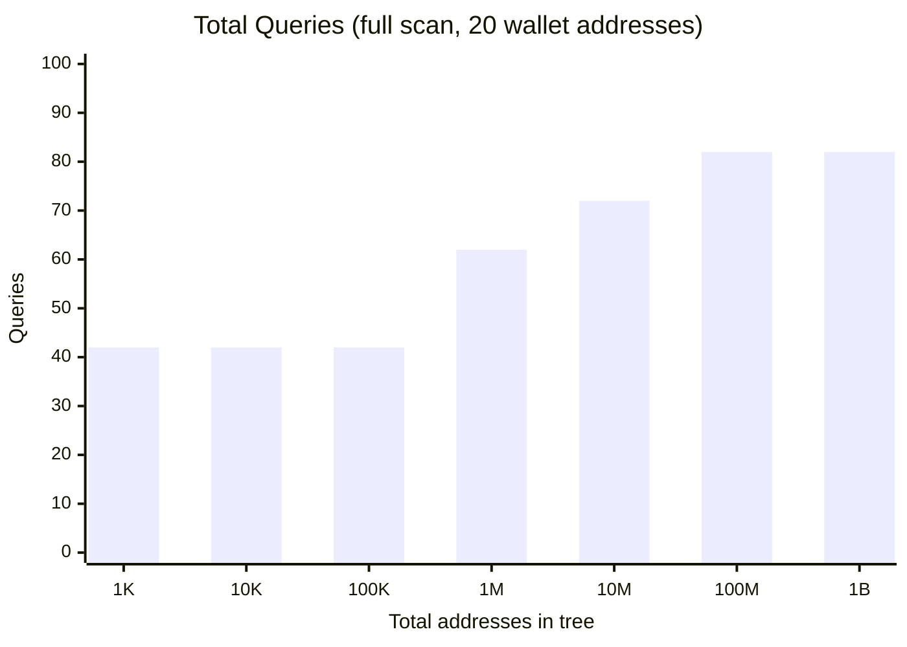
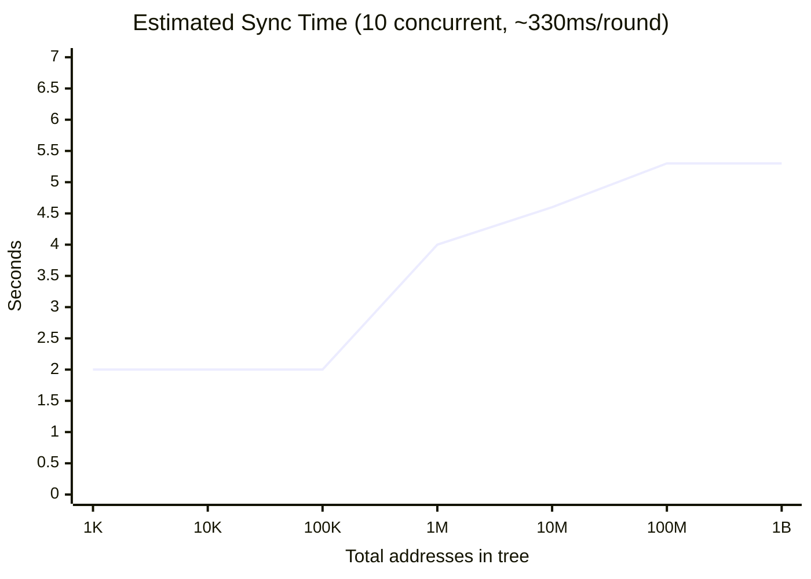

# BLAST Sync

**B**lockchain **L**ayered **A**ddress **S**ync **T**ree (BLAST) is a privacy-preserving
synchronization algorithm used by the Dash Platform SDK. It allows wallets to discover
which of their keys exist in a server-side Merkle tree without revealing the specific
keys being queried.

BLAST is used for two distinct sync tasks:

- **Address balance sync**: Discovering which platform addresses have balances and what
  those balances are.
- **Nullifier sync**: Checking which nullifiers have been spent in the shielded pool.

Both follow the same trunk/branch tree-scan pattern, extracted into a shared generic
algorithm.

## Why BLAST Preserves Privacy

The naive approach to syncing — querying each address individually — leaks the wallet's
full key set to the server. Even batching all keys into a single request reveals the
exact set. The server learns which addresses belong to the same wallet, enabling
transaction graph analysis and balance tracking.

BLAST solves this by never querying individual keys. Instead, the wallet queries
**subtrees** of the Merkle tree. Each query returns a chunk of the tree containing
the target key alongside many other unrelated keys. The server sees a request for a
region of the tree but cannot determine which specific key within that region the
wallet cares about.

The privacy guarantee comes from three mechanisms:

1. **Trunk query hides intent entirely.** The initial trunk query fetches the top
   levels of the entire tree — the same request regardless of which keys the wallet
   holds. The server learns nothing from this query.

2. **Branch queries request subtrees, not keys.** When the wallet needs to resolve a
   key that traced to a truncated leaf, it requests the subtree rooted at that leaf.
   The response contains all keys in that subtree, not just the target. The server
   knows the wallet is interested in *some* key in the subtree, but not which one.

3. **Privacy adjustment enlarges small subtrees.** If a leaf's subtree contains fewer
   than `min_privacy_count` elements (default: 32), the wallet queries an ancestor
   subtree instead — one that contains at least 32 keys. This prevents the server
   from narrowing down the target when a subtree is too small. For example, if the
   target key's leaf subtree has only 3 elements, querying it would reveal the target
   with ~33% probability. By querying an ancestor with 50+ elements, the probability
   drops to ~2%.

4. **Incremental catch-up queries block ranges, not addresses.** The recent and
   compacted change queries ask "what changed since block height X?" — they return
   all address balance changes for all addresses in those blocks, not just the
   wallet's addresses. The server sees a generic block-range query identical to what
   any other wallet would send. The wallet filters the results client-side, discarding
   changes for addresses it doesn't own.

The result: for each sync, the server sees a trunk query (identical for all wallets)
plus a small number of branch queries for subtrees containing 32+ keys each, plus
block-range queries that reveal no address-specific information. It cannot distinguish
which specific keys the wallet owns, how many keys it has, or whether two branch
queries target different keys or are privacy-adjusted queries for the same key.

## Performance

BLAST sync scales **logarithmically** with the total number of addresses in the
platform state tree. A wallet with 20 addresses performs roughly the same number of
queries whether the tree contains 1,000 or 1,000,000,000 addresses.

### Estimated Performance for 20 Wallet Addresses

The total query count is `Q = 1 (trunk) + 2k × iterations + 1 (recent)` where each
key requires 2 branch queries (left + right child) per iteration. See the
[Appendix: Query Count Analysis](#appendix-query-count-analysis) for the full derivation.





| Total addresses | Tree depth | d_trunk | d_branch | Branch iters | Branch queries | Total queries | Parallel rounds | Est. sync time |
|-----------------|------------|---------|----------|--------------|----------------|---------------|-----------------|----------------|
| 1,000 | 10 | 9 | 9 | 1 | 40 | 42 | 6 | ~2.0s |
| 10,000 | 14 | 9 | 9 | 1 | 40 | 42 | 6 | ~2.0s |
| 100,000 | 17 | 9 | 9 | 1 | 40 | 42 | 6 | ~2.0s |
| 1,000,000 | 20 | 9 | 9 | 2 | 60 | 62 | 8 | ~4.0s |
| 10,000,000 | 23 | 9 | 9 | 2 | 70 | 72 | 9 | ~4.6s |
| 100,000,000 | 27 | 9 | 9 | 3 | 80 | 82 | 10 | ~5.3s |
| 1,000,000,000 | 30 | 9 | 9 | 3 | 80 | 82 | 10 | ~5.3s |

**How to read the table**: At 100K addresses (depth 17), the trunk covers 9 levels and
one branch iteration covers up to 9 more levels (total 18 > 17). All 20 keys resolve
in a single round of 40 branch queries. At 1M (depth 20), trunk + one iteration covers
18 levels — 2 levels short, so ~50% of keys need a second round, adding ~20 queries.

**Assumptions**: `d_trunk = 9`, `d_branch = 9` (platform version max_depth), `P = 32`,
**2 branch queries per key per iteration** (left + right child), 10 concurrent branch
queries, ~330ms per parallel round (measured empirically: ~4s for 1M addresses).
Sync time = `rounds × 330ms` where `rounds = 1 (trunk) + ⌈branch_queries / 10⌉ + 1 (recent)`.
Note: iteration transitions add overhead, so multi-iteration syncs are slightly slower
than the formula suggests.

**Incremental sync** (subsequent 15-second re-syncs): **1 query, ~330ms** — only the
recent changes query, no trunk/branch. If compaction occurred: +1 compacted query.

### Key Insight

Going from 1,000 to 1,000,000,000 addresses — a **million-fold increase** — adds only
~40 queries and ~2.6 seconds. The query count grows as `O(k · ⌈log₂(N) / d_branch⌉)`
where each step up in tree depth beyond `d_trunk + d_branch` adds one iteration of
~20 queries (diminishing as keys resolve). With 10-way parallelism, each additional
iteration costs only ~2 extra parallel rounds (~660ms).

## Full Sync Flowchart

```mermaid
flowchart TD
    Start["<b>sync_address_balances</b><br/>called by wallet"] --> CheckTS{"last_sync_timestamp<br/>provided?"}

    CheckTS -->|"No / zero"| FullScan1["<b>FULL SCAN</b><br/>First sync ever"]
    CheckTS -->|"Yes"| CheckElapsed{"Elapsed time ><br/>full_rescan_after?<br/><i>default: 7 days</i>"}

    CheckElapsed -->|"Yes - stale"| FullScan2["<b>FULL SCAN</b><br/>Data too old"]
    CheckElapsed -->|"No - recent"| Incremental["<b>INCREMENTAL ONLY</b><br/>Seed from current_balances<br/>start_height = last_sync_height"]

    FullScan1 --> Trunk
    FullScan2 --> Trunk

    Trunk["<b>Trunk Query</b><br/>Fetch top N levels of Merk tree<br/>Verify proof against quorum-signed root<br/>Sets checkpoint_height from metadata"] --> Classify["<b>Classify Keys</b><br/>BST traversal for each target address<br/><i>Found</i> → record balance<br/><i>Traced to leaf</i> → add to tracker<br/><i>Absent</i> → proven not in tree"]
    Classify --> Privacy["<b>Privacy Adjust</b><br/>Leaves with count < 32:<br/>query ancestor subtree instead<br/>Dedup: multiple keys → one query"]
    Privacy --> Branch["<b>Branch Queries</b><br/>Parallel: up to 10 concurrent<br/>Iterative: up to 50 rounds<br/>Each round resolves deeper leaves<br/>Gap limit extension after each round"]
    Branch -->|"catch_up_from =<br/>checkpoint_height"| Recent

    Incremental --> Recent

    Recent["<b>Query Recent</b><br/>Single query - no pagination needed<br/>Recent tree max 64 blocks < 100 limit<br/><b>Hold results</b> - do not apply yet<br/>Record observed_tip from metadata"] --> CompCheck{"<b>Compaction Check</b><br/>key_exists_as_boundary<br/>on start_height in proof"}

    CompCheck -->|"Key exists as boundary<br/>No compaction happened"| ApplyRecent
    CompCheck -->|"Key missing or<br/>start_height = 0"| Compacted

    Compacted["<b>Query Compacted</b><br/>Paginated: 25 ranges per batch<br/>Aggregated block ranges with<br/>SetCredits or AddToCreditsOperations<br/>Apply immediately, advance height"] --> ApplyRecent

    ApplyRecent["<b>Apply Held Recent</b><br/>Process per-block entries from recent query<br/>Update balances, call on_address_found<br/>Advance current_height per block"] --> Finalize

    Finalize["<b>Finalize</b><br/>new_sync_height = max of current and observed_tip<br/>new_sync_timestamp = latest metadata time<br/>checkpoint_height = trunk query height<br/><i>Caller persists for next sync</i>"]

    style FullScan1 fill:#c53030,color:#fff
    style FullScan2 fill:#c53030,color:#fff
    style Incremental fill:#2b6cb0,color:#fff
    style Trunk fill:#1a365d,color:#e2e8f0
    style Classify fill:#1a365d,color:#e2e8f0
    style Privacy fill:#1a365d,color:#e2e8f0
    style Branch fill:#1a365d,color:#e2e8f0
    style Recent fill:#1a3a2a,color:#e2e8f0
    style CompCheck fill:#744210,color:#fff
    style Compacted fill:#c05621,color:#fff
    style ApplyRecent fill:#1a3a2a,color:#e2e8f0
    style Finalize fill:#2d3748,color:#e2e8f0
```



## The Problem

A wallet holds a set of keys (addresses or nullifiers) and needs to learn which ones
exist in a Merkle tree stored by Platform nodes. The naive approach -- querying each key
individually -- leaks the wallet's full key set to the server. Even batching the keys
into a single request reveals the exact set.

BLAST solves this by querying *subtrees* of the Merkle tree rather than individual keys.
The server returns a chunk of the tree that contains the target key along with many
other keys, making it impossible for the server to determine which specific key the
wallet cares about.

## Algorithm Overview

The sync has two phases: a **tree scan** for bulk discovery, and **incremental catch-up**
for staying current between scans.

## Phase 1: Tree Scan (Trunk/Branch)

### The Underlying Data Structure

Platform stores addresses and nullifiers in a **Merk tree** -- a balanced binary search
tree (BST) where each node is keyed and ordered. Every internal node has a left child
(keys less than this node) and a right child (keys greater than this node). Each node
also carries a Merkle hash of its subtree, making the entire structure cryptographically
verifiable.

The trunk query returns a *partial* view of this BST: the top N levels are fully
expanded (you can see the actual keys and values), while deeper subtrees are truncated
to hash placeholders. The boundary between "expanded" and "truncated" defines the
**leaf nodes** of the trunk result.

```
                          ┌──────┐
                          │  30  │   ← Root node (key=30)
                          └──┬───┘
                      ┌──────┴──────┐
                      ▼             ▼
                   ┌──────┐     ┌──────┐
                   │  15  │     │  45  │   ← Internal nodes (expanded)
                   └──┬───┘     └──┬───┘
                 ┌────┴────┐  ┌────┴────┐
                 ▼         ▼  ▼         ▼
              ┌─────┐  ┌─────┐ ┌─────┐  ┌─────┐
              │  7  │  │ 22  │ │ 38  │  │ 55  │  ← Leaf nodes
              │▓▓▓▓▓│  │▓▓▓▓▓│ │▓▓▓▓▓│  │▓▓▓▓▓│     (children are
              └─────┘  └─────┘ └─────┘  └─────┘      hash placeholders)

              ▓▓▓ = truncated subtree (only hash known, not contents)
```

The trunk result contains three key pieces of data:

- **`elements`**: A `BTreeMap<Vec<u8>, Element>` of key-value pairs at expanded nodes.
  These are fully resolved -- the wallet can read their values directly.
- **`leaf_keys`**: A `BTreeMap<Vec<u8>, LeafInfo>` of nodes at the truncation boundary.
  Each `LeafInfo` has a `hash` (for verifying subsequent branch queries) and an optional
  `count` (number of elements in the truncated subtree).
- **`tree`**: The reconstructed BST structure from the proof, used for key tracing.

### Step 1: The Trunk Query

The wallet sends a single trunk query to a Platform node. The request specifies a
`max_depth` (how many levels of the BST to expand). The server returns the trunk
elements, the leaf boundary information, and a Merkle proof covering the entire
result.

The proof is verified against the quorum-signed root hash, ensuring the server
cannot lie about what the tree contains.

```rust
let (trunk_result, metadata) =
    PlatformAddressTrunkState::fetch_with_metadata(sdk, (), Some(settings)).await?;
```

### Step 2: Classifying Target Keys via BST Traversal

After receiving the trunk, the wallet classifies each of its target keys by traversing
the BST structure. The `trace_key_to_leaf` method performs a standard binary search:

1. Start at the root node.
2. Compare the target key against the current node's key.
3. If equal: the key is found in the trunk elements.
4. If less: follow the left child.
5. If greater: follow the right child.
6. If the current node is a leaf (its children are hash placeholders): the target key
   is somewhere in this leaf's truncated subtree, but we can't resolve it yet.
7. If there is no child to follow: the key is proven absent.

This produces exactly three outcomes for each target key:

| Outcome | What it means | Action |
|---------|---------------|--------|
| **Found** | Key exists in trunk `elements` | Record the value (balance, spent status) |
| **Traced to leaf** | Key is in a truncated subtree | Add to `KeyLeafTracker` for branch querying |
| **Absent** | No path exists in the BST | Key is cryptographically proven to not exist |

```rust
for key in target_keys {
    if trunk_result.elements.contains_key(&key) {
        // Found directly in trunk -- record it
        result.found.insert(key);
    } else if let Some((leaf_key, info)) = trunk_result.trace_key_to_leaf(&key) {
        // Traces to a leaf subtree -- need a branch query
        tracker.add_key(key, leaf_key, info);
    } else {
        // Proven absent from the tree
        result.absent.insert(key);
    }
}
```

A concrete example: suppose the wallet is looking for key `20` in the tree above.
The BST traversal goes: root `30` (20 < 30, go left) -> node `15` (20 > 15, go right)
-> leaf `22` (children are hash placeholders). Key `20` traces to leaf `22` because
it would be in leaf `22`'s left subtree. The wallet now knows it needs to query
leaf `22`'s subtree to determine whether key `20` actually exists.

Note that each target key traces to exactly one leaf -- the BST path is deterministic.
Multiple target keys may trace to the same leaf if they are close together in the key
space.

### Step 3: Privacy Adjustment

Before querying leaf subtrees, the algorithm applies **privacy adjustment** to prevent
the server from learning which specific keys the wallet cares about.

Each leaf in the trunk result has an optional `count` -- the number of elements in its
truncated subtree. If this count is small (below `min_privacy_count`, default 32), then
querying that specific leaf reveals too much: the server knows the wallet is interested
in one of only a few keys.

The fix is to query an **ancestor** higher in the tree that has enough elements to
provide cover:

```
    Suppose leaf "22" has count=5 (too small for privacy).
    Its parent "15" has count=50 (enough).

    Instead of asking: "give me the subtree rooted at 22"
    The wallet asks:   "give me the subtree rooted at 15"

    Now the server sees a query for a 50-element subtree and cannot
    tell whether the wallet wants key 20 (in 22's subtree) or
    key 10 (in 7's subtree) or any other key under 15.
```

The `get_ancestor` method walks up the BST path from the leaf to the root, stopping
at the first ancestor whose count exceeds `min_privacy_count`. It never returns the
root itself (that would be equivalent to re-fetching the entire trunk). If no ancestor
has enough count, it falls back to the node one level below the root.

The query depth is adjusted when using an ancestor: since the ancestor is higher in
the tree, its subtree is deeper, so the depth parameter is reduced by the number of
levels climbed.

Deduplication ensures that if multiple target keys expand to the same ancestor, only
one branch query is sent.

### Step 4: Iterative Branch Queries

For each leaf (or privacy-adjusted ancestor) with unresolved keys, the wallet sends
a **branch query** specifying:
- The leaf's key (identifies which subtree to expand)
- The query depth (how many levels to expand)
- The expected root hash (the leaf's `hash` from the trunk, used for verification)
- The checkpoint height (ensures the branch matches the same tree snapshot as the trunk)

The server returns a `GroveBranchQueryResult` with the same structure as the trunk:
expanded elements, new leaf keys at the next truncation boundary, and a Merk proof.
The wallet verifies the proof against the expected hash from the parent query.

Each target key in the queried subtree is classified again:

- **Found** in the branch elements -- resolved.
- **Traced to a deeper leaf** -- the key is in an even deeper truncated subtree.
  The `KeyLeafTracker` is updated to point to the new, deeper leaf.
- **Absent** -- proven to not exist within this subtree.

```
    Iteration 1: Trunk query
    ┌────────────────────────────────────────────────────┐
    │  Key 20 traces to leaf 22                          │
    │  Key 41 traces to leaf 38                          │
    └────────────────────────────────────────────────────┘
                            │
                            ▼
    Iteration 2: Branch queries for leaves 22 and 38
    ┌────────────────────────────────────────────────────┐
    │  Key 20: found in leaf 22's subtree → RESOLVED     │
    │  Key 41: traces to deeper leaf 40 → CONTINUE       │
    └────────────────────────────────────────────────────┘
                            │
                            ▼
    Iteration 3: Branch query for leaf 40
    ┌────────────────────────────────────────────────────┐
    │  Key 41: proven absent in leaf 40's subtree → DONE │
    └────────────────────────────────────────────────────┘
```

Branch queries run in parallel using `FuturesUnordered` with configurable concurrency
(`max_concurrent_requests`, default: 10). The iteration loop continues until all keys
are resolved or `max_iterations` (default: 50) is reached. In practice, most keys
resolve within 2-3 iterations because each branch query expands several levels of the
tree.

## Phase 2: Incremental Catch-Up

After the tree scan produces a snapshot at some checkpoint height, the wallet needs to
catch up to the chain tip. The incremental phase also runs on its own for frequent
re-syncs (when the elapsed time since the last sync is within `full_rescan_after_time_s`,
default 7 days).

Platform stores per-block address balance changes in a "recent" tree. Every **64 blocks**
(or 2048 address entries), these per-block entries are compacted into aggregated range
entries covering the merged block span. The compacted entries have an expiration TTL
and are eventually cleaned up. This means:

- The **recent tree** never has more than 64 block entries at any time.
- The **compacted tree** contains historical aggregated ranges for blocks that were
  compacted away from the recent tree.

```
  checkpoint_height                              chain_tip
        │                                            │
        ▼                                            ▼
  ──────┬────────────────────────────┬───────────────┤
        │   Compacted ranges         │ Recent blocks │
        │   (aggregated, ≤25/page)   │ (per-block,   │
        │   Only exist after         │  always ≤64)  │
        │   compaction events        │               │
        └────────────────────────────┴───────────────┘
```

### Step 1: Query Recent First

The wallet always queries recent changes first:

```rust
GetRecentAddressBalanceChanges { start_height, prove: true }
```

Since the recent tree can never exceed 64 entries and the server limit is 100 per
request, **one query always covers the entire uncompacted range**. No pagination is
needed for recent changes.

The response contains `Vec<BlockAddressBalanceChanges>`, where each entry has a
`block_height` and a map of `PlatformAddress → CreditOperation` (either `SetCredits`
or `AddToCredits`).

**Important:** The results are held but not applied yet. They may need to be applied
after compacted data if compaction occurred.

### Step 2: Detect Compaction via Proof

The proof returned by the recent query contains Merkle boundary nodes. The wallet
uses `key_exists_as_boundary` to check whether the `start_height` key still exists
in the recent tree:

```rust
let cursor_exists = Drive::verify_key_exists_as_boundary(
    proof,
    &recent_tree_path,
    start_height_key,
    platform_version,
)?;
```

This works because the recent query uses an exclusive range (`RangeAfter`) where
`start_height` appears as a boundary node in the proof, not as a result entry.

| `cursor_exists` | Meaning | Action |
|-----------------|---------|--------|
| `true` | `start_height` still in recent tree — no compaction happened | Apply held recent results directly (Step 4) |
| `false` | `start_height` was compacted away | Query compacted first (Step 3), then apply recent |

**Special case:** On the first incremental catch-up after a tree scan (`start_height`
comes from the checkpoint, not from a previous recent sync), always query compacted
because there is no prior recent key to validate.

### Step 3: Query Compacted (only if needed)

Only runs when compaction is detected or on the first catch-up after a tree scan:

```rust
GetRecentCompactedAddressBalanceChanges { start_block_height, prove: true }
```

Returns `Vec<CompactedBlockAddressBalanceChanges>`, where each entry has:
- `start_block_height` and `end_block_height` (the compacted range)
- `changes: BTreeMap<PlatformAddress, BlockAwareCreditOperation>`
  - `SetCredits(u64)` — absolute balance
  - `AddToCreditsOperations(Vec<(height, credits)>)` — deltas by height

The server returns up to 25 ranges per request. If the response contains exactly 25
entries, the client paginates by setting `start_block_height = last_end_height + 1`
and querying again.

Compacted changes are applied to the result immediately, updating balances and
advancing the pagination cursor.

### Step 4: Apply Held Recent Results

After compacted data (if any) is applied, the held recent results from Step 1 are
processed:

- For each `BlockAddressBalanceChanges` entry, for each address change, if the address
  matches one of the wallet's target addresses, update the balance and call
  `provider.on_address_found()`.
- Advance `current_height` to `block_height + 1` for each processed entry.

### Finalization

```rust
result.new_sync_height = max(current_height, observed_tip_height);
result.new_sync_timestamp = latest_metadata.time_ms / 1000;
```

The caller persists `new_sync_height` and `new_sync_timestamp` for the next sync call.
On the next incremental sync, `new_sync_height` becomes `start_height` for the recent
query, and `new_sync_timestamp` determines whether a full tree rescan is needed.

## The TrunkBranchSyncOps Trait

The shared algorithm is parameterized by the `TrunkBranchSyncOps` trait, defined in
`packages/rs-sdk/src/platform/trunk_branch_sync/mod.rs`. Each sync module implements
this trait to plug in its specific query construction, result processing, and
depth limits.

```rust
pub trait TrunkBranchSyncOps {
    /// Module-specific mutable state carried through the scan.
    type Context<'a>: Send where Self: 'a;

    /// Immutable config for parallel branch queries (cloned into each task).
    type BranchQueryConfig: Clone + Send + Sync + 'static;

    // Trunk
    async fn execute_trunk_query(sdk, settings, context)
        -> Result<(GroveTrunkQueryResult, u64, u64), Error>;
    fn process_trunk_result(trunk_result, context, tracker) -> Result<(), Error>;

    // Branch
    fn branch_query_config(context) -> Self::BranchQueryConfig;
    async fn execute_single_branch_query(sdk, config, key, depth, ...)
        -> Result<GroveBranchQueryResult, Error>;
    fn process_branch_result(branch_result, leaf_key, context, tracker)
        -> Result<(), Error>;

    // Limits and hooks
    fn depth_limits(platform_version) -> (u8, u8);
    fn after_branch_iteration(trunk_result, context, tracker) { }
    fn on_branch_query(context);
    fn on_branch_failure(context);
    fn on_elements_seen(context, count);
    fn on_iteration(context, iteration);
    fn set_checkpoint_height(context, height);
}
```

The two associated types deserve attention:

- **`Context<'a>`** is a GAT (generic associated type) that carries mutable state
  through the algorithm. For nullifiers, this holds the input keys and result sets.
  For addresses, it holds the address provider, key-to-index mapping, and result.

- **`BranchQueryConfig`** holds immutable parameters needed to construct branch
  queries that must be sent to async tasks. For nullifiers, this is
  `(pool_type, pool_identifier)`. For addresses, it is `()` since no extra parameters
  are needed.

The `after_branch_iteration` hook allows the address sync module to implement gap-limit
behavior: after each branch iteration, it checks if the provider has extended its
pending address list and adds newly pending keys to the tracker.

## KeyLeafTracker

The `KeyLeafTracker` (in `trunk_branch_sync/tracker.rs`) maintains the mapping between
target keys and the leaf subtrees they reside in. It supports:

- **Adding keys**: When a key traces to a leaf during trunk processing
- **Updating keys**: When a branch query reveals the key is in a deeper subtree
- **Removing keys**: When a key is found or proven absent
- **Reference counting**: Multiple target keys can map to the same leaf; the leaf
  stays active until all its keys are resolved

```rust
let mut tracker = KeyLeafTracker::new();

// After trunk query: key traces to leaf subtree
tracker.add_key(target_key, leaf_boundary_key, leaf_info);

// After branch query: key found in subtree
tracker.key_found(&target_key);

// After branch query: key in even deeper subtree
tracker.update_leaf(&target_key, deeper_leaf_key, deeper_info);

// Check what still needs querying
let active = tracker.active_leaves(); // leaves with unresolved keys
let remaining = tracker.remaining_count();
```

## Privacy-Adjusted Leaves (Detail)

The `get_privacy_adjusted_leaves` function (in `trunk_branch_sync/mod.rs`) implements
the privacy adjustment described in Phase 1, Step 3. The full logic for each active
leaf:

1. Calculate the query depth from the leaf's element count using
   `calculate_max_tree_depth_from_count(count)`, clamped to platform-version bounds
   `[min_query_depth, max_query_depth]`.
2. If `count >= min_privacy_count`: query this leaf directly at the calculated depth.
3. If `count < min_privacy_count`: call `trunk_result.get_ancestor(&leaf_key, min_privacy_count)`
   to find a higher node. Reduce depth by `levels_up` (the number of tree levels
   climbed) so the total subtree size returned stays reasonable.
4. If no suitable ancestor exists (rare -- means the entire tree is small): query the
   leaf anyway, accepting reduced privacy.
5. Deduplicate: if two target keys expand to the same ancestor, only one branch query
   is emitted (tracked via a `BTreeSet<LeafBoundaryKey>`).

## Concrete Implementations

### Address Balance Sync

The address sync module (`platform/address_sync/`) implements `TrunkBranchSyncOps`
as `AddressOps<P>` where `P: AddressProvider`.

The `AddressProvider` trait is implemented by wallets to supply:
- The list of pending addresses to check
- Callbacks when addresses are found or proven absent
- Gap-limit extension (generating new addresses when prior ones are found)
- Current balances for incremental-only mode

```rust
// First sync -- full tree scan + incremental catch-up
let result = sdk.sync_address_balances(&mut wallet, None, None).await?;

// Store for next call
let height = result.new_sync_height;
let timestamp = result.new_sync_timestamp;

// Subsequent sync -- incremental only if within 7-day threshold
let result = sdk.sync_address_balances(&mut wallet, None, Some(timestamp)).await?;
```

Address balance sync uses `ItemWithSumItem` GroveDB elements where the item value
contains the nonce (4 bytes big-endian) and the sum value contains the credit balance.

### Nullifier Sync

The nullifier sync module (`platform/nullifier_sync/`) implements `TrunkBranchSyncOps`
as `NullifierOps`.

Nullifier sync differs from address sync in several ways:
- Target keys are fixed 32-byte arrays (`[u8; 32]`)
- Branch queries carry extra config: `(pool_type, pool_identifier)` to identify the
  shielded pool
- No gap-limit behavior (the `after_branch_iteration` hook is not overridden)
- Branch query failures are tracked in metrics

```rust
let nullifiers: Vec<[u8; 32]> = vec![/* ... */];

// First sync -- full tree scan + incremental catch-up
let result = sdk.sync_nullifiers(&nullifiers, None, None, None).await?;

// Store for next call
let height = result.new_sync_height;
let timestamp = result.new_sync_timestamp;

// Subsequent sync -- incremental only if within 7-day threshold
let result = sdk.sync_nullifiers(&nullifiers, None, Some(height), Some(timestamp)).await?;
```

Found nullifiers indicate spent notes; absent nullifiers indicate unspent notes.

## Sync Mode Decision

Both sync modules use the same logic to decide between full scan and incremental-only:

| `last_sync_timestamp` | Elapsed time | Mode |
|----------------------|--------------|------|
| `None` | -- | Full tree scan + catch-up |
| `Some(ts)` | < `full_rescan_after_time_s` | Incremental only |
| `Some(ts)` | >= `full_rescan_after_time_s` | Full tree scan + catch-up |

The default `full_rescan_after_time_s` is 604800 (7 days). Setting it to 0 forces a
full tree scan on every call.

## Configuration

Both modules expose configuration structs with sensible defaults:

| Parameter | Default | Description |
|-----------|---------|-------------|
| `min_privacy_count` | 32 | Minimum elements in a queried subtree |
| `max_concurrent_requests` | 10 | Parallel branch queries |
| `max_iterations` | 50 | Safety limit for branch iteration depth |
| `full_rescan_after_time_s` | 604800 | Seconds before forcing a full rescan |

## Module Structure

```
packages/rs-sdk/src/platform/
├── trunk_branch_sync/
│   ├── mod.rs        # TrunkBranchSyncOps trait, run_full_tree_scan(),
│   │                 #   get_privacy_adjusted_leaves(), parallel execution
│   └── tracker.rs    # KeyLeafTracker with reference counting
├── address_sync/
│   ├── mod.rs        # AddressOps<P> impl, sync_address_balances(),
│   │                 #   incremental_catch_up()
│   ├── provider.rs   # AddressProvider trait
│   └── types.rs      # AddressSyncConfig, AddressSyncResult, AddressFunds
└── nullifier_sync/
    ├── mod.rs        # NullifierOps impl, sync_nullifiers(),
    │                 #   incremental_catch_up()
    ├── provider.rs   # NullifierProvider trait
    └── types.rs      # NullifierSyncConfig, NullifierSyncResult
```

## Rules

**Do:**

- Use `sdk.sync_address_balances()` or `sdk.sync_nullifiers()` as the entry points.
- Persist `new_sync_height` and `new_sync_timestamp` from the result and pass them
  back on the next sync call. This enables incremental-only mode.
- Implement `AddressProvider` to integrate with your wallet's key derivation and
  storage.
- Set `min_privacy_count` high enough that individual key lookups cannot be
  distinguished. The default of 32 is a reasonable minimum.

**Don't:**

- Query individual keys directly via the trunk/branch RPCs -- use the sync functions
  which handle privacy adjustment, iteration, and proof verification.
- Set `max_iterations` too low -- complex trees may need many rounds. The default of
  50 handles trees with millions of entries.
- Ignore the `full_rescan_after_time_s` threshold -- without periodic full rescans,
  the incremental phase could miss changes that occurred before the last known height.
- Skip the incremental catch-up phase -- the tree scan snapshot may be slightly stale
  (the trunk is captured at a specific block height), and the catch-up brings it
  current.

## Appendix: Query Count Analysis

Let `N` = total addresses in the tree, `k` = wallet addresses (e.g. 20), `d_trunk` =
trunk depth (levels expanded), `d_branch` = levels per branch query, and `P` = privacy
minimum (default 32).

The Merk tree is a balanced BST with depth `D = ⌈log₂(N)⌉`.

**Trunk query**: Always exactly **1 query**. Returns the top `d_trunk` levels,
where `d_trunk` is between `min_depth` (6) and `max_depth` (9) depending on tree
size. Exposes `~2^d_trunk` nodes. Cost is independent of `k` or `N`.

**Key classification**: After the trunk, each of the `k` target keys is classified
by BST traversal (local computation, no queries). Keys found directly in trunk
elements are resolved immediately.

**Branch queries per iteration**: Unresolved keys trace to trunk leaves. With
privacy adjustment, keys mapping to subtrees smaller than `P` are promoted to
ancestor subtrees. Multiple keys may share an ancestor, reducing the query count.
Expected unique leaves after deduplication:

`L ≈ min(k, 2^d_trunk) · (1 - e^(-k / 2^d_trunk))`

**Total branch queries**: Each target key that traces to a leaf requires **2 branch
queries** per iteration — one for the left child subtree and one for the right child —
to determine which side the key falls on. With `k = 20` wallet keys, the first
iteration produces `2k = 40` branch queries. If the tree is deeper than
`d_trunk + d_branch`, some keys trace to deeper leaves and require a second iteration
with fewer keys (typically ~50% resolve per round).

**Iterations needed**: `I = ⌈(D - d_trunk) / d_branch⌉` where `D = ⌈log₂(N)⌉`.
Both `d_trunk` and `d_branch` range from 6 to 9 (configured per platform version).
For trees up to depth ~18 (N ≤ ~260K), one iteration suffices with max depth 9.
Deeper trees need additional iterations.

**Incremental catch-up**: 1 recent query + 0–1 compacted queries.

**Total**:

`Q_total = 1 (trunk) + 2k × I_eff + Q_incremental`

where `I_eff` accounts for decreasing keys per iteration (not all keys need every
round). In practice, `I_eff ≈ I × 0.7` because ~50% of keys resolve per iteration
and later rounds have progressively fewer queries.
