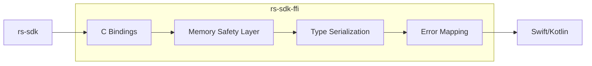
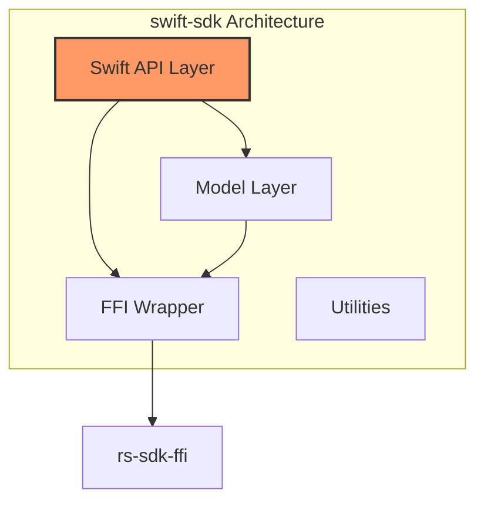
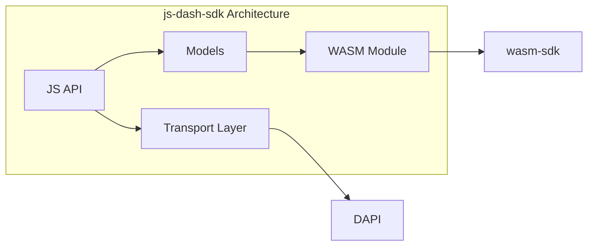
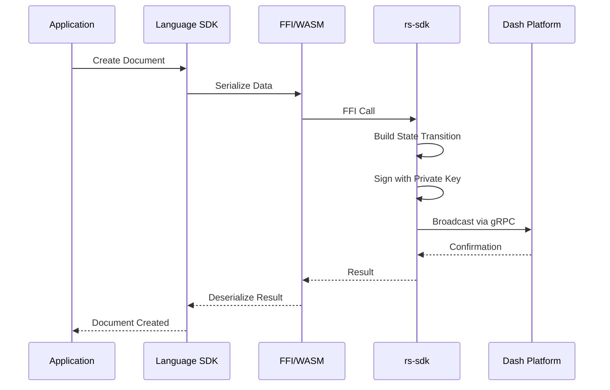
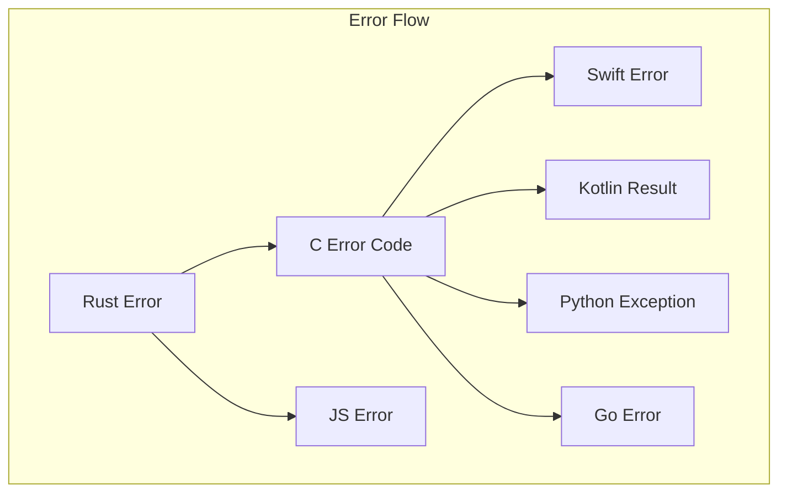

# Dash Platform SDK Architecture

## Overview

The Dash Platform SDK ecosystem consists of multiple layers that enable developers to interact with the Dash Platform across different programming languages and environments. This document provides a comprehensive overview of the SDK architecture, including the relationships between different components and implementation details.

## Architecture Layers

```mermaid
graph TB
    subgraph "Platform Core"
        DP[Dash Platform]
    end
    
    subgraph "Core SDK Layer"
        RS[rs-sdk<br/>Rust SDK Core]
    end
    
    subgraph "FFI/Bridge Layer"
        RSFFI[rs-sdk-ffi<br/>Foreign Function Interface]
        WASM[wasm-sdk<br/>WebAssembly Bridge]
    end
    
    subgraph "Language SDKs"
        SWIFT[swift-sdk<br/>iOS/macOS SDK]
        KOTLIN[kotlin-sdk<br/>Android/JVM SDK]
        JS[js-dash-sdk<br/>JavaScript SDK]
        PYTHON[python-sdk<br/>Python SDK<br/>(Planned)]
        GO[go-sdk<br/>Go SDK]
    end
    
    subgraph "Applications"
        IOS[iOS Apps]
        ANDROID[Android Apps]
        WEB[Web Apps]
        NODE[Node.js Apps]
        PYAPPS[Python Apps/<br/>Scripts/Services]
        GOAPPS[Go Services/<br/>Microservices]
    end
    
    DP --> RS
    RS --> RSFFI
    RS --> WASM
    RSFFI --> SWIFT
    RSFFI --> KOTLIN
    RSFFI --> PYTHON
    RSFFI --> GO
    WASM --> JS
    SWIFT --> IOS
    KOTLIN --> ANDROID
    JS --> WEB
    JS --> NODE
    PYTHON --> PYAPPS
    GO --> GOAPPS
    
    style RS fill:#f9f,stroke:#333,stroke-width:4px
    style RSFFI fill:#bbf,stroke:#333,stroke-width:2px
    style WASM fill:#bbf,stroke:#333,stroke-width:2px
```

## Component Details

### 1. Core SDK Layer: rs-sdk

The `rs-sdk` is the foundational Rust implementation that provides:

- **Direct Platform Communication**: Native gRPC client for DAPI
- **Cryptographic Operations**: Key management, signing, verification
- **Data Contract Management**: Creation, updates, and validation
- **Document Operations**: CRUD operations with Platform documents
- **Identity Management**: Identity creation, updates, credit transfers
- **State Transitions**: Building and broadcasting state transitions
- **Proof Verification**: Cryptographic proof validation

```
┌─────────────────────────────────────────┐
│              rs-sdk (Rust)              │
├─────────────────────────────────────────┤
│ • Platform Client                       │
│ • Identity Management                   │
│ • Document Operations                   │
│ • Data Contract Management              │
│ • Cryptographic Operations              │
│ • State Transition Builder              │
│ • Proof Verification                    │
└─────────────────────────────────────────┘
```

### 2. Bridge Layer

#### 2.1 rs-sdk-ffi (Foreign Function Interface)

The FFI layer provides C-compatible bindings for native mobile platforms:



**Key Features:**
- **C ABI Compatibility**: Exposes Rust functions through C interface
- **Memory Management**: Safe memory handling across language boundaries
- **Type Mapping**: Converts Rust types to C-compatible structures
- **Error Handling**: Maps Rust Results to error codes/exceptions
- **Async Bridge**: Handles Rust async/await for synchronous FFI calls

#### 2.2 wasm-sdk (WebAssembly Bridge)

The WASM bridge enables JavaScript SDK functionality:

```
┌─────────────────────────────────────────┐
│           wasm-sdk (WASM)               │
├─────────────────────────────────────────┤
│ • WebAssembly Compilation of rs-sdk     │
│ • JavaScript Type Bindings              │
│ • Browser-Compatible Crypto             │
│ • Async/Promise Integration             │
│ • Memory Management for JS              │
└─────────────────────────────────────────┘
```

### 3. Language-Specific SDKs

#### 3.1 Swift SDK (iOS/macOS)



**Components:**
- **Swift API Layer**: Idiomatic Swift interfaces
- **Model Layer**: Swift structs/classes for Platform types
- **FFI Wrapper**: Safe Swift wrappers around C functions
- **Error Handling**: Swift Error protocol implementation
- **Async/Await**: Native Swift concurrency support

#### 3.2 Kotlin SDK (Android/JVM) - Planned

```
┌─────────────────────────────────────────┐
│            kotlin-sdk (Planned)         │
├─────────────────────────────────────────┤
│ • JNI Bindings to rs-sdk-ffi            │
│ • Kotlin-first API                      │
│ • Android-Specific Features             │
│ • Coroutine Support                     │
│ • Type-Safe Builders                    │
└─────────────────────────────────────────┘
```

#### 3.3 Python SDK - Planned

```
┌─────────────────────────────────────────┐
│            python-sdk (Planned)         │
├─────────────────────────────────────────┤
│ • PyO3 Bindings to rs-sdk-ffi           │
│ • Pythonic API                          │
│ • Type Hints Support                    │
│ • Async/Await Support                   │
│ • Data Science Integration              │
└─────────────────────────────────────────┘
```

**Use Cases:**
- **Backend Services**: API servers and microservices
- **Data Analysis**: Blockchain analytics and reporting
- **Automation**: Scripts and DevOps tools
- **Machine Learning**: Data preprocessing for ML pipelines

#### 3.4 Go SDK

```
┌─────────────────────────────────────────┐
│               go-sdk                    │
├─────────────────────────────────────────┤
│ • CGO Bindings to rs-sdk-ffi            │
│ • Idiomatic Go API                      │
│ • Context Support                       │
│ • Comprehensive Error Handling          │
│ • Automatic Memory Management           │
│ • Full Test Coverage                    │
└─────────────────────────────────────────┘
```

**Architecture:**
```go
// Main SDK structure
sdk := dash.NewSDK(config)
defer sdk.Close()

// Sub-modules for clean API
sdk.Identities()   // Identity operations
sdk.Contracts()    // Data contract operations
sdk.Documents()    // Document CRUD
sdk.Tokens()       // Token operations
```

**Key Features:**
- **Type Safety**: Strong typing with custom types for IDs
- **Memory Safety**: Automatic cleanup with finalizers and manual close
- **Builder Pattern**: Fluent API for complex queries
- **Test Support**: Mock SDK for offline testing

**Use Cases:**
- **High-Performance Services**: Low-latency blockchain services
- **Cloud Native**: Kubernetes operators and controllers
- **Infrastructure**: DevOps tools and monitoring
- **Concurrent Processing**: High-throughput transaction processing

#### 3.5 JavaScript SDK (js-dash-sdk)



**Features:**
- **Browser & Node.js Support**: Universal JavaScript compatibility
- **WASM Integration**: Uses wasm-sdk for crypto operations
- **Promise-Based API**: Modern async/await support
- **TypeScript Definitions**: Full type safety
- **Transport Abstraction**: HTTP/WebSocket support

## Data Flow Example

Here's how a document creation flows through the SDK layers:



## Type System Architecture

The SDK maintains type safety across language boundaries:

```
┌──────────────────┐     ┌─────────────────┐     ┌─────────────────┐
│   Rust Types     │────▶│   C Types       │────▶│  Native Types   │
│                  │     │                 │     │                 │
│ • Identity       │     │ • Opaque Ptrs   │     │ • Swift Classes │
│ • Document       │     │ • C Structs     │     │ • Kotlin Objects│
│ • DataContract   │     │ • Error Codes   │     │ • Python Objects│
│ • StateTransition│     │ • Callbacks     │     │ • Go Structs    │
│                  │     │                 │     │ • JS Objects    │
│                  │     │                 │     │ • TypeScript    │
└──────────────────┘     └─────────────────┘     └─────────────────┘
```

## Memory Management Strategy

### FFI Layer (Mobile SDKs)
- **Ownership Transfer**: Clear ownership rules for memory
- **Reference Counting**: Smart pointers for shared data
- **Explicit Cleanup**: Destructor functions for manual memory management

### WASM Layer (JavaScript SDK)
- **Automatic GC**: Leverages JavaScript garbage collection
- **Linear Memory**: WASM linear memory model
- **Typed Arrays**: Efficient binary data handling

## Error Handling Architecture



Each SDK layer provides appropriate error handling:
- **Rust**: Result<T, E> with detailed error types
- **FFI**: Error codes with error detail retrieval functions
- **Swift**: Error protocol with associated values
- **Kotlin**: Sealed classes for type-safe error handling
- **Python**: Exception hierarchy with error details
- **Go**: Error interface with wrapped errors
- **JavaScript**: Error objects with error codes and messages

## Platform Feature Support Matrix

| Feature | Rust SDK | Swift SDK | Kotlin SDK | Python SDK | Go SDK | JS SDK |
|---------|----------|-----------|------------|------------|--------|---------|
| Identity Management | ✅ | ✅ | ⏳ | ⏳ | ✅ | ✅ |
| Data Contracts | ✅ | ✅ | ⏳ | ⏳ | ✅ | ✅ |
| Documents | ✅ | ✅ | ⏳ | ⏳ | ✅ | ✅ |
| Tokens | ✅ | ✅ | ⏳ | ⏳ | ✅ | ⏳ |
| Proofs | ✅ | ✅ | ⏳ | ⏳ | 🚧 | 🚧 |
| State Transitions | ✅ | ✅ | ⏳ | ⏳ | 🚧 | ⏳ |
| Dashpay | ⏳ | ⏳ | ⏳ | ⏳ | ⏳ | ⏳ |
| Name Service (DPNS) | ⏳ | ⏳ | ⏳ | ⏳ | 🚧 | ⏳ |
| Core Types Support | ✅ | ✅ | ⏳ | ⏳ | ✅ | ⏳ |
| Core Blockchain Sync | 🚧 | 🚧 | ⏳ | ⏳ | ⏳ | ⏳ |
| Core Deterministic Masternode List Sync | 🚧 | 🚧 | ⏳ | ⏳ | ⏳ | ⏳ |

Legend: ✅ Fully Supported | 🚧 In Development | ⏳ Planned | ❌ Not Supported

## Development Considerations

### Performance
- **FFI Overhead**: Minimal overhead for native SDKs
- **WASM Performance**: Near-native performance for crypto operations
- **Caching**: Built-in caching for Platform queries
- **Batch Operations**: Support for batching multiple operations

### Security
- **Key Management**: Secure key storage per platform
- **Memory Protection**: Safe memory handling across boundaries
- **Input Validation**: Validation at each layer
- **Secure Communication**: TLS for all Platform communication

### Testing Strategy
```
┌─────────────────────────────────────────┐
│          Integration Tests              │
├─────────────────────────────────────────┤
│          Language SDK Tests             │
├─────────────────────────────────────────┤
│            FFI/WASM Tests               │
├─────────────────────────────────────────┤
│            rs-sdk Tests                 │
└─────────────────────────────────────────┘
```

## Future Architecture Evolution

### Planned Enhancements
1. **Direct WASM Bindings**: Skip JavaScript for performance-critical paths
2. **Unified Type Generation**: Auto-generate types from Rust definitions
3. **Plugin Architecture**: Extensible SDK functionality
4. **Offline Support**: Local caching and sync capabilities
5. **Real-time Updates**: WebSocket support for live updates

### SDK Roadmap
- **Phase 1**: Core functionality parity across all SDKs
- **Phase 2**: Platform-specific optimizations
- **Phase 3**: Advanced features (offline, real-time)
- **Phase 4**: Developer tools and debugging support