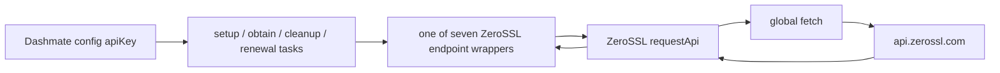

# ZeroSSL REST API Header Authentication Migration

**Status:** Independently reviewed and approved for implementation; the evidence and alignment gates are satisfied.

**Target:** `fix/zerossl-header-auth`, based directly on `origin/v4.1-dev` commit `69b85c81af8e000e8506edaa13406d1f6274af5a`.

## Problem and security motivation

Dashmate currently interpolates the configured ZeroSSL API key into the URL of every ZeroSSL REST request as `access_key`. Sensitive query strings can be retained by clients, proxies, servers, observability systems, and error tooling even when HTTPS protects the request in transit. MITRE classifies this as [CWE-598: Use of HTTP Request With Sensitive Query String](https://cwe.mitre.org/data/definitions/598.html) and recommends putting secrets in request headers or bodies; [HTTP Semantics, RFC 9110 section 17.9](https://www.rfc-editor.org/rfc/rfc9110.html#section-17.9) likewise warns that URIs are commonly logged and should not contain sensitive information.

The requested target is the exact header:

```text
Authorization: ApiKey <access-key>
```

The security outcome is narrower than general API-key hardening: after the change, the configured ZeroSSL key must be present only in the `Authorization` header at the HTTP boundary, never in a URL, request body, application-created error, or application log.

## External evidence and documentation conflict

Research completed on 2026-08-19 found a direct conflict that must not be averaged away:

- ZeroSSL's official [August 17, 2026 product update](https://zerossl.com/updates#publications/api-users-access-key-via-header-is-now-the-recommended-approach-for-authentication) says header authentication is available now, deprecates `access_key` URL authentication, and specifies the exact and exclusive header prefix `Authorization: ApiKey <access-key>`.
- ZeroSSL's current official [REST API overview](https://zerossl.com/documentation/api/) still says the key **must** be supplied as an `access_key` HTTPS GET parameter and shows it in the URL.
- Current official endpoint pages also continue to call `access_key` required, including [Create Certificate](https://zerossl.com/documentation/api/create-certificate/), [Verify Domains](https://zerossl.com/documentation/api/verify-domains/), [List Certificates](https://zerossl.com/documentation/api/list-certificates/), [Get Certificate](https://zerossl.com/documentation/api/get-certificate/), [Download Certificate](https://zerossl.com/documentation/api/download-certificate/), [Revoke Certificate](https://zerossl.com/documentation/api/revoke-certificate/), and [Cancel Certificate](https://zerossl.com/documentation/api/cancel-certificate/).

The newer, purpose-specific product update governs this migration: it explicitly announces the authentication transition and exact syntax, while the general and endpoint documentation has not yet caught up. The conflict remains documented so a future maintainer does not mistake the stale query examples for a reason to restore URL authentication.

### Pre-implementation evidence gate

This gate was satisfied on 2026-08-19 by the canonical ZeroSSL product update above. Archive that URL in the implementation handoff and later link it from the PR description.

For any future re-evaluation where that publication is withdrawn or contradicted by newer authoritative guidance, the maintainer requesting implementation owns the renewed gate and must obtain one of the following before changing the authentication contract:

1. The canonical ZeroSSL announcement or authenticated account notice, including its date and the exact header syntax; or
2. Written ZeroSSL support confirmation that `api.zerossl.com` accepts `Authorization: ApiKey <access-key>` for the seven endpoints in this spec.

A header-only call to the read-only List Certificates endpoint with a dedicated non-production key can corroborate acceptance, but it does not replace an official contract or establish a deprecation timeline. Do not test by sending both the header and query parameter: that would retain the leak and would not prove which credential placement authenticated the request.

If authoritative evidence instead confirms a different header, scheme, or rollout condition, stop and revise/re-review this spec. Do not silently substitute APILayer's generic `apikey` header or any other authentication form.

If neither acceptable evidence source can be obtained during a future re-evaluation, the terminal decision is to defer further authentication changes and retain the last verified contract. Do not leave an implementation partially started, infer support from silence, or bypass the gate with a risk acceptance.

## Verified repository scope

The branch is cleanly based on the requested `origin/v4.1-dev` commit. A repository-wide search found exactly seven production ZeroSSL REST endpoint wrappers containing `access_key` in URLs:

| Wrapper | HTTP request shape today | Immediate caller(s) |
| --- | --- | --- |
| `packages/dashmate/src/ssl/zerossl/cancelCertificate.js` | `POST /certificates/{id}/cancel` | `cleanupZeroSSLCertificatesTaskFactory` |
| `packages/dashmate/src/ssl/zerossl/createZeroSSLCertificate.js` | `POST /certificates` with form body | `obtainZeroSSLCertificateTaskFactory` through DI |
| `packages/dashmate/src/ssl/zerossl/downloadCertificate.js` | `GET /certificates/{id}/download/return` | `obtainZeroSSLCertificateTaskFactory` through DI |
| `packages/dashmate/src/ssl/zerossl/getCertificate.js` | `GET /certificates/{id}` | obtain flow, certificate validation, and renewal scheduler through DI |
| `packages/dashmate/src/ssl/zerossl/listCertificates.js` | `GET /certificates` with pagination/filter/search query | cleanup flow, setup API-key validation, and obtain flow through DI/direct import |
| `packages/dashmate/src/ssl/zerossl/revokeCertificate.js` | `POST /certificates/{id}/revoke` | No repository caller found; it remains a production endpoint wrapper and is in scope |
| `packages/dashmate/src/ssl/zerossl/verifyDomain.js` | `POST /certificates/{id}/challenges` with form body | `obtainZeroSSLCertificateTaskFactory` through DI |

All seven import the ZeroSSL-local `packages/dashmate/src/ssl/zerossl/requestApi.js`, which is the only code in this area that calls `fetch`. No other module imports `requestApi`.

The request/data flow is:



No current unit test exercises any of the seven endpoint wrappers or `requestApi`; the nearby tests stub these functions at their callers. Dashmate's existing unit-test convention supports stubbing `globalThis.fetch` with Sinon and asserting Chai/Sinon call arguments, so the HTTP contract can be covered without network access or a real key.

### Other key placements and logging audit

- The key is persisted at `platform.gateway.ssl.providerConfigs.zerossl.apiKey`, collected by the setup prompt, and carried in task/validation context. Those placements are required by the existing product flow and are unchanged.
- `packages/dashmate/src/config/obfuscateConfig.js` already masks fields named `apiKey` when configuration is rendered.
- No relevant production code explicitly logs the key, a ZeroSSL request URL, or fetch options. The cleanup debug path logs the thrown error object, and renewal paths log `error.message`; `requestApi` currently creates errors only from ZeroSSL response error fields and does not attach its URL or options. Preserve that behavior.
- Moving the key to a header prevents URI-based leakage, but infrastructure that logs request headers must still redact `Authorization`. This repository does not configure such third-party logging at this request boundary.
- The setup prompt uses a normal input control rather than a masked secret control. Changing prompt visibility or API-key storage is a separate security-hardening concern, not part of this transport migration.

## Chosen approach

Centralize authentication injection in the existing ZeroSSL-only `requestApi` helper.

Change its internal interface from `requestApi(url, options)` to `requestApi(apiKey, url, options)`. The helper will create a fresh fetch-options object and a fresh WHATWG `Headers` instance, preserve all existing option fields and endpoint headers, and use case-insensitive `headers.set('Authorization', ...)` semantics so exactly one canonical authorization value wins even if a future caller supplies differently-cased header names. It will not mutate the caller's options or headers, add authentication to the URL/body, or attach the key/headers/options to thrown errors.

Header construction is a secret-handling boundary. A missing/empty key, a key with leading or trailing whitespace, any local failure while constructing or setting its header, or any WHATWG whitespace normalization that makes the stored value differ from the intended `ApiKey ${apiKey}` value must throw a new generic ZeroSSL authentication-configuration error with no key-bearing `cause` or copied properties; `fetch` must not run. This prevents Node's native invalid-header error text from echoing the rejected header value and prevents ambiguous or silently normalized credentials.

Response parsing and error construction are also inside the boundary. If `response.json()` fails, discard the native parse error (which can quote response-body content) and throw a generic key-free ZeroSSL response-format error with no `cause` or copied properties. For a parsed `data.error`, recursively redact every exact API-key occurrence from all string values and object member names **before any error field is read to construct `Error` or copied onto it**. The resulting error retains the current `message`, `code`, `type`, and details shape except for those redactions. These narrow exceptions prevent an upstream or intermediary response from reflecting the credential into paths Dashmate logs.

Each endpoint wrapper will:

1. Keep its exported function signature and return behavior unchanged.
2. Remove only the `access_key` portion of its URL.
3. Preserve path parameters, non-auth query parameters, methods, form bodies, content types, response mapping, and error behavior.
4. Pass its existing `apiKey` argument to `requestApi` as the first argument.

No task, DI registration, configuration schema, CLI, scheduler, or documentation interface changes are required.

### Exact resulting request behavior

| Wrapper | URL after migration | Preserved request details |
| --- | --- | --- |
| Cancel | `https://api.zerossl.com/certificates/{id}/cancel` | `POST`; existing form content type; no body |
| Create | `https://api.zerossl.com/certificates` | `POST`; existing encoded CSR/domain/validity form body and content type |
| Download | `https://api.zerossl.com/certificates/{id}/download/return` | `GET`; existing certificate/bundle concatenation |
| Get | `https://api.zerossl.com/certificates/{id}` | `GET`; existing `Certificate` conversion |
| List, default | `https://api.zerossl.com/certificates?limit=1000&page=1` | `GET`; existing result-to-`Certificate` mapping |
| List, filters | `https://api.zerossl.com/certificates?limit=1000&page={page}&statuses={comma-list}&search={search}` | Existing parameter names, order, defaults, and conditional inclusion |
| Revoke | `https://api.zerossl.com/certificates/{id}/revoke` | `POST`; existing form content type; no body |
| Verify | `https://api.zerossl.com/certificates/{id}/challenges` | `POST`; existing `validation_method=HTTP_CSR_HASH` form body and content type |

Every row also carries one effective header with exactly `Authorization: ApiKey <access-key>`. URLs without other query parameters have no trailing `?`.

The existing List Certificates wrapper uses `statuses`, although the current ZeroSSL documentation describes `certificate_status`, and it appends search values without introducing new encoding behavior. This migration must preserve those existing semantics; correcting them would be an unrelated behavioral change.

The official Download Certificate page also marks the `/return` format deprecated. Replacing that format is separate from authentication and from `fix/zerossl-null-expiry`; it is explicitly not part of this change.

## Alternatives considered

| Alternative | Advantages | Risks / cost | Decision |
| --- | --- | --- | --- |
| Add `Authorization` in each endpoint wrapper | Absolute minimum production-file count: only the seven wrappers; no helper signature change | Duplicates security-sensitive formatting seven times, permits drift, and makes future wrappers easy to add without auth | Rejected |
| **Inject in `requestApi` and pass `apiKey` explicitly** | One canonical scheme, all current/future calls cross the same boundary, endpoint/caller interfaces stay stable, existing content headers can be preserved | Touches one additional internal file and requires all seven call sites to pass the key | **Chosen** |
| Add a small auth-header builder used by each endpoint | Centralizes string formatting | Adds a new helper while still relying on every endpoint to remember to use/spread it; weaker boundary than `requestApi` | Rejected |
| Create an API-client factory bound to the key | Strong encapsulation; endpoints could become client methods | Requires DI/task/caller refactoring far beyond this migration and creates more review surface | Rejected |
| Send header and query parameter during a transition | Could appear compatible with both documented behaviors | Keeps the credential leak, cannot prove header acceptance, and masks rollout/configuration errors | Rejected |
| Defer until ZeroSSL publishes or directly confirms the contract | Avoids an unverified fleet-wide authentication cutover | Continues query-string credential exposure and creates deprecation/outage risk if ZeroSSL removes query auth before Dashmate migrates | Required outcome while the evidence gate is unsatisfied; no implementation starts |

The chosen design adds one small internal-interface change in exchange for a stronger invariant at the only HTTP boundary. `requestApi` is not a package/public API and has exactly the seven audited sibling importers, so compatibility risk is contained.

## Failure modes and security concerns

- **The announced header is unsupported or not yet enabled.** All ZeroSSL operations fail authentication. Mitigation: satisfy the evidence gate before coding; do not add a query fallback.
- **Scheme spelling, casing, or whitespace is wrong.** ZeroSSL may return error 101. Mitigation: construct and test the exact value `ApiKey ${apiKey}` in one place.
- **Header merging drops `Content-Type`.** Create, verify, cancel, or revoke behavior can change. Mitigation: clone existing headers into a WHATWG `Headers` instance and assert both auth and content type for every POST shape.
- **A differently-cased caller auth value survives beside the shared value.** Node can combine values such as `Bearer bad, ApiKey good`, violating the exact contract. Mitigation: `requestApi` uses case-insensitive `Headers.set` semantics and tests lowercase and mixed-case collisions.
- **List URL delimiters are damaged when the first query item is removed.** Pagination/filter/search calls can become malformed. Mitigation: assert the exact default and populated list URLs.
- **A key remains in one URL.** URI leakage persists. Mitigation: exact request assertions plus a repository search showing no `access_key` remains under `packages/dashmate/src/ssl/zerossl`.
- **Errors or debug output expose the header.** Application logs could recreate the leak. Mitigation: do not log/attach URL, options, request headers, or key; replace key-bearing local header failures with a generic error; recursively redact the exact key from strings in copied ZeroSSL response errors; and add adversarial key-exclusion assertions. Operational HTTP tooling must redact `Authorization`.
- **Error construction happens before redaction.** An unmapped ZeroSSL `type` containing the key would be captured permanently in `error.stack`. Mitigation: sanitize the complete parsed error object before reading any field or constructing `Error`.
- **Malformed JSON reflects response text through Node's parse error.** A hostile intermediary response could bypass parsed-error redaction. Mitigation: discard the native parse error and throw a generic response-format error with no `cause` or copied properties.
- **Redirect behavior strips `Authorization`.** Fetch implementations commonly restrict sensitive headers across origins. Dashmate already uses direct HTTPS ZeroSSL URLs, and ZeroSSL documents redirecting HTTP to HTTPS, so no redirect should occur. A future cross-origin redirect must be treated as an upstream contract change, not worked around by restoring query auth.
- **Invalid key characters fail local header construction.** Node's native error includes the rejected header value. Mitigation: catch the construction failure, discard the original error without attaching it as `cause`, and throw a generic key-free error. Do not add normalization that changes the credential.
- **The unused revoke wrapper escapes coverage.** It could leak when reintroduced. Mitigation: include it in the parameterized request matrix despite having no current caller.

## TDD verification plan

Add a single focused test file, `packages/dashmate/test/unit/ssl/zerossl/apiRequests.spec.js`, using the existing Mocha/Chai/Sinon bootstrap and a stubbed `globalThis.fetch`. A table-driven/parameterized structure is preferred because it applies the same security contract to all seven wrappers while allowing per-endpoint URL, method, body, response, and content-type expectations.

### Red phase

Write the complete request-contract tests before production changes and run the focused spec against the current branch. Confirm that the tests fail because requests lack the exact `Authorization` header and contain the key in `access_key` URLs. The failure output must demonstrate that the old implementation is actually caught; record this red result for the eventual commit/PR description.

Concrete cases and assertions:

1. **Cancel:** call with `test-access-key` and `certificate-id`; assert one fetch to the exact query-free cancel URL, `POST`, exact auth value, preserved form content type, and no body.
2. **Create:** call with a representative CSR, IP, and key; assert the query-free certificates URL, `POST`, exact auth value, preserved form content type, and a decoded body containing only the existing domain, `90`-day validity, and CSR fields.
3. **Download:** assert the query-free `/download/return` URL, `GET`, exact auth value, no body, and unchanged certificate-plus-CA-bundle output.
4. **Get:** assert the query-free certificate URL, `GET`, exact auth value, no body, and continued `Certificate` conversion.
5. **List default:** call with only the key; assert exactly `?limit=1000&page=1`, `GET`, exact auth value, and absence of auth/status/search query items.
6. **List populated:** call with page 2, `draft,pending_validation`, and a representative search value; assert the exact preserved query order and values, exact auth header, and no `access_key`.
7. **Revoke:** assert the query-free revoke URL, `POST`, exact auth value, preserved form content type, and no body.
8. **Verify:** assert the query-free challenges URL, `POST`, exact auth value, preserved form content type, and decoded body containing only `validation_method: HTTP_CSR_HASH`.

For every row, also assert that neither the literal key nor `access_key` appears in the URL and that `fetch` is called once. The header-name assertion should use `Authorization` and the value assertion must preserve the exact `ApiKey` scheme casing and one separating space.

Add focused shared-boundary assertions in the same file:

- `requestApi` preserves existing endpoint headers while setting its canonical authorization value and does not mutate the supplied options object or headers object.
- Parameterized lowercase and mixed-case pre-existing authorization headers result in one effective value exactly equal to `ApiKey test-access-key`; no competing value survives.
- Missing and empty keys, a key containing a newline, keys with leading space/tab, and a key whose trailing whitespace would be normalized fail before `fetch` with the generic configuration error; the literal supplied key is absent from `message`, `stack`, `cause`, and enumerable properties.
- Invalid caller-supplied headers fail during local `Headers` construction with the same generic secret-free configuration error and without calling `fetch`.
- A representative ZeroSSL response error uses an unmapped code and deliberately puts `test-access-key` in `type`, `message`, nested details values, and a nested object member name. Assert sanitization occurs before error construction, the current `code`, `type`, and details structure remains, and every key occurrence is absent from the error message, stack, and enumerable properties.
- A malformed JSON response containing `test-access-key` and a distinctive substring of it throws only the generic response-format error; neither value appears in `message`, `stack`, `cause`, or enumerable properties.
- No console call is introduced by any boundary case.

### Green and regression phase

After the reviewed design is approved and implemented, run the identical focused spec and confirm it passes. Then run the complete Dashmate unit suite and Dashmate lint. No test may perform a network call or use a real credential.

Finally verify statically that:

- `access_key` has no production occurrence under `packages/dashmate/src/ssl/zerossl`;
- all seven wrappers still route through `requestApi` and pass their key;
- upstream task/DI function signatures and callers are unchanged; and
- the only working-tree changes are the reviewed production files and focused test, apart from this spec/status documentation.

### Deployment handoff

Mocked tests and static checks cannot prove account- or region-level enablement. Before broad rollout, the release operator must run a header-only, read-only List Certificates smoke check from the target environment using the actual account class being deployed, without printing the key or request headers. During the first rollout, monitor certificate workflows for ZeroSSL authentication error 101. If the smoke check or rollout authentication fails, halt the rollout and escalate to ZeroSSL; do not automatically retry with query authentication or send both credential forms. Restoring a prior release is an explicit incident decision because it reintroduces query-string exposure.

## Compatibility and forward-port to `v4.2-dev`

At research time, `origin/v4.2-dev` contains byte-identical copies of all eight relevant production modules and the same seven `access_key` occurrences. The eventual reviewed implementation should therefore forward-port cleanly, but this branch must not modify `v4.2-dev`.

At forward-port time, repeat the repository search and caller audit because either branch may have gained endpoints or tests. Port the reviewed commit independently onto the then-current `v4.2-dev`; do not make it depend on PR #4415 or `fix/zerossl-null-expiry`. Resolve any overlap based on current code rather than assuming today's identical files.

## Scope boundaries and expected implementation files

Expected production modifications:

- `packages/dashmate/src/ssl/zerossl/requestApi.js`
- `packages/dashmate/src/ssl/zerossl/cancelCertificate.js`
- `packages/dashmate/src/ssl/zerossl/createZeroSSLCertificate.js`
- `packages/dashmate/src/ssl/zerossl/downloadCertificate.js`
- `packages/dashmate/src/ssl/zerossl/getCertificate.js`
- `packages/dashmate/src/ssl/zerossl/listCertificates.js`
- `packages/dashmate/src/ssl/zerossl/revokeCertificate.js`
- `packages/dashmate/src/ssl/zerossl/verifyDomain.js`

Expected test addition:

- `packages/dashmate/test/unit/ssl/zerossl/apiRequests.spec.js`

Out of scope:

- Any code or dependency from PR #4415 / `fix/zerossl-null-expiry`.
- Changing exported endpoint signatures, task factories, DI registrations, config keys/schema, CLI behavior, or certificate flow.
- Correcting List Certificates parameter naming/encoding, replacing the deprecated download `return` format, changing ZeroSSL response/error mapping beyond exact-key redaction and generic local header/response-format failures, or adding retries.
- Changing API-key entry masking, at-rest storage, rotation, or configuration obfuscation.
- Live mutating ZeroSSL tests, secrets in fixtures, fallback query authentication, commits, pushes, PR creation, or `v4.2-dev` changes.

## Definition of done for the later implementation

The evidence gate is satisfied; the reviewed code sends every audited ZeroSSL REST request with the exact single effective header and no key in any URL/body/application-controlled error/log; local header failures, malformed response errors, and reflected parsed-response errors are sanitized before secret-bearing native errors or stacks can escape; all other non-auth behavior is preserved; the focused test is demonstrated red before the fix and green after it; the full Dashmate unit suite and lint pass without skips; repository search finds no production `access_key` use in the ZeroSSL REST layer; and the deployment handoff defines the read-only smoke check, monitoring, and halt/escalation path.
