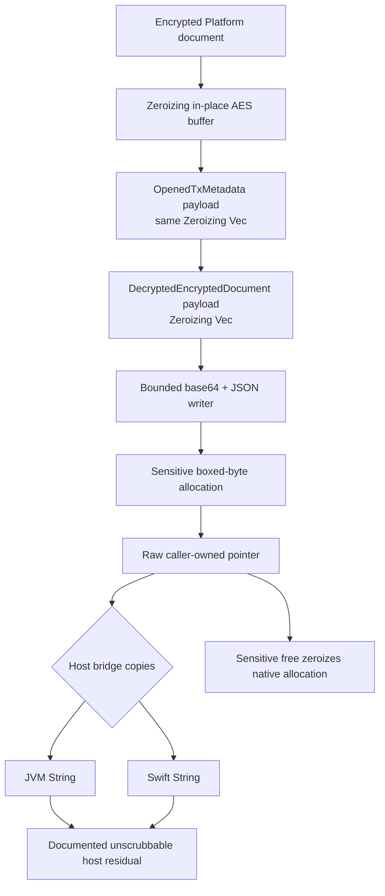

# txMetadata decrypt-path plaintext lifetime

**Status:** IMPLEMENTED — REVIEWED
**Date:** 2026-07-23
**Work unit:** iOS/Kotlin parity U7
**Baseline:** PR #4194 head `9efc0b7e3a`, including PR #4195 head `4f2eb06d64`
**Scope:** `rs-platform-encryption`, `rs-platform-wallet`, `rs-platform-wallet-ffi`, `rs-unified-sdk-jni`, Kotlin SDK fetch documentation, and the incoming Swift fetch wrapper

## Problem

The txMetadata create direction is already scrubbed after PR #4186. The decrypt direction is not.

`platform_encryption::decrypt_aes_256_cbc` first decrypts in place into a plain `Vec<u8>`, clones the unpadded plaintext into a second plain `Vec<u8>`, and drops the first allocation without zeroizing it. `open_tx_metadata` stores the clone in `OpenedTxMetadata.payload`, and `IdentityWallet::fetch_encrypted_documents` moves it into `DecryptedEncryptedDocument.payload`; both fields are also plain `Vec<u8>`. The FFI then base64-encodes each payload into a `serde_json::Value`, serializes the array into a plain `String`, converts that into a `CString`, and returns the raw pointer. `platform_wallet_string_free` deallocates that `CString` without zeroizing it. JNI additionally copies the C string into a Rust `String` before creating the JVM `String`. Swift copies the same C string into a Swift `String`.

Consequently, decrypted financial metadata can remain in reclaimed native heap allocations after the fetch returns. Removing every residual is impossible without changing the public host return type: JVM and Swift `String` storage and runtime-created copies cannot be reliably overwritten by the SDK. U7 must close the controlled Rust/C allocations and document that host-runtime ceiling without claiming complete process-memory erasure.

## Requirements

1. The in-place AES decrypt buffer and every later SDK-owned plaintext allocation must zeroize on every normal, recoverable-error, and unwinding drop path.
2. Base64 and JSON construction must not create plain, later-unscrubbed native allocations containing the payload.
3. The returned C allocation must have an explicit ownership contract that zeroizes its complete backing allocation before deallocation.
4. Kotlin/JNI and Swift must consume the same FFI result and free it through the same sensitive ownership contract; public fetch signatures and JSON shape remain unchanged.
5. Kotlin and Swift public documentation must state the same limitation: the returned host `String` is plaintext-equivalent, cannot be reliably scrubbed, and must be parsed promptly and never logged or persisted unnecessarily.
6. The create direction, PR #4195 encryption-key-index allocation, wire format, query behavior, skip-on-decrypt-failure behavior, JNI descriptor, and Swift/Kotlin public signatures remain unchanged.

## Chosen design

Keep the existing JSON/base64 and host `String` API, but make the complete native decrypt-to-host-copy path sensitive by construction.

### Zeroizing decryption and plaintext owners

- Add an ABI-additive `decrypt_aes_256_cbc_zeroizing` primitive in `rs-platform-encryption`. It wraps the ciphertext copy in `Zeroizing<Vec<u8>>` before decrypting in place, obtains the unpadded length, truncates the same allocation, and returns it without copying. Invalid padding and unwinding therefore drop a guard that may contain partially decrypted bytes.
- Keep the existing `decrypt_aes_256_cbc -> Result<Vec<u8>, _>` interface for unrelated callers by having it copy from the zeroizing primitive. That preserves its source API and existing plaintext-lifetime contract while also scrubbing its in-place working allocation. txMetadata alone calls the new zeroizing primitive and avoids that final plain copy.
- Change `OpenedTxMetadata.payload` to `Zeroizing<Vec<u8>>`. It receives the zeroizing AES allocation directly.
- Change `DecryptedEncryptedDocument.payload` to `Zeroizing<Vec<u8>>`. Moving from the opened result remains allocation-preserving; cloning the document produces another zeroizing owner.
- Keep the handwritten redacted `Debug` implementations. Do not derive or log payload content.

### Sensitive JSON construction

Replace the `Vec<serde_json::Value> -> String -> CString` chain in `platform_wallet_fetch_encrypted_documents` with one focused sensitive serializer:

- A checked counting pass computes the exact JSON byte length plus the final NUL. Payload contribution uses `base64::encoded_len`; it does not encode or copy plaintext. Identifier and integer sizing uses fixed stack storage or allocation-free length helpers.
- Before sensitive writing starts, allocate an exact-length boxed byte slice filled with a non-NUL ASCII sentinel plus a final NUL and wrap it in a private `SensitiveCString` owner. The owner exposes the non-terminator region as an ordinary mutable slice; it does not cast a read-only `CString::as_ptr` into writable memory. Its `Drop` zeroizes the complete owned slice including the terminator before deallocation.
- A bounded writer borrows that fixed allocation exclusively and cannot grow it. It writes JSON directly into the allocation and uses `base64::Engine::encode_slice` to encode each payload directly into its final output range. There is no payload-bearing base64 scratch, Serde `Value`, JSON `String`, or growable sensitive buffer.
- The writer rejects overflow or underfill, then validates the complete buffer for ASCII, interior NUL, and its final terminator. On any error, `SensitiveCString` remains armed and wipes the partially written allocation.
- After exact completion is validated, the boxed slice is converted to an exact-capacity `Vec` and then a `CString`; both conversions retain the allocation. `SensitiveCString::into_raw` disarms its guard and transfers that same allocation to the caller. All potentially reallocating construction occurred while the allocation held only non-sensitive sentinel bytes.
- Preserve the existing object field order as an output-compatibility precaution, as well as the exact field names, null handling, base58 identifiers, standard padded base64, array order, and successful empty result `"[]"`. JSON object order is not promoted to a new public contract.

This deliberately bounded writer makes a wrong size estimate fail closed instead of silently reallocating and stranding plaintext.

### Sensitive C-string ownership

Add an ABI-additive `platform_wallet_sensitive_string_free(*mut c_char)` export:

- Null is a no-op.
- A non-null pointer must have been returned by a function whose documentation names this free contract.
- The function reconstructs the original `CString`, converts it with `into_bytes_with_nul`, zeroizes the resulting allocation including the terminator, and then deallocates it.
- Callers treat the returned allocation as read-only and pass the original pointer without altering any byte or moving, adding, or removing the terminator; `CString::from_raw` requires its original length.
- `platform_wallet_fetch_encrypted_documents` documents that its output contains decrypted, plaintext-equivalent data and must be released with this function.
- `platform_wallet_string_free` remains the ordinary non-sensitive contract. Existing secret-bearing FFI precedent stays unchanged, including `platform_wallet_address_private_key_free`, which already uses a dedicated zeroizing release path.

The fetch export signature itself does not change, so there is no C layout change and no JNI descriptor or Swift method-signature change. cbindgen adds only the new free symbol to the generated platform-wallet header. An old binary that calls `platform_wallet_string_free` remains memory-safe because the allocation is still a `CString`, but it does not receive U7's final-allocation zeroization guarantee.

### Host copies and the documented ceiling

JNI installs a nullable sensitive-pointer RAII guard immediately after the FFI call, before result/null/JNI error handling. Because the serializer enforces ASCII with no interior NUL, JNI passes the existing C buffer directly to raw `NewStringUTF` rather than using `JNIEnv::new_string`, whose `JNIString` conversion would create another unsanitized native allocation. The guard invokes `platform_wallet_sensitive_string_free` after the JVM copy or on any early return/unwind. The returned Java/Kotlin `String` remains runtime-managed and unscrubbable.

Swift installs its nullable-pointer `defer` immediately after the FFI call, before `result.check()`, and uses `platform_wallet_sensitive_string_free`. It keeps its current `String(cString:)` copy. The returned Swift `String` remains runtime-managed and may share or copy storage.

Both Kotlin public entry points (`DocumentTransactions.kt` and `TransactionsNative.kt`) and the Swift `ManagedPlatformWallet.fetchEncryptedDocuments` wrapper use equivalent wording:

> SDK-owned Rust/C decrypted payload and JSON buffers are zeroized before deallocation. The returned host `String` is plaintext-equivalent; its runtime-managed storage, copies, and parsed-object copies cannot be reliably overwritten by the SDK. Parse it promptly, do not log it, and do not retain or persist it longer than required.

This is an honest boundary, not a guarantee that all plaintext has disappeared from the process.

## Interface and data flow

| Interface | Before U7 | After U7 |
| --- | --- | --- |
| `decrypt_aes_256_cbc_zeroizing` | Absent | Additive primitive returning `Zeroizing<Vec<u8>>` |
| `OpenedTxMetadata.payload` | `Vec<u8>` | `Zeroizing<Vec<u8>>` |
| `DecryptedEncryptedDocument.payload` | `Vec<u8>` | `Zeroizing<Vec<u8>>` |
| `platform_wallet_fetch_encrypted_documents` | JSON `CString`; ordinary free | Same ABI/JSON; sensitive-free contract |
| C release API | `platform_wallet_string_free` | New `platform_wallet_sensitive_string_free` for this result |
| JNI/Kotlin fetch | `String`; plain Rust copy before JVM copy | Same descriptor/return type; direct guarded JVM copy |
| Swift fetch | `async throws -> String`; ordinary free | Same signature; sensitive free |

The two public Rust payload-field type changes are source incompatible for code that constructs, destructures, or moves those fields as `Vec<u8>`. Workspace call sites must be updated explicitly. No C/JNI/Swift/Kotlin signature changes.

## Alternatives rejected

### Structured binary out-buffer

A C array of document structs with `(payload_ptr, payload_len)` fields and a zeroizing array free would avoid base64 in the shared FFI. It is the stronger foundation for a future typed host API returning `ByteArray`/`Data`.

It is rejected for U7 because the public Kotlin and incoming Swift wrappers return the existing JSON `String`. Preserving that API would move JSON/base64 construction into JNI and Swift, duplicating sensitive serialization and ownership logic across hosts. Changing both public APIs to typed results would be a larger source/API redesign with C layout pins, generated-header changes, Kotlin models, Swift models, and new caller migration. That work should be considered separately if eliminating the terminal host `String` becomes a requirement.

### Zeroize every `platform_wallet_string_free`

Changing the general free function would require fewer symbols and would make old callers scrub this final allocation automatically. The serializer is what removes the earlier base64/JSON intermediates under either free design.

It is rejected because it changes the cost and behavior of every ordinary platform-wallet string release and obscures which outputs carry a sensitive ownership obligation. The dedicated export follows the repository's private-key precedent and limits the behavioral blast radius, at the cost of one additive symbol, two host release-call changes, and a documented free-function mismatch risk.

### Wrap only the final payload or final JSON string

Wrapping only `DecryptedEncryptedDocument.payload`, or only the final JSON `String`, leaves earlier decrypt owners, base64 strings, `serde_json::Value` strings, and reallocations unsanitized. It does not close the reported lifetime path and is rejected.

## Failure modes and handling

| Failure | Required behavior |
| --- | --- |
| Key derivation, AES padding validation, or decryption fails for one document | Preserve the current skip-and-warn behavior; the in-place AES buffer and every later temporary key/plaintext owner drop and zeroize. |
| Length arithmetic, bounded writing, or output validation fails | Return an error with `*out_documents_json` still null; zeroize every payload and the partial CString allocation on drop. |
| Fetch succeeds with no documents | Return `"[]"` through the sensitive contract; both hosts still call the sensitive free. |
| JNI UTF/JVM allocation fails or a panic occurs after receiving the pointer | RAII guard zeroizes and releases the C allocation before returning null or unwinding into the outer JNI guard. |
| Swift conversion or later validation throws | `defer` zeroizes and releases the C allocation. |
| New caller uses the ordinary string free | It remains memory-safe but violates the sensitive ownership contract and skips final-allocation zeroization; updated Kotlin/JNI and Swift wrappers must never do this for fetch output. |
| Future serializer change introduces reallocation or a plain base64/JSON tree | Focused regression tests must fail; code review must treat this as a plaintext-lifetime regression. |
| Host caller retains/logs the returned `String` | Native guarantees no longer apply; public docs prohibit logging and unnecessary retention but cannot enforce erasure. |
| Allocator abort or `panic=abort` terminates the process | No cleanup promise is made because Rust destructors do not run. The guarantee covers normal returns, recoverable errors, and unwinding paths where drops execute. |

## Verification plan

Implementation follows a failing-then-passing sequence.

1. Before production changes, add a compile-red decrypt-lifetime regression test. A typed assertion helper accepts only `&Zeroizing<Vec<u8>>`; pass it the new sensitive AES result, `OpenedTxMetadata.payload`, and `DecryptedEncryptedDocument.payload` built from the existing concrete txMetadata plaintext vector. On the baseline, the test target must fail to compile because the sensitive AES primitive is absent and both fields are `Vec<u8>`. Record those compiler errors, then run the unchanged test after the fix and require it to compile and pass. This intentionally tests the storage-type security invariant rather than using brittle runtime type-name strings.
2. Add `rs-platform-encryption` unit coverage for successful sensitive decrypt without a plaintext clone and invalid-padding/error handling while the in-place buffer is guard-owned. Keep the existing ordinary decrypt API tests passing.
3. Add focused FFI tests for the private bounded writer, `SensitiveCString`, and release seam:
   - one document preserves the current emitted bytes, every field, and exact padded base64 payload;
   - multiple and empty results preserve field/array order and `"[]"`;
   - the final output is ASCII, contains no interior NUL, and exactly consumes the fixed output region;
   - undersized capacity is rejected without growth, and a deliberately failing writer leaves the FFI out-pointer null;
   - the shared wipe primitive overwrites a still-live byte slice, including a NUL terminator, before deallocation; tests never inspect freed memory;
   - null release is a no-op;
   - error/unwind ownership is exercised at the safe internal owner seam.
4. Run the original compile-red decrypt-lifetime test unchanged and record its red-to-green transition.
5. Run targeted and crate-level Rust tests for `platform-encryption`, `platform-wallet`, `platform-wallet-ffi`, and `rs-unified-sdk-jni`, plus formatting and clippy for the changed crates.
6. Regenerate the cbindgen header and verify the fetch signature is unchanged and the only new relevant ABI surface is `platform_wallet_sensitive_string_free`.
7. Add JNI coverage or a focused seam test proving the guard uses sensitive free on success and JNI failure, and that the direct `NewStringUTF` input satisfies the ASCII/no-interior-NUL precondition.
8. Run Kotlin SDK JVM tests under JDK 17 and build the Android native library so the unchanged JNI descriptor/symbol path is exercised.
9. Rebuild the iOS framework from this branch before Swift validation, then run Swift package tests/build. The prebuilt framework at PR #4194 head predates PR #4195's auto-index symbol and is not a valid link artifact for this verification.
10. Run `git diff --check` and inspect the final diff to confirm no create-path, allocator-policy, query, wire-format, or unrelated host cleanup entered U7.

Memory inspection after deallocation is undefined behavior, so tests prove the security contract at safe seams: zeroizing owner types, in-place overwrite before release, guarded ownership on every exit, unchanged serialized output, and generated ABI use.

## Coordination with PRs #4194 and #4195

- PR #4195 remains the owner of Rust-side `encryptionKeyIndex` allocation and create-path size-before-allocation behavior. U7 does not edit those decisions or their host documentation.
- PR #4194 remains the owner of the incoming Swift create/fetch wrappers. U7 changes only the fetch result's release call and lifetime documentation in that wrapper.
- Both PRs are open as of 2026-07-23, and this branch already contains both current heads. Immediately before implementation, refetch and compare their final heads or merge commits with this baseline. Sync only any new upstream delta; do not replay #4195 or duplicate its create/allocator changes. Preserve #4194's final host behavior, then apply only U7's fetch-path lifetime deltas.
- No commit, push, or PR creation is part of this work unless Ivan asks.

## Review record

Three independent reviews were completed before implementation:

- the required Swift/Rust FFI reviewer checked ownership transfer, generated-header/XCFramework impact, JNI copying, and Swift cleanup;
- a security/failure-mode reviewer traced plaintext back through AES error paths and challenged allocation, NUL, unwinding, and release guarantees;
- a simplicity/TDD reviewer checked source compatibility, the dedicated-versus-global free trade-off, executable red-to-green seams, host documentation placement, and #4194/#4195 overlap.

Their must-fixes are incorporated above: the AES working allocation is now in scope, the sensitive CString uses the repository-compatible byte-vector wipe, the writer is fixed-size and fail-closed, Rust source incompatibilities and old-binary behavior are explicit, host guards are installed before result handling, and the verification plan names concrete compile-red and safe pre-deallocation seams.

## Expected implementation surface

| Area | Planned change |
| --- | --- |
| `rs-platform-encryption` | Add the zeroizing AES decrypt primitive, dependency, export, and success/error tests. |
| `rs-platform-wallet` | Use the sensitive primitive for txMetadata and change the two payload owners. |
| `rs-platform-wallet-ffi` | Add the bounded sensitive serializer/owner, dedicated free, docs, and focused tests. |
| `rs-unified-sdk-jni` | Add the immediate pointer guard and direct `NewStringUTF`; remove the native Rust JSON copy. |
| Kotlin SDK | Add matching limitation KDoc at both public entry points; no behavior/signature change. |
| Swift SDK/generated header | Use the immediate sensitive defer, add matching docs, regenerate/rebuild the header/framework. |

## Sources

- Existing zeroizing C-string precedent: `packages/rs-platform-wallet-ffi/src/address_private_key.rs`
- Earliest in-place decrypt buffer: `packages/rs-platform-encryption/src/aes.rs`
- Current decrypt owners: `packages/rs-platform-wallet/src/wallet/identity/crypto/tx_metadata.rs` and `packages/rs-platform-wallet/src/wallet/identity/network/encrypted_document.rs`
- Current FFI serialization/free contracts: `packages/rs-platform-wallet-ffi/src/document.rs` and `packages/rs-platform-wallet-ffi/src/types.rs`
- Current host bridges: `packages/rs-unified-sdk-jni/src/transactions.rs`, `packages/kotlin-sdk/sdk/src/main/kotlin/org/dashfoundation/dashsdk/documents/DocumentTransactions.kt`, and `packages/swift-sdk/Sources/SwiftDashSDK/PlatformWallet/ManagedPlatformWallet.swift`
- [`zeroize::Zeroizing`](https://docs.rs/zeroize/1.8.2/zeroize/struct.Zeroizing.html) and [`Zeroize` for allocated buffers](https://docs.rs/zeroize/1.8.2/zeroize/trait.Zeroize.html)
- [Rust `CString` ownership and raw-pointer contract](https://doc.rust-lang.org/std/ffi/struct.CString.html)
- [JNI `NewStringUTF`](https://docs.oracle.com/en/java/javase/26/docs/specs/jni/functions.html#newstringutf)
- [Java `String` values are unchanging](https://docs.oracle.com/javase/specs/jls/se25/html/jls-4.html#jls-4.3.3)
- [Swift `String(cString:)` copies the C bytes](https://developer.apple.com/documentation/swift/string/init(cstring:encoding:))
- [Swift strings are value types with runtime copy optimizations](https://docs.swift.org/swift-book/documentation/the-swift-programming-language/stringsandcharacters/#Strings-Are-Value-Types)
