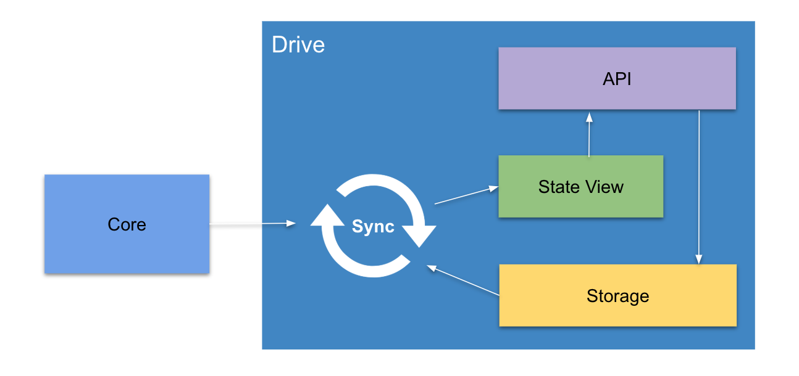

# Drive

[](https://travis-ci.com/dashevo/drive)

> Decentralized application storage on the Dash network

Drive is the storage component of Dash Platform, allowing developers to store and secure their application data through Dash's masternode network. Application data structures are defined by a data contract, which is stored on Drive and used to verify/validate updates to your application data. An application's current state is stored in the State View, which is a MongoDB instance hosted on a masternode. Historical application data is stored in IPFS and propagated to other nodes, thereby, ensuring data redundancy.



## Table of Contents
- [Install](#install)
- [Usage](#usage)
- [Configuration](#configuration)
- [Drive API](#drive-api)
- [Tests](#tests)
- [Maintainer](#maintainer)
- [Contributing](#contributing)
- [License](#license)

## Install

1. [Install Node.JS 8.10.0 and higher](https://nodejs.org/en/download/)
2. [Install Docker](https://docs.docker.com/install/)
3. [Install Docker compose](https://docs.docker.com/compose/install/)
4. Copy `.env.example` to `.env` file
5. Install npm dependencies: `npm install`

## Usage

### Start development environment

```bash
docker-compose up -d
```

### Start sync process

```bash
npm run sync
```

### Start API process

```bash
npm run api
```

## Configuration

Drive uses environment variables for configuration.
Variables are read from `.env` file and can be overwritten by variables
defined in env or directly passed to the process.

See all available settings in [.env.example](.env.example).

## Drive API

Drive provides [JSON-RPC 2.0](https://www.jsonrpc.org/specification) API for interaction with data.

### RPC methods

#### addSTPacket

Add State Transition Packet to Drive storage

##### Params

| name            | type   | description                   |
|-----------------|--------|-------------------------------|
| stateTransition | string | serialized State Transition   |
| stPacket        | string | serialized ST Packet object   |

##### Response

| name    | type   | description                                  |
|---------|--------|----------------------------------------------|
| result  | string | ST Packet [CID](https://github.com/ipld/cid) |

#### removeSTPacket

Remove State Transition Packet from Drive storage

##### Params

| name       | type   | description                                  |
|------------|--------|----------------------------------------------|
| packetHash | string | ST Packet hash previously submitted to Drive |

#### fetchContact

Fetch Contract from Drive State View

##### Params

| name    | type   | description  |
|---------|--------|--------------|
| contractId   | string | Contract ID       |

##### Response

| name    | type   | description         |
|---------|--------|---------------------|
| result  | object | DP Contact object  |

#### fetchDocuments

Fetch Documents from Drive State View

##### Params

| name    | type   | description          |
|---------|--------|----------------------|
| contractId   | string | DP ID               |
| type    | string | Documents type     |
| options | object | Options              |

Fetch method options:

| name       | type   | description                                                                             |
|------------|--------|-----------------------------------------------------------------------------------------|
| where      | object | [MongoDB query](https://docs.mongodb.com/manual/reference/operator/query/)              |
| orderBy    | object | [MongoDB sort](https://docs.mongodb.com/manual/reference/method/cursor.sort/)           |
| limit      | number | [MongoDB limit](https://docs.mongodb.com/manual/reference/method/cursor.limit/)         |
| startAt    | number | [MongoDB skip](https://docs.mongodb.com/manual/reference/method/cursor.skip/)           |
| startAfter | number | Exclusive [MongoDB skip](https://docs.mongodb.com/manual/reference/method/cursor.skip/) |

##### Response

| name    | type   | description  |
|---------|--------|--------------|
| result  | array  | Documents  |

#### getSyncInfo

Get Sync information

##### Params

None

##### Response

| name    | type   | description     |
|---------|--------|-----------------|
| result  | object | SyncInfo object |

### Errors

| code | message                   | meaning                                                                  |
|------|---------------------------|--------------------------------------------------------------------------|
| 100  | Initial sync in progress  | Drive responds with error until initial sync process is not complete |

Standard errors listed in [JSON-RPC specification](https://www.jsonrpc.org/specification).

## Tests

[Read](test/) about tests in `test/` folder.

## Maintainer

[@shumkov](https://github.com/shumkov)

## Contributing

Feel free to dive in! [Open an issue](https://github.com/dashevo/drive/issues/new) or submit PRs.

## License

[MIT](LICENSE) &copy; Dash Core Group, Inc.
