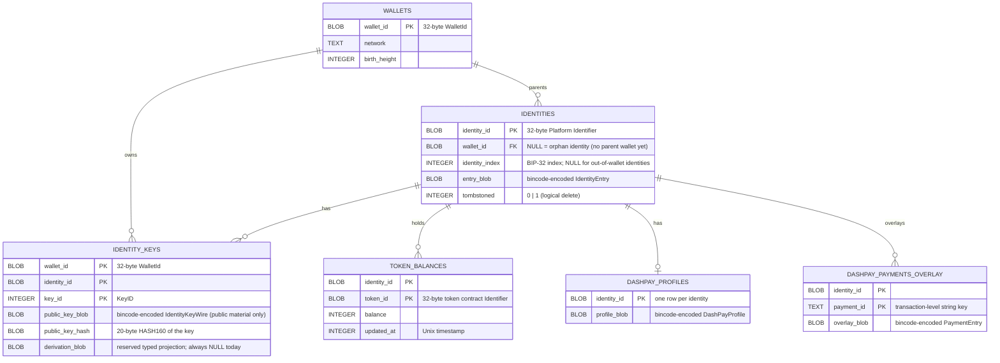
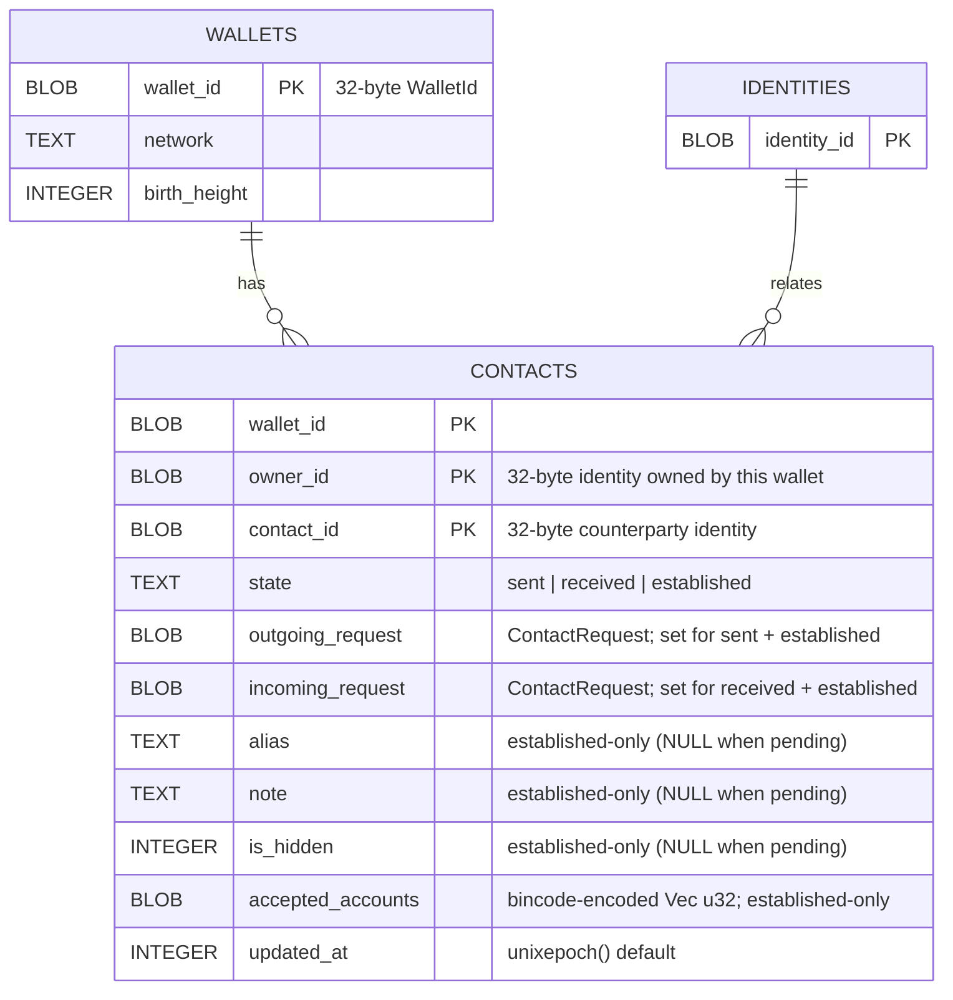
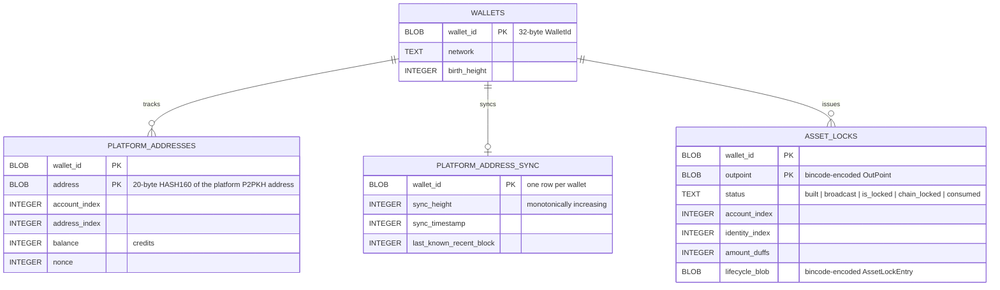
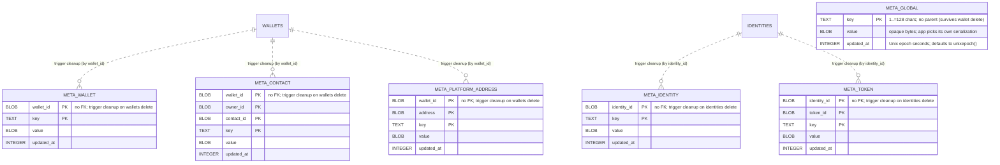

# SQLite schema — `platform-wallet-storage`

## Why this schema exists

A wallet's **public** state has to survive a restart. This schema is the
on-disk shape of that state: one SQLite file holding many wallets, every
per-wallet row anchored to a `wallet_id`, so a client can reload its UTXOs,
identities, contacts, balances, and sync watermarks without re-scanning the
chain.

## What it stores — and the boundary

The persister stores **public** wallet-state material (UTXOs, transactions,
account registrations, identities, identity public keys, contacts, asset
locks, token balances, DashPay overlays, and platform-address sync
snapshots) in a SQLite database managed by
[refinery](https://crates.io/crates/refinery) migrations.

**No secrets are stored here.** Mnemonics, seeds, and raw private keys never
appear in any column of any table — that is a deliberate boundary, not an
accident of the current row set. The secret-bearing backends live elsewhere;
see [SECRETS.md](./SECRETS.md).

## How integrity is kept

Schema evolution is version-gated by refinery. Every read-write connection turns on `PRAGMA foreign_keys = ON` at open time (`src/sqlite/conn.rs`), so every `ON DELETE CASCADE` clause is active. Deleting a `wallets` row cleans that wallet's metadata along two paths:

- **`wallet_id`-scoped meta** (`meta_wallet`, `meta_contact`, `meta_platform_address`) carries a `wallet_id` column, so `cascade_meta_on_wallet_delete` brooms it directly — regardless of the lifecycle state of any typed parent and even for rows written ahead of (or without) a typed parent.
- **identity-scoped meta** (`meta_identity`, `meta_token`) carries no `wallet_id` — only `identity_id` (+ `token_id`). It is cleaned by `cascade_meta_on_identity_delete` (AFTER DELETE ON `identities`), which fires for the wallet's own identities when the FK cascade removes them on a wallet delete.

### Orphan metadata and future garbage collection

Any `meta_*` row whose parent object does not exist — because it was never created, or because it was removed via a path the cascade does not cover — may persist indefinitely. This is an accepted limitation that applies to all metadata types and scopes. Examples:

- `meta_identity` / `meta_token` rows written for an `identity_id` that is never synced into `identities`: the cascade fires on `AFTER DELETE ON identities`, so if no `identities` row ever existed the trigger never fires and the metadata remains.
- Any `meta_*` row whose parent object is removed by a mechanism outside the trigger paths (e.g. direct SQL, a future schema path, or a partial-migration edge case).

A future garbage-collection pass is expected to reap orphan metadata — rows with no live parent object older than approximately one week — but no such GC is implemented yet. Callers should not rely on orphan metadata persisting forever, nor assume it will be cleaned up promptly. `meta_global` is intentionally parentless and always survives.

The tables are split into five domain diagrams below. `WALLETS` is the root anchor and appears in each diagram. Diagrams and the [Tables](#tables) section below cover the current `core_utxos` shape and the V001 tables; `core_address_pool`, `meta_data_versions`, and `meta_store_generation` (V003), plus `invitations` (V004) and the V005–V006 pool columns, are not yet documented here — see the [Migrations](#migrations) log for what they add in the meantime.

## Diagram 1 — Core / L1 (Bitcoin/Dash layer)

Account registrations, transactions, UTXOs, instant locks, and SPV sync state.

```mermaid
erDiagram
    WALLETS ||--o{ ACCOUNT_REGISTRATIONS : "registers"
    WALLETS ||--o{ CORE_TRANSACTIONS : "records"
    WALLETS ||--o{ CORE_UTXOS : "owns"
    WALLETS ||--o{ CORE_INSTANT_LOCKS : "holds"
    WALLETS ||--o| CORE_SYNC_STATE : "tracks"

    WALLETS {
        BLOB wallet_id PK "32-byte WalletId"
        TEXT network "mainnet | testnet | devnet | regtest"
        INTEGER birth_height "SPV scan start height"
    }

    ACCOUNT_REGISTRATIONS {
        BLOB wallet_id PK
        TEXT account_type PK "standard_bip44 | ... | provider_operator | provider_platform"
        INTEGER account_index PK
        INTEGER key_class PK "discriminator; sentinel 0 unless PlatformPayment"
        BLOB user_identity_id PK "discriminator; sentinel zeroblob(32) unless DashPay"
        BLOB friend_identity_id PK "discriminator; sentinel zeroblob(32) unless DashPay"
        BLOB account_xpub_bytes "bincode: AccountRegistrationEntry, or ProviderKeyAccountEntry for provider_* types"
    }

    CORE_TRANSACTIONS {
        BLOB wallet_id PK
        BLOB txid PK "32-byte Txid"
        INTEGER height "NULL if unconfirmed"
        BLOB block_hash "NULL if unconfirmed"
        INTEGER block_time "NULL if unconfirmed"
        INTEGER finalized "0 | 1"
        BLOB record_blob "bincode-encoded TransactionRecord"
    }

    CORE_UTXOS {
        BLOB wallet_id PK
        BLOB outpoint PK "bincode-encoded OutPoint"
        INTEGER value "satoshis"
        BLOB script "scriptPubKey bytes"
        INTEGER height "NULL if unconfirmed"
        INTEGER spent "0 | 1"
    }

    CORE_INSTANT_LOCKS {
        BLOB wallet_id PK
        BLOB txid PK
        BLOB islock_blob "bincode-encoded InstantLock"
    }

    CORE_SYNC_STATE {
        BLOB wallet_id PK "one row per wallet"
        INTEGER last_processed_height "NULL until first block processed"
        INTEGER synced_height "NULL until first sync"
    }
```

## Diagram 2 — Identities + DashPay (Platform L2 identity tree)

Platform identities, their public keys, token balances, and DashPay profiles/payments. Most identity-owned tables have no direct `wallet_id` column and cascade via `wallets → identities → child`; `identity_keys` is the exception — it carries its own `wallet_id` column and two `ON DELETE CASCADE` FKs (one to `wallets`, one to `identities`).

## Diagram 3 — Contacts (DashPay social graph)

One unified table for all three states of a DashPay contact relationship — the `state` column (`sent` / `received` / `established`) records the lifecycle stage. It roots on `wallet_id`; `IDENTITIES` is repeated here as a minimal placeholder to show that the `owner_id` / `contact_id` columns are Platform identity identifiers (32-byte blobs), not FK-enforced columns.

> Note: `owner_id` and `contact_id` are Platform identity identifiers stored as BLOBs; they
> are NOT declared `FOREIGN KEY` columns. The relationship to `IDENTITIES` shown above is
> logical — enforced at the application layer, not by SQLite constraints. A pending row is
> `sent` XOR `received` and carries only the matching request blob; an `established` row sets
> both request blobs plus the four metadata columns.

## Diagram 4 — Platform addresses + Asset locks (Platform L2 funding)

Platform P2PKH address pool with its sync watermark, and the asset-lock lifecycle table.

## Diagram 5 — Per-object metadata (KV)

Per-object-type key/value metadata for arbitrary application-managed
data (aliases, flags, notes, sync hints, ordering — anything the host
app wants to stash alongside a wallet object). One dedicated `meta_*`
table per [`ObjectId`](./src/kv.rs) variant. `meta_global` has no parent
and survives wallet deletion. The other five carry **no foreign key**:
metadata may be written before its parent object is synced into its
typed table. `AFTER DELETE` triggers provide a soft cascade so metadata
never outlives its wallet. Deleting a `wallets` row brooms every
wallet-scoped `meta_*` row by `wallet_id` directly, and the FK cascade
through `identities` brooms the identity-scoped `meta_*` rows by
`identity_id`; both legs key on the id alone, so cleanup is independent
of whether the typed parent ever existed and of any contact's lifecycle
state. Direct deletes of a single `token_balances`, `contacts`, or
`platform_addresses` row also drop the matching metadata. The dashed
edges below denote trigger-based cleanup, not an FK relationship.

> Note: every `meta_*` table's uniqueness comes straight from its
> composite `PRIMARY KEY` (id column(s) + `key`) — no partial indexes
> and no nullable scope column. The five typed tables carry no FK. On a
> wallet delete the wallet-rooted `AFTER DELETE` trigger brooms the
> wallet-scoped tables (`meta_wallet`, `meta_contact`,
> `meta_platform_address`) by `wallet_id`, and the FK cascade through
> `identities` fires the per-identity trigger that brooms `meta_identity`
> + `meta_token` by `identity_id` — so cleanup reaches every `meta_*`
> row keyed to the wallet even when no typed parent was ever written.

## Tables

### `wallets`

Root anchor for every per-wallet table. Deleting a row cascades to all
direct children; identity-owned children cascade through `identities`.

- `wallet_id` — 32-byte `WalletId` blob; PRIMARY KEY.
- `network` — `"mainnet"` | `"testnet"` | `"devnet"` | `"regtest"`.
- `birth_height` — SPV scan start height; `0` when unknown.

### `account_registrations`

One row per account registered on a wallet (xpub + account type + index).
The `account_xpub_bytes` blob carries the full `AccountRegistrationEntry`
for secp256k1 accounts, or a `ProviderKeyAccountEntry` for the two
provider key-material account types (`'provider_operator'` BLS,
`'provider_platform'` EdDSA — index-less, always `account_index = 0`); the
typed `account_type` / `account_index` columns mirror the common fields for
SQL lookups without blob decoding.

- PK: `(wallet_id, account_type, account_index, key_class, user_identity_id,
  friend_identity_id)` — the last three columns discriminate accounts that
  otherwise share `(account_type, account_index)`: PlatformPayment's
  `key_class` axis, and the DashPay `(user_identity_id, friend_identity_id)`
  pair. Sentinel `0` / `zeroblob(32)` default for account types without
  that axis (including the provider key-material types).
- FK: `wallet_id → wallets(wallet_id) ON DELETE CASCADE`.

### `pending_contact_crypto`

Deferred, signer-dependent contact cryptography operations. The owner,
contact, and operation kind form the deduplication key; `payload` carries the
public-only ciphertext and key-index data needed when a signer becomes
available.

- PK: `(wallet_id, owner_identity_id, contact_id, kind)`.
- FK: `wallet_id → wallets(wallet_id) ON DELETE CASCADE`.
- `kind` CHECK: sourced from
  `sqlite::schema::pending_contact_crypto::KIND_LABELS`.

### `core_transactions`

One row per transaction the wallet has seen. `height`, `block_hash`, and
`block_time` are NULL while the transaction is unconfirmed. `finalized`
is `1` once block context is present.

- PK: `(wallet_id, txid)`.
- FK: `wallet_id → wallets(wallet_id) ON DELETE CASCADE`.
- Index: `idx_core_transactions_height(wallet_id, height)`.

### `core_utxos`

One row per UTXO, spent or unspent. Owning-account identity is derived from
`core_address_pool` while loading wallet state.

- PK: `(wallet_id, outpoint)`.
- FK: `wallet_id → wallets(wallet_id) ON DELETE CASCADE`.
- Index: `idx_core_utxos_spent(wallet_id, spent)`.

### `core_instant_locks`

Instant-lock blobs for transactions that are broadcast but not yet
finalized. Rows are removed when the transaction becomes confirmed.

- PK: `(wallet_id, txid)`.
- FK: `wallet_id → wallets(wallet_id) ON DELETE CASCADE`.

### `core_sync_state`

One row per wallet, holding monotonically-advancing SPV sync watermarks and
the last applied ChainLock. `last_processed_height` and `synced_height` are
NULL until the first block is processed. `last_applied_chain_lock` is NULL
until a ChainLock has been applied and flushed.

- PK: `wallet_id` (single-row-per-wallet).
- FK: `wallet_id → wallets(wallet_id) ON DELETE CASCADE`.
- `last_applied_chain_lock BLOB` — bincode-encoded
  `dashcore::ephemerealdata::chain_lock::ChainLock`; used during rehydration
  to restore `WalletMetadata::last_applied_chain_lock` so asset-lock proof
  generation can use the cached ChainLock from before a restart.

### `identities`

Platform identities, wallet-parented or orphan. `wallet_id` is nullable:
NULL means the identity was written before a parent wallet was registered
(orphan-to-parented promotion via COALESCE on upsert). `tombstoned = 1`
marks a logical delete; the row is retained for cascade integrity.

- PK: `identity_id`.
- FK: `wallet_id → wallets(wallet_id) ON DELETE CASCADE` (nullable).
- Index: `idx_identities_wallet(wallet_id)`.

### `identity_keys`

Public identity keys only — no private material. The
`public_key_blob` is a custom wire format (`IdentityKeyWire`) that
pre-encodes the `IdentityPublicKey` via bincode 2 native `Encode/Decode`
to work around a serde-tag incompatibility. `derivation_blob` is a
reserved column for a future typed projection and is always NULL today
(derivation indices live inside `public_key_blob`).

- PK: `(wallet_id, identity_id, key_id)`.
- FK: `wallet_id → wallets(wallet_id) ON DELETE CASCADE`.
- FK: `identity_id → identities(identity_id) ON DELETE CASCADE`.
- Index: `idx_identity_keys_wallet_identity(wallet_id, identity_id)`.

### `contacts`

All DashPay contact relationships in one table, keyed by lifecycle
`state`. `owner_id` is always the wallet's identity; `contact_id` is the
counterparty. A pending relationship is `sent` (we sent the request) XOR
`received` (we received it) and carries only the matching request blob; an
`established` relationship carries both `outgoing_request` and
`incoming_request` plus the four metadata columns (`alias`, `note`,
`is_hidden`, `accepted_accounts`, NULL while pending). The request columns
hold a bincode-encoded `ContactRequest`; `accepted_accounts` holds a
bincode-encoded `Vec<u32>`.

- PK: `(wallet_id, owner_id, contact_id)`.
- FK: `wallet_id → wallets(wallet_id) ON DELETE CASCADE`.
- `state` CHECK: sourced from `sqlite::schema::contacts::CONTACT_STATE_LABELS`.

### `ignored_senders`

Reversible per-sender DashPay mute records. Each row suppresses all incoming
contact requests from `sender_id` for one owner identity until the row is
deleted; `ignored_at` records when the mute was applied.

- PK: `(wallet_id, owner_id, sender_id)`.
- FK: `wallet_id → wallets(wallet_id) ON DELETE CASCADE`.
- No enum-domain CHECK column.

### `platform_addresses`

Platform P2PKH address pool entries. `address` stores the 20-byte
HASH160; `balance` and `nonce` are the last-synced values from the
Platform layer.

- PK: `(wallet_id, address)`.
- FK: `wallet_id → wallets(wallet_id) ON DELETE CASCADE`.

### `platform_address_sync`

Per-wallet watermark for platform address sync. All three height/timestamp
fields advance monotonically (new values are `max(current, incoming)`).

- PK: `wallet_id` (single-row-per-wallet).
- FK: `wallet_id → wallets(wallet_id) ON DELETE CASCADE`.

### `asset_locks`

Lifecycle tracking for asset-lock outpoints. `status` is a queryable
text column; `lifecycle_blob` carries the full `AssetLockEntry`. Consumed
locks are **retained permanently** with `status = 'consumed'` (an upsert,
never a `DELETE` — they are not routed through `AssetLockChangeSet::removed`),
so the full lifecycle history stays on disk and remains visible via the
unfiltered inspection reader (`schema::asset_locks::list_active`). The
rehydration feed reads through `schema::asset_locks::load_unconsumed`, which
filters at the SQL level (`status NOT IN ('consumed')`), so a spent one-shot
lock is never resurrected as actionable.

- PK: `(wallet_id, outpoint)`.
- FK: `wallet_id → wallets(wallet_id) ON DELETE CASCADE`.

### `token_balances`

Per-identity token balance cache, keyed by `(identity_id, token_id)`.
Cascade flows `wallets → identities → token_balances` through the
nullable `identities.wallet_id` link; no direct `wallet_id` column exists.

- PK: `(identity_id, token_id)`.
- FK: `identity_id → identities(identity_id) ON DELETE CASCADE`.

### `dashpay_profiles`

At most one DashPay profile blob per identity. `None` profile maps to a
DELETE rather than a NULL blob — the row is absent, not nulled.

- PK: `identity_id` (single-row-per-identity).
- FK: `identity_id → identities(identity_id) ON DELETE CASCADE`.

### `dashpay_payments_overlay`

Payment overlay entries for DashPay, keyed by transaction-level
`payment_id` string. Cascade flows through `identities` as with
`token_balances`.

- PK: `(identity_id, payment_id)`.
- FK: `identity_id → identities(identity_id) ON DELETE CASCADE`.

### Per-object metadata (`meta_*`)

Six dedicated key/value tables for app-managed metadata, one per
[`ObjectId`](./src/kv.rs) variant. Values are opaque BLOBs — the host app
picks its own serialization (bincode, JSON, protobuf, raw bytes). Shared
across all six: `key` is `TEXT` with `CHECK (length(key) BETWEEN 1 AND
128)`; `value` is `BLOB NOT NULL`; `updated_at` defaults to `unixepoch()`
and is refreshed on every `INSERT … ON CONFLICT DO UPDATE`. Uniqueness
comes from each table's composite `PRIMARY KEY` (id column(s) + `key`).
Public API lives in [`src/kv.rs`](./src/kv.rs); the SQLite implementation
is in [`src/sqlite/kv.rs`](./src/sqlite/kv.rs).

Unlike every other per-wallet table, the five typed `meta_*` tables carry
**no foreign key**: a write succeeds before its parent object exists, so
host apps can attach metadata independently of sync ordering (and a
global-config persister can write to typed scopes whose parent tables
stay empty). Cleanup is instead a soft cascade. Deleting a
`wallets` row fires a wallet-rooted `AFTER DELETE` trigger that
brooms the wallet-scoped tables (`meta_wallet`, `meta_contact`,
`meta_platform_address`) by `wallet_id` — unconditionally, regardless of
whether the typed parent row was ever written or any contact's lifecycle
state. The identity-scoped tables (`meta_identity`, `meta_token`) are
broomed by a *different* leg: the `wallets → identities` FK cascade deletes
each linked `identities` row, and a per-identity `AFTER DELETE` trigger then
brooms by `identity_id`. That leg fires only for identities the wallet
actually owns, so it cleans `meta_token` even when no `token_balances` row
ever existed — but identity-scoped metadata for an identity whose
`identities` row was never written (or is not linked to this wallet)
survives the delete as an orphan (see the orphan-metadata limitation above).
Additional triggers handle direct deletes of a single `token_balances`,
`contacts`, or `platform_addresses` row.

#### `meta_global`

Global metadata with no parent — survives every wallet delete.

- PK: `key`.
- No foreign key, no trigger.

#### `meta_wallet`

Per-wallet metadata. Writable before the wallet exists.

- PK: `(wallet_id, key)`.
- No FK. Cleanup: `cascade_meta_on_wallet_delete` (AFTER DELETE ON `wallets`, by `wallet_id`).

#### `meta_identity`

Per-identity metadata. Writable before the identity exists.

- PK: `(identity_id, key)`.
- No FK, no `wallet_id` column. Cleanup: `cascade_meta_on_identity_delete` (AFTER DELETE ON `identities`, by `identity_id`). Reached on a wallet delete only via the wallet's own `identities` rows; meta for an `identity_id` never synced into `identities` is not wallet-reachable and may persist as an orphan (see [Orphan metadata and future garbage collection](#orphan-metadata-and-future-garbage-collection)).

#### `meta_token`

Per-token-balance metadata. Writable before the token balance exists.

- PK: `(identity_id, token_id, key)`.
- No FK, no `wallet_id` column. Cleanup: `cascade_meta_on_identity_delete` (AFTER DELETE ON `identities`, by `identity_id`) on a wallet/identity delete, plus `cascade_meta_token_on_token_balance_delete` (AFTER DELETE ON `token_balances`) for a direct balance delete. As with `meta_identity`, meta for an `identity_id` never synced into `identities` is not wallet-reachable and may persist as an orphan (see [Orphan metadata and future garbage collection](#orphan-metadata-and-future-garbage-collection)).

#### `meta_contact`

Per-contact metadata for any lifecycle state. Writable before the contact exists.

- PK: `(wallet_id, owner_id, contact_id, key)`.
- No FK. Cleanup: `cascade_meta_on_wallet_delete` (AFTER DELETE ON `wallets`, by `wallet_id`) on a wallet delete, plus `cascade_meta_contact_on_contact_delete` (AFTER DELETE ON `contacts`, any state) for a direct contact delete.

#### `meta_platform_address`

Per-platform-address metadata. `address` is an opaque `BLOB`. Writable
before the address exists.

- PK: `(wallet_id, address, key)`.
- No FK. Cleanup: `cascade_meta_on_wallet_delete` (AFTER DELETE ON `wallets`, by `wallet_id`) on a wallet delete, plus `cascade_meta_platform_address_on_address_delete` (AFTER DELETE ON `platform_addresses`) for a direct address delete.

## Enum-domain CHECK constraints

Five TEXT columns carry a `CHECK (col IN (...))` across five enum
domains. The IN-list is built at migration time from
`pub(crate) const *_LABELS` arrays declared next to each writer function.
Four domains mirror a Rust enum; the fifth (`contacts.state`)
is a synthetic lifecycle label naming which `ContactChangeSet` slot a row
came from:

| Table | Column | Source-of-truth const |
|---|---|---|
| `wallets` | `network` | `sqlite::schema::wallets::NETWORK_LABELS` |
| `account_registrations` | `account_type` | `sqlite::schema::accounts::ACCOUNT_TYPE_LABELS` |
| `pending_contact_crypto` | `kind` | `sqlite::schema::pending_contact_crypto::KIND_LABELS` |
| `asset_locks` | `status` | `sqlite::schema::asset_locks::ASSET_LOCK_STATUS_LABELS` |
| `contacts` | `state` | `sqlite::schema::contacts::CONTACT_STATE_LABELS` |

The const arrays are the single source of truth shared by the writer
mapping functions (`network_to_str`, `account_type_db_label`,
`kind_db_label`, `status_str`, `contact_state_db_label`) and the migration's CHECK
clauses.
Per-module `*_labels_match_enum` unit tests enforce set-equality
between each const and the writer's codomain — drift (a renamed/added
upstream variant) fails the test rather than landing as silent garbage
in the database. The label inventories are intentionally not duplicated
in this document; the source files are canonical.

### Upstream-enum coupling

Two persisted enums live in the external `rust-dashcore` crate
(`key_wallet::Network`, `key_wallet::account::AccountType`). The other two
(`platform_wallet::wallet::asset_lock::tracked::AssetLockStatus` and
`platform_wallet::changeset::PendingContactCryptoKind`) live in-tree;
`AssetLockStatus` also carries a `# Schema coupling` rustdoc block.

Because the upstream definitions cannot be edited from this repository,
the coupling is enforced from the local side instead, by three
mechanisms working together:

1. **Writer rustdoc** in each `sqlite::schema::*` module names the
   upstream enum path so an IDE jump-to-definition lands at it.
2. **Exhaustive `match` arms** in the parity-test variant lists
   (`all_*_variants` functions) cause an upstream-added variant to
   fail compilation here, forcing a writer + LABELS update.
3. **`*_labels_match_enum` unit tests** assert set-equality between
   each `*_LABELS` array and the writer's codomain.

TODO(rust-dashcore): once the upstream `key_wallet` crate is vendored
or the project gains push access there, mirror the in-tree
`AssetLockStatus` `# Schema coupling` doc block on the two upstream
enums so a developer editing them upstream sees the constraint without
having to grep this repo.

## Foreign-key conventions

- All direct-child `wallet_id` columns are `BLOB(32)` references to
  `wallets.wallet_id` with `ON DELETE CASCADE`.
- `identities.wallet_id` is the single nullable FK: NULL means orphan
  (no parent wallet registered yet). The orphan-to-parented promotion
  uses `COALESCE(identities.wallet_id, excluded.wallet_id)` on upsert.
- Identity-owned tables (`token_balances`, `dashpay_profiles`,
  `dashpay_payments_overlay`) have no `wallet_id` column. Cascade reaches
  them via `identities(identity_id)`.
- `identity_keys` is the exception among identity-owned tables: it carries
  a `wallet_id BLOB NOT NULL` column and two `ON DELETE CASCADE` FKs
  (`wallet_id → wallets`, `identity_id → identities`), so a delete on
  either parent cascades to it.
- The five typed `meta_*` tables carry **no FK** (writes may precede the parent);
  cleanup is an `AFTER DELETE` soft cascade. A wallet delete fires a wallet-rooted
  trigger that brooms the wallet-scoped `meta_*` tables by `wallet_id`, and the
  FK cascade through `identities` fires a per-identity trigger that brooms the
  identity-scoped ones by `identity_id` — so it cleans transitively and
  parentless rows included.
- `PRAGMA foreign_keys = ON` is set and verified on every read-write connection open.

## Triggers

| Trigger | Fires | Action |
|---|---|---|
| `cascade_meta_on_wallet_delete` | AFTER DELETE ON `wallets` | delete `meta_wallet`, `meta_contact`, `meta_platform_address` rows by `wallet_id` |
| `cascade_meta_on_identity_delete` | AFTER DELETE ON `identities` | delete `meta_identity`, `meta_token` rows by `identity_id` |
| `cascade_meta_token_on_token_balance_delete` | AFTER DELETE ON `token_balances` | delete matching `meta_token` rows (direct balance delete) |
| `cascade_meta_contact_on_contact_delete` | AFTER DELETE ON `contacts` | delete matching `meta_contact` rows (any state; direct contact delete) |
| `cascade_meta_platform_address_on_address_delete` | AFTER DELETE ON `platform_addresses` | delete matching `meta_platform_address` rows (direct address delete) |

## Migrations

| Version | File | Description |
|---|---|---|
| V001 | `V001__initial.rs` | Full base schema: all 23 tables (including the six `meta_*` per-object metadata tables), every index, and the original trigger set. |
| V002 | `V002__address_height_pin.rs` | Adds `platform_addresses.as_of_height` (the Platform-block-height pin reconciling proof-attested balances against the delta stream; `DEFAULT 0` = unknown provenance for pre-existing rows). Additive column, no new table. |
| V003 | `V003__unified.rs` | Adds `core_address_pool` (per-index address-pool rows replacing `core_utxos` script-derivation for the address-reuse guard), `meta_data_versions` (per-`(wallet_id, domain)` cache-invalidation `seq`), and `meta_store_generation` (single-row store-generation token). Additive only. |
| V004 | `V004__invitations.rs` | Adds `invitations` for DIP-13 DashPay invitation lifecycle records, keyed by wallet and outpoint. |
| V005 | `V005__pool_public_key.rs` | Adds nullable `public_key` and `key_type` columns to `core_address_pool`, preserving typed pre-derived public keys that a watch-only account cannot regenerate (closes #4113). |
| V006 | `V006__pool_reserved_at.rs` | Adds nullable `core_address_pool.reserved_at` to persist `AddressState::Reserved` timestamps while available and used rows remain unreserved. |
| V007 | `V007__drop_core_utxo_metadata.rs` | Removes unused `core_utxos.account_index` and `core_utxos.spent_in_txid` metadata and the associated cleanup trigger; owning-account identity is resolved from `core_address_pool` during reads. |
