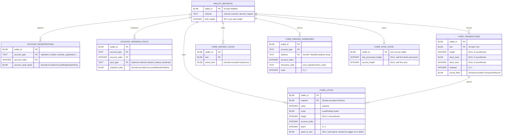
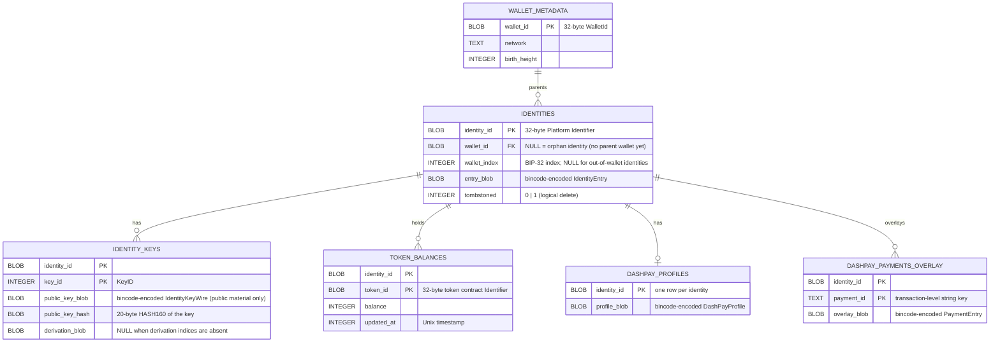
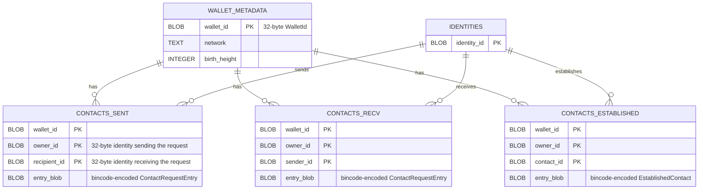

# SQLite schema — `platform-wallet-storage`

The persister stores **public** wallet-state material (UTXOs, transactions, account registrations, address pools, identities, identity public keys, contacts, asset locks, token balances, DashPay overlays, and platform-address sync snapshots) in a SQLite database managed by [refinery](https://crates.io/crates/refinery) migrations. **No secrets are stored here** — see [SECRETS.md](./SECRETS.md) for the secret-bearing backends.

Schema evolution is version-gated by refinery. All connections turn on `PRAGMA foreign_keys = ON` at open time (`src/sqlite/conn.rs`), so every `ON DELETE CASCADE` clause is active.

The 19 tables are split into four domain diagrams below. `WALLET_METADATA` is the root anchor and appears in each diagram. For full column listings see the [Tables](#tables) section.

## Diagram 1 — Core / L1 (Bitcoin/Dash layer)

Account registrations, address-pool snapshots, transactions, UTXOs, instant locks, derived addresses, and SPV sync state.

> Note: the `CORE_TRANSACTIONS → CORE_UTXOS` edge shown above is enforced by the
> `setnull_core_utxos_on_tx_delete` SQLite trigger, not a declared `FOREIGN KEY`.
> A native `ON DELETE SET NULL` composite FK would also null the NOT NULL `wallet_id`
> column — the trigger nulls only `spent_in_txid`, preserving the intended semantics.

## Diagram 2 — Identities + DashPay (Platform L2 identity tree)

Platform identities, their public keys, token balances, and DashPay profiles/payments. Identity-owned tables have no direct `wallet_id` column; cascade flows `wallet_metadata → identities → child`.

## Diagram 3 — Contacts (DashPay social graph)

Three tables for the three states of a DashPay contact relationship. All three root on `wallet_id`; `IDENTITIES` is repeated here as a minimal placeholder to show that the contact `owner_id` / `sender_id` / `recipient_id` columns are Platform identity identifiers (32-byte blobs), not FK-enforced columns.

> Note: `owner_id`, `recipient_id`, `sender_id`, and `contact_id` are Platform identity
> identifiers stored as BLOBs; they are NOT declared `FOREIGN KEY` columns. The
> relationships to `IDENTITIES` shown above are logical — enforced at the application layer,
> not by SQLite constraints.

## Diagram 4 — Platform addresses + Asset locks (Platform L2 funding)

Platform P2PKH address pool with its sync watermark, and the asset-lock lifecycle table.

## Tables

### `wallet_metadata`

Root anchor for every per-wallet table. Deleting a row cascades to all
direct children; identity-owned children cascade through `identities`.

- `wallet_id` — 32-byte `WalletId` blob; PRIMARY KEY.
- `network` — `"mainnet"` | `"testnet"` | `"devnet"` | `"regtest"`.
- `birth_height` — SPV scan start height; `0` when unknown.

### `account_registrations`

One row per account registered on a wallet (xpub + account type + index).
The `account_xpub_bytes` blob carries the full `AccountRegistrationEntry`;
the typed `account_type` / `account_index` columns mirror it for SQL
lookups without blob decoding.

- PK: `(wallet_id, account_type, account_index)`.
- FK: `wallet_id → wallet_metadata(wallet_id) ON DELETE CASCADE`.

### `account_address_pools`

Address-pool snapshot per `(wallet, account, pool_type)`. `pool_type` is
one of `external`, `internal`, `absent`, `absent_hardened`.

- PK: `(wallet_id, account_type, account_index, pool_type)`.
- FK: `wallet_id → wallet_metadata(wallet_id) ON DELETE CASCADE`.

### `core_transactions`

One row per transaction the wallet has seen. `height`, `block_hash`, and
`block_time` are NULL while the transaction is unconfirmed. `finalized`
is `1` once block context is present.

- PK: `(wallet_id, txid)`.
- FK: `wallet_id → wallet_metadata(wallet_id) ON DELETE CASCADE`.
- Index: `idx_core_transactions_height(wallet_id, height)`.

### `core_utxos`

One row per UTXO, spent or unspent. `spent_in_txid` is set to NULL
by a trigger when its referenced `core_transactions` row is deleted
(instead of a native `ON DELETE SET NULL`, which would also null the
NOT NULL `wallet_id` column).

- PK: `(wallet_id, outpoint)`.
- FK: `wallet_id → wallet_metadata(wallet_id) ON DELETE CASCADE`.
- Index: `idx_core_utxos_spent(wallet_id, spent)`.

### `core_instant_locks`

Instant-lock blobs for transactions that are broadcast but not yet
finalized. Rows are removed when the transaction becomes confirmed.

- PK: `(wallet_id, txid)`.
- FK: `wallet_id → wallet_metadata(wallet_id) ON DELETE CASCADE`.

### `core_derived_addresses`

Address-to-account-index map. Written before UTXOs in the same
transaction so the UTXO writer can resolve `account_index` by address.

- PK: `(wallet_id, account_type, address)`.
- FK: `wallet_id → wallet_metadata(wallet_id) ON DELETE CASCADE`.
- Index: `idx_core_derived_addresses_addr(wallet_id, address)`.

### `core_sync_state`

One row per wallet, holding monotonically-advancing SPV sync watermarks.
`last_processed_height` and `synced_height` are NULL until the first
block is processed.

- PK: `wallet_id` (single-row-per-wallet).
- FK: `wallet_id → wallet_metadata(wallet_id) ON DELETE CASCADE`.

### `identities`

Platform identities, wallet-parented or orphan. `wallet_id` is nullable:
NULL means the identity was written before a parent wallet was registered
(orphan-to-parented promotion via COALESCE on upsert). `tombstoned = 1`
marks a logical delete; the row is retained for cascade integrity.

- PK: `identity_id`.
- FK: `wallet_id → wallet_metadata(wallet_id) ON DELETE CASCADE` (nullable).
- Index: `idx_identities_wallet(wallet_id)`.

### `identity_keys`

Public identity keys only — no private material (NFR-10). The
`public_key_blob` is a custom wire format (`IdentityKeyWire`) that
pre-encodes the `IdentityPublicKey` via bincode 2 native `Encode/Decode`
to work around a serde-tag incompatibility.

- PK: `(identity_id, key_id)`.
- FK: `identity_id → identities(identity_id) ON DELETE CASCADE`.
- Index: `idx_identity_keys_identity(identity_id)`.

### `contacts_sent`

Outgoing DashPay contact requests. Owner is the wallet's identity; recipient
is the contacted party.

- PK: `(wallet_id, owner_id, recipient_id)`.
- FK: `wallet_id → wallet_metadata(wallet_id) ON DELETE CASCADE`.

### `contacts_recv`

Incoming DashPay contact requests awaiting acceptance.

- PK: `(wallet_id, owner_id, sender_id)`.
- FK: `wallet_id → wallet_metadata(wallet_id) ON DELETE CASCADE`.

### `contacts_established`

Fully established DashPay contact relationships.

- PK: `(wallet_id, owner_id, contact_id)`.
- FK: `wallet_id → wallet_metadata(wallet_id) ON DELETE CASCADE`.

### `platform_addresses`

Platform P2PKH address pool entries. `address` stores the 20-byte
HASH160; `balance` and `nonce` are the last-synced values from the
Platform layer.

- PK: `(wallet_id, address)`.
- FK: `wallet_id → wallet_metadata(wallet_id) ON DELETE CASCADE`.

### `platform_address_sync`

Per-wallet watermark for platform address sync. All three height/timestamp
fields advance monotonically (new values are `max(current, incoming)`).

- PK: `wallet_id` (single-row-per-wallet).
- FK: `wallet_id → wallet_metadata(wallet_id) ON DELETE CASCADE`.

### `asset_locks`

Lifecycle tracking for asset-lock outpoints. `status` is a queryable
text column; `lifecycle_blob` carries the full `AssetLockEntry`. Consumed
locks are removed via `AssetLockChangeSet::removed`, not retained with a
consumed status.

- PK: `(wallet_id, outpoint)`.
- FK: `wallet_id → wallet_metadata(wallet_id) ON DELETE CASCADE`.

### `token_balances`

Per-identity token balance cache, keyed by `(identity_id, token_id)`.
Cascade flows `wallet_metadata → identities → token_balances` through the
nullable `identities.wallet_id` link; no direct `wallet_id` column exists.

- PK: `(identity_id, token_id)`.
- FK: `identity_id → identities(identity_id) ON DELETE CASCADE`.

### `dashpay_profiles`

At most one DashPay profile blob per identity. `None` profile maps to a
DELETE rather than a NULL blob — the row is absent, not nulled.

- PK: `identity_id` (single-row-per-identity).
- FK: `identity_id → identities(identity_id) ON DELETE CASCADE`.

### `dashpay_payments_overlay`

Payment overlay entries for DashPay, keyed by transaction-level
`payment_id` string. Cascade flows through `identities` as with
`token_balances`.

- PK: `(identity_id, payment_id)`.
- FK: `identity_id → identities(identity_id) ON DELETE CASCADE`.

## Foreign-key conventions

- All direct-child `wallet_id` columns are `BLOB(32)` references to
  `wallet_metadata.wallet_id` with `ON DELETE CASCADE`.
- `identities.wallet_id` is the single nullable FK: NULL means orphan
  (no parent wallet registered yet). The orphan-to-parented promotion
  uses `COALESCE(identities.wallet_id, excluded.wallet_id)` on upsert.
- Identity-owned tables (`identity_keys`, `token_balances`,
  `dashpay_profiles`, `dashpay_payments_overlay`) have no `wallet_id`
  column. Cascade reaches them via `identities(identity_id)`.
- `core_utxos.spent_in_txid` is cleared by the `setnull_core_utxos_on_tx_delete`
  trigger rather than a native `ON DELETE SET NULL` FK, because SQLite would null
  every column of a composite FK on SET NULL — including the NOT NULL `wallet_id`.
- `PRAGMA foreign_keys = ON` is set and verified on every connection open.

## Migrations

| Version | File | Description |
|---|---|---|
| V001 | `V001__initial.rs` | Full schema: all 19 tables, indexes, and the `setnull_core_utxos_on_tx_delete` trigger |
