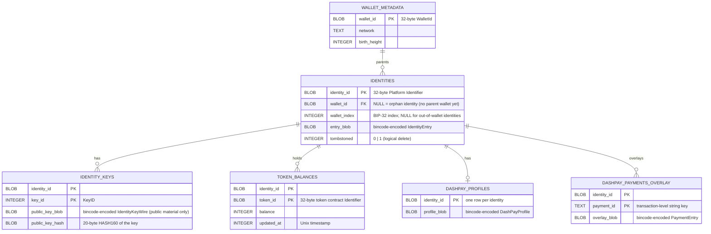
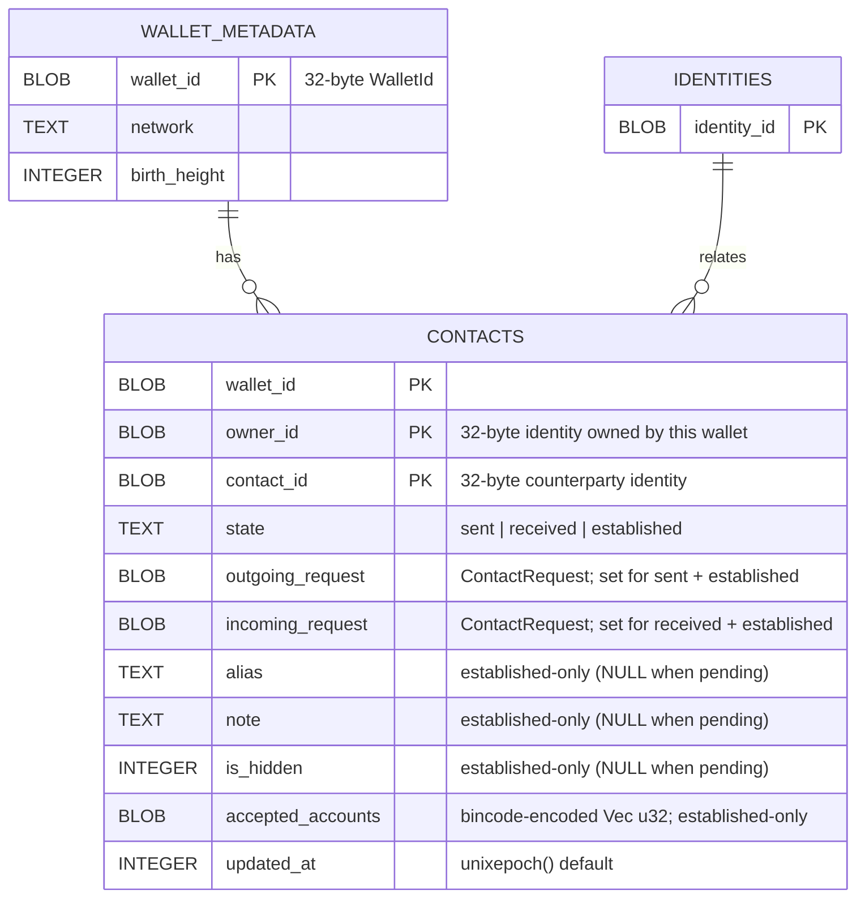

# SQLite schema — `platform-wallet-storage`

## Why this schema exists

A wallet's **public** state has to survive a restart. This schema is the
on-disk shape of that state: one SQLite file holding many wallets, every
per-wallet row anchored to a `wallet_id`, so a client can reload its UTXOs,
identities, contacts, balances, and sync watermarks without re-scanning the
chain.

## What it stores — and the boundary

The persister stores **public** wallet-state material (UTXOs, transactions,
account registrations, address pools, identities, identity public keys,
contacts, asset locks, token balances, DashPay overlays, and
platform-address sync snapshots) in a SQLite database managed by
[refinery](https://crates.io/crates/refinery) migrations.

**No secrets are stored here.** Mnemonics, seeds, and raw private keys never
appear in any column of any table — that is a deliberate boundary, not an
accident of the current row set. The secret-bearing backends live elsewhere;
see [SECRETS.md](./SECRETS.md).

## How integrity is kept

Schema evolution is version-gated by refinery. Every read-write connection turns on `PRAGMA foreign_keys = ON` at open time (`src/sqlite/conn.rs`), so every `ON DELETE CASCADE` clause is active. Deleting a `wallet_metadata` row cleans that wallet's metadata along two paths:

- **`wallet_id`-scoped meta** (`meta_wallet`, `meta_contact`, `meta_platform_address`) carries a `wallet_id` column, so `cascade_meta_on_wallet_delete` brooms it directly — regardless of the lifecycle state of any typed parent and even for rows written ahead of (or without) a typed parent.
- **identity-scoped meta** (`meta_identity`, `meta_token`) carries no `wallet_id` — only `identity_id` (+ `token_id`). It is cleaned by `cascade_meta_on_identity_delete` (AFTER DELETE ON `identities`), which fires for the wallet's own identities when the FK cascade removes them on a wallet delete.

### Orphan metadata and future garbage collection

Any `meta_*` row whose parent object does not exist — because it was never created, or because it was removed via a path the cascade does not cover — may persist indefinitely. This is an accepted limitation that applies to all metadata types and scopes. Examples:

- `meta_identity` / `meta_token` rows written for an `identity_id` that is never synced into `identities`: the cascade fires on `AFTER DELETE ON identities`, so if no `identities` row ever existed the trigger never fires and the metadata remains.
- Any `meta_*` row whose parent object is removed by a mechanism outside the trigger paths (e.g. direct SQL, a future schema path, or a partial-migration edge case).

A future garbage-collection pass is expected to reap orphan metadata — rows with no live parent object older than approximately one week — but no such GC is implemented yet. Callers should not rely on orphan metadata persisting forever, nor assume it will be cleaned up promptly. `meta_global` is intentionally parentless and always survives.

The 23 tables are split into five domain diagrams below. `WALLET_METADATA` is the root anchor and appears in each diagram. For full column listings see the [Tables](#tables) section.

## Diagram 1 — Core / L1 (Bitcoin/Dash layer)

Account registrations, address-pool snapshots, transactions, UTXOs, instant locks, derived addresses, and SPV sync state.

```mermaid
erDiagram
    WALLET_METADATA ||--o{ ACCOUNT_REGISTRATIONS : "registers"
    WALLET_METADATA ||--o{ ACCOUNT_ADDRESS_POOLS : "snapshots"
    WALLET_METADATA ||--o{ CORE_TRANSACTIONS : "records"
    WALLET_METADATA ||--o{ CORE_UTXOS : "owns"
    WALLET_METADATA ||--o{ CORE_INSTANT_LOCKS : "holds"
    WALLET_METADATA ||--o{ CORE_DERIVED_ADDRESSES : "derives"
    WALLET_METADATA ||--o| CORE_SYNC_STATE : "tracks"
    CORE_TRANSACTIONS ||--o{ CORE_UTXOS : "spends"

    WALLET_METADATA {
        BLOB wallet_id PK "32-byte WalletId"
        TEXT network "mainnet | testnet | devnet | regtest"
        INTEGER birth_height "SPV scan start height"
    }

    ACCOUNT_REGISTRATIONS {
        BLOB wallet_id PK
        TEXT account_type PK "standard | coinjoin | identity_registration | ..."
        INTEGER account_index PK
        BLOB account_xpub_bytes "bincode-encoded AccountRegistrationEntry"
    }

    ACCOUNT_ADDRESS_POOLS {
        BLOB wallet_id PK
        TEXT account_type PK
        INTEGER account_index PK
        TEXT pool_type PK "external | internal | absent | absent_hardened"
        BLOB snapshot_blob "bincode-encoded AccountAddressPoolEntry"
    }

    CORE_TRANSACTIONS {
        BLOB wallet_id PK
        BLOB txid PK "32-byte Txid"
        INTEGER height "NULL if unconfirmed"
        BLOB block_hash "NULL if unconfirmed"
        INTEGER block_time "NULL if unconfirmed"
        INTEGER finalized "0 | 1"
        BLOB record_blob "bincode-encoded TransactionRecord"
    }

    CORE_UTXOS {
        BLOB wallet_id PK
        BLOB outpoint PK "bincode-encoded OutPoint"
        INTEGER value "satoshis"
        BLOB script "scriptPubKey bytes"
        INTEGER height "NULL if unconfirmed"
        INTEGER account_index
        INTEGER spent "0 | 1"
        BLOB spent_in_txid "set by apply_sweep for an unresolved held input; else NULL"
        INTEGER winner_mined_height "V007: sweep winner's mined height; NULL when unstamped or materialised"
    }

    CORE_INSTANT_LOCKS {
        BLOB wallet_id PK
        BLOB txid PK
        BLOB islock_blob "bincode-encoded InstantLock"
    }

    CORE_DERIVED_ADDRESSES {
        BLOB wallet_id PK
        TEXT account_type PK
        TEXT address PK "bech32 / Base58 address string"
        INTEGER account_index
        TEXT derivation_path "pool_type/derivation_index"
        INTEGER used "0 | 1"
    }

    CORE_SYNC_STATE {
        BLOB wallet_id PK "one row per wallet"
        INTEGER last_processed_height "NULL until first block processed"
        INTEGER synced_height "NULL until first sync"
        INTEGER chainlock_height "V007: monotonic-max applied chainlock height; NULL until one is applied"
    }
```

> Note: the `CORE_TRANSACTIONS → CORE_UTXOS` edge shown above is enforced by the
> `setnull_core_utxos_on_tx_delete` SQLite trigger, not a declared `FOREIGN KEY`.
> A native `ON DELETE SET NULL` composite FK would also null the NOT NULL `wallet_id`
> column — the trigger nulls only `spent_in_txid`, preserving the intended semantics.

## Diagram 2 — Identities + DashPay (Platform L2 identity tree)

Platform identities, their public keys, token balances, and DashPay profiles/payments. Identity-owned tables have no direct `wallet_id` column; cascade flows `wallet_metadata → identities → child`.

## Diagram 3 — Contacts (DashPay social graph)

One unified table for all three states of a DashPay contact relationship — the `state` column (`sent` / `received` / `established`) records the lifecycle stage. It roots on `wallet_id`; `IDENTITIES` is repeated here as a minimal placeholder to show that the `owner_id` / `contact_id` columns are Platform identity identifiers (32-byte blobs), not FK-enforced columns.

> Note: `owner_id` and `contact_id` are Platform identity identifiers stored as BLOBs; they
> are NOT declared `FOREIGN KEY` columns. The relationship to `IDENTITIES` shown above is
> logical — enforced at the application layer, not by SQLite constraints. A pending row is
> `sent` XOR `received` and carries only the matching request blob; an `established` row sets
> both request blobs plus the four metadata columns.

## Diagram 4 — Platform addresses + Asset locks (Platform L2 funding)

Platform P2PKH address pool with its sync watermark, and the asset-lock lifecycle table.

## Diagram 5 — Per-object metadata (KV)

Per-object-type key/value metadata for arbitrary application-managed
data (aliases, flags, notes, sync hints, ordering — anything the host
app wants to stash alongside a wallet object). One dedicated `meta_*`
table per [`ObjectId`](./src/kv.rs) variant. `meta_global` has no parent
and survives wallet deletion. The other five carry **no foreign key**:
metadata may be written before its parent object is synced into its
typed table. `AFTER DELETE` triggers provide a soft cascade so metadata
never outlives its wallet. Deleting a `wallet_metadata` row brooms every
wallet-scoped `meta_*` row by `wallet_id` directly, and the FK cascade
through `identities` brooms the identity-scoped `meta_*` rows by
`identity_id`; both legs key on the id alone, so cleanup is independent
of whether the typed parent ever existed and of any contact's lifecycle
state. Direct deletes of a single `token_balances`, `contacts`, or
`platform_addresses` row also drop the matching metadata. The dashed
edges below denote trigger-based cleanup, not an FK relationship.

```mermaid
erDiagram
    WALLET_METADATA ||..o{ META_WALLET : "trigger cleanup (by wallet_id)"
    WALLET_METADATA ||..o{ META_CONTACT : "trigger cleanup (by wallet_id)"
    WALLET_METADATA ||..o{ META_PLATFORM_ADDRESS : "trigger cleanup (by wallet_id)"
    IDENTITIES ||..o{ META_IDENTITY : "trigger cleanup (by identity_id)"
    IDENTITIES ||..o{ META_TOKEN : "trigger cleanup (by identity_id)"

    META_GLOBAL {
        TEXT key PK "1..=128 chars; no parent (survives wallet delete)"
        BLOB value "opaque bytes; app picks its own serialization"
        INTEGER updated_at "Unix epoch seconds; defaults to unixepoch()"
    }

    META_WALLET {
        BLOB wallet_id PK "no FK; trigger cleanup on wallet_metadata delete"
        TEXT key PK
        BLOB value
        INTEGER updated_at
    }

    META_IDENTITY {
        BLOB identity_id PK "no FK; trigger cleanup on identities delete"
        TEXT key PK
        BLOB value
        INTEGER updated_at
    }

    META_TOKEN {
        BLOB identity_id PK "no FK; trigger cleanup on identities delete"
        BLOB token_id PK
        TEXT key PK
        BLOB value
        INTEGER updated_at
    }

    META_CONTACT {
        BLOB wallet_id PK "no FK; trigger cleanup on wallet_metadata delete"
        BLOB owner_id PK
        BLOB contact_id PK
        TEXT key PK
        BLOB value
        INTEGER updated_at
    }

    META_PLATFORM_ADDRESS {
        BLOB wallet_id PK "no FK; trigger cleanup on wallet_metadata delete"
        BLOB address PK
        TEXT key PK
        BLOB value
        INTEGER updated_at
    }
```

> Note: every `meta_*` table's uniqueness comes straight from its
> composite `PRIMARY KEY` (id column(s) + `key`) — no partial indexes
> and no nullable scope column. The five typed tables carry no FK. On a
> wallet delete the wallet-rooted `AFTER DELETE` trigger brooms the
> wallet-scoped tables (`meta_wallet`, `meta_contact`,
> `meta_platform_address`) by `wallet_id`, and the FK cascade through
> `identities` fires the per-identity trigger that brooms `meta_identity`
> + `meta_token` by `identity_id` — so cleanup reaches every `meta_*`
> row keyed to the wallet even when no typed parent was ever written.

## Tables

### `wallet_metadata`

Root anchor for every per-wallet table. Deleting a row cascades to all
direct children; identity-owned children cascade through `identities`.

- `wallet_id` — 32-byte `WalletId` blob; PRIMARY KEY.
- `network` — `"mainnet"` | `"testnet"` | `"devnet"` | `"regtest"`.
- `birth_height` — SPV scan start height; `0` when unknown.

### `account_registrations`

One row per account registered on a wallet (xpub + account type + index).
The `account_xpub_bytes` blob carries the full `AccountRegistrationEntry`;
the typed `account_type` / `account_index` columns mirror it for SQL
lookups without blob decoding.

- PK: `(wallet_id, account_type, account_index)`.
- FK: `wallet_id → wallet_metadata(wallet_id) ON DELETE CASCADE`.

### `account_address_pools`

Address-pool snapshot per `(wallet, account, pool_type)`. `pool_type` is
one of `external`, `internal`, `absent`, `absent_hardened`.

- PK: `(wallet_id, account_type, account_index, pool_type)`.
- FK: `wallet_id → wallet_metadata(wallet_id) ON DELETE CASCADE`.

### `core_transactions`

One row per transaction the wallet has seen. `height`, `block_hash`, and
`block_time` are NULL while the transaction is unconfirmed. `finalized`
is `1` once block context is present.

- PK: `(wallet_id, txid)`.
- FK: `wallet_id → wallet_metadata(wallet_id) ON DELETE CASCADE`.
- Index: `idx_core_transactions_height(wallet_id, height)`.

### `core_utxos`

One row per UTXO, spent or unspent. `spent_in_txid` is written only by
`apply_sweep`, naming the winner that took an input a swept loser claimed
but this store had no released record for. Its presence gates the funding
UTXO's own later upsert (`execute_upsert_utxo`): a coin held spent with a
`spent_in_txid` stays spent when the wallet redelivers it, unlike a coin
held spent with none (the ordinary "sweep couldn't resolve it" state, which
does clear on redelivery). It is set to NULL by a trigger when its
referenced `core_transactions` row is deleted (instead of a native
`ON DELETE SET NULL`, which would also null the NOT NULL `wallet_id`
column) — and by a later sweep that releases the same outpoint.

`winner_mined_height` (V007) stamps that claim with the mined height of the
winner named in `spent_in_txid`, and decides the placeholder's lifetime
rather than its existence. A block-context sweep stamps the winner's own
height and `collect_finalized_tombstones` evicts the row once
`min(chainlock_height, synced_height)` reaches it — upstream's
`prune_finalized_observed_spends` boundary verbatim. An InstantSend-locked
winner that is not yet mined leaves it NULL: the lock alone settles the
input, but it carries no height to key a lifetime on, so the row resolves
only through proof (the funding upsert materialising it, a later
block-context sweep re-stamping it, or a release). The funding upsert
clears the stamp, because a materialised row is the wallet's own coin held
spent and is permanently outside the collector's reach.

- PK: `(wallet_id, outpoint)`.
- FK: `wallet_id → wallet_metadata(wallet_id) ON DELETE CASCADE`.
- Index: `idx_core_utxos_spent(wallet_id, spent)`.
- Index: `idx_core_utxos_unmaterialized(wallet_id, winner_mined_height)
  WHERE height IS NULL` (V007) — covers exactly the unmaterialised rows, so
  the collector's per-round scan touches tombstones rather than the
  wallet's full spent history.

### `core_instant_locks`

Instant-lock blobs for transactions that are broadcast but not yet
finalized. Rows are removed when the transaction becomes confirmed.

- PK: `(wallet_id, txid)`.
- FK: `wallet_id → wallet_metadata(wallet_id) ON DELETE CASCADE`.

### `core_derived_addresses`

Address-to-account-index map. Written before UTXOs in the same
transaction so the UTXO writer can resolve `account_index` by address.

- PK: `(wallet_id, account_type, address)`.
- FK: `wallet_id → wallet_metadata(wallet_id) ON DELETE CASCADE`.
- Index: `idx_core_derived_addresses_addr(wallet_id, address)`.

### `core_sync_state`

One row per wallet, holding monotonically-advancing SPV sync watermarks.
`last_processed_height` and `synced_height` are NULL until the first
block is processed.

`chainlock_height` (V007) mirrors `CoreChangeSet::last_applied_chain_lock`
as a monotonic max — the height alone, which this store previously dropped.
It is one half of the finality boundary
`collect_finalized_tombstones` collects sweep tombstones against, so a
tombstone is never collected before a chainlock has been persisted,
matching upstream's "no-op until a chainlock has been applied".

- PK: `wallet_id` (single-row-per-wallet).
- FK: `wallet_id → wallet_metadata(wallet_id) ON DELETE CASCADE`.

### `identities`

Platform identities, wallet-parented or orphan. `wallet_id` is nullable:
NULL means the identity was written before a parent wallet was registered
(orphan-to-parented promotion via COALESCE on upsert). `tombstoned = 1`
marks a logical delete; the row is retained for cascade integrity.

- PK: `identity_id`.
- FK: `wallet_id → wallet_metadata(wallet_id) ON DELETE CASCADE` (nullable).
- Index: `idx_identities_wallet(wallet_id)`.

### `identity_keys`

Public identity keys only — no private material. The
`public_key_blob` is a custom wire format (`IdentityKeyWire`) that
pre-encodes the `IdentityPublicKey` via bincode 2 native `Encode/Decode`
to work around a serde-tag incompatibility.

- PK: `(identity_id, key_id)`.
- FK: `identity_id → identities(identity_id) ON DELETE CASCADE`.
- Index: `idx_identity_keys_identity(identity_id)`.

### `contacts`

All DashPay contact relationships in one table, keyed by lifecycle
`state`. `owner_id` is always the wallet's identity; `contact_id` is the
counterparty. A pending relationship is `sent` (we sent the request) XOR
`received` (we received it) and carries only the matching request blob; an
`established` relationship carries both `outgoing_request` and
`incoming_request` plus the four metadata columns (`alias`, `note`,
`is_hidden`, `accepted_accounts`, NULL while pending). The request columns
hold a bincode-encoded `ContactRequest`; `accepted_accounts` holds a
bincode-encoded `Vec<u32>`.

- PK: `(wallet_id, owner_id, contact_id)`.
- FK: `wallet_id → wallet_metadata(wallet_id) ON DELETE CASCADE`.
- `state` CHECK: sourced from `sqlite::schema::contacts::CONTACT_STATE_LABELS`.

### `platform_addresses`

Platform P2PKH address pool entries. `address` stores the 20-byte
HASH160; `balance` and `nonce` are the last-synced values from the
Platform layer.

- PK: `(wallet_id, address)`.
- FK: `wallet_id → wallet_metadata(wallet_id) ON DELETE CASCADE`.

### `platform_address_sync`

Per-wallet watermark for platform address sync. All three height/timestamp
fields advance monotonically (new values are `max(current, incoming)`).

- PK: `wallet_id` (single-row-per-wallet).
- FK: `wallet_id → wallet_metadata(wallet_id) ON DELETE CASCADE`.

### `asset_locks`

Lifecycle tracking for asset-lock outpoints. `status` is a queryable
text column; `lifecycle_blob` carries the full `AssetLockEntry`. Consumed
locks are removed via `AssetLockChangeSet::removed`, not retained with a
consumed status.

- PK: `(wallet_id, outpoint)`.
- FK: `wallet_id → wallet_metadata(wallet_id) ON DELETE CASCADE`.

### `token_balances`

Per-identity token balance cache, keyed by `(identity_id, token_id)`.
Cascade flows `wallet_metadata → identities → token_balances` through the
nullable `identities.wallet_id` link; no direct `wallet_id` column exists.

- PK: `(identity_id, token_id)`.
- FK: `identity_id → identities(identity_id) ON DELETE CASCADE`.

### `dashpay_profiles`

At most one DashPay profile blob per identity. `None` profile maps to a
DELETE rather than a NULL blob — the row is absent, not nulled.

- PK: `identity_id` (single-row-per-identity).
- FK: `identity_id → identities(identity_id) ON DELETE CASCADE`.

### `dashpay_payments_overlay`

Payment overlay entries for DashPay, keyed by transaction-level
`payment_id` string. Cascade flows through `identities` as with
`token_balances`.

- PK: `(identity_id, payment_id)`.
- FK: `identity_id → identities(identity_id) ON DELETE CASCADE`.

### Per-object metadata (`meta_*`)

Six dedicated key/value tables for app-managed metadata, one per
[`ObjectId`](./src/kv.rs) variant. Values are opaque BLOBs — the host app
picks its own serialization (bincode, JSON, protobuf, raw bytes). Shared
across all six: `key` is `TEXT` with `CHECK (length(key) BETWEEN 1 AND
128)`; `value` is `BLOB NOT NULL`; `updated_at` defaults to `unixepoch()`
and is refreshed on every `INSERT … ON CONFLICT DO UPDATE`. Uniqueness
comes from each table's composite `PRIMARY KEY` (id column(s) + `key`).
Public API lives in [`src/kv.rs`](./src/kv.rs); the SQLite implementation
is in [`src/sqlite/kv.rs`](./src/sqlite/kv.rs).

Unlike every other per-wallet table, the five typed `meta_*` tables carry
**no foreign key**: a write succeeds before its parent object exists, so
host apps can attach metadata independently of sync ordering (and a
global-config persister can write to typed scopes whose parent tables
stay empty). Cleanup is instead a soft cascade. Deleting a
`wallet_metadata` row fires a wallet-rooted `AFTER DELETE` trigger that
brooms the wallet-scoped tables (`meta_wallet`, `meta_contact`,
`meta_platform_address`) by `wallet_id`, and the FK cascade through
`identities` fires a per-identity trigger that brooms `meta_identity` +
`meta_token` by `identity_id`. Both legs key on the id alone, so a wallet
delete cleans its metadata transitively whether or not the typed parent
was ever written and regardless of any contact's lifecycle state.
Additional triggers handle direct deletes of a single `token_balances`,
`contacts`, or `platform_addresses` row.

#### `meta_global`

Global metadata with no parent — survives every wallet delete.

- PK: `key`.
- No foreign key, no trigger.

#### `meta_wallet`

Per-wallet metadata. Writable before the wallet exists.

- PK: `(wallet_id, key)`.
- No FK. Cleanup: `cascade_meta_on_wallet_delete` (AFTER DELETE ON `wallet_metadata`, by `wallet_id`).

#### `meta_identity`

Per-identity metadata. Writable before the identity exists.

- PK: `(identity_id, key)`.
- No FK, no `wallet_id` column. Cleanup: `cascade_meta_on_identity_delete` (AFTER DELETE ON `identities`, by `identity_id`). Reached on a wallet delete only via the wallet's own `identities` rows; meta for an `identity_id` never synced into `identities` is not wallet-reachable and may persist as an orphan (see [Orphan metadata and future garbage collection](#orphan-metadata-and-future-garbage-collection)).

#### `meta_token`

Per-token-balance metadata. Writable before the token balance exists.

- PK: `(identity_id, token_id, key)`.
- No FK, no `wallet_id` column. Cleanup: `cascade_meta_on_identity_delete` (AFTER DELETE ON `identities`, by `identity_id`) on a wallet/identity delete, plus `cascade_meta_token_on_token_balance_delete` (AFTER DELETE ON `token_balances`) for a direct balance delete. As with `meta_identity`, meta for an `identity_id` never synced into `identities` is not wallet-reachable and may persist as an orphan (see [Orphan metadata and future garbage collection](#orphan-metadata-and-future-garbage-collection)).

#### `meta_contact`

Per-contact metadata for any lifecycle state. Writable before the contact exists.

- PK: `(wallet_id, owner_id, contact_id, key)`.
- No FK. Cleanup: `cascade_meta_on_wallet_delete` (AFTER DELETE ON `wallet_metadata`, by `wallet_id`) on a wallet delete, plus `cascade_meta_contact_on_contact_delete` (AFTER DELETE ON `contacts`, any state) for a direct contact delete.

#### `meta_platform_address`

Per-platform-address metadata. `address` is an opaque `BLOB`. Writable
before the address exists.

- PK: `(wallet_id, address, key)`.
- No FK. Cleanup: `cascade_meta_on_wallet_delete` (AFTER DELETE ON `wallet_metadata`, by `wallet_id`) on a wallet delete, plus `cascade_meta_platform_address_on_address_delete` (AFTER DELETE ON `platform_addresses`) for a direct address delete.

## Enum-domain CHECK constraints

Six TEXT columns carry a `CHECK (col IN (...))` clause whose IN-list is
built at migration time from `pub(crate) const *_LABELS` arrays declared
next to each writer function. Five mirror an upstream Rust enum; the
sixth (`contacts.state`) is a synthetic lifecycle label naming which
`ContactChangeSet` slot a row came from:

| Table | Column | Source-of-truth const |
|---|---|---|
| `wallet_metadata` | `network` | `sqlite::schema::wallet_meta::NETWORK_LABELS` |
| `account_registrations` | `account_type` | `sqlite::schema::accounts::ACCOUNT_TYPE_LABELS` |
| `account_address_pools` | `account_type` | `sqlite::schema::accounts::ACCOUNT_TYPE_LABELS` |
| `account_address_pools` | `pool_type` | `sqlite::schema::accounts::POOL_TYPE_LABELS` |
| `core_derived_addresses` | `account_type` | `sqlite::schema::accounts::ACCOUNT_TYPE_LABELS` |
| `asset_locks` | `status` | `sqlite::schema::asset_locks::ASSET_LOCK_STATUS_LABELS` |
| `contacts` | `state` | `sqlite::schema::contacts::CONTACT_STATE_LABELS` |

The const arrays are the single source of truth shared by the writer
mapping functions (`network_to_str`, `account_type_db_label`,
`pool_type_db_label`, `status_str`, `contact_state_db_label`) and the
migration's CHECK clauses.
Per-module `*_labels_match_enum` unit tests enforce set-equality
between each const and the writer's codomain — drift (a renamed/added
upstream variant) fails the test rather than landing as silent garbage
in the database. The label inventories are intentionally not duplicated
in this document; the source files are canonical.

### Upstream-enum coupling

Three of the persisted enums live in the external `rust-dashcore`
crate (`key_wallet::Network`, `key_wallet::account::AccountType`,
`key_wallet::managed_account::address_pool::AddressPoolType`); the
fourth (`platform_wallet::wallet::asset_lock::tracked::AssetLockStatus`)
is in-tree and carries a `# Schema coupling` rustdoc block.

Because the upstream definitions cannot be edited from this repository,
the coupling is enforced from the local side instead, by three
mechanisms working together:

1. **Writer rustdoc** in each `sqlite::schema::*` module names the
   upstream enum path so an IDE jump-to-definition lands at it.
2. **Exhaustive `match` arms** in the parity-test variant lists
   (`all_*_variants` functions) cause an upstream-added variant to
   fail compilation here, forcing a writer + LABELS update.
3. **`*_labels_match_enum` unit tests** assert set-equality between
   each `*_LABELS` array and the writer's codomain.

TODO(rust-dashcore): once the upstream `key_wallet` crate is vendored
or the project gains push access there, mirror the in-tree
`AssetLockStatus` `# Schema coupling` doc block on the three upstream
enums so a developer editing them upstream sees the constraint without
having to grep this repo.

## Foreign-key conventions

- All direct-child `wallet_id` columns are `BLOB(32)` references to
  `wallet_metadata.wallet_id` with `ON DELETE CASCADE`.
- `identities.wallet_id` is the single nullable FK: NULL means orphan
  (no parent wallet registered yet). The orphan-to-parented promotion
  uses `COALESCE(identities.wallet_id, excluded.wallet_id)` on upsert.
- Identity-owned tables (`identity_keys`, `token_balances`,
  `dashpay_profiles`, `dashpay_payments_overlay`) have no `wallet_id`
  column. Cascade reaches them via `identities(identity_id)`.
- `core_utxos.spent_in_txid` is cleared by the `setnull_core_utxos_on_tx_delete`
  trigger rather than a native `ON DELETE SET NULL` FK, because SQLite would null
  every column of a composite FK on SET NULL — including the NOT NULL `wallet_id`.
- The five typed `meta_*` tables carry **no FK** (writes may precede the parent);
  cleanup is an `AFTER DELETE` soft cascade. A wallet delete fires a wallet-rooted
  trigger that brooms the wallet-scoped `meta_*` tables by `wallet_id`, and the
  FK cascade through `identities` fires a per-identity trigger that brooms the
  identity-scoped ones by `identity_id` — so it cleans transitively and
  parentless rows included.
- `PRAGMA foreign_keys = ON` is set and verified on every read-write connection open.

## Triggers

| Trigger | Fires | Action |
|---|---|---|
| `setnull_core_utxos_on_tx_delete` | AFTER DELETE ON `core_transactions` | NULL `core_utxos.spent_in_txid` for the deleted tx |
| `cascade_meta_on_wallet_delete` | AFTER DELETE ON `wallet_metadata` | delete `meta_wallet`, `meta_contact`, `meta_platform_address` rows by `wallet_id` |
| `cascade_meta_on_identity_delete` | AFTER DELETE ON `identities` | delete `meta_identity`, `meta_token` rows by `identity_id` |
| `cascade_meta_token_on_token_balance_delete` | AFTER DELETE ON `token_balances` | delete matching `meta_token` rows (direct balance delete) |
| `cascade_meta_contact_on_contact_delete` | AFTER DELETE ON `contacts` | delete matching `meta_contact` rows (any state; direct contact delete) |
| `cascade_meta_platform_address_on_address_delete` | AFTER DELETE ON `platform_addresses` | delete matching `meta_platform_address` rows (direct address delete) |

## Migrations

| Version | File | Description |
|---|---|---|
| V001 | `V001__initial.rs` | Full schema: all 23 tables (including the six `meta_*` per-object metadata tables), every index, and six triggers (`setnull_core_utxos_on_tx_delete` + the five `meta_*` soft-cascade triggers) |
